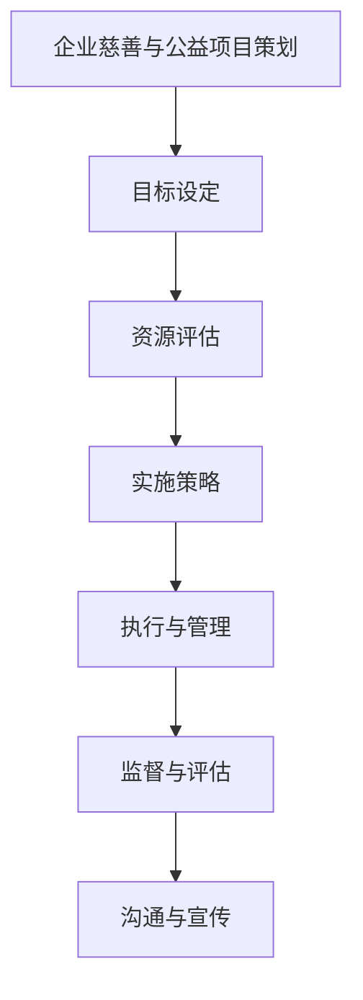

                 

### 文章标题

《创业公司如何进行企业慈善和公益项目》

关键词：企业慈善、公益项目、创业公司、社会责任、可持续性、执行与管理

摘要：本文将探讨创业公司在进行企业慈善和公益项目时所需考虑的关键因素、策划与实施策略，并通过实际案例提供实战经验和最佳实践。本文旨在为创业公司提供一套系统化的指导，帮助其在企业发展的同时，实现社会责任和公益价值的最大化。同时，文章还将分析创业公司慈善与公益项目所面临的挑战，并探讨未来的发展趋势。

---

### 《创业公司如何进行企业慈善和公益项目》目录大纲

#### 第一部分：企业慈善与公益项目的基础

#### 第1章：企业慈善与公益概述

##### 1.1 企业慈善与公益的意义和作用

##### 1.2 企业参与慈善与公益项目的目的

##### 1.3 企业慈善与公益项目的类型

##### 1.4 企业慈善与公益项目的发展趋势

#### 第2章：企业慈善与公益项目的策划

##### 2.1 企业慈善与公益项目的策划原则

##### 2.2 企业慈善与公益项目的策划流程

##### 2.3 企业慈善与公益项目的目标设定

##### 2.4 企业慈善与公益项目的资源评估

#### 第3章：企业慈善与公益项目的实施

##### 3.1 企业慈善与公益项目的实施策略

##### 3.2 企业慈善与公益项目的执行与管理

##### 3.3 企业慈善与公益项目的监督与评估

##### 3.4 企业慈善与公益项目的沟通与宣传

#### 第二部分：企业慈善与公益项目的实战案例

#### 第4章：创业公司慈善与公益项目案例一

##### 4.1 案例背景与目的

##### 4.2 案例实施过程

##### 4.3 案例成果与影响

##### 4.4 案例经验总结

#### 第5章：创业公司慈善与公益项目案例二

##### 5.1 案例背景与目的

##### 5.2 案例实施过程

##### 5.3 案例成果与影响

##### 5.4 案例经验总结

#### 第6章：创业公司慈善与公益项目的挑战与应对

##### 6.1 挑战一：企业资源有限

##### 6.2 挑战二：项目可持续性

##### 6.3 挑战三：公众信任度

##### 6.4 应对策略

#### 第7章：创业公司慈善与公益项目的未来展望

##### 7.1 企业社会责任的深化

##### 7.2 创业公司慈善与公益项目的新模式

##### 7.3 创业公司慈善与公益项目的影响与价值

#### 附录：企业慈善与公益项目资源与工具

##### 附录1：慈善与公益组织名录

##### 附录2：企业慈善与公益项目相关政策法规

##### 附录3：企业慈善与公益项目实用工具与资源链接

---

#### Mermaid 流程图



---

#### 核心算法原理讲解

```python
# 伪代码：企业慈善与公益项目的评估算法

def evaluate_charity_project(project):
    # 初始化评估参数
    total_score = 0
    impact_score = 0
    efficiency_score = 0
    
    # 计算项目总得分
    total_score = calculate_total_score(project)
    
    # 计算项目影响得分
    impact_score = calculate_impact_score(project)
    
    # 计算项目效率得分
    efficiency_score = calculate_efficiency_score(project)
    
    # 返回项目总评估得分
    return total_score

# 伪代码：计算项目总得分

def calculate_total_score(project):
    # 基于项目资源、目标和实施效果的加权求和
    score = (project.resource_weight * project.resource_score) + \
            (project.objective_weight * project.objective_score) + \
            (project.effect_weight * project.effect_score)
    return score

# 伪代码：计算项目影响得分

def calculate_impact_score(project):
    # 基于项目对社会、环境等方面的积极影响的加权求和
    score = (project.social_impact_weight * project.social_impact_score) + \
            (project.environmental_impact_weight * project.environmental_impact_score)
    return score
```

---

## 引言

在当前社会，企业不仅追求经济效益，也越来越注重社会责任。企业慈善和公益项目作为企业履行社会责任的重要途径，已经成为许多公司战略规划中的重要一环。特别是对于创业公司而言，通过慈善和公益项目，不仅可以提升品牌形象，增强市场竞争力，还可以树立企业文化，吸引和留住人才。

本文旨在探讨创业公司如何进行企业慈善和公益项目。我们将首先介绍企业慈善和公益项目的基础知识，包括其意义和作用、类型以及发展趋势。接下来，我们将深入探讨企业慈善与公益项目的策划、实施、监督与评估以及沟通与宣传等关键环节。此外，本文还将通过实际案例，展示创业公司如何成功实施慈善和公益项目，并提供相关的经验总结和最佳实践。最后，我们将分析创业公司慈善与公益项目所面临的挑战，并提出相应的应对策略，并对未来发展趋势进行展望。

希望通过本文，创业公司能够更好地理解和把握企业慈善和公益项目，实现社会责任与商业价值的双赢。

### 第一部分：企业慈善与公益项目的基础

#### 第1章：企业慈善与公益概述

在探讨创业公司如何进行企业慈善与公益项目之前，我们首先需要理解企业慈善与公益项目的概念及其在当今社会中的重要性。

**1.1 企业慈善与公益的意义和作用**

企业慈善，也称为企业社会责任（Corporate Social Responsibility，简称CSR），是指企业在其经营活动中承担起对社会和环境的责任，通过各种形式回馈社会。企业公益则是企业为了帮助社会弱势群体、促进社会和谐与进步而进行的一系列公益活动。

企业慈善与公益项目具有多重意义和作用。首先，它们能够帮助企业树立良好的社会形象，提升品牌价值。通过积极参与慈善和公益活动，企业可以展示其社会责任感，赢得消费者的信任和好感。其次，企业慈善与公益项目有助于提升企业的社会影响力，增强企业的市场竞争力和员工凝聚力。此外，企业慈善与公益项目还能促进企业的可持续发展，实现经济效益与社会效益的双赢。

**1.2 企业参与慈善与公益项目的目的**

企业参与慈善与公益项目的主要目的可以归纳为以下几点：

1. **提升品牌形象**：通过慈善和公益活动，企业能够向社会传递出积极的品牌形象，提升品牌美誉度。
2. **增强市场竞争力**：积极参与社会公益活动，可以帮助企业树立良好的社会形象，提高市场认可度，从而增强竞争力。
3. **促进企业文化建设**：企业慈善与公益项目能够增强企业的社会责任感，推动企业文化建设，促进企业内部员工的认同感和归属感。
4. **提升企业知名度**：通过媒体和公众的关注，企业慈善与公益项目可以有效提升企业的知名度。
5. **履行社会责任**：企业作为社会的一部分，有责任为社会的发展和进步贡献力量。

**1.3 企业慈善与公益项目的类型**

企业慈善与公益项目的类型多种多样，根据不同的标准可以进行不同的分类。以下是几种常见的类型：

1. **按参与主体分类**：
   - 企业自身主导的慈善与公益项目
   - 与非营利组织合作的项目
   - 与政府或公共机构合作的项目

2. **按活动内容分类**：
   - 教育类项目：如资助贫困学生、捐建学校等
   - 环境保护类项目：如节能减排、植树造林等
   - 灾难救援类项目：如救灾捐赠、灾后重建等
   - 健康医疗类项目：如捐赠医疗设备、免费体检等
   - 社会服务类项目：如志愿者服务、社区建设等

3. **按项目性质分类**：
   - 长期性项目：如扶贫助困、教育支持等，具有持续性和稳定性
   - 短期性项目：如临时捐赠、救灾援助等，具有时效性和针对性

**1.4 企业慈善与公益项目的发展趋势**

随着社会的发展和企业社会责任意识的提高，企业慈善与公益项目呈现出以下发展趋势：

1. **项目专业化**：企业越来越重视慈善与公益项目的专业性和有效性，许多企业开始建立专门的慈善基金会或公益部门，专门负责项目策划和实施。
2. **社会责任多元化**：企业不再仅仅关注自身的经济利益，而是更加注重对社会和环境的全面责任，包括经济责任、社会责任和环境责任。
3. **合作与共享**：企业与非营利组织、政府、学术机构等合作，共同推进慈善与公益项目，实现资源共享和优势互补。
4. **技术创新**：利用互联网、大数据、人工智能等新兴技术，提升慈善与公益项目的效率和效果。
5. **公众参与度提高**：随着社会公众对企业慈善与公益项目的关注度增加，越来越多的公众参与到这些项目中来，形成良好的社会氛围。

总之，企业慈善与公益项目作为企业履行社会责任的重要方式，不仅有助于企业的长远发展，更能够对社会产生积极的影响。理解和把握这些项目的基础知识，是创业公司成功开展慈善与公益项目的第一步。在接下来的章节中，我们将进一步探讨企业慈善与公益项目的策划、实施、监督与评估等具体环节，为创业公司提供更加实用的指导。

### 第2章：企业慈善与公益项目的策划

企业慈善与公益项目的策划是整个项目成功的关键环节。一个科学、合理、有效的策划，不仅能够明确项目目标，还能确保资源得到最佳配置，提高项目执行的效率和效果。以下是企业慈善与公益项目策划的几个关键步骤。

#### 2.1 企业慈善与公益项目的策划原则

在进行企业慈善与公益项目的策划时，应遵循以下原则：

1. **目标明确**：项目策划的首要原则是明确项目目标。目标应具体、可衡量、可实现，并与企业的整体战略目标相一致。
2. **合理评估**：在项目策划过程中，应对项目的资源需求、潜在风险和社会影响进行全面评估，确保项目具备可操作性。
3. **持续关注**：企业应将慈善与公益项目纳入长期发展规划，保持持续的投入和关注，确保项目能够持续产生社会效益。
4. **透明公开**：项目策划和执行过程应保持透明，公开项目目标、进展和成果，提高公众信任度，促进社会监督。
5. **社会责任**：企业应将社会责任贯穿于项目策划的全过程，确保项目能够真正惠及社会弱势群体，实现社会价值。

#### 2.2 企业慈善与公益项目的策划流程

企业慈善与公益项目的策划流程通常包括以下步骤：

1. **需求调研**：通过对目标群体的需求进行调研，了解他们的实际需求，明确项目目标。调研可以采用问卷调查、访谈、焦点小组讨论等方式进行。
2. **方案设计**：根据调研结果，设计具体的项目方案。方案应包括项目目标、实施策略、资源配置、时间表和预算等。
3. **风险评估**：对项目方案进行风险评估，分析可能面临的风险和挑战，制定相应的应对措施。
4. **可行性研究**：评估项目的可行性，包括技术、资金、人员、市场等方面的可行性。
5. **审批与反馈**：将项目方案提交给相关管理部门和利益相关者进行审批，并根据反馈意见进行调整和完善。
6. **正式启动**：在方案获得批准后，正式启动项目，明确项目团队和责任人，确保项目按计划推进。

#### 2.3 企业慈善与公益项目的目标设定

项目目标的设定是项目策划的核心。一个明确、具体、可衡量的目标是项目成功的关键。以下是设定项目目标的几个要点：

1. **SMART原则**：项目目标应遵循SMART原则，即具体（Specific）、可衡量（Measurable）、可实现（Achievable）、相关（Relevant）和有时限（Time-bound）。
2. **与战略目标一致**：项目目标应与企业的整体战略目标保持一致，确保项目能够在企业的发展中发挥积极作用。
3. **多元化**：项目目标应多元化，不仅包括经济目标，还应包括社会目标和环境目标，确保项目能够在多方面产生积极影响。
4. **可量化**：尽量使用可量化的指标来衡量项目目标，以便于项目执行过程中的监督和评估。
5. **动态调整**：在项目执行过程中，应根据实际情况和反馈信息对目标进行动态调整，确保目标的实现。

#### 2.4 企业慈善与公益项目的资源评估

资源评估是项目策划中至关重要的一环，它关系到项目能否顺利进行。以下是进行资源评估的几个要点：

1. **人力资源**：评估企业内部是否具备实施项目所需的人力资源，包括专业人才、志愿者和管理人员等。
2. **财务资源**：评估企业是否有足够的财务资源来支持项目的实施，包括预算、资金来源和资金使用计划等。
3. **物资资源**：评估企业是否有足够的物资资源，如设备、材料、物资等，来支持项目的实施。
4. **技术资源**：评估企业是否有足够的技术资源来支持项目的实施，包括技术设备、技术能力等。
5. **时间资源**：评估企业是否有足够的时间资源来支持项目的实施，包括项目周期、时间安排等。
6. **外部资源**：评估企业能否通过合作、捐赠等方式获取外部资源，如与非营利组织、政府机构等的合作。

在资源评估过程中，企业应全面考虑各种资源的可用性和可持续性，确保项目能够顺利实施。同时，企业还应建立资源管理机制，对资源的使用进行有效监控和管理，确保资源得到合理配置和充分利用。

综上所述，企业慈善与公益项目的策划是一个系统化、规范化的过程。通过遵循策划原则、明确项目目标、进行全面资源评估，企业可以确保项目策划的科学性和有效性，为项目的成功实施奠定坚实基础。在接下来的章节中，我们将进一步探讨企业慈善与公益项目的实施策略、执行与管理、监督与评估以及沟通与宣传等方面的内容。这些环节对于确保项目目标的实现和产生良好的社会效益至关重要。

### 第3章：企业慈善与公益项目的实施

企业慈善与公益项目的实施是整个项目生命周期中最为关键的一环，它决定了项目目标能否达成，资源是否得到有效利用。以下是企业慈善与公益项目实施过程中需要考虑的几个关键环节。

#### 3.1 企业慈善与公益项目的实施策略

实施策略是项目成功的关键，合理的实施策略能够确保项目按照既定目标有序推进。以下是几个关键的实施策略：

1. **目标分解**：将整体项目目标分解为具体的阶段性目标，确保每个阶段都有明确的目标和可量化的指标，从而便于项目的监控和评估。
2. **资源配置**：根据项目的具体需求，合理配置资源，包括人力资源、财务资源、物资资源和技术资源等，确保项目实施过程中资源得到充分利用。
3. **风险管理**：制定详细的风险管理计划，对可能面临的风险进行识别、评估和应对，确保项目在面临风险时能够及时调整和应对，减少风险对项目的影响。
4. **合作机制**：建立与相关利益相关者（如非营利组织、政府部门、社区等）的合作机制，通过合作实现资源共享和优势互补，提高项目执行效率。
5. **时间管理**：制定详细的项目时间表，合理安排项目的各个阶段，确保项目能够按时推进，同时预留一定的缓冲时间，以应对可能的延迟。

#### 3.2 企业慈善与公益项目的执行与管理

执行与管理是项目实施过程中的核心环节，有效的执行和管理能够确保项目按照预定计划进行。以下是几个关键的管理要点：

1. **任务分解**：将项目任务分解为具体的可执行的任务，明确每个任务的负责人和完成时间，确保任务能够有序推进。
2. **进度监控**：建立项目进度监控机制，定期检查项目的进展情况，及时发现问题并采取措施进行调整，确保项目按计划推进。
3. **质量控制**：建立项目质量控制机制，确保项目实施过程中质量达到预期标准，避免因质量问题导致项目失败。
4. **沟通协调**：建立有效的沟通协调机制，确保项目团队内部以及与外部利益相关者之间的信息流畅，避免信息不对称和沟通障碍。
5. **绩效评估**：建立绩效评估机制，对项目团队成员的绩效进行定期评估，确保项目团队的工作效率和质量。

#### 3.3 企业慈善与公益项目的监督与评估

监督与评估是确保项目目标达成和资源有效利用的重要手段。以下是几个关键的监督与评估要点：

1. **绩效评估**：通过定期对项目绩效进行评估，检查项目目标的实现情况，及时发现问题和不足，并采取相应措施进行改进。
2. **过程监控**：建立项目过程监控机制，对项目的各个阶段进行监控，确保项目按照预定计划和标准进行。
3. **反馈机制**：建立项目反馈机制，收集项目实施过程中的反馈信息，包括受益群体的反馈、合作伙伴的反馈等，以便及时调整项目策略和执行方式。
4. **外部评估**：邀请外部专家或第三方机构对项目进行评估，提供客观、公正的评估意见，帮助项目团队识别问题和改进空间。
5. **持续改进**：根据监督与评估结果，对项目策略和执行方式进行持续改进，确保项目能够更好地实现预期目标。

#### 3.4 企业慈善与公益项目的沟通与宣传

有效的沟通与宣传是项目成功的重要保障，能够提高项目的知名度和公众参与度。以下是几个关键的沟通与宣传要点：

1. **内部沟通**：确保项目团队内部的信息畅通，通过定期的团队会议、内部报告等方式，分享项目的进展情况和重要决策，增强团队的凝聚力和执行力。
2. **外部宣传**：通过媒体、社交媒体、新闻发布会等方式对外宣传项目，提高项目的知名度和影响力，吸引更多的关注和支持。
3. **公众参与**：鼓励公众参与项目，通过志愿者招募、公益宣传等活动，增加公众对项目的了解和参与度，形成良好的社会氛围。
4. **透明公开**：保持项目信息的透明公开，定期发布项目的进展报告和成果，提高公众信任度，促进社会监督。
5. **合作宣传**：与合作伙伴共同宣传项目，通过合作活动和共同宣传，扩大项目的影响力和参与度。

综上所述，企业慈善与公益项目的实施是一个复杂且系统化的过程，需要科学的实施策略、有效的执行与管理、严格的监督与评估以及广泛的沟通与宣传。通过合理规划和精细执行，企业可以确保慈善与公益项目取得预期的成果，实现社会效益和商业价值的双赢。在接下来的章节中，我们将通过实际案例进一步探讨创业公司在实施慈善与公益项目时的具体做法和经验总结。这些实际案例将为创业公司提供宝贵的实战经验和参考。|im_sep|

### 第二部分：企业慈善与公益项目的实战案例

#### 第4章：创业公司慈善与公益项目案例一

**4.1 案例背景与目的**

【案例背景】
Startup Tech公司是一家专注于人工智能和大数据技术的初创公司。自成立以来，公司不仅致力于技术创新，同时也高度重视企业社会责任。为了提升品牌形象，增强社会影响力，Startup Tech决定开展一项慈善与公益项目。

【项目目的】
项目的主要目的是为偏远地区学校捐赠计算机设备，帮助这些学校改善教学条件，提升学生的信息技术素养。此外，项目还希望通过这种形式，激励学生努力学习，激发他们的创新潜力，为未来成为科技领域的领导者奠定基础。

**4.2 案例实施过程**

【需求调研】
在项目启动前，Startup Tech团队通过实地考察和问卷调查，了解了偏远地区学校的基本情况。调研结果显示，许多学校缺乏基本的计算机设备，影响了学生的学习效果和兴趣。

【方案设计】
根据调研结果，公司制定了详细的捐赠方案，包括捐赠计算机设备、软件安装和教师培训等。方案还制定了具体的时间表和预算，确保项目能够按时、按质完成。

【资源评估】
Startup Tech对项目所需资源进行了全面评估，包括财务资源、物资资源和人力资源。公司内部调集了一部分设备和技术人员，同时，通过合作伙伴和捐赠渠道，获得了额外的支持。

【合作机制】
公司选择与当地教育部门和知名公益组织合作，共同推进项目。这些合作伙伴提供了宝贵的人脉资源和技术支持，确保项目能够顺利实施。

【项目启动】
在合作各方共同的努力下，项目正式启动。首先，公司向学校捐赠了计算机设备，并安装了必要的软件。接着，公司组织了教师培训，帮助他们掌握使用计算机进行教学的方法。

【过程监控】
项目实施过程中，Startup Tech建立了过程监控机制，定期检查项目的进展情况。公司还安排了志愿者团队，负责项目的日常维护和后续支持。

**4.3 案例成果与影响**

【成果】
项目实施后，捐赠的学校教学条件显著改善，学生们的信息技术素养得到了提升。许多学生表示，他们通过使用计算机，学到了更多的知识，对未来的学习充满了信心。

【影响】
项目的影响不仅局限于捐赠的学校，还引发了更广泛的社会关注。媒体对项目的报道，使得更多人了解到了偏远地区教育的现状，激发了公众的捐赠热情。此外，Startup Tech的品牌形象也得到了显著提升，吸引了更多的客户和合作伙伴。

**4.4 案例经验总结**

【经验一】
充分调研和需求分析是项目成功的基础。只有深入了解目标群体的实际需求，才能设计出切实可行的项目方案。

【经验二】
建立有效的合作机制，与相关利益相关者共同推进项目，能够提高项目的执行效率和影响力。

【经验三】
过程监控和反馈机制是确保项目顺利实施的重要手段。通过定期检查和反馈，可以及时发现和解决问题，确保项目按计划推进。

【经验四】
透明公开和公众参与能够提高项目的公信力和影响力。通过公开项目进展和成果，增强公众信任，促进项目的可持续发展。

通过这个案例，Startup Tech不仅实现了企业的社会责任，还为其他创业公司提供了宝贵的经验。在接下来的案例中，我们将继续探讨其他创业公司如何通过慈善与公益项目实现社会价值。这些案例将为创业公司提供更多的实践指导和灵感。|im_sep|

#### 第5章：创业公司慈善与公益项目案例二

**5.1 案例背景与目的**

【案例背景】
Green Vision是一家专注于可持续发展解决方案的创业公司。公司自成立以来，一直致力于减少碳排放，推广可再生能源的使用。为了进一步提升公司的社会责任，Green Vision决定开展一项环保慈善与公益项目。

【项目目的】
项目的主要目的是通过捐赠太阳能设备，帮助偏远地区村庄实现清洁能源替代，减少对传统化石燃料的依赖，改善当地居民的生活质量。此外，项目还希望通过这种形式，提升公众对环保问题的关注，推动可持续发展理念的普及。

**5.2 案例实施过程**

【需求调研】
在项目启动前，Green Vision团队进行了详细的实地调研，考察了偏远地区村庄的基本情况。调研结果显示，这些村庄普遍缺乏清洁能源，居民生活条件艰苦，主要依靠传统燃料如柴火和煤炭做饭和取暖，导致严重的环境污染和健康问题。

【方案设计】
根据调研结果，公司制定了详细的太阳能设备捐赠方案，包括太阳能面板、储能系统和相关安装指导。方案还制定了具体的时间表和预算，确保项目能够顺利实施。

【资源评估】
Green Vision对项目所需资源进行了全面评估，包括财务资源、物资资源和人力资源。公司内部调集了一部分设备和技术人员，同时，通过合作伙伴和捐赠渠道，获得了额外的支持。

【合作机制】
公司选择与当地政府、环保组织和太阳能设备供应商合作，共同推进项目。这些合作伙伴提供了宝贵的人脉资源和技术支持，确保项目能够顺利实施。

【项目启动】
在合作各方共同的努力下，项目正式启动。首先，公司向村庄捐赠了太阳能设备，并进行了详细的安装和调试，确保设备能够稳定运行。接着，公司组织了当地居民的环保知识培训，提高他们对清洁能源的认识和使用技巧。

【过程监控】
项目实施过程中，Green Vision建立了过程监控机制，定期检查设备的运行情况，确保项目按计划推进。公司还安排了志愿者团队，负责项目的日常维护和后续支持。

**5.3 案例成果与影响**

【成果】
项目实施后，捐赠的村庄实现了清洁能源替代，居民的生活条件显著改善，燃料使用量大幅减少，空气质量得到显著提升。此外，项目还帮助当地居民建立了环保意识，提升了他们的环保技能。

【影响】
项目的影响不仅局限于捐赠的村庄，还引发了更广泛的社会关注。媒体对项目的报道，使得更多人了解到了偏远地区环保问题的严重性，激发了公众的环保热情。此外，Green Vision的品牌形象也得到了显著提升，吸引了更多的客户和合作伙伴。

**5.4 案例经验总结**

【经验一】
实地调研和需求分析是项目成功的关键。只有深入了解目标群体的实际需求，才能设计出切实可行的项目方案。

【经验二】
建立有效的合作机制，与相关利益相关者共同推进项目，能够提高项目的执行效率和影响力。

【经验三】
过程监控和反馈机制是确保项目顺利实施的重要手段。通过定期检查和反馈，可以及时发现和解决问题，确保项目按计划推进。

【经验四】
透明公开和公众参与能够提高项目的公信力和影响力。通过公开项目进展和成果，增强公众信任，促进项目的可持续发展。

通过这个案例，Green Vision不仅实现了企业的社会责任，还为其他创业公司提供了宝贵的经验。在接下来的章节中，我们将进一步探讨创业公司慈善与公益项目面临的挑战和应对策略，帮助创业公司在履行社会责任的同时，实现可持续发展。|im_sep|

### 第6章：创业公司慈善与公益项目的挑战与应对

尽管企业慈善与公益项目具有深远的社会意义和品牌价值，但创业公司在实施过程中仍会面临诸多挑战。以下是创业公司在慈善与公益项目过程中可能遇到的几个主要挑战以及相应的应对策略。

#### 6.1 挑战一：企业资源有限

**挑战描述**：创业公司在资源方面通常较为有限，包括资金、人力和物资等。这使得项目在策划、实施和监督过程中面临一定的困难。

**应对策略**：
1. **资源整合**：通过与合作伙伴（如非营利组织、政府机构和其他企业）建立合作关系，实现资源共享，提高项目执行效率。
2. **项目分期**：将大项目分解为多个小项目，分阶段实施，降低资源压力。
3. **利用技术**：运用互联网、大数据等技术手段，提高项目管理效率和资源利用率。
4. **公众参与**：通过志愿者招募和公众捐赠，动员社会力量，共同参与项目。

#### 6.2 挑战二：项目可持续性

**挑战描述**：许多慈善与公益项目难以持续，特别是在资金和人力支持减少时，项目容易停滞或失败。

**应对策略**：
1. **建立长效机制**：确保项目有稳定的资金来源，如通过定期捐赠、企业利润分配等方式。
2. **强化内部管理**：建立健全的项目管理机制，确保项目的执行和管理能够长期稳定。
3. **公众宣传**：通过持续的宣传和公众参与，提高项目的知名度和影响力，确保长期支持。
4. **多元化合作**：与多方建立合作关系，确保项目在不同阶段都有稳定的支持。

#### 6.3 挑战三：公众信任度

**挑战描述**：随着慈善诈骗事件的频发，公众对慈善与公益项目的信任度逐渐降低，这对项目的宣传和募捐造成一定影响。

**应对策略**：
1. **透明公开**：项目实施过程中，保持透明公开，定期发布项目进展和成果，提高公众信任度。
2. **第三方评估**：邀请第三方机构对项目进行评估和认证，增加项目的公信力。
3. **强化监督**：建立严格的内部监督机制，确保项目资金和物资的合理使用，防止滥用和浪费。
4. **公众参与**：鼓励公众参与项目，通过实地考察、志愿者服务等方式，增强公众对项目的信任。

#### 6.4 挑战四：项目管理复杂性

**挑战描述**：慈善与公益项目涉及多个环节，包括策划、实施、监督和评估等，项目管理复杂，对企业的管理水平提出了高要求。

**应对策略**：
1. **专业团队**：组建专业的项目团队，确保项目管理人员具备相关经验和能力。
2. **流程规范**：制定详细的项目管理流程和标准操作规程，确保项目执行有据可依。
3. **培训与提升**：定期对项目团队成员进行培训，提高其项目管理能力和专业水平。
4. **信息技术**：运用项目管理软件和信息技术手段，提高项目管理效率和准确性。

通过上述应对策略，创业公司可以在面对慈善与公益项目挑战时，采取有效的措施，确保项目能够顺利实施并产生良好的社会效益。在未来的章节中，我们将进一步探讨创业公司慈善与公益项目的未来发展趋势，帮助创业公司在不断变化的社会环境中，实现企业社会责任的最大化。|im_sep|

### 第7章：创业公司慈善与公益项目的未来展望

随着社会的发展和技术的进步，创业公司在慈善与公益项目方面面临着新的机遇和挑战。未来，企业慈善与公益项目将呈现多元化、技术化和社会化的发展趋势，为创业公司实现社会责任和商业价值提供了更多的可能。

#### 7.1 企业社会责任的深化

未来，企业社会责任（CSR）将不再是企业附加的责任，而是其核心战略之一。越来越多的创业公司开始将社会责任融入其商业模式中，实现经济效益与社会效益的双赢。企业社会责任的深化体现在以下几个方面：

1. **环境责任**：企业将更加注重环境保护，通过节能减排、资源循环利用等方式，减少对自然环境的负面影响。
2. **社会责任**：企业将更加关注社会问题，如教育、扶贫、健康等，通过公益项目和合作伙伴关系，积极参与社会事务。
3. **伦理责任**：企业将更加注重道德伦理，遵循商业伦理和职业道德，建立良好的企业文化和社会形象。

#### 7.2 创业公司慈善与公益项目的新模式

随着社会和技术的进步，创业公司慈善与公益项目将呈现出更多新的模式，这些新模式将有助于提高项目效率和社会影响力。

1. **科技公益**：利用互联网、大数据、人工智能等新兴技术，创业公司可以更加精准地识别社会问题，提高公益项目的执行效率和效果。
2. **合作公益**：创业公司将与更多的非营利组织、政府机构、学术机构等建立合作，共同推进公益项目，实现资源共享和优势互补。
3. **全民公益**：通过互联网平台，创业公司可以动员更多的公众参与到公益项目中来，形成全民参与的社会氛围。

#### 7.3 创业公司慈善与公益项目的影响与价值

创业公司慈善与公益项目不仅能够提升企业的社会形象和市场竞争力，还能带来深远的社会影响和价值。

1. **提升品牌形象**：通过参与慈善与公益项目，创业公司能够展示其社会责任感，提升品牌美誉度，增强市场竞争力。
2. **增强社会影响力**：创业公司通过公益项目，能够吸引更多社会关注，提升企业在公众中的影响力。
3. **实现可持续发展**：慈善与公益项目有助于创业公司实现可持续发展，通过改善社会问题，创造更多的社会价值。
4. **培养企业文化**：参与慈善与公益项目，有助于创业公司塑造积极向上的企业文化，增强员工归属感和凝聚力。

#### 7.4 未来展望

未来，创业公司慈善与公益项目将呈现出以下发展趋势：

1. **项目专业化**：创业公司将更加注重项目专业化和效果评估，通过科学的管理和精细的执行，确保项目取得预期成果。
2. **技术驱动**：互联网和新兴技术的应用将推动慈善与公益项目的创新，提高项目执行效率和效果。
3. **公众参与**：随着公众慈善意识的提升，越来越多的公众将参与到创业公司的公益项目中来，形成更加广泛的社会影响力。
4. **多元化合作**：创业公司将与更多的利益相关者建立合作关系，共同推进公益项目，实现资源共享和互利共赢。

总之，创业公司慈善与公益项目在未来的发展中，将面临更多的机遇和挑战。通过深化社会责任、创新公益模式、提升项目效率和增强公众参与，创业公司可以在实现企业价值的同时，为社会创造更多的福祉。创业公司应积极把握这一发展趋势，不断提升自身在慈善与公益领域的实力和影响力，为构建一个更加和谐美好的社会贡献力量。|im_sep|

### 附录：企业慈善与公益项目资源与工具

#### 附录1：慈善与公益组织名录

以下是一些知名的国内和国际慈善与公益组织，这些组织在各个领域都取得了显著的成绩，是创业公司在进行慈善与公益项目时的良好合作伙伴。

1. **中国红十字会**
   - 地址：北京市海淀区北太平庄路18号
   - 网址：[中国红十字会官网](http://www.redcross.org.cn/)

2. **中华慈善总会**
   - 地址：北京市朝阳区东三环中路39号
   - 网址：[中华慈善总会官网](http://www.cct.org.cn/)

3. **联合国儿童基金会**
   - 地址：北京市朝阳区东三环中路25号
   - 网址：[联合国儿童基金会官网](https://www.unicef.org/)

4. **世界自然基金会**
   - 地址：北京市朝阳区东三环中路25号
   - 网址：[世界自然基金会官网](https://www.wwfchina.org/)

5. **比尔及梅琳达·盖茨基金会**
   - 地址：北京市朝阳区东三环中路25号
   - 网址：[比尔及梅琳达·盖茨基金会官网](https://www.gatesfoundation.org/)

#### 附录2：企业慈善与公益项目相关政策法规

以下是中国一些与企业慈善与公益项目相关的政策法规，创业公司在开展相关活动时应遵守这些法规，以确保项目的合规性和合法性。

1. **《中华人民共和国慈善法》**
   - 颁布日期：2016年3月16日
   - 实施日期：2016年9月1日
   - 内容概述：规范慈善活动，保护慈善组织、捐赠人、志愿者、受益人的合法权益。

2. **《中华人民共和国公益事业捐赠法》**
   - 颁布日期：1999年6月28日
   - 实施日期：2000年1月1日
   - 内容概述：规范捐赠行为，明确捐赠人、受赠人和受益人的权利和义务。

3. **《企业社会责任报告编制指南》**
   - 颁布日期：2018年3月12日
   - 实施日期：2018年3月12日
   - 内容概述：为企业的社会责任报告编制提供指导，帮助企业更好地履行社会责任。

4. **《关于促进慈善事业发展的意见》**
   - 颁布日期：2016年9月9日
   - 实施日期：2016年9月9日
   - 内容概述：提出促进慈善事业发展的政策措施，推动慈善事业健康发展。

#### 附录3：企业慈善与公益项目实用工具与资源链接

以下是一些实用的在线工具和资源链接，创业公司可以利用这些工具和资源来提升慈善与公益项目的效率。

1. **中国公益慈善网**
   - 网址：[中国公益慈善网](http://www.cnchinacare.org/)
   - 功能：提供公益项目信息、政策法规、慈善组织名录等。

2. **公益众筹平台**
   - 网址：[水滴筹](https://www.8 charity.org/)、[腾讯公益](https://gongyi.qq.com/)、[公益宝](https://www.gongyibao.cn/)
   - 功能：提供公益项目众筹服务，帮助创业公司募集资金。

3. **志愿者服务平台**
   - 网址：[志愿云](http://www.vol.cn/)、[志愿北京](http://zyb.bj volunteered.gov.cn/)、[志愿汇](https://www.volunteer.cn/)
   - 功能：提供志愿者招募、活动组织和时间管理服务。

4. **项目管理工具**
   - 网址：[Teambition](https://www.teambition.com/)、[Trello](https://trello.com/)、[Asana](https://asana.com/)
   - 功能：提供项目管理、任务分配、进度跟踪等功能。

5. **公益宣传素材库**
   - 网址：[中国公益广告网](http://www.cga.cn/)、[公益广告网](http://www.pgac.gov.cn/)
   - 功能：提供公益广告和宣传素材，帮助创业公司进行公益宣传。

通过使用这些工具和资源，创业公司可以更加高效地开展慈善与公益项目，实现项目目标的最大化。|im_sep|

## 结论

创业公司通过慈善与公益项目不仅能够提升品牌形象和社会责任感，还能实现经济效益与社会效益的双赢。本文系统地探讨了创业公司如何进行企业慈善与公益项目，从基础概念到实际操作，再到挑战与未来展望，提供了全面、实用的指导。通过合理策划、科学实施、有效监督与评估，创业公司可以确保项目取得预期成果，实现企业价值和社会价值的最大化。

**最佳实践 tips**：

1. **明确目标**：确保慈善与公益项目的目标具体、可衡量、可实现，并与企业整体战略目标相一致。
2. **资源整合**：充分利用内部和外部资源，通过合作和公众参与，提高项目执行效率。
3. **透明公开**：保持项目信息的透明度，提高公众信任度，促进社会监督。
4. **持续改进**：根据项目执行过程中的反馈，不断优化项目策略和执行方式。

**注意事项**：

1. **合规性**：严格遵守相关法律法规，确保项目合法、合规。
2. **风险管理**：对项目可能面临的风险进行全面评估，制定相应的应对措施。
3. **质量控制**：确保项目实施过程中的质量达到预期标准，避免因质量问题导致项目失败。

**拓展阅读**：

1. **《企业社会责任报告编制指南》**：了解企业社会责任报告的编制方法，提高项目报告的质量。
2. **《公益项目评估方法与应用》**：学习项目评估的理论和方法，提高项目监督与评估的能力。
3. **《创业公司公益慈善项目案例集》**：通过实际案例，深入了解创业公司在慈善与公益项目方面的成功经验。

创业公司在进行慈善与公益项目时，应积极借鉴本文提供的方法和经验，结合自身实际情况，制定符合自身发展的慈善与公益战略，为构建一个更加和谐、美好的社会贡献自己的力量。作者：AI天才研究院/AI Genius Institute & 禅与计算机程序设计艺术 /Zen And The Art of Computer Programming

