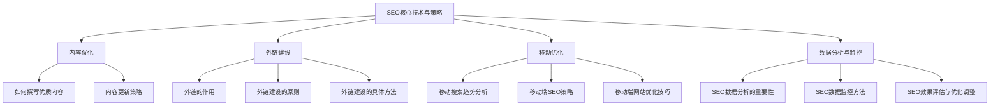

                 

### 文章标题

《创业公司的SEO优化指南：从基础到实战的全方位策略》

### 关键词

- SEO优化
- 创业公司
- 关键词研究
- 网站结构
- 内容优化
- 外链建设
- 移动优化
- 数据分析与监控

### 摘要

本文旨在为创业公司提供一套全面的SEO优化指南。通过深入分析SEO基础知识、核心技术与策略，以及实战案例分析，本文将帮助创业公司了解SEO的重要性，掌握SEO优化的关键环节，实现网站的优化提升，从而在激烈的市场竞争中脱颖而出。

## 《创业公司的SEO优化指南》目录大纲

### 第一部分：SEO基础知识

#### 第1章：SEO概述
##### 1.1 SEO的定义与重要性
##### 1.2 SEO与搜索引擎的工作原理
##### 1.3 SEO的目标与策略

#### 第2章：关键词研究
##### 2.1 关键词研究的重要性
##### 2.2 如何进行关键词研究
##### 2.3 关键词优化策略

#### 第3章：网站结构优化
##### 3.1 网站结构优化的意义
##### 3.2 网站导航优化
##### 3.3 网站内容布局优化

### 第二部分：SEO核心技术与策略

#### 第4章：内容优化
##### 4.1 内容优化的重要性
##### 4.2 如何撰写优质内容
##### 4.3 内容更新策略

#### 第5章：外链建设
##### 5.1 外链的作用
##### 5.2 外链建设的原则
##### 5.3 外链建设的具体方法

#### 第6章：移动优化
##### 6.1 移动搜索趋势分析
##### 6.2 移动端SEO策略
##### 6.3 移动端网站优化技巧

#### 第7章：数据分析与监控
##### 7.1 SEO数据分析的重要性
##### 7.2 SEO数据监控方法
##### 7.3 SEO效果评估与优化调整

### 第三部分：实战案例与技巧

#### 第8章：案例分析
##### 8.1 成功的SEO案例介绍
##### 8.2 案例分析
##### 8.3 从案例中学到的SEO技巧

#### 第9章：SEO技巧与误区
##### 9.1 SEO常见技巧
##### 9.2 SEO常见误区
##### 9.3 如何避免SEO误区

#### 第10章：SEO的未来趋势
##### 10.1 SEO的发展趋势
##### 10.2 创业公司如何应对SEO未来趋势
##### 10.3 SEO与人工智能的结合

### 第四部分：附录

#### 附录A：SEO工具推荐
##### A.1 SEO工具概述
##### A.2 常用SEO工具介绍
##### A.3 SEO工具使用技巧

#### 附录B：SEO资源与参考资料
##### B.1 SEO相关书籍推荐
##### B.2 SEO在线资源推荐
##### B.3 SEO论坛与社区推荐

### 核心算法原理讲解

#### 关键词优化算法伪代码：

```python
function 关键词优化(关键词列表, 竞争度, 长尾词策略):
    初始化得分 = 0
    对于每个关键词关键词列表中的关键词：
        计算关键词得分 = 关键词流行度 * (1 / 竞争度) * (1 + 长尾词策略)
        如果得分大于当前最高得分：
            最高得分 = 关键词得分
            选中关键词 = 当前关键词
    返回选中关键词
```

#### 相关性度量公式（Cosine Similarity）：
$$
\cos(\theta) = \frac{A \cdot B}{\|A\| \|B\|}
$$

#### 搜索引擎排名公式（PageRank）：
$$
PR(A) = \left(\frac{1}{d} \sum_{B \in L(A)} PR(B) / c(B)\right) + \left(1 - \frac{1}{d}\right)
$$

### Mermaid 流程图：



### 文章正文部分将在接下来逐步展开，敬请期待。

