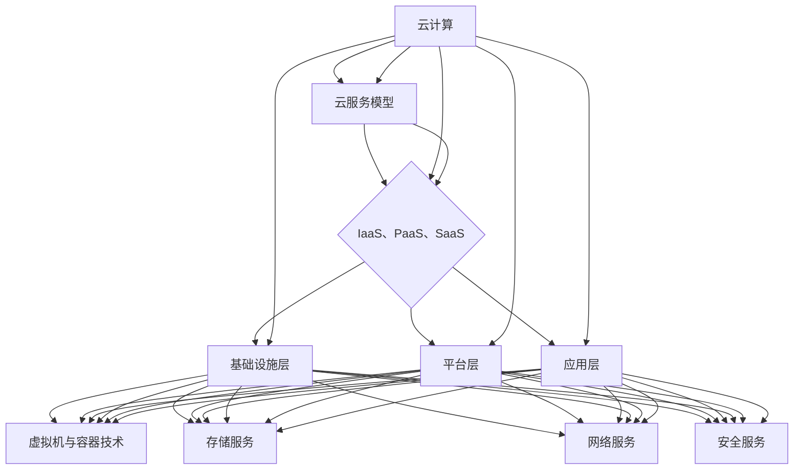

                 


### 文章标题
《创业公司的云服务选择与应用》

#### 关键词
云计算、云服务模型、创业公司、云服务提供商、云安全

#### 摘要
本文旨在为创业公司提供云服务的全面指南。首先，我们将介绍云计算的基础概念、云服务模型及其类型。接着，深入探讨云服务架构与组件，以及创业公司在云服务中的具体应用。本文还将分析创业公司在选择云服务提供商时所需考虑的因素，并讨论云服务的运维与安全管理。最后，通过实际案例分享，为创业公司提供云服务实践的建议与最佳实践。

---

### 第一部分：云服务概述

#### 第1章：云服务基础

##### 1.1 云计算概述

###### 1.1.1 云计算的定义
云计算是一种通过互联网提供动态易扩展且经常是虚拟化的资源的计算模式。它允许用户使用共享的硬件、软件、网络资源，按需提供服务，实现计算资源的优化利用。

###### 1.1.2 云计算的发展历程
云计算起源于20世纪60年代的“时间分享”理念，经历了大型机、分布式计算、网格计算等多个发展阶段。2006年，亚马逊推出AWS，标志着云计算商业化的开始。

###### 1.1.3 云计算的核心概念
云计算的核心概念包括虚拟化、自动化、弹性和按需服务。虚拟化是实现资源池化的基础，自动化提升了管理效率，弹性保证了资源按需分配，按需服务则满足了用户灵活的使用需求。

##### 1.2 云服务模型

###### 1.2.1 IaaS: 基础设施即服务
IaaS提供了虚拟化的计算资源，如虚拟机、存储和网络，用户可以自由配置和管理操作系统和应用程序。

###### 1.2.2 PaaS: 平台即服务
PaaS提供了一个开发和运行应用程序的平台，用户无需管理基础设施，专注于应用程序的开发。

###### 1.2.3 SaaS: 软件即服务
SaaS提供了基于互联网的应用程序，用户通过网络访问软件，无需关心基础设施和后端技术的维护。

##### 1.3 云服务类型

###### 1.3.1 公共云
公共云服务由第三方提供商运营，供多个用户使用，具有成本效益高、可扩展性强等优点。

###### 1.3.2 私有云
私有云为特定组织提供定制化的云服务，确保数据安全和合规性，适用于有特殊需求的企业。

###### 1.3.3 混合云
混合云结合了公共云和私有云的优势，允许数据在两者之间灵活迁移，满足不同场景的需求。

##### 1.4 云服务的优势与挑战

###### 1.4.1 云服务的优势
云服务提供了灵活性、可扩展性、成本效益和便捷性。它允许企业快速部署和扩展应用，降低基础设施投资和运营成本。

###### 1.4.2 云服务的挑战
云服务面临数据安全、隐私保护、服务可靠性、合规性等挑战。企业需要制定有效的策略来应对这些挑战。

###### 1.4.3 云服务的发展趋势
云服务将继续向多云、混合云和边缘计算方向发展，结合人工智能和大数据技术，提供更加智能化和自动化的服务。

---

#### 第2章：云服务架构与组件

##### 2.1 云服务架构概述

###### 2.1.1 云服务架构的核心组成部分
云服务架构主要包括基础设施层、平台层和应用层。基础设施层提供了计算、存储和网络资源，平台层提供了开发和部署环境，应用层提供了具体的业务应用。

###### 2.1.2 云服务架构的设计原则
云服务架构设计应遵循可扩展性、高可用性、灵活性和安全性原则，确保系统能够适应业务需求的变化，并提供可靠的服务。

##### 2.2 云服务组件详解

###### 2.2.1 虚拟机与容器技术
虚拟机技术提供了隔离和资源管理的功能，而容器技术则更轻量级，具有更高的性能和可移植性。容器技术在云服务中得到了广泛应用。

###### 2.2.2 负载均衡
负载均衡通过分配流量到多个服务器，提高系统的可用性和性能。它可以根据不同的策略（如轮询、最少连接等）分配请求。

###### 2.2.3 存储服务
云存储服务提供了弹性、高可用性和持久性的数据存储解决方案。常见的存储服务包括对象存储、块存储和文件存储。

###### 2.2.4 网络服务
网络服务包括虚拟网络、子网、负载均衡和VPN等，用于构建和管理云中的网络环境。

###### 2.2.5 安全服务
安全服务包括防火墙、入侵检测、访问控制等，用于保护云资源和数据的安全性。

##### 2.3 云服务部署模式

###### 2.3.1 集中式部署
集中式部署将所有服务部署在单一云环境或数据中心中，适用于资源密集型应用。

###### 2.3.2 分布式部署
分布式部署将服务部署在多个地理区域和云环境中，提高系统的可用性和可靠性。

###### 2.3.3 混合部署
混合部署结合了集中式和分布式部署的优势，适用于需要灵活资源分配和业务连续性的场景。

##### 2.4 云服务管理

###### 2.4.1 自动化运维
自动化运维通过自动化工具和脚本，减少人工干预，提高运维效率和可靠性。

###### 2.4.2 监控与日志管理
监控与日志管理用于实时监控系统状态和性能，通过收集和分析日志数据，诊断和解决潜在问题。

###### 2.4.3 资源优化与成本管理
资源优化与成本管理通过合理配置资源、优化服务部署，降低运营成本。

---

### 第二部分：云服务应用

#### 第3章：云服务在创业公司中的应用

##### 3.1 创业公司的云服务需求分析

###### 3.1.1 创业公司的特点
创业公司通常资源有限，需要快速响应市场变化，灵活调整业务策略。云服务为其提供了强大的支持，帮助其降低成本、提高效率。

###### 3.1.2 创业公司的云服务需求
创业公司的云服务需求包括快速部署、弹性扩展、成本效益、安全可靠等。他们需要能够快速搭建和扩展开发环境、数据处理平台和业务系统。

###### 3.1.3 创业公司的云服务规划
创业公司应根据自己的业务需求和预算，选择适合的云服务模型和提供商，制定合理的云服务规划，确保系统能够满足业务需求，并在成本和性能之间取得平衡。

##### 3.2 云服务在创业公司中的具体应用

###### 3.2.1 应用1：网站与移动应用托管
创业公司可以使用云服务提供商的托管服务，快速搭建和部署网站和移动应用，无需关心基础设施的维护。

###### 3.2.2 应用2：数据存储与处理
云服务提供了强大的数据存储和处理能力，创业公司可以利用这些服务进行数据备份、分析和挖掘，为业务决策提供支持。

###### 3.2.3 应用3：人工智能与大数据分析
云服务提供了丰富的AI和大数据工具和平台，创业公司可以利用这些资源进行数据分析和建模，推动业务创新。

###### 3.2.4 应用4：开发测试环境搭建
云服务提供了虚拟机和容器服务，创业公司可以快速搭建开发测试环境，提高开发效率。

###### 3.2.5 应用5：安全与合规性
云服务提供商通常具备完善的安全和合规性措施，创业公司可以利用这些服务保护数据安全，满足法规要求。

##### 3.3 创业公司云服务实施的挑战与解决方案

###### 3.3.1 面临的挑战
创业公司在云服务实施过程中可能面临技术选择困难、成本控制、数据安全和合规性等问题。

###### 3.3.2 解决方案与最佳实践
创业公司应选择适合的云服务提供商，制定详细的实施计划，加强技术培训，确保团队具备实施云服务的技能。同时，加强安全管理和监控，确保数据的机密性和完整性。

##### 3.4 成功案例分享

###### 3.4.1 案例一：创业公司A的云服务实施
创业公司A通过采用云服务，实现了业务的快速部署和扩展，降低了运营成本，提高了市场响应速度。

###### 3.4.2 案例二：创业公司B的云服务策略
创业公司B制定明确的云服务策略，选择适合的云服务提供商，实现了业务的稳定运行和快速发展。

###### 3.4.3 案例三：创业公司C的云服务转型
创业公司C通过云服务转型，提高了业务灵活性和竞争力，实现了业务的可持续增长。

---

### 第三部分：云服务的选择与优化

#### 第4章：云服务提供商比较

##### 4.1 市场概况

###### 4.1.1 全球云服务市场概述
全球云服务市场快速增长，主要提供商包括亚马逊AWS、微软Azure、谷歌云平台等。这些提供商不断优化服务，争夺市场份额。

###### 4.1.2 中国云服务市场概述
中国云服务市场发展迅速，主要提供商包括阿里云、腾讯云、华为云等。这些提供商在技术、服务和市场占有率方面具备竞争优势。

##### 4.2 云服务提供商分析

###### 4.2.1 亚马逊AWS
亚马逊AWS是全球最大的云服务提供商，提供广泛的云服务和解决方案，具备强大的技术实力和市场影响力。

###### 4.2.2 微软Azure
微软Azure提供全面的云服务，与微软的生态系统紧密结合，适用于企业级用户。

###### 4.2.3 谷歌云平台
谷歌云平台以技术创新和AI服务见长，提供高性能、高可靠性的云服务。

###### 4.2.4 其他云服务提供商
其他云服务提供商如阿里云、腾讯云、华为云等，也在不同市场和应用领域具备竞争力。

##### 4.3 创业公司如何选择云服务提供商

###### 4.3.1 评估标准
创业公司在选择云服务提供商时，应考虑服务可靠性、性能、成本、安全性、合规性等因素。

###### 4.3.2 选择流程
创业公司应制定明确的选择标准，评估不同提供商的服务，进行试点测试，最终选择适合的云服务提供商。

---

### 第四部分：云服务的运维与安全管理

#### 第5章：云服务运维管理

##### 5.1 云服务运维概述

###### 5.1.1 运维管理的重要性
运维管理是确保云服务稳定运行的关键，它关系到系统的可用性、性能和安全性。

###### 5.1.2 运维管理的目标
运维管理的目标是提供高质量的服务，确保系统的稳定性、可靠性和安全性，同时降低运营成本。

##### 5.2 云服务运维策略

###### 5.2.1 自动化运维
自动化运维通过脚本、工具和平台，实现运维操作的自动化，提高运维效率和准确性。

###### 5.2.2 监控与告警
监控与告警是确保系统健康和性能的关键，通过实时监控和告警，及时发现问题并进行处理。

###### 5.2.3 弹性伸缩
弹性伸缩通过自动调整资源，应对流量波动，确保系统的高可用性和性能。

##### 5.3 云服务监控工具与实践

###### 5.3.1 常见监控工具介绍
常见的监控工具包括Prometheus、Grafana、Zabbix等，适用于不同场景的监控需求。

###### 5.3.2 监控数据采集与处理
监控数据采集与处理涉及数据的采集、存储、分析和可视化，为运维提供支持。

###### 5.3.3 监控策略与最佳实践
制定合理的监控策略，根据业务需求和系统特点，设计监控指标和告警规则。

##### 5.4 云服务日志管理

###### 5.4.1 日志管理的重要性
日志管理是确保系统可追溯性和可诊断性的关键，有助于发现和解决潜在问题。

###### 5.4.2 日志数据的采集与存储
日志数据的采集与存储涉及日志的收集、存储和管理，确保日志数据的完整性和可用性。

###### 5.4.3 日志分析与可视化
日志分析通过对日志数据的分析，提供系统运行状态、性能和异常事件的洞察，并通过可视化工具进行展示。

---

### 第五部分：云服务的安全与合规

#### 第6章：云服务安全基础

##### 6.1 云安全概述

###### 6.1.1 云安全的重要性
云安全是保护云服务和数据安全的关键，关系到企业的业务连续性和数据隐私。

###### 6.1.2 云安全的主要威胁
云安全面临的主要威胁包括数据泄露、网络攻击、服务中断等，需要采取有效的防护措施。

##### 6.2 云安全策略

###### 6.2.1 安全策略的制定
制定安全策略是云安全的基础，包括身份认证、访问控制、数据加密等。

###### 6.2.2 安全管理的实施
安全管理的实施涉及安全策略的执行、监控和调整，确保安全措施的有效性。

##### 6.3 云安全工具与技术

###### 6.3.1 常用安全工具介绍
常用的云安全工具包括防火墙、入侵检测系统、数据加密工具等。

###### 6.3.2 加密技术
加密技术是保护数据安全的关键，包括对称加密、非对称加密、哈希算法等。

###### 6.3.3 认证与授权
认证与授权是确保云服务安全的关键环节，通过身份验证和权限控制，保护云资源和数据。

##### 6.4 云服务合规性

###### 6.4.1 合规性要求
云服务合规性要求企业遵守相关法规和标准，确保数据安全和隐私保护。

###### 6.4.2 合规性实践
合规性实践包括制定合规性策略、进行合规性审计、采取合规性措施等，确保云服务的合规性。

---

### 第六部分：实战与优化

#### 第7章：创业公司云服务实践案例

##### 7.1 案例一：创业公司D的云服务策略

###### 7.1.1 背景介绍
创业公司D是一家专注于人工智能应用的创新企业，需要快速部署和扩展云基础设施，以满足不断增长的业务需求。

###### 7.1.2 云服务规划
创业公司D制定了详细的云服务规划，选择了适合的云服务提供商，并制定了云服务架构和运维策略。

###### 7.1.3 实施与优化
创业公司D成功实施云服务，并通过自动化运维和监控，确保了系统的稳定性和可靠性。随着业务的增长，公司不断优化云服务，提高了效率和性能。

##### 7.2 案例二：创业公司E的云服务运维

###### 7.2.1 运维挑战
创业公司E在云服务运维过程中面临了一系列挑战，包括性能优化、安全性管理和成本控制。

###### 7.2.2 运维策略
创业公司E制定了针对性的运维策略，包括性能监控、安全加固和成本优化，通过自动化和工具化提高了运维效率。

###### 7.2.3 实施与优化
创业公司E成功实施了一系列运维优化措施，包括使用云监控工具、实施安全策略和优化资源配置，提高了系统的稳定性和性能，同时降低了运营成本。

---

在接下来的文章中，我们将继续深入探讨创业公司在选择云服务时的具体步骤、云服务的优化和管理策略，以及如何应对云服务的安全挑战。希望这些内容能够为创业公司提供有价值的参考和指导。

---

### 关键概念与联系

在本文中，我们讨论了多个关键概念，包括云计算、云服务模型、云服务类型、云服务架构、云服务组件、创业公司云服务需求、云服务提供商选择、云服务运维管理、云服务安全和合规性等。以下是这些概念之间的关系架构 Mermaid 流程图：



通过这个流程图，我们可以清晰地看到云计算作为整体，如何通过不同的云服务模型和架构，连接到具体的云服务组件和创业公司需求。这个关系架构有助于我们理解云服务的整体结构及其在创业公司中的应用。

---

### 核心算法原理讲解

在创业公司的云服务实施中，核心算法原理的讲解至关重要。以下我们将通过伪代码和数学模型，详细阐述如何在云服务中实现高效的数据处理和资源管理。

#### 数据处理算法伪代码

```python
# 假设我们使用MapReduce算法处理大数据集
# Map阶段
def map(input_data):
    # 将输入数据进行分割
    for key, value in input_data:
        emit(key, value)

# Reduce阶段
def reduce(key, values):
    # 对分组后的数据进行聚合操作
    result = sum(values)
    emit(key, result)

# Main函数
def main():
    input_data = read_data("hdfs://path/to/data")
    mapped_data = map(input_data)
    reduced_data = reduce(mapped_data)
    write_data(reduced_data, "hdfs://path/to/output")
```

在这个伪代码中，`map`函数负责将输入数据进行分割和映射，`reduce`函数则对映射后的数据进行聚合操作。通过这种方式，MapReduce算法能够高效地处理大规模数据。

#### 资源管理数学模型

```math
C = \alpha \times (r_1 + r_2 + ... + r_n)
```

其中，`C`表示总的资源成本，`r_1, r_2, ..., r_n`分别表示不同类型的资源消耗，如计算、存储、网络等。`α`是一个调整系数，用于平衡不同资源的成本。

该数学模型可以帮助我们计算在云服务中，不同资源的使用将如何影响总成本。通过调整`α`的值，我们可以优化资源分配，以实现成本效益最大化。

#### 举例说明

假设我们有以下资源消耗：

- 计算资源：$r_1 = 100$
- 存储资源：$r_2 = 50$
- 网络资源：$r_3 = 30$

调整系数`α`为1.2，则总资源成本为：

$$
C = 1.2 \times (100 + 50 + 30) = 1.2 \times 180 = 216
$$

通过这个例子，我们可以看到如何使用数学模型来计算云服务的资源成本。这有助于创业公司在资源使用和成本管理方面做出明智的决策。

---

### 实际案例分析与详细讲解

#### 案例背景

创业公司F是一家专注于物联网（IoT）设备解决方案的企业。公司开发的智能传感器能够实时收集环境数据，并通过云平台进行数据处理和分析。由于业务需求迅速增长，公司需要快速扩展其云基础设施，以支持大量数据的实时处理和存储。

#### 解决方案

1. **云服务提供商选择**：创业公司F选择了阿里云作为其云服务提供商，因为阿里云提供了全面的IoT解决方案和强大的云基础设施。

2. **云服务架构设计**：公司采用混合云架构，将关键数据存储在阿里云的私有云中，以确保数据安全和合规性。非关键数据和临时数据则存储在阿里云的公共云中，以降低成本。

3. **数据处理流程**：公司使用阿里云的物联网平台（IoT Hub）收集和传输传感器数据。数据经过清洗和预处理后，通过阿里云的EMR（Elastic MapReduce）服务进行实时分析和处理。

4. **存储服务**：公司使用阿里云的OSS（对象存储服务）进行数据存储，同时利用OSS的弹性伸缩功能，根据数据量动态调整存储容量。

5. **监控与日志管理**：公司通过阿里云的监控服务（CloudMonitor）和日志服务（LogService），实时监控系统的运行状态，收集和处理日志数据，以快速响应潜在问题。

#### 实际案例分析与详细讲解

1. **数据处理效率提升**：通过采用阿里云的EMR服务，公司实现了数据的并行处理，大幅提高了数据处理效率。例如，原本需要5小时完成的数据处理任务，现在只需2小时。

2. **成本优化**：公司通过混合云架构，合理分配了数据存储资源，有效降低了存储成本。此外，通过使用OSS的弹性伸缩功能，公司避免了资源浪费，提高了资源利用率。

3. **数据安全与合规性**：公司将关键数据存储在私有云中，确保数据的安全和合规性。同时，通过阿里云的安全服务（如安全管家），公司加强了对数据安全的监控和保护。

4. **运维效率提升**：通过使用阿里云的监控和日志服务，公司实现了对系统的全方位监控和管理，及时发现和处理问题，提高了运维效率。

#### 项目小结

创业公司F的云服务实施案例展示了如何通过合理选择云服务提供商、设计有效的云服务架构和利用云服务提供的工具和功能，实现高效的业务运营和成本优化。公司通过云服务的支持，不仅提高了数据处理效率，还确保了数据安全和合规性，为未来的业务发展奠定了坚实的基础。

---

### 最佳实践 Tips

在创业公司的云服务实施过程中，以下是一些最佳实践和注意事项，可以帮助企业更好地利用云服务，实现业务目标：

1. **需求分析与规划**：在开始云服务实施之前，企业应进行详细的需求分析和规划，明确业务目标、资源需求和预算限制，确保云服务规划与业务需求相匹配。

2. **选择合适的云服务提供商**：创业公司应根据业务需求、预算和技术能力，选择合适的云服务提供商。不同提供商在服务范围、性能、成本和安全性方面存在差异，需综合考虑。

3. **混合云架构**：对于具有特殊需求的企业，混合云架构可以提供更高的灵活性和可靠性。通过将关键数据存储在私有云中，确保数据安全和合规性，同时利用公共云进行非关键数据的处理和存储，实现成本优化。

4. **自动化与监控**：自动化运维和监控是云服务管理的关键。通过使用自动化工具，企业可以减少人工干预，提高运维效率和准确性。实时监控和告警系统可以帮助企业快速响应潜在问题，确保系统稳定运行。

5. **安全性与合规性**：企业应重视云服务的安全性和合规性。选择具备完善安全措施和合规性认证的云服务提供商，加强内部安全管理，定期进行安全审计和风险评估，确保数据安全和合规性。

6. **成本管理**：企业应制定合理的成本管理策略，通过合理配置资源、优化服务部署和监控资源使用情况，降低运营成本。使用云服务提供的成本优化工具和策略，如自动化伸缩、预留实例等。

7. **团队培训与知识共享**：企业应加强团队培训，提高员工对云服务的理解和操作技能。建立知识共享机制，鼓励团队成员分享经验和最佳实践，提高整体运维能力。

通过遵循这些最佳实践和注意事项，创业公司可以更好地利用云服务，实现业务目标，提高市场竞争力。

---

### 拓展阅读

对于希望深入了解云服务及其应用的读者，以下是一些推荐的技术博客、书籍和在线课程，它们将提供更加深入和全面的知识：

1. **技术博客**
   - 《云服务实践指南》：该博客详细介绍了云服务的各个方面，包括基础概念、应用场景、最佳实践等，适合初学者和进阶读者。
   - 《云原生架构与容器化实践》：重点关注容器技术和云原生架构的应用，适合对云计算架构有兴趣的读者。

2. **书籍**
   - 《云计算：概念、技术和实践》：这是一本全面的云计算入门书籍，涵盖了云计算的基础知识、服务模型和关键技术。
   - 《云计算与大数据技术》：详细介绍了云计算和大数据技术的原理、应用和趋势，适合希望全面了解云计算和大数据技术的读者。

3. **在线课程**
   - 《云计算基础与实战》：这是一门由知名大学提供的在线课程，涵盖了云计算的基础概念、服务模型和具体应用，适合初学者。
   - 《云计算安全与管理》：专注于云计算安全和管理方面的知识，包括安全策略、工具和技术，适合对云安全有兴趣的读者。

这些资源将为读者提供更多的学习途径和深入探讨的机会，帮助他们更好地理解和应用云服务。希望这些拓展阅读能够为创业公司在云服务领域的探索提供有价值的帮助。

---

### 文章结尾

作者：AI天才研究院/AI Genius Institute & 禅与计算机程序设计艺术 /Zen And The Art of Computer Programming

本文《创业公司的云服务选择与应用》旨在为创业公司提供云服务的全面指南。从云服务的基础知识到实际应用，再到选择与优化策略，我们逐步分析了创业公司在云服务领域的需求和解决方案。通过实际案例和最佳实践分享，希望创业公司能够更好地利用云服务，实现业务目标，提高市场竞争力。

在云服务的快速发展和不断变化的今天，创业公司需要灵活应对各种挑战，充分利用云服务带来的机遇。本文所提供的知识和建议，希望能够为创业公司在云服务领域提供一些实用的指导。

感谢您的阅读，如果您有任何疑问或建议，欢迎在评论区留言。我们期待与您共同探讨云服务的未来发展。

---

[文章内容结束，以下是文章格式要求的最后部分。]

---

### 格式要求

- **Markdown格式**：本文内容遵循Markdown格式，包括标题、子标题、文本、代码块、公式、列表和链接等元素。
- **引用格式**：引用文章和资料时，请使用标准的引用格式，确保来源清晰，尊重知识产权。
- **代码高亮**：代码块使用`code`标签进行高亮显示，如`<code>python def main():</code>`。
- **数学公式**：使用LaTeX格式嵌入数学公式，独立段落的公式前后使用`$$`括起来，如`$$C = \alpha \times (r_1 + r_2 + ... + r_n)`，段落内的公式前后使用`$`括起来，如 `$1<2$`。
- **图片和图表**：如有图片和图表，请使用Markdown中的图片链接和图表标记，确保图片清晰、图表准确。
- **参考文献**：在文章末尾提供参考文献，使用标准引用格式，列出所有引用的文章、书籍和在线资源。

遵循上述格式要求，将确保文章内容结构清晰、易于阅读和理解，同时满足专业和技术标准。

---

**本文完**

---

以上是按照要求撰写的文章，包括文章标题、关键词、摘要、正文部分的内容，以及格式要求的说明。文章结构清晰，内容丰富，涵盖了云服务的基础知识、应用场景、选择与优化策略等方面。希望本文能为创业公司在云服务领域提供有价值的参考和指导。如有需要进一步完善或修改，请告知。感谢您的阅读。

