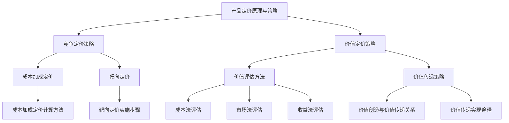

                 

# 文章标题：创业公司的产品定价策略与价值传递

> 关键词：创业公司、产品定价、价值传递、竞争定价策略、价值定价策略

> 摘要：本文旨在探讨创业公司在产品定价策略的选择和实施过程中，如何通过价值传递来提升产品竞争力。文章首先介绍了产品定价的基础理论，包括定价的基本概念、成本分析以及市场需求分析，然后深入分析了竞争定价策略和价值定价策略，最后通过实际案例解析和未来趋势展望，为创业公司提供有价值的定价策略参考。

## 目录

### 第一部分：产品定价基础理论

1. 产品定价原理与策略  
   1.1 产品定价的基本概念  
   1.2 产品成本分析  
   1.3 市场需求分析

2. 竞争定价策略  
   2.1 竞争对手分析  
   2.2 成本加成定价  
   2.3 靶向定价

3. 价值定价策略  
   3.1 价值定价原理  
   3.2 价值评估方法  
   3.3 价值传递策略

### 第二部分：创业公司产品定价实战

4. 创业公司定价挑战与应对  
   4.1 创业公司定价面临的挑战  
   4.2 定价策略选择

5. 创业公司产品定价案例解析  
   5.1 案例一：小公司如何通过价值定价获得成功  
   5.2 案例二：创业公司如何应对市场竞争定价

6. 创业公司产品定价策略优化  
   6.1 定价策略调整  
   6.2 定价模型构建

### 第三部分：产品定价与价值传递附录

7. 创业公司产品定价的未来趋势  
   7.1 数据驱动定价  
   7.2 个性化定价  
   7.3 智能化定价

8. 产品定价策略与价值传递参考资源

## 引言

在当今竞争激烈的市场环境中，创业公司要想取得成功，不仅需要创新的产品和优质的服务，还需要制定科学有效的产品定价策略。产品定价不仅是公司营收的重要来源，更是影响消费者购买决策的关键因素。对于创业公司而言，合理的定价策略不仅能确保产品的市场竞争力，还能实现公司的盈利目标。

然而，制定有效的定价策略并非易事，尤其是对于缺乏市场经验和资源的创业公司。本文旨在通过深入探讨产品定价的基础理论、竞争定价策略、价值定价策略以及创业公司的定价挑战与应对，为创业公司提供一套实用且有前瞻性的产品定价策略。同时，本文将结合实际案例和未来趋势，帮助创业公司在复杂多变的市场环境中找到属于自己的定价之道。

### 第一部分：产品定价基础理论

#### 第1章：产品定价原理与策略

#### 1.1 产品定价的基本概念

**定义与意义**

产品定价是指公司为其产品或服务设定的销售价格。定价不仅仅是简单的价格设定，它涉及到公司战略、市场营销、财务等多个方面。合理的产品定价对公司的生存和发展具有重要意义。

- **市场需求**：定价策略需要考虑市场需求，以确定产品的合理售价。市场需求包括需求量、需求弹性等指标，这些指标将直接影响产品的定价。

- **成本结构**：产品定价还需考虑成本结构，包括直接成本、间接成本、固定成本、变动成本等。只有了解成本结构，才能制定出既保证公司盈利又能被市场接受的价格。

- **竞争环境**：市场环境中的竞争态势也会影响产品的定价。竞争者的定价策略、市场份额、品牌影响力等都是定价时需要考虑的因素。

**目标与原则**

产品定价的目标主要包括以下几个方面：

- **盈利目标**：确保公司能够实现盈利，满足股东和投资者的期望。
- **市场份额**：通过合理的定价策略，争取更大的市场份额，提高品牌知名度。
- **产品定位**：根据产品的特点和目标市场，确定产品的价格，以实现产品的差异化。
- **客户满意度**：定价策略不仅要考虑公司的利益，还要考虑客户的购买力和满意度。

产品定价的基本原则包括：

- **成本导向定价**：以产品成本为基础，加上一定的利润来定价。
- **市场需求导向定价**：根据市场需求和消费者的支付意愿来定价。
- **竞争导向定价**：参考竞争对手的定价策略，结合自身产品特点来制定价格。

#### 1.2 产品成本分析

**成本构成与分类**

产品成本是定价的重要基础，了解成本结构对于制定合理的定价策略至关重要。产品成本通常包括以下几个方面：

- **直接成本**：直接与产品生产或提供服务的成本相关，如原材料、人工等。
- **间接成本**：与产品生产或提供服务相关的但无法直接分配到某一产品的成本，如管理费用、租金等。
- **固定成本**：在一定生产规模内不随产量变化的成本，如设备折旧、租金等。
- **变动成本**：与产量成正比的成本，如原材料、直接人工等。

**成本预测与控制**

成本预测是指公司对未来的成本支出进行估算，以便在定价时能够充分考虑成本因素。有效的成本预测需要基于历史数据、市场趋势和公司战略。

成本控制则是在成本预测的基础上，通过一系列管理措施，确保实际成本不超过预算。成本控制包括以下几个方面：

- **预算管理**：制定合理的预算，并定期监控预算执行情况。
- **成本分析**：定期对成本进行分析，找出成本超支的原因，并采取相应的措施进行控制。
- **效率提升**：通过提高生产效率、优化供应链管理等方式，降低成本。

#### 1.3 市场需求分析

**市场需求的概念与类型**

市场需求是指消费者在一定时期内，愿意按一定价格购买某种产品的数量。市场需求可以分为以下几种类型：

- **需求量**：表示在某一价格水平下，消费者愿意购买的产品数量。
- **需求弹性**：表示消费者对价格变动的敏感程度。需求弹性越大，价格变化对需求量的影响越大。
- **需求曲线**：表示价格与需求量之间的数量关系。需求曲线通常向下倾斜，表明价格与需求量呈负相关。

**市场调研与预测**

市场调研是指公司通过收集和分析市场信息，了解消费者的需求和偏好。市场调研的方法包括：

- **问卷调查**：通过设计问卷，收集消费者对产品的看法、需求等。
- **访谈**：通过面对面或电话访谈，深入了解消费者的需求和意见。
- **数据分析**：通过分析销售数据、市场趋势等，预测未来的市场需求。

市场预测则是基于市场调研的结果，对未来的市场需求进行预测。市场预测的方法包括：

- **定性预测**：基于专家意见、消费者需求调查等方法进行预测。
- **定量预测**：通过建立数学模型，利用历史数据和市场趋势进行预测。

#### 第2章：竞争定价策略

竞争定价策略是指公司根据竞争对手的定价策略和市场环境，制定相应的定价策略。竞争定价策略的核心在于通过分析竞争对手的定价策略和市场定位，找到自己的竞争优势，从而在市场中获得更大的份额。

**竞争对手分析**

竞争对手分析是竞争定价策略的基础。通过对竞争对手的产品、定价、市场策略等进行详细分析，公司可以了解自己在市场中的定位和竞争优势。竞争对手分析的内容包括：

- **竞争对手的产品定位**：了解竞争对手的产品特点、目标市场、产品组合等。
- **竞争对手的定价策略**：分析竞争对手的定价模式、价格水平和定价目标。
- **竞争对手的市场策略**：了解竞争对手的市场推广、销售渠道、品牌形象等。

**成本加成定价**

成本加成定价是一种常见的竞争定价策略，其基本原理是在产品成本基础上，加上一定比例的利润来定价。成本加成定价的计算方法如下：

$$
价格 = (成本 + 利润) / 销售量
$$

其中，成本包括直接成本和间接成本，利润通常根据公司的盈利目标来确定。

**靶向定价**

靶向定价是一种基于消费者支付意愿的定价策略，其核心思想是通过市场调研和数据分析，确定消费者对产品的支付意愿，并根据支付意愿来制定价格。靶向定价的实施步骤包括：

1. **市场调研**：通过问卷调查、访谈等方式，了解消费者对产品的看法和支付意愿。
2. **数据分析**：利用统计方法，分析消费者的支付意愿分布。
3. **制定价格**：根据消费者的支付意愿，制定合理的价格。

#### 第3章：价值定价策略

价值定价策略是一种以产品价值为基础的定价策略，其核心思想是按照消费者对产品的价值评估来定价。价值定价策略不仅考虑产品的成本和市场需求，更重视产品的价值和消费者的感知价值。

**价值定价原理**

价值定价的基本原理如下：

- **价值评估**：通过市场调研和数据分析，确定消费者对产品的价值评估。
- **定价策略**：根据消费者对产品的价值评估，制定相应的定价策略。

价值定价的核心要素包括：

- **产品价值**：产品提供的功能、性能、质量等。
- **消费者价值**：消费者对产品价值的感知和评估。
- **市场定位**：根据产品价值和消费者价值，确定产品的市场定位。

**价值评估方法**

价值评估是价值定价的关键步骤，常见的方法包括：

- **成本法评估**：根据产品的生产成本和利润目标，评估产品的价值。
- **市场法评估**：通过市场调研和数据分析，评估产品的市场价值。
- **收益法评估**：根据产品的预期收益，评估产品的价值。

**价值传递策略**

价值传递是指公司通过各种方式，将产品的价值传递给消费者。价值传递的策略包括：

- **产品差异化**：通过创新和提高产品质量，提升产品的价值。
- **品牌建设**：通过品牌营销和品牌塑造，增强产品的价值感知。
- **客户服务**：通过优质的客户服务，提升消费者的满意度。

#### 第二部分：创业公司产品定价实战

#### 第4章：创业公司定价挑战与应对

创业公司在定价过程中面临诸多挑战，包括资金有限、市场竞争激烈以及产品差异化不明显等。如何应对这些挑战，制定合理的定价策略，是创业公司成功的关键。

**创业公司定价面临的挑战**

1. **资金有限**：创业公司通常资金有限，难以承担高额的市场推广费用和研发成本。这使得创业公司在定价时需要更加谨慎，确保定价策略能够为公司带来足够的收入。

2. **市场竞争激烈**：创业公司进入的市场往往已经存在多家竞争者，市场竞争激烈。创业公司需要通过定价策略来获取市场份额，提高竞争力。

3. **产品差异化不明显**：许多创业公司的产品在功能、性能等方面与其他竞争对手的产品相似，难以通过产品差异化来吸引消费者。在这种情况下，创业公司需要通过定价策略来突出自身产品的特点。

**定价策略选择**

面对上述挑战，创业公司可以选择以下几种定价策略：

1. **竞争定价策略**：通过分析竞争对手的定价策略，制定相应的定价策略。竞争定价策略可以帮助创业公司快速进入市场，获取市场份额。

2. **价值定价策略**：根据消费者的价值感知，制定相应的定价策略。价值定价策略可以帮助创业公司提升产品的竞争力，吸引目标消费者。

3. **组合定价策略**：将竞争定价策略和价值定价策略结合起来，制定灵活的定价策略。组合定价策略可以帮助创业公司在不同市场环境中，灵活应对市场变化。

#### 第5章：创业公司产品定价案例解析

为了更好地理解创业公司的产品定价策略，下面将结合实际案例，分析创业公司如何通过不同的定价策略取得成功。

**案例一：小公司如何通过价值定价获得成功**

**案例背景**

某创业公司开发了一款智能家居控制系统，具有智能场景设定、远程控制等功能。由于市场竞争激烈，许多大型公司也在开发类似产品，因此创业公司在定价策略上面临很大挑战。

**案例分析**

1. **市场调研**：创业公司通过问卷调查和消费者访谈，了解消费者对智能家居控制系统的需求和价值感知。调研结果显示，消费者对产品的智能化程度、操作便捷性以及价格具有较高的关注。

2. **价值评估**：根据市场调研结果，创业公司确定了产品的价值核心，包括智能场景设定、远程控制等功能。公司通过优化产品功能，提升消费者的价值感知。

3. **定价策略**：创业公司采用价值定价策略，根据消费者的价值评估制定价格。产品定价略高于市场平均水平，但能够满足消费者对产品功能的期望。

**案例启示**

通过这个案例，我们可以看到，创业公司通过价值定价策略，成功提升了产品的竞争力。价值定价不仅考虑了产品的成本和市场需求，更重视消费者的价值感知。这对于创业公司在市场竞争中取得成功具有重要意义。

**案例二：创业公司如何应对市场竞争定价**

**案例背景**

某创业公司开发了一款健身应用，提供在线健身课程、健身数据跟踪等功能。由于市场上已有多家成熟的健身应用，创业公司在定价策略上需要谨慎。

**案例分析**

1. **竞争对手分析**：创业公司通过分析竞争对手的定价策略，发现市场上主要的健身应用定价集中在10-20元/月。创业公司决定采用竞争定价策略，以较低的价格进入市场。

2. **差异化策略**：为了在激烈的市场竞争中脱颖而出，创业公司决定在课程内容和用户服务上进行差异化。公司邀请知名健身教练授课，并提供24/7客户支持。

3. **定价策略**：创业公司采用成本加成定价策略，将课程成本和运营成本计入定价，同时考虑市场竞争因素，将价格定在8元/月。

**案例启示**

通过这个案例，我们可以看到，创业公司通过竞争定价策略和差异化策略，成功在激烈的市场竞争中取得了成功。竞争定价策略可以帮助公司快速进入市场，而差异化策略则能提升产品的竞争力。这两个策略的结合，为创业公司在市场中立足提供了有力支持。

#### 第6章：创业公司产品定价策略优化

创业公司在实施产品定价策略后，需要不断进行策略优化，以适应市场变化和消费者需求。定价策略优化主要包括以下两个方面：

**定价策略调整**

1. **定期评估**：创业公司需要定期评估定价策略的效果，包括销售收入、市场份额、消费者满意度等指标。通过评估，可以发现定价策略中的不足之处，及时进行调整。

2. **调整原则**：调整定价策略时，需要遵循以下原则：
   - **市场导向**：根据市场变化和消费者需求，灵活调整价格。
   - **成本可控**：确保定价策略不会导致成本过高，影响公司盈利。
   - **竞争平衡**：在竞争对手的定价策略中找到平衡点，避免价格战。

**定价模型构建**

1. **构建步骤**：创业公司可以构建以下定价模型：
   - **成本模型**：根据产品的成本结构和利润目标，确定产品的成本基础。
   - **市场模型**：通过市场调研和数据分析，确定产品的市场需求和消费者支付意愿。
   - **竞争模型**：分析竞争对手的定价策略，确定自己在市场中的竞争地位。

2. **应用**：定价模型可以帮助创业公司：
   - **优化定价**：根据模型分析结果，调整产品价格，实现价格优化。
   - **预测收益**：利用模型预测未来的销售收入和利润，为公司的战略决策提供依据。

#### 第7章：创业公司产品定价的未来趋势

随着科技的进步和市场环境的变化，创业公司的产品定价策略也在不断演进。以下是创业公司产品定价的几个未来趋势：

**数据驱动定价**

数据驱动定价是指公司通过数据分析，制定和调整产品定价策略。这种定价策略充分利用大数据、人工智能等技术，提高定价的准确性和灵活性。

1. **应用场景**：数据驱动定价可以应用于：
   - **个性化定价**：根据消费者的购买行为和偏好，提供个性化的价格策略。
   - **动态定价**：根据市场需求和竞争态势，实时调整产品价格。

2. **优势**：数据驱动定价的优势包括：
   - **提高销售额**：通过优化定价策略，提高销售额和市场份额。
   - **降低风险**：通过数据分析，降低定价决策的风险。

**个性化定价**

个性化定价是指根据消费者的个人特征和购买行为，制定个性化的价格策略。这种定价策略能够更好地满足消费者的需求，提高消费者的满意度。

1. **实现方式**：个性化定价可以通过以下方式实现：
   - **用户画像**：根据消费者的购买历史、浏览记录等，建立用户画像。
   - **动态定价**：根据用户画像，为不同用户制定不同的价格。

2. **挑战**：个性化定价面临的挑战包括：
   - **数据隐私**：在实现个性化定价的同时，需要保护消费者的隐私。
   - **计算复杂度**：个性化定价需要处理大量的数据，计算复杂度较高。

**智能化定价**

智能化定价是指利用人工智能技术，制定和调整产品定价策略。这种定价策略能够提高定价的自动化程度，减少人为干预。

1. **技术实现**：智能化定价的技术实现包括：
   - **机器学习**：利用机器学习算法，分析市场数据和消费者行为，制定定价策略。
   - **自然语言处理**：利用自然语言处理技术，分析市场趋势和竞争对手策略，优化定价策略。

2. **挑战**：智能化定价面临的挑战包括：
   - **技术成熟度**：当前人工智能技术在定价领域仍处于发展阶段，技术成熟度有待提高。
   - **数据质量**：智能化定价依赖于高质量的数据，数据质量直接影响定价效果。

### 附录A：产品定价策略与价值传递参考资源

**产品定价相关书籍推荐**

1. 《定价的心理学：如何利用消费者行为学提高销售额》
2. 《定价战略：如何制定成功的价格策略》
3. 《定价与收益管理：理论与实践》

**产品定价相关研究论文推荐**

1. "Pricing Strategies for New Product Introduction: An Empirical Analysis"
2. "Value-Based Pricing: Theory and Practice"
3. "Dynamic Pricing and Revenue Management in E-Commerce"

**产品定价相关工具推荐**

1. **Google Analytics**：用于收集和分析用户行为数据，支持数据驱动定价。
2. **Tableau**：用于数据可视化，帮助公司更好地理解市场和消费者行为。
3. **Machine Learning Platforms**：如Google Cloud AI、AWS SageMaker等，用于实现智能化定价。

### 附录B：价值传递流程图



### 附录C：核心算法伪代码

**成本法评估伪代码**

```python
# 成本法评估伪代码
def cost_based_evaluation(costs, profit_margin):
    total_cost = sum(costs)
    price = (total_cost + profit_margin) / quantity
    return price
```

**靶向定价伪代码**

```python
# 靶向定价伪代码
def target_based_pricing(consumer_value, fixed_cost, variable_cost):
    target_price = consumer_value - fixed_cost - variable_cost
    return target_price
```

### 作者信息

作者：AI天才研究院/AI Genius Institute & 禅与计算机程序设计艺术 /Zen And The Art of Computer Programming

本文详细探讨了创业公司的产品定价策略与价值传递，通过基础理论、实战案例和未来趋势的深入分析，为创业公司提供了实用的定价策略参考。希望本文能对创业者们在定价道路上有所启发和帮助。

