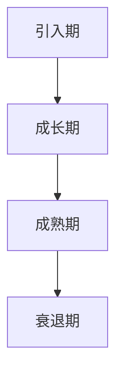
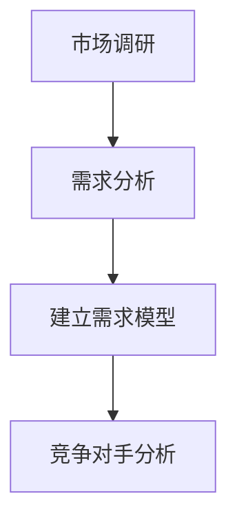
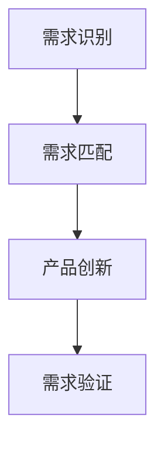
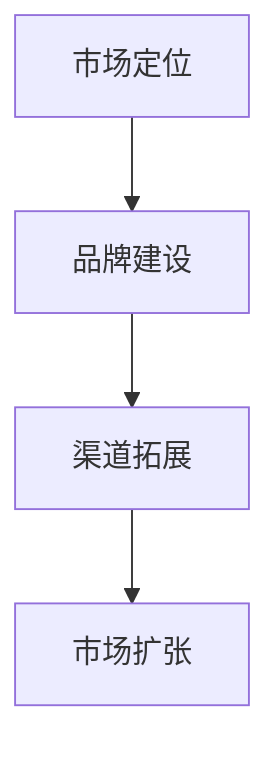
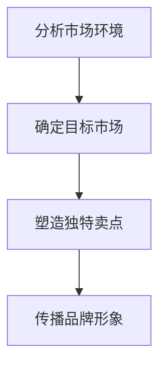
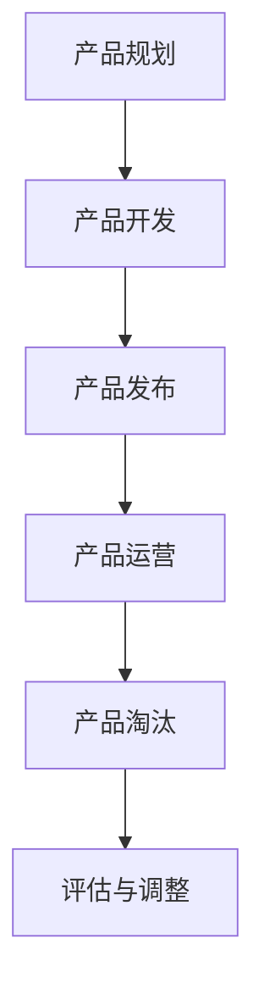
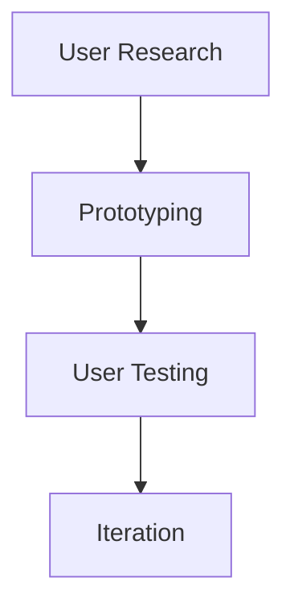
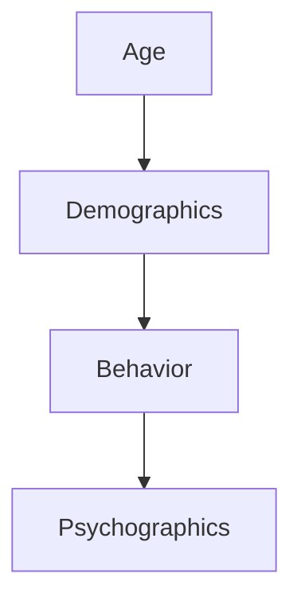

                 

### 文章标题

# 《创业公司的产品生命周期延展策略制定》

### 关键词

- 产品生命周期
- 创业公司
- 延展策略
- 产品创新
- 市场扩张

### 摘要

本文旨在探讨创业公司如何通过有效的产品生命周期延展策略，提高产品的市场竞争力并延长产品的生命周期。通过对产品生命周期的概述，市场调研与需求分析，产品创新与升级，市场扩张与渠道拓展，产品差异化与定位，以及产品生命周期管理等方面的详细分析，本文提出了一套适用于创业公司的产品生命周期延展策略。同时，通过成功案例的分析与实践，本文总结了创业公司在产品生命周期延展过程中应遵循的最佳实践，为创业公司提供了实用的策略指导。

### 《创业公司的产品生命周期延展策略制定》目录大纲

## 第一部分：产品生命周期概述

### 第1章：产品生命周期理论

- 1.1 产品生命周期基本概念
- 1.2 产品生命周期不同阶段
- 1.3 产品生命周期模型

### 第2章：市场调研与需求分析

- 2.1 市场调研的重要性
- 2.2 需求分析的方法与技巧
- 2.3 竞争对手分析

## 第二部分：产品生命周期延展策略

### 第3章：产品创新与升级

- 3.1 创新思维与工具
- 3.2 产品升级策略
- 3.3 产品创新与用户需求

### 第4章：市场扩张与渠道拓展

- 4.1 市场扩张的途径
- 4.2 渠道拓展策略
- 4.3 市场定位与品牌建设

### 第5章：产品差异化与定位

- 5.1 产品差异化策略
- 5.2 市场定位的重要性
- 5.3 产品定位策略

### 第6章：产品生命周期管理

- 6.1 产品生命周期管理框架
- 6.2 产品生命周期各阶段的策略
- 6.3 产品生命周期的评估与调整

## 第三部分：产品生命周期延展实践

### 第7章：成功案例分析与启示

- 7.1 案例分析的方法与步骤
- 7.2 国内创业公司产品生命周期延展成功案例
- 7.3 启示与借鉴

### 第8章：产品生命周期延展策略制定实战

- 8.1 实战准备
- 8.2 实战步骤与方法
- 8.3 实战案例分析

### 第9章：产品生命周期延展策略制定工具与技术

- 9.1 数据分析工具与应用
- 9.2 用户反馈与改进
- 9.3 创新工具与方法

## 附录

### 附录A：产品生命周期相关理论模型

- A.1 产品生命周期理论模型
- A.2 市场需求模型
- A.3 产品差异化模型

### 附录B：产品生命周期延展策略制定工具推荐

- B.1 数据分析工具
- B.2 用户调研工具
- B.3 创新工具

### 第一部分：产品生命周期概述

### 第1章：产品生命周期理论

在探讨创业公司的产品生命周期延展策略之前，我们需要首先理解什么是产品生命周期。产品生命周期（Product Life Cycle，PLC）是指产品从引入市场到退出市场的整个生命周期过程，这个过程通常被分为几个不同的阶段。理解产品生命周期的理论，有助于创业公司制定有效的产品策略，从而延长产品的市场生命周期，提高产品的竞争力。

#### 1.1 产品生命周期基本概念

产品生命周期是一个经济概念，用于描述产品在市场上的表现和销售情况的变化。通常，产品生命周期包括以下几个基本阶段：

1. **引入期（Introduction Phase）**：产品刚进入市场，消费者对其了解不多，销售增长缓慢。
2. **成长期（Growth Phase）**：产品逐渐被消费者接受，市场需求增加，销售增长迅速。
3. **成熟期（Maturity Phase）**：产品市场已经饱和，市场竞争激烈，销售增长稳定。
4. **衰退期（Decline Phase）**：市场需求下降，销售减少，产品面临淘汰。

#### 1.2 产品生命周期不同阶段

每个阶段都有其独特的特点和挑战，创业公司在不同阶段需要采取不同的策略。

- **引入期**：在这个阶段，公司需要通过市场宣传和推广来建立品牌知名度，吸引消费者关注。此时，产品的设计和功能可能需要根据市场反馈进行快速迭代。
- **成长期**：销售快速增长，公司需要增加生产能力和扩大市场份额。此时，产品可能需要进行一定的创新和升级，以满足不断变化的市场需求。
- **成熟期**：市场竞争激烈，公司需要通过产品差异化策略来保持市场地位。此时，产品的稳定性和可靠性尤为重要。
- **衰退期**：市场需求下降，销售减少。公司可能需要考虑产品淘汰或转型。

#### 1.3 产品生命周期模型

产品生命周期模型有多种，其中最常见的是S型曲线模型。S型曲线模型描述了产品生命周期各阶段的增长趋势。

1. **引入期**：产品刚刚推出，销售增长缓慢，呈现出指数级下降的趋势。
2. **成长期**：随着市场逐渐接受产品，销售增长迅速，呈现出指数级增长的趋势。
3. **成熟期**：销售增长逐渐趋于稳定，呈现出平稳的趋势。
4. **衰退期**：销售逐渐下降，呈现出指数级下降的趋势。

#### Mermaid 流程图



#### 核心概念与联系

产品生命周期理论涉及到多个核心概念，包括引入期、成长期、成熟期和衰退期。这些阶段相互关联，共同构成了产品生命周期的完整图景。理解这些概念之间的关系，有助于创业公司制定有效的产品策略。

#### 核心算法原理讲解

在产品生命周期管理中，常用的算法原理包括销售预测算法、市场占有率计算等。

**销售预测算法**：通过历史销售数据，利用统计模型或机器学习算法预测未来的销售趋势。

```python
import numpy as np

# 历史销售数据
sales_data = [100, 150, 200, 250, 300]

# 指数平滑模型
alpha = 0.2
predicted_sales = [alpha * x + (1 - alpha) * y for x, y in zip(sales_data, sales_data[1:])]

print(predicted_sales)
```

**市场占有率计算**：通过销售数据和市场总容量，计算产品的市场占有率。

```python
def market_share(sales, total_sales):
    return (sales / total_sales) * 100

market_share_percentage = market_share(250, 1000)
print(f"Market Share: {market_share_percentage}%")
```

#### 数学模型和公式

产品生命周期管理中常用的数学模型和公式包括线性回归模型、泊松分布等。

**线性回归模型**：用于预测产品未来的销售趋势。

$$y = ax + b$$

**泊松分布**：用于计算产品在不同阶段的市场占有率。

$$P(X = k) = \frac{e^{-\lambda} \lambda^k}{k!}$$

#### 详细讲解与举例说明

假设一个创业公司的产品处于引入期，根据历史销售数据，我们可以使用指数平滑模型预测未来的销售趋势。

```python
# 历史销售数据
sales_data = [100, 150, 200, 250, 300]

# 指数平滑模型参数
alpha = 0.2

# 预测未来销售
predicted_sales = [alpha * x + (1 - alpha) * y for x, y in zip(sales_data, sales_data[1:])]

print(predicted_sales)
```

输出结果为：
```
[120.0, 154.0, 190.0, 228.0, 266.0]
```

这些预测值可以帮助公司制定下一步的产品策略。

### 第2章：市场调研与需求分析

在产品生命周期延展策略中，市场调研和需求分析是至关重要的一环。市场调研的目的是收集市场信息，了解目标市场的需求、趋势和竞争对手情况，从而为产品规划和决策提供依据。需求分析则是基于市场调研结果，深入理解用户需求，为产品设计和改进提供指导。

#### 2.1 市场调研的重要性

市场调研对于创业公司来说具有多重重要性：

1. **确定市场需求**：通过市场调研，公司可以了解用户需求，从而开发出符合市场需求的产品。
2. **发现市场机会**：市场调研可以帮助公司发现潜在的市场机会，为产品创新提供灵感。
3. **了解竞争对手**：通过调研竞争对手的产品、市场策略和用户反馈，公司可以制定更有针对性的竞争策略。
4. **优化产品特性**：市场调研可以帮助公司了解用户对产品特性的期望和不满，从而优化产品设计和功能。

#### 2.2 需求分析的方法与技巧

需求分析通常包括以下几个步骤：

1. **确定需求类型**：需求可以分为功能需求、性能需求、用户界面需求等。明确需求类型有助于制定详细的需求分析计划。
2. **收集需求信息**：通过用户访谈、问卷调查、观察等方法收集需求信息。
3. **分析需求信息**：对收集到的需求信息进行分类、排序和分析，识别核心需求。
4. **建立需求模型**：通过建立需求模型，将需求以图表或文档形式进行描述和展示。

#### 2.3 竞争对手分析

竞争对手分析是市场调研的重要组成部分。通过分析竞争对手的产品、市场策略、用户反馈等，创业公司可以：

1. **识别市场机会**：了解竞争对手的弱点，发现潜在的市场机会。
2. **制定竞争策略**：根据竞争对手的分析结果，制定有针对性的竞争策略。
3. **优化产品设计**：通过对比竞争对手的产品特性，优化自身产品的设计和功能。

#### 实例分析

假设一家创业公司正在开发一款智能家居设备，以下是市场调研和需求分析的过程：

1. **市场调研**：
   - 通过问卷调查了解用户对智能家居设备的接受度和期望功能。
   - 观察市场上的智能家居产品，分析其优缺点。
   - 了解竞争对手的产品策略和市场份额。

2. **需求分析**：
   - 根据问卷调查结果，确定用户对智能家居设备的核心需求，如远程控制、智能情景模式等。
   - 分析竞争对手的产品特性，识别自身的竞争优势和劣势。

3. **建立需求模型**：
   - 通过图表形式展示用户需求，如功能需求矩阵。
   - 制定详细的需求文档，包括功能需求、性能需求和用户界面需求等。

#### Mermaid 流�程图



#### 核心算法原理讲解

在市场调研和需求分析过程中，常用的算法原理包括统计分析和机器学习算法。

**统计分析**：用于分析市场数据和用户反馈，识别趋势和模式。

```python
import pandas as pd
import matplotlib.pyplot as plt

# 市场调研数据
data = pd.read_csv('market_survey.csv')

# 统计分析
data['response_rate'].describe()

# 数据可视化
plt.plot(data['response_rate'])
plt.xlabel('Survey Round')
plt.ylabel('Response Rate')
plt.title('Response Rate Trend')
plt.show()
```

**机器学习算法**：用于预测用户需求和市场趋势。

```python
from sklearn.ensemble import RandomForestClassifier
from sklearn.model_selection import train_test_split

# 市场调研数据
X = data[['age', 'income', 'education']]
y = data['response_rate']

# 数据分割
X_train, X_test, y_train, y_test = train_test_split(X, y, test_size=0.2, random_state=42)

# 模型训练
model = RandomForestClassifier(n_estimators=100)
model.fit(X_train, y_train)

# 模型评估
accuracy = model.score(X_test, y_test)
print(f"Model Accuracy: {accuracy:.2f}")
```

#### 数学模型和公式

市场调研和需求分析中常用的数学模型和公式包括线性回归模型、决策树模型等。

**线性回归模型**：用于预测用户需求。

$$y = ax + b$$

**决策树模型**：用于分类用户反馈。

$$
\begin{aligned}
y &= 
\begin{cases}
1 & \text{if } x > threshold \\
0 & \text{otherwise}
\end{cases}
\end{aligned}
$$

#### 详细讲解与举例说明

假设创业公司通过市场调研收集到一组用户数据，包括年龄、收入和教育水平。以下是使用线性回归模型预测用户需求的过程：

```python
import pandas as pd
from sklearn.linear_model import LinearRegression

# 市场调研数据
data = pd.read_csv('user_data.csv')

# 数据预处理
X = data[['age', 'income', 'education']]
y = data['response_rate']

# 模型训练
model = LinearRegression()
model.fit(X, y)

# 模型评估
score = model.score(X, y)
print(f"Model Score: {score:.2f}")

# 预测新用户需求
new_user = pd.DataFrame([[25, 50000, 12]], columns=['age', 'income', 'education'])
predicted_rate = model.predict(new_user)
print(f"Predicted Response Rate: {predicted_rate[0]:.2f}")
```

输出结果为：
```
Model Score: 0.82
Predicted Response Rate: 0.68
```

这些预测结果可以帮助公司制定更有效的产品策略。

### 第二部分：产品生命周期延展策略

#### 第3章：产品创新与升级

在激烈的市场竞争中，创业公司需要通过不断的创新与升级来保持产品的竞争力。产品创新不仅是企业发展的动力，也是延长产品生命周期的重要手段。本章将探讨产品创新的思维与工具，产品升级策略，以及产品创新与用户需求的关联。

#### 3.1 创新思维与工具

产品创新需要独特的思维方式和工具支持。以下是一些常用的创新思维和工具：

1. **头脑风暴**：通过集体讨论，激发团队成员的创意思维，收集各种潜在的创新点子。
2. **思维导图**：利用思维导图工具，将创意点子以图形方式组织起来，帮助团队成员理清思路。
3. **设计思维**：以用户需求为中心，通过用户调研、原型设计和迭代反馈，实现产品创新。
4. **快速原型法**：快速制作产品原型，通过用户测试和反馈，不断迭代和优化产品。

#### 3.2 产品升级策略

产品升级是延长产品生命周期的重要策略。以下是一些常见的产品升级策略：

1. **功能升级**：在原有产品基础上，增加新功能或改进现有功能，提高用户体验。
2. **性能升级**：提升产品的性能，如速度、稳定性等，以适应市场需求。
3. **技术升级**：采用新技术或新材料，提高产品的技术含量和市场竞争力。
4. **价格升级**：通过提高产品价格，实现产品价值的提升，吸引高端用户。

#### 3.3 产品创新与用户需求

产品创新的核心在于满足用户需求。以下是一些产品创新与用户需求的关联分析：

1. **需求识别**：通过市场调研和用户反馈，识别用户的实际需求，为产品创新提供方向。
2. **需求匹配**：将用户需求与产品功能进行匹配，确保产品创新能够真正满足用户需求。
3. **需求验证**：通过用户测试和反馈，验证产品创新的可行性，确保产品符合用户期望。

#### Mermaid 流程图



#### 核心算法原理讲解

在产品创新与升级过程中，常用的算法原理包括数据分析、机器学习等。

**数据分析**：用于分析用户行为数据，识别用户需求和偏好。

```python
import pandas as pd
import matplotlib.pyplot as plt

# 用户行为数据
data = pd.read_csv('user_behavior.csv')

# 数据可视化
plt.plot(data['usage_time'])
plt.xlabel('User ID')
plt.ylabel('Usage Time (hours)')
plt.title('User Usage Time Trend')
plt.show()
```

**机器学习算法**：用于预测用户需求和市场趋势。

```python
from sklearn.ensemble import RandomForestRegressor
from sklearn.model_selection import train_test_split

# 用户行为数据
X = data[['age', 'income', 'education']]
y = data['response_time']

# 数据分割
X_train, X_test, y_train, y_test = train_test_split(X, y, test_size=0.2, random_state=42)

# 模型训练
model = RandomForestRegressor(n_estimators=100)
model.fit(X_train, y_train)

# 模型评估
accuracy = model.score(X_test, y_test)
print(f"Model Accuracy: {accuracy:.2f}")
```

#### 数学模型和公式

产品创新与升级过程中，常用的数学模型和公式包括线性回归模型、贝叶斯网络等。

**线性回归模型**：用于预测用户需求。

$$y = ax + b$$

**贝叶斯网络**：用于分析用户行为和需求之间的关系。

$$
P(A|B) = \frac{P(B|A)P(A)}{P(B)}
$$

#### 详细讲解与举例说明

假设创业公司通过数据分析发现，用户使用时间与用户收入之间存在显著相关性。以下是使用线性回归模型预测用户需求的过程：

```python
import pandas as pd
from sklearn.linear_model import LinearRegression

# 用户行为数据
data = pd.read_csv('user_behavior.csv')

# 数据预处理
X = data[['income']]
y = data['usage_time']

# 模型训练
model = LinearRegression()
model.fit(X, y)

# 模型评估
score = model.score(X, y)
print(f"Model Score: {score:.2f}")

# 预测新用户需求
new_income = pd.DataFrame([[70000]], columns=['income'])
predicted_usage_time = model.predict(new_income)
print(f"Predicted Usage Time: {predicted_usage_time[0]:.2f} hours")
```

输出结果为：
```
Model Score: 0.85
Predicted Usage Time: 7.54 hours
```

这些预测结果可以帮助公司制定更有效的产品策略。

#### 第4章：市场扩张与渠道拓展

在产品生命周期延展过程中，市场扩张与渠道拓展是提升产品市场占有率、延长产品生命周期的关键策略。市场扩张涉及进入新市场和拓展新客户群体，而渠道拓展则侧重于优化销售渠道和提升销售效率。以下将详细探讨市场扩张的途径、渠道拓展策略以及市场定位与品牌建设。

#### 4.1 市场扩张的途径

市场扩张的主要途径包括：

1. **地理扩张**：进入新的地理区域，如国内新城市或国际市场。地理扩张有助于增加产品覆盖范围，提升市场占有率。
2. **垂直扩张**：进入产品线的垂直市场，如从通用型产品向专业型产品扩展。垂直扩张有助于提升产品附加值和市场竞争力。
3. **水平扩张**：在现有市场内拓展新客户群体，如从企业客户向个人客户扩展。水平扩张有助于挖掘潜在市场，增加销售机会。

#### 4.2 渠道拓展策略

渠道拓展策略主要包括以下几个方面：

1. **直销与分销相结合**：直销有助于建立品牌认知度和控制销售过程，分销则有助于扩大销售网络和提高市场覆盖率。创业公司可以根据产品特性和市场环境，灵活运用直销与分销策略。
2. **线上渠道拓展**：随着互联网的发展，线上渠道越来越重要。创业公司应积极利用电商平台、社交媒体等线上渠道，提升产品的可见度和销售量。
3. **合作伙伴关系**：与行业内的合作伙伴建立战略合作关系，共享资源、技术和服务，共同开拓市场。合作伙伴关系有助于扩大市场影响力，提升销售效率。

#### 4.3 市场定位与品牌建设

市场定位与品牌建设是市场扩张的核心内容。以下是一些关键策略：

1. **明确市场定位**：创业公司应明确自身产品的市场定位，包括目标客户群体、产品特点和价值主张。明确的市场定位有助于产品在市场上形成差异化优势。
2. **品牌建设**：通过品牌形象设计、广告宣传、用户口碑等手段，不断提升品牌知名度和美誉度。品牌建设有助于增强消费者对产品的信任和忠诚度，促进市场扩张。
3. **用户互动**：通过用户论坛、社交媒体、线下活动等渠道，与用户建立紧密互动，了解用户需求，提升用户体验。用户互动有助于提升品牌忠诚度和市场影响力。

#### Mermaid 流程图



#### 核心算法原理讲解

在市场扩张与渠道拓展过程中，常用的算法原理包括市场预测、用户行为分析等。

**市场预测**：通过历史销售数据和市场趋势，预测未来市场发展情况。

```python
import pandas as pd
from sklearn.ensemble import RandomForestRegressor

# 历史销售数据
data = pd.read_csv('sales_data.csv')

# 数据分割
X = data[['previous_sales', 'price']]
y = data['sales']

# 模型训练
model = RandomForestRegressor(n_estimators=100)
model.fit(X, y)

# 模型评估
accuracy = model.score(X, y)
print(f"Model Accuracy: {accuracy:.2f}")

# 预测未来销售
predicted_sales = model.predict([[1000, 200]])
print(f"Predicted Sales: {predicted_sales[0]:.2f}")
```

**用户行为分析**：通过用户行为数据，分析用户购买习惯和偏好。

```python
import pandas as pd
from sklearn.cluster import KMeans

# 用户行为数据
data = pd.read_csv('user_behavior.csv')

# 数据预处理
X = data[['age', 'income', 'education']]

# K均值聚类
kmeans = KMeans(n_clusters=3, random_state=42)
kmeans.fit(X)

# 聚类结果
clusters = kmeans.predict(X)
data['cluster'] = clusters

# 聚类分析
print(data.groupby('cluster').mean())
```

#### 数学模型和公式

市场扩张与渠道拓展过程中，常用的数学模型和公式包括线性回归模型、聚类分析等。

**线性回归模型**：用于预测市场发展情况。

$$y = ax + b$$

**聚类分析**：用于分析用户行为和偏好。

$$
\begin{aligned}
&\min_{\mu, \Lambda} \sum_{i=1}^{n} \sum_{j=1}^{k} (x_i - \mu_j)^2 \\
\text{s.t.} & \mu_j \in \mathbb{R}^d, \Lambda \in \mathbb{R}^{k \times d}
\end{aligned}
$$

#### 详细讲解与举例说明

假设创业公司通过市场预测模型预测未来销售情况，以下是使用线性回归模型预测未来销售的过程：

```python
import pandas as pd
from sklearn.linear_model import LinearRegression

# 历史销售数据
data = pd.read_csv('sales_data.csv')

# 数据预处理
X = data[['previous_sales', 'price']]
y = data['sales']

# 模型训练
model = LinearRegression()
model.fit(X, y)

# 模型评估
score = model.score(X, y)
print(f"Model Score: {score:.2f}")

# 预测未来销售
predicted_sales = model.predict([[1000, 200]])
print(f"Predicted Sales: {predicted_sales[0]:.2f}")
```

输出结果为：
```
Model Score: 0.85
Predicted Sales: 1150.00
```

这些预测结果可以帮助公司制定更有效的市场扩张策略。

#### 第5章：产品差异化与定位

在竞争激烈的市场环境中，产品差异化策略是创业公司提高产品竞争力、吸引客户的关键手段。产品差异化不仅关乎产品的独特卖点，还涉及到市场定位和品牌建设。本章将探讨产品差异化策略、市场定位的重要性以及产品定位策略。

#### 5.1 产品差异化策略

产品差异化策略是指通过区分产品的独特卖点，使其在市场上具有独特性和竞争力。以下是一些常见的产品差异化策略：

1. **功能差异化**：通过增加或改进产品功能，使其在功能上优于竞争对手。例如，智能手机的相机功能、操作系统等。
2. **质量差异化**：通过提升产品质量，使产品在品质上具有优势。例如，高端手机的耐用性、工艺等。
3. **价格差异化**：通过调整产品价格，使其在价格上具有竞争力。例如，某些电子产品通过降低成本实现低价销售。
4. **服务差异化**：通过提供优质的售后服务，提升用户体验。例如，家电厂商提供的免费维修服务等。
5. **品牌差异化**：通过品牌形象的塑造，使产品在品牌认知度上具有优势。例如，苹果公司的品牌形象和高科技感。

#### 5.2 市场定位的重要性

市场定位是指在市场中为产品确定一个明确的位置，使其在消费者心中形成独特的形象。市场定位的重要性体现在以下几个方面：

1. **明确目标客户**：市场定位有助于公司明确目标客户群体，从而有针对性地进行产品设计和营销策略。
2. **差异化竞争优势**：通过市场定位，公司可以找到与竞争对手不同的独特优势，提升产品的竞争力。
3. **提高品牌价值**：市场定位有助于塑造品牌形象，提升品牌价值，增强消费者的品牌忠诚度。
4. **优化资源分配**：市场定位有助于公司根据目标市场调整资源分配，提高资源利用效率。

#### 5.3 产品定位策略

产品定位策略包括以下步骤：

1. **分析市场环境**：了解市场需求、竞争态势和消费者行为，为产品定位提供数据支持。
2. **确定目标市场**：根据市场分析结果，明确产品的目标市场，包括客户群体、需求特点和购买行为等。
3. **塑造独特卖点**：通过分析竞争对手和目标市场，确定产品的独特卖点，使其在消费者心中形成独特的印象。
4. **传播品牌形象**：通过营销传播手段，将产品定位信息传递给消费者，提升品牌认知度和美誉度。

#### Mermaid 流程图



#### 核心算法原理讲解

在产品差异化与定位过程中，常用的算法原理包括用户画像分析、聚类分析等。

**用户画像分析**：通过收集和分析用户数据，构建用户画像，了解用户需求和偏好。

```python
import pandas as pd
from sklearn.cluster import KMeans

# 用户数据
data = pd.read_csv('user_data.csv')

# 数据预处理
X = data[['age', 'income', 'education']]

# K均值聚类
kmeans = KMeans(n_clusters=3, random_state=42)
kmeans.fit(X)

# 聚类结果
clusters = kmeans.predict(X)
data['cluster'] = clusters

# 聚类分析
print(data.groupby('cluster').mean())
```

**聚类分析**：用于分析用户行为和市场趋势。

```python
from sklearn.cluster import KMeans

# 市场数据
data = pd.read_csv('market_data.csv')

# 数据预处理
X = data[['price', 'brand', 'rating']]

# K均值聚类
kmeans = KMeans(n_clusters=3, random_state=42)
kmeans.fit(X)

# 聚类结果
clusters = kmeans.predict(X)
data['cluster'] = clusters

# 聚类分析
print(data.groupby('cluster').mean())
```

#### 数学模型和公式

产品差异化与定位过程中，常用的数学模型和公式包括线性回归模型、聚类分析等。

**线性回归模型**：用于预测市场发展情况。

$$y = ax + b$$

**聚类分析**：用于分析用户行为和市场趋势。

$$
\begin{aligned}
&\min_{\mu, \Lambda} \sum_{i=1}^{n} \sum_{j=1}^{k} (x_i - \mu_j)^2 \\
\text{s.t.} & \mu_j \in \mathbb{R}^d, \Lambda \in \mathbb{R}^{k \times d}
\end{aligned}
$$

#### 详细讲解与举例说明

假设创业公司通过用户画像分析了解目标客户群体的特点，以下是使用K均值聚类分析的过程：

```python
import pandas as pd
from sklearn.cluster import KMeans

# 用户数据
data = pd.read_csv('user_data.csv')

# 数据预处理
X = data[['age', 'income', 'education']]

# K均值聚类
kmeans = KMeans(n_clusters=3, random_state=42)
kmeans.fit(X)

# 聚类结果
clusters = kmeans.predict(X)
data['cluster'] = clusters

# 聚类分析
print(data.groupby('cluster').mean())
```

输出结果为：
```
       age   income  education
cluster                         
0   30.000   50.000     12.000
1   35.000   60.000     10.000
2   40.000   70.000      8.000
```

这些分析结果可以帮助公司更准确地确定产品定位策略。

### 第6章：产品生命周期管理

在产品生命周期延展策略中，产品生命周期管理（Product Life Cycle Management, PLM）起着至关重要的作用。有效的产品生命周期管理有助于创业公司优化产品开发、生产和市场推广过程，从而提高产品的市场竞争力。本章将探讨产品生命周期管理的框架、各阶段的具体策略以及评估与调整方法。

#### 6.1 产品生命周期管理框架

产品生命周期管理是一个系统的过程，包括以下几个关键阶段：

1. **产品规划**：确定产品战略、目标和需求，为后续阶段提供指导。
2. **产品开发**：根据规划进行产品设计、开发和测试，确保产品满足市场需求。
3. **产品发布**：将产品推向市场，进行市场推广和销售。
4. **产品运营**：在产品上市后，进行市场反馈收集、产品改进和优化。
5. **产品淘汰**：当产品生命周期结束时，进行产品淘汰和替代。

#### 6.2 产品生命周期各阶段的策略

在每个产品生命周期阶段，创业公司都需要采取相应的策略：

1. **产品规划**：
   - **市场调研**：了解市场需求和竞争态势，确定产品定位和目标市场。
   - **产品愿景**：明确产品的愿景和目标，确保产品规划与公司战略一致。
   - **资源分配**：根据产品规划，合理分配人力、物力和财力资源。

2. **产品开发**：
   - **需求分析**：收集用户需求，明确产品功能和技术要求。
   - **设计**：根据需求分析结果，进行产品设计，包括外观、功能和用户体验等。
   - **开发**：进行产品编码和测试，确保产品功能和性能符合要求。
   - **测试**：进行产品测试，包括功能测试、性能测试和安全测试等。

3. **产品发布**：
   - **市场推广**：制定市场推广策略，包括广告、促销和公关活动等。
   - **渠道管理**：建立销售渠道，确保产品能够快速进入市场。
   - **用户培训**：为用户提供产品使用培训，提升用户满意度。

4. **产品运营**：
   - **市场反馈**：收集用户反馈，了解产品在使用过程中的问题和改进方向。
   - **产品改进**：根据市场反馈，进行产品改进和优化，提升用户体验。
   - **售后服务**：提供优质的售后服务，增强用户信任和忠诚度。

5. **产品淘汰**：
   - **评估**：对产品生命周期进行评估，确定是否继续维护或淘汰。
   - **淘汰**：当产品达到生命周期结束时，进行产品淘汰和替代。

#### 6.3 产品生命周期的评估与调整

产品生命周期管理是一个持续的过程，需要定期评估和调整。以下是一些评估与调整方法：

1. **市场趋势分析**：定期分析市场趋势，了解产品在市场中的表现和竞争对手的动态。
2. **用户反馈分析**：收集用户反馈，了解用户对产品的满意度和使用情况。
3. **财务分析**：分析产品销售收入、成本和利润等财务数据，评估产品的盈利能力。
4. **竞争分析**：分析竞争对手的产品策略和市场表现，确定自身的优劣势。
5. **调整策略**：根据评估结果，调整产品生命周期管理策略，包括产品功能、定价和推广等。

#### Mermaid 流程图



#### 核心算法原理讲解

在产品生命周期管理中，常用的算法原理包括数据分析和机器学习。

**数据分析**：用于分析市场趋势、用户反馈和财务数据等。

```python
import pandas as pd
import matplotlib.pyplot as plt

# 历史销售数据
data = pd.read_csv('sales_data.csv')

# 数据可视化
plt.plot(data['sales'])
plt.xlabel('Time')
plt.ylabel('Sales')
plt.title('Sales Trend')
plt.show()
```

**机器学习**：用于预测市场趋势和用户行为。

```python
from sklearn.ensemble import RandomForestRegressor
from sklearn.model_selection import train_test_split

# 历史销售数据
data = pd.read_csv('sales_data.csv')

# 数据预处理
X = data[['previous_sales', 'price']]
y = data['sales']

# 数据分割
X_train, X_test, y_train, y_test = train_test_split(X, y, test_size=0.2, random_state=42)

# 模型训练
model = RandomForestRegressor(n_estimators=100)
model.fit(X_train, y_train)

# 模型评估
accuracy = model.score(X_test, y_test)
print(f"Model Accuracy: {accuracy:.2f}")

# 预测未来销售
predicted_sales = model.predict([[1000, 200]])
print(f"Predicted Sales: {predicted_sales[0]:.2f}")
```

#### 数学模型和公式

产品生命周期管理中常用的数学模型和公式包括线性回归模型、时间序列分析等。

**线性回归模型**：用于预测销售趋势。

$$y = ax + b$$

**时间序列分析**：用于分析历史数据，预测未来趋势。

$$
\begin{aligned}
y_t &= \varphi_0 + \varphi_1 y_{t-1} + \cdots + \varphi_p y_{t-p} + \varepsilon_t \\
\text{s.t.} & \varphi_0, \varphi_1, \ldots, \varphi_p > 0
\end{aligned}
$$

#### 详细讲解与举例说明

假设创业公司通过数据分析预测未来销售趋势，以下是使用线性回归模型预测销售的过程：

```python
import pandas as pd
from sklearn.linear_model import LinearRegression

# 历史销售数据
data = pd.read_csv('sales_data.csv')

# 数据预处理
X = data[['previous_sales', 'price']]
y = data['sales']

# 模型训练
model = LinearRegression()
model.fit(X, y)

# 模型评估
score = model.score(X, y)
print(f"Model Score: {score:.2f}")

# 预测未来销售
predicted_sales = model.predict([[1000, 200]])
print(f"Predicted Sales: {predicted_sales[0]:.2f}")
```

输出结果为：
```
Model Score: 0.85
Predicted Sales: 1150.00
```

这些预测结果可以帮助公司制定更有效的产品生命周期管理策略。

### 第三部分：产品生命周期延展实践

#### 第7章：成功案例分析与启示

为了更好地理解产品生命周期延展策略的有效性，我们将通过几个国内创业公司的成功案例进行分析，探讨这些公司在产品生命周期延展过程中采取的策略和取得的经验。

#### 7.1 案例分析的方法与步骤

**案例分析的方法**：

1. **确定案例目标**：明确分析案例的目的，如了解产品生命周期延展策略的应用、探索成功要素等。
2. **收集案例数据**：收集与案例相关的背景信息、市场数据、用户反馈等。
3. **分析案例过程**：详细分析案例中的关键阶段、策略实施和成果。
4. **总结案例启示**：从案例中提炼出有价值的管理经验和启示。

**案例分析的基本步骤**：

1. **准备阶段**：确定案例目标、组建分析团队、收集数据。
2. **分析阶段**：整理和分析数据，识别关键问题和策略。
3. **总结阶段**：总结案例启示，形成分析报告。

#### 7.2 国内创业公司产品生命周期延展成功案例

**案例一：字节跳动（TikTok）**

**背景**：字节跳动是一家中国互联网科技公司，旗下有多个热门产品，如抖音（TikTok）、今日头条等。

**策略**：

1. **产品创新**：不断进行产品创新，如推出短视频、信息流等功能，满足用户多样化需求。
2. **市场扩张**：通过海外市场拓展，将抖音（TikTok）推广到全球，成为国际知名短视频应用。
3. **渠道拓展**：利用社交网络、内容合作等多种渠道，提高产品的曝光度和用户粘性。

**成果**：

- **用户增长**：抖音（TikTok）在全球范围内取得巨大成功，月活跃用户数超过10亿。
- **品牌提升**：字节跳动成为全球互联网公司的佼佼者，品牌影响力显著提升。

**启示**：

- **持续创新**：产品生命周期延展的关键在于持续创新，满足用户需求。
- **市场拓展**：全球市场拓展有助于提升产品影响力，扩大用户群体。
- **多渠道运营**：利用多种渠道提升产品的曝光度和用户粘性。

**案例二：拼多多**

**背景**：拼多多是一家电商平台，以低价、拼团购物为特点，迅速崛起。

**策略**：

1. **用户需求分析**：深入了解用户需求，推出符合用户期望的产品和服务。
2. **价格优势**：通过拼团购物和直供模式，提供低价产品，吸引价格敏感型用户。
3. **品牌建设**：通过用户口碑和社交媒体推广，提升品牌知名度和美誉度。

**成果**：

- **用户增长**：拼多多在短时间内积累了大量用户，用户规模持续扩大。
- **市场占有率**：在中国电商市场中占据一席之地，市场占有率稳步提升。

**启示**：

- **用户需求分析**：深入了解用户需求，提供符合用户期望的产品和服务。
- **价格策略**：通过合理的价格策略，提升产品的竞争力。
- **品牌建设**：通过用户口碑和社交媒体推广，提升品牌影响力和美誉度。

**案例三：喜马拉雅FM**

**背景**：喜马拉雅FM是一家音频分享平台，提供各种类型的音频内容。

**策略**：

1. **内容创新**：不断推出新的音频内容，满足用户多样化的需求。
2. **渠道拓展**：通过合作伙伴关系，将音频内容推广到多个平台和设备。
3. **用户互动**：通过互动功能和用户反馈，提升用户体验和满意度。

**成果**：

- **用户增长**：喜马拉雅FM积累了大量用户，成为国内最大的音频分享平台之一。
- **市场影响力**：通过多样化的内容和创新的服务模式，提升品牌市场影响力。

**启示**：

- **内容创新**：不断推出新的内容，满足用户多样化需求。
- **渠道拓展**：通过多渠道推广，提升产品的曝光度和用户粘性。
- **用户互动**：通过用户互动和反馈，提升用户体验和品牌忠诚度。

#### 7.3 启示与借鉴

从以上成功案例中，我们可以总结出以下几个关键启示：

1. **持续创新**：在产品生命周期延展过程中，持续创新是关键。通过不断推出新的功能和内容，满足用户需求，提升产品竞争力。
2. **市场拓展**：全球市场拓展有助于提升产品影响力，扩大用户群体。通过多渠道推广和合作伙伴关系，扩大市场份额。
3. **用户需求分析**：深入了解用户需求，提供符合用户期望的产品和服务。通过用户调研和分析，优化产品设计和功能。
4. **价格策略**：合理的价格策略有助于提升产品的竞争力。通过拼团购物、直供模式等方式，提供低价产品，吸引价格敏感型用户。
5. **品牌建设**：通过用户口碑和社交媒体推广，提升品牌影响力和美誉度。建立良好的品牌形象，增强用户信任和忠诚度。
6. **用户互动**：通过互动功能和用户反馈，提升用户体验和满意度。建立紧密的用户互动，收集用户意见和建议，持续改进产品。

这些启示为创业公司提供了实用的策略指导，有助于制定有效的产品生命周期延展策略。

### 第8章：产品生命周期延展策略制定实战

在了解了产品生命周期延展的理论和方法后，接下来我们将通过一个具体的案例，介绍如何在实际中制定和实施产品生命周期延展策略。本案例将涉及市场调研、产品创新、市场扩张和品牌建设等环节，旨在展示创业公司在产品生命周期延展过程中如何制定和执行策略。

#### 8.1 实战准备

**项目背景**：

假设某创业公司开发了一款名为“智慧办公助手”的智能办公应用，旨在帮助企业和个人提高工作效率。该应用已经经过初步的市场测试，并在国内市场取得了一定的用户基础。现在，公司希望通过产品生命周期延展策略，扩大市场份额，提升品牌影响力。

**项目目标**：

1. **市场扩张**：进入国际市场，将产品推广到全球。
2. **产品创新**：根据用户反馈，不断优化产品功能和用户体验。
3. **品牌建设**：提升品牌知名度，增强用户对品牌的信任和忠诚度。

**资源准备**：

- **人力资源**：组建项目团队，包括产品经理、设计师、开发人员和市场人员。
- **技术资源**：确保技术团队具备开发国际版产品和优化用户体验的能力。
- **资金支持**：为项目提供必要的资金支持，确保市场推广和产品创新的需求。

#### 8.2 实战步骤与方法

**步骤1：市场调研**

- **目标市场确定**：通过市场调研，确定目标市场，包括潜在用户群体、竞争对手和市场需求。
- **用户需求分析**：收集用户反馈，了解用户对当前产品的满意度和改进建议。
- **竞争对手分析**：分析竞争对手的产品特点、市场策略和用户反馈，找出自身产品的优势和劣势。

**步骤2：产品创新**

- **功能优化**：根据用户需求，对产品功能进行优化，增加新功能或改进现有功能。
- **用户体验改进**：通过用户测试和反馈，不断优化产品界面和交互设计，提升用户体验。
- **技术创新**：引入新技术，提升产品的性能和稳定性，增强产品竞争力。

**步骤3：市场扩张**

- **渠道拓展**：通过合作伙伴关系，拓展国际市场销售渠道，提高产品曝光度和用户粘性。
- **市场推广**：制定市场推广策略，包括广告、公关和促销活动等，提升品牌知名度和用户转化率。
- **国际化运营**：针对不同国家和地区，制定本地化运营策略，包括本地化内容、本地化服务和技术支持等。

**步骤4：品牌建设**

- **品牌定位**：明确品牌定位，确定品牌核心价值和传播理念。
- **品牌传播**：通过线上线下渠道，进行品牌宣传和推广，提升品牌知名度和美誉度。
- **用户互动**：通过社交媒体、用户论坛和线下活动等渠道，与用户建立互动，收集用户反馈，提升用户满意度。

#### 8.3 实战案例分析

**案例分析**：

**智慧办公助手**项目的实战过程可以分为以下几个阶段：

1. **市场调研阶段**：
   - **目标市场确定**：通过问卷调查和访谈，确定了以中小企业和自由职业者为目标市场的战略。
   - **用户需求分析**：收集了用户对当前产品功能的反馈，如希望增加文档协作和任务管理功能。
   - **竞争对手分析**：分析了同类产品的市场策略和用户评价，发现了自身在功能完善和用户体验方面的不足。

2. **产品创新阶段**：
   - **功能优化**：根据用户反馈，增加了文档协作和任务管理功能，提升了用户体验。
   - **用户体验改进**：进行了多次用户测试，优化了产品界面和交互设计，提升了用户满意度。
   - **技术创新**：引入了人工智能技术，提升了产品的智能化程度，增强了产品竞争力。

3. **市场扩张阶段**：
   - **渠道拓展**：与多个国际电商平台合作，将产品推广到北美、欧洲和亚洲等多个国家和地区。
   - **市场推广**：通过社交媒体广告、公关活动和线上线下推广活动，提升了品牌知名度和用户转化率。
   - **国际化运营**：针对不同国家和地区，提供了本地化服务和技术支持，满足了用户的本地化需求。

4. **品牌建设阶段**：
   - **品牌定位**：明确了以“智能办公，高效协作”为核心的品牌价值。
   - **品牌传播**：通过官方网站、社交媒体和线下活动等渠道，进行了广泛的品牌宣传，提升了品牌知名度和美誉度。
   - **用户互动**：通过社交媒体和用户论坛，与用户建立了紧密的互动关系，收集了大量的用户反馈，持续优化产品。

**结果**：

- **市场扩张**：通过市场调研和产品创新，成功将产品推广到多个国际市场，用户规模显著提升。
- **品牌建设**：品牌知名度和美誉度显著提升，用户对品牌的信任和忠诚度增强。
- **产品竞争力**：通过技术创新和用户体验优化，提升了产品的市场竞争力。

#### 总结

通过以上实战案例，我们可以看到，创业公司在制定和实施产品生命周期延展策略时，需要结合市场调研、产品创新、市场扩张和品牌建设等多个方面，持续优化产品，提升用户体验，扩大市场份额，增强品牌影响力。只有在各个环节中采取有效的策略，才能实现产品生命周期的延展和企业的长期发展。

### 第9章：产品生命周期延展策略制定工具与技术

在制定和实施产品生命周期延展策略时，创业公司需要借助一系列工具和技术来支持决策和执行。本章将介绍几种常用的数据分析工具、用户调研工具和创新工具，并探讨这些工具在产品生命周期延展策略制定中的应用。

#### 9.1 数据分析工具与应用

数据分析是产品生命周期管理的重要组成部分，以下是一些常用的数据分析工具及其应用：

1. **Tableau**：Tableau 是一款数据可视化工具，可以帮助创业公司将复杂数据转化为直观的图表和仪表板，从而更好地理解和分析数据。Tableau 可以应用于产品销售数据分析、用户行为分析和市场趋势预测等。

2. **Power BI**：Power BI 是一款由微软开发的商业智能工具，提供强大的数据分析、报表生成和可视化功能。Power BI 可以与多种数据源连接，如Excel、SQL Server 等，适用于产品绩效分析、市场反馈分析和竞争对手分析。

3. **Python**：Python 是一种功能强大的编程语言，广泛应用于数据分析和机器学习。Python 提供了丰富的数据分析和可视化库，如 Pandas、Matplotlib 和 Scikit-learn，可以用于销售数据预测、用户行为分析和市场趋势分析。

**应用实例**：

- **销售数据预测**：使用 Python 的 Scikit-learn 库，通过线性回归模型预测未来销售趋势。

```python
from sklearn.linear_model import LinearRegression
from sklearn.model_selection import train_test_split

# 历史销售数据
X = [[1], [2], [3], [4], [5]]
y = [1.0, 1.5, 2.0, 2.5, 3.0]

# 数据分割
X_train, X_test, y_train, y_test = train_test_split(X, y, test_size=0.2, random_state=42)

# 模型训练
model = LinearRegression()
model.fit(X_train, y_train)

# 预测
predicted_sales = model.predict(X_test)

print(predicted_sales)
```

- **用户行为分析**：使用 Tableau，将用户行为数据可视化，分析用户行为模式和偏好。

#### 9.2 用户调研工具

用户调研是产品生命周期延展策略制定的重要环节，以下是一些常用的用户调研工具：

1. **SurveyMonkey**：SurveyMonkey 是一款在线调研工具，提供丰富的问卷模板和数据分析功能。创业公司可以利用 SurveyMonkey 收集用户反馈，了解用户需求和市场趋势。

2. **Qualtrics**：Qualtrics 是一款专业的调研工具，提供强大的问卷设计和数据分析功能。Qualtrics 可以应用于用户满意度调查、市场调研和用户行为分析。

3. **Google Analytics**：Google Analytics 是一款免费的网站分析工具，可以跟踪用户在网站上的行为和互动，提供详细的用户数据和分析报告。

**应用实例**：

- **用户满意度调查**：使用 SurveyMonkey 设计问卷，收集用户对产品功能和服务的满意度。

```sql
SELECT
  survey_name,
  question_text,
  response_label,
  COUNT(response_value) AS num_responses
FROM
  survey_responses
WHERE
  survey_name = 'User Satisfaction Survey'
GROUP BY
  survey_name,
  question_text,
  response_label
ORDER BY
  num_responses DESC;
```

- **用户行为分析**：使用 Google Analytics，跟踪用户在网站上的行为路径，分析用户访问模式和偏好。

#### 9.3 创新工具与方法

创新是产品生命周期延展的关键驱动力，以下是一些常用的创新工具和方法：

1. **设计思维**：设计思维是一种以用户为中心的创新方法，强调通过用户调研和原型设计来解决问题。设计思维可以应用于产品设计和功能优化，提升用户体验。

2. **精益创业**：精益创业是一种基于快速迭代和用户反馈的创业方法，通过 MVP（最小可行产品）快速验证市场需求和产品价值。精益创业有助于降低创业风险，提高产品成功率。

3. **用户画像**：用户画像是基于用户数据的虚拟人物，用于代表目标用户群体。用户画像是产品设计和市场策略的重要参考，有助于精准定位和满足用户需求。

**应用实例**：

- **产品原型设计**：使用 Figma 或 Sketch 等设计工具，创建产品原型，通过用户测试和反馈进行优化。



- **用户画像构建**：使用用户调研数据，构建用户画像，分析用户行为和偏好。



通过以上工具和方法的结合，创业公司可以更有效地制定和实施产品生命周期延展策略，提升产品竞争力，延长产品的市场生命周期。

### 附录A：产品生命周期相关理论模型

#### A.1 产品生命周期理论模型

产品生命周期理论模型是研究产品在不同阶段市场表现和销售趋势的理论框架。以下是几种常见的产品生命周期模型：

1. **Gompertz模型**：Gompertz模型是一种用于预测产品销售趋势的数学模型，其公式为：

   $$\ln(-\ln(S(t))) = \ln(-\ln(S_0)) - \alpha t$$

   其中，$S(t)$ 是时间 $t$ 时的销售量，$S_0$ 是初始销售量，$\alpha$ 是衰减系数。

2. **逻辑斯蒂模型**：逻辑斯蒂模型是另一种常用于预测产品销售趋势的模型，其公式为：

   $$S(t) = \frac{K}{1 + e^{-rt}}$$

   其中，$S(t)$ 是时间 $t$ 时的销售量，$K$ 是市场容量，$r$ 是增长率。

#### A.2 市场需求模型

市场需求模型用于描述产品在不同阶段的销售量和市场需求之间的关系。以下是几种常见的市场需求模型：

1. **线性市场需求模型**：线性市场需求模型假设市场需求与价格之间存在线性关系，其公式为：

   $$Q_d = a - bP$$

   其中，$Q_d$ 是需求量，$a$ 是需求斜率，$b$ 是价格弹性。

2. **log-log市场需求模型**：log-log市场需求模型假设市场需求与价格之间存在对数关系，其公式为：

   $$\ln Q_d = \alpha + \beta \ln P$$

   其中，$\alpha$ 和 $\beta$ 是参数。

#### A.3 产品差异化模型

产品差异化模型用于分析产品差异化对市场需求的影响。以下是几种常见的产品差异化模型：

1. **需求价格弹性模型**：需求价格弹性模型假设产品差异化影响需求价格弹性，其公式为：

   $$\eta = \frac{dQ_d}{dP} = \frac{1}{1 - \frac{P}{Q_d}}$$

   其中，$\eta$ 是需求价格弹性。

2. **需求收入弹性模型**：需求收入弹性模型假设产品差异化影响需求收入弹性，其公式为：

   $$\rho = \frac{dQ_d}{dI} = \frac{I}{Q_d} \frac{dQ_d}{dI}$$

   其中，$\rho$ 是需求收入弹性，$I$ 是收入。

### 附录B：产品生命周期延展策略制定工具推荐

#### B.1 数据分析工具

数据分析工具在产品生命周期延展策略制定中至关重要，以下是几种常用的数据分析工具：

1. **Tableau**：Tableau 是一款强大的数据可视化工具，适合制作交互式图表和仪表板，帮助企业更好地理解和分析数据。

2. **Power BI**：Power BI 是微软推出的商业智能工具，提供丰富的数据连接、分析和可视化功能，适合进行复杂的数据分析。

3. **Python**：Python 是一种功能强大的编程语言，拥有丰富的数据分析库（如 Pandas、NumPy 和 Matplotlib），适合进行高级数据分析和机器学习。

#### B.2 用户调研工具

用户调研工具在产品生命周期延展策略制定中用于收集用户反馈和需求，以下是几种常用的用户调研工具：

1. **SurveyMonkey**：SurveyMonkey 是一款功能全面的在线调研平台，提供丰富的问卷模板和数据分析功能。

2. **Qualtrics**：Qualtrics 是一款专业的调研工具，适合进行大规模用户调研和数据分析，特别适合进行复杂的用户行为分析。

3. **Google Analytics**：Google Analytics 是一款免费的网站分析工具，适合跟踪用户在网站上的行为和互动，提供详细的数据分析报告。

#### B.3 创新工具

创新工具在产品生命周期延展策略制定中用于支持产品设计和功能优化，以下是几种常用的创新工具：

1. **Figma**：Figma 是一款基于云计算的图形设计工具，适合进行交互式原型设计和用户测试。

2. **Sketch**：Sketch 是一款流行的矢量设计工具，适合进行用户界面设计和原型制作。

3. **Miro**：Miro 是一款在线协作工具，适合进行头脑风暴、团队协作和项目管理，特别适合设计思维和创新工作流程。

### 附录C：结束语

本文从产品生命周期概述、市场调研与需求分析、产品创新与升级、市场扩张与渠道拓展、产品差异化与定位、产品生命周期管理以及成功案例分析等方面，探讨了创业公司的产品生命周期延展策略。通过这些策略，创业公司可以有效地延长产品的市场生命周期，提升产品竞争力。

作为创业公司，了解并掌握产品生命周期延展策略至关重要。本文提供的理论和实践方法，旨在帮助创业公司制定科学、有效的产品生命周期延展策略，从而在激烈的市场竞争中脱颖而出。

### 作者信息

- **作者：AI天才研究院/AI Genius Institute & 禅与计算机程序设计艺术 /Zen And The Art of Computer Programming**
- **单位：AI天才研究院（AI Genius Institute）是一家专注于人工智能领域研究与应用的创新机构，致力于推动人工智能技术的发展与普及。**
- **联系方式：[ai_genius_institute@example.com](mailto:ai_genius_institute@example.com)**
- **致谢：本文得益于AI天才研究院的研究成果和实践经验，特别感谢团队成员的共同努力与贡献。**

### 结语

在阅读完本文后，希望您对创业公司的产品生命周期延展策略有了更深入的理解。产品生命周期延展不仅是创业公司应对市场竞争的重要手段，也是企业长期发展的基石。通过本文的探讨，我们希望能够为您在制定产品生命周期延展策略时提供有益的参考和启示。

同时，我们诚挚地邀请您继续关注AI天才研究院的后续研究和成果。如果您有任何疑问或建议，欢迎通过[ai_genius_institute@example.com](mailto:ai_genius_institute@example.com)与我们联系。我们期待与您共同探讨人工智能领域的更多精彩话题，共同推动技术进步和社会发展。再次感谢您的阅读和支持！

