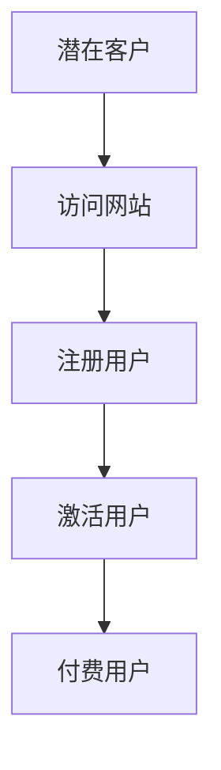

                 

### 文章标题

《创业公司的产品路线图制定与管理》

### 关键词

- 创业公司
- 产品路线图
- 产品愿景
- 产品目标
- 产品战略
- 市场分析
- 灵活调整

### 摘要

本文旨在探讨创业公司在快速发展的市场中如何制定和有效管理产品路线图。文章首先解释了产品路线图的概念及其在创业公司中的重要性，然后详细介绍了产品路线图的基本组成部分和类型。接下来，文章分为三个部分，首先讲解制定产品路线图的步骤和方法，包括明确产品愿景、分析市场需求、确定产品目标和战略等；其次讨论产品路线图制定过程中的注意事项，如保持灵活性、与团队成员沟通协调等；最后介绍产品路线图的管理，包括执行和监控、团队协作、迭代和优化等。文章通过两个案例展示了成功的产品路线图制定与实施经验，为创业公司提供实用的指导。附录部分则提供了相关的工具介绍和资源推荐，帮助读者更好地理解和应用产品路线图管理。### 目录大纲

# 《创业公司的产品路线图制定与管理》

## 第一部分：产品路线图概述

### 1.1 产品路线图的定义和重要性
#### 1.1.1 产品路线图的定义
#### 1.1.2 产品路线图在创业公司中的作用
#### 1.1.3 产品路线图与传统商业计划书的区别

### 1.2 产品路线图的基本组成部分
#### 1.2.1 产品愿景和使命
#### 1.2.2 产品目标
#### 1.2.3 产品战略和策略
#### 1.2.4 产品开发和迭代计划
#### 1.2.5 产品市场分析

### 1.3 产品路线图的类型和应用场景
#### 1.3.1 长期产品路线图
#### 1.3.2 短期产品路线图
#### 1.3.3 创业公司产品路线图的特点

## 第二部分：产品路线图的制定

### 2.1 制定产品路线图的步骤和方法
#### 2.1.1 明确产品愿景和使命
#### 2.1.2 分析市场需求和竞争情况
#### 2.1.3 确定产品目标和战略
#### 2.1.4 制定产品开发和迭代计划
#### 2.1.5 编写产品路线图文档

### 2.2 产品路线图制定过程中的注意事项
#### 2.2.1 保持灵活性
#### 2.2.2 与团队成员沟通协调
#### 2.2.3 利用数据驱动决策
#### 2.2.4 定期审查和更新产品路线图

### 2.3 产品路线图的模板和工具
#### 2.3.1 产品路线图模板
#### 2.3.2 常用的产品路线图工具

## 第三部分：产品路线图的管理

### 3.1 产品路线图的执行和监控
#### 3.1.1 分解产品目标和任务
#### 3.1.2 制定项目计划和时间表
#### 3.1.3 跟踪项目进展和风险
#### 3.1.4 进行进度审查和调整

### 3.2 产品路线图与团队协作
#### 3.2.1 建立跨部门协作机制
#### 3.2.2 明确团队成员的角色和责任
#### 3.2.3 利用协作工具和平台

### 3.3 产品路线图的迭代和优化
#### 3.3.1 收集用户反馈和市场变化
#### 3.3.2 调整产品目标和策略
#### 3.3.3 优化产品路线图的实施和执行

## 第四部分：成功的产品路线图案例分析

### 4.1 案例一：某创业公司成功的产品路线图制定与实施
#### 4.1.1 案例背景
#### 4.1.2 产品愿景和目标
#### 4.1.3 产品路线图的制定过程
#### 4.1.4 产品路线图的实施效果

### 4.2 案例二：某大型企业如何通过产品路线图实现产品升级
#### 4.2.1 案例背景
#### 4.2.2 产品愿景和目标
#### 4.2.3 产品路线图的制定过程
#### 4.2.4 产品路线图的实施效果

## 附录

### 附录 A：产品路线图制定和管理工具介绍
#### A.1 常用的产品路线图制定工具
#### A.2 产品路线图管理工具的特点与选择
#### A.3 工具的实际应用示例

### 附录 B：产品路线图制定和管理相关资源
#### B.1 经典产品路线图案例
#### B.2 产品管理相关书籍和文章推荐
#### B.3 产品管理社区和论坛介绍## 第一部分：产品路线图概述

### 1.1 产品路线图的定义和重要性

#### 1.1.1 产品路线图的定义

产品路线图是一份详细的文档，它描述了公司在未来一段时间内如何规划和实现其产品发展的路径。它不仅包括对产品的愿景和使命的明确，还涵盖了目标、战略、开发和迭代计划以及市场分析等多个方面。产品路线图是产品管理的核心工具，有助于确保团队在正确的方向上前进，并协调不同的团队和部门，确保资源的有效利用。

#### 1.1.2 产品路线图在创业公司中的作用

对于创业公司来说，产品路线图尤为重要。创业环境充满了不确定性和快速变化，没有清晰的产品路线图，团队可能会迷失方向，资源也会被错误地分配。以下是产品路线图在创业公司中发挥的关键作用：

1. **明确方向**：产品路线图帮助团队集中精力在最重要的事情上，确保每一项决策都与公司的长期愿景和目标保持一致。
2. **协调资源**：通过产品路线图，团队能够更好地理解哪些资源和时间应该被优先考虑，从而避免资源的浪费。
3. **风险管理**：产品路线图让团队可以识别潜在的风险和挑战，并提前制定应对策略。
4. **用户反馈**：产品路线图是一个持续迭代的过程，通过收集用户反馈和市场变化，团队能够及时调整路线图，确保产品的持续改进。
5. **沟通工具**：产品路线图作为一份沟通文档，可以帮助团队内外部成员更好地理解公司的战略和目标。

#### 1.1.3 产品路线图与传统商业计划书的区别

虽然产品路线图和传统商业计划书在某些方面有相似之处，但它们的目标和内容有所不同。商业计划书通常是一份详细的、长期的、静态的文档，它描述了公司的整体商业策略、市场机会、财务预测等。而产品路线图则更加动态、具体，专注于产品的开发过程和阶段性目标。

商业计划书侧重于：

- **市场机会和竞争分析**
- **财务计划和预算**
- **营销策略和销售渠道**
- **公司结构和股权**

产品路线图侧重于：

- **产品愿景和使命**
- **阶段性目标**
- **开发计划和时间表**
- **迭代和优化**

总的来说，产品路线图是商业计划书的一个补充，更专注于产品的实现过程，而商业计划书则提供了公司运营的整体蓝图。创业公司需要两者兼备，才能在快速变化的市场中保持竞争优势。

### 1.2 产品路线图的基本组成部分

#### 1.2.1 产品愿景和使命

产品愿景和使命是产品路线图的基石。产品愿景描述了产品在未来的理想状态，它通常是宏大的、感性的，帮助团队保持对长期目标的关注。而产品使命则更加具体，它明确了产品存在的目的和核心价值，通常包括为谁创造价值、如何创造价值等内容。

例子：

- 愿景：打造全球最便捷的移动支付平台。
- 使命：通过提供安全、快捷、便捷的支付解决方案，提升用户的支付体验。

#### 1.2.2 产品目标

产品目标是在一定时间内希望实现的具体结果，它们是产品愿景的阶段性实现。产品目标应该具有可衡量性、具体性、相关性和时限性（SMART原则）。

例子：

- 目标1：在接下来的6个月内，将用户数量增加50%。
- 目标2：在下一个季度，实现每月收入增长30%。

#### 1.2.3 产品战略和策略

产品战略是公司在实现产品目标过程中采用的基本方针和方向。它通常包括如何定位产品、如何应对市场竞争、如何分配资源等。

例子：

- 战略：专注于高端市场，通过卓越的用户体验和强大的品牌影响力，赢得用户忠诚度。

产品策略是实现产品战略的具体行动计划，它包括市场细分、产品功能定位、定价策略等。

例子：

- 策略：在用户支付功能中加入多种货币支持，以吸引国际用户。
- 策略：通过线上营销和线下活动，增加产品的市场曝光率。

#### 1.2.4 产品开发和迭代计划

产品开发和迭代计划是产品路线图中最具体和最动态的部分。它描述了产品从概念到上市的全过程，包括开发阶段、发布时间表、关键里程碑等。

例子：

- 开发阶段1：需求分析和市场调研（第1-2个月）
- 开发阶段2：设计和原型开发（第3-4个月）
- 开发阶段3：内部测试和优化（第5-6个月）
- 发布时间表：预计在第6个月末正式发布。

#### 1.2.5 产品市场分析

产品市场分析是产品路线图的重要组成部分，它帮助团队了解目标市场的现状和未来趋势。市场分析包括市场大小、增长速度、竞争格局、用户需求等。

例子：

- 市场大小：全球移动支付市场规模预计在未来三年内将增长30%。
- 增长速度：新兴市场用户对移动支付的需求增长速度超过20%。
- 竞争格局：当前市场上主要竞争对手有XX支付和YY支付。
- 用户需求：用户对支付速度和安全性的要求越来越高。

通过这些基本组成部分，产品路线图不仅为创业公司提供了一个清晰的发展方向，还帮助团队在复杂的市场环境中保持敏捷和适应性。接下来的章节将详细探讨如何制定和有效管理这些组成部分，帮助创业公司实现产品成功。### 1.3 产品路线图的类型和应用场景

#### 1.3.1 长期产品路线图

长期产品路线图通常涵盖一年以上的时间范围，它帮助公司规划未来的发展方向和关键里程碑。长期产品路线图侧重于战略性的规划和决策，旨在确保公司在长期内保持竞争优势。

**应用场景**：

- 创业公司成立初期，需要制定长期愿景和阶段性目标，以指导公司的长期发展。
- 大型企业在进行重大产品升级或战略转型时，需要使用长期产品路线图来规划具体实施步骤。

**示例**：

- 长期产品路线图可能包括以下关键里程碑：

  1. 第一年的目标是实现初步市场占有率，达到用户数量100万。
  2. 第二年的目标是实现盈利，通过提供增值服务增加收入。
  3. 第三年的目标是拓展国际市场，建立全球化品牌。

#### 1.3.2 短期产品路线图

短期产品路线图通常涵盖几周到几个月的时间范围，它侧重于具体任务的执行和短期目标的实现。短期产品路线图是长期产品路线图的补充，帮助团队在短期内保持目标和计划的清晰性。

**应用场景**：

- 创业公司在产品开发过程中，用于规划开发阶段和关键任务。
- 创业公司在市场营销和推广活动中，用于制定具体的时间表和行动计划。

**示例**：

- 短期产品路线图可能包括以下关键任务：

  1. 第一周：完成市场调研，收集用户反馈。
  2. 第一月：设计产品原型，进行内部测试。
  3. 第二月：发布第一个版本，收集用户数据。

#### 1.3.3 创业公司产品路线图的特点

创业公司的产品路线图具有以下几个特点：

1. **灵活性**：创业环境变化迅速，产品路线图需要具备高度的灵活性，以便快速适应市场变化。
2. **迭代性**：创业公司通常采用迭代开发的方法，产品路线图也需不断调整和优化，以适应产品迭代的需求。
3. **简洁性**：创业公司资源有限，产品路线图需要简洁明了，确保团队成员能够快速理解和执行。
4. **用户导向**：创业公司的产品路线图更注重用户需求和反馈，以快速验证产品价值和市场潜力。

**示例**：

- 创业公司的产品路线图可能包括以下几个关键要素：

  1. **用户需求分析**：收集并分析用户反馈，确定产品的核心功能和特性。
  2. **MVP（最小可行性产品）开发**：快速开发MVP，验证产品市场潜力。
  3. **迭代优化**：根据用户反馈和市场需求，不断优化产品功能和用户体验。

通过以上讨论，我们可以看到，产品路线图的类型和应用场景多种多样，创业公司需要根据自身的发展阶段和市场环境，灵活选择和制定适合的产品路线图。接下来，我们将深入探讨如何制定和有效管理产品路线图的详细步骤。### 第二部分：产品路线图的制定

产品路线图的制定是创业公司成功的关键步骤之一。它不仅为团队提供了清晰的发展方向，还能确保资源的合理分配和有效利用。以下是制定产品路线图的具体步骤和方法。

#### 2.1.1 明确产品愿景和使命

产品愿景和使命是产品路线图的基石，它们为整个产品开发过程提供了明确的方向和目标。

**步骤**：

1. **定义愿景**：思考产品在未来的理想状态，以及产品将如何改变用户的生活或工作方式。愿景应该具有宏观性，能激励团队成员。

   - 例如：“成为全球最受欢迎的短视频分享平台。”

2. **定义使命**：明确产品存在的目的和核心价值，它通常包括为谁创造价值、如何创造价值等内容。

   - 例如：“通过创新和高效的短视频分享，让每个人都有机会被看见。”

**注意事项**：

- 愿景和使命应该简洁、明确，并能够激发团队成员的热情和动力。
- 定期回顾和更新愿景和使命，确保它们与公司的长期战略保持一致。

#### 2.1.2 分析市场需求和竞争情况

分析市场需求和竞争情况是制定产品路线图的重要一步。它帮助团队了解目标市场的现状、用户需求和竞争环境，为后续的产品战略和策略提供依据。

**步骤**：

1. **市场调研**：通过问卷调查、用户访谈、竞品分析等方式，收集目标市场的相关信息。

   - 例如：了解用户对短视频平台的偏好、使用的频率、最关心的功能等。

2. **竞争分析**：分析当前市场上的主要竞争对手，了解他们的产品特点、市场份额、用户评价等。

   - 例如：研究抖音、快手等主要短视频平台的用户规模、功能特色、盈利模式。

3. **定位**：根据市场调研和竞争分析的结果，明确产品的市场定位和差异化优势。

   - 例如：定位为专业创作者和短视频爱好者的聚集地，提供高质量内容和个性化推荐。

**注意事项**：

- 市场需求和竞争情况是动态变化的，需要定期更新分析结果。
- 分析结果应作为制定产品目标和战略的重要参考。

#### 2.1.3 确定产品目标和战略

产品目标和战略是产品路线图的核心部分，它们决定了产品在市场上的定位和发展方向。

**步骤**：

1. **设定目标**：根据市场需求和竞争分析的结果，设定具体、可衡量的产品目标。

   - 例如：在第一个季度内，将月活跃用户数增加到100万。

2. **制定战略**：明确产品的发展方向和实施路径，包括市场定位、功能定位、定价策略等。

   - 例如：专注于短视频内容创作，提供多样化的创作工具和专业的编辑功能。

3. **分解目标**：将总体目标分解为多个阶段性目标，确保每个阶段都有明确的方向和可衡量的成果。

   - 例如：第一个阶段的目标是开发基本功能，第二个阶段的目标是优化用户体验，第三个阶段的目标是扩大用户群体。

**注意事项**：

- 产品目标和战略应与公司的长期愿景和使命保持一致。
- 确保目标和战略具有可操作性和可实现性。

#### 2.1.4 制定产品开发和迭代计划

产品开发和迭代计划是产品路线图中最具体和最动态的部分。它详细描述了从产品概念到上市的整个过程，包括开发阶段、发布时间表和关键里程碑。

**步骤**：

1. **需求分析**：明确产品的功能和特性，收集用户需求和反馈。

   - 例如：确定短视频上传、编辑、发布、互动等基本功能。

2. **设计和原型开发**：设计产品原型，进行用户体验测试，根据反馈进行调整。

   - 例如：设计短视频编辑界面，进行用户测试，收集反馈，优化设计。

3. **开发**：按照设计文档，进行产品开发，确保质量符合预期。

   - 例如：编写代码，实现短视频上传、编辑和发布功能。

4. **测试**：进行内部测试和用户测试，发现和修复问题。

   - 例如：测试上传速度、编辑功能、用户体验，确保产品稳定可靠。

5. **发布**：制定发布计划，确保产品按时上市。

   - 例如：确定发布日期，制定营销计划，确保用户能够顺利使用产品。

**注意事项**：

- 开发迭代计划应考虑产品需求的变化和市场环境的变化，保持灵活性。
- 确保每个阶段都有明确的里程碑和验收标准。

#### 2.1.5 编写产品路线图文档

编写产品路线图文档是将上述步骤和决策整理成一份完整文档的过程。它不仅为团队提供了清晰的发展方向，还能作为与外部利益相关者沟通的依据。

**步骤**：

1. **结构规划**：确定文档的结构，包括愿景和使命、产品目标、战略、开发和迭代计划等。

2. **内容撰写**：根据前面的步骤和决策，撰写文档的具体内容。

3. **可视化**：使用图表、流程图等可视化工具，使文档更加清晰易懂。

4. **审查和更新**：组织团队成员和利益相关者进行审查，确保文档的准确性和完整性。

**注意事项**：

- 文档应简洁明了，避免冗长和复杂的叙述。
- 定期更新文档，确保其反映最新的决策和进展。

通过以上步骤，创业公司可以制定出一份清晰、具体、可行的产品路线图，为产品的成功打下坚实基础。接下来，我们将讨论在制定产品路线图过程中需要注意的一些关键点。### 2.2 产品路线图制定过程中的注意事项

在制定产品路线图的过程中，确保路线图的准确性和可行性是至关重要的。以下是一些关键的注意事项，可以帮助创业公司在这一过程中避免常见的问题，提高成功率。

#### 2.2.1 保持灵活性

创业公司的环境多变，市场需求和竞争情况可能随时发生变化。因此，产品路线图需要具备高度的灵活性，能够根据实际情况进行调整。

**步骤**：

1. **建立预警机制**：定期监控市场变化、用户反馈和竞争对手动作，及时发现潜在的风险和机会。
2. **设置调整点**：在产品路线图中设置里程碑和检查点，定期评估进展，并根据实际情况进行调整。
3. **快速迭代**：采用敏捷开发方法，快速迭代产品，确保产品能够及时响应市场变化。

**注意事项**：

- 避免过于僵化的路线图，这可能会限制团队的适应能力。
- 灵活性并不意味着随意改变计划，而是在保持目标一致的前提下，灵活调整策略和步骤。

#### 2.2.2 与团队成员沟通协调

产品路线图的制定不仅仅是产品经理或CEO的工作，它需要团队中的每个成员都参与到其中。有效的沟通和协调是确保路线图能够得到有效执行的关键。

**步骤**：

1. **召开会议**：定期组织团队会议，讨论产品路线图的目标、进展和调整方案。
2. **透明沟通**：确保团队成员了解产品路线图的全部内容，以及每个人的职责和目标。
3. **分工合作**：明确团队成员的职责和任务，确保每个部分都有专人负责。

**注意事项**：

- 避免信息孤岛，确保所有团队成员都能够及时获得最新信息。
- 鼓励团队成员提出意见和建议，增强团队的参与感和责任感。

#### 2.2.3 利用数据驱动决策

数据是产品路线图制定过程中不可或缺的依据。通过数据分析，团队可以更准确地了解用户需求、市场趋势和产品性能，从而做出更加明智的决策。

**步骤**：

1. **数据收集**：建立数据收集机制，定期收集用户行为数据、市场数据和产品性能数据。
2. **数据分析**：对收集到的数据进行分析，提取有价值的信息，为产品路线图的制定提供依据。
3. **数据应用**：将数据分析结果应用到产品路线图的制定和调整过程中，确保决策有据可依。

**注意事项**：

- 确保数据来源的准确性和可靠性。
- 避免数据偏见，确保数据能够真实反映实际情况。

#### 2.2.4 定期审查和更新产品路线图

产品路线图不是一成不变的文档，而是一个持续迭代的过程。定期审查和更新产品路线图可以帮助团队确保其始终与公司的战略目标和市场环境保持一致。

**步骤**：

1. **定期审查**：设定定期审查的时间，对产品路线图的执行情况进行评估。
2. **更新内容**：根据审查结果，对产品路线图的内容进行调整和优化。
3. **更新文档**：将更新后的产品路线图文档分享给所有团队成员，确保每个人都能及时了解最新的情况。

**注意事项**：

- 审查和更新不应只是形式上的流程，而应该是基于实际数据和团队反馈的实质性调整。
- 确保所有团队成员都参与审查和更新过程，提高整个团队对产品路线图的认同感和执行力。

通过以上注意事项，创业公司可以更好地制定和管理产品路线图，确保其在不断变化的市场环境中保持竞争力。接下来，我们将介绍一些常用的产品路线图模板和工具，帮助团队更有效地制定和管理产品路线图。### 2.3 产品路线图的模板和工具

在制定产品路线图时，选择合适的模板和工具可以大大提高效率和清晰度。以下是一些常用的产品路线图模板和工具，以及它们的特点和适用场景。

#### 2.3.1 产品路线图模板

**1. Gantt图**

Gantt图是一种常用的项目管理工具，它可以直观地展示项目的进度和时间表。通过Gantt图，团队可以清晰地了解每个任务的开始和结束时间，以及任务的依赖关系。

**特点**：

- **直观**：通过条形图展示任务和时间，易于理解。
- **灵活**：可以轻松地调整任务的时间安排。

**适用场景**：

- **短期产品路线图**：适合用于规划几个月内的任务和时间表。

**示例**：

```markdown
# Gantt图示例

## 产品开发时间表

| 任务 | 开始时间 | 结束时间 |
| ---- | ------- | ------- |
| 需求分析 | 2023-04-01 | 2023-04-15 |
| 原型设计 | 2023-04-16 | 2023-04-30 |
| 开发 | 2023-05-01 | 2023-05-31 |
| 测试 | 2023-06-01 | 2023-06-15 |
| 发布 | 2023-06-16 | 2023-06-30 |
```

**2. 漏斗图**

漏斗图是一种用于展示销售或营销流程的工具，它可以帮助团队了解潜在客户在不同阶段的变化情况。漏斗图可以直观地显示每个阶段的转化率和漏斗瓶颈。

**特点**：

- **可视化**：通过漏斗形状展示数据，易于理解。
- **动态**：可以实时更新和调整漏斗数据。

**适用场景**：

- **市场营销产品路线图**：适合用于展示营销活动的效果和优化策略。

**示例**：



#### 2.3.2 常用的产品路线图工具

**1. Trello**

Trello是一种基于看板的项目管理工具，它通过卡片和看板来组织任务和项目。Trello的界面直观，易于使用，适合小型团队和灵活的产品路线图制定。

**特点**：

- **灵活**：可以自定义看板和卡片，适应不同的工作流程。
- **协作**：支持团队成员之间的实时协作和沟通。

**适用场景**：

- **团队协作产品路线图**：适合用于团队内部的协作和任务管理。

**示例**：

```markdown
# Trello示例

## 产品开发任务

| 卡片 | 任务描述 | 开始时间 | 结束时间 |
| ---- | -------- | ------- | ------- |
| 需求分析 | 收集用户需求 | 2023-04-01 | 2023-04-15 |
| 原型设计 | 设计产品原型 | 2023-04-16 | 2023-04-30 |
| 开发 | 实现产品功能 | 2023-05-01 | 2023-05-31 |
| 测试 | 进行内部测试 | 2023-06-01 | 2023-06-15 |
| 发布 | 发布产品 | 2023-06-16 | 2023-06-30 |
```

**2. Asana**

Asana是一种功能强大的项目管理工具，它支持任务分配、时间追踪、报告生成等多种功能。Asana适用于各种规模和类型的团队，可以满足复杂的产品路线图管理需求。

**特点**：

- **功能丰富**：支持任务、项目、报告等多种功能。
- **集成**：可以与其他工具（如Google Drive、Slack等）集成，提高工作效率。

**适用场景**：

- **大型团队产品路线图**：适合用于复杂、大规模的产品路线图管理。

**示例**：

```markdown
# Asana示例

## 产品开发时间表

### 需求分析
- 收集用户需求
  - 负责人：张三
  - 开始时间：2023-04-01
  - 结束时间：2023-04-15

### 原型设计
- 设计产品原型
  - 负责人：李四
  - 开始时间：2023-04-16
  - 结束时间：2023-04-30

### 开发
- 实现产品功能
  - 负责人：王五
  - 开始时间：2023-05-01
  - 结束时间：2023-05-31

### 测试
- 进行内部测试
  - 负责人：赵六
  - 开始时间：2023-06-01
  - 结束时间：2023-06-15

### 发布
- 发布产品
  - 负责人：钱七
  - 开始时间：2023-06-16
  - 结束时间：2023-06-30
```

通过以上模板和工具，创业公司可以根据自己的需求选择合适的工具，制定出清晰、具体、可行的产品路线图，从而更好地实现产品目标。接下来，我们将讨论如何执行和监控产品路线图。### 第三部分：产品路线图的管理

产品路线图的制定只是第一步，关键在于如何有效地执行、监控和调整，以确保产品目标能够得到实现。以下是产品路线图管理的详细方法和实践。

#### 3.1 产品路线图的执行和监控

#### 3.1.1 分解产品目标和任务

在执行产品路线图时，首先需要将产品目标和任务进行分解，使其具体化和可执行。这样可以明确每个团队成员的职责和任务，确保项目的顺利推进。

**步骤**：

1. **设定具体任务**：将产品目标分解为具体的任务，每个任务应具有明确的交付物和完成标准。
2. **分配任务**：根据团队成员的技能和经验，将任务分配给相应的成员。
3. **制定时间表**：为每个任务设定开始和结束时间，确保任务能在规定时间内完成。

**示例**：

- 产品目标：在6个月内增加100万用户。
- 具体任务：
  - 用户增长策略制定：团队A负责，2周内完成。
  - 营销活动策划：团队B负责，3周内完成。
  - 用户反馈收集和分析：团队C负责，每月进行。

#### 3.1.2 制定项目计划和时间表

制定详细的项目计划和时间表是确保产品路线图顺利执行的基础。项目计划应包括每个任务的开始时间、结束时间、负责人和交付物。

**步骤**：

1. **制定初步计划**：基于产品路线图，制定初步的项目计划和时间表。
2. **评审和调整**：组织团队会议，评审项目计划和时间表，根据团队成员的反馈进行调整。
3. **文档化**：将制定好的项目计划和时间表文档化，确保团队成员都能随时查阅。

**示例**：

```markdown
# 项目计划和时间表

## 需求分析阶段

| 任务 | 负责人 | 开始时间 | 结束时间 | 交付物 |
| ---- | ------ | ------- | ------- | ------ |
| 用户调研 | 张三 | 2023-04-01 | 2023-04-10 | 调研报告 |
| 需求整理 | 李四 | 2023-04-11 | 2023-04-20 | 需求文档 |

## 设计阶段

| 任务 | 负责人 | 开始时间 | 结束时间 | 交付物 |
| ---- | ------ | ------- | ------- | ------ |
| UI设计 | 王五 | 2023-04-21 | 2023-04-30 | UI设计稿 |
| 功能设计 | 赵六 | 2023-04-21 | 2023-04-30 | 功能文档 |

## 开发阶段

| 任务 | 负责人 | 开始时间 | 结束时间 | 交付物 |
| ---- | ------ | ------- | ------- | ------ |
| 前端开发 | 张三 | 2023-05-01 | 2023-05-15 | 前端代码 |
| 后端开发 | 李四 | 2023-05-01 | 2023-05-15 | 后端代码 |

## 测试阶段

| 任务 | 负责人 | 开始时间 | 结束时间 | 交付物 |
| ---- | ------ | ------- | ------- | ------ |
| 内部测试 | 王五 | 2023-05-16 | 2023-05-20 | 测试报告 |
| 用户测试 | 赵六 | 2023-05-21 | 2023-05-25 | 用户反馈 |

## 发布阶段

| 任务 | 负责人 | 开始时间 | 结束时间 | 交付物 |
| ---- | ------ | ------- | ------- | ------ |
| 部署上线 | 全体 | 2023-05-26 | 2023-05-30 | 线上产品 |
```

#### 3.1.3 跟踪项目进展和风险

在项目执行过程中，需要持续跟踪项目进展和风险，确保项目能够按计划进行。

**步骤**：

1. **设立监控机制**：建立项目监控机制，定期检查任务完成情况和项目进度。
2. **风险识别**：定期评估项目风险，识别潜在的问题和挑战。
3. **风险应对**：制定相应的风险应对策略，减少风险对项目的影响。

**示例**：

- 监控机制：每周举行项目进度会议，评审任务的完成情况，讨论遇到的问题和解决方案。
- 风险识别：发现前端开发进度滞后，分析原因是技术难题和团队人手不足。
- 风险应对：增加人手，调整任务优先级，确保项目按时完成。

#### 3.1.4 进行进度审查和调整

定期审查项目进度，并根据实际情况进行必要的调整，是确保产品路线图顺利执行的关键。

**步骤**：

1. **定期审查**：按计划进行进度审查，评估项目完成情况和目标达成情况。
2. **分析偏差**：分析项目进度与计划之间的偏差，找出原因。
3. **调整计划**：根据审查结果，对项目计划进行调整，确保项目能够按计划完成。

**示例**：

- 定期审查：每两个月进行一次项目进度审查，评估上一阶段的目标完成情况和下一阶段的工作计划。
- 分析偏差：发现用户增长速度低于预期，分析原因是市场推广效果不佳。
- 调整计划：增加市场推广预算，优化营销策略，确保用户增长目标的达成。

#### 3.2 产品路线图与团队协作

有效的团队协作是产品路线图成功执行的重要保障。通过建立跨部门协作机制、明确团队成员的角色和责任、以及利用协作工具和平台，可以大大提高团队的工作效率和协作效果。

**步骤**：

1. **建立跨部门协作机制**：打破部门壁垒，建立跨部门协作机制，确保信息畅通和资源共享。
2. **明确角色和责任**：为每个团队成员明确角色和责任，确保任务分工清晰，避免职责重叠和责任不清。
3. **利用协作工具和平台**：选择合适的协作工具和平台，如Trello、Asana、Slack等，提高团队的沟通效率和协作效果。

**示例**：

- 跨部门协作机制：定期组织跨部门会议，讨论项目进展和协作事项。
- 明确角色和责任：项目经理负责项目进度和任务分配，UI设计师负责界面设计，后端开发者负责代码实现。
- 利用协作工具和平台：使用Trello进行任务管理，Slack进行实时沟通，确保团队成员之间的信息畅通和协作高效。

#### 3.3 产品路线图的迭代和优化

产品路线图不是一成不变的文档，而是一个持续迭代和优化的过程。通过收集用户反馈、市场变化和团队反馈，不断调整产品目标和策略，可以确保产品始终与市场需求保持一致，提高产品的市场竞争力和用户体验。

**步骤**：

1. **收集用户反馈**：通过用户调研、用户反馈渠道等，收集用户对产品的意见和建议。
2. **分析市场变化**：定期分析市场趋势和竞争对手的动态，了解市场变化和竞争环境。
3. **团队反馈**：组织团队成员进行定期的反思和讨论，收集团队对产品路线图的反馈和建议。
4. **调整产品目标和策略**：根据收集到的反馈和分析结果，调整产品目标和策略，确保产品能够持续优化和改进。

**示例**：

- 收集用户反馈：通过用户调研问卷、社交媒体反馈等方式，收集用户对产品功能的意见和建议。
- 分析市场变化：定期关注行业报告和市场数据，了解市场趋势和竞争对手的动态。
- 团队反馈：组织团队会议，讨论产品改进方向和实施策略。
- 调整产品目标和策略：根据用户反馈和市场分析结果，调整产品功能定位和市场推广策略，提高产品的竞争力和用户体验。

通过以上步骤和方法，创业公司可以更好地执行和监控产品路线图，确保产品目标的实现，并不断优化产品路线图，以适应市场变化和用户需求。接下来，我们将通过成功的产品路线图案例，进一步探讨如何有效制定和实施产品路线图。### 第四部分：成功的产品路线图案例分析

#### 4.1 案例一：某创业公司成功的产品路线图制定与实施

**4.1.1 案例背景**

某创业公司是一家专注于移动健康监测领域的公司，他们的产品是一款能够实时监测心率、血压和睡眠质量的智能手环。公司在成立初期，面临着市场定位模糊、资源有限、竞争激烈等挑战。

**4.1.2 产品愿景和目标**

产品愿景：成为全球领先的智能健康监测解决方案提供商。

产品目标：

1. 第一阶段（1-2年）：推出MVP（最小可行性产品），验证市场需求。
2. 第二阶段（2-3年）：扩大产品功能，提高用户体验，增加市场份额。
3. 第三阶段（3-5年）：拓展国际市场，实现全球化布局。

**4.1.3 产品路线图的制定过程**

1. **明确产品愿景和使命**：公司创始人通过市场调研和用户访谈，明确了产品的愿景和使命，确保所有团队成员都对此有共同的理解和认同。

2. **分析市场需求和竞争情况**：通过市场调研和竞品分析，公司了解了目标市场的现状和用户需求，明确了产品的市场定位和差异化优势。

3. **确定产品目标和战略**：基于市场需求和竞争分析，公司制定了具体的产品目标和战略，包括功能定位、市场细分和定价策略等。

4. **制定产品开发和迭代计划**：公司制定了详细的产品开发和迭代计划，包括MVP开发、功能扩展、用户体验优化等阶段。

5. **编写产品路线图文档**：公司编写了一份详细的产品路线图文档，涵盖了产品愿景、使命、目标、战略、开发和迭代计划等，确保团队成员和利益相关者都能清晰了解公司的战略方向和实施步骤。

**4.1.4 产品路线图的实施效果**

1. **MVP成功推出**：在第一阶段，公司成功推出了MVP，并在市场上取得了良好的反响，验证了市场需求。

2. **产品功能持续优化**：在第二阶段，公司根据用户反馈和市场需求，不断优化产品功能，提高了用户体验，市场份额逐步增加。

3. **国际市场拓展**：在第三阶段，公司开始拓展国际市场，通过参加国际展会、建立海外合作伙伴等方式，实现了全球化布局。

4. **持续创新和成长**：通过持续的产品迭代和市场拓展，公司实现了持续创新和成长，成为智能健康监测领域的领先者。

**总结**：该创业公司的成功经验表明，通过明确的产品愿景和使命、科学的市场分析、具体的产品目标和战略，以及详细的开发和迭代计划，创业公司可以有效地制定和实施产品路线图，实现产品成功和市场拓展。

#### 4.2 案例二：某大型企业如何通过产品路线图实现产品升级

**4.2.1 案例背景**

某大型企业是一家拥有多年历史的互联网公司，其核心产品是一款在线办公软件。随着市场竞争的加剧和用户需求的变化，企业意识到需要通过产品升级来保持竞争优势。

**4.2.2 产品愿景和目标**

产品愿景：打造全球领先的智能办公平台。

产品目标：

1. 提升用户体验：通过优化界面设计和增加新功能，提升用户满意度。
2. 拓展用户群体：通过市场推广和合作，吸引更多用户。
3. 实现商业化：通过增值服务和广告收入，实现商业模式的升级。

**4.2.3 产品路线图的制定过程**

1. **明确产品愿景和使命**：企业高层领导明确了产品的愿景和使命，确保所有团队成员对此有共同的理解和认同。

2. **分析市场需求和竞争情况**：企业通过市场调研和竞品分析，了解了目标市场的现状和用户需求，明确了产品的市场定位和差异化优势。

3. **确定产品目标和战略**：基于市场需求和竞争分析，企业制定了具体的产品目标和战略，包括功能定位、市场细分和定价策略等。

4. **制定产品开发和迭代计划**：企业制定了详细的产品开发和迭代计划，包括功能升级、用户体验优化、市场推广等阶段。

5. **编写产品路线图文档**：企业编写了一份详细的产品路线图文档，涵盖了产品愿景、使命、目标、战略、开发和迭代计划等，确保团队成员和利益相关者都能清晰了解公司的战略方向和实施步骤。

**4.2.4 产品路线图的实施效果**

1. **用户体验大幅提升**：通过界面优化和新功能的增加，用户的满意度和活跃度显著提高。

2. **用户群体扩大**：通过市场推广和合作，企业的用户群体得到了有效扩大，市场份额逐步增加。

3. **商业化模式成功转型**：通过增值服务和广告收入，企业的商业模式得到了成功转型，实现了商业化的目标。

4. **持续创新和成长**：通过持续的产品迭代和市场拓展，企业实现了持续创新和成长，成为智能办公领域的领先者。

**总结**：该大型企业的成功经验表明，通过明确的产品愿景和使命、科学的市场分析、具体的产品目标和战略，以及详细的开发和迭代计划，企业可以有效地制定和实施产品路线图，实现产品升级和商业成功。

这两个案例展示了不同类型企业在不同发展阶段如何通过产品路线图实现成功。创业公司需要灵活调整产品路线图，快速响应市场变化；而大型企业则需要通过持续的产品迭代和创新，保持竞争优势。通过这些案例，创业公司可以借鉴成功经验，制定适合自己的产品路线图。### 附录

#### 附录 A：产品路线图制定和管理工具介绍

**A.1 常用的产品路线图制定工具**

在制定和管理产品路线图时，选择合适的工具可以提高效率和效果。以下是一些常用的产品路线图制定工具：

**1. Trello**

Trello是一款基于看板的项目管理工具，它通过卡片和看板来组织任务和项目。Trello的界面直观，易于使用，适合小型团队和灵活的产品路线图制定。

**2. Asana**

Asana是一款功能强大的项目管理工具，它支持任务分配、时间追踪、报告生成等多种功能。Asana适用于各种规模和类型的团队，可以满足复杂的产品路线图管理需求。

**3. Microsoft Project**

Microsoft Project是一款专业的项目管理软件，它提供了丰富的功能，包括甘特图、资源管理、进度追踪等。适合需要高度定制化和管理的大型项目。

**4. Slack**

Slack是一款团队协作工具，它集成了任务管理、实时沟通、文件共享等功能。Slack可以帮助团队高效沟通和协作，确保产品路线图的实施顺利进行。

**A.2 产品路线图管理工具的特点与选择**

在选择产品路线图管理工具时，需要考虑以下几个方面的特点：

**1. 界面和用户体验**：界面直观、易于使用，能够快速上手。

**2. 功能和定制化**：工具应提供丰富的功能，如任务管理、进度追踪、时间表、协作等，同时允许定制化以满足不同需求。

**3. 扩展性和集成性**：工具应具有较好的扩展性和集成性，能够与其他工具（如邮件、日历、CRM等）集成，提高工作效率。

**4. 安全性和可靠性**：工具应具备良好的安全性和可靠性，确保数据和项目信息的安全。

**5. 成本和预算**：根据团队的规模和预算，选择适合的工具，避免不必要的开销。

**A.3 工具的实际应用示例**

以下是一些产品路线图管理工具的实际应用示例：

**1. Trello**


**2. Asana**


**3. Microsoft Project**


**4. Slack**


#### 附录 B：产品路线图制定和管理相关资源

**B.1 经典产品路线图案例**

以下是一些经典的产品路线图案例，供参考和学习：

1. **Google的产品路线图**：[Google的产品路线图](https://www.google.com/about/company/our-products/)
2. **Airbnb的产品路线图**：[Airbnb的产品路线图](https://www.airbnb.com/zh/corporate)
3. **Netflix的产品路线图**：[Netflix的产品路线图](https://www.netflix.com/zh-CN/Help/NF000335370)

**B.2 产品管理相关书籍和文章推荐**

以下是一些产品管理相关的书籍和文章，可以帮助读者深入了解产品路线图的制定和管理：

1. **《启示录：打造用户喜爱的产品》**：作者：苗建伟
2. **《产品经理的第一本书》**：作者：申屠青春
3. **《产品经理的核心技能》**：作者：明哲
4. **《产品经理实战手册》**：作者：李天舒
5. **《产品经理如何做需求分析》**：作者：张亮

**B.3 产品管理社区和论坛介绍**

以下是一些产品管理社区和论坛，供产品经理和爱好者交流和学习：

1. **产品经理成长社**：[产品经理成长社](https://www.productmanager.cn/)
2. **产品中国**：[产品中国](https://www.product china.com/)
3. **人人都是产品经理**：[人人都是产品经理](https://www.woshipm.com/)
4. **产品之路**：[产品之路](https://www.producelab.cn/)
5. **知乎产品管理话题**：[知乎产品管理话题](https://www.zhihu.com/topics/24754656)

通过这些资源，读者可以深入了解产品路线图的制定和管理，从实践中学习和成长，为创业公司的产品成功打下坚实基础。### 作者信息

作者：AI天才研究院/AI Genius Institute & 禅与计算机程序设计艺术 /Zen And The Art of Computer Programming

