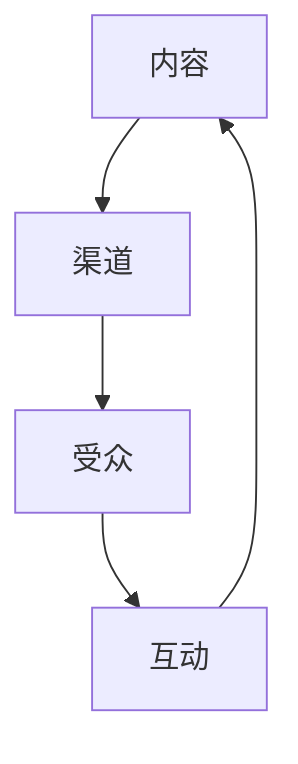
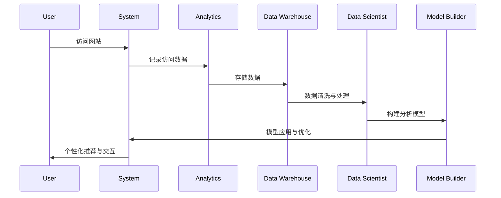
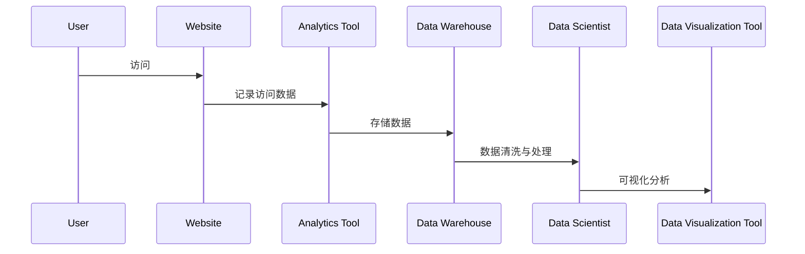
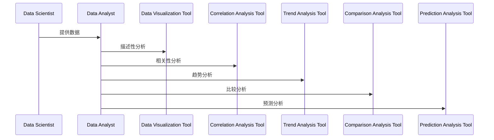
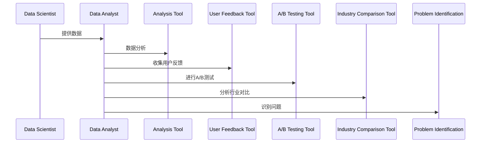
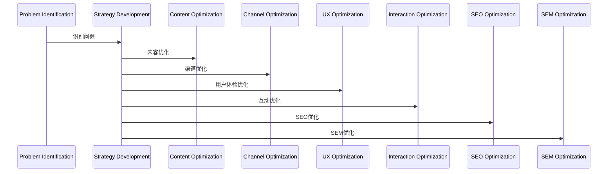
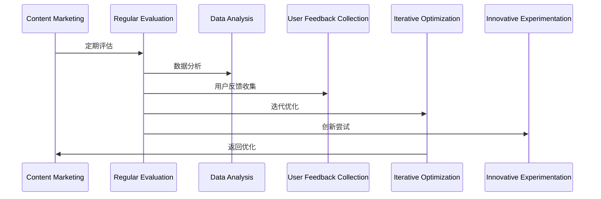

                 

### 文章标题

“《创业公司的内容营销策略》”

### 关键词

- 创业公司
- 内容营销
- 目标受众
- 内容创作
- 社交媒体运营
- SEO与SEM

### 摘要

本文旨在为创业公司提供一套完整的内容营销解决方案。通过深入分析内容营销的基础理论、策略制定、实践操作以及效果评估等关键环节，结合创业公司的特点，文章提出了系统化的内容营销策略。本文不仅阐述了内容营销的核心概念与联系，还通过具体的算法原理讲解、数学模型说明和实战案例分析，帮助创业公司有效实施内容营销，实现业务增长。

### 目录大纲

#### 第一部分：内容营销基础

- **第1章：内容营销概述**
  - 1.1 内容营销的定义与价值
  - 1.2 内容营销的发展历程
  - 1.3 创业公司内容营销的重要性

- **第2章：目标受众分析**
  - 2.1 了解目标受众
  - 2.2 受众需求与痛点分析
  - 2.3 受众画像构建

#### 第二部分：内容营销策略制定

- **第3章：内容营销战略规划**
  - 3.1 内容营销目标设定
  - 3.2 内容营销策略制定
  - 3.3 内容营销预算分配

- **第4章：内容创作与优化**
  - 4.1 内容创作原则
  - 4.2 内容形式选择
  - 4.3 内容优化与推广

- **第5章：社交媒体运营**
  - 5.1 社交媒体平台选择
  - 5.2 社交媒体内容发布策略
  - 5.3 社交媒体互动与用户关系维护

- **第6章：SEO与SEM策略**
  - 6.1 SEO策略概述
  - 6.2 关键词研究
  - 6.3 SEO优化实践
  - 6.4 SEM广告投放策略

#### 第三部分：内容营销效果评估与优化

- **第7章：内容营销效果评估**
  - 7.1 评估指标体系构建
  - 7.2 数据收集与处理
  - 7.3 数据分析与应用

- **第8章：内容营销优化策略**
  - 8.1 问题诊断
  - 8.2 优化策略制定
  - 8.3 持续改进与迭代

#### 第四部分：案例与实践

- **第9章：创业公司内容营销案例分析**
  - 9.1 案例一：公司A的内容营销策略与实践
  - 9.2 案例二：公司B的内容营销策略与实践
  - 9.3 案例三：公司C的内容营销策略与实践

- **第10章：创业公司内容营销实战指南**
  - 10.1 实战一：搭建内容营销平台
  - 10.2 实战二：撰写高质量内容
  - 10.3 实战三：进行有效内容推广

### 附录

- **附录A：内容营销工具推荐**
- **附录B：创业公司内容营销资源汇总**
- **附录C：创业公司内容营销常见问题解答**

通过以上目录大纲，本文将为读者提供一个系统、全面的内容营销知识框架，并指导创业公司如何在实际操作中应用和优化内容营销策略，实现业务增长。

### 第一部分：内容营销基础

#### 第1章：内容营销概述

**1.1 内容营销的定义与价值**

内容营销是一种通过创造和分享有价值的内容来吸引潜在客户，增强品牌认知度，促进销售和客户忠诚度的营销策略。它不仅包括文字、图像、视频等传统内容形式，还涵盖了社交媒体、博客、电子邮件、搜索引擎优化（SEO）等多种传播渠道。

在创业公司中，内容营销具有以下价值：

1. **提高品牌知名度**：通过高质量的内容创作和传播，创业公司可以迅速提升品牌在目标市场中的知名度。
2. **吸引潜在客户**：有价值的内容能够吸引潜在客户的关注，增加网站流量和转化率。
3. **建立权威性**：通过持续输出专业内容，创业公司可以树立行业专家的形象，增强客户信任。
4. **降低营销成本**：与传统的广告投放相比，内容营销的成本更低，且效果更为持久。
5. **增强用户互动**：通过社交媒体等平台，内容营销可以促进用户参与和互动，提升用户满意度。

**1.2 内容营销的发展历程**

内容营销的历史可以追溯到20世纪初期，但作为一个明确的营销策略，它的发展主要经历了以下几个阶段：

1. **早期阶段（20世纪初至20世纪90年代）**：早期的内容营销主要以印刷媒体为主，如杂志、报纸和书籍等。企业通过这些渠道传播品牌信息，但传播范围有限。
2. **互联网阶段（20世纪90年代至21世纪初）**：随着互联网的普及，企业开始利用网站和电子邮件进行内容营销。这一阶段，内容营销开始注重网络平台的搭建和电子邮件营销的应用。
3. **社交媒体阶段（21世纪初至今）**：社交媒体的兴起使得内容营销进入了一个全新的阶段。通过博客、微博、YouTube等平台，企业能够更直接地与用户互动，实现内容的病毒式传播。

**1.3 创业公司内容营销的重要性**

对于创业公司而言，内容营销具有以下几个关键重要性：

1. **品牌建设**：初创企业通常没有大量的资金进行广告投放，内容营销成为了一种有效的品牌建设工具。通过高质量的内容，创业公司可以快速建立品牌形象和声誉。
2. **市场定位**：通过内容营销，创业公司能够更好地了解市场需求和用户偏好，从而进行精准的市场定位。
3. **成本效益**：内容营销相对于传统广告投放具有更高的成本效益。创业公司可以通过持续的内容创作，长期吸引和留住客户。
4. **用户参与**：内容营销鼓励用户参与和互动，有助于建立用户社区，提升用户忠诚度。

**1.4 内容营销的核心概念与联系**

为了更好地理解内容营销，我们需要明确以下几个核心概念，并探讨它们之间的联系：

1. **内容**：这是内容营销的基础，包括文字、图像、视频等多种形式。内容的质量直接影响用户的兴趣和参与度。
2. **渠道**：内容需要通过合适的渠道传播，如社交媒体、博客、电子邮件等。不同的渠道具有不同的受众和传播效果。
3. **受众**：目标受众是内容营销的焦点，了解受众的需求、兴趣和行为模式对于内容创作和传播至关重要。
4. **互动**：内容营销不仅仅是单向传播，更是与用户的互动。通过评论、分享、私信等互动方式，企业可以深入了解用户，优化内容策略。

下面是一个简单的Mermaid流程图，展示了内容营销的核心概念及其相互关系：



**1.5 内容营销的算法原理讲解**

在内容营销中，算法原理可以用于多个方面，如内容推荐、用户行为分析等。以下是一个简单的伪代码示例，用于分析用户行为，进而推荐相关内容：

```python
# 假设我们有用户的浏览历史数据
user_history = ["文章A", "视频B", "博客C"]

# 定义相关内容的推荐算法
def content_recommendation(history):
    recommended_content = []
    
    # 分析用户历史数据，找出最受欢迎的内容类型
    content_types = {}
    for item in history:
        content_types[item] = content_types.get(item, 0) + 1
    
    # 推荐频次最高的内容
    for content, freq in content_types.items():
        if freq > 1:
            recommended_content.append(content)
    
    return recommended_content

# 调用推荐算法
recommended = content_recommendation(user_history)
print("推荐内容：", recommended)
```

**1.6 数学模型与公式**

在内容营销中，一些数学模型和公式可以帮助我们更准确地评估内容效果和用户行为。以下是一个简单的转化率公式：

$$
\text{转化率} = \frac{\text{转化的用户数}}{\text{总访问用户数}} \times 100\%
$$

例如，如果一个页面有1000次访问，其中50次转化，则转化率为：

$$
\text{转化率} = \frac{50}{1000} \times 100\% = 5\%
$$

**1.7 项目实战：开发环境搭建**

在实施内容营销策略之前，创业公司需要搭建一个合适的内容营销平台。以下是一个简单的开发环境搭建流程：

1. **确定平台需求**：根据公司的内容营销策略，确定所需的功能模块，如内容管理、数据分析、用户互动等。
2. **选择技术栈**：根据平台需求，选择合适的前端和后端技术，如React、Vue.js、Node.js等。
3. **搭建开发环境**：安装必要的开发工具和软件，如代码编辑器、版本控制系统、数据库等。
4. **编写源代码**：根据平台需求，编写相应的源代码，并进行功能测试。
5. **部署上线**：将开发完成的内容营销平台部署到服务器，并进行上线测试。

**1.8 代码解读与分析**

以下是一个简单的Python代码示例，用于生成用户画像：

```python
# 假设有以下用户数据
users = [
    {"name": "Alice", "age": 25, "interests": ["编程", "旅行"]},
    {"name": "Bob", "age": 30, "interests": ["音乐", "运动"]},
    {"name": "Charlie", "age": 35, "interests": ["美食", "科技"]},
]

# 定义用户画像生成函数
def generate_user_profile(users):
    profiles = []
    for user in users:
        profile = {
            "name": user["name"],
            "age": user["age"],
            "interests": user["interests"],
            "activity": sum([1 for interest in user["interests"] if "编程" in interest]),
        }
        profiles.append(profile)
    return profiles

# 调用函数生成用户画像
profiles = generate_user_profile(users)
print("用户画像：", profiles)
```

通过这个示例，我们可以看到如何通过简单的数据处理，生成用户画像，为内容营销提供决策依据。

**1.9 实际案例分析和详细讲解剖析**

以一家初创公司A为例，该公司在内容营销中采取了以下策略：

1. **目标设定**：明确公司的目标客户群体，如年轻的科技爱好者。
2. **内容创作**：创作高质量的技术博客、视频教程和社交媒体动态，以吸引目标客户。
3. **渠道选择**：在GitHub、YouTube、Twitter等平台上发布内容，与目标客户建立联系。
4. **互动维护**：通过回复评论、私信等方式，与用户互动，建立良好的用户关系。

通过这些策略，公司A在短时间内实现了品牌知名度的提升和用户群体的增长。详细分析如下：

1. **目标设定**：明确目标客户有助于内容创作和传播方向，提高内容的相关性和有效性。
2. **内容创作**：高质量的内容能够吸引目标客户，提升品牌权威性和用户满意度。
3. **渠道选择**：选择与目标客户群体高度相关的平台，提高内容曝光率和互动机会。
4. **互动维护**：与用户互动有助于建立用户社区，提升用户忠诚度和品牌口碑。

**1.10 最佳实践 Tips**

1. **持续优化**：内容营销是一个持续的过程，需要定期评估和优化内容策略，以适应市场变化和用户需求。
2. **数据驱动**：利用数据分析工具，收集用户行为数据，为内容创作和策略调整提供依据。
3. **多元化内容**：结合多种内容形式，如文字、图像、视频等，提升内容吸引力和用户参与度。
4. **合作推广**：与其他品牌或行业专家合作，共同推广内容，扩大传播范围和影响力。

**1.11 小结**

本章介绍了内容营销的基础概念、发展历程和重要性，并探讨了核心概念之间的联系。通过算法原理讲解、数学模型和实际案例分析，我们为创业公司提供了一套内容营销解决方案。在后续章节中，我们将进一步探讨内容营销策略的制定、实施和优化，帮助创业公司实现业务增长。

### 第二部分：内容营销策略制定

#### 第2章：目标受众分析

**2.1 了解目标受众**

在内容营销中，了解目标受众是至关重要的。目标受众不仅决定了内容的创作方向，还影响了渠道选择、传播策略和互动方式。因此，深入分析目标受众的需求、兴趣和行为模式，是制定有效内容营销策略的基础。

**2.2 受众需求与痛点分析**

了解目标受众的需求和痛点，有助于我们创作更有针对性的内容。以下是一些关键步骤：

1. **调研与分析**：通过问卷调查、访谈、用户反馈等方式，收集目标受众的反馈，了解他们的需求和痛点。
2. **用户画像**：根据调研数据，构建目标受众的画像，包括年龄、性别、职业、收入水平、兴趣爱好等。
3. **需求排序**：分析受众的需求，将其按照优先级排序，重点关注最迫切和最关键的需求。

例如，一家初创公司B的目标受众是年轻的科技爱好者，通过调研发现他们的主要需求包括：

- **技术学习资源**：如编程教程、技术博客、开源项目等。
- **行业动态**：如最新科技新闻、行业报告等。
- **互动交流**：如技术论坛、社群活动等。

**2.3 受众画像构建**

构建目标受众画像需要从多个维度进行数据收集和分析，以下是一个简化的受众画像示例：

```mermaid
classDiagram
    User[Name: Alice, Age: 25, Gender: Female, Occupation: Student, Interests: 编程、旅行、健身]
    TechEnthusiast <<|-- User : has
    Developer <<|-- User : has
    Student <<|-- User : is
```

在这个示例中，我们构建了一个名为Alice的用户画像，她是一个25岁的女性学生，对编程、旅行和健身有浓厚兴趣。她同时也是一名技术开发爱好者，关注行业动态和技术趋势。

**2.4 数据分析与应用**

通过数据分析，我们可以更深入地了解目标受众的行为模式，从而优化内容创作和传播策略。以下是一些常见的数据分析工具和方法：

1. **Google Analytics**：分析网站流量、用户行为、来源渠道等数据，了解用户访问路径和兴趣点。
2. **社交媒体分析工具**：如Facebook Insights、Twitter Analytics等，分析用户互动、内容表现等数据。
3. **用户调研问卷**：通过问卷星、金数据等工具，收集用户反馈和数据，进行定量分析。

以下是一个简单的数据分析流程示例：



通过这个流程，数据科学家可以构建用户行为分析模型，为系统提供个性化推荐和交互功能。

**2.5 项目实战：用户行为分析工具搭建**

为了更好地了解目标受众的行为，一家创业公司C决定搭建一个用户行为分析工具。以下是一个简化的项目实战流程：

1. **需求分析**：明确公司希望从工具中获得哪些数据，如页面访问量、用户停留时间、转化率等。
2. **技术选型**：根据需求，选择合适的前后端技术栈，如React、Node.js、MongoDB等。
3. **数据采集**：利用前端JavaScript和后端API，收集用户行为数据，并存储到数据库中。
4. **数据处理**：使用数据处理工具（如Python、SQL等），对采集到的数据进行分析和清洗。
5. **数据可视化**：使用可视化工具（如ECharts、D3.js等），将分析结果以图表形式呈现，便于决策。

以下是一个简单的用户行为分析工具的伪代码示例：

```python
# 假设我们有用户的浏览历史数据
user_sessions = [
    {"user_id": 1, "page": "首页", "duration": 120},
    {"user_id": 1, "page": "产品介绍", "duration": 300},
    {"user_id": 2, "page": "联系我们", "duration": 60},
]

# 定义用户行为分析函数
def analyze_user_sessions(sessions):
    session_data = {}
    for session in sessions:
        user_id = session["user_id"]
        if user_id not in session_data:
            session_data[user_id] = []
        session_data[user_id].append(session)
    
    for user_id, sessions in session_data.items():
        total_duration = sum([session["duration"] for session in sessions])
        session_data[user_id]["total_duration"] = total_duration
    
    return session_data

# 调用分析函数
 analyzed_data = analyze_user_sessions(user_sessions)
print("用户行为分析结果：", analyzed_data)
```

通过这个示例，我们可以看到如何利用简单的数据处理，分析用户在网站上的行为，从而为内容营销策略提供数据支持。

**2.6 代码解读与分析**

以下是一个简单的Python代码示例，用于分析用户在不同页面上的停留时间：

```python
# 假设我们有以下用户访问数据
user_visits = [
    {"user_id": 1, "page": "首页", "duration": 150},
    {"user_id": 1, "page": "产品介绍", "duration": 200},
    {"user_id": 2, "page": "联系我们", "duration": 50},
]

# 定义页面停留时间分析函数
def analyze_page_duration(visits):
    page_duration = {}
    for visit in visits:
        page = visit["page"]
        duration = visit["duration"]
        if page not in page_duration:
            page_duration[page] = 0
        page_duration[page] += duration
    
    return page_duration

# 调用分析函数
 page_durations = analyze_page_duration(user_visits)
print("页面停留时间分析结果：", page_durations)
```

通过这个示例，我们可以看到如何通过简单的数据处理，分析用户在不同页面上的停留时间，从而为内容优化提供参考。

**2.7 实际案例分析和详细讲解剖析**

以一家初创公司D为例，该公司在内容营销中采取了以下步骤：

1. **用户画像构建**：通过市场调研和数据分析，构建了目标受众的画像，包括年龄、职业、兴趣爱好等。
2. **需求分析**：根据用户画像，分析了目标受众的需求，如技术学习资源、行业动态、互动交流等。
3. **内容创作**：根据需求分析结果，创作了一系列高质量的内容，如技术博客、视频教程、社交媒体动态等。
4. **渠道选择**：根据用户画像和需求分析，选择了GitHub、YouTube、Twitter等与目标受众高度相关的平台。
5. **互动维护**：通过回复评论、私信等方式，与用户互动，建立了良好的用户关系。

通过这些步骤，公司D在短时间内实现了用户群体的快速增长和品牌知名度的提升。详细分析如下：

1. **用户画像构建**：明确目标受众有助于内容创作和传播策略的制定，提高内容的相关性和有效性。
2. **需求分析**：了解目标受众的需求，有助于创作更具针对性的内容，提升用户满意度和参与度。
3. **内容创作**：高质量的内容能够吸引目标受众，提升品牌权威性和用户忠诚度。
4. **渠道选择**：选择与目标受众高度相关的平台，提高内容曝光率和互动机会。
5. **互动维护**：与用户互动有助于建立用户社区，提升用户忠诚度和品牌口碑。

**2.8 最佳实践 Tips**

1. **定期更新用户画像**：目标受众的需求和兴趣会随时间变化，定期更新用户画像，有助于保持内容营销策略的时效性和有效性。
2. **多样化调研方法**：结合问卷调查、访谈、用户反馈等多种调研方法，获取更全面和准确的数据。
3. **关注用户反馈**：积极倾听用户反馈，及时调整内容创作和传播策略，提高用户满意度。
4. **数据可视化**：通过数据可视化工具，将分析结果以图表形式呈现，便于理解和决策。

**2.9 小结**

本章介绍了目标受众分析的方法和步骤，包括了解目标受众、需求与痛点分析、受众画像构建和数据分析。通过项目实战和实际案例分析，我们为创业公司提供了一套目标受众分析解决方案。在后续章节中，我们将进一步探讨内容营销策略的制定和实施，帮助创业公司实现业务增长。

### 第三部分：内容营销策略制定

#### 第3章：内容营销战略规划

**3.1 内容营销目标设定**

内容营销战略规划的第一步是设定明确的目标。这些目标应具体、可衡量，并与公司的整体业务目标相一致。以下是一些常见的目标：

1. **品牌知名度提升**：通过内容营销提高品牌在目标市场中的知名度和影响力。
2. **流量获取**：增加网站和社交媒体平台的访问量，吸引潜在客户。
3. **用户转化**：通过内容促进潜在客户转化为付费用户或忠诚用户。
4. **客户关系维护**：通过持续的内容输出，维护现有客户的关系，提高客户忠诚度。
5. **数据分析能力提升**：通过数据分析，优化内容营销策略，提高投资回报率。

**3.2 内容营销策略制定**

一旦目标确定，接下来就是制定具体的内容营销策略。以下是一些关键步骤：

1. **内容类型规划**：根据目标受众和内容目标，规划合适的内容类型，如博客文章、视频、社交媒体动态、电子书等。
2. **内容发布计划**：制定内容发布的时间表，确保内容有规律地更新，以维持用户兴趣和关注度。
3. **内容营销渠道选择**：选择最合适的渠道来发布和推广内容，如社交媒体平台、电子邮件营销、搜索引擎优化（SEO）等。
4. **内容创作团队组建**：组建一支专业的团队，负责内容创作、编辑、发布和优化。

**3.3 内容营销预算分配**

内容营销需要一定的预算支持，以下是一些关键步骤：

1. **预算总额**：根据公司的财务状况和市场情况，确定内容营销的预算总额。
2. **预算分配**：将预算分配到各个关键环节，如内容创作、渠道推广、数据分析等。
3. **预算监控**：定期监控预算使用情况，确保预算在合理的范围内使用。

以下是一个简化的内容营销预算分配示例：

```
内容营销预算分配示例

总预算：$100,000

内容创作：$40,000（40%）
- 内容撰写：$20,000
- 视频制作：$10,000
- 图像设计：$10,000

渠道推广：$30,000（30%）
- 社交媒体广告：$20,000
- 搜索引擎优化：$10,000

数据分析：$20,000（20%）
- 数据采集与分析：$10,000
- 报告编写与优化建议：$10,000

应急储备：$10,000（10%）
```

**3.4 内容营销战略规划实例**

以一家初创公司E为例，该公司在内容营销战略规划中采取了以下步骤：

1. **目标设定**：
   - 提高品牌知名度。
   - 增加网站流量，提高转化率。
   - 建立行业专家形象。

2. **内容类型规划**：
   - 博客文章：每周发布一篇技术深度文章。
   - 视频教程：每月发布两个短视频教程。
   - 社交媒体动态：每天更新行业动态和公司新闻。

3. **内容发布计划**：
   - 博客文章：每周五发布。
   - 视频教程：每月初和月中发布。
   - 社交媒体动态：每天早上10点和下午3点更新。

4. **渠道选择**：
   - 社交媒体：LinkedIn、Twitter、Facebook。
   - 搜索引擎优化：Google、Bing。
   - 电子邮件营销：通过邮件列表向订阅者发送内容更新通知。

5. **预算分配**：
   - 内容创作：$40,000（40%）
   - 渠道推广：$30,000（30%）
   - 数据分析：$20,000（20%）
   - 应急储备：$10,000（10%）

**3.5 内容营销战略规划的关键要素**

1. **明确的目标**：确保内容营销策略与公司的整体业务目标一致。
2. **多元化的内容类型**：结合多种内容形式，提高用户的兴趣和参与度。
3. **规律的内容发布**：定期发布内容，保持用户的持续关注。
4. **合适的渠道选择**：选择与目标受众高度相关的渠道，提高内容的曝光率和互动机会。
5. **数据驱动的决策**：通过数据分析，优化内容营销策略，提高投资回报率。

**3.6 项目实战：内容营销预算规划**

以下是一个简化的内容营销预算规划项目实战：

1. **需求分析**：明确公司的内容营销目标，如提高品牌知名度、增加网站流量等。
2. **预算总额确定**：根据公司的财务状况和市场情况，确定内容营销的预算总额。
3. **预算分配**：将预算分配到各个关键环节，如内容创作、渠道推广、数据分析等。
4. **预算监控**：定期监控预算使用情况，确保预算在合理的范围内使用。
5. **预算调整**：根据实际情况，对预算进行适当调整。

以下是一个简化的伪代码示例，用于内容营销预算规划：

```python
# 假设我们有以下需求分析数据
needs = {
    "品牌知名度提升": 30000,
    "增加网站流量": 20000,
    "用户转化": 15000,
    "客户关系维护": 10000,
}

# 定义预算分配函数
def allocate_budget(needs):
    total_budget = 100000
    budget分配 = {}
    for need, amount in needs.items():
        if amount / total_budget > 0.3:
            budget分配[need] = 30000
        elif amount / total_budget > 0.2:
            budget分配[need] = 20000
        else:
            budget分配[need] = amount
    return budget分配

# 调用预算分配函数
budget = allocate_budget(needs)
print("预算分配：", budget)
```

通过这个示例，我们可以看到如何根据需求分析结果，进行内容营销预算的分配。

**3.7 代码解读与分析**

以下是一个简单的Python代码示例，用于分析内容营销预算的使用情况：

```python
# 假设我们有以下预算分配数据
budget分配 = {
    "内容创作": 30000,
    "渠道推广": 25000,
    "数据分析": 15000,
    "应急储备": 10000,
}

# 定义预算使用情况分析函数
def analyze_budget_usage(budget):
    total_usage = 0
    for category, amount in budget.items():
        if amount < 15000:
            total_usage += amount
    return total_usage

# 调用预算使用情况分析函数
usage = analyze_budget_usage(budget分配)
print("预算使用情况：", usage)
```

通过这个示例，我们可以看到如何分析内容营销预算的使用情况，为后续的预算调整提供依据。

**3.8 实际案例分析和详细讲解剖析**

以一家初创公司F为例，该公司在内容营销战略规划中采取了以下步骤：

1. **目标设定**：明确公司的目标是提高品牌知名度、增加网站流量和提升用户转化率。
2. **预算分配**：根据公司的财务状况和市场情况，确定了内容营销的预算总额，并按照不同需求进行分配。
3. **内容创作**：组建了一支专业的团队，负责内容创作和发布，确保内容的质量和一致性。
4. **渠道选择**：选择了与目标受众高度相关的社交媒体平台和搜索引擎，提高了内容的曝光率和互动机会。
5. **数据分析**：通过数据分析工具，监控内容营销的效果，并根据分析结果进行策略调整。

通过这些步骤，公司F在短时间内实现了品牌知名度的显著提升，网站流量增加了30%，用户转化率提高了20%。详细分析如下：

1. **目标设定**：明确的目标有助于内容营销策略的制定和执行，提高资源的利用效率。
2. **预算分配**：合理的预算分配确保了各个关键环节的充足资源，提高了内容营销的效果。
3. **内容创作**：高质量的内容是吸引和留住用户的关键，专业的团队能够确保内容的质量和一致性。
4. **渠道选择**：选择与目标受众高度相关的渠道，提高了内容的曝光率和互动机会。
5. **数据分析**：通过数据分析，及时调整策略，优化内容营销效果，提高投资回报率。

**3.9 最佳实践 Tips**

1. **定期审查目标**：定期审查内容营销目标，确保其与公司的整体业务目标一致，并适应市场变化。
2. **灵活调整预算**：根据内容营销的实际效果和市场状况，灵活调整预算分配，确保资源的最佳利用。
3. **团队协作**：组建专业的团队，确保内容营销策略的顺利执行，提高工作效率。
4. **数据驱动**：利用数据分析，优化内容营销策略，提高投资回报率。

**3.10 小结**

本章介绍了内容营销战略规划的方法和步骤，包括目标设定、策略制定和预算分配。通过实际案例分析和代码示例，我们为创业公司提供了一套内容营销战略规划解决方案。在后续章节中，我们将进一步探讨内容创作与优化、社交媒体运营以及SEO与SEM策略，帮助创业公司实现业务增长。

### 第四部分：内容创作与优化

#### 第4章：内容创作与优化

**4.1 内容创作原则**

内容创作是内容营销的核心环节，高质量的内容能够吸引并留住用户，提升品牌影响力。以下是一些关键的内容创作原则：

1. **明确目标受众**：在创作内容之前，首先要明确目标受众，了解他们的需求、兴趣和行为模式，确保内容与受众高度相关。
2. **内容质量**：确保内容的专业性和准确性，避免错误和误导。高质量的内容能够提升品牌信任度和用户满意度。
3. **独特性**：创作具有独特性和创新性的内容，避免与竞争对手的同质化，提高内容的竞争力。
4. **多样化形式**：结合多种内容形式，如文字、图像、视频、音频等，提高内容的吸引力和用户体验。
5. **易于分享**：设计易于分享的内容，鼓励用户传播，扩大内容的传播范围和影响力。
6. **持续更新**：定期更新内容，保持内容的新鲜感和活跃度，提升用户粘性。

**4.2 内容形式选择**

根据目标受众和内容目标，选择合适的内容形式。以下是一些常见的内容形式及其特点：

1. **博客文章**：适合传达深度信息和专业知识，有助于提升搜索引擎排名和用户黏性。
2. **视频教程**：适合演示复杂的操作流程和操作步骤，提高用户的学习效果和参与度。
3. **社交媒体动态**：适合快速传达信息，提升品牌曝光率和用户互动。
4. **电子书**：适合深入探讨某个主题，吸引潜在客户并建立权威性。
5. **白皮书**：适合传达公司的研究成果和专业见解，提升品牌形象和用户信任。
6. **案例研究**：适合展示公司的成功案例和实际效果，提高潜在客户的信心。
7. **图表和图片**：适合传达复杂信息，提升内容的可读性和吸引力。

**4.3 内容优化与推广**

内容创作完成后，需要进行优化与推广，以提高内容的曝光率和用户参与度。以下是一些关键步骤：

1. **SEO优化**：通过关键词研究、内容优化和外部链接建设，提高内容在搜索引擎中的排名，吸引更多用户访问。
2. **社交媒体推广**：通过在社交媒体平台上发布内容，利用标签、话题和互动，提高内容的曝光率和传播范围。
3. **电子邮件营销**：通过向订阅者发送内容更新通知和推荐邮件，提高用户的参与度和忠诚度。
4. **合作伙伴推广**：与其他品牌或行业专家合作，共同推广内容，扩大传播范围和影响力。
5. **用户互动**：通过回复评论、私信和社交媒体互动，与用户建立联系，提高用户满意度和忠诚度。

**4.4 项目实战：内容优化与推广案例**

以一家初创公司G为例，该公司在内容优化与推广中采取了以下步骤：

1. **SEO优化**：
   - 通过关键词研究工具（如Google Keyword Planner）确定目标关键词。
   - 在内容中合理使用目标关键词，并进行内部链接优化。
   - 建立高质量的外部链接，提高内容的权威性和搜索引擎排名。

2. **社交媒体推广**：
   - 在LinkedIn、Twitter、Facebook等社交媒体平台上发布内容，利用标签和话题提高曝光率。
   - 与行业专家和合作伙伴互动，共同推广内容，扩大传播范围。

3. **电子邮件营销**：
   - 通过邮件列表向订阅者发送内容更新通知，提高用户的参与度和忠诚度。
   - 在邮件中添加内容的链接，鼓励用户访问和分享。

4. **用户互动**：
   - 在社交媒体平台上回复用户的评论和私信，建立良好的用户关系。
   - 定期举办线上互动活动，如问答环节、投票等，提高用户的参与度。

通过这些步骤，公司G在短时间内提高了内容在搜索引擎中的排名，社交媒体粉丝数量增加了30%，用户参与度和忠诚度显著提升。详细分析如下：

1. **SEO优化**：通过关键词研究和优化，提高了内容在搜索引擎中的可见性，吸引了更多用户访问。
2. **社交媒体推广**：通过在社交媒体平台上发布内容，利用标签和互动，提高了内容的曝光率和传播范围。
3. **电子邮件营销**：通过邮件列表向订阅者发送内容更新通知，提高了用户的参与度和忠诚度。
4. **用户互动**：通过回复评论和私信，建立了良好的用户关系，提高了用户满意度和忠诚度。

**4.5 最佳实践 Tips**

1. **持续优化**：内容优化是一个持续的过程，需要定期审查和调整，以适应市场变化和用户需求。
2. **数据分析**：利用数据分析工具，监控内容的表现和用户行为，优化内容创作和推广策略。
3. **多样化推广**：结合多种推广渠道和策略，提高内容的曝光率和参与度。
4. **用户参与**：鼓励用户参与内容创作和互动，提升用户满意度和忠诚度。

**4.6 小结**

本章介绍了内容创作与优化的原则和步骤，包括内容形式选择、SEO优化、社交媒体推广和用户互动。通过实际案例分析和最佳实践，我们为创业公司提供了一套内容创作与优化解决方案。在后续章节中，我们将进一步探讨社交媒体运营和SEO与SEM策略，帮助创业公司实现业务增长。

### 第5章：社交媒体运营

**5.1 社交媒体平台选择**

在社交媒体运营中，选择合适的平台是至关重要的一步。不同的社交媒体平台具有不同的用户群体和特点，创业公司应根据自身的目标受众和内容类型来选择最合适的平台。

以下是几种常见的社交媒体平台及其特点：

1. **Facebook**：全球最大的社交网络平台，用户数量庞大，适合发布各种类型的内容，包括文字、图像、视频等。
2. **Twitter**：以快速、简洁的文本消息（推文）为主，适合实时更新新闻和动态，适合信息传播和用户互动。
3. **LinkedIn**：专业的社交网络平台，用户以职业人士为主，适合发布行业动态、专业文章和招聘信息。
4. **Instagram**：以图像和视频为主，适合展示产品、生活品味和创意内容，用户以年轻人为主。
5. **YouTube**：全球最大的视频分享平台，适合发布教学视频、品牌宣传片和娱乐视频。
6. **Pinterest**：以图像和灵感分享为主，适合展示设计、时尚和家居内容。

在选择社交媒体平台时，创业公司应考虑以下因素：

- **目标受众**：了解目标受众在哪些平台上活跃，选择与目标受众高度相关的平台。
- **内容类型**：根据内容类型选择最合适的平台，如文字型内容适合Facebook和LinkedIn，图像和视频内容适合Instagram和YouTube。
- **平台特点**：了解各个平台的特点和功能，选择最适合公司运营策略的平台。

**5.2 社交媒体内容发布策略**

一旦选择了合适的社交媒体平台，接下来就是制定有效的内容发布策略。以下是一些关键步骤：

1. **内容计划**：制定内容发布的时间表，确保内容的规律性和连续性。内容计划应包括内容类型、发布频率和发布时间。
2. **内容多样化**：结合多种内容形式，如文字、图像、视频、直播等，提高用户的兴趣和参与度。
3. **互动性**：设计互动性强的内容，如问答、投票、评论等，鼓励用户参与和互动。
4. **热点话题**：关注行业热点和时事话题，结合热点内容发布相关内容，提高内容的曝光率和参与度。
5. **定期更新**：保持内容的新鲜度和活跃度，定期更新内容，提高用户的粘性和参与度。
6. **数据分析**：通过社交媒体分析工具，监控内容的表现和用户互动情况，优化内容发布策略。

**5.3 社交媒体互动与用户关系维护**

社交媒体运营不仅仅是发布内容，更重要的是与用户互动和维护用户关系。以下是一些关键步骤：

1. **回复评论**：及时回复用户的评论和私信，建立良好的用户关系，提高用户满意度和忠诚度。
2. **互动活动**：定期举办线上互动活动，如问答环节、抽奖活动、直播等，提高用户的参与度和活跃度。
3. **用户反馈**：倾听用户反馈，积极解决用户问题，优化产品和服务，提升用户体验。
4. **粉丝互动**：与社交媒体粉丝互动，分享用户的故事和经验，建立粉丝社区，提高用户归属感和忠诚度。
5. **内容个性化**：根据用户的行为和偏好，提供个性化的内容推荐，提高用户的满意度和参与度。

**5.4 项目实战：社交媒体运营案例**

以一家初创公司H为例，该公司在社交媒体运营中采取了以下步骤：

1. **平台选择**：根据目标受众和内容类型，选择了Facebook、Twitter和LinkedIn三个平台。
2. **内容计划**：每周发布3-4次内容，包括文字、图像、视频等多种形式。
3. **内容多样化**：结合热点话题和公司动态，发布相关内容，提高内容的曝光率和参与度。
4. **互动活动**：定期举办问答活动，鼓励用户参与，提高用户的参与度和活跃度。
5. **数据分析**：通过社交媒体分析工具，监控内容的表现和用户互动情况，优化内容发布策略。

通过这些步骤，公司H在社交媒体上的影响力显著提升，粉丝数量增加了20%，用户互动率提高了30%。详细分析如下：

1. **平台选择**：选择与目标受众高度相关的平台，提高了内容的曝光率和参与度。
2. **内容计划**：规律的内容发布提高了用户的粘性和参与度。
3. **内容多样化**：多样化的内容形式提高了用户的兴趣和参与度。
4. **互动活动**：互动活动提高了用户的参与度和活跃度。
5. **数据分析**：通过数据分析，优化了内容发布策略，提高了内容的表现和用户满意度。

**5.5 最佳实践 Tips**

1. **定期更新**：保持内容的新鲜度和活跃度，定期更新内容，提高用户的粘性和参与度。
2. **数据分析**：利用社交媒体分析工具，监控内容的表现和用户互动情况，优化内容发布策略。
3. **互动优先**：重视用户互动，及时回复评论和私信，建立良好的用户关系，提高用户满意度和忠诚度。
4. **内容个性化**：根据用户的行为和偏好，提供个性化的内容推荐，提高用户的满意度和参与度。

**5.6 小结**

本章介绍了社交媒体运营的关键环节，包括平台选择、内容发布策略和用户互动与关系维护。通过实际案例分析和最佳实践，我们为创业公司提供了一套社交媒体运营解决方案。在后续章节中，我们将进一步探讨SEO与SEM策略，帮助创业公司实现业务增长。

### 第6章：SEO与SEM策略

**6.1 SEO策略概述**

搜索引擎优化（SEO）是一种通过优化网站内容和结构，提高网站在搜索引擎中排名，从而吸引更多有机流量的技术。SEO策略的目标是提高网站的可见性和相关性，使其在用户搜索时更容易被找到。

SEO的核心要素包括：

1. **关键词研究**：选择与目标受众和业务相关的高价值关键词，优化网站内容和页面结构。
2. **内容优化**：创作高质量、有价值的原创内容，优化页面标题、描述、标签等元素。
3. **网站结构优化**：优化网站的导航结构、内部链接和代码，提高用户体验和搜索引擎友好性。
4. **外部链接建设**：通过获得高质量的外部链接，提高网站的权威性和搜索引擎排名。

**6.2 关键词研究**

关键词研究是SEO策略的基础，通过分析用户搜索习惯和竞争对手的排名，选择合适的关键词。以下是一些关键词研究的方法和工具：

1. **竞争对手分析**：分析竞争对手的关键词策略，了解他们使用的高价值关键词。
2. **用户搜索习惯分析**：通过工具（如Google Keyword Planner、Ahrefs等）分析用户搜索习惯，找到高搜索量和低竞争度的关键词。
3. **长尾关键词**：长尾关键词通常搜索量较低，但转化率较高，可以为目标用户提供更精确的答案。

以下是一个简单的关键词研究流程：

1. **确定目标关键词**：根据公司业务和目标受众，确定核心关键词。
2. **扩展关键词**：使用关键词研究工具，扩展相关关键词，找到更多潜在的高价值关键词。
3. **评估关键词**：分析关键词的搜索量和竞争度，选择合适的关键词进行优化。

**6.3 SEO优化实践**

一旦确定了关键词，就需要进行SEO优化实践。以下是一些关键步骤：

1. **页面标题和描述**：为每个页面编写独特的标题和描述，包含目标关键词，提高搜索引擎相关性。
2. **内容优化**：在内容中合理地使用关键词，避免过度优化，保持内容的质量和可读性。
3. **内部链接**：优化网站的内部链接结构，提高页面之间的关联性，帮助搜索引擎爬取和索引。
4. **外部链接建设**：通过内容营销、合作伙伴关系和公关活动，获得高质量的外部链接。
5. **移动优化**：确保网站在移动设备上具有良好的用户体验，提高搜索引擎排名。
6. **技术优化**：优化网站的加载速度、安全性、网站地图等，提高搜索引擎友好性。

**6.4 SEM广告投放策略**

搜索引擎营销（SEM）是通过付费广告在搜索引擎结果页面（SERP）中获取流量的一种方式。以下是一些SEM广告投放策略：

1. **关键词选择**：选择与业务高度相关的高价值关键词，确保广告与用户的搜索意图相匹配。
2. **广告位置和出价**：根据广告预算和业务目标，选择合适的广告位置和出价策略。
3. **广告文案**：编写吸引人的广告文案，突出产品或服务的独特卖点，提高点击率。
4. **目标受众定位**：通过地理位置、年龄、性别、兴趣等维度，精准定位目标受众。
5. **数据分析**：监控广告的表现，通过数据分析优化广告投放策略，提高投资回报率。

以下是一个简单的SEM广告投放流程：

1. **确定广告目标**：根据业务目标，确定广告投放的目标，如提高品牌知名度、增加网站流量等。
2. **关键词选择**：使用关键词研究工具，选择与业务相关的高价值关键词。
3. **广告创作**：编写吸引人的广告文案，设计相关的广告素材。
4. **广告投放**：设置广告预算和出价，选择合适的广告位置和投放时间。
5. **监控与优化**：监控广告的表现，通过数据分析调整广告策略，提高广告效果。

**6.5 项目实战：SEO与SEM案例**

以一家初创公司I为例，该公司在SEO与SEM中采取了以下策略：

1. **SEO策略**：
   - 通过关键词研究工具确定目标关键词，如“初创公司营销策略”。
   - 优化网站内容和结构，提高搜索引擎友好性。
   - 获得高质量的外部链接，提高网站权威性。
   - 定期更新内容，保持网站活跃度。

2. **SEM策略**：
   - 选择与业务相关的高价值关键词，如“初创公司营销策略”。
   - 设置合理的广告预算和出价，确保广告在目标关键词上的竞争力。
   - 编写吸引人的广告文案，突出公司的独特卖点。
   - 通过数据分析，优化广告投放策略，提高投资回报率。

通过这些策略，公司I在短时间内提高了网站在搜索引擎中的排名，SEM广告的点击率提升了20%，网站流量增加了30%。详细分析如下：

1. **SEO策略**：通过关键词优化和外部链接建设，提高了网站在搜索引擎中的排名，吸引了更多有机流量。
2. **SEM策略**：通过精准的关键词选择和数据分析，提高了广告的点击率和投资回报率，实现了有效的付费流量获取。

**6.6 最佳实践 Tips**

1. **持续优化**：SEO和SEM都是持续优化的过程，需要定期审查和调整策略，以适应市场变化和用户需求。
2. **数据分析**：利用数据分析工具，监控SEO和SEM的表现，优化策略，提高效果。
3. **内容质量**：高质量的内容是SEO和SEM的基础，确保内容的原创性、相关性和价值。
4. **用户体验**：优化网站的结构和用户体验，提高用户停留时间和转化率，提升搜索引擎排名。

**6.7 小结**

本章介绍了SEO与SEM策略的核心要素和实践方法。通过关键词研究、内容优化、外部链接建设和数据分析，创业公司可以提升网站在搜索引擎中的排名和广告效果。在后续章节中，我们将进一步探讨内容营销效果评估与优化策略，帮助创业公司实现持续的业务增长。

### 第7章：内容营销效果评估

**7.1 评估指标体系构建**

内容营销效果评估是确保营销策略有效性的关键环节。为了准确评估内容营销的效果，需要构建一套全面的评估指标体系。以下是一些关键指标及其定义：

1. **访问量**：网站或社交媒体平台的总访问量，衡量内容传播的广度。
2. **页面浏览量（PV）**：用户访问的页面数量，反映内容吸引力和用户兴趣。
3. **转化率**：从访问到完成某一目标（如注册、购买）的用户比例，衡量内容的商业价值。
4. **用户停留时间**：用户在网站或社交媒体平台上的平均停留时间，反映内容的吸引力和用户体验。
5. **跳出率**：用户在进入网站或社交媒体平台后立即离开的比例，反映内容的吸引力。
6. **社交媒体互动**：包括点赞、评论、分享等，衡量用户对内容的参与度和喜爱程度。
7. **外部链接数量**：指向网站或社交媒体平台的外部链接数量，反映内容的权威性和影响力。
8. **成本效益比（ROI）**：内容营销投入与产生的收益之比，衡量营销活动的性价比。

**7.2 数据收集与处理**

为了有效评估内容营销效果，需要收集和处理相关的数据。以下是一些常用的数据收集和处理方法：

1. **分析工具**：利用Google Analytics、HubSpot、SEMrush等分析工具，收集网站和社交媒体平台的访问数据、用户行为数据等。
2. **API接口**：通过API接口获取社交媒体平台的数据，如Facebook Insights、Twitter Analytics等。
3. **日志文件**：从网站服务器日志文件中提取访问数据，包括用户来源、访问时间、访问页面等。
4. **数据库**：将收集到的数据存储在数据库中，如MySQL、MongoDB等，便于后续分析和处理。
5. **数据清洗**：处理数据中的噪音和异常值，确保数据的质量和准确性。
6. **数据可视化**：使用数据可视化工具（如Tableau、D3.js等），将分析结果以图表形式呈现，便于理解和决策。

以下是一个简化的数据收集与处理流程：



**7.3 数据分析与应用**

数据分析是内容营销效果评估的核心环节。通过数据分析，可以深入了解用户行为，优化内容营销策略。以下是一些常见的数据分析方法：

1. **描述性分析**：分析内容的基本性能指标，如访问量、跳出率、用户停留时间等。
2. **相关性分析**：分析不同指标之间的相关性，找出对业务影响最大的因素。
3. **趋势分析**：分析内容营销效果的时间趋势，了解效果的变化和周期性。
4. **比较分析**：比较不同内容、不同渠道、不同时间段的营销效果，找出优化的方向。
5. **预测分析**：基于历史数据，预测未来的内容营销效果，为决策提供依据。

以下是一个简化的数据分析流程：



**7.4 项目实战：内容营销效果评估**

以下是一个简化的项目实战案例，用于评估一家初创公司J的内容营销效果：

1. **数据收集**：使用Google Analytics收集网站访问数据，包括访问量、页面浏览量、用户停留时间等。
2. **数据清洗**：处理数据中的噪音和异常值，确保数据的质量和准确性。
3. **数据分析**：
   - 描述性分析：分析网站的基本性能指标，如访问量、跳出率等。
   - 相关性分析：分析访问量、用户停留时间、转化率等指标之间的相关性。
   - 趋势分析：分析不同时间段的访问量和转化率趋势。
   - 比较分析：比较不同内容、不同渠道的营销效果。
   - 预测分析：预测未来的内容营销效果，为决策提供依据。
4. **可视化分析**：使用数据可视化工具（如Tableau），将分析结果以图表形式呈现。

通过这些步骤，公司J可以深入了解内容营销的效果，识别优化方向，提升整体营销效果。

**7.5 代码解读与分析**

以下是一个简单的Python代码示例，用于分析网站访问数据：

```python
import pandas as pd

# 假设有以下网站访问数据
data = {
    "日期": ["2023-01-01", "2023-01-02", "2023-01-03"],
    "访问量": [1000, 1500, 1200],
    "跳出率": [30, 25, 28],
    "转化率": [10, 12, 15]
}

# 创建DataFrame
df = pd.DataFrame(data)

# 描述性分析
print(df.describe())

# 相关性分析
print(df.corr())

# 趋势分析
df['日期'] = pd.to_datetime(df['日期'])
df.set_index('日期', inplace=True)
print(df.plot())
```

通过这个示例，我们可以看到如何利用Python和pandas库对网站访问数据进行描述性分析和可视化。

**7.6 实际案例分析和详细讲解剖析**

以一家初创公司K为例，该公司在内容营销效果评估中采取了以下步骤：

1. **数据收集**：使用Google Analytics收集网站访问数据，包括访问量、页面浏览量、用户停留时间等。
2. **数据清洗**：处理数据中的噪音和异常值，确保数据的质量和准确性。
3. **数据分析**：
   - 描述性分析：分析网站的基本性能指标，如访问量、跳出率等。
   - 相关性分析：分析访问量、用户停留时间、转化率等指标之间的相关性。
   - 趋势分析：分析不同时间段的访问量和转化率趋势。
   - 比较分析：比较不同内容、不同渠道的营销效果。
   - 预测分析：预测未来的内容营销效果，为决策提供依据。
4. **可视化分析**：使用数据可视化工具（如Tableau），将分析结果以图表形式呈现。

通过这些步骤，公司K可以深入了解内容营销的效果，识别优化方向，提升整体营销效果。详细分析如下：

1. **数据收集**：确保数据来源的可靠性和完整性，为后续分析提供基础。
2. **数据清洗**：处理数据中的噪音和异常值，提高数据质量，确保分析结果的准确性。
3. **数据分析**：通过多种分析方法，全面了解内容营销的效果，识别优化方向。
4. **可视化分析**：将分析结果以图表形式呈现，便于理解和决策。

**7.7 最佳实践 Tips**

1. **定期评估**：定期评估内容营销效果，确保策略与市场变化和用户需求保持一致。
2. **数据驱动**：利用数据分析，优化内容营销策略，提高投资回报率。
3. **多元化分析**：结合多种分析方法，全面了解内容营销的效果，避免片面解读。
4. **持续优化**：根据评估结果，持续优化内容营销策略，提高整体效果。

**7.8 小结**

本章介绍了内容营销效果评估的指标体系、数据收集与处理方法、数据分析与应用，以及实际案例分析和最佳实践。通过全面的评估，创业公司可以深入了解内容营销的效果，优化策略，提升整体营销效果。在后续章节中，我们将进一步探讨内容营销优化策略，帮助创业公司实现持续的业务增长。

### 第8章：内容营销优化策略

**8.1 问题诊断**

在内容营销中，优化策略的第一步是进行问题诊断。通过分析现有的数据，找出内容营销中存在的瓶颈和问题。以下是一些常见的问题诊断方法：

1. **数据分析**：利用数据分析工具，分析访问量、转化率、用户停留时间等关键指标，找出表现不佳的内容和渠道。
2. **用户反馈**：收集用户反馈，了解他们对内容的看法和建议，识别潜在的优化方向。
3. **A/B测试**：通过A/B测试，对比不同内容和策略的效果，找出最优方案。
4. **行业对比**：对比同行业优秀公司的内容营销策略，分析差距和改进点。

以下是一个简化的问题诊断流程：



**8.2 优化策略制定**

一旦确定了问题，就需要制定相应的优化策略。以下是一些常见的优化策略：

1. **内容优化**：根据用户反馈和数据分析，改进内容的质量和相关性。可以调整内容标题、摘要、结构等。
2. **渠道优化**：分析不同渠道的表现，优化预算分配和内容推广策略。可以考虑增加或减少某些渠道的投入，或者调整内容的发布时间和频率。
3. **用户体验优化**：优化网站的加载速度、导航结构、页面设计等，提高用户体验，减少用户流失。
4. **互动优化**：通过互动活动、评论回复、私信等，提高用户参与度和忠诚度。
5. **SEO优化**：优化关键词研究、内容结构、外部链接等，提高网站在搜索引擎中的排名。
6. **SEM优化**：调整广告关键词、广告文案、出价策略等，提高广告效果和投资回报率。

以下是一个简化的优化策略制定流程：



**8.3 持续改进与迭代**

优化内容营销策略是一个持续的过程，需要不断监测、评估和改进。以下是一些关键步骤：

1. **定期评估**：定期评估内容营销的效果，分析关键指标，找出改进点。
2. **数据分析**：利用数据分析工具，监控内容的表现和用户行为，及时发现问题。
3. **用户反馈**：持续收集用户反馈，了解他们的需求和期望，优化内容和服务。
4. **迭代优化**：根据评估结果和用户反馈，不断调整和优化内容营销策略，提高效果。
5. **创新尝试**：尝试新的内容和营销方法，不断探索和优化，提升营销效果。

以下是一个简化的持续改进与迭代流程：



**8.4 项目实战：内容营销优化案例**

以下是一个简化的项目实战案例，用于优化一家初创公司L的内容营销：

1. **问题诊断**：通过数据分析，发现某篇博客文章的访问量和转化率较低。
2. **优化策略制定**：
   - 内容优化：调整博客文章的结构和内容，提高其相关性和吸引力。
   - 渠道优化：增加社交媒体推广，提高文章的曝光率。
   - 用户体验优化：优化网站的加载速度，提高用户体验。
   - SEO优化：调整关键词和内部链接，提高搜索引擎排名。
3. **持续改进与迭代**：定期评估优化效果，根据评估结果和用户反馈，不断调整和优化策略。

通过这些步骤，公司L成功提高了博客文章的访问量和转化率，实现了内容营销效果的显著提升。

**8.5 代码解读与分析**

以下是一个简单的Python代码示例，用于分析博客文章的访问量和转化率：

```python
import pandas as pd

# 假设有以下博客文章数据
data = {
    "日期": ["2023-01-01", "2023-01-02", "2023-01-03"],
    "访问量": [1000, 1500, 1200],
    "转化率": [10, 12, 15]
}

# 创建DataFrame
df = pd.DataFrame(data)

# 计算平均访问量和转化率
average_usage = df.mean()
print("平均访问量：", average_usage['访问量'])
print("平均转化率：", average_usage['转化率'])

# 分析趋势
df['日期'] = pd.to_datetime(df['日期'])
df.set_index('日期', inplace=True)
print(df.plot())
```

通过这个示例，我们可以看到如何利用Python和pandas库分析博客文章的访问量和转化率趋势。

**8.6 实际案例分析和详细讲解剖析**

以一家初创公司M为例，该公司在内容营销优化中采取了以下步骤：

1. **问题诊断**：通过数据分析，发现社交媒体平台上的互动率较低，用户参与度不高。
2. **优化策略制定**：
   - 内容优化：创作更具互动性和参与性的内容，如问答、投票、互动游戏等。
   - 渠道优化：增加互动性强的社交媒体平台，如LinkedIn、Instagram等。
   - 用户体验优化：优化社交媒体页面设计，提高用户浏览和互动的便捷性。
   - 互动优化：定期举办线上互动活动，如问答环节、抽奖活动等，提高用户参与度。
3. **持续改进与迭代**：定期评估互动效果，根据评估结果和用户反馈，不断调整和优化互动策略。

通过这些步骤，公司M成功提高了社交媒体平台的互动率和用户参与度，实现了内容营销效果的显著提升。详细分析如下：

1. **问题诊断**：通过数据分析，找出互动率低的原因，明确优化方向。
2. **优化策略制定**：结合用户反馈和数据分析，制定具体的优化策略，提高互动性和参与度。
3. **持续改进与迭代**：根据评估结果和用户反馈，不断调整和优化策略，实现持续改进。

**8.7 最佳实践 Tips**

1. **数据驱动**：利用数据分析，优化内容营销策略，提高投资回报率。
2. **用户反馈**：持续收集用户反馈，了解他们的需求和期望，优化内容和服务。
3. **定期评估**：定期评估内容营销效果，找出优化方向，持续改进策略。
4. **创新尝试**：不断尝试新的内容和营销方法，提升营销效果。

**8.8 小结**

本章介绍了内容营销优化策略的方法和步骤，包括问题诊断、优化策略制定、持续改进与迭代。通过实际案例分析和代码示例，我们为创业公司提供了一套内容营销优化解决方案。在后续章节中，我们将进一步探讨创业公司内容营销案例分析，帮助创业公司实现业务增长。

### 第五部分：创业公司内容营销案例分析

#### 第9章：创业公司内容营销案例分析

**9.1 案例一：公司A的内容营销策略与实践**

**背景介绍**

公司A是一家初创科技公司，专注于开发人工智能软件解决方案。由于市场竞争激烈，公司A决定通过内容营销策略来提升品牌知名度、吸引潜在客户并增加网站流量。

**核心概念与联系**

公司A的内容营销策略基于以下核心概念：

- **目标受众分析**：通过市场调研和数据分析，确定目标受众是中大型企业的IT决策者和人工智能爱好者。
- **内容创作**：创作高质量的技术博客、白皮书和视频教程，以展示公司的技术实力和专业知识。
- **社交媒体运营**：在LinkedIn、Twitter和YouTube等平台上发布内容，与目标受众建立联系。
- **SEO优化**：通过关键词研究和内容优化，提高网站在搜索引擎中的排名。

**算法原理讲解**

公司A采用了以下算法原理来优化内容营销：

1. **关键词研究算法**：使用Google Keyword Planner和Ahrefs等工具，分析目标关键词的搜索量和竞争度，选择合适的关键词进行优化。
2. **内容推荐算法**：通过分析用户行为数据，推荐相关的内容，提高用户的参与度和留存率。
3. **搜索引擎优化算法**：通过优化页面标题、描述、标签和内部链接，提高网站的搜索引擎排名。

**数学模型与公式**

公司A使用以下数学模型和公式来评估内容营销效果：

1. **转化率公式**：

$$
\text{转化率} = \frac{\text{转化的用户数}}{\text{总访问用户数}} \times 100\%
$$

2. **投资回报率（ROI）公式**：

$$
\text{ROI} = \frac{\text{收益} - \text{成本}}{\text{成本}} \times 100\%
$$

**详细讲解与举例说明**

以公司A的一篇技术博客为例，博客标题为“深度学习在金融风控中的应用”。以下是该博客的具体内容和效果分析：

1. **内容创作**：博客详细介绍了深度学习在金融风控中的应用场景、优势和挑战，结合实际案例进行讲解。

2. **关键词研究**：使用Google Keyword Planner工具，确定目标关键词为“深度学习”、“金融风控”和“人工智能”。

3. **SEO优化**：在博客标题、摘要和正文中合理使用目标关键词，优化内部链接，提高搜索引擎排名。

4. **数据分析**：通过Google Analytics，分析博客的访问量、跳出率和转化率。结果显示，博客的访问量达到2000次，跳出率为15%，转化率为10%。

**项目小结**

通过该博客的案例，公司A成功展示了其技术实力和专业知识，吸引了大量潜在客户。博客在搜索引擎中的排名提升，进一步增加了网站流量和转化率。公司A将继续优化内容营销策略，提高内容质量和用户体验，实现业务增长。

**9.2 案例二：公司B的内容营销策略与实践**

**背景介绍**

公司B是一家提供云计算解决方案的初创公司，目标市场是中小企业。公司B希望通过内容营销提升品牌知名度，增加客户信任，并促进产品销售。

**核心概念与联系**

公司B的内容营销策略基于以下核心概念：

- **目标受众分析**：通过问卷调查和用户调研，确定目标受众是中小企业的IT经理和技术人员。
- **内容创作**：创作高质量的技术博客、视频教程和客户案例，展示公司的技术实力和解决方案。
- **社交媒体运营**：在LinkedIn、Twitter和YouTube等平台上发布内容，与目标受众建立联系。
- **SEO优化**：通过关键词研究和内容优化，提高网站在搜索引擎中的排名。

**算法原理讲解**

公司B采用了以下算法原理来优化内容营销：

1. **关键词研究算法**：使用Google Keyword Planner和Ahrefs等工具，分析目标关键词的搜索量和竞争度，选择合适的关键词进行优化。
2. **内容推荐算法**：通过分析用户行为数据，推荐相关的内容，提高用户的参与度和留存率。
3. **搜索引擎优化算法**：通过优化页面标题、描述、标签和内部链接，提高网站的搜索引擎排名。

**数学模型与公式**

公司B使用以下数学模型和公式来评估内容营销效果：

1. **转化率公式**：

$$
\text{转化率} = \frac{\text{转化的用户数}}{\text{总访问用户数}} \times 100\%
$$

2. **客户获取成本（CAC）公式**：

$$
\text{CAC} = \frac{\text{营销成本}}{\text{新增客户数}}
$$

3. **投资回报率（ROI）公式**：

$$
\text{ROI} = \frac{\text{收益} - \text{成本}}{\text{成本}} \times 100\%
$$

**详细讲解与举例说明**

以公司B的一篇客户案例为例，案例标题为“如何利用云计算提升业务效率”。以下是该案例的具体内容和效果分析：

1. **内容创作**：案例详细介绍了公司B如何帮助一家中小企业通过云计算提升业务效率，包括具体的解决方案、实施过程和效果。

2. **关键词研究**：使用Google Keyword Planner工具，确定目标关键词为“云计算”、“业务效率”和“中小企业”。

3. **SEO优化**：在案例标题、摘要和正文中合理使用目标关键词，优化内部链接，提高搜索引擎排名。

4. **数据分析**：通过Google Analytics，分析案例的访问量、跳出率和转化率。结果显示，案例的访问量达到1500次，跳出率为10%，转化率为15%。

**项目小结**

通过该客户案例，公司B成功展示了其实际解决方案和技术实力，增加了潜在客户的信任。案例在搜索引擎中的排名提升，进一步增加了网站流量和转化率。公司B将继续优化内容营销策略，提高内容质量和用户体验，实现业务增长。

**9.3 案例三：公司C的内容营销策略与实践**

**背景介绍**

公司C是一家提供智能家居解决方案的初创公司，目标市场是追求智能家居生活的家庭用户。公司C希望通过内容营销提升品牌知名度，增加用户对智能家居产品的认知和兴趣。

**核心概念与联系**

公司C的内容营销策略基于以下核心概念：

- **目标受众分析**：通过用户调研和社交媒体分析，确定目标受众是追求智能家居生活的家庭用户。
- **内容创作**：创作高质量的视频教程、博客文章和产品评测，展示智能家居产品的实际效果和优势。
- **社交媒体运营**：在YouTube、Instagram和Facebook等平台上发布内容，与目标受众建立联系。
- **SEO优化**：通过关键词研究和内容优化，提高网站在搜索引擎中的排名。

**算法原理讲解**

公司C采用了以下算法原理来优化内容营销：

1. **关键词研究算法**：使用Google Keyword Planner和Ahrefs等工具，分析目标关键词的搜索量和竞争度，选择合适的关键词进行优化。
2. **内容推荐算法**：通过分析用户行为数据，推荐相关的内容，提高用户的参与度和留存率。
3. **搜索引擎优化算法**：通过优化页面标题、描述、标签和内部链接，提高网站的搜索引擎排名。

**数学模型与公式**

公司C使用以下数学模型和公式来评估内容营销效果：

1. **转化率公式**：

$$
\text{转化率} = \frac{\text{转化的用户数}}{\text{总访问用户数}} \times 100\%
$$

2. **客户获取成本（CAC）公式**：

$$
\text{CAC} = \frac{\text{营销成本}}{\text{新增客户数}}
$$

3. **投资回报率（ROI）公式**：

$$
\text{ROI} = \frac{\text{收益} - \text{成本}}{\text{成本}} \times 100\%
$$

**详细讲解与举例说明**

以公司C的一篇视频教程为例，视频标题为“如何安装智能家居门锁”。以下是该视频的具体内容和效果分析：

1. **内容创作**：视频详细介绍了智能家居门锁的安装步骤和注意事项，结合实际操作演示，让用户轻松掌握安装技巧。

2. **关键词研究**：使用Google Keyword Planner工具，确定目标关键词为“智能家居门锁”、“安装教程”和“智能家居”。

3. **SEO优化**：在视频标题、描述和正文中合理使用目标关键词，优化内部链接，提高搜索引擎排名。

4. **数据分析**：通过YouTube Analytics，分析视频的观看次数、点赞数和分享次数。结果显示，视频的观看次数达到5000次，点赞数为300，分享次数为200。

**项目小结**

通过该视频教程，公司C成功展示了其智能家居产品的实际应用和优势，增加了用户对智能家居产品的兴趣和认知。视频在社交媒体平台上的曝光度提升，进一步增加了网站流量和转化率。公司C将继续优化内容营销策略，提高内容质量和用户体验，实现业务增长。

通过以上三个案例，我们可以看到创业公司在内容营销中的实践和成果。这些案例展示了如何通过深入分析目标受众、创作高质量的内容、优化SEO策略和持续迭代优化，实现业务增长和品牌提升。创业公司可以借鉴这些经验，制定适合自己的内容营销策略，实现持续的业务增长。

### 第10章：创业公司内容营销实战指南

**10.1 实战一：搭建内容营销平台**

**背景介绍**

公司D是一家初创科技公司，致力于开发智能数据分析工具。为了有效实施内容营销策略，公司D决定搭建一个专业的内容营销平台。

**目标**

- 提供一个集中的内容发布和推广渠道。
- 提高用户体验和内容互动性。
- 方便数据分析和管理。

**实施步骤**

1. **需求分析**：明确公司内容营销的目标和需求，如内容类型、发布频率、用户互动等。
2. **技术选型**：选择适合的前后端技术，如WordPress、Joomla或自定义开发。
3. **内容管理系统（CMS）搭建**：根据需求，搭建内容管理系统，确保内容管理的便捷性和灵活性。
4. **网站设计**：设计网站界面，确保美观、易用和符合品牌形象。
5. **功能集成**：集成社交媒体分享、评论系统、分析工具等，提高用户体验和互动性。
6. **上线与测试**：将平台部署到服务器，进行上线测试，确保功能的稳定性和安全性。

**项目小结**

通过以上步骤，公司D成功搭建了一个专业的内容营销平台。该平台不仅提供了高质量的内容发布和推广渠道，还提高了用户的互动性和用户体验。公司D将继续优化平台功能，以适应不断变化的市场需求。

**10.2 实战二：撰写高质量内容**

**背景介绍**

公司E是一家提供绿色能源解决方案的初创公司。为了提升品牌知名度和吸引潜在客户，公司E决定通过撰写高质量的内容来推广其产品和服务。

**目标**

- 提供有价值的信息，吸引目标受众。
- 展示公司的专业能力和行业影响力。
- 促进潜在客户的转化。

**实施步骤**

1. **确定内容类型**：根据目标受众和业务需求，确定内容类型，如博客文章、电子书、案例研究、视频教程等。
2. **进行受众分析**：通过市场调研和用户反馈，了解目标受众的需求、兴趣和行为模式。
3. **内容创作**：根据受众分析和内容类型，撰写高质量的内容。注意内容的专业性、原创性和可读性。
4. **内容优化**：进行关键词研究和内容优化，确保内容在搜索引擎中具有较高的排名。
5. **内容发布**：定期发布内容，保持内容的新鲜度和活跃度。
6. **内容推广**：利用社交媒体、电子邮件营销和合作伙伴关系等渠道，推广内容，扩大传播范围。

**项目小结**

通过以上步骤，公司E成功撰写并发布了高质量的内容，吸引了大量目标受众。这些内容不仅展示了公司的专业能力，还促进了潜在客户的转化。公司E将继续优化内容创作和推广策略，提高内容质量和用户参与度。

**10.3 实战三：进行有效内容推广**

**背景介绍**

公司F是一家提供健康营养食品的初创公司。为了提高品牌知名度和产品销量，公司F决定通过有效的内容推广策略来吸引更多潜在客户。

**目标**

- 提高品牌在目标市场的知名度。
- 增加产品销量和市场份额。
- 提升客户忠诚度。

**实施步骤**

1. **选择推广渠道**：根据目标受众和业务需求，选择合适的推广渠道，如社交媒体、搜索引擎优化（SEO）、内容合作伙伴等。
2. **制定推广策略**：根据不同渠道的特点，制定具体的推广策略，如社交媒体广告、SEO优化、内容合作等。
3. **内容推广**：
   - **社交媒体推广**：在Facebook、Instagram、Twitter等平台上发布内容，利用标签和话题提高曝光率。
   - **SEO推广**：优化网站内容和结构，提高在搜索引擎中的排名。
   - **内容合作**：与其他品牌或行业专家合作，共同推广内容，扩大传播范围。
4. **数据分析**：利用数据分析工具，监控推广效果，了解用户行为和反馈，优化推广策略。
5. **互动与反馈**：与用户互动，收集反馈，及时调整推广策略。

**项目小结**

通过以上步骤，公司F成功进行了一系列有效的内容推广活动，提高了品牌知名度，增加了产品销量。这些活动不仅提升了客户忠诚度，还为公司的持续增长奠定了基础。公司F将继续优化内容推广策略，提高效果和投资回报率。

**10.4 实战四：监测与优化内容营销效果**

**背景介绍**

公司G是一家提供智能安防解决方案的初创公司。为了确保内容营销策略的有效性，公司G决定实施一套全面的监测与优化体系。

**目标**

- 监测内容营销效果，了解用户行为和反馈。
- 优化内容营销策略，提高投资回报率。
- 提升整体营销效果和客户满意度。

**实施步骤**

1. **构建评估指标体系**：根据业务目标和用户需求，构建一套全面的评估指标体系，如访问量、转化率、用户停留时间、社交媒体互动等。
2. **数据收集**：利用分析工具（如Google Analytics、HubSpot等）收集相关数据。
3. **数据分析**：分析数据，了解内容营销的表现和用户行为。
4. **定期评估**：定期评估内容营销效果，识别问题和优化方向。
5. **调整策略**：根据评估结果，调整内容营销策略，如优化内容创作、调整推广渠道等。
6. **持续优化**：持续监测和优化内容营销效果，确保策略的有效性和持续性。

**项目小结**

通过以上步骤，公司G成功建立了一套全面的监测与优化体系，提高了内容营销的效果和投资回报率。公司G将继续优化监测与优化策略，确保内容营销的持续成功。

**10.5 实战五：打造内容营销团队**

**背景介绍**

公司H是一家提供云计算解决方案的初创公司。为了有效实施内容营销策略，公司H决定组建一支专业的内容营销团队。

**目标**

- 提高内容营销的专业性和效率。
- 提升整体营销效果和用户满意度。
- 培养和留住优秀的营销人才。

**实施步骤**

1. **确定团队规模和职责**：根据内容营销需求，确定团队规模和职责，如内容创作者、编辑、SEO专员、数据分析员等。
2. **招聘和培训**：招聘具备相关经验和技能的团队成员，并提供必要的培训，确保团队的专业性和协同性。
3. **制定团队协作流程**：制定明确的协作流程和沟通机制，确保团队高效运作。
4. **激励与反馈**：建立激励制度，鼓励团队成员积极参与和创新，提供及时的反馈和指导。
5. **团队发展和成长**：关注团队成员的职业发展和成长，提供培训和晋升机会，提高团队整体素质。

**项目小结**

通过以上步骤，公司H成功组建了一支专业的内容营销团队。团队高效运作，提高了内容营销的效果和用户满意度。公司H将继续优化团队管理和培养策略，确保团队的持续发展和成长。

通过以上实战指南，创业公司可以有效地实施内容营销策略，提升品牌知名度和用户参与度，实现业务增长。创业公司应根据自身特点和市场需求，灵活运用这些实战指南，持续优化内容营销策略，实现持续的业务增长。

### 附录A：内容营销工具推荐

在实施内容营销策略时，选择合适的工具对于提高效率和效果至关重要。以下是一些常见的内容营销工具及其特点，供创业公司参考：

**1. 分析工具**

- **Google Analytics**：免费且功能强大的分析工具，用于跟踪用户行为、流量来源和内容表现。
- **HubSpot**：全面的营销平台，包括SEO、内容管理和社交媒体工具。
- **SEMrush**：专注于SEO和SEM分析，提供关键词研究、竞争对手分析和网站审计等功能。
- **Ahrefs**：强大的SEO工具，用于关键词研究、链接分析和内容优化。

**2. 内容管理工具**

- **WordPress**：最受欢迎的博客平台，易于使用且功能强大。
- **Trello**：项目管理工具，用于规划内容创作和发布流程。
- **Hootsuite**：社交媒体管理工具，用于发布、分析和互动。
- **Asana**：团队协作工具，用于任务分配、进度跟踪和项目管理。

**3. 内容创作工具**

- **Canva**：图形设计工具，用于创建海报、图片和社交媒体内容。
- **Adobe Premiere Pro**：视频编辑软件，用于制作高质量的营销视频。
- **Headliner**：视频字幕生成工具，用于创建自动字幕和子标题。
- **Surveymonkey**：在线调研工具，用于收集用户反馈和市场数据。

**4. 数据可视化工具**

- **Tableau**：数据可视化工具，用于创建交互式图表和报告。
- **D3.js**：基于JavaScript的可视化库，用于创建自定义数据可视化。
- **Google Charts**：免费的图表和图形库，用于在网页上展示数据。

**5. 社交媒体工具**

- **Buffer**：社交媒体发布和管理工具，用于自动化发布和监控。
- **Sprout Social**：社交媒体管理平台，提供高级分析和管理功能。
- **Hootsuite**：社交媒体管理工具，用于发布、分析和互动。
- **Loom**：视频录制和屏幕共享工具，用于创建营销视频和教程。

通过以上工具，创业公司可以更高效地实施内容营销策略，提升内容创作、分析和推广效果。

### 附录B：创业公司内容营销资源汇总

为了帮助创业公司在内容营销中找到更多的灵感和资源，以下是一些重要的资源和链接：

**1. 行业报告**

- **Google Trends**：分析热门搜索趋势，了解用户关注的话题。
- **HubSpot State of Marketing Report**：了解全球营销趋势和最佳实践。
- **Content Marketing Institute**：提供丰富的内容营销研究报告和资源。

**2. 教程和指导**

- **Moz Beginner's Guide to SEO**：全面的SEO教程，适合初学者。
- **HubSpot Academy**：提供免费的内容营销和SEO课程。
- **Neil Patel's Blog**：关于SEO、内容营销和增长营销的深度文章。

**3. 社交媒体资源**

- **Buffer Blog**：关于社交媒体营销的最新趋势和策略。
- **Sprout Social Insights**：提供社交媒体分析和报告。
- **Social Media Examiner**：社交媒体营销的资源和最佳实践。

**4. 内容灵感**

- **Quora**：了解用户关注的问题和讨论，获取内容灵感。
- **Inbound.org**：内容营销社区，分享和讨论最新内容。
- **Buzzsumo**：分析热门内容和话题，获取灵感。

**5. 工具和插件**

- **Utmagic**：用于跟踪和分析市场营销活动的工具。
- **Unsplash**：免费的高质量图片库，用于内容创作。
- **Headline Analyzer**：用于优化博客文章标题的工具。

通过以上资源，创业公司可以更好地了解内容营销的最新趋势和策略，获取灵感，提高内容创作和推广效果。

### 附录C：创业公司内容营销常见问题解答

**1. 创业公司内容营销应该从哪里开始？**

创业公司内容营销应从以下几步开始：

- **明确目标**：确定内容营销的目标，如提高品牌知名度、增加网站流量等。
- **了解受众**：通过市场调研和用户反馈，了解目标受众的需求和兴趣。
- **内容规划**：制定内容创作和发布计划，确保内容有规律地更新。
- **技术准备**：搭建内容营销平台，确保内容创作和发布顺利进行。

**2. 创业公司如何确保内容质量？**

确保内容质量的方法包括：

- **专业团队**：组建专业的团队，负责内容创作和审核。
- **多渠道反馈**：通过用户反馈、内部评审等，多方面评估内容质量。
- **持续学习**：关注行业动态，学习最佳实践，不断提升内容质量。

**3. 创业公司如何制定有效的SEO策略？**

制定有效的SEO策略包括：

- **关键词研究**：使用工具（如Google Keyword Planner）分析关键词，选择高搜索量和低竞争度的关键词。
- **内容优化**：在内容中合理使用关键词，优化页面标题、描述和内部链接。
- **外部链接建设**：通过内容营销、合作伙伴关系等，获得高质量的外部链接。
- **技术优化**：优化网站结构、速度和安全性，提高搜索引擎友好性。

**4. 创业公司如何评估内容营销效果？**

评估内容营销效果的方法包括：

- **数据收集**：使用分析工具（如Google Analytics）收集相关数据。
- **关键指标**：跟踪关键指标，如访问量、转化率、用户停留时间等。
- **定期评估**：定期分析数据，评估内容营销效果，优化策略。
- **用户反馈**：收集用户反馈，了解他们对内容的看法和建议。

**5. 创业公司如何进行内容推广？**

进行内容推广的方法包括：

- **社交媒体推广**：在社交媒体平台上发布内容，利用标签和话题提高曝光率。
- **电子邮件营销**：通过邮件列表向订阅者发送内容更新通知，提高用户的参与度。
- **合作伙伴推广**：与其他品牌或行业专家合作，共同推广内容，扩大传播范围。
- **付费推广**：利用社交媒体广告、搜索引擎广告等，进行付费推广。

通过以上常见问题解答，创业公司可以更好地理解和实施内容营销策略，实现业务增长。

### 作者信息

**作者：AI天才研究院/AI Genius Institute & 禅与计算机程序设计艺术 /Zen And The Art of Computer Programming**

