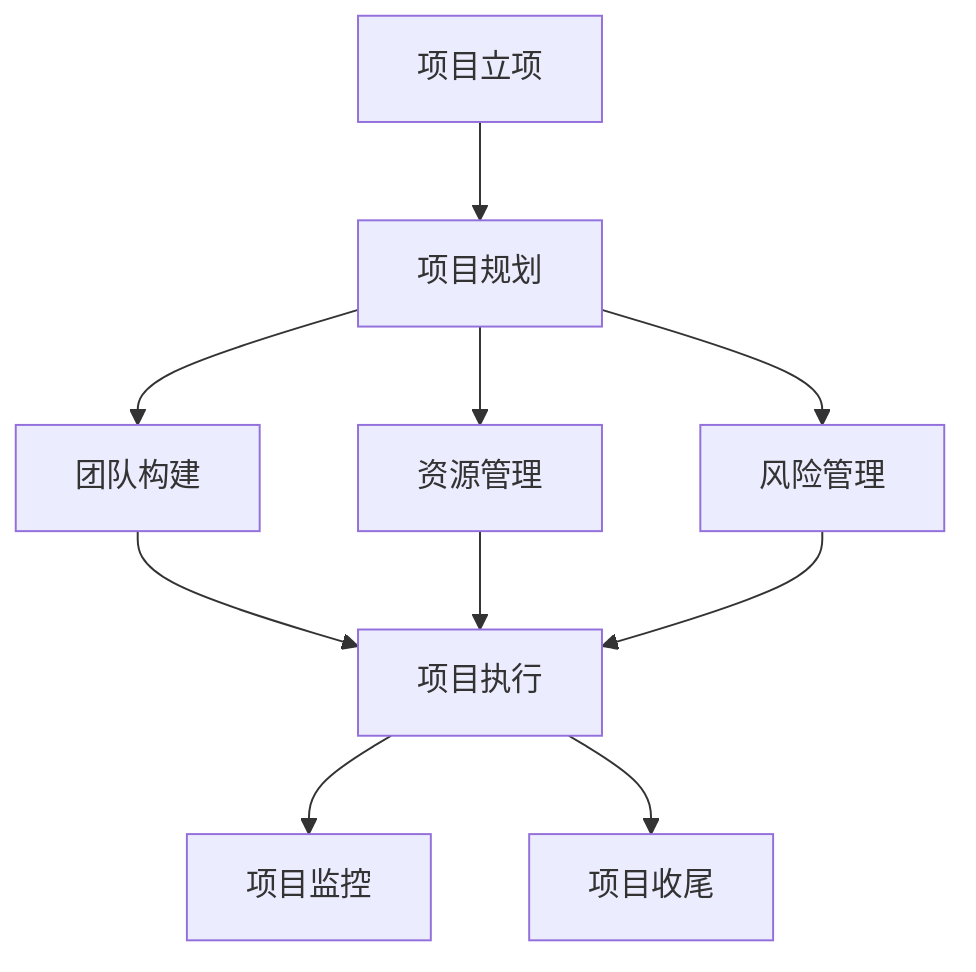

                 

### 1.1 创业公司的内部创新项目管理机制概述

在当今快速变化的商业环境中，创业公司面临的市场竞争日益激烈，技术创新成为它们获取竞争优势的重要手段。因此，内部创新项目管理机制在创业公司的运营中扮演着至关重要的角色。内部创新项目管理机制是指公司内部用于推动新产品、新服务或新业务模式开发的一系列流程、工具和方法。

首先，创业公司的内部创新项目管理机制旨在通过系统的管理和协调，确保创新项目的顺利推进。这种机制不仅包括项目立项、规划、执行和监控的流程，还包括资源配置、团队构建、风险评估和质量控制等多个方面。

其核心目标如下：

1. **提高创新效率**：通过科学的规划和有效的管理，确保创新项目在合理的时间内完成，减少不必要的资源浪费。

2. **降低创新风险**：通过全面的风险评估和管理，识别和解决潜在的问题，避免项目失败带来的损失。

3. **保障项目质量**：通过严格的质量控制和持续改进，确保创新项目能够满足市场和用户的需求。

4. **激励创新氛围**：通过明确的激励机制，鼓励员工积极参与创新活动，营造一个充满活力的创新文化。

为了实现这些目标，创业公司需要构建一个完善的内部创新项目管理框架。这个框架通常包括以下几个方面：

- **项目立项**：明确创新项目的目标、范围和预期成果，进行可行性分析，选择合适的项目。
- **项目规划**：制定详细的项目计划，包括时间表、资源需求和风险评估等。
- **团队构建**：组建跨职能团队，确保项目所需的技能和资源得到有效配置。
- **项目执行**：按照项目计划进行项目的实施，确保每个阶段的目标都得到实现。
- **项目监控**：通过定期的检查和评估，监控项目的进度和质量，及时调整计划。
- **项目收尾**：对项目进行总结和评估，确保项目目标达成，同时为后续项目提供经验和教训。

总之，创业公司的内部创新项目管理机制是一个复杂而动态的系统，需要综合考虑各种因素，才能有效推动创新项目的成功。在接下来的章节中，我们将详细探讨这个框架的各个组成部分，以及如何在实际操作中实现高效的内部创新项目管理。

### 1.2 创业公司内部创新项目管理的重要性

创业公司的内部创新项目管理机制对于企业的生存与发展具有至关重要的意义。在竞争激烈的市场环境中，技术创新是企业获取持续竞争优势的关键。以下从多个方面详细阐述内部创新项目管理机制的重要性。

首先，内部创新项目管理机制能够提高企业的创新能力。通过系统化的管理和协调，企业能够有效地整合内部资源，激发员工的创造力。创新项目的立项、规划、执行和监控等环节，都需要员工积极参与和协作，这有助于培养员工的问题解决能力和创新思维。此外，创新项目管理机制还可以通过设立激励机制，鼓励员工提出新的想法和解决方案，从而推动企业的整体创新水平。

其次，内部创新项目管理机制有助于企业应对市场变化。市场环境变化迅速，创业公司需要具备敏捷的市场反应能力。通过创新项目管理机制，企业可以快速识别市场机会和潜在风险，及时调整战略方向。例如，通过定期评估和筛选创新项目，企业可以确定哪些项目具有高潜力和可行性，从而优先投入资源进行开发和推广。

第三，内部创新项目管理机制能够降低创新风险。创新项目往往伴随着不确定性，可能面临技术、市场、资源等多方面的风险。通过全面的风险评估和管理，企业可以提前识别和评估潜在风险，并制定相应的应对措施。这有助于减少项目失败的可能性，降低企业的损失。此外，通过项目监控和持续改进，企业可以在项目执行过程中及时发现问题并加以解决，确保项目能够按计划推进。

第四，内部创新项目管理机制能够保障项目质量。创新项目通常涉及复杂的技术和业务需求，质量是项目成功的关键。通过严格的质量控制和持续改进，企业可以确保项目交付的产品或服务能够满足市场和用户的需求。这不仅可以提升企业的声誉，还可以增加用户满意度和忠诚度，为企业的长期发展奠定基础。

最后，内部创新项目管理机制有助于形成企业的核心竞争力。通过持续的创新活动，企业可以不断积累技术、经验和人才资源，形成独特的竞争优势。创新项目管理机制能够确保这些优势得到有效利用和传承，帮助企业保持行业领先地位。

综上所述，创业公司的内部创新项目管理机制在提高创新能力、应对市场变化、降低创新风险、保障项目质量和形成核心竞争力等方面具有重要作用。为了充分发挥其潜力，创业公司需要建立和完善相应的管理机制，并在实际操作中不断优化和改进。在接下来的章节中，我们将详细探讨如何构建和实施一个高效的内部创新项目管理机制。

### 1.3 创业公司内部创新项目的特点与挑战

创业公司内部创新项目的成功不仅取决于良好的管理机制，还依赖于对项目特点和挑战的深刻理解。以下是创业公司内部创新项目的几个主要特点及其面临的挑战。

**1.3.1 创新性**

创新项目的一大特点是具有高度的创新性。这意味着项目往往涉及前沿技术和新颖的解决方案，需要突破现有的技术瓶颈。创新性项目的特点决定了其在研发过程中可能面临较大的不确定性，需要持续的技术探索和验证。然而，高度的创新性也意味着项目可能需要更多的资源和时间来开发和完善，这对企业的资金和时间管理提出了更高的要求。

**1.3.2 不确定性**

由于创新项目通常缺乏明确的解决方案和路径，不确定性成为项目实施过程中的一个重要挑战。不确定性不仅来自于技术方面，还包括市场需求、用户反馈和供应链等各个方面。如何有效管理这种不确定性，确保项目能够在合理的时间和资源内取得成果，是创业公司内部创新项目管理的重要课题。

**1.3.3 跨部门协作**

创新项目往往需要跨部门协作，涉及多个职能领域的技术和资源。这种跨部门协作要求团队成员具备多样化的技能和经验，同时也需要高效的沟通和协调机制。跨部门协作的复杂性增加了项目的协调成本，并可能导致项目进度和质量的不稳定。

**1.3.4 资源限制**

创业公司通常资源有限，包括资金、人力和技术等各个方面。这种资源限制对创新项目的成功提出了严峻挑战。如何在有限的资源下，最大化地发挥创新项目的价值，实现预期的目标，是创业公司需要解决的重要问题。

**1.3.5 风险管理**

创新项目具有较高的风险，包括技术风险、市场风险和管理风险等。技术风险可能由于技术难题的不可预见性导致项目失败；市场风险可能由于市场需求的变化导致项目无法实现预期收益；管理风险则可能由于管理不善导致项目进度延误或资源浪费。如何全面评估和管理这些风险，确保项目能够按计划推进，是内部创新项目管理的重要内容。

**1.3.6 时间压力**

创业公司内部创新项目通常面临紧迫的时间压力，需要在较短的时间内取得成果。时间压力可能导致项目在研发过程中出现压缩工期、降低质量等问题。如何合理安排项目时间表，确保项目能够在合理的时间内完成，是创业公司需要慎重考虑的问题。

**1.3.7 用户需求变化**

在创新项目的开发过程中，用户需求可能会发生变化。这些变化可能来自于市场趋势、竞争对手的新产品、用户反馈等多方面。如何及时响应用户需求变化，调整项目方向和策略，确保项目能够持续满足市场需求，是创业公司需要面对的挑战。

综上所述，创业公司内部创新项目具有创新性、不确定性、跨部门协作、资源限制、风险管理、时间压力和用户需求变化等特点，这些特点决定了项目在实施过程中面临诸多挑战。为了应对这些挑战，创业公司需要建立和完善相应的管理机制，提升项目管理的效率和效果。在接下来的章节中，我们将进一步探讨如何构建和实施一个高效的内部创新项目管理框架，以应对这些挑战。

### 2.1 创业公司内部创新项目管理的基本原则

创业公司内部创新项目管理的基本原则是确保项目能够顺利进行，达到预期目标，并在资源有限的情况下最大化效益。以下是几个关键原则：

**1. 需求驱动**：创新项目应紧密围绕市场需求和用户需求展开。项目目标、功能和特性应直接回应市场机会和用户痛点。通过明确的需求驱动，确保项目方向正确，避免资源浪费。

**2. 敏捷开发**：敏捷开发方法强调快速迭代和频繁交付，以快速响应变化和优化项目。创业公司内部创新项目往往需要快速适应市场和技术变化，敏捷开发方法能够提供灵活的项目管理机制，减少项目延迟和成本超支的风险。

**3. 风险管理**：创新项目面临多种不确定性，风险管理是确保项目成功的关键。创业公司应建立全面的风险评估和应对机制，提前识别潜在风险，并制定应对策略。这包括技术风险评估、市场风险分析和资源调配等。

**4. 资源优化**：创业公司资源有限，必须优化资源配置，确保项目能够高效利用现有资源。这包括人力、资金、技术和时间等各个方面。通过科学的规划和调度，确保资源分配合理，减少浪费。

**5. 激励机制**：为了激发员工的创新活力和积极性，创业公司应建立有效的激励机制。这可以包括奖励制度、晋升机会、股权激励等，以激励员工积极参与创新项目，提高项目成功率。

**6. 持续改进**：创新项目不是一次性的任务，而是一个持续的过程。创业公司应鼓励持续改进，通过项目后评估和反馈机制，总结经验教训，优化项目管理流程和方法。

**7. 沟通协作**：跨部门协作是创新项目的关键。创业公司应建立高效的沟通机制，确保项目团队成员之间信息畅通，减少误解和冲突。通过定期会议、项目报告和即时沟通工具，确保项目进展透明和协作高效。

通过遵循这些基本原则，创业公司可以构建一个科学、高效、灵活的内部创新项目管理框架，确保创新项目能够顺利推进并取得成功。在接下来的章节中，我们将详细探讨创新项目的生命周期管理、团队构建与管理、预算与资源管理以及风险管理等方面的具体实践。

### 2.2 创业公司内部创新项目的生命周期管理

创业公司内部创新项目的生命周期管理是一个系统而连续的过程，它涵盖了项目从启动到结束的各个阶段，确保项目能够按计划、高效地推进并取得预期成果。以下是创新项目生命周期管理的详细步骤：

**2.2.1 项目启动**

项目启动是创新项目的第一步，这一阶段的主要任务是明确项目的目标、范围和可行性。具体步骤包括：

1. **项目立项**：根据市场需求和企业战略，选择具有高潜力和可行性的创新项目。立项过程中需要明确项目的目标、愿景和预期成果。
2. **可行性分析**：进行详细的技术、市场、资源和风险分析，评估项目的可行性，确保项目在技术、市场、资源和时间等方面具备实现的可能性。
3. **项目团队组建**：组建跨职能团队，确保项目所需的技术、市场、运营等各方面资源得到有效配置。明确团队成员的角色和职责，制定项目计划。

**2.2.2 项目规划**

项目规划阶段是项目成功的关键，这一阶段的主要任务是制定详细的项目计划，确保项目能够有条不紊地推进。具体步骤包括：

1. **项目范围定义**：明确项目的具体范围，包括项目要实现的功能、技术和业务需求等。
2. **工作分解结构（WBS）**：将项目分解为可管理的任务和子任务，制定工作分解结构图，确保每个任务都有明确的负责人和时间节点。
3. **时间计划**：制定项目时间表，明确各阶段和任务的开始和结束时间，确保项目能够按时完成。
4. **资源计划**：确定项目所需的资源，包括人力、资金、技术和设备等，并制定资源分配计划，确保资源能够合理利用。
5. **风险评估**：对项目可能面临的风险进行全面评估，制定相应的风险应对策略，降低项目失败的风险。

**2.2.3 项目执行**

项目执行阶段是项目生命周期的核心，这一阶段的主要任务是根据项目计划实施项目。具体步骤包括：

1. **任务分配**：将项目任务分配给各个团队成员，明确每个任务的具体要求和时间节点。
2. **进度监控**：通过定期的进度报告和会议，监控项目进展情况，确保项目按照计划进行。
3. **资源管理**：合理调配和管理项目资源，确保资源得到充分利用，避免资源浪费。
4. **质量管理**：对项目交付物进行严格的质量检查和评估，确保项目成果符合预期质量标准。
5. **问题解决**：及时发现和解决项目实施过程中遇到的问题，确保项目能够顺利推进。

**2.2.4 项目监控**

项目监控阶段的主要任务是跟踪项目进度和质量，确保项目按计划进行。具体步骤包括：

1. **定期检查**：通过定期检查和评估，监控项目各个阶段的进展和质量。
2. **报告和沟通**：定期向项目利益相关者报告项目进展情况，确保信息畅通和透明。
3. **变更管理**：对项目计划、范围和资源的变更进行管理和控制，确保变更不会对项目目标产生负面影响。

**2.2.5 项目收尾**

项目收尾阶段是项目生命周期的最后一步，这一阶段的主要任务是确保项目按计划完成，并总结项目经验教训。具体步骤包括：

1. **成果交付**：确保项目成果按照合同和标准交付，满足用户和客户的需求。
2. **项目总结**：对项目进行全面总结，包括成功经验和教训，形成项目报告，为后续项目提供参考。
3. **资源回收**：对项目资源进行回收和整理，确保资源得到充分利用。
4. **评估和反馈**：对项目进行评估和反馈，分析项目成果和效益，优化项目管理流程和方法。

通过科学的项目生命周期管理，创业公司可以确保创新项目能够高效、有序地推进，降低项目失败的风险，提高项目的成功率。在接下来的章节中，我们将详细探讨创业公司内部创新项目的团队构建与管理、预算与资源管理以及风险管理等方面的具体实践。

### 2.3 创业公司内部创新项目团队构建与管理

创业公司内部创新项目的成功离不开一个高效的团队。团队构建和管理是实现项目目标的关键环节，以下是创业公司如何构建和管理创新项目团队的详细步骤和策略：

**2.3.1 团队组建**

1. **明确团队目标**：在组建团队之前，首先要明确团队的目标和期望成果。这些目标应与项目的整体目标保持一致，确保团队的工作方向正确。
2. **技能和经验匹配**：根据项目需求，选择具有相关技能和经验的团队成员。团队成员应涵盖项目所需的各种职能，如技术开发、市场营销、产品设计等，确保团队能够胜任项目任务。
3. **多样性考虑**：团队多样性有助于带来不同的观点和解决问题的方法。团队成员应来自不同的背景和领域，以便在项目实施过程中能够提出多样化的解决方案。
4. **明确角色和职责**：为每个团队成员分配明确的角色和职责，确保每个成员都清楚自己的工作内容和目标，减少工作中的冲突和误解。

**2.3.2 团队沟通**

1. **定期会议**：定期召开团队会议，讨论项目的进展情况、问题和解决方案。这些会议应包括项目计划更新、进度汇报、质量评估等，确保项目信息畅通和透明。
2. **沟通工具**：利用各种沟通工具，如即时通讯软件、邮件、项目管理系统等，确保团队成员之间能够及时、有效地沟通和协作。这些工具可以帮助团队成员共享文件、跟进任务和讨论问题。
3. **透明化信息**：确保项目信息和进度对团队成员透明，避免信息孤岛。通过共享项目计划和报告，让每个成员都能够了解项目的整体情况和各自的任务进展。

**2.3.3 团队协作**

1. **跨职能协作**：创新项目往往涉及多个职能领域，需要跨部门协作。团队协作的目的是确保项目在不同职能之间的无缝衔接，避免因沟通不畅导致的延误和错误。
2. **协作平台**：建立协作平台，如项目管理软件、代码库、文档共享系统等，以便团队成员能够实时协作、共享资源和跟进任务。
3. **角色交叉**：鼓励团队成员在不同角色之间进行交叉工作，以便成员能够了解项目其他方面的细节，提高整体协作效率。

**2.3.4 激励机制**

1. **绩效奖励**：为团队成员设立明确的绩效指标，根据绩效表现进行奖励。这些奖励可以包括奖金、晋升机会、股权激励等，以激励团队成员提高工作积极性。
2. **认可与反馈**：定期对团队成员的工作进行认可和反馈，鼓励团队成员不断进步。通过正面的反馈和鼓励，增强团队成员的自信心和动力。
3. **培训与发展**：提供培训和发展机会，帮助团队成员提升技能和知识，增强团队的竞争力和创新能力。

**2.3.5 管理策略**

1. **灵活管理**：创业公司内部创新项目往往需要快速响应市场和技术变化，因此团队管理应具有灵活性。项目经理应根据实际情况调整管理策略，确保项目能够及时应对变化。
2. **自主管理**：鼓励团队成员自主管理和决策，提高团队的自主性和责任感。通过授权和信任，让团队成员能够更好地发挥自己的能力和潜力。
3. **持续改进**：鼓励团队成员不断反思和改进工作方法，通过持续改进提高团队的工作效率和项目质量。

通过科学地构建和管理创新项目团队，创业公司可以确保项目顺利推进，提高项目成功率，实现预期目标。在接下来的章节中，我们将详细探讨创业公司内部创新项目的预算与资源管理以及风险管理等方面的具体实践。

### 2.4 创业公司内部创新项目的预算与资源管理

预算与资源管理是创业公司内部创新项目管理中至关重要的一环。在资源有限的条件下，如何高效地管理和分配预算与资源，以确保项目顺利进行并取得预期成果，是创业公司需要重点关注的领域。以下将详细探讨预算与资源管理的具体策略和实践。

**2.4.1 预算规划**

1. **项目预算编制**：在项目启动阶段，项目经理需要根据项目需求和资源情况编制详细的预算计划。预算应包括直接成本（如人力成本、材料费用、设备租赁费等）和间接成本（如办公费用、培训费用、差旅费用等）。

2. **成本估算**：进行详细的成本估算，确保预算的准确性和可行性。可以通过历史数据、市场调研和专家评估等方法，预测项目实施过程中的各种成本。

3. **预算分配**：将预算分配到项目的各个阶段和任务中，确保每个阶段和任务都有充足的资金支持。同时，制定预算分配计划，明确资金使用的优先级和应急储备。

**2.4.2 资源管理**

1. **资源需求分析**：在项目规划阶段，对项目所需的资源进行详细分析，包括人力、技术、设备和时间等。根据项目需求，确定所需资源的数量、质量和时间要求。

2. **资源调配**：根据项目进度和资源需求，合理调配项目资源。在资源有限的情况下，可以通过优先级排序、资源整合和外包等方式，最大化利用现有资源。

3. **资源监控**：建立资源监控机制，实时跟踪项目资源的利用情况。通过定期的资源使用报告和审计，及时发现和解决资源浪费和分配不合理的问题。

**2.4.3 预算执行与调整**

1. **预算执行**：按照预算计划和分配方案，执行项目预算。通过严格的预算控制，确保项目资金的使用符合预算计划。

2. **预算调整**：在项目执行过程中，可能会出现预算超支、资源短缺等情况。项目经理需要及时调整预算和资源分配，确保项目能够按计划进行。可以通过调整预算分配、延长项目时间表或增加资源投入等方式，应对预算和资源变化。

**2.4.4 成本效益分析**

1. **成本效益评估**：在项目收尾阶段，对项目的成本和效益进行评估，分析项目的整体经济性。通过对比项目预算和实际支出，评估项目的成本效益。

2. **经验总结**：根据成本效益分析结果，总结项目在预算和资源管理方面的经验和教训，为后续项目提供参考。通过持续优化预算和资源管理流程，提高项目的成本效益。

**2.4.5 最佳实践**

1. **精细化预算管理**：采用精细化预算管理方法，对项目的每个阶段和任务进行详细的成本估算和控制，确保预算的准确性和可行性。

2. **资源整合与共享**：通过资源整合和共享，提高资源的利用效率。例如，利用内部资源池，共享技术、设备和人力资源，降低项目的总体成本。

3. **实时监控与反馈**：建立实时监控与反馈机制，及时掌握项目的预算和资源使用情况，快速应对问题和变化，确保项目顺利进行。

通过有效的预算与资源管理，创业公司可以确保创新项目在有限的资源下实现最大化效益，提高项目成功率。在接下来的章节中，我们将详细探讨创业公司内部创新项目的风险管理以及实际案例剖析。

### 2.5 创业公司内部创新项目的风险管理

在创业公司的内部创新项目中，风险管理是确保项目成功的关键环节。创新项目由于其高度的不确定性和复杂性，面临多种风险，包括技术风险、市场风险、管理风险等。有效的风险管理不仅能够降低项目失败的可能性，还能提高项目的成功率。以下是创业公司内部创新项目风险管理的方法和策略。

**2.5.1 风险识别**

风险识别是风险管理的第一步，旨在全面识别项目可能面临的各种风险。具体方法包括：

1. **专家访谈**：通过与项目相关领域的专家进行访谈，获取他们对项目风险的见解和经验。
2. **历史数据分析**：分析过去类似项目中的风险记录，识别常见的风险类型。
3. **头脑风暴**：组织项目团队成员进行头脑风暴，列举可能的风险点。
4. **检查表法**：使用预定义的检查表，逐项检查可能的风险点。

**2.5.2 风险评估**

在识别出风险之后，需要对风险进行评估，确定其严重程度和发生概率。评估方法包括：

1. **定性评估**：通过专家评分或判断，对风险的严重性和发生概率进行定性评估。
2. **定量评估**：使用数学模型或算法，对风险的严重性和发生概率进行定量评估。例如，可以使用概率和影响矩阵，对每个风险进行打分，并计算出其风险指数。

**2.5.3 风险应对策略**

根据风险评估结果，制定相应的风险应对策略。常见的风险应对策略包括：

1. **风险规避**：通过改变项目计划或调整项目范围，避免风险的发生。
2. **风险转移**：通过保险或其他合同方式，将风险转移给第三方。
3. **风险减轻**：采取一系列措施，降低风险的严重程度或发生概率。例如，通过技术改进或增加资源投入，降低技术风险。
4. **风险接受**：对于无法规避或转移的风险，制定应对计划和应急措施，确保项目能够在风险发生时顺利进行。

**2.5.4 风险监控**

风险监控是确保风险应对措施得到有效执行的过程。具体方法包括：

1. **定期检查**：定期对项目风险进行评估和检查，确保风险应对措施的有效性。
2. **风险报告**：建立风险报告机制，及时向项目利益相关者报告项目风险的最新情况。
3. **变更管理**：对项目中的风险变更进行管理和控制，确保项目能够灵活应对新的风险。

**2.5.5 风险管理工具与技术**

1. **风险矩阵**：使用风险矩阵对风险进行定性和定量评估，确定风险的优先级。
2. **风险登记册**：建立风险登记册，记录每个风险的相关信息，包括风险描述、评估结果和应对措施。
3. **风险评估模型**：使用风险评估模型，如蒙特卡罗模拟、故障树分析等，对风险进行定量分析。
4. **项目管理软件**：利用项目管理软件，对项目风险进行实时监控和管理。

通过科学的风险管理，创业公司可以降低创新项目失败的风险，确保项目能够按计划顺利进行。有效的风险管理不仅能够提高项目的成功率，还能增强企业的风险应对能力，为企业的持续发展奠定基础。

### 3.1 内部创新项目管理核心概念原理与架构

内部创新项目管理涉及到多个核心概念和原理，这些概念和原理共同构成了一个完整的管理体系，确保创新项目的顺利推进和成功。为了更清晰地理解这些核心概念及其相互关系，我们将使用Mermaid流程图来展示内部创新项目管理的架构。

#### 3.1.1 创新项目管理核心概念

以下是内部创新项目管理中的几个关键概念：

1. **项目立项**：确定创新项目的基本信息，包括目标、范围和可行性。
2. **项目规划**：制定详细的项目计划，包括时间表、资源需求和风险评估等。
3. **团队构建**：组建项目团队，明确团队成员的角色和职责。
4. **项目执行**：按照项目计划实施项目，监控项目进度和质量。
5. **项目监控**：定期检查项目进展，确保项目按计划进行。
6. **风险管理**：评估和管理项目风险，确保项目风险在可控范围内。
7. **资源管理**：合理分配和管理项目资源，确保资源的高效利用。

#### 3.1.2 创新项目管理核心概念原理与架构

以下是一个简单的Mermaid流程图，展示内部创新项目管理的核心概念和其相互关系：



**详细说明：**

1. **项目立项**：这是项目的起点，通过明确项目的目标、范围和可行性，为项目的后续工作奠定基础。
2. **项目规划**：在立项的基础上，制定详细的项目计划，包括时间表、资源需求和风险评估等，确保项目有明确的执行路径。
3. **团队构建**：在规划阶段确定项目所需的人员和技能，组建项目团队，并明确各成员的角色和职责。
4. **资源管理**：项目启动后，对项目所需的资源进行合理分配和管理，确保资源的高效利用。
5. **风险管理**：通过评估和管理项目风险，确保项目能够应对各种不确定性，降低项目失败的风险。
6. **项目执行**：按照项目计划进行项目实施，监控项目进度和质量，确保项目按计划进行。
7. **项目监控**：定期检查项目进展，及时发现和解决问题，确保项目按计划进行。
8. **项目收尾**：在项目完成后，进行总结和评估，确保项目目标达成，同时为后续项目提供经验和教训。

通过这个Mermaid流程图，我们可以清晰地看到内部创新项目管理的各个核心概念及其相互关系。这种图示化的方式有助于我们更好地理解和应用这些核心概念，提高项目管理的效率和效果。

### 3.2 内部创新项目管理中常见的问题与解决方案

尽管内部创新项目管理机制能够有效推动创业公司创新项目的成功，但在实际操作中，仍然会面临一些常见的问题。以下是一些主要问题及其对应的解决方案：

#### 3.2.1 项目范围蔓延

**问题描述**：项目范围蔓延是指项目在实施过程中，其范围不断扩大，导致项目任务增加、时间延长和资源超支。

**解决方案**：
1. **明确项目范围**：在项目启动阶段，通过详细的需求分析和范围定义，确保项目范围清晰明确。
2. **变更控制**：建立严格的变更控制流程，所有范围变更必须经过审核和批准，确保变更对项目目标的影响得到充分评估。
3. **项目监控**：定期监控项目进展，及时发现和纠正范围蔓延的问题，确保项目按计划进行。

#### 3.2.2 项目沟通不畅

**问题描述**：项目沟通不畅是指项目团队成员之间或与项目利益相关者之间的沟通不够有效，导致信息传递不准确或不及时。

**解决方案**：
1. **沟通计划**：制定详细的沟通计划，明确沟通的频率、方式和内容。
2. **沟通工具**：使用高效的沟通工具，如项目管理软件、即时通讯工具和邮件，确保信息传递畅通。
3. **沟通培训**：对项目团队成员进行沟通技能培训，提高沟通效率。

#### 3.2.3 资源分配不合理

**问题描述**：资源分配不合理是指项目在实施过程中，资源分配不均或未能充分利用，导致项目进度延误或成本超支。

**解决方案**：
1. **资源需求分析**：在项目规划阶段，进行详细的资源需求分析，确保资源分配合理。
2. **动态调整**：根据项目进展情况，动态调整资源分配，确保资源能够灵活调配。
3. **资源监控**：建立资源监控机制，实时跟踪资源使用情况，确保资源得到高效利用。

#### 3.2.4 风险管理不足

**问题描述**：风险管理不足是指项目在实施过程中，对潜在风险的识别、评估和应对措施不足，导致项目面临较大的风险。

**解决方案**：
1. **全面风险评估**：在项目启动阶段，进行全面的风险评估，识别项目可能面临的风险。
2. **风险管理计划**：制定详细的风险管理计划，包括风险应对策略和应急计划。
3. **持续监控**：定期对项目风险进行监控和评估，及时调整风险管理计划。

#### 3.2.5 项目进度延误

**问题描述**：项目进度延误是指项目未能按照预定时间表完成，导致项目延期交付。

**解决方案**：
1. **进度管理**：建立有效的进度管理机制，包括制定详细的时间表、定期进度报告和进度审查。
2. **及时调整**：在项目执行过程中，及时识别和解决进度延误的问题，通过调整计划、增加资源等方式，确保项目能够按时完成。
3. **激励机制**：设立明确的激励机制，鼓励团队成员按时完成任务，提高项目的整体进度。

通过识别和解决这些常见问题，创业公司可以优化内部创新项目管理机制，提高项目成功率，实现企业的创新目标。

### 4.1 创新项目评估与优先级确定算法

在创业公司的内部创新项目管理中，如何评估和确定创新项目的优先级是一项关键任务。合理的评估和优先级确定算法能够帮助公司在资源有限的情况下，选择最具潜力和价值的项目进行投资。以下将详细介绍一种创新项目评估与优先级确定算法。

#### 4.1.1 评估算法伪代码

```python
// 评估算法伪代码
function evaluate_projects(projects):
    for project in projects:
        project.score = calculate_score(project)
    sorted_projects = sort_by_score(projects)
    return sorted_projects

// 项目评估得分计算
function calculate_score(project):
    score = 0
    score += project.priority * 0.4 // 优先级占比40%
    score += project.impact * 0.3 // 影响占比30%
    score += project.feasibility * 0.2 // 可行性占比20%
    return score

// 根据得分排序
function sort_by_score(projects):
    return sorted(projects, key=lambda x: x.score, reverse=True)
```

#### 4.1.2 算法解释

1. **优先级（priority）**：表示项目的重要性和紧急程度。优先级越高，项目越需要优先考虑。这个因素通常由项目管理团队根据项目对企业战略目标和市场机会的匹配度进行评估。

2. **影响（impact）**：表示项目成功后对企业或市场的潜在影响。影响越大的项目，通常越有优先权。影响可以通过市场调研、用户需求分析等方式进行量化评估。

3. **可行性（feasibility）**：表示项目实现的可能性。可行性越高的项目，越容易成功。可行性评估可以考虑技术难度、资源需求、市场环境等因素。

在上述伪代码中，每个项目的得分是通过加权计算得到的，其中优先级、影响和可行性分别占据了40%、30%和20%的权重。这样可以确保不同因素在项目评估中的重要性得到合理体现。

#### 4.1.3 实例说明

假设有以下几个创新项目：

1. **项目A**：优先级高，影响大，但可行性较低。
2. **项目B**：优先级中等，影响小，但可行性高。
3. **项目C**：优先级低，影响小，但可行性高。

根据上述算法，可以计算出各项目的得分：

- **项目A**：score = 0.4 * 1 + 0.3 * 1 + 0.2 * 0.5 = 0.8
- **项目B**：score = 0.4 * 0.5 + 0.3 * 0.5 + 0.2 * 1 = 0.65
- **项目C**：score = 0.4 * 0.1 + 0.3 * 0.5 + 0.2 * 1 = 0.35

根据得分排序，得分最高的项目A应优先考虑。

#### 4.1.4 算法优点

1. **全面性**：该算法综合考虑了优先级、影响和可行性三个关键因素，能够全面评估项目的潜力和可行性。
2. **灵活性**：通过调整各因素的权重，算法可以根据不同企业的需求和实际情况进行灵活调整。
3. **科学性**：使用加权评分的方法，使得评估结果更加客观和科学，减少了主观判断的误差。

通过这种评估算法，创业公司可以更科学、有效地确定创新项目的优先级，确保资源得到最优配置，提高项目成功率。

### 4.2 创新项目进度管理算法

创新项目的进度管理是确保项目按计划顺利进行的关键环节。在项目执行过程中，如何有效地监控和管理进度，及时发现和解决问题，是项目成功的关键。以下将详细介绍一种创新项目进度管理算法，并使用伪代码进行详细说明。

#### 4.2.1 进度管理算法伪代码

```python
// 进度管理算法伪代码
function manage_project_progress(project):
    while not project.completed:
        current_stage = get_current_stage(project)
        if current_stage.in_progress:
            update_stage_progress(current_stage)
        else:
            start_next_stage(current_stage)
    return project.completed

// 获取当前阶段
function get_current_stage(project):
    return project.stages[project.current_stage_index]

// 更新阶段进度
function update_stage_progress(stage):
    stage.progress = calculate_progress(stage)
    if stage.progress >= 100:
        stage.completed = True
    else:
        stage.completed = False

// 计算进度
function calculate_progress(stage):
    completed_tasks = len([task for task in stage.tasks if task.completed])
    total_tasks = len(stage.tasks)
    progress = (completed_tasks / total_tasks) * 100
    return progress

// 开始下一阶段
function start_next_stage(stage):
    stage.completed = False
    project.current_stage_index += 1
    if project.current_stage_index < len(project.stages):
        stage = get_current_stage(project)
        stage.start_date = current_date()
    else:
        project.completed = True
```

#### 4.2.2 算法解释

1. **获取当前阶段**：通过`get_current_stage`函数，获取项目当前正在执行的阶段。这个阶段是项目进度管理的基础。

2. **更新阶段进度**：通过`update_stage_progress`函数，根据当前阶段的任务完成情况，更新阶段的进度。如果当前阶段的进度达到100%，则标记该阶段为已完成。

3. **计算进度**：通过`calculate_progress`函数，计算当前阶段的任务完成进度。这个进度是根据已完成任务数与总任务数的比例来计算的。

4. **开始下一阶段**：通过`start_next_stage`函数，开始下一阶段的执行。如果当前阶段是最后一个阶段，则整个项目被视为已完成。

#### 4.2.3 实例说明

假设一个创新项目包含三个阶段，每个阶段包含若干任务。以下是一个简单的实例：

1. **阶段1**：包含5个任务，已完成3个。
2. **阶段2**：包含4个任务，已完成2个。
3. **阶段3**：包含3个任务，已完成0个。

**当前日期**：2023年5月15日

初始状态：

```python
project = {
    "current_stage_index": 0,
    "stages": [
        {
            "name": "阶段1",
            "tasks": [
                {"name": "任务1", "completed": True},
                {"name": "任务2", "completed": True},
                {"name": "任务3", "completed": True},
                {"name": "任务4", "completed": False},
                {"name": "任务5", "completed": False}
            ]
        },
        {
            "name": "阶段2",
            "tasks": [
                {"name": "任务6", "completed": True},
                {"name": "任务7", "completed": True},
                {"name": "任务8", "completed": False},
                {"name": "任务9", "completed": False}
            ]
        },
        {
            "name": "阶段3",
            "tasks": [
                {"name": "任务10", "completed": False},
                {"name": "任务11", "completed": False},
                {"name": "任务12", "completed": False}
            ]
        }
    ]
}
```

执行进度管理算法后：

- **阶段1**：进度100%，已完成。
- **阶段2**：进度50%，未完成。
- **阶段3**：进度0%，未完成。

当前日期更新为2023年5月22日，假设在执行进度管理算法时，阶段2的第二个任务完成了。

执行进度管理算法后：

- **阶段1**：进度100%，已完成。
- **阶段2**：进度50%，未完成。
- **阶段3**：进度0%，未完成。

#### 4.2.4 算法优点

1. **实时性**：通过实时更新进度，确保项目进度管理具有实时性，能够及时反映项目进展情况。
2. **灵活性**：算法可以根据实际进度情况进行灵活调整，例如增加或删除任务，重新安排阶段等。
3. **易扩展性**：算法设计简单，易于扩展，可以适应不同类型和规模的创新项目。

通过这种进度管理算法，创业公司可以有效地监控和管理创新项目进度，确保项目按计划顺利进行，提高项目成功率。

### 5.1 创新项目风险评估模型

创新项目由于其高度的不确定性和复杂性，面临多种风险，包括技术风险、市场风险、管理风险等。为了有效管理和控制这些风险，创业公司需要建立科学的风险评估模型。以下是创新项目风险评估模型的具体公式和详细解释。

#### 5.1.1 风险评估模型公式

$$
风险指数 = \frac{风险概率 \times 风险影响}{100}
$$

其中：
- **风险概率**（Probability）：表示某个风险发生的可能性，通常以百分比表示。
- **风险影响**（Impact）：表示如果风险发生，对项目的整体影响程度，同样以百分比表示。

**示例**：假设一个创新项目面临以下两种风险：
- 风险A：技术风险，风险概率为30%，风险影响为40%。
- 风险B：市场风险，风险概率为20%，风险影响为30%。

根据上述公式，可以计算出每种风险的风险指数：

$$
风险指数_A = \frac{30\% \times 40\%}{100} = 0.12
$$

$$
风险指数_B = \frac{20\% \times 30\%}{100} = 0.06
$$

#### 5.1.2 风险评估模型解释

1. **风险概率**：风险概率反映了风险发生的可能性。它可以通过历史数据分析、专家评估和市场调研等方法进行估算。例如，如果类似项目过去曾经发生过某种技术风险，可以参考历史数据估算当前项目的风险概率。

2. **风险影响**：风险影响表示风险如果发生，对项目目标的潜在影响程度。风险影响可以通过定性和定量两种方式进行评估。定性评估通常通过专家打分或判断进行，而定量评估可以通过计算风险发生后的项目损失或效益减少来进行。

3. **风险指数**：风险指数是风险概率和风险影响的乘积，表示风险的综合程度。风险指数越高，表示风险对项目的威胁越大。通过计算风险指数，可以帮助项目经理和决策者快速识别和优先处理高风险项目。

#### 5.1.3 实例说明

假设一个创新项目包含以下几种风险：

- 风险C：市场风险，风险概率为20%，风险影响为50%。
- 风险D：技术风险，风险概率为30%，风险影响为30%。

根据风险评估模型公式，可以计算出每种风险的风险指数：

$$
风险指数_C = \frac{20\% \times 50\%}{100} = 0.10
$$

$$
风险指数_D = \frac{30\% \times 30\%}{100} = 0.09
$$

根据风险指数，项目团队可以将风险C和风险D列为重点关注对象，并制定相应的风险应对策略。

#### 5.1.4 风险评估模型优点

1. **量化风险评估**：通过使用公式和计算，将风险概率和风险影响量化为具体的数值，使风险评估更加客观和精确。
2. **优先级排序**：通过计算风险指数，可以帮助项目团队快速识别和排序高风险项目，确保资源优先分配到最具威胁的风险上。
3. **动态调整**：风险评估模型可以根据项目进展和市场变化，动态调整风险概率和风险影响，确保风险评估结果的时效性和准确性。

通过建立科学的风险评估模型，创业公司可以更好地管理和控制创新项目中的风险，提高项目的成功率和可持续性。

### 5.2 创新项目预算优化模型

在创业公司内部创新项目管理中，预算优化是确保项目资源有效利用的关键环节。通过优化预算，可以最大限度地提高项目的投资回报率，实现资源的最优配置。以下将详细介绍一种创新项目预算优化模型，并使用具体公式进行详细解释。

#### 5.2.1 预算优化模型公式

$$
总预算 = \sum_{i=1}^{n} (项目i的优先级 \times 项目i的预算需求)
$$

其中：
- **项目i的优先级**：表示项目i在整体项目组合中的优先级，通常根据项目对企业的战略价值和市场需求进行评估，以百分比形式表示。
- **项目i的预算需求**：表示项目i在实际执行过程中所需的预算金额，通常根据项目计划和历史数据进行估算。

**示例**：假设公司有三个创新项目，其优先级和预算需求如下：

- 项目A：优先级为40%，预算需求为100万元。
- 项目B：优先级为30%，预算需求为70万元。
- 项目C：优先级为30%，预算需求为50万元。

根据预算优化模型公式，可以计算出总预算：

$$
总预算 = (40\% \times 100) + (30\% \times 70) + (30\% \times 50) = 40 + 21 + 15 = 76（万元）
$$

#### 5.2.2 预算优化模型解释

1. **优先级分配**：项目的优先级分配是预算优化模型的核心。通过评估每个项目的战略价值和市场需求，确定其在整体项目组合中的优先级。优先级越高，项目越重要，预算分配也应当相应增加。

2. **预算需求估算**：每个项目的预算需求是根据项目计划和历史数据估算得出的。这包括直接成本（如人力、材料费用）和间接成本（如管理费用、培训费用）。

3. **总预算计算**：根据各项目的优先级和预算需求，计算总预算。总预算应确保覆盖所有项目的实际需求，同时避免资源浪费。

4. **动态调整**：在实际项目执行过程中，根据项目进展和市场变化，动态调整项目的优先级和预算需求。这有助于确保预算的灵活性和适应性。

#### 5.2.3 实例说明

假设公司在年度预算为500万元的限制下，需要优化以下三个创新项目的预算：

- 项目D：优先级为50%，预算需求为120万元。
- 项目E：优先级为30%，预算需求为90万元。
- 项目F：优先级为20%，预算需求为60万元。

初始总预算为：

$$
总预算 = (50\% \times 120) + (30\% \times 90) + (20\% \times 60) = 60 + 27 + 12 = 99（万元）
$$

由于总预算低于年度预算500万元，公司可以继续优化预算分配。假设公司决定增加对项目D的投资，将其优先级提升至60%，同时调整其他项目的优先级。新的预算分配如下：

- 项目D：优先级为60%，预算需求为120万元。
- 项目E：优先级为30%，预算需求为90万元。
- 项目F：优先级为10%，预算需求为60万元。

新的总预算为：

$$
总预算 = (60\% \times 120) + (30\% \times 90) + (10\% \times 60) = 72 + 27 + 6 = 105（万元）
$$

由于总预算仍然低于500万元，公司可以继续优化预算，直到达到年度预算限制。

#### 5.2.4 预算优化模型优点

1. **科学性**：通过公式化的预算优化模型，使得预算分配更加科学和客观，减少人为因素的影响。
2. **灵活性**：预算优化模型可以根据项目进展和市场变化，灵活调整预算分配，确保预算的动态适应性。
3. **资源最大化利用**：通过优化预算，确保资源得到最大化利用，提高项目的投资回报率。

通过这种预算优化模型，创业公司可以更有效地管理和分配预算，确保创新项目在资源有限的情况下，实现最大的价值。

### 6.1 创业公司内部创新项目案例

为了更好地理解内部创新项目管理在实际操作中的应用，我们将通过一个具体案例来详细剖析。本案例将涵盖项目背景与目标、开发环境搭建、源代码实现和代码解读，以及实际案例分析和详细讲解。

#### 6.1.1 项目背景与目标

某创业公司致力于开发一款智能家居控制系统，旨在通过物联网技术为用户提供一个便捷、高效、安全的家居环境。该项目旨在实现以下目标：

1. **用户需求满足**：提供用户友好的界面和丰富的功能，满足用户对智能家居系统的期望。
2. **技术领先性**：采用先进的物联网技术和云计算平台，确保系统在技术上的领先性。
3. **高可靠性和安全性**：确保系统具有高可靠性和安全性，避免用户数据泄露和网络攻击。
4. **可扩展性**：设计灵活的架构，支持未来的功能扩展和系统集成。

#### 6.1.2 开发环境搭建

为了实现该项目，公司需要搭建一个完整的开发环境，包括以下组件：

1. **硬件环境**：购买物联网传感器设备、智能家电设备和服务器等硬件设施。
2. **软件环境**：安装操作系统、数据库、中间件和开发工具等软件。
3. **开发平台**：选择合适的开发平台，如Arduino、Raspberry Pi等，用于硬件编程和测试。
4. **集成平台**：使用集成开发环境（IDE），如Eclipse、Visual Studio等，进行软件开发和调试。
5. **云计算平台**：选择AWS、Google Cloud或Azure等云计算平台，用于数据存储、处理和分析。

#### 6.1.3 源代码实现

以下是该项目的一个关键部分——智能家居控制系统的核心代码实现。这段代码将展示如何通过物联网设备接收用户指令，并将指令发送到云端进行处理。

```python
# 创意家居控制系统核心代码

import socket
import json
import time

# 定义设备列表
devices = [
    {"name": "智能灯泡", "state": "off"},
    {"name": "智能窗帘", "state": "close"},
    {"name": "智能空调", "state": "off"}
]

# 设备控制函数
def control_device(device_name, command):
    for device in devices:
        if device["name"] == device_name:
            if command == "on":
                device["state"] = "on"
            elif command == "off":
                device["state"] = "off"
            elif command == "open":
                device["state"] = "open"
            elif command == "close":
                device["state"] = "close"
            break

# 接收用户指令
def receive_command():
    client_socket = socket.socket(socket.AF_INET, socket.SOCK_STREAM)
    client_socket.connect(('192.168.1.1', 8080))
    
    data = client_socket.recv(1024).decode('utf-8')
    command = json.loads(data)
    
    device_name = command["device"]
    command_type = command["type"]
    
    control_device(device_name, command_type)
    
    client_socket.close()

# 更新设备状态到云端
def update_status_to_cloud():
    # 这里使用API与云端进行通信，更新设备状态
    pass

# 主循环
while True:
    receive_command()
    update_status_to_cloud()
    time.sleep(1)
```

#### 6.1.4 代码解读

1. **设备列表**：定义了一个包含设备名称和状态的列表，用于存储和更新设备的当前状态。
2. **设备控制函数**：`control_device`函数用于根据用户指令更新设备的状态。根据传入的设备名称和指令类型，将设备状态设置为相应的值。
3. **接收用户指令**：`receive_command`函数通过套接字连接到用户指令接收服务，接收来自云端的指令，并调用`control_device`函数更新设备状态。
4. **更新设备状态到云端**：`update_status_to_cloud`函数用于将设备状态同步到云端，确保云端数据与实际状态一致。

#### 6.1.5 实际案例分析和详细讲解

1. **项目实施过程**：在项目实施过程中，公司首先进行了详细的用户调研，了解用户对智能家居系统的需求。随后，项目团队进行了技术可行性分析，确定了项目的技术路线和开发环境。
2. **硬件选择**：根据用户需求和技术分析结果，团队选择了适合的硬件设备，如智能灯泡、智能窗帘和智能空调。这些设备通过物联网模块与云端进行通信。
3. **软件设计**：软件团队设计了智能家居控制系统的核心功能模块，包括用户指令接收、设备状态更新和云端数据同步等。
4. **测试与调试**：在开发过程中，项目团队进行了多次测试和调试，确保系统功能的稳定性和可靠性。测试包括单元测试、集成测试和用户验收测试等。

通过这个案例，我们可以看到内部创新项目管理在实际操作中的具体应用。项目团队通过科学的项目管理方法，确保了项目在技术、资源和时间等方面的有效控制，最终成功开发并上线了一款智能家居控制系统。这一成功案例为其他创业公司的内部创新项目管理提供了宝贵的经验和参考。

### 6.2 最佳实践 Tips

在创业公司的内部创新项目管理中，积累最佳实践是非常关键的。以下是一些最佳实践 Tips，帮助创业公司提升内部创新项目管理的效率和成功率。

#### 6.2.1 定期进行项目回顾

定期对已完成的项目进行回顾，是积累经验教训、优化项目管理流程的重要方式。项目回顾应包括以下内容：

- **成功因素分析**：分析项目成功的原因，总结有效的项目管理方法和策略。
- **问题反思**：识别项目中的问题，分析问题的根本原因，并提出改进措施。
- **经验分享**：将成功经验和改进措施分享给团队成员和其他项目，推广最佳实践。
- **持续改进**：根据项目回顾的结果，持续优化项目管理流程和方法，提高项目管理水平。

#### 6.2.2 建立明确的沟通机制

沟通是项目成功的关键，建立明确的沟通机制至关重要。以下是一些建议：

- **定期会议**：制定定期会议计划，确保项目进展、问题和解决方案能够及时沟通。
- **透明的信息共享**：使用项目管理工具和平台，实时共享项目信息，确保团队成员能够随时获取最新进展。
- **沟通培训**：对项目团队成员进行沟通技能培训，提高沟通效率和效果。
- **反馈机制**：建立反馈机制，鼓励团队成员提出意见和建议，及时解决问题。

#### 6.2.3 优先级合理分配

合理分配项目优先级是确保资源高效利用的关键。以下是一些优先级分配的建议：

- **战略导向**：将符合企业战略目标的项目优先分配资源，确保项目与企业的发展方向一致。
- **市场需求**：根据市场需求和用户反馈，对项目进行优先级排序，优先支持市场需求强烈的项目。
- **风险评估**：对项目进行风险评估，优先支持风险较低、收益较高的项目。
- **动态调整**：根据项目进展和市场变化，动态调整项目优先级，确保资源分配的灵活性。

#### 6.2.4 强化风险管理

风险管理是确保项目成功的保障。以下是一些建议：

- **全面风险评估**：在项目启动阶段，进行全面的风险评估，识别和评估潜在风险。
- **风险应对策略**：制定针对不同类型风险的具体应对策略，确保有备无患。
- **实时监控**：建立实时监控机制，定期检查项目风险状况，及时调整应对措施。
- **应急计划**：制定详细的应急计划，确保在风险发生时能够迅速响应和处理。

#### 6.2.5 激励机制建设

有效的激励机制可以激励团队成员的积极性和创造力。以下是一些建议：

- **奖励制度**：根据项目绩效和成员贡献，设立奖励制度，提高工作积极性。
- **股权激励**：对核心成员和关键岗位实行股权激励，增强员工的归属感和责任感。
- **职业发展**：为员工提供职业发展机会，鼓励员工持续学习和成长。
- **工作环境**：营造良好的工作环境，提高员工的工作满意度和幸福感。

通过实施这些最佳实践，创业公司可以显著提升内部创新项目管理的效率和成功率，实现企业的持续发展和创新目标。

### 6.3 小结与注意事项

本文系统地探讨了创业公司内部创新项目管理机制，从项目立项、规划、团队构建、预算与资源管理、风险管理到项目进度管理等方面进行了详细分析和阐述。以下是本文的核心小结与注意事项：

**核心小结：**

1. **需求驱动**：创新项目应以市场需求和用户需求为核心，确保项目具备实际应用价值。
2. **敏捷开发**：采用敏捷开发方法，提高项目的灵活性和响应速度，确保项目按时交付。
3. **风险管理**：全面评估和管理项目风险，制定有效的风险应对策略，确保项目顺利进行。
4. **资源优化**：合理分配和利用资源，确保项目资源的高效利用。
5. **沟通协作**：建立高效的沟通机制，确保项目团队成员之间的信息畅通和协作高效。

**注意事项：**

1. **项目范围管理**：在项目启动阶段，要明确项目的范围和目标，避免范围蔓延导致项目延期和资源浪费。
2. **团队协作**：重视跨部门协作，建立跨职能团队，确保项目在不同职能之间的无缝衔接。
3. **持续改进**：鼓励项目团队持续反思和改进工作方法，通过项目回顾不断优化项目管理流程。
4. **灵活调整**：根据项目进展和市场变化，灵活调整项目计划和资源分配，确保项目能够应对变化。
5. **激励机制**：建立有效的激励机制，提高团队成员的积极性和创造力。

通过遵循上述小结和注意事项，创业公司可以构建一个高效、灵活的内部创新项目管理机制，提高项目的成功率和企业的创新能力。

### 6.4 拓展阅读

为了深入了解内部创新项目管理的更多实践和方法，以下推荐几本相关领域的经典书籍和文献，供读者进一步阅读和学习：

1. **《创新者的窘境》（The Innovator's Dilemma）** —— 克莱顿·克里斯滕森（Clayton M. Christensen）
   - 本书详细分析了企业如何通过创新来应对市场竞争和颠覆性技术的挑战，提供了实用的创新策略和管理方法。

2. **《精益创业》（The Lean Startup）** —— 埃里克·莱斯（Eric Ries）
   - 本书提出了精益创业的方法论，强调快速迭代和用户反馈在创新项目中的重要性，为创业公司提供了系统的项目管理指南。

3. **《敏捷开发实践指南》（Agile Project Management: Creating Innovative Products）** —— 迈克尔·哈默（Michael Hammer）和梅瑞迪思·瑞安（Meredith Ryan）
   - 本书详细介绍了敏捷开发的方法和实践，包括敏捷项目管理、团队协作和持续改进等方面，适用于各种类型的项目管理。

4. **《项目管理知识体系指南》（Project Management Body of Knowledge, PMBOK Guide）** —— 项目管理协会（Project Management Institute, PMI）
   - 作为项目管理领域的权威指南，本书涵盖了项目管理的各个方面，包括项目规划、执行、监控和收尾等，是项目管理专业人士的必备读物。

5. **《创新项目管理：技术与实践》（Innovative Project Management: A Practical Approach）** —— 约翰·霍兰（John P. Holland）
   - 本书从理论与实践相结合的角度，探讨了创新项目管理的核心概念和方法，包括项目立项、团队构建、风险评估和进度管理等方面。

通过阅读这些书籍和文献，读者可以进一步了解内部创新项目管理的先进理念和最佳实践，提升项目管理能力和创新水平。

