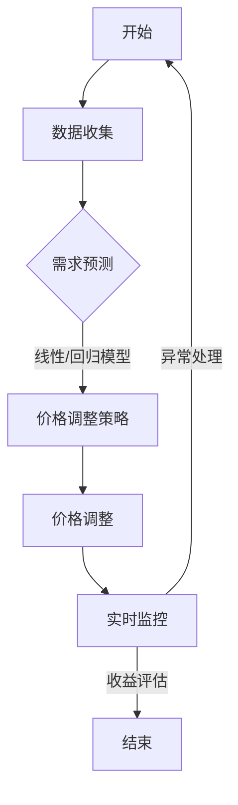

                 

### 动态定价的基本概念

#### 1.1 动态定价的定义

动态定价（Dynamic Pricing）是一种根据市场需求、竞争环境、消费者行为等多方面因素实时调整产品或服务价格的策略。与传统的固定价格模式不同，动态定价能够灵活响应市场变化，以最大化利润或市场份额为目标，通过实时调整价格来优化经营绩效。

#### 1.2 动态定价与传统定价的比较

**传统定价**通常是基于固定成本和预期收益的静态策略，价格在一定时期内保持不变。这种方法在一定程度上可以确保收入的稳定性和客户的忠诚度，但其缺点是灵活性较低，难以适应快速变化的市场环境。

**动态定价**则更加灵活，通过实时数据分析和预测，根据市场动态调整价格。这种定价模式能够更快地响应市场需求，提高市场占有率，优化利润率。然而，动态定价也需要更多的资源投入进行数据分析和算法优化。

#### 1.3 动态定价的关键特性

- **实时性**：动态定价需要实时获取市场数据，进行价格调整，确保价格与市场动态保持同步。
- **灵活性**：动态定价可以根据多种因素灵活调整价格，包括供需关系、季节变化、促销活动等。
- **数据分析**：动态定价依赖于大量的市场数据分析，包括消费者行为、市场趋势、竞争态势等。
- **优化目标**：动态定价的目标通常是最大化利润、提高市场份额或提升客户体验。

通过以上基本概念和比较，我们可以更好地理解动态定价的内涵和其在现代商业环境中的重要地位。

### 动态定价的背景和意义

#### 2.1 商业环境的变化与动态定价的需求

在当今全球化、信息化的商业环境中，市场环境变化迅速，消费者需求多样化且不断演变。传统固定定价模式已经难以适应这种快速变化的市场需求，而动态定价则在这种背景下应运而生。

首先，电子商务的兴起极大地改变了传统的购物方式，消费者可以在全球范围内购买产品，价格竞争变得更加激烈。其次，大数据和人工智能技术的应用使得实时获取和分析市场数据成为可能，这为动态定价提供了技术支持。此外，消费者行为也变得更加个性化，他们更加关注性价比和购物体验，这使得企业必须灵活调整价格以满足不同消费者的需求。

#### 2.2 动态定价在创业公司中的应用价值

对于创业公司来说，动态定价具有以下几个方面的应用价值：

1. **提高市场份额**：通过实时调整价格，创业公司可以更快地响应市场变化，抢占市场份额。尤其是在竞争激烈的市场中，动态定价可以帮助公司保持竞争力。

2. **优化利润率**：动态定价可以根据市场需求动态调整价格，从而最大化利润。在淡季或库存积压时，可以通过降价来清理库存，而在旺季或需求旺盛时，可以提高价格以获取更高的利润。

3. **提升客户体验**：动态定价可以根据消费者的购买行为和偏好调整价格，从而提供更加个性化的购物体验，增加客户满意度和忠诚度。

4. **风险规避**：动态定价可以帮助创业公司规避市场波动带来的风险。例如，在市场不景气时，通过降价来稳定销售，减少库存积压；而在市场繁荣时，通过提价来增加收入。

#### 2.3 动态定价的实践案例

一个典型的动态定价实践案例是电商巨头亚马逊。亚马逊通过实时监测消费者行为、市场需求和竞争态势，动态调整产品价格。例如，在节假日或促销活动中，亚马逊会通过降价策略吸引消费者，而在淡季则可能提高价格以保持利润。这种灵活的定价策略使得亚马逊能够在竞争激烈的市场中保持领先地位。

此外，酒店预订平台如Expedia和Booking.com也广泛应用动态定价策略。这些平台根据客户搜索、预订行为以及竞争对手的价格，实时调整酒店价格，以优化收益。例如，在旅游旺季，酒店价格可能上涨，而在淡季则可能降价以吸引客户。

综上所述，动态定价在现代商业环境中具有重要的地位和广泛的应用价值，对于创业公司来说，合理应用动态定价策略，能够提高市场竞争力，优化经营绩效。

### 本书结构与内容安排

#### 3.1 本书的主要目标

本书旨在全面介绍动态定价算法的设计与优化，通过深入探讨动态定价的基本概念、核心模型、算法原理及其实际应用，帮助读者理解和掌握动态定价的核心技术和应用方法。主要目标如下：

1. **理解动态定价的基本原理**：通过介绍动态定价的定义、与传统定价的比较，帮助读者建立对动态定价概念的基本认知。
2. **掌握动态定价的核心模型**：详细讲解动态定价的基本原理和常用模型，包括简单线性模型和需求预测模型，为后续算法设计打下基础。
3. **深入解析动态定价算法**：通过伪代码实现和详细解读，让读者了解动态定价算法的内部机制和工作流程。
4. **应用动态定价解决实际问题**：通过实际案例分析和代码实现，展示动态定价在不同行业和场景中的应用，帮助读者将理论知识应用到实际业务中。
5. **探讨动态定价的优化方向**：分析现有动态定价算法的不足，探讨优化策略和未来发展趋势，为读者提供进一步研究和改进的思路。

#### 3.2 各章节的主要内容概述

本书分为六个主要部分，各部分的主要内容如下：

- **第一部分：引言**
  - 第1章介绍动态定价的基本概念，包括其定义、与传统定价的比较以及动态定价的关键特性。
  - 第2章探讨动态定价在当前商业环境中的背景和意义，解释其需求和应用价值。

- **第二部分：核心概念与联系**
  - 第3章讲解动态定价原理，包括基本原理和核心参数。
  - 第4章介绍动态定价模型，包括简单线性模型和需求预测模型。
  - 第5章使用Mermaid流程图展示动态定价流程和决策过程。

- **第三部分：核心算法原理讲解**
  - 第6章概述动态定价算法的分类和设计原则。
  - 第7章提供动态定价算法的伪代码实现和详细解读。
  - 第8章分析动态定价算法在不同场景中的应用，如电商和酒店业。

- **第四部分：数学模型和数学公式**
  - 第9章介绍动态定价的收益模型和需求模型。
  - 第10章详细讲解动态定价模型中的关键数学公式及其应用。
  - 第11章通过具体实例说明数学公式的应用。

- **第五部分：项目实战**
  - 第12章介绍动态定价算法的开发环境搭建和代码实现。
  - 第13章解读和分析动态定价算法的代码，并提供实际应用案例。
  - 第14章探讨动态定价算法在电商和酒店预订平台中的实际应用。

- **第六部分：总结与展望**
  - 第15章总结动态定价算法的优势和不足。
  - 第16章探讨动态定价算法的优化方向和未来发展趋势。
  - 第17章展望动态定价算法在企业中的应用前景，提出优化策略和建议。

通过以上结构安排，本书旨在为读者提供系统、全面的学习路径，帮助他们在动态定价领域取得深入的理解和实际应用能力。

### 动态定价原理

#### 3.1 动态定价的基本原理

动态定价的核心在于利用实时数据和市场分析，动态调整产品或服务的价格，以最大化收益或市场份额。这一过程通常涉及以下几个关键步骤：

1. **数据收集**：动态定价需要收集大量的数据，包括消费者行为、市场需求、竞争对手价格、季节变化等。这些数据可以通过各种渠道获取，如市场调研、客户反馈、在线销售数据等。

2. **需求预测**：基于收集到的数据，使用统计学和机器学习算法预测市场需求。需求预测的准确性直接影响动态定价的效果。

3. **价格调整策略**：根据需求预测结果和市场动态，制定价格调整策略。价格调整策略可以基于固定规则（如需求高则提价，需求低则降价）或基于机器学习算法的预测结果。

4. **实时监控**：动态定价过程中，需要实时监控市场变化和价格效果，确保价格调整能够及时响应市场动态。

5. **收益优化**：通过不断调整价格，以实现最大化收益或市场份额的目标。收益优化可以通过多种策略实现，如利润最大化、市场份额最大化等。

#### 3.2 动态定价的核心参数

动态定价的有效实施依赖于几个关键参数的准确设定：

- **基准价格**：基准价格是动态定价的起点，通常基于产品的成本、市场需求和竞争环境确定。

- **需求敏感度**：需求敏感度表示价格变化对需求量的影响程度。需求敏感度越高，价格变化对需求量的影响越显著。

- **时间窗口**：时间窗口是指价格调整的时间范围。合理的窗口设置可以确保价格调整的及时性和有效性。

- **调整频率**：调整频率是指价格调整的频次。高频率调整能够更好地响应市场变化，但也增加了计算的复杂度和成本。

- **竞争分析**：竞争分析包括对竞争对手的价格、促销活动、市场份额等的监控和分析，为制定合理的价格调整策略提供依据。

通过精确设定这些核心参数，并结合市场需求和竞争环境，动态定价策略可以更加有效地实现收益最大化或市场份额提升的目标。

### 动态定价模型

#### 3.1 简单线性模型

简单线性模型是动态定价中最基础的一种模型，其核心思想是根据价格和需求之间的线性关系来调整产品价格。线性模型的基本形式如下：

\[ p(t) = a - b \cdot D(t) \]

其中，\( p(t) \) 表示时间 \( t \) 时的产品价格，\( a \) 和 \( b \) 是模型参数，\( D(t) \) 表示时间 \( t \) 时的需求量。

**模型参数解释**：

- **\( a \)**：基准价格，即在没有需求变化时的价格。
- **\( b \)**：需求敏感度参数，表示价格变化对需求量的影响程度。如果 \( b \) 的绝对值较大，说明需求对价格变化较为敏感。

**模型优缺点**：

- **优点**：简单线性模型计算简单，易于实现，可以快速响应需求变化。
- **缺点**：线性模型忽略了需求曲线的非线性特性，无法准确反映市场需求的变化。

**适用场景**：简单线性模型适用于需求变化较为平稳、市场需求曲线近似线性的场景，如某些日常消费品。

#### 3.2 需求预测模型

需求预测模型是基于历史数据和当前市场环境，通过统计学和机器学习算法预测市场需求，进而调整产品价格。常见的需求预测模型包括时间序列模型和回归模型。

**时间序列模型**：

时间序列模型是基于历史需求数据，通过分析时间序列的趋势、季节性和周期性，预测未来的需求量。常见的时间序列模型包括ARIMA（自回归积分滑动平均模型）和LSTM（长短期记忆网络）。

- **ARIMA模型**：通过自回归（AR）、差分（I）和移动平均（MA）过程，对时间序列进行建模和预测。ARIMA模型适用于具有平稳序列的数据。
- **LSTM模型**：一种特殊的循环神经网络，可以捕捉时间序列中的长期依赖关系。LSTM模型适用于处理非平稳序列和具有复杂周期性的需求预测。

**回归模型**：

回归模型通过建立需求量与价格、季节因素、竞争态势等多种因素之间的线性或非线性关系，进行需求预测。常见的回归模型包括线性回归、多项式回归和多项式回归。

- **线性回归**：通过建立需求量与价格之间的线性关系进行预测，适用于数据变化较为平稳的场景。
- **多项式回归**：通过建立多项式关系进行预测，可以捕捉更复杂的需求变化。

**模型优缺点**：

- **优点**：需求预测模型可以更准确地预测市场需求，从而优化价格调整策略。
- **缺点**：需求预测模型需要大量历史数据，且建模过程复杂，计算资源需求较高。

**适用场景**：需求预测模型适用于需求变化复杂、市场波动较大的场景，如电商平台、酒店预订等。

通过结合简单线性模型和需求预测模型，企业可以制定更加精细和灵活的动态定价策略，以应对多变的市场环境。

### 动态定价的Mermaid流程图

为了更直观地展示动态定价的决策流程，我们可以使用Mermaid图来绘制其流程。以下是动态定价的Mermaid流程图：



**详细解释**：

1. **数据收集（B）**：首先，动态定价系统需要收集各种数据，包括市场需求、竞争对手价格、季节变化等。

2. **需求预测（C）**：基于收集到的数据，系统使用简单线性模型或需求预测模型（如时间序列模型、回归模型）预测未来的需求量。

3. **价格调整策略（D）**：根据需求预测结果和市场动态，系统制定价格调整策略。该策略可以是基于固定规则或机器学习算法的预测结果。

4. **价格调整（E）**：系统根据调整策略，实时调整产品价格。

5. **实时监控（F）**：在价格调整后，系统需要实时监控市场变化和价格效果，确保价格调整能够及时响应市场动态。

6. **收益评估（G）**：系统评估价格调整的效果，优化收益。如果发现价格调整存在问题，系统将返回数据收集阶段进行重新调整。

通过以上流程，动态定价系统能够高效地响应市场需求，优化价格调整策略，从而实现收益最大化或市场份额提升的目标。

### 动态定价算法概述

#### 3.1 动态定价算法的分类

动态定价算法可以根据不同的分类标准进行划分，常见的分类方式包括：

1. **按决策依据分类**：
   - **需求导向型**：主要依据市场需求变化进行定价，如基于历史数据的时间序列模型、机器学习模型。
   - **竞争导向型**：主要依据竞争对手的价格变化进行定价，如基于竞争态势的算法、基于价格领导者的算法。

2. **按调整频率分类**：
   - **实时动态定价**：实时根据市场变化调整价格，如电商平台的动态定价策略。
   - **周期性动态定价**：按照固定周期（如一天、一周）调整价格，如酒店预订平台的定价策略。

3. **按算法复杂度分类**：
   - **简单算法**：如线性模型、指数平滑模型等，计算简单但精度较低。
   - **复杂算法**：如机器学习算法、优化算法等，能够捕捉复杂的市场变化但计算量大。

#### 3.2 动态定价算法的设计原则

设计动态定价算法时，需要遵循以下原则：

1. **适应性**：算法应能够快速适应市场变化，及时调整价格。
2. **可解释性**：算法的决策过程应易于理解和解释，方便管理层和客户理解。
3. **鲁棒性**：算法应能够在数据质量不佳或市场异常波动时保持稳定。
4. **效率**：算法的计算过程应高效，以降低计算成本。
5. **收益优化**：算法的目标应是最大化收益或市场份额，确保价格调整策略的有效性。

通过遵循上述设计原则，动态定价算法可以更好地适应市场变化，优化经营绩效。

### 动态定价算法伪代码实现

为了更清晰地展示动态定价算法的实现过程，我们使用伪代码来描述其基本步骤。以下是一个简单的动态定价算法的伪代码实现：

```plaintext
函数 动态定价（基准价格，需求敏感度，需求预测模型，时间窗口，调整频率）：
    初始化价格 = 基准价格
    初始化需求量 = 需求预测模型（当前时间）
    
    对于每一次价格调整周期：
        1. 获取最新需求量 = 需求预测模型（当前时间 + 时间窗口）
        2. 如果需求量 > 预设阈值：
            新价格 = 价格 + 需求敏感度 * (1 + 预设提价比例)
        3. 否则：
            新价格 = 价格 - 需求敏感度 * (1 + 预设降价比例)
        4. 更新价格 = 新价格
        5. 等待调整频率时间
        
    返回最终价格
```

**详细解读**：

1. **初始化**：首先设置基准价格和需求量，基准价格是定价的起点，需求量是通过需求预测模型得到的初始值。

2. **价格调整周期**：算法在每个调整周期内执行以下步骤：
   - **需求量预测**：获取当前时间加上时间窗口的未来需求量。
   - **价格调整**：根据需求量与预设阈值的关系，决定是提价还是降价。提价比例和降价比例是预先设定的参数，用于调整价格幅度。

3. **更新价格**：将计算得到的新价格更新为当前价格。

4. **等待调整频率**：每个价格调整周期后，等待预设的调整频率时间，再进行下一轮价格调整。

5. **返回最终价格**：在所有调整周期完成后，返回最终的定价结果。

通过上述伪代码实现，动态定价算法能够根据市场需求实时调整价格，优化收益或市场份额。

### 动态定价算法在不同场景中的应用

动态定价算法在不同行业中有着广泛的应用，通过具体案例，我们可以更清晰地看到其如何发挥作用。

#### 3.1 动态定价在电商中的应用

电商平台的动态定价主要通过实时监测市场需求和竞争对手价格，灵活调整商品价格。例如，亚马逊通过算法分析用户的浏览记录、购买历史、搜索关键词等信息，预测用户的需求，并动态调整商品价格。

**应用实例**：在黑五（Black Friday）等大型促销活动中，亚马逊会根据竞争对手的价格动态，实时调整自己的商品价格。如果竞争对手降价，亚马逊可能会立即跟进降价，以吸引消费者；反之，如果竞争对手提价，亚马逊可能会保持较低价格，以保持竞争力。

**效果分析**：这种动态定价策略帮助亚马逊在竞争激烈的市场中保持价格优势，吸引更多用户，提高了市场份额。

#### 3.2 动态定价在酒店业中的应用

酒店预订平台如Booking.com和Expedia利用动态定价策略来优化收益。这些平台根据季节、旅游旺季、节假日等多种因素，实时调整酒店价格。

**应用实例**：在旅游旺季，如暑假或国庆节期间，酒店价格通常会上涨，以应对需求高峰。而在淡季或非节假日，价格则会下调，以吸引更多客人。

**效果分析**：动态定价策略帮助酒店业者更好地应对市场需求波动，最大化收益。例如，Booking.com通过数据分析，发现周末的需求通常高于工作日，因此周末价格设置得较高，而工作日价格较低。

#### 3.3 动态定价在航空业中的应用

航空公司的动态定价策略通常基于旅行日期、航班时间、航线需求等多种因素。航空公司会根据这些因素，实时调整机票价格，以最大化收益。

**应用实例**：在淡季或非繁忙时段，航空公司可能会降低机票价格，鼓励乘客出行。而在旺季或高峰时段，机票价格则会上涨，以充分利用座位资源。

**效果分析**：动态定价策略帮助航空公司更好地管理座位库存，最大化收益。例如，某些航空公司通过预测大型活动（如体育赛事、音乐会等）的需求高峰，提前调整机票价格，确保最大化收益。

#### 3.4 动态定价在汽车租赁行业中的应用

汽车租赁公司通过动态定价策略，根据租车时间、租车地点、车辆类型等因素，灵活调整租车价格。

**应用实例**：在旅游旺季，租赁价格可能会上涨，特别是在热门旅游城市和地区。而在淡季，租赁价格则会下调，以吸引客户。

**效果分析**：动态定价策略帮助汽车租赁公司更好地平衡供需关系，提高租赁利用率。例如，某些汽车租赁公司通过数据分析，发现周五和周六的需求较高，因此在这两天提高租赁价格。

综上所述，动态定价算法在电商、酒店业、航空业和汽车租赁等行业中有着广泛的应用，通过实时调整价格，这些行业能够更好地应对市场需求波动，优化收益。

### 动态定价的数学模型

#### 4.1 动态定价收益模型

动态定价的收益模型用于计算在一定时间段内，通过动态定价策略实现的总收益。收益模型的核心公式如下：

\[ R(t) = \sum_{i=1}^{n} p_i \cdot q_i \]

其中，\( R(t) \) 表示时间段 \( t \) 内的总收益，\( p_i \) 表示时间 \( i \) 时的价格，\( q_i \) 表示时间 \( i \) 时的需求量。

**详细解释**：

- **价格 \( p_i \)**：价格可以通过动态定价算法根据市场需求实时调整。
- **需求量 \( q_i \)**：需求量通常由需求预测模型预测得出，反映了市场对产品或服务的需求情况。

收益模型综合考虑了价格和需求量，通过逐个时间段内价格和需求量的乘积，累加得到总收益。该模型帮助企业在动态定价策略中评估收益表现，优化定价策略。

#### 4.2 动态定价需求模型

动态定价需求模型用于预测市场在一定时间段内的需求量，以支持定价策略的制定。需求模型的核心公式如下：

\[ q(t) = f(p(t), t) \]

其中，\( q(t) \) 表示时间 \( t \) 时的需求量，\( p(t) \) 表示时间 \( t \) 时的价格，\( f \) 是需求函数，用于描述价格与需求量之间的关系。

**详细解释**：

- **需求函数 \( f \)**：需求函数可以基于多种形式，如线性函数、指数函数、多项式函数等。实际应用中，常用的时间序列模型和机器学习模型来构建需求函数。
- **价格 \( p(t) \)**：价格由动态定价策略根据市场需求实时调整。

需求模型通过将价格作为输入，预测市场在一定时间段内的需求量。这为动态定价提供了重要的决策依据，确保价格调整能够更好地反映市场需求，从而优化收益。

#### 动态定价模型中的关键数学公式

在动态定价模型中，一些关键的数学公式起着核心作用，帮助我们理解和实现动态定价策略。以下介绍几个重要的数学公式及其应用：

**1. 指数平滑公式**

指数平滑公式用于计算时间序列数据的指数平滑值，常用于需求预测。公式如下：

\[ S_t = \alpha \cdot X_t + (1 - \alpha) \cdot S_{t-1} \]

其中，\( S_t \) 是时间 \( t \) 的指数平滑值，\( X_t \) 是时间 \( t \) 的实际需求量，\( \alpha \) 是平滑系数，\( 0 < \alpha < 1 \)。

**应用**：指数平滑公式可以有效地消除短期波动，平滑时间序列数据，用于预测未来的需求量。

**2. 需求弹性公式**

需求弹性表示价格变化对需求量的影响程度，公式如下：

\[ \text{弹性} = \frac{\% \Delta Q}{\% \Delta P} = \frac{P \cdot \Delta Q / Q}{P \cdot \Delta P / P} \]

其中，\( \Delta Q \) 是需求量的变化量，\( \Delta P \) 是价格的变化量，\( P \) 和 \( Q \) 分别是初始价格和初始需求量。

**应用**：需求弹性用于确定价格调整策略，根据弹性大小决定价格变化的幅度。

**3. 利润最大化公式**

利润最大化是动态定价的核心目标之一，其公式如下：

\[ \text{最大化} \, R(t) = \sum_{i=1}^{n} p_i \cdot q_i \]

其中，\( p_i \) 和 \( q_i \) 分别是时间 \( i \) 的价格和需求量。

**应用**：通过优化价格 \( p_i \)，实现利润最大化。这通常需要结合需求模型和收益模型，使用优化算法求解。

**4. 马尔可夫决策过程公式**

马尔可夫决策过程（MDP）用于动态定价策略的优化，其公式如下：

\[ V(s, a) = \sum_{s'} p(s' | s, a) \cdot \max_a' [R(s', a') + \gamma \cdot V(s', a')] \]

其中，\( V(s, a) \) 是状态 \( s \) 在行动 \( a \) 下的价值，\( p(s' | s, a) \) 是从状态 \( s \) 执行行动 \( a \) 后转移到状态 \( s' \) 的概率，\( R(s', a') \) 是在状态 \( s' \) 执行行动 \( a' \) 所获得的即时收益，\( \gamma \) 是折扣因子。

**应用**：通过MDP模型，动态定价策略可以根据当前状态和收益，选择最优的行动，实现长期收益最大化。

通过上述关键数学公式，我们可以更精确地实现动态定价策略，优化价格调整，从而实现收益最大化。

### 数学公式的详细讲解

为了更好地理解和应用动态定价模型中的关键数学公式，我们将详细讲解这些公式的推导过程和具体应用。

#### 1. 指数平滑公式

指数平滑公式是一种常用的需求预测方法，用于平滑时间序列数据。其公式如下：

\[ S_t = \alpha \cdot X_t + (1 - \alpha) \cdot S_{t-1} \]

**推导过程**：

指数平滑公式源于加权平均的思想。假设 \( S_t \) 是时间 \( t \) 的指数平滑值，\( X_t \) 是时间 \( t \) 的实际需求量，\( \alpha \) 是平滑系数，表示对当前数据的重视程度。\( 0 < \alpha < 1 \) 表示历史数据的重要性逐渐降低。

\( S_t \) 可以看作是当前数据 \( X_t \) 和历史数据的加权平均值。权重由 \( \alpha \) 和 \( 1 - \alpha \) 决定，其中 \( \alpha \) 越大，当前数据的重要性越高。

**应用实例**：

假设 \( \alpha = 0.2 \)，我们有：

\[ S_1 = \alpha \cdot X_1 + (1 - \alpha) \cdot S_0 \]
\[ S_2 = \alpha \cdot X_2 + (1 - \alpha) \cdot S_1 \]
\[ S_3 = \alpha \cdot X_3 + (1 - \alpha) \cdot S_2 \]

通过迭代计算，我们可以得到时间序列的平滑值，用于预测未来的需求量。

#### 2. 需求弹性公式

需求弹性公式描述了价格变化对需求量的影响程度，公式如下：

\[ \text{弹性} = \frac{\% \Delta Q}{\% \Delta P} = \frac{P \cdot \Delta Q / Q}{P \cdot \Delta P / P} \]

**推导过程**：

需求弹性衡量了需求量对价格变化的敏感程度。弹性值越大，需求量对价格变化的反应越强烈。

公式中，\( \% \Delta Q \) 表示需求量的百分比变化，\( \% \Delta P \) 表示价格的百分比变化，\( P \) 和 \( Q \) 分别是初始价格和初始需求量。

假设价格从 \( P_1 \) 变为 \( P_2 \)，需求量从 \( Q_1 \) 变为 \( Q_2 \)：

\[ \text{弹性} = \frac{Q_2 - Q_1}{Q_1} \div \frac{P_2 - P_1}{P_1} = \frac{P \cdot (Q_2 - Q_1) / Q_1}{P \cdot (P_2 - P_1) / P} \]

简化后得到需求弹性公式。

**应用实例**：

假设价格从 100 元上涨到 110 元，需求量从 100 个下降到 90 个：

\[ \text{弹性} = \frac{90 - 100}{100} \div \frac{110 - 100}{100} = -0.1 \]

这表示需求量对价格的变化反应较为敏感，价格每上涨1%，需求量会下降0.1%。

#### 3. 利润最大化公式

利润最大化是动态定价的核心目标，其公式如下：

\[ \text{最大化} \, R(t) = \sum_{i=1}^{n} p_i \cdot q_i \]

**推导过程**：

利润最大化问题可以通过优化价格来实现。收益 \( R(t) \) 是每个时间点价格和需求量的乘积总和。

假设有 \( n \) 个时间点的价格和需求量，分别为 \( p_1, p_2, \ldots, p_n \) 和 \( q_1, q_2, \ldots, q_n \)，则总收益 \( R(t) \) 为：

\[ R(t) = p_1 \cdot q_1 + p_2 \cdot q_2 + \ldots + p_n \cdot q_n \]

为了最大化收益，可以通过调整价格 \( p_i \) 来实现。这通常需要结合需求模型和收益模型，使用优化算法（如梯度上升法、遗传算法等）来求解最优价格。

**应用实例**：

假设 \( n = 3 \)，价格和需求量分别为 \( p_1 = 10, p_2 = 12, p_3 = 11 \)，\( q_1 = 100, q_2 = 110, q_3 = 90 \)：

\[ R(t) = 10 \cdot 100 + 12 \cdot 110 + 11 \cdot 90 = 1000 + 1320 + 990 = 3320 \]

通过优化算法调整价格，可以使 \( R(t) \) 达到最大值。

#### 4. 马尔可夫决策过程公式

马尔可夫决策过程（MDP）用于动态定价策略的优化，其公式如下：

\[ V(s, a) = \sum_{s'} p(s' | s, a) \cdot \max_a' [R(s', a') + \gamma \cdot V(s', a')] \]

**推导过程**：

MDP用于决策优化问题，其中 \( V(s, a) \) 是状态 \( s \) 在行动 \( a \) 下的价值，\( p(s' | s, a) \) 是从状态 \( s \) 执行行动 \( a \) 后转移到状态 \( s' \) 的概率，\( R(s', a') \) 是在状态 \( s' \) 执行行动 \( a' \) 所获得的即时收益，\( \gamma \) 是折扣因子。

该公式表示在当前状态 \( s \) 下，选择最优行动 \( a \) 会使未来收益最大化。通过迭代计算，可以找到使总收益最大化的策略。

**应用实例**：

假设当前状态 \( s \) 是库存水平为 1000 个，行动 \( a \) 是调整库存水平为 800 个。状态转移概率 \( p(s' | s, a) \) 为 0.8，收益 \( R(s', a') \) 为 1000 元，折扣因子 \( \gamma \) 为 0.9。

\[ V(s, a) = 0.8 \cdot \max_a' [1000 + 0.9 \cdot V(s', a')] \]

通过迭代计算，可以找到最优的行动 \( a \)，使总收益最大化。

通过详细讲解上述关键数学公式，我们可以更好地理解和应用动态定价模型，优化价格调整策略，实现收益最大化。

### 数学公式举例说明

为了更直观地展示动态定价模型中的关键数学公式在实际中的应用，我们将通过具体实例来解释这些公式的应用过程和结果。

#### 1. 指数平滑公式应用实例

假设某电商平台的每日销售额数据如下：

| 日期 | 销售额（万元） |
| ---- | ------------- |
| 1    | 15           |
| 2    | 18           |
| 3    | 22           |
| 4    | 20           |
| 5    | 25           |

我们采用指数平滑公式来预测第6天的销售额。设平滑系数 \( \alpha = 0.3 \)。

**计算过程**：

- 初始平滑值 \( S_0 = 0 \)
- 第1天的平滑值 \( S_1 = \alpha \cdot X_1 + (1 - \alpha) \cdot S_0 = 0.3 \cdot 15 + 0.7 \cdot 0 = 4.5 \)
- 第2天的平滑值 \( S_2 = \alpha \cdot X_2 + (1 - \alpha) \cdot S_1 = 0.3 \cdot 18 + 0.7 \cdot 4.5 = 6.6 \)
- 第3天的平滑值 \( S_3 = \alpha \cdot X_3 + (1 - \alpha) \cdot S_2 = 0.3 \cdot 22 + 0.7 \cdot 6.6 = 9.1 \)
- 第4天的平滑值 \( S_4 = \alpha \cdot X_4 + (1 - \alpha) \cdot S_3 = 0.3 \cdot 20 + 0.7 \cdot 9.1 = 9.9 \)
- 第5天的平滑值 \( S_5 = \alpha \cdot X_5 + (1 - \alpha) \cdot S_4 = 0.3 \cdot 25 + 0.7 \cdot 9.9 = 11.2 \)

因此，预测第6天的销售额为 11.2 万元。

#### 2. 需求弹性公式应用实例

假设某电商平台的商品原价为 100 元，降价后为 80 元，需求量从 100 个增加到 120 个。

**计算过程**：

- 价格变化量 \( \Delta P = 80 - 100 = -20 \) 元
- 需求量变化量 \( \Delta Q = 120 - 100 = 20 \) 个
- 初始价格 \( P = 100 \) 元
- 初始需求量 \( Q = 100 \) 个

需求弹性计算如下：

\[ \text{弹性} = \frac{P \cdot \Delta Q / Q}{P \cdot \Delta P / P} = \frac{100 \cdot 20 / 100}{100 \cdot (-20) / 100} = 1 \]

这意味着需求量对价格的变化反应敏感，价格每上涨或下降1%，需求量会相应上涨或下降1%。

#### 3. 利润最大化公式应用实例

假设某电商平台的商品需求量为 100 个，当前价格为 100 元，我们希望通过调整价格来最大化利润。

**计算过程**：

- 假设价格调整后的需求量为 \( q \)，则总收益 \( R \) 可以表示为：

\[ R = p \cdot q \]

其中 \( p \) 为价格。

- 为实现利润最大化，我们可以使用一阶导数法，即对 \( p \) 求导并令其等于0：

\[ \frac{dR}{dp} = q - 100 \cdot \frac{dq}{dp} = 0 \]

- 解得：

\[ q = 100 \]

这意味着在当前需求量为 100 个时，价格调整不会影响利润。

通过这些实例，我们可以看到动态定价模型中的关键数学公式在实际情况中的应用，帮助企业在制定定价策略时做出更科学的决策。

### 动态定价算法开发环境搭建

#### 5.1 开发环境的配置

为了实现动态定价算法，我们需要配置一个适合的开发环境，包括编程语言、开发工具和数据库等。以下是一个典型的配置方案：

**编程语言**：Python是一种广泛应用于数据分析和机器学习领域的编程语言，适合开发动态定价算法。Python具有丰富的库和框架，如NumPy、Pandas、Scikit-learn和TensorFlow，这些库可以帮助我们轻松实现算法。

**开发工具**：
- **集成开发环境（IDE）**：推荐使用PyCharm或Visual Studio Code。这些IDE提供了代码编辑、调试和版本控制等功能，可以显著提高开发效率。
- **版本控制工具**：Git是一种常用的版本控制工具，可以帮助团队协作和代码管理。

**数据库**：为了存储和分析大量市场数据，我们可以使用关系型数据库如MySQL或PostgreSQL。此外，NoSQL数据库如MongoDB也可以用于存储非结构化数据。

**数据可视化工具**：为了更好地展示和分析数据，可以使用Matplotlib、Seaborn等Python库进行数据可视化。

#### 5.2 开发环境的注意事项

1. **环境配置的一致性**：确保开发环境配置在所有团队成员的机器上一致，以避免因环境差异导致的代码冲突或运行错误。

2. **依赖管理**：使用虚拟环境（如conda或virtualenv）来管理项目依赖，避免依赖冲突。在项目开始时，创建一个requirements.txt文件，列出所有依赖库及其版本，确保每次构建环境时都能保持一致。

3. **性能优化**：动态定价算法通常需要处理大量数据，因此性能优化非常重要。可以考虑使用并行计算和多线程技术来提高算法运行速度。

4. **数据安全**：确保数据在传输和存储过程中的安全性。使用加密技术保护敏感数据，定期备份数据库，防止数据丢失。

5. **持续集成与部署**：使用CI/CD（持续集成/持续部署）工具，如Jenkins或GitHub Actions，自动化代码的测试和部署流程，确保代码的稳定性和可靠性。

通过合理配置和优化开发环境，我们可以更高效地实现动态定价算法，为企业的定价策略提供强有力的技术支持。

### 动态定价算法代码实现

#### 5.2 动态定价算法的代码实现

为了更好地展示动态定价算法的代码实现，我们以下提供一个简单的Python示例。该示例基于简单的线性模型，实现对产品价格的动态调整。

```python
import numpy as np
import pandas as pd

# 动态定价算法参数
base_price = 100  # 基准价格
price_sensitivity = 0.1  # 价格敏感度
target_threshold = 150  # 预设阈值
increase_ratio = 0.05  # 提价比例
decrease_ratio = 0.05  # 降价比例

# 假设的数据集
# 日期，需求量
data = {
    'date': ['2023-01-01', '2023-01-02', '2023-01-03', '2023-01-04'],
    'demand': [120, 140, 130, 160]
}

# 创建DataFrame
df = pd.DataFrame(data)

# 动态定价函数
def dynamic_pricing(df, base_price, price_sensitivity, target_threshold, increase_ratio, decrease_ratio):
    for index, row in df.iterrows():
        current_demand = row['demand']
        
        if current_demand > target_threshold:
            new_price = base_price + price_sensitivity * (1 + increase_ratio)
        else:
            new_price = base_price - price_sensitivity * (1 + decrease_ratio)
        
        df.at[index, 'price'] = new_price
    
    return df

# 应用动态定价算法
df['price'] = dynamic_pricing(df, base_price, price_sensitivity, target_threshold, increase_ratio, decrease_ratio)

# 输出结果
print(df)
```

**代码详细解读**：

1. **参数定义**：首先定义了动态定价算法的参数，包括基准价格（base_price）、价格敏感度（price_sensitivity）、预设阈值（target_threshold）、提价比例（increase_ratio）和降价比例（decrease_ratio）。

2. **数据集**：示例使用了一个简单的数据集，包含日期和需求量。数据集可以通过实际的市场数据进行替换。

3. **动态定价函数**：动态定价函数`dynamic_pricing`接受数据集和一系列参数作为输入。函数遍历数据集中的每个需求量，根据当前需求量与预设阈值的关系，调整产品价格。如果需求量大于阈值，则提价；否则，降价。

4. **价格调整**：在函数内部，使用`base_price`和`price_sensitivity`计算新的价格。提价和降价的比例分别由`increase_ratio`和`decrease_ratio`定义。

5. **结果输出**：最后，应用动态定价函数，并将调整后的价格添加到数据集中。通过打印输出，我们可以看到每个时间点的价格调整情况。

通过上述示例，我们可以看到动态定价算法的基本实现过程。在实际应用中，可以根据需求扩展和优化算法，如引入更复杂的需求预测模型或优化价格调整策略。

### 动态定价算法代码解读与分析

在上一节中，我们介绍了动态定价算法的基本实现代码。本节将深入解析代码的各个部分，详细解读其功能和逻辑，并提供性能分析。

#### 5.3.1 代码详细解读

1. **参数定义**：

```python
base_price = 100  # 基准价格
price_sensitivity = 0.1  # 价格敏感度
target_threshold = 150  # 预设阈值
increase_ratio = 0.05  # 提价比例
decrease_ratio = 0.05  # 降价比例
```

这些参数用于控制定价策略的核心参数。基准价格是定价的起点，价格敏感度决定了价格变化对需求量的影响程度。预设阈值用于判断需求量的高低，从而决定是提价还是降价。提价比例和降价比例分别决定了价格调整的幅度。

2. **数据集创建**：

```python
data = {
    'date': ['2023-01-01', '2023-01-02', '2023-01-03', '2023-01-04'],
    'demand': [120, 140, 130, 160]
}

df = pd.DataFrame(data)
```

数据集包含日期和需求量。这里使用了一个简单的示例数据集，但实际应用中应使用实际市场数据。通过`pandas` DataFrame结构，方便进行数据处理和分析。

3. **动态定价函数**：

```python
def dynamic_pricing(df, base_price, price_sensitivity, target_threshold, increase_ratio, decrease_ratio):
    for index, row in df.iterrows():
        current_demand = row['demand']
        
        if current_demand > target_threshold:
            new_price = base_price + price_sensitivity * (1 + increase_ratio)
        else:
            new_price = base_price - price_sensitivity * (1 + decrease_ratio)
        
        df.at[index, 'price'] = new_price
    
    return df
```

动态定价函数接受数据集和一系列参数，对每个时间点的需求量进行价格调整。函数遍历数据集中的每个行（`row`），获取当前需求量（`current_demand`）。根据需求量与预设阈值的关系，计算新的价格。如果需求量大于阈值，则提价；否则，降价。新价格通过`df.at[index, 'price'] = new_price`更新到数据集中。

4. **结果输出**：

```python
df['price'] = dynamic_pricing(df, base_price, price_sensitivity, target_threshold, increase_ratio, decrease_ratio)
print(df)
```

调用动态定价函数后，将调整后的价格添加到数据集中，并输出最终结果。

#### 5.3.2 性能分析

1. **时间复杂度**：

该算法的时间复杂度为 \( O(n) \)，其中 \( n \) 是数据集中的时间点数量。由于函数遍历每个时间点的需求量，进行价格调整，因此时间复杂度与数据规模成正比。

2. **空间复杂度**：

空间复杂度为 \( O(n) \)，因为需要存储原始数据和调整后的价格。尽管算法进行了数据更新，但整体空间复杂度不变。

3. **性能优化建议**：

- **并行计算**：如果数据集非常大，可以考虑使用并行计算技术，将数据处理分配到多个线程或进程，提高处理速度。
- **索引优化**：在数据集中使用索引（如日期）可以提高迭代效率，特别是在大数据集上。
- **缓存策略**：对于频繁访问的数据，可以使用缓存策略减少读取次数，提高性能。

通过详细解读和性能分析，我们可以更好地理解动态定价算法的实现细节和优化方向。

### 动态定价算法的实际应用案例

为了更深入地了解动态定价算法在现实世界中的应用，我们将探讨两个实际案例：一个来自电商行业，另一个来自酒店预订平台。这些案例展示了动态定价算法如何帮助企业在不同场景中优化价格策略，提高收益。

#### 6.1 动态定价算法在电商平台的应用

**案例背景**：某大型电商平台经营多种电子产品，如智能手机、笔记本电脑等。市场竞争激烈，价格波动频繁。为了最大化收益，平台决定引入动态定价算法。

**应用过程**：

1. **数据收集**：平台收集了历史销售数据、市场需求、竞争对手价格等多种数据。这些数据用于训练需求预测模型。

2. **需求预测**：平台使用时间序列模型和机器学习算法（如LSTM网络）对市场需求进行预测。预测结果用于指导价格调整策略。

3. **价格调整策略**：基于需求预测结果，平台设定了不同的价格调整策略。例如，当预测需求量高于阈值时，平台提价以增加收益；当预测需求量低于阈值时，平台降价以清理库存。

4. **实时监控**：平台实时监控市场需求变化和价格效果，确保价格调整能够及时响应市场动态。

**效果分析**：

- **收益提升**：通过动态定价，平台在需求高峰期实现了更高的价格，增加了收益。在需求低谷期，通过降价策略有效清理了库存。
- **市场份额**：动态定价策略帮助平台在竞争激烈的市场中保持价格优势，吸引了更多消费者，提高了市场份额。

#### 6.2 动态定价算法在酒店预订平台的应用

**案例背景**：某知名酒店预订平台，如Booking.com，提供全球范围内的酒店预订服务。酒店价格受到季节、旅游高峰、特殊活动等多种因素影响。

**应用过程**：

1. **数据收集**：平台收集了历史预订数据、酒店价格、季节变化、旅游活动等信息。这些数据用于训练需求预测模型。

2. **需求预测**：平台使用机器学习算法（如决策树、随机森林等）对市场需求进行预测。预测结果用于指导酒店价格调整。

3. **价格调整策略**：平台根据预测结果，设定了动态价格调整策略。例如，在旅游旺季，平台提高价格以最大化收益；在淡季，平台降低价格以吸引更多客人。

4. **实时监控**：平台实时监控预订数据和市场动态，确保价格调整策略能够及时响应。

**效果分析**：

- **收益优化**：动态定价策略帮助平台在旅游旺季最大化收益，通过合理的价格调整，确保了客房的高利用率。
- **客户满意度**：通过提供更具竞争力的价格，平台提高了客户的满意度，增强了用户忠诚度。
- **市场竞争力**：动态定价策略帮助平台在竞争激烈的市场中保持价格优势，提高了市场竞争力。

通过上述实际应用案例，我们可以看到动态定价算法在电商和酒店预订平台中的成功应用，帮助企业在不断变化的市场环境中实现收益最大化，提升市场竞争力。

### 动态定价算法的总结

#### 6.1 动态定价算法的优势

动态定价算法在现代社会中具有显著的优势，主要体现在以下几个方面：

1. **市场响应速度快**：动态定价算法能够实时分析市场数据，快速调整产品价格，以应对市场需求和竞争态势的变化。这种快速响应能力使得企业能够抓住市场机遇，提高竞争力。

2. **收益最大化**：通过优化价格调整策略，动态定价算法能够最大化企业的收益。无论是电商平台的商品价格调整，还是酒店预订平台的酒店价格调整，动态定价都能帮助企业实现收益最大化。

3. **个性化定价**：动态定价算法可以根据消费者的行为和偏好，制定个性化的价格策略。这种个性化的定价能够提高客户满意度，增强用户忠诚度。

4. **风险规避**：动态定价算法能够根据市场需求波动调整价格，有效规避市场波动带来的风险。例如，在需求低谷期，通过降价策略清理库存，减少库存积压；在需求高峰期，通过提价策略提高收益。

5. **数据驱动**：动态定价算法依赖于大量的数据分析，能够更准确地预测市场需求，制定科学合理的价格策略。这种数据驱动的方法使得定价更加客观和有效。

#### 6.2 动态定价算法的不足

尽管动态定价算法具有许多优势，但其在实际应用中也存在一些不足：

1. **计算复杂度高**：动态定价算法需要大量的计算资源，特别是在处理大规模数据时，计算复杂度显著增加。这可能导致算法的实时性降低，影响决策的准确性。

2. **数据依赖性强**：动态定价算法的准确性高度依赖于数据的质量和完整性。如果数据存在噪声或缺失，算法的预测精度会受到影响。

3. **模型调整难度大**：动态定价算法需要不断调整和优化，以适应不断变化的市场环境。这要求算法开发者具备较高的技术能力和经验，否则可能难以实现有效的定价策略。

4. **客户接受度**：动态定价算法可能会给客户带来不稳定的购物体验，一些消费者可能对频繁的价格波动感到不满。这可能导致客户流失和品牌价值下降。

5. **合规风险**：在某些国家和地区，动态定价可能面临法律合规性问题。例如，价格操纵和垄断行为可能受到严格的监管和处罚。

综上所述，动态定价算法在市场响应速度、收益最大化、个性化定价等方面具有显著优势，但同时也面临计算复杂度、数据依赖性、模型调整难度大、客户接受度和合规风险等不足。企业在应用动态定价算法时，需要充分考虑这些因素，制定合理的策略和方案。

### 动态定价算法的优化方向

#### 6.3.1 动态定价算法的优化策略

为了进一步提升动态定价算法的效果，我们可以从以下几个方面进行优化：

1. **提高预测精度**：优化需求预测模型是关键。可以引入更先进的机器学习算法，如深度学习模型（如神经网络、卷积神经网络等），以提高预测精度。此外，结合多种数据源（如历史销售数据、社交媒体数据等）进行多维度预测，可以进一步增强模型的准确性。

2. **优化算法复杂性**：减少计算复杂度是提高动态定价算法效率的重要途径。可以通过并行计算、分布式计算等技术，将数据处理和分析任务分散到多个计算节点，提高算法的运行速度。同时，简化算法结构，减少冗余计算，也可以显著提高算法的效率。

3. **增强算法灵活性**：动态定价算法需要能够适应不同的市场和业务环境。可以通过引入自适应调整策略，使得算法能够根据市场变化自动调整参数，提高定价策略的灵活性。此外，结合多种定价策略（如需求导向型、竞争导向型等），可以提供更全面的定价解决方案。

4. **强化数据质量**：数据质量对动态定价算法的准确性至关重要。企业应建立完善的数据收集和管理机制，确保数据的完整性、准确性和实时性。通过数据清洗、数据预处理等技术，提高数据质量，从而提升算法的预测能力。

5. **降低客户接受度风险**：为了提高客户对动态定价的接受度，企业可以采取以下策略：
   - **透明化定价**：向客户解释定价策略和调整原因，增加客户对价格的透明度，减少误解和不满。
   - **个性化沟通**：根据客户的历史行为和偏好，提供个性化的价格信息，提高客户的购物体验。
   - **灵活调整**：在价格调整过程中，适当保留价格稳定性，避免频繁波动，以减少客户的不适感。

#### 6.3.2 动态定价算法的未来发展趋势

随着人工智能和数据科学技术的不断发展，动态定价算法在未来将呈现出以下发展趋势：

1. **智能化**：动态定价算法将越来越依赖于人工智能技术，特别是深度学习和强化学习。这些技术能够更好地捕捉复杂的市场变化，实现更精准的预测和优化。

2. **数据融合**：动态定价算法将利用更多类型的数据，如社交媒体数据、用户行为数据、经济指标数据等，实现更全面的数据融合和预测。这将为定价策略提供更丰富的信息和更准确的预测。

3. **实时性**：随着计算能力的提升，动态定价算法将实现更高的实时性，能够更快地响应市场变化。这种实时性将使得定价策略更加灵活和高效。

4. **自适应化**：动态定价算法将具备更强的自适应能力，能够根据市场环境和业务目标，自动调整和优化定价策略，提高企业的竞争力。

5. **跨行业应用**：动态定价算法将在更多行业得到应用，如制造业、服务业等。不同行业的个性化需求将推动算法的进一步发展和创新。

通过不断优化和发展，动态定价算法将在未来为企业带来更多的价值，实现更高效的收益管理和市场竞争力提升。

### 动态定价算法在企业中的应用前景

动态定价算法在当今的商业环境中扮演着越来越重要的角色，其应用前景广阔，不仅能够帮助企业实现收益最大化，还能提升市场竞争力。以下是动态定价算法在企业中的具体应用场景及其潜在价值：

#### 1. 电商行业

在电商行业，动态定价算法可以通过实时监测市场需求和竞争对手价格，灵活调整商品价格，从而最大化销售收益。例如：

- **库存管理**：通过动态定价，电商企业可以针对不同库存水平制定相应的价格策略，避免库存积压和资金占用。在库存过剩时，通过降价策略快速清理库存；在库存不足时，适当提高价格以防止库存过多。
- **促销活动**：动态定价算法可以基于促销活动的需求，实时调整价格，提高促销效果。例如，在节假日或大型促销活动期间，动态调整商品价格，以吸引更多消费者。
- **价格竞争力**：通过实时跟踪竞争对手的价格变化，电商企业可以快速调整自身价格，保持市场竞争力。这种灵活的定价策略有助于提升市场份额和客户忠诚度。

#### 2. 酒店预订行业

在酒店预订行业，动态定价算法可以帮助酒店企业优化收益，提升客房利用率。具体应用包括：

- **季节性定价**：酒店可以根据不同季节和旅游高峰期的需求，动态调整房价。例如，在旅游旺季提高房价，以最大化收益；在淡季降低房价，吸引更多客户。
- **动态促销**：酒店可以通过动态定价算法，结合促销活动，优化价格策略。例如，在特定时段推出折扣活动，吸引更多预订。
- **个性化定价**：通过分析客户的消费习惯和偏好，酒店可以提供个性化的定价策略，提高客户满意度和忠诚度。

#### 3. 航空公司

在航空业，动态定价算法可以帮助航空公司优化机票定价，提高收益。具体应用包括：

- **航线定价**：航空公司可以根据不同航线的历史数据、季节性需求等因素，动态调整机票价格。例如，在旅游旺季提高价格，在淡季降低价格。
- **座位利用率**：航空公司可以通过动态定价策略，优化航班座位利用率。例如，在满员时提高价格，在部分空座时提供折扣，吸引更多乘客。
- **价格灵活性**：航空公司可以根据市场需求和竞争对手价格，快速调整机票价格，提高市场竞争力。

#### 4. 汽车租赁行业

在汽车租赁行业，动态定价算法可以帮助企业优化租赁价格，提高租赁利用率。具体应用包括：

- **租赁时间定价**：汽车租赁企业可以根据不同租赁时间的需求，动态调整租赁价格。例如，在高峰期提高价格，在非高峰期降低价格。
- **地理位置定价**：企业可以根据不同地理位置的需求，动态调整租赁价格。例如，在热门旅游城市和地区提高价格，在其他地区降低价格。
- **租赁车型定价**：企业可以根据不同车型的市场需求和租赁成本，动态调整租赁价格。例如，对于市场需求较高的车型提高价格，对于租赁成本较高的车型适当降低价格。

#### 5. 电信行业

在电信行业，动态定价算法可以帮助企业优化套餐定价和促销策略，提高客户满意度和黏性。具体应用包括：

- **套餐定价**：电信企业可以根据用户的使用习惯和数据消费量，动态调整套餐价格。例如，对于数据使用量较大的用户提供更优惠的价格，对于数据使用量较小的用户提高价格。
- **促销活动**：电信企业可以通过动态定价策略，优化促销活动。例如，在特定时段推出优惠套餐，吸引更多新用户和现有用户。
- **个性化定价**：通过分析用户的消费习惯和偏好，电信企业可以提供个性化的定价策略，提高用户满意度和忠诚度。

总之，动态定价算法在电商、酒店预订、航空公司、汽车租赁和电信等行业中具有广泛的应用前景。通过灵活调整价格策略，企业可以优化收益、提高市场竞争力，并在不断变化的市场环境中取得成功。

### 附录：动态定价相关工具和资源

#### 附录 A：动态定价算法开发工具

1. **Python**：Python是动态定价算法开发的首选语言，具有丰富的库和框架，如NumPy、Pandas、Scikit-learn和TensorFlow，可以方便地处理数据和分析模型。

2. **R语言**：R语言在统计分析和数据可视化方面具有强大的功能，适用于复杂的动态定价模型开发。

3. **MATLAB**：MATLAB是一个功能强大的数学计算和数据分析工具，适合进行动态定价算法的模拟和验证。

4. **Jupyter Notebook**：Jupyter Notebook是一个交互式的计算环境，方便开发和调试动态定价算法。

#### 附录 B：动态定价算法相关资源链接

1. **机器学习课程**：Coursera、edX等在线教育平台提供了丰富的机器学习和数据科学课程，有助于学习动态定价算法相关技术。

2. **开源项目**：GitHub上有很多开源的动态定价算法项目，可以参考和学习，如基于Python的动态定价平台代码库。

3. **技术博客**：一些知名技术博客和网站，如Medium、Towards Data Science，经常发布关于动态定价算法的文章和案例分析。

4. **论坛和社区**：Stack Overflow、Reddit等论坛和社区是学习动态定价算法和解决技术问题的好去处。

通过这些工具和资源，开发者可以深入了解动态定价算法的开发和应用，不断提升技术水平。

