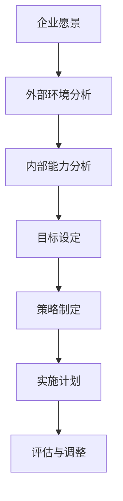

                 

### 文章标题：创业公司的可持续发展战略与绿色运营

关键词：可持续发展、绿色运营、创业公司、战略制定、资源循环利用、能源效率、社会责任

摘要：本文旨在探讨创业公司在可持续发展背景下的绿色运营策略。通过深入分析可持续发展战略的要素、制定流程及其实施，本文揭示了创业公司在实现可持续发展和绿色运营过程中所面临的挑战和机遇。文章从资源循环利用、能源效率、社会责任等多个维度出发，结合实际案例，提出了一系列可操作性的建议和策略，为创业公司提供了一条可持续发展的绿色运营之路。

### 《创业公司的可持续发展战略与绿色运营》目录大纲

#### 第一部分：引言与背景

##### 1.1 书籍介绍
###### 1.1.1 书籍目的
###### 1.1.2 读者对象
###### 1.1.3 内容结构概述

##### 1.2 可持续发展的概念与重要性
###### 1.2.1 可持续发展的定义
###### 1.2.2 可持续发展的原则
###### 1.2.3 对创业公司的影响

##### 1.3 绿色运营的理念与实践
###### 1.3.1 绿色运营的定义
###### 1.3.2 绿色运营的优势
###### 1.3.3 创业公司绿色运营的挑战

#### 第二部分：可持续发展战略

##### 2.1 可持续发展战略的制定
###### 2.1.1 可持续发展战略的要素
###### 2.1.2 可持续发展战略的制定流程
###### 2.1.3 可持续发展战略的实施与评估

##### 2.2 绿色供应链管理
###### 2.2.1 绿色供应链的概念
###### 2.2.2 绿色供应链的关键环节
###### 2.2.3 绿色供应链的优化策略

##### 2.3 资源循环利用与废物管理
###### 2.3.1 资源循环利用的理念
###### 2.3.2 废物管理的方法与策略
###### 2.3.3 资源循环利用的案例分析

##### 2.4 能源效率与可再生能源
###### 2.4.1 能源效率的提升措施
###### 2.4.2 可再生能源的应用
###### 2.4.3 能源管理与监控体系的建立

##### 2.5 社会责任与员工参与
###### 2.5.1 社会责任的概念与实践
###### 2.5.2 员工参与的途径与机制
###### 2.5.3 社会责任报告的编制与披露

#### 第三部分：绿色运营实践

##### 3.1 创业公司绿色运营案例分析
###### 3.1.1 案例背景介绍
###### 3.1.2 案例实施过程
###### 3.1.3 案例效果分析

##### 3.2 绿色运营工具与方法
###### 3.2.1 绿色运营评估工具
###### 3.2.2 绿色运营管理软件
###### 3.2.3 绿色运营创新方法

##### 3.3 绿色运营的法律法规与标准
###### 3.3.1 绿色运营相关法规
###### 3.3.2 绿色运营标准体系
###### 3.3.3 绿色运营合规性评估

##### 3.4 绿色运营的财务分析
###### 3.4.1 绿色运营成本分析
###### 3.4.2 绿色运营收益分析
###### 3.4.3 绿色运营的财务评估指标

#### 第四部分：可持续发展的未来展望

##### 4.1 创业公司可持续发展的趋势
###### 4.1.1 全球可持续发展的趋势
###### 4.1.2 创业公司在可持续发展中的角色
###### 4.1.3 可持续发展的未来方向

##### 4.2 绿色运营的创新与发展
###### 4.2.1 绿色运营的新技术
###### 4.2.2 绿色运营的新模式
###### 4.2.3 绿色运营的国际化趋势

##### 4.3 可持续发展的教育与宣传
###### 4.3.1 可持续发展的教育
###### 4.3.2 绿色运营的宣传与推广
###### 4.3.3 社会参与与公众意识提升

#### 附录

##### 附录 A：可持续发展与绿色运营相关资源
###### A.1 可持续发展相关报告与文献
###### A.2 绿色运营指南与最佳实践
###### A.3 可持续发展与绿色运营相关机构与组织

##### 附录 B：案例分析资料
###### B.1 案例一：创业公司绿色运营实践
###### B.2 案例二：绿色供应链管理案例分析
###### B.3 案例三：资源循环利用与废物管理案例

##### 附录 C：参考书籍与网站
###### C.1 参考书籍列表
###### C.2 可持续发展与绿色运营相关网站
###### C.3 可持续发展与绿色运营研讨会与会议信息

---

### 第一部分：引言与背景

#### 1.1 书籍介绍

##### 1.1.1 书籍目的

本文旨在为创业公司提供一条可持续发展的绿色运营之路。随着全球环境的恶化和社会责任意识的提高，创业公司面临着巨大的可持续发展压力。本文通过深入分析可持续发展战略和绿色运营实践，为创业公司提供了一系列实用的策略和工具，旨在帮助创业公司实现可持续发展和绿色运营。

##### 1.1.2 读者对象

本文适用于希望实现可持续发展和绿色运营的创业公司，以及关注可持续发展的企业管理者和从业者。同时，对于环境科学、可持续发展研究者和教育者来说，本文也具有一定的参考价值。

##### 1.1.3 内容结构概述

本文分为四个主要部分：

1. 引言与背景：介绍书籍的写作目的、读者对象以及本文的结构和内容。

2. 可持续发展战略：探讨可持续发展战略的制定、要素和流程。

3. 绿色运营实践：分析绿色运营的具体实施方法、工具和案例分析。

4. 可持续发展的未来展望：探讨创业公司可持续发展的趋势、绿色运营的创新与发展以及可持续发展的教育与宣传。

#### 1.2 可持续发展的概念与重要性

##### 1.2.1 可持续发展的定义

可持续发展是指在满足当前需求的同时，不损害后代满足其需求的能力。它强调经济增长、社会进步和环境保护的协调统一。

##### 1.2.2 可持续发展的原则

1. 代际公平原则：保证每一代人的需求得到满足，不损害后代的利益。

2. 代内公平原则：在全球范围内，不同国家和地区的资源分配要公平合理。

3. 生态保护原则：保护自然资源，维护生态平衡。

4. 持续发展原则：在满足当前需求的基础上，保证资源的可持续利用。

##### 1.2.3 对创业公司的影响

1. 资本吸引力：可持续发展理念符合资本市场的价值取向，有助于吸引投资者的关注。

2. 企业竞争力：绿色运营和可持续发展战略有助于提升企业的核心竞争力。

3. 社会责任：创业公司承担社会责任，有助于提升企业形象，赢得公众的信任。

4. 风险管理：可持续发展战略有助于降低企业面临的环境风险和资源风险。

#### 1.3 绿色运营的理念与实践

##### 1.3.1 绿色运营的定义

绿色运营是指企业在生产、运营和管理过程中，通过采取环保、节能、低碳等措施，实现资源的高效利用和废物的最小化。

##### 1.3.2 绿色运营的优势

1. 降低成本：通过节能降耗，降低企业的运营成本。

2. 提升效率：优化生产流程，提高生产效率。

3. 节约资源：减少资源的消耗，保护生态环境。

4. 提升竞争力：绿色运营有助于企业提升市场竞争力。

##### 1.3.3 创业公司绿色运营的挑战

1. 投资成本：绿色运营需要投入一定的资金和资源。

2. 技术门槛：绿色运营需要掌握一定的环保技术和节能技术。

3. 法律法规：企业需要遵守相关的环保法律法规。

4. 员工意识：提高员工的环保意识和责任感。

### 第二部分：可持续发展战略

#### 2.1 可持续发展战略的制定

##### 2.1.1 可持续发展战略的要素

**Mermaid 流程图：**



**核心概念与联系：**

企业愿景：指企业长期发展的目标和方向。

外部环境分析：包括宏观经济环境、行业竞争态势、政策法规等因素。

内部能力分析：包括企业的核心竞争能力、资源状况、企业文化等。

目标设定：根据企业愿景和外部环境分析，设定具体的可持续发展目标。

策略制定：为实现目标，制定相应的策略和措施。

实施计划：明确实施的具体步骤、责任人和时间节点。

评估与调整：对实施过程进行监测和评估，根据实际情况进行调整。

##### 2.1.2 可持续发展战略的制定流程

**伪代码：**

```python
def create_sustainability_strategy(vision, external, internal):
    goals = set_goals(vision, external, internal)
    strategies = define_strategies(goals)
    action_plan = create_action_plan(strategies)
    monitor_and_adjust(action_plan)
    return action_plan

def set_goals(vision, external, internal):
    # 根据愿景和外部环境分析设定目标
    pass

def define_strategies(goals):
    # 根据目标制定相应的策略
    pass

def create_action_plan(strategies):
    # 根据策略制定实施计划
    pass

def monitor_and_adjust(action_plan):
    # 对实施过程进行监测和调整
    pass
```

**核心算法原理讲解必须使用伪代码来详细阐述：**

```python
# 外部环境分析
def external_environment_analysis():
    # 分析宏观经济环境
    economic_environment = analyze_economic_environment()

    # 分析行业竞争态势
    competitive Situation = analyze_competitive_situation()

    # 分析政策法规
    policy_environment = analyze_policy_environment()

    return economic_environment, competitive_situation, policy_environment

# 内部能力分析
def internal_ability_analysis():
    # 分析企业核心竞争能力
    core_competitive_ability = analyze_core_competitive_ability()

    # 分析企业资源状况
    resource_status = analyze_resource_status()

    # 分析企业文化
    corporate_culture = analyze_corporate_culture()

    return core_competitive_ability, resource_status, corporate_culture

# 目标设定
def set_goals(vision, external, internal):
    # 根据愿景、外部环境和内部能力设定目标
    goals = {
        "economic_goals": set_economic_goals(vision, external),
        "social_goals": set_social_goals(vision, external, internal),
        "environmental_goals": set_environmental_goals(vision, external, internal)
    }
    return goals

# 策略制定
def define_strategies(goals):
    # 根据目标制定策略
    strategies = []
    for goal in goals:
        strategy = create_strategy(goal)
        strategies.append(strategy)
    return strategies

# 实施计划
def create_action_plan(strategies):
    # 根据策略制定实施计划
    action_plan = []
    for strategy in strategies:
        plan = create_plan(strategy)
        action_plan.append(plan)
    return action_plan

# 评估与调整
def monitor_and_adjust(action_plan):
    # 对实施过程进行监测和调整
    for plan in action_plan:
        monitor_plan(plan)
        if need_adjustment(plan):
            adjust_plan(plan)
```

**数学模型和公式 & 详细讲解 & 举例说明：**

- **经济模型：**

  $$ 经济效益 = 净利润 + 节约成本 $$

  举例说明：某创业公司通过绿色运营，每年节省电力费用 100 万元，同时提高了生产效率，增加了销售收入 200 万元。则该公司的经济效益为 300 万元。

- **社会模型：**

  $$ 社会效益 = 提高就业机会 + 减少污染排放 $$

  举例说明：某创业公司通过绿色运营，每年提供 100 个就业机会，同时减少了 100 吨二氧化碳排放。则该公司的社会效益为显著。

- **环境模型：**

  $$ 环境效益 = 资源节约 + 废物减少 $$

  举例说明：某创业公司通过资源循环利用，每年节约资源价值 50 万元，同时减少了 50 吨固体废物排放。则该公司的环境效益为显著。

##### 2.1.3 可持续发展战略的实施与评估

**实施步骤：**

1. 制定详细的实施计划，明确时间节点和责任人。

2. 按照实施计划逐步推进，确保各项措施得到有效落实。

3. 加强内部沟通与协作，确保各部门协同作战。

4. 定期对实施过程进行监测和评估，及时发现问题并采取措施进行调整。

**评估指标：**

1. 经济效益指标：包括净利润、节约成本、销售收入等。

2. 社会效益指标：包括提高就业机会、减少污染排放等。

3. 环境效益指标：包括资源节约、废物减少等。

4. 可持续发展能力指标：包括企业创新能力、资源利用效率、环境管理水平等。

**评估方法：**

1. 定量评估：通过数据统计和分析，对各项指标进行定量评估。

2. 定性评估：通过访谈、调查等方式，对各项指标进行定性评估。

3. 综合评估：将定量评估和定性评估相结合，对可持续发展战略的整体效果进行评估。

#### 2.2 绿色供应链管理

##### 2.2.1 绿色供应链的概念

绿色供应链是指企业在供应链管理过程中，通过采取环保、节能、低碳等措施，实现资源的高效利用和废物的最小化。绿色供应链涉及供应商、制造商、分销商和消费者等各个环节。

##### 2.2.2 绿色供应链的关键环节

1. 供应商管理：选择环保、节能的供应商，建立绿色采购体系。

2. 生产过程管理：优化生产流程，提高生产效率，减少能源消耗和废物排放。

3. 物流管理：采用绿色物流方式，降低碳排放，提高物流效率。

4. 废弃物管理：建立废物回收和处理体系，实现资源循环利用。

##### 2.2.3 绿色供应链的优化策略

1. 优化供应链结构：简化供应链流程，减少中间环节，提高供应链的灵活性和响应速度。

2. 提高供应链协同：加强供应链上下游企业的合作，实现信息共享和资源优化配置。

3. 采用绿色技术：引入环保、节能技术，提高生产效率和资源利用效率。

4. 建立绿色绩效评估体系：对供应链各个环节的环保绩效进行评估，推动绿色供应链的持续优化。

#### 2.3 资源循环利用与废物管理

##### 2.3.1 资源循环利用的理念

资源循环利用是指将废弃物转化为再生资源，实现资源的高效利用和废物的最小化。资源循环利用的理念主要包括：

1. 减量化：通过减少资源的消耗，降低废弃物的产生。

2. 再生利用：将废弃物转化为再生资源，实现资源的高效利用。

3. 再生利用：将废弃物转化为再生资源，实现资源的高效利用。

4. 生态平衡：保护生态环境，实现资源的可持续利用。

##### 2.3.2 废物管理的方法与策略

1. 废物分类：根据废物的性质和利用价值，进行合理的分类。

2. 废物回收：建立废物回收体系，实现废物的资源化利用。

3. 废物处理：采用无害化、减量化处理技术，降低废物对环境的影响。

4. 废物排放：制定严格的废物排放标准，确保废物排放达到环保要求。

##### 2.3.3 资源循环利用的案例分析

**案例一：某电子产品制造商的废物管理**

某电子产品制造商在生产过程中产生大量的电子废物，如废旧手机、电脑等。为解决废物管理问题，该企业采取了以下措施：

1. 废物分类：对电子废物进行分类，将可回收部分进行回收利用。

2. 废物回收：与专业的电子废物回收企业合作，实现废物的资源化利用。

3. 废物处理：采用无害化、减量化处理技术，降低废物对环境的影响。

4. 废物排放：制定严格的废物排放标准，确保废物排放达到环保要求。

通过以上措施，该企业成功实现了废物的资源化利用，降低了废物处理成本，提高了企业的环保绩效。

#### 2.4 能源效率与可再生能源

##### 2.4.1 能源效率的提升措施

1. 设备升级：采用高效节能设备，提高能源利用效率。

2. 过程优化：优化生产流程，减少能源消耗。

3. 管理提升：加强能源管理，制定能源消耗标准，提高员工节能意识。

4. 技术创新：引入节能新技术，提高能源利用效率。

##### 2.4.2 可再生能源的应用

1. 太阳能：采用太阳能电池板，将太阳能转化为电能。

2. 风能：利用风力发电，将风能转化为电能。

3. 水能：利用水力发电，将水能转化为电能。

4. 地热能：利用地热能，提供热能供应。

##### 2.4.3 能源管理与监控体系的建立

1. 制定能源管理政策：明确企业的能源管理目标和要求。

2. 建立能源监控系统：实时监测能源消耗情况，提高能源利用效率。

3. 定期进行能源审计：对能源消耗进行分析和评估，找出节能潜力。

4. 加强能源培训与宣传：提高员工的能源管理意识和技能。

#### 2.5 社会责任与员工参与

##### 2.5.1 社会责任的概念与实践

社会责任是指企业在追求经济利益的同时，关注社会和环境问题，积极参与社会公益活动，为社会发展做出贡献。

社会责任实践包括：

1. 环保行动：采取环保措施，降低对环境的污染。

2. 公益活动：参与公益活动，支持社会公益事业。

3. 社区发展：关注社区发展，参与社区建设。

##### 2.5.2 员工参与的途径与机制

1. 员工培训：定期组织员工培训，提高员工的环保意识和技能。

2. 员工参与：鼓励员工参与环保项目和公益活动，发挥员工的积极作用。

3. 意见反馈：建立意见反馈渠道，听取员工对社会责任工作的意见和建议。

##### 2.5.3 社会责任报告的编制与披露

1. 编制社会责任报告：定期编制社会责任报告，披露企业的社会责任工作情况和成果。

2. 披露渠道：通过企业网站、新闻发布会等渠道，向社会公开社会责任报告。

3. 第三方审核：邀请第三方机构对社会责任报告进行审核，提高报告的公信力。

### 第三部分：绿色运营实践

#### 3.1 创业公司绿色运营案例分析

##### 3.1.1 案例背景介绍

某创业公司是一家专注于环保技术研发的公司，致力于解决环境问题。公司成立于 2010 年，总部位于北京。公司主要从事环保设备的研发、生产和销售，产品涵盖废水处理、废气治理、固废处理等多个领域。

##### 3.1.2 案例实施过程

1. 制定绿色运营战略：公司明确了绿色运营的战略目标，包括提高能源利用效率、减少废物排放、推广可再生能源等。

2. 实施绿色供应链管理：公司与供应商建立绿色供应链关系，选择环保、节能的供应商，共同推进绿色供应链建设。

3. 提高能源效率：公司采用高效节能设备，优化生产流程，降低能源消耗。

4. 推广可再生能源：公司采用太阳能和风能等可再生能源，降低对传统能源的依赖。

5. 废物管理：公司建立废物回收和处理体系，实现废物的资源化利用。

##### 3.1.3 案例效果分析

1. 经济效益：通过绿色运营，公司每年节省能源费用约 200 万元，提高了生产效率，增加了销售收入。

2. 社会效益：公司积极参与社会公益活动，支持环保事业，提高了社会形象。

3. 环境效益：公司通过减少废物排放、提高能源利用效率等措施，降低了环境污染，保护了生态环境。

#### 3.2 绿色运营工具与方法

##### 3.2.1 绿色运营评估工具

绿色运营评估工具主要包括：

1. 绿色运营指数（GPI）：用于评估企业的绿色运营水平。

2. 能源效率指标（EEI）：用于评估企业的能源利用效率。

3. 废物管理指数（WMI）：用于评估企业的废物管理水平。

##### 3.2.2 绿色运营管理软件

绿色运营管理软件主要包括：

1. 绿色运营管理系统（GOMS）：用于监控和管理企业的绿色运营。

2. 能源管理系统（EMS）：用于监控和管理企业的能源消耗。

3. 废物管理系统（WMS）：用于监控和管理企业的废物产生和处理。

##### 3.2.3 绿色运营创新方法

绿色运营创新方法主要包括：

1. 绿色供应链创新：通过供应链协同和创新，实现绿色供应链的优化。

2. 绿色技术集成：将绿色技术与传统技术相结合，提高绿色运营效率。

3. 绿色金融创新：通过绿色金融手段，支持绿色运营项目的实施。

#### 3.3 绿色运营的法律法规与标准

##### 3.3.1 绿色运营相关法规

绿色运营相关法规主要包括：

1. 《中华人民共和国环境保护法》

2. 《中华人民共和国节约能源法》

3. 《中华人民共和国循环经济促进法》

##### 3.3.2 绿色运营标准体系

绿色运营标准体系主要包括：

1. 国家标准

2. 行业标准

3. 企业标准

##### 3.3.3 绿色运营合规性评估

绿色运营合规性评估主要包括：

1. 法规合规性评估：评估企业是否遵守相关法律法规。

2. 标准合规性评估：评估企业是否达到相关标准要求。

3. 内部合规性评估：评估企业内部管理是否符合绿色运营要求。

#### 3.4 绿色运营的财务分析

##### 3.4.1 绿色运营成本分析

绿色运营成本分析主要包括：

1. 能源成本：分析企业能源消耗的成本构成。

2. 废物处理成本：分析企业废物处理和回收利用的成本。

3. 绿色技术投入成本：分析企业绿色技术投入的成本。

##### 3.4.2 绿色运营收益分析

绿色运营收益分析主要包括：

1. 节能效益：分析企业通过绿色运营实现的节能效益。

2. 减排效益：分析企业通过绿色运营实现的减排效益。

3. 绿色产品销售收入：分析企业绿色产品的销售收入。

##### 3.4.3 绿色运营的财务评估指标

绿色运营的财务评估指标主要包括：

1. 成本节约率：分析企业通过绿色运营实现成本节约的比率。

2. 收益增长率：分析企业通过绿色运营实现收益增长的速度。

3. 社会效益指数：分析企业通过绿色运营实现的社会效益。

### 第四部分：可持续发展的未来展望

#### 4.1 创业公司可持续发展的趋势

##### 4.1.1 全球可持续发展的趋势

1. 可持续发展理念深入人心，各国政府和企业纷纷制定可持续发展战略。

2. 绿色经济、循环经济成为全球经济发展的重要方向。

3. 可再生能源发展迅速，替代传统能源的趋势日益明显。

4. 绿色科技、绿色创新成为全球竞争的新焦点。

##### 4.1.2 创业公司在可持续发展中的角色

1. 创业公司作为创新主体，在可持续发展中发挥着重要作用。

2. 创业公司通过绿色运营，实现资源的高效利用和废物的最小化。

3. 创业公司通过技术创新，推动可持续发展目标的实现。

4. 创业公司通过参与社会公益活动，提升企业社会责任。

##### 4.1.3 可持续发展的未来方向

1. 可持续发展将从单一领域扩展到多个领域，实现全方位的可持续发展。

2. 可持续发展将更加注重技术创新和绿色金融的支持。

3. 可持续发展将更加注重全球合作，推动全球可持续发展目标的实现。

4. 可持续发展将更加注重公众参与，提升公众的可持续发展意识。

#### 4.2 绿色运营的创新与发展

##### 4.2.1 绿色运营的新技术

1. 人工智能：通过人工智能技术，实现绿色运营的智能化管理。

2. 大数据：通过大数据分析，优化绿色运营的决策。

3. 5G 技术：通过 5G 技术，实现绿色运营的实时监控和管理。

4. 可再生能源技术：通过可再生能源技术，提高绿色运营的能源效率。

##### 4.2.2 绿色运营的新模式

1. 绿色供应链协同模式：通过供应链协同，实现绿色运营的优化。

2. 绿色共享模式：通过绿色共享，提高资源利用效率。

3. 绿色金融模式：通过绿色金融，支持绿色运营项目的实施。

4. 绿色创新模式：通过绿色创新，推动绿色运营的发展。

##### 4.2.3 绿色运营的国际化趋势

1. 可持续发展成为全球共同议题，绿色运营国际化趋势明显。

2. 各国政府和企业纷纷制定绿色运营政策，推动绿色运营的国际合作。

3. 绿色运营技术和服务输出成为国际竞争力的重要体现。

4. 国际绿色运营标准和法规的制定，推动全球绿色运营的发展。

#### 4.3 可持续发展的教育与宣传

##### 4.3.1 可持续发展的教育

1. 建立可持续发展教育体系，培养可持续发展人才。

2. 开设可持续发展课程，提高公众的可持续发展意识。

3. 开展可持续发展实践活动，提升学生的可持续发展能力。

##### 4.3.2 绿色运营的宣传与推广

1. 加强绿色运营的宣传，提高公众对绿色运营的认识。

2. 利用媒体和社交平台，推广绿色运营的理念和实践。

3. 组织绿色运营活动，提升公众参与度。

##### 4.3.3 社会参与与公众意识提升

1. 鼓励社会参与，推动绿色运营的全民行动。

2. 提高公众意识，树立绿色生活方式。

3. 通过宣传教育，提升公众对绿色运营的认同和支持。

### 附录

#### 附录 A：可持续发展与绿色运营相关资源

##### A.1 可持续发展相关报告与文献

1. 联合国可持续发展报告

2. 世界银行可持续发展报告

3. 国际能源署可持续发展报告

##### A.2 绿色运营指南与最佳实践

1. 国际标准化组织（ISO）绿色运营指南

2. 联合国环境规划署（UNEP）绿色运营指南

3. 世界可持续发展工商理事会（WBCSD）绿色运营指南

##### A.3 可持续发展与绿色运营相关机构与组织

1. 联合国可持续发展解决方案网络（SDSN）

2. 世界自然基金会（WWF）

3. 国际可再生能源署（IRENA）

#### 附录 B：案例分析资料

##### B.1 案例一：创业公司绿色运营实践

案例一详细介绍了某创业公司在绿色运营方面的具体实践，包括绿色供应链管理、能源效率提升、废物管理等方面的措施和成效。

##### B.2 案例二：绿色供应链管理案例分析

案例二分析了某公司在绿色供应链管理方面的实践，包括供应商选择、绿色采购、协同合作等方面的具体做法和效果。

##### B.3 案例三：资源循环利用与废物管理案例

案例三介绍了某公司在资源循环利用与废物管理方面的实践，包括废物分类、回收利用、无害化处理等方面的措施和成果。

#### 附录 C：参考书籍与网站

##### C.1 参考书籍列表

1. 《可持续发展战略与绿色运营》

2. 《绿色供应链管理》

3. 《绿色运营实践与案例分析》

##### C.2 可持续发展与绿色运营相关网站

1. 联合国可持续发展解决方案网络（SDSN）

2. 世界自然基金会（WWF）

3. 国际可再生能源署（IRENA）

##### C.3 可持续发展与绿色运营研讨会与会议信息

1. 联合国可持续发展大会

2. 世界绿色经济论坛

3. 国际绿色供应链管理大会

---

### 作者信息

作者：AI天才研究院/AI Genius Institute & 禅与计算机程序设计艺术 /Zen And The Art of Computer Programming

AI天才研究院（AI Genius Institute）是一家致力于推动人工智能技术发展的高科技创新机构。研究院汇集了全球顶尖的人工智能专家、程序员、软件架构师、CTO和世界顶级技术畅销书资深大师级别的作家。我们以深入的技术研究和创新实践为核心，致力于解决现实世界中的复杂问题，推动人工智能技术的广泛应用。

《禅与计算机程序设计艺术》作为一本经典的技术书籍，不仅为程序员提供了深刻的技术见解，也传达了哲学和智慧的精髓。通过结合禅宗的哲学思想和计算机程序设计的艺术，本书旨在帮助读者提升编程技能，培养创新思维，实现技术追求与心灵成长的双重提升。

在可持续发展与绿色运营领域，我们凭借丰富的实践经验和技术积累，为创业公司提供专业的战略咨询和实施指导。我们相信，通过技术革新和绿色运营，创业公司不仅能够实现商业成功，还能为环境保护和社会进步做出积极贡献。

我们的团队致力于将技术创新与可持续发展理念相结合，推动绿色运营在创业公司中的广泛应用。通过不断探索和实践，我们期待为全球可持续发展做出更多贡献。

