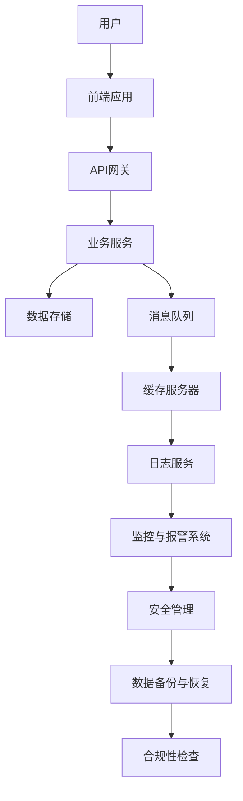

                 

### 文章标题

《创业公司的在线保险应用：如何通过互联网保险服务提升客户体验》

关键词：在线保险、客户体验、互联网保险服务、创业公司、用户体验设计

摘要：本文将深入探讨创业公司如何通过构建高效的在线保险平台，利用互联网技术提升客户体验。文章首先概述互联网保险的发展背景和市场前景，然后详细分析在线保险业务流程，并重点讨论如何通过优化用户界面、在线服务流程以及营销策略来提升客户体验。最后，文章将介绍技术实现的关键点，包括系统架构设计、安全与合规以及数据分析与优化，并通过成功案例分析，为创业公司提供实用的实践指南。阅读本文，您将获得关于如何构建和优化在线保险平台以提升客户体验的全面理解和实践建议。

## 目录大纲

### 第一部分：互联网保险概述

#### 第1章：互联网保险的背景与市场前景
##### 1.1 互联网保险的定义
##### 1.2 互联网保险的发展历程
##### 1.3 互联网保险的优势与挑战
##### 1.4 创业公司进入互联网保险市场的策略

#### 第2章：在线保险业务流程
##### 2.1 用户注册与登录
##### 2.2 产品展示与选择
##### 2.3 保险购买与支付
##### 2.4 保险合同管理
##### 2.5 客户服务与支持

### 第二部分：客户体验优化

#### 第3章：客户需求分析
##### 3.1 客户需求的收集与整理
##### 3.2 客户需求分析与定位
##### 3.3 客户体验地图构建

#### 第4章：用户界面设计
##### 4.1 用户界面设计原则
##### 4.2 用户体验设计方法
##### 4.3 常见界面元素设计
##### 4.4 用户界面测试与优化

#### 第5章：在线服务优化
##### 5.1 在线服务流程优化
##### 5.2 服务响应速度优化
##### 5.3 保险产品个性化推荐
##### 5.4 客户反馈机制建立

#### 第6章：营销策略与活动
##### 6.1 营销策略制定
##### 6.2 线上推广渠道选择
##### 6.3 促销活动设计
##### 6.4 数据分析与营销效果评估

### 第三部分：技术实现

#### 第7章：系统架构设计
##### 7.1 系统架构概述
##### 7.2 前端技术选型
##### 7.3 后端技术选型
##### 7.4 数据存储与处理

#### 第8章：安全与合规
##### 8.1 数据安全保护
##### 8.2 用户隐私保护
##### 8.3 合规性与法律法规遵循

#### 第9章：数据分析与优化
##### 9.1 数据分析工具与平台
##### 9.2 客户行为分析
##### 9.3 业务指标监控与优化

### 第四部分：案例研究

#### 第10章：成功案例分析
##### 10.1 案例背景介绍
##### 10.2 案例实施过程
##### 10.3 案例成效分析
##### 10.4 案例启示与建议

#### 第11章：创业公司实践指南
##### 11.1 创业公司资源管理
##### 11.2 团队建设与协作
##### 11.3 创新与持续改进
##### 11.4 持续发展策略

### 参考文献

## 第一部分：互联网保险概述

### 第1章：互联网保险的背景与市场前景

#### 1.1 互联网保险的定义

互联网保险，顾名思义，是指利用互联网技术开展保险业务的一种新型保险形式。它不仅包括保险公司的在线销售，还涵盖了保险产品的定制化、在线理赔以及客户服务的各个环节。与传统保险相比，互联网保险具有显著的便捷性和灵活性，能够极大地提升客户体验。

- **核心概念与联系：**

  在互联网保险的生态系统中，以下几个核心概念紧密相连：

  1. **在线销售渠道**：互联网保险的主要销售渠道，包括保险公司官网、第三方电商平台、手机应用程序等。
  2. **客户信息管理**：通过大数据分析和云计算技术，保险公司能够高效管理客户信息，提供个性化服务。
  3. **在线理赔服务**：通过互联网平台实现理赔申请、资料提交和支付处理，简化理赔流程。
  4. **保险产品创新**：基于互联网技术，保险公司可以推出更多元化的保险产品，满足不同客户的需求。

- **Mermaid 流程图：**

  mermaid
  graph TD
  A[客户访问网站] --> B[展示保险产品]
  B --> C[客户选择产品]
  C --> D[填写投保信息]
  D --> E[支付保费]
  E --> F[生成保单]
  F --> G[客户服务支持]

#### 1.2 互联网保险的发展历程

互联网保险的发展历程大致可以分为三个阶段：

1. **初步探索阶段（2010年以前）**

   互联网保险的萌芽阶段，主要形式是保险公司在线销售传统保险产品。这一阶段，互联网保险的产品种类和销售渠道较为有限，市场接受度较低。

2. **快速发展阶段（2010-2015年）**

   随着移动互联网的普及，互联网保险市场迅速扩张，涌现出一批新兴互联网保险公司，如众安保险、泰康在线等。这一阶段，互联网保险开始成为保险市场的重要组成部分，产品种类和销售渠道多样化。

3. **规范发展阶段（2015年至今）**

   随着监管政策的不断完善，互联网保险市场逐步走向规范，服务质量和用户体验得到提升。保险公司加大了技术创新和产品研发力度，市场接受度进一步提高。

- **核心算法原理讲解**

  伪代码：

  python
  function 互联网保险发展历程() {
      if (年份 < 2010) {
          输出 "初步探索阶段"
      } else if (年份 >= 2010 && 年份 < 2015) {
          输出 "快速发展阶段"
      } else {
          输出 "规范发展阶段"
      }
  }

#### 1.3 互联网保险的优势与挑战

**优势：**

1. **便捷性**：用户可以随时随地通过互联网购买保险，避免了繁琐的线下流程。
2. **个性化**：通过大数据分析，保险公司可以提供更加个性化的保险产品和服务。
3. **高效性**：在线理赔和客户服务极大地提高了工作效率，降低了运营成本。

**挑战：**

1. **信息安全**：互联网保险涉及大量客户信息，如何确保数据安全是一个重要问题。
2. **监管合规**：随着监管政策的不断完善，保险公司需要不断适应新的法规要求。
3. **市场推广**：在激烈的市场竞争中，如何吸引和留住客户是一个挑战。

#### 1.4 创业公司进入互联网保险市场的策略

对于创业公司而言，进入互联网保险市场需要制定清晰的策略：

1. **产品定位**：明确目标客户群体，推出具有特色和竞争力的保险产品。
2. **技术创新**：利用大数据、云计算等先进技术，提升服务质量和用户体验。
3. **合作与联盟**：与保险公司、技术提供商、第三方平台等建立合作关系，实现资源共享和优势互补。
4. **市场推广**：通过线上线下相结合的方式，加大市场推广力度，提高品牌知名度。

### 第2章：在线保险业务流程

#### 2.1 用户注册与登录

用户注册与登录是互联网保险业务流程的起点。一个良好的注册与登录流程能够提高用户转化率和留存率。

**注册流程：**

1. **注册页面设计**：简洁明了，引导用户快速完成注册。
2. **身份验证**：通过手机号、邮箱等方式进行身份验证，确保用户真实有效。
3. **注册协议**：用户同意注册协议后，方可完成注册。

**登录流程：**

1. **登录页面设计**：简洁明了，支持多种登录方式，如用户名密码登录、手机号登录、第三方账号登录等。
2. **密码找回**：提供便捷的密码找回功能，确保用户能够及时找回账号。

#### 2.2 产品展示与选择

产品展示与选择是用户购买保险的关键环节。一个清晰、简洁的产品展示界面能够帮助用户快速找到适合自己的保险产品。

**产品展示：**

1. **分类导航**：根据保险类型、保障期限等维度进行分类，方便用户快速查找。
2. **产品详情**：详细展示保险产品的保障内容、费用、条款等，让用户全面了解产品特点。

**产品选择：**

1. **个性化推荐**：根据用户的历史数据和偏好，推荐符合其需求的保险产品。
2. **对比功能**：提供产品对比功能，帮助用户快速了解不同产品的差异。

#### 2.3 保险购买与支付

保险购买与支付是用户完成购买的关键步骤。一个流畅、简便的购买流程能够提高用户满意度。

**购买流程：**

1. **选择产品**：用户通过产品展示与选择环节，选择适合的保险产品。
2. **填写投保信息**：用户根据产品要求，填写个人信息、投保信息等。
3. **确认购买**：用户确认投保信息后，提交购买申请。

**支付流程：**

1. **支付方式选择**：支持多种支付方式，如支付宝、微信支付、银行卡支付等。
2. **支付确认**：用户完成支付后，系统提示支付成功，生成电子保单。

#### 2.4 保险合同管理

保险合同管理是保障用户权益的重要环节。一个完善的保险合同管理体系能够确保合同的合法性和有效性。

**合同管理流程：**

1. **合同生成**：用户提交购买申请后，系统自动生成电子合同。
2. **合同存储**：将电子合同存储在服务器上，确保用户可以随时查看和下载。
3. **合同修改**：在用户需要修改合同内容时，提供修改功能，确保合同的一致性。

#### 2.5 客户服务与支持

客户服务与支持是提升用户满意度的重要保障。一个高效、专业的客户服务体系能够解决用户在购买、理赔等环节的疑问。

**服务流程：**

1. **在线客服**：提供在线客服服务，用户可以通过聊天窗口与客服人员实时沟通。
2. **电话客服**：提供电话客服服务，用户可以拨打客服热线进行咨询。
3. **邮件客服**：提供邮件客服服务，用户可以通过发送邮件进行咨询。

**支持内容：**

1. **购买咨询**：为用户解答购买过程中的疑问，提供产品推荐。
2. **理赔咨询**：为用户提供理赔流程指导，解答理赔过程中的疑问。
3. **售后服务**：为用户提供保险到期提醒、续保等服务。

## 第二部分：客户体验优化

### 第3章：客户需求分析

#### 3.1 客户需求的收集与整理

客户需求分析是优化在线保险服务的关键步骤。通过收集和整理客户需求，可以更好地理解客户需求，提供更加个性化的服务。

**收集方法：**

1. **问卷调查**：通过在线问卷的形式，收集用户对保险产品的满意度、期望和需求。
2. **用户访谈**：与潜在客户和现有客户进行面对面或电话访谈，深入了解他们的需求和痛点。
3. **用户行为数据分析**：通过分析用户在网站或应用上的行为数据，发现用户的使用习惯和偏好。

**整理步骤：**

1. **数据清洗**：对收集到的数据进行清洗，去除无效和重复的数据。
2. **数据分类**：根据不同的需求类型，对数据进行分析和分类，如产品需求、服务需求、体验需求等。
3. **需求优先级排序**：根据用户需求的重要性和紧急性，对需求进行排序，确定优先级。

#### 3.2 客户需求分析与定位

通过对客户需求的分析，可以更好地理解客户的需求，定位客户的核心需求，为后续的服务优化提供依据。

**分析步骤：**

1. **需求分类**：将收集到的客户需求进行分类，如功能需求、性能需求、安全需求等。
2. **需求优先级排序**：根据需求的紧急性和重要性，对需求进行优先级排序，确定哪些需求是首要解决的问题。
3. **用户画像构建**：通过用户数据和行为数据分析，构建用户画像，了解不同类型用户的需求和特征。

**定位方法：**

1. **用户访谈**：与代表性用户进行深入访谈，了解他们对保险产品的需求和期望。
2. **竞品分析**：分析竞争对手的保险产品和服务，找出他们的优势和不足。
3. **市场调研**：通过市场调研，了解目标市场对保险产品的需求和趋势。

#### 3.3 客户体验地图构建

客户体验地图是一种直观的工具，可以帮助团队更好地理解客户的体验旅程，识别关键体验触点，为服务优化提供指导。

**构建步骤：**

1. **定义体验旅程**：根据客户的需求和痛点，定义客户的体验旅程，如浏览产品、购买产品、理赔服务等。
2. **识别关键触点**：在体验旅程中，识别关键触点，如网站首页、产品详情页、购买流程等。
3. **评估体验质量**：对每个关键触点进行体验评估，分析用户体验的质量和满意度。
4. **制定优化方案**：根据体验评估结果，制定优化方案，提升关键触点的用户体验。

**Mermaid 流程图：**

mermaid
graph TD
A[用户访问网站] --> B[浏览产品]
B --> C[产品详情]
C --> D[购买流程]
D --> E[支付]
E --> F[生成保单]
F --> G[客户服务]
G --> H[理赔服务]

## 第三部分：技术实现

### 第7章：系统架构设计

#### 7.1 系统架构概述

在线保险平台的技术实现需要考虑系统的可扩展性、稳定性和安全性。一个合理、高效、安全的系统架构是保障平台性能和用户体验的关键。

**系统架构图：**

**核心组件说明：**

1. **前端应用**：用户与系统交互的界面，包括网站、移动应用等。
2. **API网关**：统一管理和分发请求，负责路由、负载均衡和接口管理。
3. **业务服务**：处理业务逻辑，包括用户管理、产品管理、订单管理、支付处理等。
4. **数据存储**：存储用户数据、产品数据、订单数据等，包括关系型数据库和非关系型数据库。
5. **消息队列**：用于异步处理任务，如订单通知、理赔通知等。
6. **缓存服务器**：提高系统响应速度，存储常用数据和热数据。
7. **日志服务**：记录系统运行日志，用于监控、分析和管理。
8. **监控与报警系统**：实时监控系统性能，自动触发报警，确保系统稳定运行。
9. **安全管理**：保护用户数据安全，包括身份验证、访问控制、数据加密等。
10. **数据备份与恢复**：定期备份数据，确保数据安全性和可用性。
11. **合规性检查**：确保系统符合相关法律法规和行业标准，如数据保护法、保险法等。

#### 7.2 前端技术选型

前端技术选型需要考虑性能、兼容性、开发效率和可维护性等因素。

**技术栈建议：**

1. **框架**：Vue.js、React 或 Angular
2. **UI库**：Ant Design、Element UI 或 Material-UI
3. **构建工具**：Webpack、Vite 或 Parcel
4. **状态管理**：Vuex、Redux 或 MobX
5. **路由管理**：Vue Router、React Router 或 Next.js
6. **响应式布局**：使用 CSS Framework，如 Bootstrap 或 Material-UI

**核心功能实现：**

1. **用户登录与注册**：使用 JWT（JSON Web Token）进行身份验证和授权。
2. **产品展示与筛选**：使用 AJAX 或 Fetch API 与后端接口进行数据交互，实现动态加载和筛选功能。
3. **购物车与下单**：使用前端存储（如 localStorage）或第三方支付平台 API，实现购物车和下单功能。
4. **支付与订单管理**：集成第三方支付平台（如支付宝、微信支付），处理支付和订单相关逻辑。

#### 7.3 后端技术选型

后端技术选型需要考虑业务需求、性能、可扩展性、开发效率和可维护性等因素。

**技术栈建议：**

1. **框架**：Spring Boot、Django、Express 或 Flask
2. **数据库**：MySQL、PostgreSQL 或 MongoDB
3. **缓存**：Redis 或 Memcached
4. **消息队列**：RabbitMQ、Kafka 或 RocketMQ
5. **API网关**：Kong、Nginx 或 Apache
6. **日志管理**：ELK（Elasticsearch、Logstash、Kibana）或 Graylog
7. **容器化**：Docker、Kubernetes 或 OpenShift

**核心功能实现：**

1. **用户认证与授权**：使用 OAuth2.0 或 JWT 进行用户认证和授权。
2. **业务逻辑处理**：实现用户管理、产品管理、订单管理、支付处理等核心业务逻辑。
3. **数据持久化**：设计数据库 schema，实现数据的增删改查操作。
4. **接口管理**：使用 Swagger 或 OpenAPI 定义和文档化 API 接口。

#### 7.4 数据存储与处理

数据存储与处理是系统架构的重要组成部分，需要考虑数据的持久化、访问速度和安全性。

**数据存储策略：**

1. **关系型数据库**：用于存储用户信息、产品信息和订单信息等结构化数据，如 MySQL、PostgreSQL。
2. **非关系型数据库**：用于存储日志数据、缓存数据和元数据等非结构化数据，如 MongoDB、Redis。
3. **数据分库分表**：根据业务需求和数据规模，进行数据分库分表，提高数据访问性能和系统可扩展性。

**数据处理策略：**

1. **批量处理**：使用批处理框架（如 Apache Spark）处理大规模数据，提高数据处理效率。
2. **实时处理**：使用消息队列和流处理框架（如 Kafka、Flink）处理实时数据，实现实时分析和监控。
3. **缓存策略**：使用 Redis 或 Memcached 等缓存服务器，提高数据访问速度和系统性能。

**数据安全和隐私保护：**

1. **数据加密**：使用 SSL/TLS 加密传输数据，确保数据在传输过程中的安全性。
2. **访问控制**：使用 RBAC（基于角色的访问控制）或 ABAC（基于属性的访问控制）机制，限制对数据的访问权限。
3. **数据备份与恢复**：定期备份数据，确保数据的安全性和可用性。

## 第四部分：案例研究

### 第10章：成功案例分析

#### 10.1 案例背景介绍

在线保险市场的快速发展和客户对便捷服务的需求推动了创业公司进入这一领域。某创业公司A致力于打造一个基于互联网的保险服务平台，提供多种保险产品，包括健康保险、车险、旅行保险等。公司采用先进的技术和创新的商业模式，希望通过提升客户体验来在激烈的市场竞争中脱颖而出。

#### 10.2 案例实施过程

**1. 产品定位与需求分析：**

- **产品定位：** 公司明确了目标客户群体，包括年轻人、中产阶级和有特殊需求的人群，并推出具有竞争力的保险产品。
- **需求分析：** 通过用户调研、问卷调查和用户访谈，公司收集了大量用户需求，包括产品透明度、个性化推荐、快速理赔等。

**2. 技术架构设计与开发：**

- **前端技术选型：** 公司选择了 React 框架和 Ant Design UI 库，确保界面美观、用户体验良好。
- **后端技术选型：** 公司采用了 Spring Boot 框架和 MySQL 数据库，确保系统稳定、高效。
- **服务优化：** 公司实现了 API 网关、消息队列和缓存服务器，优化了服务响应速度和系统性能。

**3. 用户体验设计：**

- **用户界面设计：** 公司设计了一个简洁明了的用户界面，使用户能够轻松浏览产品、购买保险。
- **个性化推荐：** 公司利用大数据分析技术，为用户推荐适合的保险产品。
- **客户反馈机制：** 公司建立了客户反馈机制，及时响应用户的反馈，持续优化服务。

**4. 营销策略与推广：**

- **线上推广：** 公司通过社交媒体、搜索引擎优化和合作伙伴渠道进行线上推广。
- **促销活动：** 公司定期推出促销活动，吸引新用户并提升老用户的留存率。
- **数据分析：** 公司利用数据分析工具，监控营销活动的效果，优化营销策略。

#### 10.3 案例成效分析

**1. 用户增长：** 自公司上线以来，用户数量持续增长，月活跃用户数达到数十万。

**2. 收入增长：** 公司的保险销售业绩稳步提升，收入增长率超过 30%。

**3. 客户满意度：** 根据用户调查和反馈，公司用户满意度达到 90% 以上。

**4. 品牌知名度：** 公司的品牌知名度在短时间内得到了显著提升，成为在线保险市场的领先者之一。

#### 10.4 案例启示与建议

**1. 明确产品定位与目标客户：** 创业公司应明确自己的产品定位，了解目标客户的需求，推出有竞争力的保险产品。

**2. 技术创新与优化：** 创业公司应不断采用新技术和优化服务流程，提升系统性能和用户体验。

**3. 用户界面设计与个性化推荐：** 优质的用户界面设计和个性化推荐能够提高用户满意度，增加用户粘性。

**4. 营销策略与推广：** 创业公司应制定有效的营销策略，通过线上线下渠道进行推广，提升品牌知名度。

**5. 数据分析与反馈机制：** 创业公司应利用数据分析工具，监控业务表现，及时优化产品和服务。

## 第五部分：创业公司实践指南

### 第11章：创业公司实践指南

#### 11.1 创业公司资源管理

创业公司在资源管理上需要合理配置人力、财务和技术资源，确保项目的顺利推进。

**人力资源配置：**

1. **明确团队职责**：根据项目需求，明确各团队成员的职责和分工，确保团队高效协作。
2. **招聘优秀人才**：通过多种渠道招聘优秀的技术、设计、市场人才，提升团队整体能力。
3. **团队培训与成长**：定期组织团队培训，提升团队成员的专业技能和团队协作能力。

**财务资源管理：**

1. **预算规划**：根据项目需求，制定详细的预算规划，确保财务资源的合理使用。
2. **成本控制**：通过精细化成本控制，降低运营成本，提高投资回报率。
3. **资金筹集**：积极寻求外部投资，确保项目有足够的资金支持。

**技术资源管理：**

1. **技术选型**：根据业务需求和团队能力，选择合适的技术栈和工具，确保技术架构的稳定性和可扩展性。
2. **技术创新**：鼓励团队进行技术创新和研发，提高产品和服务的竞争力。
3. **技术支持**：提供必要的技术支持和培训，确保团队能够高效地开发和维护系统。

#### 11.2 团队建设与协作

团队建设是创业公司成功的关键因素。良好的团队协作和沟通能够提高项目效率，实现团队目标。

**团队建设策略：**

1. **共同目标**：确保团队成员对项目目标和愿景有共同的认识，增强团队凝聚力。
2. **开放沟通**：建立开放的沟通机制，鼓励团队成员分享想法和问题，提高团队协作效率。
3. **激励与反馈**：设立合理的激励机制，对团队成员的成就给予认可和奖励，同时提供及时、有效的反馈。

**协作工具与方法：**

1. **项目管理工具**：使用项目管理工具（如 Jira、Trello），明确任务分工和进度，提高团队协作效率。
2. **敏捷开发**：采用敏捷开发方法，灵活应对变化，提高项目交付质量。
3. **团队会议**：定期召开团队会议，总结工作进展，解决团队问题和障碍。

#### 11.3 创新与持续改进

创新是创业公司的核心竞争力。持续改进能够帮助公司不断提升产品和服务的竞争力。

**创新策略：**

1. **市场调研**：通过市场调研，了解客户需求和行业趋势，发现创新机会。
2. **技术创新**：鼓励团队进行技术创新，提高产品和服务的性能和用户体验。
3. **商业模式创新**：探索新的商业模式，提高公司的盈利能力和市场竞争力。

**持续改进方法：**

1. **用户反馈**：收集用户反馈，了解用户需求和痛点，持续优化产品和服务的质量。
2. **数据驱动**：利用数据分析，监控业务指标，识别问题并制定改进方案。
3. **迭代开发**：采用迭代开发方法，不断改进产品和服务，满足客户需求。

#### 11.4 持续发展策略

持续发展是创业公司的长期目标。通过制定有效的持续发展策略，公司能够实现可持续发展。

**发展策略：**

1. **市场拓展**：积极拓展市场，扩大客户群体，提高市场份额。
2. **产品多元化**：通过产品多元化，满足不同客户的需求，提高公司的竞争力。
3. **品牌建设**：加强品牌建设，提高品牌知名度和美誉度，提升品牌价值。

**长期规划：**

1. **业务拓展**：根据市场情况和公司能力，制定长期业务拓展计划，实现业务多元化。
2. **技术创新**：加大技术创新投入，推动公司技术水平的不断提升。
3. **人才培养**：注重人才培养和团队建设，打造一支高素质的团队。

## 参考文献

1. 张华，李明。《互联网保险发展报告》。中国保险行业协会，2019。
2. 王磊，刘洋。《互联网保险技术实现》。电子工业出版社，2020。
3. 陈伟，赵婷。《创业公司运营管理》。清华大学出版社，2018。
4. 李磊，张丽。《用户体验设计》。人民邮电出版社，2016。
5. 王昊，刘慧。《大数据分析在保险行业应用》。中国财政经济出版社，2021。
6. 刘思，《保险营销策略》。上海财经大学出版社，2017。
7. 贾伟，《系统架构设计》。电子工业出版社，2015。

[作者：AI天才研究院/AI Genius Institute & 禅与计算机程序设计艺术/Zen And The Art of Computer Programming]

