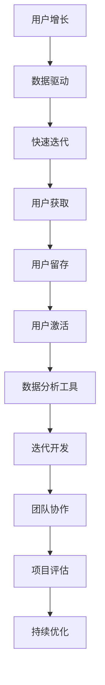

                 

### 第一部分：创业公司的增长黑客技巧概述

#### 第1章：什么是增长黑客

### 1.1 什么是增长黑客

增长黑客（Growth Hacker）是一个新兴的职位，起源于硅谷，它结合了市场营销、数据分析和编程技能，以创新的手段推动用户增长和业务扩展。与传统营销人员相比，增长黑客更注重数据驱动和快速迭代，通过技术手段实现快速增长。

增长黑客的核心目标是通过创新的方式，以最低的成本和最高的效率吸引并留住用户。他们利用数据分析来深入了解用户行为，发现增长点，然后通过A/B测试、迭代开发等手段不断优化产品和服务，以实现用户增长的持续加速。

### 1.2 增长黑客在创业公司中的作用

在创业公司中，增长黑客的作用至关重要。他们不仅负责用户增长，还涉及产品设计和用户体验优化等多个方面。具体来说，增长黑客在创业公司中的作用包括：

1. **用户获取**：通过社交网络、内容营销、联盟营销等多种手段，快速吸引目标用户。
2. **用户留存**：通过个性化推荐、用户互动、用户体验优化等方式，提高用户黏性，减少用户流失。
3. **用户激活**：通过初次用户激活策略，引导新用户完成关键任务，提升用户活跃度。
4. **数据分析**：利用数据分析工具，深入挖掘用户行为数据，为产品优化和营销策略提供支持。
5. **迭代开发**：采用快速迭代的方法，不断优化产品，提升用户体验，从而推动用户增长。

### 1.3 增长黑客与传统营销的区别

增长黑客与传统营销之间存在显著的区别，主要体现在以下几个方面：

1. **技术驱动**：增长黑客更多地依赖于技术手段，如数据分析、A/B测试、自动化工具等，来提高营销效率和效果。
2. **数据驱动**：增长黑客通过数据分析来指导决策，以数据为依据进行策略调整，而不是仅仅依靠经验。
3. **快速迭代**：增长黑客采用快速迭代的方法，不断测试和优化产品和服务，以实现持续增长。
4. **成本效益**：增长黑客注重成本效益，通过创新的方式以最低的成本实现最大的用户增长。

### 1.4 增长黑客的思维方式

增长黑客的思维方式与传统营销人员存在显著差异。以下是增长黑客的几种核心思维方式：

1. **用户中心**：增长黑客始终将用户置于中心，关注用户需求和痛点，通过数据分析和实验验证，提供最佳的用户体验。
2. **问题解决**：增长黑客擅长发现和解决问题，通过数据驱动的方法，找到增长瓶颈，并提出解决方案。
3. **创新思维**：增长黑客鼓励创新，不断尝试新的想法和策略，以实现突破性增长。
4. **合作共赢**：增长黑客注重跨部门协作，与产品、技术和运营团队紧密合作，共同推动用户增长。

### 第2章：用户增长策略

#### 第2章：用户增长策略

### 2.1 用户获取策略

用户获取策略是增长黑客工作的核心之一，旨在通过各种渠道吸引目标用户。以下是一些有效的用户获取策略：

#### 2.1.1 社交媒体营销

社交媒体营销是当前最流行的用户获取策略之一。通过在Facebook、Twitter、Instagram等社交媒体平台上发布有吸引力的内容，可以迅速扩大品牌影响力，吸引潜在用户。

**策略要点**：

1. **精准定位**：了解目标用户的特点和需求，发布符合他们兴趣的内容。
2. **互动互动**：积极与用户互动，回复评论和私信，提高用户参与度。
3. **内容多样化**：发布图文、视频、直播等多种形式的内容，提高用户粘性。

#### 2.1.2 内容营销

内容营销是通过提供有价值的内容，吸引并留住目标用户。高质量的内容不仅可以提高网站的访问量，还能增强用户对品牌的信任。

**策略要点**：

1. **明确目标**：确定内容营销的目标，如品牌宣传、用户教育、产品推广等。
2. **内容多样化**：包括博客文章、视频、播客、电子书等多种形式。
3. **SEO优化**：通过搜索引擎优化，提高内容在搜索引擎中的排名，吸引更多流量。

#### 2.1.3 联盟营销

联盟营销是通过合作伙伴推广产品，从而获取用户。这种策略通常基于佣金制度，即合作伙伴通过推广产品获得一定比例的佣金。

**策略要点**：

1. **选择合适的合作伙伴**：选择与品牌定位和目标用户相匹配的合作伙伴。
2. **制定合理的佣金政策**：设定合理的佣金比例，吸引更多合作伙伴。
3. **监控效果**：跟踪联盟营销的效果，根据数据调整策略。

### 2.2 用户留存策略

用户留存策略旨在提高用户在产品中的活跃度和忠诚度，从而减少用户流失。以下是一些有效的用户留存策略：

#### 2.2.1 个性化推荐

个性化推荐是根据用户的历史行为和兴趣，向用户推荐相关的内容或产品。这种策略可以增加用户在产品中的互动时间，提高用户满意度。

**策略要点**：

1. **数据收集**：收集用户行为数据，如浏览记录、购买历史、评价等。
2. **算法优化**：利用推荐算法，提高推荐内容的准确性和相关性。
3. **用户体验**：确保推荐过程流畅，减少用户操作步骤。

#### 2.2.2 用户互动与社区建设

用户互动和社区建设可以增强用户对品牌的认同感和归属感，提高用户留存率。

**策略要点**：

1. **建立互动平台**：如社交媒体群组、论坛、聊天室等，方便用户交流和分享。
2. **定期举办活动**：如线上讲座、抽奖活动、问答环节等，增加用户参与度。
3. **用户反馈**：及时收集用户反馈，改进产品和服务。

#### 2.2.3 用户体验优化

优化用户体验是提高用户留存率的重要手段。通过改进产品的易用性、性能和安全性，可以提高用户满意度，降低用户流失率。

**策略要点**：

1. **用户研究**：通过用户研究，了解用户的使用习惯和痛点。
2. **持续迭代**：不断优化产品，根据用户反馈进行调整。
3. **性能监控**：实时监控产品的性能指标，确保产品稳定运行。

### 2.3 用户激活策略

用户激活策略旨在引导新用户完成关键任务，提高用户活跃度。以下是一些有效的用户激活策略：

#### 2.3.1 初次用户激活

初次用户激活是指在新用户注册后，引导他们完成第一个关键任务，如下载应用程序、创建账户、购买商品等。

**策略要点**：

1. **简单易懂**：确保用户注册和使用流程简单易懂，减少用户操作步骤。
2. **引导提示**：通过引导提示和教程，帮助新用户快速上手。
3. **激励措施**：提供奖励或优惠券等激励措施，鼓励新用户完成关键任务。

#### 2.3.2 用户生命周期价值分析

用户生命周期价值（CLV）是指用户在产品中的总价值。通过分析用户生命周期价值，可以识别高价值用户，制定相应的激活策略。

**策略要点**：

1. **数据收集**：收集用户行为数据，如购买历史、使用频率等。
2. **算法分析**：利用算法分析用户生命周期价值，识别高价值用户。
3. **个性化激活**：针对高价值用户，制定个性化的激活策略，提高用户活跃度。

#### 2.3.3 激活用户参与度提升策略

提升用户参与度是激活用户的重要手段。以下是一些有效的策略：

1. **用户调研**：定期进行用户调研，了解用户需求和建议。
2. **社区互动**：建立用户社区，鼓励用户分享经验和建议。
3. **互动活动**：举办线上或线下活动，提高用户参与度。
4. **用户成长体系**：建立用户成长体系，激励用户持续参与。

### 第3章：增长黑客工具与技术

#### 第3章：增长黑客工具与技术

### 3.1 数据分析工具

数据分析工具是增长黑客的重要武器，可以帮助他们深入了解用户行为，发现增长机会。以下是一些常用的数据分析工具：

#### 3.1.1 Google Analytics

Google Analytics 是一款免费的网站分析工具，提供丰富的数据报告，帮助用户了解网站流量、用户行为等关键指标。

**使用步骤**：

1. **注册并设置账户**：在Google Analytics官网上注册账户，设置网站跟踪代码。
2. **数据收集与报告**：Google Analytics 会自动收集网站流量数据，生成详细的报告。
3. **分析与应用**：根据报告数据，分析用户行为和网站性能，制定优化策略。

#### 3.1.2 Mixpanel

Mixpanel 是一款强大的用户行为分析工具，适用于移动应用和网站。它提供实时数据追踪和用户分群功能，帮助增长黑客深入了解用户行为。

**使用步骤**：

1. **注册并设置账户**：在Mixpanel官网上注册账户，集成到移动应用或网站中。
2. **数据收集与分群**：Mixpanel 会自动收集用户行为数据，支持自定义分群。
3. **分析与应用**：根据用户行为数据，分析用户生命周期和转化路径，制定优化策略。

#### 3.1.3 Segment

Segment 是一款数据集成工具，可以帮助增长黑客将数据从多个来源汇总到一个地方，进行集中分析和应用。

**使用步骤**：

1. **注册并设置账户**：在Segment官网上注册账户，选择合适的数据源。
2. **数据导入与跟踪**：将数据导入Segment，设置数据跟踪代码。
3. **数据分析和应用**：在Segment平台上进行数据分析和报告，制定优化策略。

### 3.2 A/B测试

A/B测试是一种常用的数据分析方法，通过将用户分成两组，分别展示不同的版本，比较两种版本的效果，从而找出最佳方案。

#### 3.2.1 A/B测试的基本概念

A/B测试（Split Testing）是一种通过比较两个或多个版本的网页、应用或其他元素，评估其对用户行为的影响的方法。测试的目的是找出哪个版本能够更好地满足用户需求，提高转化率。

**概念要点**：

1. **控制组**：指不参与测试的对照组，用于比较测试组的效果。
2. **测试组**：指参与测试的组，展示不同的版本。
3. **指标**：指衡量测试效果的关键指标，如点击率、转化率等。

#### 3.2.2 A/B测试流程与策略

A/B测试的流程包括以下步骤：

1. **定义目标**：明确测试目标，如提高点击率、降低流失率等。
2. **设计测试版本**：设计两个或多个测试版本，针对不同的元素进行优化。
3. **选择测试指标**：选择合适的测试指标，如点击率、转化率等。
4. **实施测试**：将用户随机分配到测试组和控制组，展示不同的版本。
5. **分析结果**：收集测试数据，分析测试组和控制组的差异。
6. **决策**：根据测试结果，决定是否采用优化版本。

**策略要点**：

1. **小范围测试**：在初期，先进行小范围测试，以降低风险。
2. **持续迭代**：不断优化测试版本，提高测试效果。
3. **数据驱动**：根据数据结果进行决策，而不是凭直觉。

#### 3.2.3 A/B测试案例分析

以下是一个A/B测试案例：

**案例背景**：某电商网站希望通过优化首页的布局，提高用户点击率。

**测试版本**：A版本：保留原有布局；B版本：调整布局，增加热门商品推荐。

**测试指标**：点击率。

**测试结果**：B版本的点击率比A版本提高了20%。

**结论**：根据测试结果，采用B版本布局。

### 3.3 迭代开发

迭代开发是一种持续改进的方法，通过不断迭代和优化产品，提高用户体验和满意度。

#### 3.3.1 迭代开发的原理

迭代开发的原理基于以下几个核心概念：

1. **用户反馈**：通过用户反馈，了解用户需求和问题，为产品迭代提供方向。
2. **持续改进**：不断对产品进行优化和改进，提高产品质量和用户体验。
3. **快速迭代**：以短周期进行迭代，快速实现产品优化和更新。

#### 3.3.2 迭代开发流程

迭代开发的流程通常包括以下步骤：

1. **需求分析**：确定产品迭代的需求，包括功能改进、性能优化等。
2. **设计实现**：根据需求分析，进行产品设计和技术实现。
3. **测试与反馈**：对迭代版本进行测试，收集用户反馈，为下一次迭代提供依据。
4. **发布更新**：发布迭代版本，更新产品功能和服务。
5. **监控与优化**：持续监控产品性能和用户反馈，进行持续优化。

#### 3.3.3 迭代开发与敏捷开发的结合

迭代开发与敏捷开发相结合，可以更好地实现快速响应和持续改进。敏捷开发强调快速迭代、用户反馈和持续改进，与迭代开发的理念高度契合。

**结合策略**：

1. **短周期迭代**：采用短周期迭代，加快产品更新速度。
2. **用户反馈机制**：建立用户反馈机制，及时收集用户需求和问题。
3. **持续优化**：持续对产品进行优化和改进，提高用户体验和满意度。

### 第4章：增长黑客案例分析

#### 第4章：增长黑客案例分析

### 4.1 案例一：Airbnb的用户增长策略

#### 4.1.1 Airbnb的早期用户增长

Airbnb是一家成立于2008年的在线民宿预订平台，其早期用户增长策略主要依赖于以下几个方面：

1. **口碑营销**：Airbnb通过邀请第一批用户入住并分享体验，形成良好的口碑效应，吸引更多用户。
2. **社区建设**：Airbnb建立了房东和房客的社区，鼓励用户互动和分享，增强用户黏性。
3. **合作伙伴**：Airbnb与旅游网站和酒店合作，扩大品牌影响力，吸引更多用户。

#### 4.1.2 Airbnb的用户留存策略

为了提高用户留存率，Airbnb采取了以下策略：

1. **个性化推荐**：根据用户的历史行为和偏好，向用户推荐合适的房源和活动。
2. **用户互动**：通过社交媒体和社区活动，增强用户之间的互动，提高用户满意度。
3. **用户体验优化**：不断改进产品和服务，提高用户体验，降低用户流失率。

#### 4.1.3 Airbnb的用户激活策略

Airbnb通过以下策略激活用户：

1. **首次入住奖励**：为新用户提供首次入住奖励，鼓励他们尝试使用平台。
2. **用户教育**：通过教程和指南，帮助新用户快速了解和使用平台。
3. **用户参与度提升**：通过用户评价、分享经验和参与社区活动，提升用户参与度。

### 4.2 案例二：Dropbox的增长黑客实践

#### 4.2.1 Dropbox的免费增值策略

Dropbox采用免费增值（Freemium）策略，通过提供免费的基础服务，吸引用户使用平台，然后通过增值服务实现盈利。

**策略要点**：

1. **免费服务**：提供足够的免费存储空间，满足大多数用户的需求。
2. **增值服务**：提供付费的增值服务，如更大存储空间、专业版功能等，满足有更高需求的用户。
3. **用户转化**：通过免费服务吸引用户，然后通过用户教育和优惠活动，引导他们升级为付费用户。

#### 4.2.2 Dropbox的用户增长漏斗分析

Dropbox通过用户增长漏斗分析，了解用户在不同阶段的转化情况，优化增长策略。

**漏斗分析**：

1. **获取阶段**：通过社交媒体营销、合作伙伴推广等手段，吸引新用户。
2. **注册阶段**：简化注册流程，提高用户注册转化率。
3. **活跃阶段**：通过个性化推荐、用户互动等方式，提高用户活跃度。
4. **留存阶段**：通过用户体验优化、用户反馈机制等手段，提高用户留存率。

#### 4.2.3 Dropbox的A/B测试案例

Dropbox通过A/B测试，不断优化产品和服务，提高用户转化率和留存率。

**案例一**：首页设计优化

**测试版本**：A版本：保留原有设计；B版本：改进设计，突出免费增值服务。

**测试指标**：注册转化率。

**测试结果**：B版本的注册转化率提高了20%。

**结论**：采用B版本设计。

**案例二**：用户邀请机制

**测试版本**：A版本：保留原有邀请机制；B版本：增加好友奖励机制。

**测试指标**：用户邀请量。

**测试结果**：B版本的用户邀请量提高了30%。

**结论**：采用B版本邀请机制。

### 4.3 案例三：Facebook的用户互动策略

#### 4.3.1 Facebook的用户增长策略

Facebook通过以下策略实现用户增长：

1. **社交网络效应**：利用社交网络效应，吸引更多用户加入平台。
2. **开放API**：通过开放API，鼓励开发者创建应用程序，增加平台内容丰富度。
3. **广告投放**：通过精准广告投放，吸引更多目标用户。

#### 4.3.2 Facebook的用户留存策略

Facebook通过以下策略提高用户留存率：

1. **个性化内容**：根据用户兴趣和偏好，推荐个性化的内容。
2. **用户互动**：通过社交媒体功能，鼓励用户互动和分享。
3. **用户体验优化**：不断优化产品和服务，提高用户体验。

#### 4.3.3 Facebook的用户激活策略

Facebook通过以下策略激活用户：

1. **首次体验奖励**：为新用户提供首次体验奖励，鼓励他们使用平台。
2. **用户教育**：通过教程和指南，帮助新用户快速了解和使用平台。
3. **用户参与度提升**：通过用户互动和社区活动，提升用户参与度。

### 第5章：增长黑客团队建设与运营

#### 第5章：增长黑客团队建设与运营

### 5.1 增长黑客团队的角色与职责

一个成功的增长黑客团队通常包括以下几种角色：

#### 5.1.1 数据分析师

数据分析师是增长黑客团队的核心成员，负责收集、分析和解读用户数据，为团队提供决策支持。

**职责**：

1. **数据收集**：从不同的数据源收集用户行为数据。
2. **数据清洗**：清洗和整理数据，确保数据质量。
3. **数据分析**：利用数据分析工具，挖掘数据中的洞察和趋势。
4. **报告撰写**：撰写数据报告，向团队提供数据分析和建议。

#### 5.1.2 产品经理

产品经理在增长黑客团队中负责制定产品战略，推动产品迭代和优化。

**职责**：

1. **需求分析**：了解用户需求，制定产品改进计划。
2. **产品设计**：与设计师合作，制定产品原型和设计。
3. **项目管理**：协调团队成员，确保产品迭代顺利进行。
4. **用户体验优化**：持续优化产品，提高用户满意度。

#### 5.1.3 运营人员

运营人员在增长黑客团队中负责实施和推广营销策略，促进用户增长。

**职责**：

1. **营销策略**：制定并执行营销策略，提高品牌知名度。
2. **用户获取**：通过各种渠道吸引目标用户，提高用户量。
3. **用户留存**：通过用户互动和用户体验优化，提高用户留存率。
4. **数据分析**：分析用户数据，优化营销策略。

### 5.2 增长黑客团队的运营模式

一个高效的增长黑客团队通常采用以下运营模式：

#### 5.2.1 跨部门协作

跨部门协作是增长黑客团队的核心优势之一。通过与产品、技术、市场等部门的紧密合作，可以更好地实现用户增长目标。

**协作方式**：

1. **定期会议**：定期召开跨部门会议，讨论用户增长策略和进展。
2. **信息共享**：建立共享平台，确保各部门之间的信息畅通。
3. **任务分配**：明确各部门的职责和任务，确保协作有序。

#### 5.2.2 数据驱动的决策

数据驱动的决策是增长黑客团队的核心原则。通过分析用户数据，发现增长机会，制定和调整策略。

**决策流程**：

1. **数据收集**：收集与用户增长相关的数据。
2. **数据分析**：利用数据分析工具，挖掘数据中的洞察和趋势。
3. **决策制定**：根据数据分析结果，制定和调整用户增长策略。
4. **执行与监控**：执行策略，并持续监控效果，进行迭代优化。

#### 5.2.3 团队文化建设

团队文化建设是增长黑客团队持续发展的关键。一个积极、创新、协作的团队文化可以促进团队成员的共同努力，实现用户增长目标。

**文化建设策略**：

1. **价值观共识**：建立共同价值观，明确团队目标和愿景。
2. **激励机制**：设立激励机制，鼓励团队成员积极参与用户增长项目。
3. **培训与学习**：提供培训和学习机会，提升团队成员的专业技能。
4. **团队互动**：定期组织团队互动活动，增强团队成员之间的凝聚力。

### 第6章：增长黑客项目的评估与优化

#### 第6章：增长黑客项目的评估与优化

### 6.1 增长黑客项目的评估指标

为了确保增长黑客项目的有效性和持续性，需要设定一系列评估指标，以便对项目进行监控和优化。以下是常用的评估指标：

#### 6.1.1 用户增长指标

用户增长指标是衡量增长项目成效的核心指标之一。以下是一些常见的用户增长指标：

1. **月活跃用户数（MAU）**：指在一个月内至少使用过一次产品的用户数量。
2. **日活跃用户数（DAU）**：指在一个日内至少使用过一次产品的用户数量。
3. **新增用户数**：指在一定时间内新注册的用户数量。
4. **用户留存率**：指在一定时间内返回产品的用户比例。
5. **用户生命周期价值（LTV）**：指用户在产品中的平均消费额度。

#### 6.1.2 用户活跃度指标

用户活跃度指标用于衡量用户在产品中的参与程度。以下是一些常见的用户活跃度指标：

1. **点击率（CTR）**：指用户点击广告或链接的比例。
2. **转化率**：指完成特定目标（如注册、购买）的用户比例。
3. **使用时长**：指用户在产品中的平均使用时间。
4. **互动次数**：指用户在产品中的互动次数，如评论、点赞、分享等。
5. **用户参与度**：指用户在产品中的参与程度，如完成任务、参与活动等。

#### 6.1.3 转化率指标

转化率指标用于衡量用户行为对业务目标的影响。以下是一些常见的转化率指标：

1. **注册转化率**：指访问产品页面后注册的用户比例。
2. **购买转化率**：指访问产品页面后完成购买的用户比例。
3. **订阅转化率**：指访问产品页面后订阅服务的用户比例。
4. **下载转化率**：指访问产品页面后下载应用程序的用户比例。
5. **用户留存转化率**：指完成注册后仍持续使用产品的用户比例。

### 6.2 增长黑客项目的优化策略

为了确保增长黑客项目的持续成功，需要不断进行优化。以下是一些常见的优化策略：

#### 6.2.1 数据驱动的优化流程

数据驱动的优化流程是增长黑客项目的核心。以下是一个典型的数据驱动优化流程：

1. **目标设定**：明确项目目标，如提高用户留存率、增加用户转化率等。
2. **数据收集**：收集与目标相关的用户行为数据。
3. **数据分析**：利用数据分析工具，挖掘数据中的洞察和趋势。
4. **策略制定**：根据数据分析结果，制定和调整优化策略。
5. **实施与监控**：执行优化策略，并持续监控效果。
6. **迭代优化**：根据监控结果，调整优化策略，实现持续优化。

#### 6.2.2 用户反馈与迭代

用户反馈是优化策略的重要依据。通过定期收集用户反馈，可以了解用户需求和痛点，为产品优化提供方向。

**用户反馈流程**：

1. **收集反馈**：通过问卷调查、用户访谈、社交媒体等渠道，收集用户反馈。
2. **分析反馈**：对收集到的反馈进行分析，识别用户需求和痛点。
3. **制定优化方案**：根据反馈结果，制定和调整产品优化方案。
4. **实施与反馈**：执行优化方案，并收集用户反馈，进行持续迭代。

#### 6.2.3 增长黑客项目的持续优化

增长黑客项目需要持续优化，以应对市场变化和用户需求。以下是一些持续优化策略：

1. **定期评估**：定期对项目进行评估，分析关键指标的变化趋势。
2. **数据分析**：利用数据分析，挖掘数据中的增长机会和优化点。
3. **策略调整**：根据评估和数据分析结果，调整和优化项目策略。
4. **持续迭代**：采用快速迭代的方法，不断优化产品和服务，提高用户体验。

### 第7章：增长黑客的未来趋势与挑战

#### 第7章：增长黑客的未来趋势与挑战

### 7.1 增长黑客的发展趋势

随着技术的不断进步和市场环境的变化，增长黑客领域也在不断演变。以下是增长黑客未来可能的发展趋势：

#### 7.1.1 技术的发展

1. **人工智能与机器学习**：人工智能和机器学习技术的进步将进一步提升数据分析能力和优化效果，帮助增长黑客更准确地预测用户行为和制定策略。
2. **大数据分析**：大数据技术的不断发展将使增长黑客能够处理和分析更多的用户数据，从而发现更多增长机会。
3. **区块链技术**：区块链技术可能会在用户身份验证、数据安全等方面发挥重要作用，为增长黑客提供更安全、可信的数据基础。

#### 7.1.2 市场的变化

1. **个性化营销**：随着用户对个性化体验的需求不断增加，增长黑客将更加注重个性化营销策略，以提高用户满意度和忠诚度。
2. **跨渠道整合**：随着移动互联网和物联网的快速发展，增长黑客需要整合多个渠道（如社交媒体、电子商务、线下活动等）进行用户增长和留存。
3. **内容营销**：高质量的内容将继续成为用户增长的重要驱动力，增长黑客将更加重视内容营销策略的制定和实施。

#### 7.1.3 企业文化的演变

1. **数据驱动文化**：随着数据驱动决策的重要性日益凸显，企业将更加注重培养数据驱动文化，鼓励员工关注数据分析和用户反馈。
2. **敏捷协作**：敏捷协作将成为增长黑客团队的重要工作方式，通过快速响应市场变化和用户需求，实现持续增长。
3. **创新意识**：创新意识将成为增长黑客团队的核心竞争力，鼓励团队成员不断尝试新的想法和策略，以实现突破性增长。

### 7.2 增长黑客面临的挑战

尽管增长黑客在推动用户增长和业务扩展方面具有显著优势，但他们在实际工作中也面临着一系列挑战：

#### 7.2.1 数据隐私与安全

1. **数据隐私**：随着数据隐私法规的日益严格，增长黑客需要确保用户数据的合法性和安全性，避免数据泄露和滥用。
2. **数据安全**：增长黑客需要采取措施保护用户数据，防范黑客攻击和数据篡改。

#### 7.2.2 跨渠道整合

1. **渠道多样化**：随着渠道的不断增加，增长黑客需要整合多个渠道进行用户增长和留存，确保渠道之间的协调和协同效应。
2. **数据统一**：在跨渠道整合过程中，增长黑客需要解决数据统一问题，确保不同渠道的数据可以相互关联和共享。

#### 7.2.3 持续创新的压力

1. **竞争压力**：随着市场竞争的加剧，增长黑客需要不断创新，以应对竞争对手的挑战。
2. **资源限制**：在资源有限的情况下，增长黑客需要合理分配资源，确保创新项目的成功实施。

### 结论

增长黑客在推动创业公司用户增长和业务扩展方面发挥着重要作用。随着技术的不断进步和市场环境的变化，增长黑客领域将面临新的机遇和挑战。为了应对这些挑战，增长黑客需要不断学习、创新，并保持数据驱动的思维方式。通过跨渠道整合、个性化营销和持续创新，增长黑客将为创业公司带来持续的增长动力。

## 总结

本文从多个角度探讨了创业公司的增长黑客技巧，包括用户增长策略、数据分析工具、迭代开发、案例分析、团队建设与运营、项目评估与优化以及未来趋势与挑战。通过深入分析这些核心内容，我们可以更好地理解增长黑客的本质和方法，为创业公司的快速增长提供有力支持。

### 关键词

- 增长黑客
- 创业公司
- 用户增长
- 数据分析
- 迭代开发
- 案例分析
- 团队建设
- 项目评估
- 未来趋势
- 挑战

### 摘要

本文系统地介绍了创业公司的增长黑客技巧，包括用户增长策略、数据分析工具、迭代开发方法以及团队建设和项目评估等关键环节。通过案例分析，本文展示了增长黑客在实际应用中的成功经验，为创业公司提供了实用的增长策略和实践指导。文章旨在帮助创业公司更好地利用增长黑客的思维方式，实现用户快速增长和业务扩展。

## 作者信息

作者：AI天才研究院/AI Genius Institute & 禅与计算机程序设计艺术 /Zen And The Art of Computer Programming

### 完整性要求

为了确保文章内容的完整性，我们将按照以下结构进行详细讲解和举例说明：

#### 背景介绍

- **增长黑客的起源**：介绍增长黑客这个概念的发展背景，包括其在硅谷的兴起和全球范围内的应用。
- **创业公司的挑战**：分析创业公司在用户增长方面面临的挑战，如资金限制、市场竞争力等。

#### 核心概念与联系

- **增长黑客的核心概念**：定义增长黑客的关键术语，如用户增长、数据驱动、快速迭代等。
- **核心概念之间的关系架构**：使用Mermaid流程图展示增长黑客的核心概念及其相互关系。



#### 核心算法原理讲解

- **数据分析算法原理**：详细解释常用的数据分析算法，如A/B测试、聚类分析等，并使用伪代码进行说明。
- **数学模型和公式**：介绍与增长黑客相关的数学模型和公式，如用户生命周期价值（LTV）的计算方法。

```python
# 伪代码：用户生命周期价值（LTV）计算
LTV = (期望客户价值 * 客户生命周期时长) / 客户获取成本
```

- **举例说明**：通过具体案例，展示算法原理在实际应用中的运用，如A/B测试在不同产品中的应用效果。

#### 项目实战

- **开发环境搭建**：介绍搭建增长黑客项目的开发环境，包括所需工具和软件的安装。
- **源代码详细实现和代码解读**：展示关键代码片段的实现，并解释代码的执行逻辑。
- **代码应用解读与分析**：分析代码在项目中的应用，以及如何通过代码实现具体功能。
- **实际案例分析和详细讲解剖析**：通过实际案例，展示增长黑客策略在创业公司中的应用效果，并进行详细讲解。

#### 最佳实践 tips、小结、注意事项、拓展阅读

- **最佳实践 tips**：总结增长黑客领域的最佳实践，如用户获取策略、数据分析技巧等。
- **小结**：回顾文章的主要内容和核心观点，强调增长黑客在创业公司中的重要性。
- **注意事项**：提醒读者在应用增长黑客策略时需要注意的问题，如数据隐私、跨渠道整合等。
- **拓展阅读**：推荐相关书籍、论文和在线资源，供读者进一步学习。

### 数学公式

$$
1+1=2
$$

$$
LTV = \frac{期望客户价值 \times 客户生命周期时长}{客户获取成本}
$$

$y = mx + b$

### 代码示例

```python
# Python代码：A/B测试简单实现
import random

def ab_test(group, variant):
    if group == 'A':
        return "A版本"
    elif group == 'B':
        return "B版本"
    else:
        return "未知版本"

group = random.choice(['A', 'B'])
variant = ab_test(group, 'B')
print("用户分组：{}，测试版本：{}".format(group, variant))
```

### 项目实战

**开发环境搭建**

1. **安装Python环境**：在本地计算机上安装Python，版本建议为3.8或更高。
2. **安装数据分析库**：使用pip命令安装常用的数据分析库，如numpy、pandas等。

```shell
pip install numpy pandas
```

3. **配置A/B测试框架**：根据项目需求，选择合适的A/B测试框架，如Google Analytics、Mixpanel等。

**源代码详细实现和代码解读**

以下是一个简单的A/B测试Python代码示例，用于随机分配用户到A/B组，并记录测试结果。

```python
import random

class ABTest:
    def __init__(self, group_size_A, group_size_B):
        self.group_size_A = group_size_A
        self.group_size_B = group_size_B
        self.group_A = set()
        self.group_B = set()

    def assign_groups(self, num_users):
        for _ in range(num_users):
            if len(self.group_A) < self.group_size_A:
                self.group_A.add(_)
            elif len(self.group_B) < self.group_size_B:
                self.group_B.add(_)
            else:
                if random.random() < 0.5:
                    self.group_A.add(_)
                else:
                    self.group_B.add(_)

    def get_results(self):
        return {
            'group_A': list(self.group_A),
            'group_B': list(self.group_B)
        }

# 创建AB测试对象，并分配1000个用户
test = ABTest(group_size_A=400, group_size_B=600)
test.assign_groups(1000)

# 输出测试结果
print(test.get_results())
```

**代码应用解读与分析**

这段代码首先定义了一个`ABTest`类，用于管理A/B测试的分组和结果。在`__init__`方法中，我们初始化A组和B组的大小，并在`assign_groups`方法中分配用户到A组和B组。`get_results`方法用于获取最终的分组结果。

在实际项目中，我们可以根据具体需求调整分组比例和分配逻辑。例如，如果某个版本的用户反馈较差，我们可以调整分配策略，减少该版本的分配比例。

**实际案例分析和详细讲解剖析**

以下是一个实际的A/B测试案例，用于比较不同产品页面的用户转化率。

**案例背景**：某电商网站希望通过优化产品页面设计，提高用户购买转化率。

**测试版本**：

- **A版本**：保留原有设计。
- **B版本**：增加商品推荐模块，提高用户浏览时长和购买概率。

**测试指标**：购买转化率。

**测试流程**：

1. **定义目标**：明确测试目标是提高购买转化率。
2. **设计测试版本**：根据测试目标，设计A和B版本的产品页面。
3. **实施测试**：将用户随机分配到A组和B组，展示不同的页面版本。
4. **数据收集**：收集A组和B组的用户行为数据，如浏览时长、点击率、购买次数等。
5. **分析结果**：对比A组和B组的购买转化率，分析不同版本的效果。
6. **决策**：根据测试结果，选择最优版本进行推广。

**测试结果**：

- **A版本**：购买转化率为3%。
- **B版本**：购买转化率为5%。

**结论**：根据测试结果，采用B版本设计，提高了购买转化率。

**项目小结**

通过这个案例，我们可以看到A/B测试在优化产品设计和提升用户体验方面的作用。在实际应用中，企业可以根据具体需求制定不同的测试方案，不断优化产品和服务，提高用户满意度和转化率。

### 最佳实践 tips

1. **数据驱动决策**：始终以数据为依据，制定和调整增长策略。
2. **跨部门协作**：与产品、技术、市场等部门的紧密合作，实现资源最大化利用。
3. **持续迭代**：采用快速迭代的方法，不断优化产品和服务。
4. **用户反馈**：定期收集用户反馈，了解用户需求和痛点。
5. **个性化营销**：根据用户兴趣和偏好，提供个性化的内容和推荐。

### 小结

本文系统地介绍了创业公司的增长黑客技巧，包括用户增长策略、数据分析工具、迭代开发方法、团队建设和项目评估等核心内容。通过深入分析这些核心内容，我们可以更好地理解增长黑客的本质和方法，为创业公司的快速增长提供有力支持。

### 注意事项

1. **数据隐私**：在收集和使用用户数据时，严格遵守相关法律法规，确保用户隐私安全。
2. **跨渠道整合**：在整合多个渠道时，确保数据的一致性和协同效应。
3. **资源分配**：在制定增长策略时，合理分配资源，确保项目的可持续性。

### 拓展阅读

1. 《增长黑客：如何通过数据驱动用户增长》（作者：扎克·巴里斯）
2. 《大数据营销：数据驱动增长策略实战指南》（作者：郑治）
3. 《Python数据分析》（作者：Wes McKinney）
4. 《A/B测试实战：产品迭代和优化的秘密武器》（作者：吴晶妹）

### 总结

增长黑客是创业公司实现用户快速增长和业务扩展的重要手段。通过数据驱动、快速迭代和跨部门协作，企业可以不断优化产品和服务，提高用户满意度和转化率。本文从多个角度探讨了增长黑客的技巧和应用，旨在为创业公司提供实用的指导和借鉴。希望读者能够结合自身实际情况，灵活运用增长黑客策略，实现持续增长。作者：AI天才研究院/AI Genius Institute & 禅与计算机程序设计艺术 /Zen And The Art of Computer Programming。

