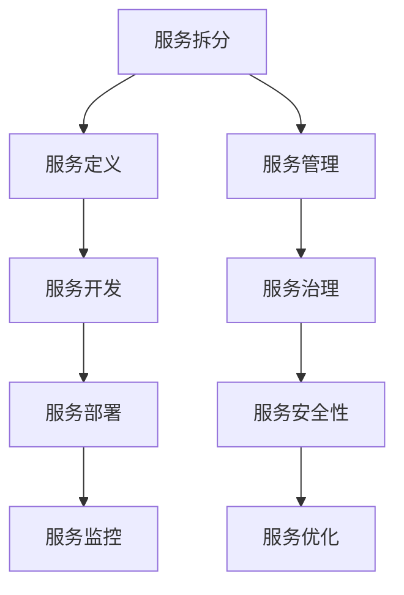

                 


## 文章标题：创业公司的微服务架构应用：如何实现系统的模块化与解耦

### 关键词：
- 微服务架构
- 系统模块化
- 解耦机制
- 创业公司
- 性能优化
- 安全性

### 摘要：
本文旨在探讨微服务架构在创业公司中的应用，以及如何通过模块化与解耦机制实现系统的稳定性和灵活性。我们将详细分析微服务架构的基础知识，设计原则，开发与部署策略，并在实践中运用这些原则，探讨创业公司的业务特点与需求，系统模块化与解耦的最佳实践，以及微服务架构下的安全性、持续集成与持续部署。最后，我们还将探讨微服务架构的未来趋势与挑战，帮助创业公司制定有效的微服务架构战略规划。

---

## 第一部分：微服务架构基础

### 第1章：微服务架构概述

#### 1.1 微服务架构的定义与特点

微服务架构是一种设计思想，它将应用程序划分为一组小而独立的、可自我管理和可扩展的服务，每个服务负责完成特定的功能。微服务架构具有以下特点：

- **服务独立性**：每个服务都可以独立部署、扩展和更新，不会影响其他服务。
- **去中心化**：没有单一的服务器或服务管理器，所有服务都是平等的。
- **轻量级通信**：服务之间通常通过轻量级的HTTP/HTTPS进行通信。
- **自治**：每个服务都有自己的数据存储、数据库和配置。
- **容错性**：服务可以独立处理故障，不会影响整个系统。

#### 1.2 微服务架构与传统架构的比较

传统架构通常是单体应用，所有功能都集成在一个庞大的系统中。相比之下，微服务架构具有以下优势：

- **灵活性和可扩展性**：可以独立扩展和更新特定服务，而不会影响其他服务。
- **故障隔离**：服务之间的故障不会传播到整个系统。
- **持续交付**：支持更快的迭代和部署，提高了开发效率。
- **技术多样性**：服务可以使用不同的编程语言和技术栈，提高了技术选择的灵活性。

#### 1.3 微服务架构的优缺点分析

**优点**：

- **灵活性和可扩展性**：支持灵活的架构，可以独立扩展和更新。
- **故障隔离**：服务之间的故障不会影响整个系统。
- **技术多样性**：可以使用不同的编程语言和技术栈。
- **持续交付**：支持更快的迭代和部署。

**缺点**：

- **复杂度增加**：服务之间的依赖关系增加了系统的复杂性。
- **分布式事务处理**：需要额外的努力来管理分布式事务。
- **监控和调试**：分布式系统监控和调试更具挑战性。

### 第2章：微服务架构设计

#### 2.1 微服务架构的设计原则

微服务架构的设计原则包括：

- **服务自治**：每个服务应该具有独立的业务逻辑和数据存储。
- **单一职责**：每个服务应该专注于实现特定的业务功能。
- **小而独立**：服务应该足够小，以便可以独立部署和扩展。
- **高内聚，低耦合**：服务之间应该有明确的接口，但内部耦合度要低。

#### 2.2 微服务架构的设计模式

微服务架构中常用的设计模式包括：

- **基于事件的架构**：服务通过消息队列进行通信，提高了系统的异步性和弹性。
- **无状态服务**：服务不存储状态，提高了系统的可扩展性和可靠性。
- **服务发现**：服务可以通过服务注册表来发现其他服务，提高了系统的动态性。

#### 2.3 微服务架构的技术选型

选择微服务架构时，需要考虑以下技术选型：

- **编程语言**：选择与团队技能匹配的编程语言。
- **服务框架**：如Spring Boot、Spring Cloud等，提供了丰富的服务管理和通信功能。
- **服务注册与发现**：如Eureka、Consul等，提供了服务注册和发现机制。
- **消息队列**：如Kafka、RabbitMQ等，提供了异步通信和消息传递功能。
- **服务网关**：如Zuul、Spring Cloud Gateway等，提供了统一的服务管理和路由功能。

### 第3章：微服务的开发与部署

#### 3.1 微服务开发工具与框架

微服务的开发需要使用合适的工具和框架，如：

- **Spring Boot**：提供了快速构建独立的、生产级的微服务应用程序的能力。
- **Spring Cloud**：提供了一系列的微服务开发工具，如服务注册与发现、负载均衡、配置管理、断路器等。
- **Docker**：提供了容器化服务，使得微服务的部署和迁移更加方便。
- **Kubernetes**：提供了容器编排和管理功能，提高了微服务的可扩展性和可靠性。

#### 3.2 微服务部署策略与最佳实践

微服务的部署策略包括：

- **容器化**：使用Docker将服务打包成容器，提高了部署的便捷性和一致性。
- **自动化部署**：使用CI/CD流水线实现自动化部署，提高了开发效率。
- **蓝绿部署**：部署新版本的服务，同时保持旧版本的服务运行，逐步切换流量。
- **灰度发布**：逐步将流量切换到新版本的服务，确保新版本的服务稳定运行。

#### 3.3 微服务监控与性能优化

微服务的监控和性能优化包括：

- **服务监控**：使用Prometheus、Grafana等工具监控服务的运行状态和性能指标。
- **日志管理**：使用ELK（Elasticsearch、Logstash、Kibana）等工具收集、存储和分析日志。
- **性能测试**：使用JMeter、Gatling等工具进行性能测试，评估系统的性能瓶颈。
- **性能优化**：根据性能测试结果，对系统进行优化，如缓存策略、数据库优化等。

## 第二部分：微服务应用实践

### 第4章：微服务架构在创业公司中的应用

#### 4.1 创业公司的业务特点与需求

创业公司通常具有以下业务特点与需求：

- **快速迭代**：创业公司需要快速响应市场变化，快速迭代产品。
- **高可扩展性**：创业公司需要能够轻松扩展服务，应对用户量的增长。
- **成本控制**：创业公司需要控制成本，优化资源利用。
- **用户体验**：创业公司注重用户体验，需要提供高质量的软件产品。

#### 4.2 微服务架构在创业公司中的实践案例

以某电商创业公司为例，该公司采用了微服务架构，具体实践如下：

1. **服务拆分**：将电商系统拆分为用户服务、商品服务、订单服务、支付服务等独立的服务。
2. **服务开发**：使用Spring Boot、Spring Cloud等框架开发服务，并使用Docker容器化。
3. **服务部署**：使用Kubernetes进行容器编排和管理，实现自动化部署和扩展。
4. **服务监控**：使用Prometheus、Grafana等工具监控服务的运行状态和性能指标。
5. **日志管理**：使用ELK工具收集、存储和分析日志。

#### 4.3 微服务架构在创业公司的实施策略

创业公司实施微服务架构的策略包括：

1. **逐步迁移**：逐步将单体应用迁移到微服务架构，避免一次性迁移带来的风险。
2. **团队协作**：加强团队协作，确保微服务架构的实施顺利进行。
3. **持续集成与持续部署**：建立CI/CD流水线，实现自动化部署和快速迭代。
4. **培训与支持**：为团队成员提供培训和支持，确保他们能够熟练掌握微服务架构。
5. **监控与优化**：持续监控系统的性能和稳定性，及时优化和调整。

### 第5章：微服务架构的系统模块化与解耦

#### 5.1 系统模块化的概念与原则

系统模块化是将系统划分为多个独立的模块，每个模块负责特定的功能，模块之间通过接口进行通信。模块化的原则包括：

- **高内聚，低耦合**：模块内部高度集中，模块之间松散耦合。
- **单一职责**：每个模块只完成单一的功能。
- **模块独立性**：模块可以独立开发、测试和部署。
- **接口标准化**：模块之间的接口标准化，确保模块之间的互操作性。

#### 5.2 微服务架构中的解耦机制

微服务架构中的解耦机制包括：

- **服务间通信**：使用轻量级通信协议，如HTTP/HTTPS，减少服务之间的耦合。
- **消息队列**：使用消息队列进行异步通信，降低服务之间的耦合度。
- **服务发现**：使用服务发现机制，降低服务之间的依赖关系。
- **配置管理**：使用配置管理工具，如Spring Cloud Config，实现配置的动态管理和更新。

#### 5.3 模块化与解耦的最佳实践

模块化与解耦的最佳实践包括：

- **微服务拆分**：根据业务功能和服务间依赖关系进行服务拆分。
- **服务自治**：确保每个服务具有独立的业务逻辑和数据存储。
- **接口标准化**：使用RESTful API或gRPC等标准接口协议。
- **异步通信**：使用消息队列进行异步通信，降低系统复杂性。
- **配置管理**：使用配置管理工具实现配置的动态管理和更新。
- **服务监控**：对每个服务进行监控，确保系统的稳定性和性能。

### 第6章：微服务架构下的安全性

#### 6.1 微服务架构的安全性挑战

微服务架构下的安全性挑战包括：

- **服务间认证与授权**：需要确保服务之间的安全通信和访问控制。
- **数据安全**：保护数据在传输和存储过程中的安全。
- **分布式攻击**：防范分布式拒绝服务攻击（DDoS）等攻击手段。
- **服务暴露**：减少服务的暴露面，避免不必要的风险。

#### 6.2 微服务架构的安全策略

微服务架构的安全策略包括：

- **服务认证与授权**：使用JWT、OAuth等协议进行服务认证和授权。
- **数据加密**：使用SSL/TLS等协议加密数据传输。
- **访问控制**：使用ACL、RBAC等机制实现细粒度的访问控制。
- **安全监控**：使用安全信息和事件管理（SIEM）系统监控安全事件。
- **漏洞管理**：定期进行安全审计和漏洞扫描，及时修复安全漏洞。

#### 6.3 安全性实践案例与经验分享

以某电商创业公司为例，该公司在微服务架构下实施以下安全性实践：

1. **服务认证与授权**：使用Spring Security OAuth 2.0进行服务认证和授权。
2. **数据加密**：使用SSL/TLS加密数据传输。
3. **访问控制**：使用Spring Security ACL实现细粒度的访问控制。
4. **安全监控**：使用ELK系统监控安全事件，并及时响应。
5. **漏洞管理**：定期进行安全审计和漏洞扫描，及时修复安全漏洞。

### 第7章：微服务架构的持续集成与持续部署

#### 7.1 持续集成与持续部署的概念

持续集成（CI）和持续部署（CD）是软件开发过程中的重要实践：

- **持续集成**：将代码更改自动合并到主分支，并执行自动化测试，确保代码质量。
- **持续部署**：自动将通过测试的代码部署到生产环境，确保快速交付。

#### 7.2 微服务架构下的持续集成与持续部署实践

在微服务架构下，持续集成与持续部署的实践包括：

- **自动化构建**：使用Jenkins、GitLab CI等工具自动化构建服务。
- **自动化测试**：使用Selenium、JUnit等工具执行自动化测试。
- **容器镜像管理**：使用Docker Hub、Harbor等工具管理容器镜像。
- **自动化部署**：使用Kubernetes、Ansible等工具自动化部署服务。
- **监控与反馈**：使用Prometheus、Grafana等工具监控部署过程和系统状态，并及时反馈。

#### 7.3 持续集成与持续部署工具与最佳实践

持续集成与持续部署的工具与最佳实践包括：

- **自动化测试**：确保代码更改不会引入新的缺陷。
- **容器化**：提高服务的可移植性和一致性。
- **蓝绿部署**：逐步切换流量，降低风险。
- **灰度发布**：逐步引入新版本，确保系统稳定性。
- **监控与反馈**：及时发现问题并采取行动。

### 第8章：微服务架构的生态系统

#### 8.1 微服务架构的生态系统概述

微服务架构的生态系统包括：

- **服务框架**：如Spring Boot、Spring Cloud等。
- **服务注册与发现**：如Eureka、Consul等。
- **消息队列**：如Kafka、RabbitMQ等。
- **服务网关**：如Zuul、Spring Cloud Gateway等。
- **监控与日志管理**：如Prometheus、Grafana、ELK等。
- **容器编排与管理**：如Kubernetes、Docker Swarm等。

#### 8.2 微服务架构下的开源工具与平台

微服务架构下的开源工具与平台包括：

- **Spring Cloud**：由Spring Boot社区推出的微服务框架。
- **Kubernetes**：开源的容器编排与管理平台。
- **Docker**：开源的容器化平台。
- **Eureka**：服务注册与发现组件。
- **RabbitMQ**：开源的消息队列。
- **Kafka**：开源的消息队列。

#### 8.3 微服务架构的生态系统发展趋势

微服务架构的生态系统发展趋势包括：

- **容器化与编排**：容器化技术将继续发展，Kubernetes等编排工具将成为主流。
- **服务网格**：服务网格技术如Istio、Linkerd等将逐渐普及。
- **云原生**：微服务架构将逐渐向云原生方向演进。
- **智能化**：结合人工智能技术，实现更智能的服务管理和优化。

### 第9章：微服务架构的未来

#### 9.1 微服务架构的发展趋势

微服务架构的发展趋势包括：

- **云原生**：微服务架构将逐渐向云原生方向演进，利用云资源实现更高效的服务管理和优化。
- **服务网格**：服务网格技术如Istio、Linkerd等将逐渐普及，为微服务架构提供更强大的通信和安全性保障。
- **智能化**：结合人工智能技术，实现更智能的服务管理和优化。
- **多云与混合云**：微服务架构将支持更灵活的多云与混合云部署。

#### 9.2 微服务架构面临的挑战与机遇

微服务架构面临的挑战与机遇包括：

- **挑战**：
  - **复杂性管理**：分布式系统的复杂性增加，需要有效的管理和监控。
  - **服务间通信**：需要高效、可靠的服务间通信机制。
  - **分布式事务处理**：需要解决分布式事务处理的问题。
- **机遇**：
  - **灵活性**：可以更灵活地扩展和更新服务。
  - **可扩展性**：可以轻松应对用户量的增长。
  - **持续交付**：可以更快速地交付高质量的产品。

#### 9.3 创业公司的微服务架构战略规划

创业公司在制定微服务架构战略规划时，应考虑以下几点：

- **业务需求分析**：明确业务需求，确定服务拆分和架构设计。
- **团队技能培养**：培养团队对微服务架构的理解和技能。
- **技术选型**：选择适合的微服务架构技术和工具。
- **持续集成与部署**：建立CI/CD流水线，提高开发效率。
- **监控与优化**：持续监控和优化系统性能和稳定性。
- **安全性与合规性**：确保系统的安全性和合规性。

## 附录

### 附录A：微服务架构参考资料与资源

#### A.1 微服务架构的入门书籍与资料

- 《微服务设计》
- 《微服务架构实战》
- 《Spring Cloud微服务实战》
- 《Kubernetes实战》
- 《容器化与微服务》

#### A.2 微服务架构的开源项目与工具

- Spring Cloud
- Kubernetes
- Docker
- Eureka
- RabbitMQ
- Kafka
- Prometheus
- Grafana
- ELK（Elasticsearch、Logstash、Kibana）

#### A.3 微服务架构的在线课程与培训

- Coursera - Microservices
- Udemy - Microservices with Spring Boot and Cloud
- Pluralsight - Kubernetes for Developers
- edX - Microservices and DevOps

## Mermaid 流程图：微服务架构核心组件关系



## 核心算法原理讲解

### 数据库分片策略

#### 垂直分片

```python
def vertical_sharding(database, table, key):
    shards = []
    for column in database[table]["columns"]:
        if column != key:
            shards.append((database, table, column))
    return shards
```

#### 水平分片

```python
def horizontal_sharding(database, table, key):
    shards = {}
    for record in database[table]:
        shards.setdefault(record[key] % SHARD_COUNT, []).append(record)
    return list(shards.values())
```

### 权重分配模型

$$
w_i = \frac{f_i}{\sum_{j=1}^{n} f_j}
$$

其中，$w_i$ 表示第 $i$ 个服务的权重，$f_i$ 表示第 $i$ 个服务的分数，$n$ 表示服务的总数。

## 项目实战

### 实战：使用 Spring Cloud 微服务框架搭建电商系统

#### 1. 环境搭建

- JDK 1.8+
- Maven 3.0+
- MySQL 5.7+

#### 2. 源代码实现

- **服务拆分与定义**：将电商系统拆分为用户服务、商品服务、订单服务、支付服务等。
- **服务开发**：使用Spring Boot、Spring Cloud等框架进行服务开发。
- **服务部署**：使用Docker容器化，Kubernetes进行容器编排。
- **服务监控**：使用Prometheus、Grafana等工具进行服务监控。

#### 3. 代码解读与分析

- **服务拆分策略**：根据业务需求和功能独立性进行服务拆分。
- **服务间通信机制**：使用HTTP/HTTPS、gRPC等进行服务间通信。
- **服务治理**：使用Spring Cloud Eureka进行服务注册与发现。
- **安全性实践**：使用Spring Security OAuth 2.0进行服务认证与授权。

#### 4. 实际案例分析与详细讲解剖析

以用户服务为例，详细讲解用户服务的功能实现、接口设计、安全性实践等。分析用户服务的性能优化和监控策略。

#### 5. 项目小结

总结电商系统的微服务架构实践，分享经验教训，提出改进建议。

## 最佳实践 Tips、小结、注意事项、拓展阅读等内容

- **最佳实践 Tips**：
  - 确保服务自治，降低服务之间的依赖。
  - 使用配置管理工具实现动态配置管理。
  - 定期进行安全审计和漏洞扫描。

- **小结**：
  - 微服务架构提高了系统的灵活性和可扩展性，但同时也增加了复杂性。
  - 模块化与解耦是微服务架构成功的关键。
  - 安全性是微服务架构的重要方面，需要持续关注。

- **注意事项**：
  - 确保服务之间的通信安全。
  - 监控和日志管理是系统运维的关键。
  - 考虑系统的性能优化和资源利用。

- **拓展阅读**：
  - 《微服务设计》
  - 《Spring Cloud微服务实战》
  - 《Kubernetes实战》
  - 《容器化与微服务》

---

作者：AI天才研究院/AI Genius Institute & 禅与计算机程序设计艺术 /Zen And The Art of Computer Programming

