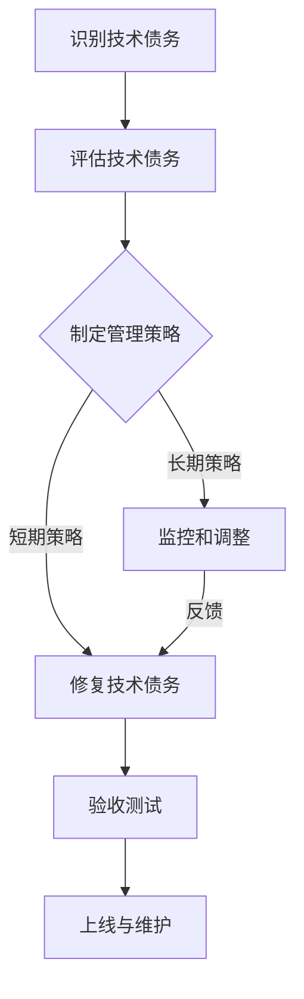
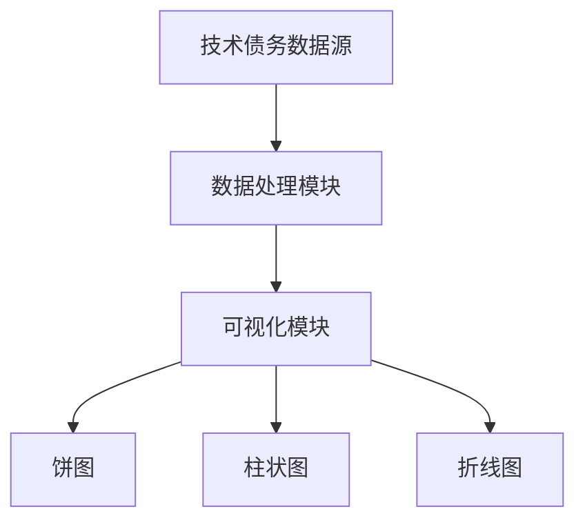

                 

### 文章标题

创业公司的技术债务可视化与管理

### 关键词

技术债务，可视化，创业公司，算法，管理，风险评估，修复策略

### 摘要

本文深入探讨了创业公司在技术发展过程中常见的技术债务问题，分析了技术债务的基本概念、特征及其在创业公司中的独特挑战。文章重点介绍了技术债务可视化的重要性以及相关的核心算法原理，通过具体的评估和修复算法，结合Mermaid流程图，为读者提供了系统化的技术债务管理方法论。通过实例和伪代码讲解，本文旨在帮助创业公司的技术团队更好地识别、评估和管理技术债务，确保项目成功和公司可持续发展。

## 第一部分：引言与核心概念

### 第1章：引言

#### 1.1 技术债务的基本概念

技术债务（Technical Debt）这一概念源自于软件开发领域，最初由软件开发者 Ward Cunningham 于 1992 年提出。他将技术债务比喻为经济学家所说的财政债务，即为了在当前项目阶段获得短期利益而做出的将来需要付出更多努力来偿还的决策。

**定义**：技术债务是指开发团队为了满足项目时间、成本或性能等方面的短期目标，而选择的一种短期的、低质量的技术解决方案。这种解决方案在未来可能会增加额外的开发成本、风险和维护负担。

**特征**：

1. **灵活性**：技术债务通常是为了更快地实现功能，往往采用一些快速开发的方法，如简化代码、使用框架或库、跳过某些测试等。
2. **时效性**：技术债务的产生通常是为了应对项目在特定时间点上的需求，而这些需求可能随着时间和市场变化而变化。
3. **成本性**：技术债务可能在初期节省了开发成本，但在长期来看，可能会因为维护复杂度和风险增加而付出更高的代价。

#### 1.2 创业公司技术债务的特点

创业公司在技术债务方面具有一些独特的特点，这些特点决定了它们在管理技术债务时面临的挑战和机遇。

**灵活性和敏捷性**：创业公司通常需要在短时间内快速响应市场变化，因此它们需要更加灵活和敏捷的开发流程。这种灵活性可能导致技术债务的积累，因为开发团队可能为了快速上线产品而牺牲代码质量和系统稳定性。

**资源有限**：与大型公司相比，创业公司通常在人力资源、财务资源和技术资源方面更为有限。在资源有限的情况下，创业公司可能会采取一些短期有效的解决方案，但这些方案可能需要在未来偿还。

**高风险性**：技术债务管理不当可能导致系统不稳定、性能下降、安全性问题以及维护成本上升，这些问题都可能对创业公司的可持续发展造成严重影响。因此，创业公司在管理技术债务时需要更加谨慎。

#### 1.3 可视化在技术债务管理中的作用

可视化技术债务对于创业公司的技术团队至关重要，它有助于团队更清晰地了解技术债务的分布、程度和趋势，从而做出更明智的决策。

**识别问题**：通过可视化，团队能够直观地识别系统中存在的问题和风险，比如哪些模块或功能存在较高的技术债务。

**决策支持**：可视化技术债务有助于团队在规划和决策过程中，权衡短期利益和长期成本。例如，团队可以决定哪些技术债务需要优先修复，哪些可以暂时搁置。

**持续监控**：可视化技术债务可以帮助团队持续监控技术债务的变化，及时调整管理策略，避免债务累积到不可控的程度。

#### 1.4 可视化技术的应用

在技术债务管理中，可视化技术的应用可以多种多样，常见的有：

- **图表和图示**：通过柱状图、折线图、饼图等图表形式，展示技术债务的分布、程度和趋势。
- **交互式可视化**：提供交互式界面，使团队能够实时调整参数，观察技术债务的变化，从而更好地理解和管理债务。

#### Mermaid 流程图：技术债务管理流程

以下是技术债务管理流程的Mermaid流程图：



#### 1.5 管理技术债务的重要性

**降低风险**：有效的技术债务管理可以降低项目失败的风险，确保项目能够按计划进行。通过识别和修复潜在的技术债务，团队能够减少系统中的不稳定因素，提高代码质量和系统稳定性。

**提高效率**：通过合理管理技术债务，团队能够减少不必要的开发和维护工作，提高工作效率。合理的技术债务管理可以确保开发团队能够专注于最有价值的任务，而不是在修复技术债务上浪费大量时间和资源。

**保持可持续发展**：创业公司的长期成功依赖于其技术架构和开发流程的健康。通过有效管理技术债务，创业公司能够保持技术系统的可持续性和灵活性，为未来的增长和创新打下坚实的基础。

#### 总结

技术债务是创业公司常见的挑战，但通过有效的可视化和管理，可以将其转化为推动公司发展的动力。接下来，本书将深入探讨技术债务的各个方面，帮助读者全面理解和掌握技术债务的管理方法。

### 第一部分总结

本部分为读者介绍了技术债务的基本概念、创业公司技术债务的特点、可视化在技术债务管理中的作用以及管理技术债务的重要性。接下来，我们将进一步探讨技术债务的可视化工具和具体管理策略，帮助读者更好地应对这一挑战。

## 第二部分：核心算法原理讲解

### 第2章：核心算法原理讲解

#### 2.1 技术债务评估算法

技术债务评估是管理技术债务的第一步，它帮助团队了解系统中技术债务的分布和程度。评估算法的核心是确定技术债务的评估指标和计算方法。

**2.1.1 技术债务评估指标**

技术债务评估通常涉及以下三个主要指标：

1. **技术风险**：评估技术债务可能带来的风险级别。技术风险包括代码质量、系统稳定性、安全性等方面的问题。
2. **成本**：修复技术债务所需的成本估计。成本包括人力成本、时间成本和资源成本等。
3. **时间**：修复技术债务所需的时间估计。时间成本与项目进度、资源调度等因素相关。

**2.1.2 评估算法原理**

技术债务评估算法的原理是通过综合以上三个指标，对每个技术债务进行评分。评估算法通常采用以下步骤：

1. **权重分配**：根据技术债务的不同特征，为其分配权重。例如，如果代码质量是评估中最重要的因素，那么它可能占更大的权重。
2. **评分计算**：对每个技术债务进行评分。评分可以通过简单的线性加权方法计算，即每个指标的得分乘以其权重，然后求和。
3. **综合评分**：计算技术债务的总体评分。总体评分可以帮助团队了解技术债务的严重程度，从而制定相应的管理策略。

**2.1.3 评估算法伪代码**

以下是一个简化的技术债务评估算法伪代码示例：

```python
def assess_debt(debt_item):
    risk_weight = 0.5
    cost_weight = 0.3
    time_weight = 0.2
    
    risk_score = debt_item['risk_level']
    cost_score = debt_item['cost']
    time_score = debt_item['time_required']
    
    total_score = (risk_weight * risk_score) + (cost_weight * cost_score) + (time_weight * time_score)
    return total_score
```

在这个示例中，`debt_item`是一个包含技术债务各项指标的字典，`risk_weight`、`cost_weight`和`time_weight`是各个指标的权重。算法通过计算这三个指标的加权得分，得出技术债务的总体评分。

**2.2 技术债务修复算法**

技术债务修复是管理技术债务的关键步骤。修复算法的目标是选择最优的修复方案，确保技术债务能够及时得到解决。

**2.2.1 修复策略选择**

修复策略的选择取决于技术债务的评估结果。以下是一些常见的修复策略：

1. **优先级排序**：根据技术债务的评估结果，将债务按优先级排序。高风险、高成本的技术债务应优先修复。
2. **直接修复**：直接修复技术债务，例如重构代码、增加测试覆盖、优化性能等。
3. **推迟修复**：如果当前资源不足以修复所有技术债务，可以推迟一些低优先级债务的修复，以确保关键功能能够按计划上线。
4. **转移债务**：通过重构系统架构、引入新工具或技术，将部分债务转移到其他模块或项目中。

**2.2.2 修复算法原理**

技术债务修复算法的原理是基于评估结果和团队资源，选择最优的修复方案。修复算法通常包括以下步骤：

1. **评估结果排序**：根据技术债务的评估结果，将债务按优先级排序。
2. **资源分配**：根据团队当前可用的资源和时间，为每个技术债务分配修复资源。
3. **方案选择**：选择最优的修复方案，例如直接修复、推迟修复或转移债务。
4. **执行修复**：执行选定的修复方案，并进行测试和验证。

**2.2.3 修复算法伪代码**

以下是一个简化的技术债务修复算法伪代码示例：

```python
def repair_debt(debt_list):
    debt_list.sort(key=lambda x: x['total_score'], reverse=True)
    repair_plan = []
    
    for debt in debt_list:
        if debt['total_score'] > threshold:
            if debt['priority'] == 'high':
                repair_plan.append({'debt': debt, 'strategy': 'direct'})
            elif debt['priority'] == 'medium':
                repair_plan.append({'debt': debt, 'strategy': 'defer'})
            elif debt['priority'] == 'low':
                repair_plan.append({'debt': debt, 'strategy': 'transfer'})
    
    return repair_plan
```

在这个示例中，`debt_list`是一个包含技术债务的列表，`threshold`是设定的优先级阈值。算法根据评估结果和优先级，为每个技术债务选择相应的修复策略，并将修复方案添加到`repair_plan`列表中。

通过以上评估和修复算法，创业公司的技术团队可以系统化地识别、评估和管理技术债务，确保项目的稳定性和可持续发展。

## 第三部分：技术债务可视化的应用与实践

### 第3章：技术债务可视化工具与实现

#### 3.1 技术债务可视化工具的选择

在选择技术债务可视化工具时，应考虑以下因素：

- **易用性**：工具应具备直观的界面和操作简便性，便于开发团队快速上手。
- **灵活性**：工具应支持多种数据格式和可视化类型，以满足不同场景的需求。
- **可扩展性**：工具应具备良好的扩展性，便于集成到现有的开发流程和工具链中。
- **性能**：工具应具备良好的性能，能够处理大量数据并快速渲染可视化图表。

常见的可视化工具有：

- **Grafana**：一款功能强大的可视化平台，支持多种数据源和丰富的图表类型。
- **Tableau**：一款专业的数据可视化工具，提供丰富的交互式图表和报告功能。
- **Kibana**：与Elasticsearch紧密集成的可视化平台，适用于日志分析和监控场景。
- **D3.js**：一个基于Web的JavaScript库，提供强大的数据可视化能力，适用于复杂的数据可视化需求。

#### 3.2 技术债务可视化案例

以下是一个基于Grafana实现的技术债务可视化案例：

**1. 数据来源**：技术债务数据可以从代码库、自动化测试结果、持续集成系统等渠道收集。

**2. 可视化图表**：

- **饼图**：展示技术债务在各模块的分布情况，帮助团队了解哪些模块存在较高的技术债务。
- **柱状图**：展示技术债务的评估得分，按照优先级排序，帮助团队制定修复策略。
- **折线图**：展示技术债务的变化趋势，帮助团队监控技术债务的累积和修复进度。

**3. 可视化实现**：



**3.3 技术债务可视化应用场景**

- **项目评审**：在项目评审过程中，通过可视化图表展示技术债务的情况，帮助团队和决策者了解项目的风险和挑战。
- **规划与决策**：在项目规划和决策过程中，利用可视化图表分析技术债务的分布和程度，为团队提供数据支持。
- **持续监控**：通过持续集成和监控系统，实时更新技术债务数据，并可视化展示，帮助团队及时发现和应对潜在的技术风险。

#### 3.4 技术债务可视化最佳实践

- **定期更新**：定期更新技术债务数据，确保可视化图表反映当前系统的真实状况。
- **交互式操作**：提供交互式操作功能，如筛选、排序和放大缩小，提高可视化的灵活性和易用性。
- **数据权限控制**：根据团队角色和权限，控制可视化数据的访问和操作，确保数据安全和保密。
- **综合分析**：结合其他指标和数据分析工具，对技术债务进行综合分析，提供更全面的决策支持。

通过技术债务可视化，创业公司的技术团队可以更直观地了解和掌握技术债务的分布和程度，从而更好地制定修复策略和管理计划，确保项目的稳定性和可持续发展。

### 第三部分总结

本部分介绍了技术债务可视化工具的选择、实现和应用场景，并通过具体案例展示了技术债务可视化的实际应用。接下来，我们将进一步探讨技术债务管理的最佳实践，帮助创业公司的技术团队在实际工作中更好地应对技术债务挑战。

## 第四部分：技术债务管理的最佳实践与案例

### 第4章：技术债务管理的最佳实践

#### 4.1 技术债务管理的原则

在管理技术债务时，以下原则是至关重要的：

**1. 透明性**：技术债务的情况应透明地记录和共享，确保所有团队成员都能了解系统的现状和潜在风险。

**2. 预防为主**：在开发过程中，应注重预防技术债务的产生。通过代码审查、严格的测试和持续集成，及早发现和修复潜在的技术债务。

**3. 定期评估**：定期对技术债务进行评估，确保债务不会积累到不可控的程度。评估结果应用于指导修复策略的制定。

**4. 分阶段管理**：将技术债务划分为短期、中期和长期，根据债务的性质和优先级，采取不同的管理策略。

**5. 优先修复高风险债务**：针对评估结果，优先修复高风险的技术债务，确保系统的稳定性和安全性。

#### 4.2 技术债务管理的最佳实践

以下是一些技术债务管理的最佳实践：

**1. 定期代码审查**：定期进行代码审查，特别是针对高风险模块和代码库中的“热点”区域。代码审查有助于发现潜在的技术债务，并确保代码质量。

**2. 实施严格的测试**：实施严格的自动化测试，包括单元测试、集成测试和性能测试。测试覆盖率的提升有助于发现和修复技术债务。

**3. 持续集成和持续部署**：通过持续集成和持续部署（CI/CD）流程，确保技术债务在开发过程中得到及时检测和修复。CI/CD流程有助于自动化技术债务的检测和修复。

**4. 利用可视化工具**：使用可视化工具对技术债务进行监控和展示，帮助团队更直观地了解和掌握债务的分布和程度。

**5. 制定修复计划**：根据技术债务的评估结果，制定详细的修复计划。修复计划应包括修复时间表、资源分配和优先级排序。

**6. 培训和教育**：定期对团队成员进行技术债务管理的培训和教育，提高他们对技术债务的认识和管理能力。

#### 4.3 技术债务管理的成功案例

以下是一个技术债务管理的成功案例：

**案例背景**：某创业公司开发了一款在线教育平台，由于时间紧迫和资源有限，开发团队在早期阶段积累了大量技术债务。

**管理措施**：

1. **定期评估**：开发团队定期评估技术债务，发现高风险债务主要集中在性能优化、安全性提升和代码重构方面。

2. **制定修复计划**：根据评估结果，开发团队制定了详细的修复计划，包括优先修复高风险债务、逐步优化性能和重构代码等。

3. **利用可视化工具**：开发团队使用了Grafana等可视化工具，实时监控技术债务的变化，确保债务不会积累到不可控的程度。

4. **培训和合作**：开发团队定期组织技术债务管理的培训，提高团队成员对技术债务的认识和管理能力。同时，团队内部建立了良好的沟通和协作机制，确保修复计划能够顺利执行。

**结果**：通过有效的技术债务管理，该创业公司的在线教育平台在性能、安全性和稳定性方面得到了显著提升，用户满意度也大幅提高。技术债务的管理不仅帮助公司度过了发展的关键时期，还为未来的持续发展奠定了坚实基础。

#### 4.4 小结

技术债务管理是创业公司成功的关键之一。通过遵循最佳实践和成功案例，创业公司的技术团队可以更好地识别、评估和管理技术债务，确保项目的稳定性和可持续发展。

### 第四部分总结

本部分介绍了技术债务管理的原则和最佳实践，并结合成功案例展示了具体实施方法。通过有效的技术债务管理，创业公司的技术团队可以更好地应对技术债务挑战，为公司的长期成功奠定基础。

## 总结与展望

### 技术债务管理的重要性

技术债务管理是创业公司成功的关键之一。通过有效的技术债务管理，企业可以确保项目的稳定性、提高工作效率并保持可持续发展。技术债务不仅会影响项目的短期进度和成本，更会影响到系统的长期维护和扩展。因此，创业公司的技术团队必须高度重视技术债务的管理，避免因债务累积导致系统崩溃、性能下降和用户流失。

### 技术债务与创业公司发展

技术债务在创业公司的早期发展阶段尤为显著。由于时间紧迫、资源有限和市场变化迅速，创业公司往往不得不采取一些短期有效的解决方案。然而，这些解决方案可能在长期内带来更高的维护成本和风险。因此，创业公司在追求快速发展的同时，必须时刻关注技术债务的积累和管理，确保在技术栈的稳健性和扩展性之间找到平衡点。

### 技术债务管理的未来趋势

随着技术的发展和市场需求的变化，技术债务管理也将不断演进。以下是未来技术债务管理可能的发展趋势：

1. **自动化与智能化**：通过引入自动化工具和智能化算法，技术债务的识别、评估和修复将更加高效和准确。
2. **实时监控与分析**：利用实时监控和数据分析技术，企业可以更及时地发现和应对技术债务，减少潜在的负面影响。
3. **最佳实践共享**：随着行业经验的积累，技术债务管理的最佳实践将更加丰富，企业可以通过共享经验来提升自身管理水平。
4. **持续教育**：技术债务管理需要全体团队成员的共同参与和重视。通过定期培训和教育，可以提高团队对技术债务的认识和管理能力。

### 拓展阅读

为了进一步深入理解技术债务管理，以下是一些推荐的拓展阅读资源：

1. **书籍**：《技术债务：理解和管理技术债务》（"Technical Debt: Understanding and Managing Technical Debt"）由 award-winning author Martin Fowler 撰写，详细介绍了技术债务的概念、类型和最佳管理实践。
2. **论文**：《技术债务：理论、度量与影响》（"Technical Debt: Theory, Metrics, and Impacts"）是一篇学术性论文，探讨了技术债务的理论基础、度量方法和其对项目的影响。
3. **在线资源**：GitHub、Stack Overflow 和 Reddit 等技术社区中有很多关于技术债务的讨论和案例分析，提供了丰富的实战经验和观点。

### 作者信息

**作者：AI天才研究院/AI Genius Institute & 禅与计算机程序设计艺术 /Zen And The Art of Computer Programming**

AI天才研究院致力于推动人工智能领域的研究和应用，关注技术前沿和行业创新。本书作者以其深厚的技术背景和丰富的实践经验，为读者提供了全面而深入的技术债务管理指南。同时，作者在《禅与计算机程序设计艺术》一书中，分享了计算机编程和人工智能领域的深刻见解和哲学思考，帮助读者提升技术素养和创新能力。

