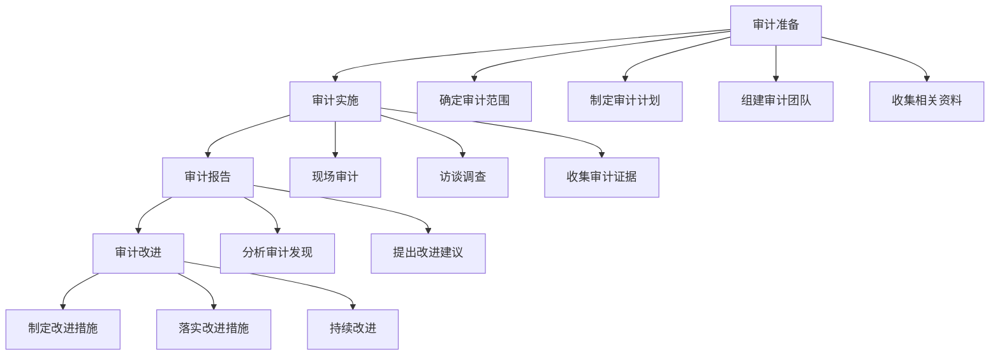

                 

# 文章标题：创业公司的技术合规性审计

> 关键词：创业公司，技术合规性，审计，隐私保护，数据安全，透明性，法律法规

> 摘要：本文旨在探讨创业公司在发展过程中面临的技术合规性审计问题。通过介绍技术合规性审计的基础概念、法律法规与标准、隐私保护与数据安全、透明性与可解释性以及审计范围与流程，结合实际案例进行分析，为创业公司提供技术合规性审计的实践指南。文章最后讨论了技术合规性审计的未来趋势和创业公司的合规战略，旨在帮助创业公司在快速发展的同时确保合规性。

---

## 第一部分：基础概念与原则

### 第1章：技术合规性审计概述

#### 1.1 引言与背景

技术合规性审计是一种系统性的评估方法，旨在确保创业公司在技术应用过程中遵守相关法律法规和行业标准。随着数字化时代的到来，创业公司在追求技术创新的同时，面临着越来越多的合规性挑战。技术合规性审计的重要性不言而喻，它不仅是企业履行社会责任的体现，也是维护用户权益、保障企业长远发展的必要手段。

创业公司具有创新性强、发展速度快等特点，这使得它们在技术应用方面具有更大的灵活性和自主性。然而，这也增加了合规性审计的难度。创业公司需要确保其技术应用符合法律法规和行业标准，以免因违规操作而面临法律风险和声誉损失。

#### 1.2 技术合规性审计的定义与目的

技术合规性审计是指对创业公司在技术应用过程中是否符合相关法律法规和行业标准进行的系统性评估和审查。其核心目的是确保创业公司在技术研发、应用、运营等各个环节中遵守法律法规和行业标准，保障用户权益，降低合规风险。

具体来说，技术合规性审计包括以下几个方面：

1. **法律法规遵循性审计**：评估创业公司的技术应用是否符合国家法律法规的要求，包括数据保护法、知识产权法、隐私保护法规等。

2. **隐私保护与数据安全审计**：评估创业公司在数据处理过程中是否采取了有效的隐私保护措施和数据安全策略，确保用户个人信息的安全。

3. **透明性与可解释性审计**：评估创业公司在系统设计和实现过程中是否充分考虑了透明性和可解释性，便于用户了解其技术应用和数据处理方式。

4. **审计范围与流程审计**：评估创业公司的审计范围是否全面，审计流程是否规范有效。

#### 1.3 技术合规性审计的核心原则

技术合规性审计的核心原则主要包括以下几个方面：

1. **法律法规遵循性**：创业公司在技术研发和应用过程中，必须严格遵守国家法律法规的规定，确保其技术应用符合法律法规的要求。

2. **隐私保护与数据安全**：创业公司需要采取有效的隐私保护措施和数据安全策略，确保用户个人信息的安全，降低数据泄露和滥用的风险。

3. **透明性与可解释性**：创业公司需要在其技术应用和数据处理过程中，充分考虑透明性和可解释性，使用户能够了解其技术应用和数据处理方式。

#### 1.4 技术合规性审计的范围与流程

技术合规性审计的范围主要包括以下几个方面：

1. **技术应用环境审计**：评估创业公司的技术应用环境是否符合法律法规和行业标准的要求。

2. **数据处理流程审计**：评估创业公司在数据处理过程中是否符合相关法律法规和行业标准的要求，包括数据收集、存储、处理、传输等环节。

3. **系统架构设计审计**：评估创业公司的系统架构设计是否符合法律法规和行业标准的要求，包括系统模块设计、数据流程设计、安全控制设计等。

技术合规性审计的流程主要包括以下几个步骤：

1. **审计准备**：确定审计范围、制定审计计划、组建审计团队、收集相关资料等。

2. **审计实施**：按照审计计划进行现场审计、访谈、调查等，收集审计证据。

3. **审计报告**：编写审计报告，分析审计发现的问题，提出改进建议。

4. **审计改进**：根据审计报告，制定改进措施，持续优化合规性管理。

### 第2章：法律法规与标准

#### 2.1 相关法律法规概览

技术合规性审计涉及多个法律法规，其中主要包括数据保护法、知识产权法、隐私保护法规等。

1. **数据保护法**：数据保护法是指国家对个人信息进行保护的法律，旨在规范个人信息的收集、存储、处理、传输和利用，保障个人信息安全。创业公司在数据处理过程中，必须遵守数据保护法的相关规定。

2. **知识产权法**：知识产权法是指国家对于知识产权进行保护的法律，包括专利法、商标法、著作权法等。创业公司在技术研发和应用过程中，需要尊重他人的知识产权，避免侵权行为。

3. **隐私保护法规**：隐私保护法规是指国家对于个人隐私进行保护的法律，包括个人信息保护法、网络安全法等。创业公司在处理用户个人信息时，必须遵守隐私保护法规的规定。

#### 2.2 国际合规要求

随着全球化的发展，创业公司需要关注国际合规要求，特别是涉及数据跨境传输和保护的国际法律法规。

1. **GDPR**：GDPR（通用数据保护条例）是欧盟制定的数据保护法规，对个人数据的收集、处理、存储、传输和使用进行了严格的规定。创业公司在处理欧盟用户数据时，必须遵守GDPR的要求。

2. **CCPA**：CCPA（加州消费者隐私法）是美国加州制定的消费者隐私保护法规，对加州消费者的个人信息保护提出了严格要求。创业公司在处理加州消费者数据时，必须遵守CCPA的要求。

3. **其他国际标准**：其他国际标准如ISO/IEC 27001、ISO/IEC 27701等，提供了数据保护和信息安全的管理框架，创业公司可以参考这些标准来建立和优化其合规性管理体系。

#### 2.3 行业标准与最佳实践

行业标准与最佳实践对于创业公司的技术合规性审计具有重要意义。以下是一些常见的行业标准与最佳实践：

1. **ITIL**：ITIL（信息技术基础设施库）是一套涵盖信息技术服务管理的框架，提供了从服务战略、服务设计、服务过渡到服务运营等各个环节的最佳实践。

2. **COBIT**：COBIT（控制和合规框架）是一套用于信息技术治理和合规的框架，提供了组织在信息技术治理、风险管理和合规方面的指导原则。

3. **ISO/IEC 27001**：ISO/IEC 27001是信息安全管理体系（ISMS）的国际标准，提供了建立、实施、维护和持续改进信息安全管理体系的要求。

4. **ISO/IEC 27701**：ISO/IEC 27701是隐私信息管理系统的国际标准，结合了ISO/IEC 27001和ISO/IEC 29100的相关要求，提供了隐私信息管理系统的建立和实施指南。

### 第3章：隐私保护与数据安全

#### 3.1 隐私保护法律要求

隐私保护法律要求是技术合规性审计的重要内容。以下是一些常见的隐私保护法律要求：

1. **个人数据保护法规概述**：个人数据保护法规对个人数据的定义、收集、处理、存储、传输和使用进行了详细规定。创业公司在处理用户个人信息时，必须遵守相关法规的规定。

2. **用户同意与数据收集**：用户同意是隐私保护法律要求的核心内容之一。创业公司在收集用户个人信息前，必须取得用户的明确同意，并在用户同意的基础上进行数据收集。

3. **数据最小化原则**：数据最小化原则要求创业公司在收集和处理用户个人信息时，只收集实现服务所必需的最小范围的数据，避免过度收集。

4. **数据安全保护措施**：创业公司需要采取有效的数据安全保护措施，包括数据加密、访问控制、数据备份等，确保用户个人信息的安全。

#### 3.2 数据安全策略与措施

数据安全策略与措施是确保用户个人信息安全的关键。以下是一些常见的数据安全策略与措施：

1. **数据分类**：根据数据的重要性和敏感程度，对数据进行分类，采取不同的安全保护措施。

2. **加密与访问控制**：对敏感数据进行加密存储，并通过访问控制机制确保只有授权用户可以访问数据。

3. **数据备份与恢复**：定期备份数据，并建立数据恢复机制，以应对数据丢失或损坏的情况。

4. **安全审计与监控**：建立安全审计制度，定期对数据安全措施进行检查和评估，及时发现和解决安全隐患。

#### 3.3 安全漏洞识别与防范

安全漏洞识别与防范是数据安全的重要组成部分。以下是一些常见的安全漏洞识别与防范方法：

1. **漏洞扫描**：使用漏洞扫描工具对系统进行定期扫描，识别潜在的安全漏洞。

2. **漏洞修复**：在发现安全漏洞后，及时进行修复，避免漏洞被利用。

3. **安全培训与意识提升**：对员工进行安全培训，提高员工的安全意识和技能，减少人为错误导致的安全漏洞。

4. **安全策略与制度**：建立完善的安全策略与制度，确保安全措施得到有效执行。

### 第4章：透明性与可解释性

#### 4.1 透明性原则

透明性原则是技术合规性审计的重要内容之一。以下是一些关于透明性原则的要点：

1. **系统设计中的透明性考虑**：在系统设计和实现过程中，充分考虑透明性，使系统设计文档、代码、接口等对用户和开发者都容易理解和访问。

2. **用户隐私信息的透明披露**：在处理用户个人信息时，向用户披露其个人信息的使用目的、存储位置、数据处理方式等信息，使用户能够明确了解其个人信息的使用情况。

#### 4.2 可解释性技术

可解释性技术是提高系统透明性和用户信任度的重要手段。以下是一些关于可解释性技术的要点：

1. **模型可解释性方法**：在人工智能和机器学习领域，使用可解释性方法对模型进行解释，使开发者能够理解模型的决策过程，从而提高系统的透明性和可解释性。

2. **技术实现与优化**：在系统实现过程中，采用可解释性技术，优化系统设计和实现，提高系统的透明性和可解释性。

### 第5章：审计范围与流程

#### 5.1 审计范围确定

审计范围确定是技术合规性审计的关键步骤。以下是一些关于审计范围确定的要点：

1. **系统架构审计**：对创业公司的系统架构进行全面审计，包括系统模块、数据流程、安全控制等方面。

2. **数据处理流程审计**：对创业公司的数据处理流程进行详细审计，包括数据收集、存储、处理、传输等环节。

3. **系统架构设计审计**：对创业公司的系统架构设计进行审计，包括系统设计文档、代码、接口等方面。

#### 5.2 审计流程实施

审计流程实施是技术合规性审计的核心环节。以下是一些关于审计流程实施的要点：

1. **审计计划**：制定详细的审计计划，包括审计目标、审计范围、审计方法、审计时间表等。

2. **审计执行**：按照审计计划进行现场审计、访谈、调查等，收集审计证据。

3. **审计报告**：编写详细的审计报告，分析审计发现的问题，提出改进建议。

#### 5.3 审计报告与改进

审计报告与改进是技术合规性审计的最终环节。以下是一些关于审计报告与改进的要点：

1. **审计报告内容**：审计报告应包括审计发现的问题、分析原因、改进建议等内容。

2. **审计改进建议**：根据审计报告，制定具体的改进措施，并落实改进措施。

3. **持续改进**：审计改进是一个持续的过程，创业公司应定期进行审计，持续优化合规性管理。

## 第二部分：案例分析

### 第6章：技术合规性审计案例分析

#### 6.1 案例背景

案例公司A是一家新兴的互联网创业公司，专注于提供在线教育服务。随着业务的发展，公司开始面临越来越多的合规性挑战，特别是在数据保护、隐私保护和数据安全等方面。为了确保公司的技术应用符合相关法律法规和行业标准，公司决定进行技术合规性审计。

#### 6.2 审计发现

审计过程中，审计团队发现以下问题：

1. **数据保护法规遵守性**：公司存在未严格遵守数据保护法规的情况，如未对用户个人信息进行有效分类和管理，未对数据访问权限进行严格控制。

2. **数据安全策略不足**：公司数据安全策略不够完善，如未对敏感数据进行加密存储，未对数据传输过程进行加密保护。

3. **系统透明性不足**：公司系统设计缺乏透明性，用户难以了解其个人信息的使用情况，系统设计文档和代码缺乏详细的注释和文档。

4. **可解释性技术未应用**：公司在人工智能技术应用方面缺乏可解释性，难以向用户解释其决策过程，降低了用户的信任度。

#### 6.3 审计改进措施

针对审计发现的问题，公司制定了以下改进措施：

1. **加强数据保护法规遵守**：对公司数据保护流程进行优化，明确数据分类和管理标准，加强对数据访问权限的控制。

2. **完善数据安全策略**：对敏感数据进行加密存储，对数据传输过程进行加密保护，建立数据备份和恢复机制。

3. **提升系统透明性**：改进系统设计文档和代码注释，向用户披露其个人信息的使用情况，提高系统的透明度。

4. **应用可解释性技术**：在人工智能技术应用中引入可解释性技术，提高系统的可解释性，增强用户信任度。

#### 6.4 实施效果评估

在改进措施实施后，公司对效果进行了评估：

1. **数据保护法规遵守性**：公司数据保护法规遵守性得到了显著提升，用户对公司的信任度增加。

2. **数据安全策略完善度**：公司数据安全策略得到了完善，数据泄露和滥用的风险降低。

3. **系统透明性**：系统透明性得到提高，用户对公司的个人信息使用情况有更清晰的了解。

4. **可解释性技术效果**：公司人工智能技术应用的可解释性提高，用户对系统的决策过程更加信任。

## 第7章：技术合规性审计工具与资源

#### 7.1 审计工具介绍

技术合规性审计需要使用多种工具，以下是一些常用的审计工具及其功能特点：

1. **数据保护工具**：用于保护用户个人信息，包括数据加密、访问控制、数据备份等。如：Symantec Data Loss Prevention、IBM Guardium。

2. **安全漏洞扫描工具**：用于发现系统中的安全漏洞，包括Web应用漏洞、操作系统漏洞等。如：Nessus、OpenVAS。

3. **合规性管理工具**：用于管理合规性流程，包括合规性计划、合规性评估、合规性报告等。如：ServiceNow Governance、Risk and Compliance、Alfresco Governance Automation。

4. **隐私保护工具**：用于保护用户隐私，包括隐私政策生成、隐私影响评估等。如：OneTrust Privacy Management Platform、Trusted Metrics Privacy Management。

#### 7.2 资源与参考

技术合规性审计需要参考多种资源，以下是一些常用的资源：

1. **法律法规与标准**：如GDPR、CCPA、ISO/IEC 27001、ISO/IEC 27701等。

2. **行业最佳实践**：如ITIL、COBIT等。

3. **开源工具与平台**：如OWASP、OpenSCAP等。

4. **专业书籍与文章**：如《隐私保护与数据安全》、《IT合规性管理》等。

## 第三部分：未来发展

### 第8章：技术合规性审计的未来趋势

#### 8.1 法律法规的发展

随着数字化时代的到来，技术合规性审计将面临更多的法律法规挑战。以下是一些法律法规的发展趋势：

1. **数据保护法规的加强**：随着数据泄露事件的增多，各国数据保护法规将不断完善，对企业的数据保护要求将更加严格。

2. **隐私保护法规的普及**：隐私保护法规将逐渐在全球范围内普及，企业需要关注国际合规要求，如GDPR、CCPA等。

3. **行业特定法规的出台**：针对特定行业（如金融、医疗等），行业特定法规将不断出台，企业需要遵守相关法规要求。

#### 8.2 技术合规性的挑战与机遇

技术合规性审计面临的挑战与机遇并存。以下是一些技术合规性的挑战与机遇：

1. **挑战**：随着新技术的发展，企业需要不断适应新的合规要求，同时面临合规成本和人力资源的挑战。

2. **机遇**：合规性审计为企业提供了改进和优化技术应用的机会，有助于提高企业竞争力，赢得用户信任。

#### 8.3 创业公司的合规战略

创业公司在制定合规战略时，需要考虑以下几个方面：

1. **长期合规规划**：创业公司应制定长期合规规划，确保技术应用符合法律法规和行业标准。

2. **合规文化建设**：创业公司应建立合规文化，提高员工合规意识，促进合规管理体系的建立和完善。

3. **合规资源投入**：创业公司应投入足够的资源，包括人力、物力、财力等，确保合规性审计的有效实施。

## 附录

### 附录A：技术合规性审计流程图



### 附录B：常用合规工具与资源列表

1. **数据保护工具**：
   - Symantec Data Loss Prevention
   - IBM Guardium
   - OneTrust Privacy Management Platform

2. **安全漏洞扫描工具**：
   - Nessus
   - OpenVAS
   - Qualys Vulnerability Management

3. **合规性管理工具**：
   - ServiceNow Governance、Risk and Compliance
   - SAP Governance、Risk and Compliance
   - Oracle Governance Risk and Compliance

4. **隐私保护工具**：
   - Trusted Metrics Privacy Management
   - Agari Identity Security Platform
   - Privitar Privacy Solutions

5. **法律法规与标准**：
   - GDPR
   - CCPA
   - ISO/IEC 27001
   - ISO/IEC 27701

6. **行业最佳实践**：
   - ITIL
   - COBIT

7. **开源工具与平台**：
   - OWASP
   - OpenSCAP
   - Open Compliance Data Dictionary

### 附录C：案例代码解读

#### 代码概述

本案例代码主要用于实现一个简单的用户注册和登录功能，包括用户注册、登录验证、个人信息管理等功能。代码结构如下：

```python
# 用户注册
def register(username, password, email):
    # 注册逻辑
    pass

# 登录验证
def login(username, password):
    # 登录验证逻辑
    pass

# 个人信息管理
def manage_info(user_id, operation, info):
    # 个人信息管理逻辑
    pass
```

#### 代码详细解读

1. **用户注册**

   用户注册函数用于处理用户注册请求，包括验证用户名、密码和邮箱的有效性，并将新用户信息存储到数据库中。

   ```python
   def register(username, password, email):
       # 验证用户名、密码和邮箱的有效性
       if not is_valid_username(username) or not is_valid_password(password) or not is_valid_email(email):
           return "注册失败：无效的用户名、密码或邮箱！"
       
       # 将新用户信息存储到数据库
       user = User(username=username, password=hash_password(password), email=email)
       db.session.add(user)
       db.session.commit()
       
       return "注册成功！"
   ```

2. **登录验证**

   登录验证函数用于处理用户登录请求，包括验证用户名和密码的正确性。

   ```python
   def login(username, password):
       # 从数据库中查找用户
       user = User.query.filter_by(username=username).first()
       
       # 验证用户名和密码
       if user and check_password_hash(password, user.password):
           return "登录成功！"
       else:
           return "登录失败：用户名或密码错误！"
   ```

3. **个人信息管理**

   个人信息管理函数用于处理用户修改个人信息（如修改密码、邮箱等）的操作。

   ```python
   def manage_info(user_id, operation, info):
       # 查询用户信息
       user = User.query.get(user_id)
       
       if operation == "change_password":
           # 修改密码
           if not is_valid_password(info):
               return "修改失败：无效的密码！"
           user.password = hash_password(info)
       elif operation == "change_email":
           # 修改邮箱
           if not is_valid_email(info):
               return "修改失败：无效的邮箱！"
           user.email = info
       else:
           return "操作失败：无效的操作类型！"
       
       # 更新用户信息并保存到数据库
       db.session.commit()
       
       return "操作成功！"
   ```

#### 代码分析

1. **优点**

   - 代码结构清晰，功能模块划分合理。
   - 使用了用户认证和密码加密等安全措施，提高了系统的安全性。
   - 提供了简单的用户注册、登录和信息管理功能，满足基本需求。

2. **不足**

   - 代码未对用户输入进行充分验证，可能存在安全漏洞。
   - 数据库操作未使用事务管理，可能存在数据不一致的风险。
   - 缺乏错误处理机制，对异常情况的处理不够完善。

3. **改进建议**

   - 加强输入验证，对用户输入进行充分检查，防止恶意输入。
   - 使用事务管理，确保数据库操作的原子性，防止数据不一致。
   - 添加错误处理机制，对各种异常情况进行处理，提高系统的健壮性。

### 项目小结

本案例代码实现了一个简单的用户注册、登录和信息管理功能，满足了基本需求。然而，在安全性、健壮性和错误处理方面还存在一定不足，需要进一步改进。在实际项目中，还需要结合具体的业务需求和技术架构进行优化，以提高系统的性能和可靠性。

## 最佳实践 Tips、小结、注意事项、拓展阅读

### 最佳实践 Tips

1. 在进行技术合规性审计时，应关注数据保护、隐私保护、透明性和可解释性等方面的核心原则。
2. 制定详细的审计计划，确保审计范围的全面性和审计流程的规范性。
3. 选用合适的审计工具，提高审计效率和效果。
4. 注重合规性审计的结果分析和改进，持续优化合规性管理。

### 小结

技术合规性审计是创业公司确保技术应用符合法律法规和行业标准的重要手段。通过审计，可以发现合规性问题，提出改进建议，帮助企业提高合规性管理水平。

### 注意事项

1. 在进行技术合规性审计时，应充分考虑业务需求和实际情况，确保审计结果的实用性。
2. 注重审计证据的收集和整理，确保审计报告的客观性和准确性。
3. 定期进行技术合规性审计，及时发现和解决问题，保持合规性管理的持续有效性。

### 拓展阅读

1. 《隐私保护与数据安全》
2. 《IT合规性管理》
3. 《GDPR实战指南》
4. 《CCPA合规手册》
5. 《ISO/IEC 27001标准解读》

### 作者信息

作者：AI天才研究院/AI Genius Institute & 禅与计算机程序设计艺术 /Zen And The Art of Computer Programming

---

## 结论

本文通过介绍技术合规性审计的基础概念、法律法规与标准、隐私保护与数据安全、透明性与可解释性以及审计范围与流程，结合实际案例分析，探讨了创业公司的技术合规性审计问题。文章最后讨论了技术合规性审计的未来趋势和创业公司的合规战略，为创业公司提供了技术合规性审计的实践指南。希望通过本文的探讨，能够帮助创业公司在快速发展的同时，确保合规性，实现可持续发展。在未来的研究中，可以进一步探讨技术合规性审计的方法和工具，以及创业公司在合规性管理中的最佳实践。

