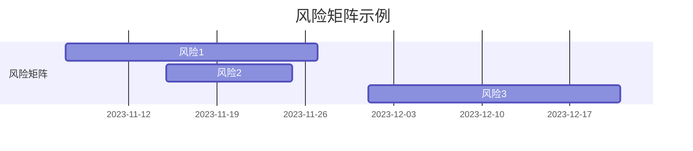
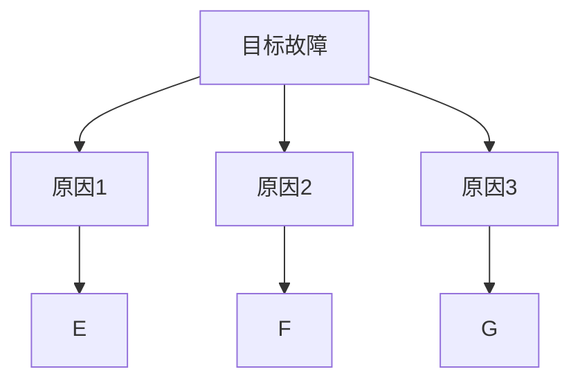
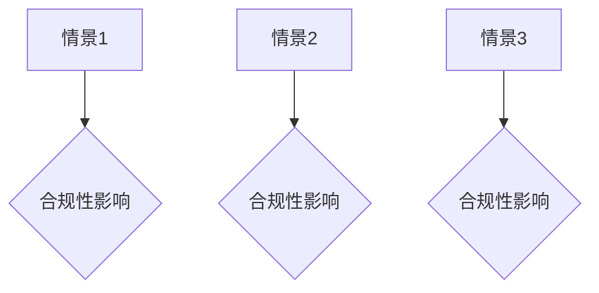
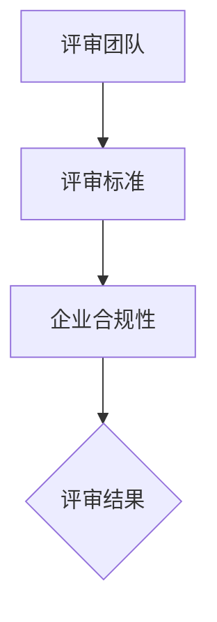
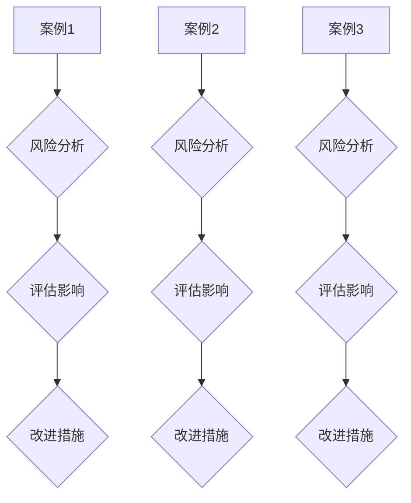
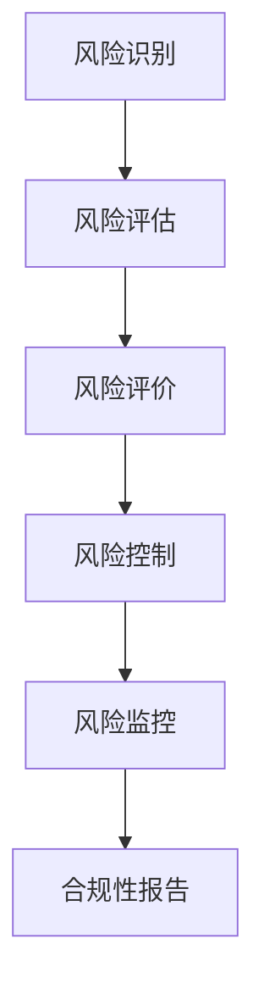

                 

### 文章标题

# 《创业公司的技术合规性风险评估》

### 关键词

- 创业公司
- 技术合规性
- 风险评估
- 管理策略
- 法律法规
- 最佳实践

### 摘要

本文旨在深入探讨创业公司在技术合规性方面面临的风险，并为其提供系统的风险评估和管理策略。文章首先介绍了合规性的基本概念及其重要性，随后详细解读了国际与国内的相关法律法规和行业标准。在此基础上，文章构建了技术合规性风险评估框架，并探讨了风险评估方法、风险控制策略以及创业公司的合规性管理体系。通过实际案例分析和风险管理工具应用，文章为创业公司提供了实用的合规性风险管理最佳实践。最后，文章展望了合规性风险管理的未来趋势与挑战，为创业公司持续发展提供了战略指导。

### 目录

#### 第一部分：合规性概述

- **第1章：合规性基本概念**
  - **1.1 合规性的定义与重要性**
  - **1.2 合规性法规与标准**
  - **1.3 合规性风险识别**

- **第2章：技术合规性风险评估原理**
  - **2.1 技术合规性风险评估框架**
  - **2.2 技术合规性风险评估方法**
  - **2.3 技术合规性风险控制策略**

#### 第二部分：技术合规性风险评估

- **第3章：创业公司的技术合规性管理体系**
  - **3.1 合规性管理组织架构**
  - **3.2 合规性管理流程**
  - **3.3 合规性管理体系建立与实施**

- **第4章：技术合规性风险案例分析**
  - **4.1 案例分析概述**
  - **4.2 典型技术合规性风险案例**
  - **4.3 案例分析与启示**

#### 第三部分：合规性风险管理工具与应用

- **第5章：合规性风险管理工具**
  - **5.1 合规性风险管理工具概述**
  - **5.2 合规性风险监测与预警系统**

- **第6章：合规性风险管理策略与最佳实践**
  - **6.1 合规性风险管理策略**
  - **6.2 最佳实践分享**

#### 第四部分：合规性风险管理的未来趋势与展望

- **第7章：合规性风险管理的未来趋势与展望**
  - **7.1 合规性风险管理的挑战与机遇**
  - **7.2 未来合规性风险管理的发展趋势**
  - **7.3 合规性风险管理的发展战略**

### 附录

- **附录A：合规性风险管理资源汇总**
- **附录B：技术合规性风险评估流程图**
- **附录C：技术合规性风险控制策略伪代码示例**
- **附录D：案例分析与代码解读**

---

以上为本文的目录大纲，接下来的内容将按照这一结构逐一展开详细论述。在每一部分中，我们将逐步深入，运用专业的技术语言和逻辑分析，为创业公司的技术合规性风险管理提供全面的指导。通过这篇文章，读者将能够系统地了解合规性的基本概念，掌握技术合规性风险评估的方法和策略，并学会如何在实践中应用这些策略来管理合规性风险。

#### 第一部分：合规性概述

### 第1章：合规性基本概念

## 1.1 合规性的定义与重要性

合规性（Compliance）是指一个组织或个人在运营过程中，遵守相关的法律、法规、标准、规定和行业准则等行为规范的能力和状态。在技术领域，合规性尤为重要，因为它直接关系到企业的合法运营、市场准入、客户信任以及业务发展。

### 1.1.1 合规性的内涵

合规性的内涵可以从以下几个方面来理解：

1. **法律法规遵守**：这是合规性的核心，指的是企业必须遵守国家及地方制定的法律法规，如《中华人民共和国网络安全法》、《数据安全法》等，以及国际上的通用法律，如欧盟的《通用数据保护条例》（GDPR）。

2. **标准和规范遵循**：企业应遵循行业内公认的技术标准和规范，这些标准可以是国际标准（如ISO、IEEE），也可以是国内标准（如GB/T），或者是行业内部标准。

3. **内部政策和流程**：合规性还包括企业内部制定的各种政策和流程，这些政策和流程用于确保企业在日常运营中的行为符合法律法规和行业规范。

4. **风险管理**：合规性不仅仅是被动遵守规则，还包括主动识别、评估和应对潜在的风险，确保企业的行为不会违反相关法规。

### 1.1.2 合规性在企业运营中的重要性

合规性对企业运营的重要性体现在以下几个方面：

1. **合法运营**：遵守法律法规是企业在市场上合法运营的基础，不合规可能会导致法律诉讼、罚款、业务停摆等严重后果。

2. **市场准入**：许多市场和行业都有合规性要求，企业必须通过相关认证和审核才能进入这些市场。

3. **客户信任**：合规性有助于提升企业的信誉和形象，增强客户对企业的信任，从而促进业务发展。

4. **风险控制**：合规性可以帮助企业识别和应对潜在风险，避免因违规操作导致的法律和经济损失。

5. **持续发展**：合规性是企业在长期发展中不可或缺的一部分，它有助于企业建立稳定的运营环境，实现可持续发展。

## 1.2 合规性法规与标准

### 1.2.1 国际合规性法规概览

国际上的合规性法规主要包括通用数据保护条例（GDPR）、网络安全法（CNPDP）、隐私盾协议（Privacy Shield）等。

1. **通用数据保护条例（GDPR）**：GDPR是欧盟制定的隐私保护法规，它对个人数据的收集、存储、处理和传输提出了严格的要求，对企业合规性的要求极高。

2. **网络安全法（CNPDP）**：美国也有类似GDPR的法规，即网络安全法（CNPDP），它要求企业采取适当措施保护个人信息的安全。

3. **隐私盾协议（Privacy Shield）**：这是一个旨在允许美国公司合法收集、使用和传输欧洲公民个人数据的协议，是GDPR的补充。

### 1.2.2 国内合规性法规概览

国内的合规性法规主要包括网络安全法、数据安全法、个人信息保护法等。

1. **网络安全法**：这是中国第一部关于网络安全的基础性法律，旨在保障网络安全，维护国家安全和社会公共利益。

2. **数据安全法**：该法明确了数据安全的定义，对数据处理活动的安全要求、风险评估和管理等方面做出了详细规定。

3. **个人信息保护法**：这是中国首部个人信息保护的综合立法，对个人信息收集、存储、处理、传输等行为进行了规范。

### 1.2.3 行业合规性标准解读

不同行业有不同的合规性标准，以下是一些主要行业的合规性标准：

1. **金融行业**：金融行业有严格的合规性要求，如《商业银行法》、《证券法》等，这些法律对银行的运营、风险管理、客户信息保护等方面都有明确的规定。

2. **医疗行业**：医疗行业有《医疗器械监督管理条例》、《医疗机构管理条例》等法规，这些法规对医疗机构的运营、药品和医疗器械的管理等方面有详细规定。

3. **信息技术行业**：信息技术行业有《信息安全技术通用规范》、《信息技术网络安全等级保护基本要求》等标准，这些标准对企业的信息安全保护提出了要求。

## 1.3 合规性风险识别

### 1.3.1 合规性风险的类型

合规性风险可以分为以下几类：

1. **法律风险**：由于违反法律法规而可能导致的法律后果，如诉讼、罚款、业务停摆等。

2. **操作风险**：由于内部操作流程不规范、管理不善等原因导致的合规性风险，如违反内部规定、不当处理客户信息等。

3. **技术风险**：由于技术实现不当、系统漏洞等原因导致的合规性风险，如数据泄露、系统瘫痪等。

4. **道德风险**：由于道德缺失、内部腐败等原因导致的合规性风险，如商业贿赂、内幕交易等。

### 1.3.2 风险识别方法与工具

识别合规性风险的方法和工具包括：

1. **法律法规审查**：通过审查相关法律法规和行业标准，识别可能存在的合规性风险。

2. **内部调查与访谈**：通过内部调查和访谈，了解员工对合规性的认识和实际操作中的问题。

3. **流程分析与文档审查**：通过分析企业的运营流程和审查相关文档，识别流程中的合规性风险。

4. **风险评估工具**：使用专业的风险评估工具，如合规性风险矩阵、故障树分析（FTA）等，对合规性风险进行定量和定性分析。

通过上述章节，我们初步了解了合规性的基本概念、法律法规与标准，以及合规性风险的识别方法。接下来，我们将进一步探讨技术合规性风险评估的原理和方法。

### 第2章：技术合规性风险评估原理

## 2.1 技术合规性风险评估框架

技术合规性风险评估是一个系统的过程，涉及多个阶段和步骤。为了确保评估的全面性和准确性，我们可以构建一个完整的技术合规性风险评估框架。该框架包括以下核心组成部分：

### 2.1.1 风险评估模型

风险评估模型是技术合规性风险评估的核心。一个有效的风险评估模型应具备以下几个特点：

1. **全面性**：模型应涵盖所有可能的技术合规性风险类型，包括法律风险、操作风险、技术风险和道德风险。

2. **适应性**：模型应能够适应不同行业、不同规模的企业，具有灵活性，以便根据企业的具体情况进行调整。

3. **量化与定性分析**：模型应同时具备量化与定性分析功能，既能对风险进行定量评估，也能进行定性分析，以便全面了解风险状况。

4. **动态性**：模型应具有动态更新功能，能够根据法律法规的变更、技术的进步等因素及时调整。

### 2.1.2 风险评估流程

技术合规性风险评估流程通常包括以下几个步骤：

1. **风险识别**：通过法律法规审查、流程分析、内部访谈等方法，识别企业可能面临的技术合规性风险。

2. **风险分析**：对识别出的风险进行详细分析，包括定性分析和定量分析。定性分析主要从风险的可能性、影响程度等方面进行评估；定量分析则通过计算风险发生的概率和潜在损失等指标来评估风险。

3. **风险评价**：根据分析结果，对风险进行分级评价，确定风险的优先级。

4. **风险控制**：针对评价出的高风险，制定相应的风险控制措施，包括风险缓解、转移和监控等。

5. **风险评估报告**：将整个风险评估过程和结果形成报告，提交给企业高层和管理部门，为后续决策提供依据。

### 2.1.3 风险评估方法

技术合规性风险评估的方法可以分为定量和定性两种：

#### 2.1.3.1 定量风险评估方法

定量风险评估方法主要包括以下几种：

1. **风险矩阵**：通过构建风险矩阵，对风险的可能性、影响程度等指标进行量化评估，从而确定风险优先级。

2. **蒙特卡洛模拟**：通过模拟各种风险情景，计算风险发生的概率和潜在损失，为风险控制提供依据。

3. **失效模式与影响分析（FMEA）**：对产品或系统的潜在失效模式进行分析，评估其对合规性的影响，从而识别和降低风险。

#### 2.1.3.2 定性风险评估方法

定性风险评估方法主要包括以下几种：

1. **故障树分析（FTA）**：通过构建故障树，分析系统潜在的故障模式和原因，评估其对合规性的影响。

2. **情景分析**：通过模拟不同的合规性情景，分析企业在不同情景下的表现，从而识别和评估合规性风险。

3. **专家评审**：邀请行业专家对企业的合规性状况进行评审，从专业的角度识别和评估风险。

### 2.1.4 风险评估工具

在技术合规性风险评估过程中，可以借助多种工具和方法，以提高评估的准确性和效率。常用的工具包括：

1. **合规性管理软件**：如SAP Compliance Management、IBM OpenPages等，这些软件提供了合规性风险评估和管理的一整套解决方案。

2. **风险评估平台**：如Qualys、Nessus等，这些平台可以帮助企业进行网络安全风险评估。

3. **文档审查工具**：如Google Docs、Confluence等，这些工具可以帮助企业进行文档审查和流程分析。

通过以上章节的介绍，我们初步了解了技术合规性风险评估的基本框架、评估模型、流程、方法和工具。接下来，我们将进一步探讨技术合规性风险评估的具体方法。

### 第2章：技术合规性风险评估原理（续）

## 2.2 技术合规性风险评估方法

技术合规性风险评估方法可以分为定量和定性两种。每种方法都有其独特的优势和适用场景，企业应根据自身的具体情况选择合适的方法。

### 2.2.1 定量风险评估方法

定量风险评估方法侧重于通过量化的数据来评估风险。以下是一些常见的定量风险评估方法：

#### 2.2.1.1 风险矩阵

风险矩阵是评估风险优先级的一种常用工具，它通过两个维度的评分系统来量化风险。通常，这两个维度是“风险发生的可能性”和“风险发生的影响程度”。每个维度都有不同的评分等级，如低、中、高。将两个维度的评分相乘，可以得到总风险评分，从而确定风险的优先级。

**示例**：
- 可能性（低）：1
- 可能性（中）：3
- 可能性（高）：5
- 影响程度（低）：1
- 影响程度（中）：3
- 影响程度（高）：5

通过上述评分，可以计算出每个风险的总评分，如低可能性和低影响程度的总评分为3，中可能性和中影响程度的总评分为9，高可能性和高影响程度的总评分为25。



#### 2.2.1.2 蒙特卡洛模拟

蒙特卡洛模拟是一种基于概率统计的模拟方法，通过模拟多种情景来评估风险的概率和影响。具体步骤如下：

1. **定义随机变量**：确定影响风险的因素，并定义其概率分布。
2. **生成随机样本**：利用随机数生成器生成多个随机样本。
3. **计算情景结果**：将随机样本代入模型，计算每个情景的结果。
4. **分析结果**：统计结果，评估风险的概率和影响程度。

**伪代码**：
```python
# 生成随机样本
for i in range(10000):
    sample = generate_random_sample()
    result = simulate_scenario(sample)
    store_result(result)

# 分析结果
probability, impact = analyze_results(results)
```

#### 2.2.1.3 失效模式与影响分析（FMEA）

FMEA是一种系统性的方法，用于识别和分析系统潜在的失效模式及其对合规性的影响。具体步骤如下：

1. **定义系统组件**：明确系统的各个组成部分。
2. **识别失效模式**：对每个组件识别可能的失效模式。
3. **评估失效影响**：评估每个失效模式对合规性的影响。
4. **计算风险优先级**：通过综合评分（通常使用RPN，即风险优先级数）来评估失效模式的严重程度。

**伪代码**：
```python
# 定义系统组件
components = ["组件1", "组件2", "组件3"]

# 识别失效模式
failure_modes = [["组件1", "失效模式1"], ["组件2", "失效模式2"], ["组件3", "失效模式3"]]

# 评估失效影响
for mode in failure_modes:
    severity = assess_severity(mode)
    occurrence = assess_occurrence(mode)
    detection = assess_detection(mode)
    RPN = severity * occurrence * detection

# 计算风险优先级
risk_priorities = [RPN for RPN in RPN_values]
```

### 2.2.2 定性风险评估方法

定性风险评估方法侧重于通过主观判断和经验来评估风险。以下是一些常见的定性风险评估方法：

#### 2.2.2.1 故障树分析（FTA）

故障树分析是一种用于识别和分析系统故障原因及其影响的方法。具体步骤如下：

1. **定义故障**：确定系统的主要故障或目标故障。
2. **构建故障树**：从目标故障开始，逐级向下构建故障树，识别可能导致故障的各种因素。
3. **评估故障发生概率**：对每个故障节点进行评估，确定其发生的概率。
4. **分析故障影响**：分析故障对系统合规性的影响。

**示例**：


#### 2.2.2.2 情景分析

情景分析是一种通过模拟不同情景来评估风险的方法。具体步骤如下：

1. **定义情景**：确定可能影响合规性的各种情景。
2. **模拟情景**：对每个情景进行模拟，观察其在系统中的表现。
3. **分析情景结果**：分析每个情景的结果，评估其对合规性的影响。

**示例**：


#### 2.2.2.3 专家评审

专家评审是一种通过行业专家的主观判断和经验来评估风险的方法。具体步骤如下：

1. **组织评审团队**：邀请行业专家组成评审团队。
2. **制定评审标准**：明确评审的标准和评分系统。
3. **进行评审**：专家根据标准和评分系统对企业的合规性状况进行评审。
4. **汇总评审结果**：对评审结果进行汇总和分析，确定风险的优先级。

**示例**：


### 2.2.3 案例分析方法

案例分析方法是一种通过分析实际案例来评估风险的方法。具体步骤如下：

1. **选择案例**：选择与企业相关的实际案例。
2. **分析案例**：对案例进行详细分析，识别其中的合规性风险。
3. **评估案例影响**：评估案例对企业的合规性影响。
4. **制定改进措施**：根据案例分析和评估结果，制定相应的改进措施。

**示例**：


通过上述定量和定性风险评估方法，企业可以全面了解自身的技术合规性风险，并采取相应的控制措施。在接下来的章节中，我们将探讨如何制定和实施技术合规性风险控制策略。

### 第2章：技术合规性风险评估原理（续）

## 2.3 技术合规性风险控制策略

技术合规性风险控制策略是指为了降低和应对技术合规性风险，企业采取的一系列措施和行动。有效的风险控制策略能够帮助企业预防潜在的法律纠纷、维护客户信任、确保业务的持续性发展。以下是一些常见的风险控制策略：

### 2.3.1 风险缓解措施

风险缓解措施是指通过采取措施降低风险的可能性和/或影响程度。以下是一些具体的风险缓解措施：

1. **安全控制措施**：实施严格的安全控制措施，如访问控制、数据加密、网络安全防护等，以防止数据泄露、网络攻击等风险。

   **伪代码**：
   ```python
   # 实施数据加密
   encrypt_data(data)

   # 实施访问控制
   enforce_access_control()

   # 实施网络安全防护
   secure_network()
   ```

2. **合规性培训**：定期对员工进行合规性培训，提高员工的合规意识和能力，降低因操作不当导致的合规性风险。

   **伪代码**：
   ```python
   # 安排合规性培训
   schedule_compliance_training()

   # 检查培训效果
   assess_training成效()
   ```

3. **流程优化**：优化企业的运营流程和管理流程，确保流程的合法性和规范性，降低操作风险。

   **伪代码**：
   ```python
   # 优化数据管理流程
   optimize_data_management()

   # 优化合规性审核流程
   optimize_compliance_review()
   ```

### 2.3.2 风险转移策略

风险转移策略是指通过将风险转移给第三方来减轻企业的风险负担。以下是一些常见的风险转移策略：

1. **保险**：购买相应的保险，如网络安全保险、责任保险等，将风险转移给保险公司。

   **伪代码**：
   ```python
   # 购买网络安全保险
   purchase_network_security_insurance()

   # 购买责任保险
   purchase_liability_insurance()
   ```

2. **合同条款**：在合同中设置相应的条款，如违约责任、赔偿条款等，将部分风险转移给合作伙伴或客户。

   **伪代码**：
   ```python
   # 制定合同条款
   define_contract_terms()

   # 协商并签署合同
   negotiate_and_sign_contract()
   ```

### 2.3.3 风险承受与监控

风险承受与监控是指企业根据自身的风险承受能力，对合规性风险进行监控和管理。以下是一些具体措施：

1. **风险管理计划**：制定详细的风险管理计划，明确风险管理的目标和策略，确保企业能够有效地监控和应对合规性风险。

   **伪代码**：
   ```python
   # 制定风险管理计划
   create_risk_management_plan()

   # 实施风险管理计划
   implement_risk_management_plan()
   ```

2. **定期评估**：定期对合规性风险进行评估，识别新的风险，更新风险管理计划。

   **伪代码**：
   ```python
   # 定期进行合规性风险评估
   schedule_compliance_risk_assessment()

   # 分析评估结果
   analyze_assessment_results()
   ```

3. **监控机制**：建立有效的监控机制，实时监控合规性风险的动态，及时发现并应对潜在风险。

   **伪代码**：
   ```python
   # 建立合规性风险监控机制
   establish_compliance_risk_monitoring()

   # 实时监控风险
   monitor_risk_in_real_time()
   ```

通过上述风险控制策略，企业可以有效地降低技术合规性风险，确保业务的合规性运营。在接下来的章节中，我们将探讨如何建立和实施创业公司的技术合规性管理体系。

### 第3章：创业公司的技术合规性管理体系

在创业公司快速发展的过程中，技术合规性的管理显得尤为重要。一个完善的技术合规性管理体系能够帮助创业公司识别、评估和应对合规性风险，确保业务的合法性和可持续性。以下将详细讨论创业公司的技术合规性管理体系，包括合规性管理组织架构、流程和实施方法。

### 3.1 合规性管理组织架构

创业公司的合规性管理组织架构是确保合规性政策有效执行的基础。一个典型的合规性管理组织架构应包括以下角色和职责：

#### 3.1.1 合规部门

合规部门是合规性管理的核心机构，负责制定和实施公司的合规性政策，监督各部门的合规性执行情况。合规部门的角色和职责包括：

1. **合规政策制定**：根据法律法规和行业标准，制定符合公司实际情况的合规性政策。
2. **合规培训**：组织合规性培训，提高员工对合规性的认识和执行能力。
3. **合规监督**：定期审查各部门的合规性执行情况，确保合规性政策得到有效执行。
4. **合规风险识别与评估**：识别潜在的合规性风险，进行风险评估，并提出风险控制措施。
5. **合规报告**：向公司高层和管理部门报告合规性状况，为决策提供依据。

#### 3.1.2 技术团队

技术团队在合规性管理中也扮演着重要角色，主要负责以下职责：

1. **技术合规性实施**：确保公司技术系统的设计和实现符合相关法律法规和行业标准。
2. **技术合规性审计**：对公司的技术系统进行合规性审计，确保系统的合规性。
3. **技术合规性监控**：实时监控技术系统的合规性风险，及时发现和应对潜在风险。
4. **技术合规性改进**：根据合规性审计结果，对技术系统进行改进，提升合规性水平。

#### 3.1.3 其他相关部门

除了合规部门和技术团队，公司其他相关部门如法务部、人力资源部、市场营销部等也应参与合规性管理，确保各部门在业务运营中遵守合规性要求。例如：

1. **法务部**：负责处理公司合规性相关的法律事务，如合同审查、法律咨询等。
2. **人力资源部**：负责员工的合规性培训和合规性考核，确保员工行为符合公司合规性政策。
3. **市场营销部**：确保市场推广活动符合相关法律法规，如广告法、消费者权益保护法等。

### 3.2 合规性管理流程

创业公司的合规性管理流程是确保合规性政策得到有效执行的关键。一个典型的合规性管理流程包括以下步骤：

#### 3.2.1 风险评估流程

风险评估是合规性管理的重要环节，通过对公司运营中可能出现的合规性风险进行识别、评估和控制，确保公司业务的合规性。风险评估流程通常包括以下几个步骤：

1. **风险识别**：通过法律法规审查、内部访谈、流程分析等方法，识别公司可能面临的合规性风险。
2. **风险分析**：对识别出的风险进行详细分析，包括定性分析和定量分析，评估风险的概率和影响程度。
3. **风险评价**：根据分析结果，对风险进行分级评价，确定风险的优先级。
4. **风险控制**：针对评价出的高风险，制定相应的风险控制措施，包括风险缓解、转移和监控等。

#### 3.2.2 合规性审核流程

合规性审核是确保公司合规性政策得到有效执行的重要手段。合规性审核流程通常包括以下几个步骤：

1. **制定审核计划**：根据风险评估结果和公司实际情况，制定合规性审核计划。
2. **审核准备**：准备审核所需的资料和工具，如法律法规文件、流程文档、系统日志等。
3. **现场审核**：按照审核计划，对公司的合规性执行情况进行现场审核，收集审核证据。
4. **审核报告**：根据审核结果，编写审核报告，提出改进建议和措施。
5. **整改与追踪**：针对审核报告中提出的问题，制定整改计划，进行整改，并对整改效果进行追踪。

#### 3.2.3 合规性培训与教育

合规性培训与教育是提高员工合规性意识和能力的重要手段。创业公司应制定系统的合规性培训计划，包括以下几个步骤：

1. **培训需求分析**：分析公司员工的合规性培训需求，确定培训内容。
2. **制定培训计划**：根据培训需求，制定具体的培训计划，包括培训时间、培训内容、培训方式等。
3. **培训实施**：按照培训计划，组织员工进行合规性培训，如内部培训、外部培训等。
4. **培训评估**：对培训效果进行评估，确保员工能够掌握必要的合规性知识和技能。

### 3.3 合规性管理体系建立与实施

创业公司建立和实施合规性管理体系需要遵循以下步骤：

#### 3.3.1 合规性管理体系建立步骤

1. **制定合规性政策**：根据公司实际情况和法律法规要求，制定符合公司实际的合规性政策。
2. **组织架构设计**：设计合规性管理的组织架构，明确各部门的职责和角色。
3. **流程设计**：设计合规性管理流程，确保流程的规范性和可操作性。
4. **制定合规性手册**：编写合规性手册，详细说明合规性政策、流程和操作指南。
5. **培训与宣传**：对全体员工进行合规性培训，提高员工的合规性意识和能力。

#### 3.3.2 实施案例解析

以下是一个创业公司合规性管理体系建立和实施的案例：

**案例背景**：某创业公司是一家专注于人工智能应用的公司，为了确保业务的合规性，公司决定建立一套完整的技术合规性管理体系。

**实施步骤**：

1. **制定合规性政策**：公司根据《中华人民共和国网络安全法》、《通用数据保护条例》（GDPR）等法律法规，结合公司的业务特点和实际情况，制定了符合公司实际的合规性政策。

2. **组织架构设计**：公司设立了合规性管理部门，明确了合规性管理部门的职责和角色，如合规性政策制定、合规性培训、合规性监督等。

3. **流程设计**：公司设计了一套完整的合规性管理流程，包括风险评估流程、合规性审核流程、合规性培训流程等。

4. **制定合规性手册**：公司编写了详细的合规性手册，包括合规性政策、流程和操作指南，确保员工能够按照手册进行合规性操作。

5. **培训与宣传**：公司对全体员工进行了合规性培训，通过内部培训和外部培训相结合的方式，提高了员工的合规性意识和能力。

**实施效果**：

通过建立和实施合规性管理体系，公司有效地降低了合规性风险，确保了业务的合规性运营。员工对合规性的认识和理解得到提高，合规性意识得到增强。公司在市场竞争中赢得了客户的信任，业务得到了持续发展。

通过上述案例解析，我们可以看到，创业公司建立和实施合规性管理体系是确保业务合规性运营的重要手段。在接下来的章节中，我们将探讨创业公司的技术合规性风险管理实践。

### 第4章：技术合规性风险案例分析

在技术合规性风险管理过程中，实际案例的分析是理解风险识别、评估和控制过程的重要途径。以下我们将通过几个具体案例，详细分析数据隐私合规性风险、信息安全合规性风险、专利侵权合规性风险和知识产权合规性风险，并总结案例中的教训和防范策略。

#### 4.1 案例分析概述

**案例一：数据隐私合规性风险**

某创业公司在开发一款基于个人数据的健康应用时，由于未能充分保护用户隐私，导致大量用户数据被泄露。该事件引起了用户的强烈不满，公司被监管机构罚款，并面临诉讼。

**案例二：信息安全合规性风险**

某创业公司在一次网络攻击中，由于未能及时更新安全补丁，导致公司内部系统被攻击者入侵，敏感数据被盗。这一事件导致公司业务中断，信誉受损，经济损失巨大。

**案例三：专利侵权合规性风险**

某创业公司在开发一款智能家居产品时，未经专利持有者许可，使用了其专利技术。不久后，该专利持有者发现侵权行为，并向法院提起诉讼，要求赔偿。

**案例四：知识产权合规性风险**

某创业公司在其产品宣传中，使用了其他公司已注册的商标，未获得授权。这一行为导致公司被商标持有人起诉，要求赔偿并停止侵权行为。

#### 4.2 典型技术合规性风险案例

**案例一：数据隐私合规性风险**

**案例背景**：某创业公司在开发一款健康应用时，收集了大量用户的健康数据，包括血压、心率等敏感信息。然而，公司在数据处理过程中存在诸多漏洞，如数据存储未加密、数据传输未加密、缺乏访问控制等。

**案例分析**：

1. **风险识别**：公司未按照GDPR和《中华人民共和国网络安全法》等法律法规的要求，保护用户隐私，存在数据泄露风险。
2. **风险评估**：由于数据涉及用户健康信息，一旦泄露，不仅可能对用户造成身体伤害，还可能引起法律责任和声誉损失。
3. **风险控制**：公司应立即采取数据加密、访问控制和数据匿名化等手段，保护用户隐私；同时，制定严格的隐私政策，确保用户知情同意。

**防范策略**：

- 实施严格的数据加密措施。
- 加强数据传输过程中的安全控制。
- 定期进行数据安全审计，确保合规性。
- 制定详细的隐私政策，并在用户注册时明确告知。

**案例二：信息安全合规性风险**

**案例背景**：某创业公司在一次网络攻击中，由于未及时更新系统补丁，导致攻击者利用系统漏洞入侵公司内部系统，获取了大量敏感数据。

**案例分析**：

1. **风险识别**：公司未及时更新系统补丁，存在信息安全漏洞。
2. **风险评估**：攻击者可能窃取敏感数据，对公司业务造成严重影响，甚至可能引发法律诉讼。
3. **风险控制**：公司应定期更新系统补丁，确保系统安全；建立入侵检测和应急响应机制。

**防范策略**：

- 定期更新系统补丁，确保系统安全。
- 建立入侵检测系统，实时监控网络攻击。
- 制定应急响应计划，快速应对网络安全事件。
- 增强员工信息安全意识，防止内部泄露。

**案例三：专利侵权合规性风险**

**案例背景**：某创业公司在开发智能家居产品时，未经专利持有者许可，使用了其专利技术。

**案例分析**：

1. **风险识别**：公司在专利保护方面存在漏洞，可能面临专利侵权诉讼。
2. **风险评估**：侵权行为可能导致公司赔偿专利持有者的损失，并面临市场禁入的风险。
3. **风险控制**：公司应进行专利调查，确保使用的核心技术不侵犯他人的专利。

**防范策略**：

- 在产品设计阶段进行专利调查，确保核心技术不侵犯他人的专利。
- 与专利持有者进行合作，获取许可权。
- 制定知识产权保护策略，确保公司的技术安全。

**案例四：知识产权合规性风险**

**案例背景**：某创业公司在宣传其产品时，使用了其他公司已注册的商标，未获得授权。

**案例分析**：

1. **风险识别**：公司未充分了解商标法律法规，存在商标侵权风险。
2. **风险评估**：公司可能面临商标持有人的诉讼，要求赔偿并停止侵权行为。
3. **风险控制**：公司应尊重他人的知识产权，确保使用商标的合法性。

**防范策略**：

- 在使用商标前进行商标调查，确保商标合法性。
- 与商标持有人进行沟通，获取授权。
- 制定知识产权保护政策，规范公司商标使用行为。

#### 4.3 案例分析与启示

通过对上述案例的分析，我们可以得出以下启示：

1. **加强合规性培训**：企业应定期对员工进行合规性培训，提高员工的合规意识和能力。
2. **建立风险管理机制**：企业应建立完善的风险识别、评估和控制机制，确保合规性风险得到及时识别和应对。
3. **实施严格的安全措施**：企业应采取严格的数据保护、网络安全、知识产权保护等安全措施，降低合规性风险。
4. **定期进行合规性审核**：企业应定期进行合规性审核，确保合规性政策的执行和改进。

通过上述案例分析，创业公司可以更好地理解技术合规性风险，并采取相应的防范策略，确保业务的合规性运营。

### 第5章：合规性风险管理工具与应用

在技术合规性风险管理过程中，工具的应用能够显著提升风险评估和管理的效率。以下将介绍几种常见的合规性风险管理工具，并探讨合规性风险监测与预警系统的构建与应用。

#### 5.1 合规性风险管理工具

**5.1.1 合规性管理软件概述**

合规性管理软件是专门用于支持企业合规性管理的工具，它能够帮助企业自动化合规性流程、监控合规性执行情况、评估合规性风险等。常见的合规性管理软件包括：

1. **SAP Compliance Management**：SAP Compliance Management 提供全面的合规性管理功能，包括合规性评估、合规性报告、合规性监控等。
2. **IBM OpenPages**：IBM OpenPages 是一款功能强大的合规性风险管理软件，支持企业进行合规性政策制定、合规性培训、合规性审计等。
3. **Promapp**：Promapp 是一款流程地图工具，可用于创建、管理、优化企业的合规性流程。

**5.1.2 常用合规性管理工具介绍**

1. **SAP Compliance Management**：SAP Compliance Management 的主要功能包括：

   - **合规性评估**：通过自动化流程，帮助企业进行合规性风险评估和合规性报告。
   - **合规性监控**：实时监控企业的合规性执行情况，及时发现潜在风险。
   - **合规性报告**：生成详细的合规性报告，为企业决策提供数据支持。

2. **IBM OpenPages**：IBM OpenPages 的主要功能包括：

   - **合规性政策管理**：支持企业制定、发布和更新合规性政策。
   - **合规性培训**：通过在线培训系统，提高员工的合规性意识和能力。
   - **合规性审计**：支持企业进行内部和外部合规性审计，确保合规性政策得到有效执行。

3. **Promapp**：Promapp 的主要功能包括：

   - **流程地图创建**：通过可视化工具，创建和优化企业的合规性流程。
   - **流程文档管理**：支持企业创建、存储和共享合规性流程文档。
   - **流程优化**：通过分析流程数据，优化企业的合规性流程，提高效率。

**5.1.3 工具选型与实施策略**

选择合适的合规性管理工具对于企业合规性管理的成功至关重要。以下是工具选型的考虑因素和实施策略：

1. **考虑因素**：

   - **功能需求**：根据企业的合规性管理需求，选择功能齐全、易于使用的工具。
   - **成本效益**：综合考虑工具的成本和效益，确保投资回报率。
   - **兼容性**：确保工具与企业现有的系统兼容，减少集成难度。
   - **用户支持**：选择提供良好用户支持的工具，确保企业在使用过程中得到帮助。

2. **实施策略**：

   - **需求分析**：在选型之前，进行详细的合规性管理需求分析，明确企业的需求。
   - **方案评估**：对市场上的合规性管理工具进行评估，选择合适的工具。
   - **实施计划**：制定详细的实施计划，包括项目进度、资源分配、风险评估等。
   - **培训与推广**：对员工进行工具培训，提高员工的操作技能和合规性意识。

#### 5.2 合规性风险监测与预警系统

合规性风险监测与预警系统是确保企业能够及时发现和应对合规性风险的重要工具。以下将介绍合规性风险监测与预警系统的构建与应用。

**5.2.1 风险监测系统架构**

合规性风险监测与预警系统通常包括以下几个核心模块：

1. **数据采集模块**：负责采集企业的各种合规性数据，如法律法规、行业标准、内部政策等。
2. **数据存储模块**：将采集到的合规性数据存储在数据库中，确保数据的完整性和安全性。
3. **数据解析模块**：对存储的数据进行解析，提取出与合规性相关的信息。
4. **风险分析模块**：对合规性数据进行风险分析，识别潜在的合规性风险。
5. **预警模块**：根据风险分析结果，生成预警信息，并及时通知相关部门。
6. **报告生成模块**：生成详细的合规性风险报告，为企业决策提供支持。

**5.2.2 风险预警机制**

合规性风险预警机制是确保企业能够及时发现和应对合规性风险的关键。以下是风险预警机制的构建步骤：

1. **预警指标设定**：根据企业的合规性需求，设定具体的预警指标，如数据泄露、网络攻击、专利侵权等。
2. **预警阈值设定**：根据预警指标，设定合理的预警阈值，确保预警信息的准确性。
3. **预警通知机制**：建立预警通知机制，确保预警信息能够及时传递给相关部门和人员。
4. **应急响应机制**：制定应急响应计划，确保在发生合规性风险时，企业能够迅速应对。

**5.2.3 实施案例解析**

以下是一个合规性风险监测与预警系统的实施案例：

**案例背景**：某创业公司为了提高合规性风险管理水平，决定建立一套合规性风险监测与预警系统。

**实施步骤**：

1. **需求分析**：公司进行了详细的合规性需求分析，明确了合规性风险管理的关键点和需求。
2. **系统设计**：根据需求分析结果，公司设计了合规性风险监测与预警系统的架构，包括数据采集、数据存储、数据解析、风险分析、预警和报告生成等模块。
3. **系统开发**：公司组织技术团队开发合规性风险监测与预警系统，确保系统能够满足需求。
4. **系统测试**：对系统进行全面的测试，确保系统的稳定性和可靠性。
5. **上线运行**：将系统正式上线运行，对企业的合规性风险进行实时监测和预警。
6. **培训与推广**：对员工进行系统培训，提高员工的操作技能和合规性意识。

**实施效果**：

通过合规性风险监测与预警系统的实施，公司能够及时发现和应对合规性风险，降低了合规性风险的发生概率和影响程度。系统的预警功能确保了公司在合规性风险发生时能够迅速采取应对措施，保障了公司的业务稳定运行。

通过上述合规性风险管理工具和应用介绍，创业公司可以更好地理解和应用这些工具，提升合规性风险管理水平。在接下来的章节中，我们将探讨合规性风险管理策略与最佳实践。

### 第6章：合规性风险管理策略与最佳实践

在技术合规性风险管理过程中，企业需要制定合适的策略，并遵循最佳实践，以确保合规性管理的有效性。本章将详细介绍合规性风险管理策略的制定流程，以及分享成功案例和失败案例，总结风险管理经验，并给出最佳实践建议。

#### 6.1 合规性风险管理策略

合规性风险管理策略是指企业为应对合规性风险而制定的一系列行动计划和措施。一个有效的合规性风险管理策略应具备以下特点：

1. **全面性**：覆盖所有可能的技术合规性风险类型，包括法律风险、操作风险、技术风险和道德风险。
2. **针对性**：根据企业的实际情况和业务特点，有针对性地制定风险管理措施。
3. **动态性**：能够根据法律法规的变化、技术的进步和企业内部环境的变化，及时调整风险管理策略。
4. **可操作性**：具备明确的执行步骤和责任分工，确保策略能够有效实施。

**6.1.1 合规性风险管理策略框架**

合规性风险管理策略的制定通常包括以下几个步骤：

1. **风险评估**：识别和评估企业面临的各种合规性风险，确定风险的优先级。
2. **风险应对**：根据风险评估结果，制定具体的风险应对措施，包括风险缓解、风险转移和风险承受等。
3. **合规性培训**：制定合规性培训计划，提高员工的合规性意识和能力。
4. **合规性监控**：建立合规性监控机制，实时监测合规性风险的动态，及时应对潜在风险。
5. **合规性审核**：定期进行合规性审核，确保合规性策略的有效执行。

**6.1.2 风险管理策略制定流程**

1. **需求分析**：分析企业的合规性需求，确定需要管理的合规性风险类型。
2. **风险评估**：通过风险评估工具和方法，识别和评估企业的合规性风险。
3. **策略制定**：根据风险评估结果，制定具体的合规性风险管理策略，包括风险应对措施、合规性培训和监控机制等。
4. **方案评审**：组织内部或外部专家对策略方案进行评审，确保方案的可行性和有效性。
5. **实施计划**：制定详细的实施计划，明确责任分工和时间表，确保策略能够有效执行。
6. **执行与监控**：按照实施计划，执行合规性风险管理策略，并实时监控策略执行情况，确保策略的有效性。
7. **持续改进**：根据实施过程中的反馈和监控结果，对策略进行持续改进，提升合规性管理水平。

#### 6.2 最佳实践分享

**成功案例：某大型互联网公司的合规性风险管理实践**

**案例背景**：某大型互联网公司，为了确保业务合规性，决定建立一套完善的合规性风险管理框架。

**实施过程**：

1. **建立合规性管理组织**：成立合规性管理部门，负责制定和实施公司的合规性政策。
2. **进行全面风险评估**：通过问卷调查、内部访谈等方式，全面识别和评估公司的合规性风险。
3. **制定合规性管理策略**：根据风险评估结果，制定包括风险缓解、风险转移和风险承受在内的全面合规性管理策略。
4. **实施合规性培训**：制定详细的合规性培训计划，对全体员工进行合规性培训。
5. **建立合规性监控机制**：利用合规性管理软件，建立实时监控机制，及时发现和应对合规性风险。
6. **定期合规性审核**：定期进行内部和外部合规性审核，确保合规性政策的执行和改进。

**成功经验**：

- 建立了专门的合规性管理部门，确保合规性政策的持续实施。
- 进行了全面的合规性风险评估，识别了潜在的风险点。
- 通过合规性培训提高了员工的合规性意识，降低了合规性风险。
- 利用合规性管理软件建立了实时监控机制，提高了风险应对的效率。
- 定期合规性审核确保了合规性政策的有效执行。

**失败案例：某创业公司的合规性风险管理失误**

**案例背景**：某创业公司在开发一款社交应用时，由于未能充分重视合规性管理，导致用户数据被泄露。

**实施过程**：

1. **缺乏合规性管理意识**：公司未能认识到合规性管理的重要性，未设立专门的合规性管理部门。
2. **风险评估不足**：公司未能进行全面的风险评估，忽视了用户数据保护方面的合规性风险。
3. **合规性培训缺失**：公司未对员工进行合规性培训，导致员工对合规性政策缺乏了解。
4. **缺乏监控机制**：公司未能建立有效的合规性监控机制，未能及时发现和应对合规性风险。

**失败教训**：

- 忽视合规性管理的重要性，未设立专门的合规性管理部门。
- 风险评估不足，忽视了用户数据保护方面的合规性风险。
- 缺乏合规性培训，员工对合规性政策缺乏了解。
- 缺乏监控机制，未能及时发现和应对合规性风险。

#### 6.3 风险管理经验总结

通过成功案例和失败案例的分析，可以总结出以下风险管理经验：

1. **重视合规性管理**：企业应高度重视合规性管理，将其作为企业发展战略的重要组成部分。
2. **进行全面风险评估**：企业应进行全面的风险评估，识别并分析所有可能的技术合规性风险。
3. **建立合规性管理部门**：设立专门的合规性管理部门，负责制定和实施合规性政策。
4. **加强合规性培训**：定期对员工进行合规性培训，提高员工的合规性意识和能力。
5. **建立监控机制**：利用合规性管理工具，建立实时监控机制，确保合规性政策得到有效执行。
6. **持续改进**：根据合规性风险管理过程中的反馈和监控结果，持续改进合规性管理策略，提升合规性管理水平。

#### 6.4 最佳实践建议

1. **制定合规性手册**：编写详细的合规性手册，明确合规性政策、流程和操作指南，确保员工有章可循。
2. **引入合规性管理软件**：选择合适的合规性管理软件，提高合规性管理的效率和质量。
3. **定期合规性审核**：定期进行内部和外部合规性审核，确保合规性政策的有效执行和持续改进。
4. **建立应急响应机制**：制定应急响应计划，确保在发生合规性风险时，企业能够迅速采取应对措施。
5. **与合规性专家合作**：与合规性专家合作，获取专业的合规性咨询和服务，提高合规性管理水平。

通过以上合规性风险管理策略与最佳实践，企业可以更好地应对技术合规性风险，确保业务的合法性和可持续发展。在接下来的章节中，我们将探讨合规性风险管理的未来趋势与展望。

### 第7章：合规性风险管理的未来趋势与展望

随着技术的不断进步和法律法规的不断完善，合规性风险管理正面临着一系列的挑战与机遇。本章将探讨合规性风险管理面临的挑战、未来的发展趋势以及企业应如何应对这些挑战，以确保在快速变化的环境中保持合规。

#### 7.1 合规性风险管理的挑战与机遇

**7.1.1 挑战分析**

1. **法律法规的更新与变化**：随着全球化和数字化的发展，各国政府和国际组织不断更新和制定新的法律法规，如数据保护法、网络安全法等。企业需要不断关注并适应这些变化，以避免因未合规而导致的法律风险。

2. **技术的快速发展**：新技术（如人工智能、区块链、云计算等）的快速发展，不仅带来了新的业务模式，也带来了新的合规性挑战。企业需要确保其技术应用符合相关法律法规，同时保持技术的前沿性和创新性。

3. **跨国合规性问题**：企业在全球范围内运营时，需要遵守不同国家和地区的法律法规，这可能涉及到复杂的合规性协调和合规性认证。跨国合规性要求企业具备更高的合规性管理能力和资源。

4. **内部合规性文化**：建立和维护一个良好的合规性文化是合规性风险管理的关键。然而，许多企业仍面临内部合规性意识不足、合规性执行力不强等问题，这需要通过持续的教育和培训来改善。

**7.1.2 机遇展望**

1. **合规性标准化**：随着合规性要求的不断提高，合规性标准化将变得愈加重要。通过制定和遵循合规性标准，企业可以提高合规性管理的效率和一致性，降低合规性风险。

2. **合规性技术创新**：随着技术的进步，合规性管理工具和技术的创新将为企业提供更多的选择，如自动化合规性检查工具、智能合规性分析系统等，这些新技术将提高合规性管理的准确性和效率。

3. **合规性服务外包**：企业可以通过合规性服务外包，将合规性管理的一部分工作交给专业的合规性服务机构，从而降低合规性管理的成本，并专注于核心业务的发展。

4. **合规性风险管理成熟度提升**：随着合规性风险管理的普及，企业对合规性管理的重视程度将逐渐提升，合规性管理将逐步成为企业核心能力的一部分，有助于企业的长期可持续发展。

#### 7.2 未来合规性风险管理的发展趋势

**7.2.1 新技术对合规性风险管理的影响**

1. **人工智能**：人工智能技术在合规性风险管理中的应用将越来越广泛，如利用机器学习算法进行合规性风险预测、自动化合规性审查等，提高合规性管理的效率和准确性。

2. **区块链**：区块链技术的不可篡改性和透明性，有助于提高合规性记录的可靠性，为合规性审计提供有力的支持。

3. **云计算**：云计算提供了弹性的计算资源和数据存储解决方案，使企业能够更加灵活地应对合规性要求，同时降低合规性管理的成本。

4. **大数据分析**：大数据分析技术可以帮助企业从海量数据中提取有价值的信息，用于合规性风险分析和决策支持。

**7.2.2 未来合规性风险管理的创新方向**

1. **智能合规性管理平台**：开发集成多种合规性管理功能的智能平台，实现合规性数据的集中管理、实时监控和自动化处理。

2. **合规性风险预测模型**：利用数据挖掘和机器学习技术，建立合规性风险预测模型，提前识别潜在风险，为企业决策提供数据支持。

3. **合规性教育与培训**：通过虚拟现实、增强现实等技术，开发互动式的合规性教育和培训工具，提高员工的合规性意识和技能。

4. **跨国合规性协调机制**：建立跨国合规性协调机制，如跨国合规性论坛、合规性信息共享平台等，促进全球范围内的合规性合作与交流。

#### 7.3 合规性风险管理的发展战略

**7.3.1 战略规划**

1. **合规性战略定位**：将合规性管理作为企业战略的重要组成部分，明确合规性管理在企业发展中的地位和作用。

2. **合规性目标设定**：根据企业的业务特点和合规性需求，设定明确的合规性管理目标，如合规性风险降低率、合规性审核通过率等。

3. **合规性资源配置**：确保合规性管理所需的人力、物力、财力等资源的合理配置，支持合规性管理工作的顺利开展。

**7.3.2 实施与优化策略**

1. **合规性管理流程优化**：持续优化合规性管理流程，确保流程的规范化和高效化，提高合规性管理的执行效率。

2. **合规性风险评估与监控**：建立完善的合规性风险评估和监控机制，定期进行合规性风险识别、评估和监控，确保合规性风险得到及时识别和应对。

3. **合规性培训与教育**：定期对员工进行合规性培训和教育，提高员工的合规性意识和能力，确保合规性政策得到有效执行。

4. **合规性文化建设**：推动合规性文化建设，培养员工的合规性意识和合规性文化，形成全员参与的合规性管理氛围。

5. **合规性创新与应用**：积极探索合规性管理的新技术、新工具、新方法，提高合规性管理的科技含量和创新能力。

**7.3.3 持续改进与可持续发展**

1. **合规性改进机制**：建立合规性改进机制，通过持续改进措施，不断提升合规性管理水平。

2. **合规性反馈与改进**：定期收集合规性管理过程中的反馈信息，分析反馈原因，制定改进措施，确保合规性管理的持续改进。

3. **合规性可持续发展**：将合规性管理纳入企业可持续发展战略，确保合规性管理与企业长期发展目标相一致，实现合规性管理的可持续发展。

通过上述挑战与机遇的分析、发展趋势的探讨以及发展战略的规划，企业可以更好地应对未来的合规性风险管理，确保业务的合规性和可持续发展。在合规性风险管理的道路上，持续学习、适应变化、创新管理是关键。

### 附录

#### 附录A：合规性风险管理资源汇总

**A.1 合规性相关法规与政策文件**

1. **中华人民共和国网络安全法**
2. **中华人民共和国数据安全法**
3. **中华人民共和国个人信息保护法**
4. **通用数据保护条例（GDPR）**
5. **隐私盾协议（Privacy Shield）**
6. **网络安全法（CNPDP）**
7. **金融机构客户身份识别和客户身份信息保护管理办法**

**A.2 合规性风险管理工具与平台推荐**

1. **SAP Compliance Management**
2. **IBM OpenPages**
3. **Promapp**
4. **Qualys**
5. **Nessus**
6. **Google Docs**
7. **Confluence**

**A.3 合规性管理专业书籍与文献推荐**

1. **《合规性管理实务》**
2. **《合规性风险管理》**
3. **《网络安全风险管理》**
4. **《人工智能与合规性管理》**
5. **《区块链与合规性管理》**

#### 附录B：技术合规性风险评估流程图



#### 附录C：技术合规性风险控制策略伪代码示例

```python
# 风险缓解措施
def risk_reduction_measure():
    encrypt_data()
    enforce_access_control()
    secure_network()

# 风险转移策略
def risk_transfer_measure():
    purchase_insurance()
    negotiate_contract_terms()

# 风险承受与监控
def risk_acceptance_and_monitoring():
    create_risk_management_plan()
    schedule_risk_assessment()
    monitor_risk_in_real_time()
```

#### 附录D：案例分析与代码解读

**D.1 案例一：数据隐私合规性风险分析**

**案例背景**：某创业公司由于未能充分保护用户隐私，导致用户数据被泄露。

**分析过程**：

1. **风险识别**：通过审查法律法规和内部流程，识别数据隐私保护方面的合规性风险。
2. **风险评估**：利用风险矩阵方法，评估数据泄露的可能性及其影响程度。
3. **风险控制**：实施数据加密、访问控制和匿名化等风险缓解措施。

**代码示例**：

```python
# 数据加密
def encrypt_data(data):
    encrypted_data = encrypt(data)
    return encrypted_data

# 访问控制
def enforce_access_control():
    # 实现访问控制逻辑
    pass

# 匿名化处理
def anonymize_data(data):
    anonymized_data = anonymize(data)
    return anonymized_data
```

**D.2 案例二：信息安全合规性风险分析**

**案例背景**：某创业公司在网络攻击中，由于未能及时更新系统补丁，导致公司内部系统被攻击者入侵。

**分析过程**：

1. **风险识别**：通过安全审计和漏洞扫描，识别系统补丁管理方面的合规性风险。
2. **风险评估**：利用故障树分析方法，评估系统补�丁管理漏洞的影响程度。
3. **风险控制**：制定系统补丁更新策略，并实施实时监控。

**代码示例**：

```python
# 系统补丁更新
def update_system_patches():
    apply_patches()
    verify_patches()

# 实时监控
def monitor_system_security():
    # 实现实时监控逻辑
    pass
```

**D.3 案例三：专利侵权合规性风险分析**

**案例背景**：某创业公司在其产品中使用了未经授权的专利技术，导致被专利持有者起诉。

**分析过程**：

1. **风险识别**：通过专利检索和产品分析，识别可能存在的专利侵权风险。
2. **风险评估**：利用专利侵权分析工具，评估侵权行为的影响程度。
3. **风险控制**：与专利持有者进行沟通，获取专利许可。

**代码示例**：

```python
# 专利检索
def patent_search():
    search_patents()
    return found_patents

# 获取专利许可
def obtain_patent_license(patent_id):
    apply_for_license(patent_id)
    verify_license()
```

通过以上附录，读者可以更深入地了解合规性风险管理的实际操作，包括法规、工具、代码示例等，有助于在实际工作中应用和改进合规性风险管理策略。

### 结束语

通过本文的详细探讨，我们从合规性的基本概念出发，逐步深入分析了技术合规性风险评估的原理和方法，并介绍了创业公司在技术合规性风险管理中的具体实践。我们还通过实际案例，展示了如何识别和应对不同的合规性风险，以及如何利用合规性风险管理工具提升企业的合规性水平。

在当前技术迅猛发展和法律法规不断完善的背景下，合规性风险管理对企业的重要性不言而喻。创业公司在发展过程中，不仅需要严格遵守相关法律法规，还需要主动识别和应对潜在的风险，确保业务的合法性和可持续性。

未来，合规性风险管理将更加依赖于新技术，如人工智能、区块链等，这些技术的应用将大大提升合规性管理的效率和准确性。同时，随着全球化进程的加快，跨国合规性也将成为企业面临的一个重要挑战。企业需要建立跨文化的合规性管理体系，确保在全球范围内的一致性和有效性。

为了持续改进合规性管理水平，企业应不断学习最新的法律法规和技术趋势，加强合规性培训和内部审计，建立完善的合规性监控和反馈机制。此外，企业还应积极探索合规性管理的创新方法和技术，如自动化合规性检查工具和智能合规性分析系统，以提高合规性管理的效率和精度。

总之，合规性风险管理是企业可持续发展的重要保障。创业公司应高度重视合规性管理，积极应对挑战，抓住机遇，不断提升合规性管理水平，为企业的长期发展奠定坚实的基础。

### 作者信息

**作者：AI天才研究院/AI Genius Institute & 禅与计算机程序设计艺术 /Zen And The Art of Computer Programming**

AI天才研究院致力于推动人工智能技术的创新与发展，通过前沿的研究成果和实际应用，助力企业实现智能化转型。同时，我们的团队专注于计算机科学领域的探索，著有《禅与计算机程序设计艺术》等经典书籍，为业界提供了深刻的思考和专业的指导。在技术合规性风险管理方面，我们积累了丰富的经验，愿与广大企业共同探索合规性管理的新路径。

