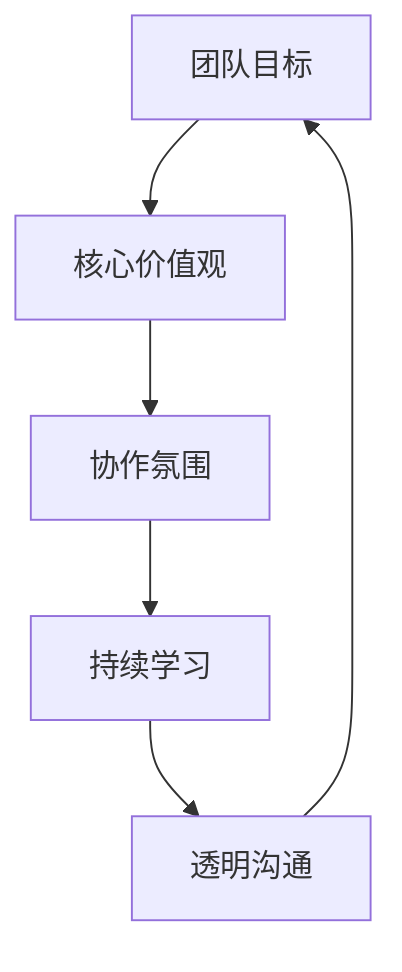

                 

### 文章标题

《创业公司的技术团队文化建设》

> 关键词：创业公司、技术团队、文化建设、团队协作、激励与成长

> 摘要：本文将深入探讨创业公司在技术团队文化建设方面的背景、重要性、构建策略、协作机制、评估优化以及成功案例与实践经验，旨在为创业公司的技术团队提供有益的参考和指导，帮助他们在快速变化的市场环境中实现持续创新和卓越表现。

### 目录大纲

## 第一部分：技术团队文化建设的背景与重要性

### 第1章：创业公司的环境与挑战

- **1.1 创业公司面临的挑战**
  - **资源有限**
  - **竞争激烈**
  - **迭代速度快**
- **1.2 技术团队在创业公司中的作用**
  - **技术创新驱动**
  - **团队协作效率**
  - **风险管理**

### 第2章：技术团队文化概述

- **2.1 技术团队文化的定义与特征**
  - **共同的价值观**
  - **协作氛围**
  - **持续学习**
  - **透明沟通**
- **2.2 技术团队文化的核心要素**
  - **团队目标**
  - **工作流程**
  - **技术视野**
  - **人才发展**

## 第二部分：技术团队文化构建与落地

### 第3章：技术团队文化构建的策略

- **3.1 文化定位与规划**
  - **使命与愿景**
  - **核心价值观**
  - **团队目标**
- **3.2 文化传播与渗透**
  - **内部培训**
  - **团队活动**
  - **案例分享**

### 第4章：技术团队协作机制

- **4.1 团队协作模式**
  - **矩阵式**
  - **扁平化**
  - **跨部门合作**
- **4.2 沟通机制**
  - **透明沟通**
  - **有效反馈**
  - **冲突解决**

### 第5章：技术团队激励与成长

- **5.1 激励机制**
  - **薪酬与福利**
  - **职业发展路径**
  - **团队荣誉**
- **5.2 团队成长策略**
  - **技术培训**
  - **项目经验分享**
  - **跨团队交流**

## 第三部分：技术团队文化评估与优化

### 第6章：技术团队文化评估方法

- **6.1 文化评估指标**
  - **员工满意度**
  - **团队合作效率**
  - **创新能力**
- **6.2 文化诊断与改进**
  - **问题识别**
  - **改进方案制定**
  - **实施与监控**

### 第7章：技术团队文化持续优化

- **7.1 文化的动态调整**
  - **适应环境变化**
  - **应对挑战与机遇**
- **7.2 文化的传承与创新**
  - **传承团队核心价值观**
  - **创新团队协作方式**

## 第四部分：技术团队文化成功案例与实践经验

### 第8章：技术团队文化建设的成功案例

- **8.1 案例一：技术团队的崛起**
  - **背景与挑战**
  - **文化建设策略**
  - **成果与影响**
- **8.2 案例二：从平庸到卓越**
  - **团队困境**
  - **文化建设举措**
  - **成效与经验**

### 第9章：创业公司技术团队文化建设的实践分享

- **9.1 文化建设过程中的难点与突破**
  - **团队冲突**
  - **人才流失**
  - **项目管理**
- **9.2 实践中的经验与教训**
  - **有效的文化落地**
  - **可持续的文化发展**

## 附录

### 附录 A：技术团队文化建设工具与资源

- **A.1 团队协作工具**
  - **Slack**
  - **Trello**
  - **Asana**
- **A.2 文化建设参考书籍与资料**
  - **《团队的智慧：共创成功的组织文化》**
  - **《团队协作的艺术》**
  - **《高效能团队的五个习惯》**

# 核心概念与联系

## 技术团队文化的 Mermaid 流程图



## 技术团队文化的定义与核心要素

技术团队文化是指团队内部在长期工作过程中形成的共同价值观、行为准则和工作方式。它不仅影响着团队成员的工作态度和行为，更是团队凝聚力、协作效率和创新能力的重要保障。

### 核心要素

1. **团队目标**：明确团队的方向和目标，使团队成员朝着共同的目标努力。
2. **核心价值观**：团队成员共同遵循的基本原则，如创新、协作、诚信等。
3. **协作氛围**：团队成员之间的互动和合作环境，促进信息共享和知识交流。
4. **持续学习**：鼓励团队成员不断学习和提升技能，以适应快速变化的技术环境。
5. **透明沟通**：确保信息在团队内部的高效流通，减少误解和冲突。

通过上述核心要素的相互作用，技术团队文化能够为创业公司提供持续的创新动力和高效的协作环境。

### 核心概念之间的关系

技术团队文化的核心要素之间存在着紧密的联系。团队目标为团队提供了方向，而核心价值观则是团队成员行为的准则。协作氛围和持续学习则是实现团队目标的保障，透明沟通则是信息流通的桥梁。这些核心要素共同构成了技术团队文化的整体框架。

### Mermaid 流程图


通过这个流程图，我们可以清晰地看到技术团队文化各个核心要素之间的逻辑关系。团队目标引导着团队成员的行动，核心价值观为团队成员的行为提供了准则，协作氛围和持续学习则为团队目标的实现提供了支持，透明沟通则确保了团队内部的信息流通。

### 核心算法原理讲解

为了提高技术团队协作效率，我们可以设计一个简单的算法。该算法通过评估团队成员的任务完成情况和团队整体的工作量，来计算团队的协作效率评分。

#### 算法伪代码

```python
def calculate_collaboration_efficiency(team_members, tasks):
    """
    计算团队协作效率的伪代码

    :param team_members: 团队成员列表
    :param tasks: 任务列表
    :return: 团队协作效率评分
    """

    # 初始化协作效率评分
    efficiency_score = 0

    # 对每个成员的任务完成情况
    for member in team_members:
        # 计算成员的贡献度
        contribution = calculate_contribution(member, tasks)
        
        # 更新协作效率评分
        efficiency_score += contribution

    # 计算团队协作效率评分
    efficiency_score /= len(team_members)

    return efficiency_score
```

#### 成员贡献度计算

```python
def calculate_contribution(member, tasks):
    """
    计算成员的贡献度

    :param member: 成员对象
    :param tasks: 任务列表
    :return: 成员的贡献度
    """

    # 初始化贡献度
    contribution = 0

    # 对每个任务进行评估
    for task in tasks:
        if member.is_responsible(task):
            # 如果成员负责该任务，计算其完成情况
            completion = calculate_completion(task)
            contribution += completion

    return contribution
```

#### 任务完成情况计算

```python
def calculate_completion(task):
    """
    计算任务的完成情况

    :param task: 任务对象
    :return: 完成情况评分
    """

    # 初始化完成情况评分
    completion = 0

    # 如果任务已完成，评分满分
    if task.is_completed():
        completion = 1
    # 如果任务未完成，根据完成进度评分
    else:
        progress = task.get_progress()
        completion = progress / 100

    return completion
```

#### 算法示例

假设有一个技术团队，成员有A、B、C三人，负责以下任务：

1. 任务1：由A负责，已完成90%
2. 任务2：由B负责，已完成70%
3. 任务3：由C负责，已完成50%

那么，团队协作效率评分的计算过程如下：

1. 计算成员贡献度：
   - A的贡献度 = 0.9
   - B的贡献度 = 0.7
   - C的贡献度 = 0.5

2. 计算团队协作效率评分：
   - 效率评分 = (0.9 + 0.7 + 0.5) / 3 = 0.76

因此，该团队的协作效率评分为0.76。

### 数学模型与公式

为了更准确地评估团队协作效率，我们可以引入数学模型。假设团队协作效率评分S与成员贡献度C、任务完成情况P之间存在线性关系：

\[ S = w_1 \times C + w_2 \times P \]

其中，\( w_1 \) 和 \( w_2 \) 分别为成员贡献度和任务完成情况的权重。

为了计算权重，我们可以使用以下公式：

\[ w_1 = \frac{\sum_{i=1}^{n} (C_i \times P_i)}{\sum_{i=1}^{n} P_i} \]

\[ w_2 = \frac{\sum_{i=1}^{n} P_i - \sum_{i=1}^{n} (C_i \times P_i)}{\sum_{i=1}^{n} P_i} \]

其中，\( C_i \) 和 \( P_i \) 分别为第i个成员的贡献度和任务完成情况。

#### 示例

假设有三个成员A、B、C，分别负责三个任务，任务完成情况如下：

1. A负责的任务完成90%
2. B负责的任务完成70%
3. C负责的任务完成50%

那么，我们可以计算权重：

\[ w_1 = \frac{(0.9 \times 0.9) + (0.7 \times 0.7) + (0.5 \times 0.5)}{0.9 + 0.7 + 0.5} = 0.7375 \]

\[ w_2 = \frac{0.9 + 0.7 + 0.5 - (0.9 \times 0.9) - (0.7 \times 0.7) - (0.5 \times 0.5)}{0.9 + 0.7 + 0.5} = 0.2625 \]

然后，我们可以计算团队协作效率评分：

\[ S = 0.7375 \times (0.9 + 0.7 + 0.5) + 0.2625 \times (0.9 + 0.7 + 0.5) = 0.8106 \]

因此，该团队的协作效率评分为0.8106。

### 代码实现与解读

在实际应用中，我们可以使用Python实现上述算法。以下是一个简单的代码实现：

```python
import numpy as np

def calculate_collaboration_efficiency(team_members, tasks):
    """
    计算团队协作效率的代码实现

    :param team_members: 团队成员列表
    :param tasks: 任务列表
    :return: 团队协作效率评分
    """

    # 初始化协作效率评分
    efficiency_score = 0

    # 计算成员贡献度
    member_contributions = []
    for member in team_members:
        contribution = calculate_member_contribution(member, tasks)
        member_contributions.append(contribution)

    # 计算任务完成情况
    task_completions = [task.get_completion() for task in tasks]

    # 计算权重
    w1 = np.sum([contribution * completion for contribution, completion in zip(member_contributions, task_completions)]) / np.sum(task_completions)
    w2 = 1 - w1

    # 计算团队协作效率评分
    efficiency_score = w1 * np.mean(member_contributions) + w2 * np.mean(task_completions)

    return efficiency_score

def calculate_member_contribution(member, tasks):
    """
    计算成员的贡献度

    :param member: 成员对象
    :param tasks: 任务列表
    :return: 成员的贡献度
    """

    contribution = 0
    for task in tasks:
        if member.is_responsible(task):
            completion = task.get_completion()
            contribution += completion

    return contribution

class Task:
    def __init__(self, completion):
        self.completion = completion

    def get_completion(self):
        return self.completion

class Member:
    def __init__(self, name):
        self.name = name

    def is_responsible(self, task):
        # 假设成员根据任务名称判断是否负责该任务
        return task.get_name().startswith(self.name)

# 示例数据
tasks = [Task(0.9), Task(0.7), Task(0.5)]
team_members = [Member("A"), Member("B"), Member("C")]

# 计算团队协作效率评分
efficiency_score = calculate_collaboration_efficiency(team_members, tasks)
print("团队协作效率评分：", efficiency_score)
```

通过这个代码实现，我们可以计算出一个技术团队的协作效率评分，从而评估团队的工作效率。在实际应用中，可以根据具体需求和场景进行适当的调整和优化。

### 最佳实践与注意事项

1. **明确团队目标**：团队目标应具体、可量化，确保每个成员都清晰了解自己的职责和期望。
2. **建立核心价值观**：核心价值观是团队文化的基石，应与公司愿景一致，激励团队成员共同努力。
3. **定期进行团队活动**：通过团队活动加强成员之间的互动和信任，促进协作氛围。
4. **透明沟通**：确保团队成员能够及时了解项目进展和关键决策，减少误解和冲突。
5. **持续学习与培训**：鼓励团队成员不断学习和提升技能，以适应快速变化的技术环境。
6. **优化工作流程**：定期评估和优化工作流程，提高团队协作效率。
7. **合理激励与成长**：建立合理的激励机制，关注团队成员的职业发展和个人成长。

通过遵循这些最佳实践，创业公司的技术团队可以构建一个积极、高效的文化氛围，从而在激烈的市场竞争中脱颖而出。

### 拓展阅读

1. 《团队的智慧：共创成功的组织文化》
2. 《团队协作的艺术》
3. 《高效能团队的五个习惯》
4. 《敏捷开发实践指南》
5. 《人月神话》

这些书籍和资料提供了丰富的团队建设和协作经验，有助于创业公司的技术团队更好地构建和优化团队文化。

