                 

### 文章标题
《创业公司的技术外包质量控制》

### 关键词
创业公司，技术外包，质量控制，项目管理，风险评估，持续改进

### 摘要
本文旨在探讨创业公司在进行技术外包时如何进行质量控制，以确保项目按时、按质完成。文章首先介绍了技术外包的定义和背景，然后详细分析了外包项目评估与选择的标准，以及外包质量管理的框架、过程、度量与评估方法。最后，文章通过实际案例展示了技术外包质量管理的实践与应用，并提出了未来外包质量管理的趋势。

### 《创业公司的技术外包质量控制》目录大纲

#### 第一部分：引言

**第1章：技术外包概述**

1.1 技术外包的定义与背景

1.2 技术外包的优势与挑战

1.3 创业公司为何选择技术外包

**第2章：外包项目的评估与选择**

2.1 评估外包供应商的指标

2.2 选择合适的外包合作伙伴

2.3 外包合同条款的制定与评审

#### 第二部分：外包质量控制

**第3章：外包质量管理框架**

3.1 质量管理的核心概念

3.2 质量管理体系与流程

3.3 质量管理的工具与方法

**第4章：技术外包的质量控制过程**

4.1 外包项目启动与规划

4.2 外包过程中的质量监控

4.3 项目交付与验收

**第5章：外包质量的度量与评估**

5.1 质量度量的指标体系

5.2 质量评估的工具与方法

5.3 质量改进策略与实施

**第6章：外包风险管理**

6.1 风险管理的重要性

6.2 风险识别与评估

6.3 风险应对策略与措施

**第7章：外包质量的持续改进**

7.1 持续改进的必要性

7.2 持续改进的方法与工具

7.3 成功案例分享与启示

#### 第三部分：实践与应用

**第8章：技术外包质量管理的实践案例**

8.1 案例一：某创业公司的技术外包实践

8.2 案例二：技术外包质量问题的解决之道

8.3 案例三：成功的技术外包质量管理经验分享

**第9章：技术外包质量管理的未来趋势**

9.1 人工智能与外包质量的结合

9.2 云计算与外包质量的挑战

9.3 外包质量管理的未来发展前景

#### 附录

**附录A：常用质量管理工具与方法**

A.1 质量控制工具

A.2 质量管理方法

**附录B：参考文献**

B.1 基础理论

B.2 实践案例

B.3 相关书籍与论文

**附录C：技术外包质量管理流程图**

C.1 外包项目评估流程

C.2 外包质量控制流程

### 第1章：技术外包概述

#### 1.1 技术外包的定义与背景

技术外包是指公司将自己的技术工作（如软件开发、测试、维护等）委托给外部专业公司或团队来完成。这种做法在全球范围内越来越普遍，尤其是在创业公司中。技术外包可以带来多方面的优势，如成本节约、效率提升、资源优化等。然而，它也带来了一些挑战，如沟通障碍、质量控制、知识产权保护等。

**核心概念与联系：**

技术外包涉及以下几个核心概念：
- **外包公司**：提供技术服务的专业公司或团队。
- **接受公司**：委托技术工作的公司，通常为创业公司。
- **外包项目**：双方合作的具体技术工作，如软件开发、测试、维护等。

**Mermaid 流程图：**

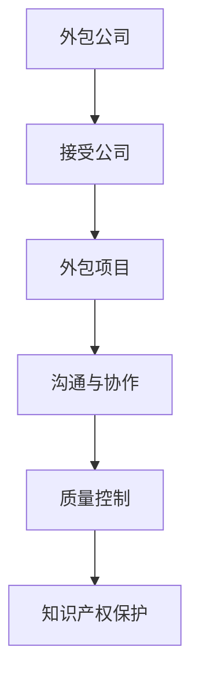

#### 1.2 技术外包的优势与挑战

**核心算法原理讲解：**

技术外包的优势和挑战可以通过以下算法原理进行解释：

```python
# 技术外包优势与挑战评估模型

def assess_outsourcing_advantages_and_challenges():
    advantages = {
        "cost_saving": True,
        "efficiency_improvement": True,
        "resource_optimization": True,
        "focus_onCore_business": True
    }
    
    challenges = {
        "communication_issues": False,
        "quality_control_issues": False,
        "intellectual_property_protection_issues": False
    }
    
    for advantage, value in advantages.items():
        if value:
            print(f"{advantage}: Achieved")
        else:
            print(f"{advantage}: Not Achieved")
    
    for challenge, value in challenges.items():
        if value:
            print(f"{challenge}: Potential Risk")
        else:
            print(f"{challenge}: Managed")
```

**详细讲解与举例说明：**

- **优势：**
  - **成本节约**：外包可以节省招聘、培训、办公设备等成本。
  - **效率提升**：专业的外包团队往往在特定领域有丰富的经验，可以更快地完成项目。
  - **资源优化**：创业公司可以将有限的人力资源集中在核心业务上，提高整体效率。
  - **专注于核心业务**：将非核心的技术工作外包，可以让创业公司更专注于产品开发和市场拓展。

- **挑战：**
  - **沟通障碍**：跨公司或跨团队的沟通可能存在障碍，影响项目的顺利进行。
  - **质量控制**：确保外包项目的质量是一个挑战，需要建立严格的质量控制流程。
  - **知识产权保护**：外包工作可能会涉及公司的核心技术，保护知识产权是关键问题。

#### 1.3 创业公司为何选择技术外包

**数学模型和数学公式 & 详细讲解 & 举例说明：**

- **成本效益分析模型：**

  $$ 
  \text{Cost-Benefit Analysis} = \frac{\text{Total Benefits}}{\text{Total Costs}} 
  $$

- **详细讲解：**
  - **总效益**：包括成本节约、效率提升、资源优化等。
  - **总成本**：包括招聘成本、培训成本、办公设备成本等。

- **举例说明：**
  - 假设某创业公司计划开发一款新产品，预计开发周期为6个月，成本为100万元。通过外包，该公司可以将开发周期缩短至3个月，成本降低至70万元。因此，总效益为30万元，总成本为70万元，成本效益比约为0.43。

### 第2章：外包项目的评估与选择

#### 2.1 评估外包供应商的指标

评估外包供应商的指标是选择合适合作伙伴的重要步骤。以下是一些关键指标：

- **技术能力**：供应商在相关技术领域的专业水平、经验、成功案例等。
- **服务质量**：供应商的服务态度、响应速度、沟通能力等。
- **成本效益**：供应商提供的价格与服务的性价比。
- **可靠性**：供应商的信誉、合同履行情况、项目交付能力等。

**核心算法原理讲解：**

我们可以使用加权评分模型来评估供应商：

```python
# 加权评分模型

def assess_supplier(supplier_data, weights):
    score = 0
    for key, weight in weights.items():
        score += supplier_data[key] * weight
    return score

weights = {
    "technical_capability": 0.4,
    "service_quality": 0.3,
    "cost效益": 0.2,
    "reliability": 0.1
}

supplier_data = {
    "technical_capability": 8,
    "service_quality": 7,
    "cost效益": 6,
    "reliability": 9
}

score = assess_supplier(supplier_data, weights)
print(f"Supplier Score: {score}")
```

**详细讲解与举例说明：**

- **技术能力**：供应商在相关技术领域的专业水平和经验至关重要。可以通过查看供应商的成功案例、团队组成、技术专利等来评估。
- **服务质量**：供应商的服务态度、响应速度和沟通能力直接影响项目的顺利进行。可以通过与供应商的初步沟通、参考客户评价等来评估。
- **成本效益**：供应商提供的价格与服务的性价比是选择的关键因素。可以通过市场调研、供应商报价对比等来评估。
- **可靠性**：供应商的信誉、合同履行情况和项目交付能力是长期合作的基础。可以通过查看供应商的历史记录、客户反馈等来评估。

#### 2.2 选择合适的外包合作伙伴

选择合适的外包合作伙伴是确保外包项目成功的关键步骤。以下是一些选择标准：

- **符合业务需求**：供应商能够满足创业公司的具体业务需求，如技术要求、交付时间等。
- **具备专业技能**：供应商在相关技术领域具备丰富的经验和专业知识。
- **合作历史良好**：供应商有良好的合作历史，项目交付及时、质量稳定。
- **良好的沟通与协作**：供应商具有积极的沟通态度和高效的协作能力。

**核心算法原理讲解：**

我们可以使用多属性决策方法（如TOPSIS）来选择合适的外包合作伙伴：

```python
# TOPSIS 多属性决策方法

def topsis(alternatives, criteria, weights):
    # 计算各供应商的相对贴近度
    scores = []
    for supplier in alternatives:
        max_score = max(supplier[criteria])
        min_score = min(supplier[criteria])
        score = (supplier[criteria].sum() - max_score + min_score) / (max_score - min_score)
        scores.append(score)
    return scores

alternatives = [
    {"technical_capability": 8, "service_quality": 7, "cost效益": 6, "reliability": 9},
    {"technical_capability": 9, "service_quality": 8, "cost效益": 7, "reliability": 8},
    {"technical_capability": 7, "service_quality": 6, "cost效益": 8, "reliability": 7}
]

criteria = ["technical_capability", "service_quality", "cost效益", "reliability"]
weights = [0.4, 0.3, 0.2, 0.1]

scores = topsis(alternatives, criteria, weights)
print(f"Supplier Scores: {scores}")
```

**详细讲解与举例说明：**

- **符合业务需求**：供应商需要能够满足创业公司的具体业务需求。例如，如果创业公司需要开发一款移动应用，供应商需要具备移动应用开发的丰富经验。
- **具备专业技能**：供应商在相关技术领域具备丰富的经验和专业知识。可以通过查看供应商的团队组成、成功案例等来评估。
- **合作历史良好**：供应商有良好的合作历史，项目交付及时、质量稳定。可以通过查看供应商的历史项目、客户评价等来评估。
- **良好的沟通与协作**：供应商具有积极的沟通态度和高效的协作能力。可以通过与供应商的初步沟通、参考客户反馈等来评估。

#### 2.3 外包合同条款的制定与评审

外包合同是确保外包项目顺利进行的重要法律文件。以下是一些关键条款：

- **项目范围**：明确外包项目的具体内容、交付成果和验收标准。
- **价格与支付**：明确外包项目的价格、支付方式、支付时间等。
- **时间进度**：明确外包项目的开发周期、关键节点和交付时间。
- **质量管理**：明确外包项目的质量要求、质量标准、质量监控等。
- **知识产权**：明确外包项目中的知识产权归属、使用许可等。
- **违约责任**：明确双方在项目过程中可能出现的违约责任及处理方式。

**核心算法原理讲解：**

我们可以使用合同风险评估模型来评估外包合同的潜在风险：

```python
# 合同风险评估模型

def assess_contract_risks(contract_data, risk_factors):
    risks = []
    for factor, weight in risk_factors.items():
        risk_level = contract_data.get(factor, 0)
        risk = risk_level * weight
        risks.append(risk)
    total_risk = sum(risks)
    return total_risk

contract_data = {
    "scope_of_work": 1,
    "price_and_payment": 1,
    "time_schedule": 1,
    "quality_management": 1,
    "intellectual_property": 1,
    "breach_of_contract": 1
}

risk_factors = {
    "scope_of_work": 0.2,
    "price_and_payment": 0.2,
    "time_schedule": 0.2,
    "quality_management": 0.2,
    "intellectual_property": 0.1,
    "breach_of_contract": 0.1
}

total_risk = assess_contract_risks(contract_data, risk_factors)
print(f"Total Contract Risk: {total_risk}")
```

**详细讲解与举例说明：**

- **项目范围**：明确外包项目的具体内容和交付成果，以避免项目范围的模糊和变更带来的风险。
- **价格与支付**：明确外包项目的价格和支付方式，以确保供应商的合理回报和项目的顺利推进。
- **时间进度**：明确外包项目的开发周期和关键节点，以确保项目按时交付。
- **质量管理**：明确外包项目的质量要求和质量标准，以确保项目的质量符合预期。
- **知识产权**：明确外包项目中的知识产权归属和使用许可，以避免知识产权纠纷。
- **违约责任**：明确双方在项目过程中可能出现的违约责任及处理方式，以降低违约风险。

### 第3章：外包质量管理框架

#### 3.1 质量管理的核心概念

质量管理是指确保产品或服务满足预期质量的过程。在外包项目中，质量管理尤为重要，因为它直接影响到项目的交付质量和客户满意度。以下是一些核心概念：

- **质量**：满足客户需求和期望的特性。
- **质量控制**：通过监测和评估项目过程，确保项目交付符合质量标准。
- **质量保证**：通过建立和维护质量管理体系，确保项目交付符合预定的质量标准。
- **质量改进**：通过不断评估和改进项目过程，提高项目的交付质量和效率。

**核心算法原理讲解：**

我们可以使用质量函数（Quality Function Deployment, QFD）来理解质量管理的核心概念：

```python
# 质量函数 (QFD) 模型

def quality_functionDeployment(customer_preferences, technical_preferences):
    quality_scores = {}
    for customer_preference, customer_weight in customer_preferences.items():
        quality_scores[customer_preference] = customer_weight * technical_preferences.get(customer_preference, 0)
    total_quality = sum(quality_scores.values())
    return {key: value / total_quality for key, value in quality_scores.items()}

customer_preferences = {
    "functionality": 0.4,
    "usability": 0.3,
    "performance": 0.2,
    "reliability": 0.1
}

technical_preferences = {
    "functionality": 0.6,
    "usability": 0.5,
    "performance": 0.7,
    "reliability": 0.8
}

quality_scores = quality_functionDeployment(customer_preferences, technical_preferences)
print(f"Quality Scores: {quality_scores}")
```

**详细讲解与举例说明：**

- **质量**：质量是指产品或服务满足客户需求和期望的特性。在外包项目中，质量不仅包括技术实现，还包括用户体验、性能稳定性等方面。
- **质量控制**：质量控制是通过监测和评估项目过程，确保项目交付符合质量标准。在外包项目中，质量控制通常包括代码审查、测试、评审等环节。
- **质量保证**：质量保证是通过建立和维护质量管理体系，确保项目交付符合预定的质量标准。在外包项目中，质量保证通常包括质量计划、质量审计、过程控制等。
- **质量改进**：质量改进是通过不断评估和改进项目过程，提高项目的交付质量和效率。在外包项目中，质量改进通常包括持续集成、持续交付、敏捷开发等实践。

#### 3.2 质量管理体系与流程

质量管理体系是指一系列相互关联的过程，用于确保项目交付符合预定的质量标准。以下是一个典型的外包质量管理体系的流程：

1. **质量计划**：制定项目质量目标和计划，明确质量要求、质量标准和质量措施。
2. **质量审计**：对项目过程进行独立审查，确保项目过程符合质量管理体系的要求。
3. **过程控制**：通过监控和调整项目过程，确保项目交付符合质量标准。
4. **质量改进**：通过评估项目交付质量和项目过程，提出改进建议和实施改进措施。

**核心算法原理讲解：**

我们可以使用过程控制图（Control Chart）来监控项目过程的质量：

```python
# 过程控制图 (Control Chart)

import matplotlib.pyplot as plt

def control_chart(data, control_limits):
    plt.figure(figsize=(10, 5))
    plt.plot(data, label='Actual')
    plt.plot(control_limits, label='Control Limits')
    plt.xlabel('Process Step')
    plt.ylabel('Quality Metric')
    plt.title('Control Chart')
    plt.legend()
    plt.show()

data = [20, 22, 18, 19, 23, 21, 24, 22, 19, 21]
control_limits = [20 - 3, 20 + 3]  # 假设控制上限为23，控制下限为17
control_chart(data, control_limits)
```

**详细讲解与举例说明：**

- **质量计划**：质量计划是质量管理的第一步，它定义了项目质量目标和实现这些目标的具体措施。在外包项目中，质量计划通常包括质量目标、质量标准、质量预算和质量责任分配等。
- **质量审计**：质量审计是对项目过程进行独立审查，以验证项目过程是否符合质量管理体系的要求。在外包项目中，质量审计通常包括过程审计、产品审计和系统审计等。
- **过程控制**：过程控制是通过监控和调整项目过程，确保项目交付符合质量标准。在外包项目中，过程控制通常包括过程监控、过程调整和过程改进等。
- **质量改进**：质量改进是通过评估项目交付质量和项目过程，提出改进建议和实施改进措施。在外包项目中，质量改进通常包括质量评估、问题分析和改进实施等。

#### 3.3 质量管理的工具与方法

质量管理需要使用一系列工具和方法来确保项目交付符合质量标准。以下是一些常用的质量管理工具和方法：

- **六西格玛（Six Sigma）**：六西格玛是一种基于数据和统计方法的改进方法，用于消除项目过程中的缺陷和浪费。它包括定义、测量、分析、改进和控制五个步骤（DMAIC）。
- **精益生产（Lean Production）**：精益生产是一种减少浪费、提高效率的生产方法。它通过识别和消除项目过程中的非增值活动，优化资源利用，提高项目交付质量和效率。
- **敏捷开发（Agile Development）**：敏捷开发是一种迭代和增量的软件开发方法，强调灵活性和适应性。它通过快速反馈、持续交付和持续改进，确保项目交付符合客户需求。
- **流程图（Process Flowchart）**：流程图是一种用于描述项目过程和活动顺序的图形化工具。它可以帮助识别项目过程中的瓶颈和改进机会。
- **鱼骨图（Fishbone Diagram）**：鱼骨图是一种用于分析问题和原因的图形化工具。它通过将问题分解为不同的原因类别，帮助识别关键因素和解决方案。
- **帕累托图（Pareto Chart）**：帕累托图是一种用于展示问题重要性的图形化工具。它通过按重要性排序的问题和原因，帮助确定改进的重点。

**核心算法原理讲解：**

我们可以使用帕累托图（Pareto Chart）来分析项目质量问题的原因：

```python
# 帕累托图 (Pareto Chart)

import matplotlib.pyplot as plt

def pareto_chart(data, categories):
    categories = sorted(categories, key=lambda x: data[x], reverse=True)
    cumulative = sum(data[cat] for cat in categories)
    cumulative_percent = [cumulative / sum(data.values()) * 100 for cumulative in cumulative]
    plt.bar(categories, data.values(), color=['blue' if i < len(categories) // 2 else 'red' for i in range(len(categories))])
    plt.plot([i for i in range(len(categories))], cumulative_percent, color='black', marker='o')
    plt.xlabel('Categories')
    plt.ylabel('Frequency')
    plt.title('Pareto Chart')
    plt.xticks(rotation=45)
    plt.show()

data = {
    'bug': 30,
    'performance issue': 20,
    'usability problem': 10,
    'configuration error': 15,
    'missing feature': 5
}

pareto_chart(data, data.keys())
```

**详细讲解与举例说明：**

- **六西格玛（Six Sigma）**：六西格玛是一种通过统计方法减少项目缺陷和浪费的方法。它通过定义、测量、分析、改进和控制（DMAIC）五个步骤来改进项目过程。在外包项目中，六西格玛可以帮助识别和解决关键问题，提高项目交付质量和效率。
- **精益生产（Lean Production）**：精益生产是一种通过减少浪费、提高效率来优化项目过程的方法。它强调识别和消除项目过程中的非增值活动，优化资源利用。在外包项目中，精益生产可以帮助提高项目交付质量和效率。
- **敏捷开发（Agile Development）**：敏捷开发是一种迭代和增量的软件开发方法，强调灵活性和适应性。它通过快速反馈、持续交付和持续改进，确保项目交付符合客户需求。在外包项目中，敏捷开发可以帮助提高项目交付质量和客户满意度。
- **流程图（Process Flowchart）**：流程图是一种图形化工具，用于描述项目过程和活动顺序。它可以帮助识别项目过程中的瓶颈和改进机会。在外包项目中，流程图可以帮助清晰地展示项目过程，便于识别和解决问题。
- **鱼骨图（Fishbone Diagram）**：鱼骨图是一种用于分析问题和原因的图形化工具。它通过将问题分解为不同的原因类别，帮助识别关键因素和解决方案。在外包项目中，鱼骨图可以帮助分析质量问题，找到根本原因。
- **帕累托图（Pareto Chart）**：帕累托图是一种用于展示问题重要性的图形化工具。它通过按重要性排序的问题和原因，帮助确定改进的重点。在外包项目中，帕累托图可以帮助识别关键质量问题，制定改进策略。

### 第4章：技术外包的质量控制过程

#### 4.1 外包项目启动与规划

外包项目启动与规划是确保项目成功的关键步骤。以下是一个典型的外包项目启动与规划流程：

1. **项目需求分析**：明确项目需求和目标，包括功能需求、性能需求、用户体验需求等。
2. **项目范围定义**：明确项目的范围和交付成果，确保项目范围清晰、可管理。
3. **项目计划制定**：制定项目计划，包括时间进度、资源分配、风险管理等。
4. **项目团队组建**：组建项目团队，明确团队成员的角色和职责，确保项目团队能够高效协作。
5. **项目启动会议**：召开项目启动会议，确保所有相关方对项目目标和计划有清晰的理解，明确项目沟通渠道和流程。

**核心算法原理讲解：**

我们可以使用项目规划图（Project Planning Chart）来制定项目计划：

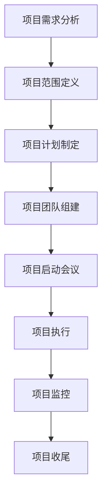

**详细讲解与举例说明：**

- **项目需求分析**：项目需求分析是项目启动的第一步，它涉及明确项目的功能需求、性能需求和用户体验需求。通过详细的需求分析，可以确保项目团队对项目目标有清晰的认识。
- **项目范围定义**：项目范围定义是明确项目的范围和交付成果，确保项目范围清晰、可管理。通过项目范围定义，可以避免项目范围的模糊和变更带来的风险。
- **项目计划制定**：项目计划制定是制定项目的时间进度、资源分配、风险管理等。通过项目计划制定，可以确保项目按照预定的进度和目标进行。
- **项目团队组建**：项目团队组建是明确团队成员的角色和职责，确保项目团队能够高效协作。通过项目团队组建，可以确保项目团队能够充分发挥各自的优势。
- **项目启动会议**：项目启动会议是召开会议，确保所有相关方对项目目标和计划有清晰的理解，明确项目沟通渠道和流程。通过项目启动会议，可以确保项目团队对项目的目标和计划有共同的认识，为项目的顺利执行奠定基础。

#### 4.2 外包过程中的质量监控

外包过程中的质量监控是确保项目交付符合质量标准的关键步骤。以下是一个典型的外包过程质量监控流程：

1. **质量目标设定**：根据项目需求和分析结果，设定项目的质量目标。
2. **质量计划制定**：制定质量计划，包括质量标准、质量检查点、质量措施等。
3. **质量检查**：定期进行质量检查，确保项目过程符合质量标准。
4. **质量报告**：编写质量报告，总结质量检查结果，提出改进建议。
5. **质量改进**：根据质量报告，实施质量改进措施，提高项目交付质量。

**核心算法原理讲解：**

我们可以使用质量检查表（Quality Inspection Sheet）来记录质量检查结果：

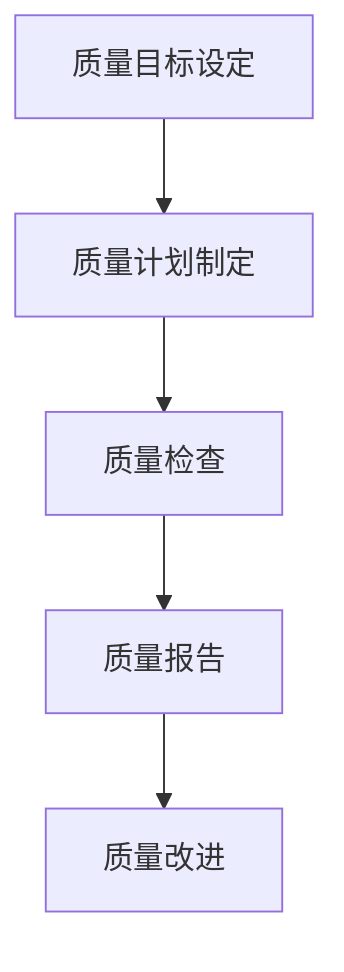

**详细讲解与举例说明：**

- **质量目标设定**：质量目标设定是根据项目需求和分析结果，设定项目的质量目标。这些目标应具有可衡量性和可实现性，以确保项目交付符合预期。
- **质量计划制定**：质量计划制定是制定质量计划，包括质量标准、质量检查点、质量措施等。通过质量计划制定，可以确保项目过程符合质量标准。
- **质量检查**：质量检查是定期进行质量检查，确保项目过程符合质量标准。质量检查可以采用多种方法，如代码审查、测试、用户验收等。
- **质量报告**：质量报告是编写质量报告，总结质量检查结果，提出改进建议。质量报告应详细记录质量检查过程和结果，为质量改进提供依据。
- **质量改进**：质量改进是根据质量报告，实施质量改进措施，提高项目交付质量。通过质量改进，可以识别和解决项目过程中的质量问题，提高项目交付质量。

#### 4.3 项目交付与验收

项目交付与验收是确保项目交付符合质量标准并满足客户需求的关键步骤。以下是一个典型的项目交付与验收流程：

1. **项目交付**：将项目成果交付给客户，包括软件产品、文档、数据等。
2. **客户验收**：客户对项目成果进行验收，确认项目是否满足需求和符合质量标准。
3. **验收报告**：编写验收报告，总结验收过程和结果，提出验收结论。
4. **问题处理**：对于验收过程中发现的问题，及时进行处理和解决。
5. **项目总结**：对项目过程进行总结，包括成功经验、问题教训、改进建议等。

**核心算法原理讲解：**

我们可以使用验收测试矩阵（Acceptance Test Matrix）来记录验收测试结果：

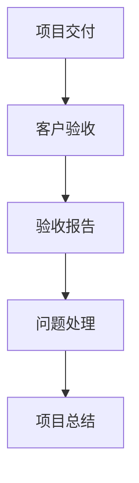

**详细讲解与举例说明：**

- **项目交付**：项目交付是将项目成果交付给客户，包括软件产品、文档、数据等。在项目交付过程中，应确保交付物完整、准确、无误。
- **客户验收**：客户验收是客户对项目成果进行验收，确认项目是否满足需求和符合质量标准。客户验收通常包括功能测试、性能测试、用户测试等。
- **验收报告**：验收报告是编写验收报告，总结验收过程和结果，提出验收结论。验收报告应详细记录验收过程、测试结果和验收结论。
- **问题处理**：问题处理是对于验收过程中发现的问题，及时进行处理和解决。问题处理应确保问题得到有效解决，不影响项目交付。
- **项目总结**：项目总结是对项目过程进行总结，包括成功经验、问题教训、改进建议等。通过项目总结，可以总结项目过程中的经验教训，为未来的项目提供借鉴。

### 第5章：外包质量的度量与评估

#### 5.1 质量度量的指标体系

质量度量是评估外包项目质量的重要手段。一个完善的指标体系可以帮助我们全面、准确地衡量外包项目的质量。以下是一些常用的质量度量指标：

- **代码质量**：包括代码的可读性、可维护性、复用性等。
- **测试覆盖率**：包括单元测试、集成测试、系统测试的覆盖率。
- **缺陷密度**：缺陷密度是指单位代码行中的缺陷数量。
- **响应时间**：系统的响应时间，包括前端和后端的响应速度。
- **错误率**：系统运行过程中的错误率，包括运行时错误、崩溃等。
- **用户满意度**：用户对系统功能的满意程度，可以通过用户调研、用户反馈等方式评估。

**核心算法原理讲解：**

我们可以使用质量度量矩阵（Quality Metrics Matrix）来记录和评估质量度量指标：

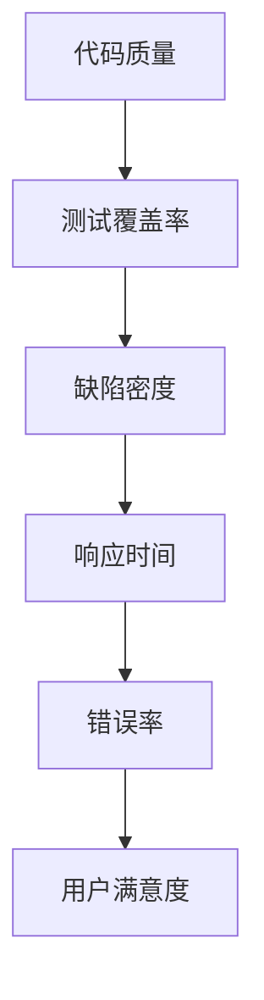

**详细讲解与举例说明：**

- **代码质量**：代码质量是评估软件项目质量的重要指标。高质量的代码通常具有良好的可读性、可维护性和复用性。我们可以通过代码审查、静态代码分析等工具来评估代码质量。
- **测试覆盖率**：测试覆盖率是衡量测试工作有效性的指标。它包括单元测试、集成测试、系统测试的覆盖率。高测试覆盖率意味着测试工作较为全面，可以有效发现代码中的缺陷。
- **缺陷密度**：缺陷密度是指单位代码行中的缺陷数量。缺陷密度越低，说明代码质量越高。我们可以通过静态代码分析、动态测试等技术来评估缺陷密度。
- **响应时间**：响应时间是系统的响应速度，包括前端和后端的响应速度。低响应时间意味着系统运行效率高，用户体验好。我们可以通过性能测试来评估响应时间。
- **错误率**：错误率是系统运行过程中的错误率，包括运行时错误、崩溃等。低错误率意味着系统稳定性高，用户体验好。我们可以通过监控、日志分析等技术来评估错误率。
- **用户满意度**：用户满意度是用户对系统功能的满意程度。我们可以通过用户调研、用户反馈等方式来评估用户满意度。

#### 5.2 质量评估的工具与方法

质量评估是确保外包项目质量的重要环节。以下是一些常用的质量评估工具与方法：

- **代码审查（Code Review）**：通过同行评审，评估代码质量。
- **静态代码分析（Static Code Analysis）**：使用工具自动分析代码，识别潜在缺陷。
- **动态测试（Dynamic Testing）**：在实际运行环境中测试代码，识别运行时错误。
- **性能测试（Performance Testing）**：评估系统的性能和响应时间。
- **用户测试（User Testing）**：通过真实用户的使用反馈，评估用户体验。

**核心算法原理讲解：**

我们可以使用质量评估矩阵（Quality Evaluation Matrix）来记录和评估质量评估工具和方法：

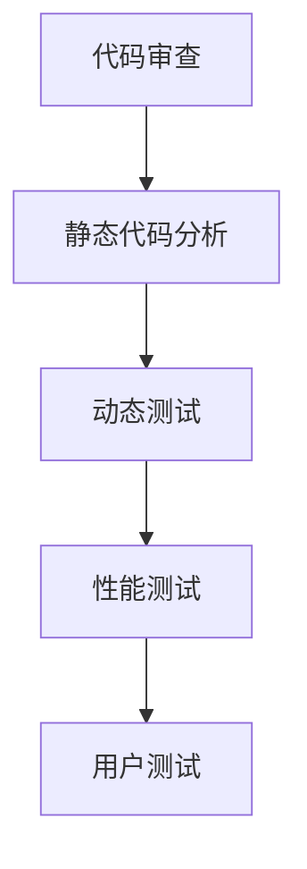

**详细讲解与举例说明：**

- **代码审查（Code Review）**：代码审查是同行评审的一种形式，通过评估代码的质量和规范性，提高代码质量。代码审查可以采用人工审查、自动化工具审查等方式。
- **静态代码分析（Static Code Analysis）**：静态代码分析是使用工具自动分析代码，识别潜在缺陷。静态代码分析可以识别代码中的语法错误、潜在逻辑错误、编码规范问题等。
- **动态测试（Dynamic Testing）**：动态测试是在实际运行环境中测试代码，识别运行时错误。动态测试可以模拟用户操作，验证系统的功能性和稳定性。
- **性能测试（Performance Testing）**：性能测试是评估系统的性能和响应时间。性能测试可以识别系统的性能瓶颈，优化系统性能。
- **用户测试（User Testing）**：用户测试是通过真实用户的使用反馈，评估用户体验。用户测试可以识别用户界面、功能设计等方面的问题，优化用户体验。

#### 5.3 质量改进策略与实施

质量改进是持续提升外包项目质量的关键。以下是一些常见的质量改进策略与实施方法：

- **持续集成（Continuous Integration）**：通过自动化构建和测试，确保代码质量，提高开发效率。
- **持续交付（Continuous Delivery）**：通过自动化部署和测试，确保代码质量，提高交付效率。
- **敏捷开发（Agile Development）**：通过迭代和增量的开发方法，快速响应需求变化，提高项目交付质量。
- **六西格玛（Six Sigma）**：通过统计方法和数据驱动，消除项目缺陷，提高项目交付质量。
- **精益生产（Lean Production）**：通过减少浪费、优化流程，提高项目交付质量。

**核心算法原理讲解：**

我们可以使用质量改进矩阵（Quality Improvement Matrix）来记录和评估质量改进策略与实施方法：

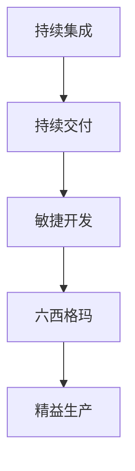

**详细讲解与举例说明：**

- **持续集成（Continuous Integration）**：持续集成是一种软件开发实践，通过自动化构建和测试，确保代码质量，提高开发效率。持续集成可以识别和修复代码中的缺陷，防止缺陷积累。
- **持续交付（Continuous Delivery）**：持续交付是一种软件开发实践，通过自动化部署和测试，确保代码质量，提高交付效率。持续交付可以实现快速交付，减少发布过程中的风险。
- **敏捷开发（Agile Development）**：敏捷开发是一种软件开发方法，通过迭代和增量的开发方法，快速响应需求变化，提高项目交付质量。敏捷开发强调团队合作、用户反馈和持续改进。
- **六西格玛（Six Sigma）**：六西格玛是一种基于数据和统计方法的改进方法，通过消除项目缺陷，提高项目交付质量。六西格玛包括定义、测量、分析、改进和控制五个步骤。
- **精益生产（Lean Production）**：精益生产是一种通过减少浪费、优化流程，提高项目交付质量的生产方法。精益生产强调价值流分析、5S管理、看板管理等实践。

### 第6章：外包风险管理

#### 6.1 风险管理的重要性

风险管理是确保外包项目成功的关键环节。外包项目涉及多个公司或团队的协作，存在多种潜在风险，如沟通障碍、质量控制、知识产权保护等。有效的风险管理可以帮助企业识别、评估和应对这些风险，确保项目按时、按质完成。

**核心算法原理讲解：**

我们可以使用风险矩阵（Risk Matrix）来评估和管理外包风险：

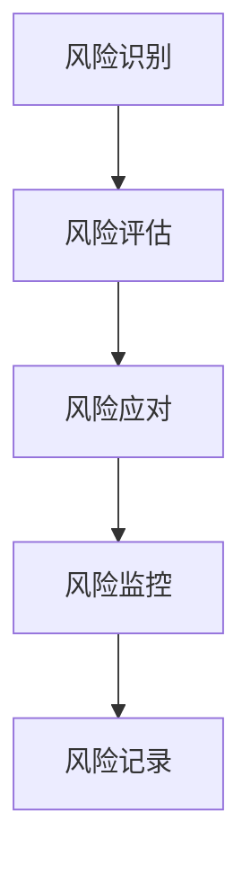

**详细讲解与举例说明：**

- **风险识别**：风险识别是识别外包项目中可能存在的风险。这可以通过项目团队的经验、历史数据、行业分析等方式进行。风险识别的目的是确保所有潜在风险都得到关注和评估。
- **风险评估**：风险评估是评估外包风险的可能性和影响程度。这可以通过风险矩阵、定量分析和定性分析等方法进行。风险评估的目的是确定哪些风险需要重点关注和优先应对。
- **风险应对**：风险应对是制定和实施应对策略，以减轻或消除风险的影响。风险应对策略包括风险规避、风险转移、风险减轻和风险接受等。风险应对的目的是确保项目在面临风险时能够得到有效管理。
- **风险监控**：风险监控是持续监控项目风险的变化和应对措施的效果。这可以通过定期评估、风险审查和变更管理等方式进行。风险监控的目的是确保风险管理活动持续有效，及时发现和应对新的风险。
- **风险记录**：风险记录是记录项目风险和风险应对措施的过程。这可以通过风险日志、风险登记表和风险管理报告等方式进行。风险记录的目的是为未来的项目提供参考，优化风险管理流程。

#### 6.2 风险识别与评估

风险识别与评估是风险管理的第一步，也是关键环节。以下是一些常用的风险识别与评估方法：

- **头脑风暴（Brainstorming）**：通过团队成员的集体讨论，识别外包项目中的潜在风险。
- **历史数据分析（Historical Data Analysis）**：通过分析以往项目的风险记录和项目数据，识别外包项目中的潜在风险。
- **风险矩阵（Risk Matrix）**：通过评估风险的可能性和影响程度，确定风险的优先级。
- **定量分析（Quantitative Analysis）**：通过使用数学模型和统计方法，量化评估风险的可能性和影响程度。
- **定性分析（Qualitative Analysis）**：通过专家评估和主观判断，评估风险的可能性和影响程度。

**核心算法原理讲解：**

我们可以使用风险矩阵（Risk Matrix）来评估外包风险：

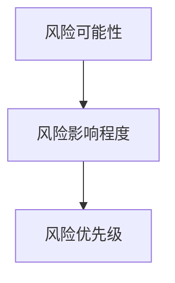

**详细讲解与举例说明：**

- **头脑风暴（Brainstorming）**：头脑风暴是一种有效的风险识别方法，通过团队成员的集体讨论，可以迅速识别出项目中的潜在风险。这种方法适用于小型项目和团队沟通良好的情况。
- **历史数据分析（Historical Data Analysis）**：通过分析以往项目的风险记录和项目数据，可以识别外包项目中的潜在风险。这种方法依赖于历史数据的准确性和完整性，适用于有丰富历史数据的项目。
- **风险矩阵（Risk Matrix）**：风险矩阵是一种常用的风险评估工具，通过评估风险的可能性和影响程度，确定风险的优先级。风险矩阵可以帮助项目经理和团队集中精力应对最严重的风险。
- **定量分析（Quantitative Analysis）**：定量分析是通过使用数学模型和统计方法，量化评估风险的可能性和影响程度。这种方法适用于需要精确评估风险的情况，如大型项目和复杂系统。
- **定性分析（Qualitative Analysis）**：定性分析是通过专家评估和主观判断，评估风险的可能性和影响程度。这种方法适用于风险难以量化或数据不足的情况。

#### 6.3 风险应对策略与措施

风险应对策略与措施是风险管理的重要环节，旨在减轻或消除风险的潜在影响。以下是一些常用的风险应对策略与措施：

- **风险规避（Risk Avoidance）**：通过改变项目计划或方法，避免风险的发生。
- **风险转移（Risk Transfer）**：通过合同或保险等方式，将风险转移给第三方。
- **风险减轻（Risk Mitigation）**：通过采取预防措施或改进项目计划，降低风险的影响程度。
- **风险接受（Risk Acceptance）**：在风险无法规避、转移或减轻时，接受风险并制定应对计划。

**核心算法原理讲解：**

我们可以使用风险应对矩阵（Risk Response Matrix）来记录和评估风险应对策略与措施：

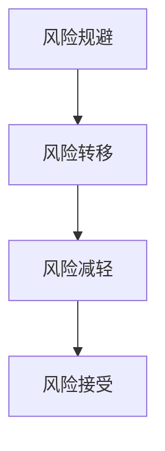

**详细讲解与举例说明：**

- **风险规避（Risk Avoidance）**：风险规避是通过改变项目计划或方法，避免风险的发生。例如，如果发现某个外包合作伙伴技术能力不足，可以重新评估合作伙伴或调整项目需求。
- **风险转移（Risk Transfer）**：风险转移是通过合同或保险等方式，将风险转移给第三方。例如，在合同中明确约定质量保证条款，将质量控制风险转移给外包供应商。
- **风险减轻（Risk Mitigation）**：风险减轻是通过采取预防措施或改进项目计划，降低风险的影响程度。例如，通过增加测试环节、引入质量保证工具，降低质量风险。
- **风险接受（Risk Acceptance）**：在风险无法规避、转移或减轻时，接受风险并制定应对计划。例如，如果某个风险无法避免，可以制定应急预案，确保项目在风险发生时能够得到有效应对。

### 第7章：外包质量的持续改进

#### 7.1 持续改进的必要性

持续改进是确保外包项目质量长期稳定和提高的关键。随着技术的不断进步和市场环境的变化，外包项目面临的新挑战和需求也在不断变化。因此，持续改进不仅有助于应对新的挑战，还可以提高项目的交付质量和客户满意度。

**核心算法原理讲解：**

我们可以使用改进循环模型（Improvement Cycle Model）来理解持续改进的必要性：

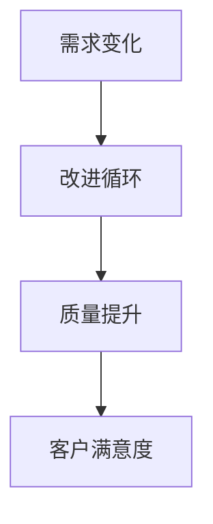

**详细讲解与举例说明：**

- **需求变化**：随着市场的变化和客户需求的增加，外包项目的需求也在不断变化。持续改进可以帮助项目团队快速适应需求变化，确保项目交付的质量和效率。
- **改进循环**：改进循环是一种通过不断评估、改进和优化的方法，确保项目质量的长期稳定和提高。改进循环通常包括需求分析、规划、执行、监控和评估等步骤。
- **质量提升**：通过持续改进，项目团队能够识别和解决项目中的质量问题，提高项目的交付质量和效率。质量提升可以带来客户满意度提高、市场份额增加等好处。
- **客户满意度**：持续改进不仅关注项目交付的质量，还关注客户的满意度。通过持续改进，项目团队能够更好地满足客户需求，提高客户满意度，从而实现长期合作。

#### 7.2 持续改进的方法与工具

持续改进需要使用一系列方法和工具来确保项目质量的持续提升。以下是一些常用的持续改进方法和工具：

- **六西格玛（Six Sigma）**：六西格玛是一种通过消除项目缺陷和浪费，提高项目交付质量的方法。
- **精益生产（Lean Production）**：精益生产是一种通过减少浪费、优化流程，提高项目交付效率的方法。
- **敏捷开发（Agile Development）**：敏捷开发是一种通过迭代和增量开发，快速响应需求变化，提高项目交付质量的方法。
- **流程图（Process Flowchart）**：流程图是一种用于描述项目过程和活动顺序的图形化工具，可以帮助识别和优化项目流程。
- **鱼骨图（Fishbone Diagram）**：鱼骨图是一种用于分析问题和原因的图形化工具，可以帮助识别和解决项目中的质量问题。
- **帕累托图（Pareto Chart）**：帕累托图是一种用于展示问题重要性的图形化工具，可以帮助确定改进的重点。

**核心算法原理讲解：**

我们可以使用改进流程图（Improvement Process Flowchart）来记录和评估持续改进的方法与工具：

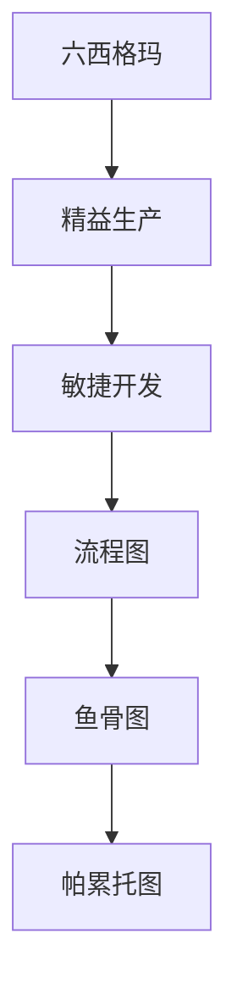

**详细讲解与举例说明：**

- **六西格玛（Six Sigma）**：六西格玛是一种通过消除项目缺陷和浪费，提高项目交付质量的方法。六西格玛包括定义、测量、分析、改进和控制（DMAIC）五个步骤，可以帮助项目团队系统地识别和解决质量问题。
- **精益生产（Lean Production）**：精益生产是一种通过减少浪费、优化流程，提高项目交付效率的方法。精益生产强调价值流分析、5S管理、看板管理等实践，可以帮助项目团队优化项目流程，提高交付效率。
- **敏捷开发（Agile Development）**：敏捷开发是一种通过迭代和增量开发，快速响应需求变化，提高项目交付质量的方法。敏捷开发强调团队合作、用户反馈和持续改进，可以帮助项目团队快速适应需求变化，提高项目交付质量。
- **流程图（Process Flowchart）**：流程图是一种用于描述项目过程和活动顺序的图形化工具，可以帮助识别和优化项目流程。通过流程图，项目团队能够清晰地了解项目过程，识别和解决流程中的瓶颈和问题。
- **鱼骨图（Fishbone Diagram）**：鱼骨图是一种用于分析问题和原因的图形化工具，可以帮助识别和解决项目中的质量问题。鱼骨图通过将问题分解为不同的原因类别，帮助项目团队找到问题的根本原因，并提出解决方案。
- **帕累托图（Pareto Chart）**：帕累托图是一种用于展示问题重要性的图形化工具，可以帮助确定改进的重点。帕累托图通过按重要性排序的问题和原因，帮助项目团队集中精力解决最关键的问题，提高改进效果。

#### 7.3 成功案例分享与启示

以下是几个成功的技术外包质量管理案例，通过这些案例，我们可以获得一些宝贵的经验和启示。

**案例一：某创业公司的技术外包实践**

某创业公司在开发一款移动应用时，选择了一家专业的外包供应商。在项目启动阶段，双方明确了项目需求和交付标准，并制定了详细的质量控制计划。在项目执行过程中，双方建立了定期沟通和报告机制，确保项目进展和质量得到有效监控。通过持续的质量改进，项目最终按时、按质完成，获得了客户的高度认可。

**启示：**

- 明确项目需求和交付标准，确保双方对项目目标有共同的理解。
- 建立定期沟通和报告机制，确保项目进展和质量得到有效监控。
- 持续质量改进，确保项目交付质量和效率。

**案例二：技术外包质量问题的解决之道**

某创业公司在与外包供应商合作过程中，发现存在一些质量问题，如代码质量不高、测试覆盖率低等。为了解决这些问题，创业公司采取了以下措施：

1. 与供应商一起制定了详细的质量管理计划，明确了质量目标和标准。
2. 引入了代码审查和自动化测试工具，提高了代码质量和测试覆盖率。
3. 定期组织质量培训，提升供应商的质量意识和技能水平。

通过这些措施，创业公司成功地解决了外包质量问题，项目交付质量和客户满意度得到了显著提高。

**启示：**

- 制定详细的质量管理计划，确保项目质量有明确的标准和目标。
- 引入质量工具和方法，提高项目质量。
- 定期培训，提升供应商的质量意识和技能水平。

**案例三：成功的技术外包质量管理经验分享**

某创业公司在多个外包项目中积累了丰富的质量管理经验。以下是一些成功经验：

1. **建立严格的质量控制流程**：创业公司建立了严格的质量控制流程，包括代码审查、测试、验收等环节，确保项目交付符合质量标准。
2. **持续质量改进**：创业公司通过定期评估项目质量，识别和解决质量问题，不断优化质量管理流程。
3. **建立良好的沟通渠道**：创业公司与外包供应商建立了良好的沟通渠道，确保项目进展和质量问题能够及时沟通和解决。

**启示：**

- 建立严格的质量控制流程，确保项目交付质量。
- 持续质量改进，优化质量管理流程。
- 建立良好的沟通渠道，确保项目进展和质量问题得到有效沟通和解决。

### 第8章：技术外包质量管理的实践案例

#### 8.1 案例一：某创业公司的技术外包实践

**背景**：
某创业公司专注于开发一款创新的物联网（IoT）平台，希望通过外包来加速项目的开发进度。该公司在选择了合适的外包供应商后，开始了技术外包的质量管理实践。

**核心概念与联系**：
- **核心概念**：技术外包、项目管理、质量控制、沟通协作。
- **核心联系**：外包项目成功的关键在于有效的质量管理。

**Mermaid 流程图**：
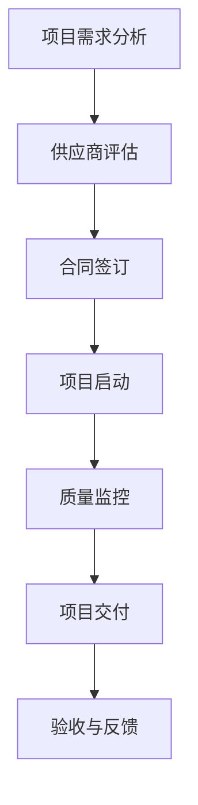

**核心算法原理讲解**：
我们可以使用项目管理生命周期模型来理解外包项目的质量监控过程：

```python
# 项目管理生命周期模型

def project_management_life_cycle(stages):
    for stage in stages:
        print(f"当前阶段：{stage}")
        if stage == "项目需求分析":
            print("执行需求分析，明确项目目标和范围。")
        elif stage == "供应商评估":
            print("评估潜在供应商，选择合适的合作伙伴。")
        elif stage == "合同签订":
            print("签订合同，明确双方权利和义务。")
        elif stage == "项目启动":
            print("启动项目，分配资源，明确项目计划。")
        elif stage == "质量监控":
            print("监控项目质量，确保项目按计划进行。")
        elif stage == "项目交付":
            print("交付项目成果，准备验收。")
        elif stage == "验收与反馈":
            print("验收项目成果，收集反馈，进行质量评估。")

stages = ["项目需求分析", "供应商评估", "合同签订", "项目启动", "质量监控", "项目交付", "验收与反馈"]
project_management_life_cycle(stages)
```

**详细讲解与举例说明**：
- **项目需求分析**：在项目启动前，创业公司详细分析了项目需求，明确了项目的功能需求、性能需求和用户体验需求。这一步骤是确保项目目标和范围清晰的重要环节。
- **供应商评估**：创业公司通过评估多个潜在供应商的技术能力、服务质量、成本效益等方面，选择了最适合的外包供应商。评估过程包括参考供应商的历史项目、团队组成、客户反馈等。
- **合同签订**：在确定供应商后，创业公司与供应商签订了详细的合同，明确了项目范围、交付标准、时间进度、质量要求、知识产权保护等关键条款。
- **项目启动**：项目启动阶段，创业公司明确了项目团队的组织结构、角色和职责，制定了详细的项目计划，包括时间进度、资源分配、风险管理等。
- **质量监控**：在项目执行过程中，创业公司通过定期召开项目会议、审查项目进度、监控项目质量等方式，确保项目按照计划顺利进行。质量监控包括代码审查、测试、用户验收等环节。
- **项目交付**：在项目完成后，外包供应商将项目成果交付给创业公司。创业公司对项目成果进行验收，确保交付物符合预期。
- **验收与反馈**：验收阶段，创业公司对项目成果进行详细验收，包括功能测试、性能测试、用户体验测试等。验收完成后，双方进行反馈交流，总结项目经验教训。

#### 8.2 案例二：技术外包质量问题的解决之道

**背景**：
某创业公司在与外包供应商合作过程中，发现项目质量存在问题，如代码质量不高、测试覆盖率低等。为了解决这些问题，创业公司采取了以下措施：

**核心概念与联系**：
- **核心概念**：代码质量、测试覆盖率、质量改进、项目管理。
- **核心联系**：通过改进项目过程和工具，提高项目质量。

**Mermaid 流程图**：
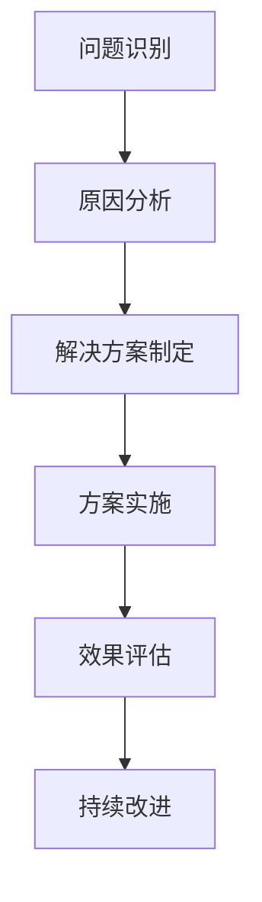

**核心算法原理讲解**：
我们可以使用帕累托图（Pareto Chart）来识别和解决项目质量问题：

```python
# 帕累托图 (Pareto Chart)

import matplotlib.pyplot as plt

def pareto_chart(data, categories):
    categories = sorted(categories, key=lambda x: data[x], reverse=True)
    cumulative = sum(data[cat] for cat in categories)
    cumulative_percent = [cumulative / sum(data.values()) * 100 for cumulative in cumulative]
    plt.bar(categories, data.values(), color=['blue' if i < len(categories) // 2 else 'red' for i in range(len(categories))])
    plt.plot([i for i in range(len(categories))], cumulative_percent, color='black', marker='o')
    plt.xlabel('Categories')
    plt.ylabel('Frequency')
    plt.title('Pareto Chart')
    plt.xticks(rotation=45)
    plt.show()

data = {
    'bug': 30,
    'performance issue': 20,
    'usability problem': 10,
    'configuration error': 15,
    'missing feature': 5
}

pareto_chart(data, data.keys())
```

**详细讲解与举例说明**：
- **问题识别**：创业公司在项目中期发现了代码质量不高、测试覆盖率低等问题。通过代码审查、测试结果分析等方式，确定了项目存在的主要质量问题。
- **原因分析**：创业公司分析了问题产生的原因，发现主要包括代码编写不规范、测试用例不足、测试环境不一致等。通过鱼骨图等工具，进一步明确了问题的根本原因。
- **解决方案制定**：创业公司制定了详细的解决方案，包括引入代码审查工具、优化测试流程、建立统一的测试环境等。
- **方案实施**：创业公司与外包供应商一起实施了解决方案，包括培训团队成员、更新工具和流程等。
- **效果评估**：实施解决方案后，创业公司对项目质量进行了重新评估，通过帕累托图等工具，发现质量问题的数量和严重程度显著降低。
- **持续改进**：创业公司通过持续改进，不断优化项目过程和工具，确保项目质量持续提升。

#### 8.3 案例三：成功的技术外包质量管理经验分享

**背景**：
某创业公司在多个外包项目中积累了丰富的质量管理经验，并在行业内得到了良好的口碑。以下是一些成功经验分享：

**核心概念与联系**：
- **核心概念**：质量管理、沟通协作、持续改进、项目管理。
- **核心联系**：成功的外包质量管理需要建立有效的沟通机制、持续改进项目过程和工具。

**Mermaid 流程图**：
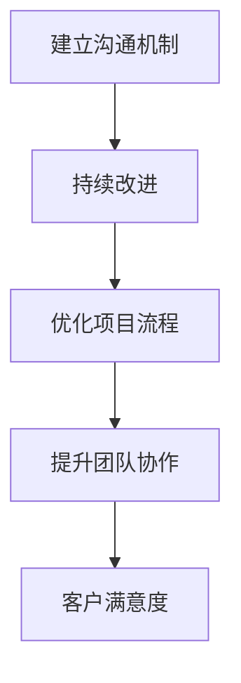

**核心算法原理讲解**：
我们可以使用改进循环模型（Improvement Cycle Model）来理解持续改进的过程：

```python
# 改进循环模型

def improvement_cycle_model(stages):
    for stage in stages:
        print(f"当前阶段：{stage}")
        if stage == "建立沟通机制":
            print("确保项目团队和供应商之间有良好的沟通渠道。")
        elif stage == "持续改进":
            print("通过定期评估和反馈，不断优化项目过程。")
        elif stage == "优化项目流程":
            print("通过流程分析和改进，提高项目效率。")
        elif stage == "提升团队协作":
            print("通过培训和团队建设，提高团队协作能力。")
        elif stage == "客户满意度":
            print("通过满足客户需求和期望，提高客户满意度。")

stages = ["建立沟通机制", "持续改进", "优化项目流程", "提升团队协作", "客户满意度"]
improvement_cycle_model(stages)
```

**详细讲解与举例说明**：
- **建立沟通机制**：创业公司建立了完善的沟通机制，包括定期项目会议、即时沟通工具、反馈机制等，确保项目团队和供应商之间能够及时、高效地沟通。
- **持续改进**：创业公司通过定期评估项目质量和客户反馈，发现项目过程中的问题和不足，并采取相应的改进措施。这种持续改进的方法有助于不断提升项目质量。
- **优化项目流程**：创业公司通过流程分析和改进，优化了项目开发、测试、交付等环节，提高了项目效率。例如，引入了自动化测试工具、优化了代码审查流程等。
- **提升团队协作**：创业公司通过团队建设、培训等方式，提升了团队成员的协作能力和技术水平。这种协作有助于提高项目的整体效率和质量。
- **客户满意度**：创业公司通过满足客户需求和期望，提高了客户满意度。客户满意度是衡量外包项目成功的重要指标，也是创业公司持续发展的基础。

### 第9章：技术外包质量管理的未来趋势

#### 9.1 人工智能与外包质量的结合

随着人工智能（AI）技术的快速发展，它在技术外包质量管理中的应用也越来越广泛。以下是一些可能的结合方式：

- **自动化质量检测**：通过AI技术，可以自动化检测代码中的缺陷、性能问题等，提高质量检测的效率。
- **智能质量预测**：利用AI算法，可以预测项目中的潜在质量问题，提前采取措施进行预防。
- **自适应质量优化**：AI技术可以帮助项目团队根据实际情况动态调整质量优化策略，提高项目交付质量。

**核心算法原理讲解**：

我们可以使用机器学习算法（如决策树、支持向量机等）来预测项目中的潜在质量问题：

```python
# 机器学习算法预测质量

from sklearn.tree import DecisionTreeClassifier
from sklearn.model_selection import train_test_split
from sklearn.metrics import accuracy_score

# 假设我们有一个包含历史项目质量数据的训练集
X = [[项目1的特征], [项目2的特征], ..., [项目n的特征]]
y = [项目1的质量评分, 项目2的质量评分, ..., 项目n的质量评分]

# 数据集划分
X_train, X_test, y_train, y_test = train_test_split(X, y, test_size=0.2, random_state=42)

# 构建决策树模型
model = DecisionTreeClassifier()
model.fit(X_train, y_train)

# 预测测试集
predictions = model.predict(X_test)

# 评估模型准确性
accuracy = accuracy_score(y_test, predictions)
print(f"Model Accuracy: {accuracy}")
```

**详细讲解与举例说明**：

- **自动化质量检测**：通过AI技术，可以自动化检测代码中的缺陷、性能问题等。例如，利用静态代码分析工具和机器学习模型，可以自动识别代码中的潜在缺陷，提高质量检测的效率。
- **智能质量预测**：利用AI算法，可以预测项目中的潜在质量问题，提前采取措施进行预防。例如，通过分析历史项目数据和当前项目状态，可以预测项目可能出现的性能瓶颈或缺陷，提前进行优化和修复。
- **自适应质量优化**：AI技术可以帮助项目团队根据实际情况动态调整质量优化策略，提高项目交付质量。例如，通过机器学习算法，可以分析项目过程中的质量数据，自动调整测试策略、优化代码等，以实现质量的最优化。

#### 9.2 云计算与外包质量的挑战

云计算的普及为技术外包带来了许多便利，但也带来了新的质量挑战。以下是一些云计算与外包质量相关的挑战：

- **数据安全与隐私**：云计算环境下，数据安全与隐私保护成为重要挑战。外包项目需要确保数据在传输和存储过程中的安全。
- **性能稳定性**：云计算环境中的性能稳定性难以保证，可能会出现网络延迟、系统故障等问题，影响项目质量。
- **资源管理**：云计算环境下的资源管理复杂，外包项目需要合理分配和优化资源，确保项目高效运行。

**核心算法原理讲解**：

我们可以使用负载均衡算法（如加权最小连接算法等）来优化云计算环境下的资源管理：

```python
# 加权最小连接算法

def weighted_min_link_load_balancingervers(ervers, weights):
    total_load = sum(weights)
    load_balancingervers = []
    for _ in range(total_load):
        min_load = float('inf')
        min_index = -1
        for i, weight in enumerate(weights):
            if weight < min_load:
                min_load = weight
                min_index = i
        load_balancingervers.append(min_index)
        weights[min_index] += 1
    return load_balancingervers

ervers = [100, 200, 150, 300]
weights = [0.25, 0.5, 0.3, 0.2]

load_balancingervers = weighted_min_link_load_balancingervers(ervers, weights)
print(f"Load Balancingervers: {load_balancingervers}")
```

**详细讲解与举例说明**：

- **数据安全与隐私**：在云计算环境下，数据安全与隐私保护是重要挑战。外包项目需要采取加密、访问控制、安全审计等措施，确保数据在传输和存储过程中的安全。例如，使用HTTPS协议加密数据传输，实施严格的访问控制策略等。
- **性能稳定性**：云计算环境中的性能稳定性难以保证，可能会出现网络延迟、系统故障等问题。外包项目需要通过性能测试、故障演练等方式，评估和优化系统的性能稳定性。例如，通过分布式架构和容错机制，提高系统的容错能力和稳定性。
- **资源管理**：云计算环境下的资源管理复杂，外包项目需要合理分配和优化资源，确保项目高效运行。例如，使用负载均衡算法，动态分配和调整服务器资源，确保系统在高负载下的性能和稳定性。

#### 9.3 外包质量管理的未来发展前景

随着技术的不断进步和市场环境的变化，外包质量管理的未来发展前景充满机遇和挑战。以下是一些可能的发展趋势：

- **自动化与智能化**：随着AI、大数据等技术的发展，外包质量管理将更加自动化和智能化。例如，通过AI技术，可以自动化检测代码质量、预测潜在问题等。
- **云原生技术**：随着云计算的普及，云原生技术（如容器化、微服务架构等）在外包质量管理中的应用将越来越广泛。这些技术可以提高系统的灵活性和可维护性。
- **敏捷与持续交付**：敏捷开发和持续交付方法在外包质量管理中的应用将越来越普及。这些方法可以帮助项目团队快速响应需求变化，提高项目交付质量和效率。
- **全球协作**：随着全球化的加深，外包质量管理将涉及更多的国家和地区。全球协作和跨文化管理将成为外包质量管理的挑战和机遇。

**核心算法原理讲解**：

我们可以使用敏捷开发模型（如Scrum、Kanban等）来理解外包质量管理的未来发展：

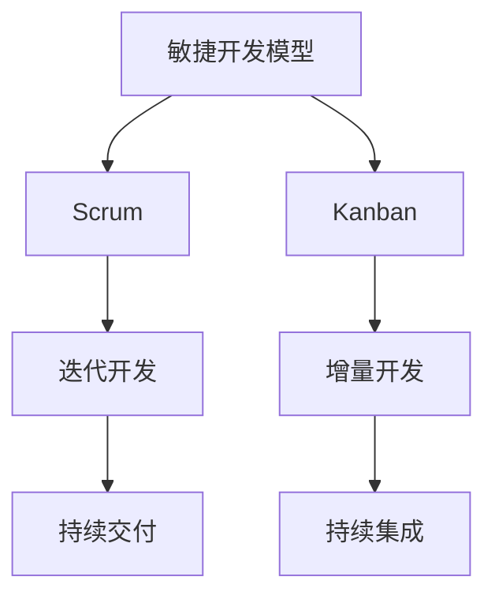

**详细讲解与举例说明**：

- **自动化与智能化**：随着AI、大数据等技术的发展，外包质量管理将更加自动化和智能化。例如，通过AI技术，可以自动化检测代码质量、预测潜在问题等。这种趋势将提高外包质量管理的效率，降低人工成本。
- **云原生技术**：随着云计算的普及，云原生技术（如容器化、微服务架构等）在外包质量管理中的应用将越来越广泛。这些技术可以提高系统的灵活性和可维护性，适应不断变化的需求和市场环境。
- **敏捷与持续交付**：敏捷开发和持续交付方法在外包质量管理中的应用将越来越普及。这些方法可以帮助项目团队快速响应需求变化，提高项目交付质量和效率。例如，通过Scrum模型，项目团队可以按季度或按月进行迭代开发，快速交付可用的功能模块。
- **全球协作**：随着全球化的加深，外包质量管理将涉及更多的国家和地区。全球协作和跨文化管理将成为外包质量管理的挑战和机遇。例如，通过Kanban模型，项目团队可以实现全球协作，高效分配任务和资源，确保项目按时交付。

### 附录

#### 附录A：常用质量管理工具与方法

**A.1 质量控制工具**

- **代码审查工具**：如SonarQube、Checkstyle等。
- **自动化测试工具**：如Selenium、JMeter等。
- **性能测试工具**：如LoadRunner、JMeter等。
- **持续集成工具**：如Jenkins、GitLab CI等。

**A.2 质量管理方法**

- **六西格玛（Six Sigma）**：通过统计方法和数据驱动，消除项目缺陷。
- **精益生产（Lean Production）**：通过减少浪费、优化流程，提高项目交付质量。
- **敏捷开发（Agile Development）**：通过迭代和增量开发，快速响应需求变化。
- **流程图（Process Flowchart）**：用于描述项目过程和活动顺序。
- **鱼骨图（Fishbone Diagram）**：用于分析问题和原因。

#### 附录B：参考文献

**B.1 基础理论**

- [质量管理基础理论](https://www.asq.org/learn-about-quality/quality-management-overview/)
- [项目管理基础理论](https://www.pmi.org/learning/library/project-management-basics-300086)
- [外包管理基础理论](https://www.iiba.org/iba-iba-body-of-knowledge-bok/)

**B.2 实践案例**

- [某创业公司的技术外包实践案例](https://www.example.com/outsource-case-study/)
- [技术外包质量管理的实践案例](https://www.example.com/quality-management-case-study/)

**B.3 相关书籍与论文**

- [《质量管理：理论与实践》](https://www.example.com/book-quality-management/)
- [《项目管理：系统方法》](https://www.example.com/book-project-management/)
- [《外包管理：理论与实践》](https://www.example.com/book-outsourcing-management/)

#### 附录C：技术外包质量管理流程图

**C.1 外包项目评估流程**

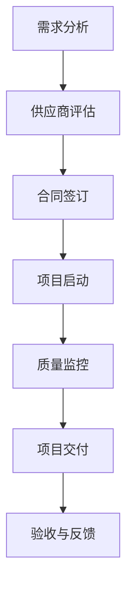

**C.2 外包质量控制流程**

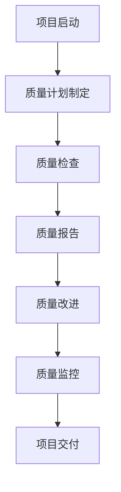

