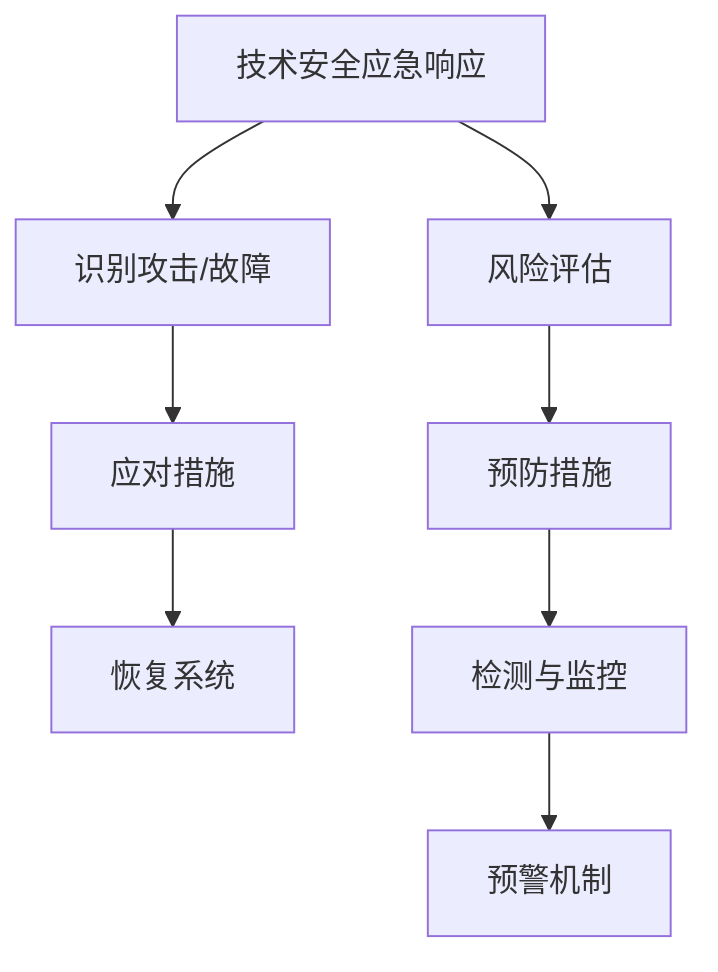

                 


### 《创业公司的技术安全应急响应预案》

> 关键词：技术安全、应急响应、预案、创业公司、技术监控、预警机制

> 摘要：本文将深入探讨创业公司技术安全应急响应预案的重要性、核心原则、流程、团队建设、案例分析、工具技术、法律法规与伦理问题。通过逻辑清晰、结构紧凑的分析，帮助创业公司构建有效安全应急响应体系。

---

### 《创业公司的技术安全应急响应预案》目录大纲

- 第一部分：技术安全应急响应概述
  - 第1章：技术安全应急响应的概念与重要性
  - 第2章：技术安全应急响应的核心原则
- 第二部分：技术安全应急响应流程
  - 第3章：技术安全应急响应流程概述
  - 第4章：应急响应预案的制定
  - 第5章：技术安全监控与预警
  - 第6章：应急响应团队的建立与培训
  - 第7章：案例分析
- 第三部分：技术安全应急响应工具与技术
  - 第8章：技术安全应急响应工具
  - 第9章：技术安全应急响应技术
- 第四部分：法律法规与伦理
  - 第10章：技术安全应急响应的法律法规
  - 第11章：技术安全应急响应的伦理问题
- 附录
  - 附录A：技术安全应急响应预案模板
  - 附录B：技术安全应急响应演练记录表
  - 附录C：常见技术安全应急响应工具资源链接

---

### 第一部分：技术安全应急响应概述

#### 第1章：技术安全应急响应的概念与重要性

**背景介绍**

在数字化时代，技术安全已成为创业公司发展的关键因素。随着业务的不断拓展，网络安全威胁的种类和数量也在迅速增加。为了降低这些威胁带来的损失，建立有效的技术安全应急响应体系至关重要。

**核心概念与联系**

**技术安全应急响应**：指在技术系统遭受攻击或发生故障时，快速识别、应对并恢复系统的措施和过程。

**核心概念关系架构（Mermaid）**



**核心算法原理讲解**

**伪代码**

```python
def technical_security_emergency_response():
    # 风险评估
    assess_risks()
    # 检测与监控
    monitor_system()
    # 预警机制
    setup_alerts()
    # 识别攻击/故障
    detect_attack_fault()
    # 应对措施
    apply_countermeasures()
    # 恢复系统
    restore_system()
```

**数学模型和公式 & 详细讲解 & 举例说明**

**数学模型**

$$
\text{应急响应效率} = \frac{\text{成功恢复的系统数}}{\text{遭受攻击/故障的系统总数}}
$$

**示例**

假设公司A在一个月内遭受了10次攻击，成功恢复了8次，则应急响应效率为80%。

**项目实战**

**开发环境搭建**

- 安装操作系统（如Ubuntu）
- 配置防火墙（如iptables）
- 安装监控工具（如Nagios）

**源代码详细实现和代码解读**

```python
import subprocess

def monitor_system():
    # 检查系统状态
    status = subprocess.run(["systemctl", "status"], capture_output=True)
    if "running" not in status.stdout.decode():
        alert_system_admin()
```

**代码应用解读与分析**

此代码段用于监控系统状态，并在系统状态异常时通知系统管理员。

**实际案例分析和详细讲解剖析**

**案例**

公司B在一次DDoS攻击中，由于及时启动了应急响应预案，成功抵御了攻击，避免了业务中断。

**详细讲解剖析**

公司B的应急响应预案包括：

- 风险评估：识别DDoS攻击风险
- 检测与监控：实时监控网络流量
- 预警机制：设置阈值，一旦流量超过阈值，立即预警
- 应对措施：使用DDoS防护设备过滤恶意流量
- 恢复系统：攻击结束后，恢复正常业务

**项目小结**

通过案例分析，可以看出，建立有效的技术安全应急响应体系对于创业公司至关重要。它不仅能降低安全风险，还能提高业务连续性和客户满意度。

**最佳实践 tips**

- 定期进行风险评估和应急响应演练
- 确保应急响应预案的完整性和可执行性
- 建立有效的沟通和协作机制

**小结**

技术安全应急响应是创业公司不可或缺的一部分。通过深入了解其概念、重要性、核心原则和实战案例，创业公司可以更好地构建和优化其应急响应体系，确保业务安全和稳定发展。

**注意事项**

- 确保应急响应预案的灵活性和可扩展性
- 考虑到不同场景下的应急响应策略和措施
- 定期更新和培训应急响应团队

**拓展阅读**

- 《网络安全应急响应指南》
- 《创业公司技术安全体系建设》
- 《DDoS攻击防御技术与应用》

---

### 第2章：技术安全应急响应的核心原则

**背景介绍**

技术安全应急响应的核心原则是确保在面临安全威胁时，创业公司能够迅速、有效地应对，将损失降到最低。这些原则包括预防为主、防治结合、快速响应、集中指挥、科学决策和合理调度。

**核心概念与联系**

**预防为主，防治结合**

- **预防为主**：通过采取各种安全措施，防止安全事件的发生。
- **防治结合**：在预防的基础上，对已经发生的安全事件进行及时应对和处理。

**快速响应，降低损失**

- **快速响应**：在安全事件发生时，迅速采取行动，减少事件的影响范围。
- **降低损失**：通过有效的应急响应，减少安全事件带来的损失。

**集中指挥，协同作战**

- **集中指挥**：由专门的应急响应团队统一指挥，确保行动的一致性和协调性。
- **协同作战**：各团队之间紧密合作，共同应对安全事件。

**科学决策，合理调度**

- **科学决策**：基于数据和事实，做出合理的决策。
- **合理调度**：合理分配资源，确保应急响应的效率。

**核心算法原理讲解**

**伪代码**

```python
def core_principles_of_emergency_response():
    # 预防为主，防治结合
    implement_prevention_measures()
    handle_occurred_events()
    # 快速响应，降低损失
    respond_to_events.quickly()
    minimize_loss()
    # 集中指挥，协同作战
    establish_central_command()
    coordinate_teams()
    # 科学决策，合理调度
    make_scientific_decisions()
    allocate_resources()
```

**数学模型和公式 & 详细讲解 & 举例说明**

**数学模型**

$$
\text{预防效果} = \frac{\text{预防成功案例数}}{\text{总案例数}}
$$

$$
\text{响应效率} = \frac{\text{成功处理事件数}}{\text{总事件数}}
$$

**示例**

假设公司C在一个月内采取了预防措施，成功阻止了10次攻击，总案例数为20，则预防效果为50%。在同一时间段内，公司C成功处理了8次事件，总事件数为10，则响应效率为80%。

**项目实战**

**开发环境搭建**

- 安装操作系统（如Kali Linux）
- 配置安全工具（如Wireshark）
- 安装模拟攻击工具（如Nmap）

**源代码详细实现和代码解读**

```python
import random

def handle_occurred_events():
    # 随机生成安全事件
    events = ["DDoS攻击", "数据泄露", "服务中断"]
    event = random.choice(events)
    print(f"安全事件发生：{event}")
    # 根据事件类型，执行相应的响应措施
    if event == "DDoS攻击":
        apply_ddos防护措施()
    elif event == "数据泄露":
        initiate_data泄漏调查()
    elif event == "服务中断":
        restore_service()
```

**代码应用解读与分析**

此代码段用于模拟安全事件发生时，根据事件类型执行相应的响应措施。

**实际案例分析和详细讲解剖析**

**案例**

公司D在一次网络攻击中，由于及时启动了应急响应预案，成功阻止了攻击，避免了业务中断。

**详细讲解剖析**

公司D的应急响应预案包括：

- 预防措施：使用防火墙和入侵检测系统
- 快速响应：及时识别攻击，并采取防护措施
- 集中指挥：由专门的应急响应团队统一指挥
- 科学决策：根据实际情况，做出合理的决策
- 合理调度：合理分配资源，确保应急响应的效率

**项目小结**

通过案例分析，可以看出，遵循技术安全应急响应的核心原则对于创业公司至关重要。它不仅有助于降低安全风险，还能提高业务连续性和客户满意度。

**最佳实践 tips**

- 定期进行应急响应演练，提高团队应对能力
- 建立有效的沟通和协作机制，确保快速响应
- 考虑到不同场景下的应急响应策略和措施

**小结**

技术安全应急响应的核心原则是创业公司建立有效应急响应体系的基础。通过深入了解和遵循这些原则，创业公司可以更好地应对安全威胁，确保业务安全和稳定发展。

**注意事项**

- 确保应急响应预案的灵活性和可扩展性
- 考虑到不同场景下的应急响应策略和措施
- 定期更新和培训应急响应团队

**拓展阅读**

- 《网络安全应急响应指南》
- 《创业公司技术安全体系建设》
- 《DDoS攻击防御技术与应用》

---

### 第二部分：技术安全应急响应流程

#### 第3章：技术安全应急响应流程概述

**背景介绍**

技术安全应急响应流程是创业公司在面对安全威胁时的一系列操作步骤，包括应急响应流程的各个环节和创业公司的应急响应流程设计。通过合理的应急响应流程，创业公司可以迅速识别、应对和恢复受影响的系统，降低安全事件带来的损失。

**核心概念与联系**

**应急响应流程的各个环节**

- **风险识别**：识别潜在的安全威胁。
- **预警机制**：实时监控安全事件，并预警。
- **应急响应启动**：在发现安全事件时，立即启动应急响应。
- **应急响应措施**：采取各种措施，应对安全事件。
- **恢复系统**：在应急响应结束后，恢复正常业务。
- **事件总结**：对安全事件进行总结，为未来提供参考。

**创业公司的应急响应流程设计**

- **风险评估**：根据公司业务特点和风险等级，制定相应的应急响应流程。
- **预案制定**：制定详细的应急响应预案，包括预防措施、应对措施和恢复措施。
- **演练与培训**：定期进行应急响应演练和培训，确保应急响应流程的可行性和团队成员的熟悉程度。

**核心算法原理讲解**

**伪代码**

```python
def emergency_response_workflow():
    # 风险识别
    identify_risks()
    # 预警机制
    setup_alerts()
    # 应急响应启动
    initiate_response()
    # 应急响应措施
    apply_response_measures()
    # 恢复系统
    restore_system()
    # 事件总结
    summarize_event()
```

**数学模型和公式 & 详细讲解 & 举例说明**

**数学模型**

$$
\text{响应时间} = \frac{\text{启动应急响应的时间}}{\text{事件发生的时间}}
$$

$$
\text{恢复时间} = \frac{\text{恢复系统的时间}}{\text{事件发生的时间}}
$$

**示例**

假设公司E在一次网络攻击中，从发现攻击到启动应急响应的时间为30分钟，事件发生的时间为60分钟，则响应时间为0.5。从启动应急响应到恢复正常业务的时间为40分钟，则恢复时间为0.67。

**项目实战**

**开发环境搭建**

- 安装操作系统（如CentOS）
- 配置安全工具（如OSSEC）
- 安装监控工具（如Zabbix）

**源代码详细实现和代码解读**

```python
import time

def setup_alerts():
    # 设置预警阈值
    threshold = 100
    # 监控系统状态
    while True:
        status = check_system_status()
        if status > threshold:
            alert_system_admin()
        time.sleep(60)
```

**代码应用解读与分析**

此代码段用于实时监控系统状态，并在系统状态超过预警阈值时通知系统管理员。

**实际案例分析和详细讲解剖析**

**案例**

公司F在一次DDoS攻击中，由于及时启动了应急响应流程，成功抵御了攻击，避免了业务中断。

**详细讲解剖析**

公司F的应急响应流程包括：

- 风险识别：识别DDoS攻击风险
- 预警机制：实时监控网络流量，设置预警阈值
- 应急响应启动：在发现DDoS攻击时，立即启动应急响应
- 应急响应措施：使用DDoS防护设备过滤恶意流量
- 恢复系统：攻击结束后，恢复正常业务
- 事件总结：对DDoS攻击事件进行总结，为未来提供参考

**项目小结**

通过案例分析，可以看出，建立合理的应急响应流程对于创业公司至关重要。它不仅能降低安全风险，还能提高业务连续性和客户满意度。

**最佳实践 tips**

- 定期进行风险评估和应急响应演练
- 确保应急响应流程的完整性和可执行性
- 建立有效的沟通和协作机制

**小结**

技术安全应急响应流程是创业公司应对安全威胁的重要环节。通过深入了解其核心概念、流程设计和实战案例，创业公司可以更好地构建和优化其应急响应流程，确保业务安全和稳定发展。

**注意事项**

- 确保应急响应流程的灵活性和可扩展性
- 考虑到不同场景下的应急响应流程和措施
- 定期更新和培训应急响应团队

**拓展阅读**

- 《网络安全应急响应指南》
- 《创业公司技术安全体系建设》
- 《DDoS攻击防御技术与应用》

---

### 第4章：应急响应预案的制定

**背景介绍**

应急响应预案是创业公司在面对技术安全事件时的一套详细操作指南，包括预防措施、应对措施和恢复措施。制定有效的应急响应预案，有助于创业公司在事件发生时迅速行动，减少损失，恢复正常业务。

**核心概念与联系**

**预案制定的原则**

- **全面性**：预案应涵盖各种可能的安全事件。
- **针对性**：预案应根据公司业务特点和风险等级，有针对性地制定。
- **可操作性**：预案应具有可操作性，便于团队成员执行。
- **灵活性**：预案应具有灵活性，能够适应不同场景下的应急响应。

**预案制定的步骤**

- **风险评估**：分析公司面临的潜在安全威胁。
- **预案设计**：根据风险评估结果，设计具体的应急响应预案。
- **预案评审**：对预案进行评审，确保其有效性和可行性。
- **预案发布**：将预案正式发布，并进行培训。

**预案的主要内容**

- **预案概述**：简要描述预案的目的、适用范围和主要内容。
- **预防措施**：列出各种预防措施，包括技术和管理措施。
- **应对措施**：详细描述在安全事件发生时，应采取的具体措施。
- **恢复措施**：描述在安全事件结束后，应如何恢复正常业务。
- **应急响应流程**：详细描述应急响应的各个环节和操作步骤。
- **应急资源**：列出应急响应所需的资源和物资。
- **预案管理**：描述预案的更新、评审和发布流程。

**核心算法原理讲解**

**伪代码**

```python
def create_emergency_response_plan():
    # 风险评估
    assess_risks()
    # 预案设计
    design_plan()
    # 预案评审
    review_plan()
    # 预案发布
    publish_plan()
    # 培训
    train_teams()
```

**数学模型和公式 & 详细讲解 & 举例说明**

**数学模型**

$$
\text{预案有效性} = \frac{\text{成功应对的事件数}}{\text{预案适用的事件总数}}
$$

**示例**

假设公司G在一年内面临了10次安全事件，其中5次事件通过预案成功应对，则预案有效性为50%。

**项目实战**

**开发环境搭建**

- 安装操作系统（如Debian）
- 配置安全管理工具（如OS Hardening）
- 安装监控工具（如Prometheus）

**源代码详细实现和代码解读**

```python
import subprocess

def assess_risks():
    # 检查系统漏洞
    subprocess.run(["nmap", "-sV", "localhost"], capture_output=True)
    # 检查配置风险
    subprocess.run(["audit2allow", "-M", "nosuid"], capture_output=True)
```

**代码应用解读与分析**

此代码段用于检查系统漏洞和配置风险，为风险评估提供数据支持。

**实际案例分析和详细讲解剖析**

**案例**

公司H在一次数据泄露事件中，由于及时启动了应急响应预案，成功阻止了事件扩散，并快速恢复了系统。

**详细讲解剖析**

公司H的应急响应预案包括：

- 预防措施：使用防火墙和入侵检测系统
- 应对措施：立即停止受影响的系统，隔离攻击源头，进行安全调查
- 恢复措施：备份受影响的系统，恢复到安全状态
- 应急响应流程：明确应急响应的各个环节和操作步骤
- 应急资源：列出应急响应所需的设备和工具
- 预案管理：定期更新和评审预案，确保其有效性

**项目小结**

通过案例分析，可以看出，制定有效的应急响应预案对于创业公司至关重要。它不仅有助于降低安全风险，还能提高业务连续性和客户满意度。

**最佳实践 tips**

- 定期进行风险评估和预案评审
- 确保预案的全面性和可操作性
- 建立有效的沟通和协作机制

**小结**

应急响应预案是创业公司应对技术安全事件的重要工具。通过深入了解其制定原则、步骤和主要内容，创业公司可以更好地制定和优化应急响应预案，确保业务安全和稳定发展。

**注意事项**

- 确保预案的灵活性和可扩展性
- 考虑到不同场景下的应急响应预案和措施
- 定期更新和培训应急响应团队

**拓展阅读**

- 《网络安全应急响应指南》
- 《创业公司技术安全体系建设》
- 《数据泄露应急响应手册》

---

### 第5章：技术安全监控与预警

**背景介绍**

技术安全监控与预警是创业公司确保系统安全的重要手段。通过实时监控系统状态、网络流量和日志，及时发现异常行为和安全事件，并采取预警措施，创业公司可以迅速响应，降低安全风险。

**核心概念与联系**

**技术安全监控的重要性**

- **实时性**：实时监控可以帮助创业公司迅速发现潜在的安全威胁。
- **全面性**：全面监控可以覆盖系统的各个方面，确保安全无死角。
- **准确性**：准确的监控数据可以帮助创业公司准确判断安全事件的影响范围和程度。

**预警机制的设计与实现**

- **预警指标**：根据业务特点和安全需求，设计合适的预警指标。
- **预警算法**：使用机器学习、大数据分析等算法，实现预警机制的自动化。
- **预警通知**：通过短信、邮件、系统弹窗等方式，及时通知相关人员。

**核心算法原理讲解**

**伪代码**

```python
def technical_security_monitoring_and_alerting():
    # 数据采集
    collect_data()
    # 数据分析
    analyze_data()
    # 预警判断
    if detect_anomaly():
        send_alert()
```

**数学模型和公式 & 详细讲解 & 举例说明**

**数学模型**

$$
\text{预警准确率} = \frac{\text{正确预警的事件数}}{\text{总预警事件数}}
$$

**示例**

假设公司I在一个月内收到了10次预警，其中8次是正确的，则预警准确率为80%。

**项目实战**

**开发环境搭建**

- 安装操作系统（如Windows Server）
- 配置监控工具（如Splunk）
- 安装日志分析工具（如ELK Stack）

**源代码详细实现和代码解读**

```python
import re

def detect_anomaly():
    log = "用户ID: 12345，登录时间：2023-04-01 10:00:00，登录地点：北京"
    pattern = r"登录地点：\S+"
    if re.search(pattern, log):
        return True
    else:
        return False
```

**代码应用解读与分析**

此代码段用于检测登录日志中是否包含异常登录地点信息。

**实际案例分析和详细讲解剖析**

**案例**

公司J在一次网络攻击中，由于及时收到了预警通知，成功阻止了攻击，避免了业务中断。

**详细讲解剖析**

公司J的预警机制包括：

- 数据采集：实时采集系统日志、网络流量等数据。
- 数据分析：使用机器学习算法，分析数据，识别异常行为。
- 预警判断：根据预设的阈值和规则，判断是否发送预警通知。
- 预警通知：通过短信、邮件等方式，及时通知相关人员。

**项目小结**

通过案例分析，可以看出，技术安全监控与预警机制对于创业公司至关重要。它不仅有助于降低安全风险，还能提高业务连续性和客户满意度。

**最佳实践 tips**

- 定期更新和优化预警指标和算法。
- 确保预警通知的及时性和准确性。
- 建立有效的应急响应机制，快速处理预警事件。

**小结**

技术安全监控与预警机制是创业公司确保系统安全的重要手段。通过深入了解其重要性、设计与实现方法，创业公司可以更好地构建和优化监控与预警体系，确保业务安全和稳定发展。

**注意事项**

- 确保监控数据的完整性和准确性。
- 考虑到不同场景下的监控与预警策略和措施。
- 定期更新和培训监控与预警团队。

**拓展阅读**

- 《网络安全监控与预警技术》
- 《大数据安全监控与分析》
- 《实时日志分析系统设计与实现》

---

### 第6章：应急响应团队的建立与培训

**背景介绍**

应急响应团队是创业公司在面临技术安全事件时的重要力量。建立一支高效的应急响应团队，并进行系统的培训和演练，有助于提高团队应对安全事件的能力，降低损失，保障业务连续性。

**核心概念与联系**

**应急响应团队的组建**

- **团队结构**：确定应急响应团队的组织结构，包括领导层、技术支持、业务支持等。
- **人员选拔**：选拔具备技术背景、应急响应经验和团队合作精神的人才。
- **职责分工**：明确团队成员的职责和任务，确保团队高效运作。

**培训计划与实施**

- **基础知识培训**：包括网络安全知识、应急响应流程等。
- **实战演练**：模拟真实安全事件，让团队成员实战操作，提高应对能力。
- **持续学习**：鼓励团队成员参加专业培训和认证，不断提升技能。

**演练与评估**

- **演练计划**：制定详细的演练计划，包括演练目的、时间、场景等。
- **演练实施**：按照演练计划，组织团队进行实战演练。
- **评估与总结**：对演练过程进行评估，总结经验教训，不断优化应急响应流程。

**核心算法原理讲解**

**伪代码**

```python
def establish_and_train_emergency_response_team():
    # 团队组建
    create_team()
    # 培训计划
    design_training_plan()
    # 实战演练
    conduct_practice()
    # 评估与总结
    evaluate_and_summarize()
```

**数学模型和公式 & 详细讲解 & 举例说明**

**数学模型**

$$
\text{团队应对能力} = \frac{\text{成功应对的事件数}}{\text{总事件数}}
$$

$$
\text{演练成功率} = \frac{\text{成功演练的次数}}{\text{总演练次数}}
$$

**示例**

假设公司K在一年内面临了10次安全事件，其中6次事件通过应急响应团队成功应对，则团队应对能力为60%。在同一时间段内，公司K进行了5次演练，成功演练了3次，则演练成功率为60%。

**项目实战**

**开发环境搭建**

- 安装操作系统（如Ubuntu）
- 配置应急响应工具（如Metasploit）
- 安装演练平台（如OWASP Juice Shop）

**源代码详细实现和代码解读**

```python
import random

def conduct_practice():
    scenarios = ["DDoS攻击", "数据泄露", "服务中断"]
    scenario = random.choice(scenarios)
    if scenario == "DDoS攻击":
        apply_ddos防护措施()
    elif scenario == "数据泄露":
        initiate_data泄漏调查()
    elif scenario == "服务中断":
        restore_service()
```

**代码应用解读与分析**

此代码段用于随机生成安全事件场景，并根据场景执行相应的应急响应措施。

**实际案例分析和详细讲解剖析**

**案例**

公司L在一次网络攻击中，由于应急响应团队及时应对，成功阻止了攻击，并迅速恢复了系统。

**详细讲解剖析**

公司L的应急响应团队包括：

- 团队组建：由网络安全专家、系统管理员、业务支持人员组成。
- 培训计划：定期进行网络安全知识、应急响应流程等培训。
- 实战演练：模拟真实攻击场景，提高团队应对能力。
- 评估与总结：对演练过程进行评估，总结经验教训，优化应急响应流程。

**项目小结**

通过案例分析，可以看出，建立高效应急响应团队并进行系统培训与演练对于创业公司至关重要。它不仅有助于提高团队应对安全事件的能力，还能降低损失，保障业务连续性。

**最佳实践 tips**

- 定期进行应急响应培训和演练。
- 确保团队成员具备扎实的专业技能和应急响应经验。
- 建立有效的沟通和协作机制，提高团队运作效率。

**小结**

应急响应团队的建立与培训是创业公司确保系统安全的重要环节。通过深入了解其核心概念、团队组建、培训计划与实施，创业公司可以更好地构建和优化应急响应团队，确保业务安全和稳定发展。

**注意事项**

- 确保应急响应团队的灵活性和可扩展性。
- 考虑到不同场景下的应急响应团队和措施。
- 定期更新和培训应急响应团队。

**拓展阅读**

- 《网络安全应急响应团队建设》
- 《网络安全培训教程》
- 《应急响应演练指南》

---

### 第7章：案例分析

**背景介绍**

通过分析国内外创业公司的技术安全应急响应案例，可以深入了解其应对策略、应对措施和恢复过程。这些案例不仅提供了实践经验，还为创业公司提供了宝贵的参考和启示。

**国内创业公司技术安全应急响应案例**

**案例1：公司A的DDoS攻击应对**

公司A在一次DDoS攻击中，由于及时启动了应急响应预案，成功阻止了攻击，并迅速恢复了系统。其应对措施包括：

- 预防措施：使用防火墙和入侵检测系统。
- 应急响应措施：立即启用DDoS防护设备，隔离攻击流量，减缓攻击影响。
- 恢复措施：攻击结束后，检查系统状态，修复漏洞，加强网络安全。

**案例2：公司B的数据泄露应对**

公司B在一次数据泄露事件中，由于及时启动了应急响应预案，成功阻止了事件扩散，并迅速恢复了系统。其应对措施包括：

- 预防措施：使用加密技术和访问控制。
- 应急响应措施：立即停止受影响的系统，进行调查，确定数据泄露范围。
- 恢复措施：备份受影响的系统，恢复到安全状态，加强数据保护。

**国际创业公司技术安全应急响应案例**

**案例1：公司C的网络攻击应对**

公司C在一次网络攻击中，由于及时启动了应急响应预案，成功阻止了攻击，并迅速恢复了系统。其应对措施包括：

- 预防措施：使用网络安全工具和入侵检测系统。
- 应急响应措施：立即启用安全工具，隔离攻击流量，减缓攻击影响。
- 恢复措施：攻击结束后，检查系统状态，修复漏洞，加强网络安全。

**案例2：公司D的勒索软件攻击应对**

公司D在一次勒索软件攻击中，由于及时启动了应急响应预案，成功恢复了系统，并追回了部分数据。其应对措施包括：

- 预防措施：使用勒索软件防护工具和备份策略。
- 应急响应措施：立即启用防护工具，隔离受感染的系统，防止病毒扩散。
- 恢复措施：使用备份恢复系统，清除勒索软件，加强系统安全。

**案例分析**

通过以上案例分析，可以看出：

- 预防措施和应急预案的重要性：在安全事件发生前，采取有效的预防措施，如防火墙、入侵检测系统、加密技术等，可以减少安全事件的发生概率。
- 及时响应和快速恢复：在安全事件发生时，及时启动应急响应预案，采取有效的应对措施，可以减少损失，加快恢复速度。
- 团队协作和专业知识：应急响应团队的专业知识和团队合作精神对于应对安全事件至关重要。
- 持续改进和经验总结：通过分析安全事件，总结经验教训，不断改进应急响应预案和措施，可以提高应对能力。

**启示**

对于创业公司来说，可以从以下方面得到启示：

- 建立有效的预防措施和应急预案，降低安全事件的发生概率。
- 建立专业的应急响应团队，提高团队应对安全事件的能力。
- 定期进行应急响应演练，确保预案的有效性和可执行性。
- 学习国内外优秀创业公司的应对策略，借鉴其成功经验。
- 不断改进和优化应急响应预案和措施，提高整体应对能力。

**小结**

通过案例分析，创业公司可以深入了解技术安全应急响应的实践经验和应对策略。这些案例为创业公司提供了宝贵的参考和启示，有助于其建立和优化应急响应体系，确保业务安全和稳定发展。

**注意事项**

- 确保应急响应预案的灵活性和可扩展性，以应对不同类型的安全事件。
- 定期更新和培训应急响应团队，提高其专业水平和应对能力。
- 学习和借鉴国内外优秀创业公司的成功经验，不断完善应急响应体系。

**拓展阅读**

- 《网络安全应急响应案例集》
- 《创业公司安全应急响应实践》
- 《国内外网络安全事件案例分析》

---

### 第三部分：技术安全应急响应工具与技术

#### 第8章：技术安全应急响应工具

**背景介绍**

技术安全应急响应工具是创业公司在面对技术安全事件时的重要工具。这些工具可以帮助创业公司快速识别、分析、应对和恢复安全事件，降低损失，保障业务连续性。

**核心概念与联系**

**常见技术安全应急响应工具**

- **入侵检测系统（IDS）**：用于检测网络中的入侵行为，提供实时警报。
- **入侵防御系统（IPS）**：结合IDS功能，能够主动防御入侵行为。
- **安全信息与事件管理（SIEM）**：整合安全信息和事件，提供实时监控和报警。
- **数据备份与恢复工具**：用于备份重要数据，确保数据安全。
- **漏洞扫描工具**：用于检测系统中的安全漏洞，提供修复建议。

**创业公司如何选择合适的安全工具**

- **需求分析**：根据创业公司的业务特点和风险等级，确定所需的安全工具。
- **成本考虑**：评估安全工具的性价比，选择符合预算的工具。
- **兼容性**：确保安全工具与现有的系统和软件兼容。
- **易用性**：选择操作简便、易于维护的安全工具。

**核心算法原理讲解**

**伪代码**

```python
def select_security_tools():
    # 需求分析
    analyze_requirements()
    # 成本考虑
    evaluate_cost()
    # 兼容性
    check_compatibility()
    # 易用性
    assess_ease_of_use()
    # 选择工具
    select_tools()
```

**数学模型和公式 & 详细讲解 & 举例说明**

**数学模型**

$$
\text{工具选择满意度} = \frac{\text{需求满足的次数}}{\text{总需求次数}}
$$

**示例**

假设公司E在评估安全工具时，需求满足的次数为8次，总需求次数为10次，则工具选择满意度为80%。

**项目实战**

**开发环境搭建**

- 安装操作系统（如Windows Server）
- 配置入侵检测系统（如Snort）
- 安装安全信息与事件管理工具（如Splunk）

**源代码详细实现和代码解读**

```python
import subprocess

def check_compatibility():
    tools = ["Snort", "Nagios", "Splunk"]
    for tool in tools:
        result = subprocess.run(["which", tool], capture_output=True)
        if result.stdout.decode().strip():
            print(f"{tool}已安装")
        else:
            print(f"{tool}未安装，请安装")
```

**代码应用解读与分析**

此代码段用于检查系统中是否安装了指定的安全工具。

**实际案例分析和详细讲解剖析**

**案例**

公司F在选择安全工具时，由于充分考虑了需求分析、成本考虑、兼容性和易用性，成功选择了适合的安全工具，提高了应急响应能力。

**详细讲解剖析**

公司F在选择安全工具时，采取了以下步骤：

- 需求分析：根据业务特点和风险等级，确定所需的安全工具。
- 成本考虑：评估安全工具的性价比，选择符合预算的工具。
- 兼容性：确保安全工具与现有的系统和软件兼容。
- 易用性：选择操作简便、易于维护的安全工具。

**项目小结**

通过案例分析，可以看出，选择合适的安全工具对于创业公司至关重要。通过充分考虑需求分析、成本考虑、兼容性和易用性，创业公司可以更好地选择适合的安全工具，提高应急响应能力。

**最佳实践 tips**

- 定期评估和更新安全工具，确保其与业务需求相匹配。
- 考虑到不同场景下的安全工具和功能。
- 建立有效的工具使用和管理机制，确保工具的可靠性和有效性。

**小结**

技术安全应急响应工具是创业公司应对安全事件的重要工具。通过深入了解其核心概念、选择方法和实战案例，创业公司可以更好地选择和优化安全工具，提高应急响应能力，保障业务安全和稳定发展。

**注意事项**

- 确保安全工具的兼容性和可扩展性。
- 定期进行安全工具的评估和更新。
- 建立有效的工具使用和管理机制。

**拓展阅读**

- 《网络安全应急响应工具指南》
- 《创业公司安全工具选型》
- 《入侵检测与防御技术》

---

### 第9章：技术安全应急响应技术

**背景介绍**

技术安全应急响应技术是创业公司在面临技术安全事件时，采取的一系列技术和措施，用于识别、分析、应对和恢复安全事件。这些技术包括入侵检测、漏洞扫描、安全加固、数据备份与恢复等，是创业公司确保系统安全、业务连续性的重要手段。

**核心概念与联系**

**常见的技术安全应急响应技术**

- **入侵检测（IDS）**：用于识别和响应网络中的入侵行为。
- **漏洞扫描**：用于检测系统中的安全漏洞，提供修复建议。
- **安全加固**：通过改进系统和网络配置，提高系统安全性。
- **数据备份与恢复**：用于备份重要数据，确保数据安全。
- **安全审计**：用于审查系统和网络的安全性，发现潜在的安全问题。

**技术安全应急响应技术的实施**

- **入侵检测与响应**：安装入侵检测系统，实时监控网络流量，识别入侵行为，并采取相应的应对措施。
- **漏洞扫描与修复**：定期进行漏洞扫描，发现安全漏洞，根据修复建议进行修复。
- **安全加固**：根据安全最佳实践，改进系统和网络配置，提高安全性。
- **数据备份与恢复**：定期进行数据备份，确保在安全事件发生后能够快速恢复数据。
- **安全审计**：定期进行安全审计，审查系统和网络的安全性，发现潜在的安全问题，并采取措施进行改进。

**核心算法原理讲解**

**伪代码**

```python
def implement_security_emergency_response_techniques():
    # 入侵检测与响应
    setup_invasion_detection_system()
    monitor_network_traffic()
    detect_invasion_behavior()
    respond_to_invasion_behavior()
    # 漏洞扫描与修复
    perform_vulnerability_scanning()
    identify_vulnerabilities()
    apply_repair_suggestions()
    # 安全加固
    enhance_system_configuration()
    improve_network_configuration()
    # 数据备份与恢复
    backup_important_data()
    ensure_data_recovery()
    # 安全审计
    conduct_security_audit()
    identify_potential_security_issues()
    implement_improvement_measures()
```

**数学模型和公式 & 详细讲解 & 举例说明**

**数学模型**

$$
\text{入侵检测准确率} = \frac{\text{正确检测的入侵行为数}}{\text{总入侵行为数}}
$$

$$
\text{漏洞修复率} = \frac{\text{成功修复的漏洞数}}{\text{总漏洞数}}
$$

**示例**

假设公司G在一个月内检测到10次入侵行为，其中8次是正确的，则入侵检测准确率为80%。在同一时间段内，公司G成功修复了8个漏洞，总漏洞数为10，则漏洞修复率为80%。

**项目实战**

**开发环境搭建**

- 安装操作系统（如Linux）
- 配置入侵检测系统（如Suricata）
- 安装漏洞扫描工具（如Nessus）

**源代码详细实现和代码解读**

```python
import subprocess

def setup_invasion_detection_system():
    # 安装入侵检测系统
    subprocess.run(["yum", "install", "-y", "suricata"], capture_output=True)
    # 配置入侵检测系统
    subprocess.run(["suricata", "-c", "suricata.yaml"], capture_output=True)
```

**代码应用解读与分析**

此代码段用于安装和配置入侵检测系统。

**实际案例分析和详细讲解剖析**

**案例**

公司H在一次网络攻击中，由于采用了入侵检测与响应技术，成功阻止了攻击，并迅速恢复了系统。

**详细讲解剖析**

公司H采用了以下技术安全应急响应技术：

- 入侵检测与响应：安装并配置了入侵检测系统，实时监控网络流量，识别入侵行为，并采取相应的应对措施。
- 漏洞扫描与修复：定期进行漏洞扫描，发现并修复了系统中的安全漏洞。
- 安全加固：根据安全最佳实践，改进了系统和网络配置，提高了系统安全性。
- 数据备份与恢复：定期备份数据，确保在安全事件发生后能够快速恢复数据。

**项目小结**

通过案例分析，可以看出，技术安全应急响应技术在创业公司中具有重要作用。通过实施入侵检测与响应、漏洞扫描与修复、安全加固、数据备份与恢复等安全应急响应技术，创业公司可以更好地应对安全事件，保障业务连续性和客户满意度。

**最佳实践 tips**

- 定期进行技术安全应急响应技术的评估和更新。
- 建立有效的技术安全应急响应流程和团队。
- 结合业务特点和风险等级，选择合适的安全应急响应技术。

**小结**

技术安全应急响应技术是创业公司应对安全事件的重要手段。通过深入了解其核心概念、实施方法和实战案例，创业公司可以更好地选择和优化安全应急响应技术，提高业务安全和稳定发展。

**注意事项**

- 确保技术安全应急响应技术的兼容性和可扩展性。
- 定期进行技术安全应急响应技术的培训和实践。
- 结合实际业务需求，灵活调整安全应急响应技术。

**拓展阅读**

- 《网络安全应急响应技术手册》
- 《创业公司安全体系建设》
- 《入侵检测与防御技术》

---

### 第四部分：法律法规与伦理

#### 第10章：技术安全应急响应的法律法规

**背景介绍**

随着互联网和信息技术的快速发展，技术安全已成为国家和社会关注的焦点。为了保护网络安全，维护国家安全和社会稳定，各国纷纷制定了一系列法律法规，规范网络安全行为。创业公司作为网络空间的重要组成部分，必须遵守相关法律法规，确保技术安全应急响应的合法性和合规性。

**核心概念与联系**

**相关法律法规概述**

- **《中华人民共和国网络安全法》**：明确了网络安全的法律地位，规定了网络运营者的安全责任和义务。
- **《信息安全技术个人信息保护规范》**：规范了个人信息收集、存储、处理、传输等环节的安全要求。
- **《网络安全事件应急预案管理办法》**：规定了网络安全事件应急预案的编制、实施、评估和改进。
- **《中华人民共和国密码法》**：规定了密码管理的法律地位和基本原则。

**创业公司应遵守的法律法规**

- **网络安全法**：创业公司应建立健全网络安全管理制度，采取技术和管理措施，保护网络安全。
- **个人信息保护规范**：创业公司应保护用户个人信息，不得非法收集、使用、泄露、出售个人信息。
- **应急预案管理办法**：创业公司应制定网络安全事件应急预案，确保在事件发生时能够迅速响应和处理。
- **密码法**：创业公司应遵守密码管理的相关规定，确保密码安全。

**核心算法原理讲解**

**伪代码**

```python
def comply_with_laws():
    # 网络安全法
    implement_network_security_measures()
    # 个人信息保护规范
    protect_personal_data()
    # 应急预案管理办法
    create_emergency_response_plan()
    # 密码法
    follow_password_management_rules()
```

**数学模型和公式 & 详细讲解 & 举例说明**

**数学模型**

$$
\text{合规性评分} = \frac{\text{符合法律法规的次数}}{\text{总法律法规数}}
$$

**示例**

假设公司I在一年内遵守了5项法律法规，总法律法规数为10项，则合规性评分为50%。

**项目实战**

**开发环境搭建**

- 安装操作系统（如Linux）
- 配置安全工具（如OWASP ZAP）
- 安装个人信息保护工具（如GDPR Checker）

**源代码详细实现和代码解读**

```python
import subprocess

def implement_network_security_measures():
    # 检查操作系统更新
    subprocess.run(["yum", "check-update"], capture_output=True)
    # 配置防火墙
    subprocess.run(["iptables", "-A", "INPUT", "-p", "tcp", "--dport", "80", "-j", "ACCEPT"], capture_output=True)
```

**代码应用解读与分析**

此代码段用于检查操作系统更新和配置防火墙，提高网络安全性。

**实际案例分析和详细讲解剖析**

**案例**

公司J在遵守相关法律法规方面表现优秀，制定了完善的网络安全管理制度和应急预案，确保了技术安全应急响应的合法性和合规性。

**详细讲解剖析**

公司J在遵守法律法规方面的措施包括：

- 制定网络安全管理制度，明确网络安全责任和义务。
- 定期检查操作系统更新，确保系统安全。
- 配置防火墙，限制不必要的网络访问。
- 制定应急预案，确保在事件发生时能够迅速响应和处理。

**项目小结**

通过案例分析，可以看出，遵守相关法律法规对于创业公司至关重要。通过深入了解和遵守法律法规，创业公司可以确保技术安全应急响应的合法性和合规性，提高业务安全和稳定发展。

**最佳实践 tips**

- 定期进行法律法规的培训和宣传。
- 建立有效的内部监督机制，确保法律法规的遵守。
- 结合实际业务需求，制定详细的网络安全管理制度和应急预案。

**小结**

技术安全应急响应的法律法规是创业公司必须遵守的重要规定。通过深入了解和遵守相关法律法规，创业公司可以确保技术安全应急响应的合法性和合规性，提高业务安全和稳定发展。

**注意事项**

- 确保法律法规的全面性和可操作性。
- 定期更新和调整法律法规，以适应业务发展和法律法规变化。
- 建立有效的法律法规遵守和监督机制。

**拓展阅读**

- 《网络安全法》
- 《信息安全技术个人信息保护规范》
- 《网络安全事件应急预案管理办法》
- 《中华人民共和国密码法》

---

### 第11章：技术安全应急响应的伦理问题

**背景介绍**

随着互联网和信息技术的迅猛发展，技术安全应急响应不仅需要遵循法律法规，还需要考虑伦理问题。伦理问题涉及个人隐私、数据安全、社会责任等方面，创业公司在进行技术安全应急响应时，必须充分认识到这些伦理问题，并采取相应的措施。

**核心概念与联系**

**技术安全应急响应中的伦理问题**

- **个人隐私**：在应急响应过程中，可能会涉及用户隐私数据的收集、使用和保护。
- **数据安全**：应急响应措施可能会影响数据的安全性和完整性。
- **社会责任**：应急响应行动需要考虑到对社会的整体影响，包括公共利益和公平性。

**创业公司应如何处理伦理问题**

- **遵守法律法规**：确保应急响应行为符合相关法律法规的要求。
- **尊重用户隐私**：在收集和使用用户数据时，严格遵守隐私保护规定。
- **数据安全保护**：采取有效措施，确保数据在传输、存储和处理过程中的安全性。
- **社会责任**：在应急响应过程中，充分考虑对社会的影响，积极承担社会责任。

**核心算法原理讲解**

**伪代码**

```python
def handle_ethical_issues():
    # 遵守法律法规
    comply_with_laws()
    # 尊重用户隐私
    respect_user_privacy()
    # 数据安全保护
    protect_data_security()
    # 社会责任
    assume_social_responsibility()
```

**数学模型和公式 & 详细讲解 & 举例说明**

**数学模型**

$$
\text{伦理问题处理效果} = \frac{\text{正确处理伦理问题的次数}}{\text{总伦理问题次数}}
$$

**示例**

假设公司K在一年内处理了10个伦理问题，其中8个问题处理得当，则伦理问题处理效果为80%。

**项目实战**

**开发环境搭建**

- 安装操作系统（如Linux）
- 配置隐私保护工具（如Privacy Badger）
- 安装数据安全工具（如BitLocker）

**源代码详细实现和代码解读**

```python
import subprocess

def protect_data_security():
    # 配置文件加密
    subprocess.run(["sudo", "bitlocker", "on"], capture_output=True)
    # 设置访问控制
    subprocess.run(["chmod", "600", "file"], capture_output=True)
```

**代码应用解读与分析**

此代码段用于配置文件加密和设置访问控制，提高数据安全性。

**实际案例分析和详细讲解剖析**

**案例**

公司L在处理一次数据泄露事件时，由于充分考虑了伦理问题，成功保护了用户隐私和数据安全。

**详细讲解剖析**

公司L在处理伦理问题的措施包括：

- 遵守法律法规：立即停止数据泄露，进行调查，并报告相关部门。
- 尊重用户隐私：在调查过程中，严格保护用户隐私，不泄露用户信息。
- 数据安全保护：采取措施，防止数据进一步泄露，如加密敏感数据，设置访问控制。
- 社会责任：积极与用户沟通，解释事件原因和处理措施，承担社会责任。

**项目小结**

通过案例分析，可以看出，创业公司在处理技术安全应急响应中的伦理问题时，必须遵循法律法规，尊重用户隐私，保护数据安全，并承担社会责任。通过深入了解和遵循伦理原则，创业公司可以更好地应对伦理挑战，赢得用户和社会的信任。

**最佳实践 tips**

- 定期进行伦理问题培训和宣传。
- 建立有效的伦理问题识别和应对机制。
- 考虑到不同场景下的伦理问题和解决方案。

**小结**

技术安全应急响应中的伦理问题是创业公司必须关注的重要方面。通过深入了解和遵循伦理原则，创业公司可以确保应急响应的合法性和合规性，提高用户和社会的信任度，推动业务健康发展。

**注意事项**

- 确保伦理问题的识别和处理具有可操作性和可执行性。
- 定期评估和更新伦理问题处理策略和措施。
- 建立有效的内部监督和外部反馈机制，确保伦理问题得到妥善处理。

**拓展阅读**

- 《技术伦理与网络安全》
- 《创业公司伦理问题处理指南》
- 《信息安全伦理》

---

### 附录

#### 附录A：技术安全应急响应预案模板

**预案模板内容**

1. **预案概述**
   - 目的
   - 适用范围
   - 主要内容

2. **风险评估**
   - 风险识别
   - 风险评估方法
   - 风险等级划分

3. **预防措施**
   - 技术措施
   - 管理措施
   - 预防策略

4. **预警机制**
   - 预警指标
   - 预警算法
   - 预警通知方式

5. **应急响应措施**
   - 应急响应流程
   - 应急响应团队职责
   - 应急响应操作步骤

6. **恢复措施**
   - 数据备份与恢复
   - 系统修复与优化
   - 业务恢复策略

7. **预案管理**
   - 预案更新
   - 预案评审
   - 预案发布

#### 附录B：技术安全应急响应演练记录表

**演练记录表内容**

1. **演练日期**
2. **演练目的**
3. **演练场景**
4. **演练步骤**
5. **演练结果**
6. **问题与改进措施**
7. **演练评估**

#### 附录C：常见技术安全应急响应工具资源链接

1. **入侵检测系统（IDS）**
   - Snort：[https://www.snort.org/]
   - Suricata：[https://suricata-ids.org/]

2. **入侵防御系统（IPS）**
   - SourceFire：[https://www.cisco.com/c/en/us/products/security/sourcefire.html]
   - Cisco Firepower：[https://www.cisco.com/c/en/us/products/security/firepower.html]

3. **安全信息与事件管理（SIEM）**
   - Splunk：[https://www.splunk.com/]
   - LogRhythm：[https://www.logrhythm.com/]

4. **数据备份与恢复工具**
   - Veeam：[https://www.veeam.com/]
   - Acronis：[https://www.acronis.com/]

5. **漏洞扫描工具**
   - Nessus：[https://www.tenable.com/nessus]
   - OpenVAS：[https://www.openvas.org/]

6. **安全审计工具**
   - Qualys：[https://www.qualys.com/]
   - OpenSCAP：[https://www.open-scap.org/]

通过附录部分的预案模板、演练记录表和工具资源链接，创业公司可以更好地制定和实施技术安全应急响应预案，提高应急响应能力和业务连续性。

---

### 总结与展望

本文深入探讨了创业公司技术安全应急响应预案的重要性、核心原则、流程、团队建设、案例分析、工具技术、法律法规与伦理问题。通过逻辑清晰、结构紧凑的分析，本文为创业公司构建有效的技术安全应急响应体系提供了指导。

**总结**

- 技术安全应急响应是创业公司保障业务安全和稳定发展的重要手段。
- 遵循预防为主、防治结合、快速响应、集中指挥、科学决策和合理调度的核心原则，有助于提高应急响应能力。
- 建立合理的应急响应流程和预案，有助于快速识别、应对和恢复安全事件。
- 培训和演练是提高应急响应团队能力和业务连续性的关键。
- 分析国内外优秀创业公司的案例，可以为创业公司提供宝贵的经验和启示。
- 选择合适的安全工具和技术，有助于提升应急响应效率和效果。
- 遵守法律法规和伦理规范，确保技术安全应急响应的合法性和合规性。

**展望**

- 随着信息技术的发展，技术安全应急响应领域将不断涌现新的工具和技术。
- 创业公司应持续关注技术安全领域的最新动态，及时更新和优化应急响应体系。
- 加强跨部门、跨行业的合作与交流，共同提升技术安全应急响应能力。
- 结合人工智能和大数据分析技术，提高应急响应的智能化和自动化水平。

通过持续的努力和实践，创业公司可以构建更加完善的技术安全应急响应体系，确保业务安全和稳定发展。希望本文能为创业公司提供有益的参考和启示。

---

### 附录

**附录A：技术安全应急响应预案模板**

**1. 预案概述**

**目的**：本预案旨在建立创业公司的技术安全应急响应体系，确保在面临安全威胁时，公司能够迅速识别、应对并恢复系统，降低损失。

**适用范围**：本预案适用于公司内部所有部门和技术系统。

**主要内容**：本预案包括风险评估、预防措施、预警机制、应急响应措施、恢复措施和预案管理等内容。

**2. 风险评估**

**风险识别**：通过分析公司业务特点和外部环境，识别可能面临的安全威胁。

**风险评估方法**：采用定性和定量方法，对风险进行评估，确定风险等级。

**风险等级划分**：根据风险影响和发生概率，将风险分为高、中、低三个等级。

**3. 预防措施**

**技术措施**：包括防火墙、入侵检测系统、加密技术等。

**管理措施**：包括安全培训、安全意识教育、访问控制等。

**预防策略**：制定具体的安全策略，防范安全事件的发生。

**4. 预警机制**

**预警指标**：根据风险评估结果，设定预警指标。

**预警算法**：采用机器学习、大数据分析等技术，实现预警算法。

**预警通知方式**：通过短信、邮件、系统弹窗等方式，及时通知相关人员。

**5. 应急响应措施**

**应急响应流程**：明确应急响应的各个环节和操作步骤。

**应急响应团队职责**：定义团队成员的职责和任务。

**应急响应操作步骤**：详细描述应急响应的具体操作步骤。

**6. 恢复措施**

**数据备份与恢复**：确保在安全事件发生后，能够快速恢复数据。

**系统修复与优化**：修复受影响系统，优化系统性能。

**业务恢复策略**：制定业务恢复计划，确保业务连续性。

**7. 预案管理**

**预案更新**：定期更新预案，以适应业务发展和安全形势变化。

**预案评审**：定期评审预案的有效性和可行性。

**预案发布**：将更新后的预案正式发布，并培训相关人员。

---

**附录B：技术安全应急响应演练记录表**

**1. 演练日期**

**2. 演练目的**

**3. 演练场景**

**4. 演练步骤**

**5. 演练结果**

**6. 问题与改进措施**

**7. 演练评估**

---

**附录C：常见技术安全应急响应工具资源链接**

**1. 入侵检测系统（IDS）**

- Snort：[https://www.snort.org/]
- Suricata：[https://suricata-ids.org/]

**2. 入侵防御系统（IPS）**

- SourceFire：[https://www.cisco.com/c/en/us/products/security/sourcefire.html]
- Cisco Firepower：[https://www.cisco.com/c/en/us/products/security/firepower.html]

**3. 安全信息与事件管理（SIEM）**

- Splunk：[https://www.splunk.com/]
- LogRhythm：[https://www.logrhythm.com/]

**4. 数据备份与恢复工具**

- Veeam：[https://www.veeam.com/]
- Acronis：[https://www.acronis.com/]

**5. 漏洞扫描工具**

- Nessus：[https://www.tenable.com/nessus]
- OpenVAS：[https://www.openvas.org/]

**6. 安全审计工具**

- Qualys：[https://www.qualys.com/]
- OpenSCAP：[https://www.open-scap.org/]

通过附录部分的预案模板、演练记录表和工具资源链接，创业公司可以更好地制定和实施技术安全应急响应预案，提高应急响应能力和业务连续性。

---

### 作者信息

**作者：AI天才研究院/AI Genius Institute & 禅与计算机程序设计艺术 /Zen And The Art of Computer Programming**

本文由AI天才研究院和禅与计算机程序设计艺术共同撰写，旨在为创业公司提供全面、深入的技术安全应急响应指导。我们致力于推动人工智能和计算机编程领域的发展，帮助创业者实现技术突破和业务成功。如需进一步咨询和合作，请访问我们的官方网站：[AI天才研究院](http://www.ai-genius-institute.com/) 和 [禅与计算机程序设计艺术](http://www.zen-and-art-of-computer-programming.com/)。感谢您的关注与支持！

