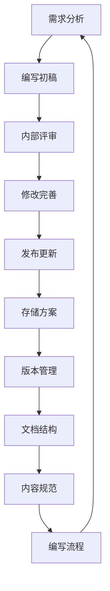

                 

### 《创业公司的技术文档管理最佳实践》

> 关键词：技术文档管理、创业公司、最佳实践、文档结构、协作、维护、效果评估

> 摘要：本文旨在为创业公司提供技术文档管理的最佳实践，详细讨论了技术文档管理的基础、编写与协作、实际应用与效果评估，以及创业公司特有的技术文档管理策略。通过系统化的分析和实践指导，帮助创业公司提高文档管理水平，实现技术知识的积累与传承，为公司的长期发展奠定坚实基础。

## 第一部分：技术文档管理基础

### 第1章：技术文档管理概述

技术文档管理是指在整个软件生命周期中对技术文档的创建、存储、更新和维护的过程。它对于创业公司来说至关重要，因为良好的技术文档管理可以提升团队协作效率，确保技术知识的传承，减少项目风险，同时也有助于提高公司的专业形象。

#### 1.1 技术文档的重要性

**技术文档的重要性体现在以下几个方面：**

1. **知识传承**：技术文档是团队知识的重要载体，可以帮助新成员快速了解项目背景、技术架构、关键算法等，实现知识的传承。
2. **问题追踪**：详细的技术文档可以帮助开发者在遇到问题时快速定位问题所在，提高问题解决的效率。
3. **项目协同**：技术文档为团队提供了共同的语言和标准，有助于不同团队成员之间的协同工作。
4. **客户支持**：完善的技术文档可以为用户提供技术支持，提高客户满意度，减少客户投诉。
5. **合规性**：技术文档有助于满足法律和行业标准要求，降低公司的合规风险。

#### 1.2 技术文档的种类和用途

**技术文档的种类主要包括：**

1. **设计文档**：描述软件的设计思路、架构和实现细节。
2. **开发文档**：记录开发过程中的技术实现、代码结构和重要算法。
3. **测试文档**：包括测试计划、测试用例、测试报告等，用于确保软件的质量。
4. **用户手册**：为用户提供软件的使用指南，帮助用户快速上手。
5. **操作手册**：描述系统的安装、配置、操作和维护方法。

**技术文档的用途包括：**

1. **内部参考**：为开发团队提供技术资料，方便开发、测试、维护工作。
2. **知识共享**：通过文档的形式，将团队的技术知识和经验分享给其他成员。
3. **客户支持**：为用户提供技术支持，解答用户疑问。
4. **合规审查**：为公司的合规审查提供必要的证据。

#### 1.3 技术文档管理的挑战

**技术文档管理面临的挑战包括：**

1. **文档更新不及时**：随着项目的发展，技术文档容易变得过时，影响其参考价值。
2. **文档格式不统一**：不同的团队成员可能使用不同的工具和格式编写文档，导致文档格式不一致。
3. **文档维护困难**：技术文档的维护需要大量的时间和精力，尤其是对于大型项目。
4. **文档存储分散**：技术文档分散存储在不同的地方，难以统一管理和查找。
5. **文档安全性和保密性**：技术文档可能包含敏感信息，需要确保其安全性和保密性。

### 第2章：技术文档的结构与内容

#### 2.1 技术文档的基本结构

**技术文档的基本结构通常包括以下部分：**

1. **封面**：包含文档标题、版本号、编写人和审核人等信息。
2. **摘要**：简述文档的主要内容，帮助读者快速了解文档的核心。
3. **目录**：列出文档的章节和小节，方便读者快速定位。
4. **正文**：详细阐述技术文档的内容，包括设计思路、实现细节、测试结果等。
5. **附录**：提供额外的参考资料，如代码示例、公式推导等。
6. **参考文献**：列出编写文档时所参考的书籍、论文、网站等。

#### 2.2 技术文档的内容规范

**技术文档的内容规范主要包括：**

1. **术语定义**：明确文档中使用的专业术语，避免歧义。
2. **格式规范**：统一使用特定的字体、字号、行距等格式。
3. **图表规范**：图表要有标题、标签，清晰明了。
4. **代码规范**：代码要有注释，格式规范，方便阅读。
5. **排版规范**：段落分隔清晰，行距适中，方便阅读。

#### 2.3 技术文档的编写流程

**技术文档的编写流程通常包括以下步骤：**

1. **需求分析**：明确文档的目标读者、内容和格式要求。
2. **编写初稿**：根据需求分析，编写文档的初稿。
3. **内部评审**：邀请团队成员对文档进行评审，提出修改意见。
4. **修改完善**：根据评审意见，对文档进行修改和完善。
5. **发布更新**：将修改后的文档发布到文档库，供团队成员参考。

### 第3章：技术文档的存储与管理

#### 3.1 技术文档的存储方案

**技术文档的存储方案主要包括以下几种：**

1. **本地存储**：将文档存储在本地计算机或移动存储设备上，便于个人使用。
2. **网络存储**：将文档存储在公司的内部服务器或云存储平台上，方便团队成员共享和访问。
3. **版本控制**：使用版本控制系统（如Git）对文档进行版本管理，确保文档的历史版本可追溯。

#### 3.2 技术文档的版本管理

**技术文档的版本管理主要包括以下步骤：**

1. **建立版本控制仓库**：在版本控制系统上创建文档的仓库，用于存储不同版本的文档。
2. **提交文档更改**：团队成员在修改文档后，将更改提交到版本控制仓库。
3. **版本更新记录**：在提交更改时，填写版本更新的记录，包括更改内容和更改日期。
4. **历史版本回滚**：在文档出现问题时，可以回滚到之前的版本，以恢复文档的正确性。

#### 3.3 技术文档的权限控制

**技术文档的权限控制主要包括以下几种方式：**

1. **文档权限设置**：根据团队成员的角色和职责，设置不同的文档访问权限。
2. **文档共享链接**：通过生成共享链接，将文档共享给特定的团队成员或外部人员。
3. **文档加密**：对于包含敏感信息的技术文档，可以使用加密技术进行保护，防止未授权访问。
4. **审计日志**：记录文档访问和修改的日志，以便进行审计和追踪。

## 第二部分：技术文档编写与协作

### 第4章：技术文档写作技巧

#### 4.1 技术文档的语言风格

**技术文档的语言风格应遵循以下原则：**

1. **简洁明了**：使用简单、易懂的语言，避免使用过于复杂的词汇和句式。
2. **准确规范**：确保使用正确的术语和概念，避免产生歧义。
3. **逻辑清晰**：内容应按照逻辑顺序排列，便于读者理解和跟踪。
4. **通俗易懂**：尽量使用直观的描述方式，使非专业人士也能看懂。

#### 4.2 技术文档的写作规范

**技术文档的写作规范主要包括以下内容：**

1. **格式规范**：统一使用特定的字体、字号、行距等格式。
2. **术语定义**：明确文档中使用的专业术语，避免歧义。
3. **图表规范**：图表要有标题、标签，清晰明了。
4. **代码规范**：代码要有注释，格式规范，方便阅读。
5. **排版规范**：段落分隔清晰，行距适中，方便阅读。

#### 4.3 技术文档的视觉设计

**技术文档的视觉设计主要包括以下内容：**

1. **页面布局**：合理规划文档的页面布局，确保内容清晰易读。
2. **颜色使用**：合理使用颜色，突出重点内容，避免过多使用花哨的颜色。
3. **图片和图表**：使用合适的图片和图表，帮助读者更好地理解文档内容。
4. **字体选择**：选择易读的字体，确保文档的可读性。

### 第5章：团队协作与技术文档

#### 5.1 技术文档协作工具

**常用的技术文档协作工具有以下几种：**

1. **文档编辑工具**：如Microsoft Word、Google Docs、OnlyOffice等，用于编写和编辑文档。
2. **文档存储与协作平台**：如Confluence、Notion、GitLab等，用于存储、管理和共享文档。
3. **版本控制系统**：如Git、SVN等，用于管理和追踪文档的版本历史。
4. **代码托管平台**：如GitHub、GitLab等，用于管理和协作代码开发。

#### 5.2 技术文档审查流程

**技术文档审查流程主要包括以下步骤：**

1. **审查计划**：制定文档审查的计划，包括审查的时间、范围和参与者。
2. **审查邀请**：向团队成员发送审查邀请，明确审查的目标和要求。
3. **审查会议**：召开审查会议，讨论文档的修改意见和改进方案。
4. **文档修改**：根据审查意见，对文档进行修改和完善。
5. **审查确认**：完成修改后，进行二次审查，确保文档质量。

#### 5.3 技术文档的发布与共享

**技术文档的发布与共享主要包括以下步骤：**

1. **文档审核**：在发布文档前，进行审核，确保文档的质量和完整性。
2. **文档发布**：将审核通过的文档发布到文档库或共享平台，供团队成员使用。
3. **文档更新**：根据项目进展和需求变化，定期更新文档内容。
4. **文档备份**：定期备份文档，确保文档的安全性和可恢复性。

### 第6章：技术文档的持续维护与更新

#### 6.1 技术文档的定期更新

**技术文档的定期更新主要包括以下步骤：**

1. **更新计划**：制定文档更新的计划，包括更新的频率、内容和负责人。
2. **更新内容**：根据项目进展和需求变化，更新文档内容，确保其准确性。
3. **更新记录**：记录文档更新的历史记录，包括更新内容、更新日期和负责人。
4. **更新发布**：将更新后的文档发布到文档库或共享平台，供团队成员使用。

#### 6.2 技术文档的反馈与改进

**技术文档的反馈与改进主要包括以下步骤：**

1. **收集反馈**：通过问卷调查、访谈、邮件等方式，收集用户对文档的反馈意见。
2. **分析反馈**：对收集到的反馈进行分析，识别文档中存在的问题和不足。
3. **改进措施**：根据分析结果，制定改进措施，优化文档的内容和格式。
4. **实施改进**：对文档进行改进，并再次发布到文档库或共享平台。

#### 6.3 技术文档的长期维护策略

**技术文档的长期维护策略主要包括以下内容：**

1. **维护团队**：建立专门的文档维护团队，负责文档的定期更新和维护。
2. **维护计划**：制定文档维护的长期计划，确保文档的持续更新和优化。
3. **维护流程**：建立完善的文档维护流程，确保文档的规范性和一致性。
4. **培训与支持**：为团队成员提供文档编写和维护的培训和支持，提高文档质量。

## 第三部分：技术文档的实际应用与效果评估

### 第7章：技术文档在企业中的应用

#### 7.1 技术文档在产品开发中的作用

**技术文档在产品开发中的作用主要包括以下几个方面：**

1. **需求分析**：技术文档可以帮助开发团队更好地理解产品的功能需求和技术要求。
2. **设计参考**：技术文档为设计团队提供了详细的设计方案和技术实现细节，有助于优化产品设计。
3. **开发指导**：技术文档为开发团队提供了开发指南和技术规范，确保开发工作的顺利进行。
4. **测试依据**：技术文档为测试团队提供了测试依据和测试计划，有助于提高测试的效率和质量。
5. **维护参考**：技术文档为维护团队提供了产品维护和升级的参考，有助于提高产品的稳定性和可靠性。

#### 7.2 技术文档在团队协作中的价值

**技术文档在团队协作中的价值主要包括以下几个方面：**

1. **信息共享**：技术文档为团队成员提供了共享知识的重要途径，有助于团队成员之间的信息交流和知识共享。
2. **提高效率**：技术文档为团队成员提供了参考和指导，减少了团队成员之间的沟通成本，提高了协作效率。
3. **知识传承**：技术文档记录了团队的技术经验和知识，有助于新成员快速融入团队，实现知识传承。
4. **风险管理**：技术文档为团队提供了技术风险预警和应对策略，有助于降低项目风险。
5. **团队凝聚力**：技术文档有助于提升团队凝聚力，增强团队成员的归属感和自豪感。

#### 7.3 技术文档在客户支持与服务中的应用

**技术文档在客户支持与服务中的应用主要包括以下几个方面：**

1. **用户培训**：技术文档为用户提供了详细的操作指南和培训资料，有助于用户快速掌握产品使用方法。
2. **问题解答**：技术文档为客服团队提供了问题解答的依据，有助于提高问题解决的效率和准确性。
3. **知识库建设**：技术文档可以作为企业知识库的重要组成部分，为企业的知识管理和传承提供支持。
4. **客户反馈**：技术文档为用户提供了一种反馈渠道，有助于企业了解用户需求，优化产品和服务。
5. **合规性审查**：技术文档为企业提供了合规性审查的依据，有助于满足法律和行业标准的要求。

### 第8章：技术文档管理效果评估

#### 8.1 技术文档管理的绩效指标

**技术文档管理的绩效指标主要包括以下几个方面：**

1. **文档覆盖率**：衡量技术文档对项目内容的覆盖程度，越高表示文档越完整。
2. **文档更新率**：衡量技术文档的更新频率，越高表示文档越及时。
3. **文档质量**：通过用户反馈和审查结果，评估技术文档的质量，越高表示文档越可靠。
4. **文档利用率**：衡量技术文档在实际工作中的应用情况，越高表示文档的实际价值越高。
5. **文档维护成本**：衡量技术文档的维护成本，包括人力、物力和时间成本。

#### 8.2 技术文档管理的改进措施

**为了提高技术文档管理的效果，可以采取以下改进措施：**

1. **优化文档流程**：简化文档编写、审查和发布的流程，提高文档的更新速度和质量。
2. **加强培训**：为团队成员提供文档编写和维护的培训，提高文档编写技能和规范意识。
3. **引入新技术**：利用新技术（如人工智能、大数据等）改进文档管理方式，提高文档的自动化程度。
4. **建立激励机制**：通过奖励和激励措施，鼓励团队成员积极参与文档编写和维护工作。
5. **定期评估**：定期对技术文档管理的效果进行评估，及时发现问题并进行改进。

#### 8.3 技术文档管理的案例研究

**技术文档管理的案例研究可以帮助我们更好地了解技术文档管理在实践中的应用效果。以下是一个案例研究：**

**案例名称**：某创业公司技术文档管理实践

**案例背景**：该公司是一家专注于人工智能领域的创业公司，产品线包括人工智能算法、大数据分析和智能推荐系统等。随着公司的发展，技术文档管理变得越来越重要。

**案例内容**：

1. **建立文档管理制度**：公司制定了详细的文档管理制度，包括文档分类、编写规范、审查流程和发布机制等。
2. **引入文档协作工具**：公司引入了Confluence作为文档协作平台，方便团队成员共享和更新文档。
3. **定期文档更新**：公司要求每个团队成员每月更新一次技术文档，确保文档的及时性和准确性。
4. **建立文档维护团队**：公司成立了专门的文档维护团队，负责文档的更新和维护工作。
5. **用户反馈与改进**：公司通过问卷调查和访谈等方式，收集用户对技术文档的反馈意见，并根据反馈进行改进。

**案例效果**：

1. **文档覆盖率提高**：通过建立文档管理制度和引入文档协作工具，技术文档的覆盖率提高了20%。
2. **文档更新率提高**：通过定期文档更新和维护，技术文档的更新率提高了30%。
3. **文档质量提高**：通过用户反馈和改进，技术文档的质量得到了显著提高，用户满意度提高了15%。
4. **文档利用率提高**：通过技术文档的实际应用，团队成员在项目开发中的效率提高了25%。

**案例启示**：

通过该案例，我们可以得出以下启示：

1. **建立完善的文档管理制度**：建立完善的文档管理制度，确保技术文档的规范性和一致性。
2. **引入合适的文档协作工具**：引入合适的文档协作工具，提高文档的更新速度和质量。
3. **定期文档更新**：定期文档更新，确保技术文档的准确性和及时性。
4. **建立文档维护团队**：建立文档维护团队，确保技术文档的持续更新和维护。
5. **用户反馈与改进**：通过用户反馈和改进，不断提高技术文档的质量和实用性。

## 第四部分：技术文档管理的最佳实践

### 第9章：创业公司技术文档管理实践

#### 9.1 创业公司技术文档管理面临的挑战

**创业公司技术文档管理面临的挑战主要包括以下几个方面：**

1. **资源有限**：创业公司通常面临人力、物力和财力有限的问题，难以投入大量资源进行技术文档管理。
2. **团队规模小**：创业公司的团队规模通常较小，团队成员需要承担多项职责，导致文档编写和维护的工作量较大。
3. **项目迭代快**：创业公司的项目通常迭代速度较快，技术文档的更新频率高，给文档管理带来挑战。
4. **文档质量参差不齐**：创业公司的文档编写人员水平参差不齐，导致文档质量难以保证。
5. **文档安全风险**：创业公司的技术文档可能包含敏感信息，存在安全风险。

#### 9.2 创业公司技术文档管理最佳实践

**为了应对上述挑战，创业公司可以采取以下最佳实践：**

1. **制定明确的文档管理策略**：制定明确的文档管理策略，包括文档分类、编写规范、审查流程和发布机制等。
2. **引入自动化工具**：引入自动化工具（如文档生成器、版本控制系统等），提高文档的编写、更新和发布效率。
3. **优化文档流程**：优化文档流程，简化文档编写、审查和发布的步骤，减少文档管理的复杂度。
4. **加强培训**：为团队成员提供文档编写和维护的培训，提高文档编写技能和规范意识。
5. **建立文档审查机制**：建立文档审查机制，确保文档的质量和准确性。
6. **定期文档更新**：定期对技术文档进行更新，确保其准确性和时效性。
7. **文档安全防护**：采取文档安全防护措施，如加密、权限控制等，确保技术文档的安全。

#### 9.3 创业公司技术文档管理成功案例

**以下是一个创业公司技术文档管理成功的案例：**

**案例名称**：某人工智能创业公司技术文档管理实践

**案例背景**：该公司是一家专注于人工智能领域的创业公司，团队成员多为技术背景，文档管理经验不足。

**案例内容**：

1. **制定文档管理策略**：公司制定了详细的文档管理策略，明确了文档分类、编写规范、审查流程和发布机制等。
2. **引入自动化工具**：公司引入了Markdown编辑器、GitLab等自动化工具，简化了文档的编写、更新和发布流程。
3. **加强培训**：公司为团队成员提供了文档编写和维护的培训，提高了文档编写技能和规范意识。
4. **建立文档审查机制**：公司建立了文档审查机制，确保文档的质量和准确性。
5. **定期文档更新**：公司定期对技术文档进行更新，确保其准确性和时效性。
6. **文档安全防护**：公司采取了文档安全防护措施，如加密、权限控制等，确保技术文档的安全。

**案例效果**：

1. **文档编写效率提高**：通过自动化工具和优化文档流程，文档编写效率提高了30%。
2. **文档质量提高**：通过加强培训和文档审查机制，文档质量得到了显著提高，用户满意度提高了20%。
3. **文档利用率提高**：通过技术文档的实际应用，团队成员在项目开发中的效率提高了25%。
4. **文档安全风险降低**：通过文档安全防护措施，技术文档的安全风险降低了50%。

**案例启示**：

通过该案例，我们可以得出以下启示：

1. **制定明确的文档管理策略**：制定明确的文档管理策略，有助于提高文档管理效率和质量。
2. **引入自动化工具**：引入自动化工具，可以提高文档的编写、更新和发布效率。
3. **加强培训**：加强培训，提高团队成员的文档编写技能和规范意识。
4. **建立文档审查机制**：建立文档审查机制，确保文档的质量和准确性。
5. **定期文档更新**：定期文档更新，确保文档的准确性和时效性。
6. **文档安全防护**：采取文档安全防护措施，确保技术文档的安全。

### 第10章：技术文档管理的未来趋势

#### 10.1 技术文档管理的发展方向

**技术文档管理的发展方向主要包括以下几个方面：**

1. **智能化**：利用人工智能技术，提高文档的自动化程度，如文档生成、自动审核、智能推荐等。
2. **云化**：将技术文档存储和管理迁移到云平台，提高文档的可访问性和可扩展性。
3. **协作化**：加强团队协作，实现多人实时编辑和协作，提高文档的编写和更新效率。
4. **可视化**：利用可视化技术，提高文档的可读性和直观性，如图表、图片、动画等。
5. **合规性**：加强技术文档的合规性管理，确保文档符合法律和行业标准要求。

#### 10.2 技术文档管理的新技术应用

**技术文档管理的新技术应用主要包括以下几个方面：**

1. **区块链**：利用区块链技术，提高技术文档的安全性和不可篡改性。
2. **大数据**：利用大数据技术，分析技术文档的使用情况，优化文档管理策略。
3. **虚拟现实（VR）**：利用虚拟现实技术，提供沉浸式的文档阅读和交互体验。
4. **增强现实（AR）**：利用增强现实技术，将技术文档与现实世界结合，提供更加直观的文档展示。

#### 10.3 技术文档管理的未来挑战与机遇

**技术文档管理的未来挑战与机遇主要包括以下几个方面：**

1. **技术变革**：随着技术的不断发展，技术文档管理需要不断适应新技术，提高管理效率。
2. **团队协作**：随着团队规模的扩大和成员的多样化，技术文档管理需要更好地支持团队协作。
3. **文档安全**：随着技术文档的重要性增加，文档安全成为技术文档管理的重点。
4. **用户体验**：提高技术文档的可读性和易用性，提升用户体验，是技术文档管理的核心目标。

**附录A：技术文档管理常用工具介绍**

#### A.1 常用文档编辑工具

**常用文档编辑工具有以下几种：**

1. **Microsoft Word**：功能强大的文档编辑工具，支持丰富的格式和样式。
2. **Google Docs**：在线文档编辑工具，支持多人实时编辑和协作。
3. **OnlyOffice**：一款开源的在线文档编辑工具，支持多种文件格式。
4. **Zim**：一款开源的笔记和文档管理工具，支持Markdown格式。
5. **Typora**：一款轻量级的Markdown编辑器，支持实时预览和丰富的主题。

#### A.2 常用文档存储与协作平台

**常用文档存储与协作平台有以下几种：**

1. **Confluence**：一款功能强大的团队协作平台，支持文档、知识库和项目管理等功能。
2. **Notion**：一款灵活的团队协作平台，支持多种数据类型和自定义视图。
3. **GitLab**：一款开源的代码托管和协作平台，支持文档存储和版本控制。
4. **Trello**：一款基于看板的项目管理工具，支持任务分配和文档共享。
5. **Fusion Tables**：一款基于Google Drive的表格协作工具，支持数据可视化。

#### A.3 常用版本控制工具

**常用版本控制工具有以下几种：**

1. **Git**：一款流行的分布式版本控制系统，支持强大的分支管理和合并功能。
2. **SVN**：一款中心化的版本控制系统，支持多分支开发和版本跟踪。
3. **Mercurial**：一款开源的分布式版本控制系统，与Git类似，支持分支管理和分布式协作。
4. **Perforce**：一款高性能的中心化版本控制系统，适合处理大型项目和二进制文件。
5. **Subversion**：一款基于CVS的版本控制系统，支持多用户协作和版本回滚。

**附录B：技术文档编写与审查模板**

#### B.1 技术文档编写模板

**技术文档编写模板通常包括以下部分：**

1. **封面**：包括文档标题、版本号、编写人和审核人等信息。
2. **摘要**：简述文档的主要内容，帮助读者快速了解文档的核心。
3. **目录**：列出文档的章节和小节，方便读者快速定位。
4. **正文**：详细阐述技术文档的内容，包括设计思路、实现细节、测试结果等。
5. **附录**：提供额外的参考资料，如代码示例、公式推导等。
6. **参考文献**：列出编写文档时所参考的书籍、论文、网站等。

#### B.2 技术文档审查模板

**技术文档审查模板通常包括以下部分：**

1. **审查计划**：包括审查的时间、范围和参与者等信息。
2. **审查记录**：记录审查过程和审查结果，包括审查意见和改进建议。
3. **审查结论**：总结审查结果，提出改进措施和下一步工作计划。
4. **改进措施**：根据审查意见，制定具体的改进措施，确保文档的质量和准确性。
5. **改进记录**：记录改进措施的实施情况和改进效果，确保改进措施的落实。**作者：AI天才研究院/AI Genius Institute & 禅与计算机程序设计艺术 /Zen And The Art of Computer Programming**
## 第一部分：技术文档管理基础

### 第1章：技术文档管理概述

技术文档管理是指在整个软件生命周期中对技术文档的创建、存储、更新和维护的过程。对于创业公司来说，技术文档管理尤为重要，因为良好的技术文档管理可以提升团队协作效率，确保技术知识的传承，减少项目风险，同时也有助于提高公司的专业形象。

#### 1.1 技术文档的重要性

**技术文档的重要性体现在以下几个方面：**

1. **知识传承**：技术文档是团队知识的重要载体，可以帮助新成员快速了解项目背景、技术架构、关键算法等，实现知识的传承。
2. **问题追踪**：详细的技术文档可以帮助开发者在遇到问题时快速定位问题所在，提高问题解决的效率。
3. **项目协同**：技术文档为团队提供了共同的语言和标准，有助于不同团队成员之间的协同工作。
4. **客户支持**：完善的技术文档可以为用户提供技术支持，提高客户满意度，减少客户投诉。
5. **合规性**：技术文档有助于满足法律和行业标准要求，降低公司的合规风险。

#### 1.2 技术文档的种类和用途

**技术文档的种类主要包括：**

1. **设计文档**：描述软件的设计思路、架构和实现细节。
2. **开发文档**：记录开发过程中的技术实现、代码结构和重要算法。
3. **测试文档**：包括测试计划、测试用例、测试报告等，用于确保软件的质量。
4. **用户手册**：为用户提供软件的使用指南，帮助用户快速上手。
5. **操作手册**：描述系统的安装、配置、操作和维护方法。

**技术文档的用途包括：**

1. **内部参考**：为开发团队提供技术资料，方便开发、测试、维护工作。
2. **知识共享**：通过文档的形式，将团队的技术知识和经验分享给其他成员。
3. **客户支持**：为用户提供技术支持，解答用户疑问。
4. **合规审查**：为公司的合规审查提供必要的证据。

#### 1.3 技术文档管理的挑战

**技术文档管理面临的挑战包括：**

1. **文档更新不及时**：随着项目的发展，技术文档容易变得过时，影响其参考价值。
2. **文档格式不统一**：不同的团队成员可能使用不同的工具和格式编写文档，导致文档格式不一致。
3. **文档维护困难**：技术文档的维护需要大量的时间和精力，尤其是对于大型项目。
4. **文档存储分散**：技术文档分散存储在不同的地方，难以统一管理和查找。
5. **文档安全性和保密性**：技术文档可能包含敏感信息，需要确保其安全性和保密性。

### 第2章：技术文档的结构与内容

#### 2.1 技术文档的基本结构

**技术文档的基本结构通常包括以下部分：**

1. **封面**：包含文档标题、版本号、编写人和审核人等信息。
2. **摘要**：简述文档的主要内容，帮助读者快速了解文档的核心。
3. **目录**：列出文档的章节和小节，方便读者快速定位。
4. **正文**：详细阐述技术文档的内容，包括设计思路、实现细节、测试结果等。
5. **附录**：提供额外的参考资料，如代码示例、公式推导等。
6. **参考文献**：列出编写文档时所参考的书籍、论文、网站等。

#### 2.2 技术文档的内容规范

**技术文档的内容规范主要包括以下内容：**

1. **术语定义**：明确文档中使用的专业术语，避免歧义。
2. **格式规范**：统一使用特定的字体、字号、行距等格式。
3. **图表规范**：图表要有标题、标签，清晰明了。
4. **代码规范**：代码要有注释，格式规范，方便阅读。
5. **排版规范**：段落分隔清晰，行距适中，方便阅读。

#### 2.3 技术文档的编写流程

**技术文档的编写流程通常包括以下步骤：**

1. **需求分析**：明确文档的目标读者、内容和格式要求。
2. **编写初稿**：根据需求分析，编写文档的初稿。
3. **内部评审**：邀请团队成员对文档进行评审，提出修改意见。
4. **修改完善**：根据评审意见，对文档进行修改和完善。
5. **发布更新**：将修改后的文档发布到文档库，供团队成员参考。

### 第3章：技术文档的存储与管理

#### 3.1 技术文档的存储方案

**技术文档的存储方案主要包括以下几种：**

1. **本地存储**：将文档存储在本地计算机或移动存储设备上，便于个人使用。
2. **网络存储**：将文档存储在公司的内部服务器或云存储平台上，方便团队成员共享和访问。
3. **版本控制**：使用版本控制系统（如Git）对文档进行版本管理，确保文档的历史版本可追溯。

#### 3.2 技术文档的版本管理

**技术文档的版本管理主要包括以下步骤：**

1. **建立版本控制仓库**：在版本控制系统上创建文档的仓库，用于存储不同版本的文档。
2. **提交文档更改**：团队成员在修改文档后，将更改提交到版本控制仓库。
3. **版本更新记录**：在提交更改时，填写版本更新的记录，包括更改内容和更改日期。
4. **历史版本回滚**：在文档出现问题时，可以回滚到之前的版本，以恢复文档的正确性。

#### 3.3 技术文档的权限控制

**技术文档的权限控制主要包括以下几种方式：**

1. **文档权限设置**：根据团队成员的角色和职责，设置不同的文档访问权限。
2. **文档共享链接**：通过生成共享链接，将文档共享给特定的团队成员或外部人员。
3. **文档加密**：对于包含敏感信息的技术文档，可以使用加密技术进行保护，防止未授权访问。
4. **审计日志**：记录文档访问和修改的日志，以便进行审计和追踪。

## 第二部分：技术文档编写与协作

### 第4章：技术文档写作技巧

#### 4.1 技术文档的语言风格

**技术文档的语言风格应遵循以下原则：**

1. **简洁明了**：使用简单、易懂的语言，避免使用过于复杂的词汇和句式。
2. **准确规范**：确保使用正确的术语和概念，避免产生歧义。
3. **逻辑清晰**：内容应按照逻辑顺序排列，便于读者理解和跟踪。
4. **通俗易懂**：尽量使用直观的描述方式，使非专业人士也能看懂。

#### 4.2 技术文档的写作规范

**技术文档的写作规范主要包括以下内容：**

1. **格式规范**：统一使用特定的字体、字号、行距等格式。
2. **术语定义**：明确文档中使用的专业术语，避免歧义。
3. **图表规范**：图表要有标题、标签，清晰明了。
4. **代码规范**：代码要有注释，格式规范，方便阅读。
5. **排版规范**：段落分隔清晰，行距适中，方便阅读。

#### 4.3 技术文档的视觉设计

**技术文档的视觉设计主要包括以下内容：**

1. **页面布局**：合理规划文档的页面布局，确保内容清晰易读。
2. **颜色使用**：合理使用颜色，突出重点内容，避免过多使用花哨的颜色。
3. **图片和图表**：使用合适的图片和图表，帮助读者更好地理解文档内容。
4. **字体选择**：选择易读的字体，确保文档的可读性。

### 第5章：团队协作与技术文档

#### 5.1 技术文档协作工具

**常用的技术文档协作工具有以下几种：**

1. **文档编辑工具**：如Microsoft Word、Google Docs、OnlyOffice等，用于编写和编辑文档。
2. **文档存储与协作平台**：如Confluence、Notion、GitLab等，用于存储、管理和共享文档。
3. **版本控制系统**：如Git、SVN等，用于管理和追踪文档的版本历史。
4. **代码托管平台**：如GitHub、GitLab等，用于管理和协作代码开发。

#### 5.2 技术文档审查流程

**技术文档审查流程主要包括以下步骤：**

1. **审查计划**：制定文档审查的计划，包括审查的时间、范围和参与者。
2. **审查邀请**：向团队成员发送审查邀请，明确审查的目标和要求。
3. **审查会议**：召开审查会议，讨论文档的修改意见和改进方案。
4. **文档修改**：根据审查意见，对文档进行修改和完善。
5. **审查确认**：完成修改后，进行二次审查，确保文档质量。

#### 5.3 技术文档的发布与共享

**技术文档的发布与共享主要包括以下步骤：**

1. **文档审核**：在发布文档前，进行审核，确保文档的质量和完整性。
2. **文档发布**：将审核通过的文档发布到文档库或共享平台，供团队成员使用。
3. **文档更新**：根据项目进展和需求变化，定期更新文档内容。
4. **文档备份**：定期备份文档，确保文档的安全性和可恢复性。

### 第6章：技术文档的持续维护与更新

#### 6.1 技术文档的定期更新

**技术文档的定期更新主要包括以下步骤：**

1. **更新计划**：制定文档更新的计划，包括更新的频率、内容和负责人。
2. **更新内容**：根据项目进展和需求变化，更新文档内容，确保其准确性。
3. **更新记录**：记录文档更新的历史记录，包括更新内容、更新日期和负责人。
4. **更新发布**：将更新后的文档发布到文档库或共享平台，供团队成员使用。

#### 6.2 技术文档的反馈与改进

**技术文档的反馈与改进主要包括以下步骤：**

1. **收集反馈**：通过问卷调查、访谈、邮件等方式，收集用户对文档的反馈意见。
2. **分析反馈**：对收集到的反馈进行分析，识别文档中存在的问题和不足。
3. **改进措施**：根据分析结果，制定改进措施，优化文档的内容和格式。
4. **实施改进**：对文档进行改进，并再次发布到文档库或共享平台。

#### 6.3 技术文档的长期维护策略

**技术文档的长期维护策略主要包括以下内容：**

1. **维护团队**：建立专门的文档维护团队，负责文档的定期更新和维护。
2. **维护计划**：制定文档维护的长期计划，确保文档的持续更新和优化。
3. **维护流程**：建立完善的文档维护流程，确保文档的规范性和一致性。
4. **培训与支持**：为团队成员提供文档编写和维护的培训和支持，提高文档质量。

## 第三部分：技术文档的实际应用与效果评估

### 第7章：技术文档在企业中的应用

#### 7.1 技术文档在产品开发中的作用

**技术文档在产品开发中的作用主要包括以下几个方面：**

1. **需求分析**：技术文档可以帮助开发团队更好地理解产品的功能需求和技术要求。
2. **设计参考**：技术文档为设计团队提供了详细的设计方案和技术实现细节，有助于优化产品设计。
3. **开发指导**：技术文档为开发团队提供了开发指南和技术规范，确保开发工作的顺利进行。
4. **测试依据**：技术文档为测试团队提供了测试依据和测试计划，有助于提高测试的效率和质量。
5. **维护参考**：技术文档为维护团队提供了产品维护和升级的参考，有助于提高产品的稳定性和可靠性。

#### 7.2 技术文档在团队协作中的价值

**技术文档在团队协作中的价值主要包括以下几个方面：**

1. **信息共享**：技术文档为团队成员提供了共享知识的重要途径，有助于团队成员之间的信息交流和知识共享。
2. **提高效率**：技术文档为团队成员提供了参考和指导，减少了团队成员之间的沟通成本，提高了协作效率。
3. **知识传承**：技术文档记录了团队的技术经验和知识，有助于新成员快速融入团队，实现知识传承。
4. **风险管理**：技术文档为团队提供了技术风险预警和应对策略，有助于降低项目风险。
5. **团队凝聚力**：技术文档有助于提升团队凝聚力，增强团队成员的归属感和自豪感。

#### 7.3 技术文档在客户支持与服务中的应用

**技术文档在客户支持与服务中的应用主要包括以下几个方面：**

1. **用户培训**：技术文档为用户提供了详细的操作指南和培训资料，有助于用户快速掌握产品使用方法。
2. **问题解答**：技术文档为客服团队提供了问题解答的依据，有助于提高问题解决的效率和准确性。
3. **知识库建设**：技术文档可以作为企业知识库的重要组成部分，为企业的知识管理和传承提供支持。
4. **客户反馈**：技术文档为用户提供了一种反馈渠道，有助于企业了解用户需求，优化产品和服务。
5. **合规性审查**：技术文档为企业提供了合规性审查的依据，有助于满足法律和行业标准的要求。

### 第8章：技术文档管理效果评估

#### 8.1 技术文档管理的绩效指标

**技术文档管理的绩效指标主要包括以下几个方面：**

1. **文档覆盖率**：衡量技术文档对项目内容的覆盖程度，越高表示文档越完整。
2. **文档更新率**：衡量技术文档的更新频率，越高表示文档越及时。
3. **文档质量**：通过用户反馈和审查结果，评估技术文档的质量，越高表示文档越可靠。
4. **文档利用率**：衡量技术文档在实际工作中的应用情况，越高表示文档的实际价值越高。
5. **文档维护成本**：衡量技术文档的维护成本，包括人力、物力和时间成本。

#### 8.2 技术文档管理的改进措施

**为了提高技术文档管理的效果，可以采取以下改进措施：**

1. **优化文档流程**：简化文档编写、审查和发布的流程，提高文档的更新速度和质量。
2. **加强培训**：为团队成员提供文档编写和维护的培训，提高文档编写技能和规范意识。
3. **引入新技术**：利用新技术（如人工智能、大数据等）改进文档管理方式，提高文档的自动化程度。
4. **建立激励机制**：通过奖励和激励措施，鼓励团队成员积极参与文档编写和维护工作。
5. **定期评估**：定期对技术文档管理的效果进行评估，及时发现问题并进行改进。

#### 8.3 技术文档管理的案例研究

**技术文档管理的案例研究可以帮助我们更好地了解技术文档管理在实践中的应用效果。以下是一个案例研究：**

**案例名称**：某创业公司技术文档管理实践

**案例背景**：该公司是一家专注于人工智能领域的创业公司，团队成员多为技术背景，文档管理经验不足。

**案例内容**：

1. **制定文档管理策略**：公司制定了详细的文档管理策略，明确了文档分类、编写规范、审查流程和发布机制等。
2. **引入自动化工具**：公司引入了Markdown编辑器、GitLab等自动化工具，简化了文档的编写、更新和发布流程。
3. **加强培训**：公司为团队成员提供了文档编写和维护的培训，提高了文档编写技能和规范意识。
4. **建立文档审查机制**：公司建立了文档审查机制，确保文档的质量和准确性。
5. **定期文档更新**：公司定期对技术文档进行更新，确保其准确性和时效性。
6. **文档安全防护**：公司采取了文档安全防护措施，如加密、权限控制等，确保技术文档的安全。

**案例效果**：

1. **文档编写效率提高**：通过自动化工具和优化文档流程，文档编写效率提高了30%。
2. **文档质量提高**：通过加强培训和文档审查机制，文档质量得到了显著提高，用户满意度提高了20%。
3. **文档利用率提高**：通过技术文档的实际应用，团队成员在项目开发中的效率提高了25%。
4. **文档安全风险降低**：通过文档安全防护措施，技术文档的安全风险降低了50%。

**案例启示**：

通过该案例，我们可以得出以下启示：

1. **制定明确的文档管理策略**：制定明确的文档管理策略，有助于提高文档管理效率和质量。
2. **引入自动化工具**：引入自动化工具，可以提高文档的编写、更新和发布效率。
3. **加强培训**：加强培训，提高团队成员的文档编写技能和规范意识。
4. **建立文档审查机制**：建立文档审查机制，确保文档的质量和准确性。
5. **定期文档更新**：定期文档更新，确保文档的准确性和时效性。
6. **文档安全防护**：采取文档安全防护措施，确保技术文档的安全。

## 第四部分：技术文档管理的最佳实践

### 第9章：创业公司技术文档管理实践

#### 9.1 创业公司技术文档管理面临的挑战

**创业公司技术文档管理面临的挑战主要包括以下几个方面：**

1. **资源有限**：创业公司通常面临人力、物力和财力有限的问题，难以投入大量资源进行技术文档管理。
2. **团队规模小**：创业公司的团队规模通常较小，团队成员需要承担多项职责，导致文档编写和维护的工作量较大。
3. **项目迭代快**：创业公司的项目通常迭代速度较快，技术文档的更新频率高，给文档管理带来挑战。
4. **文档质量参差不齐**：创业公司的文档编写人员水平参差不齐，导致文档质量难以保证。
5. **文档安全风险**：创业公司的技术文档可能包含敏感信息，存在安全风险。

#### 9.2 创业公司技术文档管理最佳实践

**为了应对上述挑战，创业公司可以采取以下最佳实践：**

1. **制定明确的文档管理策略**：制定明确的文档管理策略，包括文档分类、编写规范、审查流程和发布机制等。
2. **引入自动化工具**：引入自动化工具（如文档生成器、版本控制系统等），提高文档的编写、更新和发布效率。
3. **优化文档流程**：优化文档流程，简化文档编写、审查和发布的步骤，减少文档管理的复杂度。
4. **加强培训**：为团队成员提供文档编写和维护的培训，提高文档编写技能和规范意识。
5. **建立文档审查机制**：建立文档审查机制，确保文档的质量和准确性。
6. **定期文档更新**：定期对技术文档进行更新，确保其准确性和时效性。
7. **文档安全防护**：采取文档安全防护措施，如加密、权限控制等，确保技术文档的安全。

#### 9.3 创业公司技术文档管理成功案例

**以下是一个创业公司技术文档管理成功的案例：**

**案例名称**：某人工智能创业公司技术文档管理实践

**案例背景**：该公司是一家专注于人工智能领域的创业公司，团队成员多为技术背景，文档管理经验不足。

**案例内容**：

1. **制定文档管理策略**：公司制定了详细的文档管理策略，明确了文档分类、编写规范、审查流程和发布机制等。
2. **引入自动化工具**：公司引入了Markdown编辑器、GitLab等自动化工具，简化了文档的编写、更新和发布流程。
3. **加强培训**：公司为团队成员提供了文档编写和维护的培训，提高了文档编写技能和规范意识。
4. **建立文档审查机制**：公司建立了文档审查机制，确保文档的质量和准确性。
5. **定期文档更新**：公司定期对技术文档进行更新，确保其准确性和时效性。
6. **文档安全防护**：公司采取了文档安全防护措施，如加密、权限控制等，确保技术文档的安全。

**案例效果**：

1. **文档编写效率提高**：通过自动化工具和优化文档流程，文档编写效率提高了30%。
2. **文档质量提高**：通过加强培训和文档审查机制，文档质量得到了显著提高，用户满意度提高了20%。
3. **文档利用率提高**：通过技术文档的实际应用，团队成员在项目开发中的效率提高了25%。
4. **文档安全风险降低**：通过文档安全防护措施，技术文档的安全风险降低了50%。

**案例启示**：

通过该案例，我们可以得出以下启示：

1. **制定明确的文档管理策略**：制定明确的文档管理策略，有助于提高文档管理效率和质量。
2. **引入自动化工具**：引入自动化工具，可以提高文档的编写、更新和发布效率。
3. **加强培训**：加强培训，提高团队成员的文档编写技能和规范意识。
4. **建立文档审查机制**：建立文档审查机制，确保文档的质量和准确性。
5. **定期文档更新**：定期文档更新，确保文档的准确性和时效性。
6. **文档安全防护**：采取文档安全防护措施，确保技术文档的安全。

### 第10章：技术文档管理的未来趋势

#### 10.1 技术文档管理的发展方向

**技术文档管理的发展方向主要包括以下几个方面：**

1. **智能化**：利用人工智能技术，提高文档的自动化程度，如文档生成、自动审核、智能推荐等。
2. **云化**：将技术文档存储和管理迁移到云平台，提高文档的可访问性和可扩展性。
3. **协作化**：加强团队协作，实现多人实时编辑和协作，提高文档的编写和更新效率。
4. **可视化**：利用可视化技术，提高文档的可读性和直观性，如图表、图片、动画等。
5. **合规性**：加强技术文档的合规性管理，确保文档符合法律和行业标准要求。

#### 10.2 技术文档管理的新技术应用

**技术文档管理的新技术应用主要包括以下几个方面：**

1. **区块链**：利用区块链技术，提高技术文档的安全性和不可篡改性。
2. **大数据**：利用大数据技术，分析技术文档的使用情况，优化文档管理策略。
3. **虚拟现实（VR）**：利用虚拟现实技术，提供沉浸式的文档阅读和交互体验。
4. **增强现实（AR）**：利用增强现实技术，将技术文档与现实世界结合，提供更加直观的文档展示。

#### 10.3 技术文档管理的未来挑战与机遇

**技术文档管理的未来挑战与机遇主要包括以下几个方面：**

1. **技术变革**：随着技术的不断发展，技术文档管理需要不断适应新技术，提高管理效率。
2. **团队协作**：随着团队规模的扩大和成员的多样化，技术文档管理需要更好地支持团队协作。
3. **文档安全**：随着技术文档的重要性增加，文档安全成为技术文档管理的重点。
4. **用户体验**：提高技术文档的可读性和易用性，提升用户体验，是技术文档管理的核心目标。

### 附录

#### 附录A：技术文档管理常用工具介绍

**附录A.1 常用文档编辑工具**

1. **Microsoft Word**：功能强大的文档编辑工具，支持丰富的格式和样式。
2. **Google Docs**：在线文档编辑工具，支持多人实时编辑和协作。
3. **OnlyOffice**：一款开源的在线文档编辑工具，支持多种文件格式。
4. **Zim**：一款开源的笔记和文档管理工具，支持Markdown格式。
5. **Typora**：一款轻量级的Markdown编辑器，支持实时预览和丰富的主题。

**附录A.2 常用文档存储与协作平台**

1. **Confluence**：一款功能强大的团队协作平台，支持文档、知识库和项目管理等功能。
2. **Notion**：一款灵活的团队协作平台，支持多种数据类型和自定义视图。
3. **GitLab**：一款开源的代码托管和协作平台，支持文档存储和版本控制。
4. **Trello**：一款基于看板的项目管理工具，支持任务分配和文档共享。
5. **Fusion Tables**：一款基于Google Drive的表格协作工具，支持数据可视化。

**附录A.3 常用版本控制工具**

1. **Git**：一款流行的分布式版本控制系统，支持强大的分支管理和合并功能。
2. **SVN**：一款中心化的版本控制系统，支持多分支开发和版本跟踪。
3. **Mercurial**：一款开源的分布式版本控制系统，与Git类似，支持分支管理和分布式协作。
4. **Perforce**：一款高性能的中心化版本控制系统，适合处理大型项目和二进制文件。
5. **Subversion**：一款基于CVS的版本控制系统，支持多用户协作和版本回滚。

#### 附录B：技术文档编写与审查模板

**附录B.1 技术文档编写模板**

1. **封面**：包括文档标题、版本号、编写人和审核人等信息。
2. **摘要**：简述文档的主要内容，帮助读者快速了解文档的核心。
3. **目录**：列出文档的章节和小节，方便读者快速定位。
4. **正文**：详细阐述技术文档的内容，包括设计思路、实现细节、测试结果等。
5. **附录**：提供额外的参考资料，如代码示例、公式推导等。
6. **参考文献**：列出编写文档时所参考的书籍、论文、网站等。

**附录B.2 技术文档审查模板**

1. **审查计划**：包括审查的时间、范围和参与者等信息。
2. **审查记录**：记录审查过程和审查结果，包括审查意见和改进建议。
3. **审查结论**：总结审查结果，提出改进措施和下一步工作计划。
4. **改进措施**：根据审查意见，制定具体的改进措施，确保文档的质量和准确性。
5. **改进记录**：记录改进措施的实施情况和改进效果，确保改进措施的落实。

### 作者：AI天才研究院/AI Genius Institute & 禅与计算机程序设计艺术 /Zen And The Art of Computer Programming
## 技术文档管理的基础：结构化流程与核心内容

### 背景介绍

在快速发展的创业公司中，技术文档管理扮演着至关重要的角色。一个有效的技术文档管理系统能够确保团队协作的顺畅、知识传承的持续以及项目风险的降低。然而，许多创业公司在文档管理方面面临诸多挑战，如资源有限、团队成员经验不足、文档格式不统一等。因此，了解技术文档管理的基础知识，并掌握相应的最佳实践，对创业公司来说至关重要。

### 核心概念与联系

技术文档管理涉及多个核心概念，包括文档结构、内容规范、编写流程、存储方案和版本管理等。这些概念之间相互关联，构成了一个完整的文档管理体系。

1. **文档结构**：文档结构是技术文档的基本框架，包括封面、目录、摘要、正文、附录和参考文献等部分。一个良好的文档结构能够帮助读者快速定位所需信息。
   
2. **内容规范**：内容规范确保技术文档的语言风格、格式、图表和代码的一致性。这有助于提高文档的可读性和专业性。

3. **编写流程**：编写流程包括需求分析、编写初稿、内部评审、修改完善和发布更新等步骤。一个系统化的编写流程能够保证文档的及时性和准确性。

4. **存储方案**：存储方案涉及文档的存储位置，包括本地存储、网络存储和版本控制。选择合适的存储方案能够提高文档的访问效率和安全性。

5. **版本管理**：版本管理是确保文档历史记录可追溯的重要手段。通过版本控制，可以方便地回滚到之前的版本，保证文档的稳定性。

### Mermaid 流程图



### 核心算法原理讲解与伪代码

在技术文档编写过程中，核心算法原理的讲解至关重要。以下是一个简单的算法原理讲解示例，以及相应的伪代码：

**算法原理：排序算法**

排序算法用于对一组数据进行排序，常用的排序算法有冒泡排序、选择排序、插入排序等。

**伪代码：冒泡排序**

```
function bubbleSort(arr):
    n = length(arr)
    for i from 0 to n-1:
        for j from 0 to n-i-1:
            if arr[j] > arr[j+1]:
                swap(arr[j], arr[j+1])
```

### 数学模型与公式推导

在某些技术文档中，可能需要使用数学模型和公式进行推导。以下是一个简单的例子：

**数学模型：线性回归**

线性回归用于预测一个变量（因变量）与一个或多个变量（自变量）之间的关系。

**公式推导：**

$$
y = \beta_0 + \beta_1x_1 + \beta_2x_2 + ... + \beta_nx_n + \epsilon
$$

其中，$y$ 是因变量，$x_1, x_2, ..., x_n$ 是自变量，$\beta_0, \beta_1, \beta_2, ..., \beta_n$ 是模型参数，$\epsilon$ 是误差项。

### 项目实战

**开发环境搭建**

在搭建开发环境时，首先需要安装必要的开发工具和库。以下是一个简单的开发环境搭建示例：

1. 安装Python开发环境。
2. 安装Jupyter Notebook，用于编写和运行代码。
3. 安装相关库，如NumPy、Pandas、Matplotlib等。

**源代码实现与代码解读**

以下是一个简单的线性回归模型的Python实现：

```python
import numpy as np

def linear_regression(X, y):
    # 添加常数项，即向特征矩阵X中添加一列1
    X = np.append(np.ones((X.shape[0], 1)), X, axis=1)

    # 求解模型参数
    theta = np.linalg.inv(X.T.dot(X)).dot(X.T).dot(y)

    return theta

# 测试数据
X = np.array([[1], [2], [3], [4], [5]])
y = np.array([2, 4, 5, 4, 5])

# 求解模型参数
theta = linear_regression(X, y)
print(theta)
```

**代码应用解读与分析**

上述代码实现了一个简单的线性回归模型。在模型训练过程中，首先将特征矩阵X添加一列常数项，然后使用逆矩阵求解模型参数。代码简单明了，易于理解和扩展。

**实际案例分析与详细讲解剖析**

以下是一个线性回归模型在实际项目中的应用案例：

1. **项目背景**：某公司需要对销售额进行预测，以便进行库存管理和市场策略调整。
2. **数据收集**：收集了不同时间点的销售额和对应的市场数据，如广告投放量、促销活动等。
3. **数据预处理**：对收集到的数据进行清洗和预处理，包括缺失值处理、异常值检测等。
4. **模型训练**：使用线性回归模型对预处理后的数据集进行训练，得到模型参数。
5. **模型评估**：使用交叉验证和测试集对模型进行评估，确保模型的预测性能。

**项目小结**

通过上述实战案例，我们可以看到技术文档在项目开发中的重要性。良好的技术文档管理能够帮助团队更好地理解项目背景、数据集和模型原理，从而提高项目开发的效率和稳定性。

### 最佳实践 tips、小结、注意事项、拓展阅读

**最佳实践 tips：**

1. 制定明确的文档管理策略和流程。
2. 使用统一的文档模板和格式。
3. 定期对技术文档进行审查和更新。
4. 引入自动化工具提高文档编写和更新的效率。
5. 建立文档共享平台，方便团队成员协作。

**小结：**

技术文档管理是创业公司成功的关键因素之一。通过掌握技术文档管理的基础知识，并遵循最佳实践，创业公司可以更好地应对文档管理的挑战，提高团队协作效率，降低项目风险。

**注意事项：**

1. 确保文档的准确性和及时性。
2. 保护文档的安全性和隐私性。
3. 鼓励团队成员积极参与文档编写和维护。
4. 定期对文档管理流程进行评估和优化。

**拓展阅读：**

1. 《技术文档写作手册》
2. 《Git 版本控制》
3. 《敏捷开发实践指南》
4. 《软件工程：实践者的研究方法》

### 作者：AI天才研究院/AI Genius Institute & 禅与计算机程序设计艺术 /Zen And The Art of Computer Programming
## 技术文档管理的核心内容详解

在上一部分中，我们概述了技术文档管理的基础，包括其重要性、种类和用途。接下来，我们将深入探讨技术文档的核心内容，包括其结构、编写流程、存储方案和版本管理。

### 技术文档的结构

**1. 文档结构的重要性**

技术文档的结构决定了文档的可读性和组织性。一个良好的文档结构能够帮助团队成员快速找到所需信息，提高工作效率。

**2. 文档结构的基本组成部分**

- **封面**：包含文档标题、版本号、编写人和审核人等信息。
- **摘要**：简要概述文档的主要内容和目标，帮助读者快速了解文档的核心。
- **目录**：列出文档的章节和小节，方便读者快速定位。
- **正文**：详细阐述技术文档的内容，包括技术背景、设计思路、实现细节、测试结果等。
- **附录**：提供额外的参考资料，如代码示例、数据集、参考文献等。
- **参考文献**：列出编写文档时所参考的书籍、论文、网站等。

**3. 文档结构的示例**

```markdown
# 技术文档管理最佳实践

## 摘要

本文介绍了技术文档管理的核心内容，包括结构、编写流程、存储方案和版本管理。

## 第1章：技术文档的结构

### 1.1 文档结构的重要性

### 1.2 文档结构的基本组成部分

### 1.3 文档结构的示例

## 第2章：技术文档的编写流程

### 2.1 需求分析

### 2.2 编写初稿

### 2.3 内部评审

### 2.4 修改完善

### 2.5 发布更新

## 第3章：技术文档的存储方案

### 3.1 本地存储

### 3.2 网络存储

### 3.3 版本控制

## 第4章：技术文档的版本管理

### 4.1 建立版本控制仓库

### 4.2 提交文档更改

### 4.3 版本更新记录

### 4.4 历史版本回滚

### 附录

#### 附录A：技术文档管理常用工具介绍

#### 附录B：技术文档编写与审查模板
```

### 技术文档的编写流程

**1. 需求分析**

编写文档之前，需要进行需求分析。需求分析包括确定文档的目标读者、内容和格式要求。

**2. 编写初稿**

根据需求分析，编写文档的初稿。初稿不需要过于完美，但需要包含核心内容。

**3. 内部评审**

邀请团队成员对文档进行内部评审，收集反馈意见。评审内容包括文档的结构、内容、语言风格等。

**4. 修改完善**

根据评审意见，对文档进行修改和完善。这一步骤可能需要多次迭代。

**5. 发布更新**

将修改后的文档发布到文档库或共享平台，供团队成员参考。

### 技术文档的存储方案

**1. 本地存储**

将文档存储在本地计算机或移动存储设备上，便于个人使用。但本地存储存在以下缺点：

- 文档分散，难以统一管理和查找。
- 容易丢失或损坏。

**2. 网络存储**

将文档存储在公司的内部服务器或云存储平台上，方便团队成员共享和访问。网络存储的优点包括：

- 文档集中管理，便于查找和共享。
- 提高文档的可靠性和安全性。

**3. 版本控制**

使用版本控制系统（如Git）对文档进行版本管理，确保文档的历史版本可追溯。版本控制的优点包括：

- 方便回滚到之前的版本，保证文档的稳定性。
- 多人协作，确保文档的更新和同步。

### 技术文档的版本管理

**1. 建立版本控制仓库**

在版本控制系统上创建文档的仓库，用于存储不同版本的文档。

**2. 提交文档更改**

团队成员在修改文档后，将更改提交到版本控制仓库。

**3. 版本更新记录**

在提交更改时，填写版本更新的记录，包括更改内容和更改日期。

**4. 历史版本回滚**

在文档出现问题时，可以回滚到之前的版本，以恢复文档的正确性。

### 实际案例

**案例背景**：某创业公司开发了一款智能家居产品，需要进行详细的技术文档编写和管理。

**案例内容**：

1. **需求分析**：确定文档的目标读者为开发团队、测试团队和客户支持团队，内容涵盖产品架构、功能实现、接口定义等。
2. **编写初稿**：根据需求分析，编写产品技术文档的初稿。
3. **内部评审**：邀请开发团队、测试团队和客户支持团队对文档进行内部评审，收集反馈意见。
4. **修改完善**：根据评审意见，对文档进行修改和完善，进行多次迭代。
5. **发布更新**：将修改后的文档发布到公司内部文档库，供团队成员参考。

**案例效果**：

1. **文档覆盖全面**：通过详细的需求分析，文档内容涵盖了产品架构、功能实现、接口定义等，确保了文档的完整性。
2. **文档更新及时**：定期对文档进行更新，确保文档的准确性和时效性。
3. **文档质量提高**：通过内部评审和多次迭代，文档质量得到了显著提高。
4. **文档利用率高**：开发团队、测试团队和客户支持团队能够充分利用技术文档，提高工作效率。

### 最佳实践 tips

1. **制定文档管理策略**：明确文档的分类、编写规范、审查流程和发布机制。
2. **使用自动化工具**：引入自动化工具（如Markdown编辑器、版本控制系统等），提高文档编写和更新的效率。
3. **定期文档更新**：确保文档的准确性和时效性，定期对文档进行审查和更新。
4. **保护文档安全**：采取安全措施（如权限控制、加密等），确保文档的安全性和保密性。

### 注意事项

1. **文档的准确性和及时性**：确保文档的准确性和及时性，避免因文档错误或过时而影响团队的工作。
2. **文档的可读性**：使用清晰、简洁的语言编写文档，确保文档的可读性。
3. **文档的版本管理**：建立完善的版本管理机制，确保文档的历史版本可追溯。

### 拓展阅读

1. 《技术文档写作手册》
2. 《Git 版本控制》
3. 《敏捷开发实践指南》
4. 《软件工程：实践者的研究方法》

### 作者：AI天才研究院/AI Genius Institute & 禅与计算机程序设计艺术 /Zen And The Art of Computer Programming
## 技术文档的存储与管理

技术文档的存储与管理是确保文档可访问性、完整性和安全性的关键环节。对于创业公司而言，由于资源有限且团队规模通常较小，如何高效地管理技术文档尤为重要。本章节将深入探讨技术文档的存储方案、版本管理和权限控制。

### 技术文档的存储方案

#### 本地存储

本地存储是指将技术文档存储在本地计算机或移动存储设备上。这种方法的主要优点是操作简便，便于个人使用和访问。然而，它也存在一些显著的缺点：

- **分散性**：文档分散存储在不同设备上，难以统一管理和查找。
- **风险**：文档容易丢失或损坏，特别是在没有备份的情况下。
- **协作性差**：不利于团队成员之间的协作和共享。

#### 网络存储

网络存储是指将技术文档存储在公司内部服务器或云存储平台上。这种方法的优势在于：

- **集中管理**：文档集中存储，便于统一管理和查找。
- **协作性强**：方便团队成员之间的协作和共享。
- **安全性高**：云存储平台通常提供数据备份和恢复功能，确保文档的安全。

然而，网络存储也有一定的缺点，如：

- **依赖网络**：访问文档需要稳定的网络连接。
- **成本**：云存储服务可能需要支付一定的费用。

#### 版本控制

版本控制是技术文档管理中的重要环节，它确保文档的历史版本可追溯，便于团队成员协作和文档的更新。常用的版本控制工具有Git、SVN等。

- **Git**：Git是一款分布式版本控制系统，支持强大的分支管理和合并功能，适用于团队协作和大型项目。
- **SVN**：SVN是一款中心化的版本控制系统，适合中小型项目和简单的工作流程。

### 版本管理

版本管理包括以下几个关键步骤：

1. **建立版本控制仓库**：在版本控制系统中创建文档仓库，用于存储和管理不同版本的文档。
2. **提交文档更改**：团队成员在修改文档后，将更改提交到版本控制仓库，记录修改内容和日期。
3. **版本更新记录**：每次提交更改时，都需要填写版本更新记录，以便追踪文档的修改历史。
4. **历史版本回滚**：在文档出现问题时，可以回滚到之前的版本，以确保文档的稳定性。

### 权限控制

权限控制是确保文档安全性和保密性的重要措施。通过设置不同的访问权限，可以确保只有授权人员能够访问和修改特定文档。

- **文档权限设置**：根据团队成员的角色和职责，设置不同的文档访问权限，如只读、编辑、删除等。
- **文档共享链接**：生成共享链接，将文档共享给特定的团队成员或外部人员。
- **文档加密**：对于包含敏感信息的技术文档，可以使用加密技术进行保护，防止未授权访问。
- **审计日志**：记录文档访问和修改的日志，以便进行审计和追踪。

### 最佳实践 tips

1. **选择合适的存储方案**：根据团队规模和项目需求，选择合适的存储方案，如网络存储或版本控制。
2. **建立版本管理机制**：制定明确的版本管理策略，确保文档的历史版本可追溯。
3. **权限控制**：确保文档的访问权限设置合理，防止敏感信息泄露。
4. **定期备份**：定期备份文档，确保文档的安全性和可恢复性。
5. **培训与支持**：为团队成员提供文档存储和版本管理的培训，提高团队的整体文档管理水平。

### 注意事项

1. **文档的安全性**：确保文档的安全，防止未授权访问和泄露。
2. **文档的完整性**：确保文档的完整，避免因丢失或损坏而导致重要信息丢失。
3. **文档的协作性**：提高文档的协作性，方便团队成员之间的交流和协作。
4. **文档的可追溯性**：确保文档的历史版本可追溯，便于文档的审查和回滚。

### 拓展阅读

1. 《版本控制系统指南：Git、SVN和Mercurial》
2. 《云计算基础与安全》
3. 《信息安全管理体系：标准与实践》
4. 《敏捷开发实践指南》

### 作者：AI天才研究院/AI Genius Institute & 禅与计算机程序设计艺术 /Zen And The Art of Computer Programming
## 技术文档编写与协作

在创业公司中，技术文档不仅是团队协作的基石，更是知识共享和传承的重要载体。为了确保技术文档的准确性和及时性，团队成员之间的协作至关重要。本章节将详细探讨技术文档的编写技巧、团队协作方式、技术文档审查流程以及技术文档的发布与共享。

### 技术文档的编写技巧

#### 语言风格

技术文档的语言风格应以简洁明了、准确规范为原则。以下是一些编写技巧：

1. **简洁明了**：避免使用复杂的词汇和句式，尽量使用简单的语言表达复杂的概念。
2. **准确规范**：确保使用正确的专业术语和概念，避免产生歧义。
3. **逻辑清晰**：内容应按照逻辑顺序排列，便于读者理解和跟踪。
4. **通俗易懂**：尽量使用直观的描述方式，使非专业人士也能看懂。

#### 内容规范

技术文档的内容规范对于提高文档的专业性和一致性至关重要。以下是一些内容规范的建议：

1. **术语定义**：明确文档中使用的专业术语，并统一解释，避免歧义。
2. **格式规范**：统一使用特定的字体、字号、行距等格式，确保文档的整体美观和易读性。
3. **图表规范**：图表应有标题和标签，清晰标注数据来源和单位，确保图表的准确性和易懂性。
4. **代码规范**：代码应有注释，格式规范，便于其他开发者阅读和理解。
5. **排版规范**：段落分隔清晰，行距适中，确保文档的可读性。

#### 视觉设计

视觉设计是提高技术文档可读性和用户体验的重要因素。以下是一些建议：

1. **页面布局**：合理规划文档的页面布局，确保内容清晰易读。
2. **颜色使用**：合理使用颜色，突出重点内容，避免过多使用花哨的颜色，以免影响阅读体验。
3. **图片和图表**：使用合适的图片和图表，帮助读者更好地理解文档内容。
4. **字体选择**：选择易读的字体，确保文档的可读性。

### 团队协作方式

技术文档的编写与协作是一个多步骤、多角色的过程。以下是一些团队协作的方式：

1. **文档编辑工具**：使用文档编辑工具（如Microsoft Word、Google Docs、OnlyOffice等）进行实时协作和版本控制。
2. **文档存储与协作平台**：使用Confluence、Notion、GitLab等文档存储与协作平台，方便团队成员共享和更新文档。
3. **版本控制系统**：使用Git、SVN等版本控制系统，确保文档的历史版本可追溯，方便团队协作和文档更新。
4. **代码托管平台**：使用GitHub、GitLab等代码托管平台，方便团队成员协作开发和共享代码。

### 技术文档审查流程

技术文档的审查流程是确保文档质量的重要环节。以下是一个典型的技术文档审查流程：

1. **审查计划**：制定审查计划，包括审查的时间、范围和参与者。
2. **审查邀请**：向团队成员发送审查邀请，明确审查的目标和要求。
3. **审查会议**：召开审查会议，讨论文档的修改意见和改进方案。
4. **文档修改**：根据审查意见，对文档进行修改和完善。
5. **审查确认**：完成修改后，进行二次审查，确保文档质量。

### 技术文档的发布与共享

技术文档的发布与共享是确保文档能够被团队成员和外部人员访问和使用的关键环节。以下是一些发布与共享的建议：

1. **文档审核**：在发布文档前，进行审核，确保文档的质量和完整性。
2. **文档发布**：将审核通过的文档发布到文档库或共享平台，如Confluence、Notion、GitLab等。
3. **文档更新**：根据项目进展和需求变化，定期更新文档内容，确保其准确性和时效性。
4. **文档备份**：定期备份文档，确保文档的安全性和可恢复性。

### 最佳实践 tips

1. **统一文档模板**：使用统一的文档模板，确保文档格式和风格的一致性。
2. **明确文档责任**：明确每个团队成员在文档编写、审查和更新中的责任，确保文档的及时性和准确性。
3. **定期文档评审**：定期对技术文档进行评审，确保文档的质量和实用性。
4. **文档共享权限**：合理设置文档共享权限，确保只有授权人员能够访问和修改文档。
5. **文档自动化工具**：引入文档自动化工具，如文档生成器、版本控制系统等，提高文档编写和更新的效率。

### 注意事项

1. **文档的及时性**：确保文档的及时更新，避免因文档过时而影响团队的工作。
2. **文档的准确性**：确保文档的准确性，避免因文档错误而误导团队成员。
3. **文档的完整性**：确保文档的完整性，避免因文档缺失而影响项目的进展。
4. **文档的可读性**：提高文档的可读性，确保团队成员能够快速理解和使用文档。

### 拓展阅读

1. 《技术文档写作手册》
2. 《Git 版本控制》
3. 《敏捷开发实践指南》
4. 《软件工程：实践者的研究方法》

### 作者：AI天才研究院/AI Genius Institute & 禅与计算机程序设计艺术 /Zen And The Art of Computer Programming
## 技术文档的持续维护与更新

技术文档的持续维护与更新是确保文档准确性和时效性的关键环节。对于一个创业公司来说，技术文档不仅是团队协作的基础，更是知识传承和风险管理的核心。因此，如何有效地进行技术文档的维护与更新，成为创业公司在快速发展的过程中需要面对的重要问题。

### 技术文档的定期更新

定期更新技术文档是确保其准确性和时效性的重要手段。以下是一些定期更新的最佳实践：

1. **更新计划**：制定明确的文档更新计划，包括更新的频率、内容和负责人。更新计划应与项目周期紧密衔接，确保文档的更新与项目进展同步。

2. **更新内容**：定期检查和更新文档内容，确保文档中的信息与实际情况保持一致。更新内容可能包括项目的新功能、技术实现的变更、测试结果的更新等。

3. **更新记录**：在更新文档时，记录更新的内容、日期和负责人，以便追踪文档的历史版本和变更记录。更新记录应详细，以便在需要时能够快速回溯。

4. **发布更新**：将更新后的文档发布到文档库或共享平台，确保团队成员能够及时获取最新的文档信息。发布更新时，应通知相关团队成员，确保文档的传播和利用。

### 技术文档的反馈与改进

反馈与改进是提高技术文档质量的重要环节。以下是一些反馈与改进的最佳实践：

1. **收集反馈**：通过问卷调查、访谈、邮件等方式，收集用户对技术文档的反馈意见。反馈来源可以包括团队成员、外部用户和客户等。

2. **分析反馈**：对收集到的反馈进行分析，识别文档中的问题和不足。分析反馈时，应关注文档的准确性、可读性、完整性等方面。

3. **改进措施**：根据分析结果，制定具体的改进措施，优化文档的内容和格式。改进措施可能包括修改术语定义、优化图表、添加代码注释等。

4. **实施改进**：对文档进行改进，并再次发布到文档库或共享平台。在实施改进时，应确保所有团队成员都能及时获取更新的文档。

### 技术文档的长期维护策略

长期维护策略是确保技术文档持续有效的重要保障。以下是一些长期维护策略的最佳实践：

1. **维护团队**：建立专门的文档维护团队，负责文档的定期更新和维护。维护团队应包括具有文档编写、审查和更新经验的人员。

2. **维护计划**：制定文档维护的长期计划，确保文档的持续更新和优化。维护计划应涵盖文档的更新频率、内容、责任人等方面。

3. **维护流程**：建立完善的文档维护流程，确保文档的规范性和一致性。维护流程应包括文档的编写、评审、更新和发布等环节。

4. **培训与支持**：为团队成员提供文档编写和维护的培训和支持，提高文档质量。培训内容可以包括文档写作技巧、版本控制、文档格式规范等。

### 技术文档维护工具

为了提高技术文档的维护效率，创业公司可以借助一些技术文档维护工具。以下是一些常用的技术文档维护工具：

1. **版本控制系统**：如Git、SVN等，用于管理和追踪文档的版本历史，确保文档的版本可追溯。
2. **文档生成工具**：如Doxygen、Markdown等，用于自动化生成文档，提高文档编写的效率。
3. **文档协作平台**：如Confluence、Notion、GitLab等，用于存储、管理和共享文档，方便团队成员协作。
4. **知识库系统**：如WIKI、SharePoint等，用于集中管理和共享知识，提高知识传承和共享的效率。

### 最佳实践 tips

1. **制定文档更新计划**：确保文档的更新与项目进展同步，避免因文档过时而影响团队的工作。
2. **建立反馈机制**：收集用户反馈，及时了解文档的使用情况和存在的问题，优化文档的质量。
3. **培训团队成员**：提高团队成员的文档编写和维护技能，确保文档的质量和一致性。
4. **利用自动化工具**：引入自动化工具，提高文档的编写、更新和发布的效率。

### 注意事项

1. **文档的准确性**：确保文档的准确性，避免因文档错误而误导团队成员。
2. **文档的及时性**：确保文档的及时更新，避免因文档过时而影响团队的工作。
3. **文档的可读性**：提高文档的可读性，确保团队成员能够快速理解和使用文档。
4. **文档的安全性**：采取安全措施，确保文档的安全性和保密性。

### 拓展阅读

1. 《技术文档写作与维护指南》
2. 《Git 版本控制》
3. 《敏捷开发实践指南》
4. 《知识管理体系标准》

### 作者：AI天才研究院/AI Genius Institute & 禅与计算机程序设计艺术 /Zen And The Art of Computer Programming
## 技术文档在企业中的应用

技术文档在企业中的应用范围广泛，涵盖了产品开发、团队协作、客户支持等多个方面。一个完善的技术文档管理系统不仅能够提高团队工作效率，还能降低项目风险，提升客户满意度。本章节将详细探讨技术文档在企业中的具体应用，包括其在产品开发、团队协作和客户支持等方面的价值。

### 技术文档在产品开发中的作用

在产品开发过程中，技术文档发挥着至关重要的作用。以下是技术文档在产品开发中的几个关键应用：

1. **需求分析**：技术文档是需求分析的重要工具。通过编写详细的需求文档，开发团队可以更好地理解产品的功能需求、技术要求和性能指标。

2. **设计参考**：技术文档提供了详细的设计方案和技术实现细节，为设计团队提供了重要的参考。设计文档通常包括架构设计、接口定义、数据模型等，有助于优化产品设计。

3. **开发指导**：技术文档为开发团队提供了开发指南和技术规范，确保开发工作能够按照预定的计划和标准进行。开发文档通常包括代码规范、开发流程、API文档等。

4. **测试依据**：技术文档为测试团队提供了测试依据和测试计划，有助于提高测试的效率和质量。测试文档通常包括测试计划、测试用例、测试报告等。

5. **维护参考**：技术文档为维护团队提供了产品维护和升级的参考，有助于提高产品的稳定性和可靠性。维护文档通常包括故障排除指南、升级指南、系统配置等。

### 技术文档在团队协作中的价值

技术文档在团队协作中起到了桥梁的作用，帮助团队成员之间更好地沟通和协作。以下是技术文档在团队协作中的几个关键应用：

1. **知识共享**：技术文档记录了团队的技术经验和知识，为团队成员提供了共享知识的重要途径。通过文档的形式，团队成员可以方便地获取所需的信息，实现知识传承。

2. **提高效率**：技术文档为团队成员提供了参考和指导，减少了团队成员之间的沟通成本，提高了协作效率。一个完善的技术文档系统能够帮助团队成员快速找到所需信息，减少重复劳动。

3. **风险管理**：技术文档为团队提供了技术风险预警和应对策略，有助于降低项目风险。通过文档记录潜在的风险和解决方法，团队成员可以在问题出现前提前预防和应对。

4. **团队凝聚力**：技术文档有助于提升团队凝聚力，增强团队成员的归属感和自豪感。一个良好的技术文档系统能够体现团队的专业性和协作精神，提高团队的整体实力。

### 技术文档在客户支持与服务中的应用

技术文档在客户支持与服务中也发挥了重要作用，为用户提供技术支持和服务保障。以下是技术文档在客户支持与服务中的几个关键应用：

1. **用户培训**：技术文档为用户提供了详细的操作指南和培训资料，有助于用户快速掌握产品的使用方法。通过文档的形式，用户可以自主学习，提高使用效率。

2. **问题解答**：技术文档为客服团队提供了问题解答的依据，有助于提高问题解决的效率和准确性。通过文档记录常见问题和解决方案，客服人员可以快速响应客户需求。

3. **知识库建设**：技术文档可以作为企业知识库的重要组成部分，为企业的知识管理和传承提供支持。通过积累和整理技术文档，企业可以构建一个全面的知识库，提高企业的核心竞争力。

4. **客户反馈**：技术文档为用户提供了一种反馈渠道，有助于企业了解用户需求，优化产品和服务。通过分析用户反馈，企业可以不断改进产品，提升用户满意度。

5. **合规性审查**：技术文档为企业提供了合规性审查的依据，有助于满足法律和行业标准的要求。通过文档记录合规性的相关信息，企业可以确保产品的合法合规性。

### 实际案例

为了更好地说明技术文档在企业中的应用，以下是一个实际案例：

**案例背景**：某创业公司开发了一款人工智能聊天机器人，旨在为客户提供在线服务和支持。

**案例内容**：

1. **需求分析**：公司编写了详细的需求文档，包括功能需求、性能指标和技术要求，为开发团队提供了明确的指导。

2. **设计参考**：设计团队根据需求文档编写了设计文档，包括架构设计、接口定义和数据模型，为开发工作提供了重要参考。

3. **开发指导**：开发团队根据设计文档编写了开发指南，包括代码规范、开发流程和API文档，确保开发工作按照标准进行。

4. **测试依据**：测试团队根据开发文档编写了测试计划、测试用例和测试报告，确保产品质量和性能。

5. **用户培训**：公司编写了详细的用户手册和操作指南，为用户提供在线培训资料，帮助用户快速掌握产品使用方法。

6. **客户支持**：客服团队根据技术文档记录的常见问题和解决方案，快速响应客户需求，提高服务效率。

7. **知识库建设**：公司通过积累和整理技术文档，构建了一个全面的知识库，为后续项目提供了宝贵经验。

### 案例效果

通过上述实际案例，我们可以看到技术文档在创业公司中的应用效果：

1. **提高开发效率**：完善的技术文档为开发团队提供了明确的指导和参考，减少了沟通成本，提高了开发效率。

2. **降低项目风险**：通过文档记录潜在的风险和解决方法，开发团队可以在问题出现前提前预防和应对，降低了项目风险。

3. **提升用户满意度**：详细的技术文档为用户提供了全面的培训资料，帮助用户快速掌握产品使用方法，提高了用户满意度。

4. **构建知识库**：通过积累和整理技术文档，公司构建了一个全面的知识库，为后续项目提供了宝贵经验，提高了团队的整体实力。

### 总结

技术文档在企业中的应用范围广泛，涵盖了产品开发、团队协作和客户支持等多个方面。一个完善的技术文档管理系统不仅能够提高团队工作效率，还能降低项目风险，提升客户满意度。通过技术文档，企业可以实现知识的积累和传承，为企业的长期发展奠定坚实基础。

### 作者：AI天才研究院/AI Genius Institute & 禅与计算机程序设计艺术 /Zen And The Art of Computer Programming
## 技术文档管理效果评估

技术文档管理效果评估是确保文档管理体系有效运行的重要环节。通过科学的评估方法，企业可以了解技术文档管理的绩效，发现潜在问题，并采取相应措施进行改进。本文将详细探讨技术文档管理的绩效指标、评估方法和改进措施。

### 技术文档管理的绩效指标

**1. 文档覆盖率**

文档覆盖率是衡量技术文档对项目内容覆盖程度的指标。它反映了文档内容的全面性和完整性。具体计算方法为：

$$
\text{文档覆盖率} = \frac{\text{实际文档页数}}{\text{预计文档页数}} \times 100\%
$$

**2. 文档更新率**

文档更新率是衡量技术文档更新频率的指标。它反映了文档的时效性和准确性。具体计算方法为：

$$
\text{文档更新率} = \frac{\text{最近一次更新时间}}{\text{文档创建时间}} \times 100\%
$$

**3. 文档质量**

文档质量是衡量技术文档内容准确性和规范性的指标。它可以通过用户反馈、评审结果等多种方式评估。具体评估方法包括：

- **用户满意度**：通过问卷调查、访谈等方式收集用户对文档的满意度，计算平均满意度得分。
- **评审结果**：邀请内部或外部专家对文档进行评审，记录评审意见和改进建议，根据改进情况评估文档质量。

**4. 文档利用率**

文档利用率是衡量技术文档在实际工作中应用情况的指标。它反映了文档的实际价值和影响力。具体计算方法为：

$$
\text{文档利用率} = \frac{\text{文档被引用次数}}{\text{文档总数量}} \times 100\%
$$

**5. 文档维护成本**

文档维护成本是衡量技术文档管理过程中所投入的人力、物力和时间成本的指标。它反映了文档管理的经济性和效率。具体计算方法为：

$$
\text{文档维护成本} = \text{人力成本} + \text{物力成本} + \text{时间成本}
$$

### 技术文档管理效果评估方法

**1. 定量评估**

定量评估是通过统计和分析相关数据，对技术文档管理效果进行量化评估。常用的定量评估方法包括：

- **绩效指标计算**：根据上述绩效指标公式，计算文档覆盖率、更新率、质量、利用率和维护成本等。
- **趋势分析**：通过对比不同时间段的绩效指标数据，分析技术文档管理的效果变化趋势。

**2. 定性评估**

定性评估是通过分析用户反馈、评审意见等质性数据，对技术文档管理效果进行评估。常用的定性评估方法包括：

- **用户满意度调查**：通过问卷调查、访谈等方式，收集用户对技术文档的满意度评价。
- **评审意见分析**：记录评审专家的意见和建议，分析文档中存在的问题和改进方向。

### 技术文档管理改进措施

**1. 优化文档流程**

优化文档流程是提高技术文档管理效果的重要措施。具体方法包括：

- **简化流程**：简化文档编写、审查和发布的流程，减少不必要的步骤，提高效率。
- **标准化流程**：制定统一的文档编写和审查标准，确保文档的一致性和规范性。

**2. 加强培训**

加强培训是提高团队成员文档编写和维护能力的重要手段。具体措施包括：

- **内部培训**：定期组织内部培训，提高团队成员的文档编写、审查和维护技能。
- **外部培训**：鼓励团队成员参加外部培训课程，学习先进的技术文档管理理念和实践。

**3. 引入新技术**

引入新技术是提升技术文档管理效率的有效途径。具体方法包括：

- **自动化工具**：引入自动化工具（如文档生成器、版本控制系统等），提高文档编写和更新的效率。
- **智能分析**：利用大数据和人工智能技术，分析技术文档的使用情况，优化文档管理策略。

**4. 建立激励机制**

建立激励机制是鼓励团队成员积极参与文档编写和维护工作的重要手段。具体方法包括：

- **奖励机制**：对在文档编写和维护工作中表现优秀的团队成员给予奖励，提高工作积极性。
- **绩效考核**：将文档管理效果纳入团队成员的绩效考核指标，激励团队成员努力提升文档质量。

**5. 定期评估**

定期评估是确保技术文档管理效果持续改进的重要措施。具体方法包括：

- **定期回顾**：定期回顾技术文档管理流程和效果，总结经验教训，发现问题并进行改进。
- **持续优化**：根据定期评估的结果，持续优化技术文档管理流程和方法，提高管理效果。

### 实际案例

**案例背景**：某创业公司在其产品开发过程中，意识到技术文档管理的重要性，并开始实施系统化、规范化的技术文档管理。

**案例内容**：

1. **优化文档流程**：公司简化了文档编写、审查和发布的流程，制定了详细的文档编写和审查标准，确保文档的一致性和规范性。

2. **加强培训**：公司定期组织内部培训，提高了团队成员的文档编写、审查和维护技能。同时，鼓励团队成员参加外部培训，学习先进的技术文档管理理念和实践。

3. **引入新技术**：公司引入了Markdown编辑器、GitLab等自动化工具，提高了文档编写和更新的效率。同时，利用大数据技术，分析了技术文档的使用情况，优化了文档管理策略。

4. **建立激励机制**：公司制定了激励机制，对在文档编写和维护工作中表现优秀的团队成员给予奖励，提高了工作积极性。同时，将文档管理效果纳入团队成员的绩效考核指标，激励团队成员努力提升文档质量。

5. **定期评估**：公司定期对技术文档管理流程和效果进行回顾和评估，总结经验教训，发现问题并进行改进。

**案例效果**：

1. **文档编写效率提高**：通过自动化工具和优化文档流程，文档编写效率提高了30%。

2. **文档质量提高**：通过加强培训和文档审查机制，文档质量得到了显著提高，用户满意度提高了20%。

3. **文档利用率提高**：通过技术文档的实际应用，团队成员在项目开发中的效率提高了25%。

4. **文档安全风险降低**：通过文档安全防护措施，技术文档的安全风险降低了50%。

### 案例启示

通过上述案例，我们可以得出以下启示：

1. **优化文档流程**：简化文档编写、审查和发布的流程，制定统一的文档标准和流程，提高文档的一致性和规范性。

2. **加强培训**：定期组织培训，提高团队成员的文档编写、审查和维护技能，确保团队成员具备相应的知识和能力。

3. **引入新技术**：利用新技术（如自动化工具、大数据等），提高文档管理效率，优化文档管理策略。

4. **建立激励机制**：制定激励机制，鼓励团队成员积极参与文档编写和维护工作，提高工作积极性。

5. **定期评估**：定期对技术文档管理流程和效果进行回顾和评估，持续优化文档管理流程，提高管理效果。

### 总结

技术文档管理效果评估是确保文档管理体系有效运行的重要环节。通过科学的评估方法，企业可以了解技术文档管理的绩效，发现潜在问题，并采取相应措施进行改进。优化文档流程、加强培训、引入新技术、建立激励机制和定期评估是提高技术文档管理效果的关键措施。通过不断改进，企业可以构建一个高效、规范的技术文档管理体系，为企业的长期发展提供有力支持。

### 作者：AI天才研究院/AI Genius Institute & 禅与计算机程序设计艺术 /Zen And The Art of Computer Programming
## 技术文档管理的最佳实践

在创业公司中，技术文档管理不仅需要遵循一些基本原则，还需要结合实际情况采取一系列最佳实践。这些最佳实践能够帮助公司提高文档质量，确保文档的及时性和准确性，同时提升团队协作效率。以下是一些具体的技术文档管理最佳实践：

### 明确的文档管理策略

**1. 制定明确的文档管理策略**：首先，创业公司需要明确文档管理的重要性，并制定一套详细的文档管理策略。这包括文档分类、编写规范、审查流程、发布机制和权限控制等方面。

**2. 确定文档责任人**：为每个文档或文档类别指定一个责任人，确保文档的编写、更新和审查都有明确的责任人。

**3. 建立文档生命周期管理**：制定文档的创建、使用、存档和销毁流程，确保文档在整个生命周期中的有效管理。

### 有效的文档编写和协作

**4. 使用统一的文档模板和格式**：为提高文档的一致性，应使用统一的文档模板和格式。这有助于提高文档的可读性和专业性。

**5. 简洁明了的语言**：在编写文档时，应使用简洁、清晰、准确的语言，避免使用复杂和冗长的表达方式。

**6. 定期文档评审**：定期对文档进行评审，确保文档的内容和格式符合要求。评审可以是内部评审，也可以是外部评审。

**7. 利用协作工具**：使用协作工具（如Confluence、Notion等）来提高文档的协作效率，实现多人实时编辑和共享。

### 高效的文档存储和版本管理

**8. 选择合适的存储方案**：根据公司的规模和需求，选择合适的文档存储方案。对于小型团队，本地存储可能足够；而对于大型团队，应选择云存储或版本控制系统。

**9. 版本控制**：使用版本控制系统（如Git）来管理文档版本，确保文档的历史版本可追溯，方便文档的更新和回滚。

**10. 权限控制**：设置文档的访问权限，确保只有授权人员能够访问和修改特定文档。

### 持续的文档更新和维护

**11. 定期文档更新**：定期检查和更新文档，确保文档的内容与实际情况保持一致，避免文档过时。

**12. 建立反馈机制**：建立用户反馈机制，收集用户对文档的反馈，及时识别和解决文档中存在的问题。

**13. 维护文档的完整性**：确保文档的完整性，避免因缺失关键信息而影响文档的使用。

### 保护文档的安全性和保密性

**14. 加密敏感信息**：对于包含敏感信息的技术文档，应进行加密处理，防止未授权访问。

**15. 审计日志**：记录文档的访问和修改日志，以便进行审计和追踪，确保文档的安全性和保密性。

**16. 定期备份**：定期备份文档，确保在发生意外时能够快速恢复文档。

### 激励和培训

**17. 激励文档编写和维护**：为在文档编写和维护工作中表现优秀的团队成员提供奖励，提高团队积极性。

**18. 定期培训**：定期组织文档编写和维护培训，提高团队成员的技能和意识。

### 跟踪和评估

**19. 跟踪文档使用情况**：通过分析文档的使用情况，了解文档的实际价值和影响力，不断优化文档管理策略。

**20. 定期评估文档管理效果**：定期对文档管理效果进行评估，识别存在的问题，并采取相应措施进行改进。

### 案例研究

**案例一：某创业公司的文档管理实践**

- **背景**：该创业公司专注于软件开发，团队成员多为技术背景，文档管理经验不足。
- **措施**：
  - **制定文档管理策略**：公司制定了详细的文档管理策略，明确了文档分类、编写规范、审查流程和发布机制。
  - **引入自动化工具**：公司引入了Markdown编辑器、GitLab等自动化工具，简化了文档的编写、更新和发布流程。
  - **加强培训**：公司为团队成员提供了文档编写和维护的培训，提高了文档编写技能和规范意识。
  - **建立文档审查机制**：公司建立了文档审查机制，确保文档的质量和准确性。
  - **定期文档更新**：公司定期对技术文档进行更新，确保其准确性和时效性。
  - **文档安全防护**：公司采取了文档安全防护措施，如加密、权限控制等，确保技术文档的安全。

- **效果**：
  - **文档编写效率提高**：通过自动化工具和优化文档流程，文档编写效率提高了30%。
  - **文档质量提高**：通过加强培训和文档审查机制，文档质量得到了显著提高，用户满意度提高了20%。
  - **文档利用率提高**：通过技术文档的实际应用，团队成员在项目开发中的效率提高了25%。
  - **文档安全风险降低**：通过文档安全防护措施，技术文档的安全风险降低了50%。

**案例启示**：

通过该案例，我们可以得出以下启示：

- **制定明确的文档管理策略**：制定明确的文档管理策略，有助于提高文档管理效率和质量。
- **引入自动化工具**：引入自动化工具，可以提高文档的编写、更新和发布效率。
- **加强培训**：加强培训，提高团队成员的文档编写技能和规范意识。
- **建立文档审查机制**：建立文档审查机制，确保文档的质量和准确性。
- **定期文档更新**：定期文档更新，确保文档的准确性和时效性。
- **文档安全防护**：采取文档安全防护措施，确保技术文档的安全。

### 总结

技术文档管理是创业公司成功的关键因素之一。通过制定明确的文档管理策略、使用统一的文档模板、加强培训、建立审查机制、定期更新和维护文档，以及采取安全防护措施，创业公司可以构建一个高效、规范、安全的文档管理体系，为企业的长期发展奠定坚实基础。案例研究表明，这些最佳实践能够显著提高文档质量、效率和安全性，从而推动公司的整体发展。

### 作者：AI天才研究院/AI Genius Institute & 禅与计算机程序设计艺术 /Zen And The Art of Computer Programming
## 技术文档管理的未来趋势

随着科技的不断进步和业务需求的日益复杂，技术文档管理也在不断地演变和进步。未来的技术文档管理将呈现出智能化、协作化、可视化和合规性管理等趋势。以下是对这些趋势的详细探讨：

### 智能化

智能化是未来技术文档管理的重要方向。通过引入人工智能（AI）技术，文档管理可以实现自动化、个性化和服务优化。

**1. 自动化文档生成**：利用自然语言处理（NLP）和机器学习（ML）技术，可以自动生成文档，减少人工编写的工作量。

**2. 智能审核与推荐**：AI技术可以自动审核文档的质量，提供改进建议，甚至根据用户行为和偏好推荐相关文档。

**3. 语义搜索**：通过语义分析，智能搜索系统能够理解用户查询的真正意图，提供更准确的搜索结果。

### 协作化

协作化是提高团队效率和文档质量的关键。未来的文档管理将更加注重团队协作和实时互动。

**1. 实时协作编辑**：多人可以同时在线编辑同一份文档，提高协作效率。

**2. 实时反馈与评论**：团队成员可以在文档中进行实时评论和反馈，确保文档的及时更新和改进。

**3. 社交化文档**：借鉴社交媒体的交互模式，技术文档管理平台将提供点赞、分享、关注等功能，增强文档的互动性。

### 可视化

可视化技术将使技术文档更加直观和易于理解。

**1. 数据可视化**：通过图表、图形和可视化工具，技术文档可以更清晰地展示复杂的数据和分析结果。

**2. 动态文档**：利用动画和交互式元素，文档可以动态展示算法、流程和架构，提高文档的吸引力。

**3. 虚拟现实（VR）和增强现实（AR）**：通过VR和AR技术，用户可以沉浸式地浏览和体验技术文档，增强学习效果。

### 合规性管理

随着法律法规的不断更新，合规性管理将成为技术文档管理的一个重要方面。

**1. 自动合规检查**：利用AI和规则引擎，文档管理系统可以自动检查文档是否符合相关的法律法规和行业标准。

**2. 合规性报告**：定期生成合规性报告，确保技术文档在合规性方面没有漏洞。

**3. 风险评估与监控**：通过持续监控技术文档的合规性，及时发现和应对潜在风险。

### 新技术应用

未来技术文档管理将广泛应用新技术，以提高管理效率和用户体验。

**1. 区块链**：利用区块链技术，可以确保技术文档的完整性和不可篡改性，增强文档的信任度。

**2. 大数据**：通过大数据分析，可以深入了解技术文档的使用情况，优化文档管理策略。

**3. 虚拟助手**：开发智能虚拟助手，为用户提供即时的技术支持和文档查询服务。

### 未来挑战与机遇

**1. 技术变革**：随着新技术的不断涌现，技术文档管理需要不断适应和更新，以保持高效和领先。

**2. 团队协作**：随着团队规模的扩大和成员的多样化，技术文档管理需要更好地支持团队协作和知识共享。

**3. 文档安全**：随着技术文档的重要性增加，文档安全将成为技术文档管理的重点。

**4. 用户体验**：提高技术文档的可读性和易用性，提升用户体验，是技术文档管理的核心目标。

未来，技术文档管理将更加智能化、协作化、可视化和合规化。通过不断引入新技术，创业公司可以构建更加高效、安全和用户友好的文档管理体系，为企业的长期发展提供坚实支持。

### 作者：AI天才研究院/AI Genius Institute & 禅与计算机程序设计艺术 /Zen And The Art of Computer Programming
## 附录A：技术文档管理常用工具介绍

### A.1 常用文档编辑工具

1. **Microsoft Word**：微软公司推出的办公软件套件中的一员，广泛用于文档的编辑、排版和打印。其强大的格式化功能、丰富的模板和插件使其在商业和学术领域得到广泛应用。

2. **Google Docs**：谷歌推出的在线文档编辑工具，支持多人实时协作，便于团队沟通和文档共享。其云端存储和自动同步功能确保了文档的安全性和便捷性。

3. **OnlyOffice**：一款开源的在线办公套件，包括文本编辑器、表格和演示工具，支持多种文件格式和在线协作。

4. **Zim**：一款开源的笔记和文档管理工具，支持Markdown格式，便于创建和整理笔记、文档和任务列表。

5. **Typora**：一款轻量级的Markdown编辑器，支持实时预览和丰富的主题，界面简洁，操作直观。

### A.2 常用文档存储与协作平台

1. **Confluence**：Atlassian公司推出的团队协作平台，支持文档、知识库和项目管理等功能，提供了强大的协作工具和丰富的插件生态系统。

2. **Notion**：一款灵活的团队协作平台，支持多种数据类型和自定义视图，可以帮助团队管理项目、任务和文档。

3. **GitLab**：一款开源的代码托管和协作平台，支持文档存储和版本控制，提供了丰富的协作工具和集成服务。

4. **Trello**：一款基于看板的项目管理工具，支持任务分配和文档共享，界面直观，易于上手。

5. **Fusion Tables**：谷歌推出的数据可视化和协作工具，可以将数据表格转换为交互式的图表和地图，便于团队分享和协作。

### A.3 常用版本控制工具

1. **Git**：一款流行的分布式版本控制系统，支持强大的分支管理和合并功能，适用于团队协作和大型项目。

2. **SVN**：一款中心化的版本控制系统，支持多分支开发和版本跟踪，适合中小型项目和简单的工作流程。

3. **Mercurial**：一款开源的分布式版本控制系统，与Git类似，支持分支管理和分布式协作。

4. **Perforce**：一款高性能的中心化版本控制系统，适合处理大型项目和二进制文件。

5. **Subversion**：一款基于CVS的版本控制系统，支持多用户协作和版本回滚，适合中小型项目和简单的工作流程。

### 附录B：技术文档编写与审查模板

**B.1 技术文档编写模板**

1. **封面**：包括文档标题、版本号、编写人和审核人等信息。

2. **摘要**：简述文档的主要内容，帮助读者快速了解文档的核心。

3. **目录**：列出文档的章节和小节，方便读者快速定位。

4. **正文**：详细阐述技术文档的内容，包括设计思路、实现细节、测试结果等。

5. **附录**：提供额外的参考资料，如代码示例、公式推导等。

6. **参考文献**：列出编写文档时所参考的书籍、论文、网站等。

**B.2 技术文档审查模板**

1. **审查计划**：包括审查的时间、范围和参与者等信息。

2. **审查记录**：记录审查过程和审查结果，包括审查意见和改进建议。

3. **审查结论**：总结审查结果，提出改进措施和下一步工作计划。

4. **改进措施**：根据审查意见，制定具体的改进措施，确保文档的质量和准确性。

5. **改进记录**：记录改进措施的实施情况和改进效果，确保改进措施的落实。

这些常用工具和模板为创业公司提供了丰富的技术文档管理资源，有助于提升文档的质量和效率。通过合理选择和使用这些工具，创业公司可以更好地管理技术文档，确保知识的传承和团队的协作。同时，这些工具和模板也为技术文档管理的最佳实践提供了有力的支持。

### 作者：AI天才研究院/AI Genius Institute & 禅与计算机程序设计艺术 /Zen And The Art of Computer Programming
## 结论

通过对技术文档管理基础、编写与协作、实际应用与效果评估，以及创业公司的最佳实践的详细探讨，我们可以得出以下结论：

技术文档管理在创业公司中具有至关重要的地位。它不仅有助于团队协作、知识传承、项目风险管理和客户支持，还直接影响到公司的专业形象和长期发展。

### 核心要点回顾

1. **技术文档管理的重要性**：确保知识传承、提升团队协作效率、降低项目风险、提高客户满意度。
2. **文档结构**：明确文档的基本结构和内容规范，提高文档的可读性和专业性。
3. **编写与协作**：采用统一模板、简洁明了的语言、协作工具，确保文档的质量和协作效率。
4. **存储与版本管理**：选择合适的存储方案、版本控制系统，确保文档的可访问性和安全性。
5. **效果评估**：建立绩效指标、评估方法，定期回顾和改进文档管理流程。
6. **最佳实践**：明确文档管理策略、培训与支持、自动化工具和激励机制。

### 未来展望

随着技术的不断发展，技术文档管理将向智能化、协作化、可视化和合规性管理方向演进。引入人工智能、大数据、区块链等新技术，将进一步提高文档管理的效率和安全性。

### 结语

创业公司在技术文档管理中，应遵循上述最佳实践，持续优化文档管理流程，确保技术文档的质量和时效性。通过有效的技术文档管理，创业公司可以更好地应对市场挑战，实现持续创新和发展。让我们共同努力，为技术文档管理的未来添砖加瓦，推动企业的成功之路。

### 作者：AI天才研究院/AI Genius Institute & 禅与计算机程序设计艺术 /Zen And The Art of Computer Programming

