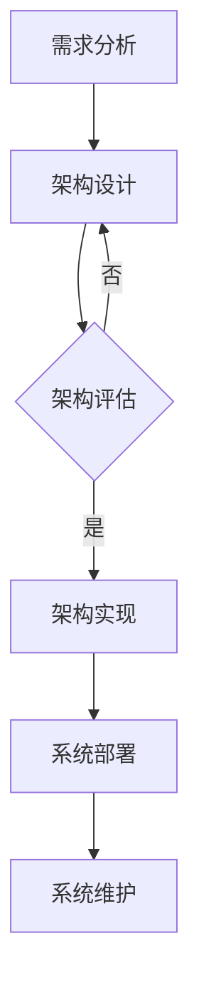
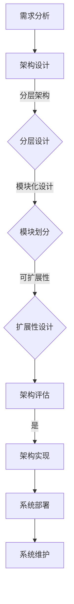

                 

### 第1章: 技术架构与扩展性概述

#### 1.1 技术架构的定义与重要性

技术架构是构建软件系统的基础框架，它定义了系统的组织结构、模块划分、数据流、通信机制和开发标准。在创业公司中，技术架构的重要性体现在以下几个方面：

- **业务支撑**：技术架构为创业公司的业务发展提供坚实的基础，确保系统能够灵活应对市场变化，快速响应业务需求。
- **开发效率**：合理的架构设计可以减少冗余代码，提高开发团队的协作效率，降低开发成本。
- **系统稳定性**：良好的架构设计有助于提高系统的可靠性，降低故障率和维护成本。

#### 核心概念与联系

- **模块化设计**：将系统划分为多个模块，每个模块独立开发、测试和维护，有助于提高系统的可扩展性和可维护性。
- **分层架构**：按照功能将系统划分为不同的层次，如表示层、业务逻辑层和数据访问层，有助于实现系统的分离关注和组件复用。
- **分布式系统**：将系统部署在多个节点上，通过分布式计算和存储技术实现系统的扩展和高可用性。

#### Mermaid 流程图

以下是一个简单的技术架构设计流程的 Mermaid 流程图：

#### 1.2 扩展性的定义与意义

扩展性是指系统在业务需求增长时，能够通过增加硬件资源、优化软件架构或改进技术方案来实现性能、容量和功能上的扩展。在创业公司中，扩展性具有以下重要意义：

- **应对业务增长**：随着业务的快速发展，系统需要能够轻松扩展以满足日益增长的用户需求。
- **降低成本**：通过优化系统架构，创业公司可以避免因系统瓶颈导致的额外投资。
- **提高用户体验**：良好的扩展性能够确保系统在高负载情况下依然能够稳定运行，提高用户体验。

#### 核心概念与联系

- **水平扩展**：通过增加服务器节点，提高系统的处理能力和存储容量。
- **垂直扩展**：通过增加服务器的硬件配置，提高单台服务器的处理能力和存储容量。
- **弹性扩展**：系统能够根据实际需求动态调整资源分配，实现自动化扩展。

#### 1.3 技术架构设计的基本原则

为了确保技术架构具有良好的扩展性，设计过程中需要遵循以下基本原则：

- **分层架构原则**：将系统划分为多个层次，每个层次独立开发、测试和维护，降低系统耦合度。
- **模块化设计原则**：将系统划分为多个模块，每个模块独立实现功能，降低模块之间的依赖关系。
- **可扩展性原则**：在架构设计时预留扩展接口，方便后续功能扩展和性能优化。

#### 核心概念与联系

- **微服务架构**：将系统划分为多个微服务，每个微服务独立部署、独立开发，有助于实现系统的灵活扩展。
- **分布式存储**：采用分布式存储技术，提高系统的存储容量和读写性能。
- **缓存机制**：通过缓存机制减少数据库的访问压力，提高系统响应速度。

#### Mermaid 流程图

以下是一个技术架构设计流程的 Mermaid 流程图：

### 案例分析

以某创业公司为例，该公司在初创阶段采用了传统的单体架构，随着业务的快速发展，系统逐渐暴露出扩展性不足、性能瓶颈等问题。为了解决这些问题，公司决定对技术架构进行优化，采用微服务架构和分布式存储技术，实现了系统的弹性扩展和性能提升。

- **需求分析**：分析现有系统的性能瓶颈和扩展性需求，确定技术架构优化的目标。
- **架构设计**：设计基于微服务架构的系统，将业务功能划分为多个微服务，实现服务的解耦和独立部署。
- **架构评估**：评估微服务架构的可行性，分析潜在风险和挑战。
- **架构实现**：开发微服务，实现服务的自动化部署和监控。
- **系统部署**：部署分布式存储系统，提高系统的存储容量和读写性能。
- **系统维护**：建立完善的运维体系，确保系统的稳定运行和快速响应。

通过技术架构的优化，该公司成功解决了扩展性不足和性能瓶颈问题，实现了业务的快速发展和用户规模的持续增长。

#### 最佳实践 Tips

- 在技术架构设计过程中，要充分考虑业务的未来发展需求，预留足够的扩展接口和灵活性。
- 定期对系统进行性能评估和优化，及时发现并解决潜在的性能瓶颈。
- 建立完善的运维体系，确保系统的稳定运行和快速响应。

### 小结

技术架构是创业公司构建稳定、高效、可扩展的技术系统的核心。良好的技术架构能够满足创业公司快速发展的需求，支持业务的不断创新和拓展。在技术架构设计过程中，要充分考虑扩展性需求，遵循分层架构、模块化设计和可扩展性原则，确保系统能够灵活应对业务变化。同时，要注重系统性能评估和优化，建立完善的运维体系，确保系统的稳定运行和快速响应。参考文献：

1. Martin, Robert C. 《微服务架构：设计与开发》。机械工业出版社，2017。
2. Fowler, Martin. 《企业应用架构模式》。机械工业出版社，2010。
3. Martin, Robert C. 《敏捷架构：构建灵活且可扩展的系统》。电子工业出版社，2012。

