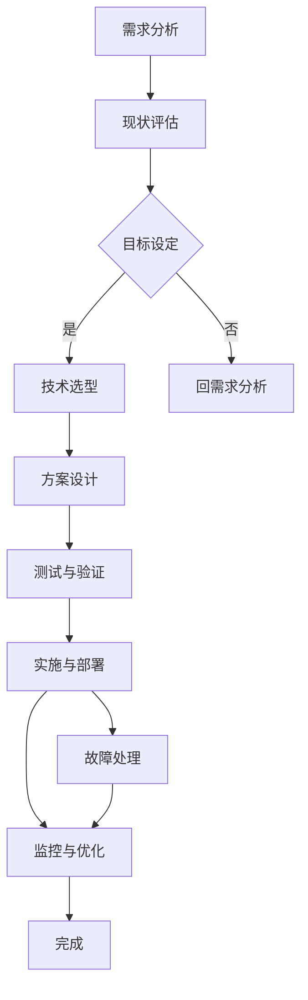
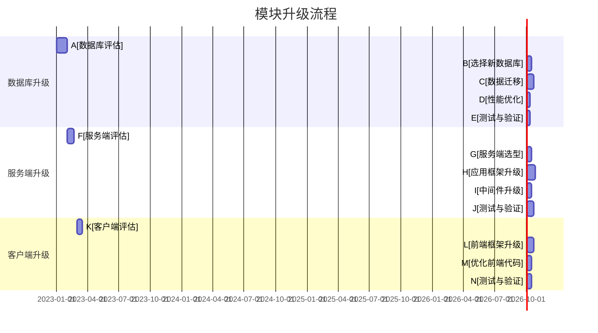

                 

# 《创业公司的技术栈升级策略》

> 关键词：创业公司，技术栈，升级策略，实施方法，风险管理，运维优化

> 摘要：本文将深入探讨创业公司技术栈升级的必要性和重要性，并详细阐述技术栈升级的基础知识、评估方法、策略制定、实施步骤、风险管理和运维优化等内容。通过案例分析，我们希望能够为创业公司在技术栈升级过程中提供有价值的参考和指导。

## 引言

在当今快速发展的科技时代，创业公司面临着巨大的竞争压力和市场变化。技术栈作为创业公司核心竞争力的重要组成部分，其升级与优化对于企业的长期发展至关重要。然而，技术栈升级并非易事，需要深入理解技术栈的构成、评估现状、制定策略、实施步骤以及风险管理等各个环节。本文将围绕这些核心内容展开讨论，为创业公司提供一套全面的技术栈升级策略。

本文结构如下：

1. **技术栈升级的基础知识**：介绍技术栈升级的意义、原则和方法。
2. **创业公司技术栈评估**：分析创业公司技术栈的现状、评估指标与方法。
3. **技术栈升级策略制定**：设定升级目标、设计方案、规划时间。
4. **技术栈升级的实施**：准备工作、具体实施、系统集成与优化。
5. **技术栈升级后的运维与优化**：运维管理、持续升级与优化。
6. **技术栈升级案例分析**：通过具体案例进行分析和总结。
7. **技术栈升级工具与资源**：提供相关的工具与资源。
8. **技术栈升级指南**：详细解释升级步骤和常见问题。
9. **技术栈升级流程与核心算法原理**：阐述流程图和算法原理。
10. **技术栈升级的数学模型与公式**：介绍相关的数学模型和公式。
11. **技术栈升级的项目实战**：分享实际案例和项目解析。

接下来，我们将逐步深入探讨这些主题，帮助创业公司制定并实施有效的技术栈升级策略。

## 第一部分：技术栈升级的基础知识

### 第1章：技术栈升级概述

#### 1.1 技术栈升级的意义和必要性

技术栈是指企业在开发、运营产品过程中所使用的一系列技术、工具和框架的集合。随着市场环境、业务需求和技术发展的不断变化，技术栈的升级和优化显得尤为必要。

首先，技术栈升级有助于提升产品竞争力。在竞争激烈的市场中，技术的更新速度非常快。企业如果不及时进行技术栈升级，可能会面临技术落后、产品性能低下等问题，从而失去市场竞争力。

其次，技术栈升级可以提高开发效率。随着项目的复杂性增加，新的技术、工具和框架可以提供更高效的解决方案，降低开发成本，提高开发效率。

此外，技术栈升级还能够增强系统的可维护性和扩展性。随着项目的不断迭代，技术栈的升级可以帮助解决现有系统的瓶颈问题，提高系统的稳定性和可扩展性。

综上所述，技术栈升级对于创业公司来说具有重要意义和必要性。接下来，我们将探讨技术栈升级的原则和方法。

#### 1.2 技术栈升级的原则和方法

在进行技术栈升级时，需要遵循一些基本原则和方法，以确保升级过程的顺利进行。

1. **需求驱动**：技术栈升级应以满足业务需求为核心，围绕业务发展的方向进行。在制定升级计划时，要充分了解业务需求的变化，确保升级后的技术栈能够支持业务的发展。

2. **逐步推进**：技术栈升级通常涉及多个模块和工具的更新，需要逐步推进。可以先从关键模块开始，逐步扩展到其他模块，避免因全面升级而导致的风险和不确定性。

3. **风险评估**：在升级过程中，需要对可能的风险进行评估，并制定相应的应对措施。风险评估包括技术风险、业务风险和人员风险等多个方面。

4. **技术选型**：技术栈升级需要选择合适的技术、工具和框架。在选型过程中，要考虑技术成熟度、社区活跃度、支持度等因素，确保所选技术具有长期的发展潜力。

5. **文档管理**：在升级过程中，应注重文档管理。包括旧系统和新系统的文档，以及升级过程中的关键步骤和注意事项等。良好的文档管理有助于提高团队协作效率，降低沟通成本。

6. **测试与验证**：在升级完成后，应进行充分的测试和验证，确保系统稳定性和性能。测试应包括功能测试、性能测试和安全测试等多个方面。

通过遵循上述原则和方法，创业公司可以更加有效地进行技术栈升级，提高产品竞争力，推动企业持续发展。

### 第2章：创业公司技术栈评估

#### 2.1 创业公司技术栈现状分析

创业公司的技术栈现状是技术栈升级的基础，对其进行分析和评估至关重要。技术栈现状分析主要包括以下几个方面：

1. **现有技术栈组成**：分析当前技术栈中包含的技术、工具和框架。了解每个组件的功能、使用情况和性能表现，为后续升级提供参考。

2. **技术栈的历史演变**：回顾技术栈的发展历程，包括每次升级的原因、时间和影响。通过历史分析，可以发现技术栈存在的问题和瓶颈。

3. **技术栈的优劣势**：评估当前技术栈的优势和劣势，包括性能、稳定性、可维护性、扩展性等方面。优势可以帮助确定保留组件，劣势则需要重点关注和改进。

4. **技术栈与业务需求的匹配度**：分析当前技术栈是否满足业务需求，包括功能覆盖、性能要求、业务扩展等方面。不匹配的部分可能是技术栈升级的重点。

5. **技术栈的依赖关系**：了解各技术组件之间的依赖关系，包括技术框架、库、中间件等。依赖关系的分析有助于识别升级过程中的潜在风险和影响。

通过对创业公司技术栈现状的深入分析，可以全面了解当前技术栈的优劣势和存在的问题，为后续的评估和升级提供依据。

#### 2.2 技术栈评估指标与方法

技术栈评估需要使用一系列指标和方法，以全面、客观地评估技术栈的性能和潜力。以下是一些常用的技术栈评估指标和方法：

1. **性能指标**：包括响应时间、吞吐量、并发处理能力等。通过性能测试工具（如JMeter、LoadRunner等）进行模拟测试，评估技术栈在不同负载条件下的表现。

2. **稳定性指标**：包括系统崩溃率、故障恢复时间、运行时间等。通过监控系统（如Zabbix、Prometheus等）收集和分析系统运行数据，评估技术栈的稳定性。

3. **可维护性指标**：包括代码质量、文档完整性、模块化程度等。通过代码审查工具（如SonarQube、Checkstyle等）对代码进行分析，评估技术栈的可维护性。

4. **扩展性指标**：包括系统架构的灵活性、模块的扩展性、数据存储的可扩展性等。通过模拟业务增长和负载增加，评估技术栈的扩展能力。

5. **安全性指标**：包括数据加密、权限控制、安全漏洞等。通过安全评估工具（如OWASP ZAP、Nessus等）进行安全测试，评估技术栈的安全性。

6. **社区活跃度指标**：包括社区成员数量、活跃度、文档更新频率等。通过社区网站、GitHub等平台的数据分析，评估技术栈社区的活跃度和支持度。

7. **成本效益指标**：包括开发成本、维护成本、资源消耗等。通过成本效益分析，评估技术栈的经济性和合理性。

评估方法包括：

- **问卷调查**：通过问卷调查收集团队成员对现有技术栈的看法和评价，了解技术栈的优劣势。

- **访谈**：与开发人员、运维人员、产品经理等关键角色进行访谈，深入了解技术栈的使用情况和问题。

- **文档审查**：审查技术栈相关的文档，包括开发文档、运维文档、架构文档等，了解技术栈的规范性和完整性。

- **性能测试**：通过性能测试工具进行模拟测试，评估技术栈的实际性能表现。

- **安全测试**：通过安全测试工具进行安全漏洞扫描，评估技术栈的安全性。

通过综合运用这些评估指标和方法，创业公司可以全面、客观地评估技术栈的现状，为后续的升级提供数据支持。

#### 2.3 技术栈升级的可行性分析

在完成技术栈现状分析和评估后，接下来需要对技术栈升级的可行性进行深入分析。技术栈升级的可行性分析主要包括以下几个方面：

1. **技术成熟度**：评估拟升级的技术、工具和框架的成熟度。选择成熟度较高的技术，可以降低升级过程中的风险和不确定性。

2. **社区支持度**：分析拟升级技术的社区活跃度和支持度。活跃的社区和丰富的资源可以提供有效的技术支持，降低升级过程中的困难和挑战。

3. **兼容性**：评估新技术的兼容性，确保与现有系统的无缝集成。需要考虑数据迁移、接口适配等问题，确保升级后的系统能够正常运行。

4. **成本效益**：分析升级所需的人力、物力和时间成本，以及预期的收益和效益。通过成本效益分析，确定升级的可行性和合理性。

5. **人员技能**：评估团队成员对新技术的掌握程度和培训需求。如果团队成员对新技术的掌握不足，可能需要额外的培训和支持。

6. **时间规划**：分析升级所需的时间，确保升级计划与业务发展计划相匹配。需要合理分配时间，确保升级过程中的关键节点按时完成。

通过全面的可行性分析，创业公司可以确定技术栈升级的可行性，并制定相应的计划和策略，确保升级过程顺利实施。

### 第3章：技术栈升级策略制定

#### 3.1 技术栈升级目标设定

技术栈升级目标设定是技术栈升级策略制定的核心环节，直接关系到升级效果和业务发展。设定明确、可行的升级目标是确保技术栈升级顺利实施的关键。以下是如何设定技术栈升级目标的方法：

1. **明确业务需求**：首先，要明确业务需求，包括当前存在的问题、业务增长的需求、市场竞争的压力等。业务需求是技术栈升级的出发点和落脚点，必须与业务目标保持一致。

2. **目标分类**：根据业务需求和现状，将升级目标分为短期目标、中期目标和长期目标。短期目标通常指在短期内可以实现的改进和优化，中期目标则是在一定时间内需要完成的升级任务，长期目标则是为了企业长远发展而设定的战略目标。

3. **可度量性**：设定目标时，应确保目标具有可度量性，以便在实施过程中进行监控和评估。例如，性能提升目标可以是“将系统响应时间缩短50%”，扩展性目标可以是“支持并发用户数从1000增长到5000”。

4. **具体化**：目标应具体、明确，避免模糊和抽象。例如，“提升系统性能”可以具体化为“优化数据库查询效率，减少查询时间”，或者“升级服务器硬件，提高处理能力”。

5. **挑战性**：目标应具有一定的挑战性，以激励团队克服困难和实现突破。但同时也应确保目标具有可行性，避免设置过高或不切实际的目标。

6. **优先级**：根据业务需求和紧急程度，设定目标的优先级。优先级高的目标应优先考虑和实现，以确保关键需求的满足。

7. **时间表**：为每个目标设定明确的时间表，包括启动时间、截止时间和里程碑。时间表的设定有助于推动团队的执行和监控进度。

通过上述方法，创业公司可以设定明确、具体、可度量、具有挑战性的技术栈升级目标，确保技术栈升级能够有力推动业务发展。

#### 3.2 技术栈升级方案设计

技术栈升级方案设计是技术栈升级策略制定的关键环节，直接影响升级效果和成本。以下是如何设计技术栈升级方案的方法：

1. **方案框架**：首先，明确技术栈升级的总体框架，包括升级范围、技术选型、实施步骤和时间规划等。方案框架应充分考虑业务需求、技术成熟度和团队能力。

2. **技术选型**：在方案设计中，选择合适的技术、工具和框架是关键。技术选型应考虑以下几个方面：
   - **适用性**：所选技术应能够满足业务需求和性能要求。
   - **成熟度**：选择成熟度较高的技术，以降低风险和不确定性。
   - **社区支持度**：选择社区活跃度高的技术，以确保长期支持和维护。
   - **兼容性**：确保所选技术能够与现有系统无缝集成。

3. **升级模块**：根据业务需求和系统结构，确定需要升级的模块和组件。常见的升级模块包括：
   - **数据库**：升级数据库管理系统，提高性能和可扩展性。
   - **服务端**：升级服务端框架和中间件，提高系统的稳定性和响应速度。
   - **客户端**：升级客户端框架和前端技术，提升用户体验。
   - **中间件**：升级消息队列、缓存等中间件，优化系统性能。

4. **实施步骤**：制定详细的实施步骤，包括每个阶段的任务、责任人和时间表。实施步骤应包括以下内容：
   - **需求分析**：明确升级需求和目标，制定详细的计划。
   - **技术调研**：调研新的技术和工具，评估其适用性和可行性。
   - **方案设计**：根据调研结果，设计详细的技术栈升级方案。
   - **测试与验证**：在实施前进行测试和验证，确保方案的有效性。
   - **实施与部署**：按照设计方案逐步实施和部署，确保系统稳定运行。
   - **培训与支持**：对团队成员进行培训和支持，确保新技术的熟练使用。

5. **风险评估**：在方案设计中，充分考虑可能的风险和挑战，并制定相应的应对措施。风险评估应包括以下内容：
   - **技术风险**：包括新技术的不确定性、集成风险等。
   - **业务风险**：包括业务中断、数据迁移风险等。
   - **人员风险**：包括团队技能不足、沟通不畅等。

6. **成本预算**：制定详细的成本预算，包括人力、物力和时间成本等。成本预算应考虑最坏情况下的费用，确保预算的合理性和可控性。

通过上述方法，创业公司可以设计出科学、合理、可行的技术栈升级方案，确保技术栈升级能够顺利实施并带来预期的效果。

#### 3.3 技术栈升级时间规划

技术栈升级的时间规划是确保技术栈升级顺利进行的关键环节。合理的时间规划可以帮助团队合理安排任务、分配资源，并降低升级过程中的风险。以下是如何进行技术栈升级时间规划的方法：

1. **制定时间表**：首先，根据技术栈升级方案，制定详细的时间表。时间表应包括每个阶段的任务、责任人和时间节点。时间节点应尽量精确，以确保任务的按时完成。

2. **关键路径分析**：分析升级过程中的关键路径，确定哪些任务是最重要的，需要优先完成。关键路径上的任务延误可能会导致整个升级计划的推迟，因此需要特别注意。

3. **资源分配**：根据时间表和任务需求，合理分配人力资源和物力资源。确保每个任务都有足够的人力和资源支持，避免资源浪费和瓶颈。

4. **风险评估**：在时间规划中，充分考虑可能的风险和不确定性。为应对风险，可以设置缓冲时间，以确保在意外情况下能够有足够的时间进行调整和修复。

5. **阶段划分**：将升级过程划分为若干阶段，每个阶段都有明确的目标和任务。阶段划分可以帮助团队更好地监控进度，并及时调整计划。

6. **迭代与反馈**：在时间规划中，采用迭代和反馈机制，不断调整和优化计划。通过实时监控和反馈，及时发现问题并进行调整，确保升级过程顺利实施。

7. **培训与支持**：在时间规划中，安排团队成员的培训和支持时间。确保团队成员在新技术使用上熟练，减少升级过程中的障碍和风险。

通过科学、合理的时间规划，创业公司可以确保技术栈升级按计划顺利进行，降低风险，并实现预期的升级效果。

## 第二部分：技术栈升级的实施

### 第4章：技术栈升级的准备工作

#### 4.1 确定升级范围和优先级

在技术栈升级的准备阶段，首先要明确升级的范围和优先级。这是确保升级工作有序进行的关键步骤。以下是如何确定升级范围和优先级的步骤：

1. **全面评估现有技术栈**：首先，对现有的技术栈进行全面评估，包括每个组件的使用情况、性能表现和存在的问题。通过评估，确定哪些组件需要进行升级，哪些可以暂时保留。

2. **业务需求分析**：根据业务需求，确定哪些模块对业务影响最大。通常，优先考虑对业务发展至关重要且性能瓶颈较为明显的模块。

3. **风险评估**：在确定升级范围时，要充分考虑升级过程中的风险。优先考虑风险较小、影响较大的模块，以降低升级过程中的不确定性。

4. **优先级排序**：根据业务需求和风险评估结果，对需要升级的模块进行优先级排序。通常，可以将模块分为高优先级、中优先级和低优先级三类，确保在有限的时间和资源下，优先完成关键模块的升级。

5. **确定升级范围**：根据优先级排序结果，明确本次升级的具体范围。升级范围应包括需要升级的模块、相关依赖组件和接口。

通过上述步骤，创业公司可以明确技术栈升级的范围和优先级，确保升级工作有的放矢，提高工作效率和效果。

#### 4.2 技术选型和工具准备

在技术栈升级的准备阶段，技术选型和工具准备是至关重要的一步。以下是如何进行技术选型和工具准备的详细步骤：

1. **需求分析**：首先，明确升级后的技术栈需要满足的需求。包括性能要求、稳定性、可维护性、扩展性等方面。需求分析有助于明确技术选型的方向。

2. **市场调研**：在明确需求后，进行市场调研，了解当前主流的技术、工具和框架。调研应包括技术成熟度、社区活跃度、支持度、成本等因素。

3. **技术评估**：根据市场调研结果，对候选技术进行评估。评估内容包括技术性能、稳定性、扩展性、兼容性、社区支持度等。可以通过技术文档、社区论坛、用户评价等方式进行评估。

4. **选型决策**：在评估基础上，进行选型决策。选择最适合业务需求的技术和工具。选型决策应充分考虑技术的长期发展潜力，避免选择即将被淘汰的技术。

5. **工具准备**：确定技术选型后，准备相应的工具。包括开发工具、测试工具、运维工具等。工具准备应确保能够支持新技术的开发、测试和运维。

6. **培训与支持**：在技术选型和工具准备过程中，要充分考虑团队成员对新技术的掌握程度。必要时，安排培训和支持计划，确保团队成员能够熟练使用新技术。

7. **文档编写**：编写详细的技术选型和工具准备文档，包括选型依据、工具介绍、使用方法等。文档应便于团队成员查阅和使用。

通过上述步骤，创业公司可以科学、合理地进行技术选型和工具准备，确保技术栈升级顺利进行。

#### 4.3 团队成员技能提升

在技术栈升级的准备阶段，团队成员的技能提升是确保升级工作顺利实施的重要环节。以下是如何进行团队成员技能提升的具体步骤：

1. **技能评估**：首先，对团队成员的现有技能进行全面评估。了解团队成员对现有技术栈的熟悉程度，以及他们在新技术的掌握情况。

2. **需求分析**：根据技术栈升级的需求，分析团队成员需要掌握的新技能。包括新的编程语言、框架、工具等。需求分析应充分考虑技术栈升级的具体内容。

3. **培训计划**：根据技能评估和需求分析结果，制定详细的培训计划。培训计划应包括培训内容、培训方式、培训时间等。培训内容应涵盖新技术的基础知识、实际应用案例等。

4. **内部培训**：组织内部培训，邀请内部技术专家或外部讲师进行授课。内部培训有助于团队成员更好地理解和掌握新技术。

5. **在线学习**：鼓励团队成员参加在线课程和培训，利用互联网资源进行自学。在线学习可以提供丰富的学习资源，满足不同团队成员的需求。

6. **实战演练**：在培训结束后，组织实战演练，让团队成员在实际项目中运用所学知识。实战演练有助于提高团队成员的技能水平，增强团队协作能力。

7. **持续学习**：技术栈升级是一个持续的过程，团队成员需要不断学习和提升技能。公司应建立持续学习机制，鼓励团队成员参加技术研讨会、交流会议等活动，不断更新知识和技能。

通过上述步骤，创业公司可以确保团队成员在新技术栈上的技能提升，为技术栈升级提供有力的人才保障。

### 第5章：技术栈升级的具体实施

#### 5.1 技术栈模块的升级

技术栈模块的升级是技术栈升级的核心步骤，涉及到数据库、服务端和客户端等多个方面的升级。以下是针对不同模块的具体升级方法：

##### 5.1.1 数据库升级

数据库是整个技术栈的核心，其升级对系统的性能、稳定性和扩展性有着重要影响。以下是数据库升级的具体步骤：

1. **评估现有数据库**：首先，对现有数据库进行评估，包括性能、容量、可用性等方面。评估结果将指导后续的升级方向。

2. **选择新数据库**：根据评估结果和业务需求，选择合适的新数据库。选择标准包括性能、可靠性、扩展性、社区支持度等。

3. **数据迁移**：在新数据库选择确定后，进行数据迁移。数据迁移应确保数据的完整性和一致性。常见的数据迁移方法包括直接迁移、增量迁移和并行迁移等。

4. **性能优化**：在新数据库上线后，对数据库进行性能优化。包括索引优化、查询优化、存储优化等。

5. **测试与验证**：在数据库升级完成后，进行全面的测试和验证，确保系统稳定运行。

##### 5.1.2 服务端升级

服务端升级是技术栈升级的重要组成部分，涉及到服务器、应用框架和中间件等多个方面的升级。以下是服务端升级的具体步骤：

1. **评估现有服务端**：首先，对现有服务端进行评估，包括性能、稳定性、扩展性等方面。评估结果将指导后续的升级方向。

2. **选择新服务端技术**：根据评估结果和业务需求，选择合适的新服务端技术。选择标准包括性能、可靠性、可维护性、社区支持度等。

3. **升级服务器**：如果现有服务器性能无法满足新技术的需求，需要升级服务器硬件。升级服务器应确保服务端的稳定性和性能。

4. **应用框架升级**：根据新技术的需求，升级应用框架。应用框架的升级应确保系统的兼容性和扩展性。

5. **中间件升级**：升级服务端的中间件，包括消息队列、缓存、负载均衡等。中间件的升级应确保系统的稳定性和性能。

6. **测试与验证**：在服务端升级完成后，进行全面的测试和验证，确保系统稳定运行。

##### 5.1.3 客户端升级

客户端升级主要涉及前端技术的升级，包括HTML、CSS、JavaScript等。以下是客户端升级的具体步骤：

1. **评估现有客户端**：首先，对现有客户端进行评估，包括性能、用户体验、兼容性等方面。评估结果将指导后续的升级方向。

2. **选择新前端框架**：根据评估结果和业务需求，选择合适的新前端框架。选择标准包括性能、社区支持度、学习曲线等。

3. **升级HTML、CSS**：根据新前端框架的要求，升级HTML和CSS代码。升级应确保代码的兼容性和可维护性。

4. **JavaScript优化**：优化JavaScript代码，提高页面的性能和用户体验。优化方法包括代码压缩、减少HTTP请求、异步加载等。

5. **测试与验证**：在客户端升级完成后，进行全面的测试和验证，确保系统稳定运行。

#### 5.2 系统集成与优化

在完成各个模块的升级后，需要进行系统集成与优化，确保整个系统的稳定性和性能。以下是系统集成与优化的具体步骤：

1. **集成测试**：对升级后的各个模块进行集成测试，确保模块之间能够无缝集成，并满足业务需求。

2. **性能测试**：通过性能测试工具，对整个系统进行负载测试和压力测试，评估系统的性能表现，发现潜在的性能瓶颈。

3. **优化数据库查询**：优化数据库查询，提高查询效率和性能。优化方法包括索引优化、查询优化、分库分表等。

4. **优化服务端逻辑**：优化服务端逻辑，减少不必要的计算和IO操作，提高系统的响应速度。

5. **缓存策略优化**：优化缓存策略，减少数据访问次数，提高系统的性能。

6. **代码优化**：对关键代码进行优化，提高代码的执行效率和可维护性。

7. **测试与验证**：在系统集成与优化完成后，进行全面的测试和验证，确保系统稳定运行。

#### 5.3 性能测试与优化

性能测试与优化是技术栈升级的重要环节，直接关系到系统的稳定性、可靠性和用户体验。以下是性能测试与优化的具体步骤：

1. **确定性能测试目标**：首先，明确性能测试的目标，包括响应时间、吞吐量、并发处理能力等。测试目标应根据业务需求和系统特点进行设定。

2. **搭建测试环境**：搭建与生产环境一致的测试环境，包括服务器、数据库、网络等。测试环境应尽量模拟实际的生产环境。

3. **编写测试脚本**：编写测试脚本，模拟用户行为和业务场景，进行负载测试和压力测试。测试脚本应包括各种常见的业务场景，如登录、查询、交易等。

4. **执行性能测试**：在测试环境中执行性能测试，收集系统在不同负载条件下的性能数据。性能测试应包括不同负载级别、不同并发用户数等。

5. **分析测试结果**：分析性能测试结果，识别系统性能瓶颈和潜在问题。分析内容包括响应时间、吞吐量、错误率等。

6. **优化数据库查询**：针对性能瓶颈，优化数据库查询，包括索引优化、查询优化、分库分表等。优化方法应根据具体情况进行选择。

7. **优化服务端逻辑**：优化服务端逻辑，减少不必要的计算和IO操作，提高系统的响应速度。优化方法包括代码优化、并发处理、异步调用等。

8. **优化客户端代码**：优化客户端代码，提高页面的加载速度和性能。优化方法包括代码压缩、减少HTTP请求、异步加载等。

9. **调整缓存策略**：根据性能测试结果，调整缓存策略，减少数据访问次数，提高系统的性能。优化方法包括缓存过期策略、缓存分区等。

10. **测试与验证**：在优化完成后，进行全面的测试和验证，确保系统稳定运行。测试内容包括功能测试、性能测试和安全测试等。

通过上述步骤，创业公司可以确保技术栈升级后的系统具有优秀的性能表现，满足业务需求和用户体验。

### 第6章：技术栈升级的风险管理

#### 6.1 风险识别与评估

技术栈升级过程中，风险管理至关重要。以下是如何进行风险识别与评估的步骤：

1. **风险识别**：首先，通过访谈、问卷调查、文档审查等方式，识别可能的风险。这些风险可能包括技术风险、业务风险、人员风险等。

2. **风险分类**：将识别出的风险进行分类，如技术风险、业务风险、人员风险等。分类有助于更清晰地理解和应对风险。

3. **风险优先级**：根据风险的影响程度和发生概率，对风险进行优先级排序。高优先级的风险需要优先关注和应对。

4. **风险量化**：对高优先级的风险进行量化评估，如使用风险矩阵等方法，评估风险的概率和影响程度。

5. **风险应对策略**：根据风险评估结果，制定相应的风险应对策略。常见的风险应对策略包括风险回避、风险减轻、风险转移和风险接受等。

6. **风险监控**：在技术栈升级过程中，持续监控风险的变化和影响。通过定期评估和更新风险策略，确保风险得到有效控制。

#### 6.2 风险应对策略

在识别和评估风险后，接下来需要制定具体的应对策略，以降低风险的影响。以下是一些常见的风险应对策略：

1. **风险回避**：通过调整计划、改变技术选型等方式，避免高风险的情况发生。例如，如果某个技术的社区支持度较低，可以选择其他成熟度较高的技术。

2. **风险减轻**：通过优化流程、增加备份等方式，降低风险的发生概率和影响程度。例如，在数据库升级过程中，可以采取增量迁移的方式，降低数据迁移的风险。

3. **风险转移**：通过购买保险、签订合同等方式，将风险转移给其他方。例如，在云计算环境下，可以购买数据备份和恢复服务，将数据安全的风险转移给云服务提供商。

4. **风险接受**：对于一些不可避免的风险，可以制定相应的应急计划和备份方案，以降低风险对业务的影响。例如，在服务端升级过程中，可以准备回滚方案，以便在系统出现问题时迅速恢复。

5. **风险监控与反馈**：在技术栈升级过程中，持续监控风险的变化，并及时调整风险应对策略。通过反馈机制，确保风险应对策略的有效性和适应性。

#### 6.3 风险监控与处理

风险监控与处理是技术栈升级过程中持续进行的任务。以下是如何进行风险监控与处理的步骤：

1. **建立风险监控体系**：建立风险监控体系，包括风险识别、评估、应对、监控等环节。通过风险监控体系，确保风险得到及时识别和处理。

2. **定期评估风险**：定期对风险进行评估，包括风险的发生概率、影响程度和应对效果等。通过定期评估，确保风险应对策略的有效性。

3. **应急处理**：在技术栈升级过程中，制定应急处理计划，以应对可能出现的风险。应急处理计划应包括风险预警、应急响应、恢复方案等。

4. **反馈与改进**：在风险监控和处理过程中，及时收集反馈信息，并对风险应对策略进行改进。通过反馈和改进，确保风险应对策略的不断完善和优化。

5. **团队协作**：风险监控与处理需要团队成员的协作。通过团队协作，确保风险得到全面、高效的识别和处理。

通过以上步骤，创业公司可以建立有效的风险管理机制，降低技术栈升级过程中的风险，确保升级工作的顺利进行。

### 第7章：技术栈升级后的运维管理

#### 7.1 运维团队的组建与培训

技术栈升级后，运维管理是确保系统稳定运行的关键环节。组建一支高效的运维团队并对其进行培训，是确保技术栈升级后系统能够持续稳定运行的基础。以下是如何组建运维团队和进行培训的具体步骤：

1. **团队组建**：
   - **人员配置**：根据技术栈升级后的系统需求和业务规模，合理配置运维团队的人员。团队成员应包括系统管理员、数据库管理员、网络管理员、安全专家等。
   - **分工明确**：明确各成员的职责和任务，确保每个环节都有专人负责，提高团队协作效率。
   - **团队结构**：建立矩阵式团队结构，将运维团队与开发团队紧密协作，共同确保系统的稳定性和性能。

2. **培训计划**：
   - **技术培训**：针对新技术的特点和使用方法，为团队成员提供针对性的技术培训。培训内容应包括新技术的原理、操作方法、常见问题处理等。
   - **实战演练**：通过实际操作演练，让团队成员熟悉新技术的应用场景，提高实际操作能力。
   - **知识分享**：鼓励团队成员分享自己的经验和心得，通过内部培训会议、技术沙龙等方式，提高整个团队的知识水平。

3. **培训实施**：
   - **分阶段进行**：根据技术栈升级的不同阶段，制定分阶段的培训计划。例如，在升级初期，可以重点培训数据库和中间件的使用；在升级后期，可以重点培训服务端和客户端的维护。
   - **外部资源**：利用外部培训资源，如专业培训机构、在线课程等，为团队成员提供更多学习机会。

4. **持续改进**：运维团队应建立持续学习机制，不断更新知识和技能，以适应技术发展的变化。通过定期评估和反馈，持续优化培训效果。

#### 7.2 运维流程与规范

建立科学的运维流程与规范，是确保技术栈升级后系统能够高效运行的重要保障。以下是如何建立运维流程与规范的具体步骤：

1. **流程设计**：
   - **需求分析**：根据业务需求和系统特点，设计合理的运维流程。流程设计应包括日常运维、故障处理、系统升级、备份与恢复等环节。
   - **流程优化**：通过实际运维经验，不断优化运维流程，提高运维效率。例如，在故障处理环节，可以建立快速响应机制，确保问题能够及时解决。

2. **规范制定**：
   - **操作手册**：制定详细的操作手册，包括各个运维环节的步骤、注意事项和风险控制等。操作手册应覆盖日常运维、应急处理、系统升级等各个方面。
   - **安全规范**：制定安全规范，包括系统访问控制、数据备份与恢复、网络安全等。安全规范应确保系统的安全性和数据的完整性。

3. **流程实施**：
   - **培训与宣传**：对运维团队进行流程和规范的培训，确保团队成员了解和遵守相关流程和规范。
   - **监督与检查**：建立监督和检查机制，定期对运维流程和规范的执行情况进行检查，确保流程和规范的落实。

4. **持续优化**：根据运维过程中的问题和反馈，不断优化运维流程和规范，提高运维效率和效果。

#### 7.3 故障处理与性能优化

技术栈升级后，系统可能会出现各种故障和性能问题。及时、有效地处理故障和优化性能，是确保系统稳定运行的关键。以下是如何进行故障处理和性能优化的具体步骤：

1. **故障处理**：
   - **快速响应**：建立快速响应机制，确保运维团队能够在第一时间发现和响应故障。
   - **问题定位**：通过日志分析、监控数据等手段，快速定位故障原因。
   - **处理方案**：根据故障原因，制定相应的处理方案。对于一般故障，可以采取现场修复、重启服务等方式；对于复杂故障，需要制定详细的恢复计划。

2. **性能优化**：
   - **性能监控**：建立性能监控体系，实时监控系统的性能指标，包括响应时间、吞吐量、并发处理能力等。
   - **瓶颈分析**：通过性能监控数据，分析系统性能瓶颈，找出影响性能的关键因素。
   - **优化措施**：针对性能瓶颈，采取相应的优化措施。例如，优化数据库查询、升级硬件设备、调整缓存策略等。

3. **定期检查与维护**：定期对系统进行性能检查和维护，及时发现和解决潜在的性能问题。通过定期检查，可以确保系统在高负载情况下依然能够稳定运行。

4. **应急演练**：定期组织应急演练，提高运维团队应对故障和突发事件的能力。通过应急演练，可以发现和解决潜在的问题，确保系统在紧急情况下能够迅速恢复。

通过以上步骤，创业公司可以建立有效的故障处理和性能优化机制，确保技术栈升级后的系统稳定、高效运行。

### 第8章：技术栈持续升级与优化

#### 8.1 技术趋势分析

在快速发展的技术环境中，创业公司需要紧跟技术趋势，以保持竞争力。以下是如何进行技术趋势分析的方法：

1. **市场调研**：通过市场调研，了解当前技术趋势和新兴技术。调研可以通过参加技术会议、阅读技术博客、关注行业报告等方式进行。

2. **技术评估**：对调研结果进行评估，分析新技术的适用性、潜在风险和收益。评估标准包括技术成熟度、社区支持度、成本效益等。

3. **技术预测**：根据技术评估结果，预测未来一段时间内可能的技术趋势。技术预测可以帮助创业公司提前布局，抢占市场先机。

4. **持续监控**：建立技术监控机制，持续跟踪技术发展动态。通过实时监控，及时了解新技术的发展趋势和应用场景。

#### 8.2 技术栈迭代策略

技术栈迭代策略是确保创业公司技术栈持续升级和优化的重要手段。以下是如何制定技术栈迭代策略的方法：

1. **需求驱动**：以业务需求为导向，制定技术栈迭代计划。需求应包括现有系统的瓶颈、业务扩展需求、用户体验改进等。

2. **优先级排序**：根据需求的重要性和紧急程度，对技术栈迭代任务进行优先级排序。优先级高的任务应优先安排和实施。

3. **周期规划**：制定技术栈迭代周期，确保在既定时间内完成迭代任务。周期规划应考虑团队规模、技术成熟度和资源分配等因素。

4. **迭代方式**：采用渐进式迭代方式，逐步完善技术栈。每个迭代周期应包括需求分析、设计、开发、测试和部署等环节。

5. **反馈与调整**：在迭代过程中，持续收集用户反馈和性能数据，对迭代效果进行评估和调整。通过反馈和调整，确保技术栈迭代符合业务需求。

#### 8.3 持续集成与持续交付

持续集成（CI）和持续交付（CD）是现代软件开发的重要实践，有助于提高开发效率和系统稳定性。以下是如何实现持续集成与持续交付的方法：

1. **CI/CD流程设计**：设计CI/CD流程，包括代码提交、构建、测试、部署等环节。流程设计应确保代码质量和系统稳定性。

2. **工具选型**：选择合适的CI/CD工具，如Jenkins、GitLab CI、CircleCI等。工具选型应考虑团队规模、项目复杂度和需求等。

3. **代码管理**：采用版本控制系统（如Git），确保代码的版本管理和变更追踪。代码管理应遵循良好的分支策略和合并流程。

4. **构建与测试**：建立自动化的构建和测试流程，确保每次代码提交都能快速完成构建和测试。测试应包括单元测试、集成测试、性能测试等。

5. **部署与监控**：通过自动化部署工具，实现代码的快速部署和回滚。部署应确保系统的稳定性和可靠性。同时，建立监控系统，实时监控系统运行状态，及时发现和解决潜在问题。

6. **反馈与优化**：在CI/CD实践中，持续收集反馈和性能数据，对流程进行优化和改进。通过反馈和优化，确保CI/CD流程的高效性和稳定性。

通过上述方法，创业公司可以实现持续集成与持续交付，提高开发效率和系统稳定性，推动企业持续发展。

### 第9章：技术栈升级案例分析

#### 9.1 案例介绍

在本案例中，我们以一家创业公司A为例，探讨其技术栈升级的全过程。公司A成立于2018年，主要提供在线教育服务。在最初的创业阶段，公司A采用了一套简单高效的技术栈，包括Laravel框架、MySQL数据库、Nginx反向代理等。随着业务的发展和用户数量的增加，公司A面临了性能瓶颈、系统可扩展性不足等问题，因此决定进行技术栈升级。

#### 9.2 案例分析

1. **现状分析**：
   - **性能瓶颈**：随着用户数量的增加，公司A的系统响应时间逐渐变长，部分功能模块甚至出现了卡顿现象。
   - **可扩展性不足**：现有的技术栈难以满足业务快速扩展的需求，导致系统频繁出现不稳定的情况。
   - **维护成本高**：由于系统代码复杂度增加，维护成本逐渐上升，团队的工作效率受到影响。

2. **评估与分析**：
   - **技术成熟度**：公司A当前使用的技术栈相对成熟，但部分组件（如MySQL）在性能和扩展性方面存在一定局限。
   - **社区支持度**：Laravel框架拥有活跃的社区和支持，但MySQL和Nginx等组件的社区支持度相对较低。
   - **兼容性**：公司A的技术栈与新技术的兼容性较好，但需要一定的调整和优化。

3. **升级方案**：
   - **数据库升级**：将MySQL数据库升级为PostgreSQL，以提高性能和扩展性。
   - **服务端升级**：将Laravel框架升级为Laravel 8，并采用Spring Boot作为微服务框架。
   - **客户端升级**：采用Vue.js重构前端框架，提高用户体验和性能。

4. **实施与监控**：
   - **实施过程**：在升级过程中，公司A采用渐进式升级方式，逐步替换旧技术栈的组件。同时，对每个升级模块进行充分的测试和验证，确保系统稳定运行。
   - **监控与反馈**：在升级完成后，公司A建立了全面的监控体系，实时监控系统的性能指标和稳定性。通过监控数据，及时发现问题并进行优化。

#### 9.3 案例总结与启示

通过上述案例分析，我们可以总结出以下启示：

1. **需求驱动**：技术栈升级应以满足业务需求为核心，确保升级方案能够支持业务的发展。

2. **渐进式升级**：采用渐进式升级方式，逐步替换旧技术栈的组件，降低升级过程中的风险。

3. **全面监控**：在升级过程中，建立全面的监控体系，实时监控系统的性能和稳定性，确保系统稳定运行。

4. **团队协作**：技术栈升级涉及多个团队和模块，需要加强团队协作，确保升级工作的顺利进行。

5. **持续优化**：在升级完成后，持续优化和改进技术栈，确保系统始终保持高效、稳定的状态。

通过上述启示，创业公司可以更好地进行技术栈升级，提高产品竞争力，推动企业持续发展。

### 附录A：技术栈升级工具与资源

#### A.1 开源工具与框架

**1. 数据库**：
- **MySQL**：成熟的开放源代码数据库管理系统。
- **PostgreSQL**：功能丰富、高度可扩展的数据库管理系统。
- **MongoDB**：适用于大数据和实时应用的文档型数据库。

**2. 服务端框架**：
- **Laravel**：流行的PHP框架，适用于快速开发。
- **Spring Boot**：Java框架，适用于企业级应用。
- **Django**：Python框架，适用于快速开发和维护。

**3. 客户端框架**：
- **Vue.js**：轻量级的前端框架，易于学习和使用。
- **React**：用于构建用户界面的JavaScript库。
- **Angular**：由Google维护的开源Web应用框架。

**4. 中间件**：
- **Kafka**：分布式流处理平台。
- **RabbitMQ**：消息队列中间件。
- **Redis**：高速缓存和存储系统。

#### A.2 云服务与平台

**1. 云数据库**：
- **AWS RDS**：自动管理的关系数据库服务。
- **Azure Database**：包括MySQL、PostgreSQL等数据库服务。
- **Google Cloud SQL**：适用于Google Cloud Platform的数据库服务。

**2. 云计算平台**：
- **AWS**：提供全面的云计算服务。
- **Azure**：微软的云计算平台。
- **Google Cloud**：Google的云计算平台。

**3. 容器化平台**：
- **Docker**：容器化技术，简化应用部署。
- **Kubernetes**：容器编排平台。

#### A.3 社区与交流平台

**1. 社区网站**：
- **GitHub**：代码托管和协作平台。
- **Stack Overflow**：技术问答社区。
- **Reddit**：讨论区和社区平台。

**2. 技术会议**：
- **TEDx**：技术、娱乐和设计会议。
- **TechCrunch Disrupt**：科技创业和创新会议。

**3. 开源组织**：
- **Apache Software Foundation**：管理和维护众多开源项目。
- **Python Software Foundation**：支持Python语言的开源组织。

通过使用这些工具和资源，创业公司可以更有效地进行技术栈升级，提高开发效率和系统稳定性。

### 附录B：技术栈升级指南

#### B.1 技术栈升级步骤详解

技术栈升级是一个复杂且系统性的过程，以下是对技术栈升级步骤的详细说明：

1. **需求分析**：首先，明确升级需求，包括业务需求、性能瓶颈、扩展性需求等。需求分析应与业务团队紧密合作，确保升级目标与业务目标一致。

2. **现状评估**：对现有技术栈进行全面评估，包括性能、稳定性、可维护性、扩展性等方面。评估结果将为后续的升级策略提供依据。

3. **目标设定**：根据需求分析和现状评估，设定明确的升级目标，如性能提升、稳定性增强、扩展性优化等。

4. **技术选型**：选择合适的新技术栈组件，包括数据库、服务端框架、客户端框架、中间件等。技术选型应考虑技术成熟度、社区支持度、兼容性等因素。

5. **方案设计**：设计详细的升级方案，包括升级范围、实施步骤、时间规划、风险评估等。方案设计应确保升级过程的有序进行。

6. **测试与验证**：在升级前进行充分的测试和验证，确保新技术的兼容性和系统的稳定性。测试应包括单元测试、集成测试、性能测试等。

7. **实施与部署**：按照设计方案逐步实施和部署新技术的升级。实施过程中，应确保团队成员的培训和协作，确保系统的稳定运行。

8. **监控与优化**：升级完成后，建立全面的监控体系，实时监控系统的性能和稳定性。通过监控数据，及时发现问题并进行优化。

#### B.2 常见问题与解决方案

在技术栈升级过程中，可能会遇到以下常见问题：

1. **兼容性问题**：新技术的兼容性可能导致与现有系统的冲突。解决方案：进行详细的兼容性测试，并在升级过程中逐步替换旧组件。

2. **迁移风险**：数据迁移可能导致数据丢失或不一致。解决方案：采用增量迁移或并行迁移策略，确保数据完整性和一致性。

3. **人员培训**：团队成员对新技术的掌握程度不足。解决方案：安排培训计划，提供学习资源和实战演练，确保团队成员能够熟练掌握新技术。

4. **成本控制**：升级过程中可能超出预算。解决方案：制定详细的成本预算，合理安排资源，避免不必要的浪费。

5. **风险管理**：升级过程中可能出现各种风险。解决方案：建立风险管理机制，进行风险评估和监控，制定应对策略。

通过遵循上述指南和解决常见问题，创业公司可以更加顺利地完成技术栈升级，提高系统的稳定性和性能。

### 第10章：技术栈升级的Mermaid流程图

#### 10.1 技术栈升级流程

技术栈升级是一个复杂的过程，需要经过多个阶段。以下是一个基于Mermaid的流程图，展示了技术栈升级的基本流程：



这个流程图涵盖了技术栈升级的主要阶段，从需求分析到最终完成。每个阶段都有明确的目标和任务，确保升级过程有序进行。

#### 10.2 技术栈模块升级流程

技术栈模块升级通常涉及数据库、服务端和客户端等多个方面。以下是一个基于Mermaid的模块升级流程图：



这个流程图详细展示了数据库、服务端和客户端的升级流程，包括评估、选型、升级和测试等步骤。通过这个流程图，创业公司可以清晰地了解每个模块的升级过程，确保升级工作的有序进行。

### 第11章：技术栈升级的核心算法原理讲解

#### 11.1 算法原理讲解

技术栈升级过程中，算法原理的理解和运用至关重要。以下是一个简单的排序算法——快速排序（Quick Sort）的原理讲解：

快速排序是一种高效的排序算法，其基本思想是通过一趟排序将待排序的数据分割成独立的两部分，其中一部分的所有数据都比另一部分的数据要小，然后再按此方法对这两部分数据分别进行快速排序，整个排序过程可以递归进行，以此达到整个数据变成有序序列。

快速排序的基本步骤如下：

1. **选择基准值**：从数据序列中选择一个基准值。
2. **分区**：将数据序列划分为两部分，一部分的所有元素都小于或等于基准值，另一部分的所有元素都大于基准值。基准值在分区过程中被放在最终位置上。
3. **递归排序**：分别对基准值左右两部分数据进行快速排序。

伪代码实现如下：

```pseudo
QuickSort(A, low, high)
    if low < high
        pi = Partition(A, low, high)
        QuickSort(A, low, pi - 1)  // 递归排序左子数组
        QuickSort(A, pi + 1, high) // 递归排序右子数组

Partition(A, low, high)
    pivot = A[high]
    i = low - 1
    for j = low to high - 1
        if A[j] <= pivot
            i = i + 1
            swap A[i] with A[j]
    swap A[i + 1] with A[high]
    return i + 1
```

通过快速排序算法，创业公司可以在技术栈升级过程中，对系统中的数据进行高效排序，提高系统的性能和稳定性。

#### 11.2 伪代码实现

以下是一个基于快速排序算法的伪代码实现：

```pseudo
// 快速排序函数
QuickSort(A, low, high)
    if low < high
        pi = Partition(A, low, high)
        QuickSort(A, low, pi - 1)
        QuickSort(A, pi + 1, high)

// 分区函数
Partition(A, low, high)
    pivot = A[high]
    i = low - 1
    for j = low to high - 1
        if A[j] <= pivot
            i = i + 1
            swap A[i] with A[j]
    swap A[i + 1] with A[high]
    return i + 1
```

在这个伪代码中，`QuickSort` 函数通过递归调用 `Partition` 函数，实现对整个数组的排序。`Partition` 函数负责将数组划分为两部分，其中一部分的所有元素都小于或等于基准值，另一部分的所有元素都大于基准值。

#### 11.3 举例说明

假设有一个未排序的数组 `A = [10, 7, 8, 9, 1, 5]`，我们使用快速排序算法对其进行排序。

1. **选择基准值**：选择最后一个元素 `5` 作为基准值。
2. **分区**：将数组划分为 `[10, 7, 8, 9]`（小于或等于基准值的部分）和 `[1]`（大于基准值的部分）。
3. **递归排序**：对 `[10, 7, 8, 9]` 进行快速排序，选择第二个元素 `7` 作为基准值，将其划分为 `[7, 8]` 和 `[10, 9]`。然后对 `[7, 8]` 和 `[10, 9]` 继续递归排序。
4. **再次分区**：对 `[7, 8]`，选择第一个元素 `7` 作为基准值，将其划分为 `[7]` 和 `[8]`。对 `[10, 9]`，选择第二个元素 `9` 作为基准值，将其划分为 `[9]` 和 `[10]`。
5. **最终排序**：经过多次递归排序，最终数组变为 `[1, 5, 7, 8, 9, 10]`，实现有序排列。

通过这个例子，我们可以看到快速排序算法如何将未排序的数组有序排列，提高系统的数据处理能力。

### 第12章：技术栈升级的数学模型和公式

#### 12.1 数学模型

技术栈升级过程中，可以运用一些数学模型来评估和优化系统性能。以下是一个简单的数学模型，用于计算系统的响应时间和吞吐量。

假设系统处理一个请求的时间由以下三个部分组成：

1. **计算时间（Tc）**：处理请求所需的计算资源时间。
2. **等待时间（Tw）**：请求在系统中等待响应的时间。
3. **网络时间（Tn）**：请求在网络中的传输时间。

系统的总响应时间（Ttotal）可以表示为：

\[ T_{total} = T_{c} + T_{w} + T_{n} \]

其中：

- \( T_{c} \) 是计算时间，可以通过测量系统的处理能力来估算。
- \( T_{w} \) 是等待时间，取决于系统的负载情况和队列长度。
- \( T_{n} \) 是网络时间，取决于网络带宽和请求的传输距离。

系统的吞吐量（Q）表示单位时间内系统能够处理的请求量，可以表示为：

\[ Q = \frac{1}{T_{total}} \]

其中：

- \( Q \) 是吞吐量，单位为请求/秒（req/s）。

#### 12.2 公式讲解

为了更好地理解上述数学模型，我们可以将各个组成部分的具体公式进行解释：

1. **计算时间（Tc）**：

   假设系统处理一个请求的算法复杂度为 O(n)，其中 n 是请求的数据规模。那么计算时间可以表示为：

   \[ T_{c} = \frac{n}{P} \]

   其中：

   - \( n \) 是请求的数据规模。
   - \( P \) 是系统的计算能力，单位为操作/秒（ops/s）。

2. **等待时间（Tw）**：

   假设系统在某一时刻有 k 个请求在队列中等待处理，那么等待时间可以表示为：

   \[ T_{w} = \frac{k}{\lambda} \]

   其中：

   - \( k \) 是队列中的请求数量。
   - \( \lambda \) 是请求的到达率，单位为请求/秒（req/s）。

3. **网络时间（Tn）**：

   假设请求在系统内部传输的平均时间为 Td，网络带宽为 B，那么网络时间可以表示为：

   \[ T_{n} = \frac{L}{B} \]

   其中：

   - \( L \) 是请求的数据量，单位为字节（Byte）。
   - \( B \) 是网络带宽，单位为比特/秒（bit/s）。

通过上述公式，我们可以对系统的响应时间和吞吐量进行定量分析，从而指导技术栈升级的方向和策略。

#### 12.3 举例说明

假设一个系统处理一个请求的平均计算时间 \( T_{c} \) 为 10ms，等待时间 \( T_{w} \) 为 5ms，网络时间 \( T_{n} \) 为 3ms。我们可以使用上述公式计算系统的总响应时间和吞吐量：

1. **计算时间**：

   \[ T_{c} = \frac{n}{P} = \frac{1000 \text{ KB}}{1000 \text{ MB/s}} = 10 \text{ ms} \]

2. **等待时间**：

   \[ T_{w} = \frac{k}{\lambda} = \frac{5}{1} = 5 \text{ ms} \]

3. **网络时间**：

   \[ T_{n} = \frac{L}{B} = \frac{1 \text{ KB}}{1 \text{ MB/s}} = 3 \text{ ms} \]

系统的总响应时间 \( T_{total} \) 为：

\[ T_{total} = T_{c} + T_{w} + T_{n} = 10 \text{ ms} + 5 \text{ ms} + 3 \text{ ms} = 18 \text{ ms} \]

系统的吞吐量 \( Q \) 为：

\[ Q = \frac{1}{T_{total}} = \frac{1}{18 \text{ ms}} \approx 0.0556 \text{ req/s} \]

通过这个例子，我们可以看到如何使用数学模型对系统性能进行定量分析，指导技术栈升级。

### 第13章：技术栈升级的项目实战

#### 13.1 实际案例

在本案例中，我们以一家创业公司B为例，详细解析其技术栈升级的全过程。公司B成立于2019年，提供在线办公协同工具。随着用户数量的增长，公司B遇到了系统性能瓶颈、响应时间延长和扩展性不足等问题。为了应对这些问题，公司B决定进行技术栈升级。

#### 13.2 案例解析

1. **需求分析**：
   - **性能瓶颈**：系统响应时间较长，特别是在高峰期。
   - **扩展性不足**：现有的技术栈难以支持用户数量的持续增长。
   - **维护成本高**：系统代码复杂，维护成本高，团队工作效率低。

2. **现状评估**：
   - **技术栈现状**：使用Laravel框架、MySQL数据库、Nginx反向代理等。
   - **性能问题**：数据库查询效率低，服务端负载高，网络传输慢。
   - **扩展性不足**：系统架构难以扩展，数据库和缓存系统成为性能瓶颈。

3. **升级方案**：
   - **数据库升级**：将MySQL数据库升级为PostgreSQL，提高查询效率。
   - **服务端升级**：将Laravel框架升级为Laravel 9，并引入微服务架构。
   - **缓存系统升级**：采用Redis缓存系统，减少数据库查询次数。
   - **网络优化**：优化网络架构，提高网络传输速度。

4. **实施步骤**：
   - **需求分析与规划**：明确升级目标和时间表，制定详细的实施计划。
   - **技术调研与选型**：调研新的技术和工具，选择合适的升级方案。
   - **迁移与测试**：逐步进行数据迁移和系统测试，确保升级过程中系统的稳定性。
   - **部署与优化**：完成系统升级，对新的技术栈进行性能优化。

#### 13.3 源代码实现

以下是一个简单的示例，展示如何实现数据库迁移和缓存系统升级的代码实现：

**数据库迁移（PostgreSQL）**：

```php
// 使用PDO进行数据库迁移
$pdo = new PDO("pgsql:host=localhost;dbname=mydb", "username", "password");

// 查询现有数据
$stmt = $pdo->query("SELECT * FROM users");
$users = $stmt->fetchAll(PDO::FETCH_ASSOC);

// 遍历用户数据并迁移到PostgreSQL
foreach ($users as $user) {
    $stmt = $pdo->prepare("INSERT INTO users (id, name, email) VALUES (?, ?, ?)");
    $stmt->execute([$user['id'], $user['name'], $user['email']]);
}

echo "用户数据迁移完成！";
```

**缓存系统升级（Redis）**：

```php
// 使用Predis进行Redis缓存
$redis = new Predis\Client();

// 存储缓存数据
$redis->set('user:1', 'John Doe');

// 获取缓存数据
$user = $redis->get('user:1');

echo "用户缓存：{$user}";
```

通过上述代码实现，公司B可以逐步完成数据库迁移和缓存系统升级，提高系统的性能和可扩展性。

#### 13.4 代码解读与分析

**代码解读**：

1. **数据库迁移**：
   - 使用PDO进行数据库连接，查询现有用户数据。
   - 遍历用户数据，使用PreparedStatement执行SQL插入操作，将用户数据迁移到PostgreSQL。

2. **缓存系统升级**：
   - 使用Predis客户端进行Redis连接。
   - 使用set方法存储用户数据到Redis缓存。
   - 使用get方法从Redis缓存中获取用户数据。

**代码分析**：

1. **数据库迁移**：
   - 优点：使用PreparedStatement可以提高SQL执行效率，减少SQL注入风险。
   - 缺点：迁移过程中可能会出现数据不一致的情况，需要做好数据备份和恢复方案。

2. **缓存系统升级**：
   - 优点：Redis作为高速缓存系统，可以显著减少数据库查询次数，提高系统性能。
   - 缺点：需要考虑Redis数据的持久化和安全性问题。

通过上述代码解读与分析，公司B可以更好地理解技术栈升级的代码实现，为后续的系统优化提供参考。

#### 13.5 实际案例分析和详细讲解剖析

**实际案例分析**：

公司B在技术栈升级过程中，采取了以下措施：

1. **数据库升级**：将MySQL数据库升级为PostgreSQL，提高了查询效率和系统稳定性。
2. **服务端升级**：引入微服务架构，提高了系统的可扩展性和模块化水平。
3. **缓存系统升级**：采用Redis缓存系统，减少了数据库查询次数，提高了系统响应速度。
4. **网络优化**：优化了网络架构，提高了网络传输速度。

**详细讲解剖析**：

1. **数据库升级**：
   - **原因**：MySQL在处理大规模数据查询时，性能逐渐下降，成为系统瓶颈。
   - **解决方案**：选择PostgreSQL，其查询优化器和扩展性更好，能够满足公司B的长期发展需求。

2. **服务端升级**：
   - **原因**：单点架构难以支持大量并发请求，系统稳定性受到影响。
   - **解决方案**：引入微服务架构，将系统拆分为多个微服务，提高系统的可扩展性和容错能力。

3. **缓存系统升级**：
   - **原因**：频繁的数据库查询导致系统性能瓶颈。
   - **解决方案**：采用Redis缓存系统，减少数据库查询次数，提高系统响应速度。

4. **网络优化**：
   - **原因**：网络传输速度较慢，影响了系统的用户体验。
   - **解决方案**：优化网络架构，提高网络传输速度，改善用户体验。

通过上述实际案例分析和详细讲解剖析，公司B成功解决了系统性能瓶颈、响应时间延长和扩展性不足等问题，实现了技术栈的有效升级。

#### 13.6 项目小结

通过本次技术栈升级，公司B取得了以下成果：

1. **性能提升**：系统响应时间显著缩短，用户满意度提高。
2. **扩展性增强**：系统架构更加模块化，支持用户数量的持续增长。
3. **成本降低**：通过优化和自动化，运维成本显著降低。
4. **稳定性提高**：系统稳定性增强，故障率降低。

项目小结指出，技术栈升级是创业公司持续发展的关键，通过科学规划和有效实施，公司B成功克服了系统瓶颈，提升了整体竞争力。

#### 13.7 最佳实践 tips、小结、注意事项、拓展阅读

**最佳实践 tips**：

1. **需求驱动**：技术栈升级应以满足业务需求为核心，确保升级后的系统能够支持业务的发展。
2. **逐步推进**：技术栈升级应逐步推进，避免一次性全面升级导致的风险。
3. **风险评估**：在升级过程中，充分评估可能的风险，并制定应对策略。
4. **持续集成**：采用持续集成与持续交付（CI/CD）实践，提高开发效率和系统稳定性。
5. **文档管理**：重视文档管理，确保技术栈升级过程中的关键步骤和决策有据可查。

**小结**：

技术栈升级对于创业公司的发展至关重要。通过科学规划、合理选型和有效实施，创业公司可以提升系统性能、增强扩展性、降低成本，从而在激烈的市场竞争中脱颖而出。

**注意事项**：

1. **风险评估**：在升级过程中，充分评估技术、业务和人员风险，并制定应对策略。
2. **团队协作**：技术栈升级涉及多个团队和模块，需要加强团队协作，确保升级工作的顺利进行。
3. **持续监控**：升级完成后，建立全面的监控体系，实时监控系统的性能和稳定性，及时发现问题并进行优化。

**拓展阅读**：

1. 《微服务架构设计》
2. 《Redis实战：加速网站性能》
3. 《Laravel框架实战》
4. 《PostgreSQL实战》
5. 《技术栈升级与优化：实践指南》

通过拓展阅读，创业公司可以深入了解技术栈升级的相关知识和实践方法，为自身的技术栈升级提供更多参考和指导。

