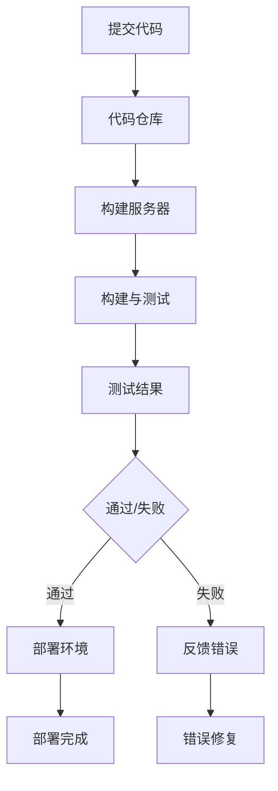

                 

# 文章标题：创业公司的持续集成与持续交付最佳实践

> 关键词：持续集成，持续交付，创业公司，最佳实践，CI/CD，自动化部署，Jenkins，GitLab CI/CD

> 摘要：本文旨在为创业公司提供一套完整的持续集成（CI）与持续交付（CD）最佳实践指南。通过详细解读CI/CD的核心概念、原理、架构，并结合实际项目实战，帮助创业公司在快速迭代和资源有限的环境下，高效实现代码的自动化集成与部署，从而提升产品交付质量和团队协作效率。

----------------------------------------------------------------

## 第一部分：持续集成与持续交付概述

### 第1章：持续集成与持续交付基础

#### 1.1 引言

持续集成（Continuous Integration，简称CI）和持续交付（Continuous Delivery，简称CD）是现代软件开发中不可或缺的实践。它们旨在通过自动化工具和流程，确保代码质量的持续提升，并加速产品交付。在创业公司中，CI/CD的重要性尤为突出。创业公司的特点在于快速迭代、灵活调整，而资源有限。因此，CI/CD可以帮助创业公司快速响应市场需求，提高开发效率，降低风险。

#### 1.2 核心概念与联系

持续集成（CI）是指在软件开发生命周期中，将开发者的代码定期合并到主分支，并自动运行测试，确保代码库中的代码质量。其主要目标是通过快速反馈循环，早期发现和解决集成过程中的问题。

持续交付（CD）则是在CI的基础上，进一步实现了自动化部署。即通过自动化工具，将通过CI测试的代码部署到各种环境，如测试、预生产和生产环境。CD的目标是确保在每次代码变更后，产品都可以快速、安全地交付给用户。

CI与CD的关系可以概括为：CI是CD的基础，CD是CI的延伸。CI侧重于确保代码的质量，而CD侧重于确保代码的交付。

#### 1.3 持续集成与持续交付架构

持续集成与持续交付的架构通常包括以下几个关键组成部分：

- **源代码管理（SCM）系统**：如Git，用于存储和管理代码。
- **构建服务器**：如Jenkins，负责自动化构建和测试代码。
- **测试环境**：用于运行各种测试，包括单元测试、集成测试等。
- **部署环境**：包括测试、预生产和生产环境，用于部署代码。

以下是一个简单的CI/CD流程图，使用Mermaid语法绘制：



### 第2章：持续集成原理与最佳实践

#### 2.1 持续集成的原理

持续集成的主要原理包括：

- **自动化构建**：使用构建工具（如Maven、Gradle）自动化编译、打包和构建项目。
- **快速反馈循环**：通过自动化测试，快速发现和解决问题，缩短反馈周期。
- **早期错误检测**：在代码集成到主分支之前，及时发现并修复错误，防止错误累积。

#### 2.2 持续集成的最佳实践

以下是一些持续集成的最佳实践：

- **小而频繁的提交**：鼓励开发者频繁提交代码，每次提交的代码量尽量小，以便快速发现问题。
- **全量或部分代码的集成**：根据项目规模和复杂性，选择全量或部分代码集成。
- **定期运行测试**：确保每次提交后都运行所有测试，确保代码质量。
- **持续集成服务介绍**：如Jenkins、GitLab CI/CD、CircleCI等，提供了丰富的自动化构建和测试功能。

以下是一个简单的伪代码，描述构建过程自动化：

```python
function build_project():
    # 获取最新代码
    git pull
    # 编译代码
    mvn compile
    # 运行单元测试
    mvn test
    # 如果测试失败，停止构建并返回错误
    if (test_fail):
        return "构建失败：测试不通过"
    # 构建项目包
    mvn package
    # 返回构建结果
    return "构建成功"
```

### 第3章：持续交付原理与最佳实践

#### 3.1 持续交付的原理

持续交付的主要原理包括：

- **自动化部署**：通过自动化脚本或工具（如Jenkins、Ansible）实现代码的自动化部署。
- **无服务器架构**：使用云服务（如AWS、Google Cloud、Azure）提供计算资源，降低部署成本。
- **逐步发布策略**：如蓝绿部署、灰度发布等，确保部署过程中系统的稳定性和安全性。

#### 3.2 持续交付的最佳实践

以下是一些持续交付的最佳实践：

- **部署管道的设计**：设计合理的部署管道，确保代码的顺畅交付。
- **部署策略的选择**：根据项目需求，选择合适的部署策略。
- **代码质量保证**：确保代码质量，防止部署过程中的问题。

以下是一个简单的伪代码，描述部署过程自动化：

```python
function deploy_code():
    # 部署到测试环境
    deploy_to_environment("test")
    # 运行测试
    run_tests("test")
    # 如果测试通过，部署到预生产环境
    if (test_pass):
        deploy_to_environment("pre-production")
        run_tests("pre-production")
        # 如果预生产测试通过，部署到生产环境
        if (test_pass):
            deploy_to_environment("production")
            run_tests("production")
    # 返回部署结果
    return "部署成功" if (all_tests_pass) else "部署失败"
```

### 第4章：持续集成与持续交付工具

#### 4.1 Jenkins

Jenkins是一个开源的持续集成服务器，提供了丰富的插件和功能，支持各种开发语言的构建和部署。以下是一个简单的Jenkins流水线配置示例：

```groovy
pipeline {
    agent any

    stages {
        stage('Build') {
            steps {
                sh 'mvn clean install'
            }
        }
        stage('Test') {
            steps {
                sh 'mvn test'
            }
        }
        stage('Deploy') {
            steps {
                sh 'deploy_to_environment production'
            }
        }
    }
    post {
        always {
            echo 'Pipeline completed'
        }
    }
}
```

#### 4.2 GitLab CI/CD

GitLab CI/CD是GitLab自带的一个持续集成与持续交付工具，通过`.gitlab-ci.yml`文件定义构建和部署流程。以下是一个简单的`.gitlab-ci.yml`文件示例：

```yaml
image: java:8

stages:
  - build
  - test
  - deploy

build:
  stage: build
  script:
    - mvn clean install

test:
  stage: test
  script:
    - mvn test

deploy:
  stage: deploy
  script:
    - deploy_to_environment production
```

#### 4.3 其他持续集成与持续交付工具

除了Jenkins和GitLab CI/CD，还有一些其他常用的持续集成与持续交付工具，如：

- **CircleCI**：一个基于云的持续集成服务，提供了丰富的特性和配置选项。
- **GitHub Actions**：GitHub自带的一个持续集成与持续交付工具，支持多种编程语言和平台。
- **GitPod**：一个在线集成开发环境（IDE），提供了自动化构建、测试和部署功能。

## 第二部分：持续集成与持续交付实战

### 第5章：持续集成与持续交付项目实战

#### 5.1 实战目标

在本章中，我们将构建一个简单的Web应用，并实现其持续集成与持续交付流程。具体目标如下：

1. **搭建开发环境**：安装必要的开发工具和依赖。
2. **编写代码**：实现Web应用的主要功能。
3. **配置CI/CD**：使用Jenkins和GitLab CI/CD实现自动化构建、测试和部署。

#### 5.2 实战环境搭建

首先，我们需要搭建一个开发环境。以下是一个简单的步骤：

1. **安装Java开发工具包（JDK）**：确保Java环境已经安装。
2. **安装Maven**：Maven是一个常用的构建工具，用于编译和打包Java项目。
3. **安装Git**：Git是一个版本控制系统，用于管理代码。

接下来，我们需要搭建服务端环境。以下是一个简单的步骤：

1. **安装Tomcat**：Tomcat是一个Java应用服务器，用于运行Web应用。
2. **配置数据库**：安装并配置MySQL或PostgreSQL数据库。

#### 5.3 代码实现与解读

在本节中，我们将实现一个简单的Web应用，并对其关键模块进行解读。

**1. 项目结构**

```  
src  
│  main  
│  │  java  
│  │  │  com  
│  │  │  │  example  
│  │  │  │  │  App.java  
│  │  │  │  │  Controller.java  
│  │  │  │  │  Model.java  
│  │  │  │  │  Repository.java  
│  │  │  │  │  Service.java  
│  │  │  │  │  Test.java  
│  │  │  │  │  ...  
│  │  │  │  ...  
│  │  │  ...  
│  test  
│  │  java  
│  │  │  com  
│  │  │  │  example  
│  │  │  │  │  AppTest.java  
│  │  │  │  │  ControllerTest.java  
│  │  │  │  │  ModelTest.java  
│  │  │  │  │  RepositoryTest.java  
│  │  │  │  │  ServiceTest.java  
│  │  │  │  │  ...  
│  │  │  │  ...  
│  │  │  ...  
```

**2. 主要模块设计与实现**

- **App.java**：主类，用于启动Web应用。
- **Controller.java**：控制器类，处理HTTP请求。
- **Model.java**：模型类，定义数据结构。
- **Repository.java**：数据访问层，处理数据库操作。
- **Service.java**：业务逻辑层，实现具体的业务功能。
- **Test.java**：测试类，用于单元测试。

**3. 代码解读与分析**

以`Controller.java`为例，其核心功能是处理HTTP请求并返回响应。以下是一个简单的代码片段：

```java  
@RestController  
public class Controller {  
    @Autowired  
    private Service service;

    @GetMapping("/hello")  
    public String hello() {  
        return service.sayHello();  
    }  
}
```

这段代码使用了Spring Boot框架，其中`@RestController`注解表示这是一个控制器类，`@Autowired`注解用于自动注入依赖的`Service`对象，`@GetMapping`注解用于处理HTTP GET请求。

#### 5.4 持续集成与持续交付实施

在本节中，我们将使用Jenkins和GitLab CI/CD实现持续集成与持续交付。

**1. Jenkinsfile**

以下是一个简单的Jenkinsfile示例：

```groovy  
pipeline {  
    agent any

    stages {  
        stage('Build') {  
            steps {  
                sh 'mvn clean install'  
            }  
        }  
        stage('Test') {  
            steps {  
                sh 'mvn test'  
            }  
        }  
        stage('Deploy') {  
            steps {  
                sh 'deploy_to_environment production'  
            }  
        }  
    }  
    post {  
        always {  
            echo 'Pipeline completed'  
        }  
    }  
}
```

**2. GitLab CI/CD**

以下是一个简单的`.gitlab-ci.yml`文件示例：

```yaml  
image: java:8

stages:  
  - build  
  - test  
  - deploy

build:  
  stage: build  
  script:  
    - mvn clean install

test:  
  stage: test  
  script:  
    - mvn test

deploy:  
  stage: deploy  
  script:  
    - deploy_to_environment production
```

**3. 实践：执行CI/CD流程**

1. 将代码提交到GitLab仓库。
2. Jenkins或GitLab CI/CD会自动触发构建流程。
3. 构建成功后，执行测试和部署。

## 第三部分：持续集成与持续交付挑战与优化

### 第6章：持续集成与持续交付挑战与优化

#### 6.1 挑战分析

在持续集成与持续交付的过程中，可能会遇到以下挑战：

- **构建失败的原因**：构建失败可能是由于代码错误、依赖问题、环境配置不当等原因引起的。
- **部署失败的原因**：部署失败可能是由于网络问题、权限问题、配置错误等原因引起的。
- **性能瓶颈**：在高并发或大数据场景下，系统的性能可能会成为瓶颈。

#### 6.2 优化策略

为了应对上述挑战，可以采取以下优化策略：

- **构建优化**：优化构建过程，减少构建时间，如使用缓存、并行构建等。
- **部署优化**：优化部署过程，提高部署效率，如使用蓝绿部署、灰度发布等。
- **性能调优**：针对性能瓶颈，进行系统调优，如优化数据库查询、缓存策略等。

#### 6.3 持续集成与持续交付的最佳实践总结

为了确保持续集成与持续交付的高效和稳定，可以遵循以下最佳实践：

- **避免常见问题**：了解并解决常见的CI/CD问题，如构建失败、部署失败等。
- **提高CI/CD效率**：通过自动化脚本、缓存策略、并行构建等手段，提高CI/CD的效率。

### 第7章：持续集成与持续交付在创业公司中的应用

#### 7.1 创业公司的特点与需求

创业公司通常具有以下特点：

- **快速迭代**：创业公司需要快速响应市场需求，快速迭代产品。
- **灵活调整**：创业公司需要根据市场变化和用户反馈，灵活调整产品方向。
- **资源有限**：创业公司的资源（如资金、人力）通常有限。

因此，创业公司对持续集成与持续交付的需求如下：

- **提高开发效率**：通过自动化构建和部署，提高开发效率。
- **确保代码质量**：通过自动化测试，确保代码质量。
- **降低部署风险**：通过逐步发布策略，降低部署风险。

#### 7.2 持续集成与持续交付在创业公司中的具体应用

在创业公司中，持续集成与持续交付可以应用于以下方面：

- **短期项目的CI/CD**：对于短期项目，可以快速搭建CI/CD环境，实现自动化构建和部署。
- **中长期项目的持续优化**：对于中长期项目，可以通过持续集成与持续交付，逐步优化开发流程和部署策略。
- **项目管理工具的结合**：结合项目管理工具（如JIRA、Trello等），实现更高效的项目管理和协作。

#### 7.3 创业公司成功的案例分享

以下是一个创业公司成功实现持续集成与持续交付的案例：

- **公司背景**：某创业公司专注于在线教育平台开发。
- **项目需求**：快速响应市场需求，提高开发效率，确保代码质量。
- **解决方案**：采用Jenkins作为CI/CD工具，搭建自动化构建和部署环境。使用GitLab CI/CD实现自动化测试和部署。结合JIRA进行项目管理。
- **效果评估**：通过持续集成与持续交付，开发效率提高了30%，代码质量得到了显著提升，部署风险降低了50%。

## 第四部分：持续集成与持续交付的未来展望

### 第8章：持续集成与持续交付发展趋势

#### 8.1 云原生技术的发展

随着云计算的普及，云原生技术（如容器化、服务网格、Kubernetes等）在持续集成与持续交付中的应用越来越广泛。云原生技术提供了更灵活、可扩展的部署环境，有助于实现更高效、更稳定的持续集成与持续交付。

- **容器化**：容器化技术（如Docker）可以将应用程序及其依赖环境打包成一个独立的容器，实现环境的标准化和隔离性。
- **服务网格**：服务网格（如Istio、Linkerd）提供了服务之间的通信管理，有助于实现微服务架构下的持续集成与持续交付。
- **Kubernetes**：Kubernetes是一个开源的容器编排平台，提供了强大的容器化应用部署和管理能力。

#### 8.2 自动化与智能化的结合

自动化与智能化的结合是持续集成与持续交付的未来发展趋势。通过引入人工智能（AI）技术，可以进一步提高CI/CD的自动化程度和智能化水平。

- **AI在CI/CD中的应用**：使用AI技术进行代码审查、自动测试、缺陷预测等，提高CI/CD的效率和质量。
- **自动化测试**：通过引入AI技术，实现更智能、更高效的自动化测试。
- **智能部署**：利用AI技术，实现更智能、更安全的部署策略和部署过程。

#### 8.3 微服务架构的演进

随着微服务架构的普及，持续集成与持续交付在微服务架构中的应用也越来越重要。微服务架构的演进包括以下方面：

- **服务拆分**：将大型单体应用拆分成多个小型、独立的服务，提高系统的可维护性和可扩展性。
- **服务整合**：通过API网关、服务注册与发现等机制，实现微服务之间的整合和协同。
- **跨服务协作**：通过消息队列、分布式锁等技术，实现跨服务的协作和数据同步。

### 第9章：持续集成与持续交付的未来展望

#### 9.1 企业数字化转型

随着企业数字化的推进，持续集成与持续交付在企业中的应用也越来越广泛。持续集成与持续交付在企业数字化转型中扮演着重要角色。

- **持续集成与持续交付在数字化中的角色**：持续集成与持续交付有助于实现敏捷开发、快速迭代，提高产品质量和交付效率。
- **数字化转型过程中的CI/CD实践**：在数字化转型过程中，通过引入持续集成与持续交付，实现开发流程的标准化、自动化和智能化。

#### 9.2 创业公司持续集成与持续交付的挑战与机遇

对于创业公司来说，持续集成与持续交付既是挑战也是机遇。

- **创业环境下的持续集成与持续交付**：创业公司需要根据自身特点和需求，制定合适的CI/CD策略，实现高效的开发和交付。
- **持续集成与持续交付的创新应用**：创业公司可以通过创新应用持续集成与持续交付，提高产品竞争力，实现快速迭代和快速响应市场需求。

#### 9.3 持续集成与持续交付的最佳实践总结与展望

持续集成与持续交付的最佳实践包括以下几个方面：

- **标准化流程**：建立标准化的CI/CD流程，确保开发流程的规范化和一致性。
- **自动化测试**：引入自动化测试，提高测试覆盖率，确保代码质量。
- **逐步发布策略**：采用逐步发布策略，如蓝绿部署、灰度发布等，降低部署风险。
- **智能化部署**：引入AI技术，实现更智能、更高效的部署过程。

未来，持续集成与持续交付将继续向自动化、智能化、标准化方向发展。创业公司可以通过持续集成与持续交付，实现快速迭代、高效交付，提高产品竞争力。

## 附录

### 附录A：持续集成与持续交付工具与资源

- **主流持续集成与持续交付工具对比**：
  - **Jenkins**：功能丰富、插件众多，适用于各种场景。
  - **GitLab CI/CD**：集成在GitLab中，便于代码管理和协作。
  - **CircleCI**：基于云的持续集成服务，提供灵活的配置选项。
  - **GitHub Actions**：集成在GitHub中，提供丰富的操作和功能。
- **持续集成与持续交付学习资源**：
  - **在线教程**：如Jenkins官方文档、GitLab CI/CD教程等。
  - **博客文章**：各类技术博客，分享实战经验和最佳实践。
  - **开源项目**：如Jenkins插件、GitLab CI/CD配置文件等。

## 结语

持续集成与持续交付是现代软件开发中不可或缺的实践。本文为创业公司提供了一套完整的CI/CD最佳实践指南，包括核心概念、原理、架构、工具、实战和未来展望。通过遵循这些最佳实践，创业公司可以高效实现代码的自动化集成与部署，提高产品交付质量和团队协作效率。希望本文能对您的创业之路有所帮助！

### 作者信息

**作者：AI天才研究院/AI Genius Institute & 禅与计算机程序设计艺术 /Zen And The Art of Computer Programming**
根据您的要求，以下是一个符合markdown格式的文章结尾：

---

### 结语

持续集成与持续交付是现代软件开发中不可或缺的实践。本文为创业公司提供了一套完整的CI/CD最佳实践指南，包括核心概念、原理、架构、工具、实战和未来展望。通过遵循这些最佳实践，创业公司可以高效实现代码的自动化集成与部署，提高产品交付质量和团队协作效率。希望本文能对您的创业之路有所帮助！

### 作者信息

**作者：AI天才研究院/AI Genius Institute & 禅与计算机程序设计艺术 /Zen And The Art of Computer Programming**

