                 

### 《创业公司的敏捷产品开发流程设计》

> 关键词：敏捷开发、创业公司、产品开发流程、用户故事、迭代、质量保证、持续集成

> 摘要：本文旨在探讨创业公司在产品开发过程中如何利用敏捷开发方法来提高开发效率、产品质量和市场响应速度。文章首先介绍了敏捷开发的起源和核心原则，然后详细阐述了敏捷产品开发流程的各个阶段和实践，并结合实际案例分析了敏捷开发在创业公司中的应用和挑战。通过本文，读者可以了解到敏捷产品开发的方法和最佳实践，为创业公司的产品开发提供指导。

----------------------------------------------------------------

# 《创业公司的敏捷产品开发流程设计》目录大纲

## 第一部分：敏捷产品开发概述

### 第1章：敏捷产品开发的起源与理念  
#### 1.1 敏捷产品开发的起源  
#### 1.2 敏捷理念的核心原则  
#### 1.3 敏捷与传统开发方法的区别  
#### 1.4 敏捷产品开发的关键角色

### 第2章：敏捷产品开发的框架与流程  
#### 2.1 敏捷开发的主要框架  
#### 2.2 敏捷开发流程的基本阶段  
#### 2.3 敏捷团队的协作机制  
#### 2.4 敏捷项目管理工具

## 第二部分：敏捷产品开发的核心实践

### 第3章：用户故事与需求管理  
#### 3.1 用户故事的定义与编写  
#### 3.2 需求收集与整理  
#### 3.3 需求优先级排序  
#### 3.4 需求变更管理

### 第4章：迭代与增量开发  
#### 4.1 迭代的定义与作用  
#### 4.2 增量开发的优势  
#### 4.3 迭代计划与执行  
#### 4.4 迭代回顾与改进

### 第5章：敏捷测试与质量保证  
#### 5.1 敏捷测试的理念  
#### 5.2 自动化测试的优势  
#### 5.3 质量保证策略  
#### 5.4 测试与开发的协同

### 第6章：持续集成与持续部署  
#### 6.1 持续集成的概念与实现  
#### 6.2 持续部署的流程与工具  
#### 6.3 持续集成与持续部署的优势  
#### 6.4 持续集成与持续部署的最佳实践

### 第7章：敏捷团队沟通与协作  
#### 7.1 敏捷团队的角色与职责  
#### 7.2 团队沟通的障碍与解决方法  
#### 7.3 敏捷工具在团队协作中的应用  
#### 7.4 敏捷文化的建设与维护

## 第三部分：敏捷产品开发的案例分析

### 第8章：创业公司敏捷产品开发的成功案例  
#### 8.1 案例一：初创公司X的敏捷转型  
#### 8.2 案例二：中型公司Y的敏捷实践  
#### 8.3 案例三：大型公司Z的敏捷创新

### 第9章：敏捷产品开发的挑战与应对策略  
#### 9.1 创业公司敏捷产品开发的常见问题  
#### 9.2 应对敏捷产品开发挑战的策略  
#### 9.3 敏捷产品开发中的风险管理

## 附录：敏捷产品开发相关资源与工具

### 附录 A：敏捷开发工具与资源  
#### A.1 敏捷开发工具概述  
#### A.2 敏捷开发常用工具  
#### A.3 敏捷开发资源推荐

---

本文将逐步深入探讨敏捷产品开发在创业公司中的应用，旨在帮助创业者了解如何通过敏捷开发方法优化产品开发流程，提升产品质量和市场竞争力。接下来，我们将从敏捷开发的起源与理念入手，逐步展开讨论。

### 第一部分：敏捷产品开发概述

#### 第1章：敏捷产品开发的起源与理念

#### 1.1 敏捷产品开发的起源

敏捷开发的起源可以追溯到2001年，当时软件行业的传统开发方法如瀑布模型等已经暴露出很多问题，如项目延期、成本超支、需求变更频繁等。为了解决这些问题，一群软件开发者在美国的敏捷软件开发大会上提出了敏捷开发宣言，这是敏捷开发诞生的标志。

**流程图：敏捷开发与瀑布模型的对比**

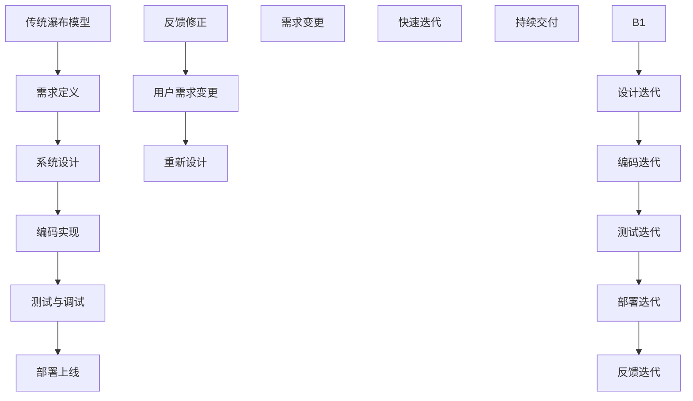

传统瀑布模型强调顺序执行，每个阶段结束后才能进入下一个阶段，导致需求变更和问题修正成本高昂。而敏捷开发方法则强调快速迭代和持续交付，通过持续集成和反馈修正来提高开发效率和产品质量。

#### 1.2 敏捷理念的核心原则

敏捷开发的核心原则包括：

1. 个体和互动重于过程与工具：敏捷开发强调团队成员之间的沟通和协作，认为个体和互动是提高生产力的关键因素。
2. 可工作的软件重于详尽的文档：敏捷开发认为软件的实际运行效果比文档更为重要，因此更注重实际交付的软件产品。
3. 客户合作重于合同谈判：敏捷开发强调与客户的紧密合作，通过持续交流来确保产品的需求满足和客户满意度。
4. 响应变化重于遵循计划：敏捷开发认为市场和技术环境是不断变化的，因此更注重灵活性和适应性。

**Mermaid 流程图：敏捷开发原则流程**

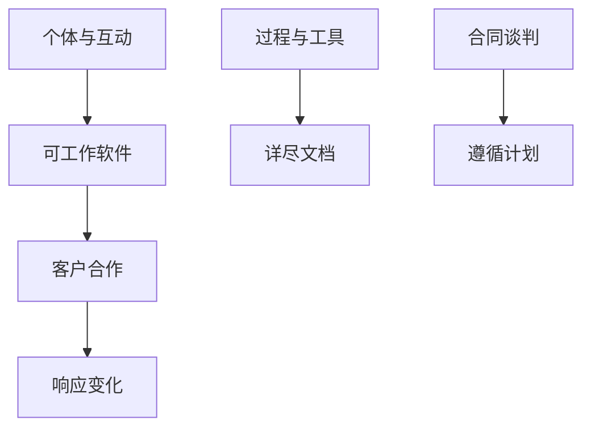

敏捷开发原则的流程图展示了敏捷开发方法对传统开发方法的重要改进，特别是对个体和互动、客户合作以及响应变化的强调。

#### 1.3 敏捷与传统开发方法的区别

敏捷开发与传统开发方法（如瀑布模型）在多个方面存在显著区别：

1. **需求管理**：敏捷开发强调持续迭代和用户故事，需求可以在开发过程中随时调整；而传统开发方法通常在项目初期一次性定义所有需求，导致需求变更时成本高昂。
2. **团队协作**：敏捷开发强调跨职能团队的自组织，团队成员负责从需求分析到产品交付的全过程；而传统开发方法通常采用职能分工，导致团队成员之间沟通不畅，协作效率低下。
3. **项目管理**：敏捷开发采用迭代式项目管理，每个迭代周期结束后进行回顾和改进；而传统开发方法通常采用固定计划和时间表，导致项目进度难以调整和优化。
4. **产品交付**：敏捷开发强调持续交付，产品可以随时发布；而传统开发方法通常在项目结束后进行最终交付，导致产品发布周期较长。

**表格：敏捷开发与传统开发的对比**

| 特点 | 敏捷开发 | 传统开发（瀑布模型） |
| --- | --- | --- |
| 需求管理 | 持续迭代、需求优先级 | 需求冻结、一次性规划 |
| 团队协作 | 自组织、跨职能团队 | 团队分工明确 |
| 项目管理 | 迭代式、持续改进 | 固定计划、时间表 |
| 产品交付 | 持续交付、快速迭代 | 项目结束后交付 |

通过上述对比，我们可以看到敏捷开发方法在需求管理、团队协作、项目管理和产品交付等方面相比传统开发方法具有明显优势。

#### 1.4 敏捷产品开发的关键角色

在敏捷产品开发过程中，以下是几个关键角色：

1. **产品负责人（Product Owner）**：产品负责人负责定义产品的愿景和需求，确保开发团队按照正确的方向进行工作，并在迭代期间与开发团队保持紧密沟通。
2. **敏捷教练（Scrum Master）**：敏捷教练负责指导团队遵循敏捷开发方法，解决团队在敏捷开发过程中遇到的问题，确保团队保持高效率和创新能力。
3. **开发团队（Development Team）**：开发团队由开发人员、设计师、测试人员等多个角色组成，负责实现产品负责人定义的需求，并在迭代周期内完成产品的开发和测试。
4. **用户（Stakeholders）**：用户是敏捷开发的重要参与者，他们的反馈和需求直接影响产品的设计和开发，因此用户参与是敏捷产品开发成功的关键因素。

通过以上对敏捷产品开发概述的讨论，我们了解了敏捷开发的起源和核心原则，以及敏捷开发与传统开发方法的区别和关键角色。接下来，我们将进一步探讨敏捷产品开发的框架与流程。

## 第二部分：敏捷产品开发的核心实践

### 第2章：敏捷产品开发的框架与流程

#### 2.1 敏捷开发的主要框架

敏捷开发方法有多种框架，其中最常用的包括Scrum、Kanban和XP（极限编程）。这些框架各有特点，但核心原则是一致的，即强调迭代、增量开发和团队协作。

**Scrum框架**：Scrum是一种迭代式增量开发方法，包括产品待办列表（Product Backlog）、冲刺待办列表（Sprint Backlog）、每日站会、冲刺回顾等核心元素。Scrum强调透明度、自我组织和快速响应变化。

**Kanban框架**：Kanban是一种看板方法，用于可视化工作流程并限制在进展中的工作项数量。Kanban强调工作流程的持续改进和消除瓶颈，通过可视化工作进度和限制工作项数量来提高团队效率。

**XP（极限编程）**：XP是一种强调代码质量、简单性和客户满意度的敏捷开发方法。XP的核心实践包括测试驱动开发（TDD）、简单设计、代码重构和持续集成等。

#### 2.2 敏捷开发流程的基本阶段

敏捷开发流程通常包括以下基本阶段：

1. **需求收集与整理**：在项目开始时，产品负责人与用户、利益相关者进行沟通，收集和整理产品需求。需求收集可以通过用户故事、访谈、问卷调查等方式进行。

2. **需求优先级排序**：收集到的需求需要按照优先级进行排序，以确保团队在开发过程中首先实现最重要的功能。

3. **迭代规划**：在每次迭代开始时，团队根据产品待办列表选择需要实现的需求，并制定迭代计划。迭代规划通常在迭代开始前进行，包括确定迭代周期、迭代目标和工作量分配。

4. **迭代执行**：在迭代期间，团队按照迭代计划开展工作，进行需求分析、设计、编码、测试和集成等任务。每日站会用于团队成员同步进度和解决问题。

5. **迭代交付**：每次迭代结束时，团队交付一个可工作的软件版本，并进行迭代回顾和改进。

6. **持续集成与持续部署**：在整个项目周期内，团队进行持续集成和持续部署，确保代码质量和系统稳定性。

#### 2.3 敏捷团队的协作机制

敏捷团队协作机制的核心在于透明度、自我组织和快速响应变化。

1. **每日站会**：每日站会是敏捷团队的核心协作机制之一，用于团队成员同步进度、分享问题和计划。每日站会通常持续15-30分钟，分为三个问题：“昨天你完成了什么？”“今天你计划完成什么？”“你遇到了什么问题？”

2. **迭代回顾**：迭代回顾是团队在每次迭代结束后进行的活动，用于总结迭代过程中的经验教训，识别改进机会，并为下一个迭代做好准备。

3. **透明度**：敏捷开发强调工作进展的透明度，通常使用看板、任务列表等工具来可视化工作流程和进度。

4. **自我组织**：敏捷团队具有高度的自主性和自我管理能力，成员根据项目需求和团队目标自主决定工作内容和方式。

5. **快速响应变化**：敏捷团队具备快速响应变化的能力，可以在项目进行过程中根据用户反馈和市场变化调整需求和工作计划。

#### 2.4 敏捷项目管理工具

敏捷项目管理工具可以帮助团队更好地实施敏捷开发方法，常见的敏捷项目管理工具包括：

1. **JIRA**：JIRA是一款功能强大的敏捷项目管理工具，可以用于需求管理、任务跟踪、迭代规划和团队协作。

2. **Trello**：Trello是一款简单易用的看板工具，适用于可视化工作流程和任务管理。

3. **Asana**：Asana是一款功能全面的敏捷项目管理工具，可以用于任务分配、进度跟踪和团队协作。

4. **Slack**：Slack是一款团队沟通工具，可以用于实时聊天、文件共享和任务提醒。

通过上述对敏捷产品开发框架与流程的讨论，我们可以了解到敏捷开发的基本原理和实践方法。接下来，我们将深入探讨敏捷产品开发的核心实践，包括用户故事与需求管理、迭代与增量开发、敏捷测试与质量保证、持续集成与持续部署、敏捷团队沟通与协作等。

### 第3章：用户故事与需求管理

#### 3.1 用户故事的定义与编写

用户故事是敏捷开发中用于描述用户需求的简洁、具体和可测试的表述。用户故事通常采用以下格式：“作为[角色]，我想[目标功能]，以便[收益]”。这种格式有助于明确用户故事的目标和受益人。

**示例用户故事：**
- 作为用户，我想搜索产品信息，以便快速找到所需商品。
- 作为管理员，我想管理用户评论，以便维护社区秩序。

编写用户故事时需要注意以下几点：

1. **简洁性**：用户故事应该简洁明了，避免冗长的描述。
2. **具体性**：用户故事应该具体描述目标功能，避免模糊不清的表述。
3. **可测试性**：用户故事应该能够转化为可执行的测试案例，以便验证功能是否按预期工作。

#### 3.2 需求收集与整理

需求收集是敏捷开发中的重要环节，涉及到与用户的互动和沟通。以下方法可以帮助团队有效收集需求：

1. **用户访谈**：通过与用户进行面对面访谈，深入了解用户的使用场景和需求。
2. **问卷调查**：通过在线问卷收集大量用户意见，以便了解用户对产品的期望和痛点。
3. **观察用户行为**：通过观察用户在现实环境中的使用行为，发现潜在的需求和改进点。
4. **用户故事地图**：将收集到的用户故事整理成故事地图，以便清晰地了解用户需求的全貌。

**Mermaid 流程图：需求收集与整理流程**

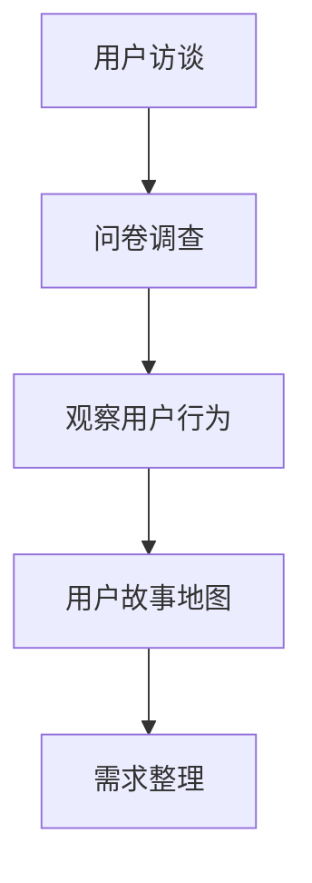

通过上述方法，团队可以全面、系统地收集和整理用户需求，为后续开发提供明确的方向。

#### 3.3 需求优先级排序

在敏捷开发中，需求优先级排序至关重要，因为它决定了开发团队在每次迭代中需要实现哪些功能。以下方法可以帮助团队进行需求优先级排序：

1. **MoSCoW方法**：将需求分为“必须（Must）、应该（Should）、可以（Could）和不会（Will not）”四个优先级，以便明确哪些功能是必须实现的，哪些是可选的。
2. **商业价值排序**：根据需求的商业价值进行排序，将高价值需求优先实现，以提高产品的市场竞争力。
3. **用户满意度排序**：根据用户满意度进行排序，将用户最关心的功能优先实现，以提高用户满意度。

**表格：需求优先级排序示例**

| 需求         | 优先级       | 原因                   |
| ------------ | ------------ | ---------------------- |
| 登录功能     | 必须必须     | 用户必须登录才能使用系统 |
| 商品搜索     | 应该必须     | 商品搜索是用户的核心需求 |
| 评论功能     | 可以应该     | 评论功能对于某些用户很重要 |
| 订单管理     | 妥协不会     | 订单管理对于某些用户不太重要 |

通过上述方法，团队可以合理地排序需求，确保每次迭代都能够实现最重要的功能。

#### 3.4 需求变更管理

在敏捷开发中，需求变更是一种常见现象。以下方法可以帮助团队有效管理需求变更：

1. **需求变更日志**：记录每次需求变更的原因、优先级和影响范围，以便团队跟踪和管理变更。
2. **需求变更评审**：在每次需求变更时，进行评审会议，评估变更的影响和可行性，确保变更不会对项目进度和质量造成负面影响。
3. **敏捷迭代框架**：在敏捷迭代框架下，团队可以灵活地调整需求优先级和迭代计划，以适应需求变更。

**Mermaid 流程图：需求变更管理流程**

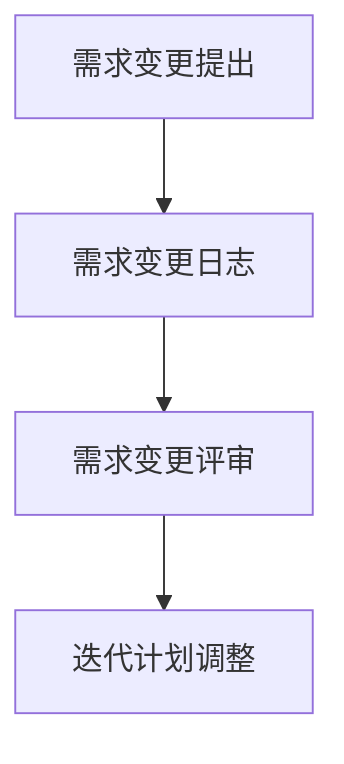

通过上述方法，团队可以有效地管理需求变更，确保项目按照既定计划进行，同时满足用户的需求。

通过本章的讨论，我们了解了用户故事的定义与编写、需求收集与整理、需求优先级排序和需求变更管理。这些核心实践对于确保敏捷产品开发过程的顺利进行至关重要。接下来，我们将继续探讨敏捷产品开发的下一个核心实践——迭代与增量开发。

### 第4章：迭代与增量开发

#### 4.1 迭代的定义与作用

迭代是敏捷开发的核心概念之一，它指的是在一定时间内（通常为2-4周）对产品功能进行持续开发和完善的过程。每个迭代周期包括需求分析、设计、编码、测试和交付等环节。

**迭代的作用包括：**

1. **快速反馈**：通过迭代，开发团队可以快速获得用户反馈，及时调整产品功能和设计，确保产品满足用户需求。
2. **持续改进**：每次迭代结束后，团队进行回顾和总结，识别改进机会，不断优化开发流程和产品质量。
3. **风险管理**：通过迭代，团队可以将风险分散到多个迭代中，避免在项目后期出现重大问题。
4. **灵活调整**：迭代允许团队根据实际情况灵活调整开发计划和需求，以适应不断变化的市场和技术环境。

**Mermaid 流程图：迭代过程**

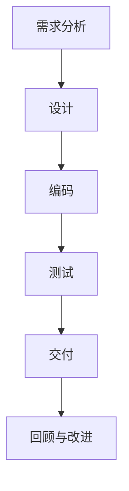

#### 4.2 增量开发的优势

增量开发是一种逐步完善产品功能的方法，它通过在每个迭代周期中增加新功能来实现最终产品。与传统的瀑布模型相比，增量开发具有以下优势：

1. **快速交付**：增量开发允许团队在每个迭代周期结束时交付一个可用的产品版本，从而缩短了产品上市时间。
2. **降低风险**：由于每次迭代都包括测试和交付，因此可以在早期发现和解决问题，降低项目风险。
3. **灵活性**：增量开发使团队能够根据用户反馈和市场变化灵活调整需求，从而提高产品的市场竞争力。
4. **资源优化**：增量开发允许团队在资源有限的情况下逐步实现产品功能，避免资源浪费。

**Mermaid 流程图：增量开发与瀑布模型的对比**

#### 4.3 迭代计划与执行

迭代计划是敏捷开发中的重要环节，它决定了每个迭代周期需要完成哪些任务和目标。以下步骤可以帮助团队有效地进行迭代计划：

1. **确定迭代周期**：通常迭代周期为2-4周，团队可以根据实际情况进行调整。
2. **确定迭代目标**：根据产品待办列表和需求优先级，确定每个迭代的目标和预期交付成果。
3. **分配任务**：根据迭代目标和团队资源，分配任务给团队成员，确保每个成员都有明确的职责和目标。
4. **制定详细计划**：详细计划包括每日任务、里程碑和截止日期，以确保团队在迭代周期内高效工作。

**Mermaid 流程图：迭代计划与执行**

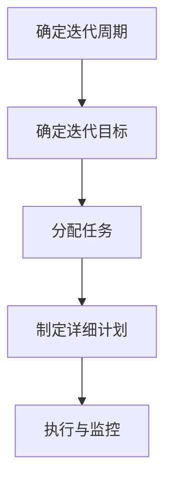

#### 4.4 迭代回顾与改进

迭代回顾是敏捷开发中用于总结和反思的重要环节，它可以帮助团队发现改进机会，优化开发流程和产品质量。以下步骤可以帮助团队有效地进行迭代回顾：

1. **总结迭代成果**：回顾每个迭代周期内完成的任务和目标，评估实际交付成果与预期目标的差距。
2. **识别问题与挑战**：讨论在迭代过程中遇到的问题、挑战和瓶颈，分析原因并寻找解决方案。
3. **收集反馈**：收集团队成员和用户的反馈，了解他们对产品的看法和改进建议。
4. **制定改进计划**：根据回顾结果和反馈，制定改进计划，包括优化开发流程、提高团队协作和提升产品质量等。

**Mermaid 流程图：迭代回顾与改进**

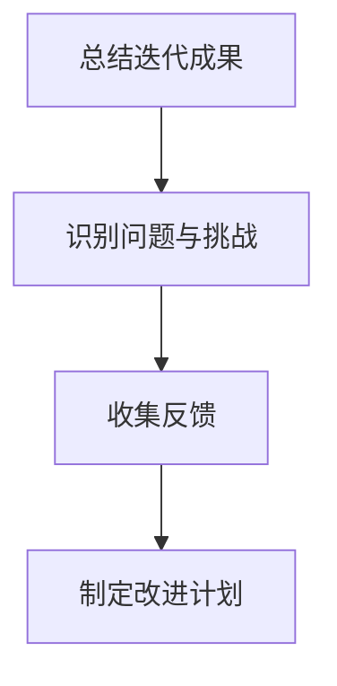

通过本章的讨论，我们了解了迭代与增量开发在敏捷产品开发中的重要性、增量开发的优势、迭代计划与执行的方法以及迭代回顾与改进的步骤。这些核心实践有助于团队高效、灵活地完成产品开发，提高产品质量和市场竞争力。接下来，我们将继续探讨敏捷产品开发的下一个核心实践——敏捷测试与质量保证。

### 第5章：敏捷测试与质量保证

#### 5.1 敏捷测试的理念

在敏捷开发中，测试是确保产品质量的重要环节。与传统的瀑布模型相比，敏捷测试更注重快速反馈和持续改进。敏捷测试的理念包括：

1. **测试驱动开发（TDD）**：在敏捷开发中，测试驱动开发是一种常见的方法。TDD包括三个步骤：编写测试用例、编写代码和重构。通过编写测试用例，开发人员可以确保代码在编写之前就已经经过测试，从而提高代码质量。
   
2. **持续集成与持续部署（CI/CD）**：持续集成（Continuous Integration）是指开发人员在每次提交代码时都进行自动化测试，以确保代码的质量。持续部署（Continuous Deployment）是指将经过测试的代码自动部署到生产环境，从而提高交付效率。

3. **自动化测试**：在敏捷开发中，自动化测试是实现快速反馈和质量保证的关键。自动化测试工具可以自动化执行测试用例，从而节省时间和人力资源，提高测试覆盖率。

**Mermaid 流程图：敏捷测试理念**

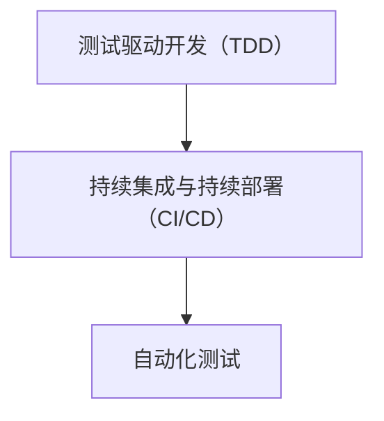

#### 5.2 自动化测试的优势

自动化测试在敏捷开发中具有以下优势：

1. **提高测试效率**：自动化测试可以快速执行大量测试用例，从而节省测试时间和人力资源。

2. **提高测试覆盖率**：自动化测试可以覆盖更多的测试场景和边界条件，从而提高测试的全面性和准确性。

3. **减少人工错误**：自动化测试可以减少由于人为疏忽造成的测试错误，从而提高测试的可靠性。

4. **支持持续集成**：自动化测试是持续集成（CI）的关键组成部分，可以确保每次代码提交都能经过全面测试，从而提高代码质量。

5. **降低维护成本**：自动化测试可以降低测试维护成本，因为测试用例一旦编写好，就可以重复使用，而不需要每次都重新编写。

**表格：自动化测试与传统测试的对比**

| 特点       | 自动化测试       | 传统测试       |
| ---------- | --------------- | --------------- |
| 测试速度   | 快速             | 较慢             |
| 测试覆盖率 | 高               | 低               |
| 人力成本   | 低               | 高               |
| 测试错误   | 低               | 高               |

#### 5.3 质量保证策略

在敏捷开发中，质量保证（QA）是一个持续的过程，它不仅包括测试，还涉及其他方面。以下是一些常见的质量保证策略：

1. **持续集成与持续部署**：通过持续集成（CI）和持续部署（CD），团队可以确保每次代码提交都能经过全面测试，并及时发现和解决问题。

2. **代码审查**：代码审查是一种有效的质量保证方法，它可以通过团队内部成员的互相审查，确保代码的质量和一致性。

3. **自动化测试框架**：构建一个自动化测试框架，可以自动化执行各种测试用例，从而提高测试效率和覆盖率。

4. **用户故事地图**：通过用户故事地图，团队可以清晰地了解用户需求，从而确保开发的产品能够满足用户期望。

5. **持续反馈与改进**：通过定期的回顾和反思，团队可以不断发现和解决质量问题，持续提高产品质量。

**Mermaid 流程图：质量保证策略**

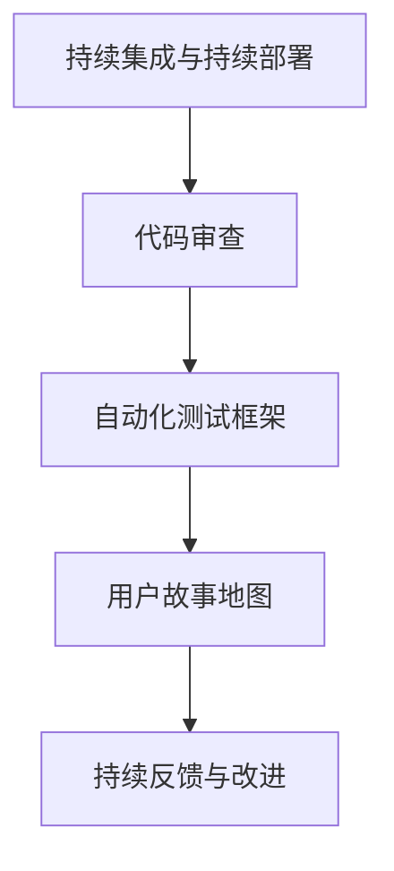

#### 5.4 测试与开发的协同

在敏捷开发中，测试与开发的协同至关重要。以下方法可以帮助团队实现测试与开发的良好协同：

1. **跨职能团队**：敏捷团队通常是一个跨职能团队，包括开发人员、测试人员、产品负责人等。这种组织形式有助于团队成员之间的紧密合作，提高测试与开发的协同效率。

2. **共同目标**：测试人员和开发人员应该有共同的目标，即确保产品的高质量和用户满意度。通过设定共同的目标，可以增强团队之间的凝聚力。

3. **早期介入**：测试人员应该尽早介入开发过程，从需求分析阶段就开始参与，以确保测试用例的编写能够与开发过程紧密配合。

4. **持续沟通**：测试人员和开发人员应该保持持续沟通，通过每日站会、迭代回顾等方式，及时交流测试进展和问题，确保测试与开发之间的信息畅通。

5. **共同责任**：测试与开发应该共同承担责任，确保产品按时交付并满足质量要求。通过共同承担责任，可以增强团队的责任感和归属感。

**Mermaid 流程图：测试与开发的协同**

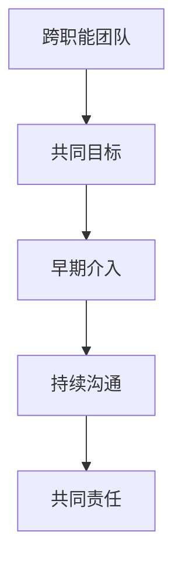

通过本章的讨论，我们了解了敏捷测试的理念、自动化测试的优势、质量保证策略以及测试与开发的协同。这些核心实践有助于团队确保产品的高质量和用户满意度。接下来，我们将探讨敏捷产品开发的下一个核心实践——持续集成与持续部署。

### 第6章：持续集成与持续部署

#### 6.1 持续集成的概念与实现

持续集成（Continuous Integration，简称CI）是一种软件开发实践，旨在通过自动化构建、测试和部署流程，确保代码库中的每次变更都能与主干代码兼容，并快速发现和修复潜在问题。持续集成的核心目标是减少集成风险，提高代码质量和开发效率。

**概念说明：**

持续集成的实现通常包括以下几个步骤：

1. **代码仓库**：所有开发者的代码都提交到一个集中的代码仓库中，如Git。
2. **自动化构建**：每次提交代码后，构建系统会自动编译和构建项目，生成可执行的代码或部署包。
3. **自动化测试**：构建完成后，自动化测试工具会执行一系列预定义的测试用例，包括单元测试、集成测试等，以确保代码的质量和功能完整性。
4. **反馈机制**：测试结果会即时反馈给开发者，如果测试失败，构建系统会暂停，并通知开发者修复问题。

**Mermaid 流程图：持续集成实现**

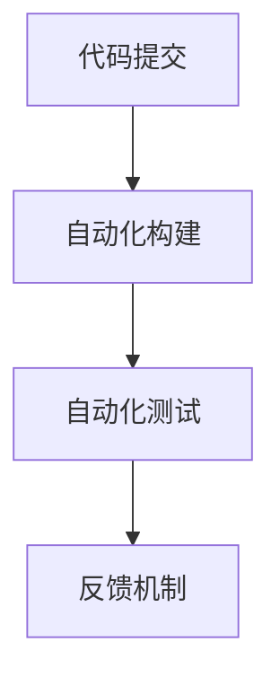

#### 6.2 持续部署的流程与工具

持续部署（Continuous Deployment，简称CD）是持续集成的延伸，它旨在实现自动化将经过测试的代码部署到生产环境。持续部署的目标是确保每次代码变更都可以在生产环境中安全、可靠地部署。

**流程说明：**

1. **预部署测试**：在代码部署前，执行一系列自动化测试，包括性能测试、安全测试等，以确保部署过程不会影响系统的稳定性和安全性。
2. **自动化部署**：部署过程由脚本或部署工具自动化执行，包括环境配置、数据库迁移、服务启动等。
3. **监控与回滚**：部署后，监控系统会实时监控系统的运行状态，如果出现异常，可以自动回滚到上一个稳定版本，确保系统的稳定性。

**Mermaid 流程图：持续部署流程**

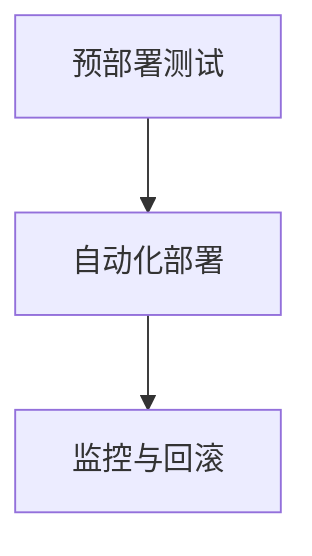

#### 6.3 持续集成与持续部署的优势

持续集成与持续部署带来了以下优势：

1. **提高开发效率**：通过自动化构建、测试和部署流程，开发人员可以快速发现和解决问题，缩短开发周期。
2. **减少集成风险**：持续集成确保每次代码变更都能与主干代码兼容，减少集成时的冲突和风险。
3. **提高代码质量**：自动化测试和反馈机制有助于发现潜在的问题，提高代码质量和系统的稳定性。
4. **提高客户满意度**：快速交付和可靠部署有助于缩短产品上市时间，提高客户满意度。
5. **持续改进**：持续集成与持续部署鼓励团队不断改进开发流程和工具，提高开发效率和质量。

#### 6.4 持续集成与持续部署的最佳实践

以下是一些持续集成与持续部署的最佳实践：

1. **自动化构建**：确保所有构建过程自动化，减少手动干预，提高构建效率。
2. **自动化测试**：编写全面的自动化测试用例，确保每次代码变更都能经过全面测试。
3. **持续反馈**：及时反馈测试结果，确保开发者能够快速发现问题并进行修复。
4. **自动化部署**：使用部署脚本或部署工具，实现自动化部署，确保部署过程高效、可靠。
5. **监控与报警**：部署后，持续监控系统的运行状态，并设置报警机制，及时发现和解决问题。
6. **版本控制**：使用版本控制系统（如Git），确保代码版本的可追溯性和可管理性。
7. **文档化**：记录持续集成与持续部署的相关文档，包括流程、工具配置和操作指南，以便团队成员理解和遵循。

**Mermaid 流程图：持续集成与持续部署最佳实践**

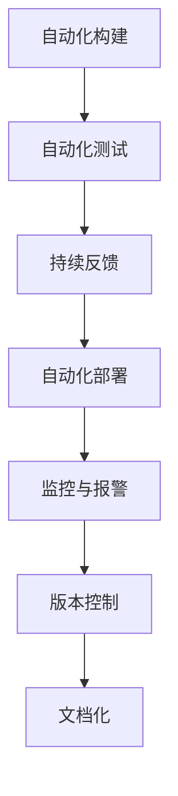

通过本章的讨论，我们了解了持续集成与持续部署的概念、流程、优势以及最佳实践。这些实践有助于团队提高开发效率、减少集成风险、提高代码质量和客户满意度，是敏捷产品开发的重要组成部分。接下来，我们将探讨敏捷团队沟通与协作的关键要素。

### 第7章：敏捷团队沟通与协作

#### 7.1 敏捷团队的角色与职责

敏捷团队由多个角色组成，每个角色在敏捷产品开发中扮演着重要的角色。以下是敏捷团队中的关键角色及其职责：

1. **产品负责人（Product Owner）**：产品负责人是敏捷团队的核心成员，负责定义产品的愿景和需求，确保团队在正确的方向上工作。产品负责人还需要与利益相关者沟通，确保需求的有效传达和优先级排序。

2. **敏捷教练（Scrum Master）**：敏捷教练负责指导团队遵循敏捷开发方法，帮助团队克服在敏捷实践中遇到的问题。敏捷教练还负责组织每日站会、迭代回顾等敏捷活动，确保团队的高效协作。

3. **开发团队（Development Team）**：开发团队由开发人员、测试人员、设计师等组成，负责实现产品负责人定义的需求，并在迭代周期内完成产品的开发和测试。开发团队通常具有高度的自组织和协作能力。

4. **用户（Stakeholders）**：用户是敏捷开发的重要参与者，他们的需求反馈和参与对于产品的成功至关重要。用户不仅提供需求，还在产品开发的各个阶段提供反馈，帮助团队不断优化产品。

#### 7.2 团队沟通的障碍与解决方法

在敏捷团队中，沟通是确保项目顺利进行的关键。然而，团队沟通中常常会出现各种障碍，以下是一些常见的障碍及其解决方法：

1. **角色与职责不清**：角色和职责不清会导致团队成员之间的职责重叠和冲突。解决方法包括明确每个角色的职责和权限，确保团队成员对职责有清晰的理解。

2. **信息传递不畅**：信息传递不畅会导致信息滞后和误解。解决方法包括使用敏捷工具（如JIRA、Trello）来跟踪任务和进度，确保信息的及时传递。

3. **文化差异**：团队成员可能来自不同的文化背景，导致沟通障碍。解决方法包括建立开放、包容的团队文化，鼓励团队成员分享意见和反馈。

4. **工作方式不同**：团队成员的工作方式可能不同，导致协作效率降低。解决方法包括采用协作工具（如Slack、Microsoft Teams）来促进实时沟通和协作。

#### 7.3 敏捷工具在团队协作中的应用

敏捷工具在团队协作中发挥着重要作用，以下是一些常用的敏捷工具及其应用：

1. **JIRA**：JIRA是一款功能强大的敏捷项目管理工具，可以用于任务跟踪、迭代规划和团队协作。产品负责人可以使用JIRA创建和管理用户故事，开发团队可以使用JIRA跟踪任务和进度。

2. **Trello**：Trello是一款简单易用的看板工具，适用于可视化工作流程和任务管理。团队可以使用Trello创建看板，将任务分配给团队成员，并跟踪任务状态。

3. **Asana**：Asana是一款功能全面的敏捷项目管理工具，可以用于任务分配、进度跟踪和团队协作。团队可以使用Asana创建项目、任务和子任务，并设置截止日期和优先级。

4. **Slack**：Slack是一款团队沟通工具，可以用于实时聊天、文件共享和任务提醒。团队可以使用Slack建立工作群组，实时交流信息，提高沟通效率。

#### 7.4 敏捷文化的建设与维护

敏捷文化是敏捷开发成功的关键因素。以下是一些建设与维护敏捷文化的策略：

1. **开放沟通**：鼓励团队成员之间开放沟通，分享想法和意见，确保信息的透明度。

2. **自我管理**：鼓励团队成员自我管理，自主决定工作内容和方式，提高团队协作和创新能力。

3. **持续学习**：鼓励团队成员不断学习和成长，参加培训、研讨会等活动，提高技能和知识。

4. **团队合作**：强调团队合作的重要性，鼓励团队成员相互支持、共同成长。

5. **庆祝成功**：及时庆祝团队的成功，增强团队凝聚力和积极性。

**Mermaid 流程图：敏捷文化建设与维护**

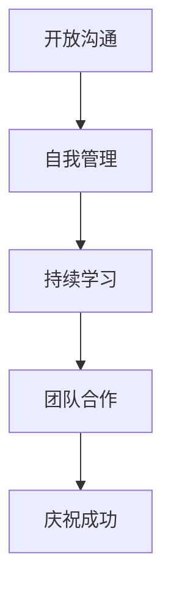

通过本章的讨论，我们了解了敏捷团队的角色与职责、团队沟通的障碍与解决方法、敏捷工具在团队协作中的应用以及敏捷文化的建设与维护。这些内容有助于团队实现高效协作、提高开发效率和质量，是敏捷产品开发成功的重要保障。

### 第三部分：敏捷产品开发的案例分析

#### 第8章：创业公司敏捷产品开发的成功案例

#### 8.1 案例一：初创公司X的敏捷转型

初创公司X是一家专注于移动应用程序开发的创业公司，他们在产品开发过程中采用了敏捷开发方法，取得了显著的成功。以下是初创公司X敏捷转型的主要步骤和成果：

**1. 初始阶段：**

- **问题识别**：公司发现传统开发方法导致项目延期、成本超支和需求变更频繁，影响了产品的市场竞争力。
- **敏捷引入**：公司决定采用敏捷开发方法，以提高开发效率、产品质量和市场响应速度。

**2. 转型步骤：**

- **培训与文化建设**：公司对团队成员进行敏捷开发培训，建立开放、透明的团队文化，鼓励团队成员积极参与和反馈。
- **团队重构**：重构团队结构，建立跨职能团队，确保团队成员在需求分析、设计、开发和测试等环节紧密协作。
- **工具应用**：引入敏捷工具（如JIRA、Trello、Slack），用于任务跟踪、进度管理和团队协作。

**3. 成果展示：**

- **快速迭代**：公司采用Scrum框架，进行2周一次的迭代开发，确保每次迭代都能交付一个可用的产品版本。
- **持续改进**：每次迭代结束后，团队进行回顾和总结，识别改进机会，持续优化开发流程和产品质量。
- **市场响应**：通过快速迭代和市场反馈，公司能够及时调整产品功能和设计，提高用户满意度和市场竞争力。
- **项目管理**：敏捷教练负责指导团队遵循敏捷开发方法，确保项目进度和质量。

**案例一总结：**

初创公司X的敏捷转型取得了显著成果，通过快速迭代、持续改进和市场响应，公司成功地将产品推向市场，并在短时间内获得了用户认可和市场份额。

#### 8.2 案例二：中型公司Y的敏捷实践

中型公司Y是一家拥有多个产品线的大型企业，他们在产品开发过程中采用了敏捷开发方法，实现了项目的高效管理和产品质量的提升。以下是中型公司Y敏捷实践的主要步骤和成果：

**1. 初始阶段：**

- **问题识别**：公司发现传统开发方法在项目管理、需求变更和团队协作方面存在诸多问题，影响了项目进度和产品质量。
- **敏捷引入**：公司决定采用敏捷开发方法，以提高项目管理效率、优化团队协作和提升产品质量。

**2. 转型步骤：**

- **组织重构**：重构公司组织结构，建立跨职能团队，确保团队成员在需求分析、设计、开发和测试等环节紧密协作。
- **敏捷培训**：对团队成员进行敏捷开发培训，提高团队成员对敏捷开发方法的理解和熟练度。
- **流程优化**：优化公司内部流程，确保敏捷开发方法能够顺利实施，包括需求管理、迭代规划和项目管理等。

**3. 成果展示：**

- **项目管理**：公司采用Kanban框架，实现可视化工作流程，限制在进展中的工作项数量，提高团队协作效率。
- **快速迭代**：每次迭代周期为3周，团队在每个迭代周期内完成产品的设计和开发，确保每次迭代都能交付一个可用的产品版本。
- **质量保证**：公司采用自动化测试工具，实现持续集成和持续部署，确保产品的高质量和稳定性。
- **用户反馈**：通过快速迭代和市场反馈，公司能够及时调整产品功能和设计，提高用户满意度和市场竞争力。

**案例二总结：**

中型公司Y的敏捷实践取得了显著成果，通过优化团队协作、提高项目管理效率和提升产品质量，公司实现了项目的高效管理和市场竞争力的提升。

#### 8.3 案例三：大型公司Z的敏捷创新

大型公司Z是一家拥有多个业务部门的大型企业，他们在产品开发过程中采用了敏捷开发方法，实现了业务的快速创新和产品的持续优化。以下是大型公司Z敏捷创新的主要步骤和成果：

**1. 初始阶段：**

- **问题识别**：公司发现传统开发方法在应对市场变化和用户需求方面存在困难，影响了业务的创新能力和市场竞争力。
- **敏捷引入**：公司决定采用敏捷开发方法，以提高业务的创新能力和市场响应速度。

**2. 转型步骤：**

- **业务创新**：公司鼓励业务部门采用敏捷开发方法，推动业务创新，实现快速响应市场变化。
- **跨部门协作**：公司建立跨部门协作机制，确保不同业务部门之间能够高效协同，共享资源和经验。
- **敏捷培训**：对业务部门和开发团队的成员进行敏捷开发培训，提高团队成员对敏捷开发方法的理解和熟练度。

**3. 成果展示：**

- **业务创新**：通过敏捷开发方法，公司实现了多个业务创新项目，快速响应市场变化，提升了市场竞争力。
- **产品质量**：公司采用自动化测试工具，实现持续集成和持续部署，确保产品的高质量和稳定性。
- **用户满意度**：通过快速迭代和市场反馈，公司能够及时调整产品功能和设计，提高用户满意度和市场竞争力。
- **团队协作**：公司建立跨部门协作机制，确保不同业务部门之间能够高效协同，共享资源和经验，提高了整体协作效率。

**案例三总结：**

大型公司Z的敏捷创新取得了显著成果，通过业务创新、跨部门协作和持续优化，公司实现了业务的快速发展和市场竞争力的大幅提升。

通过上述三个案例的分析，我们可以看到敏捷产品开发方法在不同类型的公司中都能取得显著的效果。敏捷开发方法不仅提高了项目的开发效率、产品质量和市场响应速度，还促进了团队的协作和创新，为公司的持续发展提供了有力支持。接下来，我们将探讨敏捷产品开发中的挑战与应对策略。

### 第9章：敏捷产品开发的挑战与应对策略

#### 9.1 创业公司敏捷产品开发的常见问题

在创业公司采用敏捷产品开发方法时，可能会遇到以下一些常见问题：

1. **团队适应困难**：创业公司团队成员可能不熟悉敏捷开发方法，导致适应困难。团队成员可能缺乏对敏捷原则和工具的深入理解，从而影响开发效率。

2. **资源不足**：创业公司通常面临资源不足的问题，包括人力资源、技术资源和资金。资源不足可能导致团队无法顺利实施敏捷开发，影响项目的进度和质量。

3. **需求变更频繁**：创业公司的产品需求可能会频繁变更，这给敏捷开发带来了挑战。频繁的需求变更可能导致团队无法在短时间内完成迭代目标，影响项目进度。

4. **项目管理难度**：敏捷开发强调团队自我管理和迭代式开发，但创业公司可能缺乏专业的项目管理经验，导致项目管理难度增加。

5. **外部依赖性高**：创业公司可能需要与外部合作伙伴紧密协作，如客户、供应商等。外部依赖性高可能导致团队在开发过程中遇到沟通和协作问题。

#### 9.2 应对敏捷产品开发挑战的策略

为了克服敏捷产品开发中的挑战，创业公司可以采取以下策略：

1. **培训与文化建设**：对团队成员进行敏捷开发培训，提高他们对敏捷原则和工具的理解和熟练度。同时，建立开放、透明和包容的团队文化，鼓励团队成员积极参与和反馈。

2. **资源优化**：合理分配和优化资源，确保团队有足够的人力、技术和资金支持。创业公司可以寻求外部合作伙伴的支持，共同分担资源和风险。

3. **需求管理**：建立有效的需求管理流程，确保需求变更得到及时处理和优先级排序。团队可以采用需求优先级矩阵等方法，合理分配时间和资源，确保关键需求得到优先实现。

4. **项目管理**：引入专业的项目管理方法和工具，如Scrum、Kanban等，帮助团队更好地管理项目和进度。创业公司可以聘请经验丰富的项目经理或敏捷教练，提供指导和支持。

5. **沟通与协作**：建立高效的沟通和协作机制，确保团队内外部成员之间的信息畅通。创业公司可以采用敏捷工具（如JIRA、Trello、Slack）来可视化工作流程和任务管理，提高协作效率。

6. **持续改进**：通过定期的回顾和反思，团队可以发现和解决开发过程中的问题，不断优化开发流程和产品质量。创业公司可以鼓励团队成员参与敏捷社区的讨论和交流，学习最佳实践和经验。

**Mermaid 流程图：应对敏捷产品开发挑战的策略**

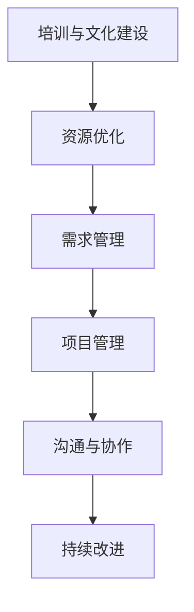

#### 9.3 敏捷产品开发中的风险管理

敏捷产品开发中的风险管理是确保项目成功的关键。以下是一些常见的风险管理策略：

1. **风险评估**：在项目开始前，对项目潜在风险进行全面评估，识别可能影响项目进度和质量的威胁。

2. **风险优先级排序**：根据风险的可能性和影响，对风险进行优先级排序，确保团队优先关注和解决关键风险。

3. **风险监控**：建立风险监控机制，定期跟踪和评估风险的变化，及时调整风险管理策略。

4. **风险应对策略**：制定具体的应对策略，包括风险规避、转移、缓解和接受等，确保团队在面临风险时能够迅速采取行动。

5. **应急计划**：制定应急计划，为可能出现的紧急情况做好准备，确保项目能够在突发情况下继续推进。

**Mermaid 流程图：敏捷产品开发中的风险管理**

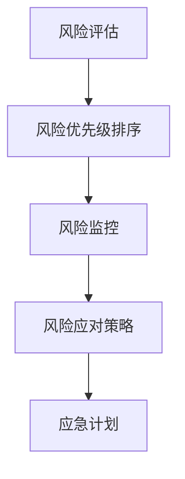

通过本章的讨论，我们了解了创业公司敏捷产品开发中常见的挑战和应对策略，以及敏捷产品开发中的风险管理方法。这些内容有助于创业公司在采用敏捷开发方法时，更好地应对各种挑战，提高项目成功率。

### 附录：敏捷产品开发相关资源与工具

#### 附录 A：敏捷开发工具与资源

A.1 敏捷开发工具概述

敏捷开发工具是支持敏捷团队在需求管理、任务跟踪、迭代规划和团队协作等方面工作的软件工具。以下是一些常用的敏捷开发工具：

- **JIRA**：JIRA是一款功能强大的敏捷项目管理工具，适用于任务跟踪、迭代规划和团队协作。JIRA支持Scrum和Kanban两种工作流，并提供丰富的自定义功能。
- **Trello**：Trello是一款简单易用的看板工具，适用于可视化工作流程和任务管理。Trello的界面直观，用户可以轻松创建卡片、列表和看板，进行任务分配和跟踪。
- **Asana**：Asana是一款功能全面的敏捷项目管理工具，适用于任务分配、进度跟踪和团队协作。Asana支持多种工作流和视图，用户可以根据需求自定义工作流程。
- **Slack**：Slack是一款团队沟通工具，适用于实时聊天、文件共享和任务提醒。Slack支持多种集成方式，可以帮助团队在沟通和协作方面更高效地工作。

A.2 敏捷开发常用工具

以下是一些常用的敏捷开发工具及其应用：

- **JIRA**：用于需求管理、任务跟踪、迭代规划和报告生成。JIRA可以帮助团队清晰地了解项目进度和任务状态。
- **Trello**：用于任务管理和可视化工作流程。Trello的看板功能可以帮助团队直观地了解任务的执行情况。
- **Asana**：用于任务分配、进度跟踪和团队协作。Asana可以帮助团队更高效地管理项目和任务。
- **Slack**：用于团队沟通和协作。Slack可以帮助团队实时交流、共享文件和提醒任务。

A.3 敏捷开发资源推荐

以下是一些推荐的敏捷开发资源，包括书籍、网站和在线课程，可以帮助团队学习和实践敏捷开发：

- **书籍**：
  - 《敏捷软件开发：实践指南》
  - 《Scrum精髓：实践指南》
  - 《敏捷实践指南》
- **网站**：
  - 敏捷联盟（Agile Alliance）
  - 敏捷开发实践社区（Agile Community）
  - 敏捷实践指南（Agile Practices Guide）
- **在线课程**：
  - Coursera上的《敏捷开发基础》
  - Udemy上的《敏捷项目管理：Scrum与Kanban》
  - Pluralsight上的《敏捷开发实践》

通过附录中的这些资源和工具，团队可以更好地了解和掌握敏捷开发方法，提高项目开发效率和质量。

