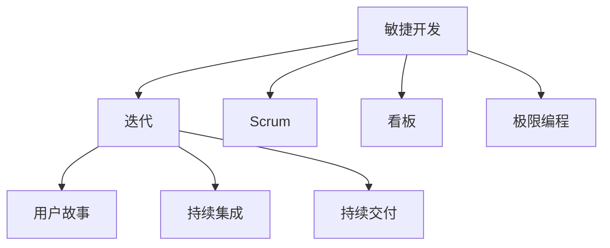

                 

## 文章标题

### 《创业公司的敏捷开发与快速迭代方法》

---

**关键词：敏捷开发、快速迭代、创业公司、项目管理、软件工程**

**摘要：** 本文章旨在深入探讨敏捷开发在创业公司中的应用与快速迭代的方法。通过剖析敏捷开发的起源、核心价值观、实践方法，结合敏捷开发工具与技术，详细介绍敏捷团队构建、项目规划、用户故事与迭代管理、质量保证以及风险管理。同时，通过实际案例研究，展示敏捷开发与快速迭代在创业公司中的成功应用，为创业公司的敏捷转型提供实践指导和理论支持。

---

### 《创业公司的敏捷开发与快速迭代方法》目录大纲

---

#### 第一部分：敏捷开发基础

- **1.1 敏捷开发概述**
  - **1.1.1 敏捷开发的起源与发展**
  - **1.1.2 敏捷开发的核心价值观**

- **1.2 敏捷开发与敏捷方法**
  - **1.2.1 敏捷开发的关键要素**
  - **1.2.2 敏捷开发方法比较**

- **1.3 敏捷开发工具与技术**
  - **1.3.1 敏捷项目管理工具**
  - **1.3.2 敏捷开发实践**

#### 第二部分：敏捷开发实践

- **2.1 敏捷团队构建**
  - **2.1.1 敏捷团队的组成**
  - **2.1.2 敏捷团队的协作与沟通**

- **2.2 敏捷项目规划**
  - **2.2.1 敏捷项目的规划流程**
  - **2.2.2 敏捷项目的迭代计划**

- **2.3 用户故事与迭代管理**
  - **2.3.1 用户故事的概念与编写**
  - **2.3.2 迭代管理方法**

- **2.4 敏捷开发中的质量保证**
  - **2.4.1 质量保证的重要性**
  - **2.4.2 敏捷开发中的测试方法**

- **2.5 敏捷开发中的风险管理**
  - **2.5.1 风险管理的原则与方法**
  - **2.5.2 敏捷开发中的风险管理实践**

#### 第三部分：敏捷开发与快速迭代

- **3.1 快速迭代的概念与意义**
  - **3.1.1 快速迭代的定义**
  - **3.1.2 快速迭代的优势**

- **3.2 快速迭代实践**
  - **3.2.1 快速迭代流程**
  - **3.2.2 快速迭代中的常见问题及解决方案**

- **3.3 快速迭代与市场响应**
  - **3.3.1 市场需求分析**
  - **3.3.2 快速迭代与市场反馈**

#### 第四部分：敏捷开发案例研究

- **4.1 案例一：创业公司的敏捷转型**
  - **4.1.1 背景介绍**
  - **4.1.2 转型过程与成果**

- **4.2 案例二：快速迭代的产品开发**
  - **4.2.1 项目背景**
  - **4.2.2 快速迭代实践**

- **4.3 案例三：敏捷开发在创业团队中的应用**
  - **4.3.1 团队构建与协作**
  - **4.3.2 项目管理与迭代实践**

#### 附录

- **附录 A：敏捷开发常用工具与资源**
  - **A.1 敏捷开发工具简介**
  - **A.2 敏捷开发社区与资源**

- **附录 B：敏捷开发相关术语与解释**
  - **B.1 敏捷开发术语定义**
  - **B.2 敏捷方法相关术语解释**

---

### 引言

在当今快速变化和高度竞争的市场环境中，创业公司需要灵活、高效的开发方法来应对市场需求的变化，保证产品的快速迭代和市场响应。敏捷开发作为一种应对快速变化的需求、强调团队协作和持续交付的方法，已经成为许多创业公司首选的开发模式。本文旨在深入探讨敏捷开发在创业公司中的应用，以及快速迭代的方法，为创业公司的敏捷转型提供实践指导和理论支持。

#### 核心概念与联系

在介绍敏捷开发之前，我们需要明确几个核心概念及其相互关系。以下是敏捷开发中几个核心概念及其关系的 Mermaid 流程图：



- **敏捷开发（Agile Development）**：一种软件开发方法论，强调响应变化、持续交付和团队协作。
- **迭代（Iteration）**：软件开发过程中的一个周期，通常包含需求收集、设计、开发、测试和部署等阶段。
- **用户故事（User Story）**：一种描述用户需求的方法，通常采用“作为……，我想……，以便……”的格式。
- **持续集成（Continuous Integration）**：软件开发过程中，每次代码提交后自动进行测试和集成，确保代码质量。
- **持续交付（Continuous Delivery）**：软件开发过程中，自动将代码部署到生产环境，确保软件的稳定性和可用性。
- **Scrum、看板、极限编程**：三种常见的敏捷开发方法，分别强调不同方面的敏捷开发实践。

#### 核心算法原理讲解

以下是用户故事编写的伪代码：

```java
function write_user_story(story) {
    if (story.length() > 0) {
        // 分解用户故事
        tasks = story.split(" ")
        for (task in tasks) {
            if (is_task(task)) {
                // 验证任务是否符合用户故事规范
                if (is_valid_task(task)) {
                    // 处理有效的任务
                    process_task(task)
                } else {
                    // 报告错误
                    report_error("Invalid task:", task)
                }
            }
        }
    } else {
        // 报告错误
        report_error("User story is empty")
    }
}
```

在这个伪代码中，我们首先对用户故事进行分解，然后逐个检查每个任务是否符合用户故事的规范。如果任务符合规范，我们对其进行处理；否则，报告错误。

#### 数学模型和数学公式 & 详细讲解 & 举例说明

敏捷开发中的风险管理模型可以采用概率论和统计学方法进行定量分析。以下是一个简单示例：蒙特卡洛模拟。

### 蒙特卡洛模拟

蒙特卡洛模拟是一种基于随机抽样的数值计算方法，可以用于估算项目完成时间的概率分布。

$$
X_t = \sum_{i=1}^{n} X_i \cdot p_i
$$

其中，$X_t$ 表示项目完成时间，$X_i$ 表示第 $i$ 次模拟的项目完成时间，$p_i$ 表示第 $i$ 次模拟的项目完成时间的概率。

#### 核心概念与联系

在敏捷开发中，核心概念相互关联，形成一套完整的开发方法论。以下是敏捷开发中几个核心概念及其关系的 Mermaid 流程图：


- **敏捷开发（Agile Development）**：一种软件开发方法论，强调响应变化、持续交付和团队协作。
- **迭代（Iteration）**：软件开发过程中的一个周期，通常包含需求收集、设计、开发、测试和部署等阶段。
- **用户故事（User Story）**：一种描述用户需求的方法，通常采用“作为……，我想……，以便……”的格式。
- **持续集成（Continuous Integration）**：软件开发过程中，每次代码提交后自动进行测试和集成，确保代码质量。
- **持续交付（Continuous Delivery）**：软件开发过程中，自动将代码部署到生产环境，确保软件的稳定性和可用性。
- **Scrum、看板、极限编程**：三种常见的敏捷开发方法，分别强调不同方面的敏捷开发实践。

#### 核心算法原理讲解

以下是用户故事编写的伪代码：

```java
function write_user_story(story) {
    if (story.length() > 0) {
        // 分解用户故事
        tasks = story.split(" ")
        for (task in tasks) {
            if (is_task(task)) {
                // 验证任务是否符合用户故事规范
                if (is_valid_task(task)) {
                    // 处理有效的任务
                    process_task(task)
                } else {
                    // 报告错误
                    report_error("Invalid task:", task)
                }
            }
        }
    } else {
        // 报告错误
        report_error("User story is empty")
    }
}
```

在这个伪代码中，我们首先对用户故事进行分解，然后逐个检查每个任务是否符合用户故事的规范。如果任务符合规范，我们对其进行处理；否则，报告错误。

#### 数学模型和数学公式 & 详细讲解 & 举例说明

敏捷开发中的风险管理模型可以采用概率论和统计学方法进行定量分析。以下是一个简单示例：蒙特卡洛模拟。

### 蒙特卡洛模拟

蒙特卡洛模拟是一种基于随机抽样的数值计算方法，可以用于估算项目完成时间的概率分布。

$$
X_t = \sum_{i=1}^{n} X_i \cdot p_i
$$

其中，$X_t$ 表示项目完成时间，$X_i$ 表示第 $i$ 次模拟的项目完成时间，$p_i$ 表示第 $i$ 次模拟的项目完成时间的概率。

#### 引言

在当今快速变化和高度竞争的市场环境中，创业公司需要灵活、高效的开发方法来应对市场需求的变化，保证产品的快速迭代和市场响应。敏捷开发作为一种应对快速变化的需求、强调团队协作和持续交付的方法，已经成为许多创业公司首选的开发模式。本文旨在深入探讨敏捷开发在创业公司中的应用，以及快速迭代的方法，为创业公司的敏捷转型提供实践指导和理论支持。

#### 第一部分：敏捷开发基础

##### 1.1 敏捷开发概述

敏捷开发起源于20世纪90年代末，最初是由一群软件开发者提出的，旨在应对传统软件开发方法中存在的诸多问题，如需求变化、项目延期等。敏捷开发强调团队协作、持续交付和响应变化，其核心价值观包括：

1. **个体和互动重于过程和工具**：敏捷开发重视团队成员的沟通和协作，认为这是项目成功的关键。
2. **可工作的软件重于详尽的文档**：敏捷开发认为，可工作的软件是项目的主要成果，文档只是辅助工具。
3. **客户合作重于合同谈判**：敏捷开发强调与客户的紧密合作，通过不断收集客户反馈来优化产品。
4. **响应变化重于遵循计划**：敏捷开发强调适应变化，而不是严格遵循计划。

敏捷开发的核心价值观使其在应对快速变化的市场需求方面具有明显的优势。通过迭代和增量式开发，敏捷开发能够快速响应客户需求，提高产品的市场竞争力。

##### 1.2 敏捷开发与敏捷方法

敏捷开发并非一种单一的方法，而是一系列敏捷方法的集合。其中，最常用的敏捷方法包括Scrum、看板和极限编程（XP）。

1. **Scrum**：Scrum是一种迭代式、增量式的软件开发方法，强调团队协作、持续交付和响应变化。Scrum的核心角色包括产品负责人（Product Owner）、Scrum Master和开发团队。产品负责人负责定义产品需求和优先级，Scrum Master负责确保团队遵循Scrum流程，开发团队则负责实现产品需求。
2. **看板**：看板是一种可视化的项目管理方法，通过看板板面展示项目的进度和状态。看板方法强调流程优化、减少在制品和持续改进。看板板面上的每个卡片代表一个任务，卡片在板面上的移动表示任务的进度。
3. **极限编程（XP）**：极限编程是一种以开发者为中心的敏捷开发方法，强调简单性、反馈和协作。XP的核心实践包括测试驱动开发（TDD）、重构、持续集成和代码审查等。

这些敏捷方法各有特点，但都强调团队协作、持续交付和响应变化。创业公司可以根据自身情况和需求选择合适的方法。

##### 1.3 敏捷开发工具与技术

敏捷开发工具和技术是实现敏捷开发的关键。以下是一些常见的敏捷开发工具和技术：

1. **敏捷项目管理工具**：如JIRA、Trello、Asana等，用于管理项目任务、跟踪进度和协作。
2. **看板工具**：如Kanban、Trello等，用于可视化项目管理，优化流程。
3. **持续集成工具**：如Jenkins、Travis CI等，用于自动化测试和集成，确保代码质量。
4. **持续交付工具**：如Docker、Kubernetes等，用于自动化部署和运维，确保软件的稳定性和可用性。

敏捷开发工具和技术的使用有助于提高开发效率、降低风险和保证产品质量。创业公司应选择合适的工具和技术，以支持敏捷开发实践。

#### 第二部分：敏捷开发实践

##### 2.1 敏捷团队构建

敏捷团队是敏捷开发的核心，其成功构建和协作对于项目的顺利进行至关重要。以下是敏捷团队构建的关键要素：

1. **团队成员**：敏捷团队通常由不同技能和角色的成员组成，如产品负责人、开发人员、测试人员、UI/UX设计师等。团队成员应具备跨领域的知识和技能，以便更好地协作和解决问题。
2. **团队协作**：敏捷团队强调团队成员之间的紧密协作和沟通。通过每日站立会议、迭代评审和回顾会议等形式，团队成员可以分享进度、讨论问题和规划下一步工作。
3. **团队文化**：敏捷团队应具备积极向上、开放包容和持续改进的文化。团队成员应相互支持、鼓励和尊重，共同为实现项目目标而努力。

##### 2.2 敏捷项目规划

敏捷项目规划是敏捷开发的重要组成部分，其目标是确保项目在限定的时间和资源内成功完成。以下是敏捷项目规划的关键要素：

1. **产品愿景**：产品愿景是项目的核心目标，明确产品在未来要实现的功能和目标。产品愿景应具有清晰、具体的描述，以便团队成员共同理解和努力。
2. **迭代计划**：迭代计划是敏捷项目规划的关键环节，涉及迭代周期的定义、迭代目标的设定和任务的分配。在迭代计划会议上，团队成员应共同讨论并确定本次迭代的任务和目标。
3. **迭代回顾**：迭代回顾是敏捷项目规划的重要环节，通过回顾本次迭代的工作，发现问题和改进机会，为下一次迭代做好准备。

##### 2.3 用户故事与迭代管理

用户故事是敏捷开发中描述需求的一种方式，它关注用户的实际需求，而非技术实现。以下是用户故事编写的关键要素：

1. **用户故事格式**：用户故事通常采用“作为……，我想……，以便……”的格式。例如：“作为用户，我想查看我的订单历史，以便更好地管理我的购物记录。”
2. **用户故事优先级**：用户故事应按照优先级排序，以确保团队首先实现最高优先级的需求。产品负责人负责确定用户故事的优先级。
3. **迭代管理**：在迭代过程中，团队应根据用户故事的优先级和任务完成情况，调整迭代计划。每日站立会议和迭代评审会议是迭代管理的重要工具，用于跟踪进度、讨论问题和规划下一步工作。

##### 2.4 敏捷开发中的质量保证

敏捷开发中的质量保证（Quality Assurance，QA）是确保软件产品质量的关键环节。以下是敏捷开发中的质量保证要素：

1. **测试驱动开发（TDD）**：测试驱动开发是一种敏捷开发实践，通过编写测试用例来驱动代码开发。在TDD中，首先编写测试用例，然后编写代码以通过测试，最后对代码进行重构。
2. **持续集成（CI）**：持续集成是一种自动化测试和构建的方法，通过在每次代码提交时运行测试用例，确保代码质量。持续集成工具如Jenkins、Travis CI等可以帮助团队实现持续集成。
3. **代码审查（Code Review）**：代码审查是一种通过团队内部成员对代码进行审查，确保代码质量和一致性。代码审查有助于提高代码质量、发现潜在问题和促进团队协作。

##### 2.5 敏捷开发中的风险管理

敏捷开发中的风险管理旨在识别、评估和应对项目中的潜在风险，以确保项目成功完成。以下是敏捷开发中的风险管理要素：

1. **风险识别**：在项目初期，团队应识别项目中的潜在风险，包括技术风险、市场风险、人力资源风险等。通过风险识别，团队可以提前了解潜在问题，并制定相应的应对策略。
2. **风险评估**：对识别出的风险进行评估，确定其影响和可能性。风险评估有助于团队了解风险的严重程度，并确定是否需要采取行动。
3. **风险应对**：根据风险评估结果，团队应制定相应的风险应对策略。常见的风险应对策略包括风险回避、风险减轻和风险接受。

#### 第三部分：敏捷开发与快速迭代

##### 3.1 快速迭代的概念与意义

快速迭代（Iterative Development）是一种软件开发方法，通过多次迭代逐步完善产品。快速迭代的核心在于：

1. **迭代周期短**：每次迭代周期通常较短，如两周或一个月。这样可以帮助团队快速反馈和调整。
2. **持续交付**：每次迭代完成后，团队应尽可能将可工作的软件交付给客户或用户，以便收集反馈和改进。
3. **增量式开发**：快速迭代强调增量式开发，每次迭代实现部分功能，逐步完善整个产品。

快速迭代的优势包括：

1. **快速响应变化**：通过快速迭代，团队可以更快速地响应市场需求和用户反馈，提高产品的市场竞争力。
2. **持续改进**：快速迭代使团队能够在每次迭代中不断改进产品，提高产品质量和用户满意度。
3. **风险降低**：快速迭代有助于及早发现和解决潜在问题，降低项目风险。

##### 3.2 快速迭代实践

快速迭代的实践包括以下关键步骤：

1. **需求收集**：在每次迭代开始前，团队应收集用户需求，确保迭代目标明确、可量化。
2. **迭代计划**：根据需求收集结果，团队应制定迭代计划，包括迭代目标、任务分配和时间表。
3. **开发与测试**：在迭代过程中，团队应进行代码开发、测试和集成，确保每次迭代交付可工作的软件。
4. **用户反馈**：每次迭代完成后，团队应与用户或客户沟通，收集反馈和改进意见。
5. **迭代回顾**：在每次迭代结束时，团队应进行迭代回顾，总结经验教训，为下一次迭代做好准备。

##### 3.3 快速迭代与市场响应

快速迭代有助于创业公司快速响应市场变化，以下是一些关键策略：

1. **市场需求分析**：在每次迭代前，团队应进行市场需求分析，了解市场趋势和用户需求。
2. **用户反馈**：在每次迭代完成后，团队应与用户或客户沟通，收集反馈和改进意见。
3. **灵活调整**：根据市场需求和用户反馈，团队应灵活调整迭代计划，确保产品始终符合市场需求。

通过快速迭代和市场响应，创业公司可以更好地适应市场变化，提高产品的市场竞争力。

#### 第四部分：敏捷开发案例研究

##### 4.1 案例一：创业公司的敏捷转型

**背景介绍**

某创业公司主要从事移动应用开发，面临市场竞争激烈、用户需求变化快等问题。为了提高开发效率、降低项目风险，公司决定采用敏捷开发方法进行转型。

**转型过程**

1. **团队建设**：公司组建了敏捷团队，包括产品负责人、开发人员、测试人员和UI/UX设计师等。
2. **敏捷培训**：团队成员参加了敏捷开发培训，了解敏捷开发的核心价值观和实践方法。
3. **敏捷工具**：公司选择了JIRA和Trello等敏捷项目管理工具，用于任务管理和迭代跟踪。
4. **迭代实践**：团队开始进行迭代开发，每次迭代周期为两周。每次迭代完成后，团队与用户或客户进行沟通，收集反馈和改进意见。

**成果**

通过敏捷转型，公司显著提高了开发效率、降低了项目风险，产品市场竞争力得到了提升。具体成果包括：

1. **缩短开发周期**：每次迭代周期从原来的数月缩短至两周，大幅提高了项目进度。
2. **提高产品质量**：通过持续集成和代码审查，产品质量得到了保证。
3. **用户满意度提升**：通过快速响应用户反馈，产品功能不断完善，用户满意度得到提升。

##### 4.2 案例二：快速迭代的产品开发

**项目背景**

某创业公司计划开发一款智能家居控制应用，旨在为用户提供便捷的智能家居管理解决方案。为了快速推出产品、占领市场，公司决定采用快速迭代方法进行产品开发。

**快速迭代实践**

1. **需求收集**：团队通过市场调研、用户访谈等方式收集用户需求，确定产品功能。
2. **迭代计划**：团队根据需求制定迭代计划，每次迭代周期为两周。每次迭代实现部分核心功能，如设备连接、远程控制等。
3. **开发与测试**：团队进行代码开发、测试和集成，确保每次迭代交付可工作的软件。
4. **用户反馈**：每次迭代完成后，团队与用户或客户沟通，收集反馈和改进意见。
5. **迭代回顾**：团队进行迭代回顾，总结经验教训，为下一次迭代做好准备。

**成果**

通过快速迭代，公司成功开发了智能家居控制应用，并在短时间内占领了市场。具体成果包括：

1. **快速推出产品**：每次迭代周期较短，使产品能更快地推向市场。
2. **用户满意度提升**：通过快速响应用户反馈，产品功能不断完善，用户满意度得到提升。
3. **市场竞争优势**：快速迭代使公司能更快地适应市场变化，增强了市场竞争优势。

##### 4.3 案例三：敏捷开发在创业团队中的应用

**团队构建与协作**

某创业团队由五名成员组成，包括产品负责人、开发人员、测试人员和UI/UX设计师。为了提高团队协作效率，团队采用了敏捷开发方法。

1. **每日站立会议**：团队每天早上举行站立会议，分享进展、讨论问题和规划当天工作。
2. **迭代评审会议**：每次迭代结束后，团队举行迭代评审会议，展示迭代成果、收集用户反馈和改进意见。
3. **迭代回顾会议**：每次迭代结束后，团队举行迭代回顾会议，总结经验教训、制定改进措施。

**项目管理与迭代实践**

1. **产品愿景与迭代目标**：团队明确产品愿景和每次迭代的的目标，确保团队聚焦关键任务。
2. **任务分配与进度跟踪**：团队使用JIRA等敏捷项目管理工具进行任务分配和进度跟踪，确保任务按时完成。
3. **用户故事与迭代计划**：团队使用用户故事描述需求，并根据用户故事制定迭代计划，确保每次迭代实现有价值的功能。

**成果**

通过敏捷开发，创业团队成功提高了协作效率、降低了项目风险，产品市场竞争力得到提升。具体成果包括：

1. **提高协作效率**：每日站立会议和迭代评审会议等实践使团队协作更加紧密、高效。
2. **降低项目风险**：通过迭代管理和用户反馈，团队能够及时发现和解决问题，降低项目风险。
3. **市场竞争力提升**：快速迭代和市场响应使团队能够更快地适应市场变化，增强了市场竞争优势。

#### 附录

##### 附录 A：敏捷开发常用工具与资源

**A.1 敏捷开发工具简介**

- **JIRA**：一款功能强大的敏捷项目管理工具，支持任务管理、迭代跟踪和协作。
- **Trello**：一款简单易用的看板工具，适用于可视化任务管理和协作。
- **Asana**：一款功能全面的敏捷项目管理工具，支持任务管理、进度跟踪和协作。
- **GitLab**：一款基于Git的开源项目管理系统，支持代码托管、持续集成和持续交付。

**A.2 敏捷开发社区与资源**

- **敏捷开发社区**：加入敏捷开发社区，与全球敏捷开发从业者交流、分享经验和学习最佳实践。
- **敏捷开发博客**：关注敏捷开发领域的专业博客，获取最新动态和深入见解。
- **敏捷开发书籍**：《敏捷软件开发：原则、实践与模式》、《Scrum 实践指南》、《敏捷项目管理》等。

##### 附录 B：敏捷开发相关术语与解释

**B.1 敏捷开发术语定义**

- **敏捷开发（Agile Development）**：一种软件开发方法论，强调团队协作、持续交付和响应变化。
- **迭代（Iteration）**：软件开发过程中的一个周期，通常包含需求收集、设计、开发、测试和部署等阶段。
- **用户故事（User Story）**：一种描述用户需求的方法，通常采用“作为……，我想……，以便……”的格式。
- **持续集成（Continuous Integration）**：软件开发过程中，每次代码提交后自动进行测试和集成，确保代码质量。
- **持续交付（Continuous Delivery）**：软件开发过程中，自动将代码部署到生产环境，确保软件的稳定性和可用性。
- **Scrum、看板、极限编程**：三种常见的敏捷开发方法，分别强调不同方面的敏捷开发实践。

**B.2 敏捷方法相关术语解释**

- **Scrum**：一种迭代式、增量式的软件开发方法，强调团队协作、持续交付和响应变化。
- **看板（Kanban）**：一种可视化的项目管理方法，通过看板板面展示项目的进度和状态，强调流程优化和持续改进。
- **极限编程（XP）**：一种以开发者为中心的敏捷开发方法，强调简单性、反馈和协作，包括测试驱动开发、重构、持续集成和代码审查等实践。

