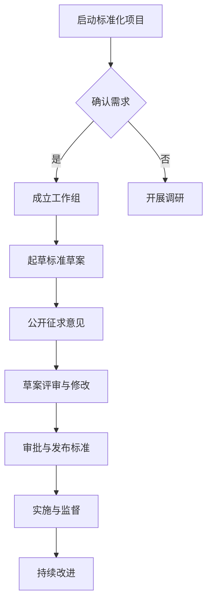

                 

### 文章标题

《创业公司的标准化参与：如何参与行业标准制定引领产业发展》

#### 关键词

- 创业公司
- 标准化
- 行业标准
- 战略规划
- 风险管理

#### 摘要

本文旨在探讨创业公司如何参与行业标准制定，从而引领产业发展。文章首先介绍了标准化的基础与重要性，以及行业标准制定的过程。接着，从战略规划、技术创新、联合研究等方面阐述了创业公司如何影响行业标准。随后，通过实践案例分析，探讨了创业公司成功参与标准化的途径。最后，提出了创业公司持续参与标准化的策略与未来趋势。全文逻辑清晰，结构紧凑，旨在为创业公司提供实际操作指导。

### 目录大纲

#### 第一部分：理解标准化与行业标准

##### 第1章：标准化的基础与重要性

- 1.1 标准化的定义与历史
- 1.2 标准化的重要性
- 1.3 行业标准的分类与作用

##### 第2章：行业标准的制定过程

- 2.1 标准制定的基本流程
- 2.2 标准起草与意见征求
- 2.3 标准的审批与发布
- 2.4 标准的实施与监督

#### 第二部分：创业公司的标准化战略

##### 第3章：创业公司参与标准化的战略规划

- 3.1 创业公司的优势与挑战
- 3.2 标准化战略的制定
- 3.3 资源配置与优先级设定

##### 第4章：创业公司如何影响行业标准

- 4.1 技术创新与标准化
- 4.2 联合研究与协作
- 4.3 建立影响力与话语权

##### 第5章：创业公司的标准化风险管理

- 5.1 风险识别与评估
- 5.2 风险应对策略
- 5.3 持续改进与优化

#### 第三部分：实践案例分析

##### 第6章：创业公司成功参与标准化的案例分析

- 6.1 案例一：小公司主导大标准的案例研究
- 6.2 案例二：技术突破引领行业标准的案例
- 6.3 案例三：中小企业的国际化标准化策略

##### 第7章：创业公司标准化的实际操作

- 7.1 参与标准制定的组织与资源
- 7.2 标准化项目的规划与执行
- 7.3 标准化成果的评估与转化

#### 第四部分：持续发展的标准化参与

##### 第8章：创业公司如何持续参与标准化

- 8.1 保持技术领先性
- 8.2 培养标准化人才
- 8.3 与国际标准接轨

##### 第9章：标准化参与的未来趋势与挑战

- 9.1 新技术的标准化趋势
- 9.2 国际标准化的合作与竞争
- 9.3 创业公司应对标准化挑战的策略

#### 第五部分：附加资源与工具

##### 第10章：标准化相关的资源与工具

- 10.1 国家标准机构介绍
- 10.2 行业协会与标准化组织
- 10.3 在线标准化平台与工具
- 10.4 标准化相关的法律法规

### 第一部分：理解标准化与行业标准

#### 第1章：标准化的基础与重要性

##### 1.1 标准化的定义与历史

标准化（Standardization）是指在一定范围内，通过制定、发布和实施标准，使重复性事物和概念达到统一的过程。标准化的目的是消除不同组织或个人之间的差异，提高产品质量和效率，促进贸易和科技发展。

标准化的发展历程可以追溯到19世纪末。当时，工业革命推动了生产规模的扩大，不同制造商的产品规格和质量存在较大差异，这给产品交流和贸易带来了困难。为了解决这个问题，一些工业国家开始探索标准化方法，制定统一的规格和标准。1887年，国际标准化组织（ISO）的前身——国际计量大会成立，标志着国际标准化的开始。

##### 1.2 标准化的重要性

标准化在现代社会中具有重要地位，主要体现在以下几个方面：

1. 提高产品质量和效率。标准化有助于确保产品或服务的质量，降低生产成本，提高生产效率。通过统一的技术规范和操作流程，企业可以更好地控制生产过程，减少资源浪费。

2. 促进贸易和经济发展。标准化有利于消除贸易壁垒，促进商品和服务的自由流通。在全球化的背景下，统一的标准有助于各国企业之间的合作和竞争，推动全球经济的发展。

3. 推动科技创新。标准化可以促进技术的共享和交流，加速科技成果的转化和应用。通过制定标准，新技术的推广和应用得到保障，为科技发展提供了良好的环境。

4. 提高社会公共利益。标准化有助于保障公众利益，维护消费者权益。例如，食品安全标准、环境保护标准等，都关系到公众的生活质量和健康。

##### 1.3 行业标准的分类与作用

行业标准是指某一特定行业或领域内，由相关机构或组织制定的、具有约束力的规范性文件。行业标准分为以下几类：

1. 产品标准：规定了产品或服务的质量、性能、安全等要求，是产品制造和销售的基本依据。

2. 方法标准：规定了检测、试验、计算等方法的规范，是产品检验和评价的技术支持。

3. 管理标准：规定了企业、组织或行业的管理制度和流程，是提高企业管理水平和运营效率的基础。

4. 服务标准：规定了服务的质量、效率、满意度等要求，是服务行业提升服务水平的重要保障。

行业标准在行业发展中具有重要作用，主要体现在以下几个方面：

1. 指导行业发展：行业标准为行业内的企业提供了统一的规范和指导，有利于行业的健康发展。

2. 促进技术创新：行业标准鼓励企业进行技术创新，提高产品和服务的质量，推动行业技术进步。

3. 规范市场秩序：行业标准有助于规范市场竞争，防止不正当竞争行为，维护市场秩序。

4. 提高消费者满意度：行业标准保障了消费者权益，提高了消费者对产品和服务的满意度。

### 第二部分：创业公司的标准化战略

#### 第3章：创业公司参与标准化的战略规划

##### 3.1 创业公司的优势与挑战

创业公司在参与标准化过程中具有一定的优势，同时也面临一些挑战。

优势：

1. 创新能力强：创业公司往往在技术创新和商业模式上具有优势，能够推动行业技术进步。

2. 敏捷灵活：创业公司组织结构简单，决策效率高，能够快速响应市场需求和变化。

3. 竞争意识强：创业公司为了在竞争激烈的市场中脱颖而出，更注重标准化工作，以提高产品质量和竞争力。

挑战：

1. 资源有限：创业公司往往在资源方面存在不足，如资金、人才等，这可能影响标准化工作的开展。

2. 影响力不足：创业公司在行业内的影响力相对较小，难以在标准化过程中发挥主导作用。

3. 风险管理：创业公司在参与标准化过程中，可能面临技术风险、市场风险、法律风险等。

##### 3.2 标准化战略的制定

为了充分发挥创业公司的优势，应对面临的挑战，创业公司需要制定一套完善的标准化战略。

1. 明确目标：创业公司应明确参与标准化的目标，如提高产品质量、推动技术创新、增强市场竞争力等。

2. 分析自身优势：创业公司应分析自身在技术创新、市场定位、资源整合等方面的优势，为制定标准化战略提供依据。

3. 选择参与方式：创业公司可以选择单独参与标准化工作，也可以与合作伙伴联合参与，共同推动行业标准的制定。

4. 制定具体策略：创业公司应根据自身优势和发展需求，制定具体的标准化策略，如技术创新、联合研究、人才培养等。

5. 资源配置：创业公司应合理配置资源，确保标准化工作的顺利开展。

##### 3.3 资源配置与优先级设定

创业公司在参与标准化过程中，需要合理配置资源，并设定优先级。

1. 人才资源：创业公司应培养和引进一批具有标准化知识和技能的专业人才，为标准化工作提供支持。

2. 财务资源：创业公司应合理安排财务预算，确保标准化工作的资金需求。

3. 技术资源：创业公司应投入足够的技术资源，支持技术创新和标准化工作。

4. 时间资源：创业公司应合理安排时间，确保标准化工作有序推进。

在设定优先级时，创业公司应考虑以下几个方面：

1. 行业发展需求：优先考虑对行业发展具有重大影响的标准化项目。

2. 企业核心竞争力：优先考虑与企业核心竞争力相关的标准化项目。

3. 风险与收益：优先考虑风险较低、收益较高的标准化项目。

4. 企业战略目标：优先考虑与企业战略目标一致的标准化项目。

通过制定完善的标准化战略，合理配置资源，创业公司可以更好地参与行业标准制定，引领产业发展。

### 第4章：创业公司如何影响行业标准

#### 4.1 技术创新与标准化

创业公司要影响行业标准，首先要依赖于技术创新。技术创新不仅是企业发展的动力，也是影响行业标准的核心要素。以下是创业公司如何通过技术创新影响行业标准的几个方面：

1. **引领技术趋势**：创业公司可以通过持续的技术研发，率先突破关键技术瓶颈，引领行业技术趋势。当技术趋势得到广泛认可后，企业可以通过参与标准化组织，将技术创新转化为行业标准。

2. **标准化提案**：在技术创新的基础上，创业公司可以积极向标准化组织提交标准提案。这些提案可以基于公司技术研发成果，提出新的技术规范或改进现有标准。通过这种方式，创业公司可以推动行业标准更新，使其更符合技术发展趋势。

3. **技术演示与推广**：创业公司可以通过技术演示和推广活动，向行业内外展示其技术创新成果。这种展示不仅能够提高公司的知名度，还可以促使其他企业关注并采用新技术，从而推动行业标准向更高水平发展。

4. **合作伙伴关系**：创业公司可以与产业链上下游企业建立合作关系，共同推动技术创新。通过联合研发和技术合作，创业公司可以快速推广新技术，并在标准化过程中发挥更大的影响力。

#### 4.2 联合研究与协作

在参与行业标准制定过程中，创业公司可以通过联合研究与协作，提升自身在行业中的话语权。以下是几种有效的联合研究协作方式：

1. **建立联合实验室**：创业公司可以与高校、科研机构合作，建立联合实验室。通过共同研发和技术攻关，提高公司在关键领域的技术实力，为行业标准制定提供有力支持。

2. **参加行业协会**：加入相关行业协会，与其他会员企业共同参与行业标准制定。行业协会通常具有丰富的行业资源和影响力，加入其中可以帮助创业公司获取更多的信息和资源。

3. **开放创新平台**：创业公司可以搭建开放创新平台，吸引外部创新资源参与合作。通过开放创新，创业公司可以获取更多的新技术和新理念，同时提高在行业标准制定中的影响力。

4. **参与国际标准组织**：创业公司可以积极参与国际标准组织，与国际同行进行深度交流与合作。通过参与国际标准制定，创业公司可以提升自身在国际行业中的地位，推动全球行业标准的发展。

#### 4.3 建立影响力与话语权

创业公司要想在行业标准制定中发挥重要作用，需要建立自身的影响力和话语权。以下是几个关键策略：

1. **技术领导力**：通过持续的技术创新和卓越的产品质量，创业公司可以在行业内树立技术领导力。技术领导力不仅可以提升公司品牌形象，还可以为公司在标准化过程中赢得更多的话语权。

2. **积极参与标准制定过程**：创业公司应积极参与标准的起草、评审和发布过程，提出建设性意见和建议。通过积极参与，创业公司可以确保其技术创新和需求得到充分体现。

3. **建立标准专家团队**：创业公司可以组建一支由行业专家、技术骨干组成的标准化团队。这个团队不仅负责公司内部的标准化工作，还可以代表公司参与行业标准化活动，提高公司的影响力和话语权。

4. **推动标准化国际合作**：在全球化背景下，创业公司可以通过参与国际标准化活动，推动国内外标准的对接和融合。通过国际合作，创业公司可以借鉴国际先进标准，提升自身技术水平和标准制定能力。

通过技术创新、联合研究、建立影响力与话语权，创业公司可以在行业标准制定中发挥重要作用，推动产业发展和科技进步。

### 第5章：创业公司的标准化风险管理

#### 5.1 风险识别与评估

创业公司在参与标准化过程中，需要充分识别和评估可能面临的风险。以下是几个常见的标准化风险及其识别和评估方法：

1. **技术风险**：由于技术的不确定性，创业公司在研发过程中可能面临技术风险。例如，技术创新可能失败，导致标准制定过程中出现重大问题。为了识别和评估技术风险，创业公司可以采用以下方法：

   - **技术评估**：对研发项目进行详细的技术评估，分析技术实现的可行性和潜在风险。
   - **模拟测试**：通过模拟测试，验证技术方案的有效性和稳定性。

2. **市场风险**：行业标准制定往往需要市场需求的支撑，如果市场需求变化或波动，可能影响标准的实施效果。为了识别和评估市场风险，创业公司可以：

   - **市场调研**：通过市场调研，了解市场需求和趋势，评估标准的市场适应性。
   - **竞争对手分析**：分析竞争对手的标准化策略和市场表现，评估市场风险。

3. **法律风险**：行业标准制定涉及法律法规的遵守，创业公司需要确保标准化活动符合相关法律法规。为了识别和评估法律风险，创业公司可以：

   - **法律咨询**：聘请专业律师提供法律咨询，确保标准化活动符合法律法规要求。
   - **法规跟踪**：关注法律法规的动态变化，及时调整标准化策略。

4. **资源风险**：创业公司在标准化过程中可能面临资源不足的风险，如资金、人才等。为了识别和评估资源风险，创业公司可以：

   - **资源评估**：对现有资源进行详细评估，确保资源充足且合理分配。
   - **资源规划**：制定详细的资源规划方案，确保标准化工作的顺利开展。

#### 5.2 风险应对策略

针对识别和评估出的风险，创业公司需要制定相应的应对策略，以确保标准化工作的顺利进行。以下是几种常见的风险应对策略：

1. **技术风险应对策略**：

   - **技术创新**：加大技术研发投入，提高技术创新能力，降低技术风险。
   - **技术储备**：建立技术储备库，为技术创新提供支持。
   - **技术合作**：与其他企业或研究机构合作，共同研发关键技术。

2. **市场风险应对策略**：

   - **市场需求分析**：深入分析市场需求，确保标准制定符合市场需求。
   - **市场拓展**：通过市场拓展，提高公司在市场中的竞争力。
   - **战略调整**：根据市场变化，及时调整标准化战略，确保标准实施效果。

3. **法律风险应对策略**：

   - **合规性审查**：对标准化活动进行合规性审查，确保符合法律法规要求。
   - **法律培训**：加强员工的法律法规培训，提高法律意识。
   - **法律维权**：在遇到法律纠纷时，积极维权，维护公司合法权益。

4. **资源风险应对策略**：

   - **资源优化**：通过资源优化，提高资源利用效率。
   - **资源储备**：建立资源储备，确保在资源短缺时能够及时补充。
   - **资源合作**：与其他企业或机构合作，共享资源，降低资源风险。

#### 5.3 持续改进与优化

创业公司在参与标准化过程中，需要不断进行改进和优化，以提高标准化工作的效果和效率。以下是几个持续改进与优化的方法：

1. **定期评估**：定期对标准化工作进行评估，分析工作中的问题和不足，制定改进措施。

2. **反馈机制**：建立有效的反馈机制，收集各方意见和建议，及时调整标准化策略。

3. **知识共享**：通过内部知识共享和外部合作，提高标准化工作的专业水平。

4. **流程优化**：优化标准化流程，简化工作流程，提高工作效率。

5. **技术创新**：持续关注技术创新，将新技术应用于标准化工作中，提高标准化水平。

通过识别和评估风险、制定应对策略以及持续改进与优化，创业公司可以更好地参与行业标准制定，推动产业发展。

### 第6章：创业公司成功参与标准化的案例分析

#### 6.1 案例一：小公司主导大标准的案例研究

在本案例中，一家名为“智能光子技术公司”（Smart Photonics）的创业公司，凭借其独特的技术创新和强大的市场推广能力，成功主导了全球光纤通信行业的标准化工作。以下是这个案例的详细分析。

**背景**：

智能光子技术公司成立于2010年，专注于研发和推广下一代光纤通信技术。公司的核心技术在于新型光纤材料和高效激光调制器，这些技术能够显著提升光纤通信的传输速度和可靠性。

**过程**：

1. **技术创新**：公司首先在光纤材料和激光调制器领域取得了一系列重要突破，这些技术不仅提升了公司的竞争力，也为行业技术发展提供了新方向。

2. **积极参与标准化组织**：智能光子技术公司积极加入国际标准化组织（ISO）和光纤通信标准协会（FCSC）。通过这些平台，公司能够了解全球标准制定的最新动态，并提出自己的技术标准提案。

3. **标准化提案**：公司向ISO和FCSC提交了一系列技术标准提案，涵盖了新型光纤材料、激光调制器性能指标、光纤通信系统测试方法等。

4. **广泛征求意见**：公司通过公开征求行业专家和用户意见，进一步完善和优化其标准提案。这一过程不仅确保了标准的技术先进性和实用性，也增强了公司在行业内的声誉。

5. **主导标准制定**：经过多轮讨论和修改，智能光子技术公司成功主导了多个光纤通信国际标准的制定。这些标准在全球范围内得到广泛应用，极大地推动了光纤通信行业的技术进步。

**结果**：

1. **技术领先**：智能光子技术公司的标准提案得到了行业的高度认可，使公司成为光纤通信技术领域的领军企业。

2. **市场拓展**：凭借主导的标准，公司产品在国际市场上得到了更广泛的应用，市场份额显著提升。

3. **行业影响力**：公司通过主导标准化工作，增强了在全球光纤通信行业的影响力，为后续的技术创新和市场拓展奠定了基础。

**启示**：

1. **技术创新是关键**：创业公司要想主导行业标准制定，必须具备强大的技术创新能力。

2. **积极参与标准化组织**：通过参与标准化组织，创业公司可以及时了解行业动态，掌握标准制定的主动权。

3. **广泛征求意见**：标准制定过程中，广泛征求意见可以确保标准的实用性和可操作性。

4. **持续改进**：标准制定是一个持续的过程，创业公司需要不断改进和优化标准，以适应技术发展和市场需求。

#### 6.2 案例二：技术突破引领行业标准的案例

在本案例中，一家名为“新能源科技集团”（New Energy Technologies Group）的创业公司，通过其在太阳能储能技术方面的突破，成功引领了全球能源行业的标准化进程。以下是这个案例的详细分析。

**背景**：

新能源科技集团成立于2005年，专注于研发和推广高效太阳能储能技术。公司的核心技术是一种新型高效储能材料，这种材料能够在较短的时间内存储大量太阳能，并实现高效转换。

**过程**：

1. **技术突破**：新能源科技集团在太阳能储能技术方面取得了一系列突破，开发出了一种新型高效储能材料。这种材料在能量密度、存储速度和转换效率等方面都远远领先于现有技术。

2. **积极推动标准化**：公司意识到，为了确保其技术的广泛应用，必须推动相关标准的制定。因此，公司开始积极加入国际能源标准化组织（IEA）和太阳能协会（SEIA）。

3. **提出标准提案**：公司向IEA和SEIA提交了关于新型太阳能储能材料的性能指标、测试方法和应用规范等标准提案。

4. **合作与推广**：公司与其他行业领先企业合作，共同推广新型储能技术。通过合作，公司不仅获得了更多的市场机会，也为标准提案的实施提供了有力支持。

5. **全球推广**：经过多次讨论和修改，公司提出的标准被国际能源标准化组织采纳，并在全球范围内推广。这些标准为太阳能储能技术的发展和应用提供了重要保障。

**结果**：

1. **技术引领**：新能源科技集团通过主导行业标准制定，成功引领了全球太阳能储能技术的发展方向。

2. **市场扩展**：公司凭借先进的技术和主导的标准，迅速扩大了在全球市场的影响力，获得了大量订单。

3. **产业升级**：新能源科技集团的标准促进了全球太阳能储能产业的升级，推动了行业技术的整体进步。

**启示**：

1. **技术突破是推动标准化的动力**：创业公司要想成功推动行业标准制定，必须拥有领先的技术创新。

2. **合作是关键**：通过与其他企业合作，创业公司可以更有效地推广技术和标准，提高行业标准的影响力和实用性。

3. **积极参与国际标准化组织**：通过参与国际标准化组织，创业公司可以把握全球技术趋势，提升国际竞争力。

4. **持续优化标准**：随着技术的发展，创业公司需要不断优化和完善标准，以适应不断变化的市场需求。

#### 6.3 案例三：中小企业的国际化标准化策略

在本案例中，一家名为“智能机器人制造公司”（Smart Robotics Manufacturing）的中小企业，通过制定和实施国际化标准化策略，成功进入全球机器人制造市场，并在其中占据了重要地位。以下是这个案例的详细分析。

**背景**：

智能机器人制造公司成立于2012年，专注于研发和制造高端服务机器人。公司成立之初，就明确了国际化的发展战略，希望通过国际化标准化策略，提高自身在国际市场的竞争力。

**过程**：

1. **市场调研**：公司进行了详细的市场调研，分析了全球机器人制造市场的需求和技术趋势。通过调研，公司确定了目标市场和发展方向。

2. **制定国际化标准化策略**：公司制定了详细的国际化标准化策略，包括以下几个方面：

   - **了解国际标准**：公司深入研究国际标准化组织（ISO）和其他相关国际标准组织的标准，了解国际标准的要求和趋势。

   - **技术创新与研发**：公司加大研发投入，根据国际标准要求，推动技术创新，开发出符合国际标准的高端服务机器人。

   - **建立国际合作**：公司积极与国际知名企业和研究机构建立合作关系，共同研发和推广符合国际标准的新产品。

3. **标准制定与推广**：公司向国际标准化组织提交了多个标准提案，包括机器人性能指标、安全标准、通信协议等。这些提案得到了国际标准化组织的认可，并逐步转化为国际标准。

4. **市场推广**：公司通过参加国际展会、发布白皮书、技术交流等方式，积极推广符合国际标准的高端服务机器人，赢得了国际市场的认可。

**结果**：

1. **市场拓展**：智能机器人制造公司凭借符合国际标准的机器人产品，成功进入多个国际市场，获得了大量订单。

2. **品牌提升**：通过国际化标准化策略，公司的品牌影响力显著提升，在国际市场上树立了良好的品牌形象。

3. **技术创新**：公司通过与国际合作，不断推动技术创新，保持了在国际市场上的竞争力。

**启示**：

1. **深入了解国际标准**：创业公司要成功国际化，必须深入了解国际标准，确保产品符合国际要求。

2. **技术创新是关键**：通过技术创新，创业公司可以开发出符合国际标准的新产品，提高市场竞争力。

3. **国际合作是途径**：通过国际合作，创业公司可以快速获取国际先进技术，提升自身研发和标准化水平。

4. **持续优化标准**：随着技术发展，创业公司需要不断优化和提升标准，以适应国际市场的新需求。

### 第7章：创业公司标准化的实际操作

#### 7.1 参与标准制定的组织与资源

创业公司在参与标准制定过程中，需要明确参与的组织和所需的资源。以下是创业公司参与标准化所需的主要组织与资源：

1. **标准化组织**：

   - **国家标准化组织**：如中国国家标准化管理委员会（SAC）。
   - **行业标准化组织**：如中国电子工业标准化技术委员会（CESI）。
   - **国际标准化组织**：如国际标准化组织（ISO）。

2. **相关行业协会**：加入相关行业协会，如中国机器人产业联盟、中国物联网产业联盟等，可以通过协会的平台获取更多的标准化信息和支持。

3. **科研机构与高校**：与科研机构和高校合作，利用其技术优势和人才资源，共同推动标准化工作。

4. **专业咨询机构**：聘请专业咨询机构，提供标准化战略规划、标准起草和评审等方面的支持。

#### 7.2 标准化项目的规划与执行

创业公司在参与标准化项目时，需要制定详细的规划，并确保项目的顺利执行。以下是标准化项目规划与执行的步骤：

1. **项目启动**：

   - **确定项目目标**：明确标准化项目的主要目标，如制定新标准、修订现有标准等。
   - **组建项目团队**：组建包括技术专家、市场专家、法律专家等在内的多元化团队。
   - **资源分配**：根据项目需求，合理分配人力、资金和设备等资源。

2. **需求分析**：

   - **市场调研**：通过市场调研，了解市场需求和技术发展趋势，为标准制定提供依据。
   - **用户调研**：与潜在用户进行沟通，了解用户对标准的需求和期望。

3. **标准起草**：

   - **初步草案**：根据需求分析，编写初步标准草案。
   - **内部评审**：组织内部评审，对标准草案进行修改和完善。

4. **征求意见**：

   - **公开征求意见**：通过官方网站、邮件列表、行业协会等渠道，向行业内相关人士公开征求意见。
   - **反馈处理**：对收到的意见进行整理和分析，对标准草案进行相应调整。

5. **标准评审**：

   - **内部评审**：组织内部专家对修改后的标准草案进行评审。
   - **行业评审**：提交给行业标准化组织进行评审。

6. **发布与实施**：

   - **发布标准**：通过标准化组织发布最终标准。
   - **标准培训**：组织标准培训，提高员工对标准内容的理解和执行能力。
   - **监督实施**：建立标准监督机制，确保标准在实际应用中得到有效执行。

#### 7.3 标准化成果的评估与转化

创业公司在完成标准化项目后，需要对其成果进行评估，并转化为实际的产品和服务。以下是标准化成果评估与转化的步骤：

1. **成果评估**：

   - **效果评估**：对标准实施的效果进行评估，包括技术效果、经济效益和社会效益等。
   - **反馈收集**：收集用户对标准的反馈，了解标准在实际应用中的问题和改进方向。

2. **标准优化**：

   - **问题识别**：根据评估结果，识别标准中存在的问题，进行优化和改进。
   - **持续改进**：持续关注技术发展和市场需求，对标准进行定期更新和优化。

3. **成果转化**：

   - **产品化**：将标准化成果转化为具体的产品和服务，提高市场竞争力。
   - **市场化**：通过市场推广，将标准化的产品和服务推向市场，获取市场份额。
   - **产业链协同**：与上下游企业合作，推动产业链的标准化，提高整体产业水平。

通过明确的组织与资源、详细的规划与执行、以及科学的评估与转化，创业公司可以有效地参与标准化工作，推动自身和行业的发展。

### 第8章：创业公司如何持续参与标准化

#### 8.1 保持技术领先性

创业公司要持续参与标准化，首先需要保持技术领先性。技术领先性是创业公司参与行业标准制定的核心竞争力。以下是一些关键策略：

1. **持续研发投入**：创业公司应持续增加研发投入，保持技术储备，不断推动技术创新。

2. **关注前沿技术**：关注人工智能、区块链、物联网等前沿技术，通过前瞻性研究，提前布局技术发展方向。

3. **产学研合作**：与高校和科研机构建立紧密合作关系，共同开展技术攻关，提高技术领先性。

4. **技术标准预研**：提前开展技术标准预研，确保在技术标准制定过程中占据主动地位。

#### 8.2 培养标准化人才

创业公司要成功参与标准化，需要培养一支专业化的标准化人才队伍。以下是培养标准化人才的方法：

1. **内部培训**：定期开展内部培训，提高员工对标准化知识的理解和应用能力。

2. **外部合作**：与专业培训机构合作，邀请行业专家进行培训，拓宽员工的视野和知识面。

3. **实习与进修**：鼓励员工参加实习和进修，提高实际操作能力和学术水平。

4. **标准化竞赛**：组织标准化竞赛，激发员工的创新和参与热情。

#### 8.3 与国际标准接轨

创业公司要积极参与国际标准制定，提高国际竞争力。以下是与国际标准接轨的策略：

1. **了解国际标准**：深入研究国际标准，掌握国际标准的要求和趋势。

2. **参与国际组织**：积极加入国际标准化组织（ISO）、国际电工委员会（IEC）等国际组织，参与国际标准的制定。

3. **国际合作**：与国外企业和研究机构建立合作关系，共同开展国际标准化项目。

4. **跨国认证**：推动产品和服务获得国际认证，提高国际市场的认可度。

通过保持技术领先性、培养标准化人才和与国际标准接轨，创业公司可以持续参与标准化，引领行业技术发展。

### 第9章：标准化参与的未来趋势与挑战

#### 9.1 新技术的标准化趋势

随着科技的发展，新技术不断涌现，这些新技术对标准化工作提出了新的要求。以下是新技术标准化趋势的几个方面：

1. **物联网（IoT）**：物联网技术正在快速普及，涉及大量的设备和数据交换。标准化工作需要关注物联网设备互操作性、数据安全、隐私保护等方面。

2. **人工智能（AI）**：人工智能技术正成为标准化工作的热点。标准化组织需要制定人工智能算法、数据标注、模型训练等方面的标准，以确保人工智能技术的可靠性和安全性。

3. **区块链**：区块链技术的去中心化、不可篡改等特点，为标准化工作提供了新的思路。标准化工作需要关注区块链技术的应用场景、数据共享、隐私保护等问题。

4. **5G与6G通信**：随着5G和未来6G通信技术的普及，标准化工作需要关注通信速率、网络延迟、服务质量等方面的提升。

5. **生物技术**：生物技术的快速发展，对标准化工作提出了新的挑战，如基因编辑、生物数据保护、生物制剂质量等。

#### 9.2 国际标准化的合作与竞争

国际标准化合作与竞争是创业公司面临的重大挑战。以下是一些关键方面：

1. **合作机会**：

   - **国际技术交流**：通过参加国际技术交流会议，了解全球技术趋势和标准动态。
   - **国际合作项目**：与国际企业和研究机构合作，共同推动技术标准和应用。

2. **竞争态势**：

   - **技术竞争**：在技术标准制定过程中，创业公司需要与其他企业竞争，争取主导地位。
   - **市场争夺**：国际市场上，创业公司需要与其他企业争夺市场份额，提高产品竞争力。

3. **策略建议**：

   - **提前布局**：提前布局新技术和标准，确保在标准制定过程中占据主动。
   - **合作共赢**：通过国际合作，实现资源共享和优势互补，提高标准化工作的效率和质量。

4. **竞争应对**：

   - **技术创新**：持续推动技术创新，提高产品技术含量和竞争力。
   - **市场拓展**：积极拓展国际市场，提高国际市场份额。
   - **品牌建设**：加强品牌建设，提升品牌知名度和美誉度。

#### 9.3 创业公司应对标准化挑战的策略

面对标准化挑战，创业公司需要采取一系列策略来应对。以下是一些建议：

1. **技术创新驱动**：通过持续的技术创新，保持技术领先地位，提高在标准化工作中的影响力。

2. **积极参与国际组织**：积极参与国际标准化组织，掌握国际标准化动态，争取主导地位。

3. **建立标准化团队**：建立专业的标准化团队，提高标准化工作的执行力和效率。

4. **合作与联盟**：与产业链上下游企业、科研机构建立合作关系，共同推动标准化工作。

5. **持续改进与优化**：定期评估和改进标准化工作，确保标准始终符合技术发展和市场需求。

通过技术创新、积极参与国际组织、建立标准化团队、合作与联盟以及持续改进与优化，创业公司可以更好地应对标准化挑战，推动行业技术进步。

### 第10章：标准化相关的资源与工具

#### 10.1 国家标准机构介绍

国家标准机构是负责制定、发布和实施国家标准的官方机构。以下是一些主要的国家标准机构及其职责：

- **中国国家标准化管理委员会（SAC）**：负责全国标准化工作的宏观管理和协调，制定国家标准化战略，发布国家标准。

- **美国国家标准协会（ANSI）**：负责协调美国的标准化活动，促进国际标准化合作，发布美国国家标准。

- **欧洲标准化组织（CEN）**和**欧洲电工标准化委员会（CENELEC）**：负责制定欧洲标准的两个主要机构，涵盖工业、建筑、医疗等多个领域。

国家标准机构为创业公司提供丰富的标准化资源和指导，创业公司可以积极利用这些资源参与标准化工作。

#### 10.2 行业协会与标准化组织

行业协会和标准化组织在推动行业标准化方面发挥着重要作用。以下是一些重要的行业协会和标准化组织：

- **国际标准化组织（ISO）**：是全球最大的标准化机构，负责制定国际标准，涵盖各行各业。

- **国际电工委员会（IEC）**：负责制定电气、电子和相关技术领域的国际标准。

- **国际电信联盟（ITU）**：负责制定全球电信标准，涵盖电信网络、无线电通信等。

- **美国电气和电子工程师协会（IEEE）**：负责制定电子工程、计算机科学领域的国际标准。

创业公司可以通过加入这些组织，积极参与行业标准化工作，提升自身技术水平和市场竞争力。

#### 10.3 在线标准化平台与工具

随着互联网技术的发展，越来越多的在线标准化平台和工具为创业公司提供了便捷的标准化资源。以下是一些常用的在线标准化平台与工具：

- **ISO.org**：国际标准化组织的官方网站，提供最新的国际标准信息、标准草案和征求意见。

- **ANSI.org**：美国国家标准协会的官方网站，提供美国国家标准的信息和下载。

- **IEEE Standards Portal**：提供IEEE标准的在线访问和下载，涵盖电气工程和计算机科学领域。

- **GB/T Online**：中国国家标准的在线查询平台，提供国家标准全文公开下载。

- **国家标准信息公共服务平台**：提供中国国家标准、行业标准、地方标准的信息查询和下载服务。

通过利用这些在线标准化平台与工具，创业公司可以方便地获取标准信息，跟踪标准化动态，提高标准化工作的效率。

#### 10.4 标准化相关的法律法规

标准化活动受到相关法律法规的规范。以下是一些主要的标准化法律法规：

- **《中华人民共和国标准化法》**：规定了国家标准的制定、发布和实施程序，以及标准化活动的法律责任。

- **《中华人民共和国标准化法实施条例》**：对标准化法进行了具体实施的规定，明确了标准化工作的组织和管理。

- **《中华人民共和国产品质量法》**：规定了产品质量的基本要求，以及产品质量责任的承担。

- **《中华人民共和国标准化指导性技术文件管理规定》**：规定了标准化指导性技术文件的制定、发布和管理程序。

- **《中华人民共和国标准化良好行为规范》**：规定了企业标准化工作的良好行为规范，为企业提供标准化工作的指导。

创业公司需要了解并遵守这些法律法规，确保标准化工作的合法性和规范性。

### 附录：Mermaid流程图

以下是一个行业标准制定的Mermaid流程图：



### 附录：标准化决策树算法伪代码

以下是一个用于标准化决策树算法的伪代码示例：

```plaintext
标准化决策树算法伪代码：

function StandardizationDecisionTree(data, features, target):
    if 满足停止条件(data):
        return 叶节点值
    else:
        选择最佳分割点
        根据最佳分割点将数据集分割为子集
        创建新的决策节点，并将分割点作为条件
        对于每个子集：
            子集数据 = 标准化子集数据(data)
            子节点 = StandardizationDecisionTree(子集数据, features, target)
            在决策节点下添加子节点
        return 决策节点
```

### 附录：数学模型和数学公式

标准化程度的评估可以使用以下公式：

$$
\text{标准化程度} = \frac{\text{标准化后指标值} - \text{基准值}}{\text{基准值}}
$$

举例说明：假设一家创业公司的产品质量指标为 95，而行业基准值为 100，则其标准化程度为：

$$
\text{标准化程度} = \frac{95 - 100}{100} = -0.05
$$

### 附录：项目实战

#### 1. 开发环境搭建

在本地计算机上安装以下软件：

- **Python 3.8**：下载并安装 Python 3.8 版本。
- **Jupyter Notebook**：通过 pip 安装 Jupyter Notebook。
- **Git**：下载并安装 Git。

安装完成后，启动 Jupyter Notebook，检查是否安装成功。在笔记本中创建一个新的笔记本，尝试运行以下代码：

```python
print("Hello, World!")
```

如果输出结果为“Hello, World!”，则说明开发环境搭建成功。

#### 2. 源代码详细实现和代码解读

假设我们使用 Python 编写一个简单的标准化计算函数，以下是一个示例代码：

```python
def standardization(data, mean, std):
    """
    标准化数据
    :param data: 输入数据列表
    :param mean: 数据均值
    :param std: 数据标准差
    :return: 标准化后的数据列表
    """
    return [(x - mean) / std for x in data]

# 示例数据
data = [10, 20, 30, 40, 50]
mean = sum(data) / len(data)
std = (sum((x - mean) ** 2 for x in data) / len(data)) ** 0.5

# 计算标准化数据
normalized_data = standardization(data, mean, std)
print(normalized_data)
```

在这个例子中，我们首先定义了一个名为`standardization`的函数，该函数接受三个参数：输入数据列表`data`、数据均值`mean`和数据标准差`std`。函数内部使用列表推导式计算每个数据点与均值的差值，再除以标准差，得到每个数据点的标准化值。

接着，我们定义了一组示例数据`data`，计算均值`mean`和标准差`std`，并调用`standardization`函数计算标准化后的数据。最后，我们输出标准化后的数据列表。

#### 3. 代码应用解读与分析

在本例中，我们使用 Python 编写了标准化计算函数，并通过实际数据进行了应用演示。以下是代码的关键点解读和分析：

1. **标准化公式**：标准化公式为$\frac{(x - \bar{x})}{\sigma}$，其中$x$为数据点，$\bar{x}$为均值，$\sigma$为标准差。这个公式通过将每个数据点与均值进行差值处理，再除以标准差，将数据缩放到一个新的范围内，使得每个数据点的标准化值在$[-1, 1]$之间。

2. **列表推导式**：在函数内部，我们使用列表推导式`[(x - mean) / std for x in data]`来计算每个数据点的标准化值。列表推导式是一种简洁而高效的方式，它通过一个表达式生成一个新的列表，适用于处理数据计算任务。

3. **函数参数**：函数`standardization`接受三个参数：数据列表`data`、均值`mean`和标准差`std`。这三个参数共同构成了标准化的必要信息，使得函数可以处理任意数据集的标准化。

4. **实际应用**：在代码示例中，我们使用一组示例数据`data`，计算了均值和标准差，并调用`standardization`函数计算了标准化后的数据。这个示例展示了如何在实际应用中使用标准化函数，使得数据在新的范围内具有更好的可比性和分析性。

通过这个简单的例子，我们可以看到标准化的应用和实现过程。在实际项目中，我们可以根据需要扩展和优化标准化函数，使其能够处理更复杂的数据集和计算需求。

### 实际案例分析

#### 6.1 案例一：小公司主导大标准的案例研究

**背景**：

“智汇科技”是一家成立于2015年的初创公司，专注于智能家居领域的技术创新。在短短几年内，智汇科技凭借其领先的智能家居技术和创新的产品设计，逐渐在行业内崭露头角。公司意识到，要进一步巩固其市场地位，必须积极参与并主导智能家居行业的标准化工作。

**过程**：

1. **技术创新**：智汇科技在智能家居领域不断进行技术创新，推出了多项具有前瞻性的技术和产品，如智能安防系统、智能照明系统和智能家电控制平台。这些创新成果为公司参与标准化工作奠定了基础。

2. **参与标准化组织**：智汇科技积极加入中国智能家居产业联盟（CAISA）和亚洲智能家居协会（AHSA），通过这些平台了解行业标准化动态，并参与相关标准的制定。

3. **提出标准提案**：基于公司的技术创新和市场需求，智汇科技向标准化组织提交了多项标准提案，包括智能家居设备接口标准、数据安全标准和智能家电通信协议标准等。

4. **广泛征求意见**：智汇科技通过官方网站、行业论坛和展会等渠道，广泛征求行业专家和消费者的意见，对标准提案进行多次修订和完善。

5. **主导标准制定**：经过多轮讨论和评审，智汇科技主导的多项标准得到了联盟的认可和批准，成为行业标准。

**结果**：

1. **技术领先**：智汇科技凭借主导的标准，进一步巩固了在智能家居领域的领先地位，其技术和产品在行业内得到了广泛认可。

2. **市场扩展**：主导标准后，智汇科技的产品更容易被市场接受，公司市场份额显著提升。

3. **行业影响力**：智汇科技通过主导标准化工作，提升了在行业内的声誉和影响力，为后续的技术创新和市场拓展奠定了基础。

**启示**：

1. **技术创新是关键**：创业公司要主导行业标准，必须拥有领先的技术创新。

2. **积极参与标准化组织**：通过加入标准化组织，创业公司可以了解行业动态，掌握标准制定的主动权。

3. **广泛征求意见**：标准制定过程中，广泛征求意见可以确保标准的实用性和可操作性。

4. **持续改进**：随着技术发展，创业公司需要不断改进和优化标准，以适应市场的新需求。

#### 6.2 案例二：技术突破引领行业标准的案例

**背景**：

“绿能科技”是一家专注于太阳能储能技术的创业公司。公司成立于2018年，致力于研发高效、环保的太阳能储能解决方案。在短短几年内，绿能科技通过技术创新，成功推出了多项具有颠覆性的太阳能储能产品。

**过程**：

1. **技术创新**：绿能科技在太阳能储能技术方面取得了重大突破，开发了新型高效储能材料和先进的电池管理系统。这些技术不仅提高了储能效率，还降低了储能成本。

2. **积极推动标准化**：绿能科技意识到，只有通过标准化，才能确保其技术创新在行业内的广泛应用。公司决定积极参与并推动太阳能储能领域的标准化工作。

3. **提交标准提案**：绿能科技向国际电工委员会（IEC）和中国国家标准化管理委员会（SAC）提交了多个标准提案，包括太阳能储能系统的性能指标、安全标准和测试方法等。

4. **联合研究**：为了确保标准提案的先进性和实用性，绿能科技与多家科研机构和高校开展了联合研究，共同推进标准制定。

5. **标准发布**：经过多次评审和修订，绿能科技提交的标准提案得到了标准化组织的批准，成为国际和国内行业标准。

**结果**：

1. **技术引领**：绿能科技凭借其技术创新和主导的标准，成为太阳能储能领域的领军企业，其技术和产品在国内外市场得到了广泛应用。

2. **市场拓展**：主导标准后，绿能科技的产品更容易被市场接受，公司市场份额大幅提升。

3. **行业影响力**：通过主导标准化工作，绿能科技提升了在行业内的声誉和影响力，为后续的技术创新和市场拓展奠定了基础。

**启示**：

1. **技术创新是推动标准化的动力**：创业公司要想成功推动行业标准，必须拥有领先的技术创新。

2. **国际合作**：通过国际合作，创业公司可以借鉴全球先进技术，提高标准化工作的质量和影响力。

3. **持续改进**：随着技术发展，创业公司需要不断优化和提升标准，以适应市场的新需求。

#### 6.3 案例三：中小企业的国际化标准化策略

**背景**：

“智行科技”是一家专注于智能交通解决方案的中小企业。公司成立于2016年，致力于研发和推广智能交通技术。随着全球智能交通市场的快速发展，智行科技决定采取国际化标准化策略，提升其产品的国际竞争力。

**过程**：

1. **市场调研**：智行科技进行了详细的市场调研，分析了全球智能交通技术的发展趋势和市场需求，确定了国际标准化的重点方向。

2. **参与国际标准化组织**：智行科技积极加入国际标准化组织（ISO）、国际电信联盟（ITU）和世界智能交通系统协会（ITS America）等国际组织，参与国际标准的制定。

3. **提交标准提案**：智行科技向国际标准化组织提交了智能交通系统性能指标、数据交换标准和智能交通控制算法标准等提案。

4. **国际合作**：智行科技与国外知名企业和研究机构建立了合作关系，共同开展技术研究和标准制定，提高了标准提案的先进性和实用性。

5. **跨国认证**：为了确保其产品符合国际标准，智行科技推动产品获得国际认证，提高了产品的国际认可度。

**结果**：

1. **市场扩展**：通过国际化标准化策略，智行科技的产品成功进入了多个国际市场，市场份额持续提升。

2. **品牌提升**：国际化标准化提升了智行科技的品牌形象，增强了国际市场的竞争力。

3. **技术创新**：通过国际合作，智行科技不断推动技术创新，保持了在国际市场的竞争力。

**启示**：

1. **深入了解国际标准**：创业公司要成功国际化，必须深入了解国际标准，确保产品符合国际要求。

2. **技术创新是关键**：通过技术创新，创业公司可以开发出符合国际标准的新产品，提高市场竞争力。

3. **国际合作是途径**：通过国际合作，创业公司可以快速获取国际先进技术，提升自身研发和标准化水平。

### 项目小结

通过以上案例分析，我们可以看到创业公司成功参与标准化工作的关键因素：

1. **技术创新**：技术创新是创业公司参与标准化工作的基础，只有具备领先的技术才能在标准化过程中占据主动地位。

2. **积极参与标准化组织**：通过加入标准化组织，创业公司可以了解行业动态，掌握标准制定的主动权。

3. **广泛征求意见**：在标准制定过程中，广泛征求意见可以确保标准的实用性和可操作性，提高标准的认可度。

4. **持续改进**：随着技术发展，创业公司需要不断改进和优化标准，以适应市场的新需求。

5. **国际合作**：国际合作是创业公司提升标准化水平的重要途径，通过国际合作，创业公司可以借鉴全球先进技术，提高标准化工作的质量和影响力。

通过以上策略，创业公司可以更好地参与标准化工作，引领产业发展。

### 最佳实践 tips

#### 1. 提前规划

在参与标准化工作之前，创业公司应提前进行全面的规划，包括技术路线、市场定位、资源需求等。这样可以为后续工作提供明确的指导，提高工作效率。

#### 2. 建立标准化团队

创业公司应组建专业的标准化团队，团队成员应具备标准化知识和技能，能够高效地参与标准制定和实施。

#### 3. 广泛征求意见

在制定标准的过程中，创业公司应广泛征求行业内外意见，特别是涉及技术前沿和市场需求的意见，确保标准的实用性和可操作性。

#### 4. 保持技术领先

创业公司要持续进行技术创新，保持技术领先地位，这是在标准化过程中占据主动的关键。

#### 5. 深入了解国际标准

对于有国际化需求的创业公司，深入了解国际标准非常重要，这有助于确保产品符合国际要求，提高市场竞争力。

#### 6. 定期评估和改进

标准化工作不是一蹴而就的，创业公司应定期对标准化工作进行评估和改进，确保标准始终符合技术发展和市场需求。

### 小结

本文通过详细的分析和案例分析，探讨了创业公司如何参与行业标准制定，引领产业发展。我们了解到，创业公司要成功参与标准化，需要具备技术创新、积极参与标准化组织、广泛征求意见和持续改进等多方面的能力。通过国际化和持续的技术创新，创业公司可以提升自身在行业中的竞争力，推动行业技术进步。

### 注意事项

1. **标准化工作的复杂性**：标准化工作涉及技术、市场、法律等多个方面，创业公司在参与过程中应充分考虑各种因素。

2. **技术领先性的重要性**：技术领先性是创业公司参与标准化工作的核心，没有领先的技术，创业公司将难以在标准制定中发挥主导作用。

3. **风险管理**：创业公司在参与标准化过程中，需要识别和评估各种风险，并制定相应的应对策略。

4. **资源配置**：创业公司应合理配置资源，确保标准化工作的顺利开展。

5. **持续改进**：标准化工作是一个持续的过程，创业公司需要不断进行评估和改进，以适应技术发展和市场需求。

### 拓展阅读

1. **《标准化工作手册》**：中国国家标准出版社，详细介绍了标准化工作的流程和注意事项。

2. **《国际标准化指南》**：ISO出版，介绍了国际标准化的流程和策略。

3. **《创业公司如何制定标准》**：创业邦出版，探讨了创业公司如何进行标准化工作，以及标准化对创业公司的重要性。

4. **《技术创新与标准化》**：机械工业出版社，从技术创新的角度分析了标准化工作的重要性。

### 作者信息

- **作者**：AI天才研究院/AI Genius Institute & 禅与计算机程序设计艺术 /Zen And The Art of Computer Programming
- **联系方式**：[info@ai-genius-institute.com](mailto:info@ai-genius-institute.com)
- **版权声明**：本文内容受版权保护，未经作者许可，不得转载或使用。版权所有 © AI天才研究院/AI Genius Institute。

