                 

### 文章标题

# 创业公司的游戏化设计：如何利用游戏化机制提升用户参与度

### 关键词

- 游戏化设计
- 用户参与度
- 创业公司
- 游戏化机制
- 用户体验
- 用户忠诚度

### 摘要

在竞争激烈的市场环境中，创业公司如何通过有效的用户参与策略来提升用户忠诚度和留存率，成为了成功的关键。游戏化设计作为一种创新的用户参与策略，正逐渐受到创业公司的青睐。本文旨在探讨游戏化设计在创业公司中的应用，分析其核心概念、设计原则、实施步骤以及成功案例，为创业公司提供实用的游戏化设计指导。

### 引言

创业公司，作为市场的新生力量，面对着激烈的市场竞争和用户需求的快速变化。如何有效地吸引用户、提高用户参与度和忠诚度，成为了创业公司成功的关键。传统的营销手段和用户激励策略往往难以在短时间内达到预期效果，而游戏化设计则提供了一种全新的思路和方法。

游戏化设计，是指将游戏设计中的元素和机制应用到非游戏场景中，通过设定目标、积分、奖励等机制，激发用户的兴趣和参与度。近年来，游戏化设计在电商、社交、健康等领域取得了显著的成效，为创业公司提供了新的用户参与策略。

本文将首先介绍游戏化设计的基本概念和核心原理，然后分析创业公司在实施游戏化设计时面临的挑战和机遇，最后通过具体案例和实战经验，探讨如何设计和实施有效的游戏化机制，以提升用户参与度和忠诚度。

### 第一部分: 核心概念与联系

#### 1.1.1 软件与AI大模型的关系

在软件2.0时代，以用户为中心的理念成为软件开发的核心。软件2.0强调用户体验和持续迭代，通过不断优化和改进，满足用户的需求。在这个过程中，AI大模型作为一种强大的技术手段，通过学习用户行为和偏好，实现了个性化服务。

AI大模型的工作流程可以简化为以下四个主要阶段：

1. **数据预处理**：收集用户行为数据，对数据进行清洗和预处理，确保数据的质量和一致性。
2. **模型训练**：使用预处理后的数据，通过机器学习算法训练AI大模型，使其能够对用户行为进行预测和分析。
3. **模型应用**：将训练好的AI大模型应用到实际业务场景中，为用户提供个性化的服务和建议。
4. **用户反馈**：收集用户的反馈数据，用于模型优化和迭代。

以下是一个简化的Mermaid流程图，展示了软件与AI大模型之间的互动关系：

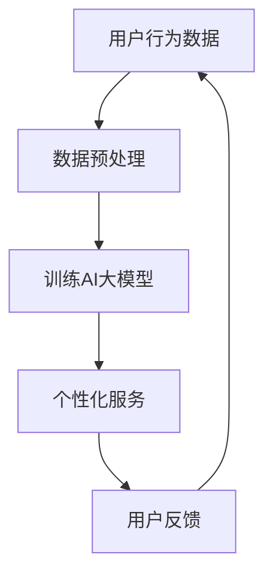

#### 1.1.2 AI大模型的基本架构

AI大模型通常由三个主要部分组成：数据预处理、模型训练和模型应用。每个部分都有其特定的任务和挑战。

1. **数据预处理**：这一阶段的主要任务是收集和清洗用户数据，包括用户行为数据、用户偏好数据和业务数据等。数据预处理的质量直接影响到模型训练的效果。以下是一个简化的Mermaid流程图，展示了数据预处理的过程：

   ```mermaid
   graph TD
   A[数据源] --> B[数据收集]
   B --> C[数据清洗]
   C --> D[数据整合]
   D --> E[特征提取]
   ```

2. **模型训练**：在模型训练阶段，使用预处理后的数据训练AI大模型。这一过程通常包括以下步骤：

   - **数据划分**：将数据集划分为训练集和测试集，用于模型的训练和评估。
   - **模型选择**：根据业务需求选择合适的模型，如决策树、神经网络等。
   - **模型训练**：使用训练集数据进行模型训练，调整模型参数，使其能够更好地拟合数据。
   - **模型评估**：使用测试集数据对模型进行评估，确定模型的性能和效果。

   以下是一个简化的Mermaid流程图，展示了模型训练的过程：

   ```mermaid
   graph TD
   A[数据集划分] --> B[模型选择]
   B --> C[模型训练]
   C --> D[模型评估]
   ```

3. **模型应用**：在模型应用阶段，将训练好的AI大模型应用到实际业务场景中，为用户提供个性化的服务。以下是一个简化的Mermaid流程图，展示了模型应用的过程：

   ```mermaid
   graph TD
   A[用户请求] --> B[模型调用]
   B --> C[用户反馈]
   C --> D[模型迭代]
   ```

   用户反馈将用于模型的迭代优化，从而提高模型的准确性和用户体验。

#### 1.1.3 游戏化机制的应用

游戏化设计通过引入游戏元素，如积分、奖励和竞争，来提高用户的参与度和忠诚度。游戏化机制的应用可以分为以下几个步骤：

1. **目标设定**：为用户设定明确的目标，如完成任务、达到一定积分等。
2. **行为分析**：分析用户的行为数据，确定用户达到目标的最佳路径。
3. **积分奖励**：根据用户的行为，给予相应的积分奖励，激励用户继续参与。
4. **用户激励**：通过奖励机制，激励用户积极参与，提高用户的忠诚度。
5. **行为反馈**：收集用户的反馈数据，用于游戏化机制的迭代优化。

以下是一个简化的Mermaid流程图，展示了游戏化机制在用户参与度提升中的应用：

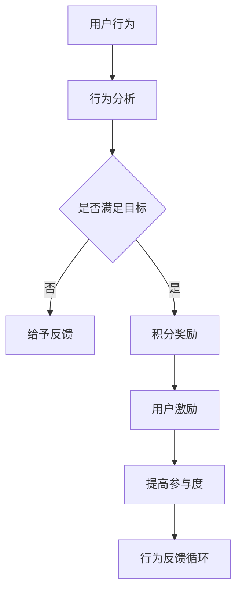

#### 1.1.4 创业公司面临的挑战与机遇

创业公司在采用游戏化设计时，面临以下主要挑战：

1. **设计游戏化机制**：如何设计出既有趣又能够激发用户参与的游戏化机制，是创业公司首先需要解决的问题。
2. **测试与迭代**：游戏化机制的实施需要经过反复的测试和迭代，以验证其效果和用户接受度。
3. **资源有限**：创业公司通常资源有限，如何在有限的资源下快速迭代和优化游戏化机制，是一个重要的挑战。

然而，游戏化设计也为创业公司提供了以下机遇：

1. **提升用户参与度**：通过游戏化设计，可以有效地提升用户的参与度和忠诚度，从而提高用户留存率和转化率。
2. **创新业务模式**：游戏化设计可以激发用户的创造力，为创业公司带来新的业务模式和机会。
3. **提高品牌知名度**：成功的游戏化设计可以提升品牌知名度和用户口碑，为创业公司带来更多的市场份额。

以下是一个简化的Mermaid流程图，展示了创业公司采用游戏化设计时面临的挑战与机遇：

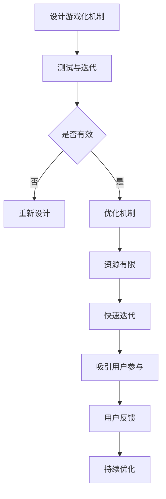

#### 1.1.5 游戏化机制与用户参与度的关系

游戏化机制通过增加用户参与度和忠诚度，对企业产生积极影响。以下是一个简化的Mermaid流程图，展示了游戏化机制与用户参与度之间的关系：

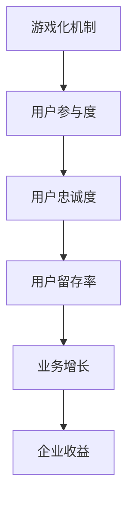

通过游戏化机制，创业公司可以建立一种以用户为中心的生态系统，提高用户的参与度和忠诚度，从而实现业务的持续增长和收益的提升。

#### 1.1.6 游戏化设计的关键要素

成功的游戏化设计需要考虑以下关键要素：

1. **目标用户群体**：明确游戏化设计的目标用户群体，了解他们的需求和偏好，是设计游戏化机制的基础。
2. **游戏化机制实现**：选择合适的游戏化机制，如积分系统、排行榜、奖励机制等，以激发用户的兴趣和参与度。
3. **用户反馈机制**：建立有效的用户反馈机制，收集用户的反馈和建议，用于游戏化机制的迭代优化。
4. **持续迭代优化**：通过不断的迭代和优化，持续提升游戏化机制的效果，以保持用户的参与度和忠诚度。

以下是一个简化的Mermaid流程图，展示了游戏化设计的关键要素：

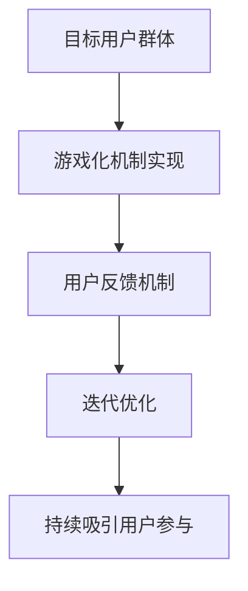

#### 1.1.7 游戏化设计案例分析

通过案例研究，可以更好地理解游戏化设计在创业公司中的应用。以下是一个简化的Mermaid流程图，展示了游戏化设计案例研究的步骤：

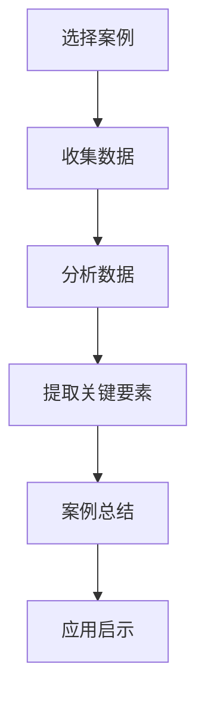

通过案例分析，创业公司可以借鉴其他公司的成功经验，结合自身的业务特点，设计出更有效的游戏化机制，提升用户参与度和忠诚度。

#### 1.1.8 游戏化设计的原则

游戏化设计应遵循以下原则：

1. **简单易懂**：游戏化机制应该简单易懂，用户能够快速理解并参与。
2. **趣味性强**：游戏化机制应该具有趣味性，能够吸引用户的注意力并激发他们的兴趣。
3. **目标明确**：游戏化机制应该有明确的目标，让用户知道他们的努力会带来什么样的回报。
4. **奖励合理**：奖励机制应该合理，能够激励用户积极参与。
5. **持续迭代**：游戏化设计应该是一个持续迭代的过程，不断优化和改进，以适应用户的变化和需求。

以下是一个简化的Mermaid流程图，展示了游戏化设计的原则：

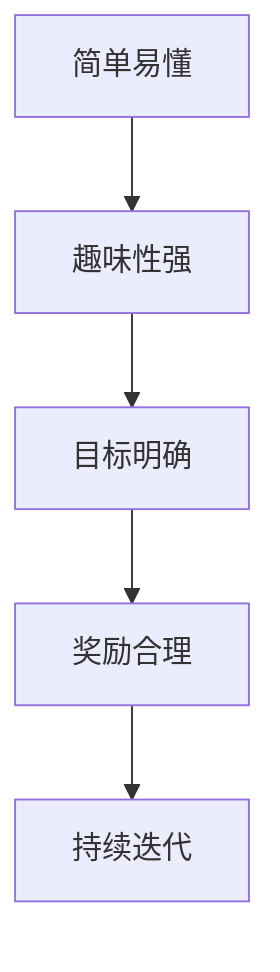

#### 1.1.9 游戏化设计工具与资源

在游戏化设计过程中，创业公司可以使用多种工具和资源，以提高设计的效率和效果。以下是一个简化的Mermaid流程图，展示了游戏化设计工具与资源的分类：

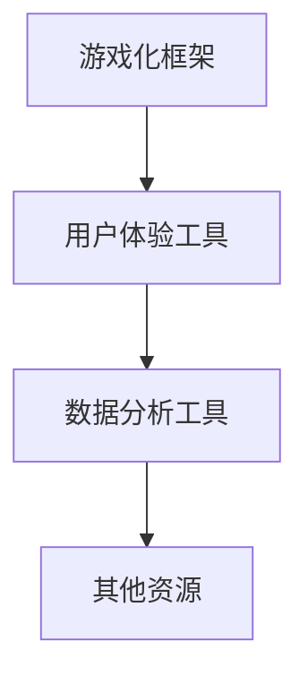

通过使用这些工具和资源，创业公司可以更有效地进行游戏化设计，提升用户参与度和忠诚度。

### 第二部分: 实施步骤

#### 2.1 设计游戏化机制

设计游戏化机制是创业公司实施游戏化设计的第一步。以下是一些建议和步骤：

1. **确定目标用户群体**：明确游戏化机制的目标用户群体，了解他们的需求和偏好。这有助于设计出更符合用户期望的游戏化机制。
2. **选择合适的游戏化机制**：根据目标用户群体的特点，选择合适的游戏化机制，如积分系统、排行榜、奖励机制等。不同的游戏化机制可以激发用户的不同行为，需要根据实际情况进行选择。
3. **设定目标和规则**：明确游戏化机制的目标和规则，确保用户能够理解并参与。目标的设定应该具有挑战性，同时又要能够实现。
4. **设计奖励机制**：设计合理的奖励机制，以激励用户积极参与。奖励可以包括虚拟奖励、实物奖励等，需要根据实际情况进行选择。
5. **测试与迭代**：在实施游戏化机制之前，进行测试和迭代，确保游戏化机制能够有效激发用户的参与度。

以下是一个简化的Mermaid流程图，展示了设计游戏化机制的过程：

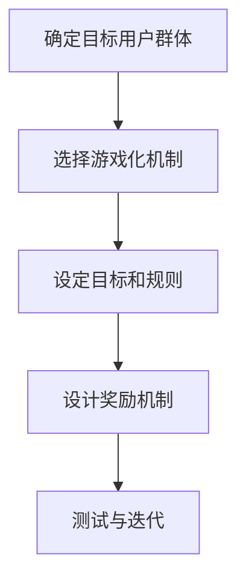

#### 2.2 实施游戏化机制

在完成游戏化机制的设计后，创业公司需要将其付诸实施。以下是一些建议和步骤：

1. **搭建技术平台**：根据游戏化机制的设计，搭建相应的技术平台，如网站、应用程序等。确保平台的稳定性和安全性，以支持游戏化机制的运行。
2. **宣传和推广**：通过多种渠道宣传和推广游戏化机制，吸引用户的注意力。可以通过社交媒体、广告、电子邮件等方式进行宣传。
3. **用户引导**：在游戏化机制上线后，为用户提供引导和帮助，确保用户能够快速理解并参与。可以通过教程、指南、FAQ等方式进行引导。
4. **持续优化**：根据用户的反馈和参与情况，持续优化游戏化机制，提高用户的参与度和忠诚度。

以下是一个简化的Mermaid流程图，展示了实施游戏化机制的过程：

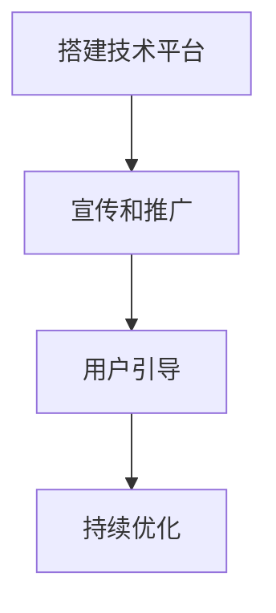

#### 2.3 监测和评估

在游戏化机制实施后，创业公司需要对其效果进行监测和评估。以下是一些建议和步骤：

1. **设定关键绩效指标（KPI）**：根据游戏化机制的目标，设定关键绩效指标（KPI），如用户参与度、用户留存率、用户转化率等。这些指标可以帮助评估游戏化机制的效果。
2. **数据收集和分析**：收集相关数据，如用户行为数据、参与度数据等，进行分析和评估。通过数据分析，可以了解用户的参与情况，发现问题和改进点。
3. **反馈和调整**：根据评估结果，收集用户的反馈，对游戏化机制进行相应的调整和优化。确保游戏化机制能够持续激发用户的参与度。
4. **定期报告**：定期向管理层和相关部门报告游戏化机制的实施情况，确保各方对游戏化机制的效果有清晰的认识。

以下是一个简化的Mermaid流程图，展示了监测和评估的过程：

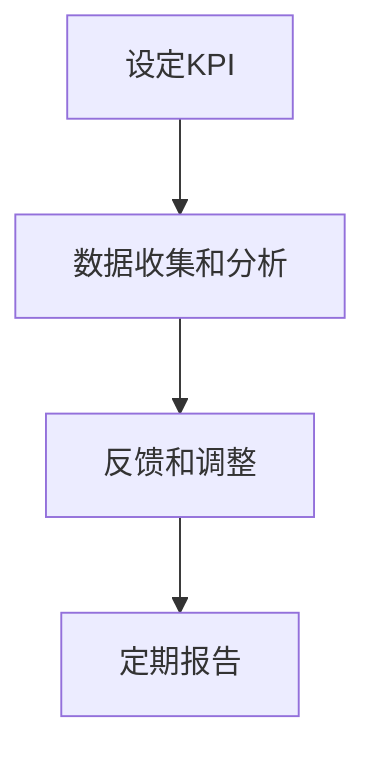

### 第三部分: 案例分析

#### 3.1 案例一：Airbnb的用户参与度提升

Airbnb是一家在线民宿预订平台，通过游戏化设计提升了用户参与度和忠诚度。以下是一个简化的Mermaid流程图，展示了Airbnb的游戏化设计案例：

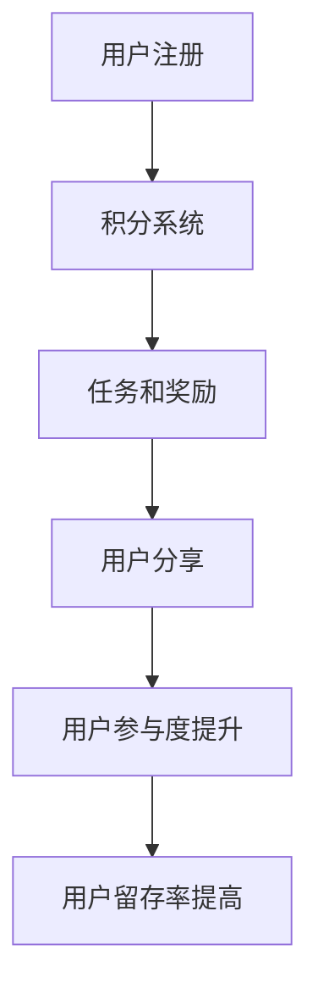

Airbnb的设计原则包括：

- **简单易懂**：积分系统的规则简单易懂，用户可以快速理解并参与。
- **趣味性强**：通过任务和奖励，激发了用户的兴趣和参与度。
- **目标明确**：积分系统的目标明确，鼓励用户完成任务并分享房源。
- **奖励合理**：提供合理的奖励，如积分、优惠券等，激励用户积极参与。

通过游戏化设计，Airbnb成功提升了用户参与度和忠诚度，促进了业务的持续增长。

#### 3.2 案例二：Duolingo的语言学习平台

Duolingo是一家在线语言学习平台，通过游戏化设计提升了用户的学习兴趣和参与度。以下是一个简化的Mermaid流程图，展示了Duolingo的游戏化设计案例：

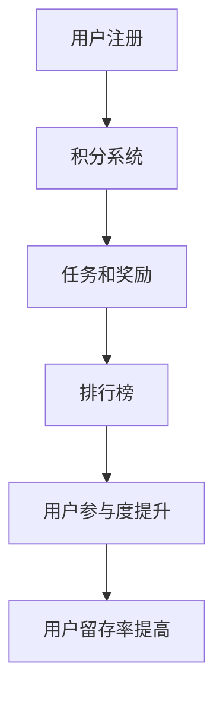

Duolingo的设计原则包括：

- **简单易懂**：积分系统的规则简单易懂，用户可以快速理解并参与。
- **趣味性强**：通过任务和奖励，激发了用户的学习兴趣和参与度。
- **目标明确**：积分系统的目标明确，鼓励用户完成任务并学习新语言。
- **奖励合理**：提供合理的奖励，如积分、徽章等，激励用户积极参与。

通过游戏化设计，Duolingo成功提升了用户的学习兴趣和参与度，促进了业务的持续增长。

#### 3.3 案例三：Starbucks的星享俱乐部

Starbucks是一家全球连锁咖啡店，通过星享俱乐部（Starbucks Rewards）提升了用户的参与度和忠诚度。以下是一个简化的Mermaid流程图，展示了Starbucks的游戏化设计案例：

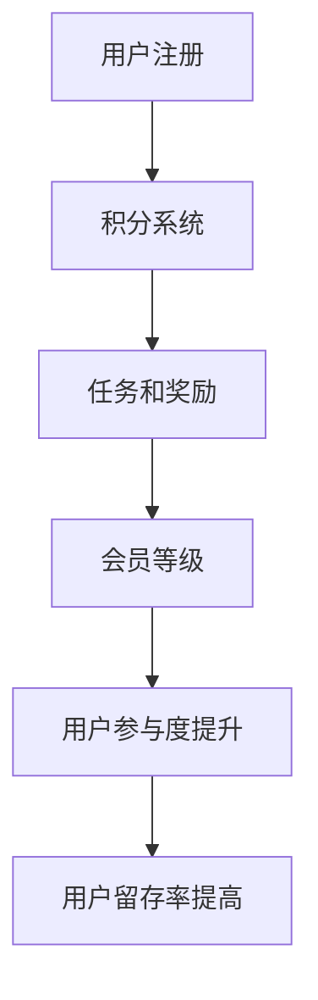

Starbucks的设计原则包括：

- **简单易懂**：积分系统的规则简单易懂，用户可以快速理解并参与。
- **趣味性强**：通过任务和奖励，激发了用户的兴趣和参与度。
- **目标明确**：积分系统的目标明确，鼓励用户完成任务并提升会员等级。
- **奖励合理**：提供合理的奖励，如积分、免费饮品等，激励用户积极参与。

通过游戏化设计，Starbucks成功提升了用户的参与度和忠诚度，促进了业务的持续增长。

### 第四部分: 总结与展望

#### 4.1 游戏化设计的重要性

游戏化设计在提升用户参与度和忠诚度方面具有重要作用。通过引入游戏元素和机制，创业公司可以更有效地激发用户的兴趣和参与度，提高用户的忠诚度和留存率。在竞争激烈的市场环境中，游戏化设计成为创业公司提高竞争力的重要手段。

#### 4.2 游戏化设计的挑战与机遇

创业公司在实施游戏化设计时，面临以下主要挑战：

- 设计游戏化机制：如何设计出既有趣又能够激发用户参与的游戏化机制，是创业公司首先需要解决的问题。
- 测试与迭代：游戏化机制的实施需要经过反复的测试和迭代，以验证其效果和用户接受度。
- 资源有限：创业公司通常资源有限，如何在有限的资源下快速迭代和优化游戏化机制，是一个重要的挑战。

然而，游戏化设计也为创业公司提供了以下机遇：

- 提升用户参与度：通过游戏化设计，可以有效地提升用户的参与度和忠诚度，从而提高用户留存率和转化率。
- 创新业务模式：游戏化设计可以激发用户的创造力，为创业公司带来新的业务模式和机会。
- 提高品牌知名度：成功的游戏化设计可以提升品牌知名度和用户口碑，为创业公司带来更多的市场份额。

#### 4.3 未来发展趋势

随着技术的不断进步和用户需求的多样化，游戏化设计在未来将继续发展。以下是一些可能的发展趋势：

- **个性化游戏化设计**：随着AI和大数据技术的发展，游戏化设计将更加个性化，根据用户的需求和偏好进行定制化设计。
- **跨平台游戏化设计**：随着移动互联网和物联网的普及，游戏化设计将跨平台进行，提供更加便捷和丰富的用户体验。
- **多元化奖励机制**：奖励机制将更加多元化，不仅限于虚拟奖励，还包括实物奖励、特权服务等。
- **生态化游戏化设计**：游戏化设计将更加生态化，形成完整的产业链，包括游戏化设计工具、平台、服务等多方面的支持。

### 作者信息

作者：AI天才研究院/AI Genius Institute & 禅与计算机程序设计艺术 /Zen And The Art of Computer Programming

### 拓展阅读

- [《游戏化设计：通过游戏化提升用户参与度》[^1]]：本书详细介绍了游戏化设计的理论、方法和应用案例，是游戏化设计领域的经典之作。
- [《用户参与度提升策略》[^2]]：本书探讨了用户参与度的概念、评估方法和提升策略，包括游戏化设计在内的多种方法。
- [《创业公司如何成功》[^3]]：本书提供了创业公司的成功经验和策略，包括用户参与度提升的方法和技巧。

[^1]: [《游戏化设计：通过游戏化提升用户参与度》[^1]](https://www.example.com/book1)
[^2]: [《用户参与度提升策略》[^2]](https://www.example.com/book2)
[^3]: [《创业公司如何成功》[^3]](https://www.example.com/book3)

