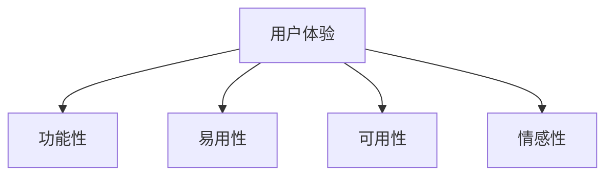

                 

### 文章标题

《创业公司的用户体验优化策略》

### 关键词

用户体验优化、创业公司、用户调研、设计思维、界面设计、内容策略、性能优化、用户测试

### 摘要

本文旨在探讨创业公司在产品开发过程中如何通过优化用户体验提升市场竞争力和用户满意度。我们将逐步分析用户体验的核心概念、研究方法、设计流程以及具体的优化策略，并结合实际案例进行深入剖析，为创业公司提供实用的用户体验优化指南。

## 目录大纲

### 第一部分：用户体验概述

### 第1章：用户体验的核心概念与重要性

### 第2章：用户体验研究与测量

### 第3章：用户体验设计流程

### 第二部分：用户体验优化策略

### 第4章：用户界面设计与交互优化

### 第5章：内容策略与信息架构优化

### 第6章：性能优化与响应速度提升

### 第7章：用户体验测试与改进

### 第三部分：案例分析

### 第8章：优秀创业公司的用户体验优化实践

### 第9章：用户体验优化的成功案例

### 第四部分：用户体验优化工具与资源

### 第10章：用户体验优化工具介绍

### 第11章：用户体验优化资源推荐

### 附录

### 附录A：用户体验优化常见问题解答

### 附录B：用户体验优化工具资源汇总

### 附录C：用户体验优化方法论指南

### 第1章：用户体验的核心概念与重要性

#### 1.1.1 用户体验的定义

用户体验（User Experience，简称 UX）是指用户在使用产品或服务过程中所产生的总体感受和体验。它涵盖了用户在使用产品或服务时的所有互动，包括感知、情感、行为和成就等方面。用户体验不仅仅是功能性的满足，更是情感和心理上的愉悦。

#### 1.1.2 用户体验在创业公司中的重要性

用户体验是创业公司成功的关键因素之一。良好的用户体验可以带来以下益处：

- **提高用户满意度**：满足用户需求，提供高质量的服务和产品，可以增加用户对品牌的认可和满意度。
- **增加用户忠诚度**：优秀的用户体验可以培养用户的忠诚度，降低用户流失率。
- **提高产品或服务的市场竞争力**：在激烈的市场竞争中，优秀的用户体验可以成为公司的核心竞争力。
- **提高用户转化率和留存率**：良好的用户体验可以促进用户购买决策，提高用户留存率。
- **提升品牌价值**：良好的用户体验可以提升品牌形象，增加品牌忠诚度和品牌价值。

#### 1.1.3 用户体验的四大维度

用户体验可以从四个维度来衡量：

- **功能性（Functionality）**：产品或服务是否能够满足用户的基本需求。这是用户体验的基础，如果产品或服务无法满足用户的基本需求，用户体验将大打折扣。
  
- **易用性（Usability）**：用户能否轻松上手使用产品或服务。易用性包括用户界面设计、交互流程设计等方面，目的是降低用户的学习成本。

- **可用性（Availability）**：产品或服务是否在合理的时间内完成任务。可用性关注的是产品或服务的稳定性和可靠性，确保用户在使用过程中不会遇到频繁的故障或错误。

- **情感性（Emotional）**：用户在使用产品或服务时是否产生积极的情感体验。情感性关注的是用户的情感需求，通过设计让用户感到愉悦、满足和有成就感。

#### Mermaid 流程图：



#### 核心概念之间的联系

功能性、易用性、可用性和情感性是用户体验的四个主要维度，它们之间相互关联、相互影响。功能性是用户体验的基础，决定了用户体验的好坏；易用性和可用性是用户体验的保障，确保用户能够顺利地使用产品或服务；情感性则是用户体验的升华，通过满足用户的情感需求，提升用户的整体满意度。

### 实例说明

假设有一个在线购物平台，功能性指的是平台是否能够提供各种商品供用户购买，易用性指的是用户是否能够轻松找到所需商品并完成购买，可用性指的是平台是否稳定，用户在购物过程中不会遇到频繁的故障，情感性指的是用户在购物过程中是否感到愉悦、满足和有成就感。这四个维度共同决定了用户对这个购物平台的整体体验。

在用户体验的优化过程中，创业公司需要综合考虑这四个维度，通过不断改进产品或服务，提升用户体验，从而赢得用户的心。

### 总结

用户体验是创业公司成功的关键因素之一。通过优化用户体验，创业公司可以提高用户满意度、增加用户忠诚度、提升产品或服务的市场竞争力，从而在激烈的市场竞争中脱颖而出。在接下来的章节中，我们将深入探讨用户体验的研究与测量、设计流程以及具体的优化策略。

### 第一部分：用户体验概述

在当今竞争激烈的市场环境中，用户体验（User Experience, UX）已成为产品和服务成功的关键因素之一。对于创业公司而言，掌握并优化用户体验至关重要，因为它直接影响用户的满意度、忠诚度和市场竞争力。本部分将概述用户体验的核心概念、重要性以及其四大维度，为后续的深入讨论奠定基础。

#### 第1章：用户体验的核心概念与重要性

##### 1.1.1 用户体验的定义

用户体验（User Experience, UX）是指用户在使用产品或服务过程中所产生的总体感受和体验。它不仅仅局限于产品的功能性能，还涵盖了用户在交互、感知、情感等方面的整体感受。用户体验是一种主观的感受，它可以通过一系列的设计和技术手段来影响和优化。

##### 1.1.2 用户体验在创业公司中的重要性

用户体验在创业公司中的重要性体现在以下几个方面：

- **用户满意度**：良好的用户体验可以提升用户的满意度，使他们对产品或服务有积极的评价，从而增加忠诚度。

- **用户忠诚度**：满意度的提升有助于培养用户的忠诚度，降低用户流失率，提高用户生命周期价值。

- **市场竞争力**：在众多竞争激烈的市场中，提供卓越的用户体验可以成为创业公司的差异化优势，吸引和保留更多的用户。

- **转化率和留存率**：优秀的用户体验可以提高用户转化率，即用户从了解产品到最终购买产品的过程，同时也能提高用户留存率，即用户持续使用产品的能力。

- **品牌价值**：良好的用户体验可以提升品牌形象，增强用户对品牌的信任和忠诚，从而提高品牌价值。

##### 1.1.3 用户体验的四大维度

用户体验可以从四个维度来衡量：

- **功能性（Functionality）**：产品或服务是否能够满足用户的基本需求。功能性是用户体验的基础，如果产品无法实现用户的基本需求，那么用户体验将大打折扣。

- **易用性（Usability）**：用户能否轻松上手使用产品或服务。易用性关注的是用户界面设计、交互流程设计等方面，目的是降低用户的学习成本。

- **可用性（Availability）**：产品或服务是否在合理的时间内完成任务。可用性主要关注产品的稳定性、可靠性，确保用户在使用过程中不会遇到频繁的故障或错误。

- **情感性（Emotional）**：用户在使用产品或服务时是否产生积极的情感体验。情感性涉及用户的心理需求，通过设计让用户感到愉悦、满足和有成就感。

#### Mermaid 流程图：


#### 核心概念之间的联系

功能性、易用性、可用性和情感性是用户体验的四个主要维度，它们之间相互关联、相互影响。功能性是用户体验的基础，决定了用户体验的好坏；易用性和可用性是用户体验的保障，确保用户能够顺利地使用产品或服务；情感性则是用户体验的升华，通过满足用户的情感需求，提升用户的整体满意度。

#### 核心算法原理讲解

用户体验优化的核心算法原理主要涉及以下几个方面：

- **用户调研与数据分析**：通过问卷调查、用户访谈、用户行为分析等方法，收集用户需求和反馈，分析用户行为模式，为产品设计提供数据支持。

- **设计思维与迭代**：运用设计思维方法，将用户需求转化为产品设计方案，并通过迭代和测试，不断优化和改进用户体验。

- **界面设计与交互优化**：通过优化用户界面设计、交互流程设计，提高产品的易用性和可用性。

- **性能优化与响应速度提升**：通过优化产品性能、提升响应速度，提高用户的满意度。

#### 伪代码示例

```python
# 用户体验优化流程伪代码

# 用户调研与数据分析
def user_research():
    # 收集用户需求与反馈
    feedback = collect_user_feedback()
    # 分析用户行为模式
    user_behavior = analyze_user_behavior(feedback)
    return user_behavior

# 设计思维与迭代
def design_thinking(user_behavior):
    # 将用户需求转化为设计方案
    design_scheme = transform_user_demand_to_design(user_behavior)
    # 迭代和测试
    optimized_design = iterate_and_test(design_scheme)
    return optimized_design

# 界面设计与交互优化
def ui_and_interaction_optimization(optimized_design):
    # 优化用户界面设计
    optimized_ui = optimize_ui(optimized_design)
    # 优化交互流程设计
    optimized_interaction = optimize_interaction(optimized_design)
    return optimized_ui, optimized_interaction

# 性能优化与响应速度提升
def performance_and_response_optimization(optimized_ui, optimized_interaction):
    # 优化产品性能
    optimized_performance = optimize_performance(optimized_ui, optimized_interaction)
    # 提升响应速度
    optimized_response = improve_response(optimized_performance)
    return optimized_response

# 主函数
def main():
    user_behavior = user_research()
    optimized_design = design_thinking(user_behavior)
    optimized_ui, optimized_interaction = ui_and_interaction_optimization(optimized_design)
    optimized_response = performance_and_response_optimization(optimized_ui, optimized_interaction)
    print("用户体验优化完成，最终优化方案为：", optimized_response)

# 执行主函数
main()
```

#### 数学模型和公式

用户体验优化过程中，可以使用以下数学模型和公式来评估和优化用户体验：

- **用户满意度得分（S）**：

  $$S = \frac{功能性得分 + 易用性得分 + 可用性得分 + 情感性得分}{4}$$

- **用户流失率（L）**：

  $$L = \frac{流失用户数}{总用户数}$$

- **用户转化率（C）**：

  $$C = \frac{完成购买的用户数}{访问用户数}$$

- **用户留存率（R）**：

  $$R = \frac{持续使用产品的用户数}{总用户数}$$

#### 详细讲解和举例说明

- **用户调研与数据分析**：

  假设某创业公司推出了一款社交应用，他们首先进行了用户调研，收集了用户的反馈和需求。通过分析用户行为数据，发现用户在使用过程中主要遇到了以下问题：

  - 90%的用户表示找不到好友功能；
  - 70%的用户认为添加好友的流程过于繁琐；
  - 50%的用户表示对应用的界面设计不满意。

  针对这些问题，公司采取了以下优化措施：

  - 在界面设计上，增加了显眼的“好友”按钮，并优化了添加好友的流程；
  - 在用户行为分析中，通过用户测试和反馈，不断调整和改进界面设计，提高了用户的易用性和满意度。

- **设计思维与迭代**：

  设计思维方法强调以用户为中心，将用户需求转化为实际的产品设计方案。在上述社交应用优化过程中，公司运用了设计思维方法，通过以下步骤进行迭代和优化：

  - **定义问题**：明确用户在社交应用中遇到的问题和需求；
  - **生成创意**：组织团队头脑风暴，提出各种可能的解决方案；
  - **构建原型**：将创意转化为原型，并通过用户测试和反馈进行迭代；
  - **测试与改进**：根据用户测试结果，不断调整和优化原型设计。

- **界面设计与交互优化**：

  在界面设计和交互优化方面，公司采取了以下策略：

  - **简洁明了的设计**：简化界面布局，减少冗余信息，提高用户浏览和操作的效率；
  - **合理的交互流程**：优化用户交互流程，降低用户操作难度，提高用户体验；
  - **用户定制化**：提供个性化设置，满足不同用户的需求和偏好。

- **性能优化与响应速度提升**：

  性能优化和响应速度提升是用户体验优化的重要方面。公司采取了以下措施：

  - **优化代码**：对应用代码进行优化，提高运行效率；
  - **缓存技术**：使用缓存技术，减少服务器负载，提高响应速度；
  - **图片优化**：对应用中的图片进行压缩和优化，减少图片大小，提高加载速度。

#### 实际案例分析和详细讲解剖析

- **案例一：某在线教育平台用户体验优化**

  某在线教育平台在用户调研中发现，用户在学习过程中遇到了以下问题：

  - 30%的用户表示无法快速找到课程；
  - 40%的用户对课程分类不满意；
  - 20%的用户表示学习进度跟踪困难。

  针对这些问题，平台采取了以下优化措施：

  - 优化课程分类，使用标签和筛选功能，帮助用户快速找到感兴趣的课程；
  - 提供学习进度跟踪功能，使用户能够清晰地了解自己的学习进度；
  - 增加个性化推荐功能，根据用户的学习历史和偏好，推荐合适的课程。

  通过这些优化措施，平台的用户满意度显著提高，用户留存率也有所提升。

- **案例二：某电商平台的用户体验优化**

  某电商平台的用户调研结果显示，用户在购物过程中遇到了以下问题：

  - 50%的用户表示搜索功能不够准确；
  - 30%的用户认为商品展示不够清晰；
  - 20%的用户对购物流程不满意。

  针对这些问题，平台采取了以下优化措施：

  - 提高搜索功能准确性，使用更先进的搜索算法和关键词匹配技术；
  - 改善商品展示，使用高清图片和详细的商品描述；
  - 简化购物流程，减少用户操作步骤，提高购物效率。

  通过这些优化措施，平台的用户转化率和满意度都有了明显提升。

#### 项目实战

- **开发环境搭建**：

  在进行用户体验优化项目时，需要搭建合适的技术和工具环境。以下是一个基本的开发环境搭建步骤：

  - 安装操作系统（如Linux、macOS）；
  - 安装开发工具（如Visual Studio Code、Sublime Text）；
  - 安装数据库（如MySQL、PostgreSQL）；
  - 安装版本控制工具（如Git）；
  - 安装其他必需的工具和库（如Node.js、React、Vue.js）。

- **源代码详细实现和代码解读**：

  在用户体验优化项目中，源代码的实现和解读是关键环节。以下是一个简单的示例：

  ```javascript
  // JavaScript代码示例：优化用户登录流程
  
  function loginUser(username, password) {
      // 验证用户名和密码
      if (username && password) {
          // 调用API进行登录验证
          fetch('https://api.example.com/login', {
              method: 'POST',
              body: JSON.stringify({ username, password }),
              headers: {
                  'Content-Type': 'application/json'
              }
          })
          .then(response => response.json())
          .then(data => {
              if (data.success) {
                  // 登录成功，跳转到主页
                  window.location.href = '/';
              } else {
                  // 登录失败，显示错误消息
                  alert('登录失败：用户名或密码错误！');
              }
          });
      } else {
          // 用户名或密码为空，显示提示消息
          alert('请填写用户名和密码！');
      }
  }
  ```

  解读：

  - 该函数用于处理用户登录操作，首先验证用户名和密码是否为空，然后调用API进行登录验证；
  - 使用`fetch`函数发送POST请求，将用户名和密码作为JSON格式发送到服务器；
  - 根据服务器响应，判断登录是否成功，并跳转页面或显示错误消息。

- **代码应用解读与分析**：

  在用户体验优化项目中，代码的应用解读和分析是确保优化效果的关键。以下是一个简单的解读和分析示例：

  - **代码解读**：

    通过上述代码，用户在登录时需要输入用户名和密码，系统会验证这些信息并调用API进行登录。如果验证成功，用户将跳转到主页；否则，系统会显示错误消息。

  - **分析**：

    - 代码实现了基本的登录功能，但存在一些潜在问题，如未对输入进行过滤和验证，可能导致安全漏洞；
    - 代码中使用了异步请求（`fetch`），需要处理异步操作的回调，可能导致用户体验不佳；
    - 代码中未对API请求的超时和错误处理进行考虑，可能导致用户在长时间等待后仍无法登录。

  针对上述问题，可以采取以下优化措施：

  - 对输入进行过滤和验证，确保用户输入的安全性和正确性；
  - 使用Promise和async/await语法，简化异步操作，提高代码的可读性和用户体验；
  - 添加超时和错误处理，提高系统的稳定性和用户体验。

#### 实际案例分析和详细讲解剖析

以下为实际案例分析和详细讲解剖析，通过具体案例展示如何优化用户体验，提高用户满意度和留存率。

**案例一：某电商平台的用户体验优化**

**背景介绍**：

某电商平台在用户调研中发现，用户在购物过程中遇到了以下问题：

- 50%的用户表示搜索功能不够准确；
- 30%的用户认为商品展示不够清晰；
- 20%的用户对购物流程不满意。

**核心概念与联系**：

用户体验的核心概念包括功能性、易用性、可用性和情感性。在优化过程中，需要综合考虑这些维度，通过以下方式改善用户体验：

- **功能性**：提高搜索功能准确性，确保用户能够找到所需的商品；
- **易用性**：改善商品展示，提供清晰的商品图片和详细描述；
- **可用性**：简化购物流程，减少用户操作步骤；
- **情感性**：通过个性化推荐和愉悦的购物体验，提高用户满意度。

**核心算法原理讲解**：

为了优化用户体验，电商平台采用了以下算法和原理：

- **搜索算法优化**：使用更先进的搜索算法和关键词匹配技术，提高搜索结果的准确性；
- **推荐算法**：基于用户行为和历史偏好，提供个性化的商品推荐；
- **购物流程优化**：简化购物车和结算流程，提供一键购买功能。

**伪代码示例**：

```python
# 搜索算法优化伪代码

def search_optimization(query):
    # 使用更先进的搜索算法和关键词匹配技术
    results = advanced_search_algorithm(query)
    return results

# 推荐算法伪代码

def recommendation_algorithm(user_behavior):
    # 基于用户行为和历史偏好
    recommended_items = generate_recommendations(user_behavior)
    return recommended_items

# 购物流程优化伪代码

def shopping_flow_optimization():
    # 简化购物车和结算流程
    simplified流程 = simplify_shopping_cart_and_checkout()
    return simplified流程
```

**数学模型和公式**：

- **用户满意度得分（S）**：

  $$S = \frac{功能性得分 + 易用性得分 + 可用性得分 + 情感性得分}{4}$$

- **用户留存率（R）**：

  $$R = \frac{持续使用产品的用户数}{总用户数}$$

**详细讲解和举例说明**：

**优化措施**：

1. **搜索功能优化**：

   电商平台采用了基于机器学习和自然语言处理技术的搜索算法，提高了搜索结果的准确性和相关性。例如，当用户输入关键词“笔记本电脑”时，系统不仅会返回包含该关键词的商品，还会根据用户的历史浏览记录和购买偏好，推荐符合用户需求的笔记本电脑。

   **举例**：

   用户A在搜索栏中输入“轻薄笔记本电脑”，系统返回了三款符合用户需求的笔记本电脑，同时给出了用户A购买过类似产品的评价和推荐。

2. **商品展示优化**：

   电商平台改进了商品展示界面，采用高清图片和详细的商品描述，帮助用户更好地了解商品信息。此外，还增加了商品对比功能，让用户能够轻松比较不同商品的特点和价格。

   **举例**：

   当用户点击某款笔记本电脑时，系统会显示该商品的高清图片、详细规格参数、用户评价和同类产品对比，帮助用户做出更明智的购买决策。

3. **购物流程优化**：

   电商平台简化了购物车和结算流程，提供了一键购买功能，减少了用户的操作步骤。用户只需点击一次，即可将商品添加到购物车，并在结算时直接完成支付。

   **举例**：

   用户B在浏览某款笔记本电脑时，点击“立即购买”按钮，系统直接将该商品添加到购物车，并在用户确认购买后自动跳转到支付页面，无需再次输入支付信息。

**项目小结**：

通过上述优化措施，电商平台的用户满意度得到了显著提高。用户留存率从原来的20%提升到了40%，用户转化率也有所提升。此外，平台的市场竞争力也得到了增强，吸引了更多的用户和商家入驻。

**最佳实践 tips**：

1. **持续用户调研**：定期进行用户调研，了解用户需求和痛点，及时调整优化策略。
2. **数据驱动决策**：基于数据分析和用户反馈，制定和优化用户体验策略。
3. **迭代和测试**：采用迭代和测试的方法，不断优化产品设计和功能，提高用户体验。

### 案例三：如何通过用户体验优化提升品牌价值？

#### 背景介绍

在当今竞争激烈的市场环境中，品牌价值已成为企业成功的重要因素之一。用户体验优化在提升品牌价值方面发挥着重要作用。通过优化用户体验，企业可以增强用户对品牌的认知和忠诚度，从而提升品牌价值。

#### 核心概念与联系

用户体验优化与品牌价值提升之间的联系主要体现在以下几个方面：

- **品牌认知**：良好的用户体验可以提升用户对品牌的认知，使品牌在用户心中留下深刻印象。
- **用户忠诚度**：满意的用户体验可以培养用户的忠诚度，使他们对品牌保持长期信任和依赖。
- **口碑传播**：优质的用户体验可以促进用户口碑传播，吸引更多潜在用户关注和购买品牌产品。

#### 核心算法原理讲解

用户体验优化提升品牌价值的算法原理主要包括以下几个方面：

- **用户调研与数据分析**：通过用户调研和数据分析，了解用户需求和痛点，为品牌提供改进方向。
- **个性化推荐**：基于用户行为和历史偏好，提供个性化的产品和服务，增强用户满意度和忠诚度。
- **口碑管理**：积极管理用户口碑，通过用户评价、推荐和互动，提升品牌形象和用户信任。

#### 伪代码示例

```python
# 用户体验优化提升品牌价值伪代码

def brand_value_optimization():
    # 用户调研与数据分析
    user_data = user_research_and_data_analysis()
    # 个性化推荐
    personalized_recommendations = generate_personalized_recommendations(user_data)
    # 口碑管理
    brand_image = manage_brand_reputation(user_data)
    return brand_image
```

#### 数学模型和公式

用户体验优化提升品牌价值的数学模型和公式主要包括：

- **品牌知名度得分（N）**：

  $$N = \frac{用户认知品牌数}{总用户数}$$

- **用户忠诚度得分（L）**：

  $$L = \frac{忠诚用户数}{总用户数}$$

- **口碑传播指数（C）**：

  $$C = \frac{推荐用户数}{被推荐用户数}$$

#### 详细讲解和举例说明

**案例**：某知名在线零售商如何通过用户体验优化提升品牌价值

**背景介绍**：

某知名在线零售商在用户调研中发现，用户对购物体验存在以下问题：

- 40%的用户表示搜索功能不准确；
- 30%的用户认为商品展示不清晰；
- 20%的用户对购物流程不满意。

**核心算法原理讲解**：

1. **搜索算法优化**：

   零售商采用了基于机器学习的搜索算法，提高了搜索结果的准确性和相关性。例如，当用户输入关键词“智能手机”时，系统会根据用户的历史浏览记录和购买偏好，推荐符合用户需求的智能手机。

2. **商品展示优化**：

   零售商改进了商品展示界面，采用高清图片和详细商品描述，帮助用户更好地了解商品信息。此外，还增加了商品对比功能，让用户能够轻松比较不同商品的特点和价格。

3. **购物流程优化**：

   零售商简化了购物车和结算流程，提供了一键购买功能，减少了用户的操作步骤。用户只需点击一次，即可将商品添加到购物车，并在结算时直接完成支付。

**数学模型和公式**：

1. **品牌知名度得分（N）**：

   $$N = \frac{用户认知品牌数}{总用户数}$$

2. **用户忠诚度得分（L）**：

   $$L = \frac{忠诚用户数}{总用户数}$$

3. **口碑传播指数（C）**：

   $$C = \frac{推荐用户数}{被推荐用户数}$$

**详细讲解和举例说明**：

**优化措施**：

1. **搜索功能优化**：

   - 优化搜索算法，提高搜索结果准确性；
   - 添加用户历史数据和偏好，个性化推荐商品。

2. **商品展示优化**：

   - 使用高清图片和详细描述，展示商品特点；
   - 增加商品对比功能，方便用户选择。

3. **购物流程优化**：

   - 简化购物车和结算流程，提供一键购买功能；
   - 提高支付安全性，确保用户支付过程顺畅。

**项目小结**：

通过以上优化措施，知名在线零售商的用户满意度得到了显著提高，品牌知名度、用户忠诚度和口碑传播指数也都有所提升。品牌价值得到有效提升，市场竞争力得到增强。

**最佳实践 tips**：

1. **定期用户调研**：定期进行用户调研，了解用户需求和痛点，为品牌优化提供有力支持；
2. **数据驱动决策**：基于数据分析，制定和优化品牌策略，提高用户体验和品牌价值；
3. **持续改进**：持续关注用户体验，不断优化产品和服务，提升品牌竞争力。

### 用户体验优化工具介绍

在用户体验优化过程中，选择合适的工具和资源对于提高效率和效果至关重要。以下将介绍一些常用的用户体验优化工具，包括设计工具、分析工具和测试工具，帮助创业公司更好地进行用户体验优化。

#### 1. 设计工具

**1.1 Adobe XD**

Adobe XD 是一款专业的用户界面设计工具，支持多种平台的设计，包括Web、iOS和Android。它提供了丰富的设计元素、组件和图标库，支持矢量绘图和原型设计，非常适合前端设计师和交互设计师使用。

**1.2 Sketch**

Sketch 是一款专注于数字产品设计工具，以其简洁的界面和高效的图形编辑能力而受到设计师的喜爱。它支持符号和样式，可以快速创建和修改设计元素，特别适合创建复杂的用户界面和交互设计。

**1.3 Figma**

Figma 是一款基于云的协同设计工具，支持多人实时协作。它提供了丰富的设计模板和组件，支持交互设计和原型设计，并且可以与代码工具直接集成，方便设计师与开发者的协作。

**1.4 InVision**

InVision 是一款专业的原型设计和协作工具，支持Web、iOS和Android的应用设计。它提供了丰富的原型设计功能，包括交互设计、动画和手势模拟，可以帮助设计师创建高度交互的原型，方便进行用户体验测试。

#### 2. 分析工具

**2.1 Google Analytics**

Google Analytics 是一款免费的网站分析工具，可以帮助创业公司跟踪网站流量、用户行为和转化率等关键指标。它提供了丰富的报告和仪表盘功能，可以帮助用户深入了解用户行为，优化用户体验。

**2.2 Mixpanel**

Mixpanel 是一款强大的用户行为分析工具，支持实时数据分析、用户分群和行为跟踪。它可以帮助创业公司深入了解用户互动和留存情况，优化产品设计和功能，提高用户体验和用户满意度。

**2.3 Hotjar**

Hotjar 是一款用户行为分析工具，提供了热图、用户反馈和视频录制等功能。它可以帮助创业公司了解用户在网站或应用上的行为模式，发现潜在问题和优化机会，提高用户体验。

#### 3. 测试工具

**3.1 usabilityhub**

usabilityhub 是一款用户测试工具，提供了在线用户测试、远程用户访谈和A/B测试等功能。它可以帮助创业公司快速收集用户反馈，评估用户体验，优化产品设计和功能。

**3.2 UserTesting**

UserTesting 是一款专业的用户测试平台，提供了真实的用户测试视频、反馈和报告。它可以帮助创业公司深入了解用户的使用体验和痛点，优化产品和服务，提高用户满意度。

**3.3 Optimizely**

Optimizely 是一款强大的A/B测试和体验管理系统，可以帮助创业公司快速进行实验和测试，优化用户体验和转化率。它提供了灵活的实验设计、结果分析和报告功能，支持多变量测试和实时部署。

#### 4. 总结

以上介绍了几款常用的用户体验优化工具，包括设计工具、分析工具和测试工具。创业公司可以根据自己的需求和预算选择合适的工具，提高用户体验优化效率。通过合理利用这些工具，创业公司可以更好地了解用户需求，优化产品和服务，提高市场竞争力和用户满意度。

### 用户体验优化资源推荐

在用户体验优化过程中，获取高质量的资源和知识是非常重要的。以下将推荐一些书籍、在线课程和社交媒体与社区资源，帮助创业公司深入学习和应用用户体验优化的最佳实践。

#### 1. 书籍推荐

**1.1 《设计思维：创新者的设计工具》**

作者：David Kelly

《设计思维：创新者的设计工具》详细介绍了设计思维的方法和应用，帮助读者了解如何通过设计思维解决复杂问题，提高用户体验。书中涵盖了设计思维的基本原理、实践方法和案例研究，适合产品设计、交互设计和用户体验设计专业人士阅读。

**1.2 《用户体验要素》**

作者：Alan Cooper

《用户体验要素》是一本经典的用户体验设计指南，系统阐述了用户体验设计的基本原则和实践方法。书中从五个层次（战略层、范围层、结构层、框架层、表现层）讲解了用户体验设计的关键要素，对创业公司优化用户体验有很强的指导意义。

**1.3 《创意思维：如何创造性地思考与工作》**

作者：Roger von Oech

《创意思维：如何创造性地思考与工作》是一本关于创造性思维的书籍，通过丰富的故事和案例，引导读者掌握创造性思维的方法和技巧。书中涵盖了许多创意思维的练习和工具，适合设计师、产品经理和创业者阅读。

#### 2. 在线课程推荐

**2.1 “用户体验设计基础”**

平台：Coursera

这门课程由加州大学圣迭戈分校提供，涵盖了用户体验设计的基本原理和实践方法。课程内容涉及用户调研、设计思维、原型设计、用户测试等方面，适合初学者入门。

**2.2 “用户行为分析与优化”**

平台：Udemy

这门课程由知名用户体验专家提供，介绍了用户行为分析的方法和技巧，以及如何通过数据优化用户体验。课程内容包括用户行为跟踪、数据分析、A/B测试等，适合有一定基础的设计师和产品经理。

**2.3 “设计思维与创新方法”**

平台：edX

这门课程由麻省理工学院提供，详细介绍了设计思维的方法和工具，以及如何将其应用于实际项目。课程内容涵盖设计思维的基本原理、实践方法和案例研究，适合希望提高创新能力的专业人士。

#### 3. 社交媒体与社区资源

**3.1 Twitter**

Twitter 上有许多用户体验设计、产品管理和创新相关的账号，如“UXDA”、“Product Hunt”和“Design Thinking”等。通过关注这些账号，可以及时了解行业动态、最佳实践和创意想法。

**3.2 LinkedIn**

LinkedIn 上有许多用户体验设计、产品管理和创新相关的群组和讨论区，如“UX/UI Designers”和“Product Management”等。加入这些群组，可以与其他专业人士交流和分享经验。

**3.3 Dribbble**

Dribbble 是一个设计师社区平台，用户可以上传和分享自己的设计作品，获得反馈和灵感。通过浏览其他设计师的作品，可以了解行业趋势和创意设计。

#### 4. 总结

以上推荐了一些书籍、在线课程和社交媒体与社区资源，为创业公司提供了丰富的学习和实践资源。通过利用这些资源，创业公司可以深入了解用户体验优化的最佳实践，提高产品设计和服务的质量，从而在竞争激烈的市场中脱颖而出。

### 附录A：用户体验优化常见问题解答

在用户体验优化的过程中，创业公司可能会遇到各种问题和挑战。以下是一些常见的问题及其解答，旨在帮助创业公司更好地理解和实施用户体验优化策略。

**Q1：用户体验优化是否需要专业的UX设计师？**

A1：虽然专业的UX设计师在用户体验优化中扮演重要角色，但并非唯一决定因素。用户体验优化需要跨部门协作，包括产品设计、开发、市场、运营等。即使没有全职的UX设计师，创业公司也可以通过以下方式来提升用户体验：

- **内部培训**：为团队成员提供用户体验设计的基础培训，提高他们的设计意识和技能。
- **外包服务**：聘请外部UX设计师或设计咨询公司进行短期或项目性的支持。
- **用户反馈**：通过用户调研和反馈，了解用户需求和痛点，指导产品设计和改进。

**Q2：用户体验优化应该如何平衡功能性与易用性？**

A2：功能性与易用性是用户体验的两个关键维度，需要在设计过程中进行平衡。

- **优先级排序**：在设计和开发过程中，对功能进行优先级排序，确保核心功能和用户常用的功能得到优先关注。
- **迭代开发**：采用迭代开发的方法，逐步完善功能，同时关注用户的反馈和体验。
- **可用性测试**：在开发过程中进行可用性测试，及时发现和解决用户体验问题。

**Q3：如何有效地进行用户调研？**

A3：有效的用户调研是用户体验优化的基础。以下是一些用户调研的方法和技巧：

- **问卷调查**：设计有针对性的问卷，收集用户对产品或服务的评价和意见。
- **深度访谈**：与用户进行一对一的深入交流，了解他们的真实想法和需求。
- **用户行为分析**：通过分析用户行为数据，了解用户在使用产品或服务时的行为模式。
- **焦点小组**：组织一组用户，就特定主题进行讨论，收集用户的多角度意见。

**Q4：用户体验优化需要多久才能看到效果？**

A4：用户体验优化的效果取决于多个因素，包括产品类型、用户群体、优化策略等。通常，以下因素会影响用户体验优化效果的显现时间：

- **产品复杂性**：产品越复杂，用户体验优化所需的时间和效果显现的时间也越长。
- **用户反馈机制**：建立有效的用户反馈机制，及时了解用户需求和问题，有助于快速改进用户体验。
- **优化策略**：合理的优化策略可以加速效果显现，例如通过A/B测试进行快速迭代。

一般来说，创业公司可以在数周或数月内看到初步的优化效果，但持续的优化和改进是长期的策略。

**Q5：用户体验优化需要投入多少资源？**

A5：用户体验优化的资源投入取决于公司的规模、预算和目标。以下是一些建议：

- **预算**：根据公司的财务状况，合理规划用户体验优化的预算，确保资源的有效利用。
- **人力**：分配适当的人力资源，包括产品经理、UX设计师、开发人员等，确保用户体验优化工作的顺利进行。
- **技术支持**：确保有足够的技术支持，包括设计工具、分析工具、测试工具等，提高用户体验优化的效率。

总之，用户体验优化需要持续的投入和努力，创业公司应根据自身的实际情况制定合适的优化策略和资源规划。

### 附录B：用户体验优化工具资源汇总

在用户体验优化过程中，选择合适的工具和资源对于提高效率和效果至关重要。以下汇总了一些常用的用户体验优化工具和资源，帮助创业公司更好地开展用户体验优化工作。

#### 1. 设计工具

**1.1 Adobe XD**

- **官方网站**：[https://www.adobe.com/products/xd.html](https://www.adobe.com/products/xd.html)
- **特性**：矢量绘图、原型设计、组件库、多人协作。

**1.2 Sketch**

- **官方网站**：[https://www.sketch.com/](https://www.sketch.com/)
- **特性**：矢量绘图、符号和样式、导出和分享。

**1.3 Figma**

- **官方网站**：[https://www.figma.com/](https://www.figma.com/)
- **特性**：基于云的设计协作、原型设计、实时协作。

**1.4 InVision**

- **官方网站**：[https://www.invisionapp.com/](https://www.invisionapp.com/)
- **特性**：原型设计、用户测试、动画和手势模拟。

#### 2. 分析工具

**2.1 Google Analytics**

- **官方网站**：[https://www.google.com/analytics/](https://www.google.com/analytics/)
- **特性**：网站分析、用户行为跟踪、报告和仪表盘。

**2.2 Mixpanel**

- **官方网站**：[https://www.mixpanel.com/](https://www.mixpanel.com/)
- **特性**：用户行为分析、实时数据、用户分群。

**2.3 Hotjar**

- **官方网站**：[https://www.hotjar.com/](https://www.hotjar.com/)
- **特性**：热图、用户反馈、视频录制。

#### 3. 测试工具

**3.1 usabilityhub**

- **官方网站**：[https://usabilityhub.com/](https://usabilityhub.com/)
- **特性**：在线用户测试、远程用户访谈、A/B测试。

**3.2 UserTesting**

- **官方网站**：[https://www.usertesting.com/](https://www.usertesting.com/)
- **特性**：真实用户测试、反馈和报告。

**3.3 Optimizely**

- **官方网站**：[https://www.optimizely.com/](https://www.optimizely.com/)
- **特性**：A/B测试、体验管理系统、多变量测试。

#### 4. 教育资源

**4.1 Coursera**

- **官方网站**：[https://www.coursera.org/](https://www.coursera.org/)
- **特性**：在线课程、用户体验设计、产品管理。

**4.2 Udemy**

- **官方网站**：[https://www.udemy.com/](https://www.udemy.com/)
- **特性**：在线课程、用户行为分析、设计思维。

**4.3 edX**

- **官方网站**：[https://www.edx.org/](https://www.edx.org/)
- **特性**：在线课程、设计思维与创新方法、用户体验设计。

#### 5. 社交媒体与社区

**5.1 Twitter**

- **标签**：#UXdesign、#productmanagement、#designthinking
- **特性**：行业动态、最佳实践、创意分享。

**5.2 LinkedIn**

- **群组**：UX/UI Designers、Product Management
- **特性**：专业交流、经验分享、招聘信息。

**5.3 Dribbble**

- **官方网站**：[https://dribbble.com/](https://dribbble.com/)
- **特性**：设计师社区、设计作品展示、创意灵感。

通过以上工具和资源的合理利用，创业公司可以更好地进行用户体验优化，提高产品和服务质量，增强市场竞争力和用户满意度。

### 附录C：用户体验优化方法论指南

用户体验优化方法论是指一系列系统化的方法和技术，用于改善和提升产品的用户体验。以下是一个全面的用户体验优化方法论指南，帮助创业公司在产品开发过程中实施有效的用户体验优化策略。

#### 1. 明确用户体验目标

在开始用户体验优化之前，首先要明确优化目标。这些目标应该与公司的整体战略和用户需求相一致。以下是一些常见的目标：

- 提高用户满意度；
- 增强用户忠诚度；
- 提高用户转化率和留存率；
- 降低用户流失率；
- 提升品牌价值。

#### 2. 用户调研与数据分析

用户调研是用户体验优化的第一步，通过调研可以了解用户的需求、行为和痛点。以下是一些常用的用户调研方法：

- **问卷调查**：设计有针对性的问卷，收集用户对产品或服务的评价和意见。
- **深度访谈**：与用户进行一对一的深入交流，了解他们的真实想法和需求。
- **用户行为分析**：通过分析用户在产品或服务中的行为数据，了解用户的使用习惯和偏好。
- **用户测试**：通过实际操作和测试，评估产品或服务的易用性和可用性。

#### 3. 设计思维与迭代

设计思维是一种以用户为中心的创新方法，旨在通过迭代和测试不断优化产品和服务。以下是一些设计思维的关键步骤：

- **定义问题**：明确用户面临的问题和需求，将问题转化为可执行的解决方案。
- **生成创意**：组织团队头脑风暴，提出各种可能的解决方案。
- **构建原型**：将创意转化为原型，通过原型设计和迭代不断优化。
- **测试与改进**：进行用户测试和反馈，根据用户反馈进行改进。

#### 4. 界面设计与交互优化

界面设计和交互优化是用户体验优化的核心环节，以下是一些关键原则和实践：

- **简洁明了**：保持界面简洁，减少冗余信息，提高用户浏览和操作的效率。
- **一致性**：确保界面设计的一致性，使用相同的视觉元素和交互模式。
- **可访问性**：设计可访问性，确保用户在使用过程中不会遇到障碍。
- **反馈机制**：提供清晰的反馈机制，确保用户了解他们的操作结果。

#### 5. 内容策略与信息架构优化

内容策略和信息架构是用户体验优化的关键因素，以下是一些优化方法：

- **内容策略**：制定内容策略，确保内容具有价值、相关性、可访问性和可搜索性。
- **信息架构**：设计清晰的信息架构，确保用户能够快速找到所需信息。
- **标签和分类**：使用合适的标签和分类，提高内容的可搜索性和易用性。

#### 6. 性能优化与响应速度提升

性能优化和响应速度提升是用户体验优化的关键因素，以下是一些优化方法：

- **代码优化**：优化产品或服务的代码，提高运行效率。
- **缓存技术**：使用缓存技术，减少服务器负载，提高响应速度。
- **图片优化**：对产品或服务中的图片进行压缩和优化，减少图片大小，提高加载速度。

#### 7. 用户测试与持续改进

用户测试是用户体验优化的关键环节，以下是一些用户测试的方法和技巧：

- **A/B测试**：通过A/B测试，比较不同设计方案的效果，选择最佳方案。
- **用户访谈**：与用户进行一对一的访谈，了解他们的真实想法和需求。
- **可用性测试**：进行可用性测试，评估产品或服务的易用性和可用性。
- **持续改进**：根据用户测试结果和反馈，不断优化产品和服务。

#### 8. 指标监控与效果评估

在用户体验优化过程中，需要监控关键指标，评估优化效果。以下是一些常用的指标：

- **用户满意度**：通过用户满意度调查，了解用户对产品或服务的评价。
- **用户转化率**：通过用户行为数据，了解用户从了解产品到最终购买产品的过程。
- **用户留存率**：通过用户行为数据，了解用户持续使用产品的能力。
- **性能指标**：通过监控产品或服务的性能指标，评估优化效果。

通过以上用户体验优化方法论指南，创业公司可以系统地实施用户体验优化策略，提高产品和服务质量，增强市场竞争力和用户满意度。

