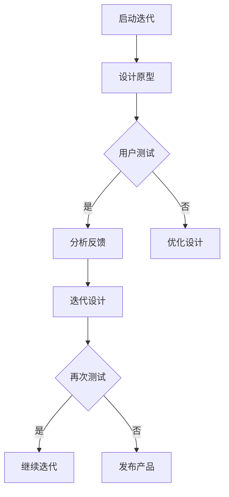
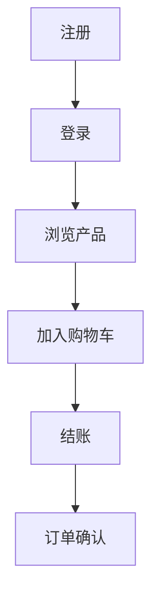
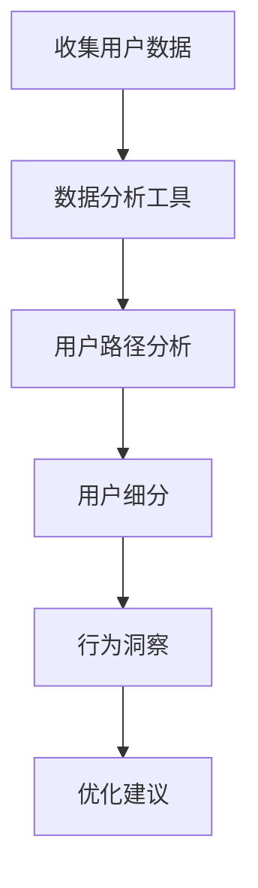
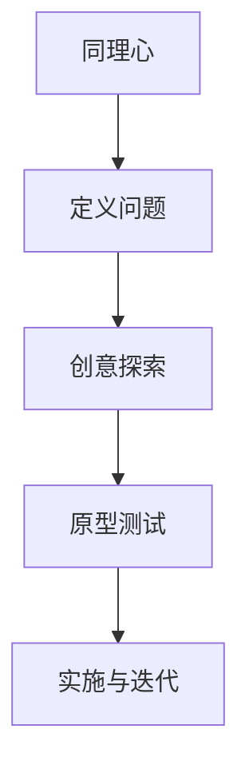
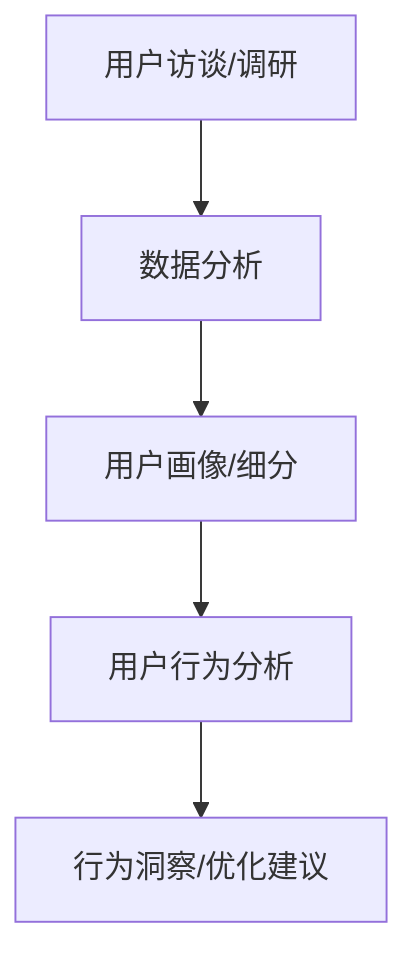
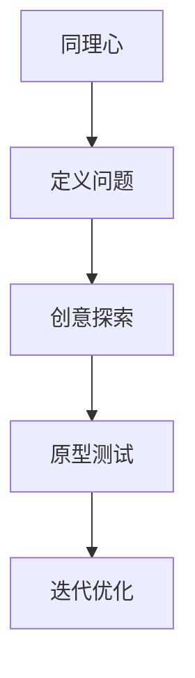
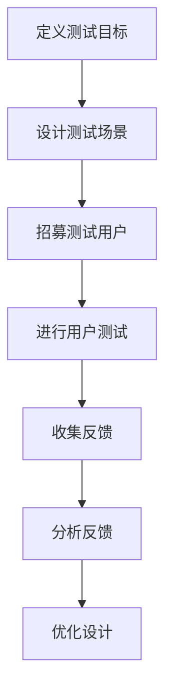

                 

# 文章标题

《创业公司的用户体验设计：打造令人着迷的产品》

## 关键词

用户体验设计、创业公司、设计思维、用户研究、用户测试、界面设计、交互设计

## 摘要

在创业公司的快速成长过程中，用户体验设计（UX Design）是确保产品成功的关键因素。本文将深入探讨创业公司如何通过用户体验设计来打造令人着迷的产品。文章首先介绍了用户体验设计的基本概念和重要性，随后详细描述了设计流程、用户研究方法、设计思维、界面设计与交互设计等关键环节。最后，文章强调了用户测试与评估在验证设计决策中的重要作用，并提供了一系列实战案例和最佳实践，以帮助创业公司在资源有限的情况下实现高质量的用户体验设计。

## 第1章 引言：用户体验设计的核心与重要性

### 1.1 引言

用户体验设计（User Experience Design，简称UX Design）是确保用户在使用产品时获得满意和愉快感受的设计过程。它不仅仅关注产品的功能性，更注重用户的情感体验和整体体验。用户体验设计的基础概念可以追溯到人机交互（HCI）和认知心理学等领域，其核心目标是提升用户满意度、降低使用难度、提高用户留存率，并最终实现产品成功。

在创业公司的背景下，用户体验设计显得尤为重要。创业公司通常资源有限，需要在有限的时间和预算内迅速推出市场验证的产品。用户体验设计可以帮助创业公司在激烈的市场竞争中脱颖而出，以下原因充分说明了用户体验设计的核心重要性：

1. **增强用户满意度**：优秀的用户体验设计能够提升用户对产品的满意度，从而增强用户忠诚度。
2. **降低用户学习成本**：通过优化用户界面和交互设计，降低用户的学习成本，使产品更容易被接受和使用。
3. **提高用户留存率**：优质的用户体验能够提高用户的长期使用意愿，从而提升产品的留存率。
4. **快速迭代与优化**：用户体验设计强调迭代和用户反馈，有助于创业公司快速调整和优化产品，更快地响应市场变化。
5. **降低开发成本**：通过早期识别和解决潜在问题，用户体验设计有助于降低后期修正的成本。

### 1.2 用户体验设计的核心原则

用户体验设计的核心原则是贯穿整个设计过程的指导思想，它们帮助设计师在复杂的设计任务中保持清晰的方向。以下是一些关键的原则：

**1. 以用户为中心的设计思维**：以用户为中心的设计（User-Centered Design，简称UCD）强调在设计过程中始终关注用户的需求和体验。这意味着设计师需要通过多种方式深入了解用户，包括用户研究、访谈、观察等，以确保设计的每一步都符合用户期望。

**2. 设计原则与用户体验的关系**：设计原则是指导设计实践的规则，它们与用户体验密切相关。例如，一致性原则（Consistency）确保用户在不同界面和操作中的体验保持一致，从而降低用户的学习成本。其他原则如简洁性（Simplicity）、易访问性（Accessibility）和反馈（Feedback）等同样对用户体验有重大影响。

**3. 资源有限情况下的用户体验设计**：创业公司通常面临资源限制，包括人力、时间和资金。在这种情况下，用户体验设计需要更加高效。以下是一些建议：

- **优先级排序**：确定产品最关键的功能和用户需求，集中资源解决这些问题。
- **迭代与验证**：采用敏捷开发方法，快速迭代和验证设计，确保每次迭代都能提供实际价值。
- **合作与沟通**：鼓励跨部门合作，充分利用团队中的不同技能和资源。
- **精益资源利用**：通过优化资源分配和减少浪费，提高设计效率。

### 1.3 用户参与与反馈的重要性

用户参与和反馈是用户体验设计不可或缺的环节。在创业公司中，由于资源和时间的限制，用户参与可能不如大型公司那样全面，但以下原因说明了为什么用户参与和反馈至关重要：

**1. 真实用户反馈**：通过直接获取用户反馈，设计师可以了解用户在实际使用产品时的真实感受，这比任何假设和预测都要准确。
**2. 发现设计问题**：用户反馈能够揭示设计师未预见的设计问题和用户体验障碍，从而提供改进的机会。
**3. 确定产品方向**：用户反馈有助于创业公司确定产品的方向和优先级，确保产品发展符合市场需求。
**4. 提高团队凝聚力**：用户参与和反馈的过程能够增强团队对产品的认同感和责任感，从而提高团队凝聚力和合作效率。

**1.3.1 用户参与的形式**：

- **用户访谈**：通过与用户进行面对面访谈，设计师可以深入了解用户的需求、喜好和行为模式。
- **用户测试**：通过观察用户与产品的互动，设计师可以实时获取用户对产品的反应和反馈。
- **问卷调查**：通过在线或离线问卷调查，设计师可以收集大量用户的意见和反馈。
- **用户社区**：建立用户社区，设计师可以持续获取用户反馈，并与用户建立长期互动关系。

**1.3.2 用户反馈的处理**：

- **数据收集与分析**：建立系统化的数据收集和分析方法，确保用户反馈的准确性和有效性。
- **反馈分类与优先级排序**：将用户反馈按照重要性和紧急性进行分类，确保资源能够集中在最关键的问题上。
- **行动计划与跟进**：制定具体的行动计划，并跟踪执行进度，确保反馈能够及时转化为产品改进。

通过以上用户参与和反馈的方法，创业公司可以更好地理解用户需求，提高产品设计质量，从而在激烈的市场竞争中脱颖而出。

### 1.4 创业公司中用户体验设计的独特挑战

创业公司在用户体验设计（UX Design）过程中面临着一系列独特的挑战，这些挑战往往源于资源有限、时间紧迫和市场不确定性。以下是一些主要的挑战及应对策略：

#### **1. 资源限制**

**挑战**：资源限制是创业公司普遍面临的问题，包括人力、时间和资金。这导致用户体验设计项目可能无法像大型公司那样得到充分的支持。

**应对策略**：

- **优先级排序**：明确产品最关键的功能和用户需求，将资源集中在这些核心部分。
- **敏捷开发**：采用敏捷开发方法，快速迭代和验证设计，确保每次迭代都能提供实际价值。
- **多技能团队**：鼓励团队成员掌握多种技能，提高资源利用效率。

#### **2. 时间紧迫**

**挑战**：创业公司通常需要在短时间内推出产品，这要求用户体验设计过程必须高效且精确。

**应对策略**：

- **快速原型设计**：采用快速原型设计方法，减少设计阶段的时间和成本。
- **用户测试迭代**：通过快速用户测试和迭代，及时调整设计，确保产品符合用户需求。
- **时间管理工具**：使用项目管理工具，如Trello或JIRA，有效分配任务和跟踪进度。

#### **3. 市场不确定性**

**挑战**：市场环境变化快速，创业公司需要灵活调整产品设计以适应市场变化。

**应对策略**：

- **可扩展性设计**：采用模块化和灵活的设计方法，确保产品能够适应未来的扩展和变化。
- **用户研究**：持续进行用户研究，了解市场动态和用户需求的变化。
- **快速反馈循环**：建立快速反馈机制，及时获取用户和市场反馈，以便快速调整设计。

#### **4. 技术复杂性**

**挑战**：创业公司的产品可能涉及复杂的技术架构，这增加了用户体验设计的难度。

**应对策略**：

- **技术迭代**：与技术团队紧密合作，逐步实现产品功能，避免一次性投入大量资源。
- **用户引导**：通过用户引导和帮助文档，帮助用户更好地理解和使用复杂功能。

#### **5. 人员变动**

**挑战**：创业公司的人员变动可能导致设计团队不稳定，影响用户体验设计的连贯性。

**应对策略**：

- **知识共享**：建立文档和流程，确保新成员能够迅速了解项目背景和设计思路。
- **团队协作**：通过定期会议和沟通，保持团队内部的协作和凝聚力。

#### **6. 预算限制**

**挑战**：有限的预算可能限制了用户体验设计的研究和开发，影响设计质量。

**应对策略**：

- **外部合作**：寻求合作伙伴或外部资源，共同分担研究和设计成本。
- **免费工具和资源**：利用免费的设计工具和资源，如开源软件和在线设计平台，降低成本。

通过上述策略，创业公司可以在资源有限的情况下，克服用户体验设计中的独特挑战，打造出既满足用户需求又具有市场竞争力的产品。

### 1.5 用户体验设计的核心原则与实践

用户体验设计的核心原则是确保设计过程和最终产品能够满足用户需求、提升用户满意度并实现产品成功。以下是一些关键原则和实践，这些原则在创业公司的用户体验设计中尤为重要：

**1. 以用户为中心**：用户体验设计的一切都应围绕用户进行。这意味着设计师需要深入了解目标用户群体，包括他们的需求、行为和情感。以下是一些实践方法：

- **用户研究**：通过用户访谈、问卷调查、用户测试等方式收集用户数据。
- **用户画像**：创建用户画像，将用户分类，以便更好地了解他们的特征和需求。
- **用户故事**：编写用户故事，将用户需求转化为具体的用户场景和故事。

**2. 设计原则与用户体验的关系**：设计原则是用户体验设计的基石，它们确保设计过程和最终产品的一致性和可访问性。以下是一些关键设计原则：

- **一致性**：确保用户在不同界面和操作中的体验保持一致，减少用户的学习成本。
- **简洁性**：通过简洁的界面和交互设计，降低用户的使用难度。
- **易访问性**：确保产品能够被各种用户群体（包括残疾人）使用，实现包容性设计。
- **反馈**：提供及时的反馈，帮助用户了解他们的操作结果，提高用户的信心和满意度。

**3. 如何在资源有限的情况下实施用户体验设计**：

- **敏捷开发**：采用敏捷开发方法，快速迭代和验证设计，确保每次迭代都能提供实际价值。
- **优先级排序**：确定产品最关键的功能和用户需求，集中资源解决这些问题。
- **用户参与**：通过用户访谈、用户测试等方式，确保用户参与设计过程，提高设计的准确性和有效性。
- **多技能团队**：鼓励团队成员掌握多种技能，提高资源利用效率。

**4. 跨部门协作**：用户体验设计不仅仅涉及设计团队，还需要与产品管理、开发、市场和销售等部门的紧密合作。以下是一些实践方法：

- **设计评审会议**：定期举行设计评审会议，邀请不同部门的代表参与，共同讨论和改进设计。
- **共享资源和知识**：建立文档和知识库，确保团队成员能够迅速了解项目背景和设计思路。
- **跨部门沟通**：通过明确的沟通渠道和定期沟通，确保各部门之间的协作顺畅。

通过遵循上述核心原则和实践，创业公司可以在资源有限的情况下，实施高质量的用户体验设计，从而打造出令人着迷的产品。

## 第2章 设计流程：从概念到产品

### 2.1 设计流程概述

设计流程是用户体验设计（UX Design）中的核心环节，它确保产品从概念阶段到最终发布都能遵循科学、系统的方法，从而满足用户需求并实现商业目标。设计流程通常包括以下几个常见阶段：

1. **需求分析**：在这一阶段，设计师通过市场研究、用户访谈、问卷调查等方法，了解用户需求、市场趋势和竞争环境，明确产品的目标用户和核心功能。
2. **概念验证**：基于需求分析的结果，设计师构建初步的概念模型，包括产品原型、用户故事和功能清单。这一阶段的目的是验证产品概念是否可行，并收集早期用户反馈。
3. **原型设计**：在概念验证阶段结束后，设计师开始制作详细的原型，这些原型可以是低 fidelity 的草图，也可以是高 fidelity 的交互式原型。原型设计阶段的目标是测试和验证设计想法，确保产品能够满足用户需求。
4. **用户测试**：在原型设计阶段，设计师将原型展示给目标用户，通过用户测试收集反馈，识别设计中的问题和改进点。用户测试可以是线上的，也可以是线下的，常见的方法包括可用性测试、任务完成测试和用户访谈。
5. **迭代与优化**：根据用户测试的反馈，设计师对原型进行迭代和优化，不断改进设计。这一过程可能需要多次迭代，直到设计达到预期效果。
6. **最终设计交付**：在所有迭代和优化完成后，设计师将最终设计交付给开发团队，确保开发团队能够准确理解和实现设计。
7. **持续迭代**：在产品发布后，设计师应继续收集用户反馈，对产品进行持续迭代和优化，确保产品能够不断适应用户需求和市场变化。

### 2.1.1 设计流程在创业公司中的应用

在创业公司中，设计流程的应用需要更加灵活和高效，因为资源有限、时间紧迫和市场变化快速。以下是一些建议，帮助创业公司成功应用设计流程：

1. **敏捷开发**：采用敏捷开发方法，快速迭代和验证设计，确保每次迭代都能提供实际价值。这种方法可以帮助创业公司快速响应市场变化，并在有限的时间内交付高质量的产品。
2. **用户参与**：确保用户在整个设计流程中参与，通过用户访谈、用户测试和反馈环节，获取真实用户的意见和建议，从而优化设计。
3. **优先级排序**：明确产品最关键的功能和用户需求，集中资源解决这些问题，避免分散精力。
4. **快速原型设计**：采用快速原型设计方法，减少设计阶段的时间和成本，确保能够及时验证设计想法。
5. **跨部门协作**：设计流程需要与产品管理、开发、市场和销售等部门的紧密合作，确保设计能够准确理解和实现。
6. **持续学习和改进**：创业公司应不断学习行业最佳实践和用户反馈，持续改进设计流程，提高设计效率和质量。

通过灵活应用设计流程，创业公司可以在资源有限的情况下，实现高质量的用户体验设计，从而在激烈的市场竞争中脱颖而出。

### 2.1.2 如何管理设计流程中的迭代

设计流程中的迭代是一个动态、循环的过程，它帮助设计师通过反复的测试、反馈和改进，逐步完善产品设计。在创业公司中，有效管理迭代过程至关重要，以下是一些关键步骤和最佳实践：

**1. 明确迭代目标**：在开始每个迭代之前，明确本次迭代的重点目标，例如优化某个功能、解决特定问题或提升用户体验。明确的目标有助于团队集中精力，提高工作效率。

**2. 规划迭代周期**：根据项目进度和资源情况，合理规划迭代周期。创业公司通常采用短周期迭代，如每周或每两周一次，这样可以快速响应用户反馈和市场需求。

**3. 建立反馈机制**：建立一个有效的反馈机制，确保用户和团队之间的沟通顺畅。可以通过用户测试、用户访谈、问卷调查等方式收集反馈，并将反馈及时传达给团队成员。

**4. 制定迭代计划**：在迭代开始前，制定详细的迭代计划，包括任务分配、时间表和里程碑。确保每个团队成员都清楚自己的职责和任务，避免任务重叠和延误。

**5. 快速原型设计**：采用快速原型设计方法，如Sketch、Figma等，可以快速制作原型，以便在短时间内验证设计想法。快速原型设计有助于降低成本和风险。

**6. 用户测试与评估**：在迭代过程中，定期进行用户测试，评估设计的有效性。用户测试可以是线上的，也可以是线下的，方法包括可用性测试、任务完成测试和用户访谈。

**7. 反馈与迭代**：根据用户测试的结果，收集反馈并进行迭代改进。设计团队应根据反馈调整设计，解决用户提出的问题和障碍。

**8. 持续跟进**：在迭代结束后，持续跟进用户反馈，确保问题得到解决，并监控新设计的效果。通过持续跟进，可以确保产品不断优化，满足用户需求。

通过以上步骤和最佳实践，创业公司可以高效地管理设计流程中的迭代，确保产品在短时间内实现高质量的用户体验。

### 2.2 原型设计与迭代

原型设计是用户体验设计（UX Design）中的一个关键步骤，它通过创建产品的早期版本，帮助设计师验证设计想法并获取用户反馈。在创业公司中，原型设计和迭代过程尤为重要，因为它们能够在资源有限和时间紧迫的情况下，确保产品符合用户需求和市场需求。以下将详细探讨原型设计的重要性、类型及应用，以及迭代与用户反馈循环的紧密关系。

**2.2.1 原型设计的重要性**

原型设计的重要性体现在以下几个方面：

1. **验证设计想法**：通过创建原型，设计师可以在产品开发早期验证设计想法，识别潜在问题，从而减少后期修正的成本和风险。
2. **降低风险**：原型设计帮助创业公司在投入大量资源之前，对产品进行风险评估。通过原型，设计师可以提前发现并解决设计问题，降低产品失败的风险。
3. **用户参与**：原型设计鼓励用户参与产品开发过程，通过用户反馈，设计师可以更好地了解用户需求和行为，从而优化设计。
4. **提高沟通效率**：原型作为视觉化工具，有助于设计师与团队成员、利益相关者之间的沟通。原型可以清晰地传达设计思路和功能，减少误解和歧义。
5. **提高开发效率**：原型设计可以帮助开发团队更准确地理解设计要求，从而提高开发效率，减少返工和时间浪费。

**2.2.2 原型设计的类型与应用**

原型设计的类型可以根据精确度和功能复杂度分为几种：

1. **低保真度原型**：低保真度原型通常使用简单的工具（如纸笔、Sketch）制作，它们不强调视觉效果，但能够展示基本的功能和结构。低保真度原型适用于快速迭代和初步验证。
2. **中保真度原型**：中保真度原型在视觉上更加接近最终产品，通常使用Sketch、Figma等设计工具制作。它们可以模拟用户界面的大部分交互功能，适用于测试用户体验和交互细节。
3. **高保真度原型**：高保真度原型几乎与最终产品无异，它们包括所有视觉和交互细节。高保真度原型通常使用Figma、Adobe XD等高级设计工具制作，适用于最终的测试和用户反馈。

在创业公司中，原型设计应根据项目阶段和资源情况灵活选择：

- **概念验证阶段**：在产品初期，创业公司可以使用低保真度原型，快速验证设计概念和功能。
- **用户测试阶段**：在中期，使用中保真度原型进行用户测试，获取更详细的反馈。
- **最终测试阶段**：在产品接近发布时，使用高保真度原型进行最终测试和优化。

**2.2.3 迭代与用户反馈循环**

迭代与用户反馈循环是原型设计的核心环节，它们确保设计不断优化，满足用户需求。以下是如何实现迭代与用户反馈循环的一些关键步骤：

1. **用户测试**：在原型设计完成后，组织用户测试，观察用户与原型的互动，收集用户反馈。用户测试可以是线上的，也可以是线下的，方法包括可用性测试、任务完成测试和用户访谈。
2. **分析反馈**：分析用户测试结果，识别设计中的问题和用户痛点。这些反馈可以帮助设计师了解用户的需求和行为模式。
3. **迭代设计**：根据用户反馈，对原型进行迭代和优化。这一过程可能需要多次迭代，每次迭代都会解决一部分问题，逐步完善设计。
4. **再次测试**：在每次迭代后，重新进行用户测试，验证新的设计是否解决了问题，并根据反馈进行进一步优化。
5. **持续反馈**：用户反馈是迭代过程的关键，设计师应持续收集用户反馈，并不断进行迭代。这种持续反馈和迭代的过程有助于确保产品最终能够满足用户需求。

通过原型设计和迭代与用户反馈循环，创业公司可以在资源有限的情况下，高效地优化产品设计，打造出令人满意的产品。以下是一个简单的迭代与用户反馈循环的流程图：

通过以上步骤，创业公司可以确保设计流程的高效和持续改进，从而在激烈的市场竞争中脱颖而出。

### 2.2.4 用户研究方法

用户研究是用户体验设计（UX Design）的核心环节，通过深入了解用户的需求、行为和情感，设计师可以创造出真正满足用户需求的产品。以下将详细探讨几种常见的用户研究方法：用户访谈、用户观察、调查问卷、数据分析以及用户旅程地图和触点分析。

**1. 用户访谈**

用户访谈是一种通过与目标用户进行一对一或小组讨论，收集用户反馈和意见的方法。这种方法的优势在于可以深入了解用户的真实感受和需求，发现潜在的问题和机会。

**方法步骤**：

- **准备访谈内容**：设计访谈问题，确保问题涵盖用户需求、使用习惯、偏好等方面。
- **选择访谈对象**：选择具有代表性的用户，确保样本的多样性和准确性。
- **进行访谈**：使用录音设备记录访谈过程，确保不遗漏重要信息。
- **分析访谈内容**：整理访谈记录，提取关键信息和模式。

**优点**：

- **深度了解用户**：用户访谈可以深入了解用户的需求和情感。
- **灵活性强**：可以根据用户反馈灵活调整访谈内容和方向。

**缺点**：

- **耗时较长**：用户访谈需要投入大量时间和精力。
- **样本有限**：用户访谈的样本量相对较小，可能无法代表整体用户群体。

**适用场景**：适用于需要深入了解用户需求、行为和情感的场景，如新产品设计、功能优化等。

**2. 用户观察**

用户观察是通过直接观察用户在自然环境或模拟环境中的行为，收集用户反馈和意见的方法。这种方法的优势在于可以观察到用户的真实行为，发现隐藏在语言和文字背后的信息。

**方法步骤**：

- **选择观察场景**：根据研究目标，选择合适的观察场景，如用户的家中、工作场所或模拟实验室。
- **进行观察**：在观察过程中，记录用户的操作流程、行为习惯和情感反应。
- **分析观察结果**：整理观察记录，提取关键行为和模式。

**优点**：

- **真实行为**：用户观察可以观察到用户在自然环境中的真实行为。
- **减少偏差**：观察者可以减少主观偏差，更客观地记录用户行为。

**缺点**：

- **干扰用户**：观察可能对用户产生干扰，影响其正常行为。
- **难以量化**：用户观察的结果较难量化，需要进一步分析。

**适用场景**：适用于需要了解用户行为和使用习惯的场景，如交互设计优化、用户体验测试等。

**3. 调查问卷**

调查问卷是一种通过在线或离线方式，向大量用户收集反馈和意见的方法。这种方法的优势在于可以快速收集大量数据，适用于广泛的用户群体。

**方法步骤**：

- **设计问卷**：设计具有针对性的问卷问题，确保问题简洁明了，易于回答。
- **选择调查渠道**：根据目标用户群体，选择合适的调查渠道，如电子邮件、社交媒体或在线调查平台。
- **发布问卷**：发布问卷，收集用户反馈。
- **分析问卷结果**：整理问卷数据，提取关键信息和模式。

**优点**：

- **数据量大**：调查问卷可以收集大量用户数据，提供全面的市场洞察。
- **成本较低**：相对于其他用户研究方法，调查问卷的成本较低。

**缺点**：

- **问卷质量**：问卷设计质量直接影响数据的准确性和有效性。
- **用户参与度**：用户可能不愿意花时间填写长问卷。

**适用场景**：适用于需要快速收集大量用户意见和市场洞察的场景，如市场调研、用户满意度调查等。

**4. 数据分析**

数据分析是通过分析用户行为数据，如点击率、转化率、使用时长等，来了解用户行为和需求的方法。这种方法的优势在于可以通过数据量化的方式，提供客观的用户洞察。

**方法步骤**：

- **数据收集**：收集用户行为数据，如使用日志、事件数据等。
- **数据处理**：使用数据分析工具，如Google Analytics、Mixpanel等，处理和整理数据。
- **数据可视化**：通过图表和报告，将数据分析结果可视化，便于理解和解读。
- **数据解读**：根据数据分析结果，提取关键信息和模式。

**优点**：

- **量化分析**：数据分析可以提供量化的用户行为数据，便于比较和分析。
- **实时性**：数据分析工具通常提供实时数据，帮助设计师快速响应和调整设计。

**缺点**：

- **数据质量问题**：数据分析的质量取决于数据收集和处理方法。
- **用户行为复杂性**：用户行为数据可能存在复杂性，需要深入分析。

**适用场景**：适用于需要量化分析用户行为和市场趋势的场景，如产品优化、市场分析等。

**5. 用户旅程地图和触点分析**

用户旅程地图是一种可视化工具，用于描述用户在使用产品过程中的所有触点和体验。通过用户旅程地图，设计师可以全面了解用户的使用路径、痛点和高光时刻，从而优化用户体验。

**方法步骤**：

- **收集信息**：通过用户访谈、观察、问卷调查等方式，收集用户在各个触点上的体验信息。
- **绘制地图**：使用软件工具（如Sketch、Figma）绘制用户旅程地图，展示用户的路径和触点。
- **分析触点**：分析用户在不同触点上的体验，识别痛点和高光时刻。
- **优化设计**：根据分析结果，优化产品设计，提升用户体验。

**优点**：

- **全面了解用户体验**：用户旅程地图可以帮助设计师从全局视角了解用户的整体体验。
- **指导设计决策**：用户旅程地图为设计师提供了明确的优化方向，帮助做出更有针对性的设计决策。

**缺点**：

- **耗时较长**：绘制用户旅程地图需要收集和分析大量数据，耗时较长。
- **需要专业技能**：绘制用户旅程地图需要一定的设计能力和数据分析技能。

**适用场景**：适用于需要全面优化用户体验和流程的场景，如产品重构、用户体验优化等。

通过以上用户研究方法，创业公司可以深入了解用户需求和行为，为用户体验设计提供有力支持。以下是一个简单的用户旅程地图示例：

通过不断进行用户研究和优化，创业公司可以打造出真正满足用户需求的产品，提升用户满意度和市场份额。

### 2.3 用户研究：了解目标用户群体

在创业公司的用户体验设计中，了解目标用户群体是至关重要的一步。用户研究通过收集和分析用户数据，帮助设计师深入了解用户需求、行为和痛点，从而为产品设计和优化提供有力的依据。以下将详细探讨用户研究的重要性、具体方法以及如何使用用户研究帮助创业公司做出明智的决策。

#### **2.3.1 用户研究的重要性**

用户研究在用户体验设计中起着至关重要的作用，主要原因包括：

1. **洞察用户需求**：通过用户研究，设计师可以深入了解用户的需求和期望，从而设计出真正满足用户需求的产品。
2. **发现设计问题**：用户研究可以帮助设计师发现设计中的潜在问题，如界面布局不合理、交互设计不友好等，从而在早期阶段进行优化。
3. **优化用户体验**：用户研究的结果可以指导设计师不断改进产品，提升用户体验，增加用户满意度和忠诚度。
4. **减少开发风险**：通过用户研究，设计师可以在产品开发早期发现并解决潜在问题，从而降低开发风险，提高项目成功率。
5. **指导产品方向**：用户研究可以揭示用户对于产品的期望和偏好，帮助创业公司明确产品发展方向和优先级。

#### **2.3.2 具体方法**

以下是几种常见的用户研究方法，它们可以帮助创业公司深入了解目标用户群体：

1. **用户访谈**：通过面对面的用户访谈，设计师可以深入了解用户的需求、使用习惯和痛点。访谈问题应涵盖用户的背景信息、产品使用情况、期望和反馈等。

2. **用户观察**：用户观察是设计师直接观察用户在自然环境或模拟环境中的行为，以获取真实用户数据的有效方法。观察过程中，设计师应记录用户的操作流程、行为习惯和情感反应。

3. **调查问卷**：调查问卷是一种通过在线或离线方式，向大量用户收集反馈和意见的方法。问卷设计应简洁明了，问题应具有针对性，以确保数据的准确性和有效性。

4. **数据分析**：数据分析通过分析用户行为数据，如点击率、转化率、使用时长等，提供量化的用户洞察。数据分析工具（如Google Analytics、Mixpanel）可以帮助设计师深入了解用户行为和偏好。

5. **用户旅程地图和触点分析**：用户旅程地图是一种可视化工具，用于描述用户在使用产品过程中的所有触点和体验。通过用户旅程地图，设计师可以全面了解用户的使用路径、痛点和高光时刻，从而优化用户体验。

#### **2.3.3 如何使用用户研究帮助创业公司做出明智的决策**

用户研究的结果可以帮助创业公司在多个方面做出更明智的决策，以下是一些具体应用：

1. **产品方向**：用户研究可以揭示用户对于产品的期望和偏好，帮助创业公司明确产品发展方向和优先级。例如，通过用户访谈和调查问卷，可以发现用户对于特定功能的强烈需求，从而确定产品的核心功能。

2. **设计优化**：用户研究可以识别设计中的问题和不足，为设计师提供优化方向。例如，通过用户测试和观察，可以发现界面布局不合理、交互设计不友好等问题，从而进行针对性的优化。

3. **用户体验提升**：用户研究可以指导设计师不断改进产品，提升用户体验。例如，通过数据分析，可以发现用户在特定功能上的使用时长和转化率较低，从而优化该功能的设计和交互。

4. **市场定位**：用户研究可以帮助创业公司了解目标市场，从而进行有效的市场定位。例如，通过用户画像和细分，可以了解不同用户群体的特征和需求，从而制定有针对性的市场营销策略。

5. **风险管理**：用户研究可以在产品开发早期发现并解决潜在问题，从而降低开发风险。例如，通过用户测试和数据分析，可以发现产品的易用性问题，从而在开发阶段进行修正，避免后期返工。

通过深入的用户研究，创业公司可以更好地了解用户需求和行为，从而做出更明智的决策，提升产品竞争力，实现商业成功。

### 2.3.4 用户画像与用户细分

在用户体验设计（UX Design）中，创建用户画像（User Persona）和进行用户细分（User Segmentation）是理解目标用户的重要步骤。通过这些方法，设计师可以更准确地把握用户需求和行为，从而设计出更加符合用户期望的产品。以下将详细介绍用户画像的定义与构建、用户细分与市场定位，以及用户研究中的伦理与隐私问题。

#### **2.3.4.1 用户画像的定义与构建**

用户画像是一种描述目标用户特征的方法，通过将用户的共同特征和行为模式抽象成一个具体的、人格化的形象，设计师可以更好地理解和预测用户需求。以下是创建用户画像的步骤：

1. **收集用户数据**：通过用户访谈、问卷调查、用户测试和市场调研等方式，收集用户的基本信息、行为特征、需求和心理特征。
2. **分析用户数据**：对收集到的用户数据进行整理和分析，提取出用户的共同特征和典型行为模式。
3. **创建用户画像**：基于分析结果，创建一个具体的用户画像。用户画像通常包括以下信息：

   - **基本信息**：年龄、性别、职业、收入等。
   - **行为特征**：使用习惯、偏好、需求等。
   - **心理特征**：价值观、态度、情感等。
   - **背景故事**：用户的日常生活、使用场景、痛点等。

   例如，一个典型的用户画像可以是“李先生，30岁，软件工程师，对高效率工作有强烈需求，喜欢使用简洁、高效的应用程序”。

#### **2.3.4.2 用户细分与市场定位**

用户细分是将用户划分为不同的群体，以便更好地理解不同用户群体的需求和偏好。通过用户细分，设计师可以针对不同用户群体进行有针对性的产品设计。以下是用户细分的过程：

1. **识别细分维度**：根据用户数据，识别影响用户需求和行为的维度，如年龄、性别、职业、收入、使用习惯等。
2. **构建细分模型**：将用户按照不同的维度进行分类，构建用户细分模型。常见的用户细分模型包括：

   - **行为细分**：根据用户的使用行为和偏好进行分类，如高频用户、低频用户、新手用户等。
   - **需求细分**：根据用户的需求和痛点进行分类，如高需求用户、低需求用户等。
   - **心理细分**：根据用户的价值观和态度进行分类，如追求效率的用户、注重体验的用户等。

3. **市场定位**：根据用户细分结果，为每个细分群体制定有针对性的市场定位和营销策略。例如，针对高频用户，可以推出更多增值服务，提高用户粘性；针对低频用户，可以设计更简洁易用的界面，降低使用门槛。

#### **2.3.4.3 用户研究中的伦理与隐私问题**

在用户研究中，伦理和隐私问题是必须考虑的关键因素。以下是一些常见的伦理与隐私问题及解决方案：

1. **隐私保护**：在收集用户数据时，应严格遵守隐私保护法规，确保用户数据的安全。例如，可以采用匿名化处理、数据加密等措施，保护用户隐私。
2. **用户知情同意**：在进行用户研究时，应确保用户了解研究的目的、方法和潜在风险，并获得用户的知情同意。
3. **数据安全**：在存储和处理用户数据时，应采取严格的数据安全措施，防止数据泄露和滥用。
4. **透明度**：在用户研究中，应保持透明度，向用户明确说明数据的用途和处理方式，增强用户信任。
5. **用户权利**：用户有权了解自己的数据如何被使用，有权要求删除或修改个人信息。

通过妥善处理伦理与隐私问题，创业公司可以确保用户研究合法、合规，为用户体验设计提供可靠的数据支持。

通过创建用户画像和进行用户细分，设计师可以更深入地了解目标用户，从而设计出更符合用户需求的产品。同时，妥善处理伦理与隐私问题，是确保用户研究合法和可靠的基础。

### 2.3.5 用户行为分析

用户行为分析是用户体验设计（UX Design）中的一个关键环节，通过收集和分析用户在产品上的行为数据，设计师可以深入了解用户需求、痛点以及产品使用情况。以下是用户行为分析的具体步骤、工具和技术，以及如何利用行为数据优化产品。

**2.3.5.1 用户行为数据收集**

1. **数据来源**：用户行为数据可以来自多种渠道，包括：

   - **使用日志**：记录用户在使用产品时的操作行为，如点击、浏览、下载等。
   - **事件数据**：记录用户与产品互动的具体事件，如登录、购买、评论等。
   - **用户调研**：通过问卷调查、用户访谈等获取用户的主观反馈。

2. **数据收集方法**：常用的数据收集方法包括：

   - **数据分析工具**：使用数据分析工具（如Google Analytics、Mixpanel）自动收集用户行为数据。
   - **数据挖掘**：通过数据挖掘技术从大量数据中提取有价值的信息。

**2.3.5.2 数据分析工具与技巧**

1. **常用数据分析工具**：

   - **Google Analytics**：适用于网站和移动应用，提供详尽的用户行为数据，如访问来源、用户行为路径、转化率等。
   - **Mixpanel**：专注于用户行为分析，提供实时数据追踪和用户细分功能，适用于移动应用和网页。
   - **Adobe Analytics**：提供强大的数据分析功能，适用于复杂的多渠道营销和用户行为研究。

2. **数据分析技巧**：

   - **用户路径分析**：通过用户路径分析，了解用户在产品中的行为路径，识别高流量页面和关键转化节点。
   - **转化率分析**：通过转化率分析，了解用户在关键节点（如注册、购买）上的转化情况，识别优化机会。
   - **用户细分**：通过用户细分，了解不同用户群体（如新用户、活跃用户、流失用户）的行为差异，有针对性地优化产品。

**2.3.5.3 行为洞察与优化建议**

1. **行为洞察**：

   - **使用习惯**：通过分析用户的使用习惯，了解用户最常使用的功能、使用时长和频率等。
   - **痛点分析**：通过分析用户在特定功能或操作中的行为，识别用户的痛点，如界面复杂、操作繁琐等。
   - **行为模式**：通过分析用户的行为模式，了解用户在不同情境下的行为变化，如节假日使用量增加、晚间活跃度提升等。

2. **优化建议**：

   - **界面优化**：根据用户行为数据，简化界面设计，提高易用性，减少用户操作步骤。
   - **功能优化**：针对用户频繁使用和有强烈需求的功能，进行优化和改进，提升用户体验。
   - **流程优化**：通过分析用户路径和转化率，优化关键流程，提高转化率和用户留存率。
   - **个性化推荐**：根据用户行为数据，提供个性化的推荐和内容，提升用户满意度和粘性。

通过用户行为分析，创业公司可以深入了解用户需求和行为，从而有针对性地优化产品设计，提升用户体验和市场竞争力。以下是一个简单的用户行为分析流程图：

通过以上步骤，创业公司可以不断优化产品设计，打造出更符合用户需求的高质量产品。

### 2.3.6 设计思维：创新与协作

设计思维（Design Thinking）是一种以人为中心的创新方法，它通过迭代、用户反馈和跨学科合作，帮助创业公司解决复杂问题、创造新产品和提升用户体验。设计思维强调从用户的角度出发，通过深入研究用户需求、探索解决方案和快速迭代，实现创新和协作。以下将详细介绍设计思维的基本原则、设计思维与用户体验设计的关系，以及如何在创业公司中推广设计思维。

**2.3.6.1 设计思维的基本原则**

设计思维的基本原则包括以下五个步骤：

1. **同理心**：通过深入了解用户的需求和痛点，建立对用户的同理心。这一步骤的核心是站在用户的角度思考，理解他们的情感和行为。
2. **定义问题**：基于同理心，将用户的需求转化为具体的问题，明确设计目标和方向。
3. **创意探索**：通过头脑风暴、原型设计和快速迭代，探索各种可能的解决方案。这一步骤强调开放性和创新思维，鼓励多样性和跨学科合作。
4. **原型测试**：创建可测试的原型，通过用户反馈和测试，验证和优化设计。这一步骤的关键是快速、持续地获取用户反馈，并根据反馈进行调整。
5. **实施与迭代**：将最终设计投入实际应用，并根据用户反馈和市场反馈进行持续迭代和优化。这一步骤确保设计能够不断适应用户需求和市场变化。

**2.3.6.2 设计思维与用户体验设计的关系**

设计思维与用户体验设计（UX Design）密切相关，二者相互促进，共同提升产品的质量和用户满意度。以下是如何将设计思维应用于用户体验设计的一些关键点：

1. **用户中心**：设计思维强调以用户为中心，通过深入了解用户需求和痛点，确保设计始终围绕用户进行。
2. **迭代与反馈**：设计思维倡导快速迭代和用户反馈，这有助于用户体验设计师在设计的每一步中不断优化和改进产品。
3. **跨学科合作**：设计思维鼓励跨学科团队的合作，这有助于用户体验设计师与技术团队、产品经理和市场团队共同探讨和解决复杂问题。
4. **敏捷性**：设计思维强调敏捷性，通过快速响应用户反馈和市场需求，用户体验设计师可以及时调整设计方向，提高产品竞争力。

**2.3.6.3 在创业公司中推广设计思维**

在创业公司中推广设计思维，需要从组织文化、团队协作和资源分配等多个方面入手。以下是一些具体策略：

1. **建立设计思维文化**：通过培训、研讨会和内部分享，培养团队成员的设计思维意识和能力。确保设计思维成为公司文化的一部分，从而推动创新和协作。
2. **组建跨学科团队**：建立跨学科团队，包括设计师、工程师、产品经理和市场人员等，共同探讨和解决复杂问题。跨学科团队可以促进不同背景和技能的交流，提高设计质量。
3. **设置设计思维流程**：在项目中引入设计思维流程，确保每个阶段都有明确的目标和方法。通过同理心、定义问题、创意探索、原型测试和实施与迭代等步骤，确保项目始终以用户为中心。
4. **提供设计工具和资源**：为团队提供必要的设计工具和资源，如设计软件、原型工具和用户体验评估工具等。这有助于团队高效地实施设计思维，提高设计质量。
5. **鼓励用户参与**：通过用户访谈、用户测试和用户反馈等方式，确保用户在整个设计过程中参与。用户的参与和反馈可以提供宝贵的洞察，帮助团队更好地理解和满足用户需求。

通过在创业公司中推广设计思维，可以提高团队的创新能力和设计质量，从而打造出更符合用户需求和市场趋势的产品。以下是一个简单的设计思维流程图，展示了设计思维的五个步骤：

通过以上策略，创业公司可以成功推广设计思维，实现创新和协作，从而在激烈的市场竞争中脱颖而出。

### 2.3.7 团队协作与沟通

在创业公司的用户体验设计中，团队协作与沟通至关重要。一个高效的设计团队需要确保各个成员之间的信息流通、目标一致和协作顺畅。以下将探讨创业公司中设计团队的角色、最佳实践以及如何在快节奏环境中保持团队凝聚力。

**2.3.7.1 设计团队的角色**

在设计流程中，设计团队通常包括以下几类角色：

1. **用户体验设计师**：负责研究用户需求、设计界面和交互流程，确保产品易于使用和具有吸引力。
2. **产品经理**：负责产品的整体规划和管理，确保设计符合商业目标和用户需求。
3. **前端工程师**：负责实现设计，将设计师的UI/UX设计转化为功能性强的前端代码。
4. **后端工程师**：负责构建和维护产品的后端架构，确保系统稳定性和性能。
5. **数据分析师**：负责分析用户行为数据，提供设计决策的数据支持。
6. **项目经理**：负责设计项目的整体规划、进度跟踪和资源管理。

**2.3.7.2 团队协作的最佳实践**

1. **明确目标和责任**：确保每个团队成员都清楚项目的目标和自己的职责，避免任务重叠和责任模糊。
2. **定期会议**：定期举行团队会议，包括每日站会、周会和月会，确保团队成员之间信息同步和问题及时解决。
3. **共享资源和文档**：建立共享的知识库和文档系统，确保团队成员可以随时访问和更新项目资料。
4. **工具集成**：使用协作工具（如Trello、JIRA、Slack等），确保团队沟通和任务管理的高效。
5. **迭代与反馈**：通过敏捷开发方法，快速迭代和验证设计，确保每个迭代都能带来实际的改进。

**2.3.7.3 快节奏环境中的团队凝聚力**

在快节奏的创业环境中，保持团队凝聚力尤为挑战。以下是一些建议：

1. **灵活工作安排**：根据团队成员的需求和项目进度，灵活调整工作时间和地点，确保团队成员有足够的时间和空间专注于工作。
2. **团队建设活动**：定期组织团队建设活动，如团建、聚餐、户外运动等，增强团队成员之间的信任和默契。
3. **鼓励沟通与反馈**：鼓励团队成员之间开放沟通，分享工作经验和想法，共同解决难题。
4. **激励与认可**：及时对团队成员的工作进行认可和激励，增强他们的工作动力和归属感。
5. **关注团队成员健康**：关注团队成员的身心健康，提供必要的支持和资源，确保他们能够在高压环境中保持良好的状态。

通过以上团队协作和沟通的最佳实践，创业公司可以确保设计团队的高效运作和团队凝聚力的保持，从而在快速变化的市场环境中保持竞争力。

### 2.3.8 创新方法与工具

在创业公司的用户体验设计中，创新方法与工具的应用至关重要，它们可以帮助团队快速探索新想法、优化设计并提升产品竞争力。以下将详细介绍几种常用的创新方法与工具，包括设计冲刺（Design Sprint）、快速原型制作与迭代，以及设计思维在产品开发中的应用。

**2.3.8.1 设计冲刺（Design Sprint）**

设计冲刺是一种集中时间解决产品问题的创新方法，通常在5天内完成。它结合了设计思维和敏捷开发的优势，通过快速迭代和用户反馈，帮助团队在短时间内生成可行的产品解决方案。

**方法步骤**：

1. **准备阶段**：确定设计冲刺的目标和关键问题，组建跨学科团队，准备所需资源和工具。
2. **理解阶段**：通过用户访谈、用户调研和数据分析，深入了解用户需求和行为，建立对用户和市场的深刻理解。
3. **探索阶段**：通过头脑风暴和原型设计，快速生成多个解决方案，进行评估和筛选。
4. **决策阶段**：团队共同讨论并选择最佳解决方案，制定详细的实施计划。
5. **验证阶段**：制作原型并进行用户测试，验证设计方案的可行性和用户接受度。
6. **实施阶段**：根据用户反馈和测试结果，进行最终设计和开发，确保解决方案符合用户需求。

**优点**：

- **高效性**：设计冲刺在短时间内完成，有助于快速验证和优化产品方案。
- **团队合作**：设计冲刺鼓励跨学科团队的协作，提高问题解决效率和团队凝聚力。
- **用户反馈**：通过用户测试和反馈，确保设计方案符合用户需求，降低产品失败风险。

**案例**：

一家创业公司计划推出一款面向老年人的健康管理应用。在设计冲刺期间，团队通过用户访谈和调研，了解到老年人对健康管理应用的需求和痛点，包括操作简单、易于理解和及时提醒等功能。通过设计冲刺，团队快速生成并验证了多个原型，最终推出了一款简单易用、功能全面的健康管理应用，取得了良好的用户反响。

**2.3.8.2 快速原型制作与迭代**

快速原型制作与迭代是用户体验设计中的一个核心环节，通过创建早期版本的原型，团队可以快速验证设计想法，获取用户反馈，并进行持续优化。

**方法步骤**：

1. **需求分析**：明确产品功能和用户需求，为原型设计提供基础。
2. **原型设计**：使用简单工具（如Sketch、Figma）快速制作原型，确保原型能够模拟实际使用场景。
3. **用户测试**：将原型展示给用户，观察用户与原型的互动，收集用户反馈。
4. **迭代优化**：根据用户反馈，对原型进行迭代和优化，解决用户提出的问题和障碍。
5. **重复过程**：不断进行用户测试和迭代，确保原型逐步完善，满足用户需求。

**优点**：

- **快速反馈**：快速原型制作与迭代可以帮助团队在早期发现设计问题，快速调整和优化。
- **低成本**：使用简单工具制作原型，成本较低，适合资源有限的创业公司。
- **用户参与**：通过用户测试和反馈，确保设计符合用户需求和期望，提高用户满意度。

**案例**：

一家创业公司正在开发一款智能家居控制系统。通过快速原型制作与迭代，团队首先制作了一个低保真度原型，展示了系统的基本功能和界面。在用户测试中，团队发现了用户对界面布局和操作流程的不满，随后进行了多次迭代，逐步优化了界面设计和交互流程，最终推出了一款用户满意度高的智能家居控制系统。

**2.3.8.3 设计思维在产品开发中的应用**

设计思维是一种以用户为中心的创新方法，它贯穿于产品开发的整个过程中，帮助团队理解用户需求、探索解决方案和优化设计。以下是如何在产品开发中应用设计思维的一些关键点：

1. **同理心**：通过深入了解用户的需求和痛点，建立对用户的深刻理解，确保设计始终以用户为中心。
2. **定义问题**：将用户需求转化为具体的问题，明确设计目标和方向。
3. **创意探索**：通过头脑风暴、原型设计和快速迭代，探索各种可能的解决方案。
4. **原型测试**：创建可测试的原型，通过用户反馈和测试，验证和优化设计。
5. **实施与迭代**：将最终设计投入实际应用，并根据用户反馈和市场反馈进行持续迭代和优化。

**优点**：

- **用户中心**：设计思维强调用户需求，确保产品设计和功能符合用户期望。
- **快速迭代**：设计思维鼓励快速迭代，提高设计质量和用户满意度。
- **跨学科合作**：设计思维促进团队跨学科合作，提高问题解决效率和创新能力。

**案例**：

一家创业公司计划推出一款面向职场人士的时间管理应用。通过设计思维，团队首先通过用户访谈和调研了解了用户的时间管理需求和痛点，包括任务管理、时间规划和提醒功能。团队随后进行了头脑风暴和原型设计，快速制作了多个原型并进行用户测试。根据用户反馈，团队不断优化了功能设计和交互流程，最终推出了一款深受用户喜爱的职场时间管理应用。

通过设计冲刺、快速原型制作与迭代以及设计思维的应用，创业公司可以高效地探索和验证新产品方案，提高设计质量和用户满意度，从而在激烈的市场竞争中脱颖而出。

### 第3章 用户研究：了解目标用户群体

在创业公司的用户体验设计中，深入理解目标用户群体是关键的一步。用户研究通过收集和分析用户数据，帮助设计师获取有关用户需求、行为和情感的洞察，从而为产品的设计和优化提供有力的支持。以下是用户研究的重要性、用户画像与用户细分、用户行为分析、用户旅程地图与触点分析的具体方法。

#### **3.1 用户研究的重要性**

用户研究在用户体验设计中的作用不可忽视，它有助于以下方面：

1. **明确用户需求**：通过用户研究，设计师可以深入了解用户的需求、期望和痛点，从而确保产品设计符合用户实际需求。
2. **优化用户体验**：用户研究能够揭示设计中的问题和用户痛点，帮助设计师及时调整和优化产品，提升用户体验。
3. **指导产品方向**：用户研究的结果可以帮助创业公司确定产品的核心功能和市场定位，从而确保产品能够满足市场需求。
4. **降低开发风险**：通过早期识别用户需求和设计问题，用户研究有助于降低后期修正的成本和风险，提高项目成功率。
5. **持续改进**：用户研究不仅是一次性的活动，而是一个持续的过程。通过不断进行用户研究，创业公司可以持续了解用户需求和市场变化，从而实现产品的持续优化。

#### **3.2 用户画像与用户细分**

用户画像（User Persona）和用户细分（User Segmentation）是用户研究中的核心概念，它们帮助设计师深入了解目标用户，从而有针对性地进行产品设计。

**3.2.1 用户画像的定义与构建**

用户画像是通过抽象化和人格化的方式，将一组用户的共同特征和行为模式具象化成一个具体的人物形象。构建用户画像的步骤包括：

1. **收集用户数据**：通过用户访谈、问卷调查、用户测试和市场调研等方式，收集用户的基本信息、行为特征、需求和心理特征。
2. **分析用户数据**：对收集到的用户数据进行整理和分析，提取出用户的共同特征和典型行为模式。
3. **创建用户画像**：基于分析结果，创建一个具体的用户画像。用户画像通常包括以下信息：

   - **基本信息**：年龄、性别、职业、收入等。
   - **行为特征**：使用习惯、偏好、需求等。
   - **心理特征**：价值观、态度、情感等。
   - **背景故事**：用户的日常生活、使用场景、痛点等。

   例如，一个典型的用户画像可以是“张女士，28岁，白领，注重工作效率，喜欢使用简洁、易用的应用程序”。

**3.2.2 用户细分与市场定位**

用户细分是将用户划分为不同的群体，以便更好地理解不同用户群体的需求和偏好。通过用户细分，设计师可以针对不同用户群体进行有针对性的产品设计。以下是用户细分的过程：

1. **识别细分维度**：根据用户数据，识别影响用户需求和行为的维度，如年龄、性别、职业、收入、使用习惯等。
2. **构建细分模型**：将用户按照不同的维度进行分类，构建用户细分模型。常见的用户细分模型包括：

   - **行为细分**：根据用户的使用行为和偏好进行分类，如高频用户、低频用户、新手用户等。
   - **需求细分**：根据用户的需求和痛点进行分类，如高需求用户、低需求用户等。
   - **心理细分**：根据用户的价值观和态度进行分类，如追求效率的用户、注重体验的用户等。

3. **市场定位**：根据用户细分结果，为每个细分群体制定有针对性的市场定位和营销策略。例如，针对高频用户，可以推出更多增值服务，提高用户粘性；针对低频用户，可以设计更简洁易用的界面，降低使用门槛。

#### **3.3 用户行为分析**

用户行为分析是通过收集和分析用户在产品上的行为数据，了解用户的使用习惯、偏好和痛点。以下是如何进行用户行为分析的一些关键步骤：

**3.3.1 用户行为数据收集**

1. **确定数据来源**：用户行为数据可以来自多种渠道，如使用日志、事件数据、用户调研等。
2. **数据收集方法**：常用的数据收集方法包括：

   - **使用日志**：记录用户在使用产品时的操作行为，如点击、浏览、下载等。
   - **事件数据**：记录用户与产品互动的具体事件，如登录、购买、评论等。
   - **用户调研**：通过问卷调查、用户访谈等获取用户的主观反馈。

**3.3.2 数据分析工具与技巧**

1. **常用数据分析工具**：

   - **Google Analytics**：适用于网站和移动应用，提供详尽的用户行为数据，如访问来源、用户行为路径、转化率等。
   - **Mixpanel**：专注于用户行为分析，提供实时数据追踪和用户细分功能，适用于移动应用和网页。
   - **Adobe Analytics**：提供强大的数据分析功能，适用于复杂的多渠道营销和用户行为研究。

2. **数据分析技巧**：

   - **用户路径分析**：通过用户路径分析，了解用户在产品中的行为路径，识别高流量页面和关键转化节点。
   - **转化率分析**：通过转化率分析，了解用户在关键节点（如注册、购买）上的转化情况，识别优化机会。
   - **用户细分**：通过用户细分，了解不同用户群体（如新用户、活跃用户、流失用户）的行为差异，有针对性地优化产品。

**3.3.3 行为洞察与优化建议**

1. **行为洞察**：

   - **使用习惯**：通过分析用户的使用习惯，了解用户最常使用的功能、使用时长和频率等。
   - **痛点分析**：通过分析用户在特定功能或操作中的行为，识别用户的痛点，如界面复杂、操作繁琐等。
   - **行为模式**：通过分析用户的行为模式，了解用户在不同情境下的行为变化，如节假日使用量增加、晚间活跃度提升等。

2. **优化建议**：

   - **界面优化**：根据用户行为数据，简化界面设计，提高易用性，减少用户操作步骤。
   - **功能优化**：针对用户频繁使用和有强烈需求的功能，进行优化和改进，提升用户体验。
   - **流程优化**：通过分析用户路径和转化率，优化关键流程，提高转化率和用户留存率。
   - **个性化推荐**：根据用户行为数据，提供个性化的推荐和内容，提升用户满意度和粘性。

通过用户研究，创业公司可以深入了解目标用户群体，从而设计出更符合用户需求和市场趋势的产品。以下是用户研究的整体流程图：

通过以上步骤，创业公司可以确保产品设计始终以用户为中心，从而实现商业成功。

### 第4章 设计思维：创新与协作

设计思维（Design Thinking）是一种以人为本的创新方法，它通过同理心、定义问题、创意探索、原型测试和迭代优化等步骤，帮助创业公司解决复杂问题、创造新产品和提升用户体验。设计思维强调跨学科团队的合作、快速迭代和用户反馈，使团队能够更好地理解用户需求，实现创新和协作。以下将详细探讨设计思维的基本原则、设计思维在创业公司中的应用案例，以及如何在创业公司中推广设计思维。

#### **4.1 设计思维的基本原则**

设计思维的基本原则包括以下几个方面：

1. **同理心**：站在用户的角度思考，深入了解用户的需求、情感和行为，建立对用户的深刻理解。
2. **定义问题**：将用户需求转化为具体的问题，明确设计目标和方向，确保设计过程围绕用户需求展开。
3. **创意探索**：通过头脑风暴、原型设计和快速迭代，探索各种可能的解决方案，鼓励多样性和创新思维。
4. **原型测试**：创建可测试的原型，通过用户反馈和测试，验证和优化设计，确保解决方案符合用户期望。
5. **迭代优化**：根据用户反馈和市场反馈，持续迭代和优化设计，确保产品不断适应用户需求和市场变化。

#### **4.2 设计思维在创业公司中的应用**

设计思维在创业公司的用户体验设计中具有重要作用，以下是一些具体应用案例：

**4.2.1 设计思维在产品开发中的应用**

1. **理解用户需求**：创业公司通过用户访谈、问卷调查和用户测试等方式，深入了解目标用户的需求和痛点，建立对用户的深刻理解。
2. **定义问题**：基于用户需求，明确产品的设计目标和问题，例如简化用户操作流程、提升用户满意度等。
3. **创意探索**：通过头脑风暴和原型设计，团队探索各种可能的解决方案，如新的交互模式、界面设计等。
4. **原型测试**：创建可测试的原型，通过用户测试和反馈，验证和优化设计方案，确保解决方案符合用户期望。
5. **迭代优化**：根据用户反馈和市场反馈，持续迭代和优化设计，确保产品不断改进和优化。

**4.2.2 设计思维在团队协作中的应用**

1. **组建跨学科团队**：创业公司通过组建跨学科团队，包括设计师、工程师、产品经理和市场人员等，促进不同背景和技能的交流，提高问题解决效率和创新能力。
2. **同理心培训**：通过同理心培训，提高团队成员对用户的理解，确保设计过程始终以用户为中心。
3. **快速迭代**：创业公司采用快速迭代的方法，确保团队能够快速响应用户反馈和市场变化，提高产品竞争力。
4. **用户反馈**：通过用户测试和反馈，确保团队成员能够持续了解用户需求，及时调整和优化设计。

#### **4.3 如何在创业公司中推广设计思维**

要在创业公司中成功推广设计思维，需要从组织文化、团队协作和资源分配等多个方面入手，以下是一些建议：

**1. 建立设计思维文化**

- **培训与教育**：为团队成员提供设计思维培训和课程，提高对设计思维的理解和应用能力。
- **文化宣传**：通过内部研讨会、分享会和案例分析，宣传设计思维的重要性和应用价值，营造以用户为中心的设计文化。

**2. 组建跨学科团队**

- **明确角色**：为每个团队成员明确角色和职责，确保团队中的设计师、工程师、产品经理和市场人员等能够密切合作，共同推进项目。
- **跨学科交流**：鼓励团队成员之间的跨学科交流和合作，促进不同背景和技能的碰撞和融合。

**3. 资源与工具**

- **设计工具**：为团队提供必要的设计工具和资源，如Sketch、Figma、Adobe XD等，提高设计效率和协作能力。
- **用户研究资源**：为团队提供足够的用户研究资源，如用户访谈、用户测试和数据分析工具等，确保设计过程有充分的数据支持。

**4. 激励与认可**

- **激励制度**：建立激励制度，鼓励团队成员积极参与设计思维活动和项目，提高工作积极性和创造力。
- **认可与反馈**：定期对团队成员的设计工作进行认可和反馈，激励他们不断提升设计能力。

通过在创业公司中推广设计思维，可以提升团队能力，增强创新能力，打造出更符合用户需求和市场趋势的产品。以下是一个简单的设计思维流程图，展示了设计思维的五个步骤：

通过以上步骤，创业公司可以成功地推广设计思维，实现持续的创新和改进，从而在激烈的市场竞争中脱颖而出。

### 第5章 用户界面设计：打造直观易用的界面

用户界面设计（UI Design）是用户体验设计（UX Design）的重要组成部分，它直接影响到用户对产品的第一印象和整体使用体验。一个直观易用的界面不仅能够提高用户的满意度，还能降低学习成本，从而提升产品的竞争力。以下将详细介绍用户界面设计的核心原则、用户体验与设计趋势，以及设计工具与技术。

#### **5.1 用户界面设计的核心原则**

用户界面设计的核心原则旨在确保界面简洁、一致、易用且具有吸引力。以下是一些关键原则：

**1. 以用户为中心**：界面设计应始终围绕用户需求和行为进行，确保用户能够轻松完成操作。

**2. 一致性**：界面设计应保持一致性，包括色彩、字体、按钮样式等，帮助用户快速学习和适应。

**3. 简洁性**：界面应尽量简洁，避免过多的装饰和冗余信息，使核心功能一目了然。

**4. 易访问性**：界面设计应确保所有用户，包括残疾人，都能方便地使用产品。

**5. 反馈**：界面设计应提供及时的反馈，使用户了解他们的操作结果，提高使用信心。

**6. 可定制性**：界面应允许用户根据自己的需求进行个性化设置，提高用户满意度。

**7. 用户体验与设计趋势**：界面设计应考虑当前的设计趋势，如扁平化设计、响应式设计、动态界面等，以保持界面的现代感和吸引力。

#### **5.2 设计工具与资源**

在用户界面设计过程中，选择合适的设计工具和资源对于提高设计效率和实现预期效果至关重要。以下是一些常用的设计工具和资源：

**1. 常用用户界面设计工具**

- **Sketch**：一款流行的矢量界面设计工具，适用于Mac操作系统，以其简洁易用和强大的功能而著称。
- **Figma**：一款基于网页的设计工具，支持多人协作，方便实时共享和讨论。
- **Adobe XD**：一款全面的用户体验设计工具，提供丰富的原型设计和交互功能。
- **Adobe Photoshop**：一款经典的设计工具，常用于界面元素的设计和优化。

**2. 如何选择合适的用户界面设计工具**

- **需求分析**：根据项目需求，选择适合的设计工具。例如，如果需要多人协作，Figma可能是更好的选择；如果需要进行复杂图像处理，Photoshop可能更合适。
- **团队技能**：考虑团队成员的技能和熟悉度，选择他们擅长使用的工具。
- **成本**：评估工具的成本，选择性价比高的解决方案。

**3. 设计资源与素材库**

- **UI库**：如UI Deck、Material Design组件库等，提供丰富的界面元素和设计模板，节省设计时间。
- **图标库**：如Iconfinder、Flaticon等，提供大量高质量的图标资源。
- **配色方案**：如Coolors、Adobe Color等，帮助设计师快速创建协调的配色方案。

#### **5.3 界面布局与信息架构**

界面布局和信息架构是用户界面设计的关键要素，它们决定了用户在界面上的操作路径和信息获取效率。

**1. 用户体验与界面布局的关系**

- **用户体验**：良好的界面布局可以提高用户的使用体验，使界面更加直观、易用。
- **界面布局**：合理的界面布局能够引导用户完成操作，提供清晰的操作路径和信息结构。

**2. 信息架构的基本原则**

- **清晰性**：界面应保持清晰，使信息一目了然，避免过多的干扰和冗余。
- **一致性**：界面中的信息排列和导航应保持一致，降低用户的学习成本。
- **层次性**：界面应具备清晰的层次结构，使重要信息和功能易于查找。
- **响应式**：界面应适应不同设备和屏幕尺寸，提供一致的用户体验。

**3. 界面原型设计与迭代**

界面原型设计是用户界面设计的关键步骤，通过创建可交互的原型，设计师可以直观地展示界面布局和信息架构，并获取用户反馈。

- **原型设计工具**：使用Sketch、Figma、Adobe XD等工具创建原型，实现界面布局和交互设计。
- **用户测试**：通过用户测试，评估原型设计的有效性，识别问题和改进点。
- **迭代优化**：根据用户反馈和测试结果，对原型进行迭代和优化，逐步完善界面设计。

通过遵循用户界面设计的核心原则，选择合适的设计工具和资源，优化界面布局和信息架构，设计师可以打造出直观易用的界面，从而提升用户体验和产品竞争力。

### 第6章 交互设计：提升用户互动体验

交互设计（Interaction Design，简称IXD）是用户体验设计（UX Design）中的一个关键组成部分，它专注于用户与产品互动的方式，确保用户能够以直观、自然和高效的方式与产品进行交互。本章将探讨交互设计的基本概念、核心原则、用户行为与交互设计的关系，以及交互设计中的用户测试与反馈。

#### **6.1 交互设计的基本概念**

交互设计涉及用户与产品互动的所有方面，包括物理交互（如触摸屏幕、点击按钮）和认知交互（如理解界面布局、完成任务）。以下是交互设计的一些基本概念：

**1. 用户界面（User Interface，简称UI）**：用户界面是用户与产品互动的直接媒介，包括屏幕、按钮、菜单等。

**2. 交互模型（Interaction Model）**：交互模型定义了用户与产品之间的交互方式，如触摸、点击、滑动等。

**3. 交互设计原则（Interaction Design Principles）**：这些原则指导交互设计的方向和方法，确保交互体验符合用户预期。

**4. 交互模式（Interaction Patterns）**：交互模式是常见的交互设计模式，如按钮、轮播、下拉菜单等，它们帮助用户快速理解和使用产品。

**5. 用户体验（User Experience，简称UX）**：用户体验是用户在使用产品过程中的总体感受，包括满意度、易用性和效率等。

#### **6.2 交互设计的核心原则**

交互设计的核心原则是确保交互体验直观、高效且愉悦，以下是几个关键原则：

**1. 以用户为中心**：交互设计应始终关注用户需求和行为，确保设计符合用户习惯和期望。

**2. 一致性**：界面和交互元素应保持一致性，使用户在产品中能轻松学习和操作。

**3. 易用性**：交互设计应简化用户操作，减少学习成本，提高使用效率。

**4. 可访问性**：确保产品对所有用户，包括残疾人，都易于使用。

**5. 可发现性**：确保用户能够轻松发现和使用产品功能。

**6. 反馈**：提供及时的反馈，使用户了解操作结果，增强用户信心。

**7. 可定制性**：允许用户根据个人需求定制交互方式。

#### **6.3 用户行为与交互设计的关系**

用户行为对交互设计有直接影响，理解用户行为有助于设计出更符合用户期望的交互体验。以下是如何根据用户行为设计交互的一些要点：

**1. 用户需求**：交互设计应满足用户的基本需求，如浏览、搜索、购买等。

**2. 用户习惯**：考虑用户习惯，如常用操作、按钮位置等，以提高易用性。

**3. 用户心理**：考虑用户的心理因素，如信任感、满意度等，设计出具有吸引力的交互体验。

**4. 用户反馈**：通过用户测试和反馈，不断优化交互设计，确保符合用户期望。

**6.4 交互设计中的用户测试与反馈**

用户测试是交互设计的关键环节，通过观察用户与产品的互动，设计师可以识别设计中的问题和改进点。以下是交互设计中的用户测试与反馈的方法：

**1. 可用性测试**：通过观察用户完成任务的情况，评估交互设计的有效性。

**2. 任务完成测试**：测量用户完成任务所需的时间和步骤数，识别设计中的瓶颈。

**3. 用户访谈**：通过与用户面对面交流，了解他们对交互设计的感受和建议。

**4. 问卷调查**：通过在线或离线问卷，收集大量用户的反馈和意见。

**5. 迭代与优化**：根据用户反馈，对交互设计进行迭代和优化，确保设计不断改进。

通过深入了解交互设计的基本概念和核心原则，根据用户行为进行设计，并进行用户测试与反馈，设计师可以提升用户互动体验，打造出既直观又高效的产品。

### 第7章 用户测试与评估：验证设计决策

用户测试与评估是用户体验设计（UX Design）中至关重要的一环，它帮助设计师验证设计决策的有效性，确保产品能够满足用户需求并达到预期效果。本章将详细介绍用户测试的重要性、测试目的与方法，以及用户测试在创业公司中的应用。

#### **7.1 用户测试的重要性**

用户测试在用户体验设计中具有以下重要作用：

**1. 发现设计问题**：通过用户测试，设计师可以及时发现设计中的问题，如界面布局不合理、交互流程繁琐等。

**2. 评估设计效果**：用户测试可以帮助设计师评估设计决策的有效性，确保产品在视觉、功能、易用性等方面达到预期目标。

**3. 提高用户满意度**：通过用户测试，设计师可以获取用户对产品的直接反馈，从而优化设计，提高用户满意度。

**4. 降低开发风险**：早期进行用户测试可以减少后期修正的成本和风险，确保产品在发布时具备较高的质量。

**5. 持续改进**：用户测试是一个持续的过程，通过定期进行用户测试，设计师可以不断优化产品设计，确保产品能够适应用户需求和市场变化。

#### **7.2 用户测试的目的与方法**

**用户测试的目的**：

**1. 验证设计决策**：通过用户测试，设计师可以验证设计决策的有效性，确保设计符合用户需求和预期。

**2. 收集用户反馈**：用户测试是收集用户反馈的重要途径，设计师可以通过观察用户与产品的互动，了解用户的真实感受和需求。

**3. 评估用户体验**：用户测试可以帮助设计师评估用户体验的整体质量，识别用户痛点和改进机会。

**4. 确保产品可用性**：用户测试是确保产品可用性的关键步骤，通过测试可以验证产品是否符合易用性原则，如一致性、简洁性等。

**用户测试的方法**：

**1. 可用性测试**：可用性测试是一种评估用户在产品中完成任务效率和质量的方法。通过观察用户完成任务的过程，设计师可以识别设计中的问题，并提出改进建议。

**2. 任务完成测试**：任务完成测试是测量用户完成任务所需的时间和步骤数的方法。这种方法可以帮助设计师评估设计流程的效率，识别瓶颈和改进点。

**3. 用户访谈**：用户访谈是一种通过与用户面对面交流，深入了解他们对产品的感受和需求的方法。访谈可以提供丰富的定性数据，帮助设计师获取深入的用户洞察。

**4. 调查问卷**：调查问卷是一种通过在线或离线方式，收集大量用户反馈的方法。问卷设计应简洁明了，确保用户愿意花费时间填写。

**5. 观察与记录**：观察与记录是通过直接观察用户与产品的互动，记录用户的行为和反应的方法。这种方法可以帮助设计师获取真实的用户行为数据，从而进行深入分析。

#### **7.3 用户测试在创业公司中的应用**

在创业公司中，由于资源有限和时间紧迫，用户测试需要更加高效和灵活。以下是一些在创业公司中应用用户测试的方法和技巧：

**1. 快速迭代与测试**：采用敏捷开发方法，快速迭代和测试设计，确保每次迭代都能提供实际价值。这种方法可以帮助创业公司快速响应用户反馈和市场需求。

**2. 用户参与**：确保用户在整个设计流程中参与，通过用户访谈、用户测试和反馈环节，获取真实用户的意见和建议，从而优化设计。

**3. 资源优化**：充分利用现有资源，通过线上测试、问卷调查等方式，降低测试成本和时间。同时，可以采用低成本的设计工具，如Sketch、Figma等，提高测试效率。

**4. 跨部门协作**：用户测试需要与产品管理、开发、市场和销售等部门的紧密合作，确保测试结果能够准确传达并转化为产品改进。

**5. 持续反馈**：建立持续的反馈机制，确保用户反馈能够及时传达给设计团队，并用于后续设计迭代。

通过以上方法和技巧，创业公司可以高效地进行用户测试，确保产品设计符合用户需求，从而提高产品的市场竞争力。以下是一个简单的用户测试流程图，展示了用户测试的关键步骤：

通过以上步骤，创业公司可以确保设计决策的准确性和有效性，从而打造出高质量的用户体验产品。

