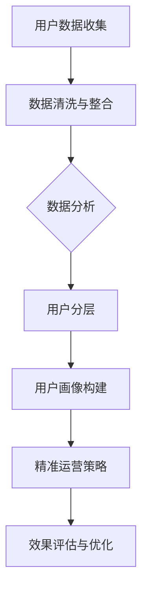

                 

### 文章标题

《创业公司的用户分层与精准运营》

> 关键词：用户分层、精准运营、创业公司、数据分析、营销策略

> 摘要：
本文章旨在探讨创业公司在用户分层和精准运营方面的策略和实践。通过深入分析用户分层的核心概念、分类方法、步骤与流程，结合国内外成功案例，文章提出了一系列实用策略，帮助创业公司提升运营效率，提高用户体验，降低成本，从而在激烈的市场竞争中脱颖而出。文章还探讨了用户数据管理与隐私保护的重要性，以及未来用户分层与精准运营的发展趋势。

----------------------------------------------------------------

### 《创业公司的用户分层与精准运营》目录大纲

#### 第一部分：用户分层策略

##### 第1章：用户分层的核心概念与策略  
1.1 用户分层的定义与重要性  
1.2 用户分层的分类方法  
1.3 用户分层的步骤与流程  
1.4 用户分层中的数据来源

##### 第2章：用户分层的实践案例  
2.1 国内用户分层的成功案例  
2.2 国际公司用户分层的策略  
2.3 用户分层策略的本土化实践

#### 第二部分：精准运营策略

##### 第3章：精准营销的概念与工具  
3.1 精准营销的定义  
3.2 精准营销的工具与技术  
3.3 精准营销的数据分析与处理

##### 第4章：精准运营的实践与应用  
4.1 社交媒体运营策略  
4.2 客户服务与反馈机制  
4.3 用户生命周期管理

##### 第5章：案例分析与运营优化  
5.1 案例分析：成功的用户分层与精准运营  
5.2 运营优化策略：基于数据的调整与改进  
5.3 创业公司运营挑战与解决方案

#### 第三部分：用户分层与精准运营的整合

##### 第6章：用户数据管理与隐私保护  
6.1 用户数据管理的重要性  
6.2 用户数据隐私保护法规  
6.3 用户数据安全策略与实践

##### 第7章：创业公司用户分层与精准运营的未来趋势  
7.1 新技术对用户分层与精准运营的影响  
7.2 创业公司的竞争力提升策略  
7.3 用户分层与精准运营的创新方向

#### 附录

## 附录 A：用户分层与精准运营工具推荐  
### A.1 用户分析工具推荐  
### A.2 精准营销工具推荐  
### A.3 用户数据管理工具推荐

## 附录 B：创业公司运营资源汇总  
### B.1 用户分层与精准运营书籍推荐  
### B.2 用户分层与精准运营在线课程推荐  
### B.3 用户分层与精准运营相关社区与论坛推荐

### 第1章：用户分层的核心概念与策略

#### 1.1 用户分层的定义与重要性

用户分层是指根据用户的属性、行为和需求等因素，将用户划分为不同的群体，以便于企业更好地了解用户，制定有针对性的营销策略和运营方案。

用户分层的重要性体现在以下几个方面：

- **提高营销效率**：通过用户分层，企业可以针对不同用户群体制定不同的营销策略，提高营销的针对性和效果。
- **提升用户体验**：用户分层可以帮助企业更好地了解用户需求，提供更个性化的服务，提升用户满意度。
- **降低运营成本**：用户分层可以缩小目标用户范围，降低运营成本，提高运营效率。

在创业公司中，用户分层尤为重要。因为创业公司的资源相对有限，必须通过高效的运营策略来获取用户、留住用户并提升用户价值。用户分层能够帮助创业公司更好地定位市场，聚焦核心用户，从而实现精准营销和运营。

#### 1.2 用户分层的分类方法

用户分层可以根据不同的标准进行分类，常见的分类方法包括：

- **按照用户属性分层**：如年龄、性别、地理位置、职业等。这种分层方法可以帮助企业了解用户的基本特征，为后续的用户画像和精准营销提供基础。
- **按照用户行为分层**：如用户活跃度、消费频率、消费金额等。这种分层方法可以揭示用户的活跃程度和消费习惯，帮助企业制定差异化的运营策略。
- **按照用户需求分层**：如潜在用户、现有用户、忠诚用户等。这种分层方法可以帮助企业识别用户的价值和需求，从而提供更精准的服务和产品。

在实际操作中，创业公司通常会结合多种分层方法，以获得更全面、准确的用户画像。

#### 1.3 用户分层的步骤与流程

用户分层的步骤通常包括以下几个环节：

1. **数据收集**：收集用户的基本信息、行为数据等。数据来源可以是用户注册、购买记录、浏览行为等内部数据，也可以是第三方数据，如社交媒体数据、搜索引擎数据等。
2. **数据处理**：对收集到的数据进行清洗、整合和处理。这一步骤确保数据的准确性和完整性，为后续的分析提供可靠的基础。
3. **数据分析**：通过数据分析，识别用户的共同特征，划分用户群体。数据分析可以采用多种方法，如聚类分析、关联规则分析等。
4. **用户画像**：根据用户分层结果，构建用户画像。用户画像是对用户特征的详细描述，包括用户的兴趣、行为、需求等。
5. **精准运营**：根据用户画像，制定有针对性的运营策略。这些策略包括个性化营销、个性化推荐、用户服务优化等。

#### 1.4 用户分层中的数据来源

用户分层的数据来源主要包括以下几个方面：

- **内部数据**：包括用户注册信息、购买记录、浏览行为等。这些数据是用户分层的基础，可以提供详细的用户行为数据。
- **第三方数据**：如社交媒体数据、搜索引擎数据等。这些数据可以帮助企业了解用户在互联网上的行为，拓展用户数据的维度。
- **市场调研**：通过问卷调查、用户访谈等方式收集用户数据。这些数据可以提供用户需求的直接反馈，帮助企业更好地了解用户。

在用户分层过程中，数据的准确性和完整性至关重要。创业公司需要综合考虑多种数据来源，确保数据的全面性和可靠性。

### 第2章：用户分层的实践案例

#### 2.1 国内用户分层的成功案例

国内许多创业公司通过用户分层取得了显著的效果，以下是一些典型的成功案例：

- **淘宝**：淘宝通过用户分层，针对不同用户群体提供个性化的商品推荐。例如，针对年轻用户，淘宝会推荐时尚、潮流的商品；而针对中年用户，淘宝则会推荐实用、性价比高的商品。这种个性化的推荐大大提高了用户的购物体验和购买转化率。
- **字节跳动**：字节跳动旗下的抖音、今日头条等平台通过用户分层，提供了个性化的内容推荐。根据用户的兴趣和行为，平台会推荐用户可能感兴趣的视频、文章等，从而提高用户的粘性和活跃度。

#### 2.2 国际公司用户分层的策略

国际公司也有许多成功的用户分层策略，以下是一些典型案例：

- **亚马逊**：亚马逊通过用户分层，提供了个性化的商品推荐。根据用户的购物历史、浏览行为等数据，亚马逊会推荐用户可能感兴趣的商品，从而提高用户的购买率和满意度。
- **谷歌**：谷歌通过用户分层，提供了个性化的搜索结果。根据用户的搜索历史、地理位置等信息，谷歌会调整搜索结果，提供更符合用户需求的答案。

#### 2.3 用户分层策略的本土化实践

不同国家的市场环境和文化背景不同，用户分层策略也需要进行本土化实践。以下是一些本土化用户分层策略的例子：

- **中国电商**：在中国电商市场中，用户分层策略不仅要考虑用户的基本属性和行为，还需要考虑地域、文化、消费习惯等因素。例如，对于农村地区的用户，电商可能会提供更加实惠的产品和配送服务。
- **印度市场**：在印度市场，用户分层策略需要考虑用户的收入水平、教育程度、消费习惯等多种因素。例如，对于收入较低的用户，电商平台可能会提供分期付款、折扣券等服务。

### 第3章：精准营销的概念与工具

#### 3.1 精准营销的定义

精准营销是一种基于大数据分析、人工智能等技术的营销方式，通过深入分析用户数据，了解用户的需求和行为，实现营销信息的精准推送和个性化服务。与传统的营销方式相比，精准营销具有更高的针对性和转化率。

#### 3.2 精准营销的工具与技术

精准营销的实现依赖于多种工具和技术的支持，主要包括：

- **大数据分析**：通过收集和分析大量的用户数据，包括行为数据、兴趣数据、购买数据等，企业可以识别用户的共同特征和个性化需求。
- **人工智能**：利用人工智能技术，如机器学习、深度学习等，企业可以自动化地分析用户数据，预测用户的行为，制定精准的营销策略。
- **数据可视化**：通过数据可视化工具，企业可以将复杂的用户数据以图表、地图等形式展示，更直观地了解用户特征和营销效果。

#### 3.3 精准营销的数据分析与处理

精准营销的核心在于对用户数据的深入分析和处理，主要包括以下几个步骤：

1. **数据收集**：收集用户的基本信息、行为数据、兴趣数据等。数据来源可以是用户注册、购买记录、浏览行为等内部数据，也可以是第三方数据，如社交媒体数据、搜索引擎数据等。
2. **数据清洗**：对收集到的数据进行清洗、去重、缺失值填充等处理，确保数据的准确性和完整性。
3. **数据存储**：将清洗后的数据存储在数据仓库或数据库中，以便后续的分析和查询。
4. **数据分析**：利用大数据分析技术，如聚类分析、关联规则分析等，对用户数据进行分析，识别用户的共同特征和个性化需求。
5. **数据可视化**：通过数据可视化工具，将分析结果以图表、地图等形式展示，帮助企业更好地了解用户特征和营销效果。

#### 3.4 精准营销的应用案例

精准营销在实际应用中取得了显著的成效，以下是一些应用案例：

- **电商平台**：电商平台通过精准营销，为用户提供个性化的商品推荐和优惠信息，提高了用户的购物体验和转化率。
- **金融机构**：金融机构通过精准营销，为用户提供定制化的金融产品和理财方案，提高了用户的满意度和忠诚度。
- **在线教育**：在线教育平台通过精准营销，为用户提供个性化的课程推荐和学习建议，提高了用户的参与度和学习效果。

### 第4章：精准运营的实践与应用

#### 4.1 社交媒体运营策略

社交媒体运营是精准运营的重要组成部分，以下是一些关键策略：

1. **内容营销**：根据不同用户群体的需求和兴趣，制定多样化的内容策略。例如，对于年轻用户，可以发布时尚、娱乐类的内容；对于中年用户，可以发布实用、知识性的内容。
2. **互动营销**：通过社交媒体与用户进行互动，如回复评论、参与话题讨论等，增强用户的参与感和忠诚度。
3. **品牌宣传**：利用社交媒体平台进行品牌宣传，提高品牌知名度和美誉度。

#### 4.2 客户服务与反馈机制

有效的客户服务与反馈机制是精准运营的重要环节，以下是一些策略：

1. **多渠道服务**：提供多种服务渠道，如在线客服、电话客服、社交媒体客服等，方便用户随时获取帮助。
2. **快速响应**：确保客服团队能够快速响应用户的问题和反馈，提高用户满意度。
3. **数据反馈**：收集用户的服务反馈数据，进行分析和改进，不断提升服务质量。

#### 4.3 用户生命周期管理

用户生命周期管理是精准运营的核心，以下是一些关键策略：

1. **用户细分**：根据用户的活跃度、购买频率、忠诚度等指标，将用户划分为不同的阶段，如潜在用户、新用户、活跃用户、忠诚用户等。
2. **个性化运营**：针对不同阶段的用户，制定个性化的运营策略，如新用户引导、活跃用户激励、忠诚用户维系等。
3. **持续优化**：通过数据分析，不断优化用户生命周期管理策略，提高用户满意度和留存率。

#### 4.4 精准运营工具与技术

精准运营的实现离不开先进的技术工具，以下是一些常用的工具：

1. **数据分析工具**：如 Tableau、Power BI 等，用于数据分析和可视化。
2. **用户画像工具**：如用户画像系统、用户画像平台等，用于构建和更新用户画像。
3. **营销自动化工具**：如 Marketo、HubSpot 等，用于自动化营销活动和管理用户生命周期。

### 第5章：案例分析与运营优化

#### 5.1 案例分析：成功的用户分层与精准运营

以下是一些成功的用户分层与精准运营案例：

- **案例一：某电商平台**：该电商平台通过用户分层，将用户划分为潜在用户、新用户、活跃用户和忠诚用户，并针对不同用户群体制定个性化的运营策略。例如，针对潜在用户，通过广告和促销活动吸引其注册和购买；针对新用户，提供优惠和指导，提高其购买率；针对活跃用户，提供个性化推荐和优惠，提高其复购率；针对忠诚用户，提供会员服务和特权，提高其忠诚度。这种精准运营策略显著提高了用户的购买转化率和忠诚度。

- **案例二：某在线教育平台**：该在线教育平台通过用户分层，将用户划分为初学者、进阶用户和高级用户，并针对不同用户群体提供个性化的学习内容和服务。例如，对于初学者，提供入门课程和指导；对于进阶用户，提供高级课程和实战项目；对于高级用户，提供行业专家讲座和行业资讯。这种精准运营策略提高了用户的学习效果和满意度，增强了用户粘性。

#### 5.2 运营优化策略：基于数据的调整与改进

运营优化是精准运营的重要环节，以下是一些基于数据的调整与改进策略：

1. **数据分析**：通过数据分析，识别运营中的问题和瓶颈。例如，分析用户行为数据，识别用户流失的原因；分析销售数据，识别销售漏斗中的问题。

2. **A/B 测试**：通过 A/B 测试，比较不同运营策略的效果，优化运营方案。例如，测试不同版本的页面设计、广告文案、促销活动等，找出最佳方案。

3. **用户反馈**：收集用户反馈，了解用户需求和意见，改进运营策略。例如，通过问卷调查、用户访谈等方式收集用户反馈，及时调整产品功能和用户体验。

#### 5.3 创业公司运营挑战与解决方案

创业公司在运营过程中面临诸多挑战，以下是一些常见挑战和解决方案：

- **资源有限**：解决方案：优化资源配置，提高运营效率；借助外部合作伙伴，如营销服务商、技术合作伙伴等，共同推进运营。

- **市场竞争激烈**：解决方案：差异化定位，提供独特的价值主张；不断优化产品和服务，提升竞争力。

- **用户获取成本高**：解决方案：优化用户获取策略，提高用户获取效率；通过用户留存和复购，降低用户获取成本。

- **数据质量差**：解决方案：建立数据治理机制，确保数据质量和完整性；优化数据收集和分析工具，提高数据分析能力。

### 第6章：用户数据管理与隐私保护

#### 6.1 用户数据管理的重要性

用户数据管理是创业公司运营的重要组成部分，其重要性体现在以下几个方面：

- **支持精准运营**：有效的用户数据管理可以帮助企业更好地了解用户需求，实现精准营销和个性化服务。
- **提高数据质量**：通过数据清洗、整合和处理，确保数据的准确性和完整性，为后续分析提供可靠的基础。
- **满足法规要求**：遵守数据保护法规，如《通用数据保护条例》（GDPR）、《加州消费者隐私法案》（CCPA）等，确保企业合法合规地处理用户数据。

#### 6.2 用户数据隐私保护法规

用户数据隐私保护法规在全球范围内得到广泛关注和实施，以下是一些重要的法规：

- **通用数据保护条例（GDPR）**：欧盟于 2018 年实施的 GDPR 规定了严格的用户数据保护要求，如数据主体权利、数据泄露通知、数据保护影响评估等。
- **加州消费者隐私法案（CCPA）**：加州于 2020 年实施的 CCPA 规定了消费者的数据访问、删除和反对权利，以及对数据泄露的处罚。

#### 6.3 用户数据安全策略与实践

为了确保用户数据的安全，创业公司可以采取以下策略和实践：

- **数据加密**：采用数据加密技术，如 AES、RSA 等，确保数据在传输和存储过程中的安全。
- **访问控制**：实施严格的访问控制策略，确保只有授权人员可以访问敏感数据。
- **数据备份与恢复**：定期备份数据，并建立数据恢复机制，确保在数据丢失或损坏时能够迅速恢复。
- **安全审计与监测**：定期进行安全审计，监控数据访问和使用情况，及时发现和应对潜在的安全威胁。

#### 6.4 用户数据管理与隐私保护的挑战与解决方案

在用户数据管理与隐私保护方面，创业公司面临以下挑战：

- **数据量巨大**：解决方案：采用大数据技术，如 Hadoop、Spark 等，提高数据处理和分析能力。
- **数据多样性**：解决方案：建立统一的数据管理平台，整合不同来源和格式的数据。
- **合规要求复杂**：解决方案：建立健全的数据保护体系，定期进行合规审计，确保符合相关法规要求。

### 第7章：创业公司用户分层与精准运营的未来趋势

#### 7.1 新技术对用户分层与精准运营的影响

随着新技术的不断发展，用户分层与精准运营将面临以下影响：

- **人工智能与机器学习**：人工智能和机器学习技术的进步将进一步提升数据分析的精度和效率，帮助企业更好地进行用户分层和精准营销。
- **大数据技术**：大数据技术的广泛应用将提供更多维度的用户数据，助力企业更全面地了解用户需求和行为。
- **物联网与传感器**：物联网和传感器的普及将带来更多的实时数据，有助于实时调整运营策略，提高用户满意度。

#### 7.2 创业公司的竞争力提升策略

为了在激烈的市场竞争中脱颖而出，创业公司可以采取以下策略：

- **技术创新**：持续投入研发，掌握核心技术，打造独特的竞争优势。
- **用户导向**：深入了解用户需求，提供个性化的产品和服务，提升用户满意度。
- **数据驱动**：充分利用大数据和人工智能技术，实现数据驱动运营，提高运营效率。

#### 7.3 用户分层与精准运营的创新方向

未来用户分层与精准运营将朝着以下创新方向不断发展：

- **全渠道运营**：整合线上和线下渠道，实现全渠道的用户分层与精准运营。
- **社交化运营**：利用社交媒体平台，开展社交化的用户分层与精准运营，提高用户参与度和忠诚度。
- **个性化体验**：通过虚拟现实（VR）和增强现实（AR）技术，提供更加个性化、沉浸式的用户体验。

### 附录

#### 附录 A：用户分层与精准运营工具推荐

以下是一些常用的用户分层与精准运营工具：

- **数据分析工具**：如 Tableau、Power BI、Google Analytics 等。
- **用户画像工具**：如 Mixpanel、Heap、Customer Data Platform（CDP）等。
- **营销自动化工具**：如 Marketo、HubSpot、Pardot 等。

#### 附录 B：创业公司运营资源汇总

以下是一些创业公司运营相关的资源推荐：

- **书籍**：如《增长黑客》、《大数据营销》等。
- **在线课程**：如 Coursera、Udemy、edX 等平台上的相关课程。
- **社区与论坛**：如 GrowthHackers、Quora、Reddit 等。

### 附录 C：用户分层与精准运营的 Mermaid 流程图

### 总结

用户分层与精准运营是创业公司提升竞争力、实现持续增长的关键策略。通过深入了解用户需求和行为，创业公司可以制定有针对性的运营策略，提高用户体验和满意度。同时，随着新技术的不断发展，用户分层与精准运营将变得更加智能化、个性化。创业公司应积极拥抱新技术，不断创新运营模式，以应对市场变化和挑战。

作者：AI天才研究院/AI Genius Institute & 禅与计算机程序设计艺术 /Zen And The Art of Computer Programming

