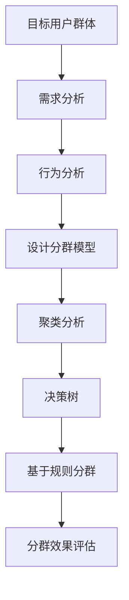

                 

### 文章标题：创业公司的用户分群与个性化服务

在数字化时代，用户分群与个性化服务已成为创业公司成功的关键因素。本文将深入探讨用户分群与个性化服务的重要性、策略方法、案例分析以及未来的挑战和机遇。通过逻辑清晰、结构紧凑、简单易懂的专业技术语言，我们将一步步分析推理，为您提供有深度、有思考、有见解的技术博客文章。

#### 关键词：
- **用户分群**
- **个性化服务**
- **数据分析**
- **机器学习**
- **商业策略**
- **用户体验**

#### 摘要：
本文旨在探讨创业公司如何利用用户分群与个性化服务策略提升用户体验和商业价值。首先介绍用户分群的基础理论，其次讨论个性化服务的概念与实现技术，最后通过实际案例研究和未来展望，分析用户分群与个性化服务的挑战与机遇。希望通过本文，读者能够对用户分群与个性化服务有更深入的理解，并能够应用到实际创业项目中。

### 目录大纲

1. **用户分群概述**
   1.1 用户分群的重要性
   1.2 用户分群的策略与方法
   1.3 用户分群案例研究

2. **用户个性化服务**
   2.1 个性化服务概述
   2.2 个性化服务的技术实现
   2.3 个性化服务案例分析

3. **用户分群与个性化服务实践**
   3.1 制定用户分群策略
   3.2 实施个性化服务策略
   3.3 用户分群与个性化服务案例分析

4. **用户分群与个性化服务的挑战与未来**
   4.1 用户分群与个性化服务的挑战
   4.2 用户分群与个性化服务的未来

### 附录

- **用户分群与个性化服务工具资源**
- **用户分群与个性化服务参考文献**

---

### 用户分群概述

#### 第1章：用户分群基础

在数字化时代，了解用户需求和行为特征是创业公司成功的关键。用户分群作为一种重要的数据分析方法，可以帮助企业更好地理解用户群体，从而制定更精准的市场策略和服务方案。本章将介绍用户分群的重要性、基础理论和策略方法，并通过实际案例解析来帮助读者更好地理解这一概念。

##### 1.1 用户分群的重要性

用户分群对于创业公司具有以下几个方面的意义：

1. **市场定位**：通过用户分群，企业可以更准确地定位目标市场，从而减少市场推广成本，提高市场覆盖率。

2. **产品优化**：用户分群有助于企业了解不同用户群体的需求，从而优化产品设计和服务，提升用户满意度。

3. **商业决策**：基于用户分群的数据分析，企业可以做出更加科学的商业决策，提高运营效率。

4. **营销策略**：用户分群有助于制定更加针对性的营销策略，提升转化率和客户忠诚度。

##### 1.1.1 用户分群的商业价值

用户分群在商业领域的价值主要体现在以下几个方面：

- **个性化营销**：通过用户分群，企业可以针对不同用户群体进行个性化营销，提高营销效果。

- **精准投放**：用户分群可以帮助企业精准定位目标用户，从而提高广告投放的精准度，降低广告费用。

- **用户留存**：通过用户分群，企业可以了解不同用户群体的留存情况，从而制定有效的用户留存策略。

- **用户体验**：用户分群有助于企业更好地了解用户需求，提升用户体验，增强用户粘性。

##### 1.1.2 用户分群的基础理论

用户分群的基础理论包括以下几个方面：

- **用户画像**：用户画像是指通过对用户数据的收集和分析，构建出用户的基本特征、行为习惯和偏好等信息。用户画像可以帮助企业更全面地了解用户，为用户分群提供依据。

- **分群标准**：分群标准是指用于划分用户群体的依据。常见的分群标准包括年龄、性别、地理位置、收入水平、兴趣爱好等。

- **分群方法**：分群方法是指将用户数据按照一定规则进行分类的方法。常见的分群方法包括聚类分析、分类分析、关联规则分析等。

##### 1.2 用户分群的策略与方法

用户分群的策略与方法主要包括以下几个方面：

1. **数据分析**：数据分析是用户分群的基础，通过对用户数据的收集和分析，可以获取用户的基本特征和行为习惯等信息。

2. **用户调研**：用户调研是获取用户需求和偏好的重要手段。通过问卷调查、用户访谈等方式，可以深入了解用户的需求和行为习惯。

3. **市场调研**：市场调研可以帮助企业了解市场趋势和竞争对手的情况，从而更好地制定用户分群策略。

4. **分群模型**：分群模型是指用于划分用户群体的算法模型。常见的分群模型包括基于规则的分群模型、基于数据的分群模型等。

##### 1.2.1 数据分析在用户分群中的应用

数据分析在用户分群中的应用主要体现在以下几个方面：

- **用户行为分析**：通过对用户行为数据的分析，可以了解用户的使用习惯、偏好和需求等。

- **用户画像构建**：通过分析用户数据，可以构建出不同用户群体的画像，为用户分群提供依据。

- **分群效果评估**：通过对用户分群后所采取的营销策略和服务效果的评估，可以不断优化用户分群模型。

##### 1.2.2 用户分群的方法分类

用户分群的方法可以分为以下几类：

- **静态分群**：静态分群是指基于用户的基本信息进行分类，如年龄、性别、地理位置等。

- **动态分群**：动态分群是指基于用户的行为数据进行分类，如用户访问频率、购买行为等。

- **基于规则的分群**：基于规则的分群是指根据预设的规则进行分类，如收入水平、兴趣爱好等。

- **基于数据的分群**：基于数据的分群是指通过数据挖掘和机器学习算法进行分类，如聚类分析、决策树等。

##### 1.2.3 用户分群的实际案例解析

以下是一个用户分群的实际案例：

某创业公司开发了一款社交应用，希望通过对用户进行分群，提升用户活跃度和留存率。该公司采用了以下方法进行用户分群：

1. **用户画像构建**：通过收集用户的基本信息、行为数据等，构建出不同用户群体的画像。

2. **分群标准确定**：根据用户画像，确定分群标准，如年龄、性别、兴趣爱好等。

3. **分群模型建立**：采用聚类分析方法，将用户分为多个群体。

4. **分群效果评估**：通过对分群后所采取的营销策略和服务效果的评估，不断优化分群模型。

通过以上方法，该公司成功提升了用户活跃度和留存率。

##### 1.3 用户分群案例研究

在本节中，我们将探讨两个用户分群案例，一个是成功案例，另一个是失败案例，从中总结经验和教训。

##### 1.3.1 成功用户分群案例分析

案例一：某电商公司通过用户分群提升销售额

背景：某电商公司希望通过用户分群，提升销售额和用户满意度。

解决方案：

1. **用户画像构建**：通过数据分析，构建出不同用户群体的画像，如购物频率高、购买金额大等。

2. **分群标准确定**：根据用户画像，确定分群标准，如购买金额、购物频率等。

3. **分群模型建立**：采用聚类分析方法，将用户分为高价值用户、潜力用户等群体。

4. **分群效果评估**：通过对比分群前后的销售数据和用户满意度，评估分群效果。

结果：通过用户分群，该公司成功提升了销售额和用户满意度。

经验：

- **精准定位**：通过用户分群，公司能够更准确地了解用户需求，为营销策略提供依据。

- **精细化运营**：针对不同用户群体，公司可以采取不同的运营策略，提升用户体验。

##### 1.3.2 失败用户分群案例分析

案例二：某教育公司用户分群失败导致用户流失

背景：某教育公司希望通过用户分群，提升用户参与度和转化率。

解决方案：

1. **用户画像构建**：通过数据分析，构建出不同用户群体的画像，如年龄、性别等。

2. **分群标准确定**：根据用户画像，确定分群标准，如年龄、性别等。

3. **分群模型建立**：采用分类分析方法，将用户分为青少年、成年人等群体。

4. **分群效果评估**：通过对比分群前后的用户参与度和转化率，评估分群效果。

结果：由于分群标准过于简单，未能准确反映用户需求，导致用户参与度和转化率下降。

教训：

- **忽视用户需求**：用户分群应关注用户真实需求，否则会导致分群失败。

- **过于简单的分群标准**：分群标准应涵盖用户的基本特征和行为习惯，过于简单的分群标准可能导致分群失败。

### 总结

通过本章的介绍，我们了解了用户分群的重要性、基础理论和策略方法，并通过实际案例解析，帮助读者更好地理解用户分群的应用和实践。在接下来的章节中，我们将继续探讨个性化服务的概念、技术实现和案例分析，以便为创业公司提供更全面的解决方案。接下来，我们将进入第二部分：用户个性化服务。

---

### 用户个性化服务

#### 第2章：个性化服务概述

个性化服务是数字化时代企业提升用户体验和竞争力的关键。通过为不同用户群体提供定制化的服务，企业可以更好地满足用户需求，提高用户满意度和忠诚度。本章将介绍个性化服务的概念、特征、发展历程及其在现代商业中的应用。

##### 2.1 个性化服务的概念与特征

个性化服务是指根据用户的需求、行为和偏好，提供定制化的服务或产品。其核心特征包括以下几个方面：

1. **用户中心**：个性化服务以用户为中心，关注用户需求和满意度。

2. **定制化**：个性化服务根据用户个性化需求，提供定制化的产品或服务。

3. **互动性**：个性化服务强调与用户的互动，通过数据分析、反馈机制等不断优化服务。

4. **动态性**：个性化服务具有动态性，能够根据用户行为和需求的变化进行实时调整。

##### 2.1.1 个性化服务的定义

个性化服务可以定义为：基于用户数据和行为分析，为用户提供个性化定制的产品、服务和体验的过程。

##### 2.1.2 个性化服务的核心要素

个性化服务的核心要素包括：

- **用户数据**：个性化服务的基础是用户数据，包括用户的基本信息、行为数据、偏好数据等。

- **数据分析**：通过对用户数据的分析，提取用户需求和行为特征，为个性化服务提供依据。

- **定制化**：根据用户需求和偏好，为用户提供定制化的产品或服务。

- **反馈机制**：通过用户反馈，不断优化个性化服务，提升用户体验。

##### 2.1.3 个性化服务的发展历程

个性化服务的发展历程可以分为以下几个阶段：

1. **传统营销阶段**：早期的个性化服务主要依靠市场调研和用户反馈，通过简单的方式为用户提供定制化服务。

2. **数据分析阶段**：随着互联网和大数据技术的发展，企业开始利用数据分析为用户提供个性化服务。

3. **智能推荐阶段**：基于机器学习和数据挖掘技术，智能推荐系统成为个性化服务的重要工具，大大提升了个性化服务的效率和效果。

4. **全面智能化阶段**：随着人工智能技术的发展，个性化服务逐渐实现全面智能化，通过深度学习、自然语言处理等技术，为用户提供更加精准和高效的服务。

##### 2.2 个性化服务的技术实现

个性化服务的技术实现主要包括以下几个方面：

1. **用户画像**：用户画像是指通过对用户数据的分析，构建出用户的基本特征、行为习惯和偏好等信息。用户画像为个性化服务提供了基础数据支持。

2. **推荐系统**：推荐系统是一种基于用户行为和偏好，为用户推荐相关产品或内容的技术。常见的推荐系统包括基于内容的推荐、协同过滤推荐等。

3. **机器学习**：机器学习技术用于分析用户数据，提取用户需求和偏好，为个性化服务提供算法支持。常见的机器学习算法包括决策树、随机森林、神经网络等。

4. **自然语言处理**：自然语言处理技术用于处理用户输入的自然语言，理解用户需求，为个性化服务提供交互支持。

##### 2.2.1 个性化推荐系统

个性化推荐系统是个性化服务的重要组成部分。其基本原理包括：

- **协同过滤**：协同过滤是一种基于用户行为数据，通过计算用户之间的相似度，为用户推荐相似用户喜欢的商品或内容。

  $$similarity(u, v) = \frac{∑_{i \in R(u) \cap R(v)} r_i}{\|R(u)\| \cdot \|R(v)\|}$$

  其中，$u$和$v$表示两个用户，$R(u)$和$R(v)$表示用户$u$和$v$的行为数据集合，$r_i$表示用户$u$对商品$i$的评分。

- **基于内容的推荐**：基于内容的推荐是通过分析商品或内容的特征，为用户推荐与其兴趣相关的商品或内容。

  $$recommender(u, item) = \sum_{i \in I} w_i \cdot sim(content(u), content(i))$$

  其中，$u$表示用户，$item$表示商品，$I$表示商品集合，$w_i$表示商品$i$的特征权重，$sim(content(u), content(i))$表示用户$u$和商品$i$的内容相似度。

##### 2.2.2 数据挖掘与用户画像

数据挖掘和用户画像在个性化服务中起着关键作用。数据挖掘是指从大量数据中提取有价值的信息和知识。用户画像是指通过对用户数据的分析，构建出用户的基本特征、行为习惯和偏好等信息。

数据挖掘的主要任务包括：

- **关联规则挖掘**：关联规则挖掘用于发现数据之间的关联关系，如用户购买商品的关联关系。

  $$rule(X, Y) = \{X, Y\} \land support(X, Y) > threshold$$

  其中，$X$和$Y$表示数据集，$support(X, Y)$表示$X$和$Y$同时出现的支持度，$threshold$表示支持度的阈值。

- **聚类分析**：聚类分析用于将相似的数据分组，如将用户分为不同的群体。

  $$clustering(data, k) = \{C_1, C_2, ..., C_k\}$$

  其中，$data$表示数据集，$k$表示聚类个数，$C_i$表示第$i$个聚类。

用户画像的构建步骤包括：

1. **数据收集**：收集用户的基本信息、行为数据、偏好数据等。

2. **数据预处理**：对收集到的数据进行分析和清洗，去除噪声数据。

3. **特征提取**：从预处理后的数据中提取用户特征，如性别、年龄、地理位置、购买历史等。

4. **特征选择**：对提取的用户特征进行选择，保留对用户行为和偏好有重要影响的特征。

5. **建模与评估**：构建用户画像模型，并对模型进行评估和优化。

##### 2.2.3 机器学习在个性化服务中的应用

机器学习在个性化服务中发挥着重要作用。通过机器学习技术，企业可以更准确地预测用户需求，为用户提供更加个性化的服务。

常见的机器学习算法包括：

- **线性回归**：线性回归是一种用于预测连续值的算法，可以用于预测用户行为。

  $$y = \beta_0 + \beta_1 \cdot x_1 + \beta_2 \cdot x_2 + ... + \beta_n \cdot x_n$$

  其中，$y$表示预测值，$x_1, x_2, ..., x_n$表示输入特征，$\beta_0, \beta_1, ..., \beta_n$表示模型参数。

- **决策树**：决策树是一种用于分类和回归的算法，可以根据用户特征进行决策。

  ```python
  def predict(node, x):
      if node.is_leaf:
          return node.label
      else:
          feature = node.feature
          value = x[feature]
          if value <= node.threshold:
              return predict(node.left, x)
          else:
              return predict(node.right, x)
  ```

- **支持向量机**：支持向量机是一种用于分类的算法，可以用于预测用户类别。

  $$w = arg\min_{w} \frac{1}{2} ||w||^2 + C \cdot \sum_{i=1}^{n} \xi_i$$

  其中，$w$表示模型参数，$\xi_i$表示误差项，$C$表示惩罚参数。

##### 2.3 个性化服务案例分析

在本节中，我们将探讨两个个性化服务的案例，一个是成功案例，另一个是失败案例。

##### 2.3.1 成功个性化服务案例分析

案例一：某电商公司通过个性化推荐提升销售额

背景：某电商公司希望通过个性化推荐系统，提升用户购买转化率和销售额。

解决方案：

1. **数据收集**：收集用户的基本信息、行为数据、偏好数据等。

2. **数据预处理**：对收集到的数据进行清洗和预处理，去除噪声数据。

3. **特征提取**：从预处理后的数据中提取用户特征，如浏览历史、购买历史、评价等。

4. **构建推荐模型**：采用协同过滤算法，构建个性化推荐模型。

5. **推荐策略优化**：通过用户反馈，不断优化推荐策略，提升推荐效果。

结果：通过个性化推荐，该公司成功提升了用户购买转化率和销售额。

经验：

- **精准推荐**：通过个性化推荐，企业能够为用户提供更精准的推荐，提升用户体验。

- **实时调整**：通过用户反馈，企业可以实时调整推荐策略，不断优化推荐效果。

##### 2.3.2 失败个性化服务案例分析

案例二：某金融公司个性化服务失败导致用户流失

背景：某金融公司希望通过个性化服务，提升用户满意度和忠诚度。

解决方案：

1. **数据收集**：收集用户的基本信息、行为数据、偏好数据等。

2. **数据预处理**：对收集到的数据进行清洗和预处理，去除噪声数据。

3. **特征提取**：从预处理后的数据中提取用户特征，如投资历史、风险偏好等。

4. **构建个性化服务模型**：采用机器学习算法，构建个性化服务模型。

5. **服务策略实施**：根据个性化服务模型，为用户提供个性化服务。

结果：由于个性化服务模型过于复杂，未能准确反映用户需求，导致用户满意度下降，部分用户流失。

教训：

- **用户需求**：个性化服务应关注用户需求，否则可能导致服务失败。

- **模型简化**：个性化服务模型应尽量简化，避免过于复杂，否则可能导致实施困难。

### 总结

通过本章的介绍，我们了解了个性化服务的概念、特征、发展历程及其在现代商业中的应用。通过实际案例解析，我们总结了成功经验和教训，为创业公司提供了有价值的参考。在接下来的章节中，我们将探讨用户分群与个性化服务的实践策略，以便为创业公司提供更全面的解决方案。接下来，我们将进入第三部分：用户分群与个性化服务实践。

---

### 用户分群与个性化服务实践

#### 第3章：用户分群与个性化服务策略

用户分群与个性化服务不仅是理论上的重要概念，更需要通过实践来验证其有效性。在本章中，我们将深入探讨如何制定用户分群策略、实施个性化服务策略，并通过成功和失败的案例研究，为创业公司提供实际操作的指导。

##### 3.1 制定用户分群策略

制定有效的用户分群策略是创业公司成功的第一步。以下是一些关键步骤和建议：

###### 3.1.1 确定目标用户群体

首先，创业公司需要明确目标用户群体。这可以通过市场调研、用户访谈和数据分析等多种方法来实现。以下是一些确定目标用户群体的步骤：

- **市场调研**：通过市场调研，了解目标市场的需求和趋势，识别潜在的用户群体。
- **用户访谈**：与现有用户进行深度访谈，了解他们的需求和偏好。
- **数据分析**：利用数据分析工具，分析现有用户数据，识别具有相似特征的用户群体。

例如，假设一家电商公司想要确定其目标用户群体，可以通过以下方式：

1. **市场调研**：分析市场报告，了解电商行业的用户特征和消费习惯。
2. **用户访谈**：与现有用户进行访谈，了解他们对产品、价格、服务等的偏好。
3. **数据分析**：通过数据分析，识别购买频次高、消费金额大的用户群体。

###### 3.1.2 分析用户需求和行为特征

确定目标用户群体后，创业公司需要进一步分析用户的需求和行为特征。这包括：

- **需求分析**：了解用户的主要需求和痛点，例如，用户为什么选择该产品，他们的期望是什么。
- **行为分析**：分析用户的行为数据，如浏览路径、购买频率、评价等，了解用户的行为模式。

例如，通过数据分析，一家电商公司发现其目标用户中有50%的用户在购物时优先考虑产品的评价，而30%的用户则更关注价格。这些信息可以帮助公司优化其营销策略。

###### 3.1.3 设计用户分群模型

基于需求和行为分析，创业公司需要设计用户分群模型。以下是一些常见的分群方法：

- **聚类分析**：将用户分为若干个群体，每个群体内的用户特征相似，群体间特征差异较大。
- **决策树**：根据用户的特征值，将用户分为不同的群体。
- **基于规则的分群**：根据预设的规则，如年龄、收入、地理位置等，将用户分为不同的群体。

例如，一家电商公司可以通过聚类分析方法，将用户分为“高价值用户”、“中价值用户”和“低价值用户”三个群体。



###### 3.1.4 分群效果评估

在制定用户分群模型后，创业公司需要对分群效果进行评估。以下是一些评估方法：

- **A/B测试**：通过对比不同分群策略的效果，评估其优劣。
- **用户反馈**：通过用户反馈，了解用户对不同分群策略的接受程度和满意度。
- **业务指标**：通过业务指标，如销售额、用户留存率等，评估分群策略的成效。

例如，一家电商公司可以通过A/B测试，对比不同分群策略对用户购买转化率的影响，从而确定最佳策略。

##### 3.2 实施个性化服务策略

在制定用户分群策略后，创业公司需要将这些策略付诸实践。以下是一些实施个性化服务策略的步骤：

###### 3.2.1 确定个性化服务目标

创业公司需要明确个性化服务的目标，例如提升用户满意度、增加销售额等。目标应具体、可衡量，以便于实施和评估。

例如，一家电商公司设定目标为通过个性化推荐系统，提升用户购买转化率10%。

###### 3.2.2 构建个性化服务方案

在确定目标后，创业公司需要构建个性化服务方案。以下是一些构建方案的方法：

- **个性化推荐**：基于用户画像和用户行为数据，为用户推荐个性化的商品或服务。
- **定制化服务**：根据用户需求，为用户提供定制化的产品或服务。
- **互动营销**：通过用户互动，了解用户需求，提供个性化的营销策略。

例如，一家电商公司可以构建以下个性化服务方案：

1. **个性化推荐**：基于用户的浏览历史和购买记录，推荐相关的商品。
2. **定制化服务**：根据用户的购物车内容，提供定制化的购物方案。
3. **互动营销**：通过用户评论和反馈，了解用户需求，提供个性化的促销活动。

###### 3.2.3 个性化服务的执行与优化

在构建个性化服务方案后，创业公司需要将其付诸实施，并通过持续优化，提升服务质量。以下是一些执行与优化的方法：

- **实施监控**：实时监控个性化服务的实施情况，如推荐效果、用户满意度等。
- **用户反馈**：收集用户反馈，了解个性化服务的实际效果，发现潜在问题。
- **持续优化**：根据用户反馈和实施监控的结果，不断优化个性化服务。

例如，一家电商公司可以采取以下措施：

1. **实施监控**：通过分析推荐系统的数据，了解推荐效果，如点击率、转化率等。
2. **用户反馈**：通过用户问卷调查和评论，了解用户对个性化推荐的满意度。
3. **持续优化**：根据用户反馈和实施监控的结果，调整推荐算法和策略，提升推荐效果。

##### 3.3 用户分群与个性化服务案例分析

在本节中，我们将探讨两个案例，一个是成功案例，另一个是失败案例。

###### 3.3.1 成功实践案例分析

案例一：某电商公司通过用户分群与个性化服务提升销售额

背景：某电商公司希望通过用户分群与个性化服务，提升用户购买转化率和销售额。

解决方案：

1. **用户分群**：通过聚类分析，将用户分为“高价值用户”、“中价值用户”和“低价值用户”三个群体。
2. **个性化推荐**：基于用户分群，为不同用户群体提供个性化的商品推荐。
3. **定制化服务**：根据用户分群，提供定制化的购物方案和促销活动。
4. **持续优化**：通过用户反馈和数据分析，不断优化个性化服务和用户分群策略。

结果：通过用户分群与个性化服务，该公司成功提升了用户购买转化率和销售额，实现了业务增长。

经验：

- **精准分群**：通过用户分群，公司能够为用户提供更精准的推荐，提升用户体验。
- **持续优化**：通过持续优化个性化服务和用户分群策略，公司能够不断提升服务质量和用户满意度。

###### 3.3.2 失败实践案例分析

案例二：某金融公司用户分群与个性化服务失败导致用户流失

背景：某金融公司希望通过用户分群与个性化服务，提升用户满意度和忠诚度。

解决方案：

1. **用户分群**：通过决策树算法，将用户分为“高风险用户”、“中风险用户”和“低风险用户”三个群体。
2. **个性化服务**：根据用户分群，为不同用户群体提供个性化的金融产品和服务。
3. **用户互动**：通过在线客服和用户问卷调查，了解用户需求，提供个性化服务。

结果：由于分群标准过于复杂，未能准确反映用户需求，导致用户满意度下降，部分用户流失。

教训：

- **用户需求**：个性化服务应关注用户需求，否则可能导致服务失败。
- **分群简化**：用户分群应尽量简化，避免过于复杂，否则可能导致实施困难。

### 总结

通过本章的介绍，我们了解了如何制定用户分群策略、实施个性化服务策略，并通过实际案例研究，总结了成功经验和教训。用户分群与个性化服务不仅是理论上的重要概念，更需要通过实践来验证其有效性。在接下来的章节中，我们将探讨用户分群与个性化服务的挑战与未来，以便为创业公司提供更全面的视角。接下来，我们将进入第四部分：用户分群与个性化服务的挑战与未来。

---

### 用户分群与个性化服务的挑战与未来

随着数字化和人工智能技术的飞速发展，用户分群与个性化服务已成为企业提升用户体验和竞争力的关键策略。然而，这一过程中也面临诸多挑战，需要企业在技术创新、法律法规、数据安全和隐私保护等方面进行深入思考和策略制定。以下将详细探讨用户分群与个性化服务面临的挑战以及未来的发展趋势。

##### 4.1 用户分群与个性化服务的挑战

###### 4.1.1 用户隐私保护与法律法规

随着用户数据的不断积累和分析，隐私保护成为用户分群与个性化服务的重要挑战。用户担忧自己的个人信息被滥用，导致隐私泄露和隐私侵犯。以下是一些相关问题和解决方案：

- **隐私泄露风险**：用户数据在收集、存储、传输和处理过程中可能面临泄露风险。
  - **解决方案**：采用加密技术保护用户数据，确保数据在传输和存储过程中的安全性。

- **合规性问题**：企业在进行用户分群和个性化服务时，需要遵守相关法律法规，如《通用数据保护条例》（GDPR）和《加州消费者隐私法》（CCPA）等。
  - **解决方案**：企业应建立完善的隐私保护政策和合规性管理体系，确保数据处理过程符合法律法规要求。

- **用户知情权**：用户应有权了解自己的数据如何被使用，以及如何撤回同意。
  - **解决方案**：通过隐私政策告知用户数据处理方式，提供便捷的撤回同意渠道。

###### 4.1.2 数据质量和数据安全

用户分群与个性化服务依赖于高质量的数据。然而，数据质量问题和数据安全问题始终是企业发展过程中的关键挑战。

- **数据质量**：数据不准确、不完整或存在噪声，会影响用户分群和个性化服务的准确性。
  - **解决方案**：建立数据质量管理流程，对数据进行清洗、验证和监控，确保数据质量。

- **数据安全**：用户数据在收集、存储、传输和处理过程中可能面临黑客攻击和数据泄露的风险。
  - **解决方案**：采用多重安全措施，如防火墙、加密、访问控制等，确保数据安全。

###### 4.1.3 技术发展与创新

技术发展和创新是用户分群与个性化服务的重要驱动力。然而，技术的快速迭代也带来了新的挑战。

- **技术复杂度**：随着技术的发展，用户分群与个性化服务涉及的技术越来越复杂，如深度学习、图神经网络等。
  - **解决方案**：企业应培养技术人才，紧跟技术发展趋势，不断提升技术能力。

- **技术适应性**：新技术的引入需要企业不断调整和优化现有的用户分群与个性化服务策略。
  - **解决方案**：企业应建立敏捷的技术团队，快速响应技术变化，持续优化服务策略。

##### 4.2 用户分群与个性化服务的未来

随着人工智能和大数据技术的不断进步，用户分群与个性化服务的未来充满机遇。以下是一些未来的发展趋势：

###### 4.2.1 人工智能在用户分群与个性化服务中的应用

人工智能技术的快速发展为用户分群与个性化服务带来了新的可能性。以下是一些关键趋势：

- **深度学习**：深度学习在图像识别、语音识别和自然语言处理等领域取得了显著进展，为用户分群和个性化推荐提供了强大的算法支持。
  - **解决方案**：企业可以采用深度学习技术，提升用户分群和个性化推荐的准确性。

- **增强学习**：增强学习通过模拟用户行为，为个性化服务提供实时调整和优化。
  - **解决方案**：企业可以利用增强学习技术，实现更加动态和自适应的个性化服务。

- **多模态学习**：多模态学习能够整合不同类型的数据，提供更全面的用户画像和个性化服务。
  - **解决方案**：企业可以采用多模态学习技术，提升用户分群和个性化服务的精度。

###### 4.2.2 个性化服务的未来方向

个性化服务的发展方向包括以下几个方面：

- **精细化**：随着用户需求的多样化，个性化服务将更加精细化，满足用户的个性化需求。
  - **解决方案**：企业应深入挖掘用户数据，提供更加精细化的产品和服务。

- **互动性**：个性化服务将更加注重用户互动，通过实时反馈和互动，提升用户体验。
  - **解决方案**：企业可以采用互动式推荐、用户参与式设计等方式，增强用户互动。

- **智能化**：随着人工智能技术的发展，个性化服务将更加智能化，实现自动化和自我优化。
  - **解决方案**：企业应积极引入人工智能技术，实现个性化服务的智能化转型。

##### 4.3 案例展望

在未来，用户分群与个性化服务将在多个领域展现其强大的应用潜力。以下是一些案例展望：

- **医疗健康**：通过用户分群和个性化服务，医疗健康企业可以为患者提供定制化的治疗方案和健康建议。
  - **解决方案**：企业可以结合用户健康数据，提供个性化的健康管理服务。

- **金融理财**：金融企业可以通过用户分群，为不同风险承受能力的用户推荐个性化的投资产品。
  - **解决方案**：企业可以利用用户财务数据，实现精准的投资推荐。

- **教育**：教育机构可以通过用户分群，为不同学习需求的用户推荐个性化的学习内容和课程。
  - **解决方案**：企业可以结合用户学习数据，提供定制化的教育服务。

##### 4.4 挑战与机遇并存

用户分群与个性化服务在未来的发展中既面临挑战，也充满机遇。企业需要：

- **持续创新**：不断引入新技术，提升用户分群和个性化服务的精度和效率。
- **合规经营**：严格遵守法律法规，确保用户隐私和数据安全。
- **用户信任**：注重用户反馈和互动，建立用户信任，提升用户体验。

### 总结

通过本章的探讨，我们了解了用户分群与个性化服务在当前面临的挑战以及未来的发展趋势。随着技术的不断进步，用户分群与个性化服务将发挥越来越重要的作用。企业应积极应对挑战，把握机遇，通过技术创新和合规经营，不断提升用户体验和商业价值。在接下来的章节中，我们将为读者提供一些用户分群与个性化服务的工具资源和参考文献，以便进一步深入了解这一领域。

### 附录

#### A.1 用户分群与个性化服务工具资源

以下是一些常用的用户分群与个性化服务工具资源，供读者参考：

- **数据分析工具**：
  - Google Analytics：一款强大的数据分析工具，可以帮助企业了解用户行为和需求。
  - Tableau：一款数据可视化工具，可以将用户数据以图表形式直观展示。

- **机器学习库**：
  - Scikit-learn：一款开源的机器学习库，提供丰富的算法和工具，适用于用户分群和个性化推荐。
  - TensorFlow：一款由谷歌开发的开源机器学习框架，支持深度学习和增强学习。

- **用户画像工具**：
  - Usermap：一款用户画像构建工具，可以帮助企业创建用户画像和分群策略。
  - Mixpanel：一款用户行为分析工具，可以追踪和分析用户行为，为个性化服务提供数据支持。

- **推荐系统平台**：
  - Amazon Personalize：一款基于云的推荐系统平台，支持实时个性化推荐。
  - RedisAI：一款支持人工智能模型的Redis扩展，可用于构建高效的个性化推荐系统。

#### A.2 用户分群与个性化服务参考文献

以下是一些用户分群与个性化服务的参考文献，供读者进一步学习：

- **《数据挖掘：实用机器学习技术》**，由G. H.rish、D. McSherry和A. M. Patel著，提供了详细的数据挖掘和机器学习技术介绍。
- **《机器学习：概率视角》**，由D. J. C. MacKay著，深入探讨了机器学习的概率理论和方法。
- **《用户画像与精准营销》**，由王祥荣著，介绍了用户画像构建和个性化推荐的实际应用案例。
- **《个性化服务与用户体验》**，由刘峰著，探讨了个性化服务在提升用户体验方面的应用和实践。

---

### 结语

本文通过系统性地探讨用户分群与个性化服务的重要性、策略方法、案例分析以及未来展望，为创业公司提供了全面的指导。用户分群与个性化服务不仅能够提升用户体验和商业价值，还能够帮助企业更好地应对市场变化和竞争挑战。希望本文能够为读者在实践过程中提供有价值的参考。

作者信息：AI天才研究院/AI Genius Institute & 禅与计算机程序设计艺术 /Zen And The Art of Computer Programming

### 注意事项与最佳实践

在用户分群与个性化服务的实施过程中，需要注意以下几点：

- **用户隐私保护**：严格遵守法律法规，确保用户数据安全，并告知用户数据处理方式和隐私政策。
- **数据质量**：确保数据准确、完整和最新，定期进行数据清洗和验证，以提高分群和个性化服务的准确性。
- **持续优化**：根据用户反馈和业务指标，不断优化分群和个性化服务策略，提升用户体验和满意度。
- **技术选型**：根据业务需求和技术能力，选择合适的数据分析、机器学习和推荐系统工具。

拓展阅读：

- **《用户画像构建与应用》**，详细介绍了用户画像的构建方法和应用场景。
- **《个性化推荐系统：理论与实践》**，探讨了个性化推荐系统的算法原理和实现方法。

### 结语

感谢您的阅读，希望本文能帮助您更好地理解用户分群与个性化服务，并在实际项目中取得成功。在数字化时代，不断创新和优化用户分群与个性化服务策略，将成为企业赢得市场竞争的关键。祝您在创业之路上取得丰硕成果！

