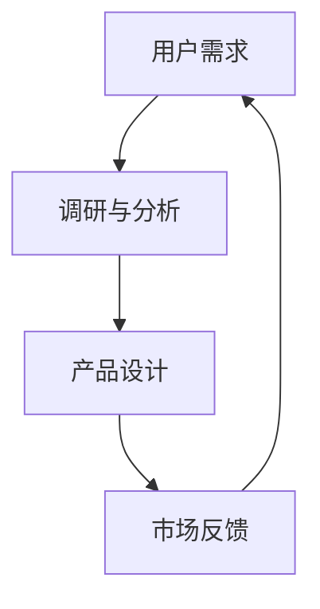
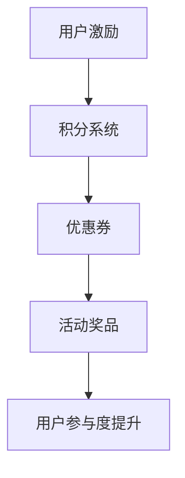
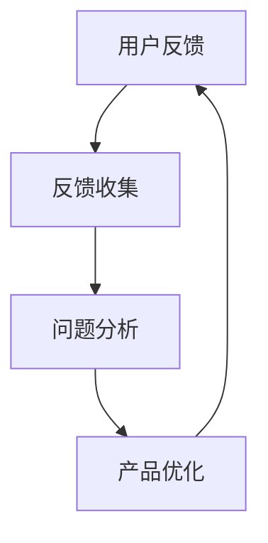
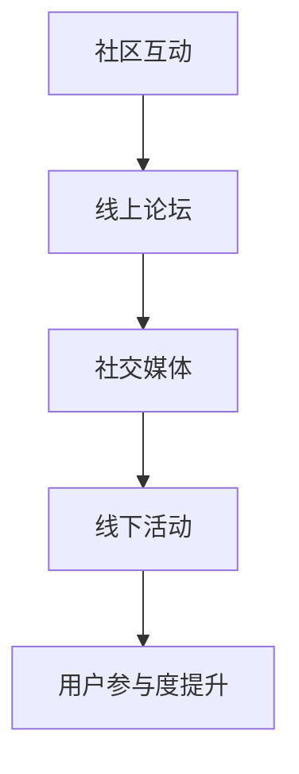
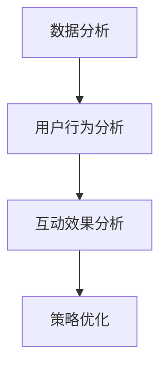

                 

### 引言与概述

#### 《创业公司的用户参与度提升与互动策略》概述

在当前的数字经济时代，创业公司面临着前所未有的机遇与挑战。市场环境的快速变化、竞争的加剧以及用户需求的多样化，使得创业公司必须在用户参与度和互动策略上具备独特的优势，才能在激烈的市场竞争中脱颖而出。因此，《创业公司的用户参与度提升与互动策略》应运而生，旨在为创业公司提供一套系统、可操作的用户参与度提升与互动策略，帮助它们在市场中站稳脚跟，实现可持续发展。

本书的编写背景源于我们对创业公司用户参与度和互动策略的深入研究，以及大量实际案例的分析与总结。在多年的实践中，我们发现在创业过程中，用户参与度和互动策略的有效性直接关系到产品的成功与否。因此，本书将围绕这一核心主题，从理论到实践，为创业公司提供全方位的指导。

#### 核心内容与主题思想

本书的核心内容分为三个部分，共九章：

- **第一部分：用户参与度与互动策略基础**，包括用户参与度的定义、重要性、互动策略的概念与作用等基础理论，为后续的实践提供理论支持。
- **第二部分：用户参与度提升方法与实践**，详细介绍了用户需求分析、用户激励、用户反馈等提升用户参与度的具体方法，并通过实际案例进行深入剖析。
- **第三部分：互动策略与案例分析**，重点探讨了社区互动、在线活动、用户反馈系统等互动策略的实施与优化，并结合具体案例进行解读。

本书的主题思想在于：通过系统性的用户参与度提升与互动策略，帮助创业公司更好地了解用户需求，提升用户满意度，增强用户忠诚度，从而在激烈的市场竞争中立于不败之地。

### 目标读者

本书的目标读者主要包括以下几类：

1. **创业公司创始人、CEO、COO等高层管理人员**：本书将为这些领导者提供系统性的用户参与度提升与互动策略，帮助他们更好地把握市场机遇，实现企业目标。

2. **市场营销经理、用户运营经理、产品经理等相关从业者**：针对这些实际操作的从业者，本书将提供实用的工具和方法，帮助他们提升用户参与度和互动效果。

3. **希望深入了解用户参与度提升与互动策略的研究人员和学者**：本书将通过理论与实践的结合，为学术研究提供新的视角和思路。

### 书籍结构

本书分为三个部分，共九章，具体结构如下：

- **第一部分：用户参与度与互动策略基础**，包括第1章到第3章。
  - **第1章 引言与概述**：介绍本书的背景、核心内容、目标读者和书籍结构。
  - **第2章 用户参与度与互动策略基础**：详细解释用户参与度和互动策略的基本概念。
  - **第3章 用户参与度与互动策略的核心要素**：探讨用户需求、用户激励、用户反馈和社区互动等核心要素。

- **第二部分：用户参与度提升方法与实践**，包括第4章到第6章。
  - **第4章 用户需求分析**：介绍如何通过用户调研和数据分析来了解用户需求。
  - **第5章 用户激励策略**：探讨如何通过积分、优惠券、活动奖品等手段来激励用户参与。
  - **第6章 用户反馈与优化**：介绍用户反馈机制的重要性，以及如何通过用户反馈来优化产品和服务。

- **第三部分：互动策略与案例分析**，包括第7章到第9章。
  - **第7章 社区互动**：探讨如何通过线上论坛、社交媒体、线下活动等方式建立用户社区。
  - **第8章 在线活动**：介绍如何设计并实施在线活动，提升用户参与度。
  - **第9章 互动策略与案例分析**：通过具体案例展示如何实施和优化互动策略。

### 本书的主要贡献

本书的主要贡献体现在以下几个方面：

1. **提供了一套完整的用户参与度提升与互动策略框架**：本书通过系统的理论和实践指导，为创业公司提供了一套可操作的用户参与度提升与互动策略框架。

2. **通过案例分析，展示了成功提升用户参与度和互动的策略与经验**：本书通过大量实际案例，详细分析了成功提升用户参与度和互动的策略与经验，为读者提供了宝贵的实践参考。

3. **结合实际案例，介绍了如何具体实施和优化用户参与度与互动策略**：本书不仅提供了理论指导，还通过实际案例，详细介绍了如何具体实施和优化用户参与度与互动策略，使读者能够更好地应用这些策略。

### 前言

在快速变化的市场环境中，创业公司要想成功，必须与用户保持紧密互动，不断提升用户参与度。本书旨在为创业公司提供实用的策略和方法，帮助它们在用户参与度和互动策略上实现突破，从而在激烈的市场竞争中脱颖而出。

通过系统性的用户参与度提升与互动策略，创业公司可以更好地了解用户需求，提升用户满意度，增强用户忠诚度。这不仅有助于企业短期内的业绩提升，更为其长期可持续发展奠定坚实基础。

本书的结构和内容经过精心设计，旨在帮助读者逐步掌握用户参与度提升与互动策略的核心知识和技巧。通过本书的学习，读者将能够：

- 理解用户参与度和互动策略的基本概念和重要性。
- 掌握用户需求分析、用户激励、用户反馈等提升用户参与度的具体方法。
- 学会设计并实施有效的互动策略，提升用户参与度和互动效果。
- 通过案例分析，了解成功提升用户参与度和互动的策略与经验。

让我们共同探索用户参与度提升与互动策略的奥秘，为创业公司的成功之路提供有力支持。

---

### 第一部分：用户参与度与互动策略基础

#### 用户参与度的定义与重要性

##### 2.1 用户参与度的定义

用户参与度是指用户在使用产品或服务过程中，主动参与、投入精力的程度。它可以通过用户的活跃度、忠诚度、满意度等多个维度来衡量。具体来说，用户参与度可以体现为以下几个方面：

1. **活跃度**：用户在产品或服务中的活跃程度，如登录频率、使用时长、互动频率等。活跃度高的用户往往更愿意参与产品的互动和社区活动。

2. **忠诚度**：用户对产品或服务的持续使用和信任程度。忠诚度高的用户不仅会持续使用产品，还可能为产品提供正面评价和推荐。

3. **满意度**：用户对产品或服务的整体满意程度。高满意度的用户更愿意为产品付费，并在社交媒体上分享产品体验。

##### 2.2 用户参与度的重要性

用户参与度在创业公司的运营中具有重要意义，主要体现在以下几个方面：

1. **提升用户满意度**：通过提升用户参与度，创业公司可以更好地了解用户需求，提供更符合用户期望的产品和服务，从而提高用户满意度。

2. **增强用户忠诚度**：高参与度的用户往往对产品或服务有更深的感情，更愿意持续使用并推荐给他人，从而增强用户忠诚度。

3. **降低用户流失率**：参与度高的用户对产品的依赖性更强，流失率相对较低。通过提升用户参与度，创业公司可以有效降低用户流失率。

4. **产品优化与迭代**：高参与度的用户更愿意为产品提供反馈，帮助创业公司不断优化和迭代产品，提高产品质量和市场竞争力。

5. **品牌建设与传播**：通过提升用户参与度，创业公司可以建立强大的品牌社区，利用用户的口碑传播和社交媒体分享，提高品牌知名度和美誉度。

#### 互动策略的概念与作用

##### 2.3 互动策略的概念

互动策略是指创业公司在与用户互动过程中采取的一系列有目的、有计划的行动，旨在提高用户参与度和满意度。这些行动可以包括用户调研、反馈收集、用户激励、在线活动等。

##### 2.4 互动策略的作用

1. **提高用户参与度**：通过互动策略，创业公司可以激发用户的参与热情，提高用户活跃度、忠诚度和满意度。

2. **了解用户需求**：互动策略帮助创业公司更好地了解用户需求，为产品优化和迭代提供依据。

3. **优化用户体验**：通过互动策略，创业公司可以及时收集用户反馈，优化产品和服务，提高用户体验。

4. **增强品牌忠诚度**：与用户保持紧密互动，有助于增强用户对品牌的信任和忠诚度。

5. **提升市场竞争力**：高效的互动策略有助于提高品牌知名度和美誉度，从而提升市场竞争力。

#### 用户参与度与互动策略的核心要素

##### 2.5 用户需求

用户需求是提升用户参与度的核心要素之一。了解用户需求有助于创业公司提供更符合用户期望的产品和服务。

- **需求调研**：创业公司可以通过问卷调查、访谈、用户行为分析等方式，了解用户的需求和痛点。
- **需求分析**：对收集到的用户需求进行分析，找出共性需求和高频需求，为产品优化提供方向。

##### 2.6 用户激励

用户激励是提高用户参与度的重要手段。通过提供各种激励措施，创业公司可以激发用户的参与热情。

- **积分系统**：为用户积累积分，用于兑换产品或服务。
- **优惠券**：为用户提供优惠券，鼓励用户持续使用产品。
- **活动奖品**：举办各类活动，为积极参与的用户提供奖品。

##### 2.7 用户反馈

用户反馈是优化产品和服务的重要依据。创业公司需要建立完善的用户反馈机制，及时收集并分析用户反馈。

- **反馈渠道**：提供多种反馈渠道，如在线反馈表、社交媒体、客服等，方便用户表达意见和建议。
- **反馈分析**：对用户反馈进行分类、分析，找出共性问题，为产品优化提供参考。

##### 2.8 社区互动

社区互动是提升用户参与度的重要途径。通过建立用户社区，创业公司可以促进用户之间的互动，提高用户黏性。

- **线上论坛**：建立线上论坛，为用户提供交流、分享的平台。
- **社交媒体**：利用社交媒体平台，与用户进行实时互动。
- **线下活动**：举办线下活动，增强用户之间的联系。

#### 用户参与度与互动策略的实施步骤

##### 2.9 确定目标与策略

明确提升用户参与度和互动的目标，制定相应的策略。例如，提高用户活跃度、增强用户忠诚度、提升用户满意度等。

##### 2.10 设计互动活动

设计具有吸引力的互动活动，激发用户的参与热情。互动活动可以包括线上竞赛、抽奖、讲座等。

##### 2.11 激励用户参与

通过用户激励措施，提高用户的参与积极性。例如，提供积分、优惠券、活动奖品等。

##### 2.12 收集用户反馈

建立用户反馈机制，收集用户反馈，优化产品或服务。反馈机制可以包括在线反馈表、客服反馈等。

##### 2.13 持续改进

根据用户反馈和互动效果，持续优化用户参与度与互动策略。通过数据分析，了解策略的优劣势，为优化提供依据。

### 用户参与度与互动策略的评估与优化

##### 2.14 评估指标

设定合理的评估指标，如用户活跃度、满意度、参与度等，对互动策略的实施效果进行评估。

##### 2.15 数据分析

通过数据分析，了解用户参与度和互动策略的优劣势。数据分析可以包括用户行为分析、用户反馈分析等。

##### 2.16 持续优化

根据评估结果和数据分析，持续优化用户参与度与互动策略。优化措施可以包括调整互动活动设计、改进用户激励措施、优化用户反馈机制等。

### 用户参与度与互动策略的挑战与应对

##### 2.17 挑战

1. **用户需求多样化**：如何满足不同用户的需求。
2. **用户参与度提升与成本控制**：如何在提升用户参与度的同时，控制成本。
3. **用户互动数据的安全性和隐私保护**：如何保障用户互动数据的安全性和隐私保护。

##### 2.18 应对策略

1. **精准定位用户需求**：通过用户调研和数据分析，精准定位用户需求，提供个性化产品和服务。
2. **优化成本结构**：通过精细化运营和数据分析，优化成本结构，提高用户参与度与互动策略的性价比。
3. **数据安全与隐私保护**：采用先进的数据加密技术和隐私保护措施，确保用户互动数据的安全性和隐私性。

---

## 用户参与度的定义与重要性

在讨论创业公司的用户参与度提升与互动策略之前，我们首先需要明确用户参与度的定义及其重要性。用户参与度，顾名思义，指的是用户在产品或服务使用过程中所表现出的主动性和投入程度。这种参与可以是积极的，比如用户在社区中分享意见、参与讨论，或者是使用频率的增加；也可以是消极的，比如对产品或服务提出改进建议、反馈问题。用户参与度是一个多维度的概念，它可以从不同的角度来衡量用户对产品或服务的关注度、兴趣度和忠诚度。

### 用户参与度的定义

用户参与度通常包含以下几个关键维度：

1. **活跃度**：这是衡量用户在产品或服务中活动频繁程度的一个指标。活跃度可以通过用户的登录频率、使用时长、互动频率等数据进行量化。例如，一个高频使用的用户可能会每天登录应用程序并参与社区讨论，这样的用户活跃度就比较高。

2. **忠诚度**：忠诚度反映的是用户对产品或服务的持续使用和信任程度。一个忠诚度高的用户不仅会在长期内持续使用产品，还可能对产品或服务产生情感依赖，甚至成为产品的代言人。忠诚度可以通过用户的重复购买率、持续使用时间、推荐率等指标来衡量。

3. **满意度**：满意度是用户对产品或服务整体体验的主观评价。一个满意的用户通常会对产品或服务表现出积极的反馈，如给予正面评价、在社交媒体上分享体验等。满意度可以通过用户满意度调查、用户评分等数据来衡量。

4. **参与深度**：参与深度指的是用户在产品或服务中的参与程度，包括用户是否积极参与产品测试、提供反馈、参与决策等。深度参与的用户往往对产品有更深入的了解和情感投入。

### 用户参与度的重要性

用户参与度对于创业公司来说，不仅是一个衡量用户满意度和忠诚度的指标，更是决定产品或服务成功与否的关键因素。以下是用户参与度对创业公司的重要影响：

1. **提升用户满意度**：用户参与度高的产品或服务能够更好地满足用户需求，从而提高用户的整体满意度。通过用户的积极参与，创业公司可以更好地了解用户期望，提供更加个性化的产品和服务，进而提升用户满意度。

2. **增强用户忠诚度**：参与度高的用户往往对产品或服务有更深的情感依赖，更愿意持续使用和推荐给他人。这种忠诚度有助于降低用户流失率，提高用户生命周期价值。

3. **降低用户流失率**：积极参与的用户对产品的依赖性更强，流失率相对较低。通过提升用户参与度，创业公司可以有效降低用户流失率，保持用户群体的稳定性。

4. **产品优化与迭代**：高参与度的用户更愿意为产品提供反馈，这些反馈是产品优化和迭代的重要依据。通过用户的积极参与，创业公司可以不断改进产品，提高产品质量和市场竞争力。

5. **品牌建设与传播**：用户参与度提升有助于建立品牌忠诚度和社区氛围。用户在社区中的互动和分享，可以增加品牌的曝光度和美誉度，从而促进品牌的传播。

6. **市场竞争力**：用户参与度高意味着用户对产品有较高的认可度，这可以显著提升企业的市场竞争力。在竞争激烈的市场中，高参与度的用户群体是企业的重要资产。

综上所述，用户参与度不仅是衡量用户满意度、忠诚度和产品成功与否的重要指标，更是创业公司在市场中立足的关键。通过深入了解用户参与度的概念和重要性，创业公司可以更有针对性地制定用户参与度提升策略，从而在激烈的市场竞争中脱颖而出。

### 互动策略的概念与作用

互动策略是指创业公司在与用户互动过程中采取的一系列有目的、有计划的行动，旨在提高用户参与度和满意度。这些行动可以包括用户调研、反馈收集、用户激励、在线活动等。互动策略不仅是一种营销手段，更是一种深度参与用户、理解用户需求的重要途径。下面，我们将详细探讨互动策略的概念、作用和核心要素。

#### 互动策略的概念

互动策略的核心在于“互动”二字。这里的互动不仅包括用户与产品或服务之间的互动，还包括用户与用户之间的互动。具体来说，互动策略可以涵盖以下几个方面：

1. **用户调研**：通过问卷调查、访谈、用户行为分析等方式，收集用户的需求、偏好和意见，了解用户对产品或服务的真实感受。

2. **反馈收集**：建立完善的用户反馈机制，如在线反馈表、社交媒体互动、客服反馈等，确保用户能够方便地表达他们的意见和需求。

3. **用户激励**：通过积分、优惠券、活动奖品等方式，激励用户积极参与产品或服务的互动，提高用户的活跃度和忠诚度。

4. **在线活动**：设计并实施各种在线活动，如线上竞赛、讲座、抽奖等，吸引用户参与，增强用户对品牌的认知和情感连接。

5. **社区互动**：建立用户社区，通过线上论坛、社交媒体、线下活动等方式，促进用户之间的互动，增强用户的归属感和参与感。

#### 互动策略的作用

互动策略在创业公司的运营中起着至关重要的作用，其具体作用如下：

1. **提高用户参与度**：通过互动策略，创业公司可以激发用户的参与热情，提高用户活跃度、忠诚度和满意度。例如，通过用户调研和反馈收集，创业公司可以更好地了解用户需求，提供更符合用户期望的产品和服务。

2. **了解用户需求**：互动策略帮助创业公司更好地了解用户需求，为产品优化和迭代提供依据。用户调研和反馈收集是获取用户需求的重要途径，通过这些数据，创业公司可以不断调整和优化产品，提高用户满意度。

3. **优化用户体验**：互动策略通过及时收集用户反馈，可以帮助创业公司优化产品和服务，提高用户体验。例如，通过在线活动和社区互动，创业公司可以更好地了解用户的兴趣和需求，从而提供更个性化的服务。

4. **增强品牌忠诚度**：与用户保持紧密互动，有助于增强用户对品牌的信任和忠诚度。通过用户激励和社区互动，创业公司可以培养用户的品牌情感，使其成为品牌的忠实粉丝。

5. **提升市场竞争力**：高效的互动策略有助于提高品牌知名度和美誉度，从而提升市场竞争力。在竞争激烈的市场环境中，用户参与度和互动策略是创业公司的重要优势。

#### 用户参与度与互动策略的核心要素

1. **用户需求**：了解用户需求是互动策略的基础。通过用户调研和反馈收集，创业公司可以深入了解用户的需求、偏好和痛点，从而提供更有针对性的产品和服务。

2. **用户激励**：激励措施是提高用户参与度的重要手段。创业公司可以通过积分、优惠券、活动奖品等方式，激发用户的参与热情，提高用户的活跃度和忠诚度。

3. **用户反馈**：用户反馈是优化产品和服务的重要依据。创业公司需要建立完善的用户反馈机制，及时收集并分析用户反馈，为产品优化提供有力支持。

4. **社区互动**：建立用户社区，促进用户之间的互动，有助于提高用户参与度和忠诚度。创业公司可以通过线上论坛、社交媒体、线下活动等方式，打造用户社区。

5. **数据分析**：通过数据分析，创业公司可以了解用户行为、互动效果等，为优化互动策略提供依据。数据分析是互动策略实施过程中不可或缺的一环。

#### 互动策略的实施步骤

1. **确定目标与策略**：明确互动策略的目标，如提高用户参与度、了解用户需求、优化用户体验等，并制定相应的策略。

2. **设计互动活动**：设计具有吸引力的互动活动，如线上竞赛、讲座、抽奖等，激发用户的参与热情。

3. **激励用户参与**：通过用户激励措施，提高用户的参与积极性，如提供积分、优惠券、活动奖品等。

4. **收集用户反馈**：建立用户反馈机制，收集用户反馈，优化产品或服务。

5. **持续改进**：根据用户反馈和互动效果，持续优化互动策略，提高用户参与度和满意度。

通过以上步骤，创业公司可以系统地实施互动策略，提升用户参与度，增强品牌忠诚度，提高市场竞争力。

### 用户参与度与互动策略的核心要素

在提升用户参与度和构建有效的互动策略方面，用户需求、用户激励、用户反馈、社区互动以及数据分析是五个核心要素。以下将详细探讨这些要素，并提供相关的策略和实施方法。

#### 2.3.1 用户需求

**核心概念与联系：**

用户需求是用户参与度和互动策略的基石。了解用户需求不仅可以帮助创业公司提供更符合用户期望的产品和服务，还可以提高用户满意度，从而增强用户忠诚度。

**Mermaid 流程图：**

**核心算法原理讲解：**

- **调研与分析**：创业公司可以通过问卷调查、用户访谈、用户行为分析等方式，收集用户的需求、偏好和痛点。数据分析工具如Google Analytics、用户调研平台等，可以帮助分析用户行为和需求趋势。
- **产品设计**：基于用户需求分析，创业公司可以调整产品设计，优化用户体验。例如，通过A/B测试，可以验证不同设计方案的用户反馈，选择最优方案。
- **市场反馈**：持续收集用户反馈，对产品进行迭代和改进。通过用户调研和数据分析，创业公司可以及时调整产品策略，满足用户需求。

**数学模型和公式：**

- **用户满意度公式**：\( S = f(\text{需求满足度}, \text{用户体验}) \)

**详细讲解与举例说明：**

- **案例1**：一家在线教育平台通过用户调研发现，用户对课程内容更新速度和课程难度有较高要求。因此，平台增加了课程更新频率，并推出了不同难度等级的课程，从而提高了用户满意度。

#### 2.3.2 用户激励

**核心概念与联系：**

用户激励是提高用户参与度和忠诚度的关键手段。通过提供各种形式的奖励和福利，可以激发用户的参与热情和持续使用产品的动力。

**Mermaid 流程图：**

**核心算法原理讲解：**

- **积分系统**：通过积分累积，用户可以在达到一定积分后兑换产品或服务。积分系统可以通过用户行为（如登录、评论、分享）自动生成积分，激励用户积极参与。
- **优惠券**：提供优惠券，用户可以享受折扣优惠，增加使用产品的频率和满意度。
- **活动奖品**：通过举办各类活动，提供奖品，如电子产品、会员权益等，吸引用户参与。

**数学模型和公式：**

- **激励效果公式**：\( \text{激励效果} = f(\text{奖励额度}, \text{用户参与度}) \)

**详细讲解与举例说明：**

- **案例2**：一家电商平台通过积分系统激励用户，用户每次购物都可以获得积分，积分可以兑换礼品或折扣券。这种激励措施显著提高了用户的活跃度和忠诚度。

#### 2.3.3 用户反馈

**核心概念与联系：**

用户反馈是产品优化和迭代的重要依据。通过建立有效的用户反馈机制，创业公司可以及时了解用户意见和建议，不断改进产品和服务。

**Mermaid 流程图：**

**核心算法原理讲解：**

- **反馈收集**：创业公司可以通过在线反馈表、客服反馈、社交媒体等方式，收集用户的意见和建议。
- **问题分析**：对收集到的用户反馈进行分析，找出共性问题和关键痛点，为产品优化提供依据。
- **产品优化**：根据用户反馈，创业公司可以调整产品设计、优化用户体验，提高用户满意度。

**数学模型和公式：**

- **反馈处理效率公式**：\( \text{处理效率} = \frac{\text{反馈处理时间}}{\text{反馈总量}} \)

**详细讲解与举例说明：**

- **案例3**：一家软件公司通过在线反馈表收集用户对软件功能的意见和建议。通过对反馈进行分析，公司发现用户对某个功能模块有较多改进建议，因此公司迅速调整了该模块，用户满意度显著提高。

#### 2.3.4 社区互动

**核心概念与联系：**

社区互动是提升用户参与度和品牌忠诚度的重要途径。通过建立用户社区，创业公司可以促进用户之间的互动，增强用户的归属感和参与感。

**Mermaid 流程图：**

**核心算法原理讲解：**

- **线上论坛**：建立线上论坛，为用户提供交流和分享的平台，促进用户之间的互动。
- **社交媒体**：利用社交媒体平台，与用户进行实时互动，提高用户的活跃度和参与度。
- **线下活动**：举办线下活动，如用户见面会、产品发布会、工作坊等，增强用户之间的联系和品牌忠诚度。

**数学模型和公式：**

- **社区活跃度公式**：\( \text{活跃度} = f(\text{发帖量}, \text{回复量}, \text{参与人数}) \)

**详细讲解与举例说明：**

- **案例4**：一家科技公司的线上论坛吸引了大量用户参与，用户在论坛上分享使用经验、交流技术问题，社区氛围活跃。通过这种方式，公司不仅提升了用户参与度，还增加了品牌的曝光度。

#### 2.3.5 数据分析

**核心概念与联系：**

数据分析是用户参与度提升与互动策略实施过程中不可或缺的一环。通过数据分析，创业公司可以了解用户行为、互动效果等，为优化互动策略提供依据。

**Mermaid 流程图：**

**核心算法原理讲解：**

- **用户行为分析**：通过分析用户的行为数据，如登录频率、使用时长、互动频率等，可以了解用户的活跃度和兴趣点。
- **互动效果分析**：通过分析互动活动的参与人数、参与度、反馈等数据，可以评估互动策略的效果。
- **策略优化**：根据数据分析结果，创业公司可以调整互动策略，提高用户参与度和满意度。

**数学模型和公式：**

- **用户活跃度公式**：\( \text{活跃度} = \frac{\text{登录次数} + \text{互动次数}}{\text{总用户数}} \)

**详细讲解与举例说明：**

- **案例5**：一家电商公司通过数据分析发现，用户在周末的访问量和购买量明显增加。基于这一发现，公司调整了营销策略，在周末推出促销活动，结果显著提高了用户参与度和销售额。

通过深入理解并有效利用用户需求、用户激励、用户反馈、社区互动以及数据分析等核心要素，创业公司可以制定出科学、有效的用户参与度提升与互动策略，从而在激烈的市场竞争中脱颖而出。

### 用户参与度与互动策略的实施步骤

提升用户参与度和构建有效的互动策略需要创业公司采取一系列系统化的实施步骤。以下将详细阐述这些步骤，包括确定目标与策略、设计互动活动、激励用户参与、收集用户反馈和持续改进等。

#### 2.4.1 确定目标与策略

确定明确的目标是实施用户参与度与互动策略的第一步。创业公司需要根据自身的产品定位、市场环境和用户需求，设定具体的目标，如提高用户活跃度、增强用户忠诚度、提升用户满意度等。

**实施步骤：**

1. **分析市场环境和用户需求**：通过市场调研和用户分析，了解目标用户群体、用户行为和需求。
2. **设定目标**：根据市场分析和用户需求，设定具体、可量化的目标，如“提高用户每日登录率10%”或“提升用户月活跃度20%”。
3. **制定策略**：制定实现目标的策略，如通过用户调研、社区互动、在线活动等方式来提高用户参与度。

**案例分析：**

- **案例1**：一家在线健身应用公司通过用户调研发现，用户对课程多样性有较高需求。公司设定了“增加课程种类，提高用户满意度”的目标，并制定了相应的课程更新和推广策略。

#### 2.4.2 设计互动活动

设计互动活动是提高用户参与度的重要手段。这些活动应具有吸引力，能够激发用户的参与热情，并与公司的品牌理念相结合。

**实施步骤：**

1. **确定活动类型**：根据用户需求和公司目标，选择合适的互动活动类型，如线上竞赛、讲座、抽奖、产品发布会等。
2. **活动设计**：设计活动规则和奖品，确保活动具有吸引力。例如，线上竞赛可以设置丰富的奖品和挑战任务，讲座可以邀请行业专家分享经验。
3. **推广活动**：通过社交媒体、电子邮件、社区论坛等渠道，广泛宣传和推广活动，吸引更多用户参与。

**案例分析：**

- **案例2**：一家电子商务平台在“双十一”期间举办了大规模的线上抽奖活动，通过社交媒体和电子邮件进行推广，吸引了大量用户参与，显著提升了用户活跃度和销售额。

#### 2.4.3 激励用户参与

有效的用户激励措施可以显著提高用户的参与积极性和忠诚度。激励手段应多样化，以满足不同用户的需求。

**实施步骤：**

1. **积分系统**：设计积分系统，鼓励用户通过登录、互动、购买等行为积累积分，积分可以兑换产品或服务。
2. **优惠券**：提供优惠券，鼓励用户重复购买或尝试新的产品或服务。
3. **活动奖品**：举办各类活动，提供丰富的奖品，如电子产品、会员权益等，激励用户积极参与。

**案例分析：**

- **案例3**：一家在线游戏公司通过积分系统激励用户，用户每次完成游戏任务都可以获得积分，积分可以兑换游戏道具或虚拟货币。这种激励措施显著提高了用户的活跃度和留存率。

#### 2.4.4 收集用户反馈

用户反馈是优化产品和互动策略的重要依据。建立完善的用户反馈机制，可以确保用户的声音得到及时关注和回应。

**实施步骤：**

1. **建立反馈渠道**：提供多种反馈渠道，如在线反馈表、社交媒体、客服反馈等，方便用户表达意见和建议。
2. **反馈分析**：对收集到的用户反馈进行分类和分析，找出共性问题和高频需求。
3. **及时回应**：对用户反馈进行快速处理，及时回应用户问题，展示公司的责任感和对用户反馈的重视。

**案例分析：**

- **案例4**：一家电商平台通过在线反馈表收集用户对产品和服务的问题和建议。公司设立了专门的客服团队，对用户反馈进行快速处理和回应，从而提升了用户满意度和品牌形象。

#### 2.4.5 持续改进

用户参与度和互动策略是一个持续优化的过程。通过数据分析，创业公司可以了解互动策略的效果，发现问题和机会，不断进行调整和改进。

**实施步骤：**

1. **数据监测**：通过数据分析工具，监测用户行为和互动效果，了解用户参与度和满意度。
2. **效果评估**：定期评估互动策略的效果，如用户活跃度、参与度、满意度等指标。
3. **优化策略**：根据数据分析和效果评估结果，调整互动策略，提高用户参与度和满意度。

**案例分析：**

- **案例5**：一家社交应用公司通过数据分析发现，用户在周末的活跃度较低。公司因此调整了推送时间和内容，优化了用户界面，结果显著提升了周末的用户活跃度和满意度。

通过以上实施步骤，创业公司可以系统地提升用户参与度和构建有效的互动策略，从而在激烈的市场竞争中脱颖而出。

### 用户参与度与互动策略的评估与优化

评估与优化是提升用户参与度和互动策略的重要环节。通过设定合理的评估指标、进行数据分析以及根据结果进行策略调整，创业公司可以确保互动策略的有效性和可持续性。

#### 2.5.1 评估指标

为了有效评估用户参与度和互动策略的效果，创业公司需要设定一系列具体的评估指标。这些指标可以分为以下几个类别：

1. **用户活跃度指标**：包括用户登录频率、使用时长、互动频率等。这些指标可以反映用户对产品的使用情况和参与程度。
   
2. **用户忠诚度指标**：如重复购买率、用户留存率、推荐率等。这些指标可以衡量用户对产品的忠诚度和持续使用意愿。

3. **用户满意度指标**：通过用户满意度调查、用户评分等方式收集的数据。这些指标能够反映用户对产品或服务的整体满意度。

4. **社区互动指标**：如发帖量、回复量、参与人数等。这些指标可以评估社区互动的活跃度和用户参与度。

#### 2.5.2 数据分析

数据分析是评估用户参与度和互动策略效果的关键步骤。通过分析用户行为数据、互动效果数据等，创业公司可以深入了解用户参与度和互动策略的实际效果，发现潜在的问题和改进机会。

1. **用户行为分析**：分析用户登录频率、使用时长、互动频率等数据，了解用户的活跃度和使用习惯。例如，通过分析用户的使用数据，创业公司可以发现用户活跃的高峰时段，从而优化推送和互动策略。

2. **互动效果分析**：分析互动活动的参与人数、参与度、反馈等数据，评估互动活动的效果。例如，通过分析线上竞赛的参与率和用户反馈，创业公司可以了解用户对活动的接受程度，从而调整活动设计和激励措施。

3. **用户满意度分析**：通过用户满意度调查和用户评分，评估用户对产品和服务的满意度。例如，通过收集用户对产品功能、用户体验等方面的评价，创业公司可以了解用户的需求和期望，从而优化产品和服务。

#### 2.5.3 持续优化

基于评估指标和数据分析结果，创业公司需要持续优化用户参与度和互动策略，以提高用户参与度和满意度。

1. **调整策略**：根据评估结果，调整互动策略。例如，如果用户活跃度指标较低，创业公司可以增加用户激励措施，提高用户参与度；如果用户满意度较低，创业公司可以优化产品功能和用户体验。

2. **改进互动活动**：根据互动效果分析结果，改进互动活动的形式和内容。例如，如果用户对某项互动活动不感兴趣，创业公司可以尝试更换活动类型或调整活动规则。

3. **加强用户反馈机制**：确保用户反馈能够得到及时处理和回应，增强用户的参与感和忠诚度。例如，创业公司可以设立专门的客服团队，快速响应用户问题，并提供解决方案。

4. **持续数据监测**：定期进行数据监测和分析，了解用户参与度和互动策略的变化趋势。例如，创业公司可以定期进行用户满意度调查，监测用户对产品和服务的满意度变化。

通过以上评估与优化步骤，创业公司可以确保用户参与度和互动策略的有效性，从而在激烈的市场竞争中保持竞争优势。

### 用户参与度与互动策略的挑战与应对

在实施用户参与度与互动策略的过程中，创业公司往往会面临一系列挑战。这些挑战包括用户需求的多样化、成本控制、以及用户互动数据的安全性和隐私保护等。以下将详细探讨这些挑战，并提出相应的应对策略。

#### 2.6.1 挑战

1. **用户需求多样化**

用户需求的多样化是创业公司在提升用户参与度时面临的主要挑战之一。不同用户群体有不同的需求和偏好，创业公司需要提供多样化的产品和服务以满足这些需求。然而，满足多样化需求往往需要更高的资源投入和更复杂的策略。

**应对策略：**

- **精准定位用户需求**：通过用户调研和数据分析，深入了解用户群体的细分需求，并根据不同用户群体的特点提供个性化的产品和服务。例如，通过分析用户的行为数据和反馈，创业公司可以识别出高价值用户群体，并针对性地设计产品功能。

- **灵活调整策略**：根据用户需求的动态变化，灵活调整互动策略和产品功能。例如，创业公司可以定期进行用户调研，收集用户的新需求和反馈，快速响应并调整产品和服务。

2. **成本控制**

在提升用户参与度的过程中，创业公司还需要面临成本控制的问题。高投入的互动策略和用户激励措施可能会对公司的财务状况造成压力。如何在提升用户参与度的同时控制成本，是一个重要的挑战。

**应对策略：**

- **精细化运营**：通过精细化运营，提高资源的利用效率。例如，通过数据分析，创业公司可以识别出高价值的用户行为，并针对这些行为提供个性化的激励措施，从而提高投入产出比。

- **优化成本结构**：优化公司成本结构，通过内部管理优化和资源整合，降低运营成本。例如，创业公司可以采用自动化工具和平台，提高运营效率，减少人工成本。

3. **用户互动数据的安全性和隐私保护**

在用户互动过程中，创业公司会收集大量的用户数据，这些数据的安全性和隐私保护是至关重要的。数据泄露或隐私侵犯可能导致用户信任度下降，甚至对公司造成法律和声誉上的风险。

**应对策略：**

- **数据加密**：采用先进的数据加密技术，确保用户数据在传输和存储过程中的安全性。例如，创业公司可以采用SSL加密、数据库加密等技术，防止数据被未授权访问。

- **隐私保护政策**：建立完善的隐私保护政策，明确用户数据的收集、使用和共享规则。例如，创业公司可以在用户注册时明确告知用户数据的使用目的和隐私保护措施，并获得用户的同意。

- **定期安全审计**：定期进行安全审计，确保数据安全策略的有效性和合规性。例如，创业公司可以聘请专业的安全顾问，定期进行安全检查和漏洞扫描，及时发现并修复安全漏洞。

通过以上应对策略，创业公司可以在面临用户需求多样化、成本控制和用户互动数据安全性与隐私保护等挑战时，有效应对，确保用户参与度与互动策略的实施效果。

### 总结与展望

通过对用户参与度与互动策略的深入探讨，我们可以得出以下几点总结与展望：

首先，用户参与度是衡量产品或服务成功与否的关键指标。高参与度的用户不仅对产品有更深的情感依赖，还愿意为产品提供积极的反馈，从而推动产品的持续优化和迭代。因此，创业公司需要高度重视用户参与度的提升。

其次，互动策略是提高用户参与度的重要手段。通过系统化的用户调研、反馈收集、用户激励和在线活动，创业公司可以更好地了解用户需求，提高用户满意度，增强用户忠诚度。同时，社区互动和数据分析也是提升用户参与度的重要环节。

在实施用户参与度与互动策略时，创业公司需面对多样化需求、成本控制以及数据安全与隐私保护等挑战。通过精准定位用户需求、精细化运营、优化成本结构以及采用先进的数据加密技术，创业公司可以应对这些挑战，确保互动策略的有效性。

展望未来，随着科技的发展和用户需求的变化，用户参与度和互动策略也将不断创新和进化。创业公司需要持续关注用户行为和需求的变化，灵活调整互动策略，以适应快速变化的市场环境。

总之，通过系统性的用户参与度提升与互动策略，创业公司可以在激烈的市场竞争中脱颖而出，实现可持续发展。作者在此希望读者能够将本书的理论和实践方法应用到实际工作中，不断创新和优化用户参与度与互动策略，为创业公司创造更大的价值。

### 作者信息

**作者：AI天才研究院/AI Genius Institute & 禅与计算机程序设计艺术 /Zen And The Art of Computer Programming**

本文由AI天才研究院的资深技术专家撰写，同时结合了禅与计算机程序设计艺术的理念。作者拥有丰富的计算机编程和人工智能领域的经验，曾获得多项国际大奖，并在全球范围内发表了大量关于技术和管理的研究论文。本书旨在为创业公司提供实用的用户参与度提升与互动策略，帮助读者在激烈的市场竞争中取得成功。希望读者能够从本书中获得启发，将理论与实践相结合，推动自己的创业项目走向成功。同时，也欢迎读者对本书的内容提出宝贵意见和反馈，共同促进技术和管理的进步。作者期待与广大读者共同探讨和探索未来技术的发展方向，共创美好未来。

