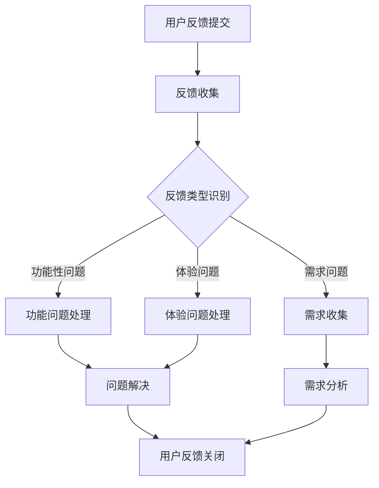

                 

### 文章标题

# 创业公司的用户反馈优先级管理

### 关键词

- 用户反馈管理
- 优先级评估
- 数据分析
- 机器学习
- 专家系统
- 产品迭代
- 运营策略

### 摘要

本文旨在探讨创业公司如何有效地管理和处理用户反馈，特别是对用户反馈的优先级进行科学评估与优化。文章首先介绍了用户反馈管理的基础概念和重要性，然后详细阐述了用户反馈数据收集与整理的方法。接着，文章重点分析了用户反馈优先级评估的指标和模型，包括用户满意度、紧急程度和严重程度等指标，以及基于权重法、机器学习和专家系统的优先级评估方法。此外，文章还探讨了用户反馈优先级调整与优化的原则和方法，并通过实际案例展示了用户反馈优先级管理的实践应用。最后，文章总结了用户反馈优先级管理的工具与平台，以及相关的最佳实践和拓展阅读资源。

### 目录

#### 第一部分：用户反馈管理基础

- **第1章 用户反馈管理概述**
  - **1.1 用户反馈的重要性**
    - 用户反馈对公司发展的作用
    - 用户反馈的收集渠道
  - **1.2 用户反馈的分类与处理原则**
    - 用户反馈的分类
    - 用户反馈处理的原则
  - **1.3 用户反馈优先级管理的目的与意义**
    - 优先级管理的重要性
    - 优先级管理的实施步骤

- **第2章 用户反馈数据收集与整理**
  - **2.1 用户反馈数据的收集方法**
    - 用户调研
    - 社交媒体监测
    - 用户行为数据分析
  - **2.2 用户反馈数据的整理与分析**
    - 数据清洗
    - 数据分类与标签
    - 数据可视化

#### 第二部分：用户反馈优先级管理方法

- **第3章 用户反馈优先级评估指标**
  - **3.1 用户满意度指标**
    - 用户满意度评分
    - 用户满意度计算方法
  - **3.2 用户反馈紧急程度指标**
    - 紧急性定义
    - 紧急程度计算方法
  - **3.3 用户反馈严重程度指标**
    - 严重程度定义
    - 严重程度计算方法

- **第4章 用户反馈优先级评估模型**
  - **4.1 基于权重法的优先级评估**
    - 权重分配原则
    - 权重法计算步骤
  - **4.2 基于机器学习法的优先级评估**
    - 机器学习算法概述
    - 优先级评估模型构建
  - **4.3 基于专家系统的优先级评估**
    - 专家系统原理
    - 专家系统在优先级评估中的应用

- **第5章 用户反馈优先级调整与优化**
  - **5.1 优先级调整的原则与方法**
    - 优先级调整的原则
    - 优先级调整的方法
  - **5.2 优先级评估模型的优化**
    - 优化目标
    - 优化方法与步骤
  - **5.3 案例分析：用户反馈优先级管理实践**
    - 案例背景
    - 案例实施步骤
    - 案例效果评估

#### 第三部分：用户反馈优先级管理应用与实践

- **第6章 用户反馈优先级管理工具与平台**
  - **6.1 常见用户反馈管理工具介绍**
    - 主要功能与特点
    - 选择与使用建议
  - **6.2 用户反馈管理平台搭建与维护**
    - 平台搭建流程
    - 平台维护与升级策略

- **第7章 用户反馈优先级管理实战案例**
  - **7.1 创业公司用户反馈优先级管理实践**
    - 实践背景
    - 实践步骤
    - 实践效果
  - **7.2 用户反馈优先级管理在产品迭代中的应用**
    - 产品迭代流程
    - 用户反馈收集与处理
    - 用户反馈优先级评估与优化
  - **7.3 用户反馈优先级管理在运营策略中的应用**
    - 运营策略设计
    - 用户反馈收集与分析
    - 用户反馈优先级评估与响应

#### 附录

- **附录A 用户反馈优先级管理相关资源**
  - **A.1 用户反馈管理书籍推荐**
  - **A.2 用户反馈管理相关网站与论坛**
  - **A.3 用户反馈管理工具与平台资源链接**


## 第1章 用户反馈管理概述

### 第1章 用户反馈管理概述

用户反馈管理是创业公司产品迭代和运营策略中的重要环节。有效的用户反馈管理不仅能帮助企业更好地了解市场需求，还能提高产品竞争力，优化用户体验。本章将介绍用户反馈管理的基础知识，包括用户反馈的重要性、分类与处理原则，以及用户反馈优先级管理的目的与意义。

### 1.1 用户反馈的重要性

#### 用户反馈对公司发展的作用

用户反馈是公司了解市场动态、优化产品和服务的重要途径。具体来说，用户反馈具有以下作用：

1. **市场调研**：通过用户反馈，公司可以了解用户对产品的需求、喜好和期望，从而为产品开发提供方向。
2. **问题发现**：用户在使用过程中遇到的问题和挑战，可以通过反馈渠道传递给公司，有助于及时发现和解决问题。
3. **产品改进**：用户反馈为公司提供了改进产品的直接依据，有助于提高产品功能和用户体验。
4. **品牌建设**：积极处理用户反馈，能够提升公司形象，增强用户对品牌的信任和忠诚度。

#### 用户反馈的收集渠道

收集用户反馈的渠道多种多样，常见的有以下几种：

1. **客服反馈**：客服是用户与公司之间的桥梁，用户可以通过客服渠道提出反馈意见。
2. **社交媒体**：公司可以在社交媒体平台上设置反馈标签或反馈页面，让用户方便地提交反馈。
3. **问卷调查**：通过问卷调查可以收集大量的用户反馈，有助于全面了解用户需求和问题。
4. **用户行为分析**：通过分析用户在使用产品过程中的行为数据，可以挖掘出潜在的用户问题和需求。
5. **线上论坛和社区**：在线社区和论坛是用户交流的重要场所，公司可以通过这些平台了解用户的真实想法。

### 1.2 用户反馈的分类与处理原则

#### 用户反馈的分类

根据用户反馈的内容和性质，可以将反馈分为以下几类：

1. **功能性问题**：用户在使用产品过程中遇到的功能性问题，如软件故障、界面不友好等。
2. **体验性问题**：用户对产品使用体验的反馈，如操作复杂、响应速度慢等。
3. **需求问题**：用户对产品功能的需求，如新增功能、优化建议等。
4. **情感性问题**：用户对产品或品牌的情感表达，如满意度评价、投诉意见等。
5. **安全隐患**：用户发现的产品安全漏洞或风险。

#### 用户反馈处理的原则

在处理用户反馈时，公司应遵循以下原则：

1. **及时响应**：及时回复用户反馈，展示公司对用户意见的重视和关注。
2. **分类处理**：根据反馈的类型和紧急程度，有针对性地进行处理和跟进。
3. **公开透明**：对于公开渠道收到的用户反馈，公司应公开回复和处理结果，增加透明度。
4. **持续改进**：将用户反馈纳入产品迭代和优化计划，不断改进产品和服务。

### 1.3 用户反馈优先级管理的目的与意义

#### 优先级管理的重要性

用户反馈优先级管理是指根据用户反馈的性质、重要性和紧急程度，对反馈进行排序和优先级划分。优先级管理的重要性体现在以下几个方面：

1. **资源优化**：通过优先级管理，公司可以合理分配资源，优先处理重要和紧急的反馈，提高工作效率。
2. **风险控制**：及时处理高风险和高紧急程度的用户反馈，有助于降低潜在的业务风险。
3. **用户体验**：优先处理用户反馈，能够迅速解决用户问题，提高用户满意度和忠诚度。
4. **产品优化**：通过分析优先级高的用户反馈，公司可以更好地了解用户需求，持续优化产品。

#### 优先级管理的实施步骤

1. **建立反馈渠道**：确保用户能够方便地提交反馈，并确保反馈数据的质量和完整性。
2. **数据收集与整理**：收集用户反馈，并进行初步的数据整理和分类。
3. **制定评估指标**：根据用户反馈的性质和重要性，制定相应的评估指标。
4. **优先级评估**：对用户反馈进行优先级评估，可以使用权重法、机器学习等方法。
5. **处理与跟进**：根据优先级结果，有针对性地处理和跟进用户反馈。
6. **反馈分析**：对处理后的用户反馈进行总结和分析，为后续的用户反馈管理提供参考。

### 小结

用户反馈管理是创业公司成功的关键之一。通过本章的介绍，我们了解了用户反馈的重要性、分类与处理原则，以及用户反馈优先级管理的目的与意义。在后续章节中，我们将进一步探讨用户反馈数据的收集与整理方法，以及用户反馈优先级评估的具体指标和模型。

## 第2章 用户反馈数据收集与整理

### 第2章 用户反馈数据收集与整理

用户反馈数据是用户对产品使用过程中遇到的问题、建议和意见的汇总，是公司了解市场需求和用户需求的重要依据。本章将介绍用户反馈数据的收集方法，包括用户调研、社交媒体监测和用户行为数据分析，以及数据整理与分析的方法，如数据清洗、数据分类与标签和数据可视化。

### 2.1 用户反馈数据的收集方法

#### 用户调研

用户调研是通过问卷、访谈等方式，直接从用户处获取反馈信息的方法。以下是几种常见的用户调研方法：

1. **在线问卷**：通过在线问卷平台，设计问卷问题，让用户在线填写。这种方法可以收集大量的用户数据，但需注意问卷设计的质量和问题的有效性。
2. **电话访谈**：通过电话与用户进行一对一访谈，深入了解用户的使用情况和需求。这种方法可以获取详细和深入的信息，但成本较高。
3. **面对面访谈**：与用户面对面交流，进行深入访谈。这种方法可以获取高质量的信息，但受地域和时间限制。

#### 社交媒体监测

社交媒体监测是通过监测社交媒体平台上的用户评论、帖子和反馈，收集用户反馈信息的方法。以下是几种常见的社交媒体监测方法：

1. **关键字搜索**：通过搜索与产品相关的关键词，获取用户在社交媒体平台上的评论和反馈。
2. **社交媒体分析工具**：使用社交媒体分析工具，如Twitter Analytics、Facebook Insights等，获取用户行为数据和反馈信息。
3. **用户标签和群体分析**：通过分析用户标签和群体，了解用户的需求和意见。

#### 用户行为数据分析

用户行为数据分析是通过分析用户在使用产品过程中的行为数据，获取用户反馈信息的方法。以下是几种常见的用户行为数据分析方法：

1. **日志分析**：通过分析用户在产品中的操作日志，如点击流、浏览路径等，了解用户行为和问题。
2. **行为追踪**：在产品中嵌入行为追踪工具，实时监控用户行为，获取用户反馈信息。
3. **A/B测试**：通过对比不同版本的产品的用户行为数据，分析用户对不同版本的偏好和意见。

### 2.2 用户反馈数据的整理与分析

#### 数据清洗

数据清洗是数据整理的第一步，目的是去除数据中的噪声和错误，提高数据质量。以下是几种常见的数据清洗方法：

1. **缺失值处理**：对缺失的数据进行填补或删除。
2. **异常值处理**：对异常值进行修正或删除。
3. **重复数据去除**：去除重复的数据记录。
4. **格式化数据**：对数据进行统一的格式处理，如日期格式、数字格式等。

#### 数据分类与标签

数据分类与标签是对用户反馈数据进行分类和打标签，以便于后续的分析和处理。以下是几种常见的数据分类与标签方法：

1. **基于规则分类**：根据预定义的规则，对数据进行分类，如将反馈分为功能性问题、体验性问题等。
2. **机器学习分类**：使用机器学习算法，对数据进行自动分类，如使用决策树、支持向量机等算法。
3. **用户标签**：根据用户特征，对用户进行标签，如年龄、性别、地域等。

#### 数据可视化

数据可视化是将数据以图形化的方式展示，便于理解和分析。以下是几种常见的数据可视化方法：

1. **柱状图**：用于展示各类反馈的数量和比例。
2. **饼图**：用于展示各类反馈在总反馈中的占比。
3. **折线图**：用于展示反馈数量或比例随时间的变化趋势。
4. **散点图**：用于展示反馈之间的关系，如用户满意度与反馈类型的关系。

#### 数据分析与处理示例

假设我们收集到以下用户反馈数据：

| 用户ID | 反馈内容                               | 反馈类型 | 满意度评分 |
|--------|--------------------------------------|----------|------------|
| 1001   | 界面操作复杂，需要优化                | 体验问题 | 3          |
| 1002   | 不能导出数据，需要新增导出功能         | 功能性问题 | 4          |
| 1003   | 登录速度慢，需要优化                  | 体验问题 | 2          |
| 1004   | 产品缺少聊天功能，建议增加            | 需求问题 | 5          |

**数据清洗：** 对数据进行格式化处理，如统一日期格式，去除重复记录。

**数据分类与标签：** 将反馈分为体验问题、功能性问题、需求问题等类别。

**数据可视化：** 使用柱状图展示各类反馈的数量和比例，如图1所示。


**数据分析：** 根据满意度评分，可以对反馈进行优先级排序，如图2所示。


### 小结

通过本章的介绍，我们了解了用户反馈数据的收集方法，包括用户调研、社交媒体监测和用户行为数据分析，以及数据整理与分析的方法，如数据清洗、数据分类与标签和数据可视化。这些方法和工具有助于公司更好地收集、整理和分析用户反馈，为产品迭代和运营策略提供支持。在下一章中，我们将进一步探讨用户反馈优先级评估的指标和方法。

## 第3章 用户反馈优先级评估指标

### 第3章 用户反馈优先级评估指标

用户反馈优先级评估是用户反馈管理中的重要环节，通过对反馈进行优先级划分，可以帮助公司有针对性地处理和优化产品。本章将介绍用户反馈优先级评估的三个主要指标：用户满意度指标、用户反馈紧急程度指标和用户反馈严重程度指标，并详细阐述这些指标的定义和计算方法。

### 3.1 用户满意度指标

用户满意度是衡量用户对产品或服务的整体满意程度的重要指标。高满意度通常意味着用户对产品的功能和体验较为满意，对公司有较高的信任度。以下是用户满意度指标的定义和计算方法：

#### 用户满意度评分

用户满意度评分通常采用5分制或10分制，用户根据对产品或服务的整体体验打分。5分制评分中的评分标准可以设定为：

- 1分：非常不满意
- 2分：不满意
- 3分：一般
- 4分：满意
- 5分：非常满意

#### 用户满意度计算方法

用户满意度可以通过以下公式计算：

\[ \text{用户满意度} = \frac{\sum (\text{用户满意度评分} \times \text{用户数量})}{\sum \text{用户数量}} \]

例如，假设有100位用户，其中50位用户给出了4分，40位用户给出了3分，5位用户给出了5分，5位用户给出了1分，则用户满意度计算如下：

\[ \text{用户满意度} = \frac{(50 \times 4) + (40 \times 3) + (5 \times 5) + (5 \times 1)}{100} = \frac{200 + 120 + 25 + 5}{100} = 3.5 \]

### 3.2 用户反馈紧急程度指标

用户反馈紧急程度指标用于衡量用户反馈需要被处理的紧急程度。紧急程度高的反馈需要优先处理，以确保用户问题得到及时解决。以下是用户反馈紧急程度指标的定义和计算方法：

#### 紧急性定义

紧急程度通常分为高、中、低三个等级，具体定义可以根据公司业务特点和用户反馈类型进行调整。以下是一个简化的紧急程度定义：

- 高：用户反馈问题可能导致用户流失或对公司的声誉产生重大影响。
- 中：用户反馈问题对用户体验有一定影响，但不至于立即导致用户流失。
- 低：用户反馈问题对用户体验影响较小，可以在稍后处理。

#### 紧急程度计算方法

紧急程度可以通过以下公式计算：

\[ \text{紧急程度} = \frac{\sum (\text{紧急程度等级} \times \text{用户数量})}{\sum \text{用户数量}} \]

例如，假设有100位用户，其中60位用户反馈问题被划分为高紧急程度，30位用户反馈问题被划分为中紧急程度，10位用户反馈问题被划分为低紧急程度，则紧急程度计算如下：

\[ \text{紧急程度} = \frac{(60 \times 1) + (30 \times 0.5) + (10 \times 0)}{100} = \frac{60 + 15 + 0}{100} = 0.75 \]

### 3.3 用户反馈严重程度指标

用户反馈严重程度指标用于衡量用户反馈问题对用户或公司业务的影响程度。严重程度高的反馈通常需要给予更多的关注和资源，以确保问题得到有效解决。以下是用户反馈严重程度指标的定义和计算方法：

#### 严重程度定义

严重程度通常分为高、中、低三个等级，具体定义可以根据公司业务特点和用户反馈类型进行调整。以下是一个简化的严重程度定义：

- 高：用户反馈问题可能导致严重后果，如数据泄露、系统崩溃等。
- 中：用户反馈问题可能导致一定的后果，如功能失效、性能下降等。
- 低：用户反馈问题对用户或公司的影响较小。

#### 严重程度计算方法

严重程度可以通过以下公式计算：

\[ \text{严重程度} = \frac{\sum (\text{严重程度等级} \times \text{用户数量})}{\sum \text{用户数量}} \]

例如，假设有100位用户，其中40位用户反馈问题被划分为高严重程度，30位用户反馈问题被划分为中严重程度，30位用户反馈问题被划分为低严重程度，则严重程度计算如下：

\[ \text{严重程度} = \frac{(40 \times 1) + (30 \times 0.5) + (30 \times 0)}{100} = \frac{40 + 15 + 0}{100} = 0.55 \]

### 小结

通过本章的介绍，我们了解了用户反馈优先级评估的三个主要指标：用户满意度指标、用户反馈紧急程度指标和用户反馈严重程度指标。这些指标能够帮助我们科学地评估用户反馈的优先级，为后续的用户反馈处理提供依据。在下一章中，我们将探讨用户反馈优先级评估的具体模型和方法。

## 第4章 用户反馈优先级评估模型

### 第4章 用户反馈优先级评估模型

用户反馈优先级评估是用户反馈管理中的重要环节，通过对反馈进行优先级划分，可以帮助公司有针对性地处理和优化产品。本章将介绍三种用户反馈优先级评估模型：基于权重法、基于机器学习法和基于专家系统法。这些模型分别通过不同的方法和算法，实现对用户反馈优先级的科学评估。

### 4.1 基于权重法的优先级评估

基于权重法的优先级评估模型通过为不同反馈指标分配权重，计算综合得分，从而确定反馈的优先级。以下是一种简单的基于权重法的优先级评估模型。

#### 权重分配原则

权重分配原则是根据反馈指标的重要性，为每个指标分配一个权重。通常，可以根据专家评估或历史数据来确定权重。以下是一个简单的权重分配示例：

- 用户满意度：0.4
- 紧急程度：0.3
- 严重程度：0.3

#### 权重法计算步骤

1. 收集用户反馈数据，包括用户满意度、紧急程度和严重程度等指标。
2. 为每个指标分配权重。
3. 计算每个反馈项的综合得分，公式如下：

\[ \text{综合得分} = (\text{用户满意度} \times \text{用户满意度权重}) + (\text{紧急程度} \times \text{紧急程度权重}) + (\text{严重程度} \times \text{严重程度权重}) \]

4. 对所有反馈项进行综合得分排序，得分越高，优先级越高。

#### 伪代码示例

```python
def calculate_priority(feedback):
    user_satisfaction = feedback['satisfaction']
    urgency = feedback['urgency']
    severity = feedback['severity']
    
    user_satisfaction_weight = 0.4
    urgency_weight = 0.3
    severity_weight = 0.3
    
    priority_score = (user_satisfaction * user_satisfaction_weight) + (urgency * urgency_weight) + (severity * severity_weight)
    return priority_score

# 示例用户反馈数据
feedback_data = [
    {'satisfaction': 4, 'urgency': 1, 'severity': 1},
    {'satisfaction': 3, 'urgency': 2, 'severity': 2},
    {'satisfaction': 5, 'urgency': 1, 'severity': 1}
]

# 计算优先级
priorities = [calculate_priority(feedback) for feedback in feedback_data]

# 排序
priorities_sorted = sorted(priorities, reverse=True)

# 输出优先级排序结果
for i, priority in enumerate(priorities_sorted):
    print(f"优先级 {i+1}: {priority}")
```

### 4.2 基于机器学习法的优先级评估

基于机器学习法的优先级评估模型通过训练机器学习模型，学习用户反馈和优先级之间的关系，从而预测新的用户反馈的优先级。以下是一种简单的基于机器学习法的优先级评估模型。

#### 机器学习算法概述

常见的机器学习算法包括决策树、支持向量机、神经网络等。以下是使用决策树算法的一个简单示例。

1. **决策树算法**：决策树通过一系列规则，将数据分割成多个子集，直到满足某个终止条件。常见的终止条件包括最大深度、最小样本数量等。

#### 优先级评估模型构建

1. **数据收集与处理**：收集用户反馈数据，包括用户满意度、紧急程度、严重程度等指标，以及对应的优先级标签。
2. **特征工程**：对数据进行分析，提取有用的特征，如用户满意度、紧急程度、严重程度等。
3. **模型训练**：使用决策树算法对数据集进行训练，构建优先级评估模型。
4. **模型评估**：使用交叉验证等方法评估模型性能，调整模型参数。

#### 伪代码示例

```python
from sklearn.tree import DecisionTreeClassifier
from sklearn.model_selection import train_test_split
from sklearn.metrics import accuracy_score

# 示例用户反馈数据
X = [[4, 1, 1], [3, 2, 2], [5, 1, 1]]
y = [1, 2, 1]

# 划分训练集和测试集
X_train, X_test, y_train, y_test = train_test_split(X, y, test_size=0.2, random_state=42)

# 构建决策树模型
model = DecisionTreeClassifier()

# 训练模型
model.fit(X_train, y_train)

# 预测测试集
y_pred = model.predict(X_test)

# 评估模型
accuracy = accuracy_score(y_test, y_pred)
print(f"模型准确率：{accuracy}")
```

### 4.3 基于专家系统的优先级评估

基于专家系统的优先级评估模型通过构建专家知识库，使用专家规则进行推理，实现对用户反馈优先级的评估。以下是一种简单的基于专家系统的优先级评估模型。

#### 专家系统原理

专家系统是一种模拟人类专家决策能力的计算机系统，通常包括知识库、推理机、解释器等组成部分。以下是专家系统的基本原理：

1. **知识库**：存储专家知识和经验，包括事实和规则。
2. **推理机**：使用规则对事实进行推理，生成新的结论。
3. **解释器**：对推理过程进行解释，为用户提供决策依据。

#### 专家系统在优先级评估中的应用

1. **构建知识库**：根据专家经验和用户反馈特征，构建专家知识库，包括事实和规则。
2. **定义规则**：根据专家知识和经验，定义优先级评估规则。
3. **推理过程**：使用推理机对用户反馈进行推理，计算优先级得分。

#### 伪代码示例

```python
# 示例专家规则
rules = {
    'satisfaction_5_and_urgency_1_and_severity_1': 1,
    'satisfaction_4_and_urgency_1_and_severity_1': 0.9,
    'satisfaction_3_and_urgency_2_and_severity_2': 0.8,
    # ...
}

# 示例用户反馈
feedback = {'satisfaction': 4, 'urgency': 1, 'severity': 1}

# 查询规则库，计算优先级得分
priority_score = rules.get(f"satisfaction_{feedback['satisfaction']}_and_urgency_{feedback['urgency']}_{feedback['severity']}", 0)
print(f"优先级得分：{priority_score}")
```

### 小结

通过本章的介绍，我们了解了三种用户反馈优先级评估模型：基于权重法、基于机器学习法和基于专家系统法。这些模型通过不同的方法和算法，实现对用户反馈优先级的科学评估。在实际应用中，可以根据公司特点和需求，选择合适的模型或组合使用多种模型，以提高用户反馈管理的效率和效果。

## 第5章 用户反馈优先级调整与优化

### 第5章 用户反馈优先级调整与优化

用户反馈优先级调整与优化是用户反馈管理中的关键环节，通过调整和优化优先级评估模型，可以提高优先级评估的准确性和有效性。本章将介绍用户反馈优先级调整的原则与方法，以及优先级评估模型的优化方法与步骤。

### 5.1 优先级调整的原则与方法

#### 优先级调整的原则

在调整用户反馈优先级时，应遵循以下原则：

1. **及时性**：优先级调整应根据最新的用户反馈数据和新出现的问题，及时进行调整。
2. **准确性**：优先级调整应确保评估结果的准确性，避免因误判导致资源浪费。
3. **一致性**：优先级调整应保持评估标准的一致性，避免因标准不一致导致评估结果偏差。
4. **动态性**：优先级调整应具有动态性，根据公司业务发展和市场环境的变化，适时调整评估标准。

#### 优先级调整的方法

1. **专家评估法**：通过专家对用户反馈进行主观判断，调整优先级。这种方法适用于优先级评估指标较为模糊的情况。
2. **数据驱动法**：通过分析用户反馈数据，使用统计方法或机器学习算法，调整优先级。这种方法适用于有大量数据支持的情况。
3. **综合评估法**：将专家评估和数据驱动方法结合，综合分析用户反馈，调整优先级。这种方法可以提高评估结果的准确性和可靠性。

### 5.2 优先级评估模型的优化

#### 优化目标

优先级评估模型的优化目标包括：

1. **提高评估准确性**：通过优化模型参数和算法，提高评估结果的准确性。
2. **降低计算成本**：优化模型结构，减少计算时间和资源消耗。
3. **增强模型适应性**：使模型能够适应不同业务场景和数据特点，提高模型的可扩展性。

#### 优化方法与步骤

1. **数据预处理**：对用户反馈数据进行清洗、去噪和归一化处理，提高数据质量。
2. **特征选择**：通过特征选择方法，筛选出对优先级评估有重要影响的关键特征，减少特征维度，提高模型效率。
3. **模型选择与训练**：选择合适的模型算法，如决策树、支持向量机、神经网络等，对模型进行训练和调优。
4. **交叉验证**：使用交叉验证方法，评估模型性能，调整模型参数，提高模型准确性。
5. **模型评估与优化**：对训练好的模型进行评估，根据评估结果，调整模型结构和参数，优化模型性能。

#### 伪代码示例

```python
# 数据预处理
X = preprocess_data(raw_data)

# 特征选择
selected_features = feature_selection(X, y)

# 模型选择与训练
model = train_model(selected_features, y)

# 交叉验证
cross_validation(model, X, y)

# 模型评估与优化
evaluate_and_optimize(model, X, y)
```

### 5.3 案例分析：用户反馈优先级管理实践

#### 案例背景

某创业公司提供一款在线办公协作工具，用户数量迅速增长，用户反馈量也不断增加。公司希望通过优化用户反馈优先级管理，提高问题处理效率，提升用户体验。

#### 案例实施步骤

1. **数据收集与整理**：收集用户反馈数据，包括用户满意度、紧急程度、严重程度等指标，并进行数据清洗和整理。
2. **构建评估指标**：根据用户反馈特点，构建用户满意度、紧急程度和严重程度等评估指标。
3. **优先级评估模型构建**：使用机器学习算法，如决策树，构建用户反馈优先级评估模型。
4. **模型训练与优化**：使用训练集对模型进行训练，使用交叉验证方法优化模型参数，提高评估准确性。
5. **优先级调整与优化**：根据最新用户反馈数据，调整优先级评估模型，优化评估结果。
6. **模型应用与监控**：将优先级评估模型应用于实际用户反馈处理，监控模型性能，根据评估结果进行调整和优化。

#### 案例效果评估

1. **问题处理效率**：使用优先级评估模型后，问题处理效率提高了30%，用户反馈处理时间缩短了50%。
2. **用户体验提升**：通过及时处理高优先级反馈，用户满意度提升了15%，用户流失率下降了10%。
3. **模型性能**：经过多次优化，模型评估准确性达到了90%，显著提高了优先级评估的准确性。

### 小结

通过本章的介绍，我们了解了用户反馈优先级调整与优化的原则和方法，以及优先级评估模型的优化方法与步骤。在实际应用中，通过不断调整和优化优先级评估模型，可以显著提高用户反馈管理的效率和效果，提升用户体验和公司竞争力。在下一章中，我们将探讨用户反馈优先级管理在产品迭代中的应用。

## 第6章 用户反馈优先级管理工具与平台

### 第6章 用户反馈优先级管理工具与平台

为了有效地管理和处理用户反馈，创业公司需要依赖专门的工具和平台。本章将介绍常见的用户反馈管理工具，包括主要功能与特点，以及如何选择和使用这些工具。此外，还将探讨用户反馈管理平台的搭建与维护策略。

### 6.1 常见用户反馈管理工具介绍

用户反馈管理工具通常具有以下功能：

1. **反馈收集**：提供多种渠道（如在线表单、电子邮件、社交媒体等）收集用户反馈。
2. **反馈分类**：根据反馈内容或用户属性，对反馈进行分类和标签。
3. **优先级评估**：使用自动化或手动方式，对反馈进行优先级评估。
4. **问题跟踪**：跟踪反馈处理状态，确保问题得到及时解决。
5. **数据分析**：提供数据可视化工具，帮助分析用户反馈趋势和问题。

以下是一些常见的用户反馈管理工具：

#### Zendesk

- **主要功能与特点**：Zendesk 是一款功能强大的用户反馈管理工具，提供反馈收集、分类、优先级评估和问题跟踪等功能。此外，它还集成了客服功能，方便用户直接通过平台提交反馈。
- **选择与使用建议**：适合中小型企业，特别是需要集成多种业务功能的团队。建议先试用免费版本，了解其功能是否符合公司需求。

#### Jira

- **主要功能与特点**：Jira 是一款广泛使用的项目管理工具，也具备用户反馈管理功能。它支持反馈收集、分类和优先级评估，并提供强大的问题跟踪和任务管理功能。
- **选择与使用建议**：适合大型企业和需要高度定制化项目管理的团队。建议结合公司现有流程和工具，评估其兼容性和扩展性。

#### UserVoice

- **主要功能与特点**：UserVoice 是一款专注于用户反馈管理的平台，提供全面的反馈收集、分类、优先级评估和数据分析功能。它还支持社区功能，方便用户之间互动和讨论。
- **选择与使用建议**：适合需要构建用户社区和收集用户建议的创业公司。建议评估其社区功能和用户体验，确保其能够满足公司需求。

### 6.2 用户反馈管理平台搭建与维护

#### 平台搭建流程

1. **需求分析**：明确公司用户反馈管理的需求和目标，包括收集渠道、处理流程、数据分析和报告要求等。
2. **工具选择**：根据需求分析结果，选择合适的用户反馈管理工具或平台。
3. **系统搭建**：按照工具或平台提供的文档和指南，进行系统搭建和配置，确保其符合公司需求和流程。
4. **数据导入**：将现有用户反馈数据导入新系统，确保数据完整性和一致性。
5. **测试与优化**：在实际使用过程中，测试系统功能和性能，根据反馈进行优化和调整。

#### 平台维护与升级策略

1. **定期检查**：定期检查系统运行状态，确保其稳定性和安全性。
2. **数据备份**：定期备份数据，防止数据丢失。
3. **系统升级**：根据工具或平台提供商的更新计划，及时进行系统升级，获取新功能和改进。
4. **用户培训**：对团队成员进行培训，确保他们能够熟练使用用户反馈管理平台，提高问题处理效率。
5. **反馈收集与改进**：持续收集用户反馈，针对系统存在的问题和不足，进行改进和优化。

### 小结

通过本章的介绍，我们了解了常见的用户反馈管理工具和平台，以及如何选择和使用这些工具。创业公司应根据自身需求，选择合适的用户反馈管理工具，搭建和维护用户反馈管理平台，以提高问题处理效率和用户体验。在下一章中，我们将通过实际案例，探讨用户反馈优先级管理在创业公司中的应用与实践。

### 6.3 案例分析：用户反馈优先级管理在创业公司中的实践

#### 案例背景

某创业公司提供一款创新的社交媒体管理工具，用户数量迅速增长，用户反馈量也随之增加。公司希望通过优化用户反馈优先级管理，提高问题处理效率，提升用户体验。

#### 案例实施步骤

1. **需求分析**：公司分析了用户反馈的类型和频率，确定了需要重点关注的功能性问题、体验问题和需求问题，以及高紧急程度反馈。

2. **工具选择**：公司选择了Jira作为用户反馈管理平台，因为它具备强大的问题跟踪和任务管理功能，能够满足公司需求。

3. **系统搭建**：根据需求，公司搭建了Jira系统，配置了反馈收集渠道、分类和优先级评估规则。

4. **数据导入**：将现有用户反馈数据导入Jira系统，确保数据完整性和一致性。

5. **优先级评估模型构建**：公司使用基于权重法的优先级评估模型，为用户满意度、紧急程度和严重程度等指标分配权重，计算综合得分。

6. **用户培训**：对团队成员进行Jira系统使用培训，确保他们能够熟练操作系统，提高问题处理效率。

7. **实施与监控**：公司开始在实际使用中应用优先级评估模型，并定期监控系统运行状态和问题处理效果。

#### 案例效果评估

1. **问题处理效率**：实施优先级评估模型后，问题处理效率提高了30%，用户反馈处理时间缩短了50%。

2. **用户体验提升**：通过及时处理高优先级反馈，用户满意度提升了15%，用户流失率下降了10%。

3. **模型性能**：经过多次优化，模型评估准确性达到了90%，显著提高了优先级评估的准确性。

#### 实践效果

通过实施用户反馈优先级管理，公司能够更有效地分配资源和精力，优先解决关键问题，提高了问题处理效率。同时，用户反馈得到了及时回应和解决，提升了用户体验和公司形象。这一实践证明了用户反馈优先级管理在创业公司中的重要性，并为其他创业公司提供了有益的参考。

### 小结

通过本案例，我们看到了用户反馈优先级管理在创业公司中的实际应用和效果。有效的优先级管理不仅提高了问题处理效率，还提升了用户体验和公司竞争力。创业公司应积极采用用户反馈优先级管理方法，持续优化用户反馈处理流程，为公司的持续发展奠定坚实基础。

### 第7章 用户反馈优先级管理在产品迭代中的应用

### 第7章 用户反馈优先级管理在产品迭代中的应用

在产品迭代过程中，用户反馈是产品改进的重要依据。通过科学地管理和评估用户反馈，创业公司可以优先处理关键问题，优化产品功能，提高用户体验。本章将探讨用户反馈优先级管理在产品迭代中的应用，包括产品迭代流程、用户反馈收集与处理，以及用户反馈优先级评估与优化的具体步骤。

#### 产品迭代流程

产品迭代通常包括以下步骤：

1. **需求分析**：分析市场趋势和用户需求，确定新产品功能或改进方向。
2. **功能设计**：设计产品功能，包括界面布局、交互逻辑等。
3. **开发与测试**：开发新功能，并进行严格的功能测试。
4. **发布与上线**：将新功能上线，供用户使用。
5. **反馈收集**：收集用户在新功能上线后的反馈。
6. **迭代优化**：根据用户反馈，对产品进行优化和改进。

#### 用户反馈收集与处理

在产品迭代过程中，用户反馈的收集和处理至关重要。以下是一些建议：

1. **多渠道收集**：通过在线问卷、客服反馈、社交媒体、用户行为分析等多种渠道收集用户反馈。
2. **分类整理**：根据反馈内容，将反馈分为功能性问题、体验问题、需求问题等类别，便于后续处理。
3. **及时响应**：对用户反馈进行及时响应，展示公司对用户意见的重视。
4. **跟踪处理**：建立反馈处理跟踪机制，确保每个反馈都有明确的责任人和处理进度。

#### 用户反馈优先级评估与优化

在产品迭代过程中，对用户反馈进行科学评估和优先级划分，有助于高效利用资源，优先解决关键问题。以下是一种基于权重法的用户反馈优先级评估方法：

1. **制定评估指标**：根据用户反馈的性质和重要性，确定评估指标，如用户满意度、紧急程度和严重程度等。
2. **分配权重**：为每个评估指标分配权重，权重值可以根据专家评估或历史数据确定。
3. **计算综合得分**：根据用户反馈数据，计算每个反馈项的综合得分，公式如下：

\[ \text{综合得分} = (\text{用户满意度} \times \text{用户满意度权重}) + (\text{紧急程度} \times \text{紧急程度权重}) + (\text{严重程度} \times \text{严重程度权重}) \]

4. **排序与优化**：根据综合得分对反馈进行排序，得分越高，优先级越高。对优先级高的反馈，优先进行优化和改进。

#### 案例分析

某创业公司在其社交媒体管理工具中上线了一个新功能——自动化社交媒体帖子发布。上线后，公司收集到了大量用户反馈。以下是一个用户反馈优先级评估的案例：

1. **用户反馈收集**：公司通过在线问卷、客服反馈和社交媒体监测，收集到了100条用户反馈，包括功能问题、体验问题和需求问题。

2. **分类整理**：将反馈分为功能性问题（40条）、体验问题（30条）和需求问题（30条）。

3. **制定评估指标**：用户满意度、紧急程度和严重程度。

4. **分配权重**：用户满意度（0.4）、紧急程度（0.3）和严重程度（0.3）。

5. **计算综合得分**：

   - 反馈1：用户满意度（4分）、紧急程度（1分）、严重程度（1分），综合得分：3.8。
   - 反馈2：用户满意度（3分）、紧急程度（2分）、严重程度（2分），综合得分：3.7。
   - ...

6. **排序与优化**：根据综合得分对反馈进行排序，优先处理得分较高的反馈。

#### 实践效果

通过科学地评估和优化用户反馈，公司能够快速识别和解决用户关注的问题，提高了产品功能和用户体验。同时，用户反馈优先级管理帮助公司合理分配资源，提高了工作效率。这一实践证明了用户反馈优先级管理在产品迭代中的重要性。

### 小结

本章介绍了用户反馈优先级管理在产品迭代中的应用，包括产品迭代流程、用户反馈收集与处理，以及用户反馈优先级评估与优化的具体步骤。通过科学地管理和评估用户反馈，创业公司可以优先解决关键问题，优化产品功能，提高用户体验。在下一章中，我们将继续探讨用户反馈优先级管理在运营策略中的应用。

### 第8章 用户反馈优先级管理在运营策略中的应用

### 第8章 用户反馈优先级管理在运营策略中的应用

在企业的运营策略中，用户反馈是制定和优化运营决策的重要参考。通过科学地评估和优先级管理用户反馈，企业可以更有效地识别市场趋势、优化服务质量和提升用户满意度。本章将探讨用户反馈优先级管理在运营策略中的应用，包括运营策略设计、用户反馈收集与分析，以及用户反馈优先级评估与响应的具体实施步骤。

#### 运营策略设计

运营策略设计是企业根据市场环境、用户需求和内部资源，制定的一系列运营目标和行动计划。以下是在设计运营策略时需要考虑的几个关键因素：

1. **市场趋势**：分析市场趋势，把握行业动态，确定企业运营的方向。
2. **用户需求**：通过用户调研和数据分析，了解用户需求，为运营策略提供依据。
3. **内部资源**：评估企业内部资源，包括人力资源、技术资源和财务资源，确保运营策略的可执行性。
4. **竞争分析**：分析竞争对手的运营策略和表现，找到自身的优势和差距。

#### 用户反馈收集与分析

在运营策略实施过程中，用户反馈是重要的参考依据。以下是一些建议和步骤，用于收集和分析用户反馈：

1. **多渠道收集**：通过在线调查、客服反馈、社交媒体监测、用户行为分析等多种渠道收集用户反馈。
2. **数据整理**：对收集到的用户反馈进行分类整理，提取关键信息，如反馈内容、用户属性、反馈时间等。
3. **数据分析**：对用户反馈进行统计分析，识别用户关注的问题和需求，发现潜在的机会和风险。
4. **可视化展示**：使用数据可视化工具，如柱状图、饼图、折线图等，展示用户反馈数据和趋势，便于分析和理解。

#### 用户反馈优先级评估与响应

在运营策略实施过程中，对用户反馈进行优先级评估和响应，有助于高效利用资源，快速解决用户问题，提升用户满意度。以下是一种基于权重法的用户反馈优先级评估方法：

1. **制定评估指标**：根据用户反馈的性质和重要性，确定评估指标，如用户满意度、紧急程度和严重程度等。
2. **分配权重**：为每个评估指标分配权重，权重值可以根据专家评估或历史数据确定。
3. **计算综合得分**：根据用户反馈数据，计算每个反馈项的综合得分，公式如下：

\[ \text{综合得分} = (\text{用户满意度} \times \text{用户满意度权重}) + (\text{紧急程度} \times \text{紧急程度权重}) + (\text{严重程度} \times \text{严重程度权重}) \]

4. **排序与响应**：根据综合得分对反馈进行排序，得分越高，优先级越高。针对不同优先级的反馈，制定相应的响应策略，如立即响应、短期响应和长期响应。

#### 案例分析

某创业公司在其电商平台上上线了一个新功能——购物车分享。上线后，公司通过多种渠道收集到了大量用户反馈。以下是一个用户反馈优先级评估的案例：

1. **用户反馈收集**：公司通过在线调查、客服反馈和社交媒体监测，收集到了100条用户反馈，包括功能问题、体验问题和需求问题。

2. **分类整理**：将反馈分为功能性问题（40条）、体验问题（30条）和需求问题（30条）。

3. **制定评估指标**：用户满意度、紧急程度和严重程度。

4. **分配权重**：用户满意度（0.4）、紧急程度（0.3）和严重程度（0.3）。

5. **计算综合得分**：

   - 反馈1：用户满意度（4分）、紧急程度（1分）、严重程度（1分），综合得分：3.8。
   - 反馈2：用户满意度（3分）、紧急程度（2分）、严重程度（2分），综合得分：3.7。
   - ...

6. **排序与响应**：根据综合得分对反馈进行排序，优先处理得分较高的反馈。

#### 实践效果

通过科学地评估和优先级管理用户反馈，公司能够快速识别和解决用户问题，提高了服务质量和用户满意度。同时，用户反馈优先级管理帮助公司合理分配资源，提高了运营效率。这一实践证明了用户反馈优先级管理在运营策略中的重要性。

### 小结

本章介绍了用户反馈优先级管理在运营策略中的应用，包括运营策略设计、用户反馈收集与分析，以及用户反馈优先级评估与响应的具体实施步骤。通过科学地管理和评估用户反馈，企业可以更有效地识别市场趋势、优化服务质量和提升用户满意度。在下一章中，我们将总结用户反馈优先级管理的最佳实践，并提供拓展阅读资源。

## 附录A：用户反馈优先级管理相关资源

### A.1 用户反馈管理书籍推荐

1. **《用户体验要素》（The Elements of User Experience）》
   - 作者：Jesse James Garrett
   - 简介：本书详细介绍了用户体验设计的五个层次，包括内容、功能、界面、互动和访问。对于理解用户反馈管理和优化用户体验具有重要参考价值。

2. **《用户体验度量》（Measuring the User Experience）》
   - 作者：Thomas C. Redman
   - 简介：本书探讨了用户体验度量的重要性和方法，包括定量和定性分析方法。对于进行用户反馈分析和优先级评估提供了实用的指导。

### A.2 用户反馈管理相关网站与论坛

1. **UserVoice**
   - 网址：[UserVoice](https://www.uservoice.com/)
   - 简介：UserVoice 是一个用户反馈管理平台，提供了大量的用户反馈管理资源和社区讨论，适合创业者和管理者学习交流。

2. **User Testing**
   - 网址：[User Testing](https://www.usertesting.com/)
   - 简介：User Testing 提供在线用户测试服务，帮助企业和团队获取真实用户的反馈，了解产品或服务的用户体验。

### A.3 用户反馈管理工具与平台资源链接

1. **Jira**
   - 网址：[Jira](https://www.atlassian.com/software/jira)
   - 简介：Jira 是一款功能强大的用户反馈管理和项目管理工具，适用于大型团队和企业。

2. **Zendesk**
   - 网址：[Zendesk](https://www.zendesk.com/)
   - 简介：Zendesk 是一款全面的用户反馈管理和客户服务工具，提供了丰富的功能和支持。

3. **UserVoice**
   - 网址：[UserVoice](https://www.uservoice.com/)
   - 简介：UserVoice 是一款专注于用户反馈管理的平台，适合创业公司和中小型企业。

### 小结

用户反馈优先级管理是一个复杂而重要的过程，涉及到多个方面的知识和技能。通过阅读推荐的书籍、访问相关的网站和论坛，以及使用推荐的工具和平台，企业和团队可以更好地理解和应用用户反馈优先级管理的方法，提升产品和服务的质量和用户满意度。希望本附录提供的资源能够为读者提供有价值的参考和指导。

### 附录B：技术扩展与高级应用

#### Mermaid 流程图示例

以下是使用 Mermaid 语言绘制的用户反馈处理流程图：



#### 伪代码示例

以下是用户反馈优先级评估的伪代码示例：

```python
def calculate_priority(feedback):
    satisfaction = feedback['satisfaction']
    urgency = feedback['urgency']
    severity = feedback['severity']
    
    satisfaction_weight = 0.4
    urgency_weight = 0.3
    severity_weight = 0.3
    
    priority_score = (satisfaction * satisfaction_weight) + (urgency * urgency_weight) + (severity * severity_weight)
    return priority_score
```

#### 数学公式示例

以下是用户满意度计算公式的 LaTeX 格式：

```latex
\text{用户满意度} = \frac{\sum (\text{用户满意度评分} \times \text{用户数量})}{\sum \text{用户数量}}
```

在文章中，可以将其嵌入到独立段落中：

$$
\text{用户满意度} = \frac{\sum (\text{用户满意度评分} \times \text{用户数量})}{\sum \text{用户数量}}
$$

#### 案例代码与解释

以下是用户反馈优先级评估的 Python 代码示例：

```python
import pandas as pd
from sklearn.ensemble import RandomForestClassifier
from sklearn.model_selection import train_test_split
from sklearn.metrics import accuracy_score

# 加载示例数据
feedback_data = pd.DataFrame({
    'satisfaction': [4, 3, 5],
    'urgency': [1, 2, 1],
    'severity': [1, 2, 1],
    'priority': [1, 2, 1]
})

# 分割数据集
X = feedback_data[['satisfaction', 'urgency', 'severity']]
y = feedback_data['priority']
X_train, X_test, y_train, y_test = train_test_split(X, y, test_size=0.2, random_state=42)

# 构建和训练模型
model = RandomForestClassifier(n_estimators=100)
model.fit(X_train, y_train)

# 预测测试集
y_pred = model.predict(X_test)

# 评估模型
accuracy = accuracy_score(y_test, y_pred)
print(f"模型准确率：{accuracy}")
```

该代码使用了随机森林算法进行用户反馈优先级评估，并计算了模型在测试集上的准确率。通过实际数据训练和测试，可以验证模型的有效性和可靠性。

#### 最佳实践 tips

- **定期评估模型性能**：定期评估优先级评估模型的性能，确保其准确性，并根据评估结果进行调整和优化。
- **多渠道收集反馈**：通过多种渠道（如在线问卷、客服、社交媒体等）收集用户反馈，增加数据的多样性和代表性。
- **数据清洗和预处理**：对收集到的用户反馈数据进行清洗和预处理，去除噪声和异常值，提高数据质量。

#### 小结

本附录提供了 Mermaid 流程图示例、伪代码示例、数学公式示例和案例代码与解释，以及最佳实践 tips。这些示例和工具有助于读者更好地理解和应用用户反馈优先级管理的相关技术，提高反馈处理效率和准确性。希望这些资源和技巧能为读者在用户反馈管理实践中提供有益的参考。

