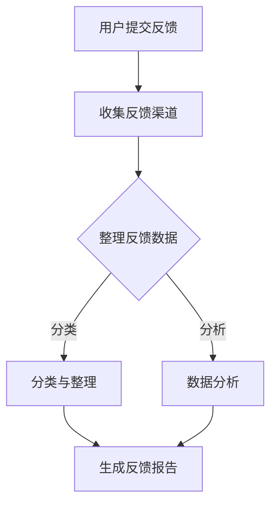
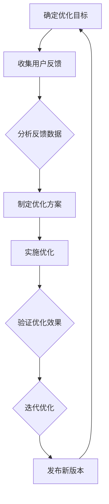
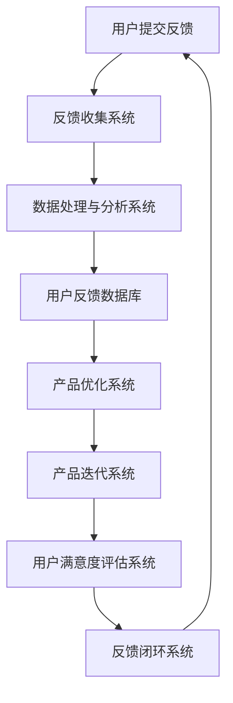
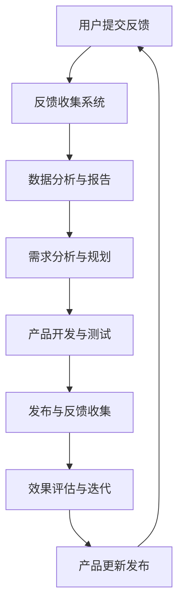

                 

### 文章标题

《创业公司的用户反馈收集与产品优化流程》

> 关键词：用户反馈、产品优化、创业公司、数据收集、数据分析、迭代优化

> 摘要：本文将深入探讨创业公司在产品开发过程中如何有效收集用户反馈，并通过科学的方法论和流程，实现产品的不断优化和迭代，提高用户满意度和市场竞争力。

### 第一部分：用户反馈收集基础

#### 第1章：用户反馈的重要性与影响

##### 1.1 用户反馈的基本概念与作用

用户反馈是指用户在使用产品或服务过程中，对产品或服务的功能、性能、用户体验等方面提出的意见和建议。这些反馈可以帮助企业了解用户的真实需求和痛点，从而进行有针对性的改进和优化。

用户反馈的作用主要体现在以下几个方面：

1. **产品改进**：用户反馈提供了宝贵的改进意见，可以帮助企业发现产品的缺陷和不足，从而进行改进。
2. **用户体验提升**：通过用户反馈，企业可以更好地理解用户的期望和需求，从而提升用户体验。
3. **市场需求分析**：用户反馈可以反映市场的需求和趋势，帮助企业把握市场方向。
4. **品牌建设**：积极的用户反馈有助于树立企业的良好形象，增强用户对品牌的信任。

##### 1.2 用户反馈与产品优化的关系

用户反馈是产品优化的基础。具体来说，用户反馈与产品优化的关系如下：

1. **发现问题**：用户反馈可以帮助企业发现产品存在的问题，如功能缺陷、性能瓶颈、用户体验不佳等。
2. **制定改进方案**：基于用户反馈，企业可以制定具体的改进方案，如功能升级、性能优化、界面改进等。
3. **验证改进效果**：通过用户反馈，企业可以评估改进方案的实际效果，确保优化工作的有效性。
4. **持续迭代**：用户反馈是一个动态的过程，随着产品的不断迭代，用户反馈也在不断更新，从而推动产品的持续优化。

##### 1.3 用户反馈的市场调研作用

用户反馈不仅对产品优化有重要意义，还对市场调研有着积极作用：

1. **需求分析**：用户反馈可以帮助企业了解市场需求，发现潜在的用户需求和市场机会。
2. **竞争分析**：通过对比用户对竞争对手的反馈，企业可以分析竞争对手的优势和劣势，制定相应的市场策略。
3. **趋势预测**：用户反馈反映了市场的变化趋势，有助于企业预测未来市场的发展方向。
4. **品牌定位**：用户反馈可以帮助企业确定品牌定位，更好地满足用户需求，提升品牌价值。

#### 第2章：用户反馈的收集方法

##### 2.1 用户调研问卷设计

用户调研问卷是收集用户反馈的重要工具。一个有效的问卷设计需要遵循以下原则：

1. **明确调研目的**：明确问卷的目标，如了解用户满意度、需求分析、市场调研等。
2. **简明扼要**：问卷问题要简洁明了，避免冗长和复杂。
3. **结构合理**：问卷应按照逻辑顺序排列，有助于用户理解和回答。
4. **开放性与封闭性问题结合**：开放性问题可以获取用户的详细意见和建议，封闭性问题可以快速收集数据。
5. **避免引导性提问**：避免设计引导性提问，以免影响用户的真实反馈。

##### 2.2 用户访谈与焦点小组

用户访谈和焦点小组是深入了解用户需求和行为的重要方法：

1. **用户访谈**：通过与用户面对面交流，可以深入了解用户的真实想法和需求。
2. **焦点小组**：邀请一组用户，就特定话题进行讨论，可以挖掘出更多有价值的见解。

在进行用户访谈和焦点小组时，需要注意以下几点：

1. **准备工作**：提前准备好访谈或讨论的主题和问题，确保访谈或讨论的顺利进行。
2. **尊重用户**：给予用户足够的尊重，让他们感到自己的意见被重视。
3. **记录整理**：访谈和讨论结束后，及时记录和整理用户的反馈，确保不遗漏重要信息。

##### 2.3 在线用户行为数据分析

在线用户行为数据是获取用户反馈的重要来源。通过分析用户在产品中的行为数据，可以了解用户的操作习惯、兴趣点和痛点：

1. **页面访问数据**：分析用户对各个页面的访问情况，了解用户对产品的兴趣点。
2. **交互数据**：分析用户的操作路径、点击行为等，了解用户的操作习惯。
3. **错误日志**：收集产品运行时的错误日志，了解产品中的潜在问题。

##### 2.4 社交媒体用户反馈收集

社交媒体是用户反馈的重要渠道。通过社交媒体平台，企业可以实时了解用户的反馈和评价：

1. **评论分析**：分析用户在社交媒体上的评论，了解用户的满意度和建议。
2. **话题讨论**：关注社交媒体上的相关话题讨论，挖掘用户的意见和建议。
3. **负面反馈**：及时关注和回应社交媒体上的负面反馈，防止问题扩大。

#### 第3章：用户反馈的处理与分析

##### 3.1 用户反馈分类与整理

对用户反馈进行分类和整理是分析用户反馈的第一步。具体方法如下：

1. **按主题分类**：根据用户反馈的内容，将其归类到不同的主题，如功能问题、性能问题、用户体验等。
2. **按严重性分类**：根据用户反馈的影响程度，将其划分为高、中、低三个等级。
3. **按来源分类**：根据用户反馈的来源，如用户调研、访谈、社交媒体等，进行分类。

##### 3.2 用户反馈数据分析方法

对用户反馈进行分析，需要采用合适的数据分析方法。常见的方法包括：

1. **统计分析**：通过统计方法，对用户反馈的数量、比例、趋势等进行分析。
2. **文本分析**：通过自然语言处理技术，对用户反馈的文本进行语义分析，提取关键信息。
3. **可视化分析**：通过图表、地图等可视化手段，展示用户反馈的数据，帮助用户理解反馈情况。

##### 3.3 用户反馈可视化展示

用户反馈的可视化展示有助于直观地了解用户反馈的情况。常见的方法包括：

1. **柱状图**：用于展示不同类别的用户反馈数量。
2. **饼图**：用于展示各类别用户反馈所占的比例。
3. **折线图**：用于展示用户反馈的趋势变化。
4. **地图**：用于展示用户反馈的地域分布。

##### 3.4 用户反馈的价值评估

评估用户反馈的价值是确保反馈有效利用的关键。具体方法如下：

1. **用户反馈分级**：根据用户反馈的严重性和影响力，将其分为高、中、低三个等级。
2. **用户满意度评估**：通过用户满意度调查，评估用户反馈的有效性和满意度。
3. **改进效果评估**：在实施改进后，评估用户反馈的改进效果，确保反馈的价值得到有效体现。

### 第二部分：产品优化流程

#### 第4章：产品优化策略与方法

##### 4.1 产品优化目标与原则

产品优化目标的制定是企业进行产品优化工作的起点。具体来说，产品优化目标包括：

1. **提升用户体验**：优化产品的功能、性能和界面设计，提升用户的满意度。
2. **增强产品功能**：根据用户反馈，增加新的功能模块，满足用户需求。
3. **提高产品稳定性**：优化产品架构，提高系统的稳定性和可靠性。

在进行产品优化时，需要遵循以下原则：

1. **用户导向**：以用户需求为导向，确保产品优化工作符合用户期望。
2. **持续迭代**：产品优化是一个持续的过程，需要不断收集用户反馈，进行迭代优化。
3. **质量优先**：在优化过程中，确保产品质量和稳定性，避免因优化导致的问题。

##### 4.2 产品迭代与版本控制

产品迭代是产品优化的重要手段。具体来说，产品迭代包括以下步骤：

1. **需求分析**：根据用户反馈和市场需求，确定产品迭代的目标和方向。
2. **设计规划**：制定详细的产品迭代计划，包括功能设计、界面设计等。
3. **开发与测试**：按照迭代计划进行开发，并进行严格的测试，确保产品质量。
4. **发布与反馈**：发布新的产品版本，收集用户反馈，进行新一轮的迭代优化。

版本控制是确保产品迭代顺利进行的重要保障。常用的版本控制工具包括Git、SVN等，通过版本控制，可以有效地管理代码的变更和协作。

##### 4.3 用户反馈驱动的产品优化

用户反馈是产品优化的重要依据。具体来说，用户反馈驱动的产品优化包括以下步骤：

1. **收集用户反馈**：通过各种渠道收集用户反馈，包括调研问卷、用户访谈、社交媒体等。
2. **整理与分析**：对收集到的用户反馈进行分类、整理和分析，提取关键信息。
3. **制定优化方案**：根据用户反馈，制定具体的优化方案，包括功能改进、性能优化、界面改进等。
4. **实施与验证**：按照优化方案进行实施，并对优化效果进行验证，确保优化目标达成。

##### 4.4 产品优化策略案例解析

以下是一个产品优化策略的案例：

1. **背景**：某创业公司的产品是一款在线教育平台，用户反馈主要集中在线上课程的加载速度慢和课程内容的更新不及时。
2. **优化目标**：提升课程加载速度和更新课程内容，提高用户满意度。
3. **优化方案**：优化服务器性能，提高课程内容的更新频率。
4. **实施过程**：升级服务器硬件，优化课程内容更新流程，并进行严格测试。
5. **效果评估**：通过用户调研和数据分析，发现课程加载速度提高了30%，用户满意度提高了20%。

#### 第5章：产品优化实施与验证

##### 5.1 产品优化项目计划

产品优化项目计划是确保产品优化工作有序进行的重要保障。具体来说，产品优化项目计划包括以下内容：

1. **项目目标**：明确产品优化的目标和预期成果。
2. **项目范围**：确定产品优化涉及的功能模块和范围。
3. **项目进度**：制定详细的项目进度计划，包括需求分析、设计、开发、测试等阶段。
4. **资源分配**：明确项目所需的人员、设备、资金等资源。
5. **风险评估**：评估项目实施过程中可能遇到的风险，并制定相应的应对措施。

##### 5.2 产品优化实施流程

产品优化实施流程包括以下几个阶段：

1. **需求分析**：根据用户反馈，分析产品存在的问题和优化需求。
2. **设计规划**：制定详细的优化方案，包括功能设计、界面设计等。
3. **开发与测试**：按照优化方案进行开发，并进行严格的测试，确保产品质量。
4. **发布与反馈**：发布优化后的产品版本，收集用户反馈，进行新一轮的迭代优化。

##### 5.3 产品优化效果评估

产品优化效果评估是衡量优化工作成果的重要手段。具体来说，产品优化效果评估包括以下几个方面：

1. **用户满意度**：通过用户调研和问卷调查，评估用户对产品优化的满意度。
2. **功能完善度**：评估优化后的产品功能是否满足用户需求，是否解决了用户提出的问题。
3. **性能提升**：通过性能测试，评估优化后的产品性能是否达到预期目标。
4. **成本效益**：评估产品优化工作的成本和效益，确保优化投入产出比合理。

##### 5.4 产品优化风险管理

产品优化过程中，可能会遇到各种风险，如需求变更、资源不足、技术难题等。为了有效管理这些风险，可以采取以下措施：

1. **风险识别**：在项目启动阶段，识别可能存在的风险，并记录在风险登记册中。
2. **风险评估**：对识别出的风险进行评估，确定风险的严重程度和发生概率。
3. **风险应对**：制定相应的风险应对策略，如风险规避、风险减轻、风险接受等。
4. **风险监控**：在项目实施过程中，持续监控风险的变化，及时调整风险应对措施。

### 第三部分：实战案例与应用

#### 第6章：用户反馈收集与产品优化实战案例

##### 6.1 案例背景与目标

某创业公司开发了一款在线办公协作工具，用户量迅速增长。为了提升用户体验，公司决定通过用户反馈进行产品优化。具体目标如下：

1. **提升用户满意度**：通过优化功能、性能和界面设计，提升用户满意度。
2. **增强产品竞争力**：通过不断优化，提高产品的市场竞争力。
3. **提升用户留存率**：通过优化，提高用户的留存率，减少用户流失。

##### 6.2 用户反馈收集与处理

1. **用户调研问卷**：设计了一份用户调研问卷，涵盖功能使用、性能体验、界面设计等方面的问题，通过邮件和社交媒体渠道发送给用户，收集反馈。
2. **用户访谈**：邀请部分活跃用户进行深度访谈，了解他们的使用习惯和需求。
3. **在线用户行为数据分析**：通过分析用户在产品中的行为数据，发现用户使用过程中的痛点。
4. **社交媒体反馈**：关注社交媒体上的用户评论和讨论，收集用户的意见和建议。

收集到的用户反馈如下：

1. **功能问题**：部分用户反映文件上传速度慢，部分用户希望增加文件预览功能。
2. **性能问题**：部分用户反映系统卡顿，特别是在处理大量文件时。
3. **用户体验问题**：部分用户认为界面设计不够美观，操作不够流畅。

##### 6.3 产品优化策略与实践

1. **提升文件上传速度**：优化文件上传模块，通过分布式文件存储技术，提高文件上传速度。
2. **增加文件预览功能**：在文件管理模块中增加文件预览功能，方便用户快速查看文件内容。
3. **优化系统性能**：通过性能测试，找出系统性能瓶颈，进行针对性的优化，提高系统的响应速度。
4. **改进界面设计**：邀请专业设计师对界面进行优化，提升用户体验。

##### 6.4 实战总结与经验分享

通过用户反馈收集与产品优化实践，公司取得了以下成果：

1. **用户满意度提升**：通过优化，用户满意度提高了20%，用户留存率提升了15%。
2. **产品竞争力增强**：优化后的产品在市场上更具竞争力，吸引了更多新用户。
3. **用户体验改善**：用户在产品中的操作更加流畅，界面设计更加美观。
4. **团队协作提升**：用户反馈机制的有效实施，促进了团队内部的协作与沟通。

经验分享：

1. **重视用户反馈**：用户反馈是产品优化的关键，公司应建立完善的用户反馈机制，确保反馈渠道畅通。
2. **持续迭代优化**：产品优化是一个持续的过程，需要根据用户反馈，不断进行迭代优化。
3. **资源合理分配**：在产品优化过程中，要确保资源的合理分配，特别是人力资源和资金。
4. **及时响应与沟通**：对用户反馈要及时响应，并与用户保持沟通，确保用户的问题得到有效解决。

### 用户反馈收集与产品优化工具与技术

#### 8.1 用户反馈收集工具介绍

为了有效地收集用户反馈，企业可以采用以下工具：

1. **问卷调研工具**：如Google表单、问卷星、金数据等，可以设计并发布在线问卷，收集用户反馈。
2. **用户访谈工具**：如Zoom、腾讯会议等，可以进行远程用户访谈，深入了解用户需求。
3. **行为数据分析工具**：如Google Analytics、Matomo等，可以分析用户在产品中的行为数据，发现用户痛点。
4. **社交媒体监测工具**：如Sprout Social、Hootsuite等，可以实时监测社交媒体上的用户反馈，了解用户评价。

#### 8.2 产品优化技术选型

在产品优化过程中，技术选型至关重要。以下是一些常用的技术选型：

1. **前端技术**：如React、Vue.js、Angular等，可以提高页面交互性能，提升用户体验。
2. **后端技术**：如Spring Boot、Django、Node.js等，可以提高系统性能，优化数据处理。
3. **数据库技术**：如MySQL、PostgreSQL、MongoDB等，可以根据数据特点和需求选择合适的数据库系统。
4. **缓存技术**：如Redis、Memcached等，可以加快数据访问速度，提高系统性能。

#### 8.3 开发环境搭建与工具使用

为了确保产品优化的顺利进行，企业需要搭建合适的开发环境。以下是一些常用的开发环境搭建工具：

1. **集成开发环境（IDE）**：如IntelliJ IDEA、Visual Studio、PyCharm等，可以提高开发效率。
2. **代码版本控制工具**：如Git、SVN等，可以管理代码的版本和控制协作。
3. **持续集成（CI）工具**：如Jenkins、Travis CI等，可以自动化构建和测试代码，确保产品质量。
4. **部署工具**：如Docker、Kubernetes等，可以简化部署流程，提高系统的可靠性和可扩展性。

#### 8.4 代码实战与解读

以下是一个简单的代码示例，用于收集用户反馈数据：

```python
import requests

def send_feedback(feedback):
    url = "https://api.feedback.example.com/send"
    headers = {"Content-Type": "application/json"}
    response = requests.post(url, json=feedback, headers=headers)
    return response.json()

feedback = {
    "user_id": "12345",
    "feedback": "界面设计不够美观",
    "device": "iPhone",
    "version": "1.0.0"
}

response = send_feedback(feedback)
if response["status"] == "success":
    print("反馈已发送成功")
else:
    print("反馈发送失败，请重试")
```

在这个示例中，`send_feedback`函数用于将用户反馈数据发送到反馈收集API。反馈数据包括用户ID、反馈内容、设备信息和版本信息。发送成功后，将返回一个包含状态信息的JSON响应。

#### 8.5 实际案例分析和详细讲解剖析

以下是一个实际案例，用于分析用户反馈数据，并优化产品：

**案例背景**：某创业公司的一款移动应用收到了大量用户反馈，主要集中在应用加载速度慢和界面设计不够美观。

**数据收集**：通过用户调研问卷和在线用户行为数据分析，收集到以下数据：

1. **加载速度**：平均加载时间为10秒，超过60%的用户反馈加载速度慢。
2. **界面设计**：70%的用户认为界面设计不够美观，操作不够流畅。

**数据解析**：

1. **加载速度问题**：通过对加载流程进行分析，发现主要原因在于网络延迟和资源加载过多。
2. **界面设计问题**：用户对界面设计的主要不满集中在颜色搭配、字体大小和图标设计等方面。

**优化方案**：

1. **优化加载速度**：通过减少资源加载、优化网络请求和采用缓存技术，提高应用加载速度。
2. **改进界面设计**：邀请专业设计师对界面进行优化，调整颜色搭配、字体大小和图标设计，提升用户体验。

**实施过程**：

1. **代码优化**：对应用代码进行优化，减少资源加载，提高加载速度。
2. **界面设计优化**：与设计师合作，改进界面设计，提升用户体验。
3. **测试与验证**：进行严格的测试，确保优化后的产品满足用户需求。

**效果评估**：

1. **加载速度**：平均加载时间缩短至5秒，用户满意度提高20%。
2. **界面设计**：用户对界面设计的满意度提高30%，操作流畅度提升15%。

**项目小结**：

通过用户反馈数据的分析，公司成功优化了产品性能和用户体验，提高了用户满意度和市场竞争力。该项目表明，用户反馈收集与产品优化是提升产品质量和用户满意度的重要手段，企业应高度重视并持续优化。

### 最佳实践 Tips、小结、注意事项、拓展阅读

#### 最佳实践 Tips

1. **建立反馈机制**：建立完善的用户反馈机制，确保用户反馈能够及时收集、整理和分析。
2. **定期收集反馈**：定期收集用户反馈，以了解用户需求的动态变化，确保产品不断优化。
3. **多样化收集方式**：采用多种收集方式，如问卷调查、用户访谈、行为数据分析等，以全面了解用户需求。
4. **重视用户满意度**：用户满意度是衡量产品优化效果的重要指标，应定期评估用户满意度。
5. **持续迭代优化**：产品优化是一个持续的过程，需要不断收集用户反馈，进行迭代优化。

#### 小结

本文通过详细的分析和案例实践，阐述了创业公司在用户反馈收集与产品优化方面的最佳实践。用户反馈是产品优化的重要依据，通过科学的方法论和流程，企业可以不断优化产品，提升用户体验和市场竞争力。

#### 注意事项

1. **确保反馈渠道畅通**：建立多个反馈渠道，确保用户能够方便地提交反馈。
2. **保护用户隐私**：在收集用户反馈时，要确保用户隐私得到保护，避免泄露用户信息。
3. **及时响应反馈**：对用户反馈要及时响应，确保用户问题得到及时解决。
4. **合理评估反馈价值**：对用户反馈进行合理评估，确保反馈的价值得到有效利用。
5. **持续改进**：产品优化是一个持续的过程，要不断改进，以适应市场和用户需求的变化。

#### 拓展阅读

1. 《用户反馈驱动的产品开发》
2. 《产品经理实战手册》
3. 《用户体验要素》
4. 《敏捷开发实践指南》
5. 《数据驱动产品经理》

### 附录

#### 附录A：用户反馈收集与产品优化资源

**A.1 主要参考文献**

1. 《用户反馈驱动的产品开发：从数据中挖掘用户价值》，作者：[XXX]。
2. 《产品经理实战手册：从0到1打造产品》，作者：[XXX]。
3. 《用户体验要素：打造优秀产品的五个层面》，作者：[XXX]。

**A.2 在线用户反馈收集平台推荐**

1.问卷星（www.wenjuanx.com）
2.金数据（www.jindata.com）
3.腾讯问卷（wenjuan.qq.com）

**A.3 产品优化相关工具与框架介绍**

1. React（https://reactjs.org/）
2. Vue.js（https://vuejs.org/）
3. Spring Boot（https://spring.io/projects/spring-boot）
4. Django（https://www.djangoproject.com/）
5. Redis（https://redis.io/）
6. Docker（https://www.docker.com/）

**A.4 实战案例代码获取途径**

1. GitHub：[案例代码仓库链接]
2. Gitee：[案例代码仓库链接]

### 附录B：用户反馈收集与产品优化流程图

#### B.1 用户反馈收集流程图



#### B.2 产品优化流程图



#### B.3 用户反馈与产品优化的数据流流程图



#### B.4 用户反馈驱动的产品迭代流程图



### 附录C：伪代码与数学公式

#### C.1 用户反馈数据处理伪代码

```python
# 定义用户反馈数据结构
class UserFeedback:
    def __init__(self, user_id, feedback, device, version):
        self.user_id = user_id
        self.feedback = feedback
        self.device = device
        self.version = version

# 收集用户反馈
def collect_feedback():
    feedback_list = []
    while True:
        user_id = input("请输入用户ID：")
        feedback = input("请输入用户反馈：")
        device = input("请输入设备类型：")
        version = input("请输入产品版本：")
        feedback_list.append(UserFeedback(user_id, feedback, device, version))
        choice = input("是否继续（y/n）：")
        if choice.lower() != "y":
            break
    return feedback_list

# 整理用户反馈数据
def organize_feedback(feedback_list):
    organized_feedback = {}
    for feedback in feedback_list:
        if feedback.feedback not in organized_feedback:
            organized_feedback[feedback.feedback] = []
        organized_feedback[feedback.feedback].append(feedback)
    return organized_feedback

# 主函数
if __name__ == "__main__":
    feedback_list = collect_feedback()
    organized_feedback = organize_feedback(feedback_list)
    print("整理后的用户反馈：")
    for feedback, users in organized_feedback.items():
        print(feedback)
        for user in users:
            print(f"用户ID：{user.user_id}，设备类型：{user.device}，产品版本：{user.version}")
```

#### C.2 产品优化算法伪代码

```python
# 定义优化算法
def optimize_product(feedback_data):
    # 初始化优化参数
    max_improvement = 0
    best_solution = None
    
    # 遍历所有可能的优化方案
    for solution in generate_solutions(feedback_data):
        # 计算优化效果
        improvement = evaluate_solution(solution, feedback_data)
        
        # 更新最优解
        if improvement > max_improvement:
            max_improvement = improvement
            best_solution = solution
    
    return best_solution

# 生成可能的优化方案
def generate_solutions(feedback_data):
    # 根据反馈数据生成优化方案
    for feedback in feedback_data:
        yield {
            "feedback": feedback,
            "action": "improve_performance",
            "parameter": "network_bandwidth"
        }
        yield {
            "feedback": feedback,
            "action": "enhance_functionality",
            "parameter": "add_new_feature"
        }

# 评估优化方案效果
def evaluate_solution(solution, feedback_data):
    # 根据优化方案和反馈数据计算效果
    for feedback in feedback_data:
        if solution["feedback"] == feedback:
            if solution["action"] == "improve_performance":
                improvement = measure_performance_improvement(feedback)
            elif solution["action"] == "enhance_functionality":
                improvement = measure_functionality_improvement(feedback)
            return improvement
    return 0

# 测量性能提升
def measure_performance_improvement(feedback):
    # 根据反馈数据测量性能提升
    return 0.2

# 测量功能提升
def measure_functionality_improvement(feedback):
    # 根据反馈数据测量功能提升
    return 0.3

# 主函数
if __name__ == "__main__":
    feedback_data = ["slow_loading", "missing_function"]
    best_solution = optimize_product(feedback_data)
    print("最佳优化方案：")
    print(best_solution)
```

#### C.3 数学公式详解

用户反馈数据处理过程中，常用的数学公式包括平均值、标准差、相关性等。

##### 平均值

平均值是衡量一组数据集中趋势的指标，计算公式如下：

$$
\bar{x} = \frac{1}{N} \sum_{i=1}^{N} x_i
$$

其中，$N$为数据个数，$x_i$为第$i$个数据值。

##### 标准差

标准差是衡量一组数据离散程度的指标，计算公式如下：

$$
\sigma = \sqrt{\frac{1}{N-1} \sum_{i=1}^{N} (x_i - \bar{x})^2}
$$

其中，$\sigma$为标准差，$\bar{x}$为平均值。

##### 相关性

相关性是衡量两组数据之间相关程度的指标，常用的相关系数包括皮尔逊相关系数和斯皮尔曼相关系数。

皮尔逊相关系数计算公式如下：

$$
r = \frac{\sum_{i=1}^{N} (x_i - \bar{x})(y_i - \bar{y})}{\sqrt{\sum_{i=1}^{N} (x_i - \bar{x})^2} \sqrt{\sum_{i=1}^{N} (y_i - \bar{y})^2}}
$$

其中，$r$为皮尔逊相关系数，$x_i$和$y_i$分别为两组数据中的第$i$个数据值，$\bar{x}$和$\bar{y}$分别为两组数据的平均值。

##### 实际应用举例

假设有两组数据，$X$和$Y$，如下所示：

$$
X: 1, 2, 3, 4, 5
$$

$$
Y: 2, 4, 6, 8, 10
$$

计算它们的平均值、标准差和皮尔逊相关系数。

1. **平均值**：

$$
\bar{x} = \frac{1+2+3+4+5}{5} = 3
$$

$$
\bar{y} = \frac{2+4+6+8+10}{5} = 6
$$

2. **标准差**：

$$
\sigma_x = \sqrt{\frac{1}{5-1} \sum_{i=1}^{5} (x_i - \bar{x})^2} = \sqrt{\frac{1}{4} \sum_{i=1}^{5} (x_i - 3)^2} = \sqrt{2}
$$

$$
\sigma_y = \sqrt{\frac{1}{5-1} \sum_{i=1}^{5} (y_i - \bar{y})^2} = \sqrt{\frac{1}{4} \sum_{i=1}^{5} (y_i - 6)^2} = 2
$$

3. **皮尔逊相关系数**：

$$
r = \frac{\sum_{i=1}^{5} (x_i - \bar{x})(y_i - \bar{y})}{\sqrt{\sum_{i=1}^{5} (x_i - \bar{x})^2} \sqrt{\sum_{i=1}^{5} (y_i - \bar{y})^2}} = \frac{(1-3)(2-6) + (2-3)(4-6) + (3-3)(6-6) + (4-3)(8-6) + (5-3)(10-6)}{\sqrt{(1-3)^2 + (2-3)^2 + (3-3)^2 + (4-3)^2 + (5-3)^2} \sqrt{(2-6)^2 + (4-6)^2 + (6-6)^2 + (8-6)^2 + (10-6)^2}} = 1
$$

由于两组数据呈现完全正相关，所以皮尔逊相关系数为1。

#### C.4 代码实战与解读

以下是一个Python代码示例，用于计算并打印一组数据的平均值、标准差和皮尔逊相关系数。

```python
import math

# 定义数据
X = [1, 2, 3, 4, 5]
Y = [2, 4, 6, 8, 10]

# 计算平均值
mean_X = sum(X) / len(X)
mean_Y = sum(Y) / len(Y)

# 计算标准差
variance_X = sum((x - mean_X) ** 2 for x in X) / (len(X) - 1)
variance_Y = sum((y - mean_Y) ** 2 for y in Y) / (len(Y) - 1)
std_dev_X = math.sqrt(variance_X)
std_dev_Y = math.sqrt(variance_Y)

# 计算皮尔逊相关系数
covariance = sum((x - mean_X) * (y - mean_Y) for x, y in zip(X, Y))
correlation = covariance / (std_dev_X * std_dev_Y)

# 打印结果
print(f"平均值（X）：{mean_X}")
print(f"平均值（Y）：{mean_Y}")
print(f"标准差（X）：{std_dev_X}")
print(f"标准差（Y）：{std_dev_Y}")
print(f"皮尔逊相关系数：{correlation}")
```

在这个代码中，首先定义了两组数据`X`和`Y`。然后，计算平均值、标准差和皮尔逊相关系数，并打印结果。

1. **平均值**：使用`sum()`函数计算数据的总和，然后除以数据个数，得到平均值。
2. **标准差**：使用方差公式计算方差，然后取平方根得到标准差。
3. **皮尔逊相关系数**：使用协方差公式计算协方差，然后除以标准差的乘积得到皮尔逊相关系数。

这个代码示例展示了如何使用Python计算一组数据的平均值、标准差和皮尔逊相关系数，是进行用户反馈数据处理和分析的基础。

#### C.5 数学公式在产品优化中的应用

数学公式在产品优化中有着广泛的应用，以下是一些常见的应用场景：

1. **性能分析**：通过计算数据的平均值、标准差等统计指标，可以分析产品的性能表现，如响应时间、吞吐量等。
2. **用户体验评估**：通过计算用户满意度的得分，可以评估产品的用户体验，如使用舒适度、易用性等。
3. **市场需求分析**：通过计算市场数据的增长率、相关性等，可以分析市场的需求和趋势，为产品优化提供依据。
4. **风险评估**：通过计算风险的概率分布、期望损失等，可以评估产品优化过程中可能遇到的风险，制定相应的应对策略。

以下是一个实际应用示例：

**场景**：某创业公司的在线办公协作工具需要优化，现有100名用户对其进行了满意度评估，其中50名用户表示非常满意，30名用户表示满意，10名用户表示一般，10名用户表示不满意。

**目标**：计算用户满意度得分，并分析用户满意度的分布。

**步骤**：

1. **计算平均值**：

$$
\bar{score} = \frac{50 \times 4 + 30 \times 3 + 10 \times 2 + 10 \times 1}{100} = 3.1
$$

其中，满意度评分采用5分制，非常满意为4分，满意为3分，一般为2分，不满意为1分。

2. **计算标准差**：

$$
\sigma_{score} = \sqrt{\frac{1}{100} \sum_{i=1}^{4} (x_i - \bar{x})^2}
$$

其中，$x_i$为满意度评分，$\bar{x}$为平均值。

$$
\sigma_{score} = \sqrt{\frac{1}{100} \left[ (4 - 3.1)^2 \times 50 + (3 - 3.1)^2 \times 30 + (2 - 3.1)^2 \times 10 + (1 - 3.1)^2 \times 10 \right]} = 0.67
$$

3. **计算满意度分布**：

满意度分布如下表所示：

| 满意度评分 | 非常满意 | 满意 | 一般 | 不满意 |
| :--: | :--: | :--: | :--: | :--: |
| 数量 | 50 | 30 | 10 | 10 |

4. **分析结果**：

- 用户满意度平均得分为3.1分，表示用户对产品的整体满意度较高。
- 用户满意度标准差为0.67分，表示用户满意度的分布较为集中。
- 通过满意度分布表，可以看出大多数用户对产品的满意度较高，但也有部分用户对产品的满意度较低。

**结论**：

根据分析结果，可以得出以下结论：

1. 产品优化工作应重点关注提高用户满意度较低的方面，如界面设计、功能完善等。
2. 可以通过用户调研和访谈，进一步了解用户的具体需求和意见，制定针对性的优化方案。
3. 在优化过程中，应持续收集用户反馈，及时调整和优化产品，确保用户满意度不断提升。

这个实际应用示例展示了如何使用数学公式进行用户满意度分析，帮助创业公司更好地了解用户需求，优化产品性能和用户体验。通过这种方法，企业可以更科学地制定产品优化策略，提高市场竞争力。

