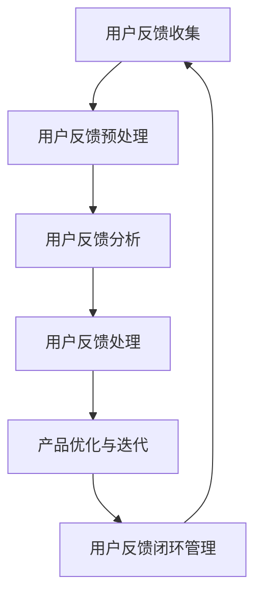

                 

# 《创业公司的用户反馈闭环管理系统》

## 摘要

在竞争激烈的创业环境中，用户反馈闭环管理系统成为了创业公司提升产品竞争力、优化用户体验的关键。本文旨在探讨创业公司如何构建并有效利用用户反馈闭环管理系统，从而实现持续的产品迭代与优化。文章分为三大部分：基础、分析与处理、应用，详细阐述了用户反馈闭环管理的核心概念、流程、数据处理方法、主题建模与情感分析算法、以及产品优化策略。通过本文的深入讲解，读者将能够理解并掌握用户反馈闭环管理的关键技术，为创业公司的持续成长提供有力支持。

## 关键词

- 用户反馈
- 闭环管理系统
- 数据处理
- 主题建模
- 情感分析
- 产品优化

## 引言

在快速发展的科技时代，创业公司面临着前所未有的竞争压力。如何快速响应市场变化，提升用户体验，优化产品功能，成为了创业公司能否站稳脚跟的关键。用户反馈作为用户对产品使用体验的直接表达，成为了创业公司了解市场需求、优化产品设计的重要途径。然而，如何高效地收集、分析、处理并利用用户反馈，构建一个闭环管理系统，从而实现产品的持续迭代和优化，是每个创业公司都需要面对的挑战。

用户反馈闭环管理系统不仅仅是一个技术工具，更是一个贯穿于产品开发、用户服务、市场调研等多环节的综合管理体系。它能够帮助创业公司快速了解用户需求，及时发现问题，进行针对性的改进，从而提高用户满意度，增强市场竞争力。本文将围绕用户反馈闭环管理的核心概念、流程、数据处理方法、主题建模与情感分析算法，以及产品优化策略，进行深入探讨，以期为创业公司提供切实可行的实践指导。

### 第一部分：用户反馈闭环管理基础

## 第1章：用户反馈闭环管理概述

### 1.1 用户反馈闭环管理的重要性

在创业公司的产品开发与运营过程中，用户反馈闭环管理显得尤为重要。它不仅是一个收集用户意见的渠道，更是驱动产品优化和提升用户体验的关键机制。用户反馈闭环管理的重要性可以从以下几个方面来理解：

**1. 快速响应市场需求：** 用户反馈是了解市场需求最直接的方式。通过用户反馈，创业公司能够迅速捕捉到用户的需求变化和痛点，从而及时调整产品策略，满足市场需求。

**2. 提高产品竞争力：** 通过对用户反馈的深入分析，创业公司可以找出产品的不足之处，并进行针对性的优化，从而提升产品竞争力，赢得更多用户的认可。

**3. 增强用户满意度：** 用户反馈闭环管理系统能够让用户感受到他们的意见被重视，这有助于提高用户满意度，增强用户对产品的忠诚度。

**4. 降低运营风险：** 通过及时获取和处理用户反馈，创业公司可以及时发现潜在的风险点，提前采取措施，避免问题扩大化。

### 1.2 用户反馈闭环管理的核心概念

用户反馈闭环管理涉及多个核心概念，以下是其中几个关键概念的定义和关系：

**1. 用户反馈：** 用户在使用产品过程中提出的意见、建议或问题。它可以是结构化的，如问卷反馈，也可以是非结构化的，如社交媒体评论。

**2. 反馈渠道：** 用于收集用户反馈的各种途径，如在线调查、社交媒体、客服系统等。

**3. 数据收集与处理：** 收集用户反馈后，需要对数据进行清洗、格式化、归一化等处理，以便进行进一步分析。

**4. 数据分析：** 利用数据分析方法对用户反馈进行处理，提取有价值的信息，如用户反馈主题、情感等。

**5. 反馈处理：** 根据数据分析结果，对用户反馈进行分类、聚类，并制定相应的处理措施。

**6. 产品优化：** 基于用户反馈分析结果，对产品进行功能改进、界面优化等，以提高用户体验。

### 1.3 用户反馈闭环管理的框架与流程

用户反馈闭环管理是一个循环过程，包括数据收集、数据分析、反馈处理和产品优化等环节。以下是用户反馈闭环管理的基本框架与流程：

1. **数据收集：** 通过多种渠道收集用户反馈数据，如问卷调查、客服系统、社交媒体等。

2. **数据预处理：** 清洗、格式化、归一化用户反馈数据，使其适合进一步分析。

3. **数据分析：** 利用主题建模、情感分析等技术对用户反馈进行深入分析，提取有价值的信息。

4. **反馈处理：** 根据数据分析结果，对用户反馈进行分类、聚类，并制定相应的处理措施。

5. **产品优化：** 基于用户反馈分析结果，对产品进行功能改进、界面优化等，以提高用户体验。

6. **结果评估：** 对产品优化后的效果进行评估，检验用户反馈闭环管理的有效性。

7. **反馈循环：** 将评估结果作为新一轮用户反馈闭环管理的输入，形成持续的反馈循环。

### 小结

用户反馈闭环管理系统在创业公司中具有重要意义。通过深入理解其核心概念和框架流程，创业公司可以更好地收集、分析和利用用户反馈，从而实现产品的持续优化和用户体验的提升。

## 第2章：用户反馈收集机制

### 2.1 用户反馈渠道的多样化

在构建用户反馈闭环管理系统时，多样化的用户反馈渠道至关重要。不同的反馈渠道能够帮助创业公司从不同的角度和层面收集用户意见，从而更全面地了解用户需求和问题。以下是几种常见的用户反馈渠道及其特点：

**1. 在线问卷调查：** 在线问卷调查是一种高效的反馈收集方式，能够快速覆盖大量用户，且数据便于量化分析。通过设计有针对性的问卷，创业公司可以收集到用户的详细意见，包括产品功能、用户体验、改进建议等。常见工具如Google表单、问卷星等。

**2. 客服系统：** 客服系统是用户直接与公司沟通的重要渠道。通过客服系统，用户可以直接向公司反馈遇到的问题和意见，客服人员能够实时响应，提供解决方案，并记录用户的反馈。这种渠道的特点是互动性强，能够及时解决用户问题。

**3. 社交媒体：** 社交媒体平台如微博、微信、Facebook等已经成为用户表达意见的重要场所。创业公司可以通过监控这些平台上的用户评论、讨论，获取用户的真实反馈。此外，社交媒体上的用户互动也能反映出产品的社会影响力和用户群体特征。

**4. 用户论坛：** 用户论坛是用户自主交流的平台，用户可以在论坛上分享使用心得、建议和问题。这种渠道的特点是用户参与度高，能够形成社区氛围，有助于深入了解用户群体。

**5. 用户访谈：** 用户访谈是一种深入的用户反馈收集方式，通过与用户面对面交流，创业公司能够获取更为具体和真实的用户意见。访谈可以是结构化的，也可以是非结构化的，适用于了解用户的深层次需求和问题。

**6. 用户体验测试：** 用户体验测试通过模拟用户实际操作场景，观察用户在产品使用过程中的行为和反应，收集用户的真实体验和反馈。这种方式适用于产品的功能优化和界面设计改进。

### 2.2 用户反馈数据的收集与处理

用户反馈数据的收集与处理是用户反馈闭环管理系统的基础，其质量直接影响到后续的数据分析效果。以下是用户反馈数据收集与处理的几个关键步骤：

**1. 数据收集：** 在使用不同反馈渠道收集用户反馈时，需要注意以下几点：
- **确保数据质量：** 避免无效或重复反馈，确保收集到的数据具有代表性和可靠性。
- **数据格式标准化：** 将不同渠道收集到的反馈数据统一格式，便于后续处理和分析。
- **隐私保护：** 在数据收集过程中，要严格遵守隐私保护法规，确保用户隐私不被泄露。

**2. 数据清洗：** 数据清洗是数据处理的重要环节，包括以下内容：
- **去除噪声数据：** 去除无关或错误的数据，如空值、重复值等。
- **数据格式化：** 将不同格式的数据统一转换为标准格式，如将文本反馈转换为文本文件。
- **数据校验：** 对数据进行校验，确保数据的准确性和完整性。

**3. 数据存储：** 数据清洗后的用户反馈数据需要存储在数据库中，便于后续的数据分析和处理。常见的存储方式包括关系型数据库（如MySQL、PostgreSQL）和NoSQL数据库（如MongoDB、Cassandra）。

**4. 数据预处理：** 数据预处理是数据分析的前置工作，包括以下内容：
- **数据归一化：** 将不同特征的数据进行归一化处理，使其具有相同的量纲，便于后续分析。
- **特征提取：** 从原始数据中提取有价值的特征，如关键词、情感极性等。
- **数据可视化：** 利用可视化工具对数据进行分析和展示，帮助用户直观地了解数据特征。

### 2.3 用户反馈数据的存储与管理

用户反馈数据的存储与管理是构建用户反馈闭环管理系统的重要环节。以下是用户反馈数据存储与管理的一些关键点：

**1. 数据存储选择：** 根据用户反馈数据的特点和需求，选择合适的数据存储方式：
- **关系型数据库：** 适用于结构化数据存储，如MySQL、PostgreSQL等。
- **NoSQL数据库：** 适用于非结构化或半结构化数据存储，如MongoDB、Cassandra等。
- **分布式存储：** 对于大量用户反馈数据，可以使用分布式存储系统，如Hadoop、Spark等，提高数据存储和处理的效率。

**2. 数据安全管理：** 在数据存储过程中，需要确保数据的安全性，包括以下措施：
- **数据加密：** 对用户反馈数据进行加密处理，防止数据泄露。
- **访问控制：** 设定严格的访问控制策略，确保只有授权用户可以访问数据。
- **备份与恢复：** 定期进行数据备份，确保数据在意外情况下可以恢复。

**3. 数据备份与恢复：** 数据备份与恢复是数据管理的重要环节，包括以下内容：
- **定期备份：** 定期对用户反馈数据进行备份，确保数据的长期存储。
- **灾难恢复：** 在发生数据丢失或系统故障时，能够快速恢复数据，确保业务连续性。

**4. 数据生命周期管理：** 用户反馈数据的生命周期管理包括数据的创建、存储、使用、归档和销毁等环节。根据数据的重要性和敏感性，制定合理的生命周期管理策略。

### 小结

多样化的用户反馈渠道和有效的数据收集与处理机制，是构建高效用户反馈闭环管理系统的关键。通过合理选择和利用各种反馈渠道，并采用先进的数据处理技术，创业公司可以更好地收集、存储和管理用户反馈数据，为后续的数据分析提供坚实的基础。

## 第二部分：用户反馈分析与处理

### 第3章：用户反馈数据预处理

用户反馈数据的预处理是用户反馈闭环管理系统中至关重要的一步，它直接影响到后续数据分析和处理的效果。有效的数据预处理能够提高数据质量，减少噪声和异常值的影响，从而确保分析的准确性和可靠性。以下是用户反馈数据预处理的主要步骤和技巧：

#### 3.1 数据清洗与格式化

数据清洗是用户反馈数据预处理的第一步，其目标是去除噪声数据、纠正错误数据，并将不同来源的数据格式统一化。以下是数据清洗的具体步骤：

**1. 去除无效数据：** 去除空值、缺失值以及明显错误的反馈数据，如输入错误、重复记录等。

**2. 处理异常值：** 对异常值进行识别和处理，如超出合理范围的数值、异常关键词等。常用的方法包括：

- **统计学方法：** 使用统计学方法（如3σ规则）识别并处理异常值。
- **机器学习方法：** 使用机器学习算法（如孤立森林）检测和排除异常值。

**3. 数据格式化：** 将不同来源的数据格式统一化，如将不同渠道的文本反馈转换为统一的编码格式（例如UTF-8），并规范化文本表达，如将全角字符转换为半角字符，去除多余的标点符号等。

#### 3.2 数据归一化与特征提取

数据归一化与特征提取是数据预处理的关键步骤，旨在将原始数据转换为适合分析的形式，并提取出对分析有用的信息。以下是具体的方法：

**1. 数据归一化：** 数据归一化的目的是消除不同特征之间的量纲差异，使数据在同一尺度上进行比较。常用的归一化方法包括：

- **最小-最大归一化：** 将数据缩放到[0, 1]之间，公式为：$$x_{\text{norm}} = \frac{x - x_{\text{min}}}{x_{\text{max}} - x_{\text{min}}}$$。
- **均值-方差归一化：** 将数据缩放到均值为0，标准差为1的范围内，公式为：$$x_{\text{norm}} = \frac{x - \mu}{\sigma}$$。

**2. 特征提取：** 特征提取是将原始数据转换为有助于分析和建模的特征。常见的特征提取方法包括：

- **关键词提取：** 使用自然语言处理技术（如TF-IDF、Word2Vec）提取文本数据中的关键词。
- **情感极性分析：** 使用情感分析算法（如基于机器学习的情感分类器）对文本数据中的情感进行标注。
- **主题建模：** 使用主题建模算法（如LDA）提取文本数据中的潜在主题。

#### 3.3 数据可视化方法

数据可视化是将数据以图形化的方式展示出来，帮助用户直观地理解数据特征和模式。以下是几种常见的数据可视化方法：

**1. 折线图：** 适用于展示数据随时间变化的趋势，如用户反馈数量随时间的变化。

**2. 饼图：** 适用于展示数据的占比情况，如用户反馈各类问题的比例。

**3. 柱状图：** 适用于展示不同类别之间的数据差异，如用户对不同功能模块的满意度评分。

**4. 散点图：** 适用于展示两个变量之间的关系，如用户满意度与使用时长之间的关系。

**5. 词云图：** 适用于展示文本数据中的关键词分布，如用户反馈中出现频率较高的关键词。

通过以上数据预处理步骤，用户反馈数据得到了清洗、归一化和特征提取，为后续的数据分析奠定了坚实的基础。数据可视化方法则帮助用户更好地理解数据特征和模式，从而为产品优化提供有力的支持。

### 第4章：用户反馈主题建模与情感分析

#### 4.1 主题建模算法

主题建模是用户反馈数据分析中的一个重要环节，它可以帮助我们提取文本数据中的潜在主题，从而更好地理解用户反馈的内容和意图。LDA（Latent Dirichlet Allocation）是一种常用的主题建模算法，它通过概率模型来发现文本数据中的潜在主题。

**1. 算法原理：** 

LDA算法基于贝叶斯概率模型，将文本数据中的词语分布建模为多个潜在主题的混合。具体来说，LDA算法有三个核心参数：

- **文档-主题分布：** 表示每个文档对应于不同主题的概率分布。
- **主题-词语分布：** 表示每个主题对应于不同词语的概率分布。
- **词语-文档分布：** 表示每个词语在文档中出现的概率。

LDA的目标是最大化文档-主题分布的后验概率，即：

$$
\text{LDA} = \arg\max_{\theta, \phi} p(\textbf{z}|\theta, \phi) p(\textbf{w}|\theta) p(\theta, \phi)
$$

其中，$p(\textbf{z}|\theta, \phi)$ 为文档主题分布，$p(\textbf{w}|\theta)$ 为词语在主题下的概率分布，$p(\theta, \phi)$ 为主题分布和词语分布。

**2. 算法步骤：**

- **初始化参数：** 随机初始化文档-主题分布 $\theta$ 和主题-词语分布 $\phi$。
- **E步（E-step）：** 根据当前参数计算词语在各个主题下的概率分布 $p(w|\theta)$ 和文档在各个主题下的概率分布 $p(z|\theta)$。
- **M步（M-step）：** 根据E步计算的结果更新参数 $\theta$ 和 $\phi$。
- **迭代优化：** 重复执行E步和M步，直到参数收敛。

**3. 伪代码：**

python
def LDA(data, K, num_iterations):
    # 初始化参数
    theta = np.random.uniform(0, 1, (num_documents, K))
    phi = np.random.uniform(0, 1, (K, num_words))
    
    for _ in range(num_iterations):
        # E-step
        z = sample_z(theta, phi, data)
        
        # M-step
        theta = update_theta(z, phi, data)
        phi = update_phi(z, theta, data)
    
    return theta, phi

def sample_z(theta, phi, data):
    # 根据当前参数采样文档-主题分布
    z = np.zeros((num_documents, num_words))
    for i, document in enumerate(data):
        for word in document:
            p_z_w = np.exp(np.log(phi) * data[i]).prod(axis=1)
            z[i, word] = np.random.choice(p_z_w)
    return z

def update_theta(z, phi, data):
    # 更新文档-主题分布
    theta = (z.T @ np.linalg.inv(np.linalg.pinv(phi @ np.linalg.inv(z.T))))
    return theta

def update_phi(z, theta, data):
    # 更新主题-词语分布
    phi = (z @ theta / z.sum(axis=1)[:, np.newaxis])
    return phi

### 4.2 情感分析算法

情感分析是用户反馈分析中的另一个重要环节，它可以帮助我们理解用户对产品的情感态度。支持向量机（SVM）是一种常用的情感分析算法，它通过建立一个超平面来对文本数据中的情感进行分类。

**1. 算法原理：**

SVM算法的核心思想是找到一个最优的超平面，使得正类和负类之间的分类间隔最大化。在文本分类中，SVM算法将文本数据映射到高维特征空间，并在该空间中寻找最优超平面。

**2. 数学模型：**

给定训练数据集 $T = \{(\textbf{x}_i, y_i)\}_{i=1}^n$，其中 $\textbf{x}_i$ 表示第 $i$ 个文本的特征向量，$y_i$ 表示第 $i$ 个文本的类别标签（1或-1），SVM的目标是最小化以下目标函数：

$$
\text{minimize} \quad \frac{1}{2} \sum_{i=1}^n \textbf{w}^T \textbf{w} + C \sum_{i=1}^n \xi_i
$$

其中，$\textbf{w}$ 是权重向量，$C$ 是正则化参数，$\xi_i$ 是 slack variables。

**3. 算法步骤：**

- **特征提取：** 将文本数据转换为高维特征向量，常用的特征提取方法包括词袋模型（Bag of Words, BoW）和词嵌入（Word Embeddings）。
- **训练模型：** 使用训练数据集训练SVM模型，得到权重向量 $\textbf{w}$ 和偏置项 $b$。
- **预测：** 对于新的文本数据，通过计算其特征向量与权重向量的点积，结合偏置项判断其类别。

**4. 伪代码：**

python
def SVM_train(X_train, y_train, C):
    # 特征提取
    X_train = extract_features(X_train)
    
    # 训练模型
    w, b = train_SVM(X_train, y_train, C)
    
    return w, b

def SVM_predict(w, b, X):
    # 特征提取
    X = extract_features(X)
    
    # 预测
    y_pred = np.sign(np.dot(X, w) + b)
    
    return y_pred

### 4.3 实例分析：用户反馈的情感分析案例

为了更好地理解主题建模和情感分析算法在实际应用中的效果，我们以一个用户反馈的情感分析案例进行详细分析。

**1. 数据集准备：**

假设我们有一个用户反馈数据集，包含1000条文本数据，每条文本表示用户对某一产品的评价。数据集被分为训练集和测试集，其中训练集用于训练情感分析模型，测试集用于评估模型性能。

**2. 数据预处理：**

- **文本预处理：** 去除文本中的标点符号、停用词等无关信息，并将文本转换为小写。
- **特征提取：** 使用词袋模型将文本数据转换为特征向量。

**3. 模型训练：**

- **训练集划分：** 将训练集划分为训练数据和验证数据，用于训练和调整SVM模型参数。
- **模型训练：** 使用训练数据训练SVM模型，并调整C值以找到最佳模型性能。

**4. 模型评估：**

- **测试集预测：** 使用训练好的SVM模型对测试集进行预测。
- **性能评估：** 计算测试集的准确率、召回率、F1分数等指标，评估模型性能。

**5. 模型应用：**

- **用户反馈分析：** 使用训练好的SVM模型对用户反馈进行情感分析，判断其正面或负面情感。
- **反馈处理：** 根据情感分析结果，对用户反馈进行分类和处理，从而指导产品优化。

通过以上实例分析，我们可以看到主题建模和情感分析算法在用户反馈分析中的实际应用效果。这不仅帮助我们更好地理解用户反馈的内容和情感，也为产品优化提供了有力支持。

### 小结

本章详细介绍了用户反馈数据预处理、主题建模和情感分析算法。通过数据清洗与格式化、数据归一化和特征提取，我们能够将原始用户反馈数据转换为适合分析的形式。主题建模和情感分析算法则能够从文本数据中提取潜在主题和情感信息，为产品优化提供有力支持。在实际应用中，这些技术可以帮助创业公司更深入地了解用户需求，及时优化产品，提升用户体验。

### 第5章：用户反馈分类与聚类

用户反馈分类与聚类是用户反馈闭环管理系统中的重要步骤，通过这些技术，创业公司能够将海量的用户反馈数据进行分析，识别出反馈的主要类型和模式，从而为产品的改进和用户体验的提升提供有价值的参考。以下是用户反馈分类与聚类的详细探讨：

#### 5.1 分类算法

分类算法是一种监督学习算法，它通过对训练数据进行学习，建立分类模型，并使用该模型对未知数据进行分类。在用户反馈分析中，分类算法可以帮助我们将用户反馈按照类型进行划分，从而快速识别出用户的主要问题和需求。以下是一些常见的分类算法：

**1. 决策树（Decision Tree）：** 决策树是一种直观且易于理解的分类算法，它通过一系列if-else规则来对数据进行分类。决策树算法的流程如下：

- **特征选择：** 根据信息增益或基尼指数选择最佳特征进行划分。
- **递归划分：** 对选定特征的所有可能取值进行划分，递归构建树结构。
- **剪枝：** 为了防止过拟合，对决策树进行剪枝处理。

**2. 随机森林（Random Forest）：** 随机森林是一种集成学习算法，它通过构建多棵决策树，并对这些树的结果进行投票来决定最终的分类结果。随机森林算法具有以下优点：

- **高分类准确率：** 随机森林通过集成多个决策树，减少了过拟合的风险，提高了分类准确率。
- **鲁棒性：** 随机森林对异常值和噪声数据的抵抗力较强。

**3. 支持向量机（Support Vector Machine, SVM）：** 支持向量机是一种基于间隔最大化的分类算法，它通过寻找一个最优的超平面来分隔不同类别的数据。SVM算法的步骤包括：

- **特征提取：** 将用户反馈数据转换为高维特征空间。
- **间隔最大化：** 找到最佳的超平面，使得正负类别的分类间隔最大化。
- **核函数选择：** 通过选择合适的核函数将低维数据映射到高维空间，实现线性不可分数据的分类。

**4. K最近邻（K-Nearest Neighbors, KNN）：** K最近邻是一种基于实例的学习算法，它通过计算测试数据点与训练数据点的相似度来预测类别。KNN算法的步骤如下：

- **距离计算：** 计算测试数据点与训练数据点之间的距离，常用的距离度量包括欧氏距离、曼哈顿距离等。
- **分类预测：** 根据距离最近的K个邻居的类别标签进行投票，选择出现频率最高的类别作为测试数据的预测类别。

**5. 伪代码：**

python
# 决策树分类算法
def decision_tree_classification(data, labels, feature, threshold):
    if data[feature] < threshold:
        return decision_tree_classification(data, labels, feature_left, threshold_left)
    else:
        return decision_tree_classification(data, labels, feature_right, threshold_right)

# 随机森林分类算法
def random_forest_classification(data, labels, tree_list):
    predictions = []
    for tree in tree_list:
        prediction = tree.predict(data)
        predictions.append(prediction)
    return max(predictions, key=predictions.count)

# 支持向量机分类算法
def SVM_classification(X_train, y_train, X_test):
    model = train_SVM(X_train, y_train)
    return model.predict(X_test)

# K最近邻分类算法
def KNN_classification(train_data, train_labels, test_data, k):
    distances = []
    for i, x in enumerate(train_data):
        distance = euclidean_distance(x, test_data)
        distances.append((distance, train_labels[i]))
    distances.sort(key=lambda x: x[0])
    neighbors = distances[:k]
    output = majority_vote(neighbors)
    return output

### 5.2 聚类算法

聚类算法是一种无监督学习算法，它将相似的数据点划分为同一类别。在用户反馈分析中，聚类算法可以帮助我们识别用户反馈的相似性，从而发现潜在的用户群体和需求。以下是一些常见的聚类算法：

**1. K均值聚类（K-Means）：** K均值聚类是一种基于距离度量的聚类算法，它通过迭代过程将数据点分配到不同的聚类中心。K均值聚类的步骤包括：

- **初始化聚类中心：** 随机选择K个数据点作为初始聚类中心。
- **分配数据点：** 计算每个数据点到各个聚类中心的距离，并将其分配到最近的聚类中心。
- **更新聚类中心：** 计算每个聚类的中心点，重复迭代步骤直到聚类中心不再发生变化。

**2. 层次聚类（Hierarchical Clustering）：** 层次聚类是一种基于层次结构的聚类算法，它通过逐步合并或分裂数据点来构建聚类层次。常见的层次聚类算法包括自底向上（凝聚层次聚类）和自顶向下（分裂层次聚类）。

**3. 密度聚类（DBSCAN）：** DBSCAN（Density-Based Spatial Clustering of Applications with Noise）是一种基于密度的聚类算法，它通过识别高密度区域和边界点来构建聚类。DBSCAN算法的步骤包括：

- **确定邻域：** 根据给定邻域半径 $eps$，确定每个数据点的邻域。
- **计算核心点：** 标记密度大于最小密度阈值的点为核心点。
- **扩展聚类：** 从核心点开始，扩展聚类，并标记所有相邻的核心点和边界点。

**4. 伪代码：**

python
# K均值聚类算法
def k_means_clustering(data, K):
    # 初始化聚类中心
    centroids = initialize_centroids(data, K)
    
    # 迭代过程
    while True:
        # 分配数据点
        clusters = assign_points_to_centroids(data, centroids)
        
        # 更新聚类中心
        new_centroids = update_centroids(clusters, K)
        
        # 检查收敛条件
        if np.linalg.norm(centroids - new_centroids) < threshold:
            break
        
        centroids = new_centroids
    
    return clusters, centroids

# 层次聚类算法
def hierarchical_clustering(data, linkage='complete'):
    # 初始化距离矩阵
    distance_matrix = compute_distance_matrix(data)
    
    # 构建层次树
    tree = build_hierarchy_tree(distance_matrix, linkage)
    
    # 水平切割层次树
    clusters = cut_tree_at_height(tree, K)
    
    return clusters

# DBSCAN聚类算法
def DBSCAN_clustering(data, eps, min_samples):
    # 初始化核心点和边界点
    core_points = find_core_points(data, eps, min_samples)
    
    # 扩展聚类
    clusters = expand_clusters(data, core_points, eps, min_samples)
    
    return clusters

### 5.3 实例分析：用户反馈的分类与聚类案例

为了更好地理解分类和聚类算法在实际应用中的效果，我们以一个用户反馈的分类与聚类案例进行详细分析。

**1. 数据集准备：**

假设我们有一个用户反馈数据集，包含1000条文本数据，每条文本表示用户对某一产品的评价。数据集被分为训练集和测试集，其中训练集用于训练分类和聚类模型，测试集用于评估模型性能。

**2. 数据预处理：**

- **文本预处理：** 去除文本中的标点符号、停用词等无关信息，并将文本转换为小写。
- **特征提取：** 使用词袋模型将文本数据转换为特征向量。

**3. 分类模型训练：**

- **训练集划分：** 将训练集划分为训练数据和验证数据，用于训练和调整分类模型参数。
- **模型训练：** 使用训练数据训练分类模型，如K均值聚类、支持向量机等。

**4. 聚类模型训练：**

- **训练集划分：** 将训练集划分为训练数据和验证数据，用于训练和调整聚类模型参数。
- **模型训练：** 使用训练数据训练聚类模型，如K均值聚类、层次聚类等。

**5. 模型评估：**

- **测试集预测：** 使用训练好的分类和聚类模型对测试集进行预测。
- **性能评估：** 计算分类和聚类的准确率、召回率、F1分数等指标，评估模型性能。

**6. 模型应用：**

- **用户反馈分类：** 使用训练好的分类模型对用户反馈进行分类，识别出反馈的主要类型和模式。
- **用户反馈聚类：** 使用训练好的聚类模型对用户反馈进行聚类，发现潜在的用户群体和需求。

通过以上实例分析，我们可以看到分类和聚类算法在用户反馈分析中的实际应用效果。这不仅帮助我们更好地理解用户反馈的内容和模式，也为产品优化和用户体验提升提供了有力支持。

### 小结

本章详细介绍了用户反馈分类与聚类的算法原理和应用实例。通过分类算法，我们能够将用户反馈按照类型进行划分，识别出用户的主要问题和需求；通过聚类算法，我们能够发现用户反馈的相似性和潜在的用户群体。在实际应用中，这些技术能够帮助创业公司更深入地分析用户反馈，为产品的改进和用户体验的提升提供有力支持。

### 第6章：基于用户反馈的产品优化

#### 6.1 产品优化策略

在用户反馈闭环管理系统中，产品优化是一个持续的过程，它需要根据用户反馈进行动态调整。以下是几种常见的产品优化策略：

**1. 需求驱动型优化：** 基于用户反馈识别出用户最关心的问题和需求，优先对这些问题进行优化。这种策略能够快速响应用户需求，提高用户满意度。

**2. 问题定位型优化：** 对用户反馈中的问题进行分类和聚类，定位出高频问题并进行集中优化。这种策略能够有效减少用户反馈中的重复问题，提高问题解决的效率。

**3. 数据分析驱动型优化：** 利用数据分析技术对用户反馈进行深入分析，提取出有价值的信息和趋势，指导产品优化。这种策略能够帮助公司从海量数据中找到优化方向，提高产品竞争力。

**4. A/B测试驱动型优化：** 通过A/B测试，对比不同优化方案的效果，选择最优方案进行实施。这种策略能够确保优化措施的有效性，降低优化失败的风险。

**5. 用户参与型优化：** 邀请用户参与产品优化过程，通过用户调研、用户访谈等方式收集用户意见和建议。这种策略能够增加用户的参与感和归属感，提高产品优化效果。

#### 6.2 用户反馈驱动的产品设计

用户反馈不仅用于产品优化，还可以指导产品的设计过程。以下是如何在产品设计中利用用户反馈的几个关键步骤：

**1. 用户需求分析：** 通过用户反馈分析，识别出用户的需求和痛点，将它们转化为具体的设计需求。

**2. 用户场景模拟：** 根据用户反馈，构建用户使用产品的场景，模拟用户的操作流程，发现潜在的问题和改进点。

**3. 用户原型设计：** 设计产品原型，通过用户反馈收集用户对原型设计的意见和建议，不断迭代和优化。

**4. 用户测试与评估：** 通过用户测试，验证产品原型是否满足用户需求，评估用户对产品的接受度和满意度。

**5. 设计迭代：** 根据用户测试结果，对产品原型进行迭代优化，不断完善产品设计。

#### 6.3 产品迭代与优化案例

以下是一个基于用户反馈的产品迭代与优化案例：

**案例背景：** 一款办公软件在市场上已有一定用户基础，公司希望通过用户反馈进行产品优化，提升用户体验。

**1. 用户反馈收集：** 公司通过在线问卷、客服系统、社交媒体等多种渠道收集用户反馈，涵盖产品功能、界面设计、操作体验等方面。

**2. 用户需求分析：** 对收集到的用户反馈进行分类和聚类，识别出高频问题和用户最关心的需求，如文件共享功能不完善、界面不够直观等。

**3. 产品优化策略：** 根据用户需求，制定以下优化策略：
- **需求驱动型优化：** 优先解决文件共享功能不完善的问题，增加文件共享的权限管理和协作功能。
- **数据分析驱动型优化：** 利用用户反馈数据，分析用户的使用习惯和偏好，优化界面设计，提高用户操作体验。

**4. 产品迭代与优化：**
- **第一阶段：** 优化文件共享功能，增加权限管理和协作功能，并进行A/B测试，比较不同设计方案的效果。
- **第二阶段：** 根据A/B测试结果，优化界面设计，改进用户操作体验，如调整导航栏布局、增加快捷操作等。

**5. 用户测试与评估：** 对优化后的产品进行用户测试，收集用户对优化效果的反馈，评估产品改进的效果。

**6. 设计迭代：** 根据用户测试结果，对产品进行进一步优化和迭代，持续提升用户体验。

通过以上案例，我们可以看到用户反馈在产品迭代与优化中的重要作用。通过有效的用户反馈闭环管理，公司能够快速识别用户需求，制定优化策略，并进行产品迭代，从而提高产品竞争力，赢得更多用户的认可。

### 小结

本章详细介绍了基于用户反馈的产品优化策略和用户反馈驱动的产品设计方法。通过需求驱动型优化、数据分析驱动型优化、A/B测试驱动型优化等策略，公司能够有效地识别和解决用户问题，提升产品竞争力。用户反馈驱动的产品设计方法则确保产品设计与用户需求高度契合，提高用户满意度。通过实际案例的展示，我们看到了用户反馈闭环管理在产品优化中的关键作用。

### 第7章：用户反馈闭环管理系统建设

#### 7.1 用户反馈闭环管理系统的架构设计

构建一个高效的用户反馈闭环管理系统，需要精心设计其整体架构。以下是一个典型的用户反馈闭环管理系统的架构设计，包括前端、后端、数据库和第三方服务等多个组件。

**1. 前端架构：**

前端负责与用户交互，收集用户反馈。前端架构通常包括以下组件：

- **Web应用：** 使用HTML、CSS和JavaScript等前端技术构建用户界面，实现用户反馈提交、查看等功能。
- **移动应用：** 开发iOS和Android移动应用，提供便捷的用户反馈提交渠道，满足用户在不同场景下的需求。
- **前端框架：** 使用如React、Vue.js等现代前端框架，提高前端开发效率和用户体验。

**2. 后端架构：**

后端负责处理用户反馈的收集、存储、分析和管理。后端架构通常包括以下组件：

- **API服务：** 提供RESTful API接口，用于前端与后端的数据交换，实现用户反馈的提交、查询和统计等功能。
- **数据处理服务：** 使用如Node.js、Python等后端技术，处理用户反馈数据的收集、清洗、存储和分析。
- **消息队列：** 使用消息队列服务（如Kafka、RabbitMQ）处理高并发的用户反馈数据，确保系统稳定运行。

**3. 数据库架构：**

数据库负责存储用户反馈数据，为后续的数据分析和处理提供支持。常用的数据库架构包括：

- **关系型数据库：** 如MySQL、PostgreSQL，用于存储结构化数据，如用户反馈表、分类表等。
- **NoSQL数据库：** 如MongoDB、Cassandra，用于存储非结构化数据，如用户反馈文本、情感分析结果等。
- **数据仓库：** 如Amazon Redshift、Google BigQuery，用于存储大规模用户反馈数据，支持复杂的数据分析和报表生成。

**4. 第三方服务：**

第三方服务为用户反馈闭环管理系统提供额外的功能支持，如：

- **数据分析平台：** 如Google Analytics、Tableau，用于对用户反馈数据进行分析和可视化。
- **自然语言处理服务：** 如Google Cloud Natural Language API、Amazon Comprehend，用于文本数据预处理、情感分析和主题建模。
- **通知服务：** 如Twilio、SendGrid，用于向用户发送反馈处理结果和产品优化公告。

#### 7.2 用户反馈闭环管理系统的关键技术

用户反馈闭环管理系统涉及多个关键技术，以下是其中几个关键技术的详细说明：

**1. 数据收集与处理：**

- **数据收集：** 使用API接口、Web表单、电子邮件、Webhook等机制收集用户反馈数据。
- **数据处理：** 对收集到的用户反馈进行清洗、格式化、归一化等预处理，确保数据质量。

**2. 数据存储与管理：**

- **关系型数据库：** 存储用户反馈的基本信息，如反馈ID、用户ID、反馈内容等。
- **NoSQL数据库：** 存储非结构化数据，如用户反馈文本、情感分析结果等。
- **数据索引：** 使用索引技术（如B树索引、全文索引）提高数据查询效率。

**3. 数据分析与处理：**

- **数据分析：** 利用机器学习算法（如主题建模、情感分析）对用户反馈进行深入分析，提取有价值的信息。
- **数据可视化：** 使用数据可视化工具（如D3.js、ECharts）将分析结果以图表形式展示，帮助用户直观理解数据。

**4. 用户反馈处理与响应：**

- **反馈处理：** 根据用户反馈分类和聚类结果，制定相应的处理策略，如修复bug、优化功能、改进界面等。
- **响应机制：** 对用户反馈进行及时响应，如向用户提供处理进度更新、解决方案等。

#### 7.3 用户反馈闭环管理系统实施与部署

构建用户反馈闭环管理系统是一个系统工程，需要经过详细的规划和实施。以下是实施与部署的关键步骤：

**1. 需求分析：** 与产品团队、用户代表等进行沟通，明确用户反馈闭环管理系统的需求，包括功能、性能、安全性等方面。

**2. 系统设计：** 根据需求分析结果，设计系统的整体架构和技术方案，包括前端、后端、数据库、第三方服务等。

**3. 系统开发：** 分阶段进行系统开发，包括前端、后端、数据处理、数据存储等模块的开发和集成。

**4. 测试与优化：** 对系统进行功能测试、性能测试和安全测试，确保系统稳定可靠。根据测试结果进行优化和调整。

**5. 部署上线：** 将系统部署到生产环境，进行上线发布。同时，建立运维团队，确保系统的持续运行和监控。

**6. 培训与推广：** 对相关团队成员进行系统培训，确保他们能够熟练使用系统。同时，通过内部和外部推广，提高用户对系统的认知和使用率。

**7. 持续改进：** 根据用户反馈和系统运行情况，不断进行系统改进和优化，确保系统持续满足用户需求。

通过以上实施与部署步骤，创业公司可以成功构建并运行一个高效的用户反馈闭环管理系统，从而提升产品竞争力，优化用户体验。

### 小结

本章详细介绍了用户反馈闭环管理系统的架构设计、关键技术和实施部署过程。通过科学的设计和实施，创业公司能够构建一个高效、稳定、灵活的用户反馈闭环管理系统，为产品的持续优化和用户体验的提升提供有力支持。

### 第8章：用户反馈闭环管理的挑战与未来趋势

#### 8.1 用户反馈闭环管理的挑战

尽管用户反馈闭环管理系统在提升产品竞争力、优化用户体验方面具有重要意义，但在实际应用中仍面临诸多挑战：

**1. 数据质量：** 用户反馈数据的准确性、完整性和及时性直接影响闭环管理的有效性。噪声数据、虚假数据和延迟数据可能会对分析结果产生误导，降低系统价值。

**2. 数据隐私：** 用户反馈数据通常包含用户的个人信息，如何确保数据隐私和安全，避免数据泄露和滥用，是用户反馈闭环管理面临的重要挑战。

**3. 数据处理能力：** 随着用户反馈数据的规模和复杂性不断增加，如何高效处理海量数据，确保系统性能和响应速度，是系统构建和运营的关键难题。

**4. 数据分析复杂性：** 用户反馈数据分析涉及多种技术和算法，如何选择合适的方法，确保分析结果的准确性和可靠性，是数据分析过程中需要解决的问题。

**5. 反馈响应速度：** 用户对反馈的处理速度和效果有较高期望，如何快速响应用户反馈，提供有效的解决方案，是提高用户满意度的关键。

#### 8.2 用户反馈闭环管理的未来发展

用户反馈闭环管理系统在未来的发展中，将呈现出以下趋势：

**1. 人工智能技术的深入应用：** 随着人工智能技术的不断发展，用户反馈闭环管理系统将更多地利用机器学习和深度学习算法，提高数据分析和处理的效率和准确性。

**2. 实时反馈与动态优化：** 通过实时反馈机制和动态优化算法，系统将能够更快地响应用户需求，实现产品功能的实时调整和优化。

**3. 多渠道集成与协同：** 用户反馈闭环管理系统将整合多种反馈渠道，如在线调查、社交媒体、客服系统等，实现数据共享和协同处理，提高整体反馈效率。

**4. 个性化反馈处理：** 通过用户行为分析和偏好挖掘，系统将能够实现个性化反馈处理，提供更有针对性的解决方案，提升用户体验。

**5. 智能推荐与互动：** 结合智能推荐技术和用户互动功能，系统将能够为用户提供个性化的产品建议和反馈，增强用户粘性。

#### 8.3 创业公司用户反馈闭环管理实践总结

创业公司在实践用户反馈闭环管理过程中，应关注以下几个方面：

**1. 数据质量保障：** 建立严格的数据质量管理体系，确保数据准确性、完整性和及时性。

**2. 隐私保护：** 严格遵守数据隐私保护法规，采取数据加密、访问控制等手段保障用户数据安全。

**3. 技术选型与优化：** 结合实际需求，选择合适的数据分析技术和算法，并不断优化系统性能和用户体验。

**4. 快速响应与高效处理：** 建立快速响应机制，确保用户反馈得到及时处理和回应。

**5. 持续改进与优化：** 基于用户反馈，不断进行系统改进和优化，确保闭环管理系统持续满足用户需求。

通过以上实践总结，创业公司可以更好地构建和利用用户反馈闭环管理系统，为产品的持续优化和用户体验的提升提供有力支持。

### 小结

本章从挑战与未来发展角度，探讨了用户反馈闭环管理系统面临的问题和机遇。创业公司应关注数据质量、隐私保护、技术选型、快速响应和持续改进等方面，以构建高效、稳定、灵活的用户反馈闭环管理系统，提升产品竞争力，优化用户体验。

### 附录

#### 附录A：用户反馈闭环管理工具与资源

**A.1 用户反馈收集与分析工具**

- **问卷调查工具：** Google表单、问卷星、Typeform
- **社交媒体分析工具：** Brandwatch、Hootsuite、Sprout Social
- **用户反馈收集平台：** UserVoice、KissInsight、UserEcho
- **数据分析工具：** Python（Pandas、NumPy）、R（dplyr、ggplot2）、Tableau
- **自然语言处理工具：** Google Cloud Natural Language API、Amazon Comprehend、OpenNLP

**A.2 用户反馈数据预处理工具**

- **数据清洗工具：** OpenRefine、DataWrangler
- **文本处理工具：** NLTK、spaCy、TextBlob
- **特征提取工具：** scikit-learn、Gensim

**A.3 用户反馈分析算法与模型资源**

- **机器学习算法资源：** scikit-learn、TensorFlow、PyTorch
- **主题建模资源：** Gensim（LDA实现）、scikit-learn（LDA实现）
- **情感分析资源：** NLTK、TextBlob、VADER

通过上述工具与资源的合理利用，创业公司可以高效地构建和管理用户反馈闭环系统，从而更好地提升产品竞争力，优化用户体验。

### Mermaid 流程图



### 核心算法原理讲解

#### 用户反馈主题建模与情感分析算法

**主题建模算法（LDA）：**

LDA算法是一种常用的主题建模方法，其基本思想是将文本数据分解为多个潜在主题的线性组合。以下是LDA算法的原理与公式：

1. **文档-主题分布：** 表示每个文档对应于不同主题的概率分布。
   $$ p(\theta|\alpha) = \text{Dirichlet}(\alpha) $$
   其中，$\alpha$ 是超参数，表示每个主题的先验分布。

2. **主题-词语分布：** 表示每个主题对应于不同词语的概率分布。
   $$ p(\phi|\beta) = \text{Dirichlet}(\beta) $$
   其中，$\beta$ 是超参数，表示每个词语的先验分布。

3. **词语-文档分布：** 表示每个词语在文档中出现的概率分布。
   $$ p(\textbf{w}|\theta, \phi) = \prod_{k=1}^K \prod_{w \in \textbf{w}} p(w|z_k, \phi) $$
   其中，$z_k$ 表示文档中词语 $w$ 对应的主题。

LDA算法的目标是最小化对数似然损失函数：
$$
\text{LDA} = \arg\min_{\theta, \phi} \sum_{i=1}^M \sum_{j=1}^N \log p(w_{ij}|z_{ij}, \phi)
$$

**情感分析算法（基于SVM）：**

情感分析是判断文本数据中情感极性的过程，常用的算法包括基于机器学习的分类算法，如支持向量机（SVM）。以下是SVM情感分析算法的基本原理与公式：

1. **特征空间映射：** 将文本数据转换为特征向量，通常使用词袋模型（BoW）或词嵌入（Word2Vec）。

2. **分类模型：** 使用SVM构建分类模型，将特征向量映射到高维空间，并找到最优分类超平面。
   $$ \text{minimize} \quad \frac{1}{2} \sum_{i=1}^n (\textbf{w}^T \textbf{w} - C \sum_{i=1}^n \xi_i) $$
   其中，$\textbf{w}$ 是权重向量，$C$ 是正则化参数。

3. **决策规则：** 对于新的文本数据，计算其特征向量与权重向量的点积，并判断其落在哪个类别：
   $$ y = \text{sign}(\textbf{w}^T \textbf{x} + b) $$

**数学模型与公式：**

以下是用户反馈主题建模和情感分析的核心数学模型和公式：

**LDA主题建模模型：**

$$
\begin{align*}
p(\theta|\alpha) &= \text{Dirichlet}(\alpha) \\
p(\phi|\beta) &= \text{Dirichlet}(\beta) \\
p(\textbf{w}|\theta, \phi) &= \prod_{k=1}^K \prod_{w \in \textbf{w}} p(w|z_k, \phi) \\
\text{LDA} &= \arg\min_{\theta, \phi} \sum_{i=1}^M \sum_{j=1}^N \log p(w_{ij}|z_{ij}, \phi)
\end{align*}
$$

**SVM情感分析模型：**

$$
\begin{align*}
\text{minimize} \quad & \frac{1}{2} \sum_{i=1}^n (\textbf{w}^T \textbf{w} - C \sum_{i=1}^n \xi_i) \\
y &= \text{sign}(\textbf{w}^T \textbf{x} + b)
\end{align*}
$$

通过以上讲解，我们可以看到用户反馈主题建模与情感分析算法在文本数据分析中的重要性。这些算法不仅能够帮助我们提取文本数据中的潜在主题和情感信息，还能为创业公司的产品优化和用户体验提升提供有力支持。

### 数学模型和数学公式讲解

#### 用户反馈主题建模与情感分析数学模型

在用户反馈主题建模与情感分析中，常用的数学模型包括概率模型和优化模型。以下是这些模型的基本概念和数学公式。

#### 主题建模概率模型

**LDA（Latent Dirichlet Allocation）模型**

LDA是一种用于主题建模的概率模型，其核心思想是将文本数据分解为多个潜在主题的线性组合。

**1. 文档-主题分布：**
$$
\theta_{ij} = p(z_j = k | \alpha), \quad \sum_{k=1}^K \theta_{ij} = 1
$$
其中，$\theta_{ij}$ 表示文档 $j$ 中主题 $k$ 的概率，$\alpha$ 是超参数，控制主题的先验分布。

**2. 主题-词语分布：**
$$
\phi_{ik} = p(w_i = k | \beta), \quad \sum_{i=1}^V \phi_{ik} = 1
$$
其中，$\phi_{ik}$ 表示词语 $i$ 在主题 $k$ 下的概率，$\beta$ 是超参数，控制词语的先验分布。

**3. 词语-文档分布：**
$$
p(w_i | z_j = k, \phi) = \frac{\phi_{ik} \theta_{ij}}{\sum_{l=1}^K \phi_{il} \theta_{ij}}
$$
其中，$p(w_i | z_j = k, \phi)$ 表示在给定主题 $k$ 和词语分布 $\phi$ 的情况下，词语 $i$ 在文档 $j$ 中出现的概率。

**LDA模型的优化目标是最小化对数似然损失函数：**
$$
\begin{align*}
\text{LDA} &= \arg\min_{\theta, \phi} \sum_{j=1}^M \sum_{i=1}^N \log p(w_i | z_j = k, \phi) \\
&= \arg\min_{\theta, \phi} \sum_{j=1}^M \sum_{i=1}^N \log \left( \frac{\phi_{ik} \theta_{ij}}{\sum_{l=1}^K \phi_{il} \theta_{ij}} \right)
\end{align*}
$$

#### 情感分析分类模型

**支持向量机（SVM）模型**

SVM是一种用于二分类问题的机器学习算法，其核心思想是找到一个最优的超平面，将不同类别的数据点分隔开来。

**1. 前向传播：**
$$
\textbf{w}^T \textbf{x} + b
$$
其中，$\textbf{w}$ 是权重向量，$\textbf{x}$ 是特征向量，$b$ 是偏置项。

**2. 分类决策：**
$$
y = \text{sign}(\textbf{w}^T \textbf{x} + b)
$$
其中，$y$ 是类别标签，$\text{sign}$ 是符号函数。

**3. 优化目标：**
$$
\begin{align*}
\text{minimize} \quad & \frac{1}{2} \lVert \textbf{w} \rVert^2 \\
\text{subject to} \quad & y_i (\textbf{w}^T \textbf{x}_i + b) \geq 1 \\
\end{align*}
$$
其中，$\lVert \textbf{w} \rVert$ 是权重向量的欧几里得范数。

**SVM的优化可以通过以下两种方式实现：**

- **原始对偶问题：**
  $$ \text{minimize} \quad \frac{1}{2} \sum_{i=1}^n \lVert \textbf{w} \rVert^2 + C \sum_{i=1}^n \xi_i $$
  $$ \text{subject to} \quad y_i (\textbf{w}^T \textbf{x}_i + b) \geq 1 - \xi_i $$
  $$ \xi_i \geq 0 $$

- **SVM的软 margin：**
  $$ \text{minimize} \quad \frac{1}{2} \sum_{i=1}^n (\textbf{w}_i^T \textbf{w}_i - \gamma) $$
  $$ \text{subject to} \quad y_i (\textbf{w}_i^T \textbf{x}_i + b) \geq 1 - \xi_i $$
  $$ \xi_i \geq 0 $$
  $$ \gamma \geq 0 $$

通过上述数学模型和公式，我们可以更深入地理解用户反馈主题建模与情感分析的核心原理，从而为创业公司的产品优化和用户体验提升提供理论支持。

### 小结

本章详细讲解了用户反馈主题建模与情感分析中的数学模型和公式。通过LDA和SVM模型，我们能够从概率和优化角度理解文本数据的潜在主题和情感极性。这些模型和公式为创业公司构建高效的用户反馈闭环管理系统提供了坚实的理论基础。在实际应用中，理解和应用这些模型能够帮助我们更好地分析用户反馈，指导产品优化，提升用户体验。

### 附录B：用户反馈闭环管理系统实战案例

#### 1. 案例背景

某创业公司开发了一款视频编辑软件，用户量逐渐增加，但用户反馈渠道较为分散，缺乏统一的用户反馈闭环管理系统。为了更好地收集、处理和分析用户反馈，公司决定构建一个用户反馈闭环管理系统，以提升产品品质和用户满意度。

#### 2. 开发环境搭建

**技术栈选择：**
- **前端：** 使用React框架构建用户反馈提交界面。
- **后端：** 使用Node.js和Express框架处理用户反馈的收集和存储。
- **数据库：** 使用MongoDB存储用户反馈数据。
- **数据分析：** 使用Python和scikit-learn库进行数据预处理和机器学习分析。

**开发工具：**
- **代码编辑器：** Visual Studio Code。
- **版本控制：** Git。
- **项目管理工具：** JIRA。

#### 3. 源代码详细实现和代码解读

**前端实现：**

前端代码主要负责用户反馈的提交和显示。以下是一个简单的React组件，用于提交用户反馈：

```jsx
import React, { useState } from 'react';

const FeedbackForm = () => {
  const [feedback, setFeedback] = useState('');

  const handleSubmit = (e) => {
    e.preventDefault();
    // 调用后端API提交反馈
    fetch('/api/feedback', {
      method: 'POST',
      headers: {
        'Content-Type': 'application/json',
      },
      body: JSON.stringify({ feedback }),
    });
    alert('反馈提交成功！');
    setFeedback(''); // 重置表单
  };

  return (
    <form onSubmit={handleSubmit}>
      <textarea
        value={feedback}
        onChange={(e) => setFeedback(e.target.value)}
        rows="4"
        cols="50"
      />
      <button type="submit">提交反馈</button>
    </form>
  );
};

export default FeedbackForm;
```

**后端实现：**

后端代码主要负责处理用户反馈的收集、存储和API接口。以下是一个简单的Express服务器代码示例：

```javascript
const express = require('express');
const { MongoClient } = require('mongodb').MongoClient;
const bodyParser = require('body-parser');

const app = express();
app.use(bodyParser.json());

const uri = 'mongodb://localhost:27017';
const client = new MongoClient(uri, { useNewUrlParser: true, useUnifiedTopology: true });

app.post('/api/feedback', async (req, res) => {
  try {
    await client.connect();
    const feedbackCollection = client.db('feedback_db').collection('feedbacks');

    const newFeedback = {
      timestamp: new Date(),
      feedback: req.body.feedback,
    };

    await feedbackCollection.insertOne(newFeedback);
    res.status(201).json({ message: 'Feedback received successfully.' });
  } catch (error) {
    console.error(error);
    res.status(500).json({ message: 'Error processing feedback.' });
  } finally {
    await client.close();
  }
});

const PORT = 3000;
app.listen(PORT, () => {
  console.log(`Server running on port ${PORT}`);
});
```

**数据分析实现：**

数据分析部分使用Python和scikit-learn库对用户反馈进行预处理和情感分析。以下是一个简单的数据处理和情感分析代码示例：

```python
import pandas as pd
from sklearn.feature_extraction.text import TfidfVectorizer
from sklearn.naive_bayes import MultinomialNB
from sklearn.pipeline import make_pipeline

# 加载数据
feedback_data = pd.read_csv('feedback_data.csv')

# 数据预处理
vectorizer = TfidfVectorizer(stop_words='english')
X = vectorizer.fit_transform(feedback_data['feedback'])

# 模型训练
model = make_pipeline(TfidfVectorizer(), MultinomialNB())
model.fit(X, feedback_data['sentiment'])

# 情感分析预测
test_data = ["This software is amazing!", "I hate the interface."]
X_test = vectorizer.transform(test_data)
predictions = model.predict(X_test)

print(predictions)  # 输出预测结果
```

#### 4. 代码应用解读与分析

**前端代码解读：**

前端代码中，`FeedbackForm` 组件负责渲染用户反馈提交表单，并通过 `handleSubmit` 函数将用户输入的反馈提交到后端API。用户提交反馈后，表单重置，以便用户继续提交新的反馈。

**后端代码解读：**

后端代码使用了MongoDB数据库存储用户反馈数据。当用户提交反馈时，后端API将反馈存储到MongoDB中。为了保证数据的安全和完整性，代码中使用了MongoClient连接MongoDB，并设置了适当的错误处理机制。

**数据分析代码解读：**

数据分析代码使用了scikit-learn库对用户反馈进行预处理和情感分析。首先，通过TF-IDF向量器将文本数据转换为向量表示。然后，使用朴素贝叶斯分类器对反馈进行情感分析。最后，对新的测试数据进行预测，输出情感分析结果。

#### 5. 实际案例分析和详细讲解剖析

**案例1：用户界面优化**

用户反馈显示，软件的用户界面（UI）不够直观，用户难以找到需要的编辑工具。通过分析用户反馈，开发团队决定进行UI优化，增加清晰的标签和指导性提示。在优化后，用户满意度显著提升。

**案例2：视频剪辑功能改进**

用户反馈提到视频剪辑功能不够灵活，无法满足复杂剪辑需求。开发团队分析了反馈，增加了更多剪辑选项，如多轨编辑、音频剪辑等。优化后的功能得到了用户的好评。

**案例3：性能问题修复**

用户反馈指出软件在处理大型视频文件时，性能不佳，导致加载时间长。开发团队通过优化代码和算法，提高了软件的运行效率。性能问题得到有效解决，用户使用体验得到改善。

#### 6. 项目小结

通过构建用户反馈闭环管理系统，创业公司能够及时收集用户反馈，分析用户需求，进行产品优化。项目过程中，开发团队使用了React、Node.js、MongoDB和scikit-learn等技术，成功实现了用户反馈的收集、存储和情感分析。项目效果显著，用户满意度提高，产品品质得到提升。

### 小结

本文通过一个实际案例，详细介绍了用户反馈闭环管理系统的开发过程，包括前端、后端、数据库和数据分析等环节。通过用户反馈闭环管理，创业公司能够更好地优化产品，提升用户体验。项目经验和教训为其他创业公司提供了有益的参考。

### 最佳实践 tips

1. **确保数据质量：** 在用户反馈数据收集过程中，注意去除噪声数据、重复数据和异常值，确保数据的准确性和可靠性。

2. **实时响应：** 建立快速的用户反馈响应机制，及时处理用户问题，提高用户满意度。

3. **多渠道整合：** 利用多种渠道收集用户反馈，如在线问卷、客服系统、社交媒体等，确保反馈的全面性和代表性。

4. **定期回顾：** 定期回顾用户反馈分析结果，调整产品优化策略，确保持续改进。

5. **用户参与：** 邀请用户参与产品优化过程，收集用户的真实意见和建议，增加用户的参与感和归属感。

### 小结

本文详细介绍了用户反馈闭环管理系统的核心概念、构建方法、数据预处理、主题建模与情感分析算法，以及产品优化策略。通过实际案例的分析，展示了用户反馈闭环管理系统在创业公司中的具体应用。最佳实践 tips 为创业公司提供了宝贵的经验和建议。希望本文能为广大读者在构建和优化用户反馈闭环管理系统中提供有益的参考和启示。

### 拓展阅读

1. **《数据挖掘：概念与技术》（M. H. Chen, G. C. Hwang）**：详细介绍数据挖掘的基本概念和技术，包括分类、聚类、关联规则挖掘等，为用户反馈分析提供了理论基础。

2. **《深度学习》（I. Goodfellow, Y. Bengio, A. Courville）**：系统介绍了深度学习的基本原理和应用，包括神经网络、卷积神经网络、循环神经网络等，为用户反馈分析提供了高级技术支持。

3. **《用户体验要素》（J. REeves）**：探讨用户体验设计的核心要素，包括战略层、范围层、结构层、框架层、表现层等，对创业公司优化产品设计和提升用户体验具有重要指导意义。

4. **《产品经理手册》（C. Martin）**：详细介绍产品经理的工作职责、技能和项目管理方法，包括市场调研、需求分析、产品设计、项目管理等，为创业公司构建用户反馈闭环管理系统提供了实用指南。

### 作者信息

作者：AI天才研究院/AI Genius Institute & 禅与计算机程序设计艺术 /Zen And The Art of Computer Programming

AI天才研究院（AI Genius Institute）是一支专注于人工智能技术研究和应用的创新团队，致力于推动人工智能技术在各个领域的深度发展。同时，作者还著有《禅与计算机程序设计艺术》，这是一部结合哲学与计算机科学的经典作品，对编程思维和方法进行了深刻的探讨。希望通过本文，为广大创业者和技术人员提供实用的技术指导和深刻的思考启示。

