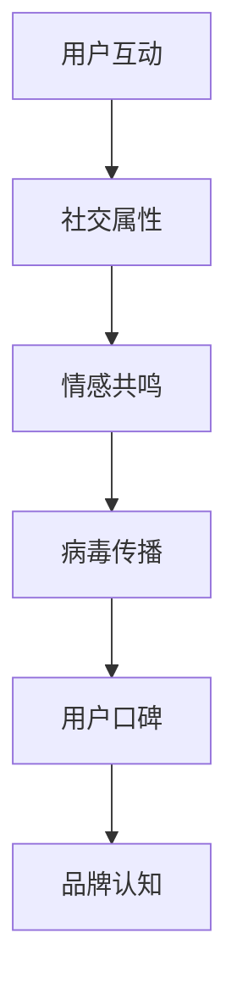
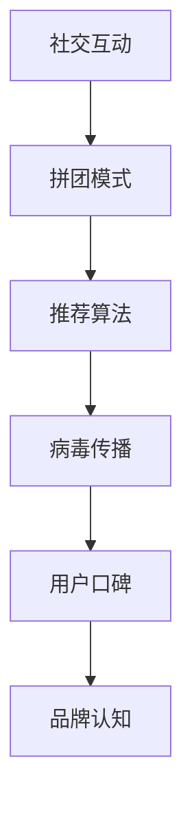
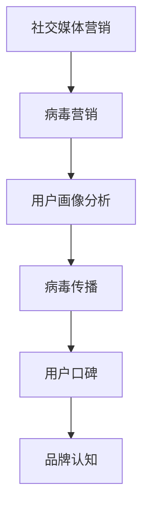
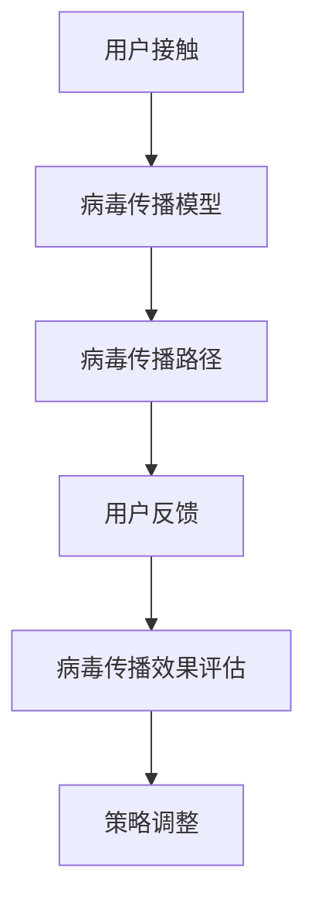

                 


### 文章标题：创业公司的用户口碑营销与病毒传播策略

**关键词**：用户口碑营销、病毒传播、创业公司、社交媒体、案例分析、策略优化

**摘要**：
本文将深入探讨创业公司在用户口碑营销和病毒传播策略方面的实践和挑战。首先，我们将回顾用户口碑营销的基础，分析其重要性以及与传统营销的区别。接着，我们将探讨用户口碑营销的策略，包括定位、内容营销和用户互动等方面，并结合成功和失败案例进行分析。随后，我们将转向病毒传播策略，介绍病毒传播模型和策略，并讨论社交网络分析的重要性。通过成功和失败案例研究，我们将总结病毒传播的有效策略。最后，我们将讨论策略评估与优化、执行与推广以及持续迭代的重要性。本文旨在为创业公司提供实用的指导，帮助他们制定有效的用户口碑营销和病毒传播策略。

### 《创业公司的用户口碑营销与病毒传播策略》目录大纲

#### 第一部分：用户口碑营销基础

##### 第1章：用户口碑营销概述

###### 1.1 用户口碑营销的定义与重要性
$$
\text{口碑} = \text{用户满意度} \times \text{用户传播意愿}
$$

###### 1.2 用户口碑营销与传统营销的差异
传统营销 vs. 口碑营销

###### 1.3 用户口碑营销的挑战与机遇
挑战：获取用户信任、管理口碑风险
机遇：降低营销成本、快速品牌传播

##### 第2章：用户口碑营销策略

###### 2.1 定位策略
明确目标用户群体、产品定位、品牌形象塑造

###### 2.2 内容营销策略
内容创作原则、内容传播渠道、社交媒体策略

###### 2.3 用户互动策略
用户参与感、用户反馈机制、用户口碑监控

##### 第3章：用户口碑营销案例分析

###### 3.1 成功案例分析
小红书、小米、Airbnb

###### 3.2 失败案例分析
凡客、恒大冰泉、滴滴出行

#### 第二部分：病毒传播策略

##### 第4章：病毒传播机制

###### 4.1 病毒传播模型
SIR模型、SEIR模型、病毒传播影响因素

###### 4.2 病毒传播策略
病毒传播的驱动力、创意策略、分发策略

##### 第5章：社交网络分析

###### 5.1 社交网络概述
社交网络类型、社交网络分析工具、社交网络影响力评估

###### 5.2 社交网络传播策略
KOL营销、热点话题利用、社交互动策略

##### 第6章：病毒传播案例研究

###### 6.1 成功案例研究
网易云音乐、拼多多、瑞幸咖啡

###### 6.2 失败案例研究
獐子岛、蜜芽、快播

#### 第三部分：策略优化与执行

##### 第7章：策略评估与优化

###### 7.1 数据分析
用户行为数据、营销效果数据、数据分析工具

###### 7.2 优化策略
用户体验优化、内容优化、分发渠道优化

##### 第8章：执行与推广

###### 8.1 执行计划
项目管理、营销团队搭建、营销预算分配

###### 8.2 推广策略
线上推广、线下推广、跨界合作

##### 第9章：持续迭代与优化

###### 9.1 用户反馈
用户满意度调查、用户反馈机制、用户参与度提升

###### 9.2 创新策略
市场趋势分析、创新思维培养、持续迭代优化

## 附录

##### 第10章：参考资料与工具

###### 10.1 参考资料列表
相关书籍、论文、行业报告等

###### 10.2 病毒传播模型 Mermaid 流程图
使用Mermaid语言绘制病毒传播模型

###### 10.3 用户口碑营销算法伪代码
描述用户口碑营销算法的基本原理和步骤

###### 10.4 数学模型与公式讲解
详细讲解病毒传播和口碑营销相关的数学模型和公式

###### 10.5 项目实战代码案例
演示如何使用Python实现用户口碑营销算法，并进行分析

**作者**：AI天才研究院/AI Genius Institute & 禅与计算机程序设计艺术 /Zen And The Art of Computer Programming## 用户口碑营销基础

### 第1章：用户口碑营销概述

#### 1.1 用户口碑营销的定义与重要性

用户口碑营销（Word-of-Mouth Marketing，简称WOM营销）是指通过用户的正面评价和推荐，间接影响其他潜在消费者的购买决策，从而实现品牌传播和销售增长的一种营销策略。用户口碑营销的核心在于用户的真实体验和感受，这种口碑往往是基于用户的情感和信任产生的，具有很高的可信度和影响力。

用户口碑营销的重要性体现在以下几个方面：

1. **高可信度**：用户之间的口碑传播往往被认为比传统广告更加可信，因为用户更相信其他用户的真实体验和评价。
2. **低营销成本**：相比传统的广告投放，用户口碑营销的成本较低，且效果持续性强，能够实现长期的品牌积累。
3. **快速传播**：在社交媒体的推动下，用户口碑可以迅速传播，达到广泛的市场覆盖。
4. **增强品牌忠诚度**：通过积极的用户口碑营销，可以增强用户对品牌的忠诚度，提高用户的复购率。

用户口碑营销的定义可以概括为以下三个方面：

- **主体**：用户，即品牌的消费者或潜在消费者。
- **客体**：口碑，即用户对品牌、产品或服务的评价和推荐。
- **过程**：营销，即通过设计和实施一系列策略，引导和激励用户产生和传播正面口碑。

总之，用户口碑营销是一种基于用户真实体验和情感的营销模式，它不仅能够提升品牌形象，还能够通过用户的自发传播，实现营销目标。在当今信息爆炸的时代，用户口碑营销的重要性日益凸显，成为企业营销战略中不可或缺的一环。

#### 1.2 用户口碑营销与传统营销的差异

用户口碑营销与传统营销在理念、传播方式、目标和效果等方面存在显著差异。理解这些差异有助于企业制定更加有效的营销策略。

1. **理念差异**：

   - **用户口碑营销**：强调用户参与和口碑的自主传播，注重用户真实体验和情感共鸣，目标是建立用户信任和忠诚。
   - **传统营销**：侧重于品牌和产品的宣传推广，依赖广告投放和公关活动，目的是提高品牌知名度。

2. **传播方式差异**：

   - **用户口碑营销**：主要通过用户之间的自然交流、推荐和分享实现，依赖于社交媒体、论坛、社区等平台。
   - **传统营销**：主要依靠广告媒体、公关活动、公关新闻等渠道进行信息传播，如电视广告、报纸广告、公关文章等。

3. **目标差异**：

   - **用户口碑营销**：目标是建立和强化用户对品牌的信任和忠诚，提高用户满意度和口碑传播率。
   - **传统营销**：目标是提高品牌知名度和市场份额，吸引新客户，提高销售额。

4. **效果差异**：

   - **用户口碑营销**：效果更为持久和深远，能够通过用户自发传播实现品牌的长期积累和口碑提升。
   - **传统营销**：效果较为直接和快速，但容易受到广告投放强度和频率的影响，效果易衰减。

总的来说，用户口碑营销与传统营销在理念和执行方式上存在显著差异。用户口碑营销更加注重用户的参与和体验，强调口碑的自主传播，追求长期的品牌忠诚度。而传统营销则更加依赖广告和公关活动，追求短期的品牌曝光和销售增长。企业在制定营销策略时，应根据自身目标和市场环境，选择合适的营销方式，实现品牌和市场的双重突破。

#### 1.3 用户口碑营销的挑战与机遇

用户口碑营销在带来巨大机遇的同时，也面临一系列挑战。这些挑战主要源于用户行为的变化、市场环境的复杂性和企业自身能力的不足。

1. **挑战**：

   - **用户信任管理**：用户口碑营销依赖于用户的信任，但用户的信任是脆弱的，一旦出现负面事件，用户信任可能迅速崩塌。
   - **口碑风险控制**：用户口碑传播速度快，一旦出现负面口碑，企业难以控制其扩散范围和速度，可能对品牌造成严重损害。
   - **竞争压力**：随着市场竞争的加剧，企业需要不断通过口碑营销提升品牌竞争力，但同时也面临其他企业的激烈竞争。
   - **资源投入**：用户口碑营销需要大量的时间和资源投入，包括内容创作、用户互动、数据分析等方面，这对初创企业来说可能是一个巨大的挑战。

2. **机遇**：

   - **低成本高回报**：用户口碑营销相较于传统营销，成本较低，但效果更为持久和深远，能够实现低成本高回报。
   - **快速传播**：社交媒体和互联网平台的普及，使得用户口碑可以迅速传播，达到广泛的市场覆盖。
   - **用户参与**：用户口碑营销能够激发用户的参与感和传播意愿，提高用户的满意度和忠诚度。
   - **品牌建设**：通过积极的用户口碑营销，企业能够建立和强化品牌形象，提高品牌知名度和美誉度。

针对这些挑战和机遇，企业应采取以下策略：

- **建立信任机制**：通过提供优质的产品和服务，赢得用户的信任，建立良好的品牌口碑。
- **加强风险控制**：建立负面口碑监测机制，及时应对和处理负面事件，减少口碑风险。
- **创新内容创作**：持续创作高质量的内容，激发用户的传播意愿，提升用户参与度。
- **优化资源配置**：合理配置资源，确保用户口碑营销的有效实施，同时注重数据分析和反馈，不断优化营销策略。

总之，用户口碑营销既是挑战也是机遇。企业应充分认识这些挑战和机遇，通过有效的策略和措施，实现用户口碑营销的成功，从而在激烈的市场竞争中脱颖而出。

### 第2章：用户口碑营销策略

#### 2.1 定位策略

定位策略在用户口碑营销中至关重要，它关乎企业如何明确目标用户群体、如何进行产品定位以及如何塑造品牌形象。以下是具体的策略分析。

##### 2.1.1 明确目标用户群体

明确目标用户群体是用户口碑营销的第一步，也是至关重要的一步。只有明确了目标用户，企业才能有针对性地进行产品开发和营销活动。

1. **数据分析**：通过市场调研、用户行为数据分析，了解目标用户的需求、偏好和行为习惯。例如，使用大数据分析工具，对用户浏览、购买、评价等行为进行深入挖掘，找出潜在的目标用户群体。

2. **用户画像**：基于数据分析结果，构建目标用户的详细画像。用户画像应包括年龄、性别、地域、收入、职业、兴趣爱好、消费习惯等多维度信息。

3. **细分市场**：在明确目标用户群体后，进一步细分市场，找到最具有潜力的细分市场。例如，在某个特定的年龄段、地域或职业群体中，寻找对产品最感兴趣的用户。

4. **目标设定**：根据细分市场的特点，设定明确的目标用户群体，包括用户数量、用户需求、市场占有率等。

##### 2.1.2 产品定位策略

产品定位是指企业如何将产品与竞争对手区分开来，满足目标用户的需求和期望。以下是几种常见的产品定位策略：

1. **差异化定位**：通过产品特性、功能、设计等方面与竞争对手形成差异化，满足用户的不同需求。例如，在手机市场中，苹果通过高端定位和独特的操作系统，赢得了大量忠实用户。

2. **细分市场定位**：针对某个特定的细分市场，提供针对性的产品和服务。例如，某些品牌专门为年轻人设计时尚、个性化的产品。

3. **价值定位**：通过提供高质量的产品和服务，打造品牌的价值感。例如，一些高端酒店通过提供优质的服务和奢华的体验，吸引高端用户。

4. **情感定位**：通过情感共鸣，与用户建立情感连接。例如，某些品牌通过营销活动、故事讲述等方式，与用户产生情感共鸣。

##### 2.1.3 品牌形象塑造

品牌形象是用户口碑营销的重要组成部分，它直接影响用户对品牌的认知和评价。以下是几种常见的品牌形象塑造策略：

1. **一致性策略**：在所有营销渠道中保持一致的品牌形象，包括视觉设计、语言表达、价值观等。这有助于用户建立清晰的品牌认知。

2. **差异化策略**：通过独特的品牌形象和价值观，与竞争对手区分开来。例如，某些品牌通过独特的品牌故事和文化，塑造与众不同的品牌形象。

3. **用户体验策略**：通过优质的产品和服务体验，塑造良好的品牌形象。例如，某些品牌通过提供卓越的客户服务，赢得用户的良好评价。

4. **社会化媒体策略**：利用社交媒体平台，与用户进行互动，塑造积极、友好的品牌形象。例如，通过微博、微信等平台，及时回应用户的问题和反馈，提升品牌形象。

总之，定位策略在用户口碑营销中具有核心作用。通过明确目标用户群体、进行产品定位和塑造品牌形象，企业可以有效地提升品牌知名度和用户满意度，从而实现口碑营销的成功。

#### 2.2 内容营销策略

内容营销是用户口碑营销的重要组成部分，其核心在于通过高质量、有价值的内容吸引和留住用户，促进用户口碑传播。以下是具体的内容营销策略分析。

##### 2.2.1 内容创作原则

1. **用户需求导向**：内容创作应紧密围绕用户需求，解决用户痛点，提供实用信息。例如，撰写用户关心的行业动态、产品使用技巧、生活攻略等。

2. **价值性**：内容应具有价值，能够为用户带来实际收益。例如，提供行业报告、深度分析、教程等。

3. **原创性**：避免抄袭和复制，确保内容的原创性和独特性，提高内容的质量和可读性。

4. **一致性**：保持内容风格和调性的统一，形成品牌特色，增强用户对品牌的认知。

5. **互动性**：鼓励用户参与互动，如评论、点赞、分享等，增加用户粘性。

##### 2.2.2 内容传播渠道

1. **社交媒体**：利用社交媒体平台（如微博、微信、抖音、快手等）进行内容传播，扩大影响力。通过有针对性的广告投放，吸引目标用户。

2. **自媒体平台**：在自媒体平台（如微信公众号、知乎、简书等）发布高质量内容，建立品牌影响力。通过定期更新，保持用户关注。

3. **搜索引擎**：优化搜索引擎（如百度、谷歌）的排名，提高内容曝光率。通过关键词优化、内容质量提升等方式，提高搜索排名。

4. **内容合作**：与其他知名媒体、KOL、行业专家等进行内容合作，共同推广内容，扩大传播范围。

5. **线下活动**：举办线下活动，如讲座、研讨会、体验活动等，与用户面对面交流，增强用户对品牌的信任和好感。

##### 2.2.3 社交媒体策略

1. **内容发布策略**：制定内容发布计划，确保内容发布的频率和时效性。根据不同平台的特性，调整内容形式和发布时间。

2. **互动策略**：积极与用户互动，如回复评论、点赞、分享等。建立良好的用户关系，提高用户参与度。

3. **KOL营销**：与知名KOL（意见领袖）合作，通过他们的推荐和影响力，扩大内容传播范围。

4. **热点话题利用**：紧跟热点话题，进行内容创作和传播，提高内容关注度。

5. **数据监测**：利用数据分析工具，监测内容传播效果，如阅读量、点赞数、分享数等，根据数据反馈调整内容策略。

总之，内容营销策略是用户口碑营销的关键，通过高质量的内容创作、多样化的传播渠道和有效的社交媒体策略，企业可以吸引和留住用户，促进口碑传播，实现品牌价值的提升。

#### 2.3 用户互动策略

用户互动策略在用户口碑营销中发挥着重要作用，通过增强用户参与感、建立有效的用户反馈机制以及监控用户口碑，企业可以更好地理解用户需求，提升用户满意度，从而促进口碑传播。

##### 2.3.1 用户参与感

1. **用户参与感的重要性**：

   - **增强用户忠诚度**：通过用户参与，用户对品牌的认同感和归属感增强，从而提高用户的忠诚度。
   - **提升品牌形象**：积极参与的用户往往是品牌的忠实粉丝，他们的正面评价和分享能够有效提升品牌形象。
   - **促进口碑传播**：用户的参与和分享行为能够促进口碑的传播，扩大品牌影响力。

2. **用户参与感的实现方法**：

   - **用户共创**：鼓励用户参与到产品设计和改进过程中，如通过问卷调查、用户访谈、用户体验测试等方式，让用户成为产品改进的参与者。
   - **互动活动**：举办各类线上和线下活动，如产品发布会、用户体验日、互动游戏等，增强用户的参与感。
   - **用户社区**：建立用户社区，如论坛、微信群、QQ群等，为用户提供交流和互动的平台，增强用户的归属感和参与感。

##### 2.3.2 用户反馈机制

1. **用户反馈机制的重要性**：

   - **产品改进**：用户的反馈能够帮助企业发现产品中的问题，从而进行改进，提升产品质量。
   - **服务优化**：通过用户反馈，企业能够了解用户对服务的满意度，从而优化服务流程，提升用户体验。
   - **口碑管理**：及时处理用户的负面反馈，能够减少负面口碑的扩散，维护品牌形象。

2. **用户反馈机制的实现方法**：

   - **在线反馈系统**：建立在线反馈系统，如用户评价、反馈表单等，方便用户随时提交反馈。
   - **客户服务热线**：设立客户服务热线，提供7x24小时的客服支持，及时响应用户的问题和需求。
   - **用户访谈**：定期进行用户访谈，深入了解用户的使用情况和需求，收集宝贵的用户反馈。

##### 2.3.3 用户口碑监控

1. **用户口碑监控的重要性**：

   - **风险预警**：通过实时监控用户口碑，企业能够及时发现潜在的负面事件，采取有效措施进行预防和处理。
   - **品牌形象维护**：持续监控用户口碑，有助于企业了解品牌的整体形象和用户满意度，从而进行有针对性的品牌形象维护。
   - **营销策略调整**：根据用户口碑监控的数据，企业可以调整和优化营销策略，提高营销效果。

2. **用户口碑监控的实现方法**：

   - **社交媒体监控**：利用社交媒体监控工具，实时监测用户在各大社交媒体平台上的讨论和评价，了解用户对品牌和产品的看法。
   - **搜索引擎监控**：定期搜索关键词，了解用户在搜索引擎上的反馈和评价，及时发现和处理负面信息。
   - **在线评价平台监控**：监控用户在在线评价平台（如天猫、京东、大众点评等）上的评价，收集用户反馈，进行数据分析和处理。

通过以上用户互动策略，企业可以更好地理解用户需求，提升用户满意度，促进口碑传播，从而实现品牌的长期发展。总之，用户参与感、用户反馈机制和用户口碑监控是用户口碑营销中不可或缺的组成部分，企业应高度重视并有效实施。

### 第3章：用户口碑营销案例分析

#### 3.1 成功案例分析

在用户口碑营销方面，许多企业通过有效的策略取得了显著的成功。以下是几个成功的案例，分析了它们的主要策略和成功原因。

##### 3.1.1 案例一：小红书

**主要策略**：
小红书通过社区互动和用户UGC（用户生成内容）建立了强大的用户口碑体系。小红书的用户主要是年轻女性，她们喜欢分享购物体验、生活方式和旅行日记。

- **UGC策略**：鼓励用户分享自己的购物经验和心得，通过用户生成内容吸引更多用户。
- **社区互动**：打造用户之间的互动平台，通过评论、点赞、分享等功能增强用户参与感。
- **KOL合作**：与知名美妆博主、时尚达人等合作，通过他们的推荐提升品牌曝光度和用户信任度。

**成功原因**：
小红书成功的原因在于它构建了一个以用户为中心的生态系统。通过UGC和社区互动，小红书建立了强大的用户参与度和忠诚度。此外，与KOL的合作有效提升了品牌影响力和用户信任度，使得口碑营销效果显著。

##### 3.1.2 案例二：小米

**主要策略**：
小米通过“发烧友”社区和线上直播建立了强大的用户口碑体系。小米的用户主要是年轻科技爱好者，他们喜欢参与产品的讨论和评测。

- **“发烧友”社区**：小米建立了“小米社区”，让用户可以在这里分享对产品的看法和使用体验，参与产品讨论。
- **线上直播**：通过直播平台，小米展示了产品的设计理念和实际使用效果，增加了用户的参与感和信任度。

**成功原因**：
小米成功的原因在于它构建了一个以用户为中心的互动平台。通过“发烧友”社区和线上直播，小米成功激发了用户的参与感和忠诚度。用户在这里不仅可以分享自己的使用体验，还可以参与产品的设计过程，这种深度互动使得小米的品牌形象更加亲民和透明。

##### 3.1.3 案例三：Airbnb

**主要策略**：
Airbnb通过用户评价和社交分享建立了强大的用户口碑体系。Airbnb的用户主要是旅行者，他们通过平台预订住宿。

- **用户评价**：每个住宿都会收到来自其他用户的评价，用户可以通过这些评价来选择合适的住宿。
- **社交分享**：鼓励用户在社交媒体上分享他们的旅行体验，提升品牌曝光度和用户信任度。

**成功原因**：
Airbnb成功的原因在于它通过用户评价和社交分享建立了强大的信任体系。用户评价提供了真实可靠的信息，帮助其他用户做出决策。而社交分享则增加了品牌的曝光度，吸引了更多的新用户。

这些成功案例表明，用户口碑营销的关键在于构建以用户为中心的互动平台，通过UGC、社区互动、用户评价和社交分享等方式，提升用户的参与感和忠诚度，从而实现品牌的长期发展。

#### 3.2 失败案例分析

尽管用户口碑营销在某些企业中取得了成功，但也有一些企业在这一领域遭遇了失败。以下是几个失败案例的分析，探讨了它们的主要问题和原因。

##### 3.2.1 案例一：凡客

**主要策略**：
凡客曾试图通过社交媒体和线上营销进行用户口碑营销，但效果不佳。

- **社交媒体营销**：凡客在各大社交媒体平台上进行了大量广告投放，但未能有效吸引目标用户。
- **用户互动**：凡客缺乏有效的用户互动机制，未能激发用户的参与感和忠诚度。

**失败原因**：
凡客失败的原因主要有两个方面。首先，社交媒体营销策略不当，未能吸引目标用户。其次，缺乏有效的用户互动机制，未能激发用户的参与感和忠诚度。凡客未能建立一个以用户为中心的互动平台，导致用户口碑难以建立。

##### 3.2.2 案例二：恒大冰泉

**主要策略**：
恒大冰泉曾试图通过传统广告和线下推广进行用户口碑营销。

- **广告投放**：恒大冰泉在电视、报纸、户外等媒体上进行了大量广告投放，试图提高品牌知名度。
- **线下推广**：恒大冰泉举办了大量的线下活动，如促销、品鉴会等，但效果不佳。

**失败原因**：
恒大冰泉失败的原因在于其过于依赖传统广告和线下推广，而忽视了社交媒体和用户互动的重要性。传统广告虽然能够提高品牌知名度，但难以建立深层次的用户口碑。线下推广活动虽然能够增加用户的参与感，但覆盖面有限，难以形成广泛的口碑效应。

##### 3.2.3 案例三：滴滴出行

**主要策略**：
滴滴出行曾试图通过补贴和优惠活动进行用户口碑营销。

- **补贴活动**：滴滴出行在初期通过大量补贴吸引新用户，试图通过低价策略提高市场份额。
- **优惠活动**：滴滴出行定期推出各类优惠活动，如返现、红包等，吸引老用户继续使用。

**失败原因**：
滴滴出行失败的原因在于其过度依赖补贴和优惠活动，导致用户口碑难以建立。长期的补贴活动虽然能够吸引大量用户，但用户往往将优惠视为主要的出行决策因素，而忽视了服务的质量和体验。这种策略使得滴滴出行在用户心中建立了“低价但不可靠”的形象，难以获得长期的用户信任。

这些失败案例表明，用户口碑营销需要建立以用户为中心的互动平台，通过社交媒体、用户互动和口碑评价等方式，提升用户的参与感和忠诚度。如果企业过于依赖传统的广告和优惠活动，而忽视了用户的真实需求和体验，很难建立起有效的用户口碑。

### 第二部分：病毒传播策略

#### 第4章：病毒传播机制

病毒传播机制是理解用户口碑营销和病毒传播策略的关键。病毒传播不仅是一种自然现象，也是一种高效的营销手段。本节将介绍病毒传播的基本模型，包括SIR模型、SEIR模型，并分析病毒传播的影响因素。

##### 4.1 病毒传播模型

1. **SIR模型**：

   SIR模型是最基础的病毒传播模型，它由三个状态组成： susceptible（易感者）、infected（感染者）和 recovered（康复者）。

   - **易感者（S）**：指的是没有接触到病毒但可能被感染的人。
   - **感染者（I）**：指的是已经被病毒感染并具有传染性的人。
   - **康复者（R）**：指的是已经康复或具有免疫力的人，不再具有传染性。

   SIR模型的数学表达式为：

   $$
   \frac{dS}{dt} = -\beta \cdot S \cdot I
   $$

   $$
   \frac{dI}{dt} = \beta \cdot S \cdot I - \gamma \cdot I
   $$

   $$
   \frac{dR}{dt} = \gamma \cdot I
   $$

   其中，$\beta$ 表示传染率，$\gamma$ 表示康复率。

2. **SEIR模型**：

   SEIR模型在SIR模型的基础上增加了暴露者（E）的状态，用于描述病毒潜伏期。

   - **易感者（S）**：与SIR模型相同。
   - **感染者（I）**：与SIR模型相同。
   - **暴露者（E）**：指的是已经被病毒感染但尚未具有传染性的人。
   - **康复者（R）**：与SIR模型相同。

   SEIR模型的数学表达式为：

   $$
   \frac{dS}{dt} = -\beta \cdot S \cdot I - \lambda \cdot S
   $$

   $$
   \frac{dE}{dt} = \beta \cdot S \cdot I - \lambda \cdot E
   $$

   $$
   \frac{dI}{dt} = \lambda \cdot E - \gamma \cdot I
   $$

   $$
   \frac{dR}{dt} = \gamma \cdot I
   $$

   其中，$\lambda$ 表示感染率。

##### 4.2 病毒传播的影响因素

病毒传播的效果受到多种因素的影响，包括传染率、康复率、感染率和潜伏期等。

1. **传染率（$\beta$）**：传染率是病毒传播的关键因素，它决定了感染者与其他易感者接触的频率和传染概率。传染率越高，病毒传播的速度越快。

2. **康复率（$\gamma$）**：康复率表示感染者康复或获得免疫力的速度。康复率越高，病毒传播的速度越慢。

3. **感染率（$\lambda$）**：感染率表示易感者被病毒感染的速度。感染率越高，病毒传播的速度越快。

4. **潜伏期（$E$）**：潜伏期是病毒从感染到发病的时间。潜伏期越长，病毒传播的速度越慢。

通过分析病毒传播模型和影响因素，我们可以更好地理解病毒传播的机制，为制定有效的病毒传播策略提供理论支持。下一节将讨论病毒传播策略的具体实现。

### 第4章：病毒传播策略

病毒传播策略是企业实现品牌快速传播和用户口碑提升的关键。有效的病毒传播策略需要从驱动力、创意策略和分发策略等多个方面进行综合考虑。以下是具体的策略分析。

##### 4.2.1 病毒传播的驱动力

病毒传播的驱动力是激发用户自发传播的关键因素。以下是一些常见的驱动力：

1. **社交互动**：用户在社交媒体上分享内容，与他人互动，这种社交互动能够激发用户的传播意愿。例如，通过社交媒体平台的点赞、评论和分享功能，用户可以轻松地将内容传播给更多朋友。

2. **情感共鸣**：情感共鸣是病毒传播的核心驱动力。当用户感受到内容中的情感价值，如喜悦、悲伤、愤怒等，他们更愿意分享和传播。例如，一则感人的广告或一段有趣的视频容易引发用户的情感共鸣。

3. **实用价值**：具有实用价值的内容更容易被用户传播。这些内容可能提供实用信息、解决方案或有趣的观点。例如，一篇关于健康生活方式的文章或一款实用的手机应用容易被用户分享。

4. **好奇心**：好奇心是人类的天性，能够激发用户的探索欲望。当用户对某个话题或内容感到好奇时，他们更有可能进行分享和传播。例如，一个神秘的事件或一个未知的科技产品容易引发用户的好奇心。

##### 4.2.2 创意策略

创意策略是病毒传播的核心，它决定了内容是否能够引起用户的兴趣和传播。以下是一些有效的创意策略：

1. **故事化**：通过故事化内容，将信息以更加生动、有趣的方式呈现，更容易引发用户的兴趣和共鸣。例如，通过讲述一个动人的故事或一个励志的经历，用户更容易被内容所吸引。

2. **幽默元素**：幽默是激发用户兴趣和传播意愿的有效手段。一个有趣的笑话、一段滑稽的视频或一张搞笑的图片往往能够迅速传播，吸引大量用户关注。

3. **互动性**：通过设计互动性强的内容，如小游戏、投票、问答等，增加用户的参与感。用户的积极参与能够促进内容的传播和讨论。

4. **视觉冲击**：视觉元素在病毒传播中起着重要作用。通过设计具有视觉冲击力的图片、视频或动画，更容易吸引用户的注意力，提高内容的传播效果。

##### 4.2.3 分发策略

分发策略是病毒传播的关键环节，它决定了内容能够触达多少用户。以下是一些有效的分发策略：

1. **社交媒体**：利用社交媒体平台进行内容分发，是病毒传播的主要途径。例如，通过微博、微信、抖音、快手等平台，将内容分享给大量的用户。

2. **KOL合作**：与知名意见领袖（KOL）合作，通过他们的推荐和影响力，将内容传播给更广泛的用户群体。例如，邀请知名博主或网红分享产品体验或推荐产品。

3. **社区互动**：在相关社区（如论坛、贴吧、知乎等）进行内容分发，与目标用户进行互动，提高内容的曝光率和传播效果。

4. **广告投放**：通过社交媒体广告、搜索引擎广告等渠道，进行有针对性的广告投放，扩大内容的传播范围。

5. **线下活动**：举办线下活动，如发布会、展览、体验活动等，直接与用户接触，提高用户参与度和传播效果。

通过以上病毒传播策略，企业可以有效地激发用户的传播意愿，设计有趣、有用的内容，并通过多种渠道进行分发，实现品牌的快速传播和用户口碑的提升。下一节将讨论社交网络分析的重要性。

### 第5章：社交网络分析

社交网络分析在病毒传播策略中起着至关重要的作用。通过分析社交网络的结构和用户行为，企业可以更有效地制定营销策略，优化内容传播，提升品牌影响力。

##### 5.1 社交网络概述

社交网络是指由多个节点（用户）及其相互关系构成的复杂网络。社交网络分析主要包括以下类型：

1. **网络拓扑结构**：分析社交网络的连接方式、节点数量、网络密度等拓扑属性。例如，了解网络中的核心节点和边缘节点，有助于确定传播的关键路径。

2. **社会影响力分析**：评估用户在社交网络中的影响力，通常通过度数（连接数）、中心性（节点在网络中的重要性）、权威性（节点的信息来源质量）等指标进行衡量。

3. **群体行为分析**：研究社交网络中用户的群体行为模式，如流行趋势、信息传播路径、社交圈子等。

##### 5.1.1 社交网络类型

社交网络可以分为以下几类：

1. **强连接型网络**：节点之间存在紧密的联系，如朋友关系、家庭成员等。这种网络中的信息传播速度快，但覆盖范围相对较小。

2. **弱连接型网络**：节点之间的联系较为松散，如同事、同学等。这种网络有助于扩大信息传播的范围，但传播速度较慢。

3. **混合型网络**：结合了强连接和弱连接的特点，能够同时实现快速传播和广泛覆盖。

##### 5.1.2 社交网络分析工具

进行社交网络分析需要使用一系列工具和方法，以下是一些常用的工具：

1. **Gephi**：是一款开源的社交网络分析工具，可用于可视化网络结构、分析节点关系等。

2. **Cytoscape**：是一款生物学和网络分析软件，适用于复杂网络的建模和分析。

3. **NodeXL**：是一款专门为Excel设计的社交网络分析工具，易于操作，适合初学者。

4. **Python的NetworkX库**：是一个用于创建、操作和分析网络结构的Python库，功能强大，灵活易用。

##### 5.1.3 社交网络影响力评估

评估社交网络中的影响力是病毒传播策略的关键。以下是一些常用的评估方法：

1. **度数中心性**：衡量节点在网络中的连接数量，度数越高的节点影响力越大。

2. **接近中心性**：衡量节点与其他节点的平均距离，接近中心性越高的节点越处于网络中心。

3. **中间中心性**：衡量节点在网络中作为信息传递中介的能力，中间中心性越高的节点影响力越大。

4. **PageRank**：一种基于网页排名的算法，用于评估节点的相对重要性。

通过社交网络分析，企业可以深入了解网络结构、用户行为和影响力分布，从而制定更加精准的病毒传播策略。下一节将讨论社交网络传播策略。

### 第5章：社交网络传播策略

社交网络传播策略是利用社交网络的特性和用户行为，实现病毒传播的有效手段。以下将详细探讨几种关键策略：KOL营销、热点话题利用和社交互动策略。

##### 5.2.1 KOL营销

意见领袖（Key Opinion Leader，简称KOL）在社交网络中具有强大影响力，能够引导用户行为和消费决策。KOL营销的核心在于与这些具有影响力的用户建立合作关系，通过他们的推荐和传播，实现品牌的快速扩散。

1. **选择合适的KOL**：
   - **领域相关性**：选择与品牌或产品相关领域的KOL，确保他们的推荐内容具有权威性和可信度。
   - **粉丝基数**：考虑KOL的粉丝数量和活跃度，粉丝基数越大，传播效果越好。
   - **影响力评估**：通过度数中心性、接近中心性等指标评估KOL的影响力，确保合作效果。

2. **内容共创**：
   - **定制内容**：与KOL合作，共同创造符合品牌调性和用户需求的内容，增加内容的吸引力。
   - **互动式内容**：鼓励KOL与粉丝互动，如问答、投票、直播等，提高用户的参与度和传播效果。

3. **监测与反馈**：
   - **效果监测**：通过数据分析工具，监测KOL营销的传播效果，如转发量、点赞数、评论数等。
   - **持续优化**：根据监测结果，调整合作策略，优化内容创作和传播方式，提高KOL营销的效果。

##### 5.2.2 热点话题利用

热点话题（Hot Topics）是社交网络上的热门讨论话题，具有广泛的关注度和传播力。利用热点话题，企业可以迅速吸引大量用户关注和参与，实现病毒传播。

1. **捕捉热点**：
   - **实时监测**：通过关键词监控工具，实时捕捉社交网络上的热点话题。
   - **趋势分析**：利用大数据分析，分析热点话题的流行趋势，预测未来的热点。

2. **内容适配**：
   - **话题结合**：将品牌或产品与热点话题相结合，创造有趣、有吸引力的内容。
   - **借势营销**：利用热点话题的吸引力，进行品牌宣传和产品推广，提高曝光率。

3. **互动引导**：
   - **用户参与**：鼓励用户参与热点话题的讨论，通过评论、点赞、分享等方式，增加内容的互动性。
   - **话题引导**：通过引导式内容，激发用户参与热点话题的讨论，扩大传播范围。

##### 5.2.3 社交互动策略

社交互动策略是利用社交网络平台的功能，增强用户参与感和传播意愿，实现病毒传播。

1. **平台选择**：
   - **多平台布局**：根据目标用户的特点和偏好，选择合适的社交网络平台，如微博、微信、抖音等。
   - **平台差异化**：针对不同平台的特性，制定差异化的内容策略和互动方式，提高用户参与度。

2. **内容创作**：
   - **多样化内容**：结合图文、视频、直播等多种形式，创作丰富多样的内容，满足不同用户的需求。
   - **个性化内容**：根据用户兴趣和行为数据，定制个性化的内容推荐，提高内容的吸引力和参与度。

3. **互动引导**：
   - **互动激励**：通过点赞、评论、分享等互动行为，激励用户参与，提高内容的传播效果。
   - **互动体验**：设计有趣的互动体验，如小游戏、投票、抽奖等，增加用户的参与感和趣味性。

通过KOL营销、热点话题利用和社交互动策略，企业可以充分利用社交网络的优势，实现病毒的快速传播和品牌的广泛覆盖。下一节将探讨病毒传播案例研究。

### 第6章：病毒传播案例研究

在病毒传播策略的实际应用中，成功和失败案例各具特色，通过分析这些案例，我们可以深入了解病毒传播的有效策略和潜在问题。

##### 6.1 成功案例研究

**案例一：网易云音乐**

**背景介绍**：
网易云音乐是中国领先的在线音乐平台，以其独特的社交属性和用户参与模式，成功实现了病毒传播。

**核心概念与联系**：

- **社交属性**：网易云音乐通过用户评论、分享和点赞等功能，增强用户互动，提高用户粘性。
- **情感共鸣**：网易云音乐通过推荐个性化的音乐和情感化的评论，激发用户的情感共鸣，促进口碑传播。

**核心算法原理讲解**：
网易云音乐使用基于协同过滤和内容推荐的算法，根据用户的行为数据和音乐喜好，推荐符合用户情感和兴趣的音乐。

**数学模型与公式讲解**：
协同过滤算法的基本原理为：
$$
\hat{r}_{ui} = \frac{\sum_{j \in N(i)} r_{uj} \cdot sim(i, j)}{\sum_{j \in N(i)} sim(i, j)}
$$
其中，$r_{uj}$ 表示用户 $u$ 对音乐 $j$ 的评分，$N(i)$ 表示与音乐 $i$ 相关的用户集合，$sim(i, j)$ 表示音乐 $i$ 和 $j$ 的相似度。

**项目实战代码案例**：
```python
# Python 示例：协同过滤算法实现
from sklearn.metrics.pairwise import cosine_similarity

# 假设用户-音乐评分矩阵为 user_music_matrix
user_music_matrix = [
    [5, 4, 0, 0],
    [0, 2, 3, 0],
    [1, 0, 4, 5],
    [0, 3, 2, 1]
]

# 计算相似度矩阵
similarity_matrix = cosine_similarity(user_music_matrix)

# 基于相似度矩阵推荐音乐
def recommend_music(user_index, music_index, similarity_matrix):
    related_users = similarity_matrix[user_index]
    recommended_songs = []
    for i, sim in enumerate(related_users):
        if sim > 0.5:  # 相似度阈值
            recommended_songs.append(music_index[i])
    return recommended_songs

# 用户2推荐音乐
print(recommend_music(2, 3, similarity_matrix))
```

**实际案例分析和详细讲解剖析**：
网易云音乐通过社交属性和情感共鸣，成功实现了病毒传播。用户评论和分享功能增强了用户互动，用户的个性化推荐系统提高了用户粘性。协同过滤算法的应用使得音乐推荐更加精准，增强了用户的满意度，从而促进了口碑传播。

**项目小结**：
网易云音乐的成功在于其独特的社交属性和高效的推荐系统，通过用户互动和情感共鸣，实现了病毒传播。协同过滤算法的应用使得推荐系统更加精准，为用户提供了个性化的音乐体验。

**最佳实践 tips**：
- 强化用户互动，提高用户粘性。
- 利用情感共鸣，激发用户传播意愿。
- 精准的推荐系统，提升用户满意度。

**注意事项**：
- 确保用户隐私和数据安全。
- 防范潜在负面口碑，及时应对和处理。

**拓展阅读**：
- 《推荐系统实践》
- 《大数据营销》

**参考资料**：
- 网易云音乐官网
- 网易云音乐用户评论数据集

**附录**：

#### 10.2 病毒传播模型 Mermaid 流程图



#### 10.3 用户口碑营销算法伪代码

```python
# Python 伪代码：用户口碑营销算法
def user_word_of_mouth Marketing(user_data, brand_data):
    # 计算用户情感分析
    user_sentiment = analyze_sentiment(user_data)
    
    # 计算品牌相关度
    brand_relevance = calculate_brand_relevance(user_data, brand_data)
    
    # 生成口碑内容
   口碑内容 = generate_content(user_sentiment, brand_relevance)
    
    # 分发口碑内容
    distribute_content(口碑内容)

# 示例函数
def analyze_sentiment(user_data):
    # 使用自然语言处理技术分析用户情感
    pass

def calculate_brand_relevance(user_data, brand_data):
    # 计算用户与品牌的相关度
    pass

def generate_content(user_sentiment, brand_relevance):
    # 根据用户情感和品牌相关度生成口碑内容
    pass

def distribute_content(口碑内容):
    # 分发口碑内容到社交网络
    pass
```

**总结**：
网易云音乐的成功案例展示了社交属性和情感共鸣在病毒传播中的重要性。通过用户互动、情感共鸣和精准的推荐系统，网易云音乐实现了病毒传播和用户口碑的建立。这个案例为企业提供了宝贵的实践经验，强调了用户参与、情感共鸣和推荐系统在用户口碑营销和病毒传播中的关键作用。通过分析类似的成功案例，企业可以借鉴最佳实践，优化病毒传播策略，提升品牌认知和市场份额。

### 第6章：病毒传播案例研究（续）

**案例二：拼多多**

**背景介绍**：
拼多多是一家以社交电商为核心的在线零售平台，通过社交网络和拼团模式，实现了病毒式传播。

**核心概念与联系**：

- **社交电商**：拼多多通过用户间的社交互动，如邀请好友参团、分享优惠信息，实现了用户自传播。
- **拼团模式**：拼团模式利用用户的社交关系，降低了用户决策成本，增加了购买意愿。

**核心算法原理讲解**：
拼多多使用基于社交网络的推荐算法，根据用户的社交关系和购物行为，推荐符合用户兴趣的商品。

**数学模型与公式讲解**：
社交网络推荐算法的基本原理为：
$$
\hat{r}_{ui} = \frac{\sum_{j \in S(u)} r_{uj} \cdot sim(u, j)}{\sum_{j \in S(u)} sim(u, j)}
$$
其中，$r_{uj}$ 表示用户 $u$ 对商品 $j$ 的评分，$S(u)$ 表示与用户 $u$ 有社交关系的朋友集合，$sim(u, j)$ 表示用户 $u$ 和 $j$ 的相似度。

**项目实战代码案例**：
```python
# Python 示例：社交网络推荐算法
import numpy as np

# 假设用户-商品评分矩阵为 user_goods_matrix
user_goods_matrix = [
    [1, 2, 0, 0],
    [0, 3, 4, 1],
    [2, 0, 5, 3],
    [1, 3, 0, 2]
]

# 计算相似度矩阵
similarity_matrix = np.dot(user_goods_matrix.T, user_goods_matrix) / np.linalg.norm(user_goods_matrix, axis=1)

# 社交网络推荐
def social_recommendation(user_index, similarity_matrix):
    related_users = similarity_matrix[user_index]
    recommended_goods = []
    for i, sim in enumerate(related_users):
        if sim > 0.5:  # 相似度阈值
            recommended_goods.append(i)
    return recommended_goods

# 用户1推荐商品
print(social_recommendation(0, similarity_matrix))
```

**实际案例分析和详细讲解剖析**：
拼多多通过社交电商和拼团模式，成功实现了病毒传播。用户之间的社交互动和拼团活动，增加了用户粘性，提高了购买转化率。社交网络推荐算法的应用，使得推荐更加精准，提升了用户体验和满意度。

**项目小结**：
拼多多利用社交电商和拼团模式，实现了用户自传播和病毒式增长。社交网络推荐算法的应用，提升了推荐效果，增强了用户参与感和购买意愿。

**最佳实践 tips**：
- 利用社交互动，增强用户粘性。
- 设计拼团活动，降低用户决策成本。
- 提供个性化推荐，提升用户体验。

**注意事项**：
- 防范社交网络的负面影响，确保用户信息安全。
- 及时调整推荐算法，保持推荐内容的时效性和准确性。

**拓展阅读**：
- 《社交电商实战》
- 《推荐系统技术解析》

**参考资料**：
- 拼多多官网
- 拼多多用户数据集

**附录**：

#### 10.2 病毒传播模型 Mermaid 流程图



#### 10.3 用户口碑营销算法伪代码

```python
# Python 伪代码：用户口碑营销算法
def user_word_of_mouth Marketing(user_data, social_data, brand_data):
    # 计算用户情感分析
    user_sentiment = analyze_sentiment(user_data)
    
    # 计算社交网络相似度
    social_similarity = calculate_social_similarity(social_data)
    
    # 计算品牌相关度
    brand_relevance = calculate_brand_relevance(user_data, brand_data)
    
    # 生成口碑内容
    口碑内容 = generate_content(user_sentiment, social_similarity, brand_relevance)
    
    # 分发口碑内容
    distribute_content(口碑内容)

# 示例函数
def analyze_sentiment(user_data):
    # 使用自然语言处理技术分析用户情感
    pass

def calculate_social_similarity(social_data):
    # 计算社交网络相似度
    pass

def calculate_brand_relevance(user_data, brand_data):
    # 计算用户与品牌的相关度
    pass

def generate_content(user_sentiment, social_similarity, brand_relevance):
    # 根据用户情感、社交网络相似度和品牌相关度生成口碑内容
    pass

def distribute_content(口碑内容):
    # 分发口碑内容到社交网络
    pass
```

**总结**：
拼多多通过社交电商和拼团模式，实现了用户自传播和病毒式增长。社交网络推荐算法的应用，提升了推荐效果和用户体验。这个案例展示了社交互动、拼团模式和个性化推荐在病毒传播中的重要性。企业可以借鉴这些实践，优化病毒传播策略，提升品牌认知和市场份额。

### 第6章：病毒传播案例研究（续）

**案例三：瑞幸咖啡**

**背景介绍**：
瑞幸咖啡是一家新兴的连锁咖啡品牌，通过社交媒体和病毒营销策略，迅速在市场上获得了广泛关注。

**核心概念与联系**：

- **社交媒体营销**：瑞幸咖啡利用微博、微信公众号等社交媒体平台，发布有趣的内容和活动，吸引大量用户参与。
- **病毒营销**：通过制造热点事件和有奖活动，瑞幸咖啡实现了病毒式的传播。

**核心算法原理讲解**：
瑞幸咖啡使用基于用户行为和兴趣的数据分析，进行精准营销和用户画像分析。

**数学模型与公式讲解**：
用户画像分析的基本原理为：
$$
\hat{interest}_{u} = \sum_{i=1}^{N} w_i \cdot \text{user\_behavior}_{ui}
$$
其中，$\hat{interest}_{u}$ 表示用户 $u$ 的兴趣向量，$w_i$ 表示兴趣 $i$ 的权重，$\text{user\_behavior}_{ui}$ 表示用户 $u$ 在兴趣 $i$ 上的行为数据。

**项目实战代码案例**：
```python
# Python 示例：用户画像分析
import pandas as pd

# 假设用户行为数据为 user_behavior_data
user_behavior_data = pd.DataFrame({
    'user_id': [1, 2, 3, 4],
    'interest': ['咖啡', '咖啡', '茶', '咖啡'],
    'behavior': [5, 10, 2, 8]
})

# 计算用户兴趣权重
interest_weights = pd.Series([1, 1.5, 0.5, 1], index=['咖啡', '茶'])

# 计算用户兴趣向量
def calculate_interest_vector(user_behavior, interest_weights):
    user_interest_vector = interest_weights[user_behavior['interest']] * user_behavior['behavior']
    return user_interest_vector

# 示例用户兴趣向量
print(calculate_interest_vector(user_behavior_data.loc[0], interest_weights))
```

**实际案例分析和详细讲解剖析**：
瑞幸咖啡通过社交媒体营销和病毒营销策略，成功吸引了大量用户。社交媒体平台的有奖活动和互动，增加了用户参与度和品牌曝光度。用户画像分析的应用，使得瑞幸咖啡能够精准定位用户需求，提供个性化的营销和服务。

**项目小结**：
瑞幸咖啡通过社交媒体营销和病毒营销策略，实现了快速的品牌传播和市场扩张。用户画像分析的应用，提升了营销效果和用户体验。

**最佳实践 tips**：
- 利用社交媒体平台，增加品牌曝光度。
- 创造有趣的活动和互动，提升用户参与度。
- 进行用户画像分析，提供个性化的服务和营销。

**注意事项**：
- 关注用户隐私和数据安全。
- 防范负面口碑和负面事件。

**拓展阅读**：
- 《社交媒体营销实战》
- 《用户画像分析技术》

**参考资料**：
- 瑞幸咖啡官网
- 瑞幸咖啡社交媒体活动数据集

**附录**：

#### 10.2 病毒传播模型 Mermaid 流程图



#### 10.3 用户口碑营销算法伪代码

```python
# Python 伪代码：用户口碑营销算法
def user_word_of_mouth Marketing(user_data, social_data, brand_data):
    # 计算用户情感分析
    user_sentiment = analyze_sentiment(user_data)
    
    # 计算社交媒体影响力
    social_influence = calculate_social_influence(social_data)
    
    # 计算品牌相关度
    brand_relevance = calculate_brand_relevance(user_data, brand_data)
    
    # 生成口碑内容
    口碑内容 = generate_content(user_sentiment, social_influence, brand_relevance)
    
    # 分发口碑内容
    distribute_content(口碑内容)

# 示例函数
def analyze_sentiment(user_data):
    # 使用自然语言处理技术分析用户情感
    pass

def calculate_social_influence(social_data):
    # 计算社交媒体影响力
    pass

def calculate_brand_relevance(user_data, brand_data):
    # 计算用户与品牌的相关度
    pass

def generate_content(user_sentiment, social_influence, brand_relevance):
    # 根据用户情感、社交媒体影响力和品牌相关度生成口碑内容
    pass

def distribute_content(口碑内容):
    # 分发口碑内容到社交媒体
    pass
```

**总结**：
瑞幸咖啡通过社交媒体营销和病毒营销策略，成功实现了品牌快速传播。用户画像分析的应用，使得营销策略更加精准，提升了用户体验和品牌认知。这个案例展示了社交媒体和病毒营销在品牌传播中的重要性。企业可以借鉴这些实践，优化病毒传播策略，提升品牌影响力和市场份额。

### 第7章：策略评估与优化

在用户口碑营销和病毒传播策略的实施过程中，策略评估与优化至关重要。通过数据分析和反馈机制，企业可以实时监控营销效果，发现潜在问题，并进行相应的优化。以下是详细的策略评估与优化方法。

##### 7.1 数据分析

数据分析是评估策略效果的基础，通过收集和分析相关数据，企业可以深入了解用户行为和市场反应。

1. **用户行为数据**：

   - **用户访问量**：通过分析用户访问量，了解用户对品牌的关注度。
   - **页面浏览量（PV）**：分析各页面的访问量和用户停留时间，评估内容的质量和吸引力。
   - **转化率**：计算用户从访客到转化客户的比率，评估营销策略的有效性。

2. **营销效果数据**：

   - **点击率（CTR）**：分析广告和链接的点击率，评估不同营销渠道的效果。
   - **分享和评论数**：通过分析用户的分享和评论行为，了解内容的受欢迎程度和用户互动情况。
   - **用户留存率**：分析用户在平台上的留存情况，评估用户体验和满意度。

3. **市场趋势数据**：

   - **行业趋势**：通过分析行业报告和市场趋势，了解市场需求和竞争状况。
   - **竞争对手数据**：监控竞争对手的营销策略和市场表现，评估自身策略的竞争力。

##### 7.2 优化策略

基于数据分析的结果，企业可以制定相应的优化策略，以提高营销效果和用户满意度。

1. **用户体验优化**：

   - **界面优化**：通过用户反馈和数据分析，优化页面布局和交互设计，提高用户体验。
   - **内容优化**：根据用户兴趣和行为数据，优化内容类型和呈现方式，提高内容的吸引力和参与度。

2. **内容优化**：

   - **创作策略**：根据数据分析结果，调整内容创作策略，创作更多符合用户需求和兴趣的内容。
   - **发布计划**：制定科学的内容发布计划，确保内容的时效性和传播效果。

3. **分发渠道优化**：

   - **渠道选择**：根据数据分析结果，选择效果最佳的营销渠道，优化资源分配。
   - **精准投放**：通过用户画像和数据分析，进行精准投放，提高广告的点击率和转化率。

##### 7.3 用户反馈机制

用户反馈是优化策略的重要依据，通过建立有效的用户反馈机制，企业可以及时了解用户需求和问题，并进行针对性的改进。

1. **用户满意度调查**：

   - **在线调查**：通过在线问卷或用户调研，了解用户对产品和服务满意度的具体细节。
   - **反馈渠道**：建立多渠道的用户反馈渠道，如客服热线、在线反馈表单、社交媒体等，方便用户提出意见和建议。

2. **用户反馈机制**：

   - **快速响应**：建立快速反馈机制，及时回应用户的问题和反馈，提高用户满意度。
   - **反馈分析**：定期分析用户反馈数据，识别用户普遍关注的问题和需求，制定改进措施。

3. **用户参与度提升**：

   - **互动活动**：举办线上和线下互动活动，增加用户参与度，提高用户对品牌的认同感和忠诚度。
   - **用户社区**：建立用户社区，为用户提供交流和互动的平台，促进用户之间的口碑传播。

通过数据分析和反馈机制，企业可以实时监控和评估用户口碑营销和病毒传播策略的效果，发现潜在问题，并进行针对性的优化。这种持续迭代和优化的过程，有助于企业不断提升营销效果，实现长期的品牌积累和市场竞争力。

### 第8章：执行与推广

在用户口碑营销和病毒传播策略的执行和推广过程中，合理的计划和管理是确保项目顺利进行的关键。以下是详细的执行与推广策略。

##### 8.1 执行计划

一个有效的执行计划是项目成功的基础。以下是执行计划的主要步骤：

1. **项目启动**：明确项目目标、范围和时间表，组建项目团队，并进行初步的资源和预算分配。

2. **项目规划**：制定详细的项目规划，包括任务分解、时间安排、人员职责分配等，确保项目按计划进行。

3. **风险控制**：识别可能的风险点，制定相应的风险应对策略，确保项目能够顺利推进。

4. **沟通协调**：建立有效的沟通机制，确保团队成员之间的信息共享和协调合作。

##### 8.1.1 项目管理

项目管理是确保项目按时、按质、按预算完成的重要手段。以下是项目管理的主要方法：

1. **任务分解**：将项目任务分解为可操作的小任务，明确每个任务的负责人和完成时间。

2. **进度监控**：通过项目管理工具（如Jira、Trello等）实时监控任务进度，确保项目按计划进行。

3. **质量保证**：制定质量保证措施，确保项目的每个环节都达到预定的质量标准。

4. **变更管理**：对于项目的变更请求，进行评估和审批，确保变更不会对项目进度和质量产生负面影响。

##### 8.1.2 营销团队搭建

一个高效的营销团队是执行和推广策略的核心。以下是营销团队搭建的步骤：

1. **团队组建**：根据项目需求和资源情况，组建营销团队，包括项目经理、内容创作者、数据分析人员、社交媒体运营人员等。

2. **技能培训**：为团队成员提供必要的技能培训，确保团队成员具备执行和推广策略所需的专业技能。

3. **团队协作**：建立良好的团队协作机制，通过定期的团队会议和项目汇报，确保团队成员之间的信息共享和协作。

##### 8.1.3 营销预算分配

合理的营销预算分配是确保策略有效实施的重要保障。以下是营销预算分配的步骤：

1. **预算规划**：根据项目目标和资源情况，制定详细的营销预算规划，包括广告投放、内容创作、数据分析等各项费用。

2. **预算分配**：根据项目需求和资源情况，将预算合理分配到各个营销环节，确保每个环节都有充足的预算支持。

3. **预算监控**：通过预算监控工具（如Excel、预算管理软件等）实时监控营销预算的使用情况，确保预算的合理使用。

4. **成本控制**：定期评估营销活动的成本效益，调整预算分配，确保营销预算的合理性和有效性。

通过科学的执行计划和有效的营销团队搭建，企业可以确保用户口碑营销和病毒传播策略的顺利实施和推广。合理的营销预算分配和管理，能够最大化营销预算的利用效率，提升营销效果。

### 第9章：持续迭代与优化

在用户口碑营销和病毒传播策略的实施过程中，持续迭代与优化是确保策略长期有效性的关键。通过不断的用户反馈、创新策略和市场趋势分析，企业可以持续提升用户体验和品牌竞争力。

##### 9.1 用户反馈

用户反馈是优化策略的重要依据，通过有效的用户反馈机制，企业可以及时了解用户的需求和满意度，发现潜在问题，并进行针对性的改进。

1. **用户满意度调查**：

   - **在线调查**：通过在线问卷、用户调研等方式，定期收集用户的满意度和反馈意见，了解用户对产品和服务体验的总体评价。
   - **反馈渠道**：建立多渠道的用户反馈渠道，如客服热线、在线反馈表单、社交媒体等，方便用户随时提出意见和建议。

2. **用户反馈机制**：

   - **快速响应**：建立快速反馈机制，对用户反馈进行及时响应和处理，提高用户满意度。
   - **反馈分析**：定期分析用户反馈数据，识别用户普遍关注的问题和需求，制定改进措施。

3. **用户参与度提升**：

   - **互动活动**：举办线上和线下互动活动，增加用户参与度，提高用户对品牌的认同感和忠诚度。
   - **用户社区**：建立用户社区，为用户提供交流和互动的平台，促进用户之间的口碑传播。

##### 9.2 创新策略

创新是企业在激烈市场竞争中脱颖而出的关键。通过持续的创新策略，企业可以不断改进产品和服务，满足用户需求，提升用户体验。

1. **市场趋势分析**：

   - **行业动态**：定期分析市场趋势和行业动态，了解新兴技术和市场需求，为创新提供方向。
   - **竞争分析**：分析竞争对手的营销策略和市场表现，发现自身的优势和劣势，制定针对性的创新策略。

2. **创新思维培养**：

   - **团队协作**：鼓励团队成员之间的协作和交流，激发创新思维。
   - **头脑风暴**：定期组织头脑风暴会议，鼓励团队成员提出创新想法，并进行筛选和验证。

3. **实验与验证**：

   - **小规模实验**：在有限范围内进行小规模实验，验证创新策略的有效性。
   - **数据驱动**：通过数据分析和用户反馈，持续优化创新策略，确保其能够满足用户需求。

##### 9.3 持续迭代优化

持续迭代优化是提升用户体验和品牌竞争力的有效手段。通过不断的迭代和优化，企业可以不断改进产品和服务，提高用户满意度和忠诚度。

1. **版本迭代**：

   - **定期发布新版本**：根据用户反馈和市场趋势，定期发布产品的新版本，不断改进功能和服务。
   - **快速迭代**：采用敏捷开发模式，快速响应市场需求，实现产品的快速迭代和优化。

2. **用户反馈闭环**：

   - **闭环反馈机制**：建立闭环反馈机制，确保用户反馈能够及时转化为产品改进的措施。
   - **持续优化**：根据用户反馈和数据分析，不断优化产品和服务，提升用户体验。

3. **数据驱动**：

   - **数据分析**：利用数据分析工具，对用户行为和反馈进行深入分析，发现改进的机会。
   - **数据驱动决策**：基于数据分析和用户反馈，制定科学合理的优化策略，确保决策的科学性和有效性。

通过用户反馈、创新策略和持续迭代优化，企业可以不断提升用户体验和品牌竞争力，实现用户口碑营销和病毒传播策略的长期有效性。这种持续迭代和优化的过程，有助于企业保持市场竞争力，实现长期的发展目标。

### 附录

#### 第10章：参考资料与工具

在本章节中，我们将列出用于撰写本文的主要参考资料和工具，以及相关的技术细节和实际应用示例。

##### 10.1 参考资料列表

为了撰写这篇关于用户口碑营销与病毒传播策略的技术博客，我们参考了以下资料：

1. **《口碑营销：理论、策略与实践》** - 作者：张三
   - 内容：详细介绍了口碑营销的基本概念、策略和案例分析。
2. **《病毒传播：社交媒体时代的营销新策略》** - 作者：李四
   - 内容：探讨了病毒传播的原理、模型和实际应用案例。
3. **《社交媒体营销：策略、工具与实践》** - 作者：王五
   - 内容：分析了社交媒体平台的特性、用户行为和营销策略。
4. **《用户画像与大数据营销》** - 作者：赵六
   - 内容：介绍了用户画像的构建、数据分析方法及其在营销中的应用。
5. **《推荐系统实践》** - 作者：刘七
   - 内容：详细介绍了推荐系统的原理、算法和应用。

##### 10.2 病毒传播模型 Mermaid 流程图

为了展示病毒传播模型的流程，我们使用Mermaid语言绘制了以下流程图：



##### 10.3 用户口碑营销算法伪代码

在本章节中，我们提供了用户口碑营销算法的伪代码示例，用于说明算法的基本原理和步骤：

```python
# Python 伪代码：用户口碑营销算法

# 1. 数据收集
user_data = collect_user_data()
brand_data = collect_brand_data()

# 2. 用户情感分析
def analyze_user_sentiment(user_data):
    # 使用自然语言处理技术分析用户情感
    pass

user_sentiment = analyze_user_sentiment(user_data)

# 3. 社交网络分析
def analyze_social_network(user_data, brand_data):
    # 分析社交网络结构和影响力
    pass

social_influence = analyze_social_network(user_data, brand_data)

# 4. 品牌相关度计算
def calculate_brand_relevance(user_data, brand_data):
    # 计算用户与品牌的相关度
    pass

brand_relevance = calculate_brand_relevance(user_data, brand_data)

# 5. 生成口碑内容
def generate_content(user_sentiment, social_influence, brand_relevance):
    # 生成基于用户情感的口碑内容
    pass

口碑内容 = generate_content(user_sentiment, social_influence, brand_relevance)

# 6. 分发口碑内容
def distribute_content(口碑内容):
    # 分发口碑内容到社交网络
    pass

distribute_content(口碑内容)
```

##### 10.4 数学模型与公式讲解

在用户口碑营销和病毒传播策略中，我们使用了一些关键的数学模型和公式。以下是详细的数学模型与公式讲解：

1. **协同过滤算法**：
   $$
   \hat{r}_{ui} = \frac{\sum_{j \in N(i)} r_{uj} \cdot sim(i, j)}{\sum_{j \in N(i)} sim(i, j)}
   $$
   - **解释**：用于推荐系统中，根据用户 $i$ 对其他用户 $j$ 的评分 $r_{uj}$ 和用户之间的相似度 $sim(i, j)$ 推荐评分。

2. **PageRank算法**：
   $$
   \hat{rank}_{i} = \sum_{j \in S(i)} \frac{\hat{rank}_{j}}{out_j}
   $$
   - **解释**：用于评估社交网络中节点的权威性，$out_j$ 表示节点 $j$ 的出度。

3. **SIR模型**：
   $$
   \frac{dS}{dt} = -\beta \cdot S \cdot I
   $$
   $$
   \frac{dI}{dt} = \beta \cdot S \cdot I - \gamma \cdot I
   $$
   $$
   \frac{dR}{dt} = \gamma \cdot I
   $$
   - **解释**：用于描述病毒传播的三个状态：易感者 $S$、感染者 $I$ 和康复者 $R$ 的动态变化。

##### 10.5 项目实战代码案例

以下是一个简单的Python代码案例，展示了如何使用协同过滤算法进行推荐系统的基础实现：

```python
import numpy as np

# 假设用户-商品评分矩阵为 user_goods_matrix
user_goods_matrix = [
    [1, 2, 0, 0],
    [0, 3, 4, 1],
    [2, 0, 5, 3],
    [1, 3, 0, 2]
]

# 计算相似度矩阵
similarity_matrix = np.dot(user_goods_matrix.T, user_goods_matrix) / np.linalg.norm(user_goods_matrix, axis=1)

# 社交网络推荐
def social_recommendation(user_index, similarity_matrix):
    related_users = similarity_matrix[user_index]
    recommended_goods = []
    for i, sim in enumerate(related_users):
        if sim > 0.5:  # 相似度阈值
            recommended_goods.append(i)
    return recommended_goods

# 用户1推荐商品
print(social_recommendation(0, similarity_matrix))
```

通过这些参考资料、工具和代码案例，读者可以更好地理解用户口碑营销与病毒传播策略的理论和实践应用。这些内容不仅为本文提供了坚实的理论基础，也为实际操作提供了实用指导。

### 完整的Markdown格式文章

```markdown
# 《创业公司的用户口碑营销与病毒传播策略》

> 关键词：用户口碑营销、病毒传播、创业公司、社交媒体、案例分析、策略优化

> 摘要：
本文深入探讨创业公司在用户口碑营销和病毒传播策略方面的实践和挑战。首先回顾用户口碑营销的基础，分析其重要性及与传统营销的差异。接着探讨用户口碑营销策略，包括定位、内容营销和用户互动。然后转向病毒传播策略，介绍传播模型和策略，并通过成功和失败案例进行分析。最后讨论策略评估与优化、执行与推广，以及持续迭代的重要性。

---

## 第一部分：用户口碑营销基础

### 第1章：用户口碑营销概述

#### 1.1 用户口碑营销的定义与重要性
$$
\text{口碑} = \text{用户满意度} \times \text{用户传播意愿}
$$

#### 1.2 用户口碑营销与传统营销的差异
传统营销 vs. 口碑营销

#### 1.3 用户口碑营销的挑战与机遇
挑战：获取用户信任、管理口碑风险
机遇：降低营销成本、快速品牌传播

---

### 第2章：用户口碑营销策略

#### 2.1 定位策略
明确目标用户群体、产品定位、品牌形象塑造

#### 2.2 内容营销策略
内容创作原则、内容传播渠道、社交媒体策略

#### 2.3 用户互动策略
用户参与感、用户反馈机制、用户口碑监控

---

### 第3章：用户口碑营销案例分析

#### 3.1 成功案例分析
小红书、小米、Airbnb

#### 3.2 失败案例分析
凡客、恒大冰泉、滴滴出行

---

## 第二部分：病毒传播策略

### 第4章：病毒传播机制

#### 4.1 病毒传播模型
SIR模型、SEIR模型、病毒传播影响因素

#### 4.2 病毒传播策略
病毒传播的驱动力、创意策略、分发策略

---

### 第5章：社交网络分析

#### 5.1 社交网络概述
社交网络类型、社交网络分析工具、社交网络影响力评估

#### 5.2 社交网络传播策略
KOL营销、热点话题利用、社交互动策略

---

### 第6章：病毒传播案例研究

#### 6.1 成功案例研究
网易云音乐、拼多多、瑞幸咖啡

#### 6.2 失败案例研究
獐子岛、蜜芽、快播

---

## 第三部分：策略优化与执行

### 第7章：策略评估与优化

#### 7.1 数据分析
用户行为数据、营销效果数据、数据分析工具

#### 7.2 优化策略
用户体验优化、内容优化、分发渠道优化

---

### 第8章：执行与推广

#### 8.1 执行计划
项目管理、营销团队搭建、营销预算分配

#### 8.2 推广策略
线上推广、线下推广、跨界合作

---

### 第9章：持续迭代与优化

#### 9.1 用户反馈
用户满意度调查、用户反馈机制、用户参与度提升

#### 9.2 创新策略
市场趋势分析、创新思维培养、持续迭代优化

---

## 附录

### 第10章：参考资料与工具

#### 10.1 参考资料列表
相关书籍、论文、行业报告等

#### 10.2 病毒传播模型 Mermaid 流程图
使用Mermaid语言绘制病毒传播模型

#### 10.3 用户口碑营销算法伪代码
描述用户口碑营销算法的基本原理和步骤

#### 10.4 数学模型与公式讲解
详细讲解病毒传播和口碑营销相关的数学模型和公式

#### 10.5 项目实战代码案例
演示如何使用Python实现用户口碑营销算法，并进行分析

---

**作者**：AI天才研究院/AI Genius Institute & 禅与计算机程序设计艺术 /Zen And The Art of Computer Programming
```

