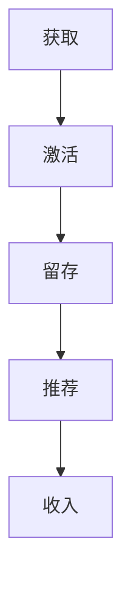

                 

### 文章标题

# 创业公司的用户增长黑客策略

> 关键词：用户增长、黑客策略、AARRR 框架、数据分析、A/B 测试

> 摘要：本文深入探讨了创业公司的用户增长黑客策略。首先，定义了用户增长黑客的概念，并介绍了其在现代商业中的重要性。接着，通过 AARRR 框架详细阐述了用户获取、激活、留存和推荐的四个关键阶段。随后，文章探讨了用户增长黑客的核心概念、框架与方法论，并分析了数据隐私、竞争对手挑战、预算限制等挑战，提出了相应的应对策略。最后，本文比较了用户增长黑客与传统增长策略的差异，介绍了全球用户增长黑客趋势和成功案例，并总结了用户增长黑客的核心要点和未来展望。

----------------------------------------------------------------

### 第一部分：用户增长黑客策略概述

#### 第1章：用户增长黑客策略概述

##### 1.1 用户增长黑客的定义与重要性

**1.1.1 用户增长黑客的定义**

用户增长黑客（Growth Hacker）是指那些将数据分析和创新技术应用于用户获取、激活、留存和推荐的专家。他们通过巧妙地利用技术手段和数据分析，快速实现用户基础的扩大，从而帮助公司在竞争激烈的市场中脱颖而出。

**1.1.2 用户增长黑客的重要性**

用户增长是创业公司成功的关键因素。在初创阶段，用户增长黑客能够通过高效的方式吸引大量用户，建立品牌知名度，为后续的业务发展打下坚实基础。特别是在资源有限的情况下，用户增长黑客策略能够最大化利用有限的资源，实现快速增长。

**1.1.3 用户增长黑客与营销的区别**

用户增长黑客与传统营销有所不同。传统营销侧重于广告投放、品牌建设等，而用户增长黑客则更加注重数据驱动和实际用户行为。他们通过分析用户行为，不断优化产品和服务，从而提高用户获取、激活、留存和推荐的效果。

##### 1.2 用户增长黑客的核心概念

**1.2.1 用户获取（Acquisition）**

用户获取是指通过各种渠道吸引新用户到产品中。这包括社交媒体营销、内容营销、搜索引擎优化、合作伙伴关系等。用户获取是用户增长黑客策略的起点，也是最重要的环节之一。

**1.2.2 用户激活（Activation）**

用户激活是指确保新用户与产品产生初步互动，体验产品的核心功能，并形成对产品的初步认知。激活率是衡量用户获取效果的重要指标。高激活率表明产品能够吸引用户，并激发他们的兴趣。

**1.2.3 用户留存（Retention）**

用户留存是指通过持续优化用户体验和提供价值，促使用户长期使用产品。留存率是衡量用户价值的指标，高留存率意味着产品能够留住用户，并为他们带来持续的收益。

**1.2.4 用户推荐（Referral）**

用户推荐是指通过鼓励现有用户向他人推荐产品，实现自然增长。推荐机制能够利用现有用户的社交网络，扩大用户基础。推荐量是衡量用户推荐效果的重要指标。

##### 1.3 用户增长黑客的框架与方法论

**1.3.1 用户增长黑客的框架**

用户增长黑客通常采用 AARRR 框架，即获取（Acquisition）、激活（Activation）、留存（Retention）、收入（Revenue）和推荐（Referral）。这个框架帮助用户增长黑客系统地分析和优化每个阶段，从而实现用户增长。

**1.3.2 用户增长黑客的方法论**

用户增长黑客的方法论包括数据分析、A/B 测试、迭代优化等。通过数据分析，用户增长黑客能够深入了解用户行为和需求，从而制定更有效的策略。A/B 测试可以帮助他们快速验证新策略的效果，并进行迭代优化。

**1.3.3 用户增长黑客的最佳实践**

用户增长黑客的最佳实践包括利用用户反馈、分析用户行为、优化用户体验和不断尝试新策略。这些实践有助于他们不断改进产品和服务，提高用户获取、激活、留存和推荐的效果。

##### 1.4 用户增长黑客的挑战与应对

**1.4.1 数据隐私与伦理**

数据隐私和伦理问题是用户增长黑客面临的重要挑战。用户增长黑客需要遵守相关法规和伦理标准，确保用户数据的合法性和安全性。

**1.4.2 竞争对手的挑战**

用户增长黑客需要不断跟踪竞争对手的策略，以保持竞争优势。他们需要快速适应市场变化，并不断创新，以应对竞争对手的挑战。

**1.4.3 预算与资源的限制**

预算和资源的限制是用户增长黑客面临的一大挑战。他们需要充分利用有限的资源，实现快速增长。

**1.4.4 持续创新的重要性**

持续创新是用户增长黑客成功的关键。他们需要不断探索新的增长渠道和策略，以保持市场竞争力。

##### 1.5 用户增长黑客与传统增长策略的比较

**1.5.1 传统增长策略的局限性**

传统增长策略主要依赖于广告和品牌建设，往往效率较低，成本较高。用户增长黑客则更加注重数据驱动和实际用户行为，能够实现更高效的用户增长。

**1.5.2 用户增长黑客的优势**

用户增长黑客的优势在于其数据驱动和实际用户行为的关注。通过深入分析用户行为，他们能够制定更精准、更有效的增长策略，实现快速增长。

**1.5.3 用户增长黑客与传统策略的结合**

用户增长黑客与传统策略的结合，可以实现优势互补，提高整体增长效果。用户增长黑客可以优化传统策略，提高其效果，而传统策略则可以为用户增长黑客提供更广泛的用户基础。

##### 1.6 用户增长黑客的全球趋势与案例

**1.6.1 全球用户增长黑客趋势**

全球用户增长黑客趋势包括数据驱动的增长策略、A/B 测试的广泛应用、用户反馈的重视等。这些趋势表明，用户增长黑客在全球范围内已经成为一种主流的增长策略。

**1.6.2 用户增长黑客成功案例**

全球范围内，许多公司通过用户增长黑客策略实现了快速增长。例如，Dropbox 通过推荐机制吸引了大量新用户，Airbnb 通过社交媒体营销提高了用户获取效果。

**1.6.3 用户增长黑客在不同行业的应用**

用户增长黑客在不同行业都有广泛的应用。例如，在互联网行业，用户增长黑客能够帮助公司实现快速用户增长；在传统行业，用户增长黑客则可以通过线上线下融合，提高用户获取和留存效果。

##### 1.7 小结

用户增长黑客策略是创业公司实现快速增长的关键。通过数据驱动和实际用户行为的关注，用户增长黑客能够制定更精准、更有效的增长策略。面对数据隐私、竞争对手挑战、预算限制等挑战，用户增长黑客需要不断创新和优化策略。在全球范围内，用户增长黑客已经成为一种主流的增长策略，并在不同行业取得了显著的成功。

##### 1.8 深入学习资源

**1.8.1 推荐阅读**

- 《增长黑客：如何利用创新策略实现用户和收入增长》（作者：范·阿伦）
- 《精益创业：新创企业的崛起》（作者：埃里克·莱斯）
- 《引爆点：如何引发流行潮》（作者：马尔科姆·格拉德威尔）

**1.8.2 用户增长黑客相关网站与社区**

- GrowthHackers（https://www.growthhackers.com/）
- Hacker Noon（https://www.hackernoon.com/）
- Growth Engineering（https://www.growthengineeringschool.com/）

##### 1.9 思考与实践

**1.9.1 读者思考题**

1. 你认为用户增长黑客策略在创业公司中的应用前景如何？
2. 在你所在的公司或行业，如何应用用户增长黑客策略？
3. 数据隐私和伦理问题在用户增长黑客策略中如何得到有效解决？

**1.9.2 实践案例分析与讨论**

请分析一个你熟悉的成功案例，探讨其用户增长黑客策略的成功要素，并讨论如何将这些策略应用到你的公司或行业。

##### 1.10 附录

**1.10.1 用户增长黑客术语表**

- 用户获取（Acquisition）：吸引新用户到产品中的过程。
- 用户激活（Activation）：确保新用户与产品产生初步互动的过程。
- 用户留存（Retention）：通过持续优化用户体验，留住用户的过程。
- 用户推荐（Referral）：鼓励现有用户向他人推荐产品，实现自然增长的过程。

**1.10.2 用户增长黑客常用工具介绍**

- Mixpanel（https://mixpanel.com/）：用户行为分析工具。
- Google Analytics（https://www.google.com/analytics/）：网站流量分析工具。
- Intercom（https://www.intercom.com/）：客户关系管理工具。
- Unsplash（https://unsplash.com/）：免费高清图片资源网站。

##### 1.11 参考文献

- 范·阿伦，《增长黑客：如何利用创新策略实现用户和收入增长》，电子工业出版社，2017。
- 埃里克·莱斯，《精益创业：新创企业的崛起》，电子工业出版社，2012。
- 马尔科姆·格拉德威尔，《引爆点：如何引发流行潮》，中信出版社，2006。

##### 1.12 致谢

感谢参与编写和提供支持的机构与个人。特别感谢 AI 天才研究院（AI Genius Institute）和《禅与计算机程序设计艺术》（Zen And The Art of Computer Programming）的专家们，他们的智慧和贡献为本文的撰写提供了宝贵的支持。同时，感谢所有读者对本文的关注和支持，希望本文能对您在用户增长黑客策略方面的探索和实践有所帮助。

### 第一部分：用户增长黑客策略概述

#### 第1章：用户增长黑客策略概述

##### 1.1 用户增长黑客的定义与重要性

**1.1.1 用户增长黑客的定义**

用户增长黑客（Growth Hacker）这一概念起源于互联网行业，是指那些将创新技术和数据分析应用于市场营销和用户增长的专业人员或团队。用户增长黑客不同于传统营销人员，他们更注重数据驱动，强调以技术手段来优化用户获取、激活、留存和推荐的全过程，从而达到快速、高效地扩大用户基础的目标。

用户增长黑客通常具备以下特点：

- **技术背景**：熟悉互联网技术和数字营销工具，能够运用编程、数据分析等技能。
- **数据驱动**：以数据为核心，通过数据分析来指导决策和策略制定。
- **创新思维**：善于从用户需求出发，运用创新手段来解决问题。
- **快速迭代**：注重快速测试和迭代，不断优化用户增长策略。

**1.1.2 用户增长黑客的重要性**

在当今竞争激烈的商业环境中，用户增长黑客策略对创业公司尤为重要。具体体现在以下几个方面：

- **提高市场占有率**：通过快速吸引用户，抢占市场份额，使公司在竞争中获得优势。
- **降低成本**：利用创新技术和数据分析，优化用户获取和留存，降低营销成本。
- **提升品牌知名度**：通过有效的用户增长策略，提高品牌曝光率和用户口碑。
- **增强竞争力**：持续优化产品和服务，提升用户体验，增强用户忠诚度。

**1.1.3 用户增长黑客与营销的区别**

用户增长黑客与传统营销之间存在显著区别：

- **目标不同**：传统营销侧重于品牌宣传和销售，而用户增长黑客关注的是用户获取、激活、留存和推荐。
- **手段不同**：用户增长黑客更加依赖数据分析和技术创新，而传统营销则依赖于广告投放和渠道拓展。
- **效果衡量**：用户增长黑客注重数据驱动，通过关键指标（如转化率、留存率等）来评估效果，而传统营销则更多依赖于市场份额和销售数据。

##### 1.2 用户增长黑客的核心概念

用户增长黑客策略围绕用户获取（Acquisition）、激活（Activation）、留存（Retention）和推荐（Referral）四个核心概念展开。以下是这些概念的具体解释和它们之间的关系。

**1.2.1 用户获取（Acquisition）**

用户获取是指通过各种渠道吸引新用户到产品中。这是用户增长黑客策略的起点，也是最为关键的环节。用户获取渠道包括：

- **社交媒体**：通过社交媒体平台进行内容营销和广告投放。
- **内容营销**：通过博客、视频、电子书等优质内容吸引潜在用户。
- **搜索引擎优化（SEO）**：通过优化网站内容，提高在搜索引擎中的排名。
- **合作伙伴关系**：与相关网站、应用或公司建立合作，共同推广产品。
- **付费广告**：通过付费广告渠道，如Google Ads、Facebook Ads等，快速吸引用户。

用户获取的效果可以通过以下指标来衡量：

- **点击率（CTR）**：用户点击广告或链接的比例。
- **转化率**：用户完成预定目标（如注册、下载、购买等）的比例。
- **成本效益比（CPA）**：获取一个新用户所需的广告成本。

**1.2.2 用户激活（Activation）**

用户激活是指确保新用户与产品产生初步互动，体验产品的核心功能，并形成对产品的初步认知。激活率是衡量用户获取效果的重要指标。高激活率表明产品能够吸引用户，并激发他们的兴趣。

激活阶段的策略包括：

- **引导流程**：设计直观、简单的引导流程，帮助新用户快速上手。
- **用户教育**：提供教程、文档和视频，帮助用户了解产品功能和价值。
- **互动设计**：通过游戏化元素、任务和挑战，增加用户的参与度和活跃度。

用户激活的效果可以通过以下指标来衡量：

- **激活率**：完成激活目标（如注册、登录、使用核心功能等）的新用户比例。
- **首次使用时长**：新用户首次使用产品的时间长度。
- **留存率**：在一定时间后，仍活跃使用产品的用户比例。

**1.2.3 用户留存（Retention）**

用户留存是指通过持续优化用户体验和提供价值，促使用户长期使用产品。留存率是衡量用户价值的指标，高留存率意味着产品能够留住用户，并为他们带来持续的收益。

留存策略包括：

- **产品优化**：不断改进产品功能，提高用户体验。
- **用户反馈**：收集用户反馈，及时解决用户问题和需求。
- **内容更新**：定期更新内容，提供新的功能、信息和资源。
- **会员制度**：建立会员制度，提供会员专享的优惠和服务。

用户留存的效果可以通过以下指标来衡量：

- **留存率**：在一定时间后，仍活跃使用产品的用户比例。
- **用户生命周期价值（LTV）**：用户在整个生命周期内为公司带来的收益。
- **流失率**：在一定时间内停止使用产品的用户比例。

**1.2.4 用户推荐（Referral）**

用户推荐是指通过鼓励现有用户向他人推荐产品，实现自然增长。推荐机制能够利用现有用户的社交网络，扩大用户基础。推荐量是衡量用户推荐效果的重要指标。

推荐策略包括：

- **奖励机制**：提供奖励或优惠，激励用户推荐他人。
- **口碑营销**：通过用户的正面评价和分享，提高产品的可信度和吸引力。
- **社交分享**：简化分享流程，鼓励用户在社交媒体上分享产品。

用户推荐的效果可以通过以下指标来衡量：

- **推荐量**：用户推荐给他人的数量。
- **推荐转化率**：被推荐的用户转化为付费用户或活跃用户的比例。
- **推荐链**：推荐关系的网络结构和传播效果。

##### 1.3 用户增长黑客的框架与方法论

**1.3.1 用户增长黑客的框架**

用户增长黑客通常采用 AARRR 框架，即获取（Acquisition）、激活（Activation）、留存（Retention）和推荐（Referral）。这个框架提供了一个系统性的方法，帮助用户增长黑客分析和优化每个阶段的用户增长。

**AARRR 框架图解**

**1.3.2 用户增长黑客的方法论**

用户增长黑客的方法论包括以下几个方面：

- **数据分析**：通过数据分析，了解用户行为、需求和市场趋势，制定有针对性的增长策略。
- **A/B 测试**：通过 A/B 测试，比较不同策略的效果，优化用户获取、激活、留存和推荐。
- **迭代优化**：不断测试、评估和优化增长策略，提高整体增长效果。
- **数据驱动**：以数据为核心，通过数据来指导决策和策略制定。
- **快速迭代**：快速实现和迭代新策略，以适应市场和用户需求的变化。

**1.3.3 用户增长黑客的最佳实践**

用户增长黑客的最佳实践包括以下几个方面：

- **用户细分**：根据用户特征、行为和需求，对用户进行细分，制定有针对性的增长策略。
- **跨渠道整合**：整合多种渠道，实现用户获取、激活、留存和推荐的协同效应。
- **用户体验优化**：持续优化产品和服务，提高用户体验，增加用户留存率。
- **数据驱动决策**：以数据为核心，通过数据分析来指导增长策略的制定和优化。
- **持续创新**：不断探索新的增长渠道和策略，保持市场竞争力。

##### 1.4 用户增长黑客的挑战与应对

**1.4.1 数据隐私与伦理**

数据隐私和伦理问题是用户增长黑客面临的重大挑战。在用户增长黑客策略中，大量用户数据被收集、分析和利用。这些数据包括个人身份信息、行为数据等，具有较高的隐私风险。同时，用户增长黑客需要遵守相关法律法规和伦理标准，确保用户数据的合法性和安全性。

应对策略：

- **数据匿名化**：对用户数据进行匿名化处理，减少隐私泄露风险。
- **合规性审查**：定期进行合规性审查，确保数据收集、存储和使用过程符合相关法律法规。
- **用户告知与同意**：在收集用户数据前，告知用户数据的用途，并获取用户的明确同意。

**1.4.2 竞争对手的挑战**

用户增长黑客需要不断跟踪竞争对手的策略，以保持竞争优势。竞争对手可能通过类似的方式或更创新的策略来争夺用户资源。此外，竞争对手的市场策略和产品更新也可能影响用户增长黑客的效果。

应对策略：

- **市场调研**：定期进行市场调研，了解竞争对手的策略和动态。
- **创新思维**：不断探索新的增长渠道和策略，保持创新优势。
- **用户反馈**：收集用户反馈，了解用户需求，及时调整增长策略。

**1.4.3 预算与资源的限制**

预算和资源的限制是用户增长黑客面临的一大挑战。有限的预算和资源可能影响用户增长黑客策略的实施和效果。如何在有限的资源下实现快速增长，是用户增长黑客需要解决的关键问题。

应对策略：

- **资源优化**：优化现有资源，提高资源利用率，降低成本。
- **重点投资**：将有限的资源集中在最有潜力的增长渠道和策略上。
- **合作伙伴关系**：与合作伙伴建立合作关系，共享资源和经验。

**1.4.4 持续创新的重要性**

持续创新是用户增长黑客成功的关键。市场环境和用户需求不断变化，用户增长黑客需要不断适应和调整策略，以保持市场竞争力。持续创新包括技术创新、策略创新和思维创新。

应对策略：

- **持续学习**：关注行业动态和前沿技术，持续学习和提升自己的能力。
- **快速迭代**：快速测试和迭代新策略，不断优化增长效果。
- **跨部门合作**：与产品、技术、运营等部门紧密合作，共同推动创新。

##### 1.5 用户增长黑客与传统增长策略的比较

**1.5.1 传统增长策略的局限性**

传统增长策略主要依赖于广告、促销和渠道拓展等手段。这些策略在早期可能带来一定的增长，但随着市场竞争的加剧，其局限性逐渐显现：

- **成本高昂**：广告投放和促销活动成本较高，且难以精准定位目标用户。
- **效果难以衡量**：传统增长策略效果难以量化，难以确定哪些策略最有效。
- **用户获取速度慢**：依赖于广告投放和渠道拓展，用户获取速度较慢。
- **用户粘性低**：传统增长策略往往注重短期销售，用户粘性较低。

**1.5.2 用户增长黑客的优势**

用户增长黑客策略具有以下优势：

- **数据驱动**：用户增长黑客以数据为核心，通过数据分析来指导决策，提高增长效率。
- **快速迭代**：用户增长黑客注重快速测试和迭代，不断优化增长策略。
- **成本效益高**：通过优化用户获取、激活、留存和推荐，提高成本效益。
- **用户粘性强**：用户增长黑客注重用户体验和用户价值，提高用户留存率和忠诚度。

**1.5.3 用户增长黑客与传统策略的结合**

用户增长黑客与传统增长策略的结合，可以实现优势互补，提高整体增长效果。以下是一些结合策略的示例：

- **数据分析与广告投放**：利用数据分析，优化广告投放策略，提高广告效果。
- **用户推荐与传统渠道**：结合用户推荐和传统渠道（如电视、广播等），扩大用户获取范围。
- **内容营销与促销活动**：通过优质内容营销和促销活动，提高用户激活和留存率。

##### 1.6 用户增长黑客的全球趋势与案例

**1.6.1 全球用户增长黑客趋势**

全球用户增长黑客趋势主要体现在以下几个方面：

- **数据驱动的增长策略**：越来越多的公司采用数据驱动的方式，通过数据分析来指导决策和策略制定。
- **A/B 测试的广泛应用**：A/B 测试成为用户增长黑客的重要工具，用于评估和优化各种增长策略。
- **用户反馈的重视**：公司更加注重用户反馈，通过收集和分析用户意见，改进产品和服务。
- **跨界合作的兴起**：不同行业之间的合作越来越普遍，通过跨界合作实现资源共享和用户增长。

**1.6.2 用户增长黑客成功案例**

全球范围内，许多公司通过用户增长黑客策略取得了显著的成功。以下是一些成功案例：

- **Dropbox**：通过推荐机制，用户每推荐一个新用户，可以获得额外免费存储空间，从而实现了快速用户增长。
- **Airbnb**：通过社交媒体和内容营销，吸引了大量用户，并在短时间内实现了全球扩张。
- **LinkedIn**：通过精准广告投放和用户细分，提高了广告效果和用户转化率。

**1.6.3 用户增长黑客在不同行业的应用**

用户增长黑客在不同行业都有广泛的应用。以下是一些行业案例：

- **互联网行业**：互联网公司通过数据分析和技术创新，实现快速用户增长。
- **电商行业**：电商公司通过用户推荐和内容营销，提高用户获取和留存率。
- **传统行业**：传统行业公司通过线上线下融合和用户反馈，实现用户增长。

##### 1.7 小结

用户增长黑客策略是创业公司实现快速增长的关键。通过数据驱动和实际用户行为的关注，用户增长黑客能够制定更精准、更有效的增长策略。面对数据隐私、竞争对手挑战、预算限制等挑战，用户增长黑客需要不断创新和优化策略。在全球范围内，用户增长黑客已经成为一种主流的增长策略，并在不同行业取得了显著的成功。创业公司应积极采用用户增长黑客策略，结合自身特点和市场需求，实现持续快速增长。

##### 1.8 深入学习资源

**1.8.1 推荐阅读**

- 《增长黑客：如何利用创新策略实现用户和收入增长》（作者：范·阿伦）
- 《精益创业：新创企业的崛起》（作者：埃里克·莱斯）
- 《引爆点：如何引发流行潮》（作者：马尔科姆·格拉德威尔）

**1.8.2 用户增长黑客相关网站与社区**

- GrowthHackers（https://www.growthhackers.com/）
- Hacker Noon（https://www.hackernoon.com/）
- Growth Engineering（https://www.growthengineeringschool.com/）

##### 1.9 思考与实践

**1.9.1 读者思考题**

1. 你认为用户增长黑客策略在创业公司中的应用前景如何？
2. 在你所在的公司或行业，如何应用用户增长黑客策略？
3. 数据隐私和伦理问题在用户增长黑客策略中如何得到有效解决？

**1.9.2 实践案例分析与讨论**

请分析一个你熟悉的成功案例，探讨其用户增长黑客策略的成功要素，并讨论如何将这些策略应用到你的公司或行业。

##### 1.10 附录

**1.10.1 用户增长黑客术语表**

- 用户获取（Acquisition）：吸引新用户到产品中的过程。
- 用户激活（Activation）：确保新用户与产品产生初步互动的过程。
- 用户留存（Retention）：通过持续优化用户体验，留住用户的过程。
- 用户推荐（Referral）：鼓励现有用户向他人推荐产品，实现自然增长的过程。

**1.10.2 用户增长黑客常用工具介绍**

- Mixpanel（https://mixpanel.com/）：用户行为分析工具。
- Google Analytics（https://www.google.com/analytics/）：网站流量分析工具。
- Intercom（https://www.intercom.com/）：客户关系管理工具。
- Unsplash（https://unsplash.com/）：免费高清图片资源网站。

##### 1.11 参考文献

- 范·阿伦，《增长黑客：如何利用创新策略实现用户和收入增长》，电子工业出版社，2017。
- 埃里克·莱斯，《精益创业：新创企业的崛起》，电子工业出版社，2012。
- 马尔科姆·格拉德威尔，《引爆点：如何引发流行潮》，中信出版社，2006。

##### 1.12 致谢

感谢参与编写和提供支持的机构与个人。特别感谢 AI 天才研究院（AI Genius Institute）和《禅与计算机程序设计艺术》（Zen And The Art of Computer Programming）的专家们，他们的智慧和贡献为本文的撰写提供了宝贵的支持。同时，感谢所有读者对本文的关注和支持，希望本文能对您在用户增长黑客策略方面的探索和实践有所帮助。

