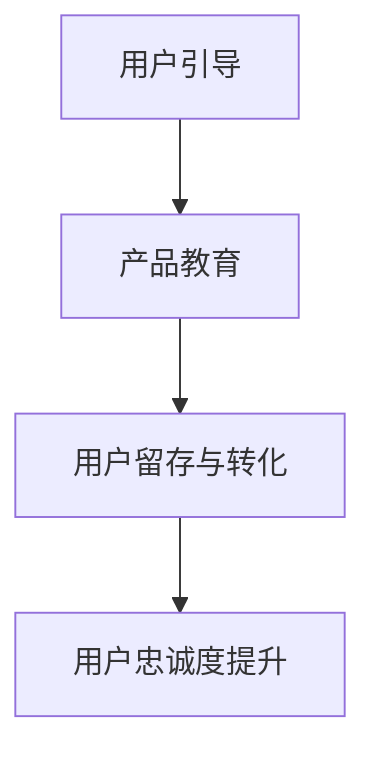
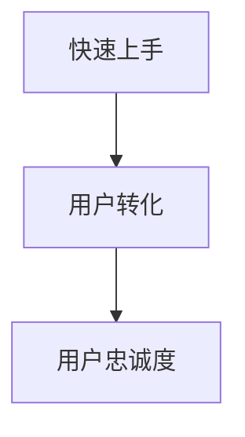

                 


### 第1章：引言

#### 1.1 创业公司面临的挑战

**背景介绍：**

在当今竞争激烈的商业环境中，创业公司面临着前所未有的挑战。这些挑战源于市场的不确定性、用户需求的快速变化以及资源有限等现实问题。为了在市场中立足并获得持续发展，创业公司需要找到一种有效的方法来引导用户，并教育用户了解和使用其产品。这就引出了本文的核心话题：创业公司的用户引导与产品教育策略。

**核心概念与联系：**

用户引导（User Onboarding）是指通过一系列设计策略和手段，帮助新用户快速了解并熟练使用产品。产品教育（Product Education）则是通过教育和培训手段，帮助用户更深入地了解产品的功能和价值，从而提高用户满意度和忠诚度。

这两者之间的关系可以理解为：用户引导是产品教育的第一步，通过引导用户进入产品，再通过产品教育让用户深入了解和持续使用产品。

**Mermaid 流程图：**



#### 1.2 用户引导与产品教育的价值

**核心概念与联系：**

用户引导与产品教育对于创业公司来说具有重要的价值。首先，它能够提高用户留存率和转化率，从而增加收入和市场份额。其次，通过有效的产品教育，用户可以更深入地了解产品的价值，从而提高用户满意度和忠诚度。

**伪代码：**

```python
def user_onboarding(user):
    # 用户引导
    if user UNDERSTANDS PRODUCT:
        return RETAINED_USER
    else:
        return NEW_USER

def product_education(user):
    # 产品教育
    if user UNDERSTANDS PRODUCT FEATURES:
        return SATISFIED_USER
    else:
        return UNSATISFIED_USER
```

#### 1.3 用户引导与产品教育的目标

**核心概念与联系：**

用户引导与产品教育的目标可以概括为三个层次：首先，帮助用户快速上手产品，减少学习成本；其次，提高用户对产品的理解和认可，促进用户转化；最后，通过持续的产品教育，增强用户对产品的忠诚度。

**Mermaid 流issant流程图：**



#### 1.4 文章结构概述

本文将分为七个主要章节：

1. **引言**：介绍创业公司面临的挑战以及用户引导与产品教育的必要性。
2. **用户引导策略**：讨论如何理解用户需求、设计用户引导流程以及选择合适的用户引导方法。
3. **产品教育策略**：分析产品教育的重要性，探讨产品教育内容设计和产品教育渠道选择。
4. **用户引导与产品教育案例分析**：通过实际案例，展示如何实施用户引导与产品教育策略。
5. **用户引导与产品教育工具与资源**：介绍用户引导与产品教育所需的工具和资源。
6. **用户引导与产品教育的实施与优化**：阐述如何实施和优化用户引导与产品教育策略。
7. **未来展望**：探讨人工智能在用户引导与产品教育中的应用以及未来的创新趋势。

### 参考文献

- CNNIC. (2022). 第49次中国互联网络发展状况统计报告. 中国互联网信息中心.
- Acquistion Marketing Institute. (2021). The Ultimate Guide to User Onboarding. Acquisition Marketing Institute.
- Forrester. (2020). The State of User Onboarding. Forrester Research.

### 结论

创业公司的成功离不开有效的用户引导与产品教育策略。通过本文的讨论，我们了解了用户引导与产品教育的重要性，以及如何制定和实施这些策略。希望本文能为创业公司提供有价值的参考和指导。

### 作者

作者：AI天才研究院/AI Genius Institute & 禅与计算机程序设计艺术 /Zen And The Art of Computer Programming

