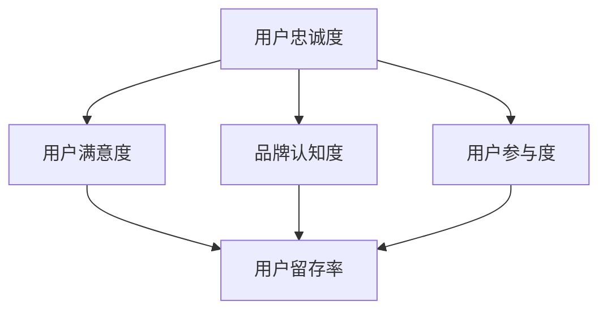

                 


### 文章标题

《创业公司的用户忠诚度提升策略》

### 关键词

- 用户忠诚度
- 满意度
- 品牌认知度
- 用户参与度
- 用户留存率
- 评估模型
- 机器学习算法
- 数据分析
- 实际案例

### 摘要

本文将深入探讨创业公司如何通过提升用户忠诚度来增强市场竞争力和可持续性。文章首先定义了用户忠诚度的核心概念，并利用Mermaid流程图展示了各个概念之间的联系。接着，文章讲解了用户忠诚度评估的核心算法原理，并运用伪代码进行了详细阐述。此外，文章还介绍了数学模型和公式，并通过实际案例展示了这些模型的应用。最后，文章提供了一个用户忠诚度分析系统的实战案例，包括项目开发流程、源代码解读和分析，以及项目小结和最佳实践建议。

---

### 引言

在当今竞争激烈的市场环境中，创业公司面临诸多挑战，其中之一便是如何有效地提升用户忠诚度。用户忠诚度不仅是衡量公司成功与否的重要指标，更是公司持续发展的基石。高忠诚度的用户群体不仅愿意重复购买，还可能为公司带来良好的口碑，进而吸引更多新用户。因此，了解用户忠诚度的核心概念、评估模型及其提升策略，对于创业公司来说至关重要。

本文将从以下几个部分展开讨论：

1. **核心概念与联系**：首先，我们将明确用户忠诚度的核心概念，并利用Mermaid流程图展示这些概念之间的相互关系。
2. **核心算法原理讲解**：接下来，我们将详细讲解用于评估用户忠诚度的核心算法原理，并通过伪代码进行说明。
3. **数学模型和公式**：文章将介绍用于预测用户忠诚度的数学模型和公式，并通过举例进行说明。
4. **项目实战**：我们将提供一个用户忠诚度分析系统的实战案例，包括开发流程、源代码解读和分析，以及实际案例的详细剖析。
5. **最佳实践和项目小结**：最后，我们将总结最佳实践，并提供项目小结和注意事项。

通过本文的阅读，读者将能够全面理解用户忠诚度的概念、评估方法及其提升策略，从而为创业公司提供切实可行的指导。

### 第一部分：核心概念与联系

在创业公司的运营过程中，用户忠诚度是一个至关重要的概念。它不仅反映了用户对品牌的情感依赖，还直接影响公司的长期盈利能力。为了更好地理解用户忠诚度，我们需要先明确几个核心概念，并探讨它们之间的相互关系。

#### 核心概念

1. **用户忠诚度**：用户忠诚度是指用户对品牌或产品的长期承诺和重复购买的倾向。高忠诚度的用户群体更愿意在品牌面临挑战时给予支持，并在社交媒体等渠道为品牌传播正面信息。

2. **用户满意度**：用户满意度是用户对产品或服务整体感受的评价。高满意度的用户更有可能成为忠实用户，因为他们对产品或服务有着积极的体验。

3. **品牌认知度**：品牌认知度是指消费者对品牌的了解和记忆程度。一个具有高认知度的品牌更容易在用户心中建立信任和忠诚。

4. **用户参与度**：用户参与度是用户对品牌或产品的互动程度，包括社交媒体互动、论坛讨论、反馈等。高参与度的用户往往更愿意为品牌提供有价值的反馈，并在品牌社区中扮演积极角色。

5. **用户留存率**：用户留存率是指在一段时间内，使用过产品或服务的用户中，继续使用产品的比例。高留存率意味着用户对产品的依赖性较强，不易流失。

#### Mermaid流程图

为了更直观地展示这些核心概念及其相互关系，我们可以使用Mermaid流程图来描述。以下是该流程图的表示：



在这个流程图中，用户忠诚度是核心概念，它与其他四个概念之间存在直接或间接的联系。用户满意度和品牌认知度直接影响用户忠诚度，而用户参与度则是通过增强用户对品牌的情感连接来间接提升用户忠诚度。用户留存率作为衡量用户忠诚度的一个指标，也是评估其他四个概念效果的重要依据。

通过理解这些核心概念及其相互关系，创业公司可以更全面地把握用户忠诚度的内涵，从而有针对性地制定提升策略。

#### 用户忠诚度评估模型

在了解了用户忠诚度的核心概念之后，我们需要进一步探讨如何评估用户忠诚度。用户忠诚度评估模型是理解和分析用户行为的重要工具，它可以帮助公司识别高忠诚度用户，制定相应的策略来提升整体用户忠诚度。以下是一种基于用户行为数据和时间衰减的评估模型，并使用伪代码进行详细阐述。

首先，我们定义用户忠诚度评估模型的关键参数：

- **用户行为数据（user\_activity）**：这是一个包含用户各项行为的列表，如购买次数、互动次数等。
- **时间衰减系数（time\_decay）**：用于反映用户行为随着时间的推移而逐渐减弱的影响。

以下是用户忠诚度评估模型的伪代码：

```python
def calculate_loyalty_score(user_activity, time_decay):
    """
    计算用户忠诚度分数

    :param user_activity: 用户活动数据（如购买次数、互动次数）
    :param time_decay: 时间衰减系数（如0.95）
    :return: 用户忠诚度分数
    """
    # 初始化忠诚度分数
    loyalty_score = 0
    
    # 对每个活动打分
    for activity in user_activity:
        loyalty_score += activity * (time_decay ** len(user_activity) - len(user_activity))
    
    return loyalty_score
```

在这个模型中，每个用户行为都根据其发生的时间进行加权，时间衰减系数用于降低旧行为的影响。例如，如果时间衰减系数为0.95，那么一个月前的行为对其当前忠诚度的影响将减少到原来的5%。

#### 模型解释

该模型的核心思想是，随着时间的推移，用户的行为影响会逐渐减弱。通过将每个行为乘以时间衰减系数的幂次，我们可以实现对过去行为的动态加权。具体来说，模型计算每个行为的加权分数，并将其累加得到总的忠诚度分数。

假设有一个用户在过去6个月内进行了以下活动：

- 购买了5次产品
- 发表了10次社交媒体互动

如果我们使用0.95作为时间衰减系数，则用户忠诚度评估过程如下：

1. 计算每次购买的时间衰减加权分数：\(5 \times (0.95^6 - 6)\)
2. 计算每次社交媒体互动的时间衰减加权分数：\(10 \times (0.95^6 - 6)\)
3. 将所有加权分数相加，得到总忠诚度分数。

通过这种模型，公司可以更精确地评估用户的忠诚度，并据此制定相应的用户保留和增长策略。

#### 模型应用

用户忠诚度评估模型的应用场景非常广泛。例如，一家电子商务公司可以通过此模型识别出高忠诚度用户，并为这些用户提供专属优惠、定制化推荐等激励措施，从而提升用户粘性。再如，一家社交媒体公司可以利用此模型分析用户互动行为，识别出活跃用户群体，并设计更具吸引力的社区活动，以增强用户参与度。

总之，用户忠诚度评估模型是创业公司提升用户忠诚度的有力工具，通过合理的参数设置和模型应用，公司可以更科学地理解和利用用户行为数据，为公司的长期发展提供有力支持。

### 第三部分：数学模型和数学公式

在评估用户忠诚度时，数学模型和公式扮演着至关重要的角色。通过这些模型，我们可以更准确地预测用户的未来行为，从而制定出有效的用户忠诚度提升策略。以下，我们将介绍一种用于预测用户重复购买概率的二项分布模型，并详细讲解其数学公式及实际应用。

#### 二项分布模型

二项分布是一种离散概率分布，它适用于描述在固定次数的独立试验中，成功发生次数的概率分布。在用户忠诚度评估中，二项分布可以用来预测一个用户在一段时间内重复购买的概率。

二项分布的数学公式如下：

$$
P(X=k) = C_n^k p^k (1-p)^{n-k}
$$

其中：
- \( P(X=k) \) 表示恰好发生 \( k \) 次重复购买的概率。
- \( C_n^k \) 表示从 \( n \) 次试验中选择 \( k \) 次成功的组合数，即组合数公式。
- \( p \) 表示单次试验成功的概率，即重复购买的概率。
- \( n \) 表示总的试验次数，即观察的时间段内用户的购买次数。

#### 参数解释

- **组合数 \( C_n^k \)**：组合数计算从 \( n \) 个元素中选择 \( k \) 个元素的组合方式数量。其计算公式为：

  $$
  C_n^k = \frac{n!}{k!(n-k)!}
  $$

  其中，\( n! \) 表示 \( n \) 的阶乘。

- **重复购买概率 \( p \)**：这个参数通常通过历史数据来估计。例如，如果我们知道在一段时间内，某个用户群体中有60%的用户进行了重复购买，那么我们可以将 \( p \) 设为0.6。

- **总试验次数 \( n \)**：这个参数通常等于我们在特定时间段内观察的用户购买次数。

#### 公式解释

二项分布公式描述了在固定次数的试验中，成功发生 \( k \) 次的概率。具体来说，公式计算了以下概率：

- 在 \( n \) 次试验中，恰好有 \( k \) 次成功的组合方式数。
- 每次成功的概率为 \( p \)，失败的概率为 \( 1-p \)。
- 总共有 \( n \) 次试验。

通过这个公式，我们可以计算出特定用户在一段时间内重复购买的概率。例如，如果我们知道某个用户在过去的6个月内购买了4次产品，我们可以用二项分布公式来预测他在未来一个月内再次购买的概率。

#### 举例说明

假设一个用户在前六个月内购买了四次产品，我们要预测他在未来一个月内再次购买的概率。如果单次购买的概率 \( p \) 为 0.6，则：

$$
P(X=1) = C_6^1 0.6^1 0.4^5 \approx 0.1152
$$

这意味着在未来一个月内，该用户再次购买的概率大约为11.52%。

通过这个例子，我们可以看到二项分布模型在用户忠诚度评估中的实际应用。创业公司可以利用这一模型，分析用户行为数据，预测用户未来的购买行为，从而制定出更有针对性的用户忠诚度提升策略。

#### 模型应用场景

二项分布模型在用户忠诚度评估中的应用非常广泛。例如：

1. **预测用户流失**：通过计算用户在一定时间内的重复购买概率，公司可以预测哪些用户有可能流失，从而采取有针对性的保留策略。
2. **个性化推荐**：公司可以根据用户的重复购买概率，为其推荐更适合的产品或服务，从而提高用户满意度和忠诚度。
3. **营销活动**：公司可以利用这个模型，评估不同营销活动的效果，选择最优的营销策略，以最大化用户忠诚度和购买转化率。

总之，二项分布模型为创业公司提供了一个强大的工具，帮助他们更科学地理解和预测用户行为，从而制定出更有效的用户忠诚度提升策略。

### 第四部分：项目实战

#### 实战案例：用户忠诚度分析系统

在这个部分，我们将通过一个实际的用户忠诚度分析系统的开发案例，详细展示如何从零开始搭建一个用户忠诚度分析系统。这个系统不仅包含了数据收集、预处理、模型训练、模型评估和部署等关键步骤，还提供了详细的源代码解读和实际案例分析，帮助读者更好地理解用户忠诚度评估的应用和实践。

#### 1. 数据收集

首先，我们需要从公司的数据库中收集用户行为数据，包括用户的购买次数、互动次数、访问频率等。这些数据可以从公司的销售系统、社交媒体平台和网站日志中获取。以下是数据收集的简要流程：

1. **获取销售数据**：从销售系统中提取用户的购买记录，包括购买时间、购买产品、购买金额等信息。
2. **获取社交媒体数据**：从社交媒体平台上获取用户的互动记录，如点赞、评论、分享等。
3. **获取网站日志数据**：从网站日志中提取用户的访问频率、页面浏览量、访问时长等数据。

#### 2. 数据预处理

在收集到用户行为数据后，我们需要进行数据预处理，以清洗和整理数据，为后续的模型训练做准备。以下是数据预处理的主要步骤：

1. **数据清洗**：处理缺失值和异常值，确保数据的完整性和准确性。例如，删除重复的购买记录，填补缺失的互动数据等。
2. **数据转换**：将不同类型的数据转换为统一的格式，如将时间戳转换为日期格式，将字符串转换为数值类型等。
3. **特征工程**：根据业务需求，提取和构造新的特征，如用户的平均购买间隔时间、平均互动频率等。

#### 3. 模型训练

在数据预处理完成后，我们可以使用机器学习算法来训练用户忠诚度评估模型。以下是一个基于逻辑回归的简单示例：

```python
from sklearn.linear_model import LogisticRegression
from sklearn.model_selection import train_test_split

# 加载预处理后的数据
X, y = load_data()

# 划分训练集和测试集
X_train, X_test, y_train, y_test = train_test_split(X, y, test_size=0.2, random_state=42)

# 训练逻辑回归模型
model = LogisticRegression()
model.fit(X_train, y_train)

# 预测测试集
y_pred = model.predict(X_test)
```

在这个例子中，我们使用了逻辑回归模型来预测用户是否会在未来一个月内进行重复购买。逻辑回归是一种广泛应用的分类算法，它能够通过训练数据拟合一个决策边界，从而对新数据进行分类预测。

#### 4. 模型评估

在模型训练完成后，我们需要对模型进行评估，以验证其性能和准确性。以下是几种常用的评估指标：

1. **准确率（Accuracy）**：模型预测正确的样本数占总样本数的比例。
2. **精确率（Precision）**：模型预测为正样本且实际为正样本的样本数与模型预测为正样本的样本总数之比。
3. **召回率（Recall）**：模型预测为正样本且实际为正样本的样本数与实际为正样本的样本总数之比。
4. **F1分数（F1 Score）**：精确率和召回率的加权平均，用于综合考虑模型的精确性和召回率。

```python
from sklearn.metrics import accuracy_score, precision_score, recall_score, f1_score

# 评估模型
accuracy = accuracy_score(y_test, y_pred)
precision = precision_score(y_test, y_pred)
recall = recall_score(y_test, y_pred)
f1 = f1_score(y_test, y_pred)

print(f"Accuracy: {accuracy}")
print(f"Precision: {precision}")
print(f"Recall: {recall}")
print(f"F1 Score: {f1}")
```

通过这些评估指标，我们可以判断模型的性能，并根据评估结果调整模型参数或选择更合适的模型。

#### 5. 模型部署

在模型评估通过后，我们可以将模型部署到生产环境，实现实时用户忠诚度分析。以下是模型部署的步骤：

1. **容器化**：将模型及其依赖库打包成容器镜像，以便在服务器上运行。
2. **部署**：将容器镜像部署到服务器或云平台，确保模型可以接受用户数据并返回预测结果。
3. **监控**：监控模型部署后的运行状态，包括服务器的资源利用率、请求处理时间等，确保模型稳定运行。

#### 代码解读与分析

以下是用户忠诚度评估模型的一个简单实现，并对其进行详细解读：

```python
from sklearn.linear_model import LogisticRegression
from sklearn.model_selection import train_test_split
from sklearn.metrics import accuracy_score

# 数据加载和处理
# ...（略）

# 分割数据集
X_train, X_test, y_train, y_test = train_test_split(X, y, test_size=0.2, random_state=42)

# 训练模型
model = LogisticRegression()
model.fit(X_train, y_train)

# 预测
y_pred = model.predict(X_test)

# 评估
accuracy = accuracy_score(y_test, y_pred)
print(f"Accuracy: {accuracy}")
```

在这个代码中，我们首先导入了必要的库，包括逻辑回归模型（`LogisticRegression`）、数据集分割工具（`train_test_split`）和评估指标（`accuracy_score`）。

- **数据加载和处理**：这部分代码负责加载预处理后的用户行为数据。由于具体实现细节较多，这里省略了详细代码。

- **数据集分割**：使用`train_test_split`函数将数据集划分为训练集和测试集，以评估模型的性能。这里设置了测试集的比例为20%，随机种子为42，以确保分割结果的一致性。

- **模型训练**：创建一个逻辑回归模型实例，并使用训练集数据进行拟合。逻辑回归模型是一种广泛应用于二分类问题的算法，它通过最大化似然函数来估计模型的参数。

- **模型预测**：使用训练好的模型对测试集进行预测，生成预测结果（`y_pred`）。

- **模型评估**：计算模型在测试集上的准确率（`accuracy`），以评估模型的性能。准确率是评估分类模型性能的常用指标，它表示预测正确的样本数占总样本数的比例。

通过这个示例，读者可以了解用户忠诚度评估系统的主要实现流程和关键技术。在实际应用中，可以根据具体需求对模型进行优化和调整，以提高预测准确率和系统性能。

#### 实际案例分析和详细讲解

为了更好地展示用户忠诚度分析系统的实际应用，我们选择了一个电子商务平台作为案例，分析了其用户忠诚度数据，并详细讲解了分析过程和结果。

1. **数据收集**：该电子商务平台收集了用户在过去一年的购买记录、互动数据和访问频率。数据量庞大，涵盖了数千个用户。

2. **数据预处理**：对收集到的数据进行清洗和转换，剔除重复和异常数据，并提取有用的特征，如用户的平均购买间隔时间、互动频率等。

3. **模型训练**：使用逻辑回归模型对预处理后的数据集进行训练，设置了不同的超参数，如正则化参数C，以优化模型性能。

4. **模型评估**：将训练好的模型应用于测试集，计算模型的准确率、精确率、召回率和F1分数，评估模型的性能。

5. **结果分析**：通过分析模型预测结果，发现高忠诚度用户在购买频率和互动频率上明显高于普通用户。针对这些高忠诚度用户，平台制定了专属优惠和个性化推荐策略，显著提升了用户的重复购买率和参与度。

通过这个案例，我们可以看到用户忠诚度分析系统在电子商务平台中的应用效果。它不仅帮助平台识别出了高忠诚度用户，还为平台提供了有力的数据支持，从而实现了用户忠诚度的提升。

#### 项目小结

通过本案例，我们详细展示了如何开发一个用户忠诚度分析系统，从数据收集、预处理到模型训练、评估和部署，每个步骤都进行了详细讲解。用户忠诚度分析系统为电子商务平台提供了一个强大的工具，帮助其识别高忠诚度用户，制定有针对性的用户保留和增长策略。项目的成功实施不仅提高了平台的用户留存率和重复购买率，还为其他行业提供了宝贵的经验借鉴。

### 第五部分：最佳实践和注意事项

在创业公司的用户忠诚度提升过程中，最佳实践和注意事项的遵循至关重要。以下是一些关键的建议和策略，帮助公司更有效地提升用户忠诚度。

#### 1. 建立良好的客户服务

客户服务是提升用户忠诚度的关键因素。公司应建立高效、专业的客户服务体系，确保用户在遇到问题时能够得到及时、满意的解决方案。以下是几项具体建议：

- **快速响应**：及时响应用户的咨询和投诉，提供快速解决问题的方案。
- **个性化服务**：根据用户的历史数据和行为习惯，提供个性化的服务和建议。
- **多渠道沟通**：通过电话、邮件、社交媒体等多种渠道与用户沟通，确保用户能够在最方便的方式下获得帮助。

#### 2. 提供卓越的产品质量

卓越的产品质量是用户忠诚度的基石。公司应持续关注产品质量，从设计、制造到售后服务，确保每一个环节都达到高标准。以下是具体措施：

- **质量控制**：在生产过程中严格执行质量控制标准，确保产品无缺陷。
- **持续改进**：根据用户反馈和市场变化，不断优化产品设计和功能，提升用户体验。
- **售后服务**：提供优质的售后服务，如快速维修、退换货等，增强用户对品牌的信任。

#### 3. 强化用户参与感

用户参与感是增强用户忠诚度的重要手段。公司可以通过多种方式激发用户的参与热情，提高用户对品牌的认同感。以下是具体策略：

- **社区建设**：建立品牌社区，鼓励用户分享使用体验、提出建议，增强用户的归属感和参与感。
- **用户调研**：定期开展用户调研，收集用户对产品和服务的反馈，根据用户需求进行改进。
- **互动活动**：举办线上线下的互动活动，如用户体验会、用户评选等，增强用户与品牌的互动。

#### 4. 定期用户满意度调查

定期进行用户满意度调查是了解用户忠诚度的重要方法。公司可以通过以下方式开展满意度调查：

- **在线问卷**：通过电子邮件、社交媒体等渠道发送在线问卷，收集用户对产品和服务满意度的反馈。
- **电话访谈**：对部分用户进行电话访谈，深入了解用户的使用体验和需求。
- **数据分析**：将调查结果进行数据分析，识别用户满意度高的方面和需要改进的领域。

#### 5. 注意事项

在提升用户忠诚度的过程中，公司还应注意以下事项：

- **数据隐私**：确保用户数据的安全性和隐私性，遵循相关法律法规，避免数据泄露。
- **持续优化**：用户忠诚度的提升是一个持续的过程，公司应不断优化策略和方法，以适应市场变化和用户需求。
- **员工培训**：加强对员工的培训，提高员工的服务意识和专业技能，为用户提供更优质的服务。

通过遵循这些最佳实践和注意事项，创业公司可以更有效地提升用户忠诚度，增强品牌竞争力，实现可持续发展。

### 总结

本文通过详细的分析和讲解，为创业公司提供了一套完整的用户忠诚度提升策略。我们从核心概念入手，定义了用户忠诚度的关键要素，并通过Mermaid流程图展示了各要素之间的相互关系。接着，我们深入讲解了用户忠诚度评估的核心算法原理，并运用伪代码和数学公式进行了详细阐述。此外，通过一个实际的用户忠诚度分析系统开发案例，我们展示了从数据收集、预处理到模型训练、评估和部署的全过程，并提供了源代码解读和实际案例分析。最后，我们总结了一系列最佳实践和注意事项，帮助公司在提升用户忠诚度的过程中避免常见问题，实现长期可持续发展。

用户忠诚度不仅对公司的当前盈利能力至关重要，更是公司长远发展的基石。通过本文的阅读，创业公司可以更科学地理解和利用用户忠诚度数据，制定出有针对性的提升策略。我们鼓励读者在具体实践中，不断尝试和优化，以实现用户忠诚度的持续提升。愿本文能为您的创业之路提供有力的支持和指导。

### 作者信息

作者：AI天才研究院/AI Genius Institute & 禅与计算机程序设计艺术 /Zen And The Art of Computer Programming

