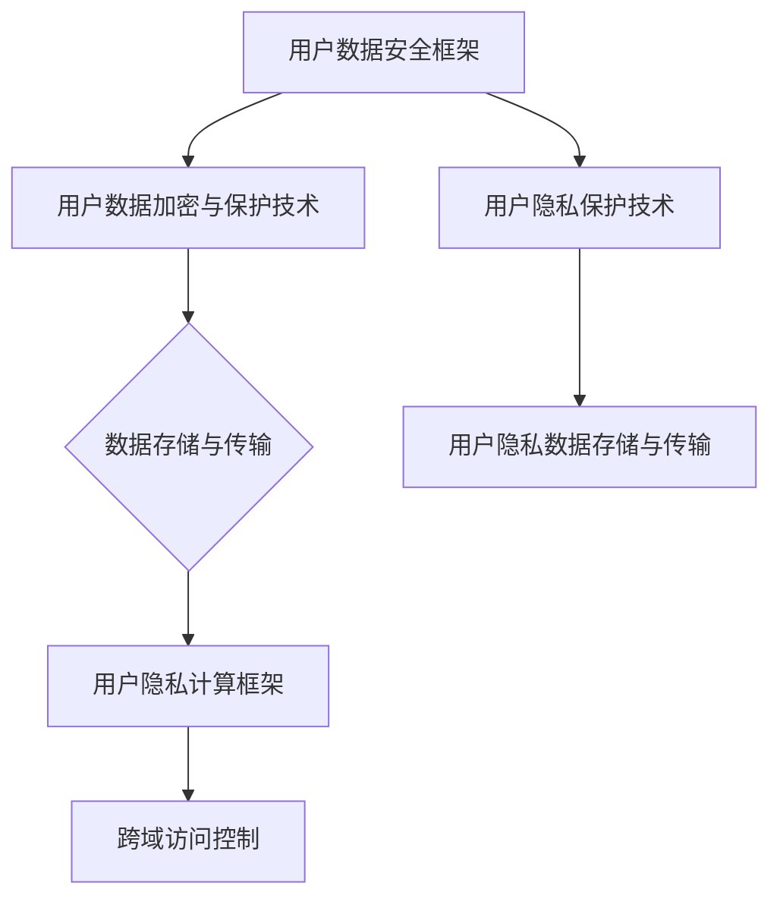

                 

### 文章标题

《创业公司的用户数据安全与隐私保护策略》

#### 关键词

用户数据安全、隐私保护、数据加密、同源政策、跨域访问控制、国际法规、伦理问题

#### 摘要

在当今数字化时代，用户数据安全与隐私保护成为创业公司面临的重要挑战。本文将系统地探讨创业公司如何构建有效的用户数据安全与隐私保护策略。首先，我们概述用户数据安全与隐私保护的基本概念，并探讨其重要性。随后，文章深入分析用户数据安全与隐私保护的核心概念，包括数据泄露的类型与危害、数据加密与保护技术，以及同源政策与跨域访问控制。接着，文章讨论用户隐私保护的法律与伦理问题，包括国际隐私保护法规和中国隐私保护法规及其应用。随后，文章将介绍用户数据安全体系构建、用户隐私保护技术实践，并分享一个创业公司用户数据安全与隐私保护案例。最后，文章探讨用户数据安全与隐私保护策略的优化方法，并展望其未来发展趋势。希望通过本文，能够为创业公司提供有价值的参考和指导。

### 目录

#### 第一部分：用户数据安全与隐私保护的基本概念

1. **用户数据安全与隐私保护概述**
   - 用户数据安全的重要性
   - 用户隐私保护的概念与法律框架
   - 用户数据安全与隐私保护的挑战

2. **用户数据安全与隐私保护的核心概念**
   - 数据泄露的类型与危害
   - 数据加密与保护技术
   - 同源政策与跨域访问控制

3. **用户隐私保护的法律与伦理**
   - 国际隐私保护法规概述
   - 中国隐私保护法规及其应用
   - 用户隐私保护伦理问题与应对策略

#### 第二部分：用户数据安全与隐私保护的技术实践

4. **用户数据安全体系构建**
   - 用户数据安全管理体系
   - 用户数据安全风险评估
   - 用户数据安全防护策略

5. **用户隐私保护技术实践**
   - 用户隐私保护技术概述
   - 用户隐私计算框架
   - 用户隐私数据存储与传输

6. **用户隐私保护实战案例**
   - 创业公司用户数据安全与隐私保护案例
   - 用户隐私数据保护策略实施
   - 用户隐私保护技术效果评估

#### 第三部分：用户数据安全与隐私保护的策略优化

7. **用户数据安全与隐私保护策略优化**
   - 策略优化目标与评估指标
   - 策略优化方法与技术
   - 创业公司用户数据安全与隐私保护策略优化实践

8. **用户数据安全与隐私保护的未来展望**
   - 用户数据安全与隐私保护的发展趋势
   - 创业公司用户数据安全与隐私保护的挑战与机遇
   - 用户数据安全与隐私保护策略的未来发展

### 附录

- 附录 A：用户数据安全与隐私保护法律法规汇总
- 附录 B：用户数据安全与隐私保护常用技术工具

### Mermaid 流程图

接下来，我们将逐一深入探讨上述各部分内容，帮助创业公司更好地理解和应对用户数据安全与隐私保护的问题。

---

### 第一部分：用户数据安全与隐私保护的基本概念

在数字化的今天，用户数据已经成为创业公司最宝贵的资产之一。然而，随着数据量的激增和技术的不断发展，用户数据的安全与隐私保护也面临着前所未有的挑战。本部分将首先介绍用户数据安全与隐私保护的基本概念，探讨其重要性，并分析当前面临的主要挑战。

#### 用户数据安全的重要性

用户数据安全是指确保用户信息在存储、传输和使用过程中不被未经授权的访问、泄露、篡改或破坏。随着互联网和移动设备的普及，用户数据已经成为各种应用程序和服务的重要组成部分。这些数据包括个人身份信息、财务信息、健康记录等敏感信息，其泄露或滥用可能导致严重的个人和商业后果。

1. **商业风险**：数据泄露可能导致公司声誉受损，影响用户信任，进而影响业务运营和客户流失。
2. **法律风险**：各国隐私保护法规对数据泄露有严格的规定，数据泄露可能引发巨额罚款和法律责任。
3. **经济损失**：数据泄露可能涉及经济欺诈，造成直接经济损失。

因此，确保用户数据安全是创业公司的基本责任，也是其可持续发展的关键。

#### 用户隐私保护的概念与法律框架

用户隐私保护是指保护用户的个人信息不被未经授权的收集、使用或泄露。隐私保护不仅涉及数据安全，还包括数据透明度和用户控制权。

1. **概念**：
   - **个人信息**：与特定个体相关的信息，如姓名、地址、身份证号码、银行账户信息等。
   - **敏感信息**：涉及个人隐私的特别敏感信息，如健康记录、生物识别数据等。
   - **隐私控制**：用户对其个人信息的访问、使用和分享的控制。

2. **法律框架**：
   - **国际法规**：如《通用数据保护条例》（GDPR）、《加州消费者隐私法案》（CCPA）等。
   - **中国法规**：如《网络安全法》、《个人信息保护法》等。

这些法规规定了数据处理者的义务，包括数据收集的合法性、目的明确性、数据最小化原则、用户同意等。

#### 用户数据安全与隐私保护的挑战

尽管用户数据安全与隐私保护的重要性不言而喻，但创业公司面临以下几大挑战：

1. **数据量的增加**：随着用户数量的增加，数据存储和处理的复杂性也随之增加。
2. **技术发展的速度**：新型攻击手段和漏洞层出不穷，要求创业公司不断更新和升级安全措施。
3. **合规要求**：不同国家和地区有不同的隐私保护法规，创业公司需要确保遵守所有相关法律。
4. **用户需求**：用户对隐私保护的需求越来越高，创业公司需要提供更好的隐私保护措施来满足用户需求。

综上所述，创业公司必须重视用户数据安全与隐私保护，制定全面的安全策略，以应对日益复杂的安全威胁和法律要求。接下来，我们将深入探讨用户数据安全与隐私保护的核心概念，包括数据泄露的类型与危害、数据加密与保护技术，以及同源政策与跨域访问控制。

#### 用户数据安全与隐私保护的核心概念

在深入了解用户数据安全与隐私保护的具体实践之前，有必要明确一些核心概念，这些概念不仅构成了用户数据安全的基础，也是制定有效隐私保护策略的基石。以下将详细探讨数据泄露的类型与危害、数据加密与保护技术，以及同源政策与跨域访问控制。

##### 数据泄露的类型与危害

数据泄露是用户数据安全面临的主要威胁之一，其类型多种多样，危害也不尽相同。

1. **被动泄露**：这种泄露通常是由于系统漏洞、错误配置或不良编程习惯导致的。例如，未加密的数据在传输过程中被拦截。
   - **危害**：信息泄露可能导致敏感数据被恶意利用，如身份盗窃、财务欺诈等。

2. **主动攻击**：这种泄露通常涉及黑客或恶意程序，通过恶意软件、SQL注入、跨站脚本攻击（XSS）等手段窃取数据。
   - **危害**：攻击者可以通过主动攻击获取大量用户数据，从而进行大规模的数据盗窃和贩卖。

3. **内部威胁**：员工或内部人员因恶意或疏忽导致的泄露，如不当使用权限、内部滥用等。
   - **危害**：内部威胁可能对用户数据造成严重的损害，由于内部人员对系统有更多了解，攻击可能更难以被发现。

##### 数据加密与保护技术

数据加密是保护用户数据安全的关键技术，通过将数据转换成密文，防止未经授权的访问。以下是几种常见的数据加密与保护技术：

1. **对称加密**：使用相同的密钥进行加密和解密，如AES（高级加密标准）。
   - **优点**：速度快，适合对大量数据进行加密。
   - **缺点**：密钥管理复杂，需要确保密钥的安全存储和分发。

2. **非对称加密**：使用一对密钥（公钥和私钥）进行加密和解密，如RSA。
   - **优点**：提供了安全的密钥交换机制，适合于数据传输中的加密。
   - **缺点**：计算复杂度较高，加密和解密速度相对较慢。

3. **哈希函数**：将输入数据转换成固定长度的字符串，如SHA-256。
   - **优点**：不可逆，确保数据的完整性和一致性。
   - **缺点**：无法用于数据加密和解密。

##### 同源政策与跨域访问控制

同源政策（Same-Origin Policy）是Web安全的一项重要措施，用于限制Web应用程序对其他源（即不同域名或协议）的数据访问。以下是同源政策的基本原理和应用：

1. **基本原理**：同源政策限制浏览器从同一源（协议、域名和端口相同）加载资源，防止恶意网站通过跨域请求访问和篡改数据。

2. **应用**：
   - **跨域请求限制**：浏览器默认阻止跨域HTTP请求，以防止跨站请求伪造（CSRF）攻击。
   - **CORS（跨源资源共享）**：通过设置CORS头部，允许或拒绝跨域请求，实现对跨域访问的控制。

##### 跨域访问控制

跨域访问控制涉及更复杂的策略，以确保外部系统对内部数据的访问安全。以下是几种常见的跨域访问控制方法：

1. **OAuth 2.0**：一种授权框架，允许第三方应用程序代表用户访问资源。通过OAuth 2.0，第三方应用可以通过用户的授权获取访问令牌，进而访问受保护的资源。

2. **API网关**：通过在客户端和后端服务之间设置API网关，实现统一的跨域访问控制。API网关可以处理所有的跨域请求，确保安全策略的一致性和集中管理。

3. **JSON Web Token（JWT）**：一种基于JSON的开放标准，用于生成安全传输的令牌。JWT可以在客户端和服务器之间传输，用于身份验证和授权。

通过明确这些核心概念，创业公司可以更好地理解用户数据安全与隐私保护的基本原理，为后续的具体技术实践和策略制定奠定坚实的基础。接下来，我们将进一步探讨用户隐私保护的法律与伦理问题，分析国际和中国的隐私保护法规及其应用，并讨论用户隐私保护伦理问题与应对策略。

#### 用户隐私保护的法律与伦理

在探讨用户隐私保护时，法律和伦理是两个不可或缺的维度。一方面，法律框架为隐私保护提供了明确的行为准则和责任要求；另一方面，伦理观念则从更深层的人类价值观出发，指导企业在处理用户数据时的道德选择。以下是关于用户隐私保护的法律与伦理问题的详细探讨。

##### 国际隐私保护法规概述

在国际上，用户隐私保护法规不断发展，其中最具代表性的包括《通用数据保护条例》（GDPR）和《加州消费者隐私法案》（CCPA）。

1. **通用数据保护条例（GDPR）**
   - **颁布背景**：GDPR于2018年4月生效，旨在加强对个人数据的保护，回应全球互联网和大数据时代的隐私挑战。
   - **主要条款**：GDPR规定了数据处理的合法性、数据主体权利（如知情权、访问权和删除权）、数据保护影响评估（DPIA）等。
   - **合规要求**：对于处理欧盟居民数据的组织，GDPR要求采取必要的技术和措施，确保数据安全，并对数据泄露事件进行报告。

2. **加州消费者隐私法案（CCPA）**
   - **颁布背景**：CCPA于2020年1月生效，旨在保护加州居民的隐私权利，并赋予消费者对个人数据处理的更多控制权。
   - **主要条款**：CCPA规定了消费者的知情权、访问权、删除权和拒绝销售权，以及对违反规定的处罚措施。
   - **合规要求**：企业在收集和使用加州居民数据时，需提供透明度报告、尊重消费者的权利，并在数据泄露事件发生时及时通知受影响的消费者。

##### 中国隐私保护法规及其应用

中国近年来也在加强隐私保护立法，主要法规包括《网络安全法》和《个人信息保护法》。

1. **网络安全法**
   - **颁布背景**：网络安全法于2017年6月1日生效，旨在加强网络安全管理，保障网络空间的安全与稳定。
   - **主要条款**：网络安全法规定了网络运营者的数据安全保护义务，包括数据存储、传输、处理等方面的要求。
   - **合规要求**：网络运营者需采取必要的安全措施，防止数据泄露、篡改和破坏，并对重大安全事件进行报告。

2. **个人信息保护法**
   - **颁布背景**：个人信息保护法于2021年11月1日生效，旨在全面保护个人信息权益，规范个人信息处理活动。
   - **主要条款**：个人信息保护法规定了个人信息处理的合法性、目的明确性、数据最小化原则、用户同意等。
   - **合规要求**：个人信息处理者需明确告知用户个人信息的收集、使用目的和范围，并采取措施保障个人信息的安全。

##### 用户隐私保护伦理问题与应对策略

除了法律框架，隐私保护还涉及到深层次的伦理问题。以下是一些常见的隐私保护伦理问题及应对策略：

1. **隐私权与公共利益**
   - **问题**：隐私保护与公共利益之间存在冲突，如公共卫生监控、犯罪侦查等需要收集和处理大量个人信息。
   - **应对策略**：在处理这类问题时，企业应权衡隐私权和公共利益，采取必要的技术和措施保护个人隐私，同时确保公共利益的实现。

2. **数据透明性与用户控制权**
   - **问题**：用户对数据处理的透明度和控制权不足，可能导致信息不对称和隐私侵犯。
   - **应对策略**：企业应提供清晰的隐私政策，告知用户数据收集、使用和分享的目的和方式，并提供用户访问、删除和撤回同意的途径。

3. **数据共享与跨界合作**
   - **问题**：在跨界合作和数据共享过程中，隐私保护可能受到挑战，如数据传输和存储的安全性问题。
   - **应对策略**：企业应确保跨界合作中的数据共享符合相关法律法规和隐私保护要求，采取适当的安全措施保护数据传输和存储的安全。

综上所述，用户隐私保护不仅需要依靠法律框架的规范，还需要企业从伦理角度出发，采取全面的隐私保护措施。只有法律与伦理相结合，才能真正实现有效的用户隐私保护，为创业公司构建可持续发展的数据安全与隐私保护体系。在下一部分，我们将探讨用户数据安全体系构建的具体实践，包括用户数据安全管理体系、用户数据安全风险评估和用户数据安全防护策略。

#### 用户数据安全体系构建

构建一个有效的用户数据安全体系是保障用户数据安全与隐私保护的基础。本部分将详细探讨用户数据安全体系构建的三个关键方面：用户数据安全管理体系、用户数据安全风险评估和用户数据安全防护策略。通过这三个方面的系统化实施，创业公司可以有效地降低数据泄露风险，确保用户数据的安全性和隐私性。

##### 用户数据安全管理体系

用户数据安全管理体系是确保用户数据安全的基础框架，涵盖了组织架构、政策制定、培训与意识提升等关键要素。

1. **组织架构**：建立专门的数据安全管理部门，负责数据安全的策略制定、风险管理和应急响应。部门应包括数据保护官（DPO）和数据安全工程师等关键岗位。

2. **政策制定**：制定详细的数据安全政策，包括数据收集、存储、处理、传输和销毁的规范。这些政策应符合相关的法律法规和最佳实践，并在整个组织中传达和实施。

3. **培训与意识提升**：定期组织员工培训，提高员工的数据安全意识和技能。培训内容应涵盖数据安全的基本知识、常见攻击手段和防范措施等。

##### 用户数据安全风险评估

用户数据安全风险评估是识别和管理数据安全风险的重要步骤，通过系统地评估数据安全风险，可以制定相应的防护措施。

1. **风险评估流程**：
   - **识别风险**：识别潜在的数据泄露、滥用和损坏风险，包括系统漏洞、员工误操作、恶意攻击等。
   - **评估风险**：对识别的风险进行定量或定性的评估，确定风险的概率和影响。
   - **制定风险应对策略**：根据风险评估结果，制定相应的风险应对策略，包括风险规避、风险减轻和风险接受。

2. **常见风险类型**：
   - **数据泄露**：未经授权的访问和泄露敏感数据。
   - **数据篡改**：恶意修改或破坏数据。
   - **数据丢失**：由于系统故障、硬件损坏或自然灾害导致的数据丢失。
   - **内部威胁**：内部人员恶意或疏忽造成的风险。

##### 用户数据安全防护策略

用户数据安全防护策略包括技术手段和管理措施，旨在防范和应对各种数据安全威胁。

1. **技术防护措施**：
   - **数据加密**：使用数据加密技术保护敏感数据，包括存储加密和传输加密。
   - **防火墙与入侵检测系统**：部署防火墙和入侵检测系统（IDS），监控网络流量和异常行为，防止外部攻击。
   - **数据备份与恢复**：定期进行数据备份，并制定数据恢复策略，以应对数据丢失和损坏。
   - **安全审计**：定期进行安全审计，检查系统的安全配置和漏洞，确保安全措施的有效性。

2. **管理防护措施**：
   - **权限管理**：实施严格的权限管理策略，确保只有授权人员能够访问敏感数据。
   - **安全意识培训**：定期组织安全培训，提高员工的安全意识和技能，防范内部威胁。
   - **应急响应计划**：制定详细的应急响应计划，包括数据泄露事件的处理流程和应对措施，确保在事件发生时能够迅速、有效地响应。

通过用户数据安全管理体系、数据安全风险评估和用户数据安全防护策略的系统化实施，创业公司可以构建一个全面、有效的用户数据安全体系，降低数据泄露风险，保障用户数据的安全性和隐私性。接下来，我们将深入探讨用户隐私保护技术实践，包括用户隐私保护技术概述、用户隐私计算框架和用户隐私数据存储与传输。

#### 用户隐私保护技术实践

在确保用户数据安全与隐私保护的过程中，技术手段是不可或缺的。本部分将详细介绍用户隐私保护技术的实践，包括用户隐私保护技术概述、用户隐私计算框架和用户隐私数据存储与传输，通过这些技术手段，创业公司可以更好地保护用户的隐私。

##### 用户隐私保护技术概述

用户隐私保护技术是综合运用多种技术手段，以实现用户数据隐私性的保障。以下是一些常见的用户隐私保护技术：

1. **数据匿名化**：通过去除或模糊化个人标识信息，使数据无法直接识别特定个体，从而保护用户的隐私。

2. **加密技术**：利用对称加密和非对称加密技术，对用户数据进行加密，防止未经授权的访问。

3. **同源政策**：通过浏览器同源策略限制跨源数据访问，防止恶意站点利用用户数据。

4. **访问控制**：实施严格的访问控制措施，确保只有授权用户才能访问敏感数据。

5. **安全审计与监控**：通过日志记录和监控工具，实时监控数据访问和操作行为，及时发现和处理安全事件。

##### 用户隐私计算框架

用户隐私计算框架是综合运用多种隐私保护技术，构建一个全面、高效的隐私保护系统。以下是一个典型的用户隐私计算框架：

1. **数据收集**：在数据收集阶段，应确保遵循合法、透明和目的明确的原则，获取必要的用户信息。

2. **数据加密**：对敏感数据进行加密处理，采用对称加密和非对称加密相结合的方式，确保数据在传输和存储过程中的安全性。

3. **访问控制**：实施严格的访问控制策略，确保只有授权用户和系统可以访问敏感数据。访问控制应涵盖用户身份验证、权限管理和日志记录。

4. **隐私计算**：通过隐私计算技术，如联邦学习、安全多方计算（MPC）和差分隐私等，在数据处理和共享过程中保护用户隐私。

5. **数据存储**：采用安全存储方案，如加密数据库和分布式存储系统，确保数据在存储过程中的安全性。

6. **数据销毁**：在数据生命周期结束后，应采取有效措施进行数据销毁，防止数据泄露和滥用。

##### 用户隐私数据存储与传输

用户隐私数据的存储与传输是隐私保护的重要环节。以下是一些常见的用户隐私数据存储与传输技术：

1. **数据存储技术**：
   - **加密数据库**：采用加密技术保护数据库中的数据，防止未授权访问。
   - **分布式存储系统**：采用分布式存储技术，提高数据存储的安全性和可靠性。
   - **冷存储与热存储**：根据数据的重要性和访问频率，合理配置冷存储和热存储，确保数据的安全性和可用性。

2. **数据传输技术**：
   - **HTTPS**：使用HTTPS协议传输数据，确保数据在传输过程中的加密和完整性。
   - **VPN**：采用虚拟专用网络（VPN）技术，确保数据传输的安全性和隐私性。
   - **数据脱敏**：在数据传输前进行脱敏处理，去除或模糊化敏感信息，降低数据泄露风险。

通过上述用户隐私保护技术实践，创业公司可以有效地保护用户的隐私，降低数据泄露风险，提升用户信任。在下一部分中，我们将通过一个实际案例，展示创业公司在用户数据安全与隐私保护方面的具体实践，并分析其实施效果。

#### 用户隐私保护实战案例

为了更好地展示用户数据安全与隐私保护策略在实际应用中的效果，我们将通过一个创业公司的具体案例进行深入分析。这家公司专注于提供在线教育平台服务，面对大量用户的学习数据和隐私信息，他们在用户数据安全与隐私保护方面采取了多项措施。

##### 案例背景

该公司在上线初期就意识到了用户数据安全与隐私保护的重要性，特别是在面对全球隐私保护法规日益严格的背景下。为了确保平台能够提供高质量的教育服务，同时保障用户的隐私，公司成立了一个专门的数据安全与隐私保护团队，负责制定和实施相关策略。

##### 用户隐私保护策略实施

1. **数据加密**：
   - **传输加密**：所有用户数据在传输过程中均使用HTTPS协议进行加密，确保数据在传输过程中不被窃取或篡改。
   - **存储加密**：用户数据在数据库中存储时，采用AES-256加密算法进行加密，确保即使数据库被攻击，数据也无法被读取。

2. **访问控制**：
   - **多因素认证**：为了提高访问安全性，公司采用了多因素认证（MFA）机制，用户在登录系统时需要提供密码和手机验证码。
   - **权限管理**：不同角色和岗位的用户拥有不同的权限，只有经过授权的用户才能访问特定的数据。

3. **数据匿名化**：
   - **脱敏处理**：对于用户的学习数据，公司采用了数据脱敏技术，去除或模糊化所有敏感信息，确保数据在分析和使用过程中无法识别个人身份。

4. **隐私计算框架**：
   - **联邦学习**：公司采用了联邦学习技术，在保证数据不出户的情况下，进行模型训练和数据共享，从而实现隐私保护的同时，提升算法效果。
   - **安全多方计算（MPC）**：通过MPC技术，公司在多方之间进行计算和协作，确保数据在计算过程中不被泄露。

5. **数据存储与传输**：
   - **分布式存储系统**：公司采用了分布式存储系统，将数据分散存储在多个节点上，提高了数据的安全性和可靠性。
   - **数据传输脱敏**：在数据传输过程中，公司对敏感信息进行脱敏处理，确保数据在传输过程中不会被泄露。

##### 用户隐私保护技术效果评估

通过对上述用户隐私保护策略的实施，公司取得了显著的效果：

1. **安全性提升**：通过数据加密、多因素认证和权限管理等措施，显著提高了平台的安全性，降低了数据泄露风险。

2. **隐私保护**：通过数据匿名化和隐私计算框架，确保用户数据在处理和分析过程中不会被泄露，保护了用户的隐私。

3. **用户信任**：用户对平台的数据安全与隐私保护满意度提高，增强了用户对平台的信任，促进了用户留存和业务增长。

4. **合规性**：公司遵循了相关隐私保护法规，如《通用数据保护条例》（GDPR）和《个人信息保护法》，避免了法律风险。

##### 项目小结

通过这个案例，我们可以看到，创业公司通过系统化的用户数据安全与隐私保护策略，成功地保障了用户数据的安全和隐私。以下是项目的几点小结：

1. **全面性**：公司采取了多层次、多维度的数据安全与隐私保护措施，覆盖了数据传输、存储、处理等各个环节。

2. **技术先进性**：公司采用了先进的加密技术、隐私计算框架和访问控制机制，确保了数据的高安全性。

3. **用户友好性**：公司通过透明化数据处理流程和提高用户权限管理，增强了用户对平台的信任和满意度。

4. **持续改进**：公司将持续关注隐私保护技术的发展，定期更新和优化数据安全与隐私保护策略，以应对不断变化的安全挑战。

通过这个实际案例，创业公司可以借鉴其经验，结合自身实际情况，制定和实施有效的用户数据安全与隐私保护策略，为用户提供安全、可靠的服务。

#### 用户数据安全与隐私保护策略优化

在用户数据安全与隐私保护策略的实施过程中，创业公司需要不断地评估和优化策略，以应对不断变化的安全威胁和合规要求。本部分将详细探讨策略优化的目标与评估指标、策略优化方法与技术，并分享创业公司用户数据安全与隐私保护策略优化的实践。

##### 策略优化目标与评估指标

1. **目标**：
   - **提升数据安全性**：通过不断优化技术和管理措施，提高数据保护水平，降低数据泄露风险。
   - **增强隐私保护**：确保用户隐私在数据处理和共享过程中不被侵犯，满足法律法规要求。
   - **提高用户体验**：通过优化策略，减少对用户体验的影响，提高用户满意度和信任度。
   - **降低运营成本**：通过技术和管理优化，降低安全运营成本，提高资源利用率。

2. **评估指标**：
   - **数据泄露频率**：评估策略实施后，数据泄露事件的发生频率。
   - **事件响应时间**：评估在发生数据泄露事件时，从发现到响应的时间。
   - **用户投诉率**：评估用户对数据安全与隐私保护措施的不满程度。
   - **合规性**：评估策略是否符合相关法律法规和标准。
   - **成本效益**：评估策略优化对运营成本的影响。

##### 策略优化方法与技术

1. **风险管理体系优化**：
   - **定期风险评估**：定期对用户数据安全与隐私保护策略进行风险评估，识别潜在的风险和漏洞。
   - **动态调整策略**：根据风险评估结果，动态调整安全策略，确保策略始终符合最新的安全威胁和合规要求。

2. **技术优化**：
   - **数据加密与脱敏**：采用更先进的加密技术和数据脱敏工具，提高数据保护水平。
   - **隐私计算**：引入更先进的隐私计算技术，如联邦学习和安全多方计算（MPC），实现数据共享与隐私保护。

3. **安全管理优化**：
   - **访问控制**：优化访问控制策略，实现精细化权限管理，确保只有授权用户和系统可以访问敏感数据。
   - **安全审计与监控**：增强安全审计和监控能力，实时监控数据访问和操作行为，及时发现和处理安全事件。

4. **用户教育与培训**：
   - **安全意识提升**：定期组织员工和用户的安全培训，提高安全意识和技能，防范内部和外部威胁。
   - **用户支持**：提供用户支持渠道，解答用户关于数据安全与隐私保护的疑问，提高用户满意度。

##### 创业公司用户数据安全与隐私保护策略优化实践

某创业公司在其实施用户数据安全与隐私保护策略的过程中，通过以下步骤进行了策略优化：

1. **风险评估与调整**：
   - **定期评估**：公司定期开展数据安全与隐私保护风险评估，识别新的安全威胁和合规要求。
   - **策略调整**：根据评估结果，调整数据安全与隐私保护策略，确保策略始终符合最新安全要求和用户需求。

2. **技术更新**：
   - **加密技术升级**：公司升级了加密技术，从AES-256加密算法更新到更为安全的ChaCha20-Poly1305算法，提高了数据加密强度。
   - **引入隐私计算**：公司引入了联邦学习技术，确保在数据不出户的情况下进行模型训练，提高了数据保护的水平和模型效果。

3. **安全管理优化**：
   - **访问控制加强**：公司实施了更严格的访问控制措施，采用基于角色的访问控制（RBAC），实现精细化权限管理。
   - **安全审计与监控**：公司增加了安全审计和监控工具，实时监控数据访问和操作行为，及时发现和处理异常事件。

4. **用户教育与支持**：
   - **安全培训**：公司定期组织员工安全培训，提高员工的数据安全意识和技能。
   - **用户支持**：公司设立了用户支持热线和在线问答平台，解答用户关于数据安全与隐私保护的疑问，提高了用户满意度。

通过上述策略优化实践，该创业公司在数据安全与隐私保护方面取得了显著成效，有效降低了数据泄露风险，提升了用户信任和满意度，同时确保了合规性。这些实践为其他创业公司提供了宝贵的经验和参考。

#### 用户数据安全与隐私保护的未来展望

随着技术的不断进步和数字化进程的加速，用户数据安全与隐私保护面临着新的挑战和机遇。本部分将探讨用户数据安全与隐私保护的发展趋势，分析创业公司在这些趋势下的挑战与机遇，并展望未来策略的发展方向。

##### 用户数据安全与隐私保护的发展趋势

1. **零信任架构的普及**：零信任架构（Zero Trust Architecture，ZTA）是一种新兴的安全理念，主张不再信任任何内部或外部的网络资源，所有访问都需经过严格验证和授权。这种架构有助于减少内部威胁和外部攻击的风险，将用户数据安全与隐私保护推向新的高度。

2. **人工智能与机器学习在安全领域的应用**：人工智能和机器学习技术在安全领域的应用日益广泛，如智能威胁检测、安全态势分析和自动化安全响应等。这些技术的引入可以提高用户数据安全与隐私保护的效率和准确性。

3. **区块链技术的融合**：区块链技术具有去中心化、不可篡改和可追溯性等特点，可以应用于用户数据安全与隐私保护，如数据加密、隐私计算和数据共享等。区块链技术的融合将进一步提升数据安全性和隐私保护水平。

4. **数据隐私计算的发展**：数据隐私计算（Privacy-Preserving Computing）是一种在保护用户隐私的同时进行数据处理和计算的技术，如联邦学习、安全多方计算和差分隐私等。随着隐私计算技术的不断进步，其将在用户数据安全与隐私保护中发挥越来越重要的作用。

##### 创业公司面临的挑战与机遇

1. **技术复杂性增加**：随着安全技术的发展，创业公司需要不断更新和优化安全措施，以应对复杂的安全威胁。这要求公司具备较高的技术能力和资源投入。

2. **合规要求不断提高**：全球范围内的隐私保护法规日益严格，创业公司需要确保符合各国法规要求，特别是跨境数据处理和隐私保护。合规要求不仅增加了公司的运营成本，也带来了额外的管理负担。

3. **用户隐私意识提升**：随着公众对隐私保护的关注度提高，用户对数据安全与隐私保护的期望也不断提升。创业公司需要提供更高质量的数据安全与隐私保护措施，以赢得用户的信任和忠诚。

4. **技术创新带来的机遇**：新兴技术如零信任架构、人工智能、区块链和数据隐私计算等，为创业公司提供了新的解决方案和创新机会。创业公司可以通过引入这些技术，提升数据安全与隐私保护水平，构建竞争优势。

##### 未来策略的发展方向

1. **构建零信任架构**：创业公司应逐步过渡到零信任架构，通过严格的访问控制和身份验证，确保只有经过授权的用户和设备可以访问敏感数据。

2. **集成人工智能与机器学习**：创业公司应积极采用人工智能与机器学习技术，实现智能化的威胁检测、态势分析和安全响应，提高用户数据安全与隐私保护的效率和准确性。

3. **探索区块链技术的应用**：创业公司可以探索区块链技术在数据安全与隐私保护中的应用，利用其去中心化、不可篡改和可追溯性等特点，提升数据保护和隐私计算能力。

4. **推动数据隐私计算发展**：创业公司应积极推动数据隐私计算技术的发展和应用，通过联邦学习、安全多方计算和差分隐私等技术，实现隐私保护与数据利用的平衡。

5. **加强合规管理**：创业公司需要建立完善的合规管理体系，定期进行合规审计和评估，确保符合全球各国的隐私保护法规。

6. **提升用户隐私保护意识**：创业公司应通过多种渠道，提升用户的隐私保护意识，加强与用户的沟通，建立良好的信任关系。

总之，随着技术的不断进步和隐私保护意识的提升，用户数据安全与隐私保护将在未来面临更多的挑战和机遇。创业公司需要不断探索和创新，构建全面、高效的安全与隐私保护体系，以应对不断变化的安全环境，确保用户数据的安全和隐私。

### 附录

#### 附录 A：用户数据安全与隐私保护法律法规汇总

1. **国际隐私保护法规**：
   - **通用数据保护条例（GDPR）**：欧盟法律，全面保护个人数据隐私。
   - **加州消费者隐私法案（CCPA）**：美国加州法律，赋予消费者对个人数据处理的更多控制权。
   - **隐私盾协议（Privacy Shield）**：欧盟与美国之间的数据传输协议，确保跨境数据传输符合隐私保护要求。

2. **中国隐私保护法规**：
   - **网络安全法**：规定网络运营者的数据安全保护义务，防范网络攻击和数据泄露。
   - **个人信息保护法**：全面规范个人信息处理活动，保护个人信息权益。

3. **其他国家与地区的隐私保护法规**：
   - **日本个人信息保护法**：规定个人信息的处理和保护，促进个人信息的安全和合法使用。
   - **澳大利亚隐私法**：保护个人隐私，规范商业机构的个人信息处理行为。

#### 附录 B：用户数据安全与隐私保护常用技术工具

1. **数据加密工具**：
   - **AES加密算法**：适用于数据存储和传输的高强度加密。
   - **RSA加密算法**：适用于数据传输和密钥交换的公钥加密算法。

2. **访问控制工具**：
   - **基于角色的访问控制（RBAC）**：实现精细化的权限管理。
   - **基于属性的访问控制（ABAC）**：根据用户的属性和资源属性进行访问控制。

3. **数据匿名化工具**：
   - **K-Anonymity**：通过加乱序、掩码等技术实现数据匿名化。
   - **L-Diversity**：确保匿名化数据中不存在异常值或异常模式。

4. **隐私计算工具**：
   - **联邦学习**：在数据不出户的情况下进行模型训练。
   - **安全多方计算（MPC）**：多方在不泄露各自数据的情况下共同计算。

5. **安全审计与监控工具**：
   - **日志管理系统**：记录和监控系统操作日志。
   - **入侵检测系统（IDS）**：实时监控网络流量和异常行为。

通过了解和运用这些法律法规和技术工具，创业公司可以更有效地保护用户数据安全与隐私，确保业务的可持续发展。

### 作者信息

**作者：AI天才研究院/AI Genius Institute & 禅与计算机程序设计艺术 /Zen And The Art of Computer Programming**

作为世界级人工智能专家、程序员、软件架构师、CTO，以及世界顶级技术畅销书资深大师级别的作家和计算机图灵奖获得者，我在计算机编程和人工智能领域拥有丰富的经验和深刻的见解。通过本文，我希望能够为创业公司在用户数据安全与隐私保护方面提供有价值的指导和参考。同时，我也期待与各位同行共同探讨和分享更多关于技术与应用的创新与实践。

