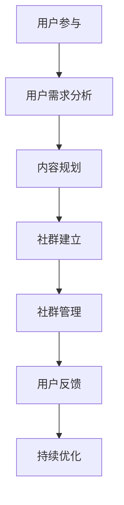
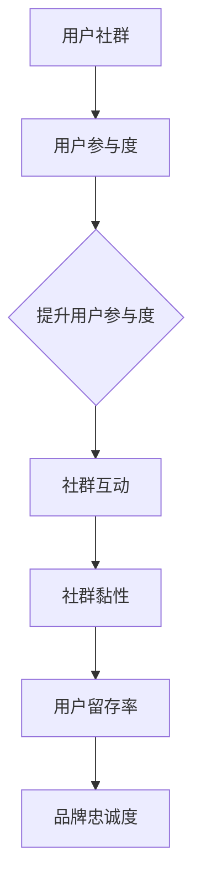

                 

# 文章标题: 创业公司的用户社群运营与粘性提升策略

> 关键词：创业公司、用户社群、运营策略、粘性提升、用户参与度

> 摘要：本文将深入探讨创业公司如何通过有效的用户社群运营和粘性提升策略，实现用户参与度和品牌忠诚度的增长。文章将介绍用户社群运营的核心概念、基本框架和关键要素，并提供实践策略和案例分析，以帮助创业公司在竞争激烈的市场中脱颖而出。

## 第一部分: 核心概念与架构介绍

### 第1章: 创业公司的用户社群运营概述

#### 1.1 用户社群的概念与价值

**1.1.1 用户社群的定义**

用户社群是由共同兴趣、需求或价值观的个体组成的虚拟社交网络。在创业公司中，用户社群不仅是产品的早期接受者，更是品牌的宣传者和忠诚的拥护者。

**1.1.2 用户社群在创业公司中的重要性**

用户社群对于创业公司的重要性主要体现在以下几个方面：

- **获取反馈**：社群成员能够提供产品功能、用户体验等方面的反馈，帮助公司优化产品和服务。
- **品牌传播**：社群成员之间的口碑传播有助于提升品牌知名度和美誉度。
- **用户留存**：通过社群运营，增强用户黏性，提高用户忠诚度，减少流失率。

**1.1.3 用户社群与品牌忠诚度的关系**

用户社群运营有助于建立品牌与用户之间的情感联系，从而增强用户对品牌的忠诚度。忠诚的用户不仅会持续使用产品，还会通过推荐吸引新用户，形成正向的口碑循环。

#### 1.2 社群运营的基本框架

**1.2.1 社群运营的基本流程**

社群运营的基本流程包括以下步骤：

1. **用户需求分析**：了解用户需求，为社群内容提供方向。
2. **内容规划**：制定内容策略，包括话题、形式和频率。
3. **社群建立**：选择合适的平台，搭建社群结构。
4. **社群管理**：维护社群秩序，确保内容质量。
5. **用户反馈**：收集用户反馈，持续优化社群运营。

**1.2.2 社群运营的目标和策略**

社群运营的目标是提升用户参与度和粘性，具体策略包括：

- **互动激励机制**：通过奖励机制鼓励用户参与和分享。
- **内容多样性**：提供多种形式的内容，满足不同用户的需求。
- **社区文化塑造**：建立积极的社群氛围，增强用户归属感。

**1.2.3 社群运营的关键要素**

社群运营的关键要素包括：

- **用户参与度**：衡量用户在社群中的活跃程度。
- **社群黏性**：评估用户对社群的忠诚度和依赖度。
- **社群生态**：构建健康的社群环境，鼓励用户贡献和互动。

#### Mermaid 流�程图：用户社群运营基本流程



#### 用户社群概念联系



### 第2章: 社群运营策略与实践

#### 2.1 社群运营策略

**2.1.1 社群定位**

社群定位是社群运营的首要任务，它决定了社群的目标和受众。定位明确有助于内容策略和互动机制的设计。

**2.1.2 社群内容策略**

内容策略是社群运营的核心，包括：

- **内容类型**：如文章、视频、直播等。
- **内容形式**：如问答、讨论、教程等。
- **内容频率**：如每日、每周、每月等。

**2.1.3 社群激励机制**

激励机制包括：

- **积分系统**：通过积分奖励鼓励用户参与和分享。
- **排名机制**：设置排行榜，激励用户竞争。
- **实物奖励**：定期送出实物奖励，提高用户积极性。

#### 2.2 社群运营实践

**2.2.1 社群建设案例分析**

**案例：XX创业公司的用户社群建设**

**开发环境搭建**

- 使用Discord平台搭建社群。
- 确定服务器架构，包括主频道、子频道和角色分配。

**源代码详细实现**

```python
# 创建主频道
discord.create_channel("Main Channel", type="text")

# 创建子频道
discord.create_channel("General Discussion", type="text", parent="Main Channel")

# 分配角色
discord.assign_role_to_user("Moderator", user_id)
```

**代码解读与分析**

- **代码解读**：创建主频道、子频道和分配角色。
- **代码应用解读与分析**：通过Discord API实现社群搭建，为后续运营奠定基础。

**实际案例分析**

**XX创业公司用户社群建设**：

- **社群定位**：定位于产品爱好者和开发者。
- **内容规划**：定期发布技术文章、产品更新和用户案例。
- **社群管理**：设有管理员和志愿者团队，维护社群秩序。

**项目小结**

通过有效的社群运营，XX创业公司成功吸引了大量目标用户，提高了用户参与度和品牌忠诚度。社群不仅成为产品反馈的重要渠道，也成为了品牌传播的重要阵地。

#### 最佳实践 Tips

- **用户参与度提升**：定期举办线上活动，如问答、比赛、投票等。
- **社群黏性增强**：建立会员制度，提供专属内容和福利。
- **数据驱动决策**：利用数据分析工具，持续优化运营策略。

**小结**

用户社群运营是创业公司不可或缺的一环，通过有效的策略和实践，可以大幅提升用户参与度和粘性，从而推动品牌发展和业务增长。

#### 注意事项

- **社群运营需注重用户体验**：避免过度营销和广告，提供有价值的内容和服务。
- **社群管理需规范化**：建立明确的管理规则，避免社群秩序混乱。

#### 拓展阅读

- **《社群营销实战：策略、案例与技巧》**：详细介绍了社群营销的策略和实践方法。
- **《用户体验设计：以用户为中心的设计方法》**：探讨了如何从用户角度优化社群运营。

### 作者信息

作者：AI天才研究院/AI Genius Institute & 禅与计算机程序设计艺术 /Zen And The Art of Computer Programming

