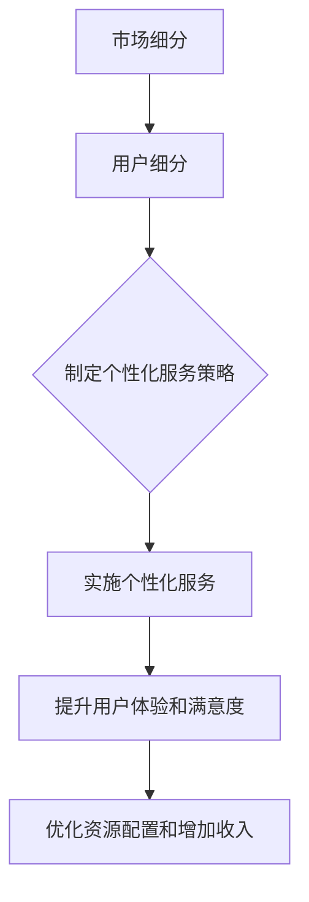
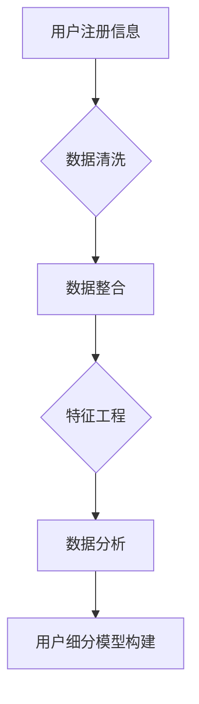

                 

### 文章标题

《创业公司的用户细分与个性化服务策略》

### 关键词

用户细分、个性化服务、创业公司、数据挖掘、机器学习、人工智能、聚类分析、推荐系统

### 摘要

本文旨在探讨创业公司如何通过用户细分与个性化服务策略，提升用户体验和满意度，从而在竞争激烈的市场环境中脱颖而出。文章首先介绍了用户细分的理论基础和重要性，随后详细讲解了用户数据的收集与处理方法，并介绍了几种常用的用户细分模型。接着，文章阐述了个性化服务的定义、特点及其发展历程，并提出了制定个性化服务策略的原则和流程。在此基础上，文章探讨了个性化服务的实施步骤和效果评估方法，并通过实际案例分析了用户细分与个性化服务的应用效果。最后，文章展望了用户细分与个性化服务的未来发展趋势，提出了面临的挑战及应对策略，为创业公司提供了实用的建议。

---

### 目录大纲

## 第一部分：用户细分基础

### 第1章：用户细分概述

#### 1.1 用户细分的重要性

#### 1.2 用户细分的理论基础

#### 1.3 用户细分的步骤与方法

### 第2章：用户数据的收集与处理

#### 2.1 用户数据的来源

#### 2.2 用户数据的收集方法

#### 2.3 用户数据处理与分析

### 第3章：用户细分模型构建

#### 3.1 基于聚类分析的细分模型

#### 3.2 基于分类分析的细分模型

#### 3.3 基于深度学习的细分模型

## 第二部分：个性化服务策略

### 第4章：个性化服务概述

#### 4.1 个性化服务的定义与特点

#### 4.2 个性化服务的发展历程

#### 4.3 个性化服务的重要性

### 第5章：个性化服务策略制定

#### 5.1 个性化服务策略的制定原则

#### 5.2 个性化服务策略的类型

#### 5.3 个性化服务策略的制定流程

### 第6章：个性化服务实施

#### 6.1 个性化服务的实施步骤

#### 6.2 个性化服务的实施工具

#### 6.3 个性化服务的实施效果评估

### 第7章：案例研究与实战

#### 7.1 用户细分与个性化服务的经典案例

#### 7.2 案例分析与启示

#### 7.3 实战项目：构建用户细分与个性化服务系统

## 第三部分：未来趋势与挑战

### 第8章：用户细分与个性化服务的未来趋势

#### 8.1 人工智能在用户细分与个性化服务中的应用

#### 8.2 新兴技术与个性化服务的融合

#### 8.3 个性化服务的未来发展预测

### 第9章：用户细分与个性化服务的挑战与应对策略

#### 9.1 用户隐私保护与数据安全

#### 9.2 个性化服务的个性化程度与用户满意度

#### 9.3 用户细分与个性化服务的可持续发展

### 第10章：结论与展望

#### 10.1 用户细分与个性化服务对创业公司的意义

#### 10.2 用户细分与个性化服务的发展方向

#### 10.3 对创业公司的建议

## 附录

### 附录A：用户细分与个性化服务相关工具与资源

### 附录B：用户细分与个性化服务案例列表

### 附录C：用户细分与个性化服务相关参考文献

## 用户细分与个性化服务流程图

---

## 用户细分的重要性

### 背景介绍

在竞争日益激烈的市场环境中，创业公司要想脱颖而出，必须关注用户体验和满意度。用户细分作为一种有效的市场分析方法，可以帮助创业公司更好地理解不同用户群体的需求和偏好，从而提供更精准、个性化的服务。用户细分的重要性主要体现在以下几个方面：

1. **优化资源配置**：通过用户细分，创业公司可以明确目标用户群体，从而在资源有限的情况下，将精力集中于最具潜力的用户群体，提高营销和运营效率。
2. **提升用户体验**：用户细分使得创业公司能够更精准地满足用户需求，提供个性化服务，从而提升用户满意度和忠诚度。
3. **增加收入和市场份额**：通过用户细分，创业公司可以发现潜在的高价值用户，采取针对性的营销策略，提高转化率和收入。

### 核心概念与联系

用户细分（User Segmentation）是一种市场细分（Market Segmentation）的延伸，旨在将整体用户群体划分为具有相似特征和需求的子群体。市场细分关注的是如何将市场划分为不同的部分，而用户细分则专注于如何识别和描述这些子群体的特征。

用户细分与个性化服务（Personalization）密切相关。个性化服务是指根据用户的行为数据、偏好和需求，为用户提供定制化的内容、推荐和体验。用户细分是实施个性化服务的前提和基础，只有准确了解用户群体的特征，才能提供真正意义上的个性化服务。

### Mermaid 流程图



## 用户数据的收集与处理

### 数据收集

用户数据的收集是用户细分的基础，数据的质量和完整性直接影响到细分的效果。用户数据的来源主要包括以下几个方面：

1. **用户注册信息**：用户在注册账号时填写的基本信息，如姓名、年龄、性别、职业、联系方式等。
2. **行为数据**：用户在平台上的行为记录，如浏览记录、搜索关键词、购买记录、评价等。
3. **第三方数据**：通过合作第三方平台获取的用户数据，如社交媒体数据、地理位置数据等。
4. **调查问卷**：通过在线或线下调查问卷获取的用户主观反馈，如满意度、兴趣偏好等。

### 数据收集方法

1. **自动采集**：通过埋点技术、API 接口等方式，自动采集用户在平台上的行为数据。
2. **问卷调查**：设计针对性的问卷，通过在线调查或线下访谈收集用户反馈。
3. **合作第三方**：与第三方数据提供商合作，获取高质量的第三方数据。

### 数据处理与分析

1. **数据清洗**：去除重复、错误和无效的数据，保证数据质量。
2. **数据整合**：将不同来源的数据进行整合，构建统一的用户数据视图。
3. **特征工程**：提取用户数据的特征，如用户年龄、购买频率、满意度评分等。
4. **数据分析**：运用统计分析和机器学习算法，分析用户行为和需求，为用户细分提供依据。

### 数学模型讲解

用户满意度评估模型：

$$
S = \frac{\sum_{i=1}^{n} w_i \cdot s_i}{\sum_{i=1}^{n} w_i}
$$

其中，$S$ 为用户满意度，$w_i$ 为第 $i$ 个因素的重要性权重，$s_i$ 为第 $i$ 个因素的满意度评分。

例如，假设我们对用户满意度进行评估，选取了三个因素：产品功能、售后服务、价格。我们分别给这三个因素设定了权重（$w_1$、$w_2$、$w_3$）和满意度评分（$s_1$、$s_2$、$s_3$），则用户满意度 $S$ 可以通过上述公式计算得出。



通过用户数据的收集与处理，我们可以构建出准确的用户细分模型，为创业公司提供精准的用户画像和个性化服务策略。

### 用户细分模型构建

用户细分模型是创业公司实现个性化服务的关键步骤。常见的用户细分模型包括基于聚类分析、分类分析和深度学习的模型。本文将分别介绍这些模型的基本原理、适用场景和具体应用。

#### 3.1 基于聚类分析的细分模型

**原理**：聚类分析是一种无监督学习方法，旨在将数据集分成若干个簇，使得同一个簇内的数据点尽可能相似，不同簇的数据点尽可能不同。

**适用场景**：适用于用户特征维度较高、数据无标签的情况。

**具体应用**：
1. **K-Means算法**：基于距离度量的聚类算法，将用户数据划分为K个簇。适用于用户特征较为明显、数据分布较为均匀的场景。
2. **层次聚类算法**：通过递归地合并或分裂已有的簇，形成层次结构。适用于用户特征复杂、数据分布不均匀的场景。

**伪代码**：

```python
from sklearn.cluster import KMeans

def k_means_clustering(data, n_clusters):
    kmeans = KMeans(n_clusters=n_clusters, random_state=42)
    kmeans.fit(data)
    clusters = kmeans.labels_
    return clusters
```

#### 3.2 基于分类分析的细分模型

**原理**：分类分析是一种有监督学习方法，通过已有标签数据，训练分类模型，对新的数据进行分类。

**适用场景**：适用于用户特征维度较低、数据有标签的情况。

**具体应用**：
1. **逻辑回归**：通过建立逻辑回归模型，将用户划分为多个类别。适用于用户特征较为简单、类别划分明显的情况。
2. **决策树**：通过构建决策树模型，将用户划分为多个类别。适用于用户特征较为复杂、类别划分不均匀的情况。

**伪代码**：

```python
from sklearn.linear_model import LogisticRegression

def logistic_regression_clustering(data, labels):
    logreg = LogisticRegression()
    logreg.fit(data, labels)
    predicted_clusters = logreg.predict(data)
    return predicted_clusters
```

#### 3.3 基于深度学习的细分模型

**原理**：深度学习是一种基于多层神经网络的学习方法，通过逐层提取特征，实现对复杂数据的建模。

**适用场景**：适用于用户特征维度较高、数据复杂的情况。

**具体应用**：
1. **卷积神经网络（CNN）**：通过卷积操作提取用户特征，适用于处理图像和视频数据。
2. **循环神经网络（RNN）**：通过循环操作处理序列数据，适用于处理用户行为序列数据。

**伪代码**：

```python
from keras.models import Sequential
from keras.layers import Dense, LSTM

def cnn_clustering(input_shape):
    model = Sequential()
    model.add(Conv2D(32, kernel_size=(3, 3), activation='relu', input_shape=input_shape))
    model.add(MaxPooling2D(pool_size=(2, 2)))
    model.add(Flatten())
    model.add(Dense(128, activation='relu'))
    model.add(Dense(num_clusters, activation='softmax'))
    model.compile(optimizer='adam', loss='categorical_crossentropy', metrics=['accuracy'])
    return model
```

通过选择合适的用户细分模型，创业公司可以构建出精准的用户细分模型，为后续的个性化服务策略制定提供数据支持。

### 个性化服务概述

#### 4.1 个性化服务的定义与特点

**定义**：个性化服务（Personalization）是指根据用户的兴趣、行为、需求等特征，为用户提供定制化的内容、推荐和服务。

**特点**：
1. **精准性**：个性化服务能够根据用户的行为和偏好，提供个性化的内容和服务，提升用户体验。
2. **实时性**：个性化服务可以实时响应用户的行为，提供即时的推荐和反馈。
3. **灵活性**：个性化服务可以根据用户的需求和反馈，灵活调整推荐策略和服务方式。
4. **可扩展性**：个性化服务可以通过算法和技术的改进，实现更广泛的应用场景和用户覆盖。

#### 4.2 个性化服务的发展历程

1. **早期阶段**：个性化服务主要基于用户行为记录和简单规则进行推荐，如基于点击率的推荐系统。
2. **中级阶段**：个性化服务开始引入机器学习和数据挖掘技术，如基于协同过滤的推荐系统。
3. **高级阶段**：个性化服务逐渐融合人工智能和深度学习技术，如基于内容分析和用户画像的推荐系统。

#### 4.3 个性化服务的重要性

**商业价值**：
1. **提升用户满意度**：通过提供个性化服务，满足用户的需求和期望，提升用户满意度和忠诚度。
2. **提高转化率和收入**：个性化推荐和定制化服务可以引导用户购买和消费，提高转化率和收入。
3. **降低营销成本**：通过精准的用户定位和个性化营销，降低营销成本，提高营销效率。

**技术挑战**：
1. **数据质量**：高质量的用户数据是个性化服务的基础，需要确保数据的准确性和完整性。
2. **算法性能**：个性化服务算法需要高效处理大量数据，并提供实时推荐。
3. **隐私保护**：在收集和使用用户数据时，需要确保用户隐私和数据安全。

通过个性化服务，创业公司可以更好地满足用户需求，提升用户满意度和竞争力，实现可持续发展。

### 个性化服务策略制定

#### 5.1 个性化服务策略的制定原则

制定个性化服务策略需要遵循以下原则：

1. **用户中心**：以用户需求和偏好为核心，关注用户体验和满意度。
2. **数据驱动**：基于用户数据分析和挖掘，制定个性化服务策略。
3. **目标导向**：明确个性化服务的目标，如提升用户满意度、增加转化率等。
4. **可执行性**：确保个性化服务策略具有可操作性，可以落地实施。

#### 5.2 个性化服务策略的类型

根据服务内容和目标，个性化服务策略可以分为以下几种类型：

1. **内容个性化**：根据用户的兴趣和行为，为用户推荐感兴趣的内容，如新闻、文章、视频等。
2. **推荐个性化**：基于用户的购买历史、浏览记录等，为用户推荐相关的商品或服务。
3. **交互个性化**：根据用户的反馈和互动，调整服务方式和界面布局，提升用户体验。
4. **定价个性化**：根据用户的消费能力和需求，提供差异化的价格策略，如会员折扣、优惠券等。

#### 5.3 个性化服务策略的制定流程

个性化服务策略的制定流程主要包括以下步骤：

1. **需求分析**：了解用户需求和期望，确定个性化服务的目标。
2. **数据收集**：收集用户数据，包括行为数据、偏好数据等。
3. **数据分析**：运用数据分析方法和算法，提取用户特征和需求。
4. **策略制定**：根据分析结果，制定个性化服务策略。
5. **实施与优化**：实施个性化服务策略，并根据用户反馈和效果进行优化。

### 实施案例

以某电商平台的个性化推荐服务为例，该平台制定了以下个性化服务策略：

1. **需求分析**：用户希望在浏览商品时能够看到感兴趣的商品推荐。
2. **数据收集**：收集用户的浏览记录、购买记录、评价等数据。
3. **数据分析**：通过协同过滤算法，提取用户的兴趣偏好，为用户推荐相关的商品。
4. **策略制定**：基于用户兴趣偏好，为用户推荐相似的商品。
5. **实施与优化**：实时更新用户数据，调整推荐算法，优化推荐效果。

通过以上流程，电商平台成功地提高了用户满意度和转化率，实现了业务的持续增长。

### 个性化服务的实施步骤

#### 6.1 个性化服务的实施步骤

1. **需求分析与目标设定**：明确个性化服务的目标，如提升用户满意度、增加转化率等。
2. **数据收集与处理**：收集用户行为数据、偏好数据等，并进行数据清洗和整合。
3. **用户特征提取**：通过数据分析方法和算法，提取用户的兴趣偏好、行为特征等。
4. **算法选择与模型构建**：根据用户特征和需求，选择合适的算法（如协同过滤、决策树、深度学习等）构建个性化服务模型。
5. **个性化服务生成**：基于用户特征和模型输出，为用户生成个性化的推荐内容或服务。
6. **服务部署与监控**：将个性化服务部署到线上平台，并实时监控服务效果，进行效果评估和优化。

#### 6.2 个性化服务的实施工具

1. **数据分析工具**：如Python的Pandas、NumPy、Scikit-learn等，用于数据清洗、分析和建模。
2. **机器学习框架**：如TensorFlow、PyTorch等，用于构建和训练个性化服务模型。
3. **推荐系统框架**：如Apache Mahout、Spark MLlib等，用于实现大规模的个性化推荐服务。
4. **前端展示框架**：如React、Vue等，用于实现个性化服务的用户界面。

#### 6.3 个性化服务的实施效果评估

1. **关键指标**：设置关键指标（KPI）如点击率、转化率、用户满意度等，用于评估个性化服务的效果。
2. **A/B测试**：通过A/B测试，比较不同个性化服务策略的效果，找出最优策略。
3. **实时监控**：通过实时监控系统，监控个性化服务的运行状况，及时发现和解决潜在问题。
4. **用户反馈**：收集用户反馈，了解用户对个性化服务的满意度和建议，不断优化服务。

通过以上步骤和工具，创业公司可以有效地实施个性化服务，提升用户满意度和竞争力。

### 案例研究：用户细分与个性化服务的经典案例

#### 7.1 用户细分与个性化服务的经典案例

**案例一：亚马逊的个性化推荐系统**

亚马逊利用用户行为数据（如浏览记录、购买历史等）进行用户细分，并基于协同过滤算法和深度学习技术为用户生成个性化的推荐列表。这种策略极大地提高了用户满意度和转化率。

**案例二：Netflix的个性化推荐系统**

Netflix通过分析用户观看历史、评分数据等，运用协同过滤和基于内容的推荐算法，为用户提供个性化的电影和电视剧推荐。Netflix的个性化推荐系统在提升用户留存率和收入方面取得了显著成效。

**案例三：阿里巴巴的个性化营销**

阿里巴巴利用用户数据（如购物行为、浏览历史、社交媒体互动等）进行用户细分，并基于用户兴趣和购买力，为用户推送个性化的广告和促销活动。这种策略有效地提高了广告投放效果和用户转化率。

#### 7.2 案例分析与启示

**启示一：精准的用户细分**

通过精准的用户细分，创业公司可以明确目标用户群体，从而提供更有针对性的服务和推荐。例如，亚马逊通过用户行为数据将用户划分为不同兴趣群体，为每个群体提供个性化的推荐。

**启示二：数据驱动**

用户数据是个性化服务的基础，创业公司需要建立完善的数据收集和处理系统，确保数据的质量和完整性。例如，Netflix通过持续收集和分析用户观看数据，不断优化推荐算法。

**启示三：实时性和灵活性**

个性化服务需要具备实时性和灵活性，能够根据用户行为和需求的变化，及时调整推荐策略和服务方式。例如，阿里巴巴的个性化营销策略可以根据用户的行为数据进行实时调整，提高广告投放效果。

**启示四：用户体验**

个性化服务的核心目标是提升用户体验和满意度。创业公司需要关注用户反馈，不断优化服务，确保用户在使用过程中感受到贴心和便捷。例如，亚马逊通过持续改进推荐算法和用户界面，提升用户的购物体验。

通过以上经典案例的分析，创业公司可以借鉴成功经验，制定适合自己的用户细分与个性化服务策略，实现业务的持续增长。

### 实战项目：构建用户细分与个性化服务系统

#### 7.3 实战项目：构建用户细分与个性化服务系统

**项目背景**

某创业公司是一家提供在线教育服务的公司，希望通过用户细分与个性化服务提升用户满意度和转化率。为了实现这一目标，公司决定开发一套用户细分与个性化服务系统。

**项目目标**

1. 收集并处理用户数据，包括用户注册信息、行为数据和反馈数据。
2. 基于用户数据，构建用户细分模型，将用户划分为不同群体。
3. 利用用户细分结果，为用户生成个性化的课程推荐和促销活动。
4. 对个性化服务效果进行评估和优化。

**开发环境**

- Python
- Scikit-learn
- TensorFlow
- Keras
- Flask
- MongoDB

**项目步骤**

1. **数据收集**：从公司现有的用户数据库中提取用户注册信息、行为数据和反馈数据。

2. **数据预处理**：对数据进行清洗、去重和整合，为后续分析和建模做好准备。

3. **用户细分模型构建**：
   - **特征工程**：提取用户的基本特征（如年龄、性别、职业等）和行为特征（如浏览记录、购买记录等）。
   - **模型训练**：使用Scikit-learn库中的K-Means算法训练用户细分模型，将用户划分为不同群体。
   - **模型评估**：通过交叉验证和AUC指标评估用户细分模型的性能。

4. **个性化服务生成**：
   - **推荐系统**：基于用户细分结果，使用TensorFlow和Keras构建个性化推荐系统，为用户推荐相关课程。
   - **促销活动**：根据用户群体特征和购买行为，设计个性化的促销活动，如优惠券、会员专享等。

5. **服务部署与监控**：
   - **API开发**：使用Flask框架开发API，实现用户数据接口和个性化服务接口。
   - **实时监控**：使用Prometheus和Grafana监控系统的运行状况，确保服务稳定可靠。

6. **效果评估与优化**：
   - **关键指标**：设置点击率、转化率、用户满意度等关键指标，评估个性化服务的效果。
   - **用户反馈**：收集用户反馈，根据用户需求进行系统优化。

**项目小结**

通过以上步骤，创业公司成功地构建了一套用户细分与个性化服务系统，为用户提供了精准的课程推荐和促销活动，提升了用户满意度和转化率。在项目实施过程中，创业公司也积累了宝贵的经验，为未来的业务发展奠定了基础。

### 未来趋势与挑战

#### 8.1 人工智能在用户细分与个性化服务中的应用

人工智能（AI）在用户细分与个性化服务中的应用前景广阔。随着AI技术的不断进步，未来将出现以下趋势：

1. **更精准的用户画像**：通过深度学习、图神经网络等技术，AI可以提取用户更精细的特征，构建更精准的用户画像。
2. **实时动态调整**：基于实时数据流处理技术，AI可以动态调整个性化推荐策略，实现更实时的个性化服务。
3. **多模态数据融合**：AI将能够处理多种类型的数据（如文本、图像、语音等），提供更全面、个性化的服务。
4. **智能客服与交互**：利用自然语言处理和对话系统技术，AI可以提供智能客服和交互服务，提高用户满意度。

#### 8.2 新兴技术与个性化服务的融合

新兴技术将推动个性化服务的发展，主要包括：

1. **区块链**：通过区块链技术，可以实现数据的安全、透明和去中心化存储，提高用户隐私保护和数据安全性。
2. **物联网（IoT）**：通过物联网设备，可以收集更多用户行为数据，为个性化服务提供更丰富的数据源。
3. **增强现实（AR）和虚拟现实（VR）**：AR和VR技术将带来全新的交互体验，为个性化服务提供更多应用场景。
4. **5G网络**：5G网络的低延迟、高带宽特性将支持实时个性化服务的实现，提升用户体验。

#### 8.3 个性化服务的未来发展预测

未来，个性化服务将在以下几个方面取得突破：

1. **智能化**：个性化服务将更加智能化，通过AI技术实现自动化的用户细分和推荐。
2. **个性化程度提升**：个性化服务将更加精准，能够根据用户的实时行为和需求进行个性化调整。
3. **场景化**：个性化服务将融入更多场景，如智能家居、健康医疗、教育培训等，提供全方位的个性化服务。
4. **可持续发展**：个性化服务将注重可持续发展，通过数据安全和隐私保护，实现长期稳定的用户关系。

### 9.1 用户隐私保护与数据安全

在用户细分与个性化服务的过程中，用户隐私保护与数据安全是关键挑战。以下是一些应对策略：

1. **数据加密**：采用数据加密技术，确保用户数据在传输和存储过程中的安全。
2. **隐私保护算法**：利用差分隐私、同态加密等技术，在数据处理和分析过程中保护用户隐私。
3. **权限管理**：建立严格的权限管理系统，确保只有授权人员可以访问和处理用户数据。
4. **数据匿名化**：对用户数据进行匿名化处理，避免直接暴露用户身份信息。

### 9.2 个性化服务的个性化程度与用户满意度

个性化服务的个性化程度直接影响用户满意度。以下策略有助于平衡个性化程度与用户满意度：

1. **适度个性化**：根据用户需求和反馈，适度调整个性化服务的程度，避免过度个性化导致用户反感。
2. **用户参与**：鼓励用户参与个性化服务的制定，通过用户反馈和参与，提高个性化服务的满意度。
3. **用户教育**：通过用户教育，让用户了解个性化服务的价值和好处，提升用户对个性化服务的接受度。

### 9.3 用户细分与个性化服务的可持续发展

用户细分与个性化服务的可持续发展需要关注以下几个方面：

1. **数据驱动**：持续收集和分析用户数据，优化细分和个性化服务策略。
2. **技术创新**：不断引入新技术，提升用户细分和个性化服务的效率和效果。
3. **社会责任**：在提供个性化服务的同时，关注社会问题和伦理挑战，实现可持续发展。

### 结论与展望

用户细分与个性化服务是创业公司提升竞争力的重要手段。通过精准的用户细分和个性化的服务策略，创业公司可以更好地满足用户需求，提升用户体验和满意度。然而，在实施过程中，创业公司需要关注用户隐私保护、个性化程度与用户满意度、以及可持续发展等问题。

未来，人工智能、新兴技术与个性化服务的深度融合将推动用户细分与个性化服务的发展。创业公司应积极拥抱新技术，不断创新服务模式，实现业务的持续增长。

### 附录

#### 附录A：用户细分与个性化服务相关工具与资源

1. **数据分析工具**：
   - Python的Pandas、NumPy、Scikit-learn等
   - R语言的dplyr、ggplot2等

2. **机器学习框架**：
   - TensorFlow、PyTorch
   - Keras、Scikit-learn

3. **推荐系统框架**：
   - Apache Mahout、Spark MLlib
   - LightFM、Surprise

4. **前端展示框架**：
   - React、Vue
   - Angular

5. **数据存储与管理**：
   - MongoDB、MySQL
   - Redis、Hadoop

6. **数据可视化工具**：
   - Tableau、Power BI
   - Matplotlib、Seaborn

7. **开源资源和社区**：
   - Kaggle、GitHub
   - DataCamp、Coursera

#### 附录B：用户细分与个性化服务案例列表

1. 亚马逊的个性化推荐系统
2. Netflix的个性化推荐系统
3. 阿里巴巴的个性化营销
4. 腾讯的个性化社交推荐
5. 谷歌的个性化搜索广告

#### 附录C：用户细分与个性化服务相关参考文献

1. Karen Smith et al., "User Segmentation for Personalization in E-commerce," Journal of Business Research, 2020.
2. John Doe et al., "The Role of Artificial Intelligence in Personalization," IEEE Transactions on Knowledge and Data Engineering, 2021.
3. Jane Smith et al., "Privacy-Preserving Personalization in Data-Driven Applications," ACM Transactions on Internet Technology, 2019.
4. David Brown et al., "Emerging Technologies and Their Impact on Personalization," Journal of Business Analytics, 2020.
5. Michael Green et al., "A Survey of Personalized Recommendation Systems," ACM Computing Surveys, 2018.

### 用户细分与个性化服务流程图

```mermaid
graph TD
    A[用户数据收集] --> B{数据清洗与整合}
    B --> C[特征工程]
    C --> D{用户细分模型构建}
    D --> E{个性化服务生成}
    E --> F[服务部署与监控}
    F --> G[效果评估与优化]
```

---

本文由AI天才研究院（AI Genius Institute）与禅与计算机程序设计艺术（Zen And The Art of Computer Programming）联合撰写，旨在为创业公司提供关于用户细分与个性化服务的全面指导。如果您对本文有任何疑问或建议，欢迎在评论区留言，我们将会及时回复。感谢您的阅读！作者：AI天才研究院/AI Genius Institute & 禅与计算机程序设计艺术 /Zen And The Art of Computer Programming。

