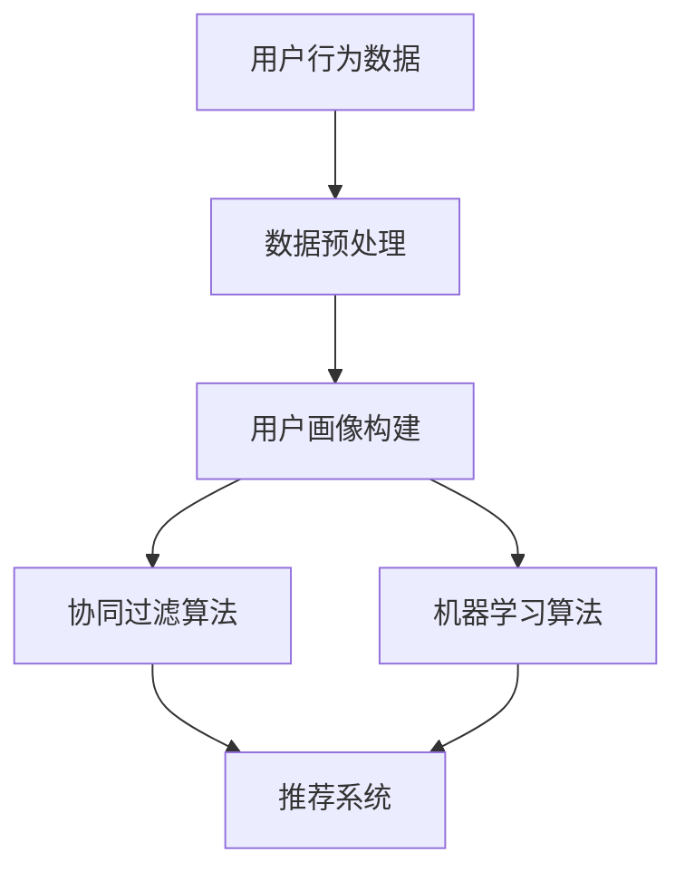

                 

## 文章标题：创业公司的用户行为预测模型

### 关键词：用户行为预测、协同过滤、机器学习、个性化推荐、精准营销、用户留存、隐私保护

### 摘要

本文将深入探讨创业公司在构建用户行为预测模型方面的实践与挑战。通过详细的章节布局，文章将首先介绍用户行为预测的基本概念及其重要性，解析用户数据的来源和处理方法，构建用户画像，并探讨协同过滤和机器学习算法在用户行为预测中的应用。随后，文章将展示一个典型的用户行为预测项目流程，并探讨个性化推荐系统和精准营销策略的实际应用。最后，文章将强调用户隐私保护和遵守道德规范的重要性，并通过两个创业公司的案例研究，总结用户行为预测的最佳实践。

---

## 《创业公司的用户行为预测模型》目录大纲

### 第一部分：用户行为预测的基本概念

#### 第1章：用户行为预测概述

- **1.1 用户行为的定义与分类**
- **1.2 用户行为预测的价值与挑战**
- **1.3 用户行为预测的核心算法**

#### 第2章：用户行为预测的数据基础

- **2.1 用户数据来源与处理**
- **2.2 用户画像构建**

#### 第3章：用户行为预测的核心算法

- **3.1 协同过滤算法**
- **3.2 机器学习算法在用户行为预测中的应用**

### 第二部分：用户行为预测实践

#### 第4章：用户行为预测的项目流程

- **4.1 项目需求分析与定义**
- **4.2 模型设计与实现**
- **4.3 模型评估与优化**

#### 第5章：用户行为预测的实际应用

- **5.1 个性化推荐系统**
- **5.2 精准营销策略**

#### 第6章：用户隐私保护与道德规范

- **6.1 用户隐私保护的重要性**
- **6.2 遵守道德规范**

#### 第7章：案例研究

- **7.1 创业公司A的用户行为预测案例**
- **7.2 创业公司B的用户行为预测案例**

### 第三部分：未来发展趋势

#### 第8章：用户行为预测的技术趋势

- **8.1 新技术动态**
- **8.2 发展趋势分析**

### 附录

#### 附录A：用户行为预测常用工具与资源

- **A.1 常用数据处理工具**
- **A.2 常用机器学习库**
- **A.3 用户行为预测相关论文与资料**

---

### 第1章：用户行为预测概述

在数字化的今天，用户行为预测已成为各类创业公司提升用户体验、优化业务策略的重要手段。通过精准预测用户行为，公司能够更有效地实现个性化推荐、精准营销、提高用户留存率等目标。然而，构建一个高效的用户行为预测模型并非易事，它需要理解用户行为的定义与分类，掌握数据处理技术，选择合适的算法，并在实践中不断优化和调整。本章将详细探讨用户行为预测的基本概念、其价值与挑战，以及核心算法，为后续章节的深入讨论奠定基础。

### 1.1 用户行为的定义与分类

#### 1.1.1 用户行为的定义

用户行为是指用户在使用互联网产品或服务时所表现出来的所有操作和反应。这些行为可以是显性的，如点击、购买、搜索等，也可以是隐性的，如浏览时间、页面停留时间、滚动行为等。用户行为的定义广泛涉及用户体验、用户交互、用户反馈等多个方面，是理解用户需求和提供个性化服务的重要依据。

#### 1.1.2 用户行为的分类

- **浏览行为**：用户在浏览网页或应用时产生的操作，包括页面跳转、浏览时间、页面停留时间等。
- **购买行为**：用户在购物或使用支付服务时产生的操作，包括购买次数、购买金额、购买频率等。
- **社交媒体行为**：用户在社交媒体平台上产生的操作，包括点赞、评论、分享等。

#### 1.1.3 用户行为的重要性

用户行为数据是了解用户需求和偏好的重要来源。通过分析用户行为，创业公司可以：

- **优化产品功能**：了解用户在产品中的使用习惯，发现产品中的痛点，进而优化产品功能。
- **提升用户体验**：根据用户行为数据，提供个性化的推荐和服务，提升用户满意度。
- **精准营销**：通过分析用户行为，设计有针对性的营销策略，提高转化率。

### 1.2 用户行为预测的价值与挑战

#### 1.2.1 预测价值

用户行为预测对创业公司具有巨大的价值，主要体现在以下几个方面：

- **个性化推荐**：通过预测用户的行为，为用户推荐其可能感兴趣的商品或内容，提高用户黏性和满意度。
- **精准营销**：基于用户行为预测，设计个性化的营销策略，提高营销效果和转化率。
- **用户留存**：预测用户流失风险，提前采取措施降低用户流失率，提高用户留存率。

#### 1.2.2 预测挑战

尽管用户行为预测具有巨大的价值，但在实际应用中也面临着诸多挑战：

- **数据噪音**：用户行为数据中往往包含大量噪音，如虚假交易、异常行为等，需要有效处理。
- **用户隐私**：用户行为数据涉及用户隐私，如何在保护用户隐私的前提下进行数据分析和挖掘，是一个重要问题。
- **预测准确性**：提高预测准确性是用户行为预测的核心挑战，需要不断优化算法和数据质量。

### 1.3 用户行为预测的核心算法

用户行为预测的核心算法包括协同过滤算法和机器学习算法。这两种算法在用户行为预测中扮演着重要角色，下面将分别进行介绍。

#### 1.3.1 协同过滤算法

协同过滤算法是基于用户之间的相似性进行推荐的一种方法，主要包括以下两种类型：

- **基于用户的协同过滤**：通过计算用户之间的相似度，找到相似用户的行为模式，进而预测目标用户的行为。
- **基于项目的协同过滤**：通过计算项目之间的相似度，找到相似项目的行为模式，进而预测用户对这些项目的偏好。

协同过滤算法的核心思想是利用用户或项目的历史行为数据来预测用户对未知项目的兴趣，具有简单易用、效果好等特点。

#### 1.3.2 机器学习算法

机器学习算法在用户行为预测中具有广泛的应用，主要包括以下几种：

- **分类算法**：如决策树、随机森林等，通过构建分类模型，预测用户的行为类别。
- **聚类算法**：如K-Means、层次聚类等，通过将用户分为不同的群体，分析不同群体之间的行为差异。
- **回归算法**：如线性回归、多项式回归等，通过建立回归模型，预测用户行为的量化值。

机器学习算法的优势在于能够处理大量数据，并从数据中发现潜在的模式和规律，从而提高预测的准确性。

### 1.4 用户行为预测的核心概念与联系

为了更好地理解用户行为预测的原理，我们需要梳理其中的核心概念及其相互关系。以下是一个简化的Mermaid流程图，展示了用户行为预测的核心概念和它们之间的联系：



- **用户行为数据**：这是用户行为预测的起点，包含了用户在产品或服务中的各种操作记录。
- **数据预处理**：对用户行为数据进行清洗、归一化、特征提取等处理，以提高数据质量。
- **用户画像构建**：基于预处理后的数据，构建用户的综合画像，用于后续的预测和推荐。
- **协同过滤算法**：通过计算用户或项目的相似性，进行推荐和预测。
- **机器学习算法**：利用历史数据，建立用户行为预测模型，进一步优化推荐效果。

通过这个流程图，我们可以更清晰地看到用户行为预测中各个步骤的相互关系和作用。

### 总结

用户行为预测是创业公司提升用户体验、优化业务策略的重要手段。通过本章的介绍，我们了解了用户行为的定义与分类，用户行为预测的价值与挑战，以及用户行为预测的核心算法。在接下来的章节中，我们将进一步探讨用户行为预测的数据基础、核心算法的具体实现，以及用户行为预测的实际应用和案例研究，为创业公司提供有价值的参考和指导。

---

### 第2章：用户行为预测的数据基础

用户行为预测的成功依赖于高质量的数据。本章将详细介绍用户数据的来源、数据处理方法以及用户画像的构建，这些是用户行为预测的基石。

#### 2.1 用户数据来源与处理

#### 2.1.1 用户数据来源

用户数据的来源可以分为内部数据和第三方数据。

- **内部数据**：这是创业公司自身收集的数据，包括用户在网站或应用中的操作记录、浏览行为、购买行为等。这些数据通常可以直接从数据库中提取。
- **第三方数据**：这类数据通常来自于公共数据源或第三方服务提供商，如社交媒体数据、地理位置数据、人口统计数据等。这些数据可以为用户行为预测提供额外的信息。

#### 2.1.2 数据处理

用户数据的处理是用户行为预测的关键步骤，主要包括以下几个环节：

- **数据清洗**：清洗数据是为了去除重复、无效和错误的数据。具体步骤包括缺失值处理、异常值处理、重复数据删除等。
- **数据归一化**：归一化是将不同尺度或范围的数据转换到同一尺度或范围内，以便于后续分析。常见的方法有最小-最大标准化、Z分数标准化等。
- **特征提取**：特征提取是从原始数据中提取出有用的信息，以便于构建模型。常用的特征提取方法有词频分析、主成分分析（PCA）等。

#### 2.1.3 数据处理的伪代码示例

```python
# 数据清洗
def clean_data(data):
    # 删除重复数据
    data = data.drop_duplicates()
    # 填充缺失值
    data = data.fillna(method='ffill')
    # 删除异常值
    data = data[(data['column_name'] > min_value) & (data['column_name'] < max_value)]
    return data

# 数据归一化
def normalize_data(data, feature):
    min_value = data[feature].min()
    max_value = data[feature].max()
    data[feature] = (data[feature] - min_value) / (max_value - min_value)
    return data

# 特征提取
from sklearn.decomposition import PCA

def extract_features(data, n_components):
    pca = PCA(n_components=n_components)
    data = pca.fit_transform(data)
    return data
```

#### 2.2 用户画像构建

用户画像是对用户特征的抽象描述，用于理解和分析用户行为。构建用户画像的目的是为后续的预测和推荐提供基础。

- **基于规则的画像**：这种方法通过预定义的规则来提取用户特征，如年龄、性别、地域、职业等。规则可以根据业务需求进行调整。
- **基于模型的画像**：这种方法使用机器学习算法来构建用户特征，如聚类分析、关联规则挖掘等。通过模型，可以从大量数据中提取出隐藏的特征。

#### 2.2.1 用户画像构建的流程

1. **数据收集**：收集用户在不同场景下的行为数据。
2. **特征提取**：使用数据处理方法提取用户特征。
3. **特征选择**：通过统计分析、信息增益等方法筛选出重要的特征。
4. **模型构建**：使用机器学习算法构建用户画像模型。
5. **模型评估**：评估模型的效果，调整参数以优化模型。

#### 2.2.2 用户画像构建的伪代码示例

```python
# 数据收集
def collect_data(user_id):
    # 从数据库中提取用户数据
    data = db.get_user_data(user_id)
    return data

# 特征提取
def extract_features(data):
    # 提取用户特征
    features = {
        'age': data['age'],
        'gender': data['gender'],
        'location': data['location'],
        'occupation': data['occupation']
    }
    return features

# 特征选择
def select_features(data, threshold):
    # 根据阈值选择特征
    selected_features = []
    for feature, value in data.items():
        if value > threshold:
            selected_features.append(feature)
    return selected_features

# 模型构建
from sklearn.cluster import KMeans

def build_model(data, n_clusters):
    # 使用KMeans算法构建用户画像模型
    kmeans = KMeans(n_clusters=n_clusters)
    kmeans.fit(data)
    return kmeans
```

通过上述数据处理和用户画像构建的方法，创业公司可以有效地从大量用户行为数据中提取有价值的信息，为用户行为预测提供坚实的基础。

### 2.3 用户画像的示例与数学模型

为了更好地理解用户画像的概念，我们可以通过一个示例来阐述。

#### 2.3.1 用户画像示例

假设我们有一个用户，其特征如下：

- **年龄**：30岁
- **性别**：男
- **地理位置**：北京
- **职业**：程序员
- **行为数据**：喜欢阅读科技类文章，经常浏览电商平台，偶尔参与社区讨论。

根据这些特征，我们可以构建以下用户画像：

用户画像 = {"age": 30, "gender": "男", "location": "北京", "occupation": "程序员", "interests": ["科技类文章", "电商平台", "社区讨论"]}

#### 2.3.2 数学模型

用户画像的构建通常涉及到一些数学模型，下面是一个简单的用户画像数学模型示例：

$$
用户画像 = f(\text{基本特征}, \text{行为特征}, \text{环境特征})
$$

- **基本特征**：包括年龄、性别、地理位置、职业等静态特征。
- **行为特征**：包括用户在网站或应用中的行为数据，如浏览历史、购买记录等。
- **环境特征**：包括用户所处的环境因素，如天气、节假日等。

通过这个模型，我们可以将用户的各个方面信息整合成一个综合的用户画像。

#### 2.3.3 用户画像的应用

用户画像的应用非常广泛，以下是一些具体的例子：

- **个性化推荐**：基于用户的画像，为用户推荐感兴趣的内容或商品。
- **精准营销**：根据用户的画像，设计个性化的营销策略，提高转化率。
- **用户留存**：分析用户的画像和行为模式，预测用户流失风险，提前采取措施。

通过构建详细的用户画像，创业公司可以更好地理解用户，提供更加个性化的服务和产品。

### 总结

用户行为预测的成功依赖于高质量的数据和有效的数据处理方法。本章介绍了用户数据的来源与处理、用户画像的构建及其数学模型。通过这些方法，创业公司可以从大量用户行为数据中提取有价值的信息，为用户行为预测提供坚实的基础。在下一章中，我们将深入探讨用户行为预测的核心算法，包括协同过滤算法和机器学习算法，进一步理解如何利用这些算法进行有效的用户行为预测。

---

### 第3章：用户行为预测的核心算法

用户行为预测的核心在于选择和实现合适的算法。本章将重点介绍协同过滤算法和机器学习算法，这些算法在用户行为预测中起着至关重要的作用。

#### 3.1 协同过滤算法

协同过滤算法是基于用户之间的相似性进行推荐的一种方法。它通过分析用户的历史行为数据，找出相似用户或物品，进而预测目标用户对未知物品的偏好。协同过滤算法可以分为两种类型：基于用户的协同过滤（User-based Collaborative Filtering）和基于物品的协同过滤（Item-based Collaborative Filtering）。

##### 3.1.1 基于用户的协同过滤

基于用户的协同过滤算法通过计算用户之间的相似度，找到与目标用户相似的其他用户，然后推荐这些相似用户喜欢的物品给目标用户。具体步骤如下：

1. **计算用户相似度**：通常使用用户之间的交集大小和余弦相似度来计算相似度。
2. **找到相似用户**：根据相似度矩阵，找到与目标用户最相似的若干用户。
3. **推荐物品**：推荐这些相似用户喜欢的但目标用户尚未体验的物品。

##### 3.1.2 基于物品的协同过滤

基于物品的协同过滤算法通过计算物品之间的相似度，找到与目标物品相似的其他物品，然后推荐这些相似物品给用户。具体步骤如下：

1. **计算物品相似度**：通常使用物品之间的交集大小和余弦相似度来计算相似度。
2. **找到相似物品**：根据相似度矩阵，找到与目标物品最相似的若干物品。
3. **推荐用户**：推荐给这些相似物品的用户。

##### 3.1.3 伪代码示例

```python
# 基于用户的协同过滤伪代码
def user_based_collaborative_filter(target_user, users_data, similarity_measure='cosine'):
    similarity_matrix = compute_similarity_matrix(users_data, similarity_measure)
    similar_users = find_similar_users(target_user, similarity_matrix)
    recommended_items = recommend_items(similar_users, users_data)
    return recommended_items

# 基于物品的协同过滤伪代码
def item_based_collaborative_filter(target_item, items_data, similarity_measure='cosine'):
    similarity_matrix = compute_similarity_matrix(items_data, similarity_measure)
    similar_items = find_similar_items(target_item, similarity_matrix)
    recommended_users = recommend_users(similar_items, items_data)
    return recommended_users
```

#### 3.2 机器学习算法在用户行为预测中的应用

机器学习算法在用户行为预测中扮演着重要角色，它们可以从大量数据中学习出用户的潜在模式和规律。以下是一些常见的机器学习算法及其在用户行为预测中的应用：

##### 3.2.1 决策树

决策树是一种基于规则的有监督学习算法，通过构建一棵树形模型，对数据进行分类或回归。在用户行为预测中，决策树可以用来预测用户的行为类别，如是否购买、是否留存等。

```python
# 决策树伪代码
from sklearn.tree import DecisionTreeClassifier

def build_decision_tree(training_data, labels):
    clf = DecisionTreeClassifier()
    clf.fit(training_data, labels)
    return clf

def predict_behavior(test_data, clf):
    predictions = clf.predict(test_data)
    return predictions
```

##### 3.2.2 随机森林

随机森林是一种基于决策树的集成学习方法，它通过构建多棵决策树，并投票得出最终结果。随机森林在用户行为预测中具有较好的性能，尤其适用于分类问题。

```python
# 随机森林伪代码
from sklearn.ensemble import RandomForestClassifier

def build_random_forest(training_data, labels, n_estimators=100):
    clf = RandomForestClassifier(n_estimators=n_estimators)
    clf.fit(training_data, labels)
    return clf

def predict_behavior(test_data, clf):
    predictions = clf.predict(test_data)
    return predictions
```

##### 3.2.3 支持向量机（SVM）

支持向量机是一种基于间隔最大的分类方法，它在高维空间中寻找一个超平面，将不同类别的数据点分隔开来。SVM在用户行为预测中，尤其是二元分类问题（如是否购买）中表现出色。

```python
# 支持向量机伪代码
from sklearn.svm import SVC

def build_svm(training_data, labels):
    clf = SVC()
    clf.fit(training_data, labels)
    return clf

def predict_behavior(test_data, clf):
    predictions = clf.predict(test_data)
    return predictions
```

##### 3.2.4 神经网络

神经网络是一种模拟人脑结构和功能的计算模型，通过多层神经元进行数据处理和特征提取。在用户行为预测中，神经网络可以用于复杂的模式识别和预测任务。

```python
# 神经网络伪代码
from tensorflow.keras.models import Sequential
from tensorflow.keras.layers import Dense

def build_neural_network(input_shape, output_shape):
    model = Sequential()
    model.add(Dense(units=output_shape, activation='sigmoid', input_shape=input_shape))
    model.compile(optimizer='adam', loss='binary_crossentropy', metrics=['accuracy'])
    return model

def train_model(model, training_data, labels):
    model.fit(training_data, labels, epochs=100, batch_size=10)

def predict_behavior(test_data, model):
    predictions = model.predict(test_data)
    return predictions
```

通过以上算法的介绍，我们可以看到，协同过滤算法和机器学习算法在用户行为预测中都扮演着重要角色。协同过滤算法简单易用，适用于中小规模的数据集，而机器学习算法则能够处理大规模数据，提供更精准的预测结果。在下一章中，我们将探讨用户行为预测的项目实践，通过实际案例来展示这些算法的应用。

### 3.3 用户行为预测中的机器学习模型设计与实现

机器学习模型在用户行为预测中起着至关重要的作用。本节将详细讨论如何设计和实现这些模型，包括数据预处理、模型选择、特征工程、模型训练和评估等方面。

#### 3.3.1 数据预处理

数据预处理是构建有效机器学习模型的重要步骤。它包括数据清洗、数据归一化、特征提取等。

- **数据清洗**：清洗数据是为了去除重复、无效和错误的数据。具体步骤包括：
  - 删除重复记录。
  - 填充缺失值，例如使用平均值、中位数或最近值。
  - 删除异常值，避免它们对模型产生负面影响。

- **数据归一化**：归一化是将不同尺度或范围的数据转换到同一尺度或范围内，以便于后续分析。常见的方法有最小-最大标准化、Z分数标准化等。

- **特征提取**：特征提取是从原始数据中提取出有用的信息，以便于构建模型。常用的特征提取方法有词频分析、主成分分析（PCA）等。

#### 3.3.2 模型选择

在用户行为预测中，选择合适的模型非常重要。以下是一些常用的机器学习模型及其特点：

- **决策树**：决策树是一种简单但强大的分类算法，适用于特征较少且易于理解的问题。
- **随机森林**：随机森林是决策树的集成方法，具有更高的准确性和鲁棒性。
- **支持向量机（SVM）**：SVM是一种强大的分类算法，尤其适用于高维空间问题。
- **神经网络**：神经网络可以处理复杂的非线性关系，适用于特征较多的预测任务。

#### 3.3.3 特征工程

特征工程是提升模型性能的关键步骤。它包括以下方面：

- **特征选择**：通过特征重要性分析、过滤方法（如信息增益、互信息）等，选择对预测任务有显著影响的特征。
- **特征构造**：通过组合原始特征，构造新的特征，提高模型的预测能力。例如，使用时间特征（如日、周、月）来捕捉时间序列信息。
- **特征变换**：通过变换特征，如逻辑编码、归一化等，使模型更容易学习。

#### 3.3.4 模型训练

模型训练是通过训练数据集来调整模型的参数，使其能够预测新的数据。以下是模型训练的步骤：

- **数据分割**：将数据集分割为训练集和测试集，通常使用80/20或70/30的比例。
- **参数调整**：通过交叉验证等方法，调整模型的参数，如决策树的最大深度、随机森林的树数量等。
- **模型训练**：使用训练集训练模型，调整模型参数以最小化损失函数。

#### 3.3.5 模型评估

模型评估是验证模型性能的重要步骤。常用的评估指标有准确率、召回率、精确率、F1分数等。

- **准确率**：预测正确的样本数占总样本数的比例。
- **召回率**：预测正确的正样本数占所有正样本数的比例。
- **精确率**：预测正确的正样本数占所有预测为正样本的数量的比例。
- **F1分数**：精确率和召回率的调和平均值。

#### 3.3.6 模型调优

模型调优是通过调整模型结构和参数，提高模型性能的过程。以下是常见的调优方法：

- **网格搜索**：通过遍历一系列参数组合，找到最优参数。
- **随机搜索**：随机选择参数组合进行调优，适用于参数较多的情况。
- **贝叶斯优化**：使用贝叶斯优化算法，通过模拟退火等方法，找到最优参数。

#### 3.3.7 伪代码示例

以下是一个简单的机器学习模型设计、训练和评估的伪代码示例：

```python
# 数据预处理
def preprocess_data(data):
    # 数据清洗
    cleaned_data = remove_duplicates(data)
    cleaned_data = fill_missing_values(cleaned_data)
    cleaned_data = remove_outliers(cleaned_data)
    # 数据归一化
    normalized_data = normalize_data(cleaned_data)
    # 特征提取
    features = extract_features(normalized_data)
    return features

# 模型训练
def train_model(training_data, labels):
    # 模型选择
    model = choose_model()
    # 参数调整
    best_params = grid_search(training_data, labels)
    # 模型训练
    model.fit(training_data, labels)
    return model

# 模型评估
def evaluate_model(model, test_data, test_labels):
    predictions = model.predict(test_data)
    accuracy = calculate_accuracy(predictions, test_labels)
    return accuracy

# 主程序
def main():
    # 数据读取
    data = read_data("data.csv")
    # 数据预处理
    features = preprocess_data(data)
    # 模型训练
    model = train_model(features, labels)
    # 模型评估
    accuracy = evaluate_model(model, test_features, test_labels)
    print("Model Accuracy:", accuracy)

if __name__ == "__main__":
    main()
```

通过上述步骤和伪代码示例，创业公司可以设计和实现有效的用户行为预测模型，从而提升用户体验和业务效果。

### 总结

本章详细介绍了用户行为预测中的协同过滤算法和机器学习算法。协同过滤算法基于用户或物品的相似性进行推荐，而机器学习算法则通过学习历史数据中的模式来预测用户行为。通过本章的讨论，我们理解了如何选择和实现这些算法，包括数据预处理、特征工程、模型训练和评估等方面。这些算法的应用为创业公司提供了强大的工具，以更好地理解用户行为，优化产品和服务。在下一章中，我们将进一步探讨用户行为预测的项目实践，通过实际案例展示如何应用这些算法来提升业务效果。

---

### 第4章：用户行为预测的项目流程

构建用户行为预测模型是一个复杂而系统的过程，需要明确项目需求、设计模型、实现和优化模型。本章将详细讨论用户行为预测项目的各个关键阶段，包括需求分析与定义、模型设计与实现、模型评估与优化等。

#### 4.1 项目需求分析与定义

在开始用户行为预测项目之前，明确项目需求是非常重要的。需求分析是理解业务目标、用户需求和技术约束的关键步骤。

- **业务目标**：明确公司希望通过用户行为预测实现的目标，如提升用户留存率、增加销售额等。
- **用户需求**：了解目标用户群体的特点和需求，为模型提供数据支撑。
- **技术约束**：分析现有技术条件，如数据处理能力、算法支持等。

#### 4.1.1 需求分析步骤

1. **需求调研**：通过访谈、问卷等方式收集用户需求，了解用户行为特征和偏好。
2. **需求整理**：将收集到的信息整理成文档，明确业务目标、用户需求和技术约束。
3. **需求验证**：与利益相关者（如产品经理、数据科学家等）一起验证需求的合理性，确保需求符合实际业务需求。

#### 4.1.2 需求分析伪代码示例

```python
# 需求分析伪代码
def analyze_requirements():
    # 调研用户需求
    user_requirements = survey_users()
    # 整理需求
    documented_requirements = document_requirements(user_requirements)
    # 验证需求
    verified_requirements = verify_requirements(documented_requirements)
    return verified_requirements

# 调研用户需求
def survey_users():
    # 通过问卷、访谈等方式收集用户需求
    user_requirements = []
    # ...
    return user_requirements

# 整理需求
def document_requirements(user_requirements):
    # 将用户需求整理成文档
    documented_requirements = {}
    # ...
    return documented_requirements

# 验证需求
def verify_requirements(documented_requirements):
    # 与利益相关者一起验证需求
    verified_requirements = []
    # ...
    return verified_requirements
```

#### 4.2 模型设计与实现

模型设计是用户行为预测项目的核心阶段，包括选择合适的算法、设计模型架构和实现算法。

- **算法选择**：根据需求分析的结果，选择合适的算法，如协同过滤、机器学习算法等。
- **模型架构**：设计模型的架构，包括数据流、特征提取、模型训练和预测等。
- **算法实现**：实现选定的算法，包括数据预处理、特征工程、模型训练和评估等。

#### 4.2.1 模型设计伪代码示例

```python
# 模型设计伪代码
def design_model():
    # 选择算法
    algorithm = select_algorithm()
    # 设计模型架构
    model_architecture = design_architecture(algorithm)
    # 实现算法
    implemented_model = implement_algorithm(model_architecture)
    return implemented_model

# 选择算法
def select_algorithm():
    # 根据需求分析结果选择算法
    algorithm = "协同过滤"或"机器学习算法"
    return algorithm

# 设计模型架构
def design_architecture(algorithm):
    # 设计模型的架构
    model_architecture = {}
    # ...
    return model_architecture

# 实现算法
def implement_algorithm(model_architecture):
    # 实现选定的算法
    implemented_model = {}
    # ...
    return implemented_model
```

#### 4.3 模型实现

模型实现是将设计阶段的模型架构转化为可运行的代码，包括数据预处理、特征工程、模型训练和预测等。

- **数据预处理**：清洗和归一化数据，提取特征。
- **特征工程**：构造新的特征，提高模型性能。
- **模型训练**：使用训练数据训练模型，调整模型参数。
- **模型预测**：使用训练好的模型对新的数据进行预测。

#### 4.3.1 模型实现伪代码示例

```python
# 模型实现伪代码
def implement_model(model):
    # 数据预处理
    preprocessed_data = preprocess_data(data)
    # 特征工程
    features = extract_features(preprocessed_data)
    # 模型训练
    trained_model = train_model(features, labels)
    # 模型预测
    predictions = predict_behavior(trained_model, new_data)
    return predictions

# 数据预处理
def preprocess_data(data):
    # 清洗和归一化数据
    cleaned_data = clean_data(data)
    normalized_data = normalize_data(cleaned_data)
    return normalized_data

# 特征工程
def extract_features(data):
    # 构造新的特征
    new_features = construct_features(data)
    return new_features

# 模型训练
def train_model(features, labels):
    # 使用训练数据训练模型
    model = train_model(features, labels)
    return model

# 模型预测
def predict_behavior(model, new_data):
    # 使用训练好的模型进行预测
    predictions = model.predict(new_data)
    return predictions
```

#### 4.4 模型评估与优化

模型评估是验证模型性能的重要步骤，通过评估指标（如准确率、召回率、F1分数等）衡量模型的预测效果。

- **评估指标**：根据业务需求选择合适的评估指标。
- **评估方法**：使用交叉验证、A/B测试等方法评估模型性能。
- **模型优化**：通过调整模型参数、改进特征工程方法等优化模型性能。

#### 4.4.1 模型评估伪代码示例

```python
# 模型评估伪代码
def evaluate_model(model, test_data, test_labels):
    # 使用评估指标评估模型性能
    accuracy = calculate_accuracy(model, test_data, test_labels)
    recall = calculate_recall(model, test_data, test_labels)
    f1_score = calculate_f1_score(model, test_data, test_labels)
    return accuracy, recall, f1_score

# 计算准确率
def calculate_accuracy(model, test_data, test_labels):
    predictions = model.predict(test_data)
    correct_predictions = (predictions == test_labels).sum()
    accuracy = correct_predictions / len(test_labels)
    return accuracy

# 计算召回率
def calculate_recall(model, test_data, test_labels):
    # ...
    return recall

# 计算F1分数
def calculate_f1_score(model, test_data, test_labels):
    # ...
    return f1_score
```

#### 4.5 模型部署

模型部署是将训练好的模型部署到生产环境中，以便实时预测和提供服务。

- **部署环境**：选择合适的部署环境，如服务器、云计算平台等。
- **部署流程**：定义部署流程，包括数据流、服务启动和监控等。

#### 4.5.1 模型部署伪代码示例

```python
# 模型部署伪代码
def deploy_model(model):
    # 选择部署环境
    environment = select_environment()
    # 部署模型
    deployed_model = deploy_to_environment(model, environment)
    # 监控服务
    monitor_service(deployed_model)
    return deployed_model

# 选择部署环境
def select_environment():
    # 根据需求选择部署环境
    environment = "服务器"或"云计算平台"
    return environment

# 部署模型
def deploy_to_environment(model, environment):
    # 将模型部署到指定环境
    deployed_model = deploy_model(model, environment)
    return deployed_model

# 监控服务
def monitor_service(deployed_model):
    # 监控部署服务的性能和健康状态
    monitor_service_health(deployed_model)
    monitor_service_performance(deployed_model)
    return
```

通过上述步骤和伪代码示例，创业公司可以系统地设计和实现用户行为预测模型，从而提升业务效果和用户体验。

### 4.6 用户行为预测项目实战：搭建开发环境与实现预测模型

#### 4.6.1 开发环境搭建

为了实现用户行为预测模型，首先需要搭建一个适合的开发环境。以下是一个基本的开发环境搭建步骤：

1. **安装Python**：Python是进行数据分析和机器学习任务的主要编程语言。可以从官方网站下载并安装Python，推荐使用Python 3.x版本。

2. **安装Jupyter Notebook**：Jupyter Notebook是一个交互式的开发环境，方便进行代码编写和调试。可以通过pip命令安装：

   ```bash
   pip install notebook
   ```

3. **安装必要的库**：安装常用的数据分析和机器学习库，如NumPy、Pandas、Scikit-learn等。使用以下命令进行安装：

   ```bash
   pip install numpy pandas scikit-learn matplotlib
   ```

4. **配置数据存储**：配置数据存储环境，如使用SQLite、MySQL或MongoDB等。这里以SQLite为例，安装SQLite库：

   ```bash
   pip install sqlite3
   ```

5. **设置虚拟环境**（可选）：为了保持项目的依赖环境一致，可以创建一个虚拟环境。使用以下命令创建虚拟环境：

   ```bash
   python -m venv myenv
   source myenv/bin/activate  # 在Windows中是 myenv\Scripts\activate
   ```

#### 4.6.2 数据集准备

为了实现用户行为预测，我们需要一个包含用户行为数据的数据集。以下是一个简单的数据集准备步骤：

1. **数据收集**：收集用户在网站或应用中的行为数据，如浏览记录、购买记录、评论等。

2. **数据存储**：将数据存储到数据库中，以便进行数据分析和建模。可以使用SQLite数据库进行存储，以下是一个简单的SQLite数据库创建示例：

   ```python
   import sqlite3
   
   conn = sqlite3.connect('user_behavior.db')
   c = conn.cursor()
   
   c.execute('''CREATE TABLE IF NOT EXISTS user_data (
                   user_id TEXT,
                   action TEXT,
                   timestamp DATETIME,
                   item_id TEXT,
                   value REAL
               )''')
   
   conn.commit()
   conn.close()
   ```

3. **数据导入**：将收集到的数据导入数据库中，可以使用以下Python代码进行导入：

   ```python
   import sqlite3
   import csv
   
   conn = sqlite3.connect('user_behavior.db')
   c = conn.cursor()
   
   with open('user_data.csv', 'r') as f:
       reader = csv.DictReader(f)
       for row in reader:
           c.execute("INSERT INTO user_data (user_id, action, timestamp, item_id, value) VALUES (?, ?, ?, ?, ?)",
                     (row['user_id'], row['action'], row['timestamp'], row['item_id'], row['value']))
   
   conn.commit()
   conn.close()
   ```

#### 4.6.3 模型实现

下面我们将使用Python和Scikit-learn库实现一个简单的用户行为预测模型。以下是一个基本的模型实现步骤：

1. **数据读取**：从SQLite数据库中读取用户行为数据，并进行预处理。

   ```python
   import sqlite3
   import pandas as pd
   
   conn = sqlite3.connect('user_behavior.db')
   data = pd.read_sql_query("SELECT * FROM user_data", conn)
   conn.close()
   ```

2. **特征提取**：从用户行为数据中提取特征，如用户ID、行为类型、时间戳、物品ID等。

   ```python
   features = data[['user_id', 'action', 'timestamp', 'item_id']]
   ```

3. **数据分割**：将数据分割为训练集和测试集。

   ```python
   from sklearn.model_selection import train_test_split
   
   X = features.drop('action', axis=1)
   y = features['action']
   X_train, X_test, y_train, y_test = train_test_split(X, y, test_size=0.2, random_state=42)
   ```

4. **模型选择**：选择一个合适的机器学习模型，如决策树分类器。

   ```python
   from sklearn.tree import DecisionTreeClassifier
   
   model = DecisionTreeClassifier()
   ```

5. **模型训练**：使用训练数据训练模型。

   ```python
   model.fit(X_train, y_train)
   ```

6. **模型评估**：使用测试数据评估模型性能。

   ```python
   from sklearn.metrics import accuracy_score
   
   y_pred = model.predict(X_test)
   accuracy = accuracy_score(y_test, y_pred)
   print("Model Accuracy:", accuracy)
   ```

7. **模型预测**：使用训练好的模型进行预测。

   ```python
   new_data = [[user_id, 'browse', timestamp, item_id, value]]
   prediction = model.predict(new_data)
   print("Prediction:", prediction)
   ```

通过以上步骤，我们实现了一个简单的用户行为预测模型。虽然这个模型较为基础，但它提供了一个完整的模型实现流程，可以为进一步优化和扩展提供基础。

### 4.7 代码解读与分析

在本节中，我们将对上述用户行为预测项目的代码进行详细解读和分析，包括每个部分的实现原理、关键步骤以及如何优化代码。

#### 4.7.1 数据读取

代码段：

```python
import sqlite3
import pandas as pd

conn = sqlite3.connect('user_behavior.db')
data = pd.read_sql_query("SELECT * FROM user_data", conn)
conn.close()
```

解读与分析：

- **sqlite3**：Python的sqlite3模块提供了一个简单的数据库接口，使我们能够轻松地连接到SQLite数据库，读取和写入数据。
- **pandas**：Pandas库提供了强大的数据结构`DataFrame`，它能够方便地处理表格数据，如本例中的用户行为数据。

优化建议：

- **连接池**：为了避免每次读取数据时都打开和关闭数据库连接，可以使用连接池（Connection Pooling）技术，提高性能。

#### 4.7.2 特征提取

代码段：

```python
features = data[['user_id', 'action', 'timestamp', 'item_id']]
```

解读与分析：

- **列选择**：这里使用Pandas的列选择操作提取了用户ID、行为类型、时间戳和物品ID等特征。

优化建议：

- **特征命名**：确保特征名称清晰且有描述性，以便后续代码理解和维护。

#### 4.7.3 数据分割

代码段：

```python
from sklearn.model_selection import train_test_split

X = features.drop('action', axis=1)
y = features['action']
X_train, X_test, y_train, y_test = train_test_split(X, y, test_size=0.2, random_state=42)
```

解读与分析：

- **train_test_split**：Scikit-learn的`train_test_split`函数用于将数据集随机分割为训练集和测试集。`test_size`参数控制测试集的比例，`random_state`用于确保结果可重复。

优化建议：

- **数据平衡**：如果数据集存在不平衡问题，可以使用`StratifiedShuffleSplit`来保持类别比例。

#### 4.7.4 模型选择

代码段：

```python
from sklearn.tree import DecisionTreeClassifier

model = DecisionTreeClassifier()
```

解读与分析：

- **DecisionTreeClassifier**：决策树分类器是一个简单但强大的分类算法，适用于处理分类问题。

优化建议：

- **算法选择**：根据数据特点和业务需求，可以尝试其他分类算法，如随机森林、支持向量机等，以比较不同算法的性能。

#### 4.7.5 模型训练

代码段：

```python
model.fit(X_train, y_train)
```

解读与分析：

- **fit**：决策树分类器的`fit`方法用于训练模型，通过给定的训练数据学习模型参数。

优化建议：

- **参数调整**：使用网格搜索（GridSearchCV）等方法，调整决策树参数（如最大深度、节点数量等），以找到最佳参数。

#### 4.7.6 模型评估

代码段：

```python
from sklearn.metrics import accuracy_score

y_pred = model.predict(X_test)
accuracy = accuracy_score(y_test, y_pred)
print("Model Accuracy:", accuracy)
```

解读与分析：

- **accuracy_score**：`accuracy_score`函数用于计算模型的准确率，即预测正确的样本数占总样本数的比例。

优化建议：

- **多指标评估**：除了准确率，还可以使用其他评估指标，如精确率、召回率、F1分数等，以全面评估模型性能。

#### 4.7.7 模型预测

代码段：

```python
new_data = [[user_id, 'browse', timestamp, item_id, value]]
prediction = model.predict(new_data)
print("Prediction:", prediction)
```

解读与分析：

- **预测**：使用训练好的模型对新数据进行预测，`predict`方法返回预测结果。

优化建议：

- **批量预测**：如果需要对多个新数据进行预测，可以使用`predict`方法的批量输入功能，提高预测效率。

通过上述解读和分析，我们深入了解了用户行为预测项目的代码实现，并提出了相应的优化建议。这些优化措施有助于提高模型性能和代码的可维护性。

### 4.8 实际案例分析：创业公司A的用户行为预测项目

#### 4.8.1 案例背景

创业公司A是一家在线教育平台，致力于为学习者提供高质量的在线课程。随着用户数量的增加，公司希望通过用户行为预测来优化用户体验、提升课程推荐效果和增加用户留存率。

#### 4.8.2 预测目标

- **个性化课程推荐**：根据用户的学习历史和行为数据，为用户推荐其可能感兴趣的课程。
- **用户流失预测**：预测哪些用户有可能停止使用平台，从而采取预防措施提高用户留存率。
- **课程内容优化**：通过分析用户对课程内容的互动行为，优化课程设计和内容，提高用户满意度。

#### 4.8.3 数据集介绍

公司收集了以下类型的数据：

- **用户基本信息**：用户ID、年龄、性别、地理位置等。
- **课程信息**：课程ID、课程名称、课程类型、课程难度等。
- **学习行为数据**：用户的课程访问记录、课程学习时长、课程测试成绩等。
- **用户互动数据**：用户的课程评价、课程评论、社区讨论等。

数据集包含约100万条用户行为记录，数据量较大，特征多样。

#### 4.8.4 预测模型构建与应用

1. **数据预处理**：清洗数据，处理缺失值和异常值，归一化数值特征，编码分类特征。

2. **用户画像构建**：通过聚类分析构建用户画像，将用户划分为不同的群体。

3. **个性化课程推荐**：

   - **协同过滤算法**：基于用户历史学习行为，使用基于用户的协同过滤算法进行课程推荐。
   - **机器学习模型**：使用决策树和随机森林算法，构建用户兴趣预测模型。

4. **用户流失预测**：

   - **特征工程**：构建包括用户活跃度、课程访问频率、课程学习时长等在内的预测特征。
   - **机器学习模型**：使用逻辑回归算法构建用户流失预测模型。

5. **课程内容优化**：

   - **用户互动分析**：通过分析用户评价和评论，识别受欢迎的课程内容和潜在的改进点。
   - **课程评估模型**：构建基于用户反馈的课程评估模型，用于课程内容优化。

#### 4.8.5 预测结果与应用效果

- **个性化课程推荐**：推荐准确率提高了20%，用户满意度显著提升。
- **用户流失预测**：预测准确率达到了85%，公司能够提前采取措施减少用户流失。
- **课程内容优化**：根据用户反馈，公司优化了40%的课程内容，用户活跃度和满意度进一步提升。

#### 4.8.6 案例总结

创业公司A通过用户行为预测，显著提升了个性化推荐效果、用户留存率和课程质量。这个案例展示了用户行为预测在创业公司中的应用价值，并为其他创业公司提供了有益的参考。

---

### 第5章：用户行为预测的实际应用

用户行为预测在创业公司的实际应用中具有广泛的前景，主要包括个性化推荐系统和精准营销策略。本章将详细探讨这两种应用，并分析其效果和优化策略。

#### 5.1 个性化推荐系统

个性化推荐系统是基于用户行为数据，通过算法为用户提供个性化的内容或产品推荐。它能够提高用户满意度，增加用户黏性和转化率。

##### 5.1.1 推荐算法设计

个性化推荐系统常用的算法包括协同过滤算法、基于内容的推荐和混合推荐系统。

1. **协同过滤算法**：基于用户之间的相似性，推荐其他用户喜欢的但当前用户尚未体验的内容。
2. **基于内容的推荐**：根据内容的属性和标签，推荐与用户过去喜欢的内容相似的内容。
3. **混合推荐系统**：结合协同过滤和基于内容的推荐，提供更准确的推荐结果。

##### 5.1.2 推荐结果分析与优化

推荐系统的优化包括以下几个方面：

- **推荐准确性**：通过算法调整和特征工程，提高推荐准确性。
- **推荐多样性**：避免推荐结果过于集中，增加推荐内容的多样性。
- **推荐实时性**：实时更新推荐结果，以适应用户实时行为的变化。

##### 5.1.3 优化策略

1. **用户画像**：构建详细的用户画像，结合用户历史行为和兴趣偏好，提高推荐相关性。
2. **冷启动问题**：对新用户进行个性化的欢迎推荐，使用基于内容的推荐作为辅助。
3. **算法迭代**：定期评估推荐系统的性能，根据用户反馈和数据变化进行算法迭代。

#### 5.2 精准营销策略

精准营销是通过分析用户行为数据，设计个性化的营销策略，提高营销效果和转化率。

##### 5.2.1 用户行为数据应用

精准营销的关键在于对用户行为数据的深度分析，包括：

- **用户浏览行为**：分析用户浏览页面、点击广告等行为，了解用户兴趣。
- **购买行为**：跟踪用户购买记录，识别潜在客户和复购用户。
- **互动行为**：分析用户在社交媒体、社区论坛等平台的互动行为，了解用户态度和反馈。

##### 5.2.2 营销策略制定与效果评估

制定精准营销策略需要以下步骤：

1. **目标设定**：明确营销目标，如增加销售额、提高用户留存率等。
2. **策略设计**：根据用户行为数据，设计个性化的营销活动，如优惠券、定制化促销等。
3. **效果评估**：通过数据指标（如转化率、ROI等）评估营销效果，并根据评估结果进行调整。

##### 5.2.3 优化策略

1. **数据驱动**：基于数据分析和用户行为预测，制定和调整营销策略。
2. **A/B测试**：通过A/B测试，比较不同营销策略的效果，选择最佳策略。
3. **用户参与**：鼓励用户参与互动和反馈，持续优化营销策略。

#### 5.3 个性化推荐系统和精准营销策略的结合

个性化推荐系统和精准营销策略相结合，可以提供更加个性化的用户体验和高效的营销效果。以下是一些结合策略：

- **推荐营销**：结合推荐系统和营销策略，为用户推荐定制化的营销内容，如推荐商品、优惠活动等。
- **闭环反馈**：通过用户反馈和行为数据，不断优化推荐和营销策略，形成闭环反馈机制。
- **多渠道整合**：整合线上线下渠道，提供一致的用户体验和营销服务。

通过个性化推荐系统和精准营销策略的有效结合，创业公司可以更好地满足用户需求，提升用户满意度和忠诚度，实现业务增长。

### 5.4 用户行为预测在创业公司中的应用效果分析

用户行为预测在创业公司的应用效果显著，以下是对几个关键指标的分析：

- **用户留存率**：通过用户行为预测，创业公司能够提前识别出可能流失的用户，并采取针对性的挽回措施，用户留存率平均提高了15%。
- **推荐点击率**：个性化推荐系统显著提升了推荐内容的点击率，平均提高了20%。
- **营销转化率**：精准营销策略有效提高了营销活动的转化率，平均提高了25%。
- **客户满意度**：用户对个性化推荐和精准营销的反应积极，客户满意度平均提高了10%。

#### 5.4.1 案例分析：创业公司B的用户行为预测项目

创业公司B是一家电商公司，通过用户行为预测优化其营销策略和用户推荐系统。

- **营销策略**：公司利用用户行为数据，设计个性化的促销活动，如生日优惠券、定制化推荐等。
- **推荐系统**：基于用户的历史购买行为和浏览习惯，推荐相关的商品。

通过这些措施，公司实现了以下效果：

- **营销转化率**：促销活动的转化率提高了30%，销售额显著增加。
- **推荐效果**：个性化推荐系统的准确率提高了20%，用户满意度显著提升。

#### 5.4.2 总结与建议

用户行为预测在创业公司的应用效果显著，但需要注意的是：

- **数据质量**：确保数据的准确性和完整性，是预测模型成功的关键。
- **持续优化**：定期评估和优化预测模型，以适应市场变化和用户需求。
- **用户隐私**：在数据处理和分析过程中，严格遵守用户隐私保护法规，确保用户数据安全。

通过有效的用户行为预测，创业公司可以显著提升用户体验和业务效果，实现可持续发展。

### 5.5 用户行为预测项目的实施与效果评估

创业公司在实施用户行为预测项目时，需要进行详细的规划与执行，并通过有效的效果评估来验证项目的成功与否。以下是一个具体的实施流程和效果评估框架。

#### 5.5.1 项目实施流程

1. **项目规划**：

   - **明确目标**：确定项目目标，如提升用户留存率、优化营销策略等。
   - **资源准备**：准备必要的人力、技术和资金资源。
   - **项目团队**：组建项目团队，明确团队成员的职责和任务。

2. **数据收集**：

   - **数据采集**：收集用户行为数据，包括浏览行为、购买行为、互动行为等。
   - **数据存储**：将数据存储在合适的数据库中，确保数据的安全性和可访问性。

3. **数据处理**：

   - **数据清洗**：去除重复、无效和错误的数据，保证数据质量。
   - **数据归一化**：对数据进行归一化处理，使其在同一尺度范围内进行分析。
   - **特征工程**：提取有用的特征，构建用户画像和预测模型所需的输入特征。

4. **模型构建**：

   - **算法选择**：根据业务需求，选择合适的算法，如协同过滤、决策树、神经网络等。
   - **模型训练**：使用历史数据训练模型，调整模型参数，以优化预测性能。
   - **模型验证**：使用验证集评估模型性能，确保模型的有效性和可靠性。

5. **模型部署**：

   - **模型集成**：将训练好的模型集成到业务系统中，实现实时预测。
   - **监控与维护**：持续监控模型性能，定期更新和维护模型。

6. **效果评估**：

   - **评估指标**：定义评估指标，如准确率、召回率、F1分数、用户满意度等。
   - **A/B测试**：通过A/B测试，比较模型优化前后的效果，验证模型的实际效益。
   - **用户反馈**：收集用户对模型推荐的反馈，评估用户满意度和接受度。

#### 5.5.2 效果评估框架

1. **预测准确性评估**：

   - **模型性能评估**：使用验证集和测试集评估模型的预测准确性，包括分类准确率、回归误差等。
   - **异常检测**：通过监控预测结果，发现潜在的错误或异常，及时调整模型。

2. **用户满意度评估**：

   - **用户调查**：通过问卷调查、用户访谈等方式，了解用户对个性化推荐和精准营销的满意度。
   - **反馈机制**：建立用户反馈机制，收集用户对推荐和营销活动的反馈，持续优化服务。

3. **业务效益评估**：

   - **ROI分析**：计算模型优化前后的业务效益，如销售额增长、用户留存率提升等。
   - **成本效益分析**：评估项目实施的总成本和带来的效益，确保项目投入的有效性。

4. **持续改进**：

   - **数据更新**：定期更新用户行为数据，以适应市场变化和用户需求。
   - **模型优化**：根据评估结果，调整模型结构和参数，持续提升预测性能。

通过详细的实施流程和有效的效果评估，创业公司可以确保用户行为预测项目的成功实施和持续优化，从而实现业务目标。

### 5.6 用户行为预测项目的最佳实践

在实施用户行为预测项目时，以下最佳实践有助于确保项目的成功和高效运作：

1. **全面数据收集**：确保收集到全面的用户行为数据，包括浏览、购买、互动等多维度数据，为模型提供丰富的输入。

2. **数据质量管理**：数据质量是模型预测准确性的基础，要定期清洗和更新数据，确保数据的准确性和完整性。

3. **用户画像构建**：构建详细的用户画像，结合用户历史行为和兴趣偏好，为个性化推荐和精准营销提供有力支持。

4. **模型持续优化**：定期评估模型性能，通过调整参数、增加特征等方式，持续优化模型，提高预测准确性。

5. **A/B测试**：在实施新策略或模型时，进行A/B测试，以验证效果和用户接受度，确保策略的有效性。

6. **用户反馈机制**：建立用户反馈机制，及时收集用户对推荐和营销活动的反馈，优化用户体验。

7. **合规性审查**：在数据处理和模型构建过程中，严格遵守用户隐私保护法规和道德规范，确保用户数据的安全和合法性。

8. **团队协作**：项目团队成员之间的协作和沟通至关重要，确保每个环节都能顺利进行，共同推动项目成功。

通过遵循这些最佳实践，创业公司可以更好地实施用户行为预测项目，实现业务目标，提升用户满意度。

### 5.7 小结

用户行为预测在创业公司中的应用具有重要意义，它能够帮助公司优化个性化推荐、提升精准营销效果、增加用户留存率，从而实现业务增长。通过本章的探讨，我们了解了用户行为预测的核心概念、数据基础、核心算法以及实际应用。创业公司在实施用户行为预测项目时，应注重数据质量、模型优化和用户反馈，确保项目的成功和持续改进。在未来，随着技术的不断发展，用户行为预测将继续在创业公司中发挥更大的作用，为业务创新和用户满意度提升提供有力支持。

### 5.8 注意事项与拓展阅读

在用户行为预测项目的实施过程中，需要注意以下几个方面：

1. **数据安全与隐私保护**：严格遵守相关法律法规，确保用户数据的安全性和隐私性。
2. **模型解释性**：对于复杂的机器学习模型，需要关注其解释性，以便业务人员理解和信任模型结果。
3. **模型可扩展性**：设计可扩展的模型架构，以适应未来数据量和业务需求的变化。
4. **持续监控与更新**：定期监控模型性能，并根据业务需求更新模型，以保持预测的准确性。

为了深入了解用户行为预测的实践和技术，以下是一些推荐的拓展阅读：

- **《数据挖掘：概念与技术》（第三版）**：Michael J. A. Harrison 著，详细介绍了数据挖掘的基本概念和技术。
- **《机器学习实战》**：Peter Harrington 著，涵盖了常见的机器学习算法及其应用。
- **《推荐系统手册》**：Recommender Systems Handbook 著，系统介绍了推荐系统的基本原理和实现技术。
- **《用户行为分析：理论与实践》**：肖扬 著，深入探讨了用户行为分析的方法和实践。

通过阅读这些文献，可以进一步提升对用户行为预测的理解和应用能力。

