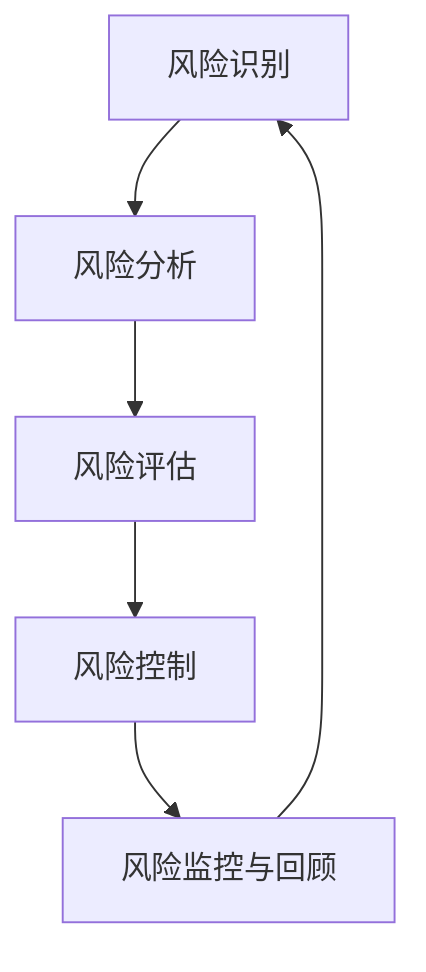

                 

### 文章标题

# 《创业公司的用户隐私保护与数据伦理》

### 关键词

- 用户隐私保护
- 数据伦理
- 创业公司
- 法律法规
- 技术实践

### 摘要

随着互联网技术的迅猛发展，用户隐私保护与数据伦理已成为创业公司面临的重要议题。本文旨在深入探讨创业公司在用户隐私保护与数据伦理方面的挑战与解决方案，包括法律框架、核心策略、实践案例及未来趋势。通过系统化的分析与讨论，本文希望能够为创业公司在这一领域的可持续发展提供有价值的参考。

### 目录大纲

#### 第一部分：背景与基础

**第1章：用户隐私保护与数据伦理概述**

- **1.1.1 创业公司的用户隐私保护挑战**
- **1.1.2 数据伦理的重要性与原则**
- **1.1.3 相关法律法规和行业规范**

**第2章：用户隐私保护法律框架**

- **2.1.1 全球隐私保护法律概述**
- **2.1.2 中国隐私保护法律框架**
- **2.1.3 主要隐私保护法律条文解析**

**第3章：用户数据伦理**

- **3.1.1 数据伦理的定义与核心概念**
- **3.1.2 数据伦理与用户权利**
- **3.1.3 数据伦理与商业实践**

#### 第二部分：用户隐私保护策略

**第4章：用户隐私风险评估**

- **4.1.1 风险评估框架与工具**
- **4.1.2 数据分类与敏感度评估**
- **4.1.3 风险评估案例分析**

**第5章：数据收集与处理**

- **5.1.1 合理的数据收集原则**
- **5.1.2 数据处理过程中的隐私保护措施**
- **5.1.3 数据处理流程的合规性审查**

**第6章：用户权限与控制**

- **6.1.1 用户权限管理体系**
- **6.1.2 用户隐私权行使方式**
- **6.1.3 用户隐私设置与实践**

#### 第三部分：数据伦理实践

**第7章：创业公司数据伦理文化建设**

- **7.1.1 数据伦理文化的内涵与作用**
- **7.1.2 建立数据伦理委员会**
- **7.1.3 数据伦理教育与培训**

**第8章：案例研究与经验分享**

- **8.1.1 国内外创业公司数据伦理案例解析**
- **8.1.2 数据伦理实践中的挑战与解决策略**
- **8.1.3 成功数据伦理实践的启示**

**第9章：展望与未来趋势**

- **9.1.1 用户隐私保护与数据伦理发展趋势**
- **9.1.2 技术创新对数据伦理的影响**
- **9.1.3 创业公司在数据伦理领域的未来角色**

#### 附录

**附录A：数据伦理与隐私保护相关资源**

- **A.1.1 国际组织与报告**
- **A.1.2 行业协会与标准**
- **A.1.3 相关法律法规和政策**

**附录B：常见的数据伦理与隐私保护问题及解决方案**

- **B.1.1 个人信息收集与使用**
- **B.1.2 数据跨境传输**
- **B.1.3 用户画像与精准营销**

### 引言

在当前数字化时代，用户隐私保护和数据伦理已经成为创业公司可持续发展的重要基石。创业公司在追求业务增长的同时，不可避免地面临用户数据的大量收集和处理，这既为业务创新提供了丰富资源，也带来了诸多隐私保护和伦理挑战。用户隐私保护和数据伦理不仅关乎公司声誉和商业利益，更涉及到用户的信任和权益。因此，如何有效地实施用户隐私保护和数据伦理实践，已成为创业公司必须严肃对待的重要课题。

本文旨在通过系统化的分析和讨论，为创业公司在用户隐私保护与数据伦理领域提供全面的指导。文章结构分为三个主要部分：第一部分介绍用户隐私保护与数据伦理的背景和基础，包括相关法律框架和核心概念；第二部分详细阐述用户隐私保护策略，包括风险评估、数据收集与处理、用户权限与控制等方面的具体实践；第三部分则探讨数据伦理实践的建设与案例分析，以及展望未来趋势。通过这些内容的深入分析，本文希望能够为创业公司在这一领域提供切实可行的解决方案，促进其可持续发展。

### 第一部分：背景与基础

#### 第1章：用户隐私保护与数据伦理概述

##### 1.1.1 创业公司的用户隐私保护挑战

随着互联网技术的快速发展，创业公司在用户隐私保护方面面临着前所未有的挑战。首先，创业公司往往需要大量收集用户数据以支持业务创新和决策，这包括用户的个人信息、行为数据、位置数据等。然而，这些数据的收集和处理过程可能会侵犯用户的隐私权，导致数据泄露、滥用等风险。其次，创业公司普遍缺乏成熟的隐私保护机制和经验，导致隐私保护措施不到位，从而增加了数据泄露的风险。此外，创业公司在市场竞争中往往需要快速推出产品和服务，可能忽视了隐私保护的重要性，导致产品设计和管理上存在漏洞。

**案例分析：** 以知名共享出行平台为例，该公司在初期快速发展过程中，大量收集了用户的位置、行为等敏感数据，但由于缺乏有效的隐私保护措施，导致这些数据多次发生泄露事件，严重损害了用户的信任和公司的声誉。

##### 1.1.2 数据伦理的重要性与原则

数据伦理是指企业在数据收集、处理和使用过程中，遵循的道德规范和价值观。数据伦理的重要性在于它不仅关乎企业的社会责任，更直接影响到企业的声誉和可持续发展。首先，数据伦理能够帮助企业在复杂的商业环境中保持道德底线，避免因数据滥用而引发的公关危机和法律纠纷。其次，数据伦理能够增强用户对企业的信任，提升用户满意度和忠诚度。此外，数据伦理也是企业社会责任的重要组成部分，有助于树立良好的企业形象。

数据伦理的核心原则包括：

- **尊重用户权利**：企业在收集和使用用户数据时，应当尊重用户的隐私权和个人信息保护权利，不得滥用或泄露用户数据。
- **公正透明**：企业在数据处理过程中应当公开透明，确保用户了解其数据的用途、处理方式和权利。
- **数据最小化**：企业在收集用户数据时，应当遵循数据最小化原则，仅收集必要的个人信息，减少不必要的敏感数据收集。
- **安全可靠**：企业应当采取有效措施，确保用户数据的安全性和可靠性，防止数据泄露、篡改和滥用。

##### 1.1.3 相关法律法规和行业规范

在全球范围内，用户隐私保护和数据伦理已成为法律法规和行业规范的重要领域。以下是一些重要的法律法规和行业规范：

- **全球隐私保护法律概述**：包括《欧盟通用数据保护条例》（GDPR）、《加州消费者隐私法案》（CCPA）等。这些法律为用户隐私保护提供了全面的法律框架，规定了企业的数据收集、处理和存储的责任和义务。
- **中国隐私保护法律框架**：包括《中华人民共和国网络安全法》、《中华人民共和国个人信息保护法》等。这些法律为中国企业的用户隐私保护提供了法律依据，明确了企业在数据收集、处理和使用过程中的合规要求。
- **行业规范**：包括《信息安全技术个人信息安全规范》、《互联网隐私政策指南》等。这些行业规范为企业提供了具体的操作指南，帮助企业在实践中更好地保护用户隐私和数据伦理。

**案例分析：** 某知名电商公司在应对用户隐私保护和数据伦理方面的挑战时，积极落实相关法律法规和行业规范，建立了完善的隐私保护制度，包括用户数据收集和处理的合规审查、数据安全措施、用户隐私权保障等。这一举措不仅提升了公司的合规性，也增强了用户对公司的信任。

通过以上分析，可以看出用户隐私保护和数据伦理对创业公司具有重要意义。创业公司需要充分认识到这一领域的挑战，积极采取有效措施，确保用户隐私和数据安全，树立良好的企业形象，为可持续发展奠定坚实基础。

#### 第2章：用户隐私保护法律框架

##### 2.1.1 全球隐私保护法律概述

全球范围内，用户隐私保护法律体系逐渐完善，多个国家和地区制定了具有代表性的隐私保护法律。以下是几个重要的全球隐私保护法律：

- **欧盟通用数据保护条例（GDPR）**：GDPR是欧盟于2018年5月25日正式实施的隐私保护法律，被认为是全球最严格的隐私保护法律之一。GDPR涵盖了数据控制者和处理者的责任，规定了用户的数据权利（如访问、删除和限制处理等）以及数据处理的合法性原则（如合法性、公正性和透明性等）。

- **加州消费者隐私法案（CCPA）**：CCPA是2018年6月通过的美国加州法律，旨在保护加州居民的个人隐私权。CCPA规定了企业在收集、使用、存储和共享消费者数据时的责任，包括通知消费者关于数据收集的透明度和消费者的权利（如知情权、删除权和拒绝销售权等）。

- **韩国个人信息保护法（KIPA）**：KIPA是韩国于2019年生效的隐私保护法律，其规定与GDPR类似，强调个人信息的收集、处理和利用的透明度，以及对个人信息的保护。

- **巴西通用数据保护法（LGPD）**：LGPD是巴西于2020年生效的隐私保护法律，其规定涵盖了数据处理者的义务和责任，包括数据保护影响评估（DPIA）、数据主体的权利等。

这些全球隐私保护法律在法律框架、执行力度和用户权利保护方面各有特点，但共同的目标是保护用户隐私和数据安全。创业公司需要关注这些法律，特别是那些在全球范围内运营的公司，以确保其业务符合相关法律规定。

##### 2.1.2 中国隐私保护法律框架

中国在用户隐私保护方面也建立了较为完整的法律框架，主要包括以下法律和法规：

- **网络安全法**：网络安全法是中国于2017年正式实施的，旨在加强网络安全保护，规范网络运营者的行为。其中，第四章“网络信息安全”规定了网络运营者收集、使用个人信息的要求，如明确收集、使用的目的、方式和范围，采取技术和管理措施保护个人信息安全等。

- **个人信息保护法（PIPL）**：个人信息保护法于2021年生效，是中国首部全面规范个人信息保护的专门法律。PIPL明确了个人信息处理的原则（如合法、正当、必要和诚信原则）、个人信息主体的权利（如知情权、决定权、查阅权和删除权等），以及个人信息处理者的义务（如合法处理、安全保护、告知义务等）。

- **数据安全法**：数据安全法于2021年生效，旨在加强数据安全保护，规范数据处理活动。该法明确了数据处理者的安全责任，包括建立健全数据安全管理体系、开展数据安全风险评估、采取必要的安全保护措施等。

中国的隐私保护法律框架为创业公司提供了明确的法律依据和操作指南，有助于其在业务运营中更好地保护用户隐私和数据安全。

##### 2.1.3 主要隐私保护法律条文解析

以下是对几个重要隐私保护法律条文的具体解析：

- **GDPR关键条文**：

  - **第5条**：数据处理者必须确保个人数据的合法性、公正性和透明性，数据收集的目的、范围和方式应当明确，并采取适当的技术和组织措施保护个人数据。
  - **第17条**：数据主体有权要求数据处理者删除其个人数据，数据处理者应当在规定时间内响应。
  - **第25条**：数据处理者在设计、开发和实施信息系统时，应当采用数据保护设计方法和默认设置保护个人数据。

- **CCPA关键条文**：

  - **第1798.100(a)**：企业应当在隐私政策中明确收集的个人信息类型、用途、共享方式，并告知消费者其权利。
  - **第1798.105(c)**：消费者有权要求企业停止出售其个人信息，企业应当在合理时间内响应。
  - **第1798.140(a)**：企业在处理消费者个人信息时，应当采取合理措施保护其安全，防止数据泄露。

- **PIPL关键条文**：

  - **第23条**：个人信息处理者应当制定个人信息保护合规计划，开展个人信息安全影响评估。
  - **第44条**：个人信息主体有权要求个人信息处理者提供关于其个人信息处理活动的信息，包括收集、使用、存储和共享的情况。
  - **第48条**：个人信息处理者违反个人信息保护法的规定，应当承担相应的法律责任，包括行政处罚、赔偿损失等。

- **KIPA关键条文**：

  - **第17条**：个人信息处理者应当制定个人信息保护政策，公开个人信息处理的目的、范围和方式。
  - **第28条**：个人信息处理者应当采取适当措施，确保个人信息的安全和保护，防止泄露、篡改和丢失。
  - **第34条**：个人信息主体有权要求个人信息处理者停止处理其个人信息，个人信息处理者应当在合理时间内响应。

通过对以上隐私保护法律条文的解析，可以看出不同国家和地区的隐私保护法律在具体规定和实施方式上存在差异，但共同的目标是保护用户隐私和数据安全。创业公司需要根据其业务运营所在地的法律框架，合规地进行数据收集、处理和存储，确保用户隐私得到有效保护。

#### 第3章：用户数据伦理

##### 3.1.1 数据伦理的定义与核心概念

数据伦理是指企业在数据收集、处理、存储和使用过程中，遵循的道德原则和价值观。它涉及企业在数据管理和利用过程中如何平衡商业利益与用户权益、社会责任和环境友好等多方面因素。数据伦理的核心概念包括以下几个方面：

- **用户权利**：用户作为数据主体，享有对自身数据的知情权、决定权和控制权。企业应当尊重用户的隐私权和个人信息保护权利，不得滥用或泄露用户数据。

- **数据透明度**：企业应当在数据收集、处理和使用的各个环节中保持透明度，确保用户了解其数据的用途、处理方式和权利。

- **数据最小化**：企业在收集用户数据时，应当遵循数据最小化原则，仅收集必要的个人信息，减少不必要的敏感数据收集。

- **数据安全**：企业应当采取有效的数据安全措施，确保用户数据的安全性和可靠性，防止数据泄露、篡改和滥用。

- **社会责任**：企业应当承担社会责任，在数据管理和利用过程中考虑社会和环境的影响，促进可持续发展。

##### 3.1.2 数据伦理与用户权利

数据伦理的核心在于保护用户权利，确保用户在数据收集、处理和使用过程中的知情权和控制权。以下详细阐述用户权利和数据伦理之间的联系：

- **知情权**：用户有权了解其数据将被如何收集、处理、使用和共享。企业应当在数据收集前向用户明确告知数据收集的目的、范围、方式及其可能带来的影响。知情权是用户做出合理选择和决定的基础。

- **决定权**：用户有权决定其数据是否被收集、如何被使用和共享。企业应当尊重用户的决定权，提供便捷的隐私设置和权限管理工具，使用户能够自主管理其数据。

- **访问权**：用户有权访问其被收集和处理的个人信息，了解其数据的具体内容和处理情况。企业应当提供用户访问其个人数据的途径和机制，确保用户能够及时、完整地获取其数据。

- **删除权**：用户有权要求企业删除其个人信息，特别是在数据不再需要或用户撤回同意的情况下。企业应当及时响应用户的删除请求，并确保删除操作的彻底性，避免数据泄露和滥用。

- **反对权**：用户有权反对企业对其实施某些数据处理活动，如反对基于数据进行的个性化推荐或广告投放。企业应当尊重用户的反对权，合理处理用户提出的反对请求。

数据伦理与用户权利之间的紧密联系，要求企业在设计、开发和运营过程中，始终将用户权益放在首位，确保用户在数据生态中的主导地位。以下是一个实际案例：

**案例：** 一家在线社交平台在用户数据收集和使用的伦理实践方面，严格遵守用户权利保护原则。该平台在用户注册时，明确告知用户数据收集的目的、范围和方式，并提供详细的隐私政策供用户查阅。用户可以随时访问和修改自己的个人信息，并可要求删除其数据。此外，平台还设置了隐私设置选项，允许用户自主管理隐私权限，如控制谁可以看到其发布的内容。这一系列措施不仅提高了用户的知情权和控制权，也增强了用户对平台的信任。

##### 3.1.3 数据伦理与商业实践

数据伦理不仅关乎用户权利保护，也涉及到企业在商业实践中的道德责任和可持续发展。以下从几个方面探讨数据伦理与商业实践之间的联系：

- **商业道德**：企业在数据收集和处理过程中，应当遵循商业道德原则，避免利用用户数据进行不当的商业行为。例如，不得通过欺骗、误导手段收集用户数据，不得滥用用户数据牟取私利。

- **社会责任**：企业在利用数据促进商业发展的同时，应当承担社会责任，关注数据对社会和环境的影响。例如，在个性化推荐算法中，企业应当确保推荐内容的公正性和多样性，避免因数据偏差导致的社会问题。

- **可持续创新**：数据伦理是企业实现可持续创新的重要基础。通过尊重用户权益和遵守数据伦理原则，企业可以建立长期的用户信任，推动产品和服务的持续改进。例如，在医疗领域，企业可以基于患者数据开发创新的治疗方案，但必须确保患者的隐私和数据安全。

- **合规性**：数据伦理与商业实践密切相关，企业必须确保其业务活动符合相关法律法规和行业规范。合规性不仅是企业应对法律风险的重要保障，也是企业建立信任和赢得市场的重要基础。

**案例分析：** 一家提供个性化健身服务的创业公司，在数据伦理方面表现出色。该公司在用户数据收集和利用过程中，严格遵循数据最小化和透明度原则，仅收集用户必要的健身数据，并通过详细的隐私政策告知用户数据的用途和处理方式。用户可以随时访问、修改和删除其数据，公司还提供了隐私设置选项，使用户能够自主管理隐私权限。此外，公司注重数据安全，采取加密和访问控制等安全措施，确保用户数据不被泄露和滥用。这些措施不仅赢得了用户的信任，也为公司带来了良好的市场口碑和长期发展。

通过以上案例分析，可以看出数据伦理在商业实践中的重要性。创业公司应当认识到数据伦理不仅是法律责任，更是商业道德和社会责任的体现。只有在遵循数据伦理原则的基础上，企业才能实现可持续发展，赢得用户的信任和支持。

#### 第4章：用户隐私风险评估

##### 4.1.1 风险评估框架与工具

用户隐私风险评估是创业公司在数据管理和保护过程中至关重要的一环。通过系统化的风险评估，企业可以识别潜在的风险点，制定相应的防范措施，降低数据泄露和滥用的风险。以下是一个典型的用户隐私风险评估框架及其组成部分：

**1. 风险识别**：首先，企业需要识别与用户隐私保护相关的潜在风险。这包括数据收集、存储、处理、传输和使用等各个环节。常见风险类型包括数据泄露、数据滥用、系统漏洞、内部威胁等。

**2. 风险分析**：在识别出潜在风险后，企业需要对风险进行详细分析，评估其发生的可能性（概率）和影响程度（后果）。评估工具包括风险矩阵、故障模式与影响分析（FMEA）等。

**3. 风险评估**：基于风险分析的结果，企业需要对风险进行优先级排序，识别出高风险领域，并制定相应的应对策略。

**4. 风险控制**：针对识别出的风险，企业需要采取有效的控制措施，包括技术控制（如数据加密、访问控制等）、管理控制（如隐私政策制定、员工培训等）和物理控制（如数据备份、安全设施等）。

**5. 风险监控与回顾**：风险评估是一个动态过程，企业需要定期监控风险变化，及时调整风险控制措施，确保风险评估的持续有效性。

以下是一个简化的风险评估流程图，用于说明各步骤之间的关系：

##### 4.1.2 数据分类与敏感度评估

在用户隐私风险评估过程中，数据分类和敏感度评估是关键步骤。数据分类有助于企业明确不同类型数据的重要性和保护要求，而敏感度评估则用于识别哪些数据可能对用户隐私产生较大风险。

**数据分类**：一般而言，企业可以根据数据的敏感程度和重要性将其分为以下几类：

- **公开数据**：对用户隐私影响较小的数据，如公开联系方式、兴趣爱好等。
- **普通数据**：对用户隐私有一定影响的数据，如用户注册信息、交易记录等。
- **敏感数据**：对用户隐私有较大影响的数据，如个人身份信息、医疗信息、财务信息等。
- **非常敏感数据**：对用户隐私有极高风险的数据，如生物特征信息、敏感位置信息等。

**敏感度评估**：企业需要对各类数据进行敏感度评估，以确定其保护要求。以下是一些常用的敏感度评估方法：

- **基于法律法规的评估**：根据相关法律法规的要求，明确各类数据的保护要求和合规性。
- **基于业务影响的评估**：分析数据泄露可能对业务运营、用户权益和社会声誉带来的影响。
- **基于风险概率的评估**：评估数据泄露的发生概率，结合业务需求确定数据保护的优先级。

**案例分析**：一家电子商务平台在数据分类和敏感度评估方面进行了详细的实践。首先，该平台将用户数据分为公开数据、普通数据、敏感数据和非常敏感数据四类。然后，对每类数据进行敏感度评估，发现用户身份信息、财务信息和医疗信息属于敏感数据，而位置信息和偏好信息属于普通数据。基于此，平台制定了相应的保护措施，如对敏感数据实施加密存储、访问控制等，而对普通数据则采取基础的安全防护措施。

通过数据分类和敏感度评估，企业可以更加精准地识别和管理数据风险，确保用户隐私得到有效保护。

##### 4.1.3 风险评估案例分析

以下通过一个实际案例，详细分析一家创业公司在用户隐私风险评估方面的实践。

**案例背景**：某初创公司开发了一款社交媒体应用，旨在为用户提供即时通讯和社交互动功能。由于应用需要大量收集用户数据，公司意识到用户隐私保护至关重要，因此决定进行系统化的风险评估。

**风险识别**：公司首先识别出以下潜在风险：

- 数据泄露：用户数据在传输和存储过程中可能被未授权的第三方访问。
- 数据滥用：内部员工可能滥用用户数据，进行不当的商业行为。
- 系统漏洞：应用中的漏洞可能被黑客利用，导致数据泄露。
- 内部威胁：员工因疏忽或恶意行为可能导致数据泄露。

**风险分析**：公司对每个风险进行了详细分析，评估其发生的可能性和影响程度。例如，对于数据泄露风险，公司评估其发生的概率较高，影响程度严重，可能导致用户隐私泄露和公司声誉受损。

**风险评估**：基于风险分析结果，公司确定了以下高风险领域：

- 用户身份信息：包括用户名、密码、电子邮件等。
- 财务信息：包括支付信息、交易记录等。
- 医疗信息：如果应用包含健康功能，用户可能提交敏感医疗信息。

**风险控制**：公司采取以下控制措施：

- 数据加密：对用户敏感数据进行加密存储和传输。
- 访问控制：限制对用户数据的访问权限，仅允许必要的员工访问。
- 定期审计：定期对系统进行安全审计，识别和修复潜在漏洞。
- 员工培训：对员工进行隐私保护培训，提高其安全意识。

**风险监控与回顾**：公司建立了持续的风险监控机制，定期评估风险变化和措施的有效性，确保风险评估的动态调整。

通过以上案例分析，可以看出系统化的用户隐私风险评估对于创业公司至关重要。通过识别、分析、评估和控制风险，公司可以有效保护用户隐私，降低数据泄露和滥用的风险，从而确保业务的可持续发展。

#### 第5章：数据收集与处理

##### 5.1.1 合理的数据收集原则

在创业公司进行数据收集时，遵循合理的原则至关重要，这不仅能确保数据的有效性，还能最大限度地保护用户的隐私权。以下是一些关键原则：

**合法性原则**：创业公司在收集用户数据时，必须确保数据收集的合法性。这包括：

- **明确目的**：在数据收集前，明确说明数据收集的目的，并确保目的的合法性和正当性。
- **用户同意**：在收集用户数据前，必须获得用户的明确同意，告知用户数据的收集范围、用途和可能的共享方式。
- **透明度**：数据收集和处理过程应保持透明，用户应能够轻松了解其数据的使用情况。

**最小化原则**：数据收集的最小化原则要求创业公司仅收集实现业务目标所必需的数据，避免过度收集。这包括：

- **必要数据**：只收集实现业务目标所必需的数据，如用户名、电子邮件地址、电话号码等。
- **减少冗余**：避免重复收集已经存在的数据，减少数据冗余，降低数据管理的复杂性和风险。

**安全性原则**：在数据收集和传输过程中，创业公司必须采取有效的安全措施，确保数据的安全性。这包括：

- **数据加密**：对敏感数据进行加密存储和传输，防止数据在传输过程中被截获。
- **访问控制**：限制对数据的访问权限，确保只有授权人员才能访问和处理敏感数据。
- **备份和恢复**：定期进行数据备份，并确保数据备份的安全性，以防止数据丢失。

**合规性原则**：创业公司应确保其数据收集和处理活动符合相关法律法规和行业规范。这包括：

- **隐私政策**：制定明确的隐私政策，并向用户公开，确保用户了解其数据的处理方式和权利。
- **合规审查**：定期进行合规性审查，确保数据收集和处理活动符合法律法规的要求。

##### 5.1.2 数据处理过程中的隐私保护措施

在数据处理过程中，创业公司需要采取一系列隐私保护措施，以确保用户数据的安全性和隐私性。以下是一些关键措施：

**数据加密**：对于敏感数据，如用户身份信息、财务信息和医疗信息，应在数据存储和传输过程中进行加密。常用的加密技术包括：

- **对称加密**：使用相同的密钥进行加密和解密，如AES（高级加密标准）。
- **非对称加密**：使用公钥和私钥进行加密和解密，如RSA（Rivest-Shamir-Adleman）加密算法。

**访问控制**：通过设置严格的访问控制策略，限制对敏感数据的访问权限。以下是一些访问控制措施：

- **身份验证**：确保只有经过授权的人员才能访问敏感数据。
- **角色权限**：根据员工的角色和职责分配不同的访问权限，最小化不必要的访问。
- **审计日志**：记录所有对数据的访问和操作，以便在需要时进行追踪和审计。

**匿名化处理**：对于非敏感数据，可以采用匿名化处理技术，如去标识化、伪匿名化等，以降低数据泄露的风险。匿名化处理后的数据无法直接识别特定用户，但仍可用于分析和改进产品。

**数据备份和恢复**：定期进行数据备份，并确保备份数据的安全性。在数据备份的基础上，建立有效的数据恢复机制，以防止数据丢失和损坏。

**隐私政策执行**：确保隐私政策得到有效执行，包括：

- **隐私培训**：定期对员工进行隐私保护培训，提高其隐私保护意识和技能。
- **隐私审计**：定期对数据收集和处理活动进行审计，确保合规性。

**用户知情权和控制权**：确保用户对其数据的知情权和控制权，包括：

- **用户访问**：提供用户访问其个人数据的途径，使用户能够查看、修改和删除其数据。
- **用户同意**：在数据收集和使用过程中，持续获得用户的同意，并允许用户撤回同意。
- **用户通知**：在数据泄露或其他隐私风险事件发生时，及时通知用户，并提供相应的补救措施。

通过上述措施，创业公司可以在数据处理过程中有效地保护用户隐私，降低数据泄露和滥用的风险。

##### 5.1.3 数据处理流程的合规性审查

在数据处理流程中，确保合规性是创业公司必须重视的关键环节。以下是一个典型的数据处理流程及其合规性审查步骤：

**数据处理流程概述**：

1. **数据收集**：通过用户注册、用户操作记录等方式收集用户数据。
2. **数据存储**：将收集到的数据存储在数据库或数据仓库中。
3. **数据处理**：对存储的数据进行清洗、整合和分析，以支持业务决策和产品改进。
4. **数据共享**：在必要情况下，将数据共享给合作伙伴或第三方。
5. **数据销毁**：在数据不再需要时，对其进行安全销毁。

**合规性审查步骤**：

1. **初步审查**：在数据处理流程设计阶段，进行初步审查，确保数据处理活动符合相关法律法规和公司隐私政策的要求。

2. **隐私影响评估（PIA）**：对数据处理活动进行全面评估，识别潜在隐私风险和合规性问题。PIA包括：

   - **数据收集**：评估数据收集的合法性、透明度和必要性。
   - **数据处理**：评估数据处理过程中的隐私保护措施，如数据加密、访问控制和数据备份等。
   - **数据存储**：评估数据存储的安全性，包括存储设施和备份策略。
   - **数据共享**：评估数据共享的合规性，包括共享范围和目的。

3. **审查记录**：建立详细的审查记录，记录审查过程、发现的问题和采取的整改措施。审查记录应包括：

   - **审查人员**：进行审查的人员和日期。
   - **审查内容**：审查的具体内容和发现的问题。
   - **整改措施**：针对发现的问题，采取的具体整改措施。

4. **定期审查**：定期对数据处理流程进行审查，确保其持续合规。审查频率应根据业务规模、数据敏感度和风险水平等因素进行调整。

5. **用户知情权和控制权保障**：确保用户能够在数据处理过程中行使知情权和控制权，包括：

   - **隐私政策**：向用户公开隐私政策，明确数据收集、处理和使用的目的、方式和权利。
   - **用户访问权**：提供用户访问其个人数据的途径，确保用户可以查看、修改和删除其数据。
   - **用户通知**：在发生数据泄露或其他隐私风险事件时，及时通知用户，并提供相应的补救措施。

通过上述合规性审查步骤，创业公司可以确保其数据处理流程的合法性和合规性，降低隐私风险，增强用户信任。

#### 第6章：用户权限与控制

##### 6.1.1 用户权限管理体系

用户权限管理体系是确保用户隐私和数据安全的重要手段。通过建立完善的权限管理体系，创业公司可以有效地控制用户数据的访问和使用，降低数据泄露和滥用的风险。以下是构建用户权限管理体系的几个关键步骤：

**1. 权限定义与分配**：首先，公司需要明确各个角色和岗位的权限需求，定义相应的权限级别。例如，系统管理员拥有最高权限，可以访问所有用户数据；普通员工则只能访问与其工作职责相关的数据。权限分配应遵循最小权限原则，确保用户仅拥有完成工作任务所必需的权限。

**2. 权限控制策略**：公司需要制定明确的权限控制策略，包括权限申请、审批、变更和撤销流程。权限申请应通过正式的流程进行，经过审批后才能生效。在权限变更和撤销时，也需要进行相应的审批和记录，确保权限变更的透明性和可追溯性。

**3. 权限审计与监控**：建立权限审计和监控机制，定期审查权限分配和使用情况，及时发现和纠正权限管理中的问题。权限审计应包括对权限变更记录的审查、对用户访问行为的监控等，确保权限管理的合规性和有效性。

**4. 权限培训与教育**：定期对员工进行权限管理培训，提高其权限管理意识和技能。培训内容应包括权限管理的原则、流程和注意事项等，确保员工能够正确理解和执行权限管理要求。

**5. 权限文档与记录**：建立权限管理文档，详细记录权限定义、分配、变更和撤销等信息。权限文档应包括权限策略、流程图、审批记录等，以便在需要时进行查阅和追溯。

##### 6.1.2 用户隐私权行使方式

用户隐私权是指用户对其个人信息的控制权，包括数据的访问、修改、删除和撤回同意等权利。以下是用户行使隐私权的一些常见方式和要求：

**1. 数据访问**：用户有权访问其被收集和处理的个人信息，了解其数据的具体内容和处理情况。创业公司应提供便捷的用户访问途径，如用户个人中心、数据查询接口等。在用户访问其数据时，公司应确保数据的准确性和完整性，不得隐瞒或篡改数据。

**2. 数据修改**：用户有权要求公司修改其不准确或过时的个人信息。公司应在合理时间内响应用户的修改请求，确保数据更新及时、准确。

**3. 数据删除**：用户有权要求公司删除其个人信息，特别是在数据不再需要或用户撤回同意的情况下。公司应建立明确的删除流程，确保删除操作的彻底性，避免数据泄露和滥用。

**4. 撤回同意**：用户有权撤回其之前给予的数据收集和处理同意。在用户撤回同意后，公司应停止相应数据处理活动，并确保已收集的数据不再被使用。

为了保障用户隐私权的行使，创业公司应：

- **明确用户隐私权**：在隐私政策中详细说明用户的隐私权内容和行使方式，确保用户了解其权利。
- **提供便捷的行使途径**：设计用户友好的界面和流程，使用户能够轻松行使隐私权。
- **及时响应用户请求**：建立高效的隐私权处理机制，确保用户请求得到及时响应和解决。
- **记录和报告**：记录用户的隐私权行使情况，并在必要时向相关监管部门报告。

##### 6.1.3 用户隐私设置与实践

为了更好地保护用户隐私，创业公司应在产品设计中提供丰富的隐私设置选项，使用户能够根据个人需求和偏好自主管理其隐私。以下是一些常见的用户隐私设置和实践：

**1. 隐私设置界面**：创业公司应在产品中设置清晰的隐私设置界面，使用户能够方便地查看和调整隐私选项。隐私设置界面应包括：

- **数据访问控制**：允许用户设置谁可以查看其个人信息。
- **数据共享选项**：允许用户选择是否将个人信息共享给第三方。
- **通知权限**：允许用户设置接收通知的类型和频率。

**2. 隐私保护模式**：创业公司可以提供隐私保护模式，如“隐私增强型模式”、“严格隐私模式”等，使用户能够根据需要选择不同的隐私保护等级。

**3. 隐私设置说明**：在隐私设置界面中，应提供详细的设置说明和帮助指南，使用户能够理解各项隐私设置的作用和影响。

**4. 默认隐私设置**：创业公司应设置合理的默认隐私设置，确保用户在初次使用产品时，其隐私权得到基本保护。

**5. 定期隐私评估**：创业公司应定期对隐私设置进行评估，确保其符合最新的隐私保护要求和用户需求。

**6. 用户隐私教育**：创业公司应通过教育宣传，提高用户对隐私设置的了解和重视，鼓励用户主动管理和保护其隐私。

通过提供丰富的隐私设置选项和实施有效的隐私保护措施，创业公司可以更好地保护用户的隐私权，增强用户信任，促进产品的可持续发展。

### 第三部分：数据伦理实践

#### 第7章：创业公司数据伦理文化建设

##### 7.1.1 数据伦理文化的内涵与作用

数据伦理文化是指在创业公司内部形成的关于数据伦理的共识和价值观，通过企业文化、规章制度和员工行为规范等方面表现出来。数据伦理文化的内涵包括以下几个方面：

- **诚信原则**：诚信是数据伦理文化的核心，要求员工在数据收集、处理和使用过程中保持诚实、透明和诚信。
- **用户权利尊重**：数据伦理文化强调尊重用户的隐私权和数据权利，确保用户数据不被滥用或泄露。
- **责任意识**：员工应当认识到数据伦理是个人和企业的责任，在数据管理和使用过程中承担相应的责任。
- **合规要求**：数据伦理文化要求员工遵守相关法律法规和公司规章制度，确保数据管理活动的合法性和合规性。

数据伦理文化在创业公司中具有重要作用：

- **增强员工道德素养**：通过数据伦理文化的建设，提高员工的道德素养，使其在数据管理和使用过程中能够自觉遵守道德规范。
- **提升企业竞争力**：数据伦理文化有助于树立企业的社会责任形象，增强用户信任，提升企业的市场竞争力。
- **降低法律风险**：良好的数据伦理文化有助于企业避免因数据泄露、滥用等引发的公关危机和法律纠纷。
- **促进可持续发展**：数据伦理文化是企业实现长期可持续发展的重要基础，有助于企业在数据管理和利用中实现商业目标和社会责任的双赢。

##### 7.1.2 建立数据伦理委员会

为了在创业公司内部建立数据伦理文化，可以设立数据伦理委员会，负责指导和监督公司数据伦理相关的工作。以下是建立数据伦理委员会的几个关键步骤：

**1. 委员会构成**：数据伦理委员会应由公司高层管理人员、技术专家、法律顾问和员工代表等组成，确保委员会的代表性和专业性。

**2. 委员会职责**：数据伦理委员会的主要职责包括：

- **制定数据伦理政策**：制定公司的数据伦理政策和规章制度，确保公司在数据管理和使用过程中遵循伦理原则。
- **审批数据伦理项目**：对涉及数据伦理的重大项目进行审批，确保项目的设计、实施和运行符合数据伦理要求。
- **监督数据伦理实践**：监督公司内部的数据伦理实践，发现和纠正不符合伦理要求的行为。
- **提供数据伦理培训**：定期对员工进行数据伦理培训，提高其数据伦理意识和技能。

**3. 委员会运行机制**：数据伦理委员会应建立有效的运行机制，包括定期会议、决策流程、监督和反馈机制等。委员会会议应记录会议内容和决策结果，确保决策过程的透明和可追溯。

**4. 委员会资源保障**：为数据伦理委员会提供必要的资源支持，包括人力资源、技术和资金等，确保委员会能够有效地履行其职责。

通过建立数据伦理委员会，创业公司可以确保数据伦理工作得到有效推进，形成良好的数据伦理文化，提升公司在数据管理和利用方面的道德素养和竞争力。

##### 7.1.3 数据伦理教育与培训

数据伦理教育与培训是建立和强化数据伦理文化的重要手段，有助于提升员工的伦理意识和技能，确保公司在数据管理和使用过程中遵循道德规范。以下是数据伦理教育与培训的几个关键方面：

**1. 教育内容**：

- **数据伦理基础知识**：包括数据伦理的定义、原则、重要性以及相关法律法规等。
- **用户权利保护**：介绍用户隐私权和数据权利的相关内容，如知情权、访问权、删除权和反对权等。
- **数据管理伦理**：讲解数据收集、处理、存储和共享过程中的伦理要求，如合法性、最小化、安全性和透明度等。
- **案例分析和实践**：通过实际案例和实践活动，让员工了解数据伦理在实践中的具体应用和挑战。

**2. 教育形式**：

- **培训课程**：开展定期培训课程，包括线上和线下两种形式，使员工能够系统地学习数据伦理知识。
- **研讨会和讲座**：邀请数据伦理专家和行业领导进行讲座和研讨会，分享最新的数据伦理研究成果和实践经验。
- **案例研讨**：组织案例研讨，让员工分析实际数据伦理问题，提出解决方案。
- **角色扮演**：通过角色扮演活动，让员工体验不同角色在数据伦理问题中的决策过程，提高其实际应用能力。

**3. 培训目标**：

- **提升伦理意识**：通过培训，使员工认识到数据伦理的重要性，树立正确的数据伦理观念。
- **增强技能**：通过实际案例和实践，提高员工在数据管理和使用过程中遵循数据伦理原则的能力。
- **形成文化**：通过持续的培训和教育，将数据伦理理念融入企业文化，形成良好的数据伦理文化。

**4. 效果评估**：

- **考试和考核**：通过考试和考核，评估员工对数据伦理知识的掌握程度。
- **行为观察**：通过观察员工在日常工作中对数据伦理原则的遵守情况，评估数据伦理教育的效果。
- **用户反馈**：收集用户对公司在数据伦理方面的满意度和信任度，作为数据伦理教育效果的评价指标。

通过数据伦理教育与培训，创业公司可以提升员工的伦理素养和技能，确保公司在数据管理和使用过程中遵循道德规范，增强用户信任，促进企业的可持续发展。

### 第8章：案例研究与经验分享

#### 8.1.1 国内外创业公司数据伦理案例解析

在数据伦理领域，国内外许多创业公司通过实践积累了丰富的经验和教训。以下介绍几个具有代表性的案例，并从中提取关键经验。

**案例1：抖音的用户隐私保护实践**

抖音是一款在全球范围内广受欢迎的短视频分享应用，其在用户隐私保护方面采取了多项措施，取得了显著成效。

**案例解析**：

- **透明度**：抖音在用户注册和使用过程中，通过隐私政策详细告知用户其数据收集、处理和使用的目的，增强用户对数据处理的透明度。
- **数据加密**：抖音采用高级加密算法对用户数据进行加密存储和传输，确保数据在存储和传输过程中不被泄露。
- **隐私设置**：抖音提供丰富的隐私设置选项，用户可以自主控制其数据的可见范围和分享方式。
- **用户访问权和删除权**：抖音允许用户访问和修改其个人信息，并支持用户删除其数据。

**关键经验**：

- **透明度和用户控制权**：通过增强数据处理的透明度和用户对数据的控制权，提高用户信任度。
- **数据加密**：采取有效的数据加密措施，确保数据安全。
- **隐私设置**：提供灵活的隐私设置选项，使用户能够自主管理其隐私。

**案例2：Zoom的数据隐私问题**

Zoom是一款流行的视频会议软件，因其隐私问题受到广泛关注。

**案例解析**：

- **数据收集过度**：Zoom在用户注册和使用过程中收集了大量个人信息，包括麦克风、摄像头和麦克风权限等。
- **数据泄露**：Zoom曾多次发生数据泄露事件，导致用户隐私受到侵犯。
- **用户反馈**：用户对Zoom的隐私保护措施提出批评，要求公司加强数据保护。

**关键经验**：

- **数据收集最小化**：在数据收集过程中，应遵循数据最小化原则，仅收集必要的个人信息。
- **加强数据保护**：采取有效的数据保护措施，防止数据泄露。
- **及时响应用户反馈**：及时回应用户对隐私保护的关切，提高用户满意度。

**案例3：华为的数据治理策略**

华为是一家全球领先的科技公司，其在数据治理和隐私保护方面采取了系统化的措施。

**案例解析**：

- **数据治理框架**：华为建立了完整的数据治理框架，包括数据战略、数据政策、数据标准和数据安全管理等。
- **数据安全措施**：华为采用多重数据加密、访问控制和数据备份等措施，确保数据安全。
- **用户隐私保护**：华为通过用户隐私保护政策，明确用户数据的收集、处理和使用规范。
- **合规性审查**：华为定期进行数据合规性审查，确保其业务活动符合相关法律法规。

**关键经验**：

- **建立数据治理框架**：通过建立数据治理框架，确保数据管理的系统性和规范性。
- **数据安全措施**：采取全面的数据安全措施，防止数据泄露和滥用。
- **合规性审查**：定期进行合规性审查，确保业务活动符合法律法规要求。

通过以上案例研究，可以看出创业公司在数据伦理方面存在不同的实践和成果。关键经验包括增强数据处理的透明度和用户控制权、数据收集最小化、加强数据保护和合规性审查等。这些经验对其他创业公司具有重要的借鉴意义。

#### 8.1.2 数据伦理实践中的挑战与解决策略

在数据伦理实践中，创业公司面临诸多挑战，如数据隐私保护、数据滥用、法律法规变化等。以下分析这些挑战，并提出相应的解决策略。

**1. 数据隐私保护挑战**

挑战：随着数据收集和处理技术的进步，用户隐私保护面临更大挑战。数据泄露事件频发，用户对隐私保护的担忧日益增加。

解决策略：

- **增强数据加密**：采用更高级别的数据加密技术，确保数据在存储和传输过程中不被未授权访问。
- **透明度提升**：通过详细的隐私政策，向用户明确告知数据的收集、处理和使用方式，增强用户信任。
- **用户控制权加强**：提供便捷的隐私设置选项，使用户能够自主管理其隐私权限，提高用户的控制权。

**2. 数据滥用挑战**

挑战：数据在商业应用中具有巨大价值，但可能导致用户数据滥用。例如，数据被用于不当的广告定向、用户画像和个性化推荐等。

解决策略：

- **数据最小化**：仅收集实现业务目标所必需的数据，避免过度收集和存储。
- **合规性审查**：定期进行合规性审查，确保数据处理活动符合法律法规和公司政策要求。
- **用户知情权和同意**：在数据收集和使用前，确保用户充分知情并同意，降低数据滥用的风险。

**3. 法律法规变化挑战**

挑战：全球各地的隐私保护法律法规不断更新，如GDPR、CCPA等。创业公司需要不断适应新的法律法规要求，避免因不合规而面临法律风险。

解决策略：

- **建立合规团队**：设立专门的合规团队，负责跟踪和解读相关法律法规，确保公司及时适应法规变化。
- **定期培训和审计**：定期对员工进行数据伦理和合规培训，提高员工的法律法规意识，确保业务活动的合规性。
- **持续监控和调整**：持续监控法律法规的变化，及时调整公司的数据管理和处理流程，确保合规性。

**4. 技术创新挑战**

挑战：技术创新，如人工智能、大数据等，为数据伦理带来新挑战。例如，算法偏见可能导致数据歧视和隐私侵犯。

解决策略：

- **算法透明度和可解释性**：提高算法的透明度和可解释性，确保用户理解算法的工作原理和影响。
- **数据多样性**：确保数据的多样性和代表性，减少算法偏见。
- **伦理审核**：在算法设计和应用过程中，进行伦理审核，确保其符合道德和社会价值观。

通过应对这些挑战，创业公司可以更好地实施数据伦理实践，保护用户隐私，提升用户信任，实现可持续发展。

#### 8.1.3 成功数据伦理实践的启示

通过分析国内外创业公司在数据伦理实践中的成功案例，我们可以总结出一些关键启示，这些启示对其他创业公司具有重要的借鉴意义。

**1. 透明度和用户控制权的重要性**

成功实践表明，透明度和用户控制权是建立用户信任的关键。创业公司应通过详细的隐私政策向用户明确告知数据的收集、处理和使用方式，使用户对数据处理过程有充分的了解。同时，提供便捷的隐私设置选项，使用户能够自主管理其隐私权限，增强用户的控制权。

**2. 数据最小化和合规性审查**

在数据收集和处理过程中，遵循数据最小化原则，仅收集实现业务目标所必需的数据，减少不必要的敏感数据收集。同时，定期进行合规性审查，确保数据管理活动符合相关法律法规和公司政策要求，降低数据泄露和滥用的风险。

**3. 数据安全措施的加强**

数据安全是数据伦理实践的核心。创业公司应采取全面的数据安全措施，包括数据加密、访问控制、数据备份和恢复等，确保数据在存储和传输过程中不被泄露和篡改。通过定期安全审计和风险评估，及时发现和解决安全隐患。

**4. 用户的知情权和同意**

在数据收集和使用前，确保用户充分知情并同意，特别是对于敏感数据的处理。通过透明的沟通和用户友好的界面设计，使用户能够理解其权利和责任，增强用户对数据的控制能力。

**5. 数据伦理文化的建设**

建立数据伦理文化，将数据伦理原则融入企业文化，提升员工的伦理意识和技能。通过数据伦理培训和教育，提高员工对数据伦理的理解和遵守能力，形成良好的数据伦理氛围。

**6. 技术创新的伦理考量**

在技术创新过程中，充分考虑数据伦理问题。通过算法透明度和可解释性，确保算法的公正性和公平性，减少算法偏见和歧视。在数据治理和算法设计过程中，进行伦理审核，确保技术发展符合道德和社会价值观。

通过以上成功实践，创业公司可以更好地实施数据伦理措施，保护用户隐私，提升用户信任，实现可持续发展。

### 第9章：展望与未来趋势

随着技术的不断进步和社会的持续发展，用户隐私保护与数据伦理正面临新的挑战和机遇。以下从几个方面探讨用户隐私保护与数据伦理的未来趋势及其对创业公司的影响。

#### 9.1.1 用户隐私保护与数据伦理发展趋势

**1. 法规不断完善与趋同**

全球范围内，用户隐私保护法律体系不断完善，各国纷纷出台新的隐私保护法规，如《欧盟数字权利与数字主权法案》（DDPR）等。未来，各国隐私保护法规将继续完善和趋同，创业公司需要密切关注全球法律法规的动态，确保其业务活动符合国际标准。

**2. 数据伦理问题日益突出**

随着数据量的爆炸式增长和数据技术的不断进步，数据伦理问题日益突出。创业公司需要关注数据滥用、算法偏见、数据安全等伦理问题，确保其在数据管理和利用过程中遵循道德和社会价值观。

**3. 数据隐私保护技术发展**

数据隐私保护技术将迎来新的发展机遇。例如，联邦学习、差分隐私、区块链等技术将有望提供更高级别的数据隐私保护手段，创业公司可以积极探索这些技术，提升数据保护能力。

**4. 用户隐私需求提升**

随着用户对隐私保护的意识不断增强，用户对隐私保护的需求也在不断提升。创业公司需要更加重视用户隐私，提供更加透明、安全和可控的隐私保护措施，以赢得用户的信任和支持。

#### 9.1.2 技术创新对数据伦理的影响

**1. 人工智能与机器学习**

人工智能和机器学习技术的发展为数据伦理带来了新的挑战。例如，算法偏见可能导致不公平的决策和歧视。创业公司需要关注算法的公平性和透明性，确保其技术发展符合道德和社会价值观。

**2. 区块链**

区块链技术的去中心化和不可篡改性为数据隐私保护提供了新的思路。创业公司可以探索区块链技术在数据管理和交易中的应用，提升数据安全和隐私保护水平。

**3. 联邦学习**

联邦学习通过保持数据本地化，解决了数据隐私和安全问题，为创业公司提供了一个兼顾隐私保护与数据利用的解决方案。未来，联邦学习有望在创业公司的数据分析和决策过程中发挥重要作用。

#### 9.1.3 创业公司在数据伦理领域的未来角色

**1. 引领数据伦理创新**

创业公司通常具备创新能力和灵活的运营机制，可以在数据伦理领域发挥引领作用。通过积极探索数据隐私保护新技术和解决方案，创业公司可以为行业树立榜样，推动数据伦理实践的进步。

**2. 完善数据伦理体系**

创业公司需要不断完善数据伦理体系，包括数据伦理政策、规章制度、培训机制等。通过建立健全的数据伦理体系，创业公司可以确保其数据管理和利用过程符合道德和社会价值观。

**3. 强化用户隐私保护**

创业公司应始终将用户隐私保护作为核心任务，采取先进的数据保护技术和措施，确保用户数据的安全性和隐私性。同时，通过透明的隐私政策和便捷的隐私设置选项，增强用户对公司的信任。

**4. 推动数据伦理法规完善**

创业公司可以积极参与数据伦理法规的制定和讨论，为法规的完善提供建议和解决方案。通过推动数据伦理法规的进步，创业公司可以为企业的发展创造更加良好的法治环境。

总之，随着用户隐私保护与数据伦理问题的日益重要，创业公司在数据伦理领域的未来角色将更加关键。通过不断创新、完善体系和强化保护，创业公司可以在这个领域取得突破性进展，实现可持续发展。

### 附录

#### 附录A：数据伦理与隐私保护相关资源

**A.1.1 国际组织与报告**

- **国际隐私协会（International Association of Privacy Professionals，IAPP）**：提供全球隐私保护专业知识和资源，包括培训、认证和行业报告。
- **欧洲数据保护委员会（European Data Protection Board，EDPB）**：发布关于GDPR的指导和解释，为欧洲地区的隐私保护提供法律和技术支持。
- **美国隐私增强技术委员会（Privacy Enhancing Technology，PETs）**：研究隐私保护技术，推广隐私增强技术的研究和应用。

**A.1.2 行业协会与标准**

- **国际标准化组织（International Organization for Standardization，ISO）**：发布ISO/IEC 27001等数据安全和隐私保护标准。
- **美国国家标准与技术研究院（National Institute of Standards and Technology，NIST）**：提供数据保护和隐私保护的最佳实践指南。
- **美国计算机协会（Association for Computing Machinery，ACM）**：推动计算机科学领域的数据伦理研究和教育。

**A.1.3 相关法律法规和政策**

- **欧盟通用数据保护条例（General Data Protection Regulation，GDPR）**：欧盟的隐私保护法律框架，详细规定了用户数据保护的各项要求。
- **加州消费者隐私法案（California Consumer Privacy Act，CCPA）**：美国加州的隐私保护法律，规定了用户的数据权利和企业的数据保护责任。
- **中华人民共和国网络安全法**：中国关于网络安全和数据保护的基本法律，明确了网络安全和隐私保护的要求。
- **中华人民共和国个人信息保护法**：中国首部全面规范个人信息保护的专门法律，详细规定了个人信息处理的基本原则和用户权利。

#### 附录B：常见的数据伦理与隐私保护问题及解决方案

**B.1.1 个人信息收集与使用**

**问题**：在收集和使用个人信息时，如何平衡商业利益和用户隐私权？

**解决方案**：

- **最小化原则**：仅收集实现业务目标所必需的个人信息。
- **用户同意**：在收集个人信息前，获得用户的明确同意，并告知收集的目的、范围和方式。
- **透明度**：在隐私政策中详细说明个人信息收集、处理和使用的情况。

**B.1.2 数据跨境传输**

**问题**：如何确保跨境传输的个人信息安全？

**解决方案**：

- **合规审查**：确保跨境传输符合相关法律法规要求。
- **数据加密**：在数据传输过程中使用加密技术，防止数据泄露。
- **标准合同条款**：使用标准合同条款，确保数据接收方对数据的安全保护责任。

**B.1.3 用户画像与精准营销**

**问题**：如何确保用户画像的公正性和透明度，避免数据滥用？

**解决方案**：

- **算法透明性**：提高算法的透明度，使用户了解其画像和推荐机制。
- **数据多样化**：确保数据的多样性和代表性，减少算法偏见。
- **用户控制权**：提供用户修改和删除其画像数据的权限。

**B.1.4 数据存储与销毁**

**问题**：如何确保数据存储的安全性和数据销毁的彻底性？

**解决方案**：

- **数据加密**：对存储的敏感数据进行加密，防止未授权访问。
- **定期审计**：定期对数据存储设施进行安全审计，确保数据安全。
- **销毁协议**：制定详细的销毁协议和流程，确保数据在不再需要时能够彻底销毁。

**B.1.5 数据安全事件响应**

**问题**：如何应对数据泄露等安全事件，降低风险？

**解决方案**：

- **应急响应计划**：建立应急响应计划，确保在数据泄露事件发生时能够快速应对。
- **用户通知**：及时通知受影响用户，并提供相应的补救措施。
- **改进措施**：分析事件原因，改进数据保护措施，防止类似事件再次发生。

通过这些解决方案，创业公司可以在数据伦理和隐私保护方面采取有效的措施，降低风险，保护用户隐私，实现可持续发展。附录内容为创业公司在实际操作中提供了有益的参考和指导。

