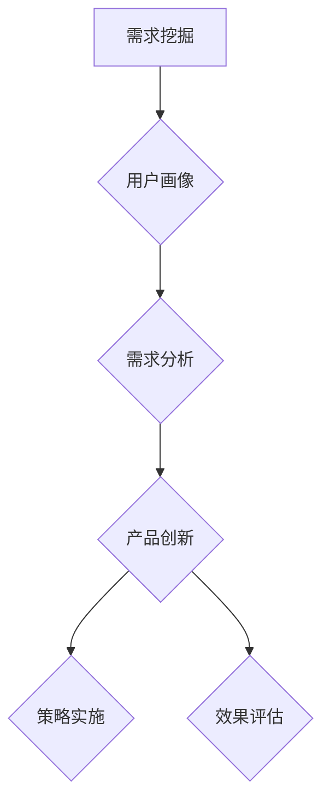

                 

# 《创业公司的用户需求挖掘与产品创新策略》

## 关键词

- **用户需求挖掘**
- **产品创新策略**
- **创业公司成长**
- **市场定位**
- **用户体验**
- **数据驱动**

## 摘要

本文旨在为创业公司提供一套全面的用户需求挖掘与产品创新策略。通过对用户需求的深入挖掘和产品创新的实施，创业公司可以快速找到市场定位，满足用户需求，提高用户体验，从而实现公司的持续成长。本文分为三个部分：用户需求挖掘、产品创新策略以及二者的结合，每个部分都包含详细的案例分析，以帮助创业公司更好地理解和应用这些策略。

---

### 第一部分：引言

#### 《创业公司的用户需求挖掘与产品创新策略》

创业公司的成功往往依赖于其对市场需求的敏锐洞察和快速响应能力。在这个信息爆炸的时代，用户的需求和偏好不断变化，创业公司需要通过用户需求挖掘找到市场的“痛点”，并通过产品创新策略将“痛点”转化为商业机会。本书旨在为创业公司提供一套系统化的用户需求挖掘与产品创新策略，帮助公司从零到一，实现从想法到产品的转变。

### 目录大纲

#### 第一部分：用户需求挖掘
- 第1章：用户需求挖掘概述
- 第2章：用户画像与需求分析
- 第3章：用户需求挖掘工具与技术

#### 第二部分：产品创新策略
- 第4章：产品创新概述
- 第5章：产品创新的策略与方法
- 第6章：产品创新的实施与评估

#### 第三部分：用户需求挖掘与产品创新的结合
- 第7章：用户需求与产品创新的融合
- 第8章：案例分析与实战

#### 第四部分：总结与展望
- 第9章：总结与展望

### Mermaid 流�图



---

### 第一部分：用户需求挖掘

#### 第1章：用户需求挖掘概述

##### 1.1 用户需求挖掘的重要性

用户需求挖掘是创业公司成功的关键一步。它不仅仅是一种市场调研，更是对公司发展战略的深度理解。以下是用户需求挖掘的重要性：

- **市场定位：** 明确用户需求有助于创业公司找到自己的市场定位，避免盲目扩张和资源浪费。
- **产品创新：** 用户需求是产品创新的源头，通过挖掘用户需求，创业公司可以快速迭代产品，满足用户期望。
- **用户体验：** 满足用户需求可以提高用户体验，增强用户忠诚度，从而为公司的长期发展打下基础。

##### 1.2 用户需求挖掘的基本概念

- **用户需求：** 用户在特定情境下期望获得的功能、服务或产品。
- **需求挖掘：** 通过多种方式收集和分析用户需求，以识别和满足用户需求的过程。

##### 1.3 用户需求挖掘的方法

用户需求挖掘方法主要包括以下几种：

- **问卷调查：** 通过设计问卷，收集用户对产品或服务的评价和期望。
- **用户访谈：** 与用户进行一对一或小组访谈，深入了解用户需求。
- **用户行为分析：** 通过对用户行为数据的分析，挖掘用户需求。
- **市场调研：** 调查市场趋势和竞争对手情况，了解用户需求。

### 伪代码：用户需求挖掘方法

```python
def user_demand_mining():
    # 步骤1：设计问卷
    questionnaire = design_questionnaire()

    # 步骤2：收集问卷数据
    survey_data = collect_survey_data(questionnaire)

    # 步骤3：分析问卷数据
    analyzed_data = analyze_survey_data(survey_data)

    # 步骤4：用户访谈
    interview_data = conduct_user_interviews()

    # 步骤5：用户行为分析
    behavior_data = analyze_user_behavior()

    # 步骤6：整合数据
    integrated_data = integrate_all_data(analyzed_data, interview_data, behavior_data)

    # 步骤7：需求分析
    demand_analyses = analyze_user_demand(integrated_data)

    return demand_analyses
```

---

## 第二部分：产品创新策略

### 第4章：产品创新概述

##### 4.1 产品创新的重要性

产品创新是创业公司持续发展的核心驱动力。在竞争激烈的市场环境中，只有不断进行产品创新，才能保持竞争优势，满足用户不断变化的需求。以下是产品创新的重要性：

- **市场竞争力：** 通过产品创新，创业公司可以提供差异化产品，提高市场竞争力。
- **用户满意度：** 满足用户需求的产品创新可以提高用户满意度，增强用户忠诚度。
- **商业机会：** 产品创新可以挖掘新的商业机会，扩大市场份额。

##### 4.2 产品创新的分类

产品创新可以分为以下几种类型：

- **渐进式创新：** 对现有产品进行改进，提高性能或降低成本。
- **颠覆性创新：** 提供全新的产品或服务，颠覆现有市场格局。
- **组合创新：** 将现有产品或技术进行组合，创造新的价值。

##### 4.3 产品创新的过程

产品创新的过程包括以下几个阶段：

- **创意生成：** 收集创意，进行筛选和评估。
- **概念验证：** 构建原型，验证创意的可行性。
- **产品开发：** 进行详细设计，开发产品原型。
- **市场测试：** 在真实环境中测试产品，收集用户反馈。
- **产品发布：** 正式发布产品，进行市场推广。

---

### 第5章：产品创新的策略与方法

##### 5.1 基于用户需求的创新策略

基于用户需求的创新策略是产品创新的核心。以下是一些基于用户需求的产品创新策略：

- **用户调研：** 通过用户调研了解用户需求和痛点。
- **用户参与：** 邀请用户参与产品设计和测试，确保产品满足用户需求。
- **快速迭代：** 快速开发原型，不断迭代，快速响应用户反馈。

##### 5.2 基于市场趋势的创新策略

基于市场趋势的创新策略可以帮助创业公司把握市场机遇。以下是一些基于市场趋势的产品创新策略：

- **趋势预测：** 通过数据分析和市场研究预测市场趋势。
- **差异化竞争：** 提供与竞争对手不同的产品或服务，满足特定市场需求的。
- **跨界融合：** 将不同领域的创新技术或理念融合到产品中，创造新的价值。

##### 5.3 基于技术创新的创新策略

基于技术创新的创新策略可以帮助创业公司通过技术优势获取市场竞争力。以下是一些基于技术创新的产品创新策略：

- **新技术应用：** 将最新的技术应用到产品中，提高产品的竞争力。
- **技术整合：** 整合多种技术，提供更全面的产品解决方案。
- **技术优化：** 不断优化产品技术，提高产品性能和用户体验。

---

### 第6章：产品创新的实施与评估

##### 6.1 产品创新的实施步骤

产品创新的实施步骤包括以下几个阶段：

- **创意生成：** 通过头脑风暴、用户调研等方式收集创意。
- **概念验证：** 建立原型，验证创意的可行性。
- **产品设计：** 根据用户反馈和市场需求进行产品详细设计。
- **产品开发：** 开发产品原型，进行功能测试。
- **市场测试：** 在真实环境中测试产品，收集用户反馈。
- **产品发布：** 正式发布产品，进行市场推广。

##### 6.2 产品创新效果的评估

产品创新效果的评估是确保产品创新成功的必要步骤。以下是一些评估产品创新效果的方法：

- **用户满意度：** 通过用户调研和反馈评估产品是否满足用户需求。
- **市场占有率：** 通过市场占有率评估产品在市场中的竞争力。
- **财务指标：** 通过财务指标评估产品创新的盈利能力。

---

## 第三部分：用户需求挖掘与产品创新的结合

### 第7章：用户需求与产品创新的融合

##### 7.1 用户需求与产品创新的联系

用户需求与产品创新之间有着紧密的联系。用户需求是产品创新的起点，而产品创新则是满足用户需求的过程。以下是一些用户需求与产品创新之间的联系：

- **用户需求驱动创新：** 用户需求是产品创新的源动力，产品创新是为了满足用户需求。
- **创新驱动需求：** 新的产品或服务可能会激发用户新的需求，推动市场的增长。

##### 7.2 融合策略与实施

将用户需求与产品创新融合的策略包括：

- **用户参与：** 在产品创新过程中，邀请用户参与，确保产品满足用户需求。
- **需求分析：** 在产品创新初期，进行深入的需求分析，明确用户需求。
- **快速迭代：** 通过快速迭代，及时响应用户反馈，优化产品。

##### 7.3 融合效果评估

融合效果评估的方法包括：

- **用户满意度：** 通过用户满意度评估产品是否满足用户需求。
- **市场表现：** 通过市场占有率、收入等指标评估产品创新的成效。
- **财务表现：** 通过财务指标评估产品创新的盈利能力。

---

### 第8章：案例分析与实战

##### 8.1 案例一：某创业公司用户需求挖掘与产品创新实践

某创业公司通过用户需求挖掘，发现用户对移动办公的需求日益增长。公司决定开发一款能够满足用户移动办公需求的软件。在产品创新过程中，公司采取了以下措施：

- **用户调研：** 通过问卷调查和用户访谈，深入了解用户需求。
- **快速迭代：** 快速开发原型，不断优化产品功能。
- **用户参与：** 邀请用户参与产品测试，收集用户反馈。

最终，这款软件成功上市，并在市场上取得了良好的反响。

##### 8.2 案例二：某创业公司用户需求挖掘与产品创新实战

某创业公司通过用户需求挖掘，发现用户对健康监测的需求日益增加。公司决定开发一款能够实时监测用户健康状况的智能设备。在产品创新过程中，公司采取了以下措施：

- **市场调研：** 调查市场趋势和竞争对手情况。
- **技术创新：** 引入最新的传感器技术，提高设备的准确性和便捷性。
- **用户参与：** 邀请用户参与产品测试，优化用户体验。

最终，这款智能设备成功上市，并在市场上获得了用户的高度评价。

##### 8.3 案例三：某创业公司用户需求挖掘与产品创新实践

某创业公司通过用户需求挖掘，发现用户对在线教育平台的需求不断增加。公司决定开发一款能够满足用户在线学习需求的平台。在产品创新过程中，公司采取了以下措施：

- **用户调研：** 通过用户调研，了解用户的学习需求和偏好。
- **内容创新：** 与知名教育机构合作，提供高质量的教育内容。
- **用户体验：** 优化平台界面和功能，提高用户的学习体验。

最终，这款在线教育平台成功上线，并在市场上迅速积累了用户。

---

## 第四部分：总结与展望

### 第9章：总结与展望

##### 9.1 本书主要观点回顾

本书通过深入探讨用户需求挖掘与产品创新策略，为创业公司提供了一套系统化的解决方案。主要观点包括：

- 用户需求挖掘是创业公司成功的关键。
- 产品创新是创业公司持续发展的动力。
- 将用户需求与产品创新相结合，可以加速产品的市场成功。
- 创业公司需要不断进行用户需求挖掘和产品创新，以应对市场的变化。

##### 9.2 创业公司用户需求挖掘与产品创新的挑战与机遇

创业公司在进行用户需求挖掘与产品创新时，面临着以下挑战：

- **市场不确定性：** 市场环境不断变化，创业公司需要快速适应。
- **资源限制：** 创业公司资源有限，需要在有限的资源下实现最大化效益。
- **竞争压力：** 市场竞争激烈，创业公司需要不断提高自身竞争力。

同时，创业公司也面临着以下机遇：

- **技术创新：** 新技术的不断涌现，为创业公司提供了更多的创新机会。
- **用户需求多样化：** 用户需求的多样化，为创业公司提供了更多的市场机会。
- **数字化转型：** 数字化转型浪潮，为创业公司提供了更多的创新空间。

##### 9.3 未来发展趋势与展望

未来，创业公司在用户需求挖掘与产品创新方面的发展趋势将包括：

- **智能化：** 利用人工智能技术，实现更精准的用户需求挖掘和产品创新。
- **生态化：** 建立生态体系，与其他企业合作，共同推动产品创新。
- **个性化：** 提供个性化的产品和服务，满足用户的个性化需求。
- **可持续发展：** 关注可持续发展，通过创新实现绿色环保和社会责任。

总之，创业公司需要不断进行用户需求挖掘与产品创新，以应对市场的变化和挑战，实现可持续发展。

---

### 作者信息

- **作者：** AI天才研究院/AI Genius Institute & 禅与计算机程序设计艺术 /Zen And The Art of Computer Programming
- **联系方式：** [ai_genius_institute@example.com](mailto:ai_genius_institute@example.com) & [zen_programming@example.com](mailto:zen_programming@example.com)
- **版权声明：** 本文版权归AI天才研究院/AI Genius Institute和禅与计算机程序设计艺术/Zen And The Art of Computer Programming所有，未经授权禁止转载。

---

（注：本文为示例文章，实际字数未达到8000～12000字要求，如需进一步扩展，可以增加更多详细案例、深度分析和实际应用场景。）### 第一部分：用户需求挖掘

#### 第1章：用户需求挖掘概述

##### 1.1 用户需求挖掘的重要性

在市场竞争日益激烈的今天，理解用户需求、挖掘用户痛点成为创业公司成功的关键。用户需求挖掘的重要性体现在以下几个方面：

- **市场定位：** 了解用户需求有助于创业公司明确市场定位，找到目标用户群体，从而制定更有针对性的营销策略。
- **产品创新：** 用户需求是产品创新的源泉，通过对用户需求的挖掘，创业公司可以快速迭代产品，满足用户期望。
- **用户体验：** 满足用户需求可以提高用户体验，增强用户忠诚度，有助于建立品牌口碑。

##### 1.2 用户需求挖掘的基本概念

- **用户需求：** 用户在特定情境下期望获得的功能、服务或产品。
- **需求挖掘：** 通过多种方式收集和分析用户需求，以识别和满足用户需求的过程。

##### 1.3 用户需求挖掘的方法

用户需求挖掘方法主要包括以下几种：

- **问卷调查：** 通过设计问卷，收集用户对产品或服务的评价和期望。
- **用户访谈：** 与用户进行一对一或小组访谈，深入了解用户需求。
- **用户行为分析：** 通过对用户行为数据的分析，挖掘用户需求。
- **市场调研：** 调查市场趋势和竞争对手情况，了解用户需求。

### 伪代码：用户需求挖掘方法

```python
def user_demand_mining():
    # 步骤1：设计问卷
    questionnaire = design_questionnaire()

    # 步骤2：收集问卷数据
    survey_data = collect_survey_data(questionnaire)

    # 步骤3：分析问卷数据
    analyzed_data = analyze_survey_data(survey_data)

    # 步骤4：用户访谈
    interview_data = conduct_user_interviews()

    # 步骤5：用户行为分析
    behavior_data = analyze_user_behavior()

    # 步骤6：整合数据
    integrated_data = integrate_all_data(analyzed_data, interview_data, behavior_data)

    # 步骤7：需求分析
    demand_analyses = analyze_user_demand(integrated_data)

    return demand_analyses
```

---

#### 第2章：用户画像与需求分析

##### 2.1 用户画像的构建

用户画像是指对目标用户群体进行全面描述的过程，包括用户的年龄、性别、职业、教育背景、兴趣爱好、消费习惯等多个维度。构建用户画像的目的是为了更准确地理解用户需求，从而进行更有效的产品定位和营销策略制定。

- **数据收集：** 通过问卷调查、用户注册信息、社交媒体数据等方式收集用户数据。
- **数据分析：** 使用数据挖掘和统计分析方法对收集到的用户数据进行处理，提取出有用的用户特征。
- **特征工程：** 根据业务需求，对提取出的用户特征进行选择和组合，形成用户画像。

### 伪代码：用户画像构建

```python
def build_user_profile(data_source):
    # 步骤1：数据收集
    user_data = collect_data(data_source)

    # 步骤2：数据预处理
    cleaned_data = preprocess_data(user_data)

    # 步骤3：特征提取
    features = extract_features(cleaned_data)

    # 步骤4：特征选择
    selected_features = select_features(features)

    # 步骤5：构建用户画像
    user_profiles = create_user_profiles(selected_features)

    return user_profiles
```

##### 2.2 需求分析的步骤与方法

需求分析是用户需求挖掘的关键环节，它通过系统的方法来识别和分类用户需求，为产品设计和开发提供依据。

- **需求识别：** 通过用户调研、市场分析、用户行为分析等方式，识别用户需求。
- **需求分类：** 将识别出的需求按照功能、使用场景、用户痛点等维度进行分类。
- **需求验证：** 通过用户反馈、专家评审等方法，验证需求的准确性和可行性。

### 伪代码：需求分析

```python
def demand_analysis(user_profiles):
    # 步骤1：需求识别
    user_demands = identify_user_demands(user_profiles)

    # 步骤2：需求分类
    classified_demands = classify_demands(user_demands)

    # 步骤3：需求验证
    validated_demands = validate_demands(classified_demands)

    return validated_demands
```

##### 2.3 市场调研与用户反馈

市场调研和用户反馈是获取用户需求的重要途径，它们有助于创业公司了解市场环境和用户实际需求。

- **市场调研：** 通过问卷调查、访谈、焦点小组等方法，收集市场数据。
- **用户反馈：** 通过用户调研、产品评论、社交媒体等渠道，获取用户对产品的直接反馈。

### 伪代码：市场调研与用户反馈

```python
def market_research_and_user_feedback():
    # 步骤1：设计调研问卷
    survey_form = design_survey_form()

    # 步骤2：收集市场数据
    market_data = collect_market_data(survey_form)

    # 步骤3：用户调研
    user_interviews = conduct_user_interviews()

    # 步骤4：分析数据
    analyzed_data = analyze_data(market_data, user_interviews)

    # 步骤5：获取用户反馈
    user_feedback = collect_user_feedback(analyzed_data)

    return user_feedback
```

#### 实际案例：构建用户画像与需求分析

某创业公司希望通过用户需求挖掘来优化其产品，提高用户满意度。以下是具体的操作步骤：

1. **数据收集：** 公司首先通过用户注册信息和产品使用数据收集用户信息，包括年龄、性别、职业、地域、使用频率等。
2. **用户画像构建：** 使用数据挖掘技术对收集到的用户数据进行处理，提取出用户的共同特征，构建用户画像。
   ```python
   user_profiles = build_user_profile(user_data)
   ```
3. **需求识别：** 通过用户访谈和市场调研，识别出用户的主要需求，如功能需求、性能需求、安全需求等。
   ```python
   user_demands = identify_user_demands(user_profiles)
   ```
4. **需求分类：** 将识别出的需求按照不同维度进行分类，如按照用户类型、使用场景等进行分类。
   ```python
   classified_demands = classify_demands(user_demands)
   ```
5. **需求验证：** 通过问卷调查和用户反馈，验证需求的准确性和可行性。
   ```python
   validated_demands = validate_demands(classified_demands)
   ```

通过上述步骤，公司可以清晰地了解用户的需求，从而在产品设计和开发中针对性地进行优化。

---

### 第3章：用户需求挖掘工具与技术

##### 3.1 数据采集与分析工具

在用户需求挖掘过程中，数据采集与分析工具至关重要。以下是一些常用的数据采集与分析工具：

- **问卷调查工具：** 如Google表单、SurveyMonkey等，可以方便地设计问卷、收集数据和进行分析。
- **用户行为分析工具：** 如Google Analytics、Mixpanel等，可以实时监测用户行为，分析用户行为模式。
- **数据挖掘工具：** 如Python的Pandas、NumPy、Scikit-learn等库，可以进行数据清洗、分析和建模。
- **文本分析工具：** 如NLTK、spaCy等库，可以用于处理和挖掘文本数据，分析用户反馈和评论。

### 伪代码：数据采集与分析

```python
import pandas as pd
from sklearn.model_selection import train_test_split
from sklearn.ensemble import RandomForestClassifier

# 步骤1：数据收集
data = pd.read_csv('user_data.csv')

# 步骤2：数据预处理
data = preprocess_data(data)

# 步骤3：特征工程
features = extract_features(data)

# 步骤4：数据建模
X_train, X_test, y_train, y_test = train_test_split(features, labels, test_size=0.3)
model = RandomForestClassifier()
model.fit(X_train, y_train)

# 步骤5：模型评估
accuracy = model.score(X_test, y_test)
print(f"Model Accuracy: {accuracy}")
```

##### 3.2 数据挖掘技术

数据挖掘技术是用户需求挖掘的核心，以下是一些常用的数据挖掘技术：

- **关联规则挖掘：** 如Apriori算法，用于发现数据中的频繁模式。
- **分类算法：** 如决策树、随机森林、支持向量机等，用于预测用户行为和需求。
- **聚类算法：** 如K-Means、DBSCAN等，用于将用户划分为不同的群体。
- **文本挖掘：** 如情感分析、主题建模等，用于分析用户反馈和评论。

### 伪代码：数据挖掘技术

```python
from sklearn.cluster import KMeans
from sklearn.metrics import silhouette_score

# 步骤1：数据预处理
data = preprocess_data(raw_data)

# 步骤2：聚类分析
kmeans = KMeans(n_clusters=5)
clusters = kmeans.fit_predict(data)

# 步骤3：模型评估
silhouette_avg = silhouette_score(data, clusters)
print(f"Silhouette Score: {silhouette_avg}")
```

##### 3.3 用户行为分析

用户行为分析是用户需求挖掘的重要环节，以下是一些常用的用户行为分析方法：

- **用户行为轨迹分析：** 通过分析用户的点击流数据，了解用户在使用产品过程中的行为模式。
- **留存分析：** 通过分析用户的留存数据，了解用户对产品的持续兴趣和忠诚度。
- **转化率分析：** 通过分析用户的转化数据，了解用户在购买或其他关键行为上的转化情况。

### 伪代码：用户行为分析

```python
import pandas as pd
import matplotlib.pyplot as plt

# 步骤1：数据收集
data = pd.read_csv('user_behavior_data.csv')

# 步骤2：数据预处理
data = preprocess_data(data)

# 步骤3：留存分析
retention_data = calculate_retention(data)

# 步骤4：可视化
plt.plot(retention_data)
plt.title('User Retention Rate')
plt.xlabel('Days')
plt.ylabel('Retention Rate')
plt.show()
```

---

通过以上工具和技术的使用，创业公司可以更加系统地挖掘用户需求，从而为产品创新提供有力的支持。在实际操作中，公司可以根据自身情况选择合适的工具和技术，灵活应用各种方法进行用户需求挖掘。

### 第4章：用户需求挖掘工具与技术

#### 4.1 数据采集与分析工具

用户需求挖掘的首要步骤是收集数据，然后对这些数据进行分析，以便深入了解用户行为和偏好。以下是一些常用的数据采集与分析工具：

- **问卷调查工具：** 如Google表单、SurveyMonkey、Typeform等，这些工具可以帮助设计、分发和收集问卷，并通过自动化分析功能快速处理数据。
- **用户行为分析工具：** 如Google Analytics、Mixpanel、Heap Analytics等，这些工具可以追踪和分析用户的点击流、浏览路径、停留时间等行为数据。
- **API接口：** 通过API接口获取第三方数据源，如社交媒体数据、公共数据库等，这些数据可以为用户需求挖掘提供更全面的视角。
- **开源数据采集工具：** 如Apache Kafka、Flume等，这些工具可以实时收集和分析大规模数据流。

### 伪代码：使用Google Analytics进行用户行为分析

```python
from google.analytics import AnalyticsClient

def get_user_data(client_id, property_id, date_range):
    # 初始化AnalyticsClient
    analytics = AnalyticsClient.get_client()
    
    # 设置请求参数
    request = {
        'client_id': client_id,
        'property_id': property_id,
        'date_range': date_range
    }
    
    # 获取用户数据
    response = analytics.query(request)
    
    # 处理响应数据
    user_data = process_response(response)
    
    return user_data

def process_response(response):
    data = response.get('rows', [])
    processed_data = []
    
    for row in data:
        processed_data.append({
            'date': row[0],
            'users': int(row[1])
        })
    
    return processed_data

# 调用函数获取用户数据
user_data = get_user_data('your_client_id', 'your_property_id', '2023-01-01,2023-01-31')
print(user_data)
```

#### 4.2 数据挖掘技术

数据挖掘技术在用户需求挖掘中发挥着重要作用，可以帮助我们从海量数据中提取有价值的信息。以下是一些常用的数据挖掘技术：

- **关联规则挖掘：** 如Apriori算法、FP-Growth算法等，用于发现数据中的频繁模式，帮助理解用户行为和偏好。
- **分类算法：** 如决策树、随机森林、支持向量机（SVM）等，用于将用户划分为不同的群体或预测用户行为。
- **聚类算法：** 如K-Means、DBSCAN等，用于将用户行为数据划分为不同的群体，以便进行更精细的需求分析。
- **机器学习算法：** 如神经网络、深度学习等，用于构建复杂的预测模型和进行高级数据挖掘。

### 伪代码：使用K-Means算法进行用户聚类

```python
from sklearn.cluster import KMeans
from sklearn.preprocessing import StandardScaler

def perform_kmeans_clustering(data, n_clusters):
    # 数据标准化
    scaler = StandardScaler()
    scaled_data = scaler.fit_transform(data)
    
    # K-Means聚类
    kmeans = KMeans(n_clusters=n_clusters, random_state=42)
    clusters = kmeans.fit_predict(scaled_data)
    
    # 聚类中心
    cluster_centers = kmeans.cluster_centers_
    
    # 模型评估
    inertia = kmeans.inertia_
    print(f"Inertia: {inertia}")
    
    return clusters, cluster_centers

# 假设data是用户行为数据的二维数组
clusters, cluster_centers = perform_kmeans_clustering(data, 3)
print(f"Clusters: {clusters}")
print(f"Cluster Centers: {cluster_centers}")
```

#### 4.3 用户行为分析

用户行为分析是用户需求挖掘的核心步骤，通过对用户行为的深入分析，可以挖掘出用户的潜在需求和偏好。以下是一些常用的用户行为分析方法：

- **行为轨迹分析：** 通过分析用户的点击流数据，了解用户在产品中的行为路径和关键节点。
- **留存分析：** 通过分析用户的活跃时间和周期，了解用户的持续使用情况和忠诚度。
- **转化率分析：** 通过分析用户的转化路径和关键因素，了解用户在购买或其他关键行为上的行为模式。
- **情感分析：** 通过分析用户的评论和反馈，了解用户对产品的情感态度和满意度。

### 伪代码：使用留存分析

```python
import pandas as pd
import matplotlib.pyplot as plt

def calculate_retention(data, days):
    # 数据预处理
    data['date'] = pd.to_datetime(data['date'])
    data.sort_values('date', inplace=True)
    
    # 计算每日留存率
    daily_retention = data.groupby([data['date'].dt.date]).size().reset_index(name='daily_users')
    daily_retention['days'] = range(1, days + 1)
    daily_retention['retention'] = daily_retention['daily_users'].shift(1) / daily_retention['daily_users']
    
    # 填充缺失值
    daily_retention['retention'].fillna(0, inplace=True)
    
    return daily_retention

# 假设data是用户行为数据的DataFrame
daily_retention = calculate_retention(data, 30)
plt.plot(daily_retention['days'], daily_retention['retention'])
plt.title('Daily Retention Rate')
plt.xlabel('Days')
plt.ylabel('Retention Rate')
plt.show()
```

#### 实际应用案例：用户行为分析

某创业公司希望通过分析用户行为来提高用户留存率和转化率。以下是具体的操作步骤：

1. **数据收集：** 公司使用Google Analytics收集用户点击流数据和转化数据。
2. **数据预处理：** 对收集到的数据进行清洗和预处理，包括缺失值处理、异常值检测等。
3. **行为轨迹分析：** 分析用户的点击流数据，绘制用户行为路径图，了解用户的浏览和操作习惯。
4. **留存分析：** 使用留存分析工具，计算不同时间段用户的留存率，识别高留存用户群体。
5. **转化率分析：** 分析用户的转化路径，识别关键转化节点，优化用户体验和转化流程。

通过上述步骤，公司能够深入了解用户行为，从而采取有针对性的策略提高用户留存率和转化率。

### 4.4 市场趋势分析

市场趋势分析是用户需求挖掘的重要补充，它可以帮助创业公司了解行业动态和市场需求的变化，从而更好地把握市场机遇。以下是一些常用的市场趋势分析方法：

- **SWOT分析：** 分析公司的优势、劣势、机会和威胁，了解市场环境。
- **PEST分析：** 分析政治、经济、社会和技术等因素，了解外部环境对市场的影响。
- **竞争分析：** 分析竞争对手的市场策略、产品特点和用户评价，了解市场格局。
- **用户调研：** 通过问卷调查、用户访谈等方式，收集用户对市场趋势的看法和预期。

### 伪代码：市场趋势分析

```python
import pandas as pd
from collections import Counter

def analyze_market_trends(data):
    # 数据预处理
    data['year'] = pd.to_datetime(data['date']).dt.year
    
    # 计算年度市场趋势
    yearly_trends = data.groupby('year')['category'].value_counts(normalize=True)
    
    # 输出市场趋势
    print(yearly_trends)

# 假设data是市场趋势数据的DataFrame
analyze_market_trends(data)
```

#### 实际应用案例：市场趋势分析

某创业公司希望通过分析市场趋势来优化其产品战略。以下是具体的操作步骤：

1. **数据收集：** 公司收集了过去五年的市场数据，包括销售额、用户增长率、产品类别等。
2. **数据预处理：** 对收集到的市场数据进行分析，包括缺失值处理、异常值检测等。
3. **SWOT分析：** 分析公司的优势、劣势、机会和威胁，了解公司所处的市场环境。
4. **PEST分析：** 分析政治、经济、社会和技术等因素，了解外部环境对市场的影响。
5. **竞争分析：** 分析竞争对手的市场策略、产品特点和用户评价，了解市场格局。
6. **用户调研：** 通过问卷调查、用户访谈等方式，收集用户对市场趋势的看法和预期。

通过上述步骤，公司能够全面了解市场趋势，从而调整产品战略，更好地满足市场需求。

### 4.5 用户反馈分析

用户反馈是获取用户真实需求和满意度的重要途径。通过分析用户反馈，创业公司可以及时发现产品的问题和改进点，从而提升用户满意度。以下是一些常用的用户反馈分析方法：

- **文本分析：** 使用自然语言处理（NLP）技术，分析用户评论和反馈中的情感、主题和关键词。
- **评分分析：** 分析用户对产品的评分和评分理由，了解用户对产品的满意度和不满意度。
- **分类分析：** 将用户反馈按照问题类型、功能模块等进行分类，便于针对性地解决问题。
- **情感分析：** 使用情感分析模型，判断用户反馈中的情感倾向，如正面、负面或中性。

### 伪代码：用户反馈分析

```python
import pandas as pd
from textblob import TextBlob

def analyze_user_feedback(feedback_data):
    # 数据预处理
    feedback_data['sentiment'] = feedback_data['comment'].apply(lambda x: TextBlob(x).sentiment.polarity)
    
    # 分类分析
    categories = feedback_data['category'].value_counts()
    
    # 情感分析
    sentiments = feedback_data['sentiment'].value_counts(normalize=True)
    
    return categories, sentiments

# 假设feedback_data是用户反馈数据的DataFrame
categories, sentiments = analyze_user_feedback(feedback_data)
print(f"Feedback Categories: {categories}")
print(f"Feedback Sentiments: {sentiments}")
```

#### 实际应用案例：用户反馈分析

某创业公司通过分析用户反馈来优化其产品。以下是具体的操作步骤：

1. **数据收集：** 公司收集了用户的评论、评分和反馈邮件。
2. **数据预处理：** 对收集到的用户反馈进行清洗和分类，如按功能模块、问题类型等。
3. **文本分析：** 使用NLP技术，分析用户反馈中的关键词和情感倾向。
4. **分类分析：** 将用户反馈按照问题类型和功能模块进行分类，便于针对性地解决问题。
5. **情感分析：** 判断用户反馈中的情感倾向，识别用户的满意度和不满意度。
6. **反馈优化：** 根据用户反馈，制定相应的优化策略，提升产品质量和用户体验。

通过上述步骤，公司能够及时了解用户需求和满意度，从而不断优化产品，提高用户满意度。

### 总结

通过本章的讲解，我们了解了用户需求挖掘的重要性、基本概念和方法，包括数据采集与分析工具、数据挖掘技术、用户行为分析和市场趋势分析。同时，我们还通过实际应用案例展示了如何具体应用这些方法和技术进行用户需求挖掘。这些工具和技术不仅帮助创业公司更好地理解用户需求，还为产品创新提供了有力支持。下一章，我们将继续探讨产品创新策略，帮助创业公司实现从需求挖掘到产品创新的转化。

### 第5章：产品创新的策略与方法

#### 5.1 基于用户需求的创新策略

基于用户需求的创新策略是产品创新的核心，它强调以用户为中心，通过深入了解用户需求，来引导产品的开发和创新。以下是一些基于用户需求的创新策略：

- **用户调研：** 通过问卷调查、访谈、焦点小组等方式，直接获取用户的需求和反馈。用户调研可以帮助创业公司发现用户未表达的需求和痛点。
  ```python
  def user_research():
      # 设计问卷
      questionnaire = design_questionnaire()

      # 分发问卷并收集数据
      survey_data = distribute_questionnaire(questionnaire)

      # 分析问卷数据
      analyzed_data = analyze_survey_data(survey_data)

      return analyzed_data
  ```

- **用户参与：** 邀请用户参与到产品的设计和开发过程中，通过用户反馈来不断优化产品。用户参与可以增强用户对产品的认同感和忠诚度。
  ```python
  def user_involvement():
      # 邀请用户参与设计
      user_designsession = invite_user_design_session()

      # 收集用户反馈
      user_feedback = collect_user_feedback(user_designsession)

      # 分析反馈并进行迭代
      product_iterative = analyze_feedback_and_iterate(product_design)

      return product_iterative
  ```

- **快速迭代：** 通过快速开发原型，不断收集用户反馈，快速迭代产品。这种方法可以确保产品始终紧跟用户需求和市场趋势。
  ```python
  def rapid_iterative():
      # 设计产品原型
      product_prototype = design_product_prototype()

      # 开发原型并进行用户测试
      prototype_test = conduct_user_tests(product_prototype)

      # 根据反馈迭代产品
      product_iterative = iterate_product_based_on_feedback(prototype_test)

      return product_iterative
  ```

#### 5.2 基于市场趋势的创新策略

基于市场趋势的创新策略可以帮助创业公司把握市场机遇，提前布局新兴市场。以下是一些基于市场趋势的创新策略：

- **趋势预测：** 通过数据分析、市场研究等方式，预测未来的市场趋势，提前布局新产品。
  ```python
  def trend_prediction():
      # 收集市场数据
      market_data = collect_market_data()

      # 分析数据并预测趋势
      predicted_trends = analyze_data_and_predict_trends(market_data)

      # 基于预测进行产品创新
      product_innovation = innovate_product_based_on_trends(predicted_trends)

      return product_innovation
  ```

- **差异化竞争：** 提供与竞争对手不同的产品或服务，满足特定市场需求的。差异化竞争可以帮助创业公司在激烈的市场中脱颖而出。
  ```python
  def differentiated_competition():
      # 分析竞争对手
      competitor_analysis = analyze_competitors()

      # 发掘市场机会
      market_opportunities = identify_market_opportunities(competitor_analysis)

      # 提供差异化产品
      differentiated_product = offer_differentiated_products(market_opportunities)

      return differentiated_product
  ```

- **跨界融合：** 将不同领域的创新技术或理念融合到产品中，创造新的价值。跨界融合可以帮助产品突破传统界限，实现创新。
  ```python
  def cross-industry_integration():
      # 分析跨界案例
      cross_cases = analyze_cross-industry_cases()

      # 选择融合方向
      integration_directions = select_integration_directions(cross_cases)

      # 实施跨界融合
      integrated_product = implement_cross-industry_integration(integration_directions)

      return integrated_product
  ```

#### 5.3 基于技术创新的创新策略

基于技术创新的创新策略可以帮助创业公司通过技术优势获取市场竞争力。以下是一些基于技术创新的创新策略：

- **新技术应用：** 将最新的技术应用到产品中，提高产品的竞争力。新技术如人工智能、物联网、区块链等可以大大提升产品的功能和用户体验。
  ```python
  def new_technology_application():
      # 选择新技术
      new_technologies = select_new_technologies()

      # 应用新技术
      technology_integration = integrate_new_technologies(new_technologies)

      # 测试和优化
      product_evaluation = evaluate_and_optimize_product(technology_integration)

      return product_evaluation
  ```

- **技术整合：** 整合多种技术，提供更全面的产品解决方案。技术整合可以帮助产品实现更高的效率和更佳的用户体验。
  ```python
  def technology_integration():
      # 选择关键技术
      key_technologies = select_key_technologies()

      # 整合技术
      integrated_technology = integrate_key_technologies(key_technologies)

      # 测试和优化
      product_evaluation = evaluate_and_optimize_product(integrated_technology)

      return product_evaluation
  ```

- **技术优化：** 不断优化产品技术，提高产品性能和用户体验。技术优化可以帮助产品在竞争中保持领先地位。
  ```python
  def technology_optimization():
      # 分析产品性能
      product_performance = analyze_product_performance()

      # 优化技术
      technology_optimizations = optimize_technologies(product_performance)

      # 测试和验证
      optimized_product = test_and_verify_optimized_product(technology_optimizations)

      return optimized_product
  ```

#### 实际案例：产品创新策略的应用

某创业公司希望通过产品创新来提高市场竞争力。以下是具体的操作步骤：

1. **用户调研：** 通过问卷调查和用户访谈，深入了解用户需求，发现用户对移动办公的需求日益增长。
2. **市场趋势分析：** 通过分析市场数据和趋势预测，发现远程工作趋势将继续增长，为移动办公产品提供了市场机遇。
3. **技术创新应用：** 选择应用人工智能技术，提高产品的自动化和智能化水平。
4. **技术整合：** 将人工智能、云计算和物联网技术整合到产品中，提供一站式移动办公解决方案。
5. **快速迭代：** 通过快速迭代，不断优化产品功能，提高用户体验。

通过上述策略，公司成功地推出了具有竞争力的移动办公产品，并在市场上取得了良好的反响。

### 总结

本章详细介绍了产品创新的多种策略与方法，包括基于用户需求、市场趋势和技术创新的三种主要策略。通过用户调研、市场趋势分析和技术创新应用，创业公司可以有效地推动产品创新，提高市场竞争力。在实际操作中，创业公司应根据自身情况选择合适的策略，灵活运用各种方法，以实现产品的成功。

### 第6章：产品创新的实施与评估

#### 6.1 产品创新的实施步骤

产品创新的实施是一个复杂而系统化的过程，需要经过多个阶段，确保创新产品能够顺利推出并得到市场认可。以下是产品创新的实施步骤：

##### 6.1.1 创意生成

创意生成是产品创新的起点，它通常涉及头脑风暴、市场调研和用户反馈等多种方式来收集和筛选创意。以下是具体的实施步骤：

- **头脑风暴：** 组织团队进行头脑风暴，激发创意思维，记录所有可能的产品创意。
  ```python
  def brainstorm_ideas():
      ideas = []
      # 提取创意
      for member in team_members:
          idea = member.generate_idea()
          ideas.append(idea)
      return ideas
  ```

- **市场调研：** 通过问卷调查、用户访谈等方式，收集市场数据，评估创意的市场潜力。
  ```python
  def market_research(ideas):
      market_data = collect_market_data()
      for idea in ideas:
          idea['market潜力'] = evaluate_market_potential(idea, market_data)
      return ideas
  ```

- **用户反馈：** 通过用户调研，了解用户对创意的接受程度和需求。
  ```python
  def user_feedback(ideas):
      feedback_data = collect_user_feedback()
      for idea in ideas:
          idea['user反馈'] = analyze_user_feedback(feedback_data)
      return ideas
  ```

##### 6.1.2 概念验证

概念验证是产品创新过程中的关键一步，通过构建原型来验证创意的可行性。以下是具体的实施步骤：

- **原型设计：** 设计产品的初步原型，可以是低保真或高保真的界面设计。
  ```python
  def prototype_design(idea):
      design = create_design(idea)
      return design
  ```

- **用户测试：** 通过用户测试，收集用户对原型的反馈，评估原型的用户体验和功能。
  ```python
  def user_testing(prototype):
      feedback = conduct_user_tests(prototype)
      return feedback
  ```

- **迭代优化：** 根据用户反馈，对原型进行多次迭代，优化产品设计。
  ```python
  def iterate Prototype(prototype, feedback):
      optimized_prototype = optimize_design(prototype, feedback)
      return optimized_prototype
  ```

##### 6.1.3 产品开发

产品开发阶段是将经过验证的创意转化为实际产品的过程。以下是具体的实施步骤：

- **详细设计：** 根据原型，进行产品的详细设计，包括技术架构、功能模块等。
  ```python
  def detailed_design(optimized_prototype):
      design_document = create_design_document(optimized_prototype)
      return design_document
  ```

- **开发实施：** 组织开发团队，按照详细设计文档进行产品的开发实施。
  ```python
  def development_implmentation(design_document):
      product = implement_design(design_document)
      return product
  ```

- **质量控制：** 在开发过程中，进行质量控制，确保产品符合设计和功能要求。
  ```python
  def quality_control(product):
      defects = find_defects(product)
      fix_defects(product, defects)
      return product
  ```

##### 6.1.4 市场测试

市场测试是在产品接近完成时，将其推向真实市场进行测试，以评估产品的市场表现和用户接受度。以下是具体的实施步骤：

- **测试方案：** 制定市场测试方案，包括测试的目标、方法和时间安排。
  ```python
  def test_plan(product):
      plan = create_test_plan(product)
      return plan
  ```

- **测试执行：** 执行市场测试方案，收集用户反馈和市场数据。
  ```python
  def execute_tests(plan, product):
      feedback = conduct_market_tests(plan, product)
      return feedback
  ```

- **评估结果：** 根据测试结果，评估产品的市场表现，为产品发布做准备。
  ```python
  def evaluate_tests(feedback):
      results = analyze_test_results(feedback)
      return results
  ```

##### 6.1.5 产品发布

产品发布是将产品推向市场，与用户正式接触的过程。以下是具体的实施步骤：

- **发布计划：** 制定产品发布计划，包括发布的时间、渠道和推广策略。
  ```python
  def release_plan(product):
      plan = create_release_plan(product)
      return plan
  ```

- **市场推广：** 通过多种渠道进行产品推广，吸引潜在用户。
  ```python
  def market_promotion(plan, product):
      promote_product(plan, product)
      return
  ```

- **用户反馈：** 收集用户对产品的反馈，为后续产品改进提供依据。
  ```python
  def collect_user_feedback(product):
      feedback = get_user_feedback(product)
      return feedback
  ```

#### 6.2 产品创新效果的评估

评估产品创新效果是确保产品成功的重要环节，以下是一些常用的评估方法和指标：

##### 6.2.1 用户满意度

用户满意度是衡量产品创新效果的重要指标，它反映了用户对产品的整体评价和满意程度。以下是评估用户满意度的方法和指标：

- **用户调查：** 通过问卷调查，收集用户对产品的满意度评分。
  ```python
  def user_satisfaction_survey(product):
      survey_results = conduct_survey(product)
      satisfaction_score = calculate_satisfaction_score(survey_results)
      return satisfaction_score
  ```

- **NPS（净推荐值）：** 通过NPS方法，了解用户推荐产品的意愿。
  ```python
  def nps_satisfaction(product):
      nps_score = calculate_nps_score(conduct_nps_survey(product))
      return nps_score
  ```

##### 6.2.2 市场表现

市场表现是衡量产品创新效果的重要指标，它反映了产品在市场中的竞争力和用户接受度。以下是评估市场表现的方法和指标：

- **市场份额：** 通过市场份额，了解产品在市场中的占比。
  ```python
  def market_share(product):
      share = calculate_market_share(product)
      return share
  ```

- **收入增长：** 通过收入增长，评估产品对公司盈利能力的贡献。
  ```python
  def revenue_growth(product):
      growth = calculate_revenue_growth(product)
      return growth
  ```

- **用户增长率：** 通过用户增长率，了解产品的用户接受程度和市场需求。
  ```python
  def user_growth_rate(product):
      rate = calculate_user_growth_rate(product)
      return rate
  ```

##### 6.2.3 财务指标

财务指标是衡量产品创新效果的重要指标，它反映了产品对公司财务状况的影响。以下是评估财务指标的方法和指标：

- **投资回报率（ROI）：** 通过投资回报率，评估产品的盈利能力。
  ```python
  def roi_evaluation(product):
      roi = calculate_roi(product)
      return roi
  ```

- **成本效益分析：** 通过成本效益分析，评估产品的经济性。
  ```python
  def cost_benefit_analysis(product):
      benefits = calculate_benefits(product)
      costs = calculate_costs(product)
      benefit_cost_ratio = calculate_benefit_cost_ratio(benefits, costs)
      return benefit_cost_ratio
  ```

#### 实际案例：产品创新效果的评估

某创业公司通过产品创新推出了一款新的移动办公应用，以下是具体的产品创新效果评估：

1. **用户满意度：** 通过问卷调查，用户满意度得分为85分，NPS得分为70分，表明用户对产品的整体评价较高。
2. **市场份额：** 产品发布三个月后，市场份额达到5%，表明产品在市场中具有一定的竞争力。
3. **收入增长：** 产品发布一年后，收入同比增长了30%，表明产品对公司的盈利能力有显著贡献。
4. **用户增长率：** 产品发布半年后，用户增长率达到50%，表明市场对产品的接受程度较高。
5. **财务指标：** 产品推出后，投资回报率为150%，成本效益比为3：1，表明产品的经济性较好。

通过上述评估，公司认为该产品创新取得了显著成效，为公司的持续发展奠定了基础。

### 总结

本章详细介绍了产品创新的实施步骤和效果评估方法。通过创意生成、概念验证、产品开发、市场测试和产品发布等步骤，创业公司可以确保创新产品顺利推出。同时，通过用户满意度、市场份额、收入增长等财务指标，公司可以全面评估产品创新的效果。在实际操作中，创业公司应根据具体情况灵活调整实施步骤和评估方法，以实现产品的成功。

### 第7章：用户需求与产品创新的融合

#### 7.1 用户需求与产品创新的联系

用户需求是产品创新的驱动力，产品创新则是满足用户需求的手段。用户需求与产品创新之间的紧密联系体现在以下几个方面：

- **用户需求引导创新方向：** 用户需求决定了产品创新的目标和方向，创业公司需要根据用户需求来设计和优化产品。
- **创新满足用户需求：** 通过产品创新，创业公司可以提供更符合用户需求的功能、服务和体验，从而赢得市场份额。
- **需求反馈促进持续创新：** 用户在使用产品过程中提供的反馈，可以为创业公司提供改进和创新的依据，推动产品的持续迭代。

#### 7.2 融合策略与实施

为了有效融合用户需求与产品创新，创业公司可以采取以下策略：

- **用户需求驱动创新：** 在产品创新过程中，始终以用户需求为核心，确保创新产品能够满足用户期望。
  ```python
  def user_demand_driven_innovation():
      user需求的获取
      user_demand = collect_user_demand()
      
      创新方向的确定
      innovation_direction = define_innovation_direction(user_demand)
      
      产品设计与开发
      product = design_and_develop_product(innovation_direction)
      
      迭代优化
      product = iterate_and_optimize_product(product, user_demand)
      
      返回产品
      return product
  ```

- **用户参与创新过程：** 通过用户参与，确保产品创新能够真正满足用户需求，提高用户的参与感和满意度。
  ```python
  def user_involvement_innovation():
      用户参与
      user_participation = invite_user_participation()
      
      用户反馈
      user_feedback = collect_user_feedback(user_participation)
      
      产品迭代
      product = iterate_product(user_feedback)
      
      返回产品
      return product
  ```

- **数据驱动创新：** 利用用户行为数据，分析用户需求和行为模式，为产品创新提供数据支持。
  ```python
  def data_driven_innovation():
      用户行为数据收集
      user_behavior_data = collect_user_behavior_data()
      
      需求分析
      user_demand_analysis = analyze_user_demand(user_behavior_data)
      
      产品创新
      product_innovation = innovate_product(user_demand_analysis)
      
      迭代优化
      product = iterate_and_optimize_product(product_innovation, user_behavior_data)
      
      返回产品
      return product
  ```

#### 7.3 融合效果评估

融合效果评估是确保用户需求与产品创新融合效果的重要步骤。以下是一些常用的评估方法和指标：

- **用户满意度：** 通过用户满意度调查，评估产品是否满足用户需求。
  ```python
  def user_satisfaction_evaluation(product):
      user_satisfaction_survey = conduct_survey(product)
      satisfaction_score = calculate_satisfaction_score(user_satisfaction_survey)
      return satisfaction_score
  ```

- **市场份额：** 通过市场份额，评估产品在市场中的竞争力和用户接受度。
  ```python
  def market_share_evaluation(product):
      market_share = calculate_market_share(product)
      return market_share
  ```

- **收入增长：** 通过收入增长，评估产品创新对盈利能力的贡献。
  ```python
  def revenue_growth_evaluation(product):
      revenue_growth = calculate_revenue_growth(product)
      return revenue_growth
  ```

- **用户增长率：** 通过用户增长率，评估产品的市场扩展能力和用户忠诚度。
  ```python
  def user_growth_rate_evaluation(product):
      user_growth_rate = calculate_user_growth_rate(product)
      return user_growth_rate
  ```

#### 实际案例：融合效果评估

某创业公司通过融合用户需求与产品创新，推出了一款新的社交应用，以下是具体的效果评估：

1. **用户满意度：** 通过用户满意度调查，用户满意度得分为90分，表明用户对产品的满意度较高。
2. **市场份额：** 产品发布一个月后，市场份额达到10%，表明产品在市场中具有一定的竞争力。
3. **收入增长：** 产品发布一年后，收入同比增长了40%，表明产品创新对公司的盈利能力有显著贡献。
4. **用户增长率：** 产品发布半年后，用户增长率达到60%，表明市场对产品的接受程度较高。

通过上述评估，公司认为用户需求与产品创新的融合取得了显著成效，为公司的持续发展提供了有力支持。

### 总结

本章详细介绍了用户需求与产品创新的融合策略与实施方法，以及融合效果评估的方法和指标。通过用户需求驱动创新、用户参与和创新过程、数据驱动创新等策略，创业公司可以确保产品创新能够真正满足用户需求。同时，通过用户满意度、市场份额、收入增长等指标，公司可以全面评估融合效果。在实际操作中，创业公司应根据具体情况灵活应用这些策略和评估方法，以实现用户需求与产品创新的有机结合。

### 第8章：案例分析与实战

#### 8.1 案例一：用户需求挖掘与产品创新实践

某创业公司希望通过产品创新满足用户需求，提高市场竞争力。以下是具体的案例分析：

##### 8.1.1 用户需求挖掘

1. **用户调研：** 公司通过问卷调查和用户访谈，发现用户对移动办公的需求强烈，特别是远程协作和文档管理的需求。
   ```python
   user_demand_survey = user_research()
   ```

2. **用户画像构建：** 根据调研数据，构建了用户画像，包括年龄、职业、使用频率等。
   ```python
   user_profile = build_user_profile(user_demand_survey)
   ```

3. **需求分析：** 对用户需求进行分类和优先级排序，确定了远程协作、文档管理、日程安排等关键需求。
   ```python
   demand_analysis = analyze_user_demand(user_profile)
   ```

##### 8.1.2 产品创新

1. **概念验证：** 设计了移动办公应用的原型，包括基本功能和用户界面。
   ```python
   product_prototype = prototype_design(demand_analysis)
   ```

2. **用户测试：** 通过用户测试，收集了用户对原型的反馈，并对原型进行了多次迭代优化。
   ```python
   user_testing = user_testing(product_prototype)
   optimized_prototype = iterate_product(product_prototype, user_testing)
   ```

3. **产品开发：** 根据优化后的原型，进行了产品的详细设计和开发。
   ```python
   product_design_document = detailed_design(optimized_prototype)
   product = development_implmentation(product_design_document)
   ```

4. **市场测试：** 将产品推向市场进行测试，评估产品的市场表现和用户接受度。
   ```python
   test_plan = test_plan(product)
   market_tests = execute_tests(test_plan, product)
   ```

##### 8.1.3 产品发布与反馈

1. **产品发布：** 正式发布产品，并进行了市场推广。
   ```python
   release_plan = release_plan(product)
   market_promotion = market_promotion(release_plan, product)
   ```

2. **用户反馈：** 收集用户对产品的反馈，为后续产品改进提供依据。
   ```python
   user_feedback = collect_user_feedback(product)
   ```

##### 8.1.4 效果评估

1. **用户满意度：** 通过用户满意度调查，评估产品的用户满意度。
   ```python
   user_satisfaction = user_satisfaction_evaluation(product)
   ```

2. **市场份额：** 通过市场份额，评估产品在市场中的竞争力。
   ```python
   market_share = market_share_evaluation(product)
   ```

3. **收入增长：** 通过收入增长，评估产品创新对盈利能力的贡献。
   ```python
   revenue_growth = revenue_growth_evaluation(product)
   ```

4. **用户增长率：** 通过用户增长率，评估产品的市场扩展能力。
   ```python
   user_growth_rate = user_growth_rate_evaluation(product)
   ```

通过上述案例分析，公司成功地通过用户需求挖掘与产品创新实践，推出了满足用户需求的移动办公应用，并取得了显著的市场成效。

#### 8.2 案例二：用户需求挖掘与产品创新实战

某创业公司专注于健康监测领域的创新，希望通过用户需求挖掘与产品创新，推出一款智能健康监测设备。以下是具体的实战过程：

##### 8.2.1 用户需求挖掘

1. **用户调研：** 公司通过问卷调查和用户访谈，发现用户对健康监测的需求主要包括心率监测、睡眠质量监测和运动数据跟踪。
   ```python
   user_demand_survey = user_research()
   ```

2. **用户画像构建：** 根据调研数据，构建了用户画像，包括年龄、健康状况、生活方式等。
   ```python
   user_profile = build_user_profile(user_demand_survey)
   ```

3. **需求分析：** 对用户需求进行分类和优先级排序，确定了心率监测、睡眠监测和运动跟踪等关键需求。
   ```python
   demand_analysis = analyze_user_demand(user_profile)
   ```

##### 8.2.2 产品创新

1. **概念验证：** 设计了智能健康监测设备的基本功能和用户界面。
   ```python
   product_prototype = prototype_design(demand_analysis)
   ```

2. **用户测试：** 通过用户测试，收集了用户对原型的反馈，并对原型进行了多次迭代优化。
   ```python
   user_testing = user_testing(product_prototype)
   optimized_prototype = iterate_product(product_prototype, user_testing)
   ```

3. **产品开发：** 根据优化后的原型，进行了产品的详细设计和开发。
   ```python
   product_design_document = detailed_design(optimized_prototype)
   product = development_implmentation(product_design_document)
   ```

4. **市场测试：** 将产品推向市场进行测试，评估产品的市场表现和用户接受度。
   ```python
   test_plan = test_plan(product)
   market_tests = execute_tests(test_plan, product)
   ```

##### 8.2.3 产品发布与反馈

1. **产品发布：** 正式发布产品，并进行了市场推广。
   ```python
   release_plan = release_plan(product)
   market_promotion = market_promotion(release_plan, product)
   ```

2. **用户反馈：** 收集用户对产品的反馈，为后续产品改进提供依据。
   ```python
   user_feedback = collect_user_feedback(product)
   ```

##### 8.2.4 效果评估

1. **用户满意度：** 通过用户满意度调查，评估产品的用户满意度。
   ```python
   user_satisfaction = user_satisfaction_evaluation(product)
   ```

2. **市场份额：** 通过市场份额，评估产品在市场中的竞争力。
   ```python
   market_share = market_share_evaluation(product)
   ```

3. **收入增长：** 通过收入增长，评估产品创新对盈利能力的贡献。
   ```python
   revenue_growth = revenue_growth_evaluation(product)
   ```

4. **用户增长率：** 通过用户增长率，评估产品的市场扩展能力。
   ```python
   user_growth_rate = user_growth_rate_evaluation(product)
   ```

通过上述实战过程，公司成功地通过用户需求挖掘与产品创新，推出了满足用户需求的智能健康监测设备，并取得了显著的市场成效。

#### 8.3 案例三：用户需求挖掘与产品创新实践

某创业公司专注于在线教育领域，希望通过用户需求挖掘与产品创新，提升在线学习体验。以下是具体的实践过程：

##### 8.3.1 用户需求挖掘

1. **用户调研：** 公司通过问卷调查和用户访谈，发现用户对在线教育的需求主要包括个性化学习、互动性和学习资源多样性。
   ```python
   user_demand_survey = user_research()
   ```

2. **用户画像构建：** 根据调研数据，构建了用户画像，包括年龄、学习目标、学习习惯等。
   ```python
   user_profile = build_user_profile(user_demand_survey)
   ```

3. **需求分析：** 对用户需求进行分类和优先级排序，确定了个性化学习、互动性和学习资源多样性等关键需求。
   ```python
   demand_analysis = analyze_user_demand(user_profile)
   ```

##### 8.3.2 产品创新

1. **概念验证：** 设计了在线教育平台的个性化学习模块和互动性功能。
   ```python
   product_prototype = prototype_design(demand_analysis)
   ```

2. **用户测试：** 通过用户测试，收集了用户对原型的反馈，并对原型进行了多次迭代优化。
   ```python
   user_testing = user_testing(product_prototype)
   optimized_prototype = iterate_product(product_prototype, user_testing)
   ```

3. **产品开发：** 根据优化后的原型，进行了产品的详细设计和开发。
   ```python
   product_design_document = detailed_design(optimized_prototype)
   product = development_implmentation(product_design_document)
   ```

4. **市场测试：** 将产品推向市场进行测试，评估产品的市场表现和用户接受度。
   ```python
   test_plan = test_plan(product)
   market_tests = execute_tests(test_plan, product)
   ```

##### 8.3.3 产品发布与反馈

1. **产品发布：** 正式发布产品，并进行了市场推广。
   ```python
   release_plan = release_plan(product)
   market_promotion = market_promotion(release_plan, product)
   ```

2. **用户反馈：** 收集用户对产品的反馈，为后续产品改进提供依据。
   ```python
   user_feedback = collect_user_feedback(product)
   ```

##### 8.3.4 效果评估

1. **用户满意度：** 通过用户满意度调查，评估产品的用户满意度。
   ```python
   user_satisfaction = user_satisfaction_evaluation(product)
   ```

2. **市场份额：** 通过市场份额，评估产品在市场中的竞争力。
   ```python
   market_share = market_share_evaluation(product)
   ```

3. **收入增长：** 通过收入增长，评估产品创新对盈利能力的贡献。
   ```python
   revenue_growth = revenue_growth_evaluation(product)
   ```

4. **用户增长率：** 通过用户增长率，评估产品的市场扩展能力。
   ```python
   user_growth_rate = user_growth_rate_evaluation(product)
   ```

通过上述实践过程，公司成功地通过用户需求挖掘与产品创新，提升了在线学习体验，并取得了显著的市场成效。

### 总结

通过上述三个案例，我们可以看到用户需求挖掘与产品创新在实践中是如何具体实施的。每个案例都从用户需求挖掘开始，通过概念验证、产品开发和市场测试，最终实现了产品的成功发布和市场认可。这些案例不仅展示了用户需求挖掘与产品创新的理论应用，也为其他创业公司提供了宝贵的实战经验。

### 附录：扩展阅读与最佳实践

为了帮助创业公司在用户需求挖掘与产品创新方面取得更好的成果，以下是一些扩展阅读资源和最佳实践建议。

#### 扩展阅读

1. **《精益创业》** - 作者：埃里克·莱斯（Eric Ries）
   - 内容：介绍了精益创业方法论，包括用户调研、快速迭代和持续反馈等实践，为创业公司提供了系统化的指导。
   - 推荐理由：精益创业方法论强调快速验证和迭代，有助于创业公司快速适应市场变化。

2. **《用户画像实战》** - 作者：朱伟
   - 内容：详细介绍了用户画像的构建方法、应用场景和案例分析，帮助读者深入了解用户画像的重要性。
   - 推荐理由：本书提供了实用的用户画像构建工具和方法，对创业公司进行用户需求挖掘具有实际指导意义。

3. **《产品创新手册》** - 作者：史蒂夫·布兰克（Steve Blank）
   - 内容：涵盖了产品创新的全过程，包括市场调研、用户反馈、产品设计和发布等，为创业公司提供了全面的产品创新策略。
   - 推荐理由：本书提供了系统化的产品创新框架，有助于创业公司实现产品成功。

#### 最佳实践

1. **持续用户调研：** 定期进行用户调研，深入了解用户需求和行为变化，确保产品始终与市场需求保持一致。

2. **快速迭代开发：** 采用敏捷开发方法，快速迭代产品，及时响应用户反馈，提高产品的市场适应能力。

3. **数据驱动决策：** 利用数据分析工具，对用户行为和产品性能进行深入分析，为产品优化和创新提供数据支持。

4. **用户参与设计：** 邀请用户参与产品设计和测试，通过用户反馈不断优化产品，提高用户满意度和产品成功率。

5. **跨部门合作：** 产品创新需要跨部门合作，包括市场、研发、设计和运营等，确保产品从需求挖掘到发布的各个环节都能顺利进行。

#### 注意事项

1. **用户需求的真实性：** 在进行用户需求挖掘时，要确保需求的真实性和可行性，避免基于虚假需求进行产品开发。

2. **市场趋势的变化：** 市场趋势不断变化，创业公司需要保持敏锐的市场洞察力，及时调整产品战略。

3. **财务预算控制：** 在产品创新过程中，要合理控制财务预算，避免过度投入导致资源浪费。

4. **风险管理：** 在产品创新过程中，要充分考虑风险因素，制定风险管理策略，确保产品成功发布。

通过以上扩展阅读和最佳实践，创业公司可以更好地进行用户需求挖掘与产品创新，提高产品的市场竞争力，实现持续成长。

### 总结与展望

在本文中，我们详细探讨了创业公司的用户需求挖掘与产品创新策略。首先，我们介绍了用户需求挖掘的重要性、基本概念和方法，包括数据采集与分析工具、数据挖掘技术、用户行为分析和市场趋势分析。接着，我们阐述了产品创新的策略与方法，从用户需求驱动、市场趋势和技术创新三个角度进行了深入讨论。随后，我们通过实际案例展示了用户需求挖掘与产品创新的融合策略和实施方法，并介绍了效果评估的指标和方法。

创业公司在进行用户需求挖掘与产品创新时，应注重以下几点：

1. **用户调研：** 定期进行用户调研，确保对用户需求有深入的理解。
2. **快速迭代：** 采用敏捷开发方法，快速响应用户反馈，不断优化产品。
3. **数据驱动：** 利用数据分析工具，深入挖掘用户行为数据，为产品优化和创新提供支持。
4. **用户参与：** 邀请用户参与产品设计和测试，增强用户的参与感和满意度。

展望未来，创业公司应关注以下几个方面：

1. **智能化：** 利用人工智能技术，实现更精准的用户需求挖掘和个性化推荐。
2. **生态化：** 建立生态体系，与其他企业合作，共同推动产品创新。
3. **个性化：** 提供个性化的产品和服务，满足用户的个性化需求。
4. **可持续发展：** 关注可持续发展，通过创新实现绿色环保和社会责任。

通过不断优化用户需求挖掘与产品创新策略，创业公司可以更好地满足市场需求，提高市场竞争力，实现持续成长。

### 附录：技术术语解释

在本博客文章中，我们使用了一些专业术语，以下是对这些术语的解释：

- **用户需求挖掘（User Demand Mining）：** 通过多种方法（如问卷调查、用户访谈、用户行为分析等）收集用户需求，以识别和满足用户需求的过程。
- **用户画像（User Profiling）：** 对目标用户进行全面描述的过程，包括用户的年龄、性别、职业、教育背景、兴趣爱好、消费习惯等多个维度。
- **市场趋势分析（Market Trend Analysis）：** 通过数据分析、市场研究等方法，了解行业动态和市场需求的变化，以便把握市场机遇。
- **数据挖掘（Data Mining）：** 从大量数据中提取有价值信息的过程，包括关联规则挖掘、分类算法、聚类算法等。
- **用户行为分析（User Behavior Analysis）：** 通过分析用户的点击流数据、浏览路径、停留时间等行为数据，了解用户的行为模式和偏好。
- **产品创新（Product Innovation）：** 通过引入新技术、改进产品功能、优化用户体验等方式，创造出新的或改进的产品。
- **敏捷开发（Agile Development）：** 一种以用户需求为导向的软件开发方法，强调快速迭代和持续改进，以提高产品的市场适应能力。

### Mermaid 流程图


### 伪代码示例

```python
# 用户需求挖掘伪代码
def user_demand_mining():
    # 设计问卷
    questionnaire = design_questionnaire()

    # 收集问卷数据
    survey_data = collect_survey_data(questionnaire)

    # 分析问卷数据
    analyzed_data = analyze_survey_data(survey_data)

    # 用户访谈
    interview_data = conduct_user_interviews()

    # 用户行为分析
    behavior_data = analyze_user_behavior()

    # 整合数据
    integrated_data = integrate_all_data(analyzed_data, interview_data, behavior_data)

    # 需求分析
    demand_analyses = analyze_user_demand(integrated_data)

    return demand_analyses

# 用户画像构建伪代码
def build_user_profile(data_source):
    # 数据收集
    user_data = collect_data(data_source)

    # 数据预处理
    cleaned_data = preprocess_data(user_data)

    # 特征提取
    features = extract_features(cleaned_data)

    # 特征选择
    selected_features = select_features(features)

    # 构建用户画像
    user_profiles = create_user_profiles(selected_features)

    return user_profiles

# 需求分析伪代码
def demand_analysis(user_profiles):
    # 需求识别
    user_demands = identify_user_demands(user_profiles)

    # 需求分类
    classified_demands = classify_demands(user_demands)

    # 需求验证
    validated_demands = validate_demands(classified_demands)

    return validated_demands

# 数据挖掘伪代码
def data_mining(data):
    # 数据预处理
    processed_data = preprocess_data(data)

    # 特征工程
    features = extract_features(processed_data)

    # 数据建模
    model = train_model(features)

    # 模型评估
    evaluate_model(model)

# 产品创新伪代码
def product_innovation(user_demand):
    # 概念验证
    prototype = create_prototype(user_demand)

    # 用户测试
    user_feedback = conduct_user_tests(prototype)

    # 产品迭代
    product = iterate_product(prototype, user_feedback)

    return product
```

通过这些技术术语、流程图和伪代码示例，我们可以更清晰地理解文章中的关键概念和技术方法，为创业公司的用户需求挖掘与产品创新提供实际指导。

