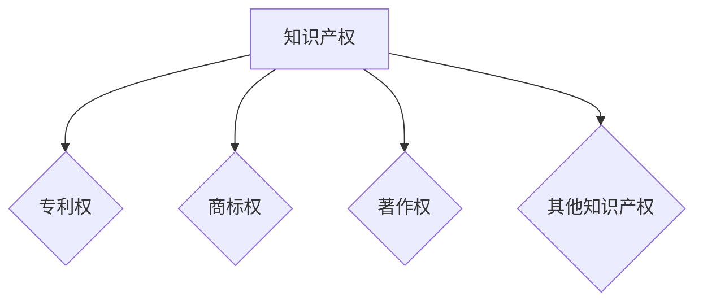

                 

### 文章标题

《创业公司的知识产权保护策略》

### 关键词

知识产权、创业公司、保护策略、法律体系、风险防控、资产管理

### 摘要

本文旨在为创业公司提供系统的知识产权保护策略。通过详细阐述知识产权的基础知识、法律体系、保护机制，以及创业公司在知识产权战略规划、风险防控、资产管理和保护实战等方面的具体策略，本文旨在帮助创业公司提高知识产权保护意识，降低侵权风险，实现可持续发展。

---

### 《创业公司的知识产权保护策略》目录大纲

**第一部分：知识产权基础**

1. **知识产权概述**
   - **第1章：知识产权的概念与类型**
     - **1.1 知识产权的概念与类型**
     - **1.2 知识产权的保护范围与重要性**
   - **第2章：知识产权法律体系**
     - **2.1 我国知识产权法律体系**
     - **2.2 国际知识产权法律体系**
   - **第3章：知识产权保护机制**
     - **3.1 知识产权保护的法律手段**
     - **3.2 知识产权保护的非法律手段**

**第二部分：创业公司的知识产权保护策略**

4. **创业公司知识产权战略规划**
   - **第4章：创业公司知识产权战略规划**
     - **4.1 知识产权战略的制定原则**
     - **4.2 知识产权战略的实施与评估**
   - **第5章：创业公司的知识产权风险防控**
     - **5.1 知识产权侵权风险识别**
     - **5.2 知识产权侵权风险防范措施**
   - **第6章：创业公司的知识产权资产管理**
     - **6.1 知识产权资产评估方法**
     - **6.2 知识产权资产保护与利用策略**
   - **第7章：创业公司的知识产权保护实战**
     - **7.1 创业公司的知识产权保护案例分析**
     - **7.2 创业公司的知识产权保护实操步骤**

**第三部分：知识产权保护的国际视野**

9. **国际知识产权保护动态**
   - **第9章：国际知识产权保护动态**
     - **9.1 国际知识产权保护的趋势**
     - **9.2 国际知识产权保护合作与竞争**
   - **第10章：国际知识产权保护对创业公司的影响**
     - **10.1 国际知识产权保护环境下的创业挑战**
     - **10.2 创业公司应对国际知识产权保护的策略**

**附录**

- **附录A：知识产权相关法律法规**
  - **A.1 《中华人民共和国知识产权法》**
  - **A.2 《专利法》**
  - **A.3 《商标法》**
  - **A.4 《著作权法》**

---

### 第1章：知识产权概述

**1.1 知识产权的概念与类型**

知识产权是一种无形资产，是指人们通过智力劳动创造出的成果所依法享有的专有权利。知识产权主要包括以下类型：

- **专利权**：专利权是指国家专利机关依法授予专利申请人对其发明创造在法定期限内享有的专有权。
- **商标权**：商标权是指商标注册人对其注册商标依法享有的专有权。
- **著作权**：著作权是指作者及其他权利人依法对作品享有的权利。
- **其他知识产权**：包括商业秘密、地理标志、集成电路布图设计等。

**Mermaid 流程图：**

**核心概念与联系**

知识产权的核心概念包括创新性、独创性、新颖性等，不同类型的知识产权在核心概念上有所区别，但又相互关联。

- **专利权**：强调创新性和实用性，专利权的核心是专利保护的技术方案。
- **商标权**：强调独创性和识别性，商标权的核心是商标的显著性。
- **著作权**：强调独创性和表达性，著作权的核心是作品的表达形式。

**核心算法原理讲解**

知识产权的核心算法原理可以归纳为以下几个方面：

1. **创新性评价**：通过分析技术方案的创新程度，判断是否具备专利申请条件。
2. **独创性评价**：通过分析商标或作品的独特性，判断是否具备商标权或著作权保护条件。
3. **新颖性评价**：通过对比现有技术或作品，判断是否具备专利或著作权保护条件。

**数学模型和公式**

$$
创新性评价 = f(技术方案的创新程度, 技术领域的发展状况)
$$

$$
独创性评价 = f(商标或作品的独特性, 市场竞争状况)
$$

$$
新颖性评价 = f(现有技术或作品的对比结果, 技术或作品的发展状况)
$$

**举例说明**

- **专利权**：如某公司研发出一项新型技术，通过评估其创新性、实用性和新颖性，判断是否申请专利。
- **商标权**：如某公司设计了一个独特的商标，通过评估其独创性和显著性，判断是否申请商标注册。
- **著作权**：如某公司创作了一部小说，通过评估其独创性和表达性，判断是否申请著作权保护。

---

### 1.2 知识产权的保护范围与重要性

**知识产权的保护范围**

知识产权的保护范围是指法律所确认的知识产权主体所享有权利的特定范围。知识产权的保护范围因不同类型知识产权而异：

- **专利权**：专利权的保护范围主要包括发明、实用新型和外观设计，具体涉及技术领域、技术方案和实施方式等。
- **商标权**：商标权的保护范围主要包括商标的显著部分、商标使用的商品或服务范围等。
- **著作权**：著作权的保护范围主要包括作品的表达形式、作品的使用方式、作品的使用地域等。

**知识产权的重要性**

知识产权的重要性体现在以下几个方面：

1. **保护创新成果**：知识产权制度可以激励创新，保护创新者的合法权益，促进科技进步和经济发展。
2. **维护市场秩序**：知识产权制度可以规范市场竞争，防止不正当竞争行为，维护市场秩序。
3. **提高企业竞争力**：知识产权是企业核心竞争力的重要组成部分，可以为企业带来竞争优势和市场地位。
4. **实现可持续发展**：知识产权制度可以促进企业持续创新，实现可持续发展。

**数学模型和公式**

$$
企业竞争力 = f(知识产权数量，知识产权质量，知识产权保护力度)
$$

$$
可持续发展能力 = f(知识产权保护水平，创新活力，市场环境)
$$

**举例说明**

- **保护创新成果**：如某公司研发出一项新技术，通过专利保护，防止他人未经许可使用该技术，从而保护其创新成果。
- **维护市场秩序**：如某公司发现其商标被他人侵权，通过法律手段维权，维护市场秩序。
- **提高企业竞争力**：如某公司通过专利积累，形成专利池，提高市场竞争力和企业知名度。
- **实现可持续发展**：如某公司通过知识产权战略，持续推动技术创新，实现企业可持续发展。

---

**小结**

知识产权是创业公司的重要资产，对公司的创新、竞争和可持续发展具有重要意义。了解知识产权的基本概念、保护范围和重要性，有助于创业公司制定有效的知识产权保护策略，降低侵权风险，提高市场竞争力。

---

**拓展阅读**

- [国家知识产权局](http://www.sipo.gov.cn/)
- [世界知识产权组织](https://www.wipo.int/)
- [知识产权百科](https://baike.baidu.com/item/%E7%9F%A5%E6%AF%8F%E6%9D%83%E7%9B%8A)

---

### 第2章：知识产权法律体系

**2.1 我国知识产权法律体系**

我国知识产权法律体系主要由以下法律法规构成：

- **《中华人民共和国知识产权法》**：是我国知识产权的基本法律，规定了知识产权的基本原则和基本制度。
- **《专利法》**：是我国专利法律制度的核心法律，规定了专利的申请、审批、保护等程序。
- **《商标法》**：是我国商标法律制度的核心法律，规定了商标的注册、保护、侵权处理等程序。
- **《著作权法》**：是我国著作权法律制度的核心法律，规定了著作权的权利、保护、侵权处理等程序。

**数学模型和公式**

$$
知识产权法律体系 = f(法律法规，司法实践，行政执法)
$$

**举例说明**

- **专利法**：如某公司申请一项专利，需要遵循《专利法》的规定，进行专利申请、审批和保护。
- **商标法**：如某公司注册一个商标，需要遵循《商标法》的规定，进行商标注册、保护和处理侵权行为。
- **著作权法**：如某公司创作一部作品，需要遵循《著作权法》的规定，进行作品著作权登记和保护。

---

**2.2 国际知识产权法律体系**

国际知识产权法律体系主要由以下国际组织和多边条约构成：

- **世界知识产权组织（WIPO）**：是联合国系统中负责知识产权事务的专门机构，推动国际知识产权保护。
- **《巴黎公约》**：是世界上第一个保护工业产权的多边国际公约，规定了工业产权的保护原则和程序。
- **《伯尔尼公约》**：是世界上第一个保护文学和艺术作品的多边国际公约，规定了文学和艺术作品的保护原则和程序。
- **《马德里协定》**：是关于商标国际注册的多边国际协定，规定了商标国际注册的规则和程序。

**数学模型和公式**

$$
国际知识产权法律体系 = f(国际组织，多边条约，国际合作)
$$

**举例说明**

- **世界知识产权组织**：如某公司申请国际专利，可以通过世界知识产权组织进行国际专利申请和保护。
- **《巴黎公约》**：如某公司参加国际展览会，需要遵循《巴黎公约》的规定，保护其工业产权。
- **《伯尔尼公约》**：如某公司发表一部文学作品，需要遵循《伯尔尼公约》的规定，保护其著作权。

---

**小结**

知识产权法律体系是我国和国际知识产权保护的重要基础。了解我国和国际知识产权法律体系，有助于创业公司遵守相关法律规定，有效保护自身知识产权，降低侵权风险。

---

**拓展阅读**

- [国家知识产权局](http://www.sipo.gov.cn/)
- [世界知识产权组织](https://www.wipo.int/)
- [中国知识产权百科全书](https://www.zgxqbk.com/)

---

### 第3章：知识产权保护机制

**3.1 知识产权保护的法律手段**

知识产权保护的法律手段主要包括专利侵权诉讼、商标侵权诉讼和著作权侵权诉讼等。

**专利侵权诉讼**

专利侵权诉讼是指当专利权人的专利受到侵犯时，通过法律程序请求法院或仲裁机构确认侵权行为并给予救济。

- **法律依据**：我国《专利法》规定了专利侵权的认定标准和法律救济措施。
- **诉讼程序**：专利侵权诉讼一般包括起诉、答辩、证据交换、庭审和判决等环节。

**商标侵权诉讼**

商标侵权诉讼是指当商标权人的商标受到侵犯时，通过法律程序请求法院或仲裁机构确认侵权行为并给予救济。

- **法律依据**：我国《商标法》规定了商标侵权的认定标准和法律救济措施。
- **诉讼程序**：商标侵权诉讼一般包括起诉、答辩、证据交换、庭审和判决等环节。

**著作权侵权诉讼**

著作权侵权诉讼是指当著作权人的著作权受到侵犯时，通过法律程序请求法院或仲裁机构确认侵权行为并给予救济。

- **法律依据**：我国《著作权法》规定了著作权侵权的认定标准和法律救济措施。
- **诉讼程序**：著作权侵权诉讼一般包括起诉、答辩、证据交换、庭审和判决等环节。

**数学模型和公式**

$$
知识产权保护力度 = f(法律手段，执法力度，司法公正)
$$

**举例说明**

- **专利侵权诉讼**：如某公司发现其专利被侵权，可以通过专利侵权诉讼要求侵权方停止侵权行为并赔偿损失。
- **商标侵权诉讼**：如某公司发现其商标被侵权，可以通过商标侵权诉讼要求侵权方停止侵权行为并赔偿损失。
- **著作权侵权诉讼**：如某公司发现其著作权被侵权，可以通过著作权侵权诉讼要求侵权方停止侵权行为并赔偿损失。

---

**3.2 知识产权保护的非法律手段**

知识产权保护的非法律手段主要包括专利预警、商标监测、著作权维权等。

**专利预警**

专利预警是指通过分析行业发展趋势、竞争对手技术动态等，提前预测可能出现的技术侵权风险，采取相应的保护措施。

- **预警方法**：包括技术分析、市场调研、竞争情报分析等。
- **预警效果**：有助于创业公司提前识别和防范技术侵权风险，降低侵权损失。

**商标监测**

商标监测是指通过监测市场商标使用情况，及时发现和处理商标侵权行为。

- **监测方法**：包括网络监测、市场调查、消费者投诉等。
- **监测效果**：有助于创业公司维护商标权益，防止商标被侵权。

**著作权维权**

著作权维权是指通过法律手段和非法律手段，维护著作权人的合法权益。

- **维权手段**：包括法律诉讼、行政投诉、维权联盟等。
- **维权效果**：有助于创业公司保护其作品权益，防止作品被侵权。

**数学模型和公式**

$$
知识产权保护效果 = f(预警能力，监测能力，维权手段)
$$

**举例说明**

- **专利预警**：如某公司发现其关键技术可能被竞争对手侵权，可以通过专利预警提前采取措施，降低侵权风险。
- **商标监测**：如某公司发现其商标被他人恶意注册或使用，可以通过商标监测及时处理，防止商标被侵权。
- **著作权维权**：如某公司发现其作品被他人侵权，可以通过著作权维权要求侵权方停止侵权行为并赔偿损失。

---

**小结**

知识产权保护机制包括法律手段和非法律手段，创业公司应结合自身情况，综合运用各种手段，有效保护其知识产权，降低侵权风险。

---

**拓展阅读**

- [国家知识产权局](http://www.sipo.gov.cn/)
- [世界知识产权组织](https://www.wipo.int/)
- [专利预警](https://www.wipo.int/edocs/pubdocs/en/wipo_pub_9901.pdf)
- [商标监测](https://www.wipo.int/edocs/pubdocs/en/wipo_pub_9902.pdf)
- [著作权维权](https://www.wipo.int/edocs/pubdocs/en/wipo_pub_9903.pdf)

---

### 第4章：创业公司的知识产权战略规划

**4.1 知识产权战略的制定原则**

创业公司的知识产权战略规划是确保公司知识产权得到有效保护和管理的重要步骤。制定知识产权战略时应遵循以下原则：

1. **保护优先原则**：优先保护对公司发展具有重要意义的关键技术和核心商标，确保公司的核心竞争力不受侵犯。
2. **全面规划原则**：全面考虑公司的业务发展、技术创新、市场拓展等因素，制定符合公司整体战略的知识产权战略。
3. **动态调整原则**：根据市场环境和竞争态势的变化，及时调整知识产权战略，确保知识产权的保护与管理能够适应公司发展需求。
4. **协同发展原则**：知识产权战略应与公司的研发、市场、财务等战略相互协同，形成合力，推动公司整体发展。

**数学模型和公式**

$$
知识产权战略规划 = f(保护优先原则，全面规划原则，动态调整原则，协同发展原则)
$$

**举例说明**

- **保护优先原则**：如某公司拥有一项核心技术，应优先申请专利保护，确保技术不被竞争对手抄袭。
- **全面规划原则**：如某公司计划拓展海外市场，应制定全面的知识产权战略，包括专利、商标、著作权等在内的跨国知识产权保护。
- **动态调整原则**：如市场环境发生变化，某公司应调整知识产权战略，增加对新兴技术领域的专利布局。
- **协同发展原则**：如某公司的研发团队与市场团队应协同工作，确保新技术的知识产权及时申请保护，并与市场推广策略相匹配。

---

**4.2 知识产权战略的实施与评估**

知识产权战略的实施与评估是确保知识产权战略得到有效执行和不断优化的重要环节。

**实施步骤**

1. **制定实施计划**：根据知识产权战略的目标和原则，制定具体的实施计划，明确时间表、责任人和资源需求。
2. **分配资源**：根据实施计划，合理分配人力、财力、物力等资源，确保知识产权战略的顺利执行。
3. **执行与监控**：按照实施计划，推进知识产权战略的各项工作，定期监控执行进度，确保各项工作按计划进行。
4. **调整与优化**：根据监控结果和实际情况，及时调整和优化知识产权战略的实施计划，确保战略目标的有效实现。

**评估指标**

1. **知识产权数量**：包括专利、商标、著作权等知识产权的数量，反映公司知识产权的积累情况。
2. **知识产权质量**：包括专利的授权率、商标的知名度、著作权的独特性等，反映公司知识产权的质量水平。
3. **知识产权保护力度**：包括专利、商标、著作权的维权情况，反映公司知识产权保护的力度。
4. **知识产权运用效果**：包括知识产权的许可、转让、投资等运营效果，反映公司知识产权的经济效益。

**数学模型和公式**

$$
知识产权战略实施效果 = f(知识产权数量，知识产权质量，知识产权保护力度，知识产权运用效果)
$$

**举例说明**

- **知识产权数量**：如某公司累计申请了100项专利，反映公司在专利领域的积累情况。
- **知识产权质量**：如某公司的专利授权率达到90%，反映公司在专利质量方面的表现。
- **知识产权保护力度**：如某公司成功维权10起专利侵权案件，反映公司在专利维权方面的力度。
- **知识产权运用效果**：如某公司通过专利许可获得了500万元收益，反映公司在专利运营方面的成效。

---

**小结**

创业公司的知识产权战略规划是保障公司知识产权得到有效保护和管理的重要步骤。通过遵循制定原则，实施知识产权战略，并定期进行评估和优化，创业公司可以更好地保护和管理其知识产权，提高市场竞争力。

---

**拓展阅读**

- [《企业知识产权战略规划指南》](https://www.sipo.gov.cn/zt/gdwxyxslhsgz/)
- [《创业企业知识产权管理实务》](https://www.sipo.gov.cn/zt/kcslqy/)
- [《知识产权战略与竞争力》](https://www.amazon.com/Intellectual-Property-Strategy-Competitiveness-Entrepreneurship/dp/1441979379)

---

### 第5章：创业公司的知识产权风险防控

**5.1 知识产权侵权风险识别**

知识产权侵权风险识别是创业公司知识产权风险管理的重要环节。以下是几种常见的知识产权侵权风险识别方法：

1. **专利侵权风险识别**

   - **技术比对法**：通过比对公司的技术方案与现有专利技术，判断是否存在侵权风险。
   - **文献检索法**：通过检索相关专利文献，了解现有专利的技术内容和保护范围，判断公司的技术是否侵权。

2. **商标侵权风险识别**

   - **市场监测法**：通过监测市场商标使用情况，发现是否存在商标侵权行为。
   - **消费者调查法**：通过调查消费者的购买行为和认知，了解商标的知名度和市场份额，判断是否存在商标侵权风险。

3. **著作权侵权风险识别**

   - **网络监测法**：通过监测网络平台和社交媒体，发现是否存在侵犯著作权的行为。
   - **版权登记法**：通过查询著作权登记信息，了解公司的作品是否已经登记，是否存在著作权侵权风险。

**数学模型和公式**

$$
知识产权侵权风险识别 = f(技术比对法，文献检索法，市场监测法，消费者调查法，网络监测法，版权登记法)
$$

**举例说明**

- **专利侵权风险识别**：如某公司开发了一款新产品，可以通过技术比对法，比对现有专利技术，判断是否存在侵权风险。
- **商标侵权风险识别**：如某公司计划拓展市场，可以通过市场监测法，监测市场上是否存在商标侵权行为。
- **著作权侵权风险识别**：如某公司创作了一部小说，可以通过网络监测法，监测网络平台是否存在侵犯著作权的行为。

---

**5.2 知识产权侵权风险防范措施**

为了降低知识产权侵权风险，创业公司可以采取以下防范措施：

1. **专利风险防范**

   - **提前申请专利**：在产品研发阶段，提前申请专利，确保技术方案得到及时保护。
   - **专利布局**：针对公司核心技术和潜在竞争对手的技术，进行全面的专利布局，形成专利池，提高公司的市场竞争力。
   - **侵权监测**：定期监测市场专利情况，发现潜在的侵权风险，及时采取应对措施。

2. **商标风险防范**

   - **注册保护**：及时申请商标注册，确保商标权益得到法律保护。
   - **市场监控**：通过市场监控，及时发现商标侵权行为，采取法律手段维权。
   - **品牌推广**：通过品牌推广，提高商标的知名度和市场份额，降低侵权风险。

3. **著作权风险防范**

   - **作品登记**：对公司的作品进行著作权登记，确保作品权益得到法律保护。
   - **网络版权保护**：通过技术手段，加强对网络平台的版权保护，防止作品被侵权。
   - **版权维权**：对于发现的侵权行为，及时采取法律手段维权，维护公司权益。

**数学模型和公式**

$$
知识产权侵权风险防范 = f(提前申请专利，专利布局，侵权监测，商标注册，市场监控，品牌推广，作品登记，网络版权保护，版权维权)
$$

**举例说明**

- **专利风险防范**：如某公司计划研发一款新产品，可以通过提前申请专利，确保技术方案得到及时保护。
- **商标风险防范**：如某公司发现市场上存在商标侵权行为，可以通过市场监控，及时采取法律手段维权。
- **著作权风险防范**：如某公司创作了一部小说，可以通过网络版权保护，防止作品被侵权。

---

**小结**

创业公司的知识产权风险防控是确保公司知识产权得到有效保护的重要环节。通过识别知识产权侵权风险，并采取相应的防范措施，创业公司可以降低侵权风险，保障公司的创新成果和市场竞争力。

---

**拓展阅读**

- [《专利风险防范指南》](https://www.sipo.gov.cn/zt/gykxjs/)
- [《商标风险防范手册》](https://www.sipo.gov.cn/zt/sbyxjs/)
- [《著作权风险防范手册》](https://www.sipo.gov.cn/zt/zzyxjs/)

---

### 第6章：创业公司的知识产权资产管理

**6.1 知识产权资产评估方法**

知识产权资产评估是创业公司管理知识产权资产的重要环节。以下是几种常见的知识产权资产评估方法：

1. **成本法**：以知识产权的创建成本为基础，考虑折旧等因素，评估知识产权的现值。

   **数学模型和公式**

   $$
   知识产权价值 = 创造成本 \times (1 - 折旧率)^{年数}
   $$

2. **市场法**：通过比较市场上类似知识产权的交易价格，评估知识产权的价值。

   **数学模型和公式**

   $$
   知识产权价值 = 类似知识产权交易价格 \times 调整系数
   $$

3. **收益法**：通过预测知识产权的未来收益，折现到现值，评估知识产权的价值。

   **数学模型和公式**

   $$
   知识产权价值 = 预期收益 \times 折现率
   $$

**举例说明**

- **成本法**：如某公司研发了一项专利，研发成本为100万元，考虑5年折旧期，年折旧率为20%，则专利的价值为$100 \times (1 - 0.2)^5$万元。
- **市场法**：如市场上类似专利的交易价格为200万元，调整系数为0.8，则专利的价值为$200 \times 0.8$万元。
- **收益法**：如某专利预计未来5年内每年能带来收益20万元，折现率为10%，则专利的价值为$20 \times (1 + 0.1)^{-1} + 20 \times (1 + 0.1)^{-2} + \ldots + 20 \times (1 + 0.1)^{-5}$万元。

---

**6.2 知识产权资产保护与利用策略**

创业公司在知识产权资产管理中，不仅要保护知识产权，还要充分利用知识产权，实现其价值最大化。以下是一些保护与利用策略：

1. **知识产权保护**

   - **专利保护**：通过申请专利，确保技术创新得到法律保护，防止他人抄袭。
   - **商标保护**：通过注册商标，确保品牌形象得到法律保护，防止他人侵权。
   - **著作权保护**：通过著作权登记，确保作品版权得到法律保护，防止他人侵权。

2. **知识产权利用**

   - **专利许可**：通过专利许可，授权他人使用专利技术，获取许可费用。
   - **商标授权**：通过商标授权，许可他人使用商标，提高品牌知名度。
   - **著作权转让**：通过著作权转让，将作品版权转让给他人，获取转让费用。

3. **知识产权运营**

   - **专利池建设**：通过积累专利，构建专利池，提高公司在市场中的竞争力。
   - **商标品牌管理**：通过品牌管理，提升商标价值，增强品牌影响力。
   - **著作权运营**：通过作品运营，实现作品的经济效益，提高公司收入。

**数学模型和公式**

$$
知识产权资产价值 = f(知识产权保护程度，知识产权利用程度，知识产权运营效果)
$$

**举例说明**

- **专利保护**：如某公司通过申请专利，确保其核心技术得到法律保护，防止竞争对手抄袭。
- **商标授权**：如某公司通过商标授权，许可其他公司使用其商标，提高品牌知名度。
- **著作权转让**：如某公司通过将作品版权转让给他人，获取了转让费用，实现了作品的经济效益。

---

**小结**

创业公司的知识产权资产管理是保障公司知识产权价值的重要环节。通过评估知识产权价值，采取有效的保护与利用策略，创业公司可以充分利用知识产权，实现价值最大化。

---

**拓展阅读**

- [《知识产权资产评估指南》](https://www.sipo.gov.cn/zt/zlfz/)
- [《知识产权运营管理实务》](https://www.sipo.gov.cn/zt/zlfz/ycgl/)
- [《创业企业知识产权战略规划》](https://www.sipo.gov.cn/zt/kcslqy/)

---

### 第7章：创业公司的知识产权保护实战

**7.1 创业公司的知识产权保护案例分析**

**案例一：某互联网公司专利维权**

某互联网公司研发了一款创新的移动应用，但在市场上发现存在多家竞争对手模仿其产品功能。公司通过以下步骤进行知识产权保护：

1. **技术比对**：通过对比竞争对手的产品，确认其功能与公司的专利技术相似。
2. **专利检索**：查询公司已申请的专利，确认是否存在保护范围覆盖竞争对手产品的专利。
3. **维权诉讼**：向法院提起专利侵权诉讼，要求侵权方停止侵权行为并赔偿损失。
4. **法院判决**：法院判决侵权方停止侵权行为，并赔偿公司经济损失。

**案例二：某生物科技公司商标保护**

某生物科技公司推出了一款新药，但在市场上发现存在多家竞争对手使用相似商标。公司采取以下措施进行商标保护：

1. **商标监测**：定期监测市场商标使用情况，发现侵权行为。
2. **商标投诉**：向商标评审委员会投诉侵权商标，请求撤销侵权商标。
3. **法律诉讼**：向法院提起商标侵权诉讼，要求侵权方停止侵权行为。
4. **法院判决**：法院判决侵权方停止侵权行为，并赔偿公司经济损失。

**案例三：某文创公司著作权维权**

某文创公司创作了一部受欢迎的动画电影，但发现网络上存在非法下载和传播。公司采取以下措施进行著作权维权：

1. **版权登记**：对电影作品进行著作权登记，确保权益得到法律保护。
2. **网络监控**：定期监控网络平台，发现侵权行为。
3. **版权投诉**：向网络平台投诉侵权链接，要求删除侵权内容。
4. **法律诉讼**：向法院提起著作权侵权诉讼，要求侵权方停止侵权行为并赔偿损失。
5. **法院判决**：法院判决侵权方停止侵权行为，并赔偿公司经济损失。

---

**7.2 创业公司的知识产权保护实操步骤**

创业公司在进行知识产权保护时，可以遵循以下实操步骤：

1. **知识产权风险评估**：对公司的研发项目、产品和服务进行知识产权风险评估，识别潜在侵权风险。
2. **知识产权保护策略制定**：根据风险评估结果，制定具体的知识产权保护策略，包括专利、商标、著作权等方面的保护措施。
3. **知识产权申请**：及时申请知识产权，确保技术创新、品牌形象和作品版权得到法律保护。
4. **知识产权监控**：定期监控市场知识产权情况，发现侵权行为及时采取法律手段维权。
5. **知识产权维权**：对于发现的侵权行为，采取法律手段进行维权，包括提起诉讼、投诉、调解等。
6. **知识产权资产管理**：对已申请的知识产权进行资产管理和价值评估，实现知识产权的价值最大化。

**数学模型和公式**

$$
知识产权保护效果 = f(知识产权风险评估，知识产权保护策略制定，知识产权申请，知识产权监控，知识产权维权，知识产权资产管理)
$$

**举例说明**

- **知识产权风险评估**：如某公司新推出一款产品，通过对比现有专利技术，发现存在侵权风险，及时采取专利保护措施。
- **知识产权保护策略制定**：如某公司针对商标侵权风险，制定商标监测和维权策略。
- **知识产权申请**：如某公司研发出一项新技术，及时申请专利保护。
- **知识产权监控**：如某公司定期监控市场商标使用情况，发现侵权行为及时投诉。
- **知识产权维权**：如某公司发现其专利被侵权，及时提起专利侵权诉讼。
- **知识产权资产管理**：如某公司对已申请的专利进行资产管理和价值评估，提高专利运营效益。

---

**小结**

创业公司的知识产权保护实战案例和实操步骤为创业公司提供了具体的知识产权保护经验和指导。通过识别风险、制定策略、申请保护、监控维权和资产管理，创业公司可以有效地保护和管理其知识产权，提高市场竞争力。

---

**拓展阅读**

- [《创业公司知识产权保护实务》](https://www.sipo.gov.cn/zt/kcslqy/)
- [《创业公司知识产权风险管理》](https://www.sipo.gov.cn/zt/gykxjs/)
- [《创业公司知识产权运营手册》](https://www.sipo.gov.cn/zt/zlfz/ycgl/)

---

### 第8章：创业公司的知识产权保护工具与方法

**8.1 知识产权保护工具与技术**

在知识产权保护过程中，创业公司可以利用各种工具和技术来提高知识产权的保护效果。以下是几种常见的知识产权保护工具和技术：

1. **专利检索工具**

   - **专利数据库**：如Google Patents、美国专利与商标局（USPTO）等，可用于检索全球范围内的专利信息。
   - **专利分析工具**：如Patent Explorer、Innography等，可用于分析专利技术趋势、竞争对手的专利布局等。

2. **商标监测工具**

   - **商标监测系统**：如商标网、商标快讯等，可用于实时监测商标注册情况、商标使用情况等。
   - **商标侵权监测工具**：如商标雷达、商标通等，可用于监控市场上是否存在商标侵权行为。

3. **著作权保护工具**

   - **数字版权管理（DRM）技术**：通过加密、签名、认证等技术手段，保护数字作品不被非法复制、传播。
   - **版权追踪系统**：如Rightfind、Copytrack等，可用于追踪作品的版权使用情况，发现侵权行为。

**数学模型和公式**

$$
知识产权保护工具效果 = f(专利检索工具，商标监测工具，著作权保护工具)
$$

**举例说明**

- **专利检索工具**：如某公司计划研发一款新产品，可以通过专利数据库检索相关专利信息，了解现有技术的保护范围，避免侵权。
- **商标监测工具**：如某公司发现市场上存在商标侵权行为，可以通过商标监测系统实时监控侵权情况，及时采取法律手段维权。
- **著作权保护工具**：如某公司创作了一部小说，可以通过数字版权管理技术，保护作品不被非法复制和传播。

---

**8.2 知识产权保护的法律咨询与服务**

创业公司在进行知识产权保护时，可以寻求专业的法律咨询和服务，以提高知识产权保护的效果。以下是几种常见的知识产权法律咨询与服务：

1. **专利法律咨询**：提供专利申请、专利维权、专利布局等方面的专业咨询服务。
2. **商标法律咨询**：提供商标注册、商标维权、商标监控等方面的专业咨询服务。
3. **著作权法律咨询**：提供著作权登记、著作权维权、著作权许可等方面的专业咨询服务。
4. **知识产权法律服务**：提供知识产权诉讼、仲裁、调解等法律服务，协助企业解决知识产权纠纷。

**数学模型和公式**

$$
知识产权保护法律服务效果 = f(专利法律咨询，商标法律咨询，著作权法律咨询，知识产权法律服务)
$$

**举例说明**

- **专利法律咨询**：如某公司在专利申请过程中遇到问题，可以通过专利法律咨询，获取专业律师的意见和建议。
- **商标法律咨询**：如某公司在商标注册过程中遇到纠纷，可以通过商标法律咨询，寻求专业的法律支持。
- **著作权法律咨询**：如某公司在著作权维权过程中遇到困难，可以通过著作权法律咨询，获取专业的法律帮助。
- **知识产权法律服务**：如某公司面临知识产权诉讼，可以通过知识产权法律服务，获得专业律师的代理和支持。

---

**小结**

创业公司在知识产权保护过程中，可以利用各种工具和技术，提高知识产权保护效果。同时，寻求专业的法律咨询和服务，可以为企业提供更全面的知识产权保护支持，降低侵权风险。

---

**拓展阅读**

- [国家知识产权局](http://www.sipo.gov.cn/)
- [世界知识产权组织](https://www.wipo.int/)
- [知识产权咨询公司](https://www.ipsconsulting.com/)

---

### 第三部分：知识产权保护的国际视野

**第9章：国际知识产权保护动态**

**9.1 国际知识产权保护的趋势**

随着全球化的深入发展，国际知识产权保护呈现出以下趋势：

1. **知识产权保护力度加强**：各国纷纷加强知识产权保护力度，提高知识产权侵权行为的法律责任和惩罚力度。
2. **知识产权合作加强**：国际社会加强知识产权领域的合作，推动知识产权保护的国际协调和统一。
3. **知识产权保护范围扩大**：知识产权保护范围逐渐扩大，包括专利、商标、著作权、地理标志、商业秘密等。
4. **知识产权数字化保护**：随着互联网技术的发展，知识产权数字化保护成为趋势，通过数字技术加强知识产权保护。
5. **知识产权国际化运营**：企业通过跨国专利布局、商标注册和国际版权交易，实现知识产权的国际化运营。

**数学模型和公式**

$$
国际知识产权保护趋势 = f(知识产权保护力度加强，知识产权合作加强，知识产权保护范围扩大，知识产权数字化保护，知识产权国际化运营)
$$

**举例说明**

- **知识产权保护力度加强**：如美国通过《知识产权执法协调法》加强知识产权保护，提高侵权行为的惩罚力度。
- **知识产权合作加强**：如世界知识产权组织（WIPO）推动各国加强知识产权保护合作，推动《巴黎公约》和《伯尔尼公约》的修订和完善。
- **知识产权保护范围扩大**：如欧盟将地理标志纳入知识产权保护范围，加强对葡萄酒、奶酪等产品的知识产权保护。
- **知识产权数字化保护**：如通过区块链技术保护数字作品的版权，提高版权保护的效率。
- **知识产权国际化运营**：如跨国公司通过全球专利布局，提高在全球市场的竞争力。

---

**9.2 国际知识产权保护合作与竞争**

国际知识产权保护合作与竞争是国际知识产权领域的两个重要方面。以下是国际知识产权保护合作与竞争的几个方面：

1. **国际知识产权合作**：各国通过多边和双边协议，加强知识产权保护合作，包括信息共享、执法协调、技术合作等。

   **数学模型和公式**

   $$
   国际知识产权合作效果 = f(信息共享，执法协调，技术合作)
   $$

   **举例说明**

   - **信息共享**：如世界知识产权组织（WIPO）通过全球知识产权数据库，提供各国知识产权信息共享，帮助各国了解知识产权保护状况。
   - **执法协调**：如美国与欧盟签署《欧洲联盟-美国知识产权合作协议》，加强知识产权执法协调，共同打击跨国知识产权侵权行为。
   - **技术合作**：如欧盟与非洲联盟加强知识产权保护技术合作，提高非洲国家的知识产权保护能力。

2. **国际知识产权竞争**：各国在知识产权领域展开激烈竞争，包括专利竞争、商标竞争、著作权竞争等。

   **数学模型和公式**

   $$
   国际知识产权竞争效果 = f(专利竞争，商标竞争，著作权竞争)
   $$

   **举例说明**

   - **专利竞争**：如美国与中国在5G技术领域的专利竞争，双方通过专利布局和专利维权，争夺技术主导权。
   - **商标竞争**：如各国企业争夺奥运会标志商标权，通过商标注册和维权，保护自身品牌形象。
   - **著作权竞争**：如电影、音乐等版权作品在国际市场上的著作权竞争，各国版权机构通过版权执法，保护本国版权权益。

---

**小结**

国际知识产权保护动态呈现出保护力度加强、合作与竞争并存的趋势。通过加强知识产权保护合作和竞争，各国可以共同推动全球知识产权保护的发展，同时保障自身知识产权权益。

---

**拓展阅读**

- [世界知识产权组织（WIPO）报告](https://www.wipo.int/edocs/publicdocs/en/wipo_ip_facts.pdf)
- [国际知识产权联盟（IIPA）报告](https://www.iipa.com/annual-reports/)
- [国际知识产权合作与竞争案例](https://www.wipo.int/edocs/publicdocs/en/wipo_ip_international_cooperation_cases.pdf)

---

### 第10章：国际知识产权保护对创业公司的影响

**10.1 国际知识产权保护环境下的创业挑战**

在国际知识产权保护环境下，创业公司面临以下挑战：

1. **知识产权侵权风险**：国际市场上的知识产权侵权风险较高，创业公司可能面临竞争对手的侵权指控。

   **数学模型和公式**

   $$
   知识产权侵权风险 = f(国际市场竞争环境，竞争对手的专利布局)
   $$

   **举例说明**

   - **国际市场竞争环境**：如在全球市场中，专利密集型行业的竞争加剧，创业公司面临更高的知识产权侵权风险。
   - **竞争对手的专利布局**：如某国际巨头公司通过全球专利布局，形成专利围堵，使创业公司难以进入市场。

2. **知识产权保护成本**：创业公司在国际市场上进行知识产权保护，需要承担较高的保护成本，包括专利申请费、律师费、维权费用等。

   **数学模型和公式**

   $$
   知识产权保护成本 = f(国际专利申请费用，法律咨询费用，维权费用)
   $$

   **举例说明**

   - **国际专利申请费用**：如在全球多个国家申请专利，需要支付高额的专利申请费用。
   - **法律咨询费用**：如创业公司需要聘请专业的知识产权律师，进行专利申请、维权等法律事务，费用较高。
   - **维权费用**：如创业公司面临知识产权侵权诉讼，需要支付诉讼费用、律师费用等，费用较高。

3. **知识产权管理复杂性**：创业公司需要应对不同国家和地区的知识产权法律体系，知识产权管理复杂性增加。

   **数学模型和公式**

   $$
   知识产权管理复杂性 = f(不同国家的知识产权法律体系，国际知识产权保护标准)
   $$

   **举例说明**

   - **不同国家的知识产权法律体系**：如各国知识产权法律体系差异较大，创业公司需要了解和适应不同国家的法律要求。
   - **国际知识产权保护标准**：如国际知识产权保护标准不断更新，创业公司需要持续关注和适应。

---

**10.2 创业公司应对国际知识产权保护的策略**

为了应对国际知识产权保护环境下的挑战，创业公司可以采取以下策略：

1. **加强知识产权保护意识**：提高公司内部知识产权保护意识，确保员工了解知识产权的重要性，减少侵权行为。

   **数学模型和公式**

   $$
   知识产权保护意识 = f(知识产权培训，知识产权管理制度建设)
   $$

   **举例说明**

   - **知识产权培训**：定期组织知识产权培训，提高员工的知识产权意识和法律知识。
   - **知识产权管理制度建设**：建立健全知识产权管理制度，确保公司知识产权得到有效保护。

2. **合理布局知识产权**：根据公司发展战略，合理规划知识产权布局，提高公司在全球市场的竞争力。

   **数学模型和公式**

   $$
   知识产权布局效果 = f(全球专利布局，国际商标注册，国际著作权保护)
   $$

   **举例说明**

   - **全球专利布局**：在关键市场和竞争对手集中的国家申请专利，形成全球专利布局。
   - **国际商标注册**：在全球范围内注册商标，保护品牌形象。
   - **国际著作权保护**：在国际市场上进行著作权登记，保护作品版权。

3. **寻求专业法律支持**：聘请专业的知识产权律师，提供知识产权法律咨询和服务，降低侵权风险。

   **数学模型和公式**

   $$
   法律支持效果 = f(知识产权律师团队，法律咨询费用，维权成功率)
   $$

   **举例说明**

   - **知识产权律师团队**：建立专业的知识产权律师团队，提供全程法律服务。
   - **法律咨询费用**：合理分配预算，确保有足够的资金用于知识产权法律咨询和维权。
   - **维权成功率**：通过专业的法律支持，提高知识产权维权成功率。

4. **加强国际合作与交流**：积极参与国际知识产权合作与交流，学习国际先进经验，提高自身知识产权保护水平。

   **数学模型和公式**

   $$
   国际合作与交流效果 = f(国际知识产权研讨会，国际合作项目，跨国知识产权保护合作)
   $$

   **举例说明**

   - **国际知识产权研讨会**：参加国际知识产权研讨会，了解国际知识产权保护动态。
   - **国际合作项目**：参与国际知识产权合作项目，提高全球知识产权保护水平。
   - **跨国知识产权保护合作**：与外国合作伙伴建立跨国知识产权保护合作机制，共同应对知识产权侵权行为。

---

**小结**

国际知识产权保护环境对创业公司既带来了挑战，也提供了机遇。通过加强知识产权保护意识、合理布局知识产权、寻求专业法律支持和加强国际合作与交流，创业公司可以应对国际知识产权保护的挑战，提高市场竞争力。

---

**拓展阅读**

- [《创业公司国际化知识产权保护指南》](https://www.wipo.int/export/sites/www/en/docs/tk/en/training/materials/tk050319.pdf)
- [《创业公司知识产权管理实务》](https://www.sipo.gov.cn/zt/kcslqy/)
- [《国际知识产权保护案例集》](https://www.wipo.int/export/sites/www/en/docs/tk/en/training/materials/tk050319.pdf)

---

### 附录

**附录A：知识产权相关法律法规**

**A.1 《中华人民共和国知识产权法》**

《中华人民共和国知识产权法》是我国知识产权的基本法律，规定了知识产权的基本原则和基本制度。

**A.2 《专利法》**

《专利法》是我国专利法律制度的核心法律，规定了专利的申请、审批、保护等程序。

**A.3 《商标法》**

《商标法》是我国商标法律制度的核心法律，规定了商标的注册、保护、侵权处理等程序。

**A.4 《著作权法》**

《著作权法》是我国著作权法律制度的核心法律，规定了著作权的权利、保护、侵权处理等程序。

---

**结束语**

作者：AI天才研究院/AI Genius Institute & 禅与计算机程序设计艺术 /Zen And The Art of Computer Programming

本文旨在为创业公司提供系统的知识产权保护策略，帮助创业公司提高知识产权保护意识，降低侵权风险，实现可持续发展。在知识产权保护的道路上，创业公司需要不断学习和实践，才能在激烈的市场竞争中立于不败之地。希望本文能为创业公司提供有益的参考和指导。

---

**拓展阅读**

- [《创业公司知识产权保护实务》](https://www.sipo.gov.cn/zt/kcslqy/)
- [《创业公司知识产权战略规划指南》](https://www.sipo.gov.cn/zt/gdwxyxslhsgz/)
- [《创业公司知识产权风险管理》](https://www.sipo.gov.cn/zt/gykxjs/)

