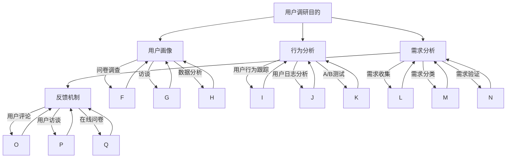
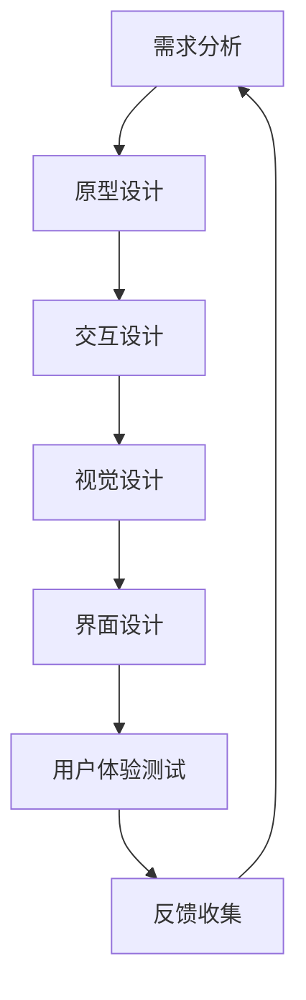
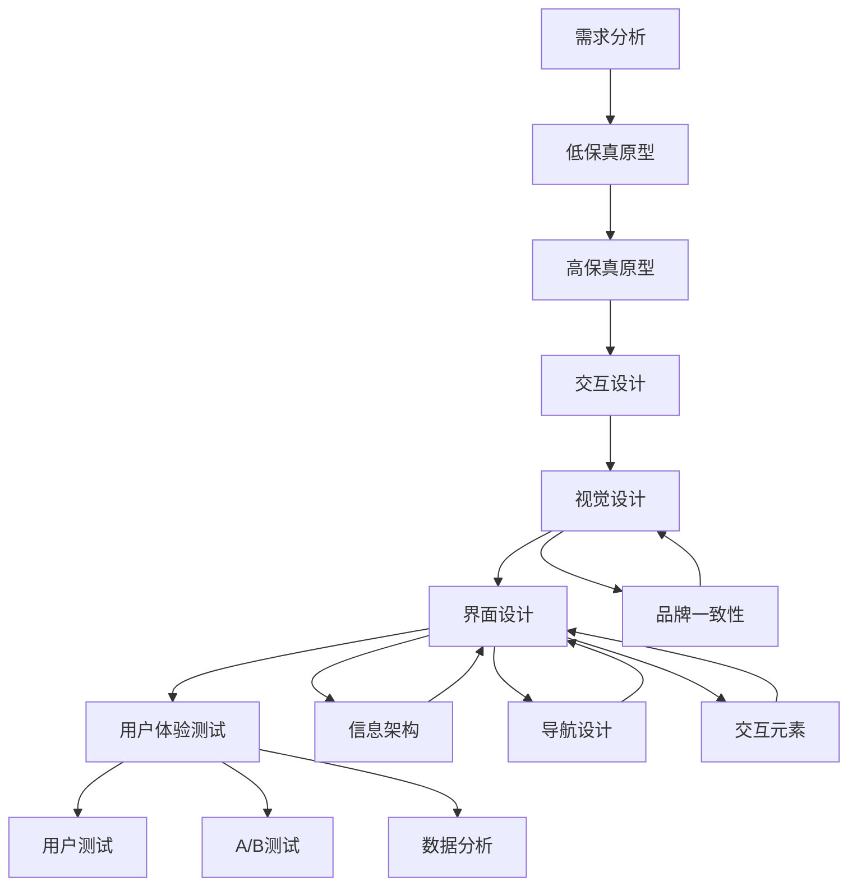
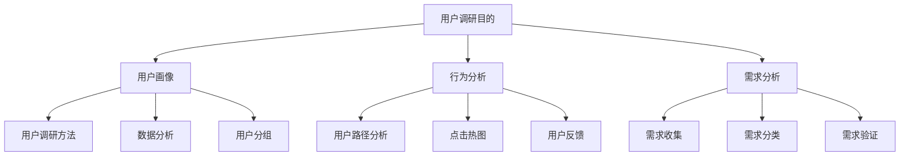

                 

## 第1章：移动优先设计理念

### 1.1 移动优先设计的重要性

随着移动互联网的飞速发展，移动设备已经成为人们日常生活中不可或缺的一部分。据统计，全球移动设备用户已经超过40亿，而这一数字还在不断增长。这意味着，越来越多的用户选择在移动设备上获取信息、完成任务，从而推动了移动优先设计理念的重要性。

#### 移动设备普及的推动因素

1. **技术进步**：随着处理器性能的提升和屏幕分辨率的提高，移动设备的性能已经可以媲美传统的桌面电脑。
2. **网络条件改善**：4G和5G网络的普及，使得移动设备可以更加稳定地访问互联网。
3. **用户习惯改变**：人们越来越习惯使用移动设备随时随地获取信息和服务。

#### 用户体验期望的提升

1. **即时性**：用户期望能够在任何时间、任何地点获取所需的信息和服务。
2. **便捷性**：移动应用应该简化用户操作，使用户能够快速完成任务。
3. **个性化**：用户期望应用能够根据其个人喜好和习惯提供定制化的服务。

#### 商业机会的拓展

1. **市场覆盖**：移动优先设计可以拓展企业的市场覆盖范围，吸引更多潜在用户。
2. **用户互动**：通过移动应用，企业可以与用户保持更加紧密的互动，提高用户忠诚度。
3. **业务增长**：移动应用为企业提供了新的业务模式，如移动支付、移动营销等，促进了业务增长。

### 移动优先设计在创业公司中的重要性

对于创业公司来说，移动优先设计具有以下几个关键优势：

1. **低成本**：相较于桌面应用，移动应用的开发成本较低，可以快速进入市场。
2. **快速迭代**：移动应用可以更快速地进行迭代，根据用户反馈及时优化产品。
3. **用户增长**：通过移动应用，创业公司可以迅速获得用户群体，提升市场份额。
4. **竞争优势**：在竞争激烈的移动市场中，优秀的移动用户体验可以为企业赢得竞争优势。

### 结论

总之，移动优先设计已经成为现代创业公司成功的关键因素。通过重视移动设备的特点和用户需求，创业公司可以开发出更加符合用户期望的产品，提高市场竞争力，实现业务增长。

### 1.2 移动设备的特点与设计挑战

移动设备，尤其是智能手机和平板电脑，与传统的桌面电脑有着显著的不同，这些差异在设计过程中需要特别考虑。

#### 屏幕尺寸与分辨率

移动设备的屏幕尺寸通常较小，这要求设计者必须在有限的屏幕空间中合理安排内容布局。此外，移动设备的屏幕分辨率也各不相同，从低分辨率到高分辨率都有。这意味着，设计者需要确保应用在不同分辨率下都能保持良好的显示效果，这通常需要使用响应式设计技术。

#### 网络环境

移动网络环境的稳定性通常不如有线网络。用户可能会在移动网络信号弱或不稳定的情况下使用应用，因此，设计者需要考虑如何在网络条件不佳的情况下优化应用性能，例如通过数据缓存技术减少数据请求次数，提高响应速度。

#### 交互方式

移动设备的交互方式主要是通过触摸屏和语音交互。触摸屏交互要求设计者考虑手指操作的便利性，例如按钮大小、点击反馈等。语音交互则带来了新的挑战，如如何设计自然语言处理（NLP）接口，以便用户能够自然地与移动应用进行交流。

#### 性能与能耗

移动设备的性能和电池续航能力是设计者需要关注的重点。设计者需要在应用性能和电池续航之间找到平衡点。例如，可以通过优化代码、减少后台运行进程、使用低功耗组件等方式来提高电池续航。

### 设计挑战

1. **适配性**：设计者需要确保应用能够适配各种屏幕尺寸和分辨率。
2. **网络依赖性**：设计者需要考虑网络不稳定的情况，确保应用能够提供稳定的用户体验。
3. **交互复杂性**：触摸屏和语音交互带来了新的设计挑战，如何让这些交互方式既方便又直观。
4. **性能优化**：在有限的硬件资源下，设计者需要不断优化应用性能，以提高用户满意度。

### 解决方案

1. **响应式设计**：使用响应式设计技术，确保应用在不同屏幕尺寸和分辨率下都能良好显示。
2. **数据缓存**：通过数据缓存技术，减少网络请求次数，提高应用响应速度。
3. **交互设计优化**：通过对触摸屏和语音交互进行细致的设计和测试，确保用户操作的便利性和直观性。
4. **性能优化**：通过代码优化、组件选择和后台进程管理，提高应用性能，延长电池续航。

### 1.3 设计原则与实践案例

在设计移动应用时，遵循一些核心设计原则可以帮助企业实现高质量的用户体验。以下是几个关键设计原则以及实际案例：

#### 简洁性

**原则**：简洁性要求设计者将不必要的复杂性从应用中剔除，让用户能够轻松理解和使用。

**实践案例**：微信的界面设计简洁明了，主要功能一目了然，用户可以快速找到所需操作。

#### 一致性

**原则**：一致性要求设计元素和交互方式在应用内保持一致，以减少用户的学习成本。

**实践案例**：苹果iOS系统的设计一致性强，无论是哪个应用，用户都可以感受到相同的操作逻辑和界面风格。

#### 响应速度

**原则**：响应速度是指应用在用户操作后的反应时间，快速响应可以提高用户体验。

**实践案例**：Uber的移动应用在用户下单后几乎瞬间响应，确保用户能够及时获取车辆信息。

#### 可访问性

**原则**：可访问性要求设计者考虑到所有用户，包括视力障碍者、听障人士等，确保应用对所有用户都是可用的。

**实践案例**：LinkedIn在其移动应用中提供了多种辅助功能，如文字大小调整、高对比度模式等，以满足不同用户的需求。

#### 用户体验测试

**原则**：用户体验测试是指在开发过程中不断测试和优化设计，以确保最终产品能够满足用户需求。

**实践案例**：Dropbox在开发过程中定期进行A/B测试，比较不同设计方案的优劣，以找到最佳用户体验。

### 结论

移动优先设计不仅仅是响应式设计的延伸，更是一种深层次的设计理念，它要求设计者全面考虑移动设备的特点和用户需求。通过遵循上述设计原则，企业可以开发出高质量、高用户满意度的移动应用，从而在竞争激烈的移动市场中脱颖而出。

### 1.4 用户调研与分析

在移动应用设计过程中，用户调研与分析是至关重要的一步。通过深入了解目标用户的行为习惯、需求偏好，设计者可以制定出更加符合用户期望的应用，从而提升用户体验和满意度。以下是用户调研与分析的主要步骤和方法：

#### 用户画像

**定义**：用户画像是指对目标用户群体的特征进行详细描述，包括年龄、性别、职业、地域、收入水平、教育程度等。

**目的**：用户画像有助于设计者明确目标用户群体，为其设计出更加贴切的产品。

**方法**：
1. **问卷调查**：通过在线或线下问卷调查，收集用户的基本信息。
2. **访谈**：与目标用户进行一对一访谈，深入了解其需求和行为习惯。
3. **数据分析**：通过数据分析工具，如Google Analytics，获取用户行为数据。

#### 行为分析

**定义**：行为分析是指对用户在使用移动应用时的行为进行记录和分析，了解其使用习惯、偏好和痛点。

**目的**：行为分析有助于设计者了解用户在使用应用时的真实感受，从而优化应用设计。

**方法**：
1. **用户行为跟踪**：通过应用内跟踪工具，记录用户的操作路径、点击行为等。
2. **用户日志分析**：分析用户日志，了解用户在应用中的活动模式。
3. **A/B测试**：通过对比不同版本的应用，分析用户对不同设计的反应。

#### 需求分析

**定义**：需求分析是指通过多种方法收集和分析用户的需求，并将其转化为具体的产品功能。

**目的**：需求分析有助于设计者确定应用的核心功能，确保产品能够满足用户需求。

**方法**：
1. **需求收集**：通过用户访谈、问卷调查、市场调研等方式收集用户需求。
2. **需求分类**：对收集到的需求进行分类，区分优先级。
3. **需求验证**：通过原型设计和用户反馈，验证需求的可行性和合理性。

#### 反馈机制

**定义**：反馈机制是指通过多种方式收集用户对产品的反馈，并将其用于产品优化。

**目的**：反馈机制有助于设计者持续优化产品，提升用户体验。

**方法**：
1. **用户评论**：收集用户在应用商店、社交媒体等平台的评论。
2. **用户访谈**：定期与用户进行访谈，了解其对产品的感受和建议。
3. **在线问卷**：通过在线问卷收集用户反馈。

### 用户调研与分析的Mermaid流程图



### 1.5 设计流程与方法

移动应用的设计流程是一个系统性工程，涉及到多个环节的协同工作。以下是移动应用设计的主要流程和方法：

#### 需求分析

**目的**：明确产品的功能需求和用户期望。

**方法**：
1. **用户访谈**：与潜在用户进行一对一访谈，了解其需求和行为习惯。
2. **问卷调查**：通过问卷调查收集广泛用户的需求。
3. **用户画像**：基于收集到的数据，创建用户画像，以便更准确地了解目标用户群体。

#### 原型设计

**目的**：通过低保真或高保真原型，验证设计思路和用户体验。

**方法**：
1. **低保真原型**：使用Sketch、Axure等工具快速制作原型，以便快速迭代和修改。
2. **高保真原型**：在低保真原型的基础上，添加视觉元素和交互效果，模拟最终产品。

#### 交互设计

**目的**：确保用户在使用过程中能够流畅地完成任务。

**方法**：
1. **用户流程图**：绘制用户在应用中的操作流程，确保每个步骤都是合理和易于理解的。
2. **线框图**：使用线框图定义应用的界面布局和交互元素。
3. **交互脚本**：编写详细的交互脚本，描述用户与应用的互动过程。

#### 视觉设计

**目的**：提升应用的视觉效果和用户体验。

**方法**：
1. **风格指南**：制定视觉风格指南，确保设计元素的一致性。
2. **色彩理论**：选择合适的色彩搭配，以提升视觉吸引力和信息传达效果。
3. **图标设计**：设计简洁、易于识别的图标，以提升应用的可用性。

#### 界面设计

**目的**：将交互设计和视觉设计整合到最终的界面中。

**方法**：
1. **界面布局**：合理安排内容布局，确保界面清晰、直观。
2. **元素设计**：设计按钮、输入框、导航栏等元素，确保其符合用户习惯。
3. **响应式设计**：确保界面在不同设备和屏幕尺寸下都能良好显示。

#### 用户体验测试

**目的**：验证设计是否满足用户期望，发现和修复潜在问题。

**方法**：
1. **用户测试**：邀请目标用户进行测试，观察其使用过程中的行为和反应。
2. **A/B测试**：对比不同设计方案的优劣，找到最佳用户体验。
3. **数据分析**：通过数据分析工具，如Google Analytics，了解用户的使用情况和反馈。

### 设计流程的Mermaid流程图



通过上述设计流程，创业公司可以系统地开发出高质量的移动应用，满足用户需求，提升用户体验，从而在竞争激烈的移动市场中脱颖而出。

### 1.6 设计流程与方法（续）

#### 原型设计与用户体验测试

**原型设计**是移动应用设计过程中的一个关键步骤，它允许设计团队在编码之前就展示和应用设计理念。以下是原型设计的主要阶段和方法：

1. **低保真原型**：这一阶段的原型主要侧重于结构和功能，不需要复杂的视觉效果。工具如Sketch、Figma或Axure RP可以帮助设计者快速制作低保真原型。
2. **高保真原型**：在低保真原型的基础上，加入视觉元素，包括颜色、字体和图像，以模拟最终产品的外观和感觉。高保真原型通常用于用户测试和展示。

**用户体验测试**是评估设计有效性的关键环节。以下是用户体验测试的步骤和方法：

1. **用户测试**：邀请一组用户进行测试，观察他们如何与应用互动，并记录他们的反应和反馈。用户测试可以在实验室环境中进行，也可以在用户的实际环境中进行。
2. **A/B测试**：通过对比两个或多个不同版本的原型，分析哪个版本的用户体验更好。这种方法可以帮助确定最佳设计决策。
3. **数据分析**：使用工具如Google Analytics或热图分析工具，分析用户的点击、滚动等行为，以深入了解用户的使用习惯。

#### 视觉设计与品牌一致性

**视觉设计**不仅仅是关于美观，还涉及到如何有效地传达信息和品牌价值。以下是视觉设计的关键要素：

1. **品牌一致性**：确保设计元素（如颜色、字体、图标）与品牌形象保持一致，提升品牌识别度。
2. **色彩心理学**：选择合适的色彩，以影响用户情绪和行为。例如，蓝色通常与信任和冷静相关联，而红色则与兴奋和紧迫感相关。
3. **图像与图标**：使用高质量的图像和图标，以增强视觉效果和信息传达。

#### 界面设计与用户体验

**界面设计**是用户体验的核心，以下是一些关键要素：

1. **信息架构**：合理安排内容布局，确保用户能够快速找到所需信息。
2. **导航设计**：设计直观、易于理解的导航系统，帮助用户轻松浏览应用。
3. **交互元素**：确保按钮、输入框等交互元素的设计符合用户习惯，例如按钮大小适中、触感明显。

#### Mermaid流程图

以下是设计流程的Mermaid流程图，展示了原型设计、用户体验测试、视觉设计和界面设计之间的关系：



通过以上步骤和方法，设计团队可以确保移动应用从原型设计到最终界面的每一步都符合用户需求，提升用户体验，从而在竞争激烈的移动市场中脱颖而出。

### 1.7 用户调研与分析的深度探讨

用户调研与分析是移动应用设计过程中不可或缺的一环，它不仅帮助设计者理解目标用户群体的需求和行为，还为后续的设计和开发提供了关键指导。在本节中，我们将深入探讨用户调研与分析的各个方面，包括用户画像、行为分析和需求分析的具体实践。

#### 用户画像的构建

用户画像的构建是用户调研的第一步，通过对用户的基本特征进行详细描述，设计者可以更好地理解用户群体，从而制定出更加精准的设计策略。以下是构建用户画像的几个关键步骤：

1. **数据收集**：通过问卷调查、用户访谈、社交媒体分析等多种渠道收集用户数据。
2. **数据分析**：对收集到的数据进行分析，提取用户的共性特征，如年龄、性别、职业、地域、收入水平等。
3. **用户分组**：根据用户特征的不同，将用户分为不同的群体，如年轻用户群体、职业用户群体等。

**案例**：假设我们要为一家创业公司设计一款移动健身应用，首先我们需要收集用户的基本数据。通过问卷调查，我们了解到目标用户主要集中在25-45岁之间，其中女性用户占比较大。通过对这些数据的分析，我们可以将用户分为两个主要群体：年轻的都市女性和年龄稍大的职场人士。这两个群体在健身需求、使用习惯和偏好上会有所不同，因此我们需要分别针对这两个群体进行个性化的设计。

#### 行为分析的方法

行为分析旨在了解用户在使用移动应用时的行为模式，从而发现潜在的问题和优化机会。以下是几种常用的行为分析方法：

1. **用户路径分析**：通过分析用户在应用中的操作路径，了解用户如何完成某个任务，以及他们在操作过程中遇到的障碍。
2. **点击热图**：使用点击热图工具，如Google Analytics，可以直观地看到用户在应用界面上的点击分布，帮助设计者优化界面布局。
3. **用户反馈**：通过用户反馈，如应用商店的评论、社交媒体上的讨论，了解用户对应用的看法和建议。

**案例**：假设我们的健身应用上线后，通过用户路径分析和点击热图发现，大多数用户在完成注册后很难找到健身课程的预约入口。通过进一步的调查，我们发现这是由于导航菜单的布局不够直观。为了解决这个问题，我们进行了界面调整，将预约课程的入口移至更显著的位置，并增加了视觉提示，结果用户找到预约入口的效率大大提升。

#### 需求分析的实践

需求分析是确保移动应用能够满足用户期望的关键步骤。以下是需求分析的几个关键步骤：

1. **需求收集**：通过用户访谈、问卷调查、市场调研等方式，收集用户的需求和期望。
2. **需求分类**：对收集到的需求进行分类，区分其优先级，如“必须”、“需要”、“可选”等。
3. **需求验证**：通过原型设计、用户测试等方式，验证需求的可行性和合理性。

**案例**：在为健身应用进行需求分析时，我们发现用户最关心的是课程选择和预约方便性。因此，我们将这两个需求列为最高优先级。首先，我们设计了一个丰富的课程库，允许用户根据兴趣、难度等进行筛选。其次，我们优化了预约流程，通过简化步骤和增加提醒功能，提高了用户的预约效率。在用户测试中，我们发现这些改进得到了用户的广泛好评。

### 深度探讨Mermaid流程图

为了更好地展示用户调研与分析的过程，我们可以使用Mermaid流程图来描述各个环节：



通过上述用户调研与分析的深度探讨，设计者可以更加全面地了解用户需求，从而制定出更加精准和高效的设计策略，为移动应用的成功奠定基础。

### 1.8 设计原则与实际案例

在移动应用设计中，遵循一系列核心设计原则是确保用户体验的关键。以下是几个关键设计原则，以及对应的实际案例，通过这些案例，我们可以看到这些原则是如何在实际设计中发挥作用的。

#### 简洁性

**原则**：简洁性意味着将应用界面上的元素和内容减少到最低必要数量，避免不必要的复杂性，使用户能够快速理解和使用。

**实际案例**：Dropbox的移动应用界面简洁明了，用户只需几个简单的操作即可上传、下载和管理文件。无干扰的设计让用户专注于完成任务。

#### 一致性

**原则**：一致性要求应用的界面元素、交互模式和语言在整体上保持一致，以降低用户的学习成本，提高使用效率。

**实际案例**：苹果iOS系统的设计一致性非常高。无论是哪一个应用，用户都可以感受到相同的操作逻辑和界面风格，这有助于用户快速适应新的应用。

#### 响应速度

**原则**：响应速度是指应用在用户操作后的反应时间，快速响应可以显著提升用户体验。

**实际案例**：Uber的移动应用在用户下单后几乎瞬间响应，提供实时的车辆信息和预计到达时间，用户可以清楚地了解当前情况，增强了信任和满意度。

#### 可访问性

**原则**：可访问性要求设计者考虑到所有用户，包括视力障碍者、听障人士等，确保应用对所有用户都是可用的。

**实际案例**：LinkedIn在其移动应用中提供了多种辅助功能，如文字大小调整、高对比度模式等，以满足不同用户的需求，提升应用的可用性。

#### 可定制性

**原则**：可定制性允许用户根据个人偏好调整应用的某些功能，如主题颜色、通知设置等。

**实际案例**：Evernote允许用户自定义笔记的颜色、字体等，用户可以根据自己的喜好和使用习惯来定制应用界面，提升个人体验。

#### 动态反馈

**原则**：动态反馈是指应用在用户操作时给予即时的视觉或听觉反馈，以确认操作已被应用系统接收。

**实际案例**：Instagram在用户点赞或评论时，会有动画效果和声音反馈，让用户感受到操作已被成功执行，提高了操作的满意度。

通过上述设计原则和实际案例，我们可以看到，成功的移动应用设计不仅仅是美观和功能齐全，更重要的是要符合用户需求，提升用户体验。设计者应该不断学习和借鉴这些成功案例，以不断优化自己的设计。

### 1.9 移动优先设计在创业公司中的实践与挑战

在创业公司中，实施移动优先设计意味着在资源有限的情况下，将移动应用作为核心产品。这不仅要求设计团队具备创新思维和高效执行能力，还需要应对一系列独特的挑战。以下是创业公司在实施移动优先设计过程中可能遇到的挑战和解决方案。

#### 资源限制

**挑战**：创业公司通常面临资源限制，包括资金、人力资源和技术资源。

**解决方案**：
1. **精益开发**：采用敏捷开发方法，快速迭代产品，确保每个版本都有实际价值。
2. **外包开发**：将部分开发工作外包给专业的移动应用开发团队，降低内部人力资源压力。
3. **开源技术**：利用开源技术和工具，减少技术成本，同时可以快速搭建原型和开发基本功能。

#### 技术适应性

**挑战**：移动设备多样性和技术更新速度要求创业公司不断调整技术架构以适应新的设备和操作系统。

**解决方案**：
1. **跨平台开发框架**：如React Native、Flutter等技术，可以快速开发适应多种平台的应用。
2. **持续集成与持续部署（CI/CD）**：自动化测试和部署流程，确保在不同设备和操作系统上的兼容性。
3. **设计响应式界面**：确保应用在不同屏幕尺寸和分辨率下都能良好显示，提升用户体验。

#### 网络稳定性

**挑战**：移动网络的不稳定性和速度限制会影响用户体验，特别是在网络条件不佳的地区。

**解决方案**：
1. **数据缓存**：在用户首次使用应用时，将关键数据缓存到本地，减少对网络依赖。
2. **离线功能**：设计离线功能，确保用户在无网络情况下仍能完成任务。
3. **智能网络检测**：根据网络条件动态调整应用行为，如减少数据请求、优化加载时间等。

#### 用户增长与留存

**挑战**：在竞争激烈的移动市场中，吸引新用户并保持他们的活跃度是一个巨大挑战。

**解决方案**：
1. **用户增长策略**：通过市场推广、合作伙伴关系和用户推荐等手段，快速扩大用户基础。
2. **用户留存策略**：提供高质量的内容和服务，定期更新功能和优化用户体验，提高用户粘性。
3. **数据分析**：利用数据分析工具，如Google Analytics，了解用户行为，优化产品功能和推广策略。

#### 安全性与隐私保护

**挑战**：移动应用需要处理用户的敏感信息，确保数据安全和用户隐私是创业公司必须面对的挑战。

**解决方案**：
1. **数据加密**：使用HTTPS、TLS等加密技术，保护数据传输过程中的安全性。
2. **权限管理**：合理设置应用权限，仅请求必要的权限，避免泄露用户隐私。
3. **合规性检查**：确保应用符合各种数据保护法规，如GDPR、CCPA等。

通过上述解决方案，创业公司可以在资源有限的情况下，有效地实施移动优先设计，提升用户体验，增强竞争力，实现可持续发展。

### 1.10 设计原则与实际案例总结

在移动应用设计过程中，遵循核心设计原则是提升用户体验和竞争力的关键。以下是本文所讨论的核心设计原则及其在实际中的应用案例的总结：

1. **简洁性**：通过去除不必要的复杂性，Dropbox提供了简单直观的文件管理体验。
2. **一致性**：苹果iOS系统的一致性设计让用户在不同应用中感受到相同的操作逻辑。
3. **响应速度**：Uber的快速响应确保了用户实时获取车辆信息，提升了服务满意度。
4. **可访问性**：LinkedIn提供了多种辅助功能，确保所有用户都能顺利使用应用。
5. **可定制性**：Evernote允许用户自定义笔记，提升了个性化体验。
6. **动态反馈**：Instagram的动态反馈增强了用户操作的即时性。

通过这些实际案例，我们可以看到，成功的移动应用设计不仅仅是技术的堆砌，更是在理解用户需求、优化交互体验上的持续努力。设计者应不断学习和借鉴这些成功经验，以不断提升自己的设计能力，打造出高质量、高用户满意度的移动应用。

### 第2章：用户体验设计基础

#### 2.1 用户体验设计的核心要素

用户体验设计（User Experience Design，简称UX设计）是确保移动应用能够满足用户需求和期望的关键环节。一个成功的用户体验设计应该包含以下几个核心要素：

1. **易用性**：易用性是指用户能够轻松地使用应用完成所需任务。设计者需要确保应用的界面直观、操作简便，避免用户在操作过程中感到困惑或挫败。

2. **可用性**：可用性是指应用在用户期望的时间内能够正常工作。设计者需要确保应用在各种网络环境下都能稳定运行，不出现崩溃或异常。

3. **可访问性**：可访问性是指应用能够适应不同用户的需求，包括视力障碍者、听障人士等。设计者需要考虑各种辅助功能，如屏幕阅读器、高对比度模式等。

4. **视觉设计**：视觉设计是用户体验的重要组成部分。设计者需要通过色彩、字体、图像等视觉元素，创造一个吸引人且易于理解的用户界面。

5. **一致性**：一致性是指应用的界面和交互在整体上保持一致，减少用户的学习成本。设计者需要确保不同页面和功能之间的视觉和交互风格保持统一。

6. **可定制性**：可定制性允许用户根据自己的喜好和需求调整应用的功能和设置。例如，允许用户选择主题颜色、字体大小等。

7. **情感化**：情感化设计是指通过设计元素和交互方式，激发用户的情感共鸣，提升用户体验。例如，使用有趣的动画或音效来增强用户的操作体验。

#### 2.2 设计流程与方法

用户体验设计是一个系统性工程，涉及多个环节和步骤。以下是用户体验设计的主要流程和方法：

1. **需求分析**：通过与用户访谈、问卷调查等方式收集用户需求，明确用户的核心需求和痛点。

2. **用户画像**：基于需求分析结果，创建用户画像，包括用户的基本特征、行为习惯和需求偏好。

3. **原型设计**：使用线框图、低保真原型或高保真原型，展示应用的基本结构和交互流程，以便与用户进行讨论和反馈。

4. **用户测试**：邀请目标用户对原型进行测试，观察用户在使用过程中的行为和反应，收集反馈，以便进一步优化设计。

5. **迭代优化**：根据用户反馈和测试结果，对设计进行多次迭代和优化，逐步完善用户体验。

6. **视觉设计**：在原型设计的基础上，添加视觉元素，如色彩、字体、图像等，提升界面的美观度和信息传达效果。

7. **交互设计**：设计应用的交互流程和交互元素，确保用户能够轻松、高效地完成操作任务。

8. **可访问性设计**：确保应用能够适应不同用户的需求，包括视觉障碍者、听障人士等。

9. **发布与反馈**：将设计好的应用发布到市场上，收集用户反馈，持续优化用户体验。

#### 2.3 用户调研与分析

用户调研与分析是用户体验设计的基石，通过深入了解用户的需求和行为，设计者可以制定出更加符合用户期望的设计方案。以下是用户调研与分析的主要步骤和方法：

1. **用户访谈**：通过与用户进行一对一访谈，深入了解他们的需求和痛点，获取第一手用户数据。

2. **问卷调查**：通过设计问卷，收集大量用户的基本信息和反馈，进行数据分析，提取用户需求的共性。

3. **用户行为分析**：通过分析用户在应用中的行为数据，如点击路径、使用时长等，了解用户的使用习惯和偏好。

4. **用户路径图**：绘制用户在应用中的操作路径，分析用户完成任务的效率和满意度。

5. **A/B测试**：通过对比不同版本的设计方案，了解用户对不同设计的反应，找到最佳用户体验。

6. **热图分析**：使用热图分析工具，观察用户在界面上的点击和滚动行为，发现潜在的问题和优化机会。

通过以上设计流程和方法，用户体验设计团队能够系统性地优化移动应用的设计，提升用户满意度，从而在竞争激烈的移动市场中脱颖而出。

### 2.4 用户调研与分析的深度探讨

在移动应用的设计和开发过程中，用户调研与分析是一个至关重要的环节。通过深入理解用户的需求和行为，设计者能够创造出更加符合用户期望的产品，从而提升用户体验和满意度。以下是用户调研与分析的深度探讨，包括访谈、问卷调查、用户行为分析等方法及其具体应用。

#### 访谈

访谈是一种直接了解用户需求和偏好的方法。通过与用户进行一对一访谈，设计者可以获取详细的背景信息和深入的需求分析。

1. **访谈对象的选择**：选择具有代表性的用户，如目标用户群体、潜在用户等。
2. **访谈内容的设计**：准备详细的访谈指南，包括用户背景、使用习惯、需求、痛点等。
3. **访谈过程的记录**：记录用户的回答和反馈，以便后续分析。

**案例**：假设我们要为一家创业公司设计一款健康监测应用，我们可以选择一些年龄在30-50岁之间的上班族进行访谈。通过访谈，我们了解到这些用户对健康监测的需求主要集中在睡眠质量和运动量上，同时也发现他们对应用的易用性和数据可视化有较高的期望。

#### 问卷调查

问卷调查是一种收集大量用户数据的有效方法。通过设计结构化的问卷，我们可以快速获取用户的反馈和需求。

1. **问卷设计**：确保问卷结构清晰、问题明确，避免引导性问题。
2. **样本选择**：选择具有代表性的用户群体，如通过应用商店的用户评价或社交媒体进行抽样。
3. **数据分析**：对收集到的问卷数据进行统计分析，提取共性需求和痛点。

**案例**：在为一家创业公司设计一款学习应用时，我们设计了一份包含20个问题的问卷调查，包括用户的学习习惯、使用设备、学习需求等。通过分析问卷数据，我们发现大多数用户希望在应用中提供个性化的学习建议和进度跟踪功能。

#### 用户行为分析

用户行为分析是通过分析用户在应用中的行为数据，如点击路径、使用时长、退出率等，了解用户的使用习惯和偏好。

1. **数据收集**：使用应用内跟踪工具或第三方分析工具，如Google Analytics，收集用户行为数据。
2. **数据可视化**：使用图表、热图等工具，将用户行为数据可视化，便于分析。
3. **行为模式识别**：通过数据分析，识别用户的行为模式，发现潜在问题和优化机会。

**案例**：在为一家创业公司设计一款购物应用时，我们通过用户行为分析发现，用户在浏览商品时最常访问的页面是商品详情页和购物车页。同时，我们还发现部分用户在购物车页停留时间较长，但最终却未完成购买。通过进一步分析，我们发现这是由于购物车页面的操作复杂，导致用户流失。针对这一发现，我们优化了购物车页面的设计，简化了操作流程，结果用户完成购物的比例显著提高。

#### 用户路径图

用户路径图是一种描述用户在应用中的操作路径的方法，通过绘制用户路径图，我们可以直观地了解用户如何完成特定任务。

1. **路径图绘制**：根据用户行为数据，绘制用户在应用中的操作路径，包括每个步骤的停留时间和转化率。
2. **路径图分析**：分析路径图，识别用户在操作过程中的痛点和障碍。
3. **优化建议**：基于路径图分析结果，提出优化建议，提升用户体验。

**案例**：在为一家创业公司设计一款在线教育平台时，通过用户路径图分析，我们发现用户在注册和登录步骤上花费的时间较长，且部分用户在注册过程中选择退出。进一步分析发现，这是由于注册流程过于复杂，需要填写的信息过多。为了解决这个问题，我们简化了注册流程，减少了必填信息，结果用户注册和登录的成功率显著提高。

#### A/B测试

A/B测试是一种通过对比不同设计版本，评估用户反应的方法，通过A/B测试，我们可以找到最佳用户体验。

1. **测试设计**：设计两个或多个版本的界面或功能，分别与一组用户进行测试。
2. **数据收集**：收集用户的点击、使用时长等数据，评估不同版本的用户反应。
3. **结果分析**：分析测试数据，确定哪个版本的用户体验更好。

**案例**：在为一家创业公司设计一款新闻阅读应用时，我们设计了两个不同的首页布局，A版本为传统的列表式布局，B版本为卡片式布局。通过A/B测试，我们发现卡片式布局的用户停留时间更长，点击率更高。因此，我们决定采用卡片式布局作为最终设计。

#### 热图分析

热图分析是一种通过可视化用户在界面上的点击和滚动行为的方法，通过热图分析，我们可以直观地了解用户的兴趣点和操作习惯。

1. **热图工具选择**：选择合适的热图分析工具，如Hotjar、Google Analytics等。
2. **数据收集**：使用热图分析工具收集用户在界面上的点击和滚动数据。
3. **热图分析**：分析热图数据，识别用户的兴趣点和操作习惯。

**案例**：在为一家创业公司设计一款电商应用时，通过热图分析，我们发现用户在商品详情页上点击价格和评价的部分最多，但点击购买按钮的次数相对较少。为了提高购买转化率，我们在购买按钮上方增加了提示动画，引导用户点击，结果购买转化率显著提高。

通过以上用户调研与分析的方法，设计者可以深入了解用户的需求和行为，为移动应用的设计和优化提供有力的支持。这些方法不仅适用于初创公司，也同样适用于大型企业的产品改进和优化。

### 第3章：移动应用界面设计

#### 3.1 界面布局与导航设计

界面布局与导航设计是移动应用界面设计的核心，直接影响用户的操作体验和满意度。以下是界面布局和导航设计的关键要素及最佳实践。

##### 3.1.1 界面布局

**核心要素**：

1. **网格布局**：使用网格布局可以使界面元素排列整齐，增强视觉效果。常见的网格布局有6列、8列等，可以根据具体应用需求进行调整。

2. **重要信息突出**：将用户最常用的功能和信息放置在界面显眼位置，如顶部或底部，确保用户能够快速找到。

3. **一致性**：保持界面元素的一致性，包括字体、颜色、图标等，减少用户的学习成本。

**最佳实践**：

1. **F型布局**：根据用户阅读习惯，将重要信息集中在顶部和左侧，类似于F型布局，有助于提高信息传递效率。

2. **层级布局**：使用层级布局，将界面划分为多个部分，如导航栏、内容区、操作按钮等，确保界面清晰、易于理解。

3. **弹性布局**：使用弹性布局技术，确保界面在不同屏幕尺寸和分辨率下都能良好显示，提升用户体验。

##### 3.1.2 导航设计

**核心要素**：

1. **顶部导航栏**：顶部导航栏常用于显示应用名称和当前页面标题，以及提供返回、刷新等功能。

2. **底部导航栏**：底部导航栏通常用于访问应用的主要功能模块，如首页、购物车、个人信息等。

3. **侧边栏**：侧边栏可用于访问更多功能或设置，如菜单、搜索、帮助等。

**最佳实践**：

1. **简洁导航**：避免过多的导航选项，确保用户能够快速找到所需功能。

2. **直观导航**：使用图标和文字结合的方式，确保导航选项直观易懂。

3. **动态导航**：根据用户行为动态显示导航选项，如根据用户位置显示附近的商店或餐厅。

#### 3.2 视觉设计原则

视觉设计是界面设计的重要组成部分，直接影响用户对应用的感知和体验。以下是视觉设计的关键原则和最佳实践。

##### 3.2.1 色彩搭配

**核心要素**：

1. **色彩主题**：选择合适的色彩主题，确保整体界面风格统一。

2. **对比度**：使用对比度较高的色彩，提高文字和信息的可读性。

3. **情感色彩**：根据应用类型和目标用户，选择能够传达情感和品牌特色的色彩。

**最佳实践**：

1. **色彩调研**：在确定色彩主题前，进行色彩调研，了解不同色彩对用户情绪和行为的影响。

2. **色彩测试**：在设计中使用色彩测试工具，如Coolors，确保色彩搭配效果符合预期。

##### 3.2.2 字体选择

**核心要素**：

1. **字体风格**：选择符合品牌形象和应用的字体风格，如现代、经典、简约等。

2. **字体大小**：确保字体大小适中，符合用户阅读习惯。

3. **字体对比**：使用不同的字体大小和粗细，突出重要信息和功能。

**最佳实践**：

1. **字体选择**：选择高质量的字体库，如Google Fonts，确保字体在各种屏幕尺寸下都能良好显示。

2. **字体测试**：通过用户测试，验证字体大小和对比度是否合适。

##### 3.2.3 图像与图标

**核心要素**：

1. **图像质量**：使用高质量、清晰的图像，提高界面的美观度和信息传达效果。

2. **图标设计**：设计简洁、易于识别的图标，避免使用过于复杂的图像。

**最佳实践**：

1. **图像优化**：使用图像优化工具，如TinyPNG，减小图像文件大小，提高加载速度。

2. **图标一致性**：确保图标在风格和大小上保持一致，避免用户产生混淆。

#### 3.3 动态界面与交互设计

动态界面与交互设计是提升用户体验的关键，通过动画和交互效果，可以增强用户与应用的互动体验。以下是动态界面和交互设计的关键原则和最佳实践。

##### 3.3.1 动画设计

**核心要素**：

1. **响应式动画**：动画应根据用户操作动态调整，如按钮点击、滑动等。

2. **流畅性**：动画应保持流畅，避免卡顿，确保用户操作顺畅。

3. **信息传达**：动画应能够传达信息，如提示、错误反馈等。

**最佳实践**：

1. **动画测试**：在设计中使用动画测试工具，如Lottie，确保动画效果符合预期。

2. **动画优化**：优化动画性能，减少CPU和GPU负载，确保应用运行稳定。

##### 3.3.2 交互设计

**核心要素**：

1. **直观交互**：设计直观的交互方式，如点击、滑动、拖动等，确保用户能够快速理解和使用。

2. **触感反馈**：在用户操作后给予触感反馈，如振动、声音等，增强用户互动体验。

3. **可预测性**：交互效果应具有可预测性，确保用户能够预期操作结果。

**最佳实践**：

1. **交互测试**：通过用户测试，验证交互效果是否直观、易于理解。

2. **交互一致性**：确保不同页面和功能的交互方式保持一致，避免用户产生混淆。

通过以上界面布局与导航设计、视觉设计原则和动态界面与交互设计，移动应用可以提供高质量的用户体验，满足用户的期望和需求。设计者应不断学习和实践，以不断提升自己的设计能力，为用户创造更加愉悦的体验。

### 3.4 界面布局与导航设计的实践与优化

界面布局与导航设计是移动应用设计的核心环节，其优劣直接影响用户的使用体验和满意度。为了更好地理解这一过程，我们将通过实际案例来探讨如何进行界面布局与导航设计的实践与优化。

#### 案例背景

假设我们正在为一款社交型移动应用——名为“社交星球”进行界面布局与导航设计。这款应用的主要功能包括消息发送、朋友圈、动态发布、搜索好友等。为了提高用户体验，我们需要设计一个简洁、直观且易于操作的界面。

#### 3.4.1 界面布局

1. **顶部导航栏**：在顶部导航栏中，我们放置了应用名称和四个主要功能按钮：消息、朋友圈、动态和搜索。这样的布局使得用户可以快速访问应用的核心功能。

2. **底部导航栏**：底部导航栏常用于快速切换主要功能模块。在这个案例中，我们将底部导航栏设置为四个按钮，分别对应消息、朋友圈、动态和搜索。用户只需轻轻一点，即可切换到不同模块。

3. **侧边栏**：侧边栏主要用于访问更多功能，如设置、帮助、隐私等。侧边栏以滑动式菜单形式实现，用户可以在需要时通过滑动屏幕呼出。

#### 3.4.2 导航设计

1. **简洁导航**：为了确保用户能够快速找到所需功能，我们在导航设计中遵循“简洁至上”的原则。每个导航按钮都配有清晰的图标和文字说明，用户可以一目了然地了解功能内容。

2. **直观导航**：在导航设计中，我们采用了直观的图标和按钮布局，使得用户可以轻松地识别和操作。例如，消息按钮使用了带有对话气泡的图标，用户一眼就能理解其功能。

3. **动态导航**：为了提高用户体验，我们在导航栏中加入了动态效果。例如，当用户点击一个导航按钮时，该按钮会略微放大并显示一个动画效果，提示用户已成功操作。

#### 3.4.3 优化与反馈

1. **用户测试**：在初步设计完成后，我们邀请了一组用户进行测试。测试过程中，我们发现用户对于底部导航栏的使用频率较高，因此我们将搜索功能从顶部导航栏移到底部导航栏，以便用户更便捷地访问。

2. **数据分析**：通过分析用户行为数据，如点击率、使用时长等，我们发现了界面布局和导航设计中的潜在问题。例如，一些用户在初次使用时，对搜索功能的位置不太熟悉。为了解决这一问题，我们调整了搜索功能的图标和位置，并增加了提示动画，帮助用户更快地找到所需功能。

3. **持续优化**：根据用户反馈和数据分析结果，我们不断对界面布局和导航设计进行优化。例如，在用户反馈中提到，一些操作步骤过于复杂，我们进一步简化了操作流程，减少了用户的操作步骤。

通过上述实践和优化，我们成功地为“社交星球”设计了一个简洁、直观且易于操作的界面布局与导航系统。这不仅提高了用户的使用体验，也提升了应用的整体满意度。

### 3.5 视觉设计在移动应用中的重要性

视觉设计在移动应用中扮演着至关重要的角色，它不仅直接影响用户的第一印象，还影响用户对应用的感知和长期使用体验。以下是视觉设计在移动应用中的重要性及其在用户体验中的作用。

#### 视觉设计的重要性

1. **吸引注意力**：高质量的视觉设计可以迅速吸引新用户的注意力，使他们愿意进一步探索应用的功能。

2. **传达品牌形象**：视觉设计是品牌形象的重要组成部分，通过颜色、字体、图标等元素，可以有效地传达品牌价值和定位。

3. **提升用户体验**：良好的视觉设计可以使界面更加美观、易读、易于操作，从而提升用户的整体体验。

4. **增强记忆点**：通过独特的视觉元素，如颜色搭配、图像选择等，可以增加用户对应用的记忆点，提高用户粘性。

#### 视觉设计在用户体验中的作用

1. **信息传达**：视觉设计通过图像、图标、颜色等元素，将应用的功能和信息直观地传达给用户，减少用户的认知负担。

2. **情感共鸣**：通过情感化的视觉设计，如温暖的颜色、亲切的图标等，可以激发用户的情感共鸣，提升用户的满意度和忠诚度。

3. **操作引导**：视觉设计中的按钮、图标、提示等元素，可以为用户提供明确的操作引导，帮助他们更轻松地完成操作任务。

4. **提升效率**：良好的视觉设计可以使界面更加简洁、直观，提高用户的操作效率，减少用户在应用中的等待时间。

#### 视觉设计的最佳实践

1. **一致性**：保持视觉元素的一致性，包括颜色、字体、图标等，以减少用户的学习成本和混淆感。

2. **色彩心理学**：根据色彩心理学原理，选择合适的色彩搭配，以影响用户的情绪和行为。

3. **简洁性**：避免过多的装饰性元素，保持界面简洁，提高信息的可读性和易用性。

4. **响应式设计**：确保视觉设计在不同设备和分辨率下都能良好显示，提升用户体验。

5. **可访问性**：考虑所有用户的需求，包括视力障碍者、听障人士等，确保应用的视觉设计对所有人都是可用的。

通过上述实践，设计者可以有效地提升移动应用的视觉设计质量，从而在竞争激烈的移动市场中脱颖而出，为用户提供卓越的体验。

### 3.6 动画与交互设计的技巧与最佳实践

在移动应用设计中，动画和交互设计是提升用户体验的关键元素。通过巧妙地运用动画和交互技巧，设计者可以增强用户的操作体验，使其更加愉悦和直观。以下是一些动画与交互设计的技巧与最佳实践：

#### 动画设计的技巧

1. **响应式动画**：动画应能够响应不同的用户操作，如点击、滑动等，增加用户的互动感。

2. **流畅性**：保持动画的流畅性，避免卡顿或延迟，确保用户操作感觉顺畅。

3. **信息传达**：动画应具有信息传达的功能，如提示、反馈等，帮助用户理解操作结果。

4. **适度使用**：避免过度使用动画，以免分散用户的注意力，影响操作效率。

5. **视觉一致性**：确保动画在视觉风格上与整体应用设计保持一致，提升用户体验。

#### 交互设计的技巧

1. **直观性**：交互设计应直观易懂，用户应能够快速理解如何操作。

2. **触感反馈**：在用户操作后给予触感反馈，如振动、声音等，增强用户的互动体验。

3. **可预测性**：交互效果应具有可预测性，确保用户能够预期操作结果，减少困惑。

4. **一致性**：保持不同页面和功能的交互方式一致，减少用户的学习成本。

5. **可定制性**：允许用户根据自己的需求调整交互方式，提升个性化体验。

#### 动画与交互设计的最佳实践

1. **用户测试**：在设计过程中，通过用户测试收集反馈，优化动画和交互设计。

2. **原型设计**：使用原型设计工具，如Sketch、Axure等，制作低保真或高保真原型，进行交互设计验证。

3. **热图分析**：使用热图分析工具，如Google Analytics，了解用户在界面上的操作行为，发现潜在问题。

4. **响应式设计**：确保动画和交互设计在不同设备和分辨率下都能良好显示，提升用户体验。

5. **迭代优化**：持续进行设计和优化，根据用户反馈和数据分析结果，不断改进动画和交互设计。

通过以上技巧和最佳实践，设计者可以创造出高质量、高用户体验的移动应用，为用户带来愉悦的互动体验。

### 第4章：移动应用架构设计

#### 4.1 架构设计原则

在移动应用架构设计过程中，遵循一定的原则可以帮助设计者构建稳定、高效、可扩展的应用。以下是移动应用架构设计的关键原则：

##### 4.1.1 模块化

**原则**：模块化设计是将应用功能划分为独立的模块，每个模块负责特定的功能，便于管理和维护。

**优点**：模块化设计提高了代码的可维护性和可扩展性，使得团队可以独立开发、测试和部署不同模块。

**最佳实践**：使用组件化框架，如React、Vue等，将界面和功能划分为独立的组件，便于复用和更新。

##### 4.1.2 分层架构

**原则**：分层架构是将应用分为多个层次，每个层次负责不同的功能，如表示层、业务逻辑层、数据访问层等。

**优点**：分层架构提高了代码的清晰度和可读性，降低了不同层次之间的耦合度。

**最佳实践**：采用MVC（Model-View-Controller）或MVVM（Model-View-ViewModel）架构模式，明确各层的职责和交互。

##### 4.1.3 可扩展性

**原则**：可扩展性设计考虑未来的需求变化，确保应用能够灵活地添加新功能或进行性能优化。

**优点**：可扩展性设计使得应用在业务增长时能够无缝扩展，避免因需求变化导致的重构。

**最佳实践**：设计松耦合的系统，使用接口和抽象类，确保不同模块之间能够独立扩展。

##### 4.1.4 性能优化

**原则**：性能优化设计关注应用的加载速度和响应时间，确保用户体验。

**优点**：性能优化设计可以提高用户的满意度和留存率。

**最佳实践**：使用懒加载、缓存技术、代码拆分等手段，减少应用的首屏加载时间和数据请求次数。

##### 4.1.5 安全性

**原则**：安全性设计关注数据安全和用户隐私，确保应用在处理敏感数据时不会出现安全漏洞。

**优点**：安全性设计可以保护用户数据和隐私，避免潜在的安全风险。

**最佳实践**：使用HTTPS、数据加密、权限管理等技术，确保数据在传输和存储过程中的安全。

#### 4.2 技术选型与工具介绍

在选择移动应用架构时，需要考虑多种技术选型和工具，以下是一些常用的技术和工具：

##### 4.2.1 前端技术

1. **React**：Facebook推出的声明式JavaScript库，用于构建用户界面。

2. **Vue.js**：轻量级的前端框架，适合快速开发单页面应用。

3. **Angular**：由Google开发的下一代前端框架，提供丰富的功能和强大的开发工具。

##### 4.2.2 后端技术

1. **Node.js**：基于JavaScript的运行环境，适用于构建高性能的后端服务。

2. **Django**：Python的Web框架，适用于快速开发和部署后端应用。

3. **Spring Boot**：Java的轻量级框架，用于构建企业级后端服务。

##### 4.2.3 数据库技术

1. **MongoDB**：文档型数据库，适用于处理大量非结构化数据。

2. **MySQL**：关系型数据库，广泛应用于Web应用。

3. **PostgreSQL**：开源关系型数据库，提供丰富的功能和强大的扩展性。

##### 4.2.4 容器化技术

1. **Docker**：容器化技术，用于将应用及其依赖环境打包为容器，提高部署和运行的可移植性。

2. **Kubernetes**：容器编排和管理工具，用于自动化容器的部署、扩展和管理。

#### 4.3 容器化与微服务架构

容器化与微服务架构是目前移动应用架构设计的主流方向，以下是对这两种架构的介绍：

##### 4.3.1 容器化

**定义**：容器化是一种轻量级虚拟化技术，通过将应用及其依赖环境打包为容器，实现应用的独立部署和运行。

**优点**：
- **可移植性**：容器化使得应用可以在不同的环境中运行，无需修改代码。
- **部署效率**：容器化简化了应用的部署过程，提高部署速度。
- **资源利用**：容器化通过共享操作系统内核，提高资源利用效率。

**最佳实践**：
- **使用Docker**：使用Docker将应用和依赖环境打包为容器，确保应用的独立性和可移植性。
- **容器编排**：使用Kubernetes进行容器编排和管理，自动化容器的部署、扩展和管理。

##### 4.3.2 微服务架构

**定义**：微服务架构是一种将应用划分为多个小型、独立的服务模块的架构模式，每个服务模块负责特定的功能。

**优点**：
- **可扩展性**：微服务架构可以独立扩展和部署不同服务模块，提高系统的可扩展性。
- **灵活性**：微服务架构使得团队可以独立开发、测试和部署不同服务模块，提高开发效率。
- **容错性**：微服务架构通过将应用划分为多个独立的服务模块，提高了系统的容错性。

**最佳实践**：
- **服务拆分**：根据业务需求将应用划分为多个小型服务模块，确保每个服务模块具有独立的功能和职责。
- **服务通信**：使用RESTful API或消息队列（如RabbitMQ、Kafka）进行服务通信，确保服务模块之间的解耦。

通过容器化和微服务架构，设计者可以构建出高效、灵活、可扩展的移动应用，从而更好地应对业务需求的变化。

### 第5章：前端开发技术

#### 5.1 常用前端框架与库

在前端开发领域，框架和库的选用对于项目的成功至关重要。以下是一些常用前端框架与库，以及它们的优缺点：

##### 5.1.1 React

**优点**：
- **声明式编程**：React采用声明式编程模型，使得开发者可以更加直观地描述界面状态，提高开发效率。
- **组件化开发**：React通过组件化开发，将UI拆分为独立的、可复用的组件，使得代码更易于维护和管理。
- **虚拟DOM**：React使用虚拟DOM技术，提高页面渲染性能，减少页面刷新次数。

**缺点**：
- **学习曲线**：React的学习曲线相对较陡，对于初学者来说可能有一定难度。
- **性能优化**：虽然React具有较好的性能，但在大型项目中，需要开发者进行额外的性能优化。

##### 5.1.2 Vue.js

**优点**：
- **简洁易学**：Vue.js的设计简洁，易于上手，适合快速开发项目。
- **双向数据绑定**：Vue.js采用双向数据绑定机制，使得数据同步更加便捷。
- **生态系统丰富**：Vue.js拥有丰富的生态系统，包括Vue Router、Vuex等配套工具。

**缺点**：
- **性能问题**：相较于React，Vue.js在大型项目中的性能可能略逊一筹。
- **文档不足**：Vue.js的文档在某些方面可能不够详尽，新手可能需要额外查找资料。

##### 5.1.3 Angular

**优点**：
- **全面性**：Angular提供了从UI到数据绑定的全方位解决方案，适用于大型项目。
- **强类型**：Angular采用强类型语言TypeScript，提高代码的可维护性和可读性。
- **工具链强大**：Angular拥有强大的工具链，包括代码生成器、测试工具等，提高开发效率。

**缺点**：
- **学习成本**：Angular的学习成本较高，对于新手来说可能需要较长时间的适应。
- **性能问题**：Angular在大型项目中的性能可能不如React。

##### 5.1.4 Bootstrap

**优点**：
- **响应式布局**：Bootstrap提供了丰富的响应式布局组件，使得开发者可以快速搭建适应各种屏幕尺寸的页面。
- **易于使用**：Bootstrap的组件和样式简单易用，新手可以快速上手。

**缺点**：
- **定制性受限**：Bootstrap的组件和样式较为统一，可能无法完全满足个性化需求。
- **文档不够详尽**：Bootstrap的文档在某些方面可能不够详细，新手可能需要额外查找资料。

##### 5.1.5 jQuery

**优点**：
- **跨浏览器兼容性**：jQuery具有良好的跨浏览器兼容性，可以减少开发者对浏览器兼容性问题的担忧。
- **简化操作**：jQuery提供了丰富的API和函数，简化了DOM操作和事件处理。

**缺点**：
- **性能问题**：相较于现代框架，jQuery在性能方面可能有所欠缺。
- **过度依赖**：过度依赖jQuery可能导致项目过于臃肿，难以维护。

通过了解这些前端框架和库的优缺点，开发者可以根据项目需求和自身技能选择最适合的框架或库，以提高开发效率和项目质量。

#### 5.2 响应式设计与适配

在移动设备多样化的今天，响应式设计成为前端开发的关键需求。响应式设计的目标是创建一个可以在不同设备上提供良好用户体验的网站或应用。以下是一些关键的响应式设计策略和适配方法：

##### 5.2.1 媒体查询

**核心概念**：媒体查询是CSS3提供的一种功能，通过指定不同的样式规则，根据设备的屏幕尺寸、分辨率等条件进行样式调整。

**使用方法**：
1. **基本语法**：
   ```css
   @media (max-width: 600px) {
     /* 在屏幕宽度小于600px时应用的样式 */
   }
   ```
2. **条件组合**：
   ```css
   @media (min-width: 600px) and (max-width: 1200px) {
     /* 在屏幕宽度在600px到1200px之间的样式 */
   }
   ```

**示例**：
```css
@media (max-width: 768px) {
  .container {
    width: 100%;
    padding: 15px;
  }
}
```
这个示例展示了在屏幕宽度小于768px时，将容器宽度设置为100%，并调整内边距。

##### 5.2.2 弹性布局

**核心概念**：弹性布局（Flexbox）是一种用于创建灵活布局的CSS技术，允许开发者创建在垂直和水平方向上自动适应屏幕的布局。

**使用方法**：
1. **容器属性**：
   ```css
   .container {
     display: flex;
     justify-content: space-between;
     align-items: center;
   }
   ```
2. **项目属性**：
   ```css
   .item {
     flex: 1;
     margin: 10px;
   }
   ```

**示例**：
```html
<div class="container">
  <div class="item">Item 1</div>
  <div class="item">Item 2</div>
  <div class="item">Item 3</div>
</div>
```
在这个示例中，容器使用Flexbox布局，项目具有等宽度和间距，能够根据屏幕宽度自动调整布局。

##### 5.2.3 响应式图片

**核心概念**：响应式图片技术允许根据屏幕尺寸和分辨率加载不同尺寸和分辨率的图片，以优化页面加载速度和图像质量。

**使用方法**：
1. **srcset属性**：
   ```html
   
   ```
2. **picture元素**：
   ```html
   <picture>
     <source srcset="small.jpg" media="(max-width: 600px)">
     <source srcset="medium.jpg" media="(max-width: 1200px)">
     
   </picture>
   ```

**示例**：
```html
<picture>
  <source srcset="small.jpg" media="(max-width: 600px)">
  <source srcset="medium.jpg" media="(max-width: 1200px)">
  
</picture>
```
在这个示例中，图片将根据屏幕宽度加载不同尺寸的图片，以优化显示效果和加载速度。

##### 5.2.4 响应式导航

**核心概念**：响应式导航设计旨在提供在不同屏幕尺寸下都易于使用的导航系统，通常包括汉堡菜单、底部导航栏等。

**使用方法**：
1. **汉堡菜单**：
   ```css
   .menu {
     display: none;
   }

   @media (max-width: 768px) {
     .menu {
       display: block;
     }
   }
   ```
2. **底部导航栏**：
   ```html
   <nav>
     <ul>
       <li><a href="#">Home</a></li>
       <li><a href="#">About</a></li>
       <li><a href="#">Services</a></li>
       <li><a href="#">Contact</a></li>
     </ul>
   </nav>
   ```

**示例**：
```css
@media (max-width: 768px) {
  .menu {
    display: flex;
    justify-content: space-around;
    background-color: #333;
  }

  .menu a {
    color: white;
    text-decoration: none;
    padding: 15px;
  }
}
```
在这个示例中，当屏幕宽度小于768px时，导航菜单将显示为汉堡菜单形式，当屏幕宽度大于768px时，将显示为水平排列的底部导航栏。

通过上述响应式设计与适配方法，前端开发者可以创建一个能够在不同设备上提供一致且良好的用户体验的移动应用。

#### 5.3 性能优化与测试

性能优化是前端开发过程中至关重要的一环，它直接影响到用户的使用体验和应用的竞争力。以下是几种常见的前端性能优化策略和测试方法：

##### 5.3.1 资源压缩

**核心概念**：资源压缩是指通过减少文件大小来提高页面加载速度。常见的压缩方法包括CSS和JavaScript文件的压缩、图像文件的优化等。

**使用方法**：
1. **CSS和JavaScript压缩**：使用工具如UglifyJS或CSSO对CSS和JavaScript文件进行压缩，去除不必要的空格、注释和空白。
2. **图像优化**：使用工具如ImageOptim或TinyPNG对图像文件进行压缩，减少文件大小，提高加载速度。

**示例**：
```bash
# 使用Gulp压缩JavaScript文件
gulp --tasks compress.js

# 使用ImageOptim压缩图像文件
/optimize-image.sh image.jpg
```

##### 5.3.2 懒加载

**核心概念**：懒加载是指仅在需要时加载资源，如图片、视频等，以减少初始加载时间和带宽消耗。

**使用方法**：
1. **可见性检测**：使用JavaScript检测元素是否在浏览器的可见区域，仅在元素进入视野时加载。
2. **Intersection Observer API**：使用Intersection Observer API监听元素与视口相交的状态，触发懒加载。

**示例**：
```javascript
// 使用Intersection Observer API进行懒加载
const observer = new IntersectionObserver((entries, observer) => {
  entries.forEach(entry => {
    if (entry.isIntersecting) {
      const img = entry.target;
      img.src = img.dataset.src;
      observer.unobserve(entry.target);
    }
  });
}, { threshold: 0.1 });

document.querySelectorAll('img[data-src]').forEach(img => {
  observer.observe(img);
});
```

##### 5.3.3 CDN使用

**核心概念**：内容分发网络（CDN）是一种分布式网络，用于加速静态资源的加载速度。通过CDN，开发者可以将静态资源托管在多个服务器上，用户可以从最近的节点访问资源。

**使用方法**：
1. **配置CDN**：在项目中配置CDN，使用CDN提供的URL替换原始资源路径。
2. **选择合适的服务**：根据应用的需求选择合适的CDN服务，如阿里云CDN、腾讯云CDN等。

**示例**：
```html
<!-- 使用CDN加载JavaScript文件 -->
<script src="https://cdn.example.com/js/script.js"></script>
```

##### 5.3.4 懒执行

**核心概念**：懒执行是指在不需要时延迟执行某些操作，如脚本加载、事件处理等，以减少资源占用和提升页面响应速度。

**使用方法**：
1. **延迟脚本加载**：将非核心的脚本延迟加载，仅在需要时执行。
2. **事件委托**：使用事件委托技术，将多个子元素的事件委托到父元素上，减少事件处理器的数量。

**示例**：
```javascript
// 延迟脚本加载
setTimeout(() => {
  const script = document.createElement('script');
  script.src = 'lazy-loaded-script.js';
  document.head.appendChild(script);
}, 2000);

// 事件委托
document.body.addEventListener('click', (event) => {
  if (event.target.matches('.clickable')) {
    // 处理点击事件
  }
});
```

##### 5.3.5 测试方法

**核心概念**：测试是确保性能优化措施有效性的关键步骤。前端性能测试包括加载时间测试、资源大小测试、用户体验测试等。

**使用方法**：
1. **性能分析工具**：使用性能分析工具如Google PageSpeed Insights、Lighthouse等，对页面进行全面的性能分析。
2. **负载测试**：使用负载测试工具如JMeter、Gatling等，模拟高并发情况下的性能表现。
3. **监控工具**：使用监控工具如New Relic、AppDynamics等，实时监控应用的性能指标。

**示例**：
```bash
# 使用Google PageSpeed Insights进行性能分析
google Chrome --remote-debugging-port=9222 open https://www.example.com/
```

通过上述性能优化策略和测试方法，开发者可以有效地提高移动应用的前端性能，提升用户体验，增强应用的竞争力。

### 第6章：后端开发技术

#### 6.1 后端架构与数据库设计

移动应用的后端架构是确保应用性能、安全性和可扩展性的关键。以下是一些关键的后端架构设计和数据库设计原则：

##### 6.1.1 RESTful API设计与实现

**核心概念**：RESTful API是一种基于HTTP协议的接口设计规范，它通过统一接口设计和状态转换，实现资源的访问和操作。

**设计原则**：
- **统一接口**：API设计应保持一致的接口风格，包括URL结构、HTTP方法、请求和响应格式等。
- **状态转换**：API设计应遵循状态转移原则，通过不同的HTTP方法实现资源的创建、读取、更新和删除。

**实现方法**：
1. **URL设计**：使用RESTful URL设计，如`/users`、`/users/{id}`等，明确资源的位置和操作。
2. **HTTP方法**：使用适当的HTTP方法，如GET、POST、PUT、DELETE等，实现资源的操作。
3. **请求与响应格式**：使用JSON或XML等格式，确保请求和响应的一致性和可读性。

**示例**：
```http
# 获取用户列表
GET /users

# 创建新用户
POST /users
{
  "username": "johndoe",
  "email": "john.doe@example.com"
}

# 更新用户信息
PUT /users/1
{
  "username": "john_doe",
  "email": "john.doe@example.com"
}

# 删除用户
DELETE /users/1
```

##### 6.1.2 数据库设计原则

**核心概念**：数据库设计是确保数据存储高效、安全、易维护的关键。以下是一些常见的数据库设计原则：

**设计原则**：
- **规范化**：通过规范化减少数据冗余，提高数据一致性。
- **反规范化**：在必要时，可以通过反规范化提高查询性能。
- **分区**：根据数据访问模式，对数据库进行分区，提高查询速度。
- **索引**：合理使用索引，提高数据查询速度。

**实现方法**：
1. **ER图设计**：使用实体关系（ER）图设计数据库模型，明确实体、属性和关系。
2. **规范化处理**：对关系数据库进行规范化处理，避免数据冗余。
3. **存储引擎选择**：根据应用需求，选择合适的存储引擎，如MySQL、PostgreSQL、MongoDB等。
4. **索引策略**：根据查询模式，设计合理的索引策略，提高查询性能。

**示例**：
```sql
# 创建用户表
CREATE TABLE users (
  id INT PRIMARY KEY AUTO_INCREMENT,
  username VARCHAR(50) NOT NULL,
  email VARCHAR(100) NOT NULL UNIQUE,
  password VARCHAR(100) NOT NULL,
  created_at TIMESTAMP DEFAULT CURRENT_TIMESTAMP
);

# 创建用户角色表
CREATE TABLE roles (
  id INT PRIMARY KEY AUTO_INCREMENT,
  name VARCHAR(50) NOT NULL
);

# 创建用户角色关联表
CREATE TABLE user_roles (
  user_id INT,
  role_id INT,
  FOREIGN KEY (user_id) REFERENCES users(id),
  FOREIGN KEY (role_id) REFERENCES roles(id),
  PRIMARY KEY (user_id, role_id)
);
```

通过RESTful API和合理的数据库设计，后端可以提供高效、可靠的服务，支持移动应用的功能需求。

#### 6.2 后端开发中的技术选型与工具介绍

在后端开发过程中，技术选型和工具的选用对项目的成功至关重要。以下是一些常用的后端技术选型和相关工具：

##### 6.2.1 服务器端技术

1. **Node.js**：Node.js是一个基于JavaScript的运行环境，适用于构建高性能、可扩展的后端应用。

   **优点**：
   - **高性能**：Node.js使用非阻塞I/O模型，适用于高并发场景。
   - **生态丰富**：Node.js拥有丰富的库和框架，如Express、Koa等。

   **缺点**：
   - **稳定性**：Node.js在处理大量计算密集型任务时可能不如其他服务器端技术。

2. **Python**：Python是一种高级编程语言，适用于快速开发和部署后端应用。

   **优点**：
   - **开发效率**：Python具有简洁的语法和丰富的库，提高开发效率。
   - **生态丰富**：Python拥有大量的后端框架，如Django、Flask等。

   **缺点**：
   - **性能**：Python在处理高并发请求时可能不如Java或Go。

3. **Java**：Java是一种强类型编程语言，适用于构建企业级后端应用。

   **优点**：
   - **稳定性**：Java具有强大的稳定性和可靠性。
   - **生态丰富**：Java拥有大量的框架和库，如Spring、Hibernate等。

   **缺点**：
   - **开发难度**：Java的语法相对复杂，开发难度较高。

4. **Go**：Go（又称Golang）是一种新兴的编程语言，适用于构建高性能、可扩展的后端应用。

   **优点**：
   - **性能**：Go具有高效的并发性能，适用于高并发场景。
   - **简洁性**：Go的语法简洁，易于学习和使用。

   **缺点**：
   - **生态**：相较于Java和Python，Go的生态系统仍不够完善。

##### 6.2.2 容器化与容器编排

1. **Docker**：Docker是一种开源的容器化技术，用于打包和运行应用。

   **优点**：
   - **可移植性**：Docker使得应用可以在任何支持Docker的环境中运行，提高可移植性。
   - **开发与生产一致性**：通过Docker，开发环境和生产环境保持一致，减少环境差异问题。

   **缺点**：
   - **性能**：Docker可能增加一定的性能开销，尤其是在容器数量较多时。

2. **Kubernetes**：Kubernetes是一种开源的容器编排工具，用于管理容器化应用。

   **优点**：
   - **自动化部署**：Kubernetes提供了自动化的部署、扩展和管理功能。
   - **高可用性**：Kubernetes支持自动故障转移和负载均衡，提高应用的可用性。

   **缺点**：
   - **学习曲线**：Kubernetes的学习曲线相对较陡，需要一定的时间掌握。

##### 6.2.3 微服务架构

微服务架构是将应用划分为多个独立的服务模块，每个服务模块负责特定的功能，通过API进行通信。

**优点**：
- **可扩展性**：微服务架构可以独立扩展和部署不同服务模块，提高系统的可扩展性。
- **灵活性**：微服务架构使得团队可以独立开发、测试和部署不同服务模块，提高开发效率。

**缺点**：
- **复杂性**：微服务架构增加了系统的复杂性，需要更精细的管理和维护。

##### 6.2.4 服务器端框架

1. **Express.js**：Express.js是一个简单、灵活的Node.js Web应用框架。

   **优点**：
   - **简洁性**：Express.js的API简洁易用，适合快速开发。
   - **模块化**：Express.js支持模块化开发，提高代码的可维护性。

   **缺点**：
   - **功能丰富度**：相较于其他框架，Express.js的功能相对较少。

2. **Django**：Django是一个高生产力的Python Web框架。

   **优点**：
   - **生产就绪**：Django提供了大量的内置功能和工具，适用于快速开发大型应用。
   - **文档完善**：Django的文档详细完善，适合新手学习。

   **缺点**：
   - **性能**：Django在处理高并发请求时可能不如其他框架。

3. **Spring Boot**：Spring Boot是一个基于Java的Web框架，适用于构建企业级应用。

   **优点**：
   - **稳定性**：Spring Boot具有强大的稳定性和可靠性。
   - **功能丰富**：Spring Boot提供了丰富的功能和工具，如安全、事务管理、RESTful API等。

   **缺点**：
   - **学习成本**：Spring Boot的学习成本较高，新手可能需要较长时间掌握。

通过选择合适的技术选型和工具，后端开发者可以构建出高效、可靠、可扩展的移动应用后端，从而满足日益增长的业务需求。

### 6.3 后端架构设计原则与实战

在移动应用的后端架构设计中，遵循一些核心原则是确保系统性能、安全性和可扩展性的关键。以下是后端架构设计的主要原则以及实际应用场景中的具体设计步骤和方案。

#### 6.3.1 分层架构

**核心原则**：分层架构将系统划分为多个独立的层级，如表示层、业务逻辑层、数据访问层等，每个层级负责特定的功能，降低不同层级之间的耦合度。

**实战步骤**：

1. **定义各层职责**：
   - **表示层**：负责处理用户请求，渲染前端界面。
   - **业务逻辑层**：处理业务逻辑，如用户认证、数据处理等。
   - **数据访问层**：负责与数据库进行交互，执行数据查询、插入、更新和删除操作。

2. **设计接口**：
   - **定义API接口**：明确各层之间的接口规范，如RESTful API或GraphQL接口。
   - **确保接口一致性**：接口设计应保持一致，便于前端和后端开发。

3. **技术选型**：
   - **前端**：选择适合的前端框架，如React、Vue.js等。
   - **后端**：选择适合的后端框架，如Spring Boot、Django等。

**实际应用**：

假设我们正在设计一个社交型移动应用，以下是一个分层架构的示例：

- **表示层**：使用React框架构建前端应用，负责渲染用户界面和接收用户操作。
- **业务逻辑层**：使用Spring Boot构建后端服务，处理用户认证、好友关系管理、消息处理等业务逻辑。
- **数据访问层**：使用MySQL数据库存储用户数据、好友关系等。

#### 6.3.2 微服务架构

**核心原则**：微服务架构将应用拆分为多个小型、独立的服务模块，每个服务模块负责特定的功能，通过API进行通信，提高系统的灵活性和可扩展性。

**实战步骤**：

1. **服务拆分**：
   - **根据业务功能**：将应用功能拆分为多个独立的服务模块，如用户管理服务、消息服务、文件存储服务等。
   - **根据业务场景**：根据业务需求，将不同功能组合为业务单元，形成独立的服务。

2. **服务通信**：
   - **使用API**：服务之间通过RESTful API或gRPC进行通信。
   - **确保解耦**：服务之间保持解耦，减少依赖，提高系统的稳定性。

3. **部署与管理**：
   - **容器化**：使用Docker将服务打包为容器，提高部署和扩展的效率。
   - **服务网格**：使用服务网格，如Istio、Linkerd等，进行服务监控和流量管理。

**实际应用**：

假设我们正在设计一个电商型移动应用，以下是一个微服务架构的示例：

- **用户服务**：负责用户认证、用户信息管理等。
- **商品服务**：负责商品信息管理、库存管理等。
- **订单服务**：负责订单处理、支付等。
- **物流服务**：负责订单物流信息管理等。

#### 6.3.3 数据库设计

**核心原则**：合理的数据库设计可以提高数据存储效率和查询性能。

**实战步骤**：

1. **需求分析**：
   - **理解业务需求**：明确应用的功能需求，分析数据之间的关系。
   - **数据一致性**：确保数据的一致性和完整性。

2. **ER图设计**：
   - **创建ER图**：根据业务需求，绘制实体关系图，明确实体、属性和关系。

3. **规范化处理**：
   - **进行规范化处理**：将数据表规范化，减少数据冗余。

4. **性能优化**：
   - **创建索引**：根据查询模式，创建适当的索引，提高查询速度。
   - **分区**：根据数据访问模式，对数据库进行分区，提高查询性能。

**实际应用**：

假设我们正在设计一个社交媒体应用，以下是一个数据库设计的示例：

- **用户表**：存储用户的基本信息。
- **好友关系表**：存储用户之间的好友关系。
- **消息表**：存储用户之间的消息数据。
- **帖子表**：存储用户发布的帖子。

通过遵循上述架构设计原则，并在实际应用中进行具体的实施，开发者可以构建出高效、稳定、可扩展的后端架构，满足移动应用的业务需求。

### 第7章：移动应用的发布与维护

#### 7.1 应用商店发布流程

在移动应用开发完成后，发布到应用商店是向用户推广的重要步骤。以下是应用商店发布流程的详细步骤和注意事项。

##### 7.1.1 准备工作

1. **选择应用商店**：根据目标用户群体和市场策略，选择适合的应用商店，如Google Play Store、Apple App Store等。
2. **准备应用文件**：生成应用安装包（APK或IPA文件），包括应用代码、资源和签名文件。
3. **准备应用描述**：撰写清晰的应用描述，包括应用的功能、特点、优势等。

##### 7.1.2 提交审核

1. **创建账号**：在应用商店创建开发者账号，并支付相应的费用。
2. **填写资料**：填写开发者信息、应用信息、版权声明等。
3. **提交应用**：上传应用安装包和描述文件，提交审核。

##### 7.1.3 审核过程

1. **技术审核**：应用商店会对应用的稳定性、安全性、合规性等进行审核。
2. **内容审核**：应用商店会检查应用的内容是否违反政策规定。

##### 7.1.4 发布更新

1. **版本更新**：在应用更新时，需上传新的安装包和描述文件。
2. **版本控制**：为每个版本设置版本号，便于用户和管理员跟踪。
3. **发布策略**：根据市场策略，选择立即发布、限时发布或测试发布。

##### 7.1.5 发布后的营销

1. **应用推广**：通过社交媒体、广告、合作伙伴等渠道推广应用。
2. **用户反馈**：积极收集用户反馈，优化应用功能和体验。
3. **市场分析**：分析应用的市场表现，调整营销策略。

#### 7.2 应用更新策略与版本管理

为了保持应用的竞争力和用户体验，定期更新应用至关重要。以下是应用更新策略和版本管理的具体步骤和最佳实践。

##### 7.2.1 更新策略

1. **功能更新**：根据用户需求和市场需求，定期发布新功能。
2. **性能优化**：针对应用性能问题进行优化，提高响应速度和稳定性。
3. **安全修复**：及时修复安全漏洞，确保用户数据安全。

##### 7.2.2 版本管理

1. **版本命名**：使用语义化版本命名，如`1.0.0`、`1.0.1`等，清晰表示更新内容。
2. **更新日志**：编写详细的更新日志，列出每个版本的改动和优化点。
3. **回滚策略**：在版本发布后，如遇到严重问题，应制定回滚策略，快速恢复至稳定版本。

##### 7.2.3 最佳实践

1. **自动化测试**：在发布新版本前，进行自动化测试，确保应用功能的稳定性和性能。
2. **灰度发布**：在发布新版本时，采用灰度发布策略，逐步扩大用户范围，减少风险。
3. **用户通知**：在新版本发布时，通过推送通知、邮件等方式通知用户，提高更新率。

#### 7.3 应用性能监控与故障处理

监控应用性能和及时处理故障是确保应用稳定运行的重要环节。以下是应用性能监控和故障处理的具体方法和步骤。

##### 7.3.1 性能监控

1. **监控工具**：选择合适的性能监控工具，如New Relic、AppDynamics、Prometheus等。
2. **监控指标**：设置关键监控指标，如响应时间、错误率、并发用户数等。
3. **报警机制**：设置报警规则，当监控指标超出阈值时，自动发送报警通知。

##### 7.3.2 故障处理

1. **故障定位**：当应用出现故障时，快速定位故障原因，如服务中断、数据库异常等。
2. **故障响应**：制定故障响应流程，包括故障确认、应急处理、问题调查等。
3. **故障恢复**：根据故障情况，采取相应的恢复措施，如重启服务、切换备份等。

##### 7.3.3 最佳实践

1. **自动化运维**：使用自动化工具进行故障恢复和运维操作，提高响应速度和准确性。
2. **定期演练**：定期进行故障演练，检验故障处理流程的有效性。
3. **用户沟通**：在故障发生时，及时与用户沟通，解释故障原因和处理进展，提高用户满意度。

通过以上发布与维护流程、更新策略、版本管理和性能监控与故障处理方法，移动应用可以保持高可用性和用户满意度，从而在竞争激烈的市场中脱颖而出。

### 7.4 移动应用发布策略

移动应用的成功不仅仅取决于其设计和功能，发布策略同样至关重要。一个有效的发布策略可以帮助应用在竞争激烈的市场中迅速获得用户，并持续吸引用户。以下是几个关键环节和策略：

#### 7.4.1 发布前的准备工作

1. **版本控制**：确保应用经过充分的测试，确保每个版本的稳定性和可靠性。
2. **营销素材准备**：准备应用描述、宣传海报、视频等营销素材，为发布造势。
3. **社交媒体预热**：在发布前通过社交媒体平台进行预热，吸引用户关注。

#### 7.4.2 发布渠道选择

1. **应用商店**：选择适合的应用商店，如Google Play Store、Apple App Store等，根据目标用户群体和市场策略进行选择。
2. **第三方分发平台**：考虑第三方分发平台，如APKMirror、XDA Developers等，扩大应用覆盖范围。
3. **自建渠道**：通过官网、论坛等自建渠道发布应用，提高用户忠诚度。

#### 7.4.3 发布时间选择

1. **高峰期发布**：选择应用商店的高峰期，如节假日、周末等，提高应用的曝光率。
2. **竞争对手分析**：分析竞争对手的发布时间，避免在高峰期与其直接竞争。

#### 7.4.4 发布后的营销推广

1. **用户推广**：通过用户推荐、用户奖励等手段，提高用户的参与度和活跃度。
2. **广告投放**：通过社交媒体广告、搜索引擎广告等渠道进行推广，扩大用户基础。
3. **内容营销**：通过博客、视频、教程等高质量内容，提升应用的知名度和用户黏性。

#### 7.4.5 数据分析

1. **用户行为分析**：通过分析用户行为数据，了解用户的兴趣和使用习惯，优化产品功能和营销策略。
2. **转化率分析**：分析用户从下载到注册、使用、留存等各个环节的转化率，找到优化点。
3. **反馈收集**：积极收集用户反馈，了解用户需求和建议，持续改进产品。

通过以上策略，移动应用可以在发布后迅速获得用户关注，并持续吸引用户，从而在竞争激烈的市场中脱颖而出。

### 7.5 应用商店优化（ASO）

应用商店优化（App Store Optimization，简称ASO）是提高移动应用在应用商店中曝光率和下载量的关键策略。通过优化关键词、应用描述、图标等元素，可以提升应用的搜索排名和吸引力。以下是ASO的核心策略和实践方法：

#### 7.5.1 关键词优化

**核心策略**：
- **选择合适的关键词**：选择与应用紧密相关且搜索量较大的关键词，结合用户搜索习惯进行选择。
- **长尾关键词**：利用长尾关键词，提高应用在特定细分市场的曝光率。

**实践方法**：
1. **关键词研究**：使用工具如Google Keyword Planner、App Annie等，分析热门关键词和搜索量。
2. **关键词布局**：在应用标题、描述、标签等位置合理布局关键词，确保关键词自然融入描述中。
3. **动态调整**：根据应用表现和用户反馈，定期调整关键词策略，以保持优化效果。

#### 7.5.2 应用描述优化

**核心策略**：
- **吸引注意**：在应用描述的前100-150个字符内，突出应用的核心功能和优势，吸引用户点击。
- **详尽描述**：在应用描述中详细说明应用的功能、特点和优势，提高用户理解。
- **SEO优化**：确保描述中使用关键词，但避免过度堆砌，保持自然流畅。

**实践方法**：
1. **撰写高质量描述**：撰写简洁、有吸引力、易于理解的描述，突出应用亮点。
2. **A/B测试**：通过A/B测试，比较不同描述版本的效果，找到最佳描述。
3. **更新描述**：定期更新描述，反映应用的最新功能和优化点。

#### 7.5.3 应用图标和屏幕截图优化

**核心策略**：
- **吸引眼球**：设计具有吸引力和识别度的应用图标和屏幕截图，提高用户的点击率。
- **展示功能**：在屏幕截图中展示应用的核心功能和亮点，吸引用户下载。

**实践方法**：
1. **设计优化**：使用高质量的图片和图标，确保视觉效果吸引人。
2. **视觉一致性**：保持图标和屏幕截图的风格与整体应用设计保持一致。
3. **更新迭代**：定期更新图标和屏幕截图，反映应用的最新功能和版本更新。

#### 7.5.4 用户评价和评分优化

**核心策略**：
- **积极引导**：鼓励满意用户给予好评，提高应用评分。
- **处理差评**：及时回应差评，解决问题，提升用户体验。

**实践方法**：
1. **鼓励好评**：在应用内提供提示或奖励机制，鼓励用户给予好评。
2. **主动沟通**：通过邮件、推送等方式，主动与用户沟通，了解用户需求和问题。
3. **持续改进**：根据用户反馈，持续改进应用功能和用户体验，提高用户满意度。

通过以上ASO策略和实践，移动应用可以在应用商店中脱颖而出，提高曝光率和下载量，从而在竞争激烈的市场中取得成功。

### 7.6 应用推广策略

在移动应用市场竞争日益激烈的今天，有效的推广策略是确保应用获得关注和用户的关键。以下是几种常见的应用推广策略及其具体实施方法：

#### 7.6.1 社交媒体推广

**核心策略**：利用社交媒体平台，如Facebook、Instagram、Twitter等，进行内容营销和用户互动。

**具体方法**：
1. **内容创作**：发布高质量的内容，包括应用介绍、教程、用户案例等，吸引潜在用户。
2. **用户互动**：通过评论、点赞、分享等方式与用户互动，提高用户参与度和品牌知名度。
3. **广告投放**：在社交媒体平台上进行精准广告投放，根据用户兴趣和地理位置等条件，提升广告效果。

#### 7.6.2 搜索引擎优化（SEO）

**核心策略**：优化应用在搜索引擎中的排名，提高应用的自然搜索流量。

**具体方法**：
1. **关键词优化**：在应用描述、标题、标签等位置合理布局关键词，提高搜索排名。
2. **网站优化**：确保官方网站和应用页面具有高质量的SEO特性，提高搜索引擎友好性。
3. **外链建设**：通过获取高质量的外链，提高应用的权威性和搜索引擎排名。

#### 7.6.3 广告推广

**核心策略**：通过付费广告，快速扩大应用的影响力和用户基础。

**具体方法**：
1. **应用商店广告**：在应用商店内进行推广，包括搜索广告、产品列表广告等，提高应用曝光率。
2. **社交媒体广告**：在Facebook、Instagram等社交媒体平台上投放广告，根据用户兴趣和行为进行精准投放。
3. **搜索引擎广告**：通过Google Ads等搜索引擎广告平台，进行关键词广告投放，提升应用在搜索结果中的排名。

#### 7.6.4 合作伙伴推广

**核心策略**：与相关行业或领域的合作伙伴进行合作，共同推广应用。

**具体方法**：
1. **内容合作**：与知名博客、媒体等进行内容合作，发布应用评测、教程等，提高应用知名度。
2. **渠道合作**：与分销渠道、电商平台等合作，通过他们的平台推广应用。
3. **广告互换**：与其他应用或网站进行广告互换，互相推广，扩大用户基础。

#### 7.6.5 线下活动

**核心策略**：通过线下活动，如展会、讲座、体验活动等，直接与潜在用户互动，推广应用。

**具体方法**：
1. **展会活动**：参加相关行业的展会，展示应用功能，吸引潜在用户。
2. **讲座与培训**：举办讲座或培训活动，向用户介绍应用的使用方法和优势。
3. **用户体验活动**：组织用户体验活动，邀请用户现场试用应用，收集反馈和建议。

通过上述推广策略，结合具体实施方法，移动应用可以在短时间内迅速提高知名度和用户基础，从而在竞争激烈的市场中脱颖而出。

### 7.7 用户留存策略

用户留存是移动应用成功的关键指标之一，通过有效的用户留存策略，可以提升用户满意度，延长用户生命周期。以下是几种常见的用户留存策略及其实施方法：

#### 7.7.1 个性化推送

**核心策略**：根据用户行为和兴趣，为每个用户推送个性化的内容和功能。

**实施方法**：
1. **用户行为分析**：收集和分析用户在应用中的行为数据，如使用频率、偏好等。
2. **内容推荐**：根据用户行为，推荐相关的功能或内容，提高用户的参与度和满意度。
3. **推送消息**：定期向用户推送个性化的推送消息，如新功能介绍、活动通知等。

#### 7.7.2 社交互动

**核心策略**：通过社交互动功能，增强用户之间的联系，提高用户活跃度。

**实施方法**：
1. **社交分享**：集成社交分享功能，允许用户将应用内容分享到社交媒体平台。
2. **社群互动**：建立用户社群，如论坛、微信群等，鼓励用户交流互动。
3. **活动激励**：组织线上或线下活动，吸引用户参与，提升用户活跃度。

#### 7.7.3 用户奖励机制

**核心策略**：通过奖励机制，激励用户持续使用应用，提升用户粘性。

**实施方法**：
1. **积分系统**：设计积分系统，用户完成特定任务或达到一定等级可获得积分，积分可以兑换虚拟商品或特权。
2. **奖励活动**：定期举办奖励活动，如抽奖、限时折扣等，增加用户的参与度和满意度。
3. **成长体系**：建立成长体系，用户通过完成任务、参与活动等获得成长值，提升等级和特权。

#### 7.7.4 用户体验优化

**核心策略**：通过不断优化用户体验，提升用户满意度和留存率。

**实施方法**：
1. **用户调研**：定期进行用户调研，了解用户的需求和痛点，优化产品功能和界面设计。
2. **快速反馈**：建立用户反馈机制，及时收集用户意见，快速响应并解决用户问题。
3. **持续迭代**：根据用户反馈和市场需求，不断迭代产品，提升用户体验。

#### 7.7.5 社区建设

**核心策略**：通过建立社区，增强用户的归属感和参与感，提升用户留存率。

**实施方法**：
1. **社区论坛**：建立社区论坛，鼓励用户分享经验和心得，提升社区活跃度。
2. **社区活动**：定期举办社区活动，如线上讲座、讨论会等，增强用户之间的联系。
3. **用户故事**：分享用户使用应用的故事和案例，激励其他用户参与和互动。

通过上述用户留存策略的实施，移动应用可以有效地提升用户满意度、延长用户生命周期，从而在竞争激烈的市场中保持竞争优势。

### 第8章：移动优先设计的战略规划

#### 8.1 企业移动战略的制定

制定有效的企业移动战略是确保移动优先设计成功的关键。以下是制定企业移动战略的主要步骤和关键要素：

##### 8.1.1 目标设定

1. **明确业务目标**：根据企业的整体战略，设定移动战略的短期和长期目标，如提升市场份额、增加收入、提高用户满意度等。
2. **用户目标**：确定目标用户群体，包括年龄、性别、地域、职业等特征，以便制定有针对性的移动战略。

##### 8.1.2 市场分析

1. **竞争分析**：分析竞争对手的移动战略和市场表现，了解他们的优势和劣势，找到差距和机会。
2. **用户需求**：通过用户调研和数据分析，了解目标用户的需求和期望，为移动战略提供数据支持。

##### 8.1.3 技术评估

1. **技术趋势**：评估当前和未来的移动技术趋势，确定适合企业移动战略的技术选型。
2. **技术储备**：评估企业现有的技术能力和资源，确定需要补充的技术能力和资源。

##### 8.1.4 资源规划

1. **人力规划**：根据移动战略的需求，规划所需的人力资源，包括开发人员、设计师、产品经理等。
2. **预算分配**：根据业务目标和资源情况，合理分配预算，确保移动战略的实施和持续优化。

##### 8.1.5 实施计划

1. **阶段划分**：将移动战略的实施分为多个阶段，如规划阶段、开发阶段、测试阶段、发布阶段等。
2. **里程碑设置**：在每个阶段设定明确的里程碑，确保战略目标的实现。

##### 8.1.6 持续优化

1. **监控与反馈**：建立监控机制，定期评估移动战略的实施效果，收集用户反馈和业务数据。
2. **迭代优化**：根据监控结果和用户反馈，不断优化移动战略，提升用户体验和业务效果。

通过以上步骤，企业可以制定出有效的移动战略，为移动优先设计的实施提供明确的方向和保障。

### 8.2 市场分析与目标用户定位

市场分析和目标用户定位是移动优先设计战略规划的重要组成部分。通过深入了解市场环境和目标用户群体，企业可以制定出更加精准和有效的移动战略。以下是市场分析和目标用户定位的步骤和方法：

#### 8.2.1 市场环境分析

1. **行业趋势**：研究当前移动行业的发展趋势，了解新兴技术和应用模式，把握市场方向。
   - **技术趋势**：关注移动技术，如5G、人工智能、物联网等，了解这些技术如何影响移动应用的设计和开发。
   - **应用模式**：分析新兴的应用模式，如社交媒体、直播、短视频等，了解用户对这些应用的使用习惯和偏好。

2. **竞争分析**：分析竞争对手的市场表现，包括产品功能、用户体验、市场份额等。
   - **产品功能**：了解竞争对手的产品功能，识别其优势和不足，为自身产品功能设计提供参考。
   - **用户体验**：通过用户评价、应用商店评分等渠道，了解竞争对手的用户体验，找出改进点。
   - **市场份额**：分析竞争对手的市场份额，了解行业格局和潜在机会。

3. **用户行为分析**：研究目标用户群体的行为习惯和偏好，包括使用场景、使用频率、互动方式等。
   - **使用场景**：了解用户在不同场景下如何使用移动应用，如通勤、休闲、工作等。
   - **使用频率**：分析用户的活跃度，了解他们每天、每周使用移动应用的频率。
   - **互动方式**：研究用户在应用中的互动方式，如评论、点赞、分享等。

#### 8.2.2 目标用户定位

1. **用户画像**：创建目标用户的画像，包括人口统计特征、心理特征、行为特征等。
   - **人口统计特征**：包括年龄、性别、收入水平、教育程度等。
   - **心理特征**：包括用户价值观、兴趣爱好、消费习惯等。
   - **行为特征**：包括用户的使用习惯、互动偏好、购买行为等。

2. **细分市场**：根据用户画像，将市场细分为多个细分市场，制定有针对性的战略。
   - **年龄细分**：根据不同年龄段的用户特点，制定相应的产品功能和营销策略。
   - **兴趣细分**：根据用户的兴趣爱好，提供个性化的内容和服务，提升用户满意度。

3. **用户调研**：通过用户访谈、问卷调查、用户行为分析等方式，收集目标用户的反馈和需求。
   - **访谈**：与目标用户进行一对一访谈，深入了解他们的需求和痛点。
   - **问卷调查**：通过在线或线下问卷调查，收集大量用户的数据。
   - **用户行为分析**：使用数据分析工具，如Google Analytics，了解用户在应用中的行为模式和偏好。

通过市场环境分析和目标用户定位，企业可以更好地理解市场趋势和用户需求，制定出更加精准和有效的移动战略，从而在竞争激烈的市场中脱颖而出。

### 8.3 业务模式与盈利模式探索

在移动优先设计的战略规划中，业务模式和盈利模式的探索是确保应用可持续发展的关键。以下是几种常见的业务模式和盈利模式，以及它们的具体实现方法和应用场景：

#### 8.3.1 广告模式

**核心概念**：广告模式是通过在应用中展示广告来获取收益。

**实现方法**：
1. **展示广告**：在应用界面中展示横幅广告、插页广告等，根据广告展示次数或点击次数收费。
2. **原生广告**：将广告内容与应用内容紧密结合，让用户在无感知的情况下接受广告。
3. **广告联盟**：加入广告联盟，利用广告联盟提供的广告资源进行展示。

**应用场景**：适用于用户基数较大的免费应用，如社交媒体、新闻阅读等。

#### 8.3.2 付费模式

**核心概念**：付费模式是通过直接向用户收取费用来获取收益。

**实现方法**：
1. **一次性付费**：用户一次性购买应用或特定功能，如付费游戏、高级会员等。
2. **订阅模式**：用户按月或按年支付订阅费用，持续使用应用。
3. **内购模式**：在应用中提供虚拟商品或服务，如游戏内购买道具、会员特权等。

**应用场景**：适用于提供高价值内容或服务的应用，如专业软件、在线教育等。

#### 8.3.3 交易模式

**核心概念**：交易模式是通过为用户提供交易平台来获取收益。

**实现方法**：
1. **佣金模式**：为买卖双方提供交易平台，从中抽取一定比例的佣金。
2. **广告交易**：在应用内提供广告交易平台，帮助广告主进行广告投放。
3. **支付处理**：为用户提供支付服务，从中获取交易手续费。

**应用场景**：适用于电商、金融交易、广告交易等场景。

#### 8.3.4 会员模式

**核心概念**：会员模式是通过提供会员服务来获取收益。

**实现方法**：
1. **会员特权**：为会员提供特殊特权，如会员专属内容、专属活动等。
2. **会员社区**：建立会员专属社区，提供会员之间的互动和交流。
3. **会员等级**：根据会员的消费金额或使用频率，提供不同的会员等级和福利。

**应用场景**：适用于社区、社交平台、电商等场景。

#### 8.3.5 联盟营销模式

**核心概念**：联盟营销模式是通过与其他企业合作推广产品或服务来获取收益。

**实现方法**：
1. **推广佣金**：为合作伙伴提供推广链接或二维码，根据推广效果支付佣金。
2. **品牌合作**：与其他品牌进行联合推广，共同提升品牌知名度和用户覆盖。
3. **内容合作**：与其他平台或媒体进行内容合作，共同创作和推广优质内容。

**应用场景**：适用于各种需要合作伙伴推广的场景，如电商、社交平台、内容平台等。

通过探索和实施合适的业务模式和盈利模式，企业可以确保移动应用在竞争激烈的市场中实现可持续发展，并为用户提供优质的服务和体验。

### 第9章：移动优先产品的运营与管理

#### 9.1 用户增长策略

用户增长是移动优先产品运营的核心目标之一。以下是一些有效的用户增长策略和实施方法：

##### 9.1.1 内容营销

**策略**：通过高质量的内容吸引和留住用户。

**实施方法**：
1. **内容创作**：定期发布有趣、有用、具有吸引力的内容，如教程、案例研究、行业分析等。
2. **内容推广**：利用社交媒体、博客、电子邮件等渠道，推广高质量内容，吸引潜在用户。
3. **SEO优化**：优化内容，提高在搜索引擎中的排名，吸引更多自然流量。

##### 9.1.2 社交媒体营销

**策略**：利用社交媒体平台扩大用户基础。

**实施方法**：
1. **平台选择**：根据目标用户群体选择合适的社交媒体平台，如Instagram、Twitter、LinkedIn等。
2. **内容发布**：定期发布高质量的内容，包括图片、视频、文字等，保持社交平台的活跃度。
3. **互动与参与**：积极与用户互动，回复评论、参与讨论，提升用户参与度和忠诚度。

##### 9.1.3 口碑营销

**策略**：利用用户口碑提升产品知名度。

**实施方法**：
1. **用户推荐**：鼓励现有用户向朋友推荐产品，提供推荐奖励或优惠。
2. **用户评价**：积极收集用户评价，确保产品和服务质量，提高用户满意度。
3. **公关活动**：参与行业会议、展会等活动，通过媒体和行业专家的推荐，提升品牌知名度。

##### 9.1.4 精准营销

**策略**：利用数据分析和精准投放，提高营销效果。

**实施方法**：
1. **用户数据分析**：通过分析用户行为数据，了解用户需求和偏好。
2. **精准定位**：根据用户数据，精准定位潜在用户，进行针对性营销。
3. **广告投放**：利用社交媒体广告、搜索引擎广告等精准投放工具，提高广告转化率。

##### 9.1.5 用户留存策略

**策略**：通过持续优化产品和服务，提高用户留存率。

**实施方法**：
1. **用户体验优化**：定期收集用户反馈，优化产品功能和界面设计，提升用户体验。
2. **个性化服务**：根据用户行为和偏好，提供个性化的内容和服务，提高用户满意度。
3. **忠诚度计划**：推出会员计划、积分奖励等，激励用户持续使用产品。

通过以上用户增长策略，企业可以有效地扩大用户基础，提升市场份额，为移动应用的成功奠定基础。

### 9.2 用户留存与活跃度提升

提升用户留存和活跃度是移动优先产品运营的关键目标。以下是一些具体的方法和最佳实践：

#### 9.2.1 用户体验优化

**核心策略**：优化产品的用户体验，提高用户满意度。

**实施方法**：
1. **简洁界面**：简化用户界面，避免复杂和冗长的操作流程，使用户能够快速找到所需功能。
2. **高效响应**：确保应用快速响应，减少加载时间和等待时间，提升用户操作体验。
3. **友好的反馈**：在用户操作后提供友好的反馈，如动画效果、音效提示等，增强用户的操作乐趣。

#### 9.2.2 个性化服务

**核心策略**：通过个性化服务提高用户的参与度和满意度。

**实施方法**：
1. **推荐系统**：利用机器学习和数据挖掘技术，为用户提供个性化内容推荐，提高用户粘性。
2. **定制化功能**：根据用户行为和偏好，提供定制化功能和服务，如个性化设置、偏好管理等。
3. **个性化通知**：根据用户的兴趣和行为，推送个性化的通知和提醒，引导用户持续使用产品。

#### 9.2.3 用户激励计划

**核心策略**：通过激励计划提高用户的参与度和活跃度。

**实施方法**：
1. **积分系统**：建立积分系统，用户通过完成任务、使用功能等方式获得积分，积分可以兑换虚拟物品或特权。
2. **奖励机制**：定期举办活动，为活跃用户发放奖励，如优惠券、实物奖品等。
3. **成长体系**：建立成长体系，用户通过完成任务和达到一定等级可以获得成长值，提升等级和特权。

#### 9.2.4 用户互动

**核心策略**：通过用户互动增加用户粘性和活跃度。

**实施方法**：
1. **社区建设**：建立用户社区，如论坛、微信群、QQ群等，鼓励用户交流和分享经验。
2. **互动活动**：定期举办线上和线下活动，如讲座、研讨会、竞赛等，增加用户参与度和活跃度。
3. **用户反馈**：建立用户反馈机制，积极收集用户意见和建议，及时响应和解决问题，提高用户满意度。

#### 9.2.5 数据分析

**核心策略**：通过数据分析了解用户行为，优化产品和服务。

**实施方法**：
1. **用户行为分析**：分析用户在应用中的行为数据，如使用频率、使用时长、操作路径等，发现用户需求和痛点。
2. **A/B测试**：通过A/B测试，比较不同版本的设计和功能效果，找到最佳用户体验。
3. **用户留存分析**：分析用户留存数据，了解不同用户群体的留存情况，制定针对性的优化策略。

通过以上方法，企业可以有效地提升用户留存和活跃度，提高产品的市场竞争力，实现可持续发展。

### 9.3 数据分析与产品优化

数据分析是移动优先产品设计过程中不可或缺的一环，它可以帮助企业深入了解用户行为，优化产品功能和用户体验。以下是数据分析在产品优化中的应用方法和最佳实践：

#### 9.3.1 用户行为分析

**核心概念**：用户行为分析是指通过收集和分析用户在应用中的行为数据，了解他们的使用习惯、偏好和需求。

**应用方法**：
1. **点击流分析**：通过分析用户的点击路径，了解用户在应用中的操作习惯和兴趣点。
2. **使用时长分析**：分析用户在应用中的平均使用时长，了解用户对哪些功能更感兴趣。
3. **退出分析**：分析用户退出应用的页面和原因，发现应用中的问题点。

**最佳实践**：
- **定期分析**：定期进行用户行为分析，及时发现并解决用户问题。
- **细分用户群体**：对不同用户群体进行细分分析，了解他们的需求和痛点，制定有针对性的优化策略。

#### 9.3.2 A/B测试

**核心概念**：A/B测试是一种通过比较两个或多个不同版本的设计或功能，评估其对用户行为和满意度影响的方法。

**应用方法**：
1. **界面测试**：通过A/B测试，比较不同界面的用户点击率、使用时长等指标，找到最佳界面设计。
2. **功能测试**：通过A/B测试，评估新功能对用户满意度和使用频率的影响。
3. **通知策略测试**：通过A/B测试，比较不同通知推送策略的效果，找到最佳推送时间和内容。

**最佳实践**：
- **小范围测试**：在开始大规模发布前，先在小范围内进行测试，确保方案的有效性。
- **持续优化**：根据A/B测试结果，不断迭代和优化设计，提高用户体验。

#### 9.3.3 用户留存分析

**核心概念**：用户留存分析是指通过跟踪用户在应用中的活跃度，了解他们的留存情况，发现并解决影响留存的问题。

**应用方法**：
1. **留存曲线分析**：绘制用户留存曲线，了解用户在应用中的留存情况。
2. **流失原因分析**：分析用户流失的页面、时间段和原因，发现潜在问题。
3. **留存率提升策略**：根据留存分析结果，制定针对性的优化策略，如改进功能、增加用户互动等。

**最佳实践**：
- **定期监控**：定期监控用户留存率，及时发现并解决留存问题。
- **精细化运营**：针对不同留存阶段用户，制定个性化的运营策略，提高用户满意度。

#### 9.3.4 用户反馈分析

**核心概念**：用户反馈分析是指通过收集和分析用户反馈，了解他们的需求和期望，优化产品功能和服务。

**应用方法**：
1. **评论分析**：分析用户在应用商店、社交媒体等平台的评论，了解用户的满意度和痛点。
2. **问卷分析**：通过在线问卷、用户访谈等方式，收集用户反馈，深入了解用户需求。
3. **反馈渠道建设**：建立便捷的反馈渠道，如内置反馈系统、在线聊天等，方便用户提出意见和建议。

**最佳实践**：
- **快速响应**：及时回应用户的反馈，解决用户提出的问题，提升用户满意度。
- **持续改进**：根据用户反馈，持续优化产品功能和用户体验。

通过以上数据分析方法和最佳实践，企业可以深入了解用户需求，优化产品设计，提高用户体验，从而在竞争激烈的市场中脱颖而出。

### 第10章：移动优先设计的企业实践

#### 10.1 成功案例分享

在移动优先设计领域，许多企业通过成功的实践获得了显著的成果。以下是几个典型的成功案例，以及它们的具体经验和教训：

##### 10.1.1 案例一：Instagram的移动优先策略

**背景**：Instagram最初是一个以桌面端为主的社交媒体平台，随着移动设备的普及，公司决定实施移动优先策略。

**实践**：
1. **优化移动应用**：Instagram对移动应用进行了全面优化，提高了加载速度和用户体验。
2. **推出新功能**：公司推出了如 Stories、直播等功能，满足用户在移动设备上的需求。
3. **广告投放**：通过精准的移动广告投放，Instagram迅速扩大了用户基础，提高了市场份额。

**经验**：移动优先设计需要紧跟用户需求，不断推出新功能和优化用户体验。

**教训**：在实施移动优先策略时，要充分考虑到移动设备和网络环境的特殊性，避免因优化过度而影响用户体验。

##### 10.1.2 案例二：Airbnb的移动应用转型

**背景**：Airbnb是一家以在线住宿预订为主的公司，随着移动设备的普及，公司决定将移动应用作为核心产品。

**实践**：
1. **移动应用优化**：Airbnb对移动应用进行了全面升级，提高了用户预订和支付体验。
2. **本地化策略**：公司推出了多语言版本和本地化功能，满足全球用户的需求。
3. **广告营销**：通过移动广告和社交媒体营销，Airbnb成功吸引了大量新用户。

**经验**：移动应用的成功需要本地化和个性化的用户体验。

**教训**：在移动应用开发过程中，要重视性能优化和网络稳定性，确保用户在不同网络环境下都能获得良好的体验。

##### 10.1.3 案例三：Duolingo的移动学习平台

**背景**：Duolingo是一款流行的语言学习应用，公司从一开始就采用了移动优先设计策略。

**实践**：
1. **个性化学习**：Duolingo根据用户的学习进度和兴趣，提供个性化的学习内容。
2. **交互设计**：应用采用了丰富的交互设计，如游戏化学习、即时反馈等，提高用户的学习兴趣和参与度。
3. **数据驱动**：Duolingo通过数据分析，不断优化学习内容和用户体验。

**经验**：移动优先设计要注重用户体验和个性化服务。

**教训**：数据驱动是移动优先设计的核心，要充分利用用户数据，持续优化产品功能。

#### 10.2 企业移动优先设计的挑战与解决方案

在实施移动优先设计过程中，企业可能会面临一系列挑战。以下是几个常见的挑战及其解决方案：

##### 10.2.1 挑战一：资源分配不足

**挑战描述**：由于移动优先设计需要投入大量的人力、物力和财力，企业可能会面临资源分配不足的问题。

**解决方案**：
1. **优先级划分**：明确移动优先设计的优先级，确保关键功能和用户体验得到充分资源保障。
2. **外包合作**：将部分开发任务外包给专业的移动应用开发团队，提高资源利用效率。
3. **敏捷开发**：采用敏捷开发方法，快速迭代产品，确保资源高效利用。

##### 10.2.2 挑战二：网络环境不稳定

**挑战描述**：移动设备使用的网络环境相对不稳定，这给移动应用的设计和开发带来了挑战。

**解决方案**：
1. **数据缓存**：设计数据缓存机制，减少对网络环境的依赖，提高应用性能。
2. **离线功能**：为应用设计离线功能，确保用户在无网络环境下仍能完成任务。
3. **智能网络检测**：根据网络条件动态调整应用行为，如减少数据请求、优化加载时间等。

##### 10.2.3 挑战三：跨平台兼容性问题

**挑战描述**：移动设备种类繁多，不同平台的兼容性问题成为移动应用开发的难点。

**解决方案**：
1. **跨平台开发框架**：使用跨平台开发框架，如React Native、Flutter等，提高开发效率。
2. **响应式设计**：采用响应式设计技术，确保应用在不同设备和屏幕尺寸下都能良好显示。
3. **持续集成**：采用持续集成和持续部署（CI/CD）工具，自动化测试和部署，确保平台兼容性。

##### 10.2.4 挑战四：用户需求变化

**挑战描述**：用户需求不断变化，如何快速响应市场需求成为移动优先设计的挑战。

**解决方案**：
1. **用户调研**：定期进行用户调研，了解用户需求和期望，快速调整产品设计。
2. **敏捷开发**：采用敏捷开发方法，快速迭代产品，及时响应市场变化。
3. **数据分析**：利用数据分析工具，持续监控用户行为，优化产品功能和用户体验。

通过以上成功案例和解决方案，企业可以更好地应对移动优先设计中的挑战，实现移动应用的成功和持续发展。

### 10.3 未来发展趋势与展望

随着科技的不断进步和用户需求的日益多样化，移动优先设计在未来将面临诸多发展趋势和变革。以下是一些主要的发展方向和展望：

#### 10.3.1 人工智能与机器学习的融合

**趋势**：人工智能（AI）和机器学习（ML）技术将在移动应用中发挥越来越重要的作用，通过个性化推荐、智能助手等功能，提升用户体验。

**展望**：未来的移动应用将能够更智能地理解和满足用户需求，例如，智能推荐系统可以根据用户的历史行为和偏好，提供个性化的内容和服务。

#### 10.3.2 虚拟现实与增强现实

**趋势**：虚拟现实（VR）和增强现实（AR）技术将在移动应用中广泛应用，为用户带来全新的交互体验。

**展望**：随着硬件性能的提升和内容的丰富，VR和AR将不仅仅局限于游戏和娱乐，还将被应用于教育、医疗、购物等领域，为用户创造更加沉浸式的体验。

#### 10.3.3 5G技术的普及

**趋势**：5G技术的普及将大幅提升移动网络的速率和稳定性，为移动应用提供更好的网络环境。

**展望**：5G将推动移动应用的性能优化，使应用在低延迟和高带宽的网络环境下运行更加顺畅，从而提高用户的整体体验。

#### 10.3.4 移动支付与区块链技术

**趋势**：移动支付和区块链技术将在移动应用中融合，为用户提供更加安全、便捷的支付解决方案。

**展望**：未来的移动应用将整合区块链技术，提供去中心化的支付和交易服务，为用户带来更加透明和安全的支付体验。

#### 10.3.5 智能设备的互联互通

**趋势**：随着物联网（IoT）的发展，移动应用将与其他智能设备实现互联互通，为用户提供全方位的智能服务。

**展望**：未来的移动应用将成为智能家居、智能城市等生态系统的核心，通过与其他设备的无缝连接，为用户创造智能、便捷的生活环境。

通过以上发展趋势和展望，我们可以预见，未来的移动优先设计将更加智能化、个性化、融合化和便捷化，为用户带来前所未有的体验和价值。

### 附录 A：移动优先设计资源与工具

#### A.1 常用设计工具与资源

1. **Sketch**：一个强大的界面设计工具，支持矢量绘图和原型设计。
   - **官网**：[https://www.sketch.com/](https://www.sketch.com/)

2. **Figma**：一个在线协作设计工具，支持多人实时协作。
   - **官网**：[https://www.figma.com/](https://www.figma.com/)

3. **Adobe XD**：一个适合UI/UX设计的工具，具有原型设计和动画功能。
   - **官网**：[https://www.adobe.com/products/xd.html](https://www.adobe.com/products/xd.html)

4. **InVision**：一个交互设计工具，支持原型设计和用户测试。
   - **官网**：[https://www.invisionapp.com/](https://www.invisionapp.com/)

5. **Axure RP**：一个专业的原型设计工具，支持丰富的交互和动态效果。
   - **官网**：[https://www.axure.com/](https://www.axure.com/)

#### A.2 移动应用开发框架

1. **React Native**：一个跨平台开发框架，使用React语法，支持原生性能。
   - **官网**：[https://reactnative.dev/](https://reactnative.dev/)

2. **Flutter**：一个跨平台UI框架，支持Dart编程语言，具有出色的性能。
   - **官网**：[https://flutter.dev/](https://flutter.dev/)

3. **Xamarin**：一个跨平台开发框架，使用C#语言，支持.NET生态系统。
   - **官网**：[https://www.xamarin.com/](https://www.xamarin.com/)

#### A.3 安全与合规性指南

1. **ISO/IEC 27001**：国际标准，提供信息安全管理体系的要求。
   - **官网**：[https://www.iso.org/standard/66814.html](https://www.iso.org/standard/66814.html)

2. **GDPR**：欧盟通用数据保护条例，涉及个人数据处理和保护。
   - **官网**：[https://ec.europa.eu/justice/data-protection/index_en.htm](https://ec.europa.eu/justice/data-protection/index_en.htm)

3. **CCPA**：加州消费者隐私法案，涉及加州居民的数据保护。
   - **官网**：[https://oag.ca.gov/ccpa](https://oag.ca.gov/ccpa)

通过使用这些工具和资源，设计者和开发者可以更好地实施移动优先设计，确保应用的性能、安全性和用户体验。

### 附录 B：移动应用开发流程与最佳实践

#### B.1 项目管理流程

1. **需求分析**：与利益相关者（如客户、产品经理等）沟通，明确项目需求、目标和功能要求。
2. **项目规划**：制定项目计划，包括任务分配、时间表、预算等，确保项目按计划进行。
3. **开发周期**：将项目分为多个阶段，如设计、开发、测试等，确保每个阶段都有明确的目标和里程碑。
4. **迭代开发**：采用敏捷开发方法，快速迭代，确保产品能够及时响应市场需求和用户反馈。
5. **项目监控**：定期监控项目进度和质量，及时发现和解决问题，确保项目按计划进行。
6. **验收与发布**：在项目完成后，进行验收测试，确保产品符合预期，然后进行发布。

#### B.2 团队协作与沟通工具

1. **Slack**：一个团队协作工具，用于实时沟通、任务分配和文件共享。
   - **官网**：[https://slack.com/](https://slack.com/)

2. **Trello**：一个任务管理工具，用于任务分配、进度跟踪和协作。
   - **官网**：[https://trello.com/](https://trello.com/)

3. **JIRA**：一个敏捷开发工具，用于项目管理、缺陷跟踪和迭代规划。
   - **官网**：[https://www.atlassian.com/software/jira](https://www.atlassian.com/software/jira)

4. **Zoom**：一个视频会议工具，用于远程团队会议和在线协作。
   - **官网**：[https://zoom.us/](https://zoom.us/)

通过使用这些工具，团队能够高效地协作和沟通，确保项目顺利进行。

#### B.3 设计、开发与测试的最佳实践

1. **设计最佳实践**：
   - **原型设计**：使用低保真原型进行初步设计，快速迭代和修改。
   - **用户测试**：在原型设计阶段进行用户测试，收集反馈并优化设计。
   - **UI/UX一致性**：确保界面设计在不同设备和平台上一致，提升用户体验。

2. **开发最佳实践**：
   - **模块化开发**：将应用功能划分为独立模块，便于管理和维护。
   - **代码规范**：遵循代码规范，提高代码可读性和可维护性。
   - **自动化测试**：使用自动化测试工具，提高测试效率和覆盖率。

3. **测试最佳实践**：
   - **功能测试**：确保所有功能都按预期工作，无错误和缺陷。
   - **性能测试**：测试应用在不同网络环境和负载下的性能，确保高效稳定。
   - **安全测试**：确保应用的安全性，防止数据泄露和黑客攻击。

通过遵循这些最佳实践，设计者和开发者可以确保移动应用的质量和稳定性，为用户提供优质的使用体验。

