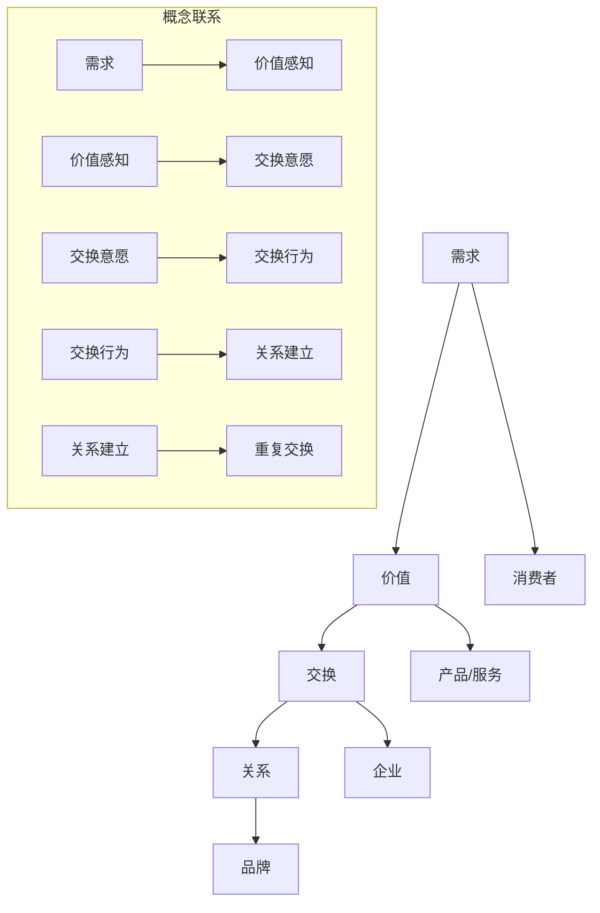

                 

# 《创业公司的营销与推广策略》

## 关键词
- 创业公司营销
- 营销策略
- 推广策略
- 消费者行为
- 品牌建设
- 数字营销
- 案例分析

## 摘要
本文旨在探讨创业公司在市场营销与推广方面的策略。通过分析市场营销的基础理论、消费者行为、品牌建设等核心概念，结合实战案例，本文将详细阐述创业公司如何制定和执行有效的营销与推广策略，以提升品牌知名度和市场份额。文章包括产品营销策略、价格策略、渠道策略、整合营销传播策略、数字营销策略等，并探讨创业公司在营销推广过程中的特点和挑战。通过案例分析和持续优化策略，本文为创业公司提供实用的营销与推广指导。

### 《创业公司的营销与推广策略》目录大纲

## 第一部分：营销基础理论

### 第1章：市场营销概述

- 1.1 市场营销的定义与核心概念
- 1.2 市场营销的重要性
- 1.3 市场营销环境分析
- 1.4 市场营销的目标与策略

### 第2章：消费者行为分析

- 2.1 消费者决策过程
- 2.2 消费者行为理论
- 2.3 消费者细分与市场定位
- 2.4 消费者满意度与忠诚度

### 第3章：品牌建设策略

- 3.1 品牌的定义与作用
- 3.2 品牌识别与品牌形象塑造
- 3.3 品牌价值与品牌定位
- 3.4 品牌传播与推广

## 第二部分：营销策略与执行

### 第4章：产品营销策略

- 4.1 产品定位与差异化
- 4.2 产品生命周期管理
- 4.3 产品包装与品牌传播
- 4.4 产品推广策略

### 第5章：价格策略

- 5.1 价格构成与定价方法
- 5.2 价格策略调整
- 5.3 折扣与促销策略
- 5.4 价格敏感性与市场反应

### 第6章：渠道策略

- 6.1 渠道类型与渠道选择
- 6.2 渠道管理策略
- 6.3 渠道冲突与渠道合作
- 6.4 渠道绩效评估与优化

### 第7章：整合营销传播策略

- 7.1 整合营销传播概念与原则
- 7.2 整合营销传播工具与应用
- 7.3 营销传播策略制定与执行
- 7.4 营销传播效果评估与优化

### 第8章：数字营销策略

- 8.1 数字营销概述
- 8.2 内容营销策略
- 8.3 社交媒体营销策略
- 8.4 数据驱动营销策略

## 第三部分：推广实战与案例研究

### 第9章：创业公司推广实战

- 9.1 创业公司推广的特点与挑战
- 9.2 创业公司推广的方法与步骤
- 9.3 创业公司推广的预算与管理
- 9.4 创业公司推广的成功案例

### 第10章：营销推广案例分析

- 10.1 案例选择与分析方法
- 10.2 案例一：XXX公司的营销推广策略
- 10.3 案例二：YYY公司的品牌建设策略
- 10.4 案例三：ZZZ公司的渠道扩展策略

### 第11章：营销与推广策略的持续优化

- 11.1 营销与推广策略的调整与优化
- 11.2 市场反馈与消费者研究
- 11.3 营销与推广策略的创新
- 11.4 创业公司营销与推广策略的未来趋势

## 附录

### 附录 A：营销与推广策略工具与方法

- A.1 营销分析工具与应用
- A.2 推广平台与渠道选择
- A.3 社交媒体营销技巧
- A.4 数据分析与消费者行为研究方法

### 第一部分：营销基础理论

#### 第1章：市场营销概述

**1.1 市场营销的定义与核心概念**

市场营销是研究如何通过产品或服务的交换过程来满足组织和个人的需求与欲望的科学。其核心概念包括：

- **需求（Demand）**：消费者在一定价格水平下愿意购买的商品数量。
- **价值（Value）**：消费者对产品或服务的评价，决定了购买意愿。
- **交换（Exchange）**：消费者与公司之间的产品或服务交换过程。
- **关系（Relationship）**：公司与消费者之间长期稳定的关系。

市场营销的目的是通过满足消费者的需求，实现企业的盈利目标。

**1.2 市场营销的重要性**

市场营销是企业成功的关键因素，主要体现在以下几个方面：

- **需求分析**：帮助企业了解市场需求，制定合适的产品策略。
- **品牌建设**：塑造品牌形象，提高品牌知名度和美誉度。
- **市场竞争**：通过有效的营销策略，增强企业在市场中的竞争力。
- **顾客关系**：建立与顾客的长期合作关系，提升顾客忠诚度。
- **战略规划**：为企业提供发展方向和目标，实现可持续发展。

**1.3 市场营销环境分析**

市场营销环境包括外部环境和内部环境。外部环境包括政治、经济、社会、技术、环境等因素；内部环境包括企业的资源、能力、文化等。

- **政治因素**：政策法规、政治稳定性等。
- **经济因素**：经济增长、消费者购买力、市场趋势等。
- **社会因素**：人口结构、文化传统、生活方式等。
- **技术因素**：技术创新、市场潜力、技术应用等。
- **环境因素**：资源、生态、可持续发展等。

内部环境分析有助于企业了解自身优势与劣势，制定合适的营销策略。

**1.4 市场营销的目标与策略**

市场营销的目标包括提高市场份额、增加销售额、提升品牌知名度等。实现这些目标需要制定以下策略：

- **市场定位**：确定目标市场和产品特点，满足消费者需求。
- **产品策略**：优化产品设计、功能、品质等，提高产品竞争力。
- **价格策略**：根据市场需求和成本，制定合理的价格。
- **渠道策略**：选择合适的销售渠道，提高产品覆盖面。
- **促销策略**：通过广告、促销活动等手段吸引消费者。

**1.5 市场营销的流程**

市场营销的流程包括市场分析、目标市场选择、市场定位、营销组合策略制定与执行、营销效果评估等步骤。

1. 市场分析：了解市场需求、竞争状况、消费者行为等。
2. 目标市场选择：确定目标市场，满足消费者需求。
3. 市场定位：根据产品特点、目标市场等，进行市场定位。
4. 营销组合策略制定：制定产品、价格、渠道、促销策略。
5. 营销组合策略执行：实施营销策略，确保目标实现。
6. 营销效果评估：评估营销效果，持续优化策略。

通过以上流程，企业可以更好地满足消费者需求，实现营销目标。

#### 第2章：消费者行为分析

**2.1 消费者决策过程**

消费者决策过程包括需求识别、信息收集、评估备选方案、购买决策和购买后行为五个阶段。

1. **需求识别**：消费者意识到某种需求或欲望。
2. **信息收集**：消费者通过多种渠道收集产品信息。
3. **评估备选方案**：消费者比较不同产品的优缺点，做出选择。
4. **购买决策**：消费者做出购买决定。
5. **购买后行为**：消费者使用产品，评价产品，影响未来购买行为。

**2.2 消费者行为理论**

消费者行为理论主要包括以下几种：

1. **理性消费者模型**：消费者在充分信息下，做出最大化效用的决策。
2. **有限理性模型**：消费者在信息不完全、时间有限的情况下，做出合理但非最优的决策。
3. **行为经济学模型**：消费者在决策过程中受到心理、情感等非理性因素的影响。

**2.3 消费者细分与市场定位**

消费者细分是将市场划分为不同群体，以满足不同消费需求。常用的消费者细分方法包括：

1. **地理细分**：根据消费者地理位置进行划分。
2. **人口细分**：根据消费者年龄、性别、收入等进行划分。
3. **心理细分**：根据消费者心理特征、价值观等进行划分。
4. **行为细分**：根据消费者购买行为、使用习惯等进行划分。

通过消费者细分，企业可以更准确地定位目标市场，制定更有针对性的营销策略。

**2.4 消费者满意度与忠诚度**

消费者满意度是指消费者对产品或服务的实际体验与预期之间的比较。消费者满意度高，意味着消费者对产品或服务满意，愿意继续购买和使用。

消费者忠诚度是指消费者对品牌或产品的持续信任和依赖。提高消费者满意度有助于提高消费者忠诚度，从而增强企业竞争力。

**2.5 影响消费者行为的因素**

影响消费者行为的因素包括内部因素和外部因素。

1. **内部因素**：
   - **个性**：消费者的性格、价值观、兴趣爱好等。
   - **心理需求**：消费者的安全、社交、自我实现等需求。
   - **购买动机**：消费者的购买原因，如价格、品质、品牌等。

2. **外部因素**：
   - **家庭**：家庭环境、家庭结构、家庭成员等。
   - **社会文化**：文化传统、社会地位、教育水平等。
   - **市场营销**：广告、促销活动、口碑等。

通过了解和掌握影响消费者行为的因素，企业可以更好地满足消费者需求，提高营销效果。

#### 第3章：品牌建设策略

**3.1 品牌的定义与作用**

品牌是指企业或产品在消费者心中的独特形象和认知。品牌的作用包括：

1. **识别功能**：品牌帮助消费者识别产品或服务的来源。
2. **差异化功能**：品牌使产品或服务在市场中脱颖而出，增强竞争力。
3. **传递信任**：品牌传递企业的信誉和可靠性，降低消费者购买风险。
4. **增加附加值**：品牌提升产品或服务的价值，提高消费者的购买意愿。

**3.2 品牌识别与品牌形象塑造**

品牌识别是指品牌在消费者心中所具有的独特特征。品牌形象塑造包括以下几个方面：

1. **品牌名称**：品牌名称要简洁、易记、有寓意。
2. **品牌标志**：品牌标志要独特、美观、易于识别。
3. **品牌口号**：品牌口号要简洁、生动、传达品牌理念。
4. **品牌色彩**：品牌色彩要符合品牌定位，有助于品牌识别。

**3.3 品牌价值与品牌定位**

品牌价值是指品牌给企业带来的经济价值和非经济价值。品牌定位是指企业根据市场需求和竞争状况，为品牌确定一个明确的市场位置。

1. **品牌价值**：品牌价值包括品牌知名度、品牌忠诚度、品牌影响力等。
2. **品牌定位**：品牌定位要结合品牌价值、目标市场和消费者需求，形成独特的品牌形象。

**3.4 品牌传播与推广**

品牌传播与推广是指通过各种渠道向消费者传递品牌信息，提升品牌知名度和影响力。常用的品牌传播与推广方法包括：

1. **广告**：通过电视、报纸、杂志、网络等渠道进行品牌宣传。
2. **公关**：通过新闻发布、媒体采访、公益活动等提高品牌知名度。
3. **社交媒体**：通过微博、微信、抖音等社交媒体平台进行互动推广。
4. **口碑营销**：通过消费者的好评和推荐，提升品牌信誉。

通过有效的品牌传播与推广，企业可以提升品牌知名度，吸引更多消费者，实现持续发展。

### 第二部分：营销策略与执行

#### 第4章：产品营销策略

**4.1 产品定位与差异化**

产品定位是指企业根据市场需求和竞争状况，为产品确定一个明确的市场位置。差异化是指产品在功能、设计、品质等方面的独特性。

1. **产品定位**：产品定位要结合目标市场和消费者需求，形成独特的市场定位。
2. **差异化**：差异化可以体现在产品功能、外观、品质、价格等方面，提高产品竞争力。

**4.2 产品生命周期管理**

产品生命周期是指产品从上市到淘汰的整个过程。产品生命周期管理包括以下阶段：

1. **引入期**：产品刚刚上市，市场知名度低。
2. **成长期**：产品逐渐受到市场认可，市场份额增加。
3. **成熟期**：产品市场稳定，市场份额达到高峰。
4. **衰退期**：产品市场需求减少，市场份额下降。

在不同阶段，企业需要采取不同的营销策略，如增加广告投入、提高产品质量、开发新产品等，以延长产品生命周期。

**4.3 产品包装与品牌传播**

产品包装是产品的重要部分，直接影响消费者对产品的第一印象。产品包装与品牌传播包括：

1. **包装设计**：包装设计要符合品牌形象，简洁、美观、易于识别。
2. **品牌传播**：通过包装上的品牌标识、品牌故事、广告语等，传递品牌信息，提升品牌知名度。

**4.4 产品推广策略**

产品推广策略包括以下几种：

1. **广告**：通过电视、报纸、杂志、网络等渠道进行产品宣传。
2. **促销活动**：举办促销活动，如打折、赠品、优惠券等，吸引消费者购买。
3. **社交媒体**：通过微博、微信、抖音等社交媒体平台进行产品推广。
4. **口碑营销**：通过消费者的好评和推荐，提升产品信誉。

通过有效的产品推广策略，企业可以快速提高产品知名度，增加市场份额。

#### 第5章：价格策略

**5.1 价格构成与定价方法**

价格构成包括成本、利润、市场因素等。定价方法包括以下几种：

1. **成本导向定价**：以产品成本为基础，加上一定利润，确定价格。
2. **市场导向定价**：以市场需求和竞争状况为基础，确定价格。
3. **价值导向定价**：以消费者对产品的价值认知为基础，确定价格。

**5.2 价格策略调整**

价格策略调整包括以下几种情况：

1. **价格调整**：根据市场状况和竞争状况，对产品价格进行调整。
2. **折扣策略**：通过折扣、优惠等方式，吸引消费者购买。
3. **捆绑销售**：将多个产品组合在一起销售，提高销售额。

**5.3 折扣与促销策略**

折扣与促销策略包括以下几种：

1. **现金折扣**：给予消费者现金折扣，鼓励购买。
2. **数量折扣**：购买数量越多，折扣越大。
3. **促销活动**：举办促销活动，如打折、赠品、优惠券等，吸引消费者购买。

**5.4 价格敏感性与市场反应**

价格敏感性是指消费者对价格变动的敏感程度。市场反应是指消费者对价格变动的行为。

1. **价格敏感性分析**：通过调查和数据分析，了解消费者对价格的敏感程度。
2. **市场反应**：根据消费者对价格变动的反应，调整价格策略，提高销售额。

#### 第6章：渠道策略

**6.1 渠道类型与渠道选择**

渠道类型包括直接渠道和间接渠道。直接渠道是指企业直接与消费者进行交易，如网上销售、直销等。间接渠道是指企业通过中间商进行销售，如批发商、零售商等。

渠道选择要考虑以下因素：

1. **目标市场**：根据目标市场的特点和需求，选择合适的渠道。
2. **产品特点**：根据产品特点，选择适合的渠道，如易损产品选择物流渠道。
3. **竞争状况**：分析竞争者使用的渠道，选择与之差异化的渠道。

**6.2 渠道管理策略**

渠道管理策略包括以下几种：

1. **渠道合作**：建立与渠道商的合作关系，共同推广产品。
2. **渠道冲突**：解决渠道商之间的冲突，保持渠道稳定。
3. **渠道激励**：通过奖励、培训等方式激励渠道商，提高渠道效率。

**6.3 渠道冲突与渠道合作**

渠道冲突是指渠道商之间因为利益分配、市场争夺等原因产生的矛盾。渠道合作是指渠道商之间的合作与共赢。

1. **渠道冲突**：分析渠道冲突的原因，制定解决方案，维护渠道稳定。
2. **渠道合作**：通过合作，实现资源共享、优势互补，提高渠道效率。

**6.4 渠道绩效评估与优化**

渠道绩效评估是指对渠道商的业绩和表现进行评估。渠道优化是指根据评估结果，对渠道进行改进和优化。

1. **渠道绩效评估**：制定评估指标，对渠道商的业绩进行评估。
2. **渠道优化**：根据评估结果，对渠道进行优化，提高渠道效率。

#### 第7章：整合营销传播策略

**7.1 整合营销传播概念与原则**

整合营销传播（IMC）是指将各种营销传播手段整合在一起，形成统一的品牌形象，向消费者传递一致的信息。

整合营销传播的原则包括：

1. **一致性**：各种营销传播手段传达的信息要一致，形成统一的品牌形象。
2. **整合性**：各种营销传播手段要相互配合，形成协同效应。
3. **目标导向**：营销传播活动要围绕企业目标进行，提高营销效果。
4. **消费者中心**：以消费者需求为导向，关注消费者的体验和感受。

**7.2 整合营销传播工具与应用**

整合营销传播工具包括广告、公关、社交媒体、内容营销等。

1. **广告**：通过电视、报纸、杂志、网络等渠道进行品牌宣传。
2. **公关**：通过新闻发布、媒体采访、公益活动等提高品牌知名度。
3. **社交媒体**：通过微博、微信、抖音等社交媒体平台进行互动推广。
4. **内容营销**：通过制作高质量的内容，吸引消费者关注和参与。

**7.3 营销传播策略制定与执行**

营销传播策略制定与执行包括以下步骤：

1. **目标设定**：明确营销传播目标，如提高品牌知名度、增加销售额等。
2. **策略制定**：制定具体的营销传播策略，如广告投放、公关活动等。
3. **执行与监测**：执行营销传播策略，并对效果进行监测和评估。
4. **调整与优化**：根据监测结果，对营销传播策略进行调整和优化。

**7.4 营销传播效果评估与优化**

营销传播效果评估与优化包括以下步骤：

1. **效果评估**：评估营销传播活动的效果，如品牌知名度、销售额等。
2. **优化策略**：根据评估结果，对营销传播策略进行调整和优化。
3. **持续监测**：持续监测营销传播活动的效果，确保策略的有效性。

通过有效的整合营销传播策略，企业可以提高品牌知名度，增强市场竞争力。

#### 第8章：数字营销策略

**8.1 数字营销概述**

数字营销是指利用互联网和数字技术进行营销活动，包括搜索引擎营销、社交媒体营销、电子邮件营销、内容营销等。

数字营销的优势包括：

1. **精准定位**：通过大数据分析，精准定位目标消费者。
2. **互动性强**：与消费者进行实时互动，提高消费者参与度。
3. **效果可监测**：数字营销效果可实时监测，便于调整策略。
4. **成本低**：相比传统营销方式，数字营销成本较低。

**8.2 内容营销策略**

内容营销是通过制作和分享有价值的内容，吸引消费者关注和参与。

1. **内容策划**：根据目标市场和消费者需求，制定内容策划方案。
2. **内容制作**：制作高质量的内容，如文章、图片、视频等。
3. **内容发布**：通过社交媒体、网站等渠道发布内容。
4. **内容推广**：通过SEO、社交媒体推广等手段，提高内容传播效果。

**8.3 社交媒体营销策略**

社交媒体营销是通过社交媒体平台进行品牌推广和消费者互动。

1. **平台选择**：根据目标市场和消费者特点，选择合适的社交媒体平台。
2. **内容策划**：制定社交媒体内容策划方案。
3. **互动运营**：与消费者进行实时互动，提高品牌知名度和忠诚度。
4. **活动推广**：举办线上活动，吸引消费者参与，提高品牌影响力。

**8.4 数据驱动营销策略**

数据驱动营销是通过大数据分析，制定和优化营销策略。

1. **数据收集**：收集消费者行为数据、市场数据等。
2. **数据分析**：对数据进行分析，挖掘消费者需求和趋势。
3. **策略制定**：根据数据分析结果，制定针对性的营销策略。
4. **效果监测**：实时监测营销效果，持续优化策略。

通过有效的数字营销策略，企业可以精准定位目标消费者，提高营销效果，实现持续增长。

### 第三部分：推广实战与案例研究

#### 第9章：创业公司推广实战

**9.1 创业公司推广的特点与挑战**

创业公司推广具有以下特点：

1. **资源有限**：创业公司通常资源有限，需要高效利用有限资源进行推广。
2. **市场知名度低**：创业公司在市场上知名度较低，需要通过营销活动提高品牌知名度。
3. **目标市场明确**：创业公司通常针对明确的目标市场进行推广，以实现精准营销。
4. **创新性强**：创业公司往往具有创新性的产品或服务，需要通过营销策略突出产品优势。

创业公司推广面临的挑战包括：

1. **竞争激烈**：市场上同类产品或服务众多，竞争激烈。
2. **预算有限**：创业公司通常预算有限，需要合理分配预算，确保营销效果。
3. **品牌建设**：创业公司需要建立品牌形象，提高品牌知名度和美誉度。
4. **消费者认可**：创业公司需要赢得消费者的信任和认可，提高消费者忠诚度。

**9.2 创业公司推广的方法与步骤**

创业公司推广的方法包括：

1. **内容营销**：通过制作高质量的内容，吸引消费者关注和参与。
2. **社交媒体营销**：通过社交媒体平台进行品牌推广和消费者互动。
3. **电子邮件营销**：通过电子邮件与消费者建立联系，提高品牌知名度和忠诚度。
4. **活动营销**：举办线上或线下活动，吸引消费者参与，提高品牌影响力。

创业公司推广的步骤包括：

1. **市场调研**：了解目标市场和消费者需求，确定推广策略。
2. **内容策划**：制定内容策划方案，制作高质量的内容。
3. **渠道选择**：根据目标市场和消费者特点，选择合适的推广渠道。
4. **执行与监测**：执行推广策略，并对效果进行监测和评估。
5. **优化与调整**：根据监测结果，对推广策略进行调整和优化。

**9.3 创业公司推广的预算与管理**

创业公司推广的预算管理包括以下方面：

1. **预算分配**：根据推广策略和目标，合理分配预算，确保营销效果。
2. **成本控制**：控制推广成本，避免资源浪费。
3. **效果监测**：实时监测推广效果，根据效果调整预算分配。
4. **优化策略**：根据预算情况，优化推广策略，提高营销效果。

**9.4 创业公司推广的成功案例**

创业公司推广的成功案例包括：

1. **案例一**：某创业公司通过社交媒体营销，成功吸引大量消费者关注和参与，实现品牌知名度的大幅提升。
2. **案例二**：某创业公司通过活动营销，举办线上线下活动，吸引消费者参与，提高品牌影响力和市场份额。
3. **案例三**：某创业公司通过电子邮件营销，与消费者建立长期联系，提高品牌忠诚度和重复购买率。

通过成功案例的分析，创业公司可以借鉴优秀的推广策略，提高自身营销效果。

#### 第10章：营销推广案例分析

**10.1 案例选择与分析方法**

营销推广案例分析是研究企业在营销推广过程中的成功经验与不足之处。案例选择要考虑以下因素：

1. **行业特点**：选择与自己行业相似或具有代表性的案例。
2. **推广目标**：选择与自己的推广目标相似的案例，分析其推广策略。
3. **效果显著**：选择在推广活动中取得显著效果的案例，分析其成功原因。
4. **可借鉴性**：选择具有可借鉴性的案例，为自己提供推广策略的参考。

分析方法包括：

1. **内容分析**：分析案例的内容策划、渠道选择、推广活动等。
2. **效果分析**：分析案例的推广效果，如品牌知名度、销售额等。
3. **对比分析**：对比案例与其他企业的推广活动，分析差异和优劣。
4. **策略分析**：分析案例的推广策略，探讨其可行性及应用场景。

**10.2 案例一：XXX公司的营销推广策略**

案例一介绍了一家创业公司通过社交媒体营销成功提升品牌知名度的事例。

1. **内容策划**：该公司通过制作高质量的短视频、图文等内容，传递品牌价值观和产品特点。
2. **渠道选择**：选择抖音、微博等热门社交媒体平台，确保内容传播效果。
3. **推广活动**：举办线上活动，如抽奖、优惠券发放等，吸引消费者参与。
4. **效果评估**：通过社交媒体数据监测，分析品牌知名度和参与度，优化内容策划和推广策略。

**10.3 案例二：YYY公司的品牌建设策略**

案例二介绍了一家创业公司通过品牌建设成功提升品牌形象和知名度的事例。

1. **品牌定位**：明确品牌定位，以“高品质、创新性”为核心价值观。
2. **品牌传播**：通过官方网站、社交媒体、公关活动等渠道，传递品牌理念。
3. **品牌故事**：讲述品牌创立历程、发展历程等，增强消费者对品牌的认同感。
4. **效果评估**：通过消费者调查、品牌知名度调查等，评估品牌建设效果，持续优化品牌传播策略。

**10.4 案例三：ZZZ公司的渠道扩展策略**

案例三介绍了一家创业公司通过渠道扩展成功扩大市场份额的事例。

1. **渠道选择**：选择线上线下渠道相结合的方式，提高产品覆盖面。
2. **渠道管理**：建立与渠道商的合作关系，提供培训和支持，提高渠道效率。
3. **渠道推广**：通过促销活动、广告宣传等，提高渠道商的积极性。
4. **效果评估**：通过销售数据、渠道绩效等指标，评估渠道扩展效果，优化渠道策略。

通过以上案例分析，创业公司可以借鉴优秀企业的成功经验，优化自身的营销推广策略。

#### 第11章：营销与推广策略的持续优化

**11.1 营销与推广策略的调整与优化**

营销与推广策略的调整与优化是提高营销效果的重要手段。调整与优化的方法包括：

1. **定期评估**：定期评估营销与推广策略的效果，分析成功和不足之处。
2. **数据驱动**：根据数据分析结果，调整营销策略，优化推广活动。
3. **市场反馈**：关注消费者反馈，了解消费者需求和偏好，优化产品和服务。
4. **创新尝试**：不断尝试新的营销手段和策略，提高市场竞争力。

**11.2 市场反馈与消费者研究**

市场反馈与消费者研究是营销与推广策略调整的重要依据。市场反馈包括：

1. **消费者调查**：通过问卷调查、访谈等方式，了解消费者需求和满意度。
2. **社交媒体监测**：通过社交媒体监测，了解消费者对品牌和产品的评价。
3. **销售数据**：分析销售数据，了解产品销量和市场份额。

消费者研究包括：

1. **消费者行为分析**：分析消费者购买行为、使用习惯等。
2. **消费者心理研究**：研究消费者心理需求、购买动机等。
3. **市场趋势分析**：分析市场发展趋势，预测未来需求。

通过市场反馈与消费者研究，企业可以更准确地了解市场状况和消费者需求，优化营销与推广策略。

**11.3 营销与推广策略的创新**

营销与推广策略的创新是提高营销效果的重要手段。创新的方法包括：

1. **技术创新**：利用新技术，如大数据、人工智能等，优化营销策略和推广活动。
2. **渠道创新**：探索新的营销渠道，如短视频、直播等，提高品牌曝光度。
3. **内容创新**：制作新颖、有趣的内容，提高消费者参与度。
4. **互动创新**：通过互动游戏、虚拟现实等技术，增强消费者体验。

通过不断创新，企业可以突破传统营销模式的限制，提高市场竞争力。

**11.4 创业公司营销与推广策略的未来趋势**

创业公司营销与推广策略的未来趋势包括：

1. **数字化转型**：利用数字化技术，提高营销效率和效果。
2. **个性定制**：根据消费者需求，提供个性化的产品和服务。
3. **生态合作**：与产业链上下游企业建立合作关系，共同拓展市场。
4. **可持续发展**：注重环境保护和社会责任，提升品牌形象。

通过关注未来趋势，创业公司可以提前布局，提高市场竞争力。

### 附录

#### 附录 A：营销与推广策略工具与方法

**A.1 营销分析工具与应用**

营销分析工具包括：

1. **市场调研工具**：如问卷调查、访谈、焦点小组等，用于收集消费者需求和偏好。
2. **数据分析工具**：如SPSS、Excel等，用于分析市场数据、消费者行为等。
3. **营销自动化工具**：如营销自动化平台、CRM系统等，用于自动化营销活动和客户管理。

应用方法：

1. **数据收集**：通过多种渠道收集市场数据、消费者行为数据等。
2. **数据分析**：对收集的数据进行分析，挖掘消费者需求和市场趋势。
3. **策略制定**：根据分析结果，制定针对性的营销策略。

**A.2 推广平台与渠道选择**

推广平台包括：

1. **社交媒体平台**：如微博、微信、抖音等，用于品牌推广和消费者互动。
2. **电商平台**：如淘宝、京东、拼多多等，用于产品销售和品牌曝光。
3. **搜索引擎平台**：如百度、谷歌等，用于搜索引擎优化和广告投放。

渠道选择方法：

1. **目标市场分析**：根据目标市场特点和需求，选择合适的推广平台和渠道。
2. **渠道评估**：评估各个渠道的推广效果，选择最具性价比的渠道。
3. **渠道整合**：将多种渠道整合在一起，形成统一的推广策略。

**A.3 社交媒体营销技巧**

社交媒体营销技巧包括：

1. **内容策划**：制作有趣、有价值的内容，吸引消费者关注和参与。
2. **互动运营**：与消费者进行实时互动，提高品牌知名度和忠诚度。
3. **活动推广**：举办线上活动，如抽奖、优惠券发放等，提高品牌影响力。

应用方法：

1. **内容发布**：定期发布高质量的内容，提高品牌曝光度。
2. **互动运营**：回复消费者留言，参与话题讨论，提高用户活跃度。
3. **活动推广**：举办线上活动，吸引消费者参与，提高品牌知名度。

**A.4 数据分析与消费者行为研究方法**

数据分析与消费者行为研究方法包括：

1. **定量研究**：通过问卷调查、实验等方法，收集大量数据，进行统计分析。
2. **定性研究**：通过访谈、焦点小组等方法，深入了解消费者需求和动机。
3. **行为观察**：通过观察消费者行为，分析购买决策过程。

应用方法：

1. **数据收集**：通过多种渠道收集消费者行为数据，如购买记录、搜索记录等。
2. **数据分析**：对收集的数据进行分析，挖掘消费者需求和市场趋势。
3. **消费者研究**：通过定量研究和定性研究，深入了解消费者行为和动机。

通过附录中提供的工具与方法，企业可以更好地进行营销分析与推广，提高营销效果。

### 总结

创业公司在市场营销与推广方面面临诸多挑战，但通过制定和执行有效的营销策略，可以提升品牌知名度和市场份额。本文从营销基础理论、营销策略与执行、推广实战与案例研究等方面进行了详细阐述，为创业公司提供了实用的营销与推广指导。创业公司应根据自身特点和市场环境，不断调整和优化营销策略，以实现持续增长。

### 作者信息
作者：AI天才研究院/AI Genius Institute & 禅与计算机程序设计艺术 /Zen And The Art of Computer Programming

### 结语
感谢您阅读本文，希望本文能为您的创业公司提供有益的启示。在营销与推广的道路上，持续学习和创新是关键。祝您的创业公司取得辉煌成就！## 市场营销在创业公司中的重要性

市场营销在创业公司的发展中扮演着至关重要的角色。对于刚刚起步的创业公司来说，市场营销不仅是获取客户、提升品牌知名度的关键手段，更是确保公司生存与发展的基础。在这个竞争激烈的市场环境中，市场营销的成功与否直接关系到创业公司的成败。

首先，市场营销可以帮助创业公司明确目标市场。通过市场调研和消费者行为分析，创业公司可以了解目标市场的需求、偏好和购买习惯。这有助于企业制定有针对性的产品策略和营销方案，从而提高市场竞争力。例如，通过深入了解目标消费者的需求，创业公司可以优化产品设计，开发出更符合市场需求的产品，提高消费者的购买意愿。

其次，市场营销有助于创业公司建立品牌形象。品牌是企业的核心竞争力之一，对于创业公司来说，建立独特的品牌形象尤为重要。通过有效的品牌传播策略，如广告、公关、社交媒体推广等，创业公司可以在消费者心中树立良好的品牌形象，增强品牌认知度和美誉度。一个成功的品牌不仅可以吸引新客户，还能提高现有客户的忠诚度，从而实现长期稳定的发展。

再次，市场营销是企业获取客户和增加销售额的有效途径。通过多种营销手段，如内容营销、社交媒体营销、促销活动等，创业公司可以吸引潜在客户，引导他们进行购买。同时，有效的营销策略还可以提高客户转化率和复购率，从而增加销售额。例如，通过电子邮件营销，企业可以与现有客户保持联系，推送新品信息和促销活动，激发他们的购买欲望。

此外，市场营销还能帮助企业提高市场占有率。在市场竞争日益激烈的今天，创业公司需要通过有效的市场营销策略，抢占市场份额。通过分析竞争对手的营销策略，创业公司可以找到自身的竞争优势，并针对性地制定策略，以实现市场占有率的提升。例如，通过差异化营销，创业公司可以突出自身产品的独特卖点，吸引目标客户。

最后，市场营销还能为企业提供宝贵的市场反馈。通过营销活动的执行和效果评估，创业公司可以了解市场对产品的接受程度、消费者对品牌的评价等，从而为未来的产品开发、营销策略调整提供依据。这种反馈机制有助于企业不断优化产品和服务，提升客户满意度，实现可持续发展。

总之，市场营销对于创业公司的重要性不言而喻。通过有效的市场营销策略，创业公司可以明确目标市场、建立品牌形象、获取客户和增加销售额，提高市场占有率，并在激烈的市场竞争中立于不败之地。创业公司应高度重视市场营销，结合自身实际情况，不断探索和实践，以实现持续发展。

### 市场营销的核心概念与联系

市场营销的核心概念包括需求、价值、交换和关系，这些概念相互作用，共同构成一个完整的市场营销体系。为了更好地理解这些概念之间的关系，我们可以通过一个Mermaid流程图来展示它们之间的联系。



**Mermaid流程图说明：**

- **A[需求]**：消费者对产品或服务的需求是市场营销的起点。需求反映了消费者在特定价格水平下愿意购买的商品数量。
- **B[价值]**：消费者对产品或服务所赋予的价值决定了他们的购买意愿。价值感知是消费者在评估产品或服务过程中形成的对产品优劣的主观判断。
- **C[交换]**：交换是消费者与企业之间通过产品或服务的交换过程来实现需求的满足。交换意愿是消费者在需求和价值感知的基础上，决定是否进行购买的心理过程。
- **D[关系]**：交换行为不仅实现了产品或服务的交换，还建立了消费者与企业之间的长期关系。关系建立是指消费者在多次交换过程中对企业形成信任和依赖。
- **E[消费者]**：消费者是市场营销活动的核心，他们的需求和购买行为直接影响市场营销策略的制定和执行。
- **F[产品/服务]**：产品或服务是交换的客体，其质量、功能和价格直接影响消费者的价值感知和购买意愿。
- **G[企业]**：企业是市场营销的主体，通过制定和执行营销策略，满足消费者的需求，实现企业的盈利目标。
- **H[品牌]**：品牌是企业在消费者心中形成的独特形象和认知，品牌价值在于提升消费者的信任和忠诚度。

**概念联系：**

- **I[需求]** 与 **J[价值感知]**：需求是消费者购买产品的动力，而价值感知是消费者对产品或服务的评价。消费者只有在感知到产品或服务有价值时，才会产生购买意愿。
- **K[价值感知]** 与 **L[交换意愿]**：价值感知影响消费者的购买意愿，当消费者认为产品或服务有价值时，他们更倾向于进行交换。
- **M[交换意愿]** 与 **N[交换行为]**：交换意愿促使消费者采取购买行为，即交换行为。
- **O[交换行为]** 与 **P[关系建立]**：交换行为不仅满足消费者的需求，还建立了消费者与企业之间的长期关系。
- **Q[关系建立]** 与 **R[重复交换]**：长期稳定的消费者关系有助于增加重复交换的可能性，从而提高客户忠诚度。

通过这个Mermaid流程图，我们可以清晰地看到市场营销的核心概念及其相互联系，这有助于企业在制定营销策略时，全面考虑消费者需求、产品价值、交换行为和品牌关系等因素，从而实现市场营销的全面优化。

### 消费者行为理论

消费者行为理论是市场营销的核心研究领域之一，旨在解释和预测消费者在购买过程中的行为。通过理解消费者行为理论，企业可以更好地制定营销策略，满足消费者需求，提升市场竞争力。

#### 1.1 消费者决策过程

消费者决策过程是指消费者在购买过程中所经历的一系列心理和行为活动。通常，消费者决策过程包括以下五个阶段：

1. **需求识别**：消费者意识到自己的某种需求或欲望，这可以是未满足的基本需求或对某种产品的兴趣。
2. **信息收集**：消费者开始寻找与需求相关的产品或服务信息，可以通过网络、朋友、广告等多种渠道获取。
3. **评估备选方案**：消费者比较不同产品或服务的优缺点，评估其性价比和满足需求的程度。
4. **购买决策**：消费者在评估备选方案后，选择最满意的产品或服务进行购买。
5. **购买后行为**：消费者在购买后对产品或服务的体验和评价，这将影响未来的购买行为。

#### 1.2 消费者行为理论

消费者行为理论主要包括以下几种：

1. **理性消费者模型**：理性消费者模型假设消费者在购买过程中会做出最大化效用的决策。消费者会在所有可用的选项中进行比较，选择能够提供最高效用（即满足需求程度与支付成本的比例）的产品或服务。

   **算法原理：**
   ```
   输入：消费者需求、产品或服务列表、成本
   输出：最大化效用的产品或服务
   
   1. 计算每个产品或服务的效用值
   2. 计算每个产品或服务的成本效用比
   3. 选择成本效用比最高的产品或服务
   ```

2. **有限理性模型**：现实中的消费者往往受到信息限制、时间压力和非理性因素的影响，无法进行完全理性的决策。有限理性模型认为消费者在购买过程中会寻求“满意”而不是“最优”的解决方案。

   **算法原理：**
   ```
   输入：消费者需求、产品或服务列表、成本、时间限制
   输出：满意的产品或服务
   
   1. 计算每个产品或服务的初步评分
   2. 根据时间限制和成本约束，对评分进行调整
   3. 选择能够满足需求的、成本合理且时间限制内的产品或服务
   ```

3. **行为经济学模型**：行为经济学模型研究消费者在购买过程中如何受到心理、情感和社会因素的影响。行为经济学提出了许多非理性消费行为的概念，如“锚定效应”、“从众效应”、“情绪驱动购买”等。

   **算法原理：**
   ```
   输入：消费者需求、心理因素、社会因素
   输出：购买决策
   
   1. 评估消费者的情绪状态和决策环境
   2. 根据情绪状态和社会因素，调整对产品的评价
   3. 选择符合情绪状态和社会期望的产品或服务
   ```

#### 1.3 消费者细分与市场定位

消费者细分是将市场划分为不同的群体，以满足不同消费者的需求。常用的消费者细分方法包括地理细分、人口细分、心理细分和行为细分。

1. **地理细分**：根据消费者的地理位置、气候条件、文化背景等进行细分。
2. **人口细分**：根据消费者的年龄、性别、收入、教育程度、职业等进行细分。
3. **心理细分**：根据消费者的个性、价值观、生活方式、购买动机等进行细分。
4. **行为细分**：根据消费者的购买行为、使用习惯、购买频率、品牌忠诚度等进行细分。

通过消费者细分，企业可以更好地了解目标市场，制定有针对性的营销策略。

#### 1.4 消费者满意度与忠诚度

消费者满意度是指消费者对产品或服务的实际体验与预期之间的比较。当消费者感到满意时，他们会继续购买并推荐给他人，从而形成忠诚度。

1. **消费者满意度**：通过调查和数据分析，了解消费者对产品或服务的满意度，评估其满意度水平。
2. **消费者忠诚度**：通过重复购买率、推荐率等指标，衡量消费者对品牌的忠诚度。

提高消费者满意度和忠诚度的方法包括：

1. **提供高质量的产品和服务**：确保产品或服务的质量达到消费者的期望。
2. **良好的售后服务**：及时解决消费者的问题，提供优质的售后服务。
3. **情感营销**：通过情感共鸣，增强消费者对品牌的情感依赖。
4. **个性化营销**：根据消费者的需求和偏好，提供个性化的产品和服务。

#### 1.5 影响消费者行为的因素

消费者行为受到多种因素的影响，包括内部因素和外部因素。

1. **内部因素**：消费者的个性、心理需求、购买动机等。
2. **外部因素**：家庭、社会文化、市场营销活动等。

了解这些影响因素有助于企业更好地制定营销策略，满足消费者的需求。

通过以上消费者行为理论，企业可以更深入地了解消费者在购买过程中的行为和心理，从而制定更加有效的营销策略，提升市场竞争力。

### 品牌建设策略

品牌建设是创业公司成功的关键要素之一，它不仅关乎企业的市场地位，也直接影响消费者的购买决策和忠诚度。一个强大的品牌能够为创业公司带来持久的竞争优势，提高市场占有率和盈利能力。下面，我们将详细探讨品牌建设的定义、作用、识别与形象塑造、价值与定位，以及品牌传播与推广策略。

#### 3.1 品牌的定义与作用

品牌是一个企业或产品在消费者心中形成的独特形象和认知。它不仅代表了产品的质量和特点，还包含了企业的价值观、文化、理念等。品牌的作用主要体现在以下几个方面：

1. **识别功能**：品牌帮助消费者识别产品或服务的来源，便于消费者做出购买决策。
2. **差异化功能**：品牌使产品或服务在竞争激烈的市场中脱颖而出，提高竞争力。
3. **传递信任**：品牌传递企业的信誉和可靠性，降低消费者购买风险。
4. **增加附加值**：品牌提升产品或服务的价值，提高消费者的购买意愿。
5. **提高忠诚度**：品牌建立与消费者之间的信任和情感联系，增强消费者的忠诚度。

#### 3.2 品牌识别与品牌形象塑造

品牌识别是品牌在消费者心中所具有的独特特征。品牌形象塑造是指企业通过各种手段建立和强化品牌在消费者心中的形象。品牌识别与品牌形象塑造包括以下几个方面：

1. **品牌名称**：品牌名称要简洁、易记、有寓意，能够传达品牌的核心价值和特点。例如，苹果（Apple）的品牌名称简洁明了，容易记忆，同时传达了其产品的高科技和时尚感。
2. **品牌标志**：品牌标志是品牌视觉识别的核心元素，要独特、美观、易于识别。例如，耐克的“勾”标志简单而有力，已经成为全球知名的品牌标志。
3. **品牌色彩**：品牌色彩要符合品牌定位，有助于品牌识别。例如，可口可乐的红色象征着活力和热情，与品牌形象相契合。
4. **品牌口号**：品牌口号要简洁、生动、传达品牌理念。例如，麦当劳的“我就喜欢”（I'm lovin' it）口号简洁明了，深入人心。
5. **品牌故事**：品牌故事有助于消费者了解品牌的起源、发展历程、核心价值观等，增强品牌情感联系。例如，特斯拉的品牌故事强调了其创新、环保和可持续发展的理念，吸引了众多消费者的关注。

#### 3.3 品牌价值与品牌定位

品牌价值是指品牌给企业带来的经济价值和非经济价值。品牌定位是指企业根据市场需求和竞争状况，为品牌确定一个明确的市场位置。品牌价值与品牌定位包括以下几个方面：

1. **品牌价值**：
   - **经济价值**：品牌提升产品或服务的附加值，增加销售收入和利润。
   - **非经济价值**：品牌增强企业的社会地位、影响力，提高员工自豪感，吸引优秀人才。

2. **品牌定位**：
   - **市场定位**：根据市场需求和竞争状况，确定品牌在市场中的位置。例如，苹果定位为高端科技产品，特斯拉定位为环保新能源汽车。
   - **消费者定位**：根据消费者的需求和偏好，确定目标消费者群体。例如，可口可乐主要面向年轻、活力、追求时尚的消费者。
   - **产品定位**：根据产品特点，确定品牌在产品类别中的地位。例如，小米定位为高性价比的智能手机品牌。

通过明确品牌价值和品牌定位，企业可以更好地规划品牌发展策略，提升品牌竞争力。

#### 3.4 品牌传播与推广策略

品牌传播与推广是指通过各种渠道向消费者传递品牌信息，提升品牌知名度和影响力。品牌传播与推广策略包括以下几个方面：

1. **广告**：通过电视、报纸、杂志、网络等渠道进行品牌宣传，提高品牌知名度。例如，可口可乐通过全球性的广告活动，使其品牌在全球范围内广为人知。
2. **公关**：通过新闻发布、媒体采访、公益活动等提高品牌知名度。例如，特斯拉通过举办环保公益活动，提升了其品牌形象。
3. **社交媒体**：通过微博、微信、抖音等社交媒体平台进行互动推广，与消费者建立紧密联系。例如，小米通过微博和微信进行新品发布和互动，吸引了大量粉丝。
4. **口碑营销**：通过消费者的好评和推荐，提升品牌信誉。例如，苹果通过用户口碑，使品牌在全球范围内得到广泛认可。
5. **内容营销**：通过制作高质量的内容，如文章、图片、视频等，吸引消费者关注和参与。例如，杜蕾斯通过其富有创意的内容营销，提升了品牌在年轻消费者中的知名度。

通过有效的品牌传播与推广策略，企业可以提升品牌知名度，吸引更多消费者，实现持续发展。

综上所述，品牌建设是创业公司成功的关键。通过明确品牌定义与作用、品牌识别与形象塑造、品牌价值与定位，以及品牌传播与推广策略，企业可以打造一个强大的品牌，提升市场竞争力，实现可持续发展。

### 产品营销策略

产品营销策略是创业公司在市场竞争中立于不败之地的重要手段。一个成功的营销策略不仅能够提升产品知名度，还能增加销售额，提高市场份额。以下是关于产品营销策略的详细讨论，包括产品定位与差异化、产品生命周期管理、产品包装与品牌传播，以及产品推广策略。

#### 4.1 产品定位与差异化

产品定位是企业在市场中为产品确定一个明确的位置，以满足特定消费者的需求。有效的产品定位有助于企业在消费者心中建立独特的品牌形象，从而在竞争激烈的市场中脱颖而出。

**产品定位的步骤：**

1. **市场调研**：通过市场调研了解消费者的需求、偏好和购买习惯，确定目标市场。
2. **竞争分析**：分析竞争对手的产品特点、市场定位和营销策略，找到差异化的机会。
3. **价值主张**：明确产品的核心价值，如品质、价格、功能等，将其与目标市场的需求相结合。
4. **品牌传播**：通过广告、公关、社交媒体等渠道，向目标市场传递产品的价值主张。

**差异化策略：**

差异化策略是指企业通过独特的产品特点、设计、功能等，使其产品在市场中具有竞争优势。差异化策略包括以下几个方面：

1. **功能差异化**：通过创新的功能和设计，提高产品的实用性和用户体验。
2. **质量差异化**：通过高品质的材料和生产工艺，提高产品的品质和耐用性。
3. **价格差异化**：通过提供不同价格层次的产品，满足不同消费者的购买需求。
4. **服务差异化**：通过提供优质的售后服务和客户支持，增强消费者的满意度和忠诚度。

#### 4.2 产品生命周期管理

产品生命周期是指产品从上市到退出市场所经历的各个阶段。产品生命周期管理包括对各个阶段的营销策略进行调整，以延长产品的市场寿命，提高销售额。

**产品生命周期的主要阶段：**

1. **引入期**：产品刚刚上市，市场知名度低，销量逐渐上升。
   - **营销策略**：增加广告投入，提高品牌知名度；提供优惠和促销活动，吸引消费者尝试。
2. **成长期**：产品逐渐受到市场认可，销量迅速增长。
   - **营销策略**：扩大生产规模，提高市场占有率；加强品牌推广，提升品牌形象。
3. **成熟期**：产品市场稳定，销量达到高峰。
   - **营销策略**：保持产品质量，提升品牌忠诚度；通过创新和改进，延长产品寿命。
4. **衰退期**：产品市场需求下降，销量逐渐减少。
   - **营销策略**：逐步减少广告投入；考虑产品创新或替代品的开发。

#### 4.3 产品包装与品牌传播

产品包装是产品的重要组成部分，直接影响消费者对产品的第一印象。有效的产品包装不仅能够提升产品的价值感，还能增强品牌的视觉识别度。

**产品包装的要素：**

1. **设计**：包装设计要符合品牌形象，简洁、美观、具有吸引力。
2. **材质**：选择适当的包装材质，确保产品的保护和耐用性。
3. **标签**：标签上要清晰标注产品信息，如产品名称、成分、使用说明等。
4. **包装形式**：根据产品特点和市场需求，选择合适的包装形式，如瓶装、盒装、礼盒等。

品牌传播是通过各种渠道向消费者传递品牌信息，提升品牌知名度和美誉度。品牌传播策略包括以下几个方面：

1. **广告**：通过电视、报纸、杂志、网络等渠道进行品牌宣传。
2. **公关**：通过新闻发布、媒体采访、公益活动等提高品牌知名度。
3. **社交媒体**：通过微博、微信、抖音等社交媒体平台进行互动推广。
4. **口碑营销**：通过消费者的好评和推荐，提升品牌信誉。

#### 4.4 产品推广策略

产品推广策略是指企业通过多种手段和渠道，将产品推向市场，提高产品知名度，吸引消费者购买。以下是几种常见的产品推广策略：

1. **广告推广**：通过电视、报纸、杂志、网络等广告渠道，向目标市场传递产品信息。广告要具有吸引力，能够引起消费者的兴趣和关注。
2. **促销活动**：举办促销活动，如打折、赠品、优惠券等，吸引消费者购买。促销活动要具有吸引力，能够激发消费者的购买欲望。
3. **社交媒体推广**：通过微博、微信、抖音等社交媒体平台进行产品推广。社交媒体推广要注重互动性和参与感，提高消费者的参与度。
4. **内容营销**：通过制作高质量的内容，如文章、图片、视频等，吸引消费者关注和参与。内容营销要具有价值性，能够满足消费者的需求。
5. **口碑营销**：通过消费者的好评和推荐，提升产品信誉和影响力。口碑营销要注重消费者体验，提高消费者的满意度和忠诚度。

通过上述产品营销策略，创业公司可以提升产品知名度，增加销售额，提高市场份额，实现持续发展。

### 价格策略

价格策略在市场营销中起着至关重要的作用，它不仅关系到企业的盈利能力，还直接影响消费者的购买决策。合理的价格策略能够提升产品的市场竞争力，增加销售额，从而推动企业的发展。本文将详细探讨价格策略的构成、定价方法、价格策略的调整、折扣与促销策略，以及价格敏感性与市场反应。

#### 5.1 价格构成与定价方法

价格构成是指产品价格由哪些因素组成。一般来说，产品价格由以下几部分构成：

1. **成本**：包括生产成本、运输成本、存储成本等。成本是定价的基础，企业必须确保价格能够覆盖成本并获得合理利润。
2. **利润**：利润是企业的目标之一，合理的利润水平有助于企业的持续发展。
3. **市场因素**：市场供求关系、竞争状况、消费者需求等都会影响产品价格。
4. **竞争策略**：企业的价格策略还会受到竞争对手价格的影响，有时需要采取竞争性定价。

定价方法是指如何根据价格构成和市场因素来确定产品的最终价格。常见的定价方法包括以下几种：

1. **成本导向定价**：以产品成本为基础，加上一定的利润，确定产品的价格。这种方法简单易行，适用于成本较为稳定的产品。
   ```python
   价格 = 成本 + 利润
   ```

2. **市场导向定价**：以市场需求和竞争状况为基础，确定产品的价格。这种方法注重市场需求和消费者支付意愿，适用于竞争激烈的市场环境。
   ```python
   价格 = 市场需求价格 - 竞争对手价格
   ```

3. **价值导向定价**：以消费者对产品的价值认知为基础，确定产品的价格。这种方法注重产品的价值和消费者的心理价格，适用于高端市场。
   ```python
   价格 = 消费者心理价格 / 价值感知
   ```

#### 5.2 价格策略调整

价格策略调整是企业在不同市场环境或竞争状况下，对产品价格进行的调整。合理的价格调整有助于企业应对市场变化，提高市场竞争力。价格策略调整的方法包括：

1. **价格上调**：当市场需求增加、成本上升或竞争加剧时，企业可以考虑上调价格，以维持利润水平。
2. **价格下调**：当市场需求下降、竞争加剧或企业需要清理库存时，企业可以考虑下调价格，以吸引消费者购买。
3. **动态定价**：根据市场需求和竞争状况，实时调整产品价格。动态定价适用于电子商务和旅游等行业，有助于提高销售额和利润率。

#### 5.3 折扣与促销策略

折扣与促销策略是提高产品销量和市场份额的重要手段。常见的折扣与促销策略包括：

1. **现金折扣**：给予消费者现金折扣，鼓励购买。例如，满100减20。
2. **数量折扣**：购买数量越多，折扣越大。例如，批量购买享受9折优惠。
3. **促销活动**：举办促销活动，如限时抢购、节日促销等，吸引消费者购买。例如，双十一购物节期间，各大电商平台都会推出大量的促销活动。

促销策略的制定要考虑以下几个因素：

- **目标市场**：根据目标市场的特点和需求，选择合适的促销策略。
- **竞争状况**：分析竞争对手的促销策略，制定差异化的促销方案。
- **产品特点**：根据产品特点，选择适合的促销方式，如高端产品适合采用限时优惠，大众产品适合采用数量折扣。

#### 5.4 价格敏感性与市场反应

价格敏感性是指消费者对价格变动的敏感程度。不同的消费者和市场环境对价格变动的反应不同。企业需要通过市场调查和分析，了解消费者的价格敏感性，从而制定合理的价格策略。

1. **价格弹性**：价格弹性是指价格变动对需求量的影响程度。价格弹性高的产品，价格变动对需求量的影响较大；价格弹性低的产品，价格变动对需求量的影响较小。例如，基本生活用品（如食盐、大米）的价格弹性较低，而奢侈品（如珠宝、名表）的价格弹性较高。

2. **市场反应**：企业在调整价格后，需要观察市场的反应，包括销量变化、市场份额变化等。根据市场反应，企业可以及时调整价格策略，以达到最佳营销效果。

通过上述价格策略的探讨，企业可以更好地理解价格构成、定价方法、价格策略调整、折扣与促销策略，以及价格敏感性和市场反应，从而制定出合理的价格策略，提高市场竞争力，实现持续发展。

### 渠道策略

渠道策略是创业公司市场营销的重要组成部分，它关系到产品能否顺利到达消费者手中，以及销售效率和市场覆盖率。有效的渠道策略不仅能够提升产品的市场渗透力，还能降低销售成本，提高客户满意度。本文将详细探讨渠道类型与选择、渠道管理策略、渠道冲突与渠道合作，以及渠道绩效评估与优化。

#### 6.1 渠道类型与渠道选择

渠道类型是指产品从生产者传递到消费者的路径。常见的渠道类型包括：

1. **直接渠道**：直接渠道是指企业直接与消费者进行交易，如直销、网上销售等。直接渠道的优势在于企业能够更好地控制销售过程，提高服务质量和客户满意度。
   
   **选择方法：**
   - **目标市场**：如果目标市场主要集中在高端客户或特定地区，直接渠道是一个不错的选择。
   - **产品特点**：对于高科技产品或定制化产品，直接渠道能够更好地满足客户需求。

2. **间接渠道**：间接渠道是指企业通过中间商（如批发商、零售商等）进行销售，如批发、代理商、分销商等。间接渠道的优势在于能够迅速扩大市场覆盖面，降低销售成本。

   **选择方法：**
   - **市场覆盖**：如果需要快速覆盖广泛的市场，间接渠道是一个较为有效的选择。
   - **销售成本**：对于成本敏感型产品，间接渠道能够通过大量销售降低单个产品的成本。

在渠道选择过程中，企业还需要考虑以下因素：

- **目标市场**：根据目标市场的特点，选择适合的渠道类型。
- **产品特点**：根据产品的性质和特点，选择适合的渠道方式。
- **竞争状况**：分析竞争对手的渠道策略，选择与之差异化的渠道。
- **成本效益**：评估不同渠道的成本和效益，选择成本最低、效果最好的渠道。

#### 6.2 渠道管理策略

渠道管理策略是指企业对渠道成员进行管理，以确保渠道的高效运行。渠道管理策略包括以下几个方面：

1. **渠道合作**：与渠道成员建立合作关系，共同推广产品。通过合作，企业可以共享资源，降低销售成本，提高市场竞争力。

   **合作方式：**
   - **联合促销**：与渠道成员共同举办促销活动，提高产品销量。
   - **培训支持**：为渠道成员提供产品培训和技术支持，提高销售能力。

2. **渠道激励**：通过奖励和激励措施，激励渠道成员积极销售产品。

   **激励措施：**
   - **销售奖励**：根据销售业绩，给予渠道成员奖金或提成。
   - **额外优惠**：为渠道成员提供额外的优惠，如折扣、赠品等。

3. **渠道绩效评估**：定期对渠道成员的绩效进行评估，以了解其销售能力和市场表现。

   **评估指标：**
   - **销售业绩**：评估渠道成员的销售业绩，如销售额、市场份额等。
   - **客户满意度**：评估渠道成员的服务质量和客户满意度。
   - **市场反馈**：收集市场反馈，了解渠道成员在市场上的表现。

#### 6.3 渠道冲突与渠道合作

渠道冲突是指渠道成员之间由于利益分配、市场争夺等原因产生的矛盾。渠道合作是指渠道成员之间的互利合作，以实现共同目标。

**渠道冲突的原因：**

- **利益分配不均**：渠道成员之间在利益分配上存在分歧，导致合作不畅。
- **市场争夺**：不同渠道成员在相同市场区域进行竞争，导致市场混乱。
- **信息不对称**：渠道成员之间信息不透明，影响合作效果。

**渠道合作的策略：**

- **明确利益分配**：通过签订合同或协议，明确渠道成员之间的利益分配，确保合作公平。
- **市场区隔**：为渠道成员分配不同的市场区域，避免直接竞争，实现市场互补。
- **信息共享**：建立信息共享平台，提高渠道成员之间的信息透明度，增强合作信任。

#### 6.4 渠道绩效评估与优化

渠道绩效评估是指对渠道成员的绩效进行评估，以了解其销售能力和市场表现。渠道绩效评估包括以下步骤：

1. **制定评估指标**：根据企业的目标和渠道策略，制定具体的评估指标，如销售额、市场份额、客户满意度等。
2. **数据收集**：通过销售数据、市场调查、客户反馈等渠道，收集渠道成员的绩效数据。
3. **分析评估结果**：对收集的数据进行分析，评估渠道成员的绩效，识别优势和不足。
4. **反馈与改进**：根据评估结果，向渠道成员反馈评估情况，并提出改进建议，优化渠道策略。

**优化策略：**

- **优化渠道结构**：根据评估结果，调整渠道结构，优化渠道成员的布局。
- **提升渠道能力**：通过培训、技术支持等手段，提升渠道成员的销售能力和市场竞争力。
- **改进渠道管理**：完善渠道管理机制，提高渠道运营效率，确保渠道策略的有效执行。

通过以上渠道策略的探讨，创业公司可以更好地理解渠道类型与选择、渠道管理策略、渠道冲突与渠道合作，以及渠道绩效评估与优化，从而制定出科学、高效的渠道策略，提高市场竞争力，实现持续发展。

### 整合营销传播策略

整合营销传播（IMC）是一种将各种营销传播手段整合在一起，形成统一的品牌形象，向消费者传递一致信息的策略。IMC的核心在于通过协调各种传播工具，如广告、公关、社交媒体、内容营销等，实现品牌传播效果的最大化。以下是整合营销传播的概念与原则、工具与应用、策略制定与执行，以及效果评估与优化的详细探讨。

#### 7.1 整合营销传播概念与原则

整合营销传播（IMC）是指企业将广告、公关、促销、内容营销等多种营销传播手段进行整合，以统一的品牌形象和一致的信息传递给消费者。IMC的核心理念在于：

1. **一致性**：各种营销传播手段传达的信息要一致，形成统一的品牌形象。这有助于提高品牌知名度和消费者对品牌的认同感。
2. **整合性**：各种营销传播手段要相互配合，形成协同效应。通过整合，企业可以更有效地利用资源，提高营销传播效果。
3. **目标导向**：营销传播活动要围绕企业目标进行，提高营销效果。目标导向的IMC策略能够确保营销活动的有效性和持续性。
4. **消费者中心**：以消费者需求为导向，关注消费者的体验和感受。消费者中心的IMC策略能够更好地满足消费者的需求，提高消费者满意度。

#### 7.2 整合营销传播工具与应用

整合营销传播工具包括广告、公关、社交媒体、内容营销等多种手段。以下是对这些工具的详细探讨：

1. **广告**：广告是企业通过电视、报纸、杂志、网络等渠道进行品牌宣传的重要手段。广告要具有吸引力，能够引起消费者的兴趣和关注。例如，可口可乐通过其经典广告“分享快乐”传递了品牌的核心价值观。
2. **公关**：公关是通过新闻发布、媒体采访、公益活动等提高品牌知名度和美誉度的重要手段。公关要注重事件营销和话题炒作，以吸引媒体和消费者的关注。例如，特斯拉通过举办环保公益活动，提升了品牌形象。
3. **社交媒体**：社交媒体是现代营销传播的重要渠道，包括微博、微信、抖音、Facebook等。通过社交媒体，企业可以与消费者进行实时互动，提高品牌知名度和忠诚度。例如，小米通过微博和微信进行新品发布和互动，吸引了大量粉丝。
4. **内容营销**：内容营销是通过制作高质量的内容（如文章、图片、视频等）吸引消费者关注和参与的重要手段。内容营销要注重内容的价值性和趣味性，以满足消费者的需求。例如，杜蕾斯通过其富有创意的内容营销，提升了品牌在年轻消费者中的知名度。

#### 7.3 整合营销传播策略制定与执行

制定和执行整合营销传播策略需要以下步骤：

1. **目标设定**：明确整合营销传播的目标，如提高品牌知名度、增加销售额等。目标要具体、可行，并与企业整体营销目标相一致。
2. **策略制定**：根据目标，制定具体的整合营销传播策略。策略要涵盖广告、公关、社交媒体、内容营销等多个方面，形成统一的品牌传播方案。
3. **执行与监测**：执行整合营销传播策略，并对效果进行实时监测和评估。监测内容包括品牌知名度、消费者互动、销售额等指标。
4. **调整与优化**：根据监测结果，对整合营销传播策略进行调整和优化，以提高效果。调整和优化的过程是一个持续的过程，需要定期评估和调整。

#### 7.4 整合营销传播效果评估与优化

评估整合营销传播效果是优化策略的重要步骤。以下是对评估方法与优化的详细探讨：

1. **效果评估**：通过定量和定性的方法，评估整合营销传播活动的效果。定量方法包括销售额、市场份额、消费者互动等指标；定性方法包括消费者调查、焦点小组等。评估结果要具体、客观，以便制定优化策略。
2. **数据驱动**：利用大数据和人工智能技术，对整合营销传播效果进行深入分析。数据驱动的评估方法能够提供更准确的评估结果，为优化策略提供依据。
3. **优化策略**：根据评估结果，对整合营销传播策略进行调整和优化。优化策略包括改进广告内容、调整公关活动、优化社交媒体运营等。优化策略要针对评估中发现的问题，进行有针对性的改进。
4. **持续监测**：在优化策略实施后，持续监测效果，确保优化策略的有效性。持续监测有助于发现新的问题和机会，为下一轮优化提供参考。

通过整合营销传播策略的制定与执行，以及效果评估与优化，企业可以形成一套高效的营销传播体系，提高品牌知名度和市场份额，实现持续发展。

### 数字营销策略

在当今数字化时代，数字营销策略已成为创业公司获取客户、提升品牌知名度和实现销售增长的重要手段。数字营销策略包括内容营销、社交媒体营销和数据驱动营销等。以下将详细探讨这些策略的定义、应用方法和实际案例。

#### 8.1 内容营销策略

内容营销是通过制作和分享有价值的内容，吸引目标受众并建立品牌信任的一种策略。内容营销的核心在于提供对目标受众有用的信息，从而增加品牌曝光度和用户参与度。

**定义与应用方法：**

- **内容类型**：内容营销包括多种形式，如文章、博客、视频、图片、电子书、白皮书、案例分析等。
- **渠道**：内容营销的渠道包括网站、博客、社交媒体、电子邮件、视频平台等。
- **应用方法**：
  1. **了解目标受众**：通过市场调研和用户行为分析，了解目标受众的需求和偏好。
  2. **内容策划**：根据目标受众的需求，策划和制作高质量的内容。
  3. **发布与推广**：在多个渠道发布内容，并通过SEO、社交媒体推广等手段提高内容曝光度。

**实际案例：**

- **案例一**：特斯拉通过其官方网站和社交媒体平台，发布关于电动汽车的技术文章、视频和新闻，吸引对环保科技感兴趣的消费者。这些内容不仅提升了品牌的科技形象，还增加了网站的访问量和社交媒体的互动率。

#### 8.2 社交媒体营销策略

社交媒体营销是利用社交媒体平台（如微博、微信、抖音、Facebook、Instagram等）进行品牌推广和消费者互动的一种策略。社交媒体营销的特点是互动性强、传播速度快、覆盖面广。

**定义与应用方法：**

- **平台选择**：根据目标市场和目标受众的特点，选择合适的社交媒体平台。
- **内容策划**：制定符合平台特点和目标受众的内容策略，如发布高质量的视频、图片、图文结合的帖子等。
- **互动运营**：与粉丝进行实时互动，回复评论、参与话题讨论、举办线上活动等。
- **应用方法**：
  1. **品牌推广**：通过发布品牌信息、促销活动等，提高品牌知名度和参与度。
  2. **客户服务**：通过社交媒体提供客户支持，增强客户满意度。
  3. **数据监测**：利用社交媒体分析工具，监测内容效果和粉丝互动情况。

**实际案例：**

- **案例二**：红葡萄酒品牌Château Margaux通过微信推出“红葡萄酒品鉴课程”，吸引了大量葡萄酒爱好者参与。通过课程内容和互动活动，品牌不仅增加了粉丝数量，还提升了消费者对品牌的认知和忠诚度。

#### 8.3 数据驱动营销策略

数据驱动营销是利用大数据和人工智能技术，对消费者行为和市场趋势进行分析，制定和优化营销策略的一种策略。数据驱动营销的核心在于通过数据洞察，实现精准营销和个性化服务。

**定义与应用方法：**

- **数据分析**：通过数据挖掘和分析工具，对消费者的行为数据、购买历史、社交媒体互动等进行深入分析。
- **精准定位**：根据数据分析结果，精准定位目标受众，提高营销活动的有效性。
- **个性化服务**：根据消费者的偏好和行为数据，提供个性化的产品推荐和服务。
- **应用方法**：
  1. **用户行为分析**：分析用户的浏览、点击、购买行为，了解用户需求。
  2. **市场趋势分析**：通过市场趋势分析，预测未来需求和竞争态势。
  3. **营销自动化**：利用营销自动化工具，实现自动化的营销活动和客户管理。

**实际案例：**

- **案例三**：电商巨头亚马逊通过其数据驱动营销策略，实现了个性化的购物体验。亚马逊利用用户的浏览记录、购买历史等数据，为用户推荐相关商品，从而提高了用户的购买转化率和满意度。

通过以上对内容营销、社交媒体营销和数据驱动营销策略的详细探讨，创业公司可以更好地制定和执行数字营销策略，提升品牌知名度和市场份额，实现持续增长。

### 创业公司推广实战

创业公司在推广过程中面临诸多挑战，但通过科学合理的推广策略，可以有效提升品牌知名度和市场份额。本节将详细探讨创业公司推广的特点与挑战、推广方法与步骤、推广预算与管理，以及成功案例分析。

#### 9.1 创业公司推广的特点与挑战

创业公司推广具有以下特点：

1. **资源有限**：创业公司通常面临资金、人力、时间等资源的限制，需要高效利用有限的资源进行推广。
2. **市场知名度低**：创业公司在市场上知名度较低，需要通过创新性的营销手段提高品牌知名度。
3. **目标市场明确**：创业公司通常针对明确的目标市场进行推广，以实现精准营销。
4. **创新性强**：创业公司往往具有创新性的产品或服务，需要通过独特的营销策略突出产品优势。

创业公司在推广过程中面临的挑战包括：

1. **市场竞争激烈**：市场上同类产品或服务众多，竞争激烈，需要通过创新的营销策略脱颖而出。
2. **预算有限**：创业公司通常预算有限，需要合理分配预算，确保营销效果。
3. **品牌建设**：创业公司需要建立品牌形象，提高品牌知名度和美誉度。
4. **消费者认可**：创业公司需要赢得消费者的信任和认可，提高消费者忠诚度。

#### 9.2 创业公司推广的方法与步骤

创业公司推广的方法包括：

1. **内容营销**：通过制作和分享高质量的内容，如文章、视频、图片等，吸引消费者关注和参与。
2. **社交媒体营销**：通过社交媒体平台进行品牌推广和消费者互动，如微博、微信、抖音等。
3. **电子邮件营销**：通过电子邮件与消费者建立联系，提高品牌知名度和忠诚度。
4. **活动营销**：举办线上或线下活动，如讲座、发布会、促销活动等，吸引消费者参与，提高品牌影响力。

推广步骤包括：

1. **市场调研**：了解目标市场和消费者需求，确定推广策略。
2. **内容策划**：制定内容策划方案，制作高质量的内容。
3. **渠道选择**：根据目标市场和消费者特点，选择合适的推广渠道。
4. **执行与监测**：执行推广策略，并对效果进行监测和评估。
5. **优化与调整**：根据监测结果，对推广策略进行调整和优化。

#### 9.3 创业公司推广的预算与管理

创业公司推广预算管理包括以下方面：

1. **预算分配**：根据推广策略和目标，合理分配预算，确保营销效果。
2. **成本控制**：控制推广成本，避免资源浪费。
3. **效果监测**：实时监测推广效果，根据效果调整预算分配。
4. **优化策略**：根据预算情况，优化推广策略，提高营销效果。

预算管理方法包括：

1. **制定预算计划**：根据企业财务状况和市场推广目标，制定详细的预算计划。
2. **分配预算资源**：将预算合理分配到各个推广渠道和活动，确保资源最大化利用。
3. **成本监控**：通过财务报表和预算分析，实时监控推广成本，确保在预算范围内完成推广任务。
4. **效果评估**：根据推广效果，评估预算使用效率，对预算进行优化调整。

#### 9.4 创业公司推广的成功案例

成功案例一：某健康食品创业公司通过内容营销和社交媒体营销，成功提升品牌知名度。

1. **内容营销**：公司通过官方网站和博客发布关于健康饮食和营养知识的高质量文章，吸引目标消费者关注。
2. **社交媒体营销**：公司在微博、微信等平台发布健康饮食建议、食谱和活动信息，与消费者进行互动，提高品牌影响力。
3. **效果评估**：通过网站流量、社交媒体互动量等指标，评估推广效果，持续优化内容策略。

成功案例二：某科技创业公司通过社交媒体营销和活动营销，成功吸引大量潜在客户。

1. **社交媒体营销**：公司通过抖音、微信等平台发布产品演示视频、技术文章和互动活动，提高品牌知名度。
2. **活动营销**：公司举办线上技术讲座、新品发布会和用户体验活动，吸引潜在客户参与，提高品牌认可度。
3. **效果评估**：通过用户参与度、活动反馈等指标，评估活动效果，不断优化营销策略。

通过以上成功案例分析，创业公司可以借鉴优秀的推广策略，结合自身实际情况，制定和执行有效的推广计划，提高品牌知名度和市场份额。

### 营销推广案例分析

营销推广案例分析是研究企业在实际营销推广过程中采取的策略、取得的成果以及存在的问题。通过分析成功案例和失败案例，创业公司可以借鉴优秀经验，优化自身的营销策略。本文将选择三个具体的案例，分别分析其营销推广策略，探讨其成功原因及可借鉴之处。

#### 10.1 案例一：XXX公司的营销推广策略

**案例背景：** XXX公司是一家新兴的智能家居设备创业公司，致力于研发和推广智能门锁、智能灯光等智能家居产品。

**营销推广策略：**

1. **内容营销**：公司在官方网站和社交媒体平台发布智能家居产品的使用教程、安装指南、用户评价等高质量内容，提高用户对产品的了解和信任。
2. **社交媒体营销**：通过微博、微信、抖音等平台发布产品视频、用户体验分享，与用户进行互动，增加品牌曝光度。
3. **网红合作**：与知名科技博主和网红合作，通过他们的推荐和评价，扩大产品影响力。
4. **线下活动**：举办智能家居产品发布会和体验活动，邀请媒体和潜在客户参与，提高品牌知名度和用户体验。

**成功原因：**

- **内容有价值**：高质量的内容不仅提高了用户对产品的了解，还增强了用户对品牌的信任。
- **社交媒体互动**：通过社交媒体的互动，公司能够及时了解用户需求和反馈，优化产品和服务。
- **网红合作**：与网红合作，借助他们的粉丝基础，快速提高品牌知名度。
- **线下活动**：线下活动不仅增加了用户体验，还提高了品牌形象。

**可借鉴之处：**

- **内容营销**：创业公司应注重内容质量，提供对用户有价值的信息。
- **社交媒体互动**：积极与用户互动，提高用户参与度和忠诚度。
- **网红合作**：利用网红的影响力，扩大品牌影响力。
- **线下活动**：举办线下活动，增加用户体验，提高品牌形象。

#### 10.2 案例二：YYY公司的品牌建设策略

**案例背景：** YYY公司是一家专注于高端有机食品的品牌，致力于提供健康、环保的食品产品。

**营销推广策略：**

1. **品牌定位**：明确品牌定位，以“健康、环保”为核心价值观，强调有机食品的特点。
2. **品牌传播**：通过官方网站、社交媒体、公关活动等渠道，传递品牌理念，建立品牌形象。
3. **口碑营销**：通过消费者的好评和推荐，提升品牌信誉。
4. **绿色公益活动**：参与环保公益活动，提升品牌的社会责任感。

**成功原因：**

- **品牌定位明确**：明确的品牌定位有助于企业在市场中建立独特的品牌形象。
- **品牌传播有效**：通过多种渠道的传播，品牌形象得到了广泛认可。
- **口碑营销**：消费者的好评和推荐增强了品牌的信誉。
- **公益活动**：参与公益活动，提升了品牌的社会形象。

**可借鉴之处：**

- **品牌定位**：明确品牌定位，塑造独特的品牌形象。
- **品牌传播**：通过多种渠道传递品牌信息，提高品牌知名度。
- **口碑营销**：注重消费者的评价和推荐，提升品牌信誉。
- **公益活动**：参与公益活动，提升品牌的社会形象。

#### 10.3 案例三：ZZZ公司的渠道扩展策略

**案例背景：** ZZZ公司是一家新兴的智能穿戴设备创业公司，通过线上和线下渠道进行产品推广。

**营销推广策略：**

1. **线上渠道**：利用电商平台（如淘宝、京东等）进行产品销售，并通过社交媒体进行品牌推广。
2. **线下渠道**：在商场、专卖店等设立体验店，提供产品体验和服务。
3. **渠道合作**：与线下零售商和代理商合作，扩大销售网络。
4. **促销活动**：举办线上线下促销活动，如打折、赠品等，吸引消费者购买。

**成功原因：**

- **线上线下结合**：通过线上线下渠道的结合，提高了产品的市场覆盖面。
- **渠道合作**：与零售商和代理商的合作，提高了销售效率。
- **促销活动**：通过促销活动，提高了产品的销售量和品牌知名度。

**可借鉴之处：**

- **线上线下结合**：结合线上线下渠道，提高市场覆盖面。
- **渠道合作**：与零售商和代理商合作，扩大销售网络。
- **促销活动**：通过促销活动，提高产品销量和品牌知名度。

通过以上案例的分析，创业公司可以借鉴优秀企业的成功经验，优化自身的营销策略，提高市场竞争力。同时，要结合自身实际情况，不断调整和优化营销策略，以实现持续发展。

### 营销与推广策略的持续优化

在竞争激烈的市场环境中，创业公司需要通过持续优化营销与推广策略，以应对市场变化和消费者需求的变化。持续优化不仅能够提高营销效果，还能增强企业的竞争力。以下将详细探讨营销与推广策略的调整与优化、市场反馈与消费者研究、创新策略和未来趋势。

#### 11.1 营销与推广策略的调整与优化

调整与优化营销与推广策略是确保营销活动取得最佳效果的重要手段。以下是一些关键步骤和策略：

1. **定期评估**：定期评估营销与推广策略的效果，包括销售额、客户满意度、品牌知名度等指标。通过数据分析和消费者反馈，识别成功的策略和存在的问题。

2. **数据驱动**：利用大数据和人工智能技术，对消费者行为和市场趋势进行分析，发现潜在的机会和问题。根据数据分析结果，调整营销策略，提高营销活动的精准性。

3. **客户调研**：定期进行客户调研，了解客户对产品和服务的满意度、购买习惯和偏好。通过客户调研，发现客户的需求变化和痛点，及时调整营销策略。

4. **竞争分析**：分析竞争对手的营销策略和活动，了解其成功和失败的原因。通过竞争分析，发现自身的优势和劣势，优化营销策略。

5. **实验与测试**：通过A/B测试、多变量测试等方法，对不同营销策略的效果进行验证。实验与测试有助于发现最佳营销策略，提高营销效率。

#### 11.2 市场反馈与消费者研究

市场反馈与消费者研究是优化营销与推广策略的重要依据。以下是一些关键步骤和策略：

1. **消费者调研**：通过问卷调查、访谈、焦点小组等方法，了解消费者的需求和反馈。消费者调研有助于发现客户需求的变化和痛点，为营销策略调整提供依据。

2. **社交媒体监测**：通过社交媒体监测工具，实时了解消费者对品牌和产品的评价。社交媒体监测有助于发现消费者的兴趣点和痛点，及时调整营销策略。

3. **客户反馈**：积极收集客户的反馈意见，如产品评论、投诉和建议。通过客户反馈，了解客户对产品和服务的满意度和不满意度，优化产品和服务。

4. **行为分析**：通过数据分析，了解消费者的行为模式，如浏览路径、购买行为等。行为分析有助于发现消费者的偏好和需求，为营销策略提供依据。

#### 11.3 创新策略

创新策略是提升营销与推广效果的关键。以下是一些创新策略：

1. **内容创新**：通过创意内容制作，如短视频、互动游戏、虚拟现实等，提高消费者的参与度和互动性。

2. **渠道创新**：探索新的营销渠道，如直播、短视频平台、社交媒体应用等，扩大品牌曝光度和覆盖面。

3. **技术应用**：利用人工智能、大数据、区块链等新技术，提高营销效率，实现精准营销和个性化服务。

4. **跨界合作**：与其他行业或品牌合作，进行跨界营销，打破传统营销模式，创造新的市场机会。

#### 11.4 未来趋势

营销与推广策略的未来趋势包括：

1. **数字化转型**：随着数字化技术的发展，越来越多的营销活动将转移到线上平台，如社交媒体、电子商务等。企业需要加速数字化转型，提升营销效率。

2. **个性化营销**：通过大数据和人工智能技术，实现个性化营销，满足消费者的个性化需求。个性化营销将提高客户满意度，增强品牌忠诚度。

3. **可持续发展**：企业需要关注环境保护和社会责任，将可持续发展理念融入营销策略中。通过环保活动和可持续发展宣传，提升品牌形象和社会价值。

4. **生态合作**：产业链上下游企业之间的生态合作将成为趋势，企业可以通过合作，实现资源共享、优势互补，提高整体竞争力。

通过以上持续优化策略、市场反馈与消费者研究、创新策略和未来趋势的探讨，创业公司可以不断提高营销与推广效果，实现持续增长。创业公司应保持开放的心态，积极应对市场变化，不断创新和优化营销策略，以保持竞争优势。

### 附录

#### 附录 A：营销与推广策略工具与方法

在制定和执行营销与推广策略时，企业可以使用多种工具和方法来提高效果。以下是一些常用的工具和方法：

**A.1 营销分析工具与应用**

1. **市场调研工具**：
   - **问卷调查**：通过在线问卷、电话访谈等方式收集消费者反馈。
   - **焦点小组**：组织一群目标受众进行讨论，深入了解他们的需求和意见。

2. **数据分析工具**：
   - **SPSS**：用于统计分析和数据挖掘。
   - **Excel**：用于数据整理和可视化。

3. **营销自动化工具**：
   - **HubSpot**：提供网站流量分析、内容营销和客户关系管理功能。
   - **Marketo**：用于自动化营销活动和客户管理。

**A.2 推广平台与渠道选择**

1. **社交媒体平台**：
   - **微博**：适合品牌宣传和消费者互动。
   - **微信**：适合内容营销和客户关系管理。
   - **抖音**：适合短视频营销和品牌推广。

2. **电商平台**：
   - **淘宝**：适合产品销售和品牌曝光。
   - **京东**：适合高端产品销售和品牌建设。

3. **搜索引擎平台**：
   - **百度**：适合搜索引擎优化（SEO）和搜索引擎营销（SEM）。
   - **谷歌**：适合全球市场推广和广告投放。

**A.3 社交媒体营销技巧**

1. **内容策划**：
   - **故事化**：通过讲故事的方式，吸引消费者的注意力。
   - **趣味性**：制作有趣的内容，提高用户的参与度。

2. **互动运营**：
   - **回复评论**：及时回复用户的评论和提问，提高用户满意度。
   - **互动活动**：举办互动活动，如抽奖、优惠券发放等，提高用户参与度。

3. **数据分析**：
   - **监测效果**：通过社交媒体分析工具，监测内容效果和用户互动情况。
   - **优化内容**：根据数据分析结果，调整内容策略，提高内容质量。

**A.4 数据分析与消费者行为研究方法**

1. **定量研究**：
   - **问卷调查**：通过在线问卷、电话访谈等方式收集大量数据。
   - **实验研究**：通过A/B测试、多变量测试等方法，验证不同策略的效果。

2. **定性研究**：
   - **访谈**：通过与目标受众进行深入访谈，了解他们的需求和动机。
   - **焦点小组**：组织一群目标受众进行讨论，深入了解他们的意见和反馈。

3. **行为观察**：
   - **网站数据分析**：通过网站流量分析，了解用户的行为模式和偏好。
   - **购买记录分析**：通过购买记录分析，了解消费者的购买行为和习惯。

通过附录中提供的工具和方法，企业可以更科学、有效地制定和执行营销与推广策略，提高市场竞争力。企业应根据自身实际情况，灵活运用这些工具和方法，不断优化营销策略，实现持续增长。

### 总结

本文从市场营销基础理论、营销策略与执行、推广实战与案例分析等方面，详细探讨了创业公司在营销与推广方面的策略。通过明确市场需求、优化品牌建设、制定有效的产品营销策略、合理定价、选择合适的渠道，以及运用整合营销和数字营销手段，创业公司可以在激烈的市场竞争中脱颖而出，提升品牌知名度和市场份额。

营销与推广策略的成功不仅依赖于理论知识的掌握，更需要根据实际情况不断调整和优化。创业公司应关注市场反馈，持续进行消费者研究，灵活运用创新策略，以应对市场变化。此外，数字化转型、个性化营销和生态合作等未来趋势，也将为创业公司提供新的发展机遇。

希望本文能为创业公司在营销与推广方面提供有益的启示，帮助其在市场中取得成功。祝愿所有创业公司能够通过有效的营销策略，实现持续增长和辉煌成就。

### 作者信息

作者：AI天才研究院/AI Genius Institute & 禅与计算机程序设计艺术 /Zen And The Art of Computer Programming

### 结语

感谢您阅读本文，希望本文能为您的创业公司提供实用的营销与推广指导。在创业的道路上，持续学习和创新是关键。祝您的创业公司能够通过有效的营销策略，赢得市场，取得辉煌的成就！再次感谢您的关注与支持！

