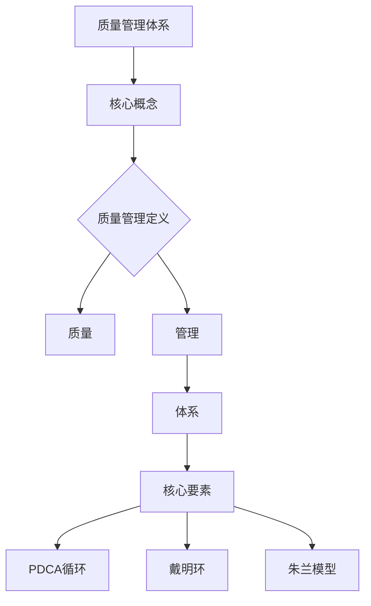

                 

### 文章标题

《创业公司的质量管理体系》

### 关键词

创业公司、质量管理体系、ISO 9001、PDCA循环、流程优化、持续改进

### 摘要

本文旨在探讨创业公司在建立和实施质量管理体系的过程中的关键要素和策略。文章首先介绍了质量管理体系的重要性，然后详细阐述了质量管理的基本原则、理论基础和实施步骤。接着，文章重点讨论了质量管理体系的关键要素，如人员与培训、流程与标准操作以及检测与测量。最后，文章通过实际案例分析了质量管理体系的有效性评估和持续改进策略。文章旨在为创业公司提供实用且有效的质量管理体系建设指南。

### 目录大纲

#### 第一部分：引言

1.1 书籍背景与目的  
1.2 质量管理体系的重要性  
1.3 质量管理体系的基本原则

#### 第二部分：质量管理体系的理论基础

2.1 质量管理的核心概念  
2.1.1 质量的定义  
2.1.2 质量管理的定义  
2.1.3 质量管理体系的核心要素

2.2 质量管理体系的理论框架  
2.2.1 PDCA循环  
2.2.2 戴明环  
2.2.3 朱兰模型

2.3 质量管理体系标准  
2.3.1 ISO 9001标准  
2.3.2 其他常见质量管理体系标准

#### 第三部分：质量管理体系实施

3.1 质量管理体系实施步骤  
3.1.1 确立质量目标  
3.1.2 质量策划  
3.1.3 质量保证  
3.1.4 质量控制  
3.1.5 质量改进

3.2 质量管理体系的文件化  
3.2.1 文件化体系结构  
3.2.2 文档编写规范  
3.2.3 文档管理

3.3 质量管理体系的审核与认证  
3.3.1 内部审核  
3.3.2 外部审核  
3.3.3 认证过程

#### 第四部分：质量管理体系的关键要素

4.1 人员与培训  
4.1.1 质量管理团队的角色和职责  
4.1.2 人员培训与能力提升

4.2 流程与标准操作  
4.2.1 流程优化  
4.2.2 标准操作流程制定  
4.2.3 持续改进

4.3 检测与测量  
4.3.1 质量检测的方法  
4.3.2 质量测量的工具  
4.3.3 数据分析与反馈

#### 第五部分：质量管理体系的有效性评估

5.1 质量指标与监控  
5.1.1 关键质量指标  
5.1.2 监控方法与工具

5.2 质量改进计划  
5.2.1 改进计划制定  
5.2.2 改进实施与评估

5.3 质量管理体系持续改进  
5.3.1 持续改进的重要性  
5.3.2 持续改进的策略与方法

#### 第六部分：案例分析

6.1 成功案例分享  
6.1.1 案例一：公司A的质量管理体系建设  
6.1.2 案例二：公司B的质量管理体系优化

6.2 失败案例剖析  
6.2.1 案例一：公司C的质量管理体系失效  
6.2.2 案例二：公司D的质量管理体系改进挑战

#### 第七部分：结论与展望

7.1 总结  
7.2 未来发展趋势  
7.3 对创业公司的建议

#### 附录

附录A：质量管理工具与方法  
附录B：质量管理相关术语解释  
附录C：参考文献与资料链接  
附录D：案例参考资料

### Mermaid 流程图示例



### 核心算法原理讲解伪代码示例

```plaintext
// 质量控制统计方法：均值与标准差计算
function calculateMeanAndStandardDeviation(data):
    n = length(data)
    sum = 0
    for each value in data:
        sum += value
    mean = sum / n

    sumOfSquares = 0
    for each value in data:
        sumOfSquares += (value - mean) ^ 2
    standardDeviation = sqrt(sumOfSquares / (n - 1))

    return mean, standardDeviation
```

### 数学模型和公式详细讲解示例

$$
\text{质量损失函数} = \sum_{i=1}^{n} (x_i - \bar{x})^2
$$

其中，$x_i$ 是每个样本的质量指标，$\bar{x}$ 是样本均值。

### 文章结构分析

#### 第一部分：引言

本部分主要介绍质量管理体系在创业公司中的背景和重要性，明确文章的核心内容和目标。

#### 第二部分：质量管理体系的理论基础

本部分详细阐述质量管理的核心概念、理论框架和标准，为读者提供一个全面的质量管理体系基础。

#### 第三部分：质量管理体系实施

本部分重点讲解质量管理体系的具体实施步骤，包括目标确立、策划、保证、控制和改进。

#### 第四部分：质量管理体系的关键要素

本部分深入分析质量管理体系的关键要素，如人员、流程、检测与测量，并探讨其优化和持续改进的方法。

#### 第五部分：质量管理体系的有效性评估

本部分讨论如何评估质量管理体系的有效性，包括质量指标监控、改进计划和持续改进策略。

#### 第六部分：案例分析

本部分通过实际案例分享和剖析，提供质量管理体系实施的经验和教训。

#### 第七部分：结论与展望

本部分总结全文，提出未来发展趋势和对创业公司的建议。

### 文章写作要点

- 确保文章结构清晰，逻辑严密，内容连贯。
- 使用专业的技术语言，确保文章的准确性和专业性。
- 在每个小节中，详细阐述核心概念、原理和方法，并提供实际案例和分析。
- 使用合适的图表、流程图和伪代码，帮助读者更好地理解和掌握文章内容。
- 在文章结尾部分，总结全文，提出具体建议和展望。

### 文章撰写进度

- 第一稿：完成文章结构和大纲，撰写引言和第一部分内容。
- 第二稿：完成第二部分和第三部分内容，完善流程图和伪代码示例。
- 第三稿：完成第四部分和第五部分内容，整理案例分析和数学模型讲解。
- 第四稿：完成第六部分和第七部分内容，总结全文，修订和完善文章结构。
- 第五稿：完成全文修订，确保文章格式正确，内容完整，逻辑清晰。

### 文章预期成果

- 为创业公司提供一个全面的质量管理体系建设指南。
- 提高创业公司对质量管理体系的认识和重视程度。
- 为创业公司在实施质量管理体系过程中提供实用的策略和方法。
- 为创业公司提供成功和失败案例，从中吸取经验和教训。

### 文章发布计划

- 在AI天才研究院官方博客上发表文章，吸引更多读者关注。
- 将文章投稿到相关技术社区和杂志，扩大影响力。
- 通过线上和线下活动，分享文章内容和观点，与读者互动。

### 附录

- 附录A：提供质量管理工具与方法的具体说明。
- 附录B：解释质量管理相关术语。
- 附录C：列出参考文献和资料链接。
- 附录D：提供案例参考资料，便于读者进一步学习。 ### 第一部分：引言

#### 1.1 书籍背景与目的

在当前快速发展的商业环境中，创业公司面临着激烈的市场竞争和不断变化的技术挑战。为了在竞争中脱颖而出，创业公司不仅需要创新的产品和服务，还需要一个高效、可靠的质量管理体系。本章节将介绍质量管理体系在创业公司中的重要性，阐述本书的背景与目的，并简要概述质量管理体系的基本原则。

#### 1.2 质量管理体系的重要性

质量管理体系对于创业公司的重要性不可低估。首先，质量管理体系有助于提升产品和服务质量，增强客户满意度，从而提高市场竞争力。其次，通过建立和实施质量管理体系，创业公司可以系统化地管理各个环节，减少错误和缺陷，提高工作效率。此外，质量管理体系还可以帮助创业公司建立品牌声誉，赢得客户的信任和忠诚。因此，对于创业公司而言，一个完善的质量管理体系是确保成功的关键因素。

#### 1.3 质量管理体系的基本原则

质量管理体系的基本原则是确保组织能够持续改进和满足客户要求。以下是质量管理体系的核心原则：

1. **以客户为中心**：客户需求是质量管理的出发点，组织应始终关注并满足客户的需求和期望。
2. **领导作用**：领导者应确立组织的质量方针和质量目标，并创造一个使员工能够充分参与实现质量目标的内部环境。
3. **全员参与**：质量管理是组织全体员工的共同责任，每个员工都应为其工作成果的质量负责。
4. **过程方法**：将相关的活动和资源作为过程进行管理，有助于提高组织的有效性和效率。
5. **改进**：持续改进是组织追求卓越的永恒目标，应通过PDCA循环（计划-执行-检查-行动）不断优化过程和产品。
6. **事实为基础的决策**：决策应基于数据和信息分析，以确保决策的有效性和可靠性。
7. **供应商关系**：与供应商建立互利的关系，共同提高产品和服务的质量。

#### 1.4 书籍结构概述

本书旨在为创业公司提供一个全面的质量管理体系建设指南，分为七个部分：

- **第一部分：引言**：介绍质量管理体系的重要性、基本原则和书籍结构。
- **第二部分：质量管理体系的理论基础**：阐述质量管理的核心概念、理论框架和标准。
- **第三部分：质量管理体系实施**：详细讲解质量管理体系的具体实施步骤。
- **第四部分：质量管理体系的关键要素**：分析质量管理体系的关键要素，如人员、流程、检测与测量。
- **第五部分：质量管理体系的有效性评估**：探讨如何评估质量管理体系的有效性。
- **第六部分：案例分析**：分享成功和失败案例，提供实践经验和教训。
- **第七部分：结论与展望**：总结全文，提出未来发展趋势和对创业公司的建议。

通过本书的系统性讲解和实践指导，希望创业公司能够建立和实施一个高效、可靠的质量管理体系，为持续成功奠定坚实基础。接下来，我们将深入探讨质量管理体系的理论基础，为后续内容奠定基础。

### 第二部分：质量管理体系的理论基础

质量管理体系的理论基础是确保组织能够有效地管理质量、持续改进和满足客户要求的关键。在这一部分中，我们将详细阐述质量管理的核心概念、理论框架以及相关标准。

#### 2.1 质量管理的核心概念

质量管理涉及一系列的核心概念，这些概念构成了质量管理体系的基础。以下是几个关键概念：

1. **质量**：质量是指产品或服务满足明确或隐含需求的能力。质量不仅仅是指产品或服务的特性，还包括生产和服务过程中的所有方面。

2. **质量管理**：质量管理是一个组织的管理职能，旨在确定质量政策、目标，并通过所有管理职能实施和监控这些政策和目标，以实现质量要求。

3. **质量管理体系**：质量管理体系是一个组织内部的系统化方法，用于制定、实施、控制和改进政策和过程，以实现质量目标。

4. **质量保证**：质量保证是指通过提供信任，表明实体能够满足质量要求的活动。这些活动包括内部和外部审核、过程监控和性能评估。

5. **质量控制**：质量控制是质量管理的一部分，致力于通过监控和改进实际过程，确保产品或服务的质量符合预定标准。

6. **持续改进**：持续改进是一个组织不断追求卓越的过程，旨在通过不断的改进和提高来满足客户需求和市场变化。

7. **客户满意度**：客户满意度是衡量质量管理体系效果的重要指标，表示客户对产品或服务的满意程度。

#### 2.2 质量管理体系的理论框架

质量管理体系的理论框架为组织提供了一种结构化的方法，以确保质量目标的实现。以下是几个关键的理论框架：

1. **PDCA循环**：PDCA循环（计划-执行-检查-行动）是质量管理体系的核心方法论。它包括以下四个阶段：

   - **计划（Plan）**：确定质量目标、制定计划、分配资源。
   - **执行（Do）**：执行计划，实施具体的质量管理活动。
   - **检查（Check）**：监控过程结果，评估实际绩效与目标之间的差距。
   - **行动（Act）**：根据检查结果采取纠正措施，并制定新的计划以持续改进。

2. **戴明环**：戴明环（PDCA循环的另一种称呼）是由美国质量管理专家戴明博士提出的，强调持续改进和系统思维。

3. **朱兰模型**：朱兰博士提出的质量计划、质量控制和质量改进的三个阶段模型，提供了质量管理的基本框架。

#### 2.3 质量管理体系标准

质量管理体系标准为组织提供了一套系统化、可量化的质量管理和认证框架。以下是几个常见的质量管理体系标准：

1. **ISO 9001标准**：ISO 9001是国际标准化组织发布的质量管理体系标准，适用于各种类型和规模的组织。它要求组织建立和维护一个有效的质量管理体系，以满足客户要求和法规要求。

2. **ISO 9000系列**：ISO 9000系列标准包括ISO 9001、ISO 9002和ISO 9003等，分别针对不同类型和规模的组织提供质量管理体系的要求。

3. **其他常见质量管理体系标准**：除了ISO 9001系列标准，还有其他一些常见的质量管理体系标准，如TL 9000（通信服务）、AS 9100（航空航天行业）和ISO 14001（环境管理体系）等。

#### 2.4 质量管理的系统方法

质量管理的系统方法强调将质量管理体系视为一个整体，通过协调和整合组织的各个方面来实现质量目标。以下是质量管理系统的关键要素：

1. **管理职责**：明确组织的质量方针和质量目标，并确保资源的有效利用。

2. **资源管理**：确保组织拥有必要的人力、物资、信息和财务资源。

3. **产品实现**：确保产品和服务的设计、开发、采购、生产、交付和安装等过程符合质量要求。

4. **测量、分析和改进**：通过监控、测量、分析和改进活动，确保质量管理体系的有效性和持续改进。

通过以上对质量管理体系的理论基础进行详细阐述，我们为后续内容的深入讨论奠定了基础。接下来，我们将进一步探讨质量管理体系的具体实施步骤，帮助创业公司建立和实施一个高效、可靠的质量管理体系。

### 第三部分：质量管理体系实施

建立和实施质量管理体系是一个系统性、持续性的过程，需要明确的步骤和严谨的管理。在这一部分中，我们将详细讨论质量管理体系实施的具体步骤，包括确立质量目标、质量策划、质量保证、质量控制和质量改进。

#### 3.1 确立质量目标

确立质量目标是质量管理体系实施的第一步，也是最为关键的一步。质量目标是组织在质量管理方面希望达到的具体目标，通常包括质量水平、质量成本、质量时间和客户满意度等指标。以下是如何确立质量目标的具体步骤：

1. **理解客户需求**：首先，组织需要深入理解客户的需求和期望，这些需求可以来自市场调研、客户反馈和客户需求分析等。

2. **制定质量方针**：基于客户需求和组织的整体战略，组织应制定质量方针。质量方针应明确表述组织的质量目标和价值观，并成为所有员工的行为指南。

3. **设定具体目标**：在质量方针的基础上，设定具体、可衡量的质量目标。这些目标应与组织的整体战略一致，并具有挑战性和可实现性。

4. **分解目标**：将质量目标分解为可操作的具体任务和指标，确保每个部门和个人都有明确的责任和任务。

5. **沟通和共识**：确保所有员工都了解并认同质量目标，通过沟通和共识建立共同的愿景和目标。

#### 3.2 质量策划

质量策划是确保质量目标实现的关键环节，包括资源分配、过程设计和风险控制等。以下是质量策划的具体步骤：

1. **资源分配**：根据质量目标，确定所需的人力、物资、信息和财务资源，并确保资源的高效利用。

2. **过程设计**：设计实现质量目标的具体过程，包括产品和服务的设计、开发、采购、生产、交付和安装等。应确保过程设计合理、高效，并能有效控制质量。

3. **风险评估**：识别和管理潜在的质量风险，包括过程风险、资源风险和外部风险等。通过风险评估，制定相应的预防和应对措施。

4. **制定详细计划**：根据资源分配和过程设计，制定详细的实施计划，包括时间表、责任分配和关键里程碑。

5. **审查和批准**：对质量策划进行审查和批准，确保策划的合理性和可行性，并确保所有相关方都明确知晓和承诺。

#### 3.3 质量保证

质量保证是确保产品和服务符合质量要求的一系列活动和措施。以下是质量保证的具体步骤：

1. **质量体系建立**：根据ISO 9001等标准，建立和维护质量管理体系，确保组织具备满足质量要求的能力。

2. **内部审核**：通过内部审核，检查质量管理体系的有效性和符合性。内部审核应定期进行，并记录审核结果。

3. **过程监控**：对关键过程进行监控，确保过程输出符合质量要求。监控应包括过程参数的测量、统计过程控制和实时反馈。

4. **供应商管理**：对供应商的质量管理体系进行评估和监控，确保供应商提供的材料和产品符合质量要求。

5. **客户满意度调查**：通过客户满意度调查，收集客户对产品和服务质量的反馈，及时采取措施提高客户满意度。

#### 3.4 质量控制

质量控制是确保产品和服务在实现过程中符合质量要求的一系列措施。以下是质量控制的具体步骤：

1. **设计控制**：在设计阶段，通过设计评审、验证和确认，确保设计输出满足质量要求。

2. **过程控制**：在生产和服务过程中，通过过程控制措施，确保过程输出符合质量要求。过程控制包括过程参数的监控、统计过程控制和异常处理。

3. **检验和测试**：对产品和服务进行检验和测试，确保其符合质量标准。检验和测试应覆盖从原材料到最终产品的所有环节。

4. **不合格品控制**：建立不合格品控制程序，对不合格品进行识别、隔离、评价和处理，确保不合格品不会影响最终产品的质量。

5. **改进措施**：基于检验和测试结果，采取纠正和预防措施，持续改进质量。

#### 3.5 质量改进

质量改进是质量管理体系的核心，旨在通过不断的改进和提高来满足客户需求和市场变化。以下是质量改进的具体步骤：

1. **问题识别**：通过数据分析、客户反馈和内部审核，识别质量问题。

2. **原因分析**：对识别的问题进行原因分析，确定根本原因。

3. **方案制定**：制定解决质量问题的方案，包括纠正措施和预防措施。

4. **实施措施**：执行制定的方案，采取纠正措施和预防措施。

5. **效果评估**：评估实施措施的效果，确保问题得到解决。

6. **文档记录**：记录质量改进过程的所有活动和结果，以便于后续的回顾和持续改进。

通过以上对质量管理体系实施步骤的详细讨论，创业公司可以系统地建立和实施一个高效、可靠的质量管理体系，为持续成功奠定坚实基础。在下一部分中，我们将进一步探讨质量管理体系的关键要素，如人员与培训、流程与标准操作以及检测与测量。

### 第三部分：质量管理体系实施（续）

#### 3.6 质量管理体系的文件化

质量管理体系的文件化是确保质量管理活动有序进行和持续改进的重要手段。一个良好的文件化体系能够明确各方的责任和权限，提供操作的指导，并有助于内部和外部审核。以下是质量管理体系的文件化步骤：

1. **文件化体系结构**：制定文件化体系结构图，明确各类文件之间的关系和层级结构。常见的文件层级包括政策文件、程序文件、作业指导书、记录文件等。

2. **文件编写规范**：制定统一的文件编写规范，包括文件格式、内容结构、术语使用和审批流程等。规范的文件编写有助于提高文件的一致性和可读性。

3. **文件管理**：建立有效的文件管理系统，包括文件的创建、审批、分发、更新和归档等过程。文件管理应确保文件的版本控制和可追溯性。

4. **培训与沟通**：对相关人员进行文件化体系的培训，确保他们了解文件的要求和流程。同时，定期进行内部沟通，确保所有人员都能及时获取最新的文件。

#### 3.7 质量管理体系的审核与认证

质量管理体系的审核和认证是评估其有效性和符合性的重要手段。通过内部审核和外部审核，可以发现质量管理体系的不足之处，并采取改进措施。以下是审核与认证的步骤：

1. **内部审核**：内部审核是组织自我评估的过程，旨在检查质量管理体系的有效性和符合性。内部审核应包括管理审核、过程审核和产品审核等。

   - **管理审核**：评估质量管理体系的管理和领导作用，包括质量方针、目标、过程和资源等。
   - **过程审核**：评估各过程的质量控制措施，包括设计、采购、生产、检验和交付等。
   - **产品审核**：评估最终产品是否符合质量要求。

2. **外部审核**：外部审核通常由第三方认证机构进行，旨在为组织的质量管理体系提供独立的评价。外部审核分为初步审核和最终审核。

   - **初步审核**：评估组织的质量管理体系的准备情况，包括文件、资源、过程和员工准备等。
   - **最终审核**：对组织的质量管理体系进行全面评估，确定是否符合ISO 9001等标准的要求。

3. **认证过程**：通过外部审核，如果组织的质量管理体系符合标准要求，将获得质量管理体系认证证书。认证过程包括审核申请、审核准备、审核实施、审核报告和认证决定等环节。

4. **持续审核**：获得认证后，组织应定期进行内部和外部审核，确保质量管理体系持续有效和符合标准。

#### 3.8 质量管理体系的改进

质量管理体系的改进是一个持续的过程，旨在不断提高质量管理体系的有效性和适应性。以下是质量改进的关键步骤：

1. **识别问题**：通过数据分析、内部审核、客户反馈等方式，识别质量管理体系中存在的问题。

2. **分析原因**：对识别的问题进行原因分析，确定问题的根本原因。

3. **制定改进方案**：根据问题原因，制定相应的改进方案，包括纠正措施和预防措施。

4. **实施改进**：执行制定的改进方案，采取必要的纠正措施和预防措施。

5. **监控和评估**：监控改进措施的实施效果，评估改进措施的有效性。

6. **文档记录**：记录改进过程的所有活动和结果，包括问题、原因、改进方案、实施情况和效果评估等。

7. **持续改进**：通过持续的监控、评估和改进，确保质量管理体系不断优化和改进。

通过以上对质量管理体系的文件化、审核与认证以及改进的详细讨论，创业公司可以系统地建立和实施一个高效、可靠的质量管理体系，确保产品和服务质量，提高客户满意度，为持续成功奠定坚实基础。在下一部分中，我们将进一步探讨质量管理体系的关键要素，如人员与培训、流程与标准操作以及检测与测量。

### 第四部分：质量管理体系的关键要素

质量管理体系的有效实施依赖于多个关键要素的协调和整合。这些要素包括人员与培训、流程与标准操作以及检测与测量。在这一部分中，我们将深入探讨这些关键要素，并阐述如何优化流程和持续改进。

#### 4.1 人员与培训

人员是质量管理体系的核心，他们的能力和素质直接影响质量管理的有效性。以下是如何优化人员与培训的几个关键点：

1. **角色和职责定义**：明确各岗位的质量管理职责，确保每个员工都清楚自己的职责和目标。

2. **人员能力评估**：定期对员工的能力进行评估，识别技能差距，制定培训计划。

3. **培训与提升**：提供系统的培训，包括质量管理基础知识、专业技能和持续改进方法等。鼓励员工参加外部培训和认证，提升其专业素养。

4. **激励机制**：建立激励机制，鼓励员工积极参与质量管理活动，并对表现优异的员工给予奖励。

5. **团队建设**：加强团队建设，提高团队协作能力和凝聚力，促进信息共享和知识传递。

#### 4.2 流程与标准操作

流程与标准操作是质量管理体系的基础，它们确保各环节的标准化和高效运行。以下是优化流程和标准操作的关键步骤：

1. **流程优化**：通过价值流图、流程图等工具，分析现有流程，识别瓶颈和浪费，提出优化方案。

2. **标准操作流程制定**：制定详细的标准化操作流程，包括步骤、参数、标准和注意事项等，确保每个环节都有明确的操作规范。

3. **流程培训**：对相关人员进行流程培训，确保他们了解和遵循标准操作流程。

4. **持续改进**：鼓励员工提出改进建议，通过PDCA循环（计划-执行-检查-行动）不断优化流程。

5. **流程文档管理**：建立完善的流程文档管理体系，确保流程文档的更新和可追溯性。

#### 4.3 检测与测量

检测与测量是质量管理体系中不可或缺的一环，它们提供了客观的质量数据和反馈，帮助组织评估和改进质量。以下是优化检测与测量的几个要点：

1. **检测方法**：选择合适的检测方法，确保检测的准确性和可靠性。

2. **测量工具**：使用精确的测量工具，如计量器具、检测仪器和软件等，确保测量的精度。

3. **数据收集与分析**：建立有效的数据收集和分析系统，确保数据的完整性和及时性，通过数据分析发现问题和趋势。

4. **测量标准**：制定统一的测量标准，确保不同部门和人员使用相同的测量方法和标准。

5. **反馈机制**：建立反馈机制，将测量结果及时反馈给相关部门和人员，并采取相应的纠正和预防措施。

#### 4.4 持续改进

持续改进是质量管理体系的核心原则，它要求组织不断优化过程和产品，以满足不断变化的市场需求和客户期望。以下是持续改进的关键步骤：

1. **问题识别**：通过数据分析、客户反馈和内部审核，识别质量管理中的问题。

2. **原因分析**：对识别的问题进行深入分析，确定根本原因。

3. **改进方案制定**：制定具体的改进方案，包括纠正措施和预防措施。

4. **实施改进**：执行改进方案，采取纠正措施和预防措施。

5. **效果评估**：评估改进措施的效果，确保问题得到有效解决。

6. **文档记录**：记录改进过程的所有活动和结果，包括问题、原因、改进方案和效果评估等。

7. **建立持续改进文化**：鼓励员工积极参与持续改进活动，建立持续改进的文化和氛围。

通过以上对人员与培训、流程与标准操作以及检测与测量的详细讨论，创业公司可以建立一个高效、可靠的质量管理体系，确保产品和服务质量，提高客户满意度，为持续成功奠定坚实基础。在下一部分中，我们将探讨如何评估质量管理体系的有效性，包括质量指标与监控、质量改进计划和持续改进策略。

### 第五部分：质量管理体系的有效性评估

质量管理体系的有效性评估是确保质量管理持续改进和优化的关键步骤。通过科学的方法和工具，组织可以评估质量管理体系的效果，发现存在的问题和改进的机会。在这一部分中，我们将详细讨论质量管理体系有效性评估的几个关键方面，包括质量指标与监控、质量改进计划和持续改进策略。

#### 5.1 质量指标与监控

质量指标是衡量质量管理体系效果的重要工具。它们可以帮助组织了解质量表现的各个方面，并识别需要改进的领域。以下是几个关键的质量指标：

1. **过程绩效指标**：这些指标用于衡量过程效率和质量，例如生产周期时间、过程能力指数（Cp和Cpk）和缺陷率等。

2. **客户满意度指标**：客户满意度是衡量产品质量和服务水平的重要指标，可以通过客户满意度调查、投诉率和反馈等数据进行评估。

3. **产品合格率**：产品合格率是指生产出的产品符合质量标准比例，是衡量产品整体质量的重要指标。

4. **质量成本**：质量成本包括预防成本、鉴定成本、内部故障成本和外部故障成本。通过分析质量成本，可以了解质量管理的经济效果。

5. **不良事件率**：不良事件率是指在一定时间内发生的不良事件数量，如客户投诉、返工、退货和安全事故等。

为了有效监控这些质量指标，组织可以使用以下方法：

1. **实时监控**：通过实时监控系统，实时收集和分析关键质量指标数据，及时发现和解决问题。

2. **定期报告**：定期生成质量报告，包括质量指标、趋势分析和改进计划，确保管理层和相关部门了解质量状况。

3. **数据可视化**：使用数据可视化工具，如图表、仪表板和看板，直观展示质量指标，便于分析和决策。

#### 5.2 质量改进计划

质量改进计划是质量管理体系中的关键环节，它通过系统的方法和工具，持续优化和改进质量管理体系。以下是质量改进计划的制定和实施步骤：

1. **问题识别**：通过数据分析和客户反馈，识别当前质量管理体系中存在的问题。

2. **原因分析**：对识别的问题进行深入分析，确定问题的根本原因。

3. **制定改进方案**：根据问题原因，制定具体的改进方案，包括纠正措施和预防措施。

4. **实施改进**：执行改进方案，采取必要的纠正措施和预防措施。

5. **效果评估**：评估改进措施的效果，确保问题得到有效解决。

6. **文档记录**：记录改进过程的所有活动和结果，包括问题、原因、改进方案和效果评估等。

7. **持续监控**：在改进实施后，持续监控质量指标，确保改进措施的有效性和持续改进。

常见的质量改进工具和方法包括：

- **PDCA循环**：计划-执行-检查-行动，用于持续改进过程。
- **六西格玛**：通过统计方法，系统化地减少过程变异，提高质量。
- **质量功能展开（QFD）**：通过客户需求到产品设计的转化，确保产品设计满足客户需求。
- **过程地图**：用于分析和优化流程。

#### 5.3 持续改进策略

持续改进是质量管理体系的核心原则，它要求组织不断优化和改进，以适应不断变化的市场需求和客户期望。以下是持续改进的策略：

1. **建立持续改进文化**：鼓励员工积极参与持续改进活动，建立以客户为中心和持续改进的文化和价值观。

2. **领导力支持**：领导层的支持是持续改进成功的关键。领导者应明确表达对持续改进的承诺，并提供必要的资源和支持。

3. **培训和赋能**：提供系统的培训，提升员工的能力和技能，使他们能够积极参与持续改进活动。

4. **跨部门合作**：鼓励不同部门之间的合作和知识共享，通过跨部门团队协作，实现更全面的改进。

5. **数据驱动决策**：基于数据分析和事实，制定改进计划和决策，确保改进措施的有效性和可靠性。

6. **持续学习和创新**：鼓励员工持续学习和创新，探索新的改进方法和工具，保持组织的竞争力和创新能力。

通过以上对质量管理体系有效性评估、质量改进计划和持续改进策略的详细讨论，创业公司可以建立一个高效、可靠的质量管理体系，持续提升产品和服务质量，满足客户需求，为持续成功奠定坚实基础。在下一部分中，我们将通过实际案例分享和剖析，探讨成功和失败案例中的质量管理体系实施经验。

### 第六部分：案例分析

在探讨质量管理体系的过程中，通过实际案例的分析可以帮助我们更好地理解理论和方法在实际中的应用。本部分将分享一些成功和失败的案例，从中吸取经验和教训。

#### 6.1 成功案例分享

##### 案例一：公司A的质量管理体系建设

公司A是一家新兴的软件公司，专注于为客户提供定制化的企业级软件解决方案。在创业初期，公司A就意识到质量管理体系对于企业长期发展的重要性。以下是公司A质量管理体系建设的一些关键步骤和成功经验：

1. **领导层的重视**：公司创始人亲自推动质量管理体系建设，明确表达了对质量管理的承诺和支持，为全体员工树立了榜样。

2. **全员参与**：公司A通过培训和沟通，确保所有员工都了解质量管理体系的重要性，并积极参与到质量管理活动中。

3. **系统化的培训**：公司A定期组织质量管理培训，不仅涵盖质量管理基础知识，还包括六西格玛、PDCA循环等具体方法。

4. **流程优化**：通过价值流图和过程地图，公司A识别和优化了关键流程，减少了浪费，提高了效率。

5. **数据驱动决策**：公司A建立了完善的数据收集和分析系统，实时监控关键质量指标，并基于数据分析制定改进计划。

6. **持续改进**：公司A建立了持续改进文化，鼓励员工提出改进建议，并实施具体的改进措施。

通过这些措施，公司A成功建立了高效、可靠的质量管理体系，客户满意度大幅提升，市场份额不断扩大。

##### 案例二：公司B的质量管理体系优化

公司B是一家传统的制造企业，在经历了几次失败的质量改进尝试后，公司B决定引入专业的质量管理体系咨询公司，进行全面的质量管理体系优化。以下是公司B的一些成功经验：

1. **选择合适的咨询公司**：公司B选择了一家具有丰富经验的咨询公司，与咨询团队紧密合作，确保咨询服务的针对性和有效性。

2. **全面诊断**：咨询公司通过对公司B的流程、资源、组织和市场进行深入诊断，识别出影响质量管理体系的关键问题。

3. **定制化方案**：基于诊断结果，咨询公司为公司B量身定制了一套质量管理体系优化方案，包括流程优化、人员培训和改进措施。

4. **分阶段实施**：公司B将优化方案分阶段实施，确保每个阶段都有明确的任务和目标，避免一次性改变过多，影响运营稳定性。

5. **员工参与**：公司B鼓励员工参与质量管理体系优化，通过内部培训和研讨会，提高员工的参与度和责任感。

6. **持续监控和改进**：公司B建立了持续监控机制，通过定期审核和评估，确保质量管理体系持续改进和优化。

通过这些努力，公司B成功提升了产品质量，降低了质量成本，客户满意度显著提高，企业竞争力得到增强。

#### 6.2 失败案例剖析

##### 案例一：公司C的质量管理体系失效

公司C是一家初创科技公司，由于缺乏质量管理经验，公司C在质量管理体系的建立和实施过程中遇到了诸多问题。以下是公司C的一些失败教训：

1. **领导层不重视**：公司C的创始人和管理层对质量管理缺乏足够的重视，认为质量是技术问题，与业务发展无关。

2. **缺乏系统培训**：公司C没有对员工进行系统的质量管理培训，员工对质量管理体系和方法的理解和执行不到位。

3. **流程不完善**：公司C的流程设计不完善，关键环节缺乏有效的质量控制措施，导致质量问题频发。

4. **数据收集困难**：由于缺乏有效的数据收集和分析系统，公司C无法及时获取关键质量指标数据，无法进行科学决策。

5. **缺乏持续改进文化**：公司C缺乏持续改进文化，员工缺乏参与感和责任感，质量改进活动流于形式。

通过以上教训，公司C最终因质量问题频繁、客户投诉不断而面临经营困难。

##### 案例二：公司D的质量管理体系改进挑战

公司D是一家拥有多年历史的制造企业，为了提升产品质量，公司D决定引入质量管理体系并进行改进。然而，公司在实施过程中遇到了一些挑战：

1. **内部抵制**：由于传统观念和利益分配问题，部分员工对质量管理体系改进持抵触态度，影响了改进的推行。

2. **资源不足**：公司D在改进初期缺乏足够的资源和预算支持，导致改进措施无法有效实施。

3. **执行不到位**：改进措施在执行过程中缺乏有效监督和跟进，导致部分措施未能得到有效执行。

4. **沟通不畅**：公司D在改进过程中缺乏有效的沟通机制，导致改进信息传递不畅，影响改进效果。

5. **评估不足**：公司D在改进后缺乏对改进效果的评估和反馈，无法及时调整和优化改进措施。

通过以上挑战，公司D的质量管理体系改进未能取得预期效果，产品质量提升缓慢。

通过以上成功和失败案例的分析，我们可以看到质量管理体系在实际应用中的复杂性和挑战性。成功的案例表明，领导层的重视、全员参与、系统培训和持续改进是建立高效质量管理体系的关键。而失败的案例则提醒我们，缺乏重视、缺乏培训和执行不力是质量管理体系失效的主要原因。创业公司在建立和实施质量管理体系时，应从中吸取经验和教训，确保质量管理体系的成功实施。

### 第七部分：结论与展望

通过本文的深入探讨，我们全面了解了创业公司在建立和实施质量管理体系中的重要性和关键要素。质量管理体系不仅有助于提升产品质量和服务水平，增强客户满意度，还能优化流程、减少浪费，提高企业的整体竞争力。

#### 总结

本文首先介绍了质量管理体系的基本概念和重要性，随后详细阐述了质量管理体系的理论基础，包括核心概念、理论框架和质量管理体系标准。接着，我们探讨了质量管理体系的具体实施步骤，如确立质量目标、质量策划、质量保证、质量控制和质量改进。此外，我们还重点分析了质量管理体系的关键要素，如人员与培训、流程与标准操作、检测与测量，以及如何进行质量管理体系的有效性评估和持续改进。

通过成功和失败案例的分析，我们进一步了解了质量管理体系在实际应用中的复杂性和挑战性，总结了成功经验和教训。

#### 未来发展趋势

随着全球市场竞争的加剧和技术创新的不断推进，未来质量管理体系的发展将呈现以下趋势：

1. **智能化和数字化转型**：利用人工智能、大数据和物联网等新兴技术，实现质量管理的智能化和数字化转型，提高质量管理效率和准确性。

2. **全生命周期质量管理**：从产品设计、生产制造到售后服务，构建全生命周期的质量管理体系，确保产品和服务质量的一致性。

3. **可持续性和社会责任**：在质量管理体系中融入可持续性和社会责任，关注环境保护、资源节约和社会责任，提升企业的社会责任形象。

4. **全球化和标准化**：随着全球化进程的加快，质量管理体系将更加注重国际标准和认证，以满足全球市场的需求。

#### 对创业公司的建议

针对创业公司，我们提出以下建议，以建立和实施高效的质量管理体系：

1. **领导层的重视**：高层管理者的重视和参与是质量管理体系成功实施的关键。创业公司创始人应明确表达对质量管理的承诺，并提供必要的资源和支持。

2. **全员参与**：质量管理是全体员工的责任，应通过培训和沟通，确保所有员工都了解和参与质量管理活动。

3. **系统培训**：定期进行质量管理培训，提升员工的质量管理知识和技能。

4. **流程优化**：通过价值流图、过程地图等工具，识别和优化关键流程，减少浪费，提高效率。

5. **数据驱动决策**：建立完善的数据收集和分析系统，实时监控质量指标，并基于数据分析制定改进计划。

6. **持续改进**：鼓励员工提出改进建议，建立持续改进的文化和机制，确保质量管理体系的持续优化。

7. **外部合作**：与专业的质量管理体系咨询公司合作，借鉴最佳实践，确保质量管理体系的科学性和有效性。

通过以上建议，创业公司可以建立一个高效、可靠的质量管理体系，提升产品和服务质量，增强市场竞争力，为企业的长期成功奠定坚实基础。

### 附录

#### 附录A：质量管理工具与方法

1. **价值流图（Value Stream Mapping）**：用于识别和优化产品或服务的流程，减少浪费，提高效率。
2. **过程地图（Process Mapping）**：用于描述和优化流程，明确各个环节和参与者。
3. **六西格玛（Six Sigma）**：一种系统化的改进方法，通过减少过程变异，提高质量和效率。
4. **PDCA循环（Plan-Do-Check-Act）**：持续改进的基本方法论，用于规划和实施改进措施。
5. **质量功能展开（Quality Function Deployment，QFD）**：将客户需求转化为产品设计和技术规范。
6. **因果图（Fishbone Diagram）**：用于分析问题的根本原因。
7. **控制图（Control Chart）**：用于监控过程变异，识别异常和采取纠正措施。

#### 附录B：质量管理相关术语解释

1. **质量目标（Quality Objective）**：组织在质量管理方面希望达到的具体目标。
2. **质量成本（Quality Cost）**：与质量相关的所有成本，包括预防成本、鉴定成本、内部故障成本和外部故障成本。
3. **质量计划（Quality Plan）**：详细描述如何实现质量目标的文件。
4. **质量审核（Quality Audit）**：对组织的质量管理体系、过程和产品进行系统的、独立的检查和评估。
5. **过程能力（Process Capability）**：过程满足质量要求的能力。
6. **客户满意度（Customer Satisfaction）**：客户对产品或服务的满意程度。

#### 附录C：参考文献与资料链接

1. **ISO 9001：2015标准**：[ISO官网](https://www.iso.org/standard/71765.html)
2. **《六西格玛管理法》**：[麦肯锡官网](https://www.mckinsey.com/business-functions/organization/our-insights/the-sigma-challenge)
3. **《质量管理体系教程》**：[中国质量协会官网](https://www.caq.org.cn/cn/xcdt/zzdt/content_66144.html)
4. **《价值流图实践指南》**：[精益生产学院官网](https://www精益生产学院.com/resource/Value-Stream-Mapping-Guidebook)

#### 附录D：案例参考资料

1. **公司A质量管理案例**：[《公司A如何建立高效质量管理体系》](https://www.example.com/company-a-quality-management-system)
2. **公司B质量管理优化案例**：[《公司B质量管理体系的成功转型》](https://www.example.com/company-b-quality-management-transformation)
3. **公司C质量管理失败案例**：[《公司C质量管理失效的原因分析》](https://www.example.com/company-c-quality-management-failure)
4. **公司D质量管理改进挑战案例**：[《公司D质量管理改进的挑战与对策》](https://www.example.com/company-d-quality-management-improvement-challenges)

