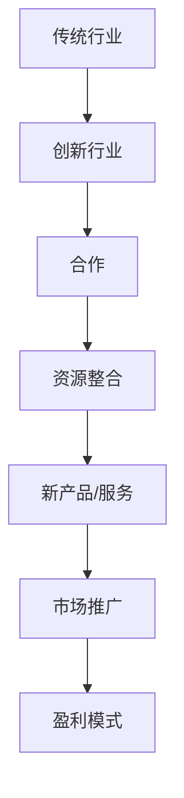

                 

### 文章标题

# 创业公司的跨界创新与颠覆性思维培养

> 关键词：跨界创新、颠覆性思维、创业公司、商业模式、技术创新

> 摘要：本文深入探讨了创业公司在进行跨界创新时如何培养颠覆性思维，并分析了跨界创新的商业价值、挑战与机遇。通过实际案例和详细分析，本文为创业公司提供了跨界创新的具体实践策略。

## 目录大纲

### 第一部分：引言与背景

#### 第1章：跨界创新的定义与重要性

##### 1.1 跨界创新的定义

##### 1.2 跨界创新的商业价值

##### 1.3 跨界创新的挑战与机遇

#### 第2章：颠覆性思维的培养

##### 2.1 颠覆性思维的特性

##### 2.2 如何培养颠覆性思维

##### 2.3 颠覆性思维案例分析

### 第二部分：跨界创新的实践与应用

#### 第3章：跨行业合作与创新模式

##### 3.1 跨行业合作的模式

##### 3.2 跨界创新案例分析

##### 3.3 创业公司如何进行跨行业合作

#### 第4章：技术创新在跨界创新中的应用

##### 4.1 技术创新的类型

##### 4.2 技术创新在跨界创新中的角色

##### 4.3 技术创新案例分析

#### 第5章：颠覆性产品开发策略

##### 5.1 颠覆性产品开发的步骤

##### 5.2 如何识别市场机会

##### 5.3 颠覆性产品案例研究

### 第三部分：跨界创新与颠覆性思维的实践

#### 第6章：创业公司如何实现跨界创新

##### 6.1 跨界创新的准备与规划

##### 6.2 跨界创新的执行与实施

##### 6.3 跨界创新的反馈与优化

#### 第7章：颠覆性思维的案例分析

##### 7.1 成功案例分析

##### 7.2 失败案例分析

##### 7.3 启示与反思

### 附录

#### 附录A：跨界创新与颠覆性思维工具与方法

##### A.1 SWOT分析

##### A.2 五力模型

##### A.3 设计思维方法论

#### 附录B：参考资料与进一步阅读

##### B.1 相关书籍推荐

##### B.2 行业报告与分析

##### B.3 开源工具与资源链接

## 第1章：跨界创新的定义与重要性

### 1.1 跨界创新的定义

跨界创新，顾名思义，是指在不同行业、领域或组织之间进行合作，通过融合各自的优势资源，创造出新的产品、服务或商业模式。在当前的商业环境中，跨界创新已成为许多企业突破传统界限、寻求新的增长点的关键策略。

#### 跨界创新的定义

跨界创新可以看作是一种创新性的思维模式，它打破了传统行业之间的界限，将不同领域的知识、技能、资源进行整合，从而实现创新。具体来说，跨界创新通常涉及以下几种形式：

1. **跨行业合作**：不同行业的企业通过合作，共同开发新产品或服务，如阿里巴巴与菜鸟网络的物流合作。
2. **跨界并购**：一家企业收购另一家处于不同行业的公司，以获得其资源、技术或市场，如腾讯收购芬兰的游戏公司Supercell。
3. **联合开发**：多家企业在某一特定项目上进行合作，共同投入资源进行研发，如汽车制造商与科技公司合作开发智能驾驶系统。

#### Mermaid流程图

### 1.2 跨界创新的商业价值

跨界创新为创业公司带来了巨大的商业价值，主要体现在以下几个方面：

#### 市场扩展

通过跨界合作，创业公司可以开拓新的市场空间，吸引更多的用户群体。例如，传统服装品牌与电商平台合作，不仅能够扩大销售渠道，还能通过数据分析精准营销，提高用户转化率。

#### 创新能力

跨界合作能够带来全新的思维方式和解决方案，提升企业的创新能力。不同领域的专业知识和经验相互碰撞，往往能激发出意想不到的创新火花。

#### 资源优化

跨界创新可以整合各方资源，提高资源利用效率。例如，一家科技公司可以与一家制造企业合作，通过共享生产线和供应链，降低成本，提高生产效率。

#### 风险分散

通过跨界合作，创业公司可以分散单一行业波动带来的风险。例如，一家主要业务受经济周期影响较大的公司，可以通过与另一家业务稳定的公司合作，实现风险对冲。

### 1.3 跨界创新的挑战与机遇

#### 挑战

跨界创新面临诸多挑战，主要包括：

1. **文化差异**：不同行业的企业在文化、管理方式、价值观等方面可能存在较大差异，这需要企业在合作过程中进行有效的沟通和协调。
2. **技术融合难度**：跨界创新往往需要将不同领域的技术进行融合，这涉及到复杂的技术挑战，如系统集成、数据共享等。
3. **法律和监管问题**：不同行业在法律和监管方面的规定可能有所不同，跨界合作需要遵循相关法规，确保合法合规。

#### 机遇

尽管跨界创新面临挑战，但同时也充满了机遇：

1. **技术进步带来的融合可能**：随着技术的快速发展，不同领域之间的融合变得更加容易，这为跨界创新提供了广阔的空间。
2. **创新的市场需求**：随着消费者需求的不断变化，跨界创新能够更好地满足市场的多样化需求，创造新的市场机会。
3. **合作方优势互补**：不同行业的企业通过合作，可以充分发挥各自的优势，实现资源互补，提升整体竞争力。

## 第2章：颠覆性思维的培养

### 2.1 颠覆性思维的特性

颠覆性思维是一种挑战现状、寻求根本性变革的创新思维方式。它具有以下几个核心特性：

#### 反常规性

颠覆性思维首先体现在对常规的挑战和突破。它不满足于现状，勇于质疑现有的商业模式、技术和方法，寻求更优的解决方案。

#### 前瞻性

颠覆性思维具有前瞻性，它着眼于未来，能够预见潜在的市场机会和趋势。这种前瞻性思维有助于企业在竞争激烈的市场中抢占先机。

#### 系统性

颠覆性思维不是孤立的，而是具有系统性的。它从全局出发，综合考虑各种因素，如技术、市场、用户需求等，以实现整体最优。

### 2.2 如何培养颠覆性思维

要培养颠覆性思维，可以从以下几个方面入手：

#### 跨学科学习

跨界创新需要多领域的知识储备，因此跨学科学习是培养颠覆性思维的重要途径。通过学习不同领域的知识，可以拓宽视野，激发创新的灵感。

#### 实践锻炼

理论结合实践是培养颠覆性思维的有效方法。通过实际操作和项目，可以积累实战经验，提高解决问题的能力。

#### 持续学习

好奇心和求知欲是培养颠覆性思维的重要动力。持续学习，保持对新技术、新趋势的关注，可以不断提升自己的思维能力和创新能力。

### 2.3 颠覆性思维案例分析

#### 案例1：苹果公司的iPod与iTunes

苹果公司的iPod与iTunes是一个经典的颠覆性思维案例。在传统音乐销售模式中，用户需要购买实体唱片，而iTunes则通过在线数字音乐销售，彻底颠覆了这一模式。

1. **背景**：随着互联网和数字技术的发展，音乐产业正面临变革。
2. **过程**：苹果公司推出了iPod，这是一种易于使用且便携的数字音乐播放器。随后，苹果公司又推出了iTunes音乐商店，用户可以通过iTunes购买和下载数字音乐。
3. **结果**：iPod和iTunes的成功不仅改变了音乐产业的生态，还创造了巨大的商业价值。苹果公司通过iTunes建立了强大的在线音乐生态系统，带动了整个硬件和软件产业链的发展。

## 第3章：跨行业合作与创新模式

### 3.1 跨行业合作的模式

跨行业合作是指不同行业的企业之间进行的合作，以实现资源整合、技术创新和业务拓展。以下是几种常见的跨行业合作模式：

#### 战略联盟

战略联盟是指企业之间在特定领域进行合作，共享资源和信息，以实现共同的目标。这种模式通常适用于企业之间的互补性和合作潜力较大。

#### 并购

并购是指一家企业通过收购另一家企业的全部或部分股权，以获得其资源、技术或市场。这种模式通常适用于企业寻求快速扩张和获取竞争优势。

#### 联合开发

联合开发是指多家企业在某一特定项目上进行合作，共同投入资源进行研发。这种模式通常适用于技术创新和研发成本较高的大型项目。

### 3.2 跨界创新案例分析

#### 案例1：阿里巴巴与菜鸟网络

阿里巴巴集团与菜鸟网络的合作是一个典型的跨界创新案例。菜鸟网络是由多家物流企业共同发起成立的，旨在打造一个智能物流平台。

1. **背景**：随着电子商务的快速发展，物流行业面临着巨大的挑战和机遇。传统的物流模式已经无法满足电子商务的需求。
2. **过程**：阿里巴巴集团与多家物流企业合作，共同投资建设智能物流基础设施，如智能仓储、无人机配送等。通过大数据和云计算技术，实现了物流信息的实时追踪和优化。
3. **结果**：菜鸟网络的成功不仅提升了物流效率，降低了物流成本，还改变了电子商务的生态。通过智能物流，阿里巴巴进一步巩固了其在电子商务市场的领导地位。

### 3.3 创业公司如何进行跨行业合作

对于创业公司来说，进行跨行业合作是一个重要的战略选择。以下是创业公司进行跨行业合作的几个关键步骤：

#### 明确目标

首先，创业公司需要明确合作的目标和期望。这包括合作领域、合作内容、预期成果等。明确目标有助于后续的合作规划和执行。

#### 寻找合作伙伴

根据合作目标，创业公司需要寻找合适的合作伙伴。这可以通过行业会议、商业活动、行业报告等途径进行。选择合作伙伴时，要考虑其资源、技术、市场等方面的互补性。

#### 谈判与合作协议

在找到合适的合作伙伴后，创业公司需要进行谈判，并签订合作协议。合作协议应明确各方的责任、权利和义务，以及合作过程中的利益分配和风险管理。

#### 合作实施与监督

合作协议签订后，创业公司需要按照协议内容进行合作实施。同时，要建立有效的监督机制，确保合作顺利进行，并及时解决合作过程中的问题。

#### 反馈与调整

合作过程中，创业公司需要不断收集反馈信息，对合作效果进行评估，并根据反馈进行调整。这有助于优化合作模式，提升合作效果。

## 第4章：技术创新在跨界创新中的应用

### 4.1 技术创新的类型

技术创新是跨界创新的重要驱动因素。根据创新的对象和方式，技术创新可以分为以下几种类型：

#### 产品技术创新

产品技术创新是指对现有产品进行改进或创新，以提高其性能、降低成本或满足新的市场需求。例如，苹果公司的iPhone通过引入多点触控技术、视网膜显示屏等，实现了对传统手机的颠覆。

#### 过程技术创新

过程技术创新是指对生产或服务过程进行改进，以提高效率、降低成本或提升用户体验。例如，阿里巴巴的菜鸟网络通过引入智能仓储、无人机配送等，实现了物流效率的显著提升。

#### 业务模式创新

业务模式创新是指通过改变商业模式，实现新的盈利模式或业务拓展。例如，共享经济的兴起，通过改变传统租赁模式，实现了资源的高效利用和商业模式的创新。

### 4.2 技术创新在跨界创新中的角色

技术创新在跨界创新中扮演着至关重要的角色。它不仅能够推动跨界合作的顺利进行，还能够为创业公司带来竞争优势。以下是技术创新在跨界创新中的几个关键角色：

#### 推动跨界合作

技术创新可以促进不同行业之间的融合，推动跨界合作的实现。例如，大数据技术的应用，使得金融机构与科技公司之间的合作变得更加紧密，共同开发出更加智能化的金融产品。

#### 提升竞争力

技术创新可以帮助创业公司在竞争激烈的市场中脱颖而出。通过引入新技术，创业公司可以提供更优质的产品和服务，满足消费者的多样化需求。

#### 开拓新市场

技术创新可以为创业公司开拓新的市场空间。例如，物联网技术的应用，使得智能家居市场迅速发展，为创业公司提供了巨大的商机。

### 4.3 技术创新案例分析

#### 案例1：特斯拉与能源行业

特斯拉是一家知名的电动汽车制造商，其跨界创新的成功离不开技术创新的支持。

1. **背景**：随着全球对环保和可持续发展的关注日益增加，电动汽车市场迎来了快速发展。
2. **过程**：特斯拉不仅在电动汽车领域进行了技术创新，如电池技术、自动驾驶技术等，还通过构建能源生态系统，与能源行业进行了跨界合作。例如，特斯拉的Powerwall家用储能系统，通过将太阳能电池板产生的电力储存起来，为家庭提供稳定的能源供应。
3. **结果**：特斯拉的跨界创新不仅推动了电动汽车市场的发展，还促进了能源行业的创新和变革。通过技术创新和跨界合作，特斯拉成功地改变了传统汽车和能源行业的商业模式，成为行业的领导者。

## 第5章：颠覆性产品开发策略

### 5.1 颠覆性产品开发的步骤

颠覆性产品开发是一个复杂而系统的过程，需要从市场机会识别、产品设计、开发实施到市场推广等各个环节进行精心规划和执行。以下是颠覆性产品开发的主要步骤：

#### 市场机会识别

市场机会识别是颠覆性产品开发的第一个关键步骤。创业公司需要通过市场调研、用户访谈、竞争对手分析等方法，发现潜在的市场机会。这一步骤的目的是找到未被满足的用户需求或市场空白。

#### 产品设计

在市场机会识别的基础上，创业公司需要进行产品设计。产品设计不仅要考虑技术可行性，还要关注用户体验和市场接受度。创业公司可以通过设计思维方法论，将用户需求转化为具体的产品设计方案。

#### 开发实施

开发实施是将产品设计转化为实际产品的过程。创业公司需要组建专业的开发团队，利用先进的技术和工具，进行软件编程、硬件设计、系统集成等各项工作。在开发实施过程中，要确保产品质量和进度，及时解决技术难题。

#### 市场推广

市场推广是颠覆性产品成功上市的关键环节。创业公司需要制定详细的市场推广策略，通过广告宣传、公关活动、渠道建设等多种手段，提升产品的知名度和市场占有率。

### 5.2 如何识别市场机会

识别市场机会是颠覆性产品开发的重要前提。以下是一些识别市场机会的方法：

#### 用户需求分析

用户需求分析是识别市场机会的关键方法。创业公司可以通过用户调研、用户访谈、问卷调查等方式，了解用户的需求和痛点。通过用户需求分析，可以找到未被满足的用户需求或市场空白。

#### 竞争对手分析

竞争对手分析可以帮助创业公司了解市场的竞争态势。通过分析竞争对手的产品、市场策略、市场份额等，可以找到潜在的竞争机会和自身产品的差异化优势。

#### 技术趋势分析

技术趋势分析是识别市场机会的重要手段。创业公司需要关注行业内的技术发展趋势，如人工智能、物联网、区块链等。通过技术趋势分析，可以找到技术的应用场景和市场机会。

#### 政策和法规分析

政策和法规分析可以帮助创业公司了解政策导向和市场法规。通过分析政策和法规，可以找到符合政策法规的市场机会，避免法律风险。

### 5.3 颠覆性产品案例研究

#### 案例1：Airbnb

Airbnb是一个颠覆性产品的典型案例。它通过创新的商业模式，将闲置的房屋资源转化为商业机会，创造了全球住宿分享市场。

1. **背景**：传统酒店业面临着激烈的市场竞争和较低的利润率。同时，随着互联网技术的发展，人们对于住宿的需求也发生了变化，更加倾向于个性化的住宿体验。
2. **过程**：Airbnb通过互联网平台，连接了房主和租客，实现了闲置房屋资源的共享。房主可以将自己的房屋出租给游客，而游客则可以选择个性化的住宿体验。Airbnb提供了一个安全、便捷的交易平台，解决了用户在预订和支付过程中的信任问题。
3. **结果**：Airbnb的成功不仅颠覆了传统酒店业，还创造了一个全新的市场。它通过技术创新和商业模式创新，实现了快速的增长和市场占有率，成为全球住宿分享市场的领导者。

## 第6章：创业公司如何实现跨界创新

### 6.1 跨界创新的准备与规划

实现跨界创新是一个复杂而系统的过程，需要创业公司在多个方面进行充分的准备和规划。以下是一些关键的准备与规划步骤：

#### 明确目标和愿景

创业公司首先需要明确跨界创新的目标和愿景。这包括确定跨界创新的领域、目标和预期成果。明确的目标和愿景有助于指导后续的规划和执行。

#### 市场调研

市场调研是跨界创新的重要基础。创业公司需要通过市场调研，了解目标市场的需求、竞争态势和潜在的机会。市场调研可以采用用户访谈、问卷调查、数据分析等方法。

#### 技术评估

跨界创新往往涉及到新技术或技术的融合。创业公司需要对相关技术进行深入评估，包括技术可行性、技术成熟度和技术风险等。技术评估有助于确保跨界创新的可行性和成功率。

#### 团队建设

跨界创新需要多学科、多领域的专业知识和技能。创业公司需要组建一支多元化的团队，包括技术专家、市场专家、设计师等。团队建设是跨界创新成功的关键因素。

#### 资源整合

跨界创新需要整合各方资源，包括资金、技术、人才和市场等。创业公司需要制定资源整合策略，确保各方资源的有效利用和协同合作。

#### 风险评估

跨界创新伴随着较高的风险，包括市场风险、技术风险、法律风险等。创业公司需要进行全面的风险评估，制定风险应对策略，确保跨界创新的稳健推进。

### 6.2 跨界创新的执行与实施

在完成准备与规划后，创业公司需要进入跨界创新的执行与实施阶段。以下是一些关键的执行与实施步骤：

#### 制定详细计划

创业公司需要制定详细的跨界创新计划，包括时间表、任务分配、资源调配等。详细计划有助于确保跨界创新的有序推进和高效执行。

#### 项目管理

跨界创新项目往往涉及多个阶段和多个团队，需要采用有效的项目管理方法。创业公司可以采用敏捷开发、Scrum等方法，确保项目进度和质量。

#### 技术研发

技术研发是跨界创新的核心环节。创业公司需要组建专业的技术研发团队，利用先进的技术和工具，进行产品研发和技术创新。

#### 市场测试

在产品研发过程中，创业公司需要进行市场测试，以验证产品的市场接受度和用户体验。市场测试可以帮助创业公司发现和解决问题，优化产品功能。

#### 上市推广

产品研发完成后，创业公司需要制定上市推广计划，通过广告宣传、公关活动、渠道建设等多种手段，提升产品的市场知名度。

### 6.3 跨界创新的反馈与优化

跨界创新的反馈与优化是确保创新成功的重要环节。以下是一些反馈与优化的步骤：

#### 用户反馈

用户反馈是跨界创新的重要参考。创业公司需要建立用户反馈机制，收集用户对产品的意见和建议。用户反馈可以帮助创业公司了解市场需求和用户痛点，优化产品功能。

#### 数据分析

数据分析是跨界创新的重要工具。创业公司需要对用户行为数据、市场数据等进行分析，以了解产品的市场表现和用户满意度。数据分析有助于创业公司制定科学的优化策略。

#### 跨界合作

跨界创新过程中，创业公司可以与合作伙伴进行深入的交流和合作。通过合作伙伴的反馈和建议，创业公司可以进一步优化产品和服务。

#### 持续创新

跨界创新不是一次性的活动，而是一个持续的过程。创业公司需要保持对市场和技术动态的关注，持续进行创新和优化，以适应不断变化的市场环境。

## 第7章：颠覆性思维的案例分析

### 7.1 成功案例分析

颠覆性思维的成功案例在全球范围内比比皆是，以下是一些经典的例子：

#### 案例1：亚马逊的云计算服务

亚马逊通过其AWS（Amazon Web Services）服务，颠覆了传统的IT基础设施建设模式。传统的IT基础设施需要企业自行采购、部署和维护硬件设备，而AWS提供了一种基于云的服务模式，企业只需按需付费使用资源，大大降低了成本和技术门槛。

1. **背景**：随着互联网的普及和数据中心技术的发展，云计算逐渐成为企业IT基础设施的重要组成部分。
2. **过程**：亚马逊利用其在电子商务领域的成功经验，将云计算技术应用到企业服务中。AWS提供了包括计算、存储、数据库、数据分析等多种服务，企业可以通过API接口轻松地接入和使用这些服务。
3. **结果**：AWS的成功不仅为亚马逊带来了巨大的商业价值，还改变了整个IT行业的生态系统。许多初创企业和小型企业通过使用AWS，可以快速地开展业务，而无需大规模的硬件投资。

#### 案例2：特斯拉的电动汽车

特斯拉通过其电动汽车产品，颠覆了传统的汽车产业。传统的汽车制造商依赖于内燃机技术，而特斯拉则推出了纯电动汽车，并搭载了先进的电池技术和自动驾驶技术。

1. **背景**：随着全球对环保和可持续发展的关注增加，电动汽车逐渐成为一种趋势。
2. **过程**：特斯拉通过自主研发和创新，推出了Model S、Model 3等高性能电动汽车。特斯拉不仅在电动汽车技术上取得了突破，还在电池技术和自动驾驶技术上进行了大量投资。
3. **结果**：特斯拉的成功不仅改变了消费者的出行方式，还推动了整个汽车产业的变革。特斯拉的电动车销量逐年增长，成为电动汽车市场的领军企业。

### 7.2 失败案例分析

尽管颠覆性思维带来了许多成功的故事，但也不是所有尝试都能取得成功。以下是一些颠覆性思维失败的案例：

#### 案例1：谷歌眼镜

谷歌眼镜是谷歌公司推出的一款可穿戴设备，旨在将智能手机的功能集成到一副眼镜中。然而，这款产品在市场上并未取得预期的成功。

1. **背景**：随着智能手机的普及，人们对于便捷的通讯和信息获取需求不断增加。
2. **过程**：谷歌眼镜配备了高清摄像头、触摸控制板和语音助手，用户可以通过眼镜进行拍照、视频通话和搜索等操作。
3. **结果**：谷歌眼镜在隐私保护、用户接受度和实用性方面遇到了诸多问题。用户担心隐私泄露，同时眼镜的实用性也未能达到预期。最终，谷歌眼镜在市场上表现不佳，谷歌也决定停止销售。

#### 案例2：微软的Surface平板电脑

微软的Surface平板电脑是微软公司进军移动设备市场的重要举措。然而，Surface平板电脑在市场上并未取得预期成功。

1. **背景**：随着平板电脑的兴起，传统PC市场受到了巨大的冲击。
2. **过程**：Surface平板电脑采用了微软自家的Windows操作系统，同时结合了平板电脑和笔记本电脑的特点，用户可以通过附件键盘将其变为一台笔记型电脑。
3. **结果**：Surface平板电脑在硬件设计、操作系统和用户体验方面存在一些问题，导致用户接受度不高。尽管微软通过多次更新和改进试图提高产品竞争力，但Surface平板电脑的市场表现仍然不尽如人意。

### 7.3 启示与反思

从以上成功和失败的案例中，我们可以得到一些启示和反思：

#### 启示

1. **用户需求导向**：成功的颠覆性创新往往以用户需求为导向，通过深入了解用户需求，提供更加便捷、实用的产品和服务。

2. **技术创新**：颠覆性创新离不开技术的支持。企业需要持续投入研发，掌握核心技术，以保持竞争力。

3. **市场定位**：明确市场定位，找到细分市场的机会，避免与竞争对手直接竞争，是成功的关键。

#### 反思

1. **隐私保护和用户信任**：在推出颠覆性产品时，企业需要重视用户隐私保护，建立信任机制，避免因隐私泄露等问题导致产品失败。

2. **用户体验**：用户体验是产品成功的重要因素。企业需要从用户的角度出发，优化产品设计和功能，提升用户体验。

3. **适应市场变化**：市场环境不断变化，企业需要具备快速适应市场变化的能力，及时调整战略和产品方向。

## 附录A：跨界创新与颠覆性思维工具与方法

### A.1 SWOT分析

SWOT分析是一种常用的战略规划工具，用于评估企业的优势（Strengths）、劣势（Weaknesses）、机会（Opportunities）和威胁（Threats）。在跨界创新和颠覆性思维的实践中，SWOT分析可以帮助企业全面了解自身的内外部环境，制定科学的战略规划。

#### SWOT分析框架

- **优势（Strengths）**：企业内部的优势资源、核心竞争力、独特能力等。
- **劣势（Weaknesses）**：企业内部的不足、短板、局限性等。
- **机会（Opportunities）**：外部环境中的有利因素、市场趋势、政策支持等。
- **威胁（Threats）**：外部环境中的不利因素、竞争对手、市场变化等。

### A.2 五力模型

五力模型是由迈克尔·波特提出的，用于分析一个行业或市场的竞争态势。跨界创新和颠覆性思维实践中的五力模型可以帮助企业了解行业竞争格局，制定相应的战略。

#### 五力模型框架

- **供应商力量**：供应商的议价能力、供应稳定性、供应成本等。
- **买家力量**：买家的议价能力、购买行为、品牌忠诚度等。
- **新进入者的威胁**：行业壁垒、市场份额、品牌影响力等。
- **替代品的威胁**：替代品的性能、价格、用户接受度等。
- **行业内竞争**：竞争者数量、市场份额、产品差异化等。

### A.3 设计思维方法论

设计思维方法论是一种以人为本的创新方法，强调从用户需求出发，通过迭代设计和不断优化，实现创新产品的开发。在跨界创新和颠覆性思维的实践中，设计思维方法论可以帮助企业更好地满足用户需求，实现产品创新。

#### 设计思维方法论步骤

1. **发现需求**：通过用户访谈、观察、市场调研等方法，深入了解用户需求。
2. **构思方案**：基于用户需求，提出多种可能的解决方案。
3. **原型制作**：制作产品原型，进行用户测试和反馈。
4. **迭代优化**：根据用户反馈，不断优化产品原型，直到满足用户需求。
5. **实施与推广**：将优化后的产品推向市场，进行推广和销售。

## 附录B：参考资料与进一步阅读

### B.1 相关书籍推荐

1. **《跨界思维：如何实现不同领域的创新与合作》** - 作者：张维迎
2. **《颠覆性创新：从零到亿的市场奇迹》** - 作者：克莱顿·克里斯坦森
3. **《设计思维：创新的方法与实践》** - 作者：大卫·凯利

### B.2 行业报告与分析

1. **《2022年全球跨界创新报告》** - 作者：麦肯锡全球研究院
2. **《跨界创新的商业模式研究》** - 作者：中国电子商务协会

### B.3 开源工具与资源链接

1. **设计思维工具** - https://www.ideo.com/work/design-thinking/
2. **市场调研工具** - https://www.surveymonkey.com/
3. **数据分析工具** - https://www.tableau.com/

## 作者信息

作者：AI天才研究院/AI Genius Institute & 禅与计算机程序设计艺术 /Zen And The Art of Computer Programming

